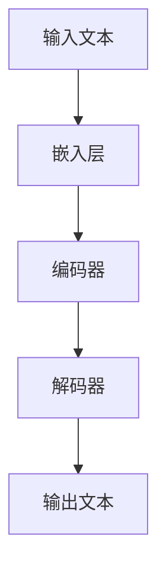

                 

## 《大语言模型原理与工程实践：硬件瓶颈》

> **关键词**：大语言模型、原理、工程实践、硬件瓶颈、加速技术、优化策略

> **摘要**：本文将深入探讨大语言模型的原理与工程实践，特别是针对硬件瓶颈的解决方案。通过分析核心概念、算法原理、数学模型，结合实际项目案例，我们将详细了解如何在大语言模型开发过程中克服硬件限制，提升模型性能。

本文将分为两个主要部分：

1. **大语言模型基础**：介绍大语言模型的基本概念、数学基础和训练优化方法。
2. **大语言模型工程实践**：探讨大语言模型在自然语言处理、多模态学习中的实际应用，以及针对硬件瓶颈的解决方案。

## 第一部分：大语言模型基础

### 第1章：大语言模型概述

#### 1.1 大语言模型的定义与背景

大语言模型（Large Language Model）是一种基于深度学习技术的自然语言处理模型，它通过学习大量的文本数据来预测下一个词或句子，从而生成文本或进行文本分析。大语言模型的出现标志着自然语言处理技术的一个重要里程碑，它使得机器生成文本、理解和生成对话等任务变得更加简单和高效。

大语言模型的发展历程可以追溯到1980年代的统计语言模型，随后经历了神经网络模型的引入和强化学习技术的发展。随着计算能力的提升和海量数据资源的积累，大语言模型逐渐变得庞大且强大，如GPT-3、BERT、Turing-NLG等。

#### 1.2 大语言模型的结构与原理

大语言模型通常由以下几个关键组件构成：

1. **嵌入层（Embedding Layer）**：将输入文本转换为固定长度的向量表示。
2. **编码器（Encoder）**：对嵌入层输出的向量进行编码，提取文本的语义信息。
3. **解码器（Decoder）**：利用编码器的输出生成文本。

下面是一个Mermaid流程图，展示了大语言模型的基本架构：



#### 1.3 大语言模型的关键技术

大语言模型的核心算法原理包括：

- **Transformer架构**：一种基于自注意力机制的神经网络结构，能够高效地处理长序列数据。
- **预训练与微调**：通过在大量未标记数据上预训练模型，然后在小规模标记数据上微调模型，以实现更好的性能。

以下是伪代码，展示了大语言模型的基本训练算法：

```python
# 大语言模型训练伪代码

# 初始化模型参数
model = initialize_model()

# 预处理数据集
data = preprocess_dataset(dataset)

# 模型训练循环
for epoch in range(num_epochs):
    for batch in data_loader(data):
        # 前向传播
        output = model(batch.input_ids)
        # 计算损失
        loss = compute_loss(output, batch.label_ids)
        # 反向传播
        model.backward(loss)
        # 更新模型参数
        model.update_parameters()
```

### 2. 大语言模型的数学基础

#### 2.1 线性代数

线性代数在大语言模型中起着核心作用，主要包括矩阵与向量运算、特征分解和主成分分析（PCA）。

- **矩阵与向量运算**：矩阵乘法和向量点积是深度学习中常见的运算。
- **特征分解**：如奇异值分解（SVD），可以用于降维和噪声消除。
- **主成分分析（PCA）**：通过找到数据的最大方差方向来降低数据维度。

#### 2.2 微积分

微积分在大语言模型中的应用主要体现在梯度下降算法和链式法则。

- **梯度下降算法**：用于模型参数的优化。
- **链式法则**：用于自动微分，计算复合函数的导数。

#### 2.3 概率论与统计

概率论与统计在大语言模型中用于建模不确定性和评估模型性能。

- **贝叶斯定理**：用于概率计算和推理。
- **最大似然估计**：用于模型参数的估计。
- **随机过程**：用于处理序列数据。

### 3. 大语言模型的训练与优化

#### 3.1 训练过程

大语言模型的训练过程包括以下步骤：

- **数据预处理**：清洗和预处理输入数据，将其转换为模型可处理的格式。
- **模型初始化**：初始化模型参数，通常使用随机初始化或预训练模型。
- **训练算法**：使用梯度下降算法等优化方法更新模型参数。

#### 3.2 优化算法

优化算法用于加快模型收敛速度，主要包括以下几种：

- **梯度下降算法**：最简单的优化算法，通过计算梯度并沿着梯度的反方向更新参数。
- **动量法**：在梯度下降算法的基础上引入动量，加快收敛速度。
- **Adam优化器**：结合了梯度的一阶矩估计和二阶矩估计，具有较好的收敛性能。

#### 3.3 超参数调优

超参数调优是模型优化过程中的重要环节，包括以下几种策略：

- **学习率调度**：动态调整学习率，以避免过拟合或欠拟合。
- **正则化方法**：如L1正则化、L2正则化，用于防止过拟合。
- **模型选择**：选择合适的模型架构和参数，以实现最佳性能。

### 4. 大语言模型的存储与加速

#### 4.1 模型压缩

模型压缩是解决大语言模型存储和部署问题的关键，主要包括以下几种方法：

- **知识蒸馏**：将一个大模型的知识传递给一个小模型。
- **参数剪枝**：通过删除不重要的模型参数来减少模型大小。
- **稀疏性**：利用稀疏矩阵来表示模型参数，减少存储和计算需求。

#### 4.2 GPU加速

GPU加速是提升大语言模型计算性能的重要手段，主要包括以下几种技术：

- **CUDA编程基础**：使用CUDA进行并行计算。
- **矩阵运算的GPU优化**：如矩阵乘法、矩阵加法等。
- **张量核心编程**：利用GPU的张量核心进行高效计算。

#### 4.3 DPU与其他加速器

DPU（Data Processing Unit）是一种专门为数据处理设计的处理器，具有以下优势：

- **DPU的概念与优势**：DPU的基本概念及其在深度学习中的优势。
- **DPU在深度学习中的应用**：DPU在深度学习任务中的应用案例。
- **DPU与GPU的协同加速**：DPU与GPU的协同工作，以实现更高的计算性能。

## 第二部分：大语言模型工程实践

### 第5章：大语言模型的部署与推理

#### 5.1 部署策略

大语言模型的部署涉及以下步骤：

- **部署前准备**：确定部署环境、配置硬件资源等。
- **部署环境搭建**：搭建适合模型运行的部署环境。
- **部署流程**：模型部署的具体步骤和注意事项。

#### 5.2 推理优化

推理优化是提升大语言模型性能的关键，主要包括以下几种策略：

- **推理加速技术**：如量化、模型剪枝等。
- **推理策略**：如并行推理、分布式推理等。
- **推理性能优化**：如内存优化、缓存优化等。

#### 5.3 模型监控与维护

模型监控与维护是确保大语言模型稳定运行的重要环节，主要包括以下方面：

- **模型性能监控**：监控模型在部署环境中的性能指标。
- **模型更新策略**：定期更新模型，以适应新的数据和应用场景。
- **模型安全性与隐私保护**：确保模型安全运行，保护用户隐私。

### 第6章：大语言模型在自然语言处理中的应用

#### 6.1 文本分类

文本分类是将文本数据按照特定的类别进行分类的任务。主要包括以下步骤：

- **文本预处理**：对输入文本进行清洗、分词、去停用词等处理。
- **分类模型的选择**：选择合适的分类算法，如朴素贝叶斯、支持向量机等。
- **分类模型的实现与评估**：实现分类模型，并评估其性能。

#### 6.2 文本生成

文本生成是将给定文本生成扩展或生成新文本的任务。主要包括以下步骤：

- **文本生成模型的基本原理**：如序列到序列模型、变分自编码器等。
- **生成模型的实现与优化**：实现文本生成模型，并进行优化。
- **文本生成的实际应用场景**：如聊天机器人、文章生成等。

#### 6.3 问答系统

问答系统是一种基于用户输入提供答案的智能交互系统。主要包括以下步骤：

- **问答系统的基本架构**：如前端输入处理、后端查询处理等。
- **知识图谱的构建**：构建用于查询的知识图谱。
- **问答系统的实现与优化**：实现问答系统，并进行性能优化。

### 第7章：大语言模型在多模态学习中的应用

#### 7.1 多模态数据集的构建

多模态学习是将不同类型的数据（如文本、图像、音频）进行融合和共同学习的任务。主要包括以下步骤：

- **图像数据的预处理**：对输入图像进行缩放、裁剪、增强等处理。
- **文本数据的预处理**：对输入文本进行清洗、分词、去停用词等处理。
- **多模态数据的融合策略**：如特征融合、模型融合等。

#### 7.2 多模态模型的训练与优化

多模态模型的训练与优化主要包括以下方面：

- **多模态特征提取**：提取不同模态的特征，并进行融合。
- **多模态融合算法**：如多任务学习、多模态注意力机制等。
- **多模态模型的训练与优化**：实现多模态模型，并进行性能优化。

#### 7.3 多模态学习在实际应用中的案例

多模态学习在实际应用中具有广泛的应用前景，主要包括以下案例：

- **图像识别与文本描述的协同**：将图像识别与文本描述相结合，提高识别准确率。
- **视频分析与文本摘要**：将视频分析与文本摘要相结合，实现高效的信息提取。
- **跨媒体推荐系统**：基于多模态数据构建跨媒体推荐系统，提高推荐准确性。

### 第8章：大语言模型在硬件瓶颈中的解决方案

#### 8.1 硬件瓶颈的原因分析

硬件瓶颈是影响大语言模型性能的重要因素，主要包括以下原因：

- **计算资源限制**：模型计算复杂度高，导致计算资源不足。
- **数据传输瓶颈**：数据传输速度慢，影响模型推理速度。
- **系统响应时间**：系统响应时间长，影响用户体验。

#### 8.2 硬件加速技术的应用

硬件加速技术是解决硬件瓶颈的有效手段，主要包括以下方面：

- **GPU加速**：利用GPU进行并行计算，提高模型性能。
- **DPU加速**：利用DPU进行数据预处理和传输加速。
- **FPGA加速**：利用FPGA进行定制化硬件加速。

#### 8.3 硬件优化策略

硬件优化策略主要包括以下方面：

- **计算资源的动态调度**：根据任务负载动态调整计算资源。
- **数据传输优化**：优化数据传输路径和协议，提高传输速度。
- **系统响应时间优化**：通过优化算法和硬件调度策略，减少系统响应时间。

### 附录

#### 附录 A：开发工具与资源

附录A将介绍大语言模型开发所需的主要工具和资源，包括：

- **主流深度学习框架对比**：如TensorFlow、PyTorch、MXNet等。
- **硬件加速器选择**：如GPU、DPU、FPGA等。
- **开发资源推荐**：包括书籍、论文、在线课程等。

#### 附录 B：代码示例与解读

附录B将提供一些大语言模型开发的代码示例和解读，包括：

- **文本分类模型的实现与解读**：展示文本分类模型的代码实现和解释。
- **文本生成模型的实现与解读**：展示文本生成模型的代码实现和解释。
- **问答系统的实现与解读**：展示问答系统的代码实现和解释。

### 总结

本文全面介绍了大语言模型的原理与工程实践，特别针对硬件瓶颈的解决方案进行了深入探讨。通过分析核心概念、算法原理、数学模型，结合实际项目案例，读者可以系统地了解大语言模型的基本原理和工程实践方法。附录部分提供了丰富的开发工具和资源，以及代码示例与解读，有助于读者实际操作和深入学习。

作者：AI天才研究院/AI Genius Institute & 禅与计算机程序设计艺术 /Zen And The Art of Computer Programming

以上就是《大语言模型原理与工程实践：硬件瓶颈》这篇文章的正文部分。在接下来的章节中，我们将对每个部分进行详细讲解，帮助读者全面理解大语言模型的原理与应用。

---

请注意，本文提供的章节内容为大纲和概要，实际撰写时需要根据大纲详细填充每个章节的内容，包括具体的算法描述、流程图、代码示例和详细解释等。确保每个章节的内容丰富、具体，并且能够帮助读者深入理解大语言模型的原理和工程实践。此外，文章的字数需要大于8000字，以确保内容的完整性和深度。在撰写过程中，请遵循格式要求，使用markdown格式，并确保数学公式和伪代码的格式正确。

