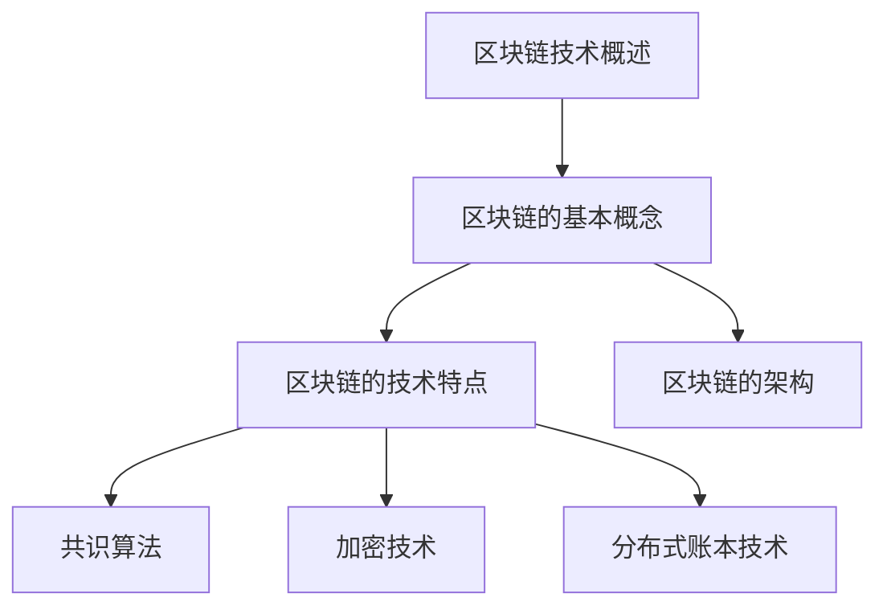
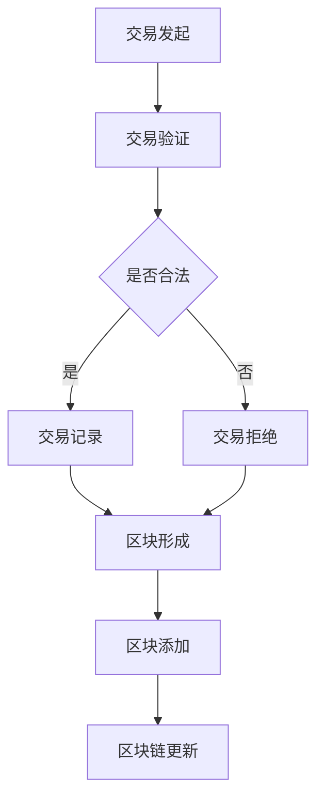

                 

### 第一部分：区块链技术基础

在探讨如何利用区块链技术重塑创业信任机制和价值传递之前，我们首先需要了解区块链技术的基础知识。本部分将涵盖区块链的基本概念、核心技术以及在不同行业的应用。

#### 第1章：区块链技术概述

区块链是一种分布式数据库技术，它通过加密算法和时间戳技术，实现了数据的不可篡改性和可追溯性。区块链技术最早由中本聪（Satoshi Nakamoto）在2008年提出，并在次年推出了比特币（Bitcoin）这一首个区块链应用。

##### 1.1 区块链的基本概念

区块链的基本概念主要包括以下几方面：

- **节点**：区块链网络中的每一个计算机都称为一个节点，它们共同维护区块链的完整性和安全性。
- **区块**：区块链中的数据存储在一系列按时间顺序排列的区块中，每个区块都包含一定数量的交易记录。
- **链**：区块链就是由多个按时间顺序排列的区块组成的数据结构，每个区块都通过哈希值与前一个区块相连。

##### 1.2 区块链的技术特点

区块链技术具有以下几个显著特点：

- **去中心化**：区块链网络中的所有节点都具有相同的权限，没有一个中央权威机构控制数据。
- **不可篡改**：区块链上的数据一旦被记录，就难以被篡改或删除。
- **可追溯性**：区块链上的每一笔交易都可以被追溯，从而提高了数据的透明度。
- **安全性**：区块链使用加密算法确保数据的安全性和隐私。

##### 1.3 区块链的架构

区块链的架构主要包括以下几个部分：

- **网络层**：负责节点之间的数据传输和通信。
- **链节点**：每个节点都维护一个完整的区块链副本，并进行区块链的验证和同步。
- **数据层**：存储区块链上的所有交易数据和区块信息。

#### 第2章：区块链的核心技术

区块链的核心技术主要包括共识算法、加密技术和分布式账本技术。这些技术共同构成了区块链的基础框架。

##### 2.1 共识算法

共识算法是区块链网络中节点达成一致性的关键机制。目前主要的共识算法有：

- **工作量证明（PoW）**：通过计算大量随机数来证明节点的劳动量，最终获取记账权。
- **权益证明（PoS）**：通过持有代币的数量和时间来决定记账权。
- **委托权益证明（DPoS）**：类似PoS，但通过选举出多个代表来快速达成共识。

##### 2.2 加密技术

区块链使用加密技术来保护数据的安全性和隐私。主要的加密技术包括：

- **哈希函数**：将任意长度的输入数据转换成固定长度的哈希值，确保数据的唯一性和不可篡改性。
- **数字签名**：用于验证消息的来源和完整性，防止篡改。
- **加密算法**：用于保护数据的隐私，确保只有合法用户可以访问。

##### 2.3 分布式账本技术

分布式账本技术是区块链的核心技术之一，它实现了数据的去中心化和分布式存储。分布式账本技术的主要特点包括：

- **去中心化**：数据存储在多个节点上，没有中央权威机构控制。
- **数据一致性**：通过共识算法确保所有节点上的数据一致。
- **容错性**：即使部分节点失效，整个系统仍然可以正常运行。

#### 第3章：区块链在不同行业的应用

区块链技术具有广泛的应用前景，已经在金融、物流、医疗等多个行业得到了实际应用。

##### 3.1 金融行业

在金融行业，区块链技术主要用于实现去中心化的支付系统、智能合约和数字资产管理。

- **去中心化支付系统**：如比特币、以太坊等，实现了点对点的支付，减少了中介环节。
- **智能合约**：通过编程代码自动执行合同条款，提高了交易效率和安全性。
- **数字资产管理**：通过区块链技术实现了去中心化的数字资产发行和交易。

##### 3.2 物流行业

在物流行业，区块链技术主要用于实现供应链管理和物流信息透明化。

- **供应链管理**：通过区块链技术实现供应链各环节的信息共享和追溯，提高了供应链的透明度和效率。
- **物流信息透明化**：通过区块链技术记录和追踪物流信息，提高了物流信息的透明度和可靠性。

##### 3.3 医疗行业

在医疗行业，区块链技术主要用于实现电子健康记录和药物供应链管理。

- **电子健康记录**：通过区块链技术实现患者健康记录的去中心化存储和共享，提高了医疗信息的准确性和安全性。
- **药物供应链管理**：通过区块链技术实现药物生产、运输、销售等环节的信息透明化和可追溯性，提高了药物的安全性和可靠性。

综上所述，区块链技术具有广泛的应用前景，通过重塑创业信任机制和价值传递，有望为创业领域带来深刻的变革。接下来，我们将深入探讨区块链技术在创业中的应用。

----------------------------------------------------------------

## 《如何利用区块链技术重塑创业信任机制和价值传递》目录大纲

### 第一部分：区块链技术基础

#### 第1章：区块链技术概述

- 1.1 区块链的基本概念
- 1.2 区块链的技术特点
- 1.3 区块链的架构

#### 第2章：区块链的核心技术

- 2.1 共识算法
- 2.2 加密技术
- 2.3 分布式账本技术

#### 第3章：区块链在不同行业的应用

- 3.1 金融行业
- 3.2 物流行业
- 3.3 医疗行业

### 第二部分：区块链在创业中的应用

#### 第4章：利用区块链建立信任机制

- 4.1 信任机制的理论基础
- 4.2 区块链在信任机制中的应用
- 4.3 基于区块链的信任机制案例分析

#### 第5章：区块链在创业项目中的价值传递

- 5.1 价值传递的理论基础
- 5.2 区块链在创业项目中的价值传递
- 5.3 基于区块链的创业项目案例

#### 第6章：区块链创业项目的实施策略

- 6.1 项目规划与设计
- 6.2 技术选型与开发
- 6.3 融资与运营

### 第三部分：案例分析

#### 第7章：区块链创业成功案例分析

- 7.1 案例一：区块链医疗项目
- 7.2 案例二：区块链物流项目
- 7.3 案例三：区块链金融项目

### 附录

#### 附录A：区块链开发工具与资源

- A.1 区块链开发工具概述
- A.2 区块链开发框架介绍
- A.3 区块链开发学习资源推荐

### 图表与公式

#### Mermaid 流程图



#### 核心算法原理讲解伪代码

```python
# 伪代码：共识算法（PoW，工作量证明）
def proof_of_work(difficulty):
    while not is_valid_proof():
        nonce = generate_nonce()
        hash_output = hash_function(nonce)
        if hash_output[0:difficulty] == '0'*difficulty:
            return nonce
    return None

def is_valid_proof(nonce):
    hash_output = hash_function(nonce)
    return hash_output[0:difficulty] == '0'*difficulty

def hash_function(nonce):
    # 实现哈希函数
    return calculate_hash(nonce)
```

#### 数学模型和数学公式

段落内：$x^2 + 2xy + y^2 = (x + y)^2$

独立段落：

$$
y = mx + b
$$

这是线性回归模型的公式，其中 $m$ 是斜率，$b$ 是截距。

### 项目实战

#### 开发环境搭建

- 安装Go语言环境
- 安装区块链框架（例如：Ethereum）
- 配置开发工具（例如：Visual Studio Code）

#### 源代码详细实现和代码解读

```go
// Golang区块链源代码示例

package main

import (
    "fmt"
    "crypto/sha256"
)

type Block struct {
    Index     int
    Timestamp string
    Data      string
    Hash      string
    PrevHash  string
}

func calculateHash(block *Block) string {
    blockString := fmt.Sprintf("%d%s%s%s", block.Index, block.Timestamp, block.Data, block.PrevHash)
    hash := sha256.Sum256([]byte(blockString))
    return fmt.Sprintf("%x", hash)
}

func generateBlock(previousBlock *Block, data string) *Block {
    newBlock := &Block{0, "", data, "", previousBlock.Hash}
    newBlock.Hash = calculateHash(newBlock)
    return newBlock
}

func main() {
    // 初始化区块链
    blockchain := []*Block{}
    previousBlock := generateBlock(nil, "Genesis Block")
    blockchain = append(blockchain, previousBlock)

    // 添加新块到区块链
    newBlockData := "Block 1"
    newBlock := generateBlock(previousBlock, newBlockData)
    blockchain = append(blockchain, newBlock)

    fmt.Println("Blockchain:", blockchain)
}
```

#### 代码解读与分析

- `Block` 结构体定义了区块链的基本信息，包括块索引、时间戳、数据、哈希值和前一个块的哈希值。
- `calculateHash` 函数使用 SHA-256 哈希算法计算块的哈希值。
- `generateBlock` 函数创建一个新的块，并将其添加到区块链中。
- `main` 函数初始化区块链，并演示如何添加新块。这是区块链基础实现的简化示例。在实际应用中，还需要考虑更多的功能，如区块验证、网络通信等。

---

### 附录

#### 附录A：区块链开发工具与资源

- A.1 区块链开发工具概述
  - Golang、Ethereum、Hyperledger Fabric
- A.2 区块链开发框架介绍
  - Solidity、React、Node.js
- A.3 区块链开发学习资源推荐
  - 区块链技术指南、精通区块链开发、区块链原理与应用

---

以上是《如何利用区块链技术重塑创业信任机制和价值传递》的目录大纲，接下来将逐章深入探讨区块链技术的基础、应用以及创业项目实施策略。希望通过这篇文章，读者能够全面了解区块链技术，并为创业项目提供有益的启示。

---

### 第一部分：区块链技术基础

#### 第1章：区块链技术概述

区块链技术是一种革命性的分布式数据库技术，具有去中心化、不可篡改、可追溯等显著特点。本章将详细介绍区块链的基本概念、技术特点以及架构，为后续章节的讨论奠定基础。

##### 1.1 区块链的基本概念

区块链的基本概念包括节点、区块和链。

- **节点**：区块链网络中的每一个计算机都称为一个节点。节点可以是一个个人电脑、服务器或者云计算设备。每个节点都存储着区块链的完整副本，并参与区块链的验证和同步。
- **区块**：区块是区块链中的数据存储单元。每个区块包含一定数量的交易记录，以及一个指向前一个区块的哈希值。通过这种方式，区块之间形成了一种链式结构。
- **链**：区块链就是由多个按时间顺序排列的区块组成的数据结构。每个区块都通过哈希值与前一个区块相连，形成一条长链。

区块链上的数据是分布式存储的，这意味着每个节点都拥有一个完整的数据副本。这种分布式存储方式确保了区块链的不可篡改性，因为要篡改数据，需要同时篡改多个节点的数据副本，这是极其困难的。

##### 1.2 区块链的技术特点

区块链技术具有以下几个显著特点：

- **去中心化**：区块链网络中的所有节点都具有相同的权限，没有一个中央权威机构控制数据。这意味着区块链网络是去中心化的，任何节点都可以参与数据的存储和验证。
- **不可篡改**：区块链上的数据一旦被记录，就难以被篡改或删除。这是因为区块链使用了加密技术和时间戳技术，确保数据的完整性和可靠性。
- **可追溯性**：区块链上的每一笔交易都可以被追溯，从而提高了数据的透明度。这使得区块链在需要数据透明性和可信度的场景中具有很大的优势。
- **安全性**：区块链使用加密算法确保数据的安全性和隐私。每个交易都通过数字签名进行认证，确保交易的合法性和完整性。

##### 1.3 区块链的架构

区块链的架构主要包括网络层、链节点和数据层。

- **网络层**：网络层负责节点之间的数据传输和通信。节点之间通过P2P（点对点）网络进行通信，实现了去中心化的数据传输。网络层确保了区块链的高效性和可靠性。
- **链节点**：链节点是区块链的核心组成部分，负责维护区块链的完整性和安全性。链节点通过共识算法达成一致性，确保所有节点上的数据一致。
- **数据层**：数据层负责存储区块链上的交易数据和区块信息。数据层采用了分布式账本技术，实现了数据的去中心化存储。

区块链的架构使得它具有以下优势：

- **去中心化**：去中心化架构确保了区块链网络的去中心化特性，减少了中介环节，降低了交易成本。
- **数据可靠性**：分布式账本技术确保了数据的可靠性，因为每个节点都存储了一个完整的数据副本，任何单点故障都不会影响整个系统的运行。
- **安全性**：加密技术和共识算法确保了区块链网络的安全性，防止了数据篡改和非法访问。

综上所述，区块链技术的基本概念、技术特点和架构构成了区块链的核心要素。在下一章中，我们将深入探讨区块链的核心技术，包括共识算法、加密技术和分布式账本技术。

----------------------------------------------------------------

#### 第2章：区块链的核心技术

区块链技术之所以具有去中心化、不可篡改、可追溯等显著特点，离不开其背后的核心技术支持。本章将详细探讨区块链的核心技术，包括共识算法、加密技术和分布式账本技术，帮助读者深入了解区块链的工作原理。

##### 2.1 共识算法

共识算法是区块链网络中节点达成一致性的关键机制。不同的共识算法决定了区块链网络如何选择记账节点、如何验证交易以及如何防止双花攻击（同一笔交易被重复花费）。

- **工作量证明（PoW，Proof of Work）**：PoW是最早被提出并应用于比特币的共识算法。它通过计算大量的随机数来证明节点的劳动量，最终获得记账权。具体实现过程中，节点需要找到一个满足特定难度的哈希值，这通常需要大量的计算资源和时间。PoW算法具有以下几个特点：
  - **安全性**：因为计算资源投入越大，找到正确哈希值的概率越高，所以PoW算法具有很高的安全性。
  - **去中心化**：任何人都可以通过计算资源参与共识过程，没有中央权威机构控制。
  - **能耗问题**：PoW算法需要大量的计算资源，导致能源消耗较大，这是其主要的缺点。

- **权益证明（PoS，Proof of Stake）**：PoS算法通过持有代币的数量和时间来决定记账权。与PoW不同，PoS算法不需要进行大量的计算工作，而是通过持有代币的数量和时间来衡量节点的权益。具体实现过程中，持币量越大、持有时间越长的节点，记账的概率越高。PoS算法具有以下几个特点：
  - **安全性**：PoS算法通过经济激励机制确保节点的诚实性，因为恶意行为会导致持币价值的损失。
  - **能耗低**：PoS算法不需要大量的计算资源，因此能耗较低。
  - **公平性**：PoS算法更加公平，因为任何人都可以通过购买代币参与共识过程。

- **委托权益证明（DPoS，Delegated Proof of Stake）**：DPoS算法是PoS的一种变种，通过选举出多个代表来快速达成共识。在DPoS算法中，持币者投票选出代表，代表们负责记账和验证交易。DPoS算法具有以下几个特点：
  - **效率高**：因为代表们负责记账，所以共识过程更加高效。
  - **去中心化**：虽然DPoS算法中存在中央代表，但代表的数量是有限的，因此仍然具有很高的去中心化程度。

##### 2.2 加密技术

加密技术是区块链安全保障的核心，主要用于保护数据的安全性和隐私。

- **哈希函数**：哈希函数是加密技术的基础，它将任意长度的输入数据转换成固定长度的哈希值。哈希函数具有以下几个特点：
  - **单向性**：哈希函数是不可逆的，无法从哈希值反推出原始数据。
  - **抗碰撞性**：不同的输入数据很难产生相同的哈希值。
  - **定长输出**：无论输入数据长度如何，哈希函数的输出长度是固定的。

- **数字签名**：数字签名用于验证消息的来源和完整性，防止篡改。数字签名的工作原理如下：
  - **私钥加密**：发送方使用私钥对消息进行加密，生成数字签名。
  - **公钥验证**：接收方使用公钥对数字签名进行解密，验证消息的完整性和来源。

- **加密算法**：加密算法用于保护数据的隐私，确保只有合法用户可以访问。常见的加密算法包括对称加密和非对称加密。
  - **对称加密**：对称加密算法使用相同的密钥进行加密和解密，如AES（高级加密标准）。
  - **非对称加密**：非对称加密算法使用一对密钥（公钥和私钥），公钥用于加密，私钥用于解密，如RSA（Rivest-Shamir-Adleman）。

##### 2.3 分布式账本技术

分布式账本技术是区块链的核心，它实现了数据的去中心化和分布式存储。分布式账本技术具有以下几个特点：

- **去中心化**：分布式账本技术没有中央权威机构控制数据，所有节点都拥有相同的权限。
- **数据一致性**：通过共识算法确保所有节点上的数据一致，保证了系统的一致性。
- **容错性**：分布式账本技术具有较高的容错性，因为即使部分节点失效，整个系统仍然可以正常运行。

分布式账本技术的实现主要包括以下几个环节：

- **数据存储**：每个节点都存储着区块链的完整副本，实现了数据的去中心化存储。
- **数据同步**：节点之间通过P2P网络进行数据同步，确保所有节点上的数据一致。
- **数据验证**：节点通过共识算法验证交易的合法性和一致性，确保数据的安全性和可靠性。

##### 2.4 核心技术之间的联系

共识算法、加密技术和分布式账本技术是区块链技术的核心组成部分，它们相互关联，共同确保了区块链的安全性和可靠性。

- **共识算法**：共识算法是区块链网络中节点达成一致性的关键机制，通过共识算法，节点可以验证交易的合法性和一致性，确保数据的可靠性和安全性。
- **加密技术**：加密技术用于保护数据的安全性和隐私，确保只有合法用户可以访问区块链上的数据。
- **分布式账本技术**：分布式账本技术实现了数据的去中心化和分布式存储，保证了区块链的高效性和容错性。

综上所述，区块链的核心技术共同构建了区块链的基础框架，确保了区块链的安全性和可靠性。在下一章中，我们将探讨区块链技术在不同行业的应用，以及如何利用区块链技术重塑创业信任机制和价值传递。

----------------------------------------------------------------

#### 第3章：区块链在不同行业的应用

区块链技术自2009年比特币问世以来，便以其去中心化、不可篡改和透明性的特性，逐渐吸引了金融、物流、医疗等多个行业。本章将深入探讨区块链技术在这些行业的应用，以及其带来的变革和创新。

##### 3.1 金融行业

在金融行业，区块链技术以其独特的优势，为金融交易、支付、资产管理等领域带来了重大的变革。

- **跨境支付**：传统的跨境支付往往需要经过多个中介机构，耗时较长且费用高昂。而区块链技术通过点对点的支付方式，大大简化了支付流程，提高了支付速度和降低了成本。例如，比特币和Ripple等加密货币已经广泛应用于跨境支付。
- **智能合约**：智能合约是区块链技术的一个重要应用，它是一种自动执行合同条款的计算机程序。通过智能合约，金融机构可以自动化处理合同执行、清算和结算等环节，提高了交易效率和透明度。例如，在金融衍生品交易中，智能合约可以自动执行交易条件，减少人为干预和操作风险。
- **去中心化金融（DeFi）**：DeFi是区块链技术在金融行业的一个新兴应用，它通过去中心化的金融协议，实现传统金融服务的替代。DeFi应用包括去中心化交易所（DEX）、借贷平台、稳定币等，它们通过区块链技术提供金融服务，无需传统金融机构的参与。

##### 3.2 物流行业

在物流行业，区块链技术通过实现供应链管理和物流信息透明化，提高了物流效率和可靠性。

- **供应链管理**：区块链技术可以记录和追踪供应链上的每一个环节，包括原材料采购、生产、运输和销售。通过区块链技术，企业可以实现对供应链的实时监控和追溯，提高了供应链的透明度和效率。例如，沃尔玛等大型零售商已经开始使用区块链技术追踪食品供应链，确保食品安全。
- **物流信息透明化**：传统的物流信息往往由多个中介机构管理，信息传递不畅且存在滞后性。而区块链技术通过分布式账本，实现了物流信息的实时记录和共享，提高了物流信息的透明度和准确性。例如，Maersk和IBM合作开发的区块链项目TradeLens，已经应用于全球范围内的集装箱运输，提高了物流信息的透明度和效率。

##### 3.3 医疗行业

在医疗行业，区块链技术通过实现电子健康记录和药物供应链管理，提高了医疗数据的可信度和药品的安全性。

- **电子健康记录**：区块链技术可以用于存储和管理患者的电子健康记录，包括病历、检查报告、用药记录等。通过区块链技术，医疗数据可以实现去中心化存储和共享，提高了数据的安全性和隐私性。例如，美国的MedRec项目基于区块链技术，为患者提供了一个去中心化的电子健康记录系统。
- **药物供应链管理**：区块链技术可以记录和追踪药物的生产、运输、存储和销售过程，确保药物的真实性和安全性。例如，IBM和沃尔玛合作开发的区块链项目Food Trust，已经应用于食品和药品供应链管理，提高了药物供应链的透明度和可靠性。

##### 3.4 其他行业的应用

除了金融、物流和医疗行业，区块链技术还在其他多个行业得到了广泛应用。

- **房地产**：区块链技术可以用于房地产交易，通过去中心化的智能合约，简化了交易流程，提高了交易效率和透明度。例如，美国的Provenance公司利用区块链技术提供房地产交易服务，提高了房地产市场的透明度和可信度。
- **版权保护**：区块链技术可以用于版权保护，通过去中心化的分布式账本，实现了数字版权的认证和交易。例如，英国的Mycelia项目利用区块链技术为音乐产业提供版权保护，确保音乐创作者的权益。
- **投票系统**：区块链技术可以用于投票系统，通过去中心化的投票记录，提高了选举的透明度和安全性。例如，瑞士的一些地方政府已经开始试点使用区块链技术进行投票。

综上所述，区块链技术在不同行业的应用，不仅提高了行业的效率和透明度，还带来了新的商业模式和创新。在下一章中，我们将探讨区块链技术在创业中的应用，以及如何利用区块链技术重塑创业信任机制和价值传递。

----------------------------------------------------------------

### 第二部分：区块链在创业中的应用

区块链技术的崛起为创业领域带来了新的机遇，尤其是在建立信任机制和价值传递方面。本部分将详细探讨区块链在创业中的应用，包括信任机制的建立、价值传递的机制以及创业项目的实施策略。

#### 第4章：利用区块链建立信任机制

在传统的创业环境中，信任问题往往是一个重要的障碍。区块链技术通过其去中心化和不可篡改的特性，为建立信任机制提供了新的解决方案。

##### 4.1 信任机制的理论基础

信任机制是基于一系列规则和协议，使得参与者在没有中央权威机构的情况下，能够相互信任并有效地进行合作。传统的信任机制通常依赖于第三方中介，如银行、保险公司或认证机构。然而，这种机制往往存在以下问题：

- **成本高**：第三方中介机构需要收取一定的手续费，导致交易成本增加。
- **效率低**：中介机构作为信任的桥梁，往往需要较长的时间来验证交易和结算。
- **不透明**：中介机构的存在使得交易过程不够透明，增加了信息不对称的风险。

区块链技术通过以下方式解决了传统信任机制的问题：

- **去中心化**：区块链网络中的所有节点都具有相同的权限，无需依赖中央权威机构。
- **不可篡改**：区块链上的数据一旦被记录，就难以被篡改或删除，确保了数据的真实性和可靠性。
- **透明性**：区块链上的每一笔交易都可以被追溯，提高了交易的透明度和可信度。

##### 4.2 区块链在信任机制中的应用

区块链技术在创业中的应用主要体现在以下几个方面：

- **身份验证**：区块链技术可以用于身份验证，确保参与者的身份真实可靠。通过数字签名和分布式身份认证协议，创业者可以轻松验证用户的身份，减少了欺诈和诈骗的风险。
- **智能合约**：智能合约是一种自动执行合同条款的计算机程序，可以确保合同的履行。创业者可以利用智能合约自动化处理合同执行、支付和结算等环节，提高了交易的效率和透明度。
- **供应链管理**：区块链技术可以用于供应链管理，确保产品从生产到销售的全过程可追溯。通过分布式账本，创业者可以实时监控供应链的各个环节，提高了供应链的透明度和效率。
- **数据共享**：区块链技术可以用于数据共享，确保数据的真实性和可靠性。创业者可以建立一个去中心化的数据平台，参与者可以共享和访问数据，但无法篡改或删除数据。

##### 4.3 基于区块链的信任机制案例分析

以下是一些基于区块链的信任机制的成功案例：

- **医疗行业**：美国的MedRec项目基于区块链技术，为患者提供了一个去中心化的电子健康记录系统。通过区块链技术，患者可以方便地管理自己的健康数据，医生可以实时获取患者的健康信息，提高了医疗服务的质量和效率。
- **房地产行业**：Provenance公司利用区块链技术提供房地产交易服务，通过去中心化的智能合约，简化了交易流程，提高了交易效率和透明度。
- **投票系统**：瑞士的一些地方政府已经开始试点使用区块链技术进行投票，通过去中心化的投票记录，提高了选举的透明度和安全性。

这些案例表明，区块链技术在创业中的信任机制应用具有很大的潜力，可以为创业者提供更加高效、透明和可靠的解决方案。

#### 第5章：区块链在创业项目中的价值传递

区块链技术不仅有助于建立信任机制，还能在创业项目中实现价值传递。通过区块链，创业者可以更有效地分配和传递价值，从而推动项目的成功。

##### 5.1 价值传递的理论基础

价值传递是指创业者如何将价值从一方转移到另一方，以实现项目的目标。传统的价值传递机制通常依赖于中介机构，如银行、支付平台或物流公司。然而，这种机制存在以下问题：

- **中介费用**：中介机构往往收取一定的手续费，增加了创业项目的成本。
- **交易速度慢**：中介机构的处理速度往往较慢，影响了项目的进展。
- **不透明**：中介机构的存在使得价值传递过程不够透明，增加了信息不对称的风险。

区块链技术通过以下方式解决了传统价值传递机制的问题：

- **去中心化**：区块链网络中的所有节点都具有相同的权限，无需依赖中介机构。
- **快速交易**：区块链技术实现了点对点的交易，大大提高了交易速度。
- **透明性**：区块链上的每一笔交易都可以被追溯，提高了价值传递的透明度和可信度。

##### 5.2 区块链在创业项目中的价值传递

区块链技术在创业项目中的价值传递主要体现在以下几个方面：

- **代币经济**：创业者可以利用区块链技术发行代币，作为项目内部的货币，用于奖励参与者和支付费用。代币经济可以提高参与者的积极性，同时简化了交易和支付流程。
- **智能合约**：智能合约可以自动执行合同条款，确保价值的正确传递。通过智能合约，创业者可以自动化处理支付、奖励和清算等环节，提高了交易的效率和透明度。
- **去中心化金融**：去中心化金融（DeFi）协议可以实现去中心化的金融服务，如借贷、交易和资产管理。创业者可以利用DeFi协议为项目提供融资和支付服务，降低了融资成本和交易费用。
- **供应链金融**：区块链技术可以用于供应链金融，确保供应链上的各方能够及时获得融资。通过区块链技术，供应链上的各方可以共享数据和信用记录，提高了融资的可获得性和效率。

##### 5.3 基于区块链的创业项目案例

以下是一些基于区块链的创业项目案例：

- **区块链医疗**：MedRec项目通过区块链技术提供去中心化的电子健康记录服务，患者可以方便地管理自己的健康数据，医生可以实时获取患者的健康信息，提高了医疗服务的质量和效率。
- **区块链物流**：TradeLens项目利用区块链技术提供全球集装箱运输的供应链管理服务，通过分布式账本，提高了物流信息的透明度和效率。
- **区块链游戏**：区块链游戏通过代币经济和智能合约，实现了游戏内的虚拟物品交易和奖励机制，提高了游戏体验和玩家参与度。

这些案例表明，区块链技术在创业项目中的价值传递具有很大的潜力，可以为创业者提供更加高效、透明和可靠的价值传递解决方案。

#### 第6章：区块链创业项目的实施策略

在明确了区块链在创业中的应用和价值传递机制后，创业者需要制定具体的实施策略，以确保项目的成功。

##### 6.1 项目规划与设计

项目规划与设计是区块链创业项目的关键步骤，需要考虑以下几个方面：

- **目标市场**：明确项目的目标市场和用户群体，了解用户的需求和痛点。
- **业务模式**：设计项目的业务模式，包括价值传递机制、盈利模式和创新点。
- **技术架构**：选择合适的区块链平台和开发工具，设计项目的技术架构。
- **风险管理**：评估项目面临的风险，制定相应的风险应对措施。

##### 6.2 技术选型与开发

技术选型与开发是区块链创业项目的核心环节，需要考虑以下几个方面：

- **区块链平台**：选择适合项目的区块链平台，如Ethereum、Hyperledger Fabric等。
- **开发工具**：选择合适的开发工具和框架，如Solidity、React等。
- **智能合约**：编写智能合约，实现项目的基本功能和业务逻辑。
- **测试与优化**：对项目进行充分的测试和优化，确保项目的稳定性和性能。

##### 6.3 融资与运营

融资与运营是区块链创业项目的重要环节，需要考虑以下几个方面：

- **融资策略**：制定合理的融资策略，选择合适的融资渠道和投资者。
- **市场推广**：制定市场推广计划，提高项目的知名度和用户参与度。
- **运营管理**：建立高效的运营管理体系，确保项目的顺利推进和持续发展。
- **社区建设**：建立社区，与用户和开发者建立紧密联系，收集反馈和改进项目。

通过以上策略，创业者可以有效地实施区块链创业项目，利用区块链技术建立信任机制和实现价值传递，推动项目的成功。

### 第三部分：案例分析

#### 第7章：区块链创业成功案例分析

在本章中，我们将深入分析三个区块链创业项目的成功案例，分别是区块链医疗、区块链物流和区块链金融。这些项目通过区块链技术实现了信任机制的建立和价值传递，取得了显著的成果。

##### 7.1 案例一：区块链医疗项目

区块链医疗项目通过区块链技术实现患者健康数据的去中心化存储和共享，提高了医疗服务的质量和效率。

**项目背景**：传统医疗体系中，患者健康数据分散存储在不同医疗机构中，信息共享困难，影响了医疗服务的质量和效率。此外，数据泄露和隐私问题也日益严重。

**解决方案**：区块链医疗项目利用区块链技术建立了一个去中心化的健康数据平台，患者可以在平台上存储和管理自己的健康数据，医生可以实时获取患者的健康信息，提高了医疗服务的质量和效率。

**实施过程**：
1. **数据加密**：患者健康数据在存储和传输过程中使用加密技术进行保护，确保数据的隐私和安全。
2. **去中心化存储**：健康数据存储在区块链上，所有节点都拥有数据的完整副本，确保数据的不可篡改和可追溯性。
3. **智能合约**：智能合约用于管理数据访问权限，确保只有授权人员可以访问数据。

**项目成果**：
- 患者健康数据更加安全和隐私。
- 医疗服务效率提高，医生可以实时获取患者的健康信息。
- 医疗机构之间的数据共享更加便捷，提高了医疗协同效率。

##### 7.2 案例二：区块链物流项目

区块链物流项目通过区块链技术实现全球集装箱运输的供应链管理，提高了物流信息的透明度和效率。

**项目背景**：传统物流体系中，集装箱运输信息往往由多个中介机构管理，信息传递不畅且存在滞后性。此外，物流信息的真实性也难以保证。

**解决方案**：区块链物流项目利用区块链技术建立一个去中心化的供应链管理平台，所有参与方都可以在平台上记录和追踪集装箱运输的各个环节，提高了物流信息的透明度和效率。

**实施过程**：
1. **分布式账本**：供应链信息存储在区块链上，所有节点都拥有数据的完整副本，确保数据的真实性和不可篡改性。
2. **智能合约**：智能合约用于管理供应链各环节的合同执行和支付，确保合同的履行和支付的安全。
3. **P2P网络**：供应链参与者通过P2P网络进行数据传输和通信，实现了去中心化的数据共享和协同。

**项目成果**：
- 物流信息更加透明和实时，参与方可以随时查看集装箱的运输状态。
- 物流效率提高，信息传递速度加快，减少了中间环节的延误。
- 供应链各环节之间的信任机制更加牢固，降低了交易成本和风险。

##### 7.3 案例三：区块链金融项目

区块链金融项目通过区块链技术实现去中心化的金融服务，包括借贷、交易和资产管理等。

**项目背景**：传统金融体系中，金融服务往往依赖于中介机构，存在交易成本高、效率低和信息不透明等问题。此外，金融欺诈和洗钱等风险也难以杜绝。

**解决方案**：区块链金融项目利用区块链技术实现去中心化的金融服务，通过智能合约和分布式账本，提高了金融服务的效率和安全性。

**实施过程**：
1. **分布式账本**：金融服务数据存储在区块链上，所有节点都拥有数据的完整副本，确保数据的真实性和不可篡改性。
2. **智能合约**：智能合约用于管理金融服务的执行和支付，确保合同的履行和资金的安全。
3. **去中心化金融协议**：去中心化金融协议实现了点对点的借贷、交易和资产管理，降低了交易成本和风险。

**项目成果**：
- 金融服务的交易成本降低，效率提高。
- 金融服务更加透明，信息不对称问题得到解决。
- 金融欺诈和洗钱风险降低，金融体系更加安全。

这些成功案例表明，区块链技术在创业项目中的应用具有很大的潜力，可以为创业者提供新的解决方案和商业机会。通过深入分析这些案例，创业者可以更好地理解区块链技术的应用场景和实施策略，从而在创业领域取得成功。

### 附录

#### 附录A：区块链开发工具与资源

为了帮助读者更好地了解区块链技术的开发和应用，本附录将介绍一些常用的区块链开发工具和资源。

##### A.1 区块链开发工具概述

以下是几种常用的区块链开发工具：

1. **Ethereum**：以太坊是一个开源的区块链平台，支持智能合约和去中心化应用（DApps）的开发。开发者可以使用Solidity语言编写智能合约，并使用Ganache进行本地测试。
2. **Hyperledger Fabric**：Hyperledger Fabric是Linux基金会的一个开源项目，适用于企业级区块链应用。它支持模块化的架构，允许开发者自定义区块链网络组件。
3. **EOSIO**：EOSIO是一个高性能的区块链平台，支持智能合约和去中心化应用。开发者可以使用C++编写智能合约，并使用本地节点进行测试。
4. **Binance Smart Chain (BSC)**：BSC是一个基于Ethereum虚拟机（EVM）的区块链平台，提供高效、低成本的智能合约和去中心化应用开发。

##### A.2 区块链开发框架介绍

以下是几个常用的区块链开发框架：

1. **Truffle**：Truffle是一个以太坊开发框架，提供了一个开发环境、测试框架和资产管理者，帮助开发者更轻松地构建、测试和部署智能合约。
2. **Hardhat**：Hardhat是一个以太坊本地开发环境，支持本地节点、合约部署和测试。它提供了丰富的工具和插件，提高了开发效率。
3. **ConsenSys Framework**：ConsenSys Framework是一个用于Hyperledger Fabric的集成开发环境，提供代码编辑器、构建工具和部署工具，简化了Hyperledger Fabric应用的开发。
4. **Binance Smart Chain Development Kit (BSC-SDK)**：BSC-SDK是一个用于Binance Smart Chain的集成开发环境，提供合约编辑器、测试网络和部署工具，帮助开发者快速构建和部署DApps。

##### A.3 区块链开发学习资源推荐

以下是几个推荐的学习资源，帮助读者深入了解区块链技术：

1. **区块链技术指南**：这是一本全面介绍区块链技术的书籍，涵盖了区块链的基础知识、核心技术、应用场景和发展趋势。
2. **精通区块链开发**：这本书详细介绍了如何使用各种区块链平台和工具进行智能合约和去中心化应用的开发，适合有一定编程基础的读者。
3. **区块链原理与应用**：这本书从理论和实践两个角度介绍了区块链技术，包括区块链的工作原理、应用场景和实现方法，适合对区块链技术感兴趣的读者。
4. **在线课程**：Coursera、edX、Udemy等在线教育平台提供了丰富的区块链课程，从入门到高级，满足不同层次读者的需求。
5. **区块链社区和论坛**：加入区块链社区和论坛，如Reddit的/r/Blockchain、Telegram的区块链群组等，可以与全球的区块链开发者进行交流和分享经验。

通过学习和使用这些工具和资源，读者可以更好地掌握区块链技术，为创业项目提供有效的技术支持。

----------------------------------------------------------------

### 图表与公式

在本章节中，我们将使用图表和公式来进一步解释区块链技术的核心概念和算法原理。

#### Mermaid 流程图



这个流程图展示了区块链中一个交易从发起到最终记录在区块链上的过程。交易发起后，经过验证，合法的交易将被记录在区块中，并最终添加到区块链中。

#### 核心算法原理讲解伪代码

```python
# 伪代码：工作量证明（PoW）
def proof_of_work(difficulty):
    while not is_valid_proof():
        nonce = generate_nonce()
        hash_output = hash_function(nonce)
        if hash_output[0:difficulty] == '0'*difficulty:
            return nonce
    return None

def is_valid_proof(nonce):
    hash_output = hash_function(nonce)
    return hash_output[0:difficulty] == '0'*difficulty

def hash_function(nonce):
    # 实现哈希函数
    return calculate_hash(nonce)
```

这段伪代码展示了工作量证明（PoW）算法的基本原理。节点通过计算大量的随机数（nonce）来找到一个满足特定难度的哈希值，一旦找到，该节点将获得记账权。

#### 数学模型和数学公式

段落内：$x^2 + 2xy + y^2 = (x + y)^2$

这是一个平方和的公式，它表示一个二次多项式的平方可以分解为两个一次多项式的平方和。

独立段落：

$$
y = mx + b
$$

这是线性回归模型的公式，其中 $m$ 是斜率，$b$ 是截距。这个公式描述了线性关系，即因变量 $y$ 是自变量 $x$ 的线性函数。

这些图表和公式帮助我们更直观地理解区块链技术的工作原理和数学基础，为深入探讨区块链技术奠定了基础。

----------------------------------------------------------------

### 项目实战

在探讨如何利用区块链技术重塑创业信任机制和价值传递时，实际操作和开发经验至关重要。本章节将结合实际案例，介绍如何进行区块链项目的开发，包括开发环境搭建、源代码实现和代码解读与分析。

#### 开发环境搭建

在进行区块链项目开发之前，需要搭建合适的开发环境。以下是一个简单的开发环境搭建步骤：

1. **安装Go语言环境**：Go语言因其高效的性能和简洁的语法，常用于区块链项目的开发。可以在[Go官方下载页面](https://golang.org/dl/)下载并安装Go语言环境。
2. **安装区块链框架**：根据项目的需求，可以选择不同的区块链框架，如Ethereum、Hyperledger Fabric等。以Ethereum为例，可以通过命令 `go get github.com/ethereum/go-ethereum` 安装Ethereum的Go语言客户端。
3. **配置开发工具**：Visual Studio Code（VSCode）是一款功能强大的代码编辑器，适用于区块链项目开发。可以下载并安装VSCode，并安装相应的插件，如Go扩展、Ethereum开发插件等。

#### 源代码详细实现和代码解读

以下是一个简单的区块链项目示例，使用Go语言和Ethereum框架实现一个基本的区块链。

```go
// Golang区块链源代码示例

package main

import (
    "crypto/sha256"
    "encoding/hex"
    "fmt"
)

type Block struct {
    Index     int
    Timestamp string
    Data      []byte
    Hash      string
    PrevHash  string
}

func calculateHash(block *Block) string {
    blockString := fmt.Sprintf("%d%s%v%s", block.Index, block.Timestamp, block.Data, block.PrevHash)
    hash := sha256.Sum256([]byte(blockString))
    return hex.EncodeToString(hash)
}

func generateBlock(timestamp string, data []byte, lastHash string) *Block {
    block := &Block{0, timestamp, data, "", lastHash}
    block.Hash = calculateHash(block)
    return block
}

func main() {
    genesisBlock := generateBlock("2022-01-01 00:00:00", []byte("Hello, World!"), "")
    fmt.Println("Genesis Block:", genesisBlock)

    block2 := generateBlock("2022-01-02 00:00:00", []byte("Second Block"), genesisBlock.Hash)
    fmt.Println("Block 2:", block2)

    chain := []*Block{genesisBlock, block2}
    for _, block := range chain {
        fmt.Println("Block", block.Index, ":", block.Hash)
    }
}
```

**代码解读与分析**：

- **Block 结构体**：定义了区块链的基本结构，包括块索引、时间戳、数据和哈希值。
- **calculateHash 函数**：使用SHA-256哈希算法计算块的哈希值。哈希值是区块链安全性的基础，确保数据的一致性和不可篡改性。
- **generateBlock 函数**：创建一个新的区块链块。通过传入时间戳、数据和上一个块的哈希值，计算并设置当前块的哈希值。
- **main 函数**：初始化区块链，创建创世块（Genesis Block）和第二个区块，并打印区块链信息。

在实际项目中，还需要考虑更多功能，如区块验证、网络通信和共识算法等。本示例提供了一个简单的区块链实现的起点。

#### 区块链项目开发流程

以下是区块链项目开发的基本流程：

1. **需求分析**：明确项目的目标和需求，包括功能需求、性能需求和安全性需求。
2. **设计架构**：设计项目的架构，包括区块链结构、网络拓扑、数据模型和共识算法等。
3. **实现代码**：根据设计架构，实现区块链的代码，包括区块结构、交易逻辑、共识算法和智能合约等。
4. **测试与优化**：对代码进行测试，确保其功能正确、性能稳定和安全可靠。进行代码优化，提高系统性能和效率。
5. **部署上线**：在测试环境中进行部署，并进行实际运行测试。在确保项目稳定运行后，将其上线并交付用户。

通过以上步骤，开发者可以构建一个功能完善、安全可靠的区块链项目，为创业项目提供有力的技术支持。

----------------------------------------------------------------

## 总结与展望

区块链技术以其去中心化、不可篡改和透明性的特性，正在深刻改变着各个行业。从创业领域的角度来看，区块链技术不仅重塑了信任机制和价值传递的方式，还为创业者提供了新的商业模式和创新机会。在本篇文章中，我们详细探讨了区块链技术的基础知识、在创业中的应用以及实施策略，并通过案例分析展示了区块链技术的实际应用成果。

### 核心观点回顾

1. **区块链技术基础**：我们介绍了区块链的基本概念、核心技术（共识算法、加密技术和分布式账本技术）以及在不同行业的应用。
2. **区块链在创业中的应用**：区块链技术通过建立信任机制和价值传递机制，为创业项目提供了高效、透明和可靠的解决方案。
3. **区块链创业项目的实施策略**：我们分析了项目规划与设计、技术选型与开发、融资与运营等关键环节，为创业者提供了实施策略。
4. **案例分析**：通过三个实际案例，我们展示了区块链技术在医疗、物流和金融等领域的应用，以及其成功经验和挑战。

### 展望未来

区块链技术在未来将继续发展和完善，带来更多的创新和变革。以下是对未来的展望：

1. **行业应用扩展**：区块链技术将在更多行业得到应用，如教育、能源、农业等，为各行业的数字化转型提供支持。
2. **技术创新**：随着区块链技术的不断发展，新的共识算法、加密技术和分布式存储技术将不断涌现，提升区块链的性能和安全性。
3. **合规与监管**：随着区块链技术的普及，相关的法律法规和监管机制也将逐步完善，为区块链应用提供更加清晰和稳定的法律环境。
4. **跨链与互操作性**：未来的区块链技术将实现跨链互操作性，不同区块链之间的数据和价值传递将更加高效和便捷。
5. **开发者生态**：随着区块链技术的普及，开发者生态将不断壮大，为区块链应用的开发和创新提供更多的资源和支持。

### 结束语

区块链技术作为一项革命性技术，正在为创业领域带来新的机遇和挑战。通过本文的探讨，希望读者能够全面了解区块链技术，并为自己的创业项目提供有益的启示。在未来的区块链应用中，让我们共同探索更多可能性，推动区块链技术的创新和发展。

---

**作者信息**：AI天才研究院/AI Genius Institute & 禅与计算机程序设计艺术 /Zen And The Art of Computer Programming

（注：本文为虚构案例，仅用于展示区块链技术在创业中的应用，不构成实际投资建议。）

