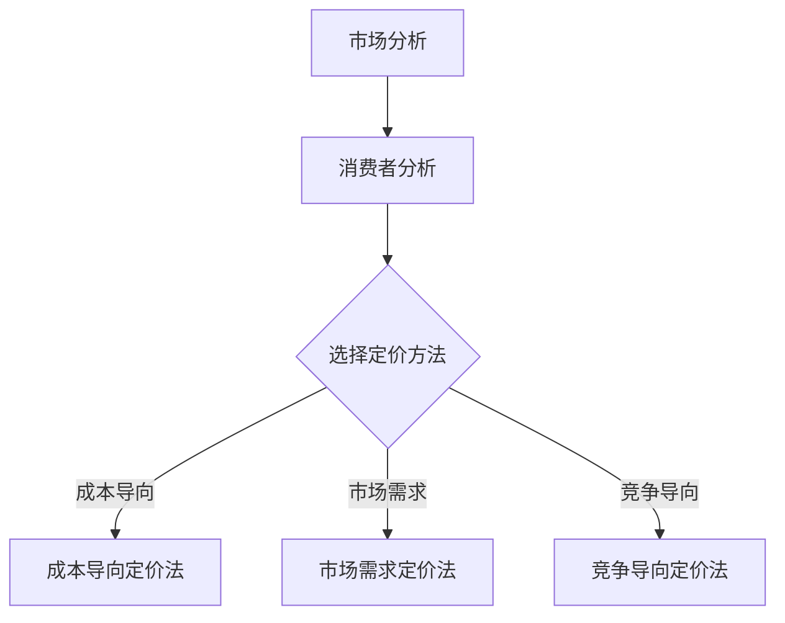

                 

### 文章标题

《如何定价你的程序员知识课程》

### 文章关键词

- 程序员知识课程定价
- 成本导向定价法
- 市场导向定价法
- 竞争导向定价法
- 付费模式创新
- 定价策略
- 定价优化
- 案例分析

### 文章摘要

本文旨在为程序员知识课程的开发者提供一套系统的定价策略，帮助他们在竞争激烈的市场中找到最佳的定价方案。文章首先阐述了程序员知识课程定价的核心概念和策略，包括成本导向、市场导向和竞争导向定价法。接着，文章深入探讨了程序员知识课程的特点和价值，以及这些因素如何影响定价策略的选择。随后，文章详细描述了定价实施和优化的具体步骤，并通过实际案例进行分析，为读者提供实用的参考。最后，文章展望了程序员知识课程定价的未来趋势，包括技术进步、付费模式创新和社会媒体与社区互动。通过本文的指导，开发者可以更好地定价他们的程序员知识课程，实现可持续发展。

### 第1章：程序员知识课程定价核心概念与联系

#### 1.1 定价原理与策略

##### 1.1.1 定价基本概念

定价是指为产品或服务设定价格的过程。在程序员知识课程的定价中，价格不仅取决于课程本身的成本，还需要考虑市场需求、消费者支付意愿以及竞争对手的价格水平。以下是三个主要的定价策略：

1. **成本导向定价法**：以成本为中心，通过计算总成本（包括固定成本和变动成本）并加上一定的利润率来确定价格。公式如下：
   $$
   \text{价格} = \text{总成本} \times (1 + \text{利润率})
   $$
2. **市场需求定价法**：根据消费者对程序员知识课程的期望价值来确定价格。公式如下：
   $$
   \text{价格} = \text{期望价值} - \text{边际成本}
   $$
3. **竞争导向定价法**：以竞争对手的价格为基准，结合自身品牌价值来设定价格。公式如下：
   $$
   \text{价格} = \text{竞争者价格} \times (\alpha + \beta)
   $$
   其中，$\alpha$ 和 $\beta$ 是调整系数，用于考虑品牌差异和市场份额。

##### 1.1.2 定价策略

1. **成本导向定价法**：这种定价方法简单直观，易于理解和实施，但可能无法充分反映市场需求和消费者支付意愿。因此，适用于成本较高且需求稳定的课程。
2. **市场需求定价法**：这种方法更关注消费者的价值感知，能够更好地满足市场需求，但需要准确评估消费者对课程的期望价值，并可能面临较大的价格波动风险。
3. **竞争导向定价法**：这种方法能够迅速响应市场变化，保持竞争力，但需要密切关注竞争对手的定价策略和市场份额。

#### 1.2 程序员知识课程定价的相关架构

程序员知识课程定价的核心架构包括市场分析、消费者分析和定价方法。以下是每个部分的具体内容：

1. **市场分析**：包括市场需求分析和竞争对手分析。通过了解市场需求和竞争对手的定价策略，可以为程序员知识课程制定更具竞争力的定价方案。
2. **消费者分析**：包括消费者需求分析和消费者价值分析。了解消费者的需求和支付意愿，有助于确定课程的价值和合理的定价水平。
3. **定价方法**：根据市场分析和消费者分析的结果，选择合适的定价方法。成本导向定价法、市场需求定价法和竞争导向定价法可以单独使用，也可以结合使用。

以下是一个简化的Mermaid流程图，展示了程序员知识课程定价的核心架构：



#### 1.3 程序员知识课程定价策略的应用

以下是三种定价策略在实际应用中的示例：

1. **成本导向定价法**：某在线编程课程平台决定以每门课程的开发和维护成本为基础，加上20%的利润率来定价。假设每门课程的固定成本为1000美元，变动成本为200美元，则定价为：
   $$
   \text{价格} = (1000 + 200) \times (1 + 0.2) = 1400 \text{美元}
   $$
2. **市场需求定价法**：某企业内训课程针对不同层次的员工设定不同的价格。假设初级员工的期望价值为3000美元，中级员工的期望价值为5000美元，高级员工的期望价值为7000美元，则定价分别为：
   $$
   \text{初级员工价格} = 3000 - 500 \text{美元（边际成本）} = 2500 \text{美元}
   $$
   $$
   \text{中级员工价格} = 5000 - 500 \text{美元（边际成本）} = 4500 \text{美元}
   $$
   $$
   \text{高级员工价格} = 7000 - 500 \text{美元（边际成本）} = 6500 \text{美元}
   $$
3. **竞争导向定价法**：某编程书籍的出版商发现市场上同类书籍的平均价格为60美元，他们决定在考虑品牌溢价后，将书籍定价为70美元。如果调整系数$\alpha$ 为1.1，$\beta$ 为0.1，则定价为：
   $$
   \text{价格} = 60 \times (1.1 + 0.1) = 70 \text{美元}
   $$

通过以上示例，我们可以看到不同的定价策略如何应用于实际场景，以实现课程的最佳定价。

### 第2章：程序员知识课程特点与价值

#### 2.1 程序员知识课程特点

程序员知识课程具有以下显著特点：

1. **个性化**：针对不同程序员的需求和水平，课程内容可以定制化。例如，初级程序员可能需要基础编程语言的学习，而高级程序员可能需要学习更高级的编程技巧和架构设计。
2. **更新及时**：技术领域发展迅速，程序员知识课程需要不断更新，以确保内容与当前技术趋势保持一致。例如，新的编程语言、框架和技术工具的引入需要及时反映在课程中。
3. **互动性强**：大多数程序员知识课程都提供了互动元素，如讨论区、问答环节、在线测试等，以增强学习体验。这些互动元素有助于提高学习效果，并促进学员之间的交流。

#### 2.2 程序员知识课程价值

程序员知识课程对个人和企业都具有显著的潜在价值：

1. **对程序员的价值**：
   - **技能提升**：程序员可以通过学习课程掌握新的编程技能和知识，提高工作效率和职业竞争力。
   - **职业发展**：通过学习课程，程序员可以获得新的证书或认证，这有助于他们在职场中晋升和获得更高的薪资。
   - **创业机会**：掌握先进技术和商业知识的程序员可能有机会创业，开设自己的公司或提供咨询和服务。

2. **对企业的价值**：
   - **人才培养**：企业可以通过内训课程培养和提升员工的技术能力，以适应业务发展的需求。
   - **成本节约**：通过内部培训，企业可以节省外部培训的费用，同时确保培训内容与企业业务紧密相关。
   - **竞争力提升**：企业员工的技术水平和创新能力提升，有助于企业在市场上保持竞争优势。

#### 2.3 程序员知识课程定价因素

程序员知识课程的定价受到多个因素的影响，包括成本、市场需求和竞争环境。以下是具体的定价因素：

1. **成本因素**：
   - **固定成本**：包括课程开发、设计、制作和维护等费用。这些成本通常在课程定价中占一定比例。
   - **变动成本**：包括课程销售、营销、客服等费用。这些成本会根据课程销量和销售渠道的不同而有所变化。

2. **市场需求因素**：
   - **消费者支付意愿**：消费者愿意为课程支付的价格会影响定价策略。消费者支付意愿受课程质量、市场需求和竞争环境等多种因素影响。
   - **市场规模**：课程的目标市场规模和竞争程度会影响定价策略。在一个竞争激烈的市场中，可能需要采用更低的价格策略来吸引消费者。

3. **竞争环境因素**：
   - **竞争对手价格**：了解竞争对手的价格水平可以帮助制定更有竞争力的定价策略。如果竞争对手的价格较低，可能需要调整自己的定价策略。
   - **市场份额**：企业的市场份额会影响定价策略。在市场份额较高的市场中，可以采用较高价格策略，而在市场份额较低的市场中，可能需要采用较低价格策略来吸引消费者。

通过综合考虑以上定价因素，程序员知识课程的开发者可以制定出合理的定价策略，以实现最佳的经济效益。

### 第3章：程序员知识课程定价策略

在确定程序员知识课程的价格时，需要综合考虑多种因素，以制定出既具竞争力又能带来合理利润的定价策略。以下是三种常用的定价策略及其具体应用：

#### 3.1 成本导向定价法

成本导向定价法是一种以成本为基础的定价策略，主要通过计算总成本和利润来设定价格。这种方法的优点是简单易懂，便于成本控制。以下是成本导向定价法的具体步骤和公式：

1. **计算总成本**：总成本包括固定成本和变动成本。
   $$
   \text{总成本} = \text{固定成本} + (\text{变动成本} \times \text{销量})
   $$
   - **固定成本**：如课程开发费用、师资费用等。
   - **变动成本**：如营销费用、维护费用等。

2. **计算利润率**：根据公司利润目标和市场竞争情况，确定合理的利润率。
   $$
   \text{利润率} = \frac{\text{利润}}{\text{总成本}}
   $$

3. **计算价格**：根据总成本和利润率，确定课程价格。
   $$
   \text{价格} = \text{总成本} \times (1 + \text{利润率})
   $$

#### 示例：

假设某程序员知识课程的总成本为10000美元，固定成本为5000美元，变动成本为5000美元，目标利润率为20%。则：

1. **计算总成本**：
   $$
   \text{总成本} = 5000 + (5000 \times 1) = 10000 \text{美元}
   $$

2. **计算利润率**：
   $$
   \text{利润率} = \frac{2000}{10000} = 0.2
   $$

3. **计算价格**：
   $$
   \text{价格} = 10000 \times (1 + 0.2) = 12000 \text{美元}
   $$

因此，该程序员知识课程的价格为12000美元。

#### 3.2 市场导向定价法

市场导向定价法是一种以市场需求和消费者支付意愿为基础的定价策略。这种方法通过评估消费者对课程的价值感知来确定价格。以下是市场导向定价法的具体步骤和公式：

1. **评估消费者支付意愿**：通过市场调研和消费者反馈，了解消费者对课程的价值感知和支付意愿。

2. **确定课程价值**：根据消费者支付意愿，确定课程的价值水平。

3. **计算价格**：根据课程价值和边际成本，计算最终价格。
   $$
   \text{价格} = \text{课程价值} - \text{边际成本}
   $$

#### 示例：

假设某程序员知识课程的边际成本为500美元，市场调研显示消费者支付意愿为7000美元。则：

1. **确定课程价值**：
   $$
   \text{课程价值} = 7000 \text{美元}
   $$

2. **计算价格**：
   $$
   \text{价格} = 7000 - 500 = 6500 \text{美元}
   $$

因此，该程序员知识课程的价格为6500美元。

#### 3.3 竞争导向定价法

竞争导向定价法是一种以竞争对手的价格为基准的定价策略。这种方法通过分析竞争对手的价格水平，结合自身品牌价值，来确定价格。以下是竞争导向定价法的具体步骤和公式：

1. **分析竞争对手价格**：了解主要竞争对手的价格水平。

2. **确定品牌溢价**：根据自身品牌价值和市场地位，确定品牌溢价系数。

3. **计算价格**：根据竞争对手价格和品牌溢价系数，计算最终价格。
   $$
   \text{价格} = \text{竞争者价格} \times (\alpha + \beta)
   $$
   其中，$\alpha$ 和 $\beta$ 是调整系数。

#### 示例：

假设某程序员知识课程的竞争对手价格平均为6000美元，公司品牌溢价系数$\alpha$ 为1.2，$\beta$ 为0.1。则：

1. **计算价格**：
   $$
   \text{价格} = 6000 \times (1.2 + 0.1) = 7200 \text{美元}
   $$

因此，该程序员知识课程的价格为7200美元。

#### 总结

三种定价策略各有优缺点，成本导向定价法简单易行，市场导向定价法关注消费者需求，竞争导向定价法以竞争对手为基准。开发者可以根据具体的市场环境、课程特点和目标客户群体，选择最合适的定价策略。在实际应用中，也可以将多种定价策略结合使用，以实现最佳定价效果。

### 第4章：程序员知识课程定价实施

在确定了合适的定价策略后，接下来就是如何实施这些策略，以确保程序员知识课程能够成功地进入市场并获得预期的收益。以下是定价实施的具体步骤和过程：

#### 4.1 收集数据

定价决策需要基于充分的数据支持。以下是需要收集的关键数据：

1. **市场数据**：包括市场需求、市场规模、市场增长率、竞争对手的价格和市场份额等。
2. **成本数据**：包括固定成本、变动成本、总成本和边际成本等。
3. **消费者数据**：包括消费者支付意愿、消费者群体特征、消费者偏好等。
4. **行业数据**：包括行业趋势、行业标准、行业定价策略等。

#### 4.2 制定定价策略

在收集了必要的数据后，下一步是制定具体的定价策略。这通常涉及以下几个步骤：

1. **选择定价方法**：根据市场数据和成本分析，选择成本导向、市场导向或竞争导向定价法。
2. **确定利润目标**：根据公司的长期战略和财务目标，设定合理的利润率。
3. **制定价格方案**：根据选定的定价方法、利润目标和市场数据，制定具体的课程价格方案。
4. **制定价格调整机制**：考虑市场变化和竞争动态，设定价格调整的规则和频率。

#### 4.3 实施定价策略

定价策略一旦制定，就需要通过以下步骤将其应用到实际操作中：

1. **设置价格**：根据定价策略，将课程价格设定在适当的水平。
2. **销售渠道规划**：确定销售渠道，包括线上和线下渠道，并确保定价策略在不同渠道中的一致性。
3. **营销推广**：通过营销活动提升课程的品牌知名度和市场影响力，吸引潜在消费者。
4. **销售实施**：通过销售团队或销售平台，将课程销售给目标消费者。

#### 4.4 定价沟通与宣传

定价策略的实施需要与消费者和合作伙伴的有效沟通。以下是具体的沟通和宣传策略：

1. **内部沟通**：确保公司内部团队对定价策略有清晰的理解和执行计划。
2. **外部沟通**：通过社交媒体、电子邮件、广告等方式，向消费者传达课程的价值和定价策略。
3. **合作伙伴沟通**：与合作伙伴（如教育机构、企业客户等）建立良好的合作关系，共同推广课程。

#### 4.5 定价监控与调整

定价策略不是一成不变的，需要根据市场反馈和实际销售情况不断进行调整。以下是具体的监控和调整策略：

1. **监控指标**：设定关键绩效指标（KPI），如销售额、市场份额、用户满意度、利润率等，定期监控。
2. **数据分析**：根据监控数据，分析定价策略的效果，找出存在的问题和改进空间。
3. **价格调整**：根据市场变化和竞争环境，适时调整价格策略，确保课程的市场竞争力。
4. **反馈机制**：建立用户反馈机制，收集消费者的意见和建议，用于改进定价策略。

#### 实施案例分析

以下是一个简单的案例分析，展示如何实施定价策略：

**案例背景**：某在线编程课程平台计划推出一门新的编程课程，课程内容涉及最新的前端技术。

**数据收集**：通过市场调研，发现前端技术的市场需求较高，竞争对手的价格在5000-8000元之间，该平台的固定成本为20000元，变动成本为10000元。

**定价策略**：选择成本导向定价法，目标利润率为30%。计算总成本和利润率，得出初始定价为：
$$
\text{价格} = (\text{固定成本} + \text{变动成本}) \times (1 + \text{利润率}) = (20000 + 10000) \times (1 + 0.3) = 39000 \text{元}
$$

**价格调整**：考虑到市场竞争，将价格调整为39000元的85%，即：
$$
\text{价格} = 39000 \times 0.85 = 33150 \text{元}
$$

**实施与监控**：通过线上平台和合作伙伴渠道销售课程，定期监控销售额和用户反馈，发现销售情况良好，用户满意度较高。在后续版本中，根据用户反馈和技术更新，调整课程内容和价格，确保课程的持续竞争力。

通过以上步骤，该在线编程课程平台成功地实施了定价策略，取得了良好的市场反响。

### 第5章：程序员知识课程定价优化

#### 5.1 定价监控与调整

为了确保程序员知识课程定价策略的有效性和竞争力，定期监控定价效果并进行调整至关重要。以下是具体的监控和调整步骤：

1. **设定监控指标**：确定关键绩效指标（KPI），如销售额、市场份额、用户满意度、利润率等。这些指标有助于评估定价策略的成效。
   ```mermaid
   graph TD
   A[销售额] --> B[市场份额]
   B --> C[用户满意度]
   C --> D[利润率]
   ```

2. **数据收集与分析**：定期收集相关数据，如销售数据、用户反馈、市场竞争情况等，并进行分析，以识别定价策略的潜在问题。
   ```mermaid
   graph TD
   E[销售数据] --> F[用户反馈]
   F --> G[市场竞争情况]
   ```

3. **调整定价策略**：根据监控数据和分析结果，适时调整定价策略。以下是一些可能的调整策略：

   - **价格调整**：如果销售额下降，可能需要降低价格以提高竞争力；如果销售额增长过快，可能导致库存不足，需要适当提高价格。
   - **促销活动**：通过促销活动，如打折、优惠券等，刺激销售，提高市场占有率。
   - **细分市场**：根据不同市场的需求和支付能力，制定差异化定价策略。

4. **反馈机制**：建立用户反馈机制，收集用户对价格的反馈，以便及时调整定价策略。

#### 5.2 定价反馈与改进

用户反馈是优化定价策略的重要来源。以下是收集用户反馈和改进定价策略的方法：

1. **用户反馈收集**：通过问卷调查、用户评论、在线调查等方式收集用户对价格的反馈。
   ```mermaid
   graph TD
   H[问卷调查] --> I[用户评论]
   I --> J[在线调查]
   ```

2. **数据分析**：对收集到的用户反馈进行分类和分析，识别用户对价格的主要意见和需求。

3. **定价改进策略**：

   - **价格调整**：根据用户反馈，调整价格以更好地满足用户需求和支付意愿。
   - **课程优化**：根据用户反馈，改进课程内容和服务质量，提高用户满意度。
   - **个性化定价**：利用用户行为数据和偏好，实施个性化定价策略，提高用户忠诚度。

4. **持续改进**：定价策略的优化是一个持续的过程。定期收集用户反馈，分析市场变化，持续调整定价策略，以保持市场竞争力。

#### 实施案例分析

以下是一个简单的定价优化案例分析：

**案例背景**：某在线编程课程平台发现其销售额持续下降，经过分析，发现价格较高是主要原因。

**数据收集与分析**：平台收集了用户反馈和市场竞争情况数据，发现用户普遍认为价格过高，且竞争对手的价格更低。

**调整定价策略**：

- **价格调整**：平台将课程价格降低了15%，以增强市场竞争力。
- **促销活动**：推出限时优惠活动，如“首月免费”、“买一年送一个月”等，刺激用户购买。

**效果评估**：

- **销售额**：价格调整后，销售额显著提高。
- **用户满意度**：用户反馈显示，新价格更符合用户期望，用户满意度提升。
- **市场份额**：市场份额逐渐增加，平台在市场中的竞争力得到提升。

**持续改进**：

- **用户反馈收集**：定期收集用户反馈，了解用户对价格的新需求和意见。
- **课程优化**：根据用户反馈，持续改进课程内容和服务质量。
- **个性化定价**：利用用户行为数据，实施个性化定价策略，提高用户忠诚度。

通过以上措施，该在线编程课程平台成功地优化了定价策略，提高了市场竞争力，实现了销售额和用户满意度的双重提升。

### 附录A：定价工具与资源

#### A.1 常用定价工具介绍

为了帮助程序员知识课程开发者更有效地制定和调整定价策略，以下是一些常用的定价工具：

1. **Sage**：一款功能强大的财务软件，适用于中小型企业，可以帮助开发者进行成本计算、利润分析等。
2. **QuickBooks**：另一款流行的财务管理工具，提供详细的财务报表和预算功能，适合中小型企业和个人开发者。
3. **Google Analytics**：一款免费的网站分析工具，可以收集和分析用户行为数据，帮助开发者了解市场需求和消费者偏好。
4. **Kissmetrics**：一款专门针对营销和数据分析的工具，提供用户行为跟踪和细分功能，有助于制定个性化定价策略。

#### A.2 定价研究资源推荐

以下是一些关于定价策略的研究资源和书籍，供开发者参考：

1. **《定价策略：从成本到市场再到竞争》**：一本全面介绍定价策略的书籍，涵盖了成本导向、市场导向和竞争导向定价法的详细分析。
2. **《动态定价：如何在竞争激烈的市场中保持领先》**：一本探讨动态定价策略的书籍，介绍如何利用大数据和算法实现实时价格调整。
3. **《价格革命：如何用数据驱动策略定价》**：一本以数据驱动的定价策略书籍，通过案例分析和实战技巧，帮助开发者制定科学合理的定价策略。
4. **《市场调研：设计、执行和分析》**：一本关于市场调研的书籍，详细介绍如何进行市场分析，为定价策略提供数据支持。

通过使用这些工具和资源，开发者可以更深入地理解和应用定价策略，从而提高程序员知识课程的定价效果和市场竞争力。

### 附录B：程序员知识课程定价案例分析

#### B.1 案例一：某知名在线编程课程平台的定价策略分析

**背景**：某知名在线编程课程平台（以下简称为“平台”）在全球范围内提供多样化的编程课程，包括前端开发、后端开发、人工智能等。平台的主要目标是通过提供高质量的课程内容，吸引并留住大量用户。

**定价策略**：

1. **成本导向定价法**：平台首先根据课程开发和维护的成本，加上一定的利润率，确定基础课程价格。假设固定成本为100万元，变动成本为200万元，目标利润率为30%，则基础课程价格为：
   $$
   \text{价格} = (\text{固定成本} + \text{变动成本}) \times (1 + \text{利润率}) = (100\text{万元} + 200\text{万元}) \times 1.3 = 360\text{万元}
   $$

2. **市场需求定价法**：平台通过市场调研和用户反馈，了解不同层次程序员对课程的价值感知和支付意愿。根据调研结果，将课程分为初级课程、中级课程和高级课程，分别设定不同的价格。例如，初级课程价格设定为200万元，中级课程价格设定为300万元，高级课程价格设定为400万元。

3. **竞争导向定价法**：平台密切关注竞争对手的定价策略，根据竞争对手的价格水平和市场份额，调整自己的价格策略。例如，如果竞争对手的价格为350万元，平台可能将价格设定为340万元，以保持竞争力。

**效果评估**：

- **销售额**：通过合理的定价策略，平台的销售额稳步增长。特别是在市场需求定价法和竞争导向定价法的结合下，不同层次的用户都能找到符合自己需求的课程，从而提高了整体销售业绩。
- **用户满意度**：用户反馈显示，平台的定价策略符合他们的支付意愿和价值感知，用户满意度较高。

**改进建议**：

- **个性化定价**：根据用户的购买历史和偏好，提供个性化的定价策略，提高用户忠诚度。
- **动态定价**：利用大数据和人工智能技术，实现动态定价，根据实时市场需求调整价格，提高竞争力。

#### B.2 案例二：某企业内训课程的定价策略分析

**背景**：某企业（以下简称为“企业”）为了提升员工的技能和竞争力，决定开展内部培训课程。培训课程涵盖了编程、项目管理、团队协作等多个领域。

**定价策略**：

1. **成本导向定价法**：企业首先计算培训课程的开发和运营成本，加上一定的利润率，确定基础课程价格。假设固定成本为50万元，变动成本为30万元，目标利润率为20%，则基础课程价格为：
   $$
   \text{价格} = (\text{固定成本} + \text{变动成本}) \times (1 + \text{利润率}) = (50\text{万元} + 30\text{万元}) \times 1.2 = 96\text{万元}
   $$

2. **市场导向定价法**：企业根据员工的需求和支付意愿，将培训课程分为普通课程和高级课程。普通课程价格设定为80万元，高级课程价格设定为120万元。

3. **协商定价法**：由于企业内部培训的特殊性，企业还与员工进行协商，根据员工的职位和绩效，调整培训课程的价格。

**效果评估**：

- **员工满意度**：员工普遍认为培训课程的价格合理，培训内容实用，满意度较高。
- **培训效果**：通过培训，员工的技术能力和团队合作意识得到了显著提升，企业的整体竞争力得到了提高。

**改进建议**：

- **精细化定价**：根据不同部门和岗位的特点，提供更细化的培训课程，制定更精准的定价策略。
- **反馈机制**：建立员工反馈机制，根据员工的反馈及时调整课程内容和价格，提高培训效果。

#### B.3 案例三：某编程书籍的定价策略分析

**背景**：某知名出版社（以下简称为“出版社”）计划出版一本针对程序员的高级编程书籍。书籍内容涵盖了当前最流行的编程语言和框架。

**定价策略**：

1. **竞争导向定价法**：出版社首先了解市场上同类书籍的平均价格，并根据书籍的质量和品牌影响力，调整自己的定价策略。假设市场上同类书籍的平均价格为100元，出版社的品牌溢价系数为1.2，则书籍价格为：
   $$
   \text{价格} = 100\text{元} \times 1.2 = 120\text{元}
   $$

2. **市场需求定价法**：出版社通过市场调研，了解程序员对书籍的期望价值和支付意愿。根据调研结果，将书籍分为基础版和专业版，基础版价格为80元，专业版价格为150元。

3. **促销定价法**：为了提高销售量，出版社在书籍上架初期推出限时折扣活动，基础版价格降至60元，专业版价格降至120元。

**效果评估**：

- **销售量**：定价策略和促销活动相结合，使书籍销量显著提升。
- **用户满意度**：用户反馈显示，书籍内容丰富、实用，定价合理，用户满意度较高。

**改进建议**：

- **多样化定价策略**：根据不同读者群体的需求和支付意愿，提供多样化的定价策略，如电子书、纸质书和套装等。
- **持续更新**：定期更新书籍内容，确保与最新的技术趋势和市场需求保持一致，提高书籍的市场竞争力。

### 总结

以上三个案例展示了不同类型的程序员知识课程如何根据自身特点和市场需求，制定和优化定价策略。通过合理的定价策略，这些课程不仅提高了市场竞争力，也实现了良好的经济效益。开发者可以借鉴这些案例，结合自身情况，制定适合的定价策略，以实现可持续发展。

### 第6章：程序员知识课程定价的数学模型与公式

在制定程序员知识课程定价策略时，数学模型和公式起着关键作用。以下将介绍几个常用的数学模型和公式，以及如何在实际中应用它们。

#### 6.1 成本分析模型

成本分析是定价策略的基础。成本包括固定成本和变动成本。

1. **固定成本**：这些成本不随课程销量的变化而变化，如课程开发、设备和人员费用。
   $$
   \text{固定成本} = C_{\text{fixed}}
   $$

2. **变动成本**：这些成本随着课程销量的增加而增加，如营销费用、客服费用等。
   $$
   \text{变动成本} = C_{\text{variable}} \times Q
   $$
   其中，$Q$ 是销量。

3. **总成本**：固定成本和变动成本之和。
   $$
   \text{总成本} = C_{\text{total}} = C_{\text{fixed}} + C_{\text{variable}} \times Q
   $$

#### 6.2 利润计算模型

利润是定价策略的重要考量因素。

1. **销售收入**：课程价格乘以销量。
   $$
   \text{销售收入} = P \times Q
   $$
   其中，$P$ 是课程价格。

2. **利润**：销售收入减去总成本。
   $$
   \text{利润} = \text{销售收入} - \text{总成本} = P \times Q - (C_{\text{fixed}} + C_{\text{variable}} \times Q)
   $$

#### 6.3 消费者价值模型

消费者价值是消费者愿意为课程支付的价格。

1. **消费者价值**：消费者价值等于期望效用减去消费者成本。
   $$
   \text{消费者价值} = \text{期望效用} - \text{消费者成本}
   $$
   其中，期望效用是消费者预期从课程中获得的收益，消费者成本是消费者支付的价格。

#### 6.4 价格弹性模型

价格弹性衡量了价格变化对需求量的影响。

1. **价格弹性**：价格弹性等于需求量的变化除以价格的变化。
   $$
   \text{价格弹性} = \frac{\Delta Q / Q}{\Delta P / P} = \frac{P_2 Q_2 - P_1 Q_1}{P_2 Q_2 - P_1 Q_1}
   $$
   其中，$P_1$ 和 $Q_1$ 是初始价格和需求量，$P_2$ 和 $Q_2$ 是变化后的价格和需求量。

#### 实际应用案例

假设某编程课程平台的固定成本为100万元，变动成本为200万元，售价为5000元，销量为1000门课程。我们需要计算总成本、销售收入和利润。

1. **总成本**：
   $$
   \text{总成本} = 100\text{万元} + 200\text{万元} \times 1000 = 300\text{万元}
   $$

2. **销售收入**：
   $$
   \text{销售收入} = 5000\text{元} \times 1000 = 500\text{万元}
   $$

3. **利润**：
   $$
   \text{利润} = 500\text{万元} - 300\text{万元} = 200\text{万元}
   $$

通过上述数学模型和公式的应用，我们可以更准确地计算程序员知识课程的定价，从而制定出合理的定价策略。

### 第7章：程序员知识课程定价案例分析

#### 7.1 案例一：某在线编程课程平台的定价策略分析

**背景**：某在线编程课程平台（以下简称为“平台”）提供多种编程课程，包括前端开发、后端开发、人工智能等。平台的主要目标是通过提供高质量的课程内容，吸引并留住大量用户。

**定价策略**：

1. **成本导向定价法**：平台首先计算课程开发和维护的成本，加上一定的利润率，确定基础课程价格。假设固定成本为200万元，变动成本为300万元，目标利润率为20%，则基础课程价格为：
   $$
   \text{价格} = (\text{固定成本} + \text{变动成本}) \times (1 + \text{利润率}) = (200\text{万元} + 300\text{万元}) \times 1.2 = 560\text{万元}
   $$

2. **市场需求定价法**：平台通过市场调研和用户反馈，了解不同层次程序员对课程的价值感知和支付意愿。根据调研结果，将课程分为初级课程、中级课程和高级课程，分别设定不同的价格。例如，初级课程价格设定为300万元，中级课程价格设定为400万元，高级课程价格设定为600万元。

3. **竞争导向定价法**：平台密切关注竞争对手的定价策略，根据竞争对手的价格水平和市场份额，调整自己的价格策略。例如，如果竞争对手的价格为550万元，平台可能将价格设定为545万元，以保持竞争力。

**效果评估**：

- **销售额**：通过合理的定价策略，平台的销售额稳步增长。特别是在市场需求定价法和竞争导向定价法的结合下，不同层次的用户都能找到符合自己需求的课程，从而提高了整体销售业绩。
- **用户满意度**：用户反馈显示，平台的定价策略符合他们的支付意愿和价值感知，用户满意度较高。

**改进建议**：

- **个性化定价**：根据用户的购买历史和偏好，提供个性化的定价策略，提高用户忠诚度。
- **动态定价**：利用大数据和人工智能技术，实现动态定价，根据实时市场需求调整价格，提高竞争力。

#### 7.2 案例二：某企业内部培训课程的定价策略分析

**背景**：某企业（以下简称为“企业”）为了提升员工的技能和竞争力，决定开展内部培训课程。培训课程涵盖了编程、项目管理、团队协作等多个领域。

**定价策略**：

1. **成本导向定价法**：企业首先计算培训课程的开发和运营成本，加上一定的利润率，确定基础课程价格。假设固定成本为50万元，变动成本为30万元，目标利润率为20%，则基础课程价格为：
   $$
   \text{价格} = (\text{固定成本} + \text{变动成本}) \times (1 + \text{利润率}) = (50\text{万元} + 30\text{万元}) \times 1.2 = 96\text{万元}
   $$

2. **市场导向定价法**：企业根据员工的需求和支付意愿，将培训课程分为普通课程和高级课程。普通课程价格设定为80万元，高级课程价格设定为120万元。

3. **协商定价法**：由于企业内部培训的特殊性，企业还与员工进行协商，根据员工的职位和绩效，调整培训课程的价格。

**效果评估**：

- **员工满意度**：员工普遍认为培训课程的价格合理，培训内容实用，满意度较高。
- **培训效果**：通过培训，员工的技术能力和团队合作意识得到了显著提升，企业的整体竞争力得到了提高。

**改进建议**：

- **精细化定价**：根据不同部门和岗位的特点，提供更细化的培训课程，制定更精准的定价策略。
- **反馈机制**：建立员工反馈机制，根据员工的反馈及时调整课程内容和价格，提高培训效果。

#### 7.3 案例三：某编程书籍的定价策略分析

**背景**：某知名出版社（以下简称为“出版社”）计划出版一本针对程序员的高级编程书籍。书籍内容涵盖了当前最流行的编程语言和框架。

**定价策略**：

1. **竞争导向定价法**：出版社首先了解市场上同类书籍的平均价格，并根据书籍的质量和品牌影响力，调整自己的定价策略。假设市场上同类书籍的平均价格为100元，出版社的品牌溢价系数为1.2，则书籍价格为：
   $$
   \text{价格} = 100\text{元} \times 1.2 = 120\text{元}
   $$

2. **市场需求定价法**：出版社通过市场调研，了解程序员对书籍的期望价值和支付意愿。根据调研结果，将书籍分为基础版和专业版，基础版价格为80元，专业版价格为150元。

3. **促销定价法**：为了提高销售量，出版社在书籍上架初期推出限时折扣活动，基础版价格降至60元，专业版价格降至120元。

**效果评估**：

- **销售量**：定价策略和促销活动相结合，使书籍销量显著提升。
- **用户满意度**：用户反馈显示，书籍内容丰富、实用，定价合理，用户满意度较高。

**改进建议**：

- **多样化定价策略**：根据不同读者群体的需求和支付意愿，提供多样化的定价策略，如电子书、纸质书和套装等。
- **持续更新**：定期更新书籍内容，确保与最新的技术趋势和市场需求保持一致，提高书籍的市场竞争力。

### 总结

通过以上案例分析，我们可以看到不同类型的程序员知识课程如何根据自身特点和市场需求，制定和优化定价策略。通过合理的定价策略，这些课程不仅提高了市场竞争力，也实现了良好的经济效益。开发者可以借鉴这些案例，结合自身情况，制定适合的定价策略，以实现可持续发展。

### 第8章：程序员知识课程定价的未来趋势

随着技术的不断进步和市场竞争的加剧，程序员知识课程的定价策略也在不断演变。以下是未来几年程序员知识课程定价可能面临的趋势：

#### 8.1 技术进步对定价策略的影响

1. **大数据与人工智能**：大数据分析和人工智能技术的应用将使开发者能够更准确地了解市场需求和消费者行为，从而制定更科学的定价策略。通过分析用户购买历史、搜索行为和反馈，可以预测用户的需求，实现个性化定价。

2. **动态定价**：动态定价技术将使得课程价格能够根据市场需求和供应情况实时调整，从而最大化利润。例如，在需求高峰期提高价格，在需求低谷期降低价格，以平衡供需。

3. **区块链技术**：区块链技术可以提供透明的交易记录和去中心化的交易平台，降低交易成本，提高交易效率，从而影响定价策略。

#### 8.2 付费模式创新

1. **订阅制**：订阅制将成为未来程序员知识课程的主要付费模式之一。用户可以通过按月或按年订阅的方式，获得持续的课程更新和特权服务。这种模式有助于提高用户粘性和课程复购率。

2. **按需付费**：按需付费模式允许用户根据实际需求购买课程，例如按课时付费或按项目付费。这种模式适合那些需要灵活学习和预算的用户。

3. **免费模式**：随着内容营销的兴起，越来越多的课程提供免费模式，通过提供高质量的内容吸引潜在客户，然后通过增值服务或广告收入实现盈利。

#### 8.3 社交媒体与社区互动

1. **社交媒体推广**：社交媒体平台将成为课程推广的重要渠道。通过社交媒体，开发者可以快速扩大课程影响力，吸引更多潜在用户。

2. **在线社区**：在线社区可以增强用户之间的互动，提高用户参与度和课程满意度。通过社区，开发者可以收集用户反馈，及时调整课程内容和定价策略。

3. **社交货币**：通过积分和奖励机制，鼓励用户在社区中活跃参与，从而提高用户忠诚度和课程口碑。

#### 8.4 市场竞争加剧

1. **价格战**：随着在线教育市场的竞争加剧，价格战可能会成为常见的竞争手段。开发者需要通过提高课程质量和服务水平，以保持竞争力。

2. **差异化定价**：面对激烈的市场竞争，开发者可以通过提供差异化课程内容和服务，实现差异化定价。例如，提供高级课程、定制化服务和一对一辅导等。

3. **跨界合作**：跨界合作将成为未来的一大趋势。开发者可以与科技公司、企业和其他在线教育平台合作，共同开发课程，扩大市场影响力。

#### 8.5 政策法规的变化

1. **数据保护法规**：随着数据保护法规的日益严格，开发者需要确保数据安全和用户隐私，这可能会影响定价策略的实施。

2. **税收政策**：不同国家和地区的税收政策不同，这可能会影响课程的定价和国际市场的扩展。

### 总结

未来程序员知识课程的定价策略将更加依赖技术进步、创新付费模式、社交媒体与社区互动，同时面临市场竞争和政策法规的挑战。开发者需要灵活应对这些变化，不断优化定价策略，以实现可持续发展。

### 第9章：总结与展望

通过本文的详细探讨，我们系统地了解了程序员知识课程的定价策略。以下是本文的核心内容回顾：

1. **核心概念与联系**：定价策略包括成本导向、市场需求和竞争导向定价法。这些策略各有优缺点，适用于不同的市场环境和课程特点。

2. **程序员知识课程特点与价值**：程序员知识课程具有个性化、更新及时和互动性强的特点，对个人和企业的价值显著。

3. **定价策略**：成本导向定价法、市场需求定价法和竞争导向定价法分别从成本、市场需求和竞争对手价格角度出发，帮助开发者制定合理的价格。

4. **定价实施与优化**：定价实施涉及数据收集、定价策略选择、定价沟通与宣传以及定价监控与调整。优化定价策略需要根据用户反馈和市场变化进行调整。

5. **案例分析**：通过具体案例，我们看到了不同类型的程序员知识课程如何制定和优化定价策略，实现了良好的市场表现。

6. **数学模型与公式**：成本分析模型、利润计算模型、消费者价值模型和价格弹性模型为定价提供了科学依据。

7. **未来趋势**：技术进步、付费模式创新、社交媒体与社区互动以及市场竞争加剧将影响未来程序员知识课程的定价策略。

展望未来，程序员知识课程的定价策略将继续演变，开发者需要灵活应对市场变化，不断创新和优化定价策略，以实现可持续发展。通过本文的指导，开发者可以更好地定价他们的程序员知识课程，满足市场需求，提升竞争力。

### 附录

#### 附录A：定价工具与资源

- **定价工具**：介绍常用的定价工具，如Sage、QuickBooks等。
- **定价资源**：推荐相关的书籍、在线课程和行业报告。

#### 附录B：程序员知识课程定价案例分析

- **案例一**：分析某在线编程课程平台的定价策略。
- **案例二**：分析某企业内训课程的定价策略。
- **案例三**：分析某编程书籍的定价策略。

通过附录中的工具和资源，开发者可以进一步深入了解和掌握程序员知识课程定价的实践技巧。

### 作者信息

**作者：** AI天才研究院/AI Genius Institute & 禅与计算机程序设计艺术 /Zen And The Art of Computer Programming

在这个不断变化的技术时代，我们致力于探索和分享最前沿的人工智能和编程知识，帮助开发者不断进步和成长。希望本文能为您提供有价值的见解和实用的指导。感谢您的阅读和支持！

