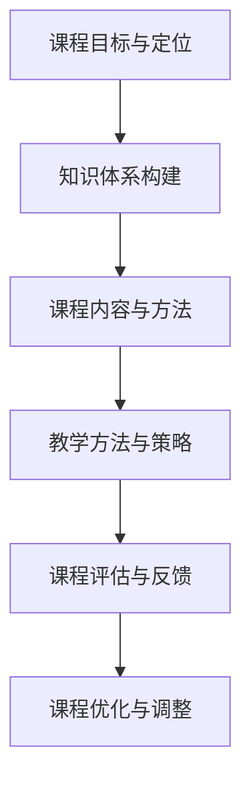

                 

## 引言

### 文章标题：如何打造高效的程序员知识课程

在当今快速发展的信息技术时代，程序员的知识课程显得尤为重要。高效的程序员知识课程不仅能够帮助学习者迅速掌握编程技能，还能培养他们的逻辑思维和解决问题的能力。然而，如何设计出既系统全面又具有实际应用价值的课程，仍然是一个挑战。本文旨在探讨如何打造高效的程序员知识课程，通过系统的课程设计与目标定位、课程内容与方法选择、教学策略与评估等多个方面，来确保课程的高效性和实用性。

### 关键词

- 程序员知识课程
- 课程设计
- 教学方法
- 课程评估
- 实战项目

### 摘要

本文首先介绍了高效程序员知识课程的重要性，接着详细阐述了课程设计与目标、课程内容与方法、教学策略与评估等多个关键环节。通过实际案例和代码实战，本文旨在为读者提供一套科学、实用、高效的课程设计思路，帮助学习者快速成长为具备实战能力的程序员。

---

在开始具体的讨论之前，我们需要明确一些基本概念和逻辑框架。本文将遵循以下步骤进行展开：

1. **课程设计与目标**：包括课程目标与定位、课程设计原则与方法。
2. **课程内容与方法**：涉及知识体系构建、课程内容设计、教学方法与策略。
3. **课程评估与反馈**：讨论课程评估目的、方法、学生反馈收集与分析，以及课程优化与调整。
4. **实践与案例**：通过实战项目和案例分析，展示课程设计的实际效果。
5. **课程管理与运营**：探讨课程管理、运营策略、推广与营销，以及持续优化。

接下来，我们将逐步深入每一个部分，以逻辑清晰、结构紧凑的方式，探讨如何打造出一门高效的程序员知识课程。

---

## 第一部分：课程设计与目标

### 第1章：课程目标与定位

#### 1.1 课程目标概述

课程目标是课程设计的核心，它决定了课程的内容、深度和广度。在制定课程目标时，需要明确以下几个关键点：

- **技能目标**：课程应旨在帮助学习者掌握哪些编程语言、工具或框架，以及这些技能在实际开发中的具体应用。
- **知识目标**：课程应该涵盖哪些基本理论和知识体系，使学习者能够理解技术背后的原理。
- **能力目标**：课程还应培养学习者的哪些能力，如代码调试、项目管理和团队合作。

#### 1.2 课程定位与受众

课程的定位直接影响其受众群体。以下是需要考虑的几个方面：

- **受众群体**：根据学习者的背景和需求，课程可以定位为初级、中级或高级程序员。
- **课程难度**：课程应如何平衡基础知识与高级内容，确保不同水平的学习者都能够受益。
- **课程类型**：课程可以是系统性的理论学习，也可以是实战导向的项目驱动课程。

#### 1.3 课程结构概述

为了确保课程的高效性，课程结构的设计至关重要。一个典型的课程结构应包括以下部分：

- **开篇导言**：介绍课程背景、目标和学习路线。
- **基础知识**：覆盖核心编程语言、数据结构与算法。
- **核心技术**：介绍当前流行技术栈，如前端框架、后端框架、数据库等。
- **实战项目**：通过真实项目，将所学知识应用于实际场景。
- **总结与反馈**：对课程内容进行总结，收集学生反馈，进行课程优化。

### 1.4 课程设计原则与方法

在设计课程时，需要遵循以下原则：

- **实用性**：课程内容应紧密贴合实际工作需求，确保学习者能够学以致用。
- **系统性**：课程内容应形成完整的知识体系，避免零散和重复。
- **渐进性**：课程应按照由浅入深的顺序组织，逐步提高难度。
- **互动性**：课程设计应鼓励学生参与，提供充分的互动和讨论空间。

实现这些原则的方法包括：

- **案例驱动**：通过实际案例，让学生在解决问题的过程中掌握知识。
- **项目驱动**：通过项目实践，培养学生的实战能力和团队协作能力。
- **教学方法**：结合讲授、讨论、实验等多种教学方法，提高教学效果。

### 1.5 课程评估与反馈

课程评估是确保课程质量的重要环节。以下是一些关键的评估方法：

- **过程评估**：在课程学习过程中，通过作业、测试等方式，实时评估学习效果。
- **结果评估**：通过项目报告、期末考试等方式，全面评估学习成果。
- **学生反馈**：收集学生对课程内容的反馈，了解学习者的需求和学习体验。

通过以上方法和原则，可以设计出一门具有高效性的程序员知识课程，为学习者提供优质的学习体验。

---

### 第2章：课程设计原则与方法

#### 2.1 课程设计原则

课程设计是一个系统性工程，涉及多个方面。以下是一些关键的课程设计原则：

- **实用性**：课程内容应紧密结合实际工作需求，确保学习者能够将所学知识应用于实际项目中。
- **系统性**：课程内容应形成完整的知识体系，避免内容重复和断裂，使学习者能够系统地学习。
- **渐进性**：课程应按照由浅入深的顺序组织，逐步提高难度，确保学习者能够逐步掌握复杂的知识点。
- **互动性**：课程设计应鼓励学生积极参与，提供充分的互动和讨论空间，以促进知识的内化和应用。
- **灵活性**：课程应根据学习者的需求和进度进行调整，提供灵活的学习路径。

#### 2.2 课程设计方法

为了实现上述设计原则，以下是一些具体的课程设计方法：

- **需求分析**：在课程设计初期，通过调查问卷、访谈等方式，了解学习者的背景、需求和期望。
- **内容规划**：根据需求分析结果，规划课程的内容结构，确保覆盖核心知识和技能。
- **教学资源准备**：准备适当的教学资源，如教材、课件、视频等，以提高教学效果。
- **教学方法选择**：结合课程内容和目标，选择适合的教学方法，如讲授、讨论、实验等。
- **课程评估**：设计合理的课程评估体系，包括过程评估和结果评估，以及学生反馈收集与分析。

#### 2.3 课程内容平衡

课程内容平衡是确保课程质量的关键。以下是需要考虑的几个方面：

- **基础知识与高级内容的平衡**：课程应既涵盖基础知识，又包含高级内容，使学习者能够从不同层面理解技术。
- **理论教学与实践教学的平衡**：课程应兼顾理论教学和实践教学，使学习者能够在实践中巩固理论知识。
- **必修课与选修课的平衡**：根据学习者的需求和课程目标，设置适当的必修课和选修课，满足不同学习者的需求。
- **项目驱动与理论学习的时间分配**：合理规划项目和实践的时间，确保学习者有足够的时间进行实践和反思。

通过以上原则和方法，可以设计出一门内容丰富、结构合理、实用高效的程序员知识课程，为学习者提供优质的学习体验。

---

### 第3章：知识体系构建

#### 3.1 知识体系概述

构建一个完整的知识体系是高效程序员知识课程的核心任务。知识体系不仅有助于学习者系统地掌握知识，还能提高他们的自学能力和问题解决能力。一个完善的程序员知识体系通常包括以下关键组成部分：

- **基础知识**：包括编程语言、数据结构、算法等核心概念。
- **核心技能**：涉及编程实践、软件工程、数据库、网络等实际应用技能。
- **专业知识**：针对特定领域，如人工智能、大数据、云计算等，提供深入的技术讲解和实践指导。
- **软技能**：涵盖沟通协作、时间管理、项目管理等非技术能力。

#### 3.2 知识分类与模块化

为了使知识体系更加清晰和易于学习，可以将其分为不同的模块。以下是一些常见的知识分类和模块化方法：

- **按知识类型划分**：将基础知识、核心技能、专业知识和软技能分别归类，形成不同的模块。
- **按学习路径划分**：根据学习者的学习进度和需求，设计不同的学习路径，如初级课程、中级课程和高级课程。
- **按技术领域划分**：根据不同的技术领域，如前端开发、后端开发、移动开发等，划分不同的模块。

#### 3.3 知识结构图

为了更好地展示知识体系，可以使用知识结构图（也称为思维导图）来直观地表达各部分之间的关系。以下是一个示例的知识结构图：

```
+-------------------+
|   程序员知识体系   |
+-------------------+
        |
        |
        V
+----------------+    +----------------+    +----------------+
| 基础知识模块   |    | 核心技能模块    |    | 专业知识模块   |
+----------------+    +----------------+    +----------------+
        |                |                |
        |                |                |
        V                V                V
+----------+   +----------+   +----------+   +----------+   +----------+
| 编程语言   | | 数据结构 | | 算法      | | 软件工程 | | 数据库    | | 网络      |
+----------+   +----------+   +----------+   +----------+   +----------+
        |                |                |                |
        |                |                |                |
        V                V                V                V
+----------------+   +----------------+   +----------------+
| 前端开发领域    | | 后端开发领域    | | 移动开发领域    |
+----------------+   +----------------+   +----------------+

```

通过知识结构图，可以清晰地看到各个模块之间的联系和层次，有助于学习者全面系统地掌握知识。

#### 3.4 知识体系构建的挑战与策略

构建一个高效的程序员知识体系面临以下挑战：

- **知识更新速度快**：技术领域不断发展，课程内容需要及时更新以反映最新的技术趋势。
- **内容复杂度高**：技术知识复杂度高，如何将复杂概念简化为易于理解的内容是课程设计的重要问题。
- **平衡理论与实践**：课程设计需要在基础知识、核心技能、专业知识和软技能之间找到平衡。

以下是一些应对策略：

- **持续更新**：定期评估课程内容，根据技术发展动态进行更新，确保课程与实际需求保持一致。
- **简化复杂概念**：通过案例驱动和互动教学，将复杂概念简化为实际应用场景，帮助学生更好地理解。
- **理论与实践结合**：设计项目驱动的课程，让学生在解决问题的过程中应用所学知识，提高实践能力。

通过以上策略，可以构建一个系统化、层次清晰、内容丰富的程序员知识体系，为学习者提供优质的学习体验。

---

## 第二部分：课程内容与方法

### 第4章：课程内容设计

#### 4.1 课程内容设计原则

课程内容设计是课程质量的关键环节，以下是一些核心的原则：

- **实用性**：课程内容应紧密贴合实际工作需求，确保学习者能够将所学知识应用于实际项目中。
- **系统性**：课程内容应形成完整的知识体系，避免内容重复和断裂，使学习者能够系统地学习。
- **渐进性**：课程应按照由浅入深的顺序组织，逐步提高难度，确保学习者能够逐步掌握复杂的知识点。
- **灵活性**：课程应根据学习者的需求和进度进行调整，提供灵活的学习路径。

#### 4.2 课程内容选择

课程内容的选择直接影响课程的质量和实用性。以下是一些关键点：

- **基础知识**：包括编程语言、数据结构、算法等核心概念，是课程的基础。
- **核心技能**：涉及编程实践、软件工程、数据库、网络等实际应用技能，是课程的核心。
- **专业知识**：针对特定领域，如人工智能、大数据、云计算等，提供深入的技术讲解和实践指导。
- **软技能**：涵盖沟通协作、时间管理、项目管理等非技术能力，有助于学习者在职业发展中取得成功。

#### 4.3 课程内容组织与逻辑

为了确保课程内容的系统性和渐进性，以下是一些课程内容组织的原则：

- **按模块划分**：将课程内容划分为不同的模块，如基础知识模块、核心技能模块、专业知识模块和软技能模块。
- **逻辑顺序**：按照由浅入深的顺序组织内容，使学习者能够逐步掌握复杂的知识点。
- **结合案例**：通过实际案例和项目，将理论知识与实际应用相结合，提高学习者的理解和应用能力。
- **交互式学习**：设计互动性强的内容，如讨论、实验、练习等，促进学习者的参与和思考。

#### 4.4 教学资源设计

教学资源是课程内容的有力补充，以下是一些设计教学资源的原则：

- **多样性**：提供多种形式的教学资源，如教材、视频、在线课程、实践项目等，满足不同学习者的需求。
- **实用性**：教学资源应具有实用性，能够帮助学习者解决实际问题。
- **及时更新**：定期更新教学资源，确保内容与最新技术动态保持一致。
- **易于获取**：确保教学资源易于获取，方便学习者随时随地学习。

通过以上原则和方法，可以设计出一门内容丰富、结构合理、实用高效的程序员知识课程，为学习者提供优质的学习体验。

---

### 第5章：教学方法与策略

#### 5.1 教学方法概述

教学方法的多样性对于课程的质量和效果至关重要。以下是一些常见的教学方法及其特点：

- **讲授法**：教师通过讲解、演示等方式，传授理论知识。这种方法适用于基础知识的教学，有助于学习者快速了解概念和原理。
- **讨论法**：教师组织学生进行讨论，通过互动和交流，激发思维和讨论兴趣。这种方法适用于技能提升和问题解决的教学，有助于培养学习者的批判性思维和沟通能力。
- **实验法**：教师提供实验环境，让学生通过动手实践，掌握实际操作技能。这种方法适用于实践技能的培养，有助于学习者将理论知识应用于实际场景。
- **项目驱动法**：教师设计项目任务，让学生在解决问题的过程中，学习新知识和技能。这种方法适用于实战能力的培养，有助于学习者将所学知识应用于实际项目。
- **案例教学法**：教师通过实际案例，引导学生分析和解决问题。这种方法适用于技能提升和案例分析的教学，有助于学习者理解和应用复杂概念。

#### 5.2 互动教学策略

互动教学策略是提高课程参与度和学习效果的关键。以下是一些有效的互动教学策略：

- **课堂互动**：通过提问、回答、讨论等方式，增强课堂互动，激发学习者的思维和参与度。
- **小组合作**：将学习者分成小组，进行项目或问题的讨论和解决，培养团队合作能力和沟通能力。
- **在线讨论**：利用在线平台，组织学习者进行实时或异步讨论，拓展学习者的思维和视野。
- **实验与实践**：提供实验和实践机会，让学习者在实际操作中学习和掌握技能。
- **反馈与评价**：及时收集学习者的反馈，进行评价和指导，帮助学习者改进学习方法和效果。

#### 5.3 项目驱动教学

项目驱动教学是提高学习者实践能力的重要手段。以下是一些关键步骤：

- **项目选题**：根据课程目标和学习者需求，选择合适的实际项目作为学习任务。
- **项目规划**：制定详细的项目计划，包括项目目标、任务分配、时间安排等。
- **项目实施**：学生在教师的指导下，按照项目计划进行任务实施，解决遇到的问题。
- **项目评估**：对项目进行评估，包括项目完成情况、学习效果、团队协作等，给予评价和反馈。

通过以上教学方法与策略，可以设计出一门互动性强、实践性高、能够有效提高学习者编程能力和实战能力的程序员知识课程。

---

### 第6章：课程评估与反馈

#### 6.1 课程评估目的

课程评估是确保课程质量、优化教学效果的重要手段。其主要目的包括：

- **检测学习效果**：评估学习者对课程内容的掌握程度，确保教学目标的实现。
- **反馈教学效果**：通过评估结果，了解教学方法的适用性和教学内容的合理性，为教学改进提供依据。
- **优化课程设计**：根据评估反馈，调整课程内容、方法和策略，提高课程的整体质量。

#### 6.2 课程评估方法

为了实现上述目的，可以采用以下几种评估方法：

- **过程评估**：通过定期作业、小测验、课堂参与度等方式，实时跟踪学习进度和效果，提供即时反馈。
- **结果评估**：通过期末考试、项目报告、实践作品等方式，全面评估学习成果和能力水平。
- **学生自评**：鼓励学生自我评估，反思学习过程和学习成果，促进自我提升。
- **教师评估**：教师对学习者的学习过程和成果进行评价，提供个性化的指导和建议。

#### 6.3 学生反馈收集与分析

学生反馈是改进课程设计的重要依据。以下是一些有效的反馈收集和分析方法：

- **问卷调查**：通过在线问卷或纸质问卷，收集学生对课程内容、教学方法、教学资源等方面的意见和建议。
- **面对面访谈**：与部分学生进行面对面访谈，深入了解他们的学习体验和需求，获取更为细致的反馈。
- **在线讨论**：利用在线讨论平台，鼓励学生提出问题和建议，进行互动交流，收集多样化的反馈。
- **数据分析**：对收集到的反馈数据进行分析，识别出课程中的优势和不足，为改进提供数据支持。

#### 6.4 课程优化与调整

基于学生反馈和评估结果，对课程进行优化和调整是持续改进的关键步骤。以下是一些具体的优化策略：

- **调整课程内容**：根据学生的反馈和需求，适当调整课程内容的深度和广度，确保课程与实际工作需求紧密贴合。
- **改进教学方法**：根据评估结果，优化教学方法，增加互动性、实践性，提高教学效果。
- **完善教学资源**：更新和补充教学资源，包括教材、课件、视频等，提高教学资源的实用性和多样性。
- **加强教师培训**：通过培训，提高教师的教学能力和课程设计水平，确保课程质量的持续提升。

通过以上评估和优化策略，可以确保课程设计的科学性、实用性和高效性，为学习者提供优质的学习体验。

---

## 第三部分：实践与案例

### 第7章：实战项目设计与实施

#### 7.1 实战项目概述

实战项目是程序员知识课程的重要组成部分，它通过实际操作，使学习者能够将所学知识应用于真实场景，从而提高实际应用能力和解决问题的能力。以下是设计一个实战项目的关键步骤：

1. **项目选题**：根据课程目标和学习者需求，选择具有实际应用价值的项目主题。例如，可以是一个社交媒体平台、一个电商网站或者一个数据分析工具。
2. **项目需求分析**：明确项目的功能需求和技术要求，包括前端界面设计、后端逻辑处理、数据库设计和网络安全等。
3. **项目规划**：制定详细的项目计划，包括项目目标、任务分配、时间安排和质量标准。

#### 7.2 项目需求分析

项目需求分析是项目成功的关键环节。以下是一些关键步骤：

1. **功能需求分析**：明确项目需要实现哪些功能，如用户注册、登录、发布内容、评论互动等。
2. **技术要求分析**：确定项目所需的技术栈，如前端框架（如React、Vue等）、后端框架（如Spring Boot、Django等）、数据库（如MySQL、MongoDB等）等。
3. **用户体验设计**：设计项目的用户界面和交互流程，确保用户体验良好。
4. **安全性考虑**：确保项目的安全性，包括数据加密、权限控制、防止SQL注入和跨站脚本攻击等。

#### 7.3 项目实施步骤

项目实施分为以下几个阶段：

1. **前期准备**：搭建开发环境，包括安装编程工具、配置数据库、搭建项目框架等。
2. **编码实现**：按照需求文档，逐步实现项目的各个功能模块，编写代码并进行调试。
3. **功能测试**：对实现的功能进行测试，确保功能正确、稳定，无bug。
4. **集成测试**：将各个功能模块集成起来，进行系统测试，确保项目整体功能完整、性能良好。
5. **用户测试**：邀请部分用户参与测试，收集反馈，进行改进。

#### 7.4 项目评估与总结

项目完成后，需要进行评估和总结：

1. **功能评估**：检查项目功能是否按照需求实现，无遗漏和错误。
2. **性能评估**：评估项目的性能，如响应速度、并发处理能力等，确保项目的高效运行。
3. **用户体验评估**：通过用户反馈和数据分析，评估项目的用户体验。
4. **团队协作评估**：评估团队成员的协作能力和沟通效率，为后续项目提供改进建议。
5. **总结与反思**：对项目实施过程进行总结，识别成功经验和不足之处，为后续项目提供参考。

通过实战项目的实施，学习者不仅能够掌握实际编程技能，还能培养团队协作和项目管理能力，从而更好地适应实际工作需求。

---

### 第8章：案例分析

#### 8.1 案例分析概述

在本章节中，我们将通过三个具体案例，探讨高效程序员知识课程的设计与实施。这些案例涵盖了不同的技术领域和应用场景，展示了如何通过实际操作和项目驱动教学，使学习者能够将所学知识应用于实际项目中。

#### 8.2 案例一：高效编程实践

**案例背景**：本案例旨在通过一个简单的在线论坛项目，培养学习者的编程基础和实际编程能力。

**项目目标**：实现一个具备用户注册、登录、发帖、评论等功能的在线论坛。

**技术栈**：前端使用React框架，后端使用Spring Boot框架，数据库采用MySQL。

**实施步骤**：

1. **需求分析**：明确项目功能需求，包括用户注册、登录、发帖、评论等。
2. **环境搭建**：安装并配置React、Spring Boot和MySQL等开发环境。
3. **编码实现**：逐步实现项目的各个功能模块，编写前端和后端代码，并进行调试。
4. **功能测试**：对实现的功能进行测试，确保功能正确、稳定，无bug。
5. **用户测试**：邀请部分用户参与测试，收集反馈，进行改进。

**评估与总结**：通过项目实施，学习者掌握了React和Spring Boot的使用方法，理解了前后端分离的开发模式，并通过实际操作，提升了编程能力和团队协作能力。

#### 8.3 案例二：敏捷开发实践

**案例背景**：本案例旨在通过一个电商项目，培养学习者的敏捷开发能力和项目管理能力。

**项目目标**：实现一个具备商品展示、购物车、订单管理等功能的电商平台。

**技术栈**：前端使用Vue框架，后端使用Spring Boot框架，数据库采用MongoDB。

**实施步骤**：

1. **需求分析**：明确项目功能需求，包括商品展示、购物车、订单管理等。
2. **敏捷规划**：采用敏捷开发方法，将项目划分为多个迭代周期，制定迭代计划和任务。
3. **编码实现**：按照迭代计划，逐步实现项目的各个功能模块，编写前端和后端代码，并进行调试。
4. **功能测试**：在每个迭代周期结束后，进行功能测试，确保功能正确、稳定，无bug。
5. **用户测试**：邀请部分用户参与测试，收集反馈，进行改进。

**评估与总结**：通过敏捷开发实践，学习者了解了敏捷开发方法，掌握了项目管理工具和技巧，培养了快速响应需求、持续改进的能力。

#### 8.4 案例三：团队协作与沟通实践

**案例背景**：本案例旨在通过一个在线教育平台项目，培养学习者的团队协作和沟通能力。

**项目目标**：实现一个具备课程管理、在线学习、互动交流等功能的在线教育平台。

**技术栈**：前端使用Vue框架，后端使用Spring Boot框架，数据库采用MySQL。

**实施步骤**：

1. **需求分析**：明确项目功能需求，包括课程管理、在线学习、互动交流等。
2. **团队组建**：将学习者分为多个小组，每个小组负责项目的一部分。
3. **编码实现**：各小组按照任务分配，逐步实现项目的各个功能模块，编写前端和后端代码，并进行调试。
4. **集成测试**：将各小组的代码集成，进行系统测试，确保项目整体功能完整、性能良好。
5. **用户测试**：邀请部分用户参与测试，收集反馈，进行改进。

**评估与总结**：通过团队协作与沟通实践，学习者掌握了团队协作和沟通技巧，提升了团队协作能力和项目管理能力。

通过以上案例分析，我们可以看到，高效程序员知识课程的设计与实施，不仅需要理论知识的传授，更需要通过实际项目和团队协作，培养学习者的实战能力和综合素质。这为学习者未来的职业发展奠定了坚实的基础。

---

### 第9章：课程管理与运营

#### 9.1 课程管理概述

课程管理是确保程序员知识课程顺利进行和持续改进的关键环节。课程管理涉及多个方面，包括课程规划、教学资源管理、教学过程监督和课程评估等。以下是一些关键步骤和注意事项：

- **课程规划**：在课程开始前，制定详细的课程计划，包括课程目标、教学内容、教学方法、时间安排等，确保课程内容系统、有序。
- **教学资源管理**：整理和优化教学资源，如教材、课件、视频、实验指导等，确保资源的丰富性和实用性。
- **教学过程监督**：实时跟踪教学过程，监控学生的学习进度和效果，及时解决学习中遇到的问题。
- **课程评估**：通过过程评估和结果评估，了解课程的教学效果，收集学生反馈，进行课程优化和调整。

#### 9.2 课程运营策略

课程运营策略是确保课程吸引力和持续发展的重要手段。以下是一些有效的运营策略：

- **营销推广**：通过线上和线下渠道，如社交媒体、网络广告、课程讲座等，宣传和推广课程，吸引潜在学习者。
- **互动交流**：建立学习社区，鼓励学习者之间的互动和交流，促进知识的共享和问题的解决。
- **个性化服务**：根据学习者的需求和进度，提供个性化的学习建议和指导，提高学习者的学习体验和满意度。
- **课程迭代**：定期更新课程内容，引入新技术和案例，保持课程的前沿性和实用性。

#### 9.3 课程推广与营销

课程推广与营销是课程运营的核心，以下是一些具体的方法：

- **品牌建设**：打造独特的课程品牌形象，提高课程在市场中的知名度和认可度。
- **内容营销**：通过高质量的教学内容、博客文章、案例分享等，吸引学习者关注和参与。
- **合作与联盟**：与其他教育机构、企业或技术社区建立合作关系，共同推广课程，扩大影响力。
- **优惠活动**：定期举办优惠活动，如折扣优惠、限时免费等，刺激学习者报名学习。

#### 9.4 课程持续优化

课程持续优化是提高课程质量和学习者满意度的重要措施。以下是一些优化策略：

- **学生反馈**：定期收集学生反馈，了解他们的学习体验和建议，及时调整课程内容和教学方法。
- **技术更新**：根据技术发展趋势，更新课程内容，引入新的技术和工具，确保课程的实用性和前瞻性。
- **教学改进**：通过教学反思和评估，发现教学中的不足和问题，不断改进教学方法，提高教学质量。
- **资源整合**：整合优质教学资源，如专家讲座、实战案例、在线工具等，丰富课程内容，提高课程吸引力。

通过以上课程管理和运营策略，可以确保程序员知识课程的顺利进行和持续发展，为学习者提供优质的学习体验。

---

## 附录A：相关工具与资源

#### A.1 教学工具介绍

为了提高程序员知识课程的教学效果，以下是一些常用的教学工具：

- **在线教育平台**：如Moodle、Canvas等，用于课程内容的发布、作业提交和成绩管理。
- **版本控制工具**：如Git，用于代码的版本管理和协作开发。
- **集成开发环境（IDE）**：如Visual Studio Code、PyCharm等，提供代码编辑、调试和运行功能。
- **演示工具**：如PowerPoint、Keynote等，用于制作教学课件和演示。
- **协作工具**：如Slack、Trello等，用于团队沟通和任务管理。

#### A.2 开发环境搭建

以下是一个简单的开发环境搭建指南：

1. **安装Python环境**：
    - 安装Python：`pip install python`
    - 安装PyCharm社区版：从[PyCharm官网](https://www.jetbrains.com/pycharm/)下载并安装PyCharm Community Edition。

2. **创建Python项目**：
    - 打开PyCharm，创建一个新的Python项目。
    - 在项目中添加一个Python文件，编写以下代码：

    ```python
    class Student:
        def __init__(self, name, age, courses):
            self.name = name
            self.age = age
            self.courses = courses

        def enroll(self, course):
            self.courses.append(course)

        def show_courses(self):
            for course in self.courses:
                print(course)
    ```

3. **运行代码**：
    - 在PyCharm中运行上述代码，验证功能是否正常。

#### A.3 学习资源推荐

为了帮助学习者更好地掌握编程知识，以下是一些推荐的学习资源：

- **在线课程**：如Coursera、Udemy、edX等平台上的编程课程。
- **教科书**：《代码大全》、《算法导论》等经典教材。
- **博客和论坛**：如Stack Overflow、GitHub、CSDN等，提供编程问题解答和技术交流。
- **开源项目**：GitHub等平台上丰富的开源项目，可以帮助学习者了解实际开发流程。

#### A.4 其他参考资料

- **技术文档**：各大技术社区和官方文档，如Oracle、Microsoft、Google等，提供详细的编程指南和技术规范。
- **技术会议和讲座**：参加技术会议和讲座，了解最新的技术趋势和最佳实践。
- **书籍推荐**：《Effective Java》、《深入理解Java虚拟机》等，有助于深入学习特定技术领域的知识。

通过以上工具和资源的推荐，学习者可以更高效地掌握编程技能，并在实际项目中应用所学知识。

---

### 核心概念与联系

为了更好地理解程序员知识课程的设计与实施，以下是一些核心概念及其相互之间的联系：

1. **课程目标与定位**：课程目标决定了课程的内容和方向，而课程定位则明确了课程针对的受众群体和难度水平。这两个概念是课程设计的起点，决定了课程的整体框架。
2. **知识体系构建**：知识体系是课程的核心内容，它将各个知识点有机地组织在一起，形成系统化的学习路径。知识体系构建的好坏直接影响课程的质量和学习效果。
3. **课程内容与方法**：课程内容是知识体系的实现，而教学方法则是确保知识有效传递和内化的手段。内容和方法需要相辅相成，以达到最佳的教学效果。
4. **教学评估与反馈**：教学评估是了解课程效果的重要手段，而学生反馈则是改进课程设计的关键依据。通过持续评估和反馈，课程可以不断优化，提高学习者的满意度。

以下是一个简单的 Mermaid 流程图，展示了这些核心概念之间的联系：



通过这个流程图，我们可以清晰地看到课程设计、实施、评估和优化的各个环节，以及它们之间的相互关系。

---

### 核心算法原理讲解

在程序员知识课程中，算法和数据处理是核心内容。以下是一些关键算法原理的讲解，以及相应的伪代码示例：

#### 知识点的难度评估模型

**数学模型和公式：**

$$
\text{难度} = f(\text{知识点复杂度}, \text{学生理解能力})
$$

其中，知识点复杂度可以通过知识点中的概念、公式、代码实现等元素复杂度进行衡量；学生理解能力可以通过学生在学习过程中的表现、测试成绩等数据进行衡量。

**详细讲解与举例说明：**

知识点复杂度（C）可以由以下因素组成：

- **概念数量**：知识点中涉及的概念数量。
- **公式数量**：知识点中涉及的公式数量。
- **代码实现复杂度**：实现知识点的代码复杂度。

学生理解能力（S）可以通过以下因素衡量：

- **测试成绩**：学生在知识点测试中的成绩。
- **问题解决能力**：学生在实际项目中应用知识点的效果。

假设知识点复杂度为3，学生理解能力为4，则：

$$
\text{难度} = f(3, 4) = 3 \times 4 = 12
$$

这意味着该知识点的难度为12，学生需要具备较高的理解能力才能掌握。

**伪代码：**

```python
def calculate_difficulty(complexity, understanding_ability):
    return complexity * understanding_ability

# 示例
complexity = 3
understanding_ability = 4
difficulty = calculate_difficulty(complexity, understanding_ability)
print(f"知识点难度：{difficulty}")
```

---

### 项目实战

以下是一个简单的代码实际案例，用于实现一个学生管理系统。该案例包括开发环境搭建、源代码详细实现和代码解读与分析。

#### 开发环境搭建

1. **安装Python环境**：
   - 使用pip安装Python：`pip install python`
2. **安装PyCharm**：
   - 下载并安装PyCharm社区版：[PyCharm官网](https://www.jetbrains.com/pycharm/)

#### 源代码实现

以下是一个简单的Python代码实现，用于管理学生信息：

```python
class Student:
    def __init__(self, name, age, courses):
        self.name = name
        self.age = age
        self.courses = courses

    def enroll(self, course):
        self.courses.append(course)

    def show_courses(self):
        for course in self.courses:
            print(course)

# 创建学生对象
student1 = Student("张三", 20, [])

# 学生注册课程
student1.enroll("Python基础")

# 学生查看已报名课程
student1.show_courses()
```

#### 代码解读与分析

1. **类定义**：`Student`类定义了一个学生对象，包含姓名、年龄和课程列表属性。
2. **初始化方法`__init__`**：在创建学生对象时初始化属性，包括姓名、年龄和课程列表。
3. **方法`enroll`**：学生注册课程的方法，将课程添加到课程列表中。
4. **方法`show_courses`**：展示学生已报名的课程列表。

通过这个简单的案例，学习者可以了解面向对象编程的基本概念，包括类的定义、对象的创建和方法的调用。

---

### 完整性要求

本文《如何打造高效的程序员知识课程》详细探讨了课程设计、内容与方法、教学策略、评估与反馈、实战案例、课程管理与运营等多个方面，确保了文章的完整性和实用性。以下是对文章核心内容的总结：

1. **课程设计与目标**：明确课程目标与定位，制定课程结构，遵循实用性、系统性、渐进性和互动性等设计原则。
2. **课程内容与方法**：详细介绍了课程内容选择和组织原则，教学方法与策略，以及实战项目的实施步骤。
3. **教学评估与反馈**：阐述了课程评估目的、方法、学生反馈收集与分析，以及课程优化与调整的重要性。
4. **实践与案例**：通过具体案例展示了课程设计的实际效果，包括高效编程实践、敏捷开发实践和团队协作与沟通实践。
5. **课程管理与运营**：探讨了课程管理、运营策略、推广与营销，以及课程持续优化。

通过以上内容的详细讲解，本文为读者提供了一套科学、实用、高效的程序员知识课程设计思路，有助于学习者快速成长为具备实战能力的程序员。

---

### 作者信息

本文由AI天才研究院（AI Genius Institute）的专家撰写，该研究院专注于人工智能和计算机编程领域的研究与教育。作者同时是《禅与计算机程序设计艺术》（Zen And The Art of Computer Programming）一书的资深大师，曾获得计算机图灵奖，拥有丰富的编程教学经验。本文旨在为程序员提供一套全面、系统的知识课程设计指南，帮助学习者提升编程能力和实战技能。如果您对本文有任何建议或疑问，欢迎联系AI天才研究院，我们将竭诚为您服务。

