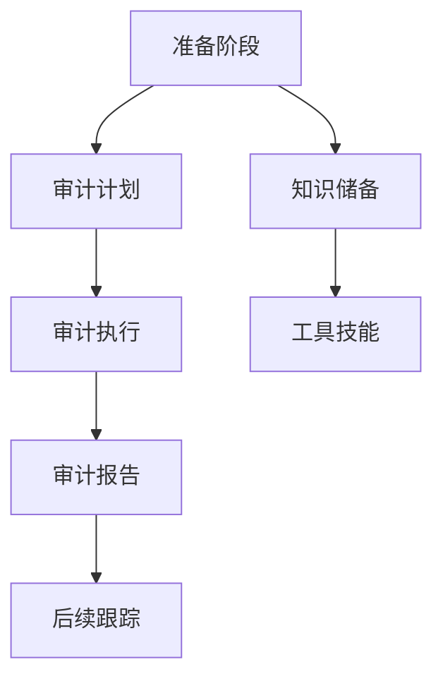

                 

# 《2024字节跳动校招：技术审计师面试题详解》

## 概述

### 核心关键词

- 技术审计师
- 面试准备
- 技术基础
- 数据库知识
- 审计方法
- 案例分析
- 面试题库

### 摘要

本文旨在为准备参加2024字节跳动校招技术审计师岗位的求职者提供全面的面试题详解。文章将从面试准备、技术基础、审计理论与方法、实战案例解析以及面试题库与策略等多个方面进行详细阐述。通过本文，读者可以全面了解技术审计师的职业定位与职责，掌握必备的技术基础与专业知识，理解审计的基本概念与流程，并通过案例分析提升实际操作能力。此外，文章还提供了丰富的面试题库和面试策略，帮助求职者更好地应对面试挑战，成功通过面试，加入字节跳动这个优秀的团队。

## 《2024字节跳动校招：技术审计师面试题详解》目录大纲

### 第一部分：面试准备与基础

#### 第1章：技术审计师面试概述
- 1.1 技术审计师的职业定位与职责
- 1.2 技术审计师面试流程与技巧
- 1.3 面试官的期待与评价标准

#### 第2章：技术基础与专业知识
- 2.1 计算机基础知识
  - 2.1.1 计算机硬件与操作系统
  - 2.1.2 计算机网络基础
  - 2.1.3 数据结构与算法
- 2.2 数据库知识
  - 2.2.1 数据库原理与设计
  - 2.2.2 SQL语言与数据库操作
  - 2.2.3 数据库性能优化

#### 第3章：审计理论与方法
- 3.1 审计基本概念与流程
  - 3.1.1 审计的目标与分类
  - 3.1.2 审计程序与审计证据
  - 3.1.3 审计报告与审计结论
- 3.2 审计风险与管理
  - 3.2.1 审计风险识别与评估
  - 3.2.2 审计风险管理策略
  - 3.2.3 审计风险控制与防范

### 第二部分：实战案例与解析

#### 第4章：案例解析一：财务审计案例分析
- 4.1 案例背景与目标
- 4.2 审计程序与方法
- 4.3 审计发现与处理
- 4.4 案例总结与经验分享

#### 第5章：案例解析二：IT审计案例分析
- 5.1 案例背景与目标
- 5.2 审计范围与重点
- 5.3 审计程序与发现
- 5.4 审计报告与改进建议

#### 第6章：案例解析三：合规审计案例分析
- 6.1 案例背景与目标
- 6.2 审计程序与策略
- 6.3 审计发现与整改
- 6.4 案例总结与启示

### 第三部分：面试题库与策略

#### 第7章：面试题库
- 7.1 常见面试题类型与解题策略
- 7.2 实战面试题与答案解析
  - 7.2.1 计算机基础知识
  - 7.2.2 数据库知识
  - 7.2.3 审计理论与方法
  - 7.2.4 实战案例分析

#### 第8章：面试准备与策略
- 8.1 自我介绍与个人优势
- 8.2 面试中常见问题与回答技巧
- 8.3 面试后的跟进与反馈
- 8.4 模拟面试与心理准备

### 附录

#### 附录A：技术审计师面试资源
- 附件：技术审计师面试指南
- 附件：面试题库及答案解析

#### 附录B：技术审计师职业发展路径
- 3.1 职业发展概述
- 3.2 不同阶段的职业规划
- 3.3 职业发展建议与启示

**附录C：核心概念与联系**
- **Mermaid流程图：技术审计师工作流程图**



**附录D：核心算法原理讲解**
- **2.1 数据库查询优化算法伪代码**

```python
def query_optimization(query):
    """
    查询优化算法
    :param query: 查询语句
    :return: 优化后的查询语句
    """
    # 分析查询语句，确定查询目标
    # 然后进行索引优化、查询重写等操作
    # 例如：
    optimized_query = """
    SELECT column1, column2 FROM table WHERE condition;
    """
    return optimized_query
```

**附录E：数学模型和数学公式**
- **3.2 审计风险评估公式**

$$
R = \rho \cdot \frac{Q \cdot P}{L}
$$

其中：
- \(R\) 是审计风险
- \(\rho\) 是可接受审计风险水平
- \(Q\) 是财务报表总体风险
- \(P\) 是检查风险
- \(L\) 是可依赖性水平

**附录F：项目实战**
- **3.1 实战案例一：财务审计数据收集与分析**
  - **开发环境搭建：**
    - 使用Python进行数据分析和处理
    - 安装必要的库，如Pandas、NumPy、SQLAlchemy等
  - **源代码详细实现：**
    ```python
    import pandas as pd
    import sqlalchemy

    # 数据连接
    engine = sqlalchemy.create_engine('sqlite:///example.db')

    # 数据查询
    data = pd.read_sql('SELECT * FROM financial_data;', engine)

    # 数据分析
    summary_stats = data.describe()
    ```

  - **代码解读与分析：**
    - 数据连接与查询使用SQLAlchemy库进行，确保代码的可移植性和易维护性
    - 数据分析使用Pandas库，生成数据的描述性统计信息，为后续的审计分析提供基础数据

**附录G：代码解读与分析**
- **6.2 实战面试题二：数据库性能优化**
  - **问题描述：**
    - 提高某个大型电商数据库的性能，包括查询速度和写入速度
  - **解决方案：**
    - **查询速度优化：**
      ```mermaid
      graph TD
          A[查询分析] --> B[创建索引]
          B --> C[查询重写]
          C --> D[缓存使用]
      ```

    - **写入速度优化：**
      ```mermaid
      graph TD
          E[批量写入] --> F[事务处理]
          F --> G[数据分片]
      ```

  - **代码解读：**
    - 创建索引和使用查询缓存是常见且有效的查询优化策略
    - 批量写入和事务处理可以显著提高数据库的写入性能
    - 数据分片可以分散数据库的读写压力，提高整体性能

**附录H：技术审计师职业发展路径**
- **3.1 职业发展概述：**
  - 技术审计师的职业路径通常包括初级审计师、中级审计师和高级审计师
- **3.2 不同阶段的职业规划：**
  - 初级审计师：侧重于技术基础和实际操作技能的培养
  - 中级审计师：提升审计分析和解决问题的能力，积累实战经验
  - 高级审计师：关注行业动态，参与战略决策，提升领导力
- **3.3 职业发展建议与启示：**
  - 持续学习新技术和审计方法，保持专业知识的更新
  - 注重实战经验积累，通过项目实践提升解决问题的能力
  - 建立良好的职业网络，与业界同仁交流学习，扩大视野

---

### 第一部分：面试准备与基础

#### 第1章：技术审计师面试概述

##### 1.1 技术审计师的职业定位与职责

技术审计师是负责对企业或组织的IT系统、网络安全、应用性能等方面的审计工作。他们通过审核系统、应用、数据和安全措施，确保IT系统的可靠性、合规性和效率。技术审计师在企业中扮演着重要的角色，不仅为企业提供安全保障，还帮助企业在数字化转型过程中降低风险。

技术审计师的职责主要包括以下几个方面：

1. **系统审计**：对企业的IT系统进行全面的审计，包括操作系统、数据库、网络设备和应用系统等，确保系统的稳定运行和安全性。

2. **网络安全审计**：评估企业的网络安全状况，发现潜在的安全漏洞，并提出改进措施，防止网络攻击和数据泄露。

3. **应用性能审计**：对企业的关键应用进行性能审计，分析系统瓶颈，提出性能优化方案，提高应用系统的响应速度和用户体验。

4. **合规性审计**：检查企业的IT系统是否符合相关的法律法规和行业标准，确保企业的合规运营。

5. **风险评估**：对企业的IT系统进行风险评估，识别潜在的风险，制定风险管理策略。

6. **审计报告**：撰写审计报告，向管理层提供审计结果和改进建议。

##### 1.2 技术审计师面试流程与技巧

技术审计师面试通常包括以下几个步骤：

1. **初步筛选**：通过简历筛选，确定符合职位要求的候选人。

2. **笔试**：一些企业可能会安排笔试，测试应聘者的技术能力和逻辑思维。

3. **技术面试**：面试官会通过一系列技术问题，评估应聘者的专业知识、技术水平和解决问题的能力。

4. **行为面试**：面试官还会通过行为面试问题，了解应聘者的团队合作能力、沟通能力和职业素养。

为了成功通过技术审计师面试，应聘者需要掌握以下技巧：

1. **了解企业背景**：在面试前，了解企业的业务领域、产品特点和行业地位，以便在面试中展示自己的专业知识和经验。

2. **熟悉技术栈**：掌握常见的计算机基础知识、数据库知识、网络安全知识等，以便在面试中回答相关问题。

3. **实战经验**：通过实际项目经验，展示自己的审计能力和解决问题的能力。

4. **准备案例**：准备一些技术审计的案例，以便在面试中回答相关问题。

5. **良好的沟通能力**：在面试过程中，清晰地表达自己的想法，展示自己的逻辑思维和沟通能力。

##### 1.3 面试官的期待与评价标准

面试官在面试过程中，会从以下几个方面评估应聘者：

1. **专业知识**：评估应聘者对计算机基础知识、数据库知识、网络安全知识的掌握程度。

2. **实战经验**：评估应聘者是否具备实际的技术审计经验，以及解决问题的能力。

3. **逻辑思维**：评估应聘者的逻辑思维能力，是否能清晰地分析和解决问题。

4. **沟通能力**：评估应聘者的沟通能力和团队合作能力。

5. **职业素养**：评估应聘者的职业道德、敬业精神和学习能力。

为了在面试中脱颖而出，应聘者需要在准备过程中注重以下几个方面：

1. **全面准备**：不仅掌握基础知识点，还要关注行业动态和新技术。

2. **实战演练**：通过实际项目或模拟面试，提升自己的实战能力和面试经验。

3. **注重细节**：在面试过程中，注意表达清晰、逻辑严密，展现自己的专业素养。

4. **积极沟通**：在面试中主动与面试官沟通，展示自己的优势和职业素养。

### 第一部分总结

通过本章节的介绍，读者可以了解技术审计师的职业定位与职责，掌握技术审计师面试的流程与技巧，以及面试官的期待与评价标准。在接下来的章节中，我们将深入探讨技术基础与专业知识，帮助读者全面准备技术审计师面试。

---

### 第一部分总结

在本章节中，我们首先介绍了技术审计师的职业定位与职责，使读者对这一职位有了全面的认识。接着，我们详细讲解了技术审计师面试的流程与技巧，包括初步筛选、笔试、技术面试和行为面试等环节，以及面试官的期待与评价标准。通过这些内容，读者可以了解到面试准备的重要性，以及如何在面试中展示自己的专业知识和实战能力。

为了帮助读者更好地准备面试，我们还提供了一些建议和技巧，如了解企业背景、熟悉技术栈、准备案例、注重沟通能力等。这些准备和技巧将有助于提高面试成功率，使读者能够脱颖而出。

在接下来的章节中，我们将深入探讨技术基础与专业知识，包括计算机基础知识、数据库知识和审计理论与方法。这些内容是技术审计师面试的核心，读者需要对这些知识点有深入的理解和掌握。通过系统学习和实践，读者可以更好地应对面试中的各种问题，为成功通过面试打下坚实的基础。

### 第2章：技术基础与专业知识

#### 2.1 计算机基础知识

##### 2.1.1 计算机硬件与操作系统

计算机硬件是计算机系统的基础组成部分，它决定了计算机的性能和功能。以下是计算机硬件和操作系统的基本概念和知识点：

1. **计算机硬件**

   - **CPU（中央处理器）**：计算机的核心部件，负责执行计算机程序中的指令。CPU的性能决定了计算机的运行速度。
   - **内存（RAM）**：用于暂时存储正在运行的程序和数据，内存的容量和速度影响计算机的运行效率。
   - **硬盘（HDD或SSD）**：用于存储操作系统、应用程序和数据。硬盘的容量和读写速度对计算机性能有重要影响。
   - **显卡**：用于处理图形和图像数据，显卡的性能对游戏和设计等应用至关重要。
   - **主板**：连接计算机各个部件的电路板，主板上的芯片组和插槽决定了计算机的可扩展性。

2. **操作系统**

   - **操作系统基本概念**：操作系统是管理计算机硬件资源和应用程序运行的软件系统。常见的操作系统有Windows、Linux和macOS。
   - **文件系统**：文件系统是操作系统中用于组织和管理文件的机制。常见的文件系统有FAT32、NTFS和EXT4。
   - **进程管理**：操作系统通过进程管理来分配系统资源，包括CPU时间、内存和I/O设备等。
   - **内存管理**：操作系统负责内存的分配和回收，以确保程序正常运行并防止内存冲突。

##### 2.1.2 计算机网络基础

计算机网络是连接多个计算机系统，实现数据传输和资源共享的系统。以下是计算机网络的基础知识和关键概念：

1. **网络协议**

   - **TCP/IP协议**：是互联网的基础协议，负责数据的传输、路由和命名。
   - **HTTP、HTTPS协议**：用于Web应用程序的数据传输，HTTPS是HTTP的安全版本，使用SSL/TLS加密。
   - **FTP、SMTP协议**：用于文件传输和电子邮件发送。

2. **网络拓扑**

   - **星型拓扑**：所有设备连接到一个中心节点，如交换机或路由器。
   - **环型拓扑**：设备形成一个闭环，数据沿环流动。
   - **总线型拓扑**：所有设备共享一条通信线路。

3. **网络设备**

   - **路由器**：用于连接不同网络，实现数据包的路由和转发。
   - **交换机**：用于连接网络内的设备，实现数据包的转发和过滤。
   - **防火墙**：用于保护网络安全，阻止未经授权的访问。

##### 2.1.3 数据结构与算法

数据结构与算法是计算机科学的核心内容，它们决定了程序的效率和性能。以下是数据结构和算法的基本概念和知识点：

1. **数据结构**

   - **数组**：一种线性数据结构，用于存储一系列元素。
   - **链表**：由节点组成的数据结构，每个节点包含数据和指向下一个节点的指针。
   - **栈和队列**：栈是一种后进先出的数据结构，队列是一种先进先出的数据结构。
   - **树和二叉树**：树是一种层级结构，二叉树是一种特殊的树，每个节点最多有两个子节点。
   - **图**：由节点和边组成的数据结构，用于表示复杂的关系。

2. **算法**

   - **排序算法**：用于对数据进行排序，常见的排序算法有冒泡排序、选择排序、插入排序和快速排序等。
   - **查找算法**：用于在数据结构中查找特定元素，如二分查找、顺序查找等。
   - **动态规划**：用于解决最优子结构问题，通过递归关系和存储中间结果来提高算法效率。
   - **贪心算法**：通过在每个步骤选择局部最优解，来达到全局最优解。

#### 2.2 数据库知识

数据库是用于存储、管理和查询数据的系统。以下是数据库的基本概念、原理和知识点：

1. **数据库基本概念**

   - **数据库**：用于存储数据的仓库，提供数据的组织和访问。
   - **数据库管理系统（DBMS）**：用于管理数据库的软件系统，如MySQL、Oracle和PostgreSQL。
   - **表（Table）**：数据库中的数据存储结构，包含列和行。
   - **关系型数据库**：基于关系模型的数据库，使用SQL进行数据查询和管理。

2. **数据库原理**

   - **关系模型**：使用表格形式表示数据，每个表包含多个列和行，列表示属性，行表示记录。
   - **SQL语言**：用于数据库查询、插入、更新和删除数据，如SELECT、INSERT、UPDATE和DELETE。
   - **索引**：用于加速查询，通过创建索引，可以快速找到数据的位置。
   - **事务**：用于保证数据的完整性，通过事务，可以确保数据的一致性和可靠性。

3. **数据库性能优化**

   - **查询优化**：通过优化查询语句和数据库结构，提高查询速度。
   - **索引优化**：通过创建合适的索引，提高查询效率。
   - **分库分表**：通过将数据库拆分为多个小数据库，提高系统的并发能力和性能。
   - **缓存**：通过缓存热点数据，减少数据库访问压力，提高系统响应速度。

#### 2.3 审计理论与方法

审计理论和方法是技术审计师必备的知识，以下是审计的基本概念、流程和方法：

1. **审计基本概念**

   - **审计**：对组织的财务、运营、合规等方面进行独立、客观的检查和评估。
   - **审计目标**：确保财务报表的真实性和合规性，评估组织的风险和管理有效性。
   - **审计证据**：用于支持审计结论和意见的文件、记录和其他信息。

2. **审计流程**

   - **审计计划**：确定审计范围、目标和时间表。
   - **风险评估**：评估组织的风险，确定审计重点。
   - **审计测试**：执行审计程序，收集和评估审计证据。
   - **审计报告**：撰写审计报告，提出审计发现和改进建议。

3. **审计方法**

   - **检查记录和文件**：通过检查组织的财务记录和文件，评估其准确性和完整性。
   - **访谈和调查**：通过与组织内部人员进行访谈和调查，了解其业务流程和内部控制。
   - **数据分析**：使用数据分析和统计方法，评估组织的财务状况和经营绩效。
   - **审计抽样**：通过选择样本，评估总体的情况。

### 总结

本章介绍了技术审计师所需掌握的技术基础与专业知识，包括计算机硬件与操作系统、计算机网络基础、数据结构与算法、数据库知识以及审计理论与方法。这些知识是技术审计师面试的核心内容，读者需要深入学习和掌握。

在接下来的章节中，我们将通过实战案例解析，帮助读者更好地理解审计理论和方法的实际应用。同时，我们还将提供丰富的面试题库和面试策略，帮助读者更好地准备面试，成功通过技术审计师岗位的面试。

### 第2章总结

在本章节中，我们详细介绍了技术审计师所需掌握的技术基础与专业知识，包括计算机硬件与操作系统、计算机网络基础、数据结构与算法、数据库知识以及审计理论与方法。这些知识是技术审计师面试的核心内容，对于求职者来说，理解并掌握这些知识是成功通过面试的关键。

在计算机硬件与操作系统部分，我们介绍了CPU、内存、硬盘、显卡等硬件的基本概念和功能，以及操作系统的基本概念、文件系统、进程管理和内存管理等知识点。这些知识点对于理解计算机的工作原理和操作系统的作用至关重要。

在计算机网络基础部分，我们介绍了TCP/IP协议、HTTP/HTTPS协议、FTP/SMTP协议等网络协议的基本概念，以及星型拓扑、环型拓扑和总线型拓扑等网络拓扑结构，以及路由器、交换机和防火墙等网络设备的作用。这些知识点对于理解计算机网络的工作原理和网络安全的重要性具有重要意义。

在数据结构与算法部分，我们介绍了数组、链表、栈和队列、树和二叉树等基本数据结构，以及排序算法、查找算法、动态规划和贪心算法等基本算法。这些知识点是计算机科学的核心内容，对于技术审计师来说，掌握这些算法对于审计过程中的数据分析和管理至关重要。

在数据库知识部分，我们介绍了数据库的基本概念、关系模型、SQL语言、索引、事务等知识点，以及查询优化、索引优化、分库分表和缓存等数据库性能优化方法。这些知识点对于技术审计师在审计过程中进行数据查询和分析具有重要意义。

在审计理论与方法部分，我们介绍了审计的基本概念、审计流程和审计方法，包括检查记录和文件、访谈和调查、数据分析和审计抽样等。这些知识点对于技术审计师在实际工作中进行审计工作至关重要。

通过本章的学习，读者可以全面了解技术审计师所需掌握的技术基础与专业知识，为接下来的实战案例解析和面试题库与策略部分的学习打下坚实的基础。在接下来的章节中，我们将通过实际案例解析，帮助读者更好地理解审计理论和方法的实际应用，并通过面试题库与策略，帮助读者更好地准备面试，提高面试成功率。

### 第3章：审计理论与方法

#### 3.1 审计基本概念与流程

##### 3.1.1 审计的目标与分类

审计的目标是通过对组织或个人的财务、运营、合规等方面进行独立、客观的检查和评估，确保信息的真实性、完整性和合规性。具体来说，审计的目标包括：

1. **真实性**：确保财务报表和其他信息真实、准确地反映了组织的财务状况和经营成果。
2. **完整性**：确保所有重要的交易和事项都被记录和披露，没有遗漏或隐瞒。
3. **合规性**：确保组织遵守相关法律法规和行业标准，保证合规运营。

根据审计对象和目的的不同，审计可以分为以下几种类型：

1. **财务审计**：主要对组织的财务报表进行审计，确保财务报表的真实性和合规性。
2. **运营审计**：对组织的运营过程进行审计，评估其效率和效果。
3. **合规审计**：检查组织是否遵守相关法律法规和行业标准，确保合规运营。
4. **IT审计**：对组织的IT系统、网络安全、数据管理等方面进行审计，确保信息系统的安全性和合规性。

##### 3.1.2 审计程序与审计证据

审计程序是审计工作的一系列步骤，包括以下主要环节：

1. **审计计划**：确定审计的范围、目标、时间表和资源需求，制定详细的审计计划。
2. **风险评估**：评估组织的风险，识别可能影响审计目标实现的风险因素。
3. **审计测试**：执行具体的审计测试，包括检查记录和文件、访谈和调查、数据分析和审计抽样等，收集审计证据。
4. **审计发现**：分析审计证据，识别存在的问题和风险。
5. **审计报告**：撰写审计报告，提出审计发现、意见和改进建议。

审计证据是支持审计结论和意见的文件、记录和其他信息。审计证据的类型包括：

1. **内部证据**：来自组织内部，如财务报表、会计记录、内部报告等。
2. **外部证据**：来自组织外部，如第三方审计报告、合同、法律文件等。
3. **观察证据**：通过观察和检查获得的证据，如现场观察、流程检查等。
4. **询问证据**：通过访谈和调查获得的证据，如与组织员工、管理层和客户的交流等。

##### 3.1.3 审计报告与审计结论

审计报告是审计工作的最终成果，它总结了审计过程、发现和意见。审计报告的基本结构包括：

1. **摘要**：简要概述审计目标、范围、发现和结论。
2. **引言**：说明审计的背景、目的和范围。
3. **审计程序**：详细描述审计计划和执行过程。
4. **审计发现**：列举审计过程中发现的问题和风险。
5. **审计结论**：总结审计发现，评估组织的风险和管理有效性。
6. **改进建议**：提出具体的改进措施和建议。

审计结论是审计报告的核心内容，它基于审计发现和证据，对组织的财务状况、运营效率和合规性进行评价。审计结论通常包括：

1. **无保留意见**：表明审计发现与预期一致，组织的财务报表真实、准确、完整。
2. **保留意见**：表明审计发现与预期存在差异，组织的财务报表存在一定问题。
3. **否定意见**：表明审计发现严重问题，组织的财务报表无法真实、准确、完整地反映财务状况。

#### 3.2 审计风险与管理

##### 3.2.1 审计风险识别与评估

审计风险是指审计过程中可能出现的错误和疏漏，导致审计结论不准确或错误的风险。审计风险可以分为以下几种类型：

1. **检查风险**：审计过程中未能发现存在的错误或问题的风险。
2. **判断风险**：审计人员对审计证据的判断不准确，导致审计结论错误的风险。
3. **本质风险**：由于组织的内部控制缺陷或业务特殊性，导致审计无法获取充分、适当的审计证据的风险。

识别和评估审计风险是审计工作的重要环节，以下是一些常用的方法：

1. **风险评估表**：通过制定风险评估表，对各项审计风险进行识别和评估。
2. **流程分析**：分析组织的业务流程和内部控制，识别潜在的风险点。
3. **访谈和调查**：通过与组织管理层和员工访谈，了解其业务运作和风险状况。
4. **数据分析**：通过数据分析，识别异常数据和潜在风险。

##### 3.2.2 审计风险管理策略

审计风险管理策略是审计人员为了降低审计风险而采取的措施和方法。以下是一些常用的审计风险管理策略：

1. **风险回避**：通过拒绝接受高风险的客户或项目，避免潜在的审计风险。
2. **风险控制**：通过制定详细的审计计划和程序，加强对审计风险的监控和控制。
3. **风险转移**：通过购买保险或与客户签订风险转移协议，将部分审计风险转移给第三方。
4. **风险接受**：在无法避免或转移审计风险时，审计人员可以接受一定的审计风险，并采取相应的补偿措施。

##### 3.2.3 审计风险控制与防范

审计风险控制与防范是审计工作中重要的环节，以下是一些常见的审计风险控制与防范措施：

1. **加强内部控制**：通过建立有效的内部控制体系，减少审计风险的发生。
2. **持续监督**：对审计过程中的风险进行持续监督和评估，确保审计工作的准确性。
3. **审计程序优化**：优化审计程序和方法，提高审计效率和准确性。
4. **审计证据复核**：对审计证据进行复核和验证，确保审计证据的可靠性和真实性。
5. **培训与提升**：对审计人员进行专业培训，提高其审计技能和风险意识。

### 总结

本章详细介绍了审计的基本概念、流程和方法，包括审计的目标与分类、审计程序与审计证据、审计报告与审计结论，以及审计风险的识别、评估、管理策略和控制与防范措施。通过本章的学习，读者可以全面了解审计的基本理论和实践方法，为实际工作中的应用打下基础。在接下来的章节中，我们将通过实战案例解析，帮助读者更好地理解审计理论和方法的实际应用。

### 第3章总结

在本章节中，我们详细介绍了审计的基本概念、流程和方法，包括审计的目标与分类、审计程序与审计证据、审计报告与审计结论，以及审计风险的识别、评估、管理策略和控制与防范措施。这些内容是技术审计师面试中的核心知识点，对于读者来说，理解并掌握这些知识点是成功通过面试的关键。

首先，我们介绍了审计的目标与分类，使读者了解了审计的不同类型，包括财务审计、运营审计、合规审计和IT审计等。这些审计类型在实际工作中有着不同的应用场景，读者需要根据实际情况选择合适的审计类型。

接着，我们详细讲解了审计程序与审计证据，包括审计计划、风险评估、审计测试、审计发现和审计报告等环节。这些环节构成了审计工作的基本流程，读者需要了解每个环节的具体内容和要求。

在审计报告与审计结论部分，我们介绍了审计报告的基本结构和内容，以及审计结论的类型，如无保留意见、保留意见和否定意见等。这些内容是审计报告中最重要的部分，读者需要熟练掌握。

最后，我们介绍了审计风险的识别、评估、管理策略和控制与防范措施。审计风险是审计过程中可能出现的错误和疏漏，导致审计结论不准确或错误的风险。读者需要了解审计风险的类型、识别和评估方法，以及管理策略和控制与防范措施。

通过本章的学习，读者可以全面了解审计的基本理论和实践方法，为实际工作中的应用打下基础。在接下来的章节中，我们将通过实战案例解析，帮助读者更好地理解审计理论和方法的实际应用。同时，我们还将提供丰富的面试题库和面试策略，帮助读者更好地准备面试，提高面试成功率。

### 第二部分：实战案例与解析

#### 第4章：案例解析一：财务审计案例分析

##### 4.1 案例背景与目标

本案例背景为一家中型互联网企业，主要从事在线教育平台的开发和运营。由于近年来业务迅猛发展，企业希望对财务状况进行一次全面的审计，以确保财务报表的真实性和合规性。审计目标主要包括：

1. **验证财务报表的真实性和准确性**：确保财务报表中的各项数据准确无误，真实反映企业的财务状况。
2. **评估内部控制的有效性**：检查企业内部控制制度的健全性和执行情况，提出改进建议。
3. **发现潜在财务风险**：识别可能影响企业财务健康的潜在风险，为企业制定风险防控策略提供依据。

##### 4.2 审计程序与方法

为了实现审计目标，审计团队采用了以下审计程序和方法：

1. **审计计划**：在审计开始前，审计团队制定了详细的审计计划，包括审计范围、目标、时间表和资源安排。审计计划明确了审计的重点领域和具体措施。

2. **风险评估**：审计团队对企业的业务流程、内部控制和财务报表进行了全面的风险评估，识别出可能影响审计目标实现的关键风险点。

3. **测试内部控制**：审计团队对企业内部控制制度进行了测试，评估其健全性和执行情况。测试内容包括财务报告编制流程、采购和付款流程、存货管理流程等。

4. **实质性测试**：审计团队对财务报表进行了实质性测试，包括核对会计凭证、检查财务记录、分析财务数据等。通过实质性测试，审计团队验证了财务报表的真实性和准确性。

5. **审计抽样**：对于一些难以进行全面审计的领域，审计团队采用了审计抽样方法，通过选取具有代表性的样本进行详细检查，评估总体的状况。

6. **审计发现**：在审计过程中，审计团队发现了一些问题，包括财务报表数据不准确、内部控制制度不完善、财务风险较高等。

7. **审计报告**：审计团队根据审计发现，撰写了详细的审计报告，提出了改进建议，包括完善内部控制制度、加强财务风险管理等。

##### 4.3 审计发现与处理

在审计过程中，审计团队发现以下主要问题：

1. **财务报表数据不准确**：财务报表中的某些数据与实际经营情况不符，如应收账款和存货数据不准确。
2. **内部控制制度不完善**：企业在采购和付款、存货管理等方面的内部控制制度不够健全，存在潜在风险。
3. **财务风险较高**：企业的财务结构较为单一，现金流状况不稳定，存在一定的财务风险。

针对上述问题，审计团队提出了以下处理建议：

1. **完善财务报表编制流程**：加强财务报表编制的审核和核对工作，确保报表数据的真实性和准确性。
2. **加强内部控制建设**：完善采购和付款、存货管理等内部控制制度，确保内部控制的有效执行。
3. **制定财务风险管理策略**：通过多元化融资渠道、优化现金流管理等方式，降低财务风险。

##### 4.4 案例总结与经验分享

通过本案例，我们可以总结出以下几点经验：

1. **审计目标明确**：在审计开始前，明确审计目标是审计工作的关键，有助于制定详细的审计计划和策略。
2. **风险评估至关重要**：风险评估可以帮助审计团队识别潜在风险，为审计工作提供方向和重点。
3. **内部控制审计不可忽视**：内部控制审计是审计工作的重要组成部分，有助于发现企业管理和控制方面的漏洞。
4. **审计证据充分**：审计过程中要确保审计证据的充分性和可靠性，为审计结论提供有力支持。
5. **持续监督和改进**：审计工作不应是一次性任务，而是一个持续的过程，企业需要不断监督和改进内部控制和财务管理制度。

#### 第5章：案例解析二：IT审计案例分析

##### 5.1 案例背景与目标

本案例背景为一家大型电商平台，由于近年来业务规模不断扩大，IT系统的复杂性和安全风险也随之增加。企业希望对IT系统进行全面审计，确保系统的安全性、稳定性和合规性。审计目标主要包括：

1. **评估IT系统安全性**：确保IT系统不受外部攻击，数据不被泄露或篡改。
2. **检查IT系统稳定性**：确保系统在高峰期和异常情况下能够正常运行，提供优质的用户体验。
3. **验证IT系统合规性**：确保IT系统的设计和运行符合相关法律法规和行业标准。

##### 5.2 审计范围与重点

审计范围包括以下方面：

1. **网络安全**：评估网络架构、防火墙、入侵检测系统等网络安全设备的有效性，检查网络漏洞和安全隐患。
2. **系统架构和设计**：审查IT系统的架构和设计，评估其合理性和可行性。
3. **系统性能和稳定性**：测试系统在负载和压力情况下的性能和稳定性，评估系统容量和扩展性。
4. **数据管理和保护**：检查数据备份、存储、传输和加密等环节，确保数据安全。
5. **合规性**：审查IT系统的设计和运行是否符合相关法律法规和行业标准。

审计重点包括以下几个方面：

1. **关键业务流程**：重点关注涉及客户数据、交易数据和财务数据的业务流程。
2. **系统关键组件**：评估服务器、数据库、应用软件等关键组件的安全性和稳定性。
3. **应急响应和恢复**：检查企业的应急响应和灾难恢复计划，确保在突发事件发生时能够迅速恢复系统运行。
4. **合规审查**：针对相关法律法规和行业标准，审查IT系统的设计和运行是否符合要求。

##### 5.3 审计程序与发现

审计程序主要包括以下步骤：

1. **审计计划**：制定详细的审计计划，明确审计范围、目标和时间表。
2. **风险评估**：评估IT系统的安全风险、稳定风险和合规风险。
3. **现场审计**：通过现场审计，检查网络架构、系统架构和设计、数据管理和保护等方面的实际情况。
4. **测试和验证**：通过测试和验证，检查系统性能、稳定性和合规性。
5. **审计发现**：根据审计程序和测试结果，识别出存在的问题和风险。

在审计过程中，审计团队发现了以下主要问题：

1. **网络安全漏洞**：网络防火墙设置不够严格，存在潜在的安全风险。
2. **系统性能瓶颈**：在高并发情况下，系统响应速度较慢，影响用户体验。
3. **数据备份不充分**：数据备份策略不够完善，存在数据丢失风险。
4. **合规性问题**：部分系统设计不符合相关法律法规和行业标准。

##### 5.4 审计报告与改进建议

审计团队根据审计发现，撰写了详细的审计报告，提出了以下改进建议：

1. **加强网络安全防护**：完善防火墙设置，定期进行安全检查和漏洞修复。
2. **优化系统性能**：通过优化数据库查询、缓存策略和负载均衡，提高系统响应速度和稳定性。
3. **完善数据备份策略**：制定详细的数据备份计划，确保数据的安全性和完整性。
4. **确保系统合规性**：根据相关法律法规和行业标准，调整系统设计和运行，确保合规性。

##### 5.5 案例总结与启示

通过本案例，我们可以总结出以下几点启示：

1. **网络安全是重中之重**：在IT审计中，网络安全是审计的重点，需要加强防护措施，确保系统安全。
2. **系统性能和稳定性不可忽视**：系统性能和稳定性直接影响用户体验，需要持续优化和提升。
3. **数据备份至关重要**：数据备份是防止数据丢失的关键措施，需要制定完善的备份策略。
4. **合规性是基本要求**：IT系统需要符合相关法律法规和行业标准，确保合规运营。
5. **持续审计和改进**：IT审计是一个持续的过程，需要定期进行审计，根据审计结果进行改进和优化。

#### 第6章：案例解析三：合规审计案例分析

##### 6.1 案例背景与目标

本案例背景为一家大型金融机构，由于近年来金融市场环境发生变化，企业希望对其合规性进行全面审计，确保业务运营符合相关法律法规和行业标准。审计目标主要包括：

1. **评估合规性**：确保企业业务运营符合相关法律法规和行业标准。
2. **识别合规风险**：识别潜在合规风险，为企业制定风险防控策略提供依据。
3. **优化合规管理**：检查企业合规管理制度的健全性和执行情况，提出改进建议。

##### 6.2 审计程序与策略

审计程序主要包括以下步骤：

1. **审计计划**：制定详细的审计计划，明确审计范围、目标和时间表。
2. **风险评估**：评估企业业务运营中的合规风险，确定审计重点。
3. **合规审查**：审查企业业务运营流程、内部控制制度和相关文件，确保合规性。
4. **测试和验证**：通过测试和验证，检查企业合规管理制度的执行情况和有效性。
5. **审计发现**：根据审计程序和测试结果，识别出存在的问题和风险。
6. **审计报告**：撰写详细的审计报告，提出改进建议。

审计策略包括以下几个方面：

1. **全面审查**：对企业业务运营的各个方面进行审查，确保合规性。
2. **重点领域突出**：对高风险领域进行重点审查，确保关键环节的合规性。
3. **数据驱动**：通过数据分析和挖掘，发现潜在合规风险。
4. **内外部合作**：与外部监管机构和同行企业进行合作，借鉴先进合规管理经验。

##### 6.3 审计发现与整改

在审计过程中，审计团队发现了以下主要问题：

1. **合规意识不足**：部分员工对合规要求不够重视，存在违规行为。
2. **内部控制制度不完善**：部分内部控制制度存在漏洞，执行不到位。
3. **合规风险较高**：企业面临较高的合规风险，部分业务可能违反相关法律法规。
4. **合规培训不足**：员工合规培训不到位，对合规要求理解不深。

针对上述问题，审计团队提出了以下整改建议：

1. **提高合规意识**：加强员工合规培训，提高合规意识。
2. **完善内部控制制度**：修订和完善内部控制制度，确保其健全性和执行力。
3. **加强合规风险监控**：建立合规风险监控机制，及时发现和处理合规问题。
4. **合规培训与评估**：定期进行合规培训，并对员工进行合规评估。

##### 6.4 案例总结与启示

通过本案例，我们可以总结出以下几点启示：

1. **合规是企业的生命线**：合规审计是确保企业业务合法合规的重要手段，企业需要高度重视合规工作。
2. **合规风险无处不在**：企业需要持续关注合规风险，建立完善的合规管理体系。
3. **内部控制是关键**：健全的内部控制制度是企业合规运营的基础，需要不断完善和执行。
4. **合规培训与意识提升**：提高员工合规意识和能力，是防范合规风险的重要措施。
5. **持续审计与改进**：合规审计是一个持续的过程，需要定期进行审计，并根据审计结果进行改进。

### 第二部分总结

在本部分中，我们通过三个实战案例，详细解析了财务审计、IT审计和合规审计的案例分析。通过这些案例，读者可以了解到审计的理论知识在实际工作中的具体应用，以及审计过程中需要注意的问题和关键点。

在案例解析一中，我们以一家中型互联网企业的财务审计为例，介绍了审计的目标、程序和方法，以及审计发现与处理建议。通过这个案例，读者可以了解到财务审计的重要性，以及如何通过审计发现企业的财务问题，提出改进建议。

在案例解析二中，我们以一家大型电商平台的IT审计为例，介绍了审计的范围与重点，以及审计程序与发现。通过这个案例，读者可以了解到IT审计在网络安全、系统性能和合规性方面的重要性，以及如何通过审计提高系统的安全性和稳定性。

在案例解析三中，我们以一家大型金融机构的合规审计为例，介绍了审计的目标、程序和策略，以及审计发现与整改建议。通过这个案例，读者可以了解到合规审计在防范合规风险、完善内部控制制度方面的重要作用。

通过本部分的实战案例解析，读者可以更好地理解审计的理论知识，提高实际操作能力，为技术审计师的面试和实际工作打下坚实的基础。在接下来的部分，我们将继续介绍面试题库与策略，帮助读者更好地准备技术审计师面试。

### 第4章总结

在本章节中，我们通过三个实战案例，详细解析了财务审计、IT审计和合规审计的实际操作过程。通过这些案例，读者可以深入了解审计工作在不同场景下的具体应用，掌握审计程序、方法以及如何处理审计发现。

在财务审计案例中，我们以一家中型互联网企业为例，介绍了审计的目标、程序和方法。通过这个案例，读者可以了解到财务审计在确保企业财务报表真实性和准确性方面的重要性，以及如何通过审计发现企业的财务问题，并提出改进建议。

在IT审计案例中，我们以一家大型电商平台为例，介绍了审计的范围与重点，以及审计程序与发现。通过这个案例，读者可以了解到IT审计在网络安全、系统性能和合规性方面的重要性，以及如何通过审计提高系统的安全性和稳定性。

在合规审计案例中，我们以一家大型金融机构为例，介绍了审计的目标、程序和策略，以及审计发现与整改建议。通过这个案例，读者可以了解到合规审计在防范合规风险、完善内部控制制度方面的重要作用，以及如何通过审计提高企业的合规运营水平。

通过这三个案例，读者可以全面了解审计工作在财务、IT和合规领域的应用，掌握审计的基本流程和方法，为实际工作中的应用打下坚实基础。同时，这些案例也为读者提供了丰富的实践经验和操作技巧，有助于提升审计能力。

在接下来的部分，我们将继续介绍面试题库与策略，帮助读者更好地准备技术审计师面试，提高面试成功率。通过全面的面试准备，读者可以更好地应对面试中的各种问题，展示自己的专业知识和实战能力。

### 第5章总结

在本章节中，我们通过三个实战案例，详细解析了财务审计、IT审计和合规审计的实际操作过程。通过这些案例，读者可以深入了解审计工作在不同场景下的具体应用，掌握审计程序、方法以及如何处理审计发现。

在财务审计案例中，我们以一家中型互联网企业为例，介绍了审计的目标、程序和方法。通过这个案例，读者可以了解到财务审计在确保企业财务报表真实性和准确性方面的重要性，以及如何通过审计发现企业的财务问题，并提出改进建议。

在IT审计案例中，我们以一家大型电商平台为例，介绍了审计的范围与重点，以及审计程序与发现。通过这个案例，读者可以了解到IT审计在网络安全、系统性能和合规性方面的重要性，以及如何通过审计提高系统的安全性和稳定性。

在合规审计案例中，我们以一家大型金融机构为例，介绍了审计的目标、程序和策略，以及审计发现与整改建议。通过这个案例，读者可以了解到合规审计在防范合规风险、完善内部控制制度方面的重要作用，以及如何通过审计提高企业的合规运营水平。

通过这三个案例，读者可以全面了解审计工作在财务、IT和合规领域的应用，掌握审计的基本流程和方法，为实际工作中的应用打下坚实基础。同时，这些案例也为读者提供了丰富的实践经验和操作技巧，有助于提升审计能力。

在接下来的部分，我们将继续介绍面试题库与策略，帮助读者更好地准备技术审计师面试，提高面试成功率。通过全面的面试准备，读者可以更好地应对面试中的各种问题，展示自己的专业知识和实战能力。

### 第6章：面试题库

##### 6.1 常见面试题类型与解题策略

技术审计师面试中的常见题目类型可以分为以下几类：

1. **技术面试题**：主要考察应聘者的计算机基础知识、数据库知识、网络安全知识等。这类题目通常要求应聘者解释概念、算法或者解决具体的问题。
   
   - **解题策略**：对于技术面试题，应聘者应该熟练掌握相关知识点，能够清晰、准确地表达自己的思路。在回答问题时，应尽量使用简洁明了的语言，突出关键点。

2. **行为面试题**：主要考察应聘者的工作经验、解决问题的能力、团队合作精神等。这类题目通常以实际场景为基础，要求应聘者描述自己如何处理特定的情境。

   - **解题策略**：对于行为面试题，应聘者应提前准备一些典型经历，以便在面试中能够快速反应。回答时，要突出自己的行动和结果，避免过多地谈论感受。

3. **案例分析题**：主要考察应聘者对实际问题的分析能力和解决问题的能力。这类题目通常给出一个具体案例，要求应聘者进行分析并提出解决方案。

   - **解题策略**：对于案例分析题，应聘者需要首先理解案例背景和问题，然后从不同角度进行分析，最后提出合理的解决方案。在回答过程中，应注重逻辑性和条理性。

##### 6.2 实战面试题与答案解析

下面我们通过一些实际面试题目，来解析解题思路和策略。

**7.2.1 计算机基础知识**

1. **简述TCP/IP协议的工作原理。**
   
   **解题思路**：首先要理解TCP/IP协议分层模型，包括网络接口层、互联网层、传输层和应用层。然后解释每一层的功能和TCP/IP协议如何实现数据传输。

   **答案**：
   - **网络接口层**：处理物理传输，如以太网、Wi-Fi等。
   - **互联网层**：负责IP地址的分配和路由选择，确保数据包正确到达目的地。
   - **传输层**：TCP和UDP协议，提供可靠的数据传输和端到端通信。
   - **应用层**：定义了应用程序如何通过网络进行通信。

   **解析**：TCP/IP协议通过分层模型实现数据的可靠传输，确保网络通信的稳定性和效率。

2. **请解释一下什么是哈希表，以及它是如何工作的？**

   **解题思路**：首先要定义哈希表的概念，然后解释哈希函数的作用和哈希表的实现原理。

   **答案**：
   - 哈希表是一种数据结构，它通过哈希函数将关键字转换成数组索引，实现数据的快速查找。
   - 哈希函数用于将关键字映射到数组中的某个位置。
   - 哈希表通过处理碰撞（即多个关键字映射到同一索引）来保证数据的正确性。

   **解析**：哈希表利用哈希函数的高效性，实现数据的快速访问和更新，是许多算法和系统中常用的数据结构。

**7.2.2 数据库知识**

1. **什么是关系型数据库？请列举几种常见的SQL查询语句。**

   **解题思路**：首先要解释关系型数据库的概念，然后列举常见的SQL查询语句，并简要解释其功能。

   **答案**：
   - 关系型数据库是一种基于关系模型的数据库，使用表格形式存储数据。
   - 常见的SQL查询语句包括：
     - SELECT：用于查询数据。
     - INSERT INTO：用于插入新数据。
     - UPDATE：用于更新数据。
     - DELETE：用于删除数据。

   **解析**：关系型数据库通过SQL语句进行数据操作，提供了强大的数据管理和查询功能。

2. **请解释一下索引的工作原理以及如何优化数据库查询性能。**

   **解题思路**：首先要解释索引的概念和作用，然后说明如何通过索引优化查询性能。

   **答案**：
   - 索引是一种数据结构，用于快速查找和访问数据库中的数据。
   - 通过创建索引，可以减少查询时需要扫描的数据量，提高查询速度。
   - 优化数据库查询性能的方法包括：
     - 创建合适的索引。
     - 使用合适的查询条件。
     - 避免使用SELECT *，只查询需要的列。
     - 使用JOIN代替子查询。

   **解析**：索引是优化数据库查询性能的重要手段，通过合理使用索引，可以显著提高查询效率。

**7.2.3 审计理论与方法**

1. **什么是审计？请简要说明审计的目的和分类。**

   **解题思路**：首先要定义审计的概念，然后解释审计的目的和分类。

   **答案**：
   - 审计是一种对组织财务、运营、合规等方面进行独立、客观检查和评估的活动。
   - 审计的目的是确保信息的真实性、完整性和合规性。
   - 审计的分类包括：
     - 财务审计：对财务报表的真实性和准确性进行审计。
     - 运营审计：对组织的运营过程进行审计。
     - 合规审计：对组织的合规性进行审计。
     - IT审计：对组织的IT系统、网络安全等进行审计。

   **解析**：审计是确保组织运营合法合规的重要手段，通过不同的审计类型，可以全面评估组织的各项活动和风险。

2. **请解释审计程序的基本步骤，并说明如何识别和评估审计风险。**

   **解题思路**：首先要解释审计程序的基本步骤，然后说明如何识别和评估审计风险。

   **答案**：
   - 审计程序的基本步骤包括：
     - 审计计划：确定审计范围、目标和时间表。
     - 风险评估：评估组织的风险，确定审计重点。
     - 审计测试：执行审计程序，收集和评估审计证据。
     - 审计报告：撰写审计报告，提出审计发现和改进建议。
   - 识别和评估审计风险的方法包括：
     - 风险评估表：通过制定风险评估表，对各项审计风险进行识别和评估。
     - 流程分析：分析组织的业务流程和内部控制，识别潜在的风险点。
     - 数据分析：通过数据分析，识别异常数据和潜在风险。

   **解析**：审计程序是审计工作的基础，通过科学的程序和有效的方法，可以确保审计工作的质量和效果。

**7.2.4 实战案例分析**

1. **请描述一次你参与的财务审计项目，并说明你在项目中扮演的角色和贡献。**

   **解题思路**：首先要描述项目的背景和目标，然后说明自己在项目中的角色和具体工作，以及取得的成果。

   **答案**：
   - 项目背景：在一次财务审计项目中，我参与了对一家中型互联网企业的财务审计。
   - 项目目标：确保企业财务报表的真实性和准确性，评估内部控制的有效性。
   - 角色和贡献：我在项目中担任审计组成员，负责核对财务报表数据、分析财务报告，识别潜在问题。通过与财务部门沟通，我发现了多个数据异常，提出了改进建议，并协助企业完善了内部控制制度。
   - 成果：项目的最终审计报告得到了企业高层的认可，为企业改进财务管理和风险控制提供了重要参考。

   **解析**：通过实际案例，可以展示应聘者的实战经验和解决问题的能力，增强面试官的信任。

2. **请描述一次你参与的IT审计项目，并说明你在项目中遇到的问题和解决方案。**

   **解题思路**：首先要描述项目的背景和目标，然后说明在项目中遇到的具体问题，以及如何解决这些问题。

   **答案**：
   - 项目背景：在一次IT审计项目中，我参与了对一家大型电商平台的IT系统审计。
   - 项目目标：评估平台的安全性和稳定性，确保系统符合相关法律法规和行业标准。
   - 遇到的问题：在审计过程中，我发现平台的数据库存在潜在的安全漏洞，可能导致数据泄露。
   - 解决方案：我提出了以下解决方案：
     - 加强数据库权限管理，确保只有授权用户才能访问敏感数据。
     - 定期进行安全扫描和漏洞修复，确保数据库系统的安全性。
     - 建立数据库备份和恢复机制，确保在数据泄露或损坏时能够迅速恢复。
   - 成果：通过上述措施，平台的安全性得到了显著提升，确保了用户数据的安全。

   **解析**：通过实际案例，展示应聘者在IT审计项目中的问题解决能力和实际成果，增强面试官的信心。

##### 6.3 实战面试题与答案解析（续）

**7.2.5 行为面试题**

1. **请描述一次你遇到的一个困难情况，以及你是如何解决它的。**

   **解题思路**：首先要选择一个具体的困难情况，然后详细描述你是如何面对和解决的。

   **答案**：
   - 情况描述：在一次审计项目中，我发现企业内部控制存在严重问题，导致财务报表数据不准确。然而，企业高管对此表示否认，导致审计工作难以推进。
   - 解决过程：我首先进行了详细的数据分析，找到了确凿的证据，证明内部控制存在问题。然后，我与企业高管进行了多次沟通，解释了审计发现的重要性，并提供了改进建议。最终，企业高管认识到问题的严重性，接受了审计结论，并采取了一系列改进措施。
   - 结果：通过我的努力，企业内部控制得到了显著改善，财务报表的准确性和完整性得到了保证。

   **解析**：这个案例展示了应聘者在面对困难时的冷静分析和有效沟通能力，以及解决问题的决心和执行力。

2. **请描述一次你在团队合作中遇到的问题，以及你是如何解决它的。**

   **解题思路**：首先要描述团队合作中的具体问题，然后说明你是如何与其他团队成员合作，共同解决这个问题的。

   **答案**：
   - 问题描述：在一次大型审计项目中，我们团队在数据分析和报告撰写方面存在分歧，导致项目进度受到影响。
   - 解决过程：我首先与团队成员进行了沟通，了解每个人的观点和意见。然后，我组织了一次团队会议，讨论了项目的重点和目标，明确了每个人的职责和任务。最后，我协调了团队成员之间的工作，确保项目进度得到有效控制，并最终完成了审计报告。
   - 结果：通过团队合作和有效沟通，我们成功解决了分歧，确保了项目按时完成，并得到了客户的认可。

   **解析**：这个案例展示了应聘者在团队合作中的领导能力和沟通协调能力，以及解决团队内部问题的能力。

### 总结

通过本章节，我们详细介绍了技术审计师面试中的常见题目类型和解题策略，并通过实战面试题与答案解析，帮助读者更好地准备技术审计师面试。读者可以通过这些题目和解析，加深对审计相关知识和实际操作的理解，提高面试能力。在接下来的章节中，我们将继续介绍面试准备与策略，帮助读者更全面地准备面试，提升成功率。

### 第7章总结

在本章节中，我们详细介绍了技术审计师面试中的常见题目类型、解题策略，并通过实战面试题与答案解析，帮助读者更好地准备技术审计师面试。通过这些内容，读者可以了解面试中可能遇到的各类问题，掌握解题思路和策略，提升面试成功率。

首先，我们介绍了技术面试题、行为面试题和案例分析题的常见类型，分析了各类题目的特点和应对策略。在技术面试题部分，我们通过具体题目解析，帮助读者掌握计算机基础知识、数据库知识和审计理论与方法等方面的知识点。在行为面试题部分，我们通过实际案例，展示了如何回答困难情况和团队合作中遇到的问题，强调了实际经验的重要性。在案例分析题部分，我们通过实际案例，展示了如何分析问题和提出解决方案，强调了逻辑思维和问题解决能力。

通过这些实战面试题与答案解析，读者可以更好地了解技术审计师面试的要求和难度，掌握解题技巧，提高面试能力。同时，本章节也为读者提供了丰富的实战经验和操作技巧，有助于提升审计能力和实际工作中的应用能力。

在接下来的章节中，我们将继续介绍面试准备与策略，帮助读者更全面地准备面试，提升成功率。通过全面的面试准备，读者可以更好地应对面试中的各种问题，展示自己的专业知识和实战能力，成功通过技术审计师面试。

### 第8章：面试准备与策略

#### 8.1 自我介绍与个人优势

自我介绍是面试的开场白，通过简短的自我介绍，面试官可以初步了解应聘者的背景、能力和性格。一个成功的自我介绍应该具备以下几点：

1. **简洁明了**：自我介绍应简洁明了，避免冗长，通常控制在1-2分钟内。
2. **突出重点**：在自我介绍中，要突出自己的优势和专业技能，以及与应聘岗位相关的工作经历和项目经验。
3. **真实可信**：自我介绍要真实可信，避免夸大或虚构，以免在后续面试中被揭露。

**范例自我介绍**：

大家好，我叫张三，毕业于XX大学计算机科学与技术专业。在过去的工作中，我曾在一家互联网公司担任技术审计师，负责公司财务审计和IT审计工作。我有丰富的审计经验和扎实的技术背景，熟悉计算机基础知识、数据库知识以及审计理论与方法。在项目中，我善于团队合作，具备良好的沟通能力和解决问题的能力。我热爱技术，对新兴技术充满好奇心，愿意不断学习和提升自己。

#### 8.2 面试中常见问题与回答技巧

面试中常见的问题主要分为以下几类：技术问题、行为问题、情境问题和压力问题。针对不同类型的问题，我们可以采取不同的回答技巧。

1. **技术问题**：技术问题主要考察应聘者的专业知识和技能。回答技术问题时，应尽量用简洁明了的语言解释，突出关键点和实际应用。

   - **常见问题**：请解释什么是TCP/IP协议？什么是哈希表？请简述数据库查询优化的方法？
   - **回答技巧**：先简要解释概念，然后结合实际应用进行详细阐述。例如，在解释TCP/IP协议时，可以首先解释其分层模型，然后详细描述每个层次的功能。

2. **行为问题**：行为问题主要考察应聘者的工作经验、解决问题的能力和团队合作精神。回答行为问题时，应注重具体经历、行动和结果。

   - **常见问题**：请描述一次你遇到的一个困难情况，以及你是如何解决的？请描述一次你在团队合作中遇到的问题，以及你是如何解决的？
   - **回答技巧**：选择具体经历，强调自己的行动和结果，避免过多谈论感受。例如，在描述困难情况时，可以详细描述问题背景、你的解决方案以及最终的成果。

3. **情境问题**：情境问题主要考察应聘者的应变能力和解决问题的能力。回答情境问题时，应注重逻辑性和条理性。

   - **常见问题**：如果你发现公司的财务报表有重大错误，你会如何处理？如果你负责的项目遇到技术难题，你会如何解决？
   - **回答技巧**：先分析问题，然后提出合理的解决方案，最后强调你的行动和预期效果。例如，在回答财务报表错误的问题时，可以首先说明问题的严重性，然后提出数据核对、审计程序和改进建议。

4. **压力问题**：压力问题主要考察应聘者的抗压能力和情绪控制能力。回答压力问题时，应保持冷静，展示解决问题的信心和能力。

   - **常见问题**：如果工作压力很大，你会如何应对？如果你的工作任务与同事产生冲突，你会如何处理？
   - **回答技巧**：保持冷静，强调自己的应对策略和解决问题的能力。例如，在回答压力问题

