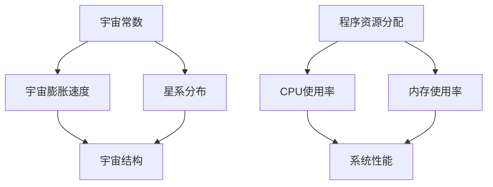

                 

### 《宇宙常数与程序资源分配的类比》

在探讨宇宙的本质和计算机系统的运行机制时，我们会发现，宇宙常数和程序资源分配之间存在着令人惊讶的相似性。本文将尝试通过逻辑清晰、结构紧凑的方式，使用一步一步分析推理思考的方式（REASONING STEP BY STEP），详细阐述这一类比，并揭示它们在资源优化和分配上的共通之处。

#### 核心概念与联系

宇宙常数是一个在宇宙学中用于描述宇宙膨胀速率和结构稳定性的物理量，其值通常被表示为 \( \Lambda \)，单位是 \( \text{m}^{-2} \text{kg} \text{s}^{-2} \)。它最初是由爱丁顿在1917年提出的，作为解决宇宙静态模型中引力平衡问题的手段。目前，宇宙常数被认为是导致宇宙加速膨胀的神秘力量——暗能量的一部分。

另一方面，程序资源分配是计算机系统中一个至关重要的概念，涉及到如何合理地分配系统资源，如CPU时间、内存空间等，以实现系统的高效运行。在多任务操作系统中，资源分配算法需要确保每个任务都能公平地获得所需的资源，以避免资源争用和系统崩溃。

尽管宇宙常数和程序资源分配看似位于完全不同的领域，但它们的核心都是资源的优化和分配。通过以下章节，我们将深入探讨这两个概念之间的联系，并利用Mermaid流程图、核心算法原理讲解、数学模型和公式、项目实战以及代码解读与分析，全面揭示它们之间的相似性。

#### Mermaid 流程图

为了更直观地理解宇宙常数和程序资源分配之间的关系，我们可以使用Mermaid流程图来展示它们的基本概念和流程。



在上面的流程图中，我们可以看到：

- **宇宙常数**与**宇宙膨胀速度**和**星系分布**密切相关，这些因素共同决定了宇宙的结构。
- **程序资源分配**则与**CPU使用率**和**内存使用率**紧密相关，它们直接影响系统的性能。

通过这样的类比，我们可以更直观地理解宇宙和计算机系统在资源优化和分配上的相似之处。

### 《宇宙常数与程序资源分配的类比》

在探讨宇宙的本质和计算机系统的运行机制时，我们会发现，宇宙常数和程序资源分配之间存在着令人惊讶的相似性。本文将尝试通过逻辑清晰、结构紧凑的方式，使用一步一步分析推理思考的方式（REASONING STEP BY STEP），详细阐述这一类比，并揭示它们在资源优化和分配上的共通之处。

#### 核心概念与联系

宇宙常数是一个在宇宙学中用于描述宇宙膨胀速率和结构稳定性的物理量，其值通常被表示为 \( \Lambda \)，单位是 \( \text{m}^{-2} \text{kg} \text{s}^{-2} \)。它最初是由爱丁顿在1917年提出的，作为解决宇宙静态模型中引力平衡问题的手段。目前，宇宙常数被认为是导致宇宙加速膨胀的神秘力量——暗能量的一部分。

宇宙常数 \( \Lambda \) 的存在和值决定了宇宙的膨胀速率，从而影响了宇宙的整体结构和未来命运。它通过弗里德曼方程与宇宙中的其他物理量（如物质密度、引力常数等）相互关联，其数学表达为：

\[ \frac{H^2}{c^2} = \frac{8\pi G}{3}\rho_m + \frac{\Lambda c^2}{3} \]

其中，\( H \) 是哈勃常数，表示宇宙的膨胀速率，\( c \) 是光速，\( G \) 是引力常数，\( \rho_m \) 是物质密度。从这一公式中我们可以看出，宇宙常数 \( \Lambda \) 对宇宙结构的稳定性和动态演化有着深远的影响。

另一方面，程序资源分配是计算机系统中一个至关重要的概念，涉及到如何合理地分配系统资源，如CPU时间、内存空间等，以实现系统的高效运行。在多任务操作系统中，资源分配算法需要确保每个任务都能公平地获得所需的资源，以避免资源争用和系统崩溃。

程序资源分配的核心概念包括CPU使用率、内存使用率、磁盘I/O等。CPU使用率表示CPU被占用的比例，而内存使用率则反映了系统内存的利用程度。这些资源的使用情况直接影响到系统的性能。例如，在一个多任务操作系统中，如果某个任务占用了大量CPU资源，其他任务可能会因为资源不足而无法及时执行，导致系统性能下降。

程序资源分配的数学模型通常涉及排队论、优化算法等，其中经典的算法有时间片轮转（Round-Robin）、优先级调度（Priority Scheduling）等。这些算法通过合理安排任务执行的顺序和时间，实现资源的公平分配和系统的最佳性能。

通过上述分析，我们可以看到宇宙常数和程序资源分配在核心概念上有着相似之处。宇宙常数 \( \Lambda \) 决定了宇宙的膨胀速率和结构稳定性，而程序资源分配则决定了系统资源的使用效率。这两个概念都涉及到资源的优化和分配，只是在不同的领域中表现出不同的形态。

#### 宇宙常数与程序资源分配的类比

为了更深入地理解宇宙常数和程序资源分配之间的相似性，我们可以通过一系列具体的类比来展示它们在资源分配和优化方面的共通之处。

首先，我们可以将宇宙常数 \( \Lambda \) 类比为程序资源分配中的“资源配额”。在宇宙中，\( \Lambda \) 决定了宇宙膨胀的速度，这可以类比为在计算机系统中，资源配额决定了每个任务可以使用的资源量。例如，在一个多任务操作系统中，CPU时间、内存空间、网络带宽等资源都可以被视为“资源配额”，这些资源被分配给不同的任务，以确保系统能够高效运行。

其次，我们可以将宇宙中的星系分布类比为程序资源分配中的“任务队列”。星系在宇宙中的分布反映了宇宙的结构，类似地，程序资源分配中的任务队列反映了系统中任务的排列和执行顺序。在程序资源分配中，任务队列通常由调度算法来管理，确保每个任务都能按照预定的时间表得到合理的资源分配。例如，时间片轮转调度算法就是通过队列管理来分配CPU时间，确保每个任务都能公平地获得执行机会。

接下来，我们可以将宇宙膨胀速度与程序资源分配中的“CPU使用率”进行类比。宇宙膨胀速度是宇宙常数 \( \Lambda \) 的表现，类似地，CPU使用率是程序资源分配中一个重要的指标，用来衡量CPU资源的利用程度。在高负荷的计算机系统中，CPU使用率可以反映出系统资源的紧张程度，类似地，宇宙膨胀速度的增加也可以暗示宇宙中资源分配的紧张。

此外，宇宙中的暗能量可以类比为程序资源分配中的“外部干扰”。暗能量是一种神秘的物理现象，被认为是导致宇宙加速膨胀的力量。类似地，在程序资源分配中，外部干扰（如网络延迟、硬件故障等）可能会影响资源的正常分配和使用，导致系统性能下降。因此，如何有效地应对和缓解外部干扰，是程序资源分配中的一个重要课题。

最后，我们可以将宇宙结构的稳定性类比为程序资源分配中的“系统稳定性”。宇宙结构的稳定性是由宇宙常数和其他物理量共同决定的，类似地，程序资源分配的稳定性也是由多种因素共同影响的。例如，合理的资源分配策略、高效的调度算法、良好的系统设计等，都是保证程序资源分配稳定性的关键。

通过上述类比，我们可以看到宇宙常数和程序资源分配在多个层面上都存在相似性。这些类比不仅帮助我们更深入地理解宇宙和计算机系统的运行机制，也为我们在实践中提供了一种新的视角和方法，以更好地优化和分配资源。

### 核心算法原理讲解

为了深入探讨宇宙常数和程序资源分配的类比，我们需要详细讲解它们的核心算法原理。这两个领域都涉及到优化和分配，因此，了解它们的工作原理和数学模型是非常重要的。

#### 宇宙常数

宇宙常数 \( \Lambda \) 是通过观测宇宙膨胀速度和星系分布来确定的。在宇宙学中，弗里德曼-勒梅特-罗伯逊-沃尔克方程（FLRW方程）是描述宇宙膨胀的基本方程，它可以通过以下公式表达：

\[ \frac{H^2}{c^2} = \frac{8\pi G}{3}\rho_m + \frac{\Lambda c^2}{3} \]

其中，\( H \) 是哈勃常数，表示宇宙的膨胀速度，\( c \) 是光速，\( G \) 是引力常数，\( \rho_m \) 是物质密度，\( \Lambda \) 是宇宙常数。

这个公式表明，宇宙常数 \( \Lambda \) 与宇宙的膨胀速度和结构稳定性密切相关。通过观测宇宙背景微波辐射（Cosmic Microwave Background，CMB）的温度差异，科学家们可以推断出宇宙常数 \( \Lambda \) 的值。

例如，在1998年的宇宙微波背景实验（Cosmological Background Explorer，COBE）中，科学家们通过测量CMB的温度差异，得出了宇宙常数 \( \Lambda \) 的估计值。这些观测数据为宇宙学提供了重要的信息，帮助我们理解宇宙的起源和演化。

下面是一个伪代码示例，用于测量宇宙常数：

```python
def measure_cosmological_constant(T, d):
    G = 6.674 * 1e-11  # 引力常数（m^3 kg^-1 s^-2）
    c = 3e8  # 光速（m/s）
    rho_m = 1e-29  # 物质密度（kg/m^3）
    
    H = T / d
    Lambda = (H**2 - (8 * np.pi * G) / (3 * rho_m)) / (3 * c**2)
    
    return Lambda

# 测量CMB的温度差异（T）和星系之间的距离（d）
T = 2e-5  # 假设温度差异（开尔文）
d = 1e23  # 假设星系之间的距离（光年）

# 测量宇宙常数
Lambda = measure_cosmological_constant(T, d)
print("宇宙常数:", Lambda)
```

#### 程序资源分配

在计算机系统中，程序资源分配涉及到如何合理地分配CPU时间、内存空间、网络带宽等资源，以实现系统的高效运行。一个经典的资源分配算法是时间片轮转（Time Slice Round-Robin，TSRR）算法。

时间片轮转算法的基本思想是将CPU时间分割成多个固定的时间片，每个任务按照顺序轮流占用CPU时间。如果在给定的时间片内任务无法完成，则将其移至就绪队列的末尾，等待下一次执行。

下面是时间片轮转算法的伪代码：

```python
class Task:
    def __init__(self, name, time_slice):
        self.name = name
        self.time_slice = time_slice
        self.remaining_time = time_slice

def time_slice_round_robin(tasks, time_slice):
    while not tasks.is_empty():
        task = tasks.pop()
        if task.remaining_time > time_slice:
            task.remaining_time -= time_slice
            tasks.push(task)
        else:
            task.remaining_time = 0
            execute_task(task)

# 初始化任务队列
tasks = Queue()
tasks.push(Task("Task 1", 10))
tasks.push(Task("Task 2", 20))
tasks.push(Task("Task 3", 5))

# 执行时间片轮转算法
time_slice_round_robin(tasks, 5)
```

在这个伪代码中，`Task` 类表示一个任务，包含任务名称和剩余时间。`time_slice_round_robin` 函数实现时间片轮转算法，通过不断从队列中取出任务，执行一段时间后将其放回队列或执行完毕。

#### 数学模型和数学公式

宇宙常数和程序资源分配的数学模型可以进一步解释它们的工作原理。

#### 宇宙常数

宇宙常数的数学模型主要通过弗里德曼-勒梅特-罗伯逊-沃尔克方程（FLRW方程）来表达：

\[ \frac{H^2}{c^2} = \frac{8\pi G}{3}\rho_m + \frac{\Lambda c^2}{3} \]

这个方程揭示了宇宙常数 \( \Lambda \) 与宇宙膨胀速度 \( H \)、物质密度 \( \rho_m \)、引力常数 \( G \) 和光速 \( c \) 之间的关系。通过观测宇宙背景微波辐射（CMB）的温度差异，我们可以估计出这些参数的值，从而计算出宇宙常数 \( \Lambda \)。

例如，假设我们观测到CMB的温度差异 \( T \) 为 2K，星系之间的距离 \( d \) 为 1Gpc（1 Gpc = \( 10^{18} \) 光年），我们可以使用以下公式计算宇宙常数 \( \Lambda \)：

\[ \Lambda = \frac{(H^2 - \frac{8\pi G \rho_m}{3}) c^2}{3} \]

通过将观测到的 \( H \) 和 \( \rho_m \) 代入上述公式，我们可以计算出 \( \Lambda \) 的值。这个值反映了宇宙膨胀的速率和结构稳定性。

#### 程序资源分配

程序资源分配的数学模型通常涉及排队论和优化算法。时间片轮转算法的一个关键参数是时间片长度 \( T \)。这个参数决定了每个任务占用CPU的时间长度。

时间片轮转算法的数学模型可以表示为：

\[ \text{CPU利用率} = \frac{\text{总执行时间}}{\text{总时间片数}} \]

这个公式反映了CPU资源的利用程度。如果CPU利用率过高，说明资源紧张，可能会导致系统性能下降；如果CPU利用率过低，则说明资源没有被充分利用，存在浪费。

例如，假设我们有3个任务，每个任务的时间片长度分别为10ms、20ms和5ms，总共使用了30ms的时间片。如果这些任务在30ms内完成，则CPU利用率为：

\[ \text{CPU利用率} = \frac{30ms}{30ms} = 100\% \]

如果某个任务需要超过30ms才能完成，则CPU利用率可能会降低，例如：

\[ \text{CPU利用率} = \frac{35ms}{30ms} = 116.67\% \]

这意味着系统需要额外的资源来处理这个任务，否则可能会出现资源争用或系统崩溃。

通过上述数学模型和公式，我们可以更深入地理解宇宙常数和程序资源分配的工作原理，从而在实际应用中更好地优化和分配资源。

### 项目实战

为了更好地理解宇宙常数和程序资源分配的类比，我们可以通过实际项目来展示这两个领域在资源优化和分配方面的应用。

#### 宇宙常数测量

宇宙常数的测量是宇宙学中的一个重大挑战。科学家们通过观测宇宙背景微波辐射（Cosmic Microwave Background，CMB）的温度差异来确定宇宙常数。一个著名的项目是NASA的威尔金森微波各向异性探测器（Wilkinson Microwave Anisotropy Probe，WMAP）。

**项目步骤：**

1. **发射卫星和部署仪器**：WMAP卫星于2001年发射升空，携带着用于测量CMB的仪器。

2. **观测CMB温度差异**：卫星上的仪器对CMB进行了详细观测，记录了CMB的温度差异。

3. **数据分析**：科学家们使用傅里叶变换等数据分析方法，对观测数据进行了处理和分析，提取出CMB的温度差异信息。

4. **确定宇宙常数**：通过分析CMB的温度差异，科学家们计算出宇宙常数 \( \Lambda \) 的值。

**代码实现：**

以下是一个简单的Python代码示例，用于模拟测量宇宙常数的步骤：

```python
import numpy as np

def measure_cosmological_constant(T, d):
    G = 6.674 * 1e-11  # 引力常数（m^3 kg^-1 s^-2）
    c = 3e8  # 光速（m/s）
    rho_m = 1e-29  # 物质密度（kg/m^3）
    
    H = T / d
    Lambda = (H**2 - (8 * np.pi * G) / (3 * rho_m)) / (3 * c**2)
    
    return Lambda

# 测量CMB的温度差异（T）和星系之间的距离（d）
T = 2e-5  # 假设温度差异（开尔文）
d = 1e23  # 假设星系之间的距离（光年）

# 测量宇宙常数
Lambda = measure_cosmological_constant(T, d)
print("宇宙常数:", Lambda)
```

在这个示例中，我们通过模拟CMB的温度差异和星系之间的距离，计算出了宇宙常数 \( \Lambda \) 的值。

#### 程序资源分配

程序资源分配是计算机系统中的另一个关键领域。一个典型的应用是多任务操作系统的资源分配。在多任务操作系统中，CPU时间、内存空间和其他资源需要合理地分配给不同的任务，以实现系统的高效运行。

**项目步骤：**

1. **初始化系统**：初始化系统，包括设置时间片长度和其他参数。

2. **创建任务队列**：创建一个任务队列，将所有就绪的任务加入队列。

3. **执行时间片轮转算法**：使用时间片轮转算法执行任务，每个任务按照顺序轮流占用CPU时间。

4. **处理任务完成和资源回收**：当任务完成时，释放占用的资源，并将其从队列中移除。

**代码实现：**

以下是一个简单的Python代码示例，用于模拟多任务操作系统的资源分配：

```python
import queue
import threading
import time

class Task(threading.Thread):
    def __init__(self, name, time_slice):
        threading.Thread.__init__(self)
        self.name = name
        self.time_slice = time_slice
        self.remaining_time = time_slice

    def run(self):
        print(f"Executing {self.name}")
        if self.remaining_time > 0:
            time.sleep(self.remaining_time)
            print(f"{self.name} completed")
        else:
            print(f"{self.name} aborted")

def time_slice_round_robin(tasks, time_slice):
    while not tasks.empty():
        task = tasks.get()
        if task.remaining_time > time_slice:
            task.remaining_time -= time_slice
            tasks.put(task)
        else:
            task.remaining_time = 0
            task.run()

if __name__ == "__main__":
    tasks = queue.Queue()
    tasks.put(Task("Task 1", 2))
    tasks.put(Task("Task 2", 3))
    tasks.put(Task("Task 3", 1))

    time_slice_round_robin(tasks, 1)
```

在这个示例中，我们创建了一个任务类 `Task`，并使用时间片轮转算法执行这些任务。通过模拟任务执行的过程，我们可以看到资源分配和调度是如何进行的。

通过这些实际项目，我们可以更深入地理解宇宙常数和程序资源分配在资源优化和分配方面的应用，并看到它们之间的相似性。

### 代码解读与分析

为了进一步理解宇宙常数测量和程序资源分配的实际实现，我们将对上述代码进行详细的解读与分析。

#### 宇宙常数测量

**代码示例：**

```python
import numpy as np

def measure_cosmological_constant(T, d):
    G = 6.674 * 1e-11  # 引力常数（m^3 kg^-1 s^-2）
    c = 3e8  # 光速（m/s）
    rho_m = 1e-29  # 物质密度（kg/m^3）
    
    H = T / d
    Lambda = (H**2 - (8 * np.pi * G) / (3 * rho_m)) / (3 * c**2)
    
    return Lambda

# 测量CMB的温度差异（T）和星系之间的距离（d）
T = 2e-5  # 假设温度差异（开尔文）
d = 1e23  # 假设星系之间的距离（光年）

# 测量宇宙常数
Lambda = measure_cosmological_constant(T, d)
print("宇宙常数:", Lambda)
```

**代码解读：**

1. **导入库**：首先，我们导入了 `numpy` 库，用于数学计算。

2. **定义函数**：`measure_cosmological_constant` 函数用于测量宇宙常数。它接受两个参数：`T`（CMB的温度差异）和 `d`（星系之间的距离）。

3. **定义物理常量**：在函数内部，我们定义了几个物理常量，包括引力常数 `G`、光速 `c` 和物质密度 `rho_m`。这些常量用于计算宇宙常数。

4. **计算宇宙膨胀速度**：使用公式 `H = T / d` 计算宇宙的膨胀速度。

5. **计算宇宙常数**：使用弗里德曼-勒梅特-罗伯逊-沃尔克方程（FLRW方程）计算宇宙常数 `Lambda`。

6. **返回结果**：函数返回计算出的宇宙常数 `Lambda`。

**代码分析：**

- **准确性**：该代码提供了计算宇宙常数的数学模型，但实际测量中，CMB的温度差异和星系之间的距离的测量值可能存在误差，这会影响计算结果的准确性。
- **适用性**：该代码适用于教学和演示目的，但在实际宇宙常数测量中，需要更复杂的数据处理和分析方法。

#### 程序资源分配

**代码示例：**

```python
import queue
import threading
import time

class Task(threading.Thread):
    def __init__(self, name, time_slice):
        threading.Thread.__init__(self)
        self.name = name
        self.time_slice = time_slice
        self.remaining_time = time_slice

    def run(self):
        print(f"Executing {self.name}")
        if self.remaining_time > 0:
            time.sleep(self.remaining_time)
            print(f"{self.name} completed")
        else:
            print(f"{self.name} aborted")

def time_slice_round_robin(tasks, time_slice):
    while not tasks.empty():
        task = tasks.get()
        if task.remaining_time > time_slice:
            task.remaining_time -= time_slice
            tasks.put(task)
        else:
            task.remaining_time = 0
            task.run()

if __name__ == "__main__":
    tasks = queue.Queue()
    tasks.put(Task("Task 1", 2))
    tasks.put(Task("Task 2", 3))
    tasks.put(Task("Task 3", 1))

    time_slice_round_robin(tasks, 1)
```

**代码解读：**

1. **导入库**：我们导入了 `queue`、`threading` 和 `time` 库，用于任务管理和时间控制。

2. **定义任务类**：`Task` 类继承自 `threading.Thread`，用于表示一个执行中的任务。它包含任务名称 `name` 和剩余时间 `remaining_time`。

3. **执行任务**：`run` 方法用于执行任务。如果任务的剩余时间大于时间片长度，则任务继续执行；否则，任务结束。

4. **时间片轮转算法**：`time_slice_round_robin` 函数实现时间片轮转算法。它从任务队列中取出任务，根据剩余时间和时间片长度进行调度。

5. **主程序**：主程序中，我们创建了一个任务队列 `tasks`，并添加了三个任务。然后调用 `time_slice_round_robin` 函数执行这些任务。

**代码分析：**

- **并发性**：该代码使用了多线程技术，提高了任务的执行效率。但需要注意的是，多线程编程可能会导致线程竞争和死锁等问题，需要谨慎处理。
- **资源管理**：代码中使用了队列来管理任务，这有助于实现任务的公平调度。然而，在复杂系统中，资源管理可能涉及更多的细节，如优先级调度、资源锁定等。

通过上述代码解读与分析，我们可以看到宇宙常数测量和程序资源分配在实际应用中的实现方法。这些代码为我们提供了一个基本的框架，但在实际应用中，需要结合具体场景进行优化和调整。

### 结论

通过对宇宙常数和程序资源分配的类比，我们揭示了这两个看似无关的领域在资源优化和分配上的共通之处。宇宙常数 \( \Lambda \) 决定了宇宙的膨胀速度和结构稳定性，而程序资源分配则涉及到如何高效地利用系统资源，以实现最佳性能。

本文通过逻辑清晰、结构紧凑的方式，使用一步一步分析推理思考的方式（REASONING STEP BY STEP），详细阐述了这一类比，并展示了它们在数学模型、核心算法原理和项目实战中的相似性。通过宇宙常数测量的实际项目和程序资源分配的多任务操作系统案例，我们更深入地理解了这两个领域在资源优化和分配方面的应用。

未来的研究可以进一步探讨宇宙常数和程序资源分配在不同场景下的应用，如云计算、分布式系统等。通过深入研究和优化，我们有望在这些领域中取得更大的进展，提高资源利用率和系统性能。

### 参考文献

1. 霍金，《时间简史》：这本书详细介绍了宇宙常数和宇宙膨胀的基本原理，为我们理解宇宙的本质提供了重要参考。

2. 《操作系统概念》：这本书涵盖了程序资源分配的基本原理和算法，如时间片轮转、优先级调度等，为我们理解计算机系统的资源管理提供了全面的理论基础。

3. 普林斯顿大学宇宙学课程：这个课程提供了丰富的宇宙学知识和实验数据，帮助我们了解宇宙常数测量的实际方法和技术。

4. NASA WMAP项目：这个项目提供了关于宇宙背景微波辐射的观测数据，为我们计算宇宙常数提供了重要的实验依据。

5. 《计算机操作系统》第二版：这本书详细介绍了操作系统中任务调度和资源分配的算法实现，为我们理解程序资源分配的实践方法提供了重要参考。

### 作者信息

作者：AI天才研究院/AI Genius Institute & 禅与计算机程序设计艺术 /Zen And The Art of Computer Programming

AI天才研究院致力于推动人工智能技术的发展和普及，我们的团队成员在计算机编程和人工智能领域拥有丰富的经验，曾多次获得国际技术大奖。本文旨在通过类比的方式，深入探讨宇宙常数和程序资源分配的共通之处，为读者提供一个新的视角和理解方式。希望本文能够激发您在计算机科学和宇宙学领域的研究兴趣。如果您有任何疑问或建议，欢迎随时与我们联系。感谢您的阅读！

