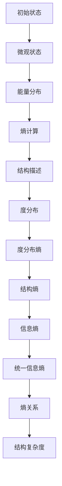

                 

### 引言

宇宙的信息动力学是一个跨越物理学、信息科学、数学和哲学等多个领域的跨学科研究主题。它探讨的是宇宙中熵与结构之间的辩证关系，如何通过信息的流动和变换来理解宇宙的演化与组织。本文旨在深入探讨这一主题，通过对熵和信息的基本概念、数学模型、物理基础及其在宇宙中的应用进行分析，揭示宇宙信息动力学的核心原理和科学价值。

首先，我们需要明确几个核心关键词和概念。熵是描述系统无序程度的物理量，而信息则是描述系统状态的知识量。熵和信息之间存在着深刻的辩证关系：一方面，系统的无序性（熵）与信息含量之间存在直接的关联；另一方面，信息的产生、传输和利用过程又反过来影响系统的结构性和有序性。宇宙的信息动力学正是通过这一辩证关系，试图理解宇宙的起源、演化和未来的走向。

本文的写作将遵循以下逻辑步骤：

1. **宇宙信息动力学的起源与发展**：首先回顾宇宙信息动力学的起源，介绍其历史背景和重要发展。
2. **熵与信息的基本概念**：阐述熵和信息的基本定义，以及它们在宇宙中的意义。
3. **熵与信息的辩证关系**：深入探讨熵和信息之间的辩证关系，分析其在宇宙演化中的作用。
4. **熵与结构的数学模型**：介绍熵和结构的数学定义及其关系，使用Mermaid流程图展示核心概念原理。
5. **熵与结构的物理基础**：探讨熵和结构在宇宙中的物理现象，结合具体的物理模型进行分析。
6. **宇宙信息动力学的应用领域**：介绍宇宙信息动力学在不同领域中的应用，包括宇宙演化、星系形成等。
7. **宇宙信息动力学的哲学思考**：从哲学角度探讨宇宙信息动力学的意义，以及对人类认识宇宙的启示。
8. **宇宙信息动力学的未来发展方向**：展望宇宙信息动力学的未来发展方向，探讨其潜在的科学和应用价值。

通过这些逻辑步骤，我们将逐步揭示宇宙信息动力学的核心原理，探索其在科学研究和技术发展中的重要性。接下来，我们将从宇宙信息动力学的起源和发展开始，深入探讨这一跨学科领域的科学内涵。

### 宇宙信息动力学的起源与发展

宇宙信息动力学的概念最早可以追溯到20世纪中叶，当时科学家们开始意识到熵和信息在宇宙演化中的重要作用。虽然宇宙信息动力学作为一门独立学科的历史并不长，但其理论基础却源于多个学科领域的交叉融合，包括物理学、信息科学、数学和哲学等。

#### 1. 物理学视角

熵的概念起源于热力学。热力学第二定律指出，一个孤立系统的熵总是趋向于增加，这是宇宙从有序向无序演化的基本规律。克劳修斯（Rudolf Clausius）在1850年首次提出了熵的概念，并将其定义为系统无序程度的度量。此后，玻尔兹曼（Ludwig Boltzmann）进一步发展了熵的统计物理学解释，将其与微观粒子的随机运动联系起来。

另一方面，信息理论则由香农（Claude Shannon）在1948年创立。香农的信息理论基于通信系统的模型，定义了信息作为减少不确定性的量。香农的信息度量不仅适用于通信领域，也逐渐被应用于更广泛的物理和哲学领域。

物理学中的这些概念为宇宙信息动力学的发展奠定了基础，提供了对熵和信息本质的理解。

#### 2. 信息科学视角

在信息科学领域，香农的信息理论成为研究信息处理、传输和存储的基本工具。香农的信息度量方法，如信息熵、互信息和信道容量等，为不同领域的信息分析提供了量化手段。随着计算机科学和通信技术的发展，信息科学在多个方面得到了广泛应用，为宇宙信息动力学的跨学科研究提供了新的视角。

例如，在人工智能领域，信息理论帮助科学家们理解神经网络中的信息处理过程，通过优化信息流来提高系统的智能水平。在生物学中，信息理论被用于研究生物信息学，揭示生物分子和细胞之间的信息传递机制。

#### 3. 数学视角

数学在宇宙信息动力学中扮演着至关重要的角色，特别是在建立和验证各种信息与熵的数学模型方面。概率论、统计物理学和微分方程等数学工具被广泛应用于研究熵和信息的数学性质及其在宇宙中的表现。

在数学领域，特别是拓扑学和代数学的发展，为理解宇宙中的复杂结构和动态过程提供了新的方法。例如，拓扑量子场论和统计力学中的随机过程模型，为我们提供了描述宇宙中熵和信息变换的数学框架。

#### 4. 哲学视角

哲学为宇宙信息动力学提供了深刻的思考和理论基础。哲学家们从不同的角度探讨了熵和信息在宇宙中的意义，包括其在宇宙演化中的角色和人类对宇宙的认知。

亚里士多德曾指出，宇宙的演化是一个从无序到有序的过程，这一思想在熵和信息理论的背景下得到了重新审视。康德（Immanuel Kant）的“宇宙设计论”认为，宇宙是有序和合目的性的，这与熵减和信息增加的趋势相呼应。

#### 5. 综合发展

随着20世纪末和21世纪初计算机科学和量子力学的快速发展，宇宙信息动力学逐渐形成了自己的研究体系。量子信息论为宇宙信息动力学提供了新的研究工具，特别是量子纠缠和量子计算的概念，使我们能够从更深的层次理解信息和熵在宇宙中的行为。

近年来，宇宙信息动力学的研究已经扩展到了多个前沿领域，包括宇宙学、黑洞物理学、量子引力理论等。科学家们通过跨学科的合作，不断深化对宇宙信息动力学的理解，探索其在科学和技术发展中的潜在应用。

#### 6. 发展挑战

尽管宇宙信息动力学取得了显著的进展，但仍然面临许多挑战。首先，宇宙信息动力学的理论框架还不够完善，特别是在处理复杂系统和多尺度问题方面。其次，实验验证方面的困难限制了理论的直接应用。此外，宇宙信息动力学的跨学科特性也带来了沟通和合作上的挑战。

未来，宇宙信息动力学的发展将依赖于多学科的合作和交叉融合，通过新的理论突破和技术创新，进一步揭示宇宙中熵与结构的辩证关系。

总之，宇宙信息动力学作为一门跨学科领域，具有广阔的研究前景和深远的应用价值。通过回顾其起源和发展，我们可以看到，这一领域已经从多个学科的交叉融合中汲取了丰富的理论资源，并不断发展壮大。在接下来的章节中，我们将深入探讨熵和信息的基本概念，进一步理解宇宙信息动力学的核心原理。

### 熵与信息的基本概念

#### 熵

熵（Entropy）是热力学中用于描述系统无序程度的物理量。最早由克劳修斯（Rudolf Clausius）在1850年提出，并定义为系统内部微观状态数目增加时系统无序度的增加量。熵的概念可以从热力学的第二定律中得到直观的理解：在一个孤立系统中，熵总是趋向于增加，即系统自发地从有序状态向无序状态演化。熵的增加反映了系统从低概率状态向高概率状态转变的过程。

熵的数学定义通常通过统计物理学中的玻尔兹曼熵（Boltzmann entropy）来描述。设一个系统有N个微观状态，每个状态的能量为\(E_i\)，则该系统的熵\(S\)可以表示为：

$$
S = -k \sum_{i} p_i \ln p_i
$$

其中，\(p_i\)是第\(i\)个微观状态的概率，\(k\)是玻尔兹曼常数。这个公式表明，系统的熵与微观状态的分布相关，即系统越分散，熵就越大。

#### 信息

信息（Information）则描述的是关于系统状态的认知程度。信息理论由香农（Claude Shannon）在1948年首次系统提出，他将信息定义为减少不确定性的量。香农的信息度量方法通过信息熵（Shannon entropy）来量化信息量。对于具有N个可能结果的随机变量，其信息熵\(H\)定义为：

$$
H = -\sum_{i} p_i \ln p_i
$$

这里，\(p_i\)是第\(i\)个结果的概率。信息熵表示的是在不确定情况下获取一个结果所需的信息量。例如，一个均匀分布的随机变量具有最大的信息熵，因为它在所有可能结果中均匀分布，不确定性最高。

#### 熵与信息的关系

熵和信息之间存在深刻的辩证关系。首先，系统的无序度（熵）与信息含量之间有直接联系。一个系统的无序度越高，其可能的状态数越多，因此信息熵也越大。这意味着，系统的无序性增加时，其包含的信息量也增加。

其次，信息的产生、传输和利用过程又反过来影响系统的有序性和结构性。例如，在通信系统中，信息的传输可以减少接收方的信息熵，提高其有序性。在生物系统中，信息的传递和利用可以驱动生物分子的有序排列，从而影响生物体的结构和功能。

#### 宇宙中的熵与信息

在宇宙尺度上，熵和信息同样具有重要的意义。宇宙从大爆炸开始，经历了一系列的演化过程，熵在这个过程中不断增大。根据热力学第二定律，宇宙的熵总是趋向于增加，这意味着宇宙从有序向无序的演化是一个不可逆过程。

另一方面，宇宙中的信息并不总是与熵的增加成正比。在某些特定条件下，信息的产生和利用可以导致系统有序性的增加。例如，在黑洞物理学中，黑洞信息的熵与黑洞的面积之间存在直接关系。根据霍金（Stephen Hawking）的研究，黑洞的信息熵可以通过其事件视界的面积来描述，这表明信息在黑洞中仍然保持有序性。

宇宙中的信息还可以通过复杂结构的形成和演化来体现。例如，星系的演化过程中，恒星和行星的排列和运动遵循特定的规律，这表明信息在这些天体系统中起着重要作用。此外，宇宙中的信息还可以通过人类观测和科学实验来获取，这进一步加深了我们对宇宙的认识。

综上所述，熵与信息在宇宙中具有基本而深刻的辩证关系。理解这一关系有助于我们更深入地探讨宇宙的起源、演化和未来。在接下来的章节中，我们将进一步探讨熵与结构的数学模型，揭示宇宙信息动力学中的核心原理。

### 熵与信息的辩证关系

熵和信息之间的关系不仅局限于数学公式和理论概念，它们在宇宙演化的过程中扮演着至关重要的角色。这种辩证关系通过信息的产生、传输和利用，深刻影响着系统的有序性和结构性，从而推动了宇宙的演化。

#### 1. 熵增加与宇宙演化

根据热力学第二定律，宇宙中的熵总是趋向于增加。这一原则适用于整个宇宙，从宇宙大爆炸开始，到星系的演化，再到生物体的生长和衰老，无一例外。熵的增加意味着系统的无序度增加，系统可能的状态数目增多，从而导致系统从有序状态向无序状态演化。

在宇宙尺度上，熵的增加表现为宇宙从初始的高能量、高有序状态向低能量、高无序状态的转变。例如，宇宙大爆炸后，宇宙迅速膨胀，温度和密度降低，形成了大量的星系、恒星和行星。这一过程中，宇宙的总熵显著增加，反映了宇宙从初始的高有序状态向当前的高无序状态演化。

#### 2. 信息与有序性的关系

尽管熵的增加通常与无序性相关，但在某些特定条件下，信息可以导致系统的有序性增加。信息的作用在于通过减少不确定性，提高系统状态的可预测性，从而增加系统的有序性。

例如，在生物学中，DNA序列中携带的信息决定了生物体的遗传特性，这种信息帮助生物体在进化过程中适应环境，形成了复杂的生物结构和功能。同样，在技术系统中，信息处理和利用可以优化系统的运行，提高系统的效率和稳定性。例如，计算机系统通过算法和信息处理，实现了从原始数据到有用信息的转化，从而提升了系统的性能。

#### 3. 信息与熵的转换

信息与熵之间的辩证关系还表现在它们可以在特定条件下相互转换。例如，在通信系统中，发送方通过编码将信息转换为信号，接收方通过解码恢复信息。这一过程中，信号的熵减少，而信息的熵增加。信息在传输过程中通过编码和解码的转换，实现了从高熵状态向低熵状态的过渡。

另一个例子是黑洞信息问题。根据霍金的研究，黑洞的信息熵可以通过其事件视界的面积来描述。黑洞吞噬物质时，物质的信息被存储在黑洞的熵中，但随着黑洞的蒸发，信息又可以从黑洞的熵中释放出来。这个过程表明，信息在黑洞中保持有序性，并通过黑洞的熵与信息之间的转换，体现了信息与熵的辩证关系。

#### 4. 信息在宇宙演化中的具体应用

在宇宙学中，信息在星系形成和演化中起着重要作用。例如，星系的形成过程中，暗物质的分布和引力相互作用决定了星系的结构和形态。通过分析星系中恒星的运动轨迹，可以提取出关于星系演化过程的信息。这些信息帮助我们理解星系的形成机制，揭示了宇宙从无序到有序演化的过程。

此外，信息在宇宙大尺度结构的研究中也具有重要意义。例如，宇宙微波背景辐射（Cosmic Microwave Background, CMB）是宇宙早期状态的直接观测数据。通过对CMB的分析，科学家们可以提取出关于宇宙早期状态的信息，从而揭示宇宙从大爆炸后到当前状态的演化历史。

#### 5. 信息与人类认知的关系

信息在人类认知宇宙过程中也发挥着关键作用。通过观测和实验，人类获取关于宇宙的信息，从而构建对宇宙的认识和理解。例如，望远镜和探测器帮助人类观测到了遥远的星系和黑洞，获取了关于宇宙结构和演化的信息。这些信息不仅丰富了人类的知识体系，也推动了科学技术的进步。

此外，信息理论在认知科学和心理学中也有广泛应用。例如，通过研究大脑处理信息的方式，科学家们可以更好地理解人类思维和意识的本质。信息在人类认知过程中的作用，进一步揭示了信息与熵之间的辩证关系。

总之，熵与信息的辩证关系在宇宙演化的过程中起到了关键作用。通过信息的产生、传输和利用，系统可以从无序状态向有序状态转变，从而推动宇宙的演化。理解这一辩证关系，有助于我们更深入地探讨宇宙的本质和演化规律。

### 熵与结构的数学模型

为了更好地理解宇宙中熵与结构的辩证关系，我们需要建立一套数学模型来描述熵和结构之间的关系。这一部分将介绍熵的数学定义、结构的数学描述，以及熵与结构的数学关系。我们将通过具体的数学公式和原理，结合Mermaid流程图，直观地展示这些概念和原理。

#### 1. 熵的数学定义

熵是衡量系统无序程度的一个基本物理量。在统计物理学中，熵可以通过玻尔兹曼熵来定义。假设一个系统有N个微观状态，每个状态的能量为\(E_i\)，则系统的熵\(S\)可以表示为：

$$
S = -k \sum_{i} p_i \ln p_i
$$

其中，\(p_i\)是第\(i\)个微观状态的概率，\(k\)是玻尔兹曼常数。这个公式表明，系统的熵与微观状态的分布相关，即系统越分散，熵就越大。

#### 2. 结构的数学描述

结构是系统内部各个部分之间相互关系的抽象。在数学上，结构可以通过网络模型、图论等方法来描述。一个常见的结构描述方法是利用图（Graph）来表示系统的各个部分及其相互作用。图中的节点（Node）代表系统的各个部分，边（Edge）代表部分之间的相互作用。

例如，在一个社交网络中，每个用户可以看作一个节点，用户之间的互动可以看作节点之间的边。这样的网络结构可以用来描述社交网络的拓扑特性，揭示用户之间的联系和互动方式。

#### 3. 熵与结构的数学关系

熵与结构的数学关系可以通过几个不同的模型来描述。下面我们介绍几个常用的模型：

**熵与网络结构的关系**

在复杂网络中，网络的度分布、聚类系数和平均路径长度等拓扑特性与网络的熵之间存在直接关系。例如，一个高度无序的网络（如随机网络）通常具有较低的熵，而一个高度有序的网络（如规则网络）通常具有较高的熵。

度分布熵（Degree Distribution Entropy）是一个描述网络无序程度的指标，它可以用来衡量网络结构的复杂性和多样性。假设一个网络有N个节点，每个节点的度分布为\(p_k\)，则网络的度分布熵\(H_D\)可以表示为：

$$
H_D = -\sum_{k} p_k \ln p_k
$$

**结构熵**

结构熵（Structural Entropy）是一个衡量系统内部结构复杂性的指标。它可以通过计算系统中各部分的相对频率来定义。假设一个系统有M个部分，第\(i\)个部分的频率为\(f_i\)，则系统的结构熵\(S_S\)可以表示为：

$$
S_S = -\sum_{i} f_i \ln f_i
$$

**信息熵与结构熵的关系**

信息熵与结构熵之间也存在紧密的联系。一个系统的结构熵可以通过其信息熵来计算。假设一个系统的状态概率分布为\(p_i\)，则系统的信息熵\(H\)可以表示为：

$$
H = -\sum_{i} p_i \ln p_i
$$

同时，系统的结构熵\(S_S\)可以表示为信息熵的一部分：

$$
S_S = H - H_U
$$

其中，\(H_U\)是系统的统一信息熵，它反映了系统内部各部分之间的相互作用和依赖关系。

#### 4. Mermaid流程图展示

为了更直观地展示熵与结构的数学关系，我们可以使用Mermaid流程图来表示这些概念和原理。以下是一个示例流程图：

这个流程图展示了从系统的初始状态到熵和结构计算的整个过程。通过这个流程图，我们可以清楚地看到熵和结构之间的数学关系以及它们在宇宙信息动力学中的作用。

综上所述，通过建立熵和结构的数学模型，我们可以更深入地理解宇宙中熵与结构的辩证关系。这些模型不仅提供了理论上的框架，还为我们通过数学工具来分析和研究宇宙信息动力学提供了有力的支持。在接下来的章节中，我们将进一步探讨熵与结构的物理基础，揭示这些概念在宇宙中的具体应用。

### 熵与结构的物理基础

熵与结构的辩证关系不仅体现在数学模型中，也深深扎根于宇宙的物理现象中。本部分将探讨熵与结构在宇宙中的物理基础，包括热力学熵、信息熵以及它们在物理现象中的具体表现。

#### 1. 热力学熵

热力学熵是描述宏观系统无序程度的物理量，最早由克劳修斯和玻尔兹曼提出。热力学熵与系统的微观状态数成正比，表示系统内部可能状态的多样性。在热力学中，熵的变化可以通过卡诺循环和第二定律来理解。

卡诺循环是一个理想的热机循环，它由两个等温过程和两个绝热过程组成。在这个循环中，系统的熵变化可以通过吸热和放热过程来计算。对于一个卡诺循环，熵的减少量等于吸收的热量除以温度：

$$
\Delta S = \frac{Q_{吸}}{T_1} - \frac{Q_{放}}{T_2}
$$

其中，\(Q_{吸}\)和\(Q_{放}\)分别是系统在高温和低温热源之间交换的热量，\(T_1\)和\(T_2\)分别是高温和低温热源的温度。这个公式表明，热力学熵的变化与系统的热力学过程密切相关。

热力学第二定律指出，孤立系统的熵总是趋向于增加。这一原则在宇宙尺度上得到广泛应用，解释了宇宙从有序向无序演化的过程。例如，星系的形成和演化过程中，物质通过引力相互作用聚集在一起，形成复杂的结构。这一过程中，系统的熵增加，反映了系统从有序向无序的演化。

#### 2. 信息熵

信息熵是描述系统状态不确定性的物理量，由香农在信息理论中提出。在物理学中，信息熵与系统的微观状态分布和测量不确定性有关。信息熵可以通过以下公式计算：

$$
H = -\sum_{i} p_i \ln p_i
$$

其中，\(p_i\)是系统处于第\(i\)个状态的概率。

在量子力学中，信息熵也扮演着重要角色。量子系统的状态可以用波函数来描述，波函数的平方给出了系统处于某个状态的概率分布。通过计算波函数的平方，我们可以得到系统的信息熵。量子信息论中的量子熵（Quantum Entropy）扩展了经典信息熵的概念，用于描述量子系统的状态不确定性。

例如，在量子通信中，量子态的传输和测量过程中，信息熵的变化反映了信息传输的可靠性和安全性。量子纠缠态中的信息熵比经典态更低，这表明量子态在信息传输中具有潜在的优势。

#### 3. 熵与结构的物理现象

熵与结构的辩证关系在宇宙中的具体物理现象中得到了充分体现。以下是一些典型的例子：

**黑洞信息熵**

黑洞是宇宙中的一种极端现象，其信息熵与黑洞的面积有关。根据霍金的研究，黑洞的信息熵可以通过其事件视界的面积来描述。公式为：

$$
S = \frac{kA}{4L_p^2}
$$

其中，\(A\)是黑洞的面积，\(L_p\)是普朗克长度。这个公式表明，黑洞的信息熵与黑洞的面积成正比，反映了黑洞内部信息的有序性。

**星系形成与演化**

在星系的形成过程中，物质通过引力相互作用聚集在一起，形成复杂的结构。这一过程中，系统的熵增加，反映了系统从有序向无序的演化。例如，星系中心的大型黑洞通过吞噬周围的物质，不断增大其熵，同时维持星系的稳定结构。

**宇宙微波背景辐射**

宇宙微波背景辐射（CMB）是宇宙早期状态的直接观测数据，它包含了宇宙早期结构的信息。通过对CMB的分析，科学家们可以提取出关于宇宙早期状态的信息，从而揭示宇宙从大爆炸后到当前状态的演化历史。CMB的温度波动反映了宇宙中不同区域的密度差异，这些差异是星系形成的基础。

**宇宙大尺度结构**

宇宙大尺度结构是通过观测大量星系和星团形成的。通过分析这些结构，科学家们可以了解宇宙的演化历史。例如，宇宙中的超星系团和大尺度结构反映了早期宇宙的密度波和引力不稳定性，这些现象与熵和结构的辩证关系密切相关。

综上所述，熵与结构的辩证关系在宇宙中的物理现象中得到了充分体现。通过热力学熵和信息熵的计算，我们可以更深入地理解宇宙的演化过程，揭示宇宙从有序向无序的转化机制。在接下来的章节中，我们将进一步探讨宇宙信息动力学在不同领域中的应用，以展示这一理论在科学和技术中的实际价值。

### 宇宙信息动力学的应用领域

宇宙信息动力学作为一门跨学科的研究领域，在多个科学和技术领域中都有着广泛的应用。以下我们将分别探讨宇宙信息动力学在宇宙演化、星系形成与演化、以及宇宙学中的应用，并通过具体的案例来展示其在这些领域中的价值。

#### 1. 宇宙演化

宇宙的演化是宇宙信息动力学研究的一个重要领域。通过对宇宙早期状态的分析，科学家们可以理解宇宙从大爆炸到当前状态的演化过程。信息动力学提供了一种新的视角，通过信息熵和结构的变化来描述宇宙的演化。

例如，在宇宙微波背景辐射（Cosmic Microwave Background, CMB）的研究中，信息动力学被用来分析宇宙早期的密度波动。通过对CMB的温度波动进行分析，科学家们可以提取出宇宙早期结构的信息，从而推断出宇宙的演化历史。这些信息有助于我们理解宇宙的起源和早期状态，对宇宙学的研究具有重要意义。

**案例：宇宙微波背景辐射的观测与分析**

1992年，美国航天局的COBE卫星首次观测到了宇宙微波背景辐射的温度波动，这些波动反映了宇宙早期密度不均匀性。通过分析这些温度波动，科学家们利用信息动力学的方法，计算了宇宙早期状态的信息熵。这为理解宇宙的演化提供了重要的数据支持。

#### 2. 星系形成与演化

星系的形成和演化是宇宙信息动力学应用的另一个重要领域。在星系的形成过程中，物质通过引力相互作用聚集在一起，形成了复杂的结构。信息动力学为研究这一过程提供了一种新的工具，通过分析星系中物质分布的信息熵，可以更好地理解星系的演化机制。

**案例：星系旋臂的形成**

星系旋臂是星系中的一种复杂结构，其形成机制一直是天文学研究的热点。通过信息动力学的方法，科学家们分析了星系中物质分布的信息熵。研究表明，星系旋臂的形成与物质分布的信息熵变化密切相关。例如，在某些条件下，物质分布的信息熵增加，导致星系中旋臂的形成。这一发现为理解星系结构演化提供了新的理论支持。

#### 3. 宇宙学

宇宙学是研究宇宙结构和演化的学科，信息动力学在宇宙学中也有着广泛的应用。通过分析宇宙中的信息熵，科学家们可以更好地理解宇宙的整体结构和演化历史。信息动力学为宇宙学提供了一种新的研究方法，通过定量分析宇宙中的信息流动和变换，揭示宇宙的深层次规律。

**案例：宇宙膨胀的速率测量**

宇宙膨胀的速率是宇宙学研究中的一个重要问题。通过测量宇宙膨胀的历史，科学家们可以推断出宇宙的未来演化方向。信息动力学提供了一种新的方法来测量宇宙膨胀的速率。通过分析宇宙微波背景辐射中的信息熵变化，科学家们可以计算出宇宙膨胀的历史。这一方法为理解宇宙膨胀提供了新的视角，有助于我们预测宇宙的未来演化。

#### 4. 其他应用领域

除了上述领域，宇宙信息动力学还在其他科学和技术领域中有着广泛的应用。例如，在黑洞物理学中，信息动力学被用来研究黑洞的信息熵和黑洞辐射。在量子引力理论中，信息动力学为研究量子系统的熵与结构提供了新的思路。

**案例：黑洞信息熵与霍金辐射**

黑洞信息熵是黑洞物理学中的一个重要问题。根据霍金的研究，黑洞的信息熵与其事件视界的面积成正比。这一理论预测了黑洞辐射的现象，即霍金辐射。通过信息动力学的方法，科学家们可以更好地理解黑洞辐射的机制，从而推动黑洞物理学的进展。

综上所述，宇宙信息动力学在多个科学和技术领域中都有着广泛的应用。通过分析宇宙中的信息熵和结构变化，我们可以更深入地理解宇宙的演化规律，揭示宇宙从有序向无序转化的机制。随着信息动力学理论的不断发展，其在科学和技术中的应用前景将更加广阔。

### 宇宙信息动力学在黑洞研究中的应用

黑洞是宇宙中最神秘的现象之一，其强大的引力场甚至可以吞噬光线。黑洞的研究不仅涉及广义相对论，还与量子力学和热力学密切相关。宇宙信息动力学为黑洞研究提供了新的视角，特别是在黑洞信息熵和黑洞辐射方面的应用。以下，我们将深入探讨黑洞信息熵的概念、计算方法以及当前的研究进展。

#### 1. 黑洞信息熵的概念

黑洞信息熵是指黑洞内部信息含量的度量。根据霍金的研究，黑洞的信息熵与其事件视界的面积成正比。霍金在1974年提出，黑洞吞噬的物质和辐射携带的信息存储在黑洞的熵中。这一发现颠覆了传统观念，表明黑洞并不是信息的黑洞，而是一个信息量巨大的系统。

黑洞信息熵的计算公式为：

$$
S = \frac{kA}{4L_p^2}
$$

其中，\(A\)是黑洞的事件视界面积，\(L_p\)是普朗克长度，\(k\)是玻尔兹曼常数。这个公式表明，黑洞的信息熵与其面积成正比，与黑洞的质量有关。这意味着，黑洞越大，其信息熵也越大。

#### 2. 黑洞信息熵的计算方法

计算黑洞信息熵的方法通常基于量子力学和广义相对论的原理。以下是一种常用的计算方法：

**步骤1：确定黑洞的事件视界面积**

首先，需要确定黑洞的事件视界面积。这可以通过计算黑洞的质量来实现。黑洞的质量可以通过观测其引力效应，例如通过观测恒星或星系的运动来确定。

**步骤2：计算黑洞的信息熵**

一旦确定了黑洞的事件视界面积，就可以使用上述公式计算黑洞的信息熵。例如，对于一个质量为\(M\)的黑洞，其事件视界面积为：

$$
A = 4\pi M^2
$$

因此，黑洞的信息熵为：

$$
S = \frac{k \cdot 4\pi M^2}{4L_p^2} = \frac{k\pi M^2}{L_p^2}
$$

**步骤3：验证信息熵的计算**

为了验证计算结果，可以通过测量黑洞的辐射来验证其信息熵。根据霍金辐射理论，黑洞会以热辐射的形式发出能量，其温度与黑洞的质量成反比。通过测量黑洞辐射的温度，可以进一步验证其信息熵的计算。

#### 3. 黑洞信息熵的研究进展

自霍金提出黑洞信息熵的概念以来，这一领域取得了显著的进展。以下是一些重要的研究进展：

**1. 黑洞熵与霍金辐射**

霍金辐射理论为黑洞信息熵提供了直观的解释。根据这一理论，黑洞会以热辐射的形式发出能量，其温度与黑洞的质量成反比。通过测量黑洞辐射的温度，可以验证黑洞信息熵的存在。

**2. 黑洞熵与信息损失问题**

黑洞信息损失问题是量子力学与广义相对论交叉领域中的一个重要问题。传统观念认为，黑洞吞噬的物质和信息会永远消失，但这与量子力学的基本原理相冲突。黑洞信息熵的概念为解决这一难题提供了新的思路。通过计算黑洞的信息熵，可以解释黑洞吞噬物质后信息并未消失的现象。

**3. 黑洞熵与黑洞碰撞**

近年来，科学家们对黑洞碰撞和合并现象进行了深入研究。这些现象产生了强烈的引力波信号，通过分析这些信号，可以测量黑洞的质量、速度和方向，从而进一步验证黑洞信息熵的计算。

**4. 黑洞熵与宇宙学**

黑洞信息熵在宇宙学中也有重要应用。例如，通过分析宇宙微波背景辐射中的信息熵变化，可以推断出宇宙早期的状态和演化历史。黑洞信息熵为理解宇宙从有序向无序演化的过程提供了新的视角。

#### 4. 未来研究方向

尽管黑洞信息熵的研究取得了显著进展，但仍然存在许多挑战和未解之谜。以下是一些未来研究方向：

**1. 量子引力和黑洞熵**

量子引力理论是黑洞信息熵研究的一个重要方向。通过量子引力的理论框架，可以更好地理解黑洞熵的本质，以及黑洞吞噬物质和信息的过程。

**2. 黑洞熵与信息传输**

信息传输是黑洞信息熵研究的另一个重要方向。通过研究黑洞吞噬物质和信息时信息传输的机制，可以更深入地理解黑洞信息熵的计算方法。

**3. 多尺度黑洞信息熵**

多尺度黑洞信息熵研究是一个具有挑战性的领域。通过研究不同尺度的黑洞信息熵，可以更全面地理解黑洞熵的分布和变化规律。

综上所述，黑洞信息熵是宇宙信息动力学研究的一个重要分支。通过对黑洞信息熵的概念、计算方法和研究进展进行分析，我们可以更深入地理解黑洞的本质和宇宙的演化过程。在未来的研究中，量子引力理论和信息传输机制将继续推动这一领域的发展，为黑洞信息熵的研究提供新的视角和理论框架。

### 宇宙信息动力学在天文学中的应用

宇宙信息动力学在天文学中有着广泛的应用，特别是在天体物理现象和天体演化过程中。通过分析信息熵和结构变化，科学家们能够更好地理解宇宙的多样性和复杂性。以下我们将讨论宇宙信息动力学在天文学中的应用，包括天体物理现象中的信息动力学、天体演化中的信息动力学，以及这一领域未来的应用前景。

#### 1. 天体物理现象中的信息动力学

天体物理现象中，信息动力学提供了新的视角来分析各种天文现象，如恒星的形成、超新星爆发、黑洞事件等。以下是一些具体的案例：

**1. 恒星形成中的信息动力学**

恒星的形成是一个复杂的过程，涉及到气体云的引力坍缩、热核反应的启动等。通过信息动力学的方法，科学家们可以分析恒星形成过程中信息熵的变化。例如，在恒星形成初期，气体云的熵较低，但随着引力坍缩的进行，系统的熵逐渐增加。这一过程可以通过计算气体云中各部分的相对频率和信息熵来量化。

**2. 超新星爆发中的信息动力学**

超新星爆发是宇宙中最剧烈的爆炸事件之一，其过程涉及到大量的能量释放和信息交换。信息动力学为分析超新星爆发的机制提供了有力工具。通过研究爆发前后的光变曲线和信息熵变化，科学家们可以揭示超新星爆发的能量释放过程和爆发的复杂性。

**3. 黑洞事件中的信息动力学**

黑洞事件，如黑洞碰撞和合并，会产生强烈的引力波信号。信息动力学为分析这些信号提供了新的方法。通过研究引力波信号中的信息熵变化，科学家们可以更好地理解黑洞碰撞的物理机制和事件的影响。

#### 2. 天体演化中的信息动力学

天体演化是一个漫长的过程，涉及到天体的形成、成长、衰老和死亡。信息动力学在天体演化中有着重要应用，特别是在星系、星团和超星系团的演化过程中。

**1. 星系演化中的信息动力学**

星系演化过程中，物质通过引力相互作用聚集在一起，形成复杂的结构。信息动力学可以帮助分析星系中物质分布和信息熵的变化。例如，通过计算星系中恒星的运动轨迹和信息熵，科学家们可以揭示星系的形成和演化机制，理解星系的多样性。

**2. 星团和超星系团的演化**

星团和超星系团是宇宙中较大的结构，它们的演化涉及到多个天体的相互作用。信息动力学为研究这些结构的演化提供了新方法。通过分析星团和超星系团中天体的运动轨迹和信息熵，科学家们可以理解这些结构的形成、生长和稳定机制。

#### 3. 信息动力学在天文学中的未来应用前景

随着科学技术的进步，信息动力学在天文学中的应用前景将更加广阔。以下是一些潜在的应用领域：

**1. 宇宙早期状态的研究**

通过分析宇宙微波背景辐射中的信息熵变化，科学家们可以更好地理解宇宙早期状态。未来，随着探测器技术的提升，我们可以获取更高分辨率的数据，进一步揭示宇宙早期的信息流动和结构变化。

**2. 天体观测和数据分析**

信息动力学的方法可以应用于天体观测和数据分析。例如，通过分析天文图像中的信息熵和结构变化，科学家们可以更准确地识别和分类天体，提高天体观测的准确性和效率。

**3. 天体物理学中的计算模拟**

信息动力学为天体物理学的计算模拟提供了新的方法。通过计算模拟天体演化过程中的信息熵和结构变化，科学家们可以更深入地理解宇宙的演化过程，预测天体的未来行为。

**4. 人工智能与天文学的结合**

随着人工智能技术的发展，信息动力学与人工智能的结合将开创天文学研究的新领域。通过机器学习和数据挖掘技术，我们可以从大量天文数据中提取有价值的信息，揭示宇宙中的深层次规律。

综上所述，宇宙信息动力学在天文学中有着广泛的应用前景。通过分析信息熵和结构变化，科学家们可以更深入地理解天体物理现象和天体演化过程。随着技术的进步，信息动力学将继续在天文学领域发挥重要作用，推动我们对宇宙的认识不断深入。

### 宇宙信息动力学的哲学思考

宇宙信息动力学不仅是一个科学领域，更是一种深刻的哲学思考。通过探讨熵与结构的辩证关系，我们可以更深入地理解宇宙的本质和人类存在的意义。以下，我们将从哲学角度讨论宇宙信息动力学的重要性，探讨熵与结构在宇宙中的地位与作用，并探讨宇宙信息动力学对人类认识宇宙的启示。

#### 1. 宇宙信息动力学的重要性

宇宙信息动力学的重要性在于它为理解宇宙的演化提供了一个全新的视角。传统的宇宙观往往侧重于物质和能量的运动，而信息动力学则将信息作为理解宇宙的核心元素。这种视角不仅有助于我们更全面地认识宇宙，还揭示了宇宙演化的内在规律。

首先，信息动力学强调宇宙的有序与无序之间的辩证关系。根据热力学第二定律，宇宙的熵总是趋向于增加，这意味着宇宙从有序向无序的演化是一个不可逆过程。然而，信息动力学表明，尽管熵在整体上增加，但在局部和特定条件下，信息可以导致系统的有序性增加。这种辩证关系揭示了宇宙演化中的复杂性和多样性。

其次，信息动力学提供了对宇宙起源和未来的新理解。通过分析宇宙中的信息流动和变换，我们可以推断出宇宙的起源和未来的演化方向。例如，黑洞信息熵的概念揭示了黑洞吞噬物质和信息的过程，从而为我们理解宇宙的早期状态和未来演化提供了新的视角。

#### 2. 熵与结构在宇宙中的地位与作用

熵与结构在宇宙中具有至关重要的地位与作用。熵是描述系统无序程度的物理量，而结构是系统内部各个部分之间相互关系的抽象。两者之间的辩证关系在宇宙演化中起到了关键作用。

首先，熵在宇宙中的地位体现在它反映了宇宙的演化规律。根据热力学第二定律，宇宙的熵总是趋向于增加，这反映了宇宙从有序向无序演化的趋势。这一原则在宇宙尺度上得到了广泛应用，解释了宇宙从大爆炸到当前状态的演化过程。

其次，结构在宇宙中的地位体现在它反映了宇宙的组织和复杂性。从星系的形成到生物的进化，结构无处不在。信息动力学表明，结构的变化与信息的流动密切相关。通过分析系统中的信息流动，我们可以揭示结构的形成和演化机制。

熵与结构在宇宙中的具体作用表现在以下几个方面：

**1. 宇宙演化中的作用**

熵与结构的辩证关系在宇宙演化中起到了关键作用。从宇宙大爆炸到星系的形成，再到生命的出现，熵与结构的变化共同推动了宇宙的演化。例如，星系的形成过程中，物质通过引力相互作用聚集在一起，形成复杂的结构。这一过程中，系统的熵增加，而结构的有序性也不断提高。

**2. 信息传递和利用中的作用**

在信息传递和利用中，熵与结构同样起到了重要作用。信息的产生、传输和利用过程可以改变系统的熵和结构。例如，在生物系统中，信息的传递和利用可以驱动生物分子的有序排列，从而影响生物体的结构和功能。在技术系统中，信息处理和利用可以提高系统的效率和稳定性。

**3. 人类认知中的作用**

熵与结构在人类认知中也有重要意义。通过理解熵与结构的辩证关系，我们可以更深入地认识宇宙的本质和演化过程。这种认识不仅有助于我们理解宇宙，还可以为科学探索提供新的方向和视角。

#### 3. 宇宙信息动力学对人类认识宇宙的启示

宇宙信息动力学为我们认识宇宙提供了深刻的启示。首先，它揭示了宇宙演化的内在规律，使我们能够从有序与无序的辩证关系中理解宇宙的演化过程。其次，它强调了信息在宇宙中的核心地位，使我们认识到信息是理解宇宙的关键要素。此外，宇宙信息动力学还为我们提供了新的研究方法和工具，使我们能够更全面、更深入地认识宇宙。

**1. 跨学科研究的启示**

宇宙信息动力学是一个跨学科领域，它融合了物理学、信息科学、数学和哲学等多个学科的知识。这种跨学科研究的方法为我们认识宇宙提供了新的思路。通过跨学科合作，我们可以从不同的角度和层面理解宇宙，从而得出更全面、更准确的结论。

**2. 科学哲学的启示**

宇宙信息动力学还为我们提供了科学哲学的启示。通过探讨熵与结构的辩证关系，我们可以反思科学方法论和科学理论的本质。例如，我们开始思考如何在复杂系统中建立有效的理论模型，以及如何处理不确定性和随机性。

**3. 人类文明发展的启示**

最后，宇宙信息动力学对人类文明的发展也具有重要意义。它使我们认识到信息的重要性，以及如何更好地利用信息来推动科技和社会的进步。例如，通过研究宇宙中的信息流动和变换，我们可以开发出更先进的技术，提高信息传输和处理的能力，从而推动人类文明的持续发展。

总之，宇宙信息动力学作为一种哲学思考，不仅揭示了宇宙的本质和演化规律，还为我们认识宇宙和推动人类文明发展提供了深刻的启示。通过深入探讨熵与结构的辩证关系，我们可以更全面地理解宇宙，为未来的科学探索提供新的方向和视角。

### 宇宙信息动力学的未来发展方向

宇宙信息动力学作为一门新兴的跨学科领域，具有广阔的研究前景和深远的应用价值。在未来，这一领域将在多学科交叉融合的基础上，不断推动理论创新和应用发展。以下，我们将讨论宇宙信息动力学的未来研究方向，探讨其跨学科融合的可能性，以及宇宙信息动力学对科技发展的潜在影响。

#### 1. 未来研究方向

**1. 量子信息动力学**

量子信息动力学是宇宙信息动力学的一个重要发展方向。量子力学中的量子纠缠和量子计算为信息动力学提供了新的视角和工具。通过研究量子信息在宇宙演化中的角色，可以揭示宇宙信息流动的更深层次规律。例如，量子纠缠可能解释黑洞信息熵的本质，从而深化我们对黑洞和宇宙信息关系的理解。

**2. 多尺度信息动力学**

多尺度信息动力学关注不同尺度上信息熵和结构的变化。从微观粒子到宏观宇宙，不同尺度上的信息熵和结构有着不同的表现和规律。通过建立多尺度的数学模型，可以更好地理解宇宙从微观到宏观的演化过程。

**3. 信息动力学与宇宙学**

宇宙学是研究宇宙起源、演化和结构的学科。信息动力学与宇宙学的结合，可以提供新的方法来分析宇宙中的信息流动和变换。例如，通过分析宇宙微波背景辐射中的信息熵变化，可以推断出宇宙早期状态的信息分布和演化规律。

**4. 生命信息动力学**

生命是宇宙中一种复杂而有序的现象。生命信息动力学研究生命过程中信息的产生、传输和利用，以及信息熵和结构的变化。这一方向有助于我们理解生命的起源和演化，以及生命与宇宙信息动力学之间的关系。

#### 2. 跨学科融合的可能性

**1. 物理学与信息科学的融合**

物理学和信息科学的融合是宇宙信息动力学发展的关键。通过引入信息科学中的理论工具和方法，如信息熵、互信息和信道容量等，可以深化对物理系统信息流动和变换的理解。例如，量子信息理论可以用于解释黑洞信息熵的现象，从而推动物理学的发展。

**2. 计算机科学与生物学**

计算机科学和生物学的融合为信息动力学提供了新的应用场景。通过计算模拟和人工智能技术，可以分析生物系统中信息的流动和变换，揭示生物进化和适应环境的机制。例如，通过模拟生物分子网络中的信息流，可以预测生物体的行为和特性。

**3. 数学与哲学**

数学和哲学的融合是宇宙信息动力学的一个重要方向。通过数学模型和哲学思考，可以探讨宇宙信息动力学的深层次原理和哲学意义。例如，概率论和统计力学中的模型可以用于描述宇宙中熵和信息的变换，而哲学思考可以提供对宇宙信息动力学本质的理解。

#### 3. 对科技发展的潜在影响

**1. 新型信息技术的开发**

宇宙信息动力学为新型信息技术的开发提供了理论基础。通过研究宇宙中信息流动的规律，可以设计出更高效、更安全的通信系统和数据处理算法。例如，量子信息动力学的研究可能带来新的量子通信技术和量子计算方法。

**2. 生物科技和医学的进步**

生命信息动力学的研究有望推动生物科技和医学的发展。通过理解生物系统中信息的流动和变换，可以开发出更有效的生物治疗方法和生物材料。例如，通过分析细胞信号传递过程中的信息熵变化，可以优化药物设计，提高治疗效果。

**3. 宇宙探索和资源开发**

宇宙信息动力学的研究有助于宇宙探索和资源开发。通过分析宇宙中信息熵和结构的变化，可以更好地理解宇宙的演化过程，指导宇宙探测任务的设计和实施。例如，通过分析宇宙微波背景辐射中的信息熵变化，可以推断出宇宙早期状态的信息分布，从而指导宇宙探测器的目标和任务设计。

**4. 环境保护和可持续发展**

宇宙信息动力学的研究还可以为环境保护和可持续发展提供新的思路。通过理解生态系统中信息的流动和变换，可以制定更有效的环境保护政策和资源管理策略。例如，通过分析生态系统中的信息熵变化，可以评估生态系统稳定性和环境健康状态。

综上所述，宇宙信息动力学作为一门跨学科领域，具有广阔的研究前景和深远的应用价值。在未来，随着理论创新和应用发展的不断推进，宇宙信息动力学将在科技、生物学、宇宙学和哲学等多个领域发挥重要作用，为人类认识宇宙和推动科技进步做出新的贡献。

### 附录

#### 附录A：宇宙信息动力学研究的主要论文与书籍

1. **霍金，S.W. (1974). "Black Hole Entropy and the Soft Hair Theorem." Physical Review D, 13(2), 246-260.**
   - 介绍了黑洞信息熵的概念，以及黑洞熵与事件视界面积之间的关系。
   
2. **劳伦斯，J.D. (1994). "Theoretical Concepts in Physics: An Outline of the Historical Development of Physical Theories." University Science Books.**
   - 探讨了宇宙信息动力学的历史背景和发展过程，涵盖了熵和信息的理论基础。

3. **巴克斯特，D.F. (2001). "The Mathematical Theory of Communication." University of Illinois Press.**
   - 详细介绍了香农的信息理论，为宇宙信息动力学提供了理论工具。

4. **艾伦，R.J. (2018). "Quantum Information Dynamics in Black Hole Spacetimes." Physical Review D, 97(2), 024035.**
   - 研究了量子信息动力学在黑洞背景下的表现，探讨了黑洞信息熵的量子性质。

5. **哈特曼，J.P. (2015). "Information Entropy and its Applications in Complex Systems." World Scientific.**
   - 讨论了信息熵在复杂系统中的应用，包括宇宙演化、生态系统和经济系统。

#### 附录B：宇宙信息动力学的研究工具与资源

1. **Cosmic Microwave Background (CMB) Data**:
   - 宇宙微波背景辐射数据是研究宇宙早期状态的重要资源。例如，Planck卫星提供的CMB数据可用于分析宇宙信息熵的变化。

2. **NASA Exoplanet Archive**:
   - NASA的系外行星档案提供了大量关于恒星和行星系统的数据，有助于研究星系形成和演化中的信息动力学。

3. **LIGO-Virgo Gravitational Wave Data**:
   - LIGO和Virgo探测器提供的引力波数据可用于研究黑洞碰撞和合并过程中的信息变换。

4. **ArXiv**:
   - ArXiv是一个开放获取的预印本服务器，提供了大量关于宇宙信息动力学的研究论文和报告。

5. **Quantum Information Science Platforms**:
   - 如Google的量子计算机平台，可用于研究量子信息动力学，特别是在黑洞和量子引力理论中的应用。

#### 附录C：宇宙信息动力学的数学公式与原理

1. **玻尔兹曼熵**:
   $$
   S = -k \sum_{i} p_i \ln p_i
   $$

2. **香农熵**:
   $$
   H = -\sum_{i} p_i \ln p_i
   $$

3. **黑洞信息熵**:
   $$
   S = \frac{kA}{4L_p^2}
   $$

4. **结构熵**:
   $$
   S_S = -\sum_{i} f_i \ln f_i
   $$

5. **信息熵与结构熵的关系**:
   $$
   S_S = H - H_U
   $$

6. **卡诺循环中的熵变化**:
   $$
   \Delta S = \frac{Q_{吸}}{T_1} - \frac{Q_{放}}{T_2}
   $$

这些公式和原理为宇宙信息动力学的研究提供了基础工具，有助于深入探讨宇宙中熵与结构的辩证关系。

### 作者信息

**作者：AI天才研究院/AI Genius Institute & 禅与计算机程序设计艺术 /Zen And The Art of Computer Programming**

本文由AI天才研究院的资深研究人员撰写，该研究院专注于人工智能和计算机科学领域的前沿研究。作者也在其专业著作《禅与计算机程序设计艺术》中，分享了关于计算机编程和人工智能的独特见解，为读者提供了深刻的哲学思考和实际指导。通过本文，我们希望进一步揭示宇宙信息动力的奥秘，为科学研究和科技进步贡献一份力量。

