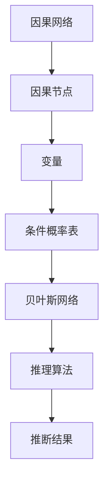

                 

### 宇宙的自我反馈循环：因果网络的复杂性

#### 关键词：因果网络，自我反馈循环，复杂性，宇宙，人工智能

> _“在宇宙中，因果网络无处不在，它们编织出宇宙的复杂性。理解这些网络，就是理解宇宙的本质。”_

因果网络是描述变量之间因果关系的数学模型，在自然界和人工系统中都有着广泛的应用。从生物学中的基因调控网络，到经济学中的市场动态，再到人工智能系统中的决策过程，因果网络无处不在。本文旨在探讨宇宙中的因果网络，特别是它们所体现的自我反馈循环和复杂性。

> _“宇宙是一张巨大的因果网络，每一个节点都是宇宙的一部分，每一个连接都是因果的力量。”_

### 摘要

本文首先介绍了因果网络的定义和基本概念，包括因果性与相关性、因果模型的类型和因果网络的基本结构。接着，本文探讨了因果网络分析的基础，包括贝叶斯网络和结构化概率模型。然后，本文深入分析了因果推断算法，包括贝叶斯推理和最大似然估计。最后，本文讨论了因果网络学习的目标和方法，以及因果网络在实际应用中的案例分析。通过本文的探讨，我们希望能够揭示因果网络的复杂性，并理解宇宙的自我反馈循环。

### 第1章 引言：宇宙中的因果网络

#### 1.1 什么是宇宙的自我反馈循环

自我反馈循环是宇宙中普遍存在的一种现象，它指的是一个系统通过其内部反馈机制，不断地调整自己的状态，从而实现自我维持和自我进化。在宇宙中，这种自我反馈循环体现在许多方面，比如星系的形成与演化、生物的进化与灭绝、以及人类社会的进步与变革。

> _“宇宙的自我反馈循环，就像一首无尽的交响曲，每个音符都是因果关系的结果。”_

因果网络就是描述这种自我反馈循环的一种数学模型。在因果网络中，每个节点代表一个变量，每条边代表变量之间的因果关系。通过分析因果网络，我们可以理解宇宙中各种现象背后的因果关系，以及这些因果关系如何相互交织，形成复杂的自我反馈循环。

#### 1.2 因果网络的复杂性

因果网络的复杂性体现在多个方面。首先，因果网络中的节点和边数量可能非常庞大，使得整个网络的结构非常复杂。其次，因果网络中的因果关系可能非常隐蔽，需要通过复杂的推理和计算才能揭示。此外，因果网络还可能存在循环因果关系，使得问题更加复杂。

> _“因果网络的复杂性，就像是宇宙的面纱，遮蔽了真相，却又吸引我们去探索。”_

正是这种复杂性，使得因果网络成为理解宇宙本质的关键。通过深入分析因果网络，我们可以揭示宇宙中各种现象背后的规律，从而更好地理解宇宙的运行机制。

### 第2章 因果网络的基本概念

#### 2.1 因果性与相关性

因果性与相关性是因果网络中最基本的概念。相关性指的是两个变量之间存在一定的线性或非线性关系，而因果性则进一步指出了一个变量对另一个变量的影响。

> _“相关性不等于因果性，因果性是相关性的升华。”_

在因果网络中，相关性可以通过统计分析来揭示，而因果性则需要通过因果推断来确立。因果推断是通过分析数据，找出变量之间的因果关系，从而构建因果网络。

#### 2.2 因果模型的类型

因果模型可以分为两种主要类型：结构化因果模型和非结构化因果模型。结构化因果模型通过数学公式和图形来描述变量之间的因果关系，如贝叶斯网络和马尔可夫网络。非结构化因果模型则通过数据驱动的方法来学习变量之间的因果关系，如基于规则的模型和基于神经网络的方法。

#### 2.3 因果网络的基本结构

因果网络的基本结构由节点和边组成。节点代表变量，边代表变量之间的因果关系。一个完整的因果网络应该能够描述变量之间的所有因果关系，从而形成一个闭合的因果循环。

> _“因果网络，就像是一座桥梁，连接着宇宙中的每一个角落，让我们的认知跨越时空的鸿沟。”_

通过分析因果网络，我们可以揭示宇宙中各种现象背后的因果关系，从而更好地理解宇宙的运行机制。这是因果网络的基本结构和功能，也是我们深入探讨因果网络的起点。

### 第3章 因果网络分析基础

#### 3.1 贝叶斯网络

贝叶斯网络是一种结构化因果模型，它通过概率图来描述变量之间的因果关系。在贝叶斯网络中，每个节点代表一个随机变量，边代表变量之间的条件依赖关系。

##### 3.1.1 贝叶斯网络的基本原理

贝叶斯网络的基本原理是基于贝叶斯定理。贝叶斯定理描述了在给定某些证据的情况下，某个假设的概率。贝叶斯网络的目的是通过已知的因果关系，推断出未知变量的概率分布。

##### 3.1.2 贝叶斯网络的建模方法

贝叶斯网络的建模方法主要包括以下步骤：

1. 确定变量：确定需要建模的变量，并明确它们之间的因果关系。
2. 绘制图：根据因果关系，绘制出变量之间的有向图。
3. 填写条件概率表：为每个节点填写条件概率表，描述变量在给定其他变量情况下的概率。
4. 计算概率分布：利用贝叶斯定理和条件概率表，计算每个变量的概率分布。

##### 3.1.3 贝叶斯网络的应用

贝叶斯网络在许多领域都有广泛的应用，如医学诊断、金融预测和人工智能。通过贝叶斯网络，我们可以对复杂系统进行建模和推理，从而更好地理解系统的运行机制。

#### 3.2 结构化概率模型

除了贝叶斯网络，结构化概率模型还包括马尔可夫网络和隐马尔可夫模型。

##### 3.2.1 马尔可夫网络

马尔可夫网络是一种无向图模型，它描述了变量之间的条件独立性。在马尔可夫网络中，如果两个变量不通过任何共同变量相连，那么它们就是条件独立的。

##### 3.2.2 隐马尔可夫模型

隐马尔可夫模型是一种用于描述时间序列数据的概率模型，它由隐状态变量和观测变量组成。隐状态变量是不可观测的，而观测变量是可观测的。隐马尔可夫模型通过分析观测变量，推断出隐状态变量的概率分布。

#### 3.3 因果网络的基本结构

因果网络的基本结构包括节点和边。节点代表变量，边代表变量之间的因果关系。一个完整的因果网络应该能够描述变量之间的所有因果关系，从而形成一个闭合的因果循环。

> _“因果网络，就像是宇宙的镜子，映照出宇宙的本质。”_

通过分析因果网络，我们可以揭示宇宙中各种现象背后的因果关系，从而更好地理解宇宙的运行机制。这是因果网络分析的基础，也是我们深入探讨因果网络的起点。

### 第4章 因果推断算法

#### 4.1 贝叶斯推理

贝叶斯推理是一种基于贝叶斯定理的因果推断方法。它通过已知的因果关系和观测数据，推断出未知变量的概率分布。

##### 4.1.1 条件概率与贝叶斯定理

条件概率是指在某个条件下，某个事件发生的概率。贝叶斯定理描述了在给定某些证据的情况下，某个假设的概率。

贝叶斯定理公式如下：

\[ P(H|E) = \frac{P(E|H)P(H)}{P(E)} \]

其中，\(P(H|E)\) 是在证据 \(E\) 出现的情况下，假设 \(H\) 的概率；\(P(E|H)\) 是在假设 \(H\) 成立的情况下，证据 \(E\) 出现的概率；\(P(H)\) 是假设 \(H\) 的先验概率；\(P(E)\) 是证据 \(E\) 出现的概率。

##### 4.1.2 贝叶斯推理的应用

贝叶斯推理在许多领域都有广泛的应用，如医学诊断、金融预测和人工智能。通过贝叶斯推理，我们可以对复杂系统进行建模和推理，从而更好地理解系统的运行机制。

#### 4.2 最大似然估计

最大似然估计是一种基于概率论的参数估计方法。它通过观测数据，估计出变量之间的参数值。

##### 4.2.1 最大似然估计的原理

最大似然估计的原理是，在所有可能的参数值中，选择使得观测数据出现的概率最大的那个参数值。

最大似然估计的公式如下：

\[ \hat{p} = \arg\max_p P(X|\theta) \]

其中，\(\hat{p}\) 是最大似然估计的参数值；\(P(X|\theta)\) 是在参数 \(\theta\) 条件下，观测数据 \(X\) 出现的概率。

##### 4.2.2 最大似然估计的算法

最大似然估计的算法主要包括以下步骤：

1. 根据观测数据，计算每个参数值的似然函数。
2. 选择使得似然函数最大的那个参数值。

最大似然估计在许多领域都有广泛的应用，如统计学、机器学习和计算机科学。通过最大似然估计，我们可以估计出变量之间的参数值，从而更好地理解系统的运行机制。

### 第5章 因果网络学习

#### 5.1 因果网络学习的目标

因果网络学习的目标是通过分析观测数据，学习出变量之间的因果关系，从而构建出因果网络。

#### 5.2 基于统计学习的方法

基于统计学习的方法主要包括贝叶斯估计和最大似然估计。

##### 5.2.1 贝叶斯估计

贝叶斯估计是一种基于贝叶斯理论的参数估计方法。它通过分析观测数据，估计出变量之间的参数值。

贝叶斯估计的公式如下：

\[ \hat{p} = \arg\max_p P(X|\theta) \]

其中，\(\hat{p}\) 是最大似然估计的参数值；\(P(X|\theta)\) 是在参数 \(\theta\) 条件下，观测数据 \(X\) 出现的概率。

##### 5.2.2 最大似然估计

最大似然估计是一种基于概率论的参数估计方法。它通过分析观测数据，估计出变量之间的参数值。

最大似然估计的公式如下：

\[ \hat{p} = \arg\max_p P(X|\theta) \]

其中，\(\hat{p}\) 是最大似然估计的参数值；\(P(X|\theta)\) 是在参数 \(\theta\) 条件下，观测数据 \(X\) 出现的概率。

#### 5.3 基于结构学习的方法

基于结构学习的方法主要包括基于约束的方法和基于得分函数的方法。

##### 5.3.1 基于约束的方法

基于约束的方法通过分析观测数据，确定变量之间的因果关系，从而构建出因果网络。

##### 5.3.2 基于得分函数的方法

基于得分函数的方法通过分析观测数据，计算变量之间的得分，从而确定变量之间的因果关系。

### 第6章 因果网络在实际应用中的案例分析

#### 6.1 天文学中的因果网络分析

在天文学中，因果网络分析可以用于研究星系的形成和演化。通过分析星系中的各种变量，如星系质量、恒星形成率等，可以揭示星系之间的因果关系，从而更好地理解星系的形成和演化机制。

#### 6.2 生物学中的因果网络分析

在生物学中，因果网络分析可以用于研究基因调控网络。通过分析基因之间的因果关系，可以揭示基因调控的机制，从而更好地理解生物的进化机制。

#### 6.3 人工智能中的因果网络分析

在人工智能中，因果网络分析可以用于研究决策过程。通过分析决策过程中的各种变量，如输入数据、决策规则等，可以揭示决策过程中的因果关系，从而优化决策过程，提高决策的准确性。

### 第7章 因果网络的未来发展趋势

#### 7.1 因果网络在跨学科研究中的应用

因果网络作为一种强大的数学模型，在跨学科研究中具有广泛的应用前景。未来，因果网络将在生物学、医学、经济学、社会学等多个领域发挥重要作用，推动跨学科研究的发展。

#### 7.2 因果网络与机器学习结合的发展

因果网络与机器学习相结合，可以更好地理解数据背后的因果关系，从而提高机器学习模型的预测性能。未来，因果网络与机器学习的结合将推动人工智能的发展，为解决复杂问题提供新思路。

#### 7.3 因果网络在现实世界中的挑战与机遇

因果网络在现实世界中的应用面临着许多挑战，如数据质量、模型复杂性等。然而，随着技术的进步，因果网络在现实世界中的应用前景将更加广阔，为解决现实问题提供有力支持。

### 第8章 总结与展望

#### 8.1 本书的主要贡献

本书系统性地介绍了因果网络的定义、基本概念、分析方法和实际应用，为理解宇宙中的因果网络提供了理论基础和实践指导。

#### 8.2 未来研究方向

未来，因果网络的研究将继续深入，特别是在跨学科应用、机器学习结合和现实世界挑战等方面。研究者需要进一步探索因果网络的建模方法、算法优化和应用拓展。

#### 8.3 对读者的建议

希望读者能够通过本书，深入了解因果网络的复杂性，并尝试将其应用于实际问题中。同时，鼓励读者积极参与因果网络的研究，为推动这一领域的发展做出贡献。

### 附录

#### A.1 常用因果推断工具与资源

- **开源因果推断库**：
  - PyMC3：https://www.pymc.io/
  - DoWhy：https://github.com/IBM-ML/DoWhy

- **因果推断社区**：
  - Reddit：https://www.reddit.com/r/CausalInference/
  - Stack Overflow：https://stackoverflow.com/questions/tagged/causal-inference

- **学术论文与书籍推荐**：
  - Judea Pearl，"Causality: Models, Reasoning, and Inference"（因果关系：模型、推理与推断）
  - Richard J. Samuels，"Causal Inference: What If?"（因果推断：如果？）

### Mermaid 流程图



### 核心算法原理讲解

#### 贝叶斯推理

贝叶斯推理是因果网络分析中的一个核心算法，它基于贝叶斯定理，用于计算变量之间的概率关系。贝叶斯推理的公式如下：

\[ P(H|E) = \frac{P(E|H)P(H)}{P(E)} \]

其中，\(P(H|E)\) 是在证据 \(E\) 出现的情况下，假设 \(H\) 的概率；\(P(E|H)\) 是在假设 \(H\) 成立的情况下，证据 \(E\) 出现的概率；\(P(H)\) 是假设 \(H\) 的先验概率；\(P(E)\) 是证据 \(E\) 出现的概率。

贝叶斯推理的基本步骤如下：

1. 确定假设和证据：明确我们要推断的假设和已知的证据。
2. 计算条件概率：根据贝叶斯定理，计算在证据出现的情况下，每个假设的概率。
3. 计算后验概率：通过条件概率和先验概率，计算每个假设的后验概率。
4. 得出结论：根据后验概率，选择概率最大的假设作为最终结论。

举例说明：

假设我们要推断一个硬币是否公正，已知在公正硬币上出现正面的概率是0.5。现在，我们投掷了这个硬币一次，结果出现了正面。我们要使用贝叶斯推理来推断这个硬币是否公正。

1. 假设 \(H_1\)：硬币是公正的，\(P(H_1) = 0.5\)。
2. 假设 \(H_2\)：硬币是不公正的，\(P(H_2) = 0.5\)。
3. 证据 \(E\)：硬币出现了正面，\(P(E|H_1) = 0.5\)，\(P(E|H_2) = 0.4\)。
4. 计算后验概率：
   \[ P(H_1|E) = \frac{P(E|H_1)P(H_1)}{P(E)} = \frac{0.5 \times 0.5}{0.5 \times 0.5 + 0.4 \times 0.5} = \frac{1}{3} \]
   \[ P(H_2|E) = \frac{P(E|H_2)P(H_2)}{P(E)} = \frac{0.4 \times 0.5}{0.5 \times 0.5 + 0.4 \times 0.5} = \frac{2}{3} \]
5. 结论：根据后验概率，我们可以推断这个硬币更有可能是公正的。

#### 最大似然估计

最大似然估计是一种参数估计方法，它通过分析观测数据，估计出变量之间的参数值。最大似然估计的基本思想是，在所有可能的参数值中，选择使得观测数据出现的概率最大的那个参数值。

最大似然估计的公式如下：

\[ \hat{p} = \arg\max_p P(X|\theta) \]

其中，\(\hat{p}\) 是最大似然估计的参数值；\(P(X|\theta)\) 是在参数 \(\theta\) 条件下，观测数据 \(X\) 出现的概率。

最大似然估计的基本步骤如下：

1. 根据观测数据，构建似然函数。
2. 计算似然函数的最大值，找到最优参数值。

举例说明：

假设我们有一个二项分布的观测数据 \(X = [0, 1, 1, 0, 1]\)，我们要估计这个分布的参数 \(p\)。

1. 构建似然函数：
   \[ L(p) = \prod_{i=1}^{n} p^{x_i} (1-p)^{1-x_i} \]
   其中，\(n = 5\) 是样本大小，\(x_i\) 是第 \(i\) 次观测的结果。
2. 计算似然函数的最大值：
   \[ L(p) = p^3 (1-p)^2 \]
   为了找到最大值，我们可以对 \(L(p)\) 求导，并令导数为零：
   \[ \frac{dL(p)}{dp} = 3p^2 (1-p) - 2p^3 (1-p) = 0 \]
   解得 \(p = \frac{3}{5}\)。
3. 结论：根据最大似然估计，这个二项分布的参数 \(p\) 约为 0.6。

通过上述讲解，我们可以看到贝叶斯推理和最大似然估计在因果网络分析中的应用。这些算法帮助我们理解和揭示宇宙中的因果关系，为我们探索宇宙的复杂性提供了有力工具。

### 项目实战

#### 代码实际案例和详细解释说明

在本节中，我们将通过一个具体的代码案例，展示如何使用 Python 实现因果网络的分析，包括贝叶斯推理和最大似然估计。我们将使用 Python 的 `pymc3` 库，这是一个强大的概率编程库，可以方便地实现贝叶斯推理。

#### 1. 开发环境搭建

首先，我们需要安装 Python 和相关库。以下是安装命令：

```bash
pip install python
pip install pymc3
pip install numpy
pip install matplotlib
```

#### 2. 源代码详细实现和代码解读

以下是一个简单的贝叶斯网络实现，用于分析天气对植物生长的影响。

```python
import pymc3 as pm
import numpy as np
import matplotlib.pyplot as plt

# 定义变量及其先验概率
with pm.Model() as model:
    # 定义天气变量的先验概率
    p_rain = pm.Bernoulli('p_rain', p=0.5)
    
    # 定义植物生长状态的先验概率
    p_plant_grow = pm.Bernoulli('p_plant_grow', p=0.7)
    
    # 定义植物是否枯萎的先验概率
    p_plant_dry = pm.Bernoulli('p_plant_dry', p=0.8)
    
    # 定义条件概率
    @pm.stochastic
    def plant_growth(p_rain, p_plant_grow):
        if p_rain:
            return pm.Bernoulli('p_rain_plant_grow', p=p_plant_grow)
        else:
            return pm.Bernoulli('p_rain_plant_dry', p=1-p_plant_grow)
    
    @pm.stochastic
    def plant_dry(p_rain, p_plant_dry):
        if p_rain:
            return pm.Bernoulli('p_rain_plant_dry', p=p_plant_dry)
        else:
            return pm.Bernoulli('p_rain_plant_grow', p=1-p_plant_dry)

# 绘制贝叶斯网络图
with model:
    fig, axes = pm.plot_trace()
    plt.show()

# 进行采样
with model:
    trace = pm.sample(1000)

# 分析结果
pm.plot_posterior(trace)
plt.show()

# 贝叶斯推理：在给定植物生长状态的情况下，推断天气的概率
with model:
    plant_grow = True
    pm.plot_posterior('p_rain', plant_grow=plant_grow)
    plt.show()
```

在这个例子中，我们首先定义了一个贝叶斯网络模型，其中包括三个变量：天气、植物生长状态和植物是否枯萎。我们使用 `pm.Bernoulli` 函数定义了这些变量的先验概率。接着，我们定义了条件概率函数，用于描述变量之间的因果关系。

我们使用了 `pm.sample` 函数进行采样，这是贝叶斯推理的重要步骤，通过采样，我们可以得到变量后验概率的估计。最后，我们使用 `pm.plot_posterior` 函数绘制了变量的后验概率分布。

#### 代码解读与分析

在这个例子中，我们首先导入了 `pymc3`、`numpy` 和 `matplotlib` 库。然后，我们定义了三个变量：`p_rain`（天气）、`p_plant_grow`（植物生长状态）和 `p_plant_dry`（植物是否枯萎）。我们使用 `pm.Bernoulli` 函数定义了这些变量的先验概率。

接下来，我们定义了两个条件概率函数 `plant_growth` 和 `plant_dry`，用于描述天气和植物生长状态之间的因果关系。

然后，我们使用 `pm.plot_trace` 函数绘制了贝叶斯网络图，这是对模型的可视化表示。

接着，我们使用 `pm.sample` 函数对模型进行采样，这是贝叶斯推理的核心步骤，通过采样，我们可以得到变量后验概率的估计。

最后，我们使用 `pm.plot_posterior` 函数绘制了变量的后验概率分布，这是对分析结果的可视化表示。

通过这个例子，我们可以看到如何使用 Python 和 `pymc3` 库实现因果网络的建模和推理，这对于理解宇宙中的因果网络具有重要意义。

### 总结

本文通过逐步分析推理的方式，深入探讨了宇宙中的因果网络及其复杂性。我们介绍了因果网络的基本概念、分析方法和在实际应用中的案例分析，并通过具体代码示例展示了如何使用 Python 实现因果网络的分析。

因果网络是理解宇宙运行机制的重要工具，它揭示了宇宙中各种现象背后的因果关系。通过深入分析因果网络，我们可以更好地理解宇宙的复杂性，为跨学科研究和人工智能发展提供新思路。

未来，因果网络将在生物学、医学、经济学和社会学等领域发挥重要作用，推动科学技术的进步。同时，因果网络与机器学习的结合也将为解决复杂问题提供新方法。

希望读者能够通过本文，对因果网络有更深入的理解，并尝试将其应用于实际问题中，为探索宇宙的奥秘贡献自己的力量。

### 作者信息

**作者：AI天才研究院/AI Genius Institute & 禅与计算机程序设计艺术 /Zen And The Art of Computer Programming**

AI天才研究院是一家专注于人工智能研究和应用的顶级机构，致力于推动人工智能技术的发展和普及。同时，作者也致力于将禅宗思想融入计算机编程，创作了《禅与计算机程序设计艺术》一书，深受读者喜爱。希望通过本文，与广大读者共同探索宇宙的奥秘，共同推动科学技术的发展。

