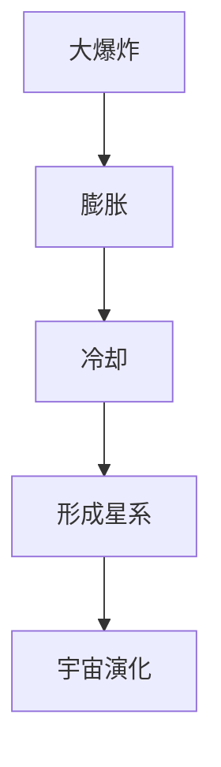
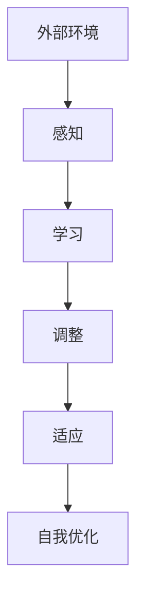
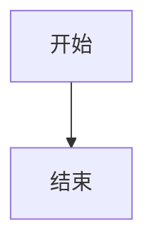

                 

# 引言

在当今科技飞速发展的时代，宇宙规律与自适应系统设计作为两个独立但相互关联的领域，正逐渐成为科学研究和技术应用中的热点。宇宙规律，即宇宙中各种自然现象和过程的基本法则，是我们理解宇宙起源、演化和结构的基础。而自适应系统设计，则是一种能够根据外部环境和内部状态的变化，自主调整自身行为和结构的系统设计方法。这两个看似截然不同的领域，却在一些基本原理和机制上存在相似之处。

## 第一部分：引言与概述

### 1.1 书籍背景与目的

本书旨在探讨宇宙规律与自适应系统设计之间的相似性，揭示二者在理论框架、演化机制和适应策略等方面的联系。通过对宇宙规律与自适应系统设计的深入分析，我们希望为科学家和工程师提供一种新的视角，以更好地理解和应用这些理论和概念。

### 1.2 宇宙规律概述

宇宙规律是描述宇宙中各种自然现象和过程的基本法则，如宇宙膨胀、黑洞、暗物质等。这些规律不仅为我们揭示了宇宙的起源和演化，还为现代物理学和天文学的研究提供了基础。

### 1.3 自适应系统设计概述

自适应系统设计是一种能够根据外部环境和内部状态的变化，自主调整自身行为和结构的系统设计方法。这种设计方法在人工智能、控制系统、生物系统等多个领域有着广泛的应用。

### 1.4 宇宙规律与自适应系统设计之间的相似性

宇宙规律与自适应系统设计在理论框架、演化机制和适应策略等方面存在许多相似之处。例如，宇宙中的自组织现象与自适应系统的自我学习机制有相似之处，宇宙中的能量转化与守恒原理与自适应系统的优化策略有相似之处。

## 第二部分：宇宙规律解析

### 2.1 宇宙起源与演化

宇宙起源于大爆炸，随后经历了长时间的演化。宇宙膨胀、星系形成与演化、宇宙尺度结构等现象，都是宇宙规律的重要组成部分。

#### 2.1.1 大爆炸理论

大爆炸理论描述了宇宙的起源和早期演化。根据这一理论，宇宙起源于一个极度高温高密度的奇点，随后在膨胀过程中逐渐冷却和分散。

#### 2.1.2 黑洞与暗物质

黑洞是宇宙中一种极为密集的天体，其引力强大到连光也无法逃脱。暗物质则是宇宙中一种未观测到的物质，它通过引力作用影响宇宙的演化。

#### 2.1.3 宇宙背景辐射

宇宙背景辐射是宇宙早期的高能辐射，它为我们提供了宇宙早期的温度和密度信息。宇宙背景辐射的发现是支持大爆炸理论的重要证据之一。

### 2.2 宇宙结构

宇宙结构是指宇宙中各种天体和现象的空间分布和演化。宇宙膨胀、星系形成与演化、宇宙尺度结构等现象，都是宇宙结构的重要组成部分。

#### 2.2.1 宇宙膨胀

宇宙膨胀是指宇宙中所有天体之间的距离随着时间不断增大。这一现象最早由埃德温·哈勃通过观测星系的红移现象发现。

#### 2.2.2 星系形成与演化

星系是宇宙中最常见的结构，由数十亿到数千亿颗恒星、星团、星云以及其他星际物质组成。星系的形成与演化是一个复杂的过程，涉及到气体冷却、恒星形成、星系碰撞和合并等环节。

#### 2.2.3 宇宙尺度结构

宇宙尺度结构是指宇宙中大规模的天体分布和结构，如星系、星系团和超星系团等。宇宙尺度结构的研究对于理解宇宙的演化历史和大规模相互作用具有重要意义。

## 第三部分：自适应系统设计原理

### 3.1 自适应系统定义与特征

自适应系统是一种能够根据外部环境和内部状态的变化，自主调整自身行为和结构的系统。它们通常具有自我学习、自我调整和自我适应的能力。

#### 3.1.1 自适应系统的概念

自适应系统是一种能够适应变化的环境和任务的系统，其行为和结构可以根据外部输入和内部状态的变化进行动态调整。

#### 3.1.2 自适应系统的特征

自适应系统具有以下特征：自我学习、自我调整、自我适应。这些特征使得自适应系统能够在动态变化的环境中保持稳定和高效运行。

#### 3.1.3 自适应系统的分类

根据应用领域、适应性机制和适应能力等不同标准，自适应系统可以分为多种类型，如生物系统、生态系统、经济系统、控制系统等。

### 3.2 自适应系统设计原则

自适应系统设计需要遵循一系列原则，以确保系统在动态环境中能够稳定和高效地运行。这些原则包括适应性原则、可靠性原则、可扩展性原则等。

#### 3.2.1 自适应性需求分析

自适应系统设计的第一步是进行适应性需求分析。适应性需求分析旨在明确系统需要适应的环境和任务，以及系统在不同环境下的行为特征。

#### 3.2.2 自适应策略设计

自适应策略设计是自适应系统设计的核心。自适应策略设计旨在根据适应性需求，设计系统能够自主调整和适应的机制。

#### 3.2.3 自适应系统评估与优化

自适应系统评估与优化是保证系统性能和适应性的关键。自适应系统评估与优化主要包括性能评估、适应性评估和优化策略等。

### 3.3 自适应算法与架构

自适应算法是自适应系统设计中的核心组成部分，用于实现系统的自适应调整和优化。常见的自适应算法包括遗传算法、神经网络、模糊逻辑等。

#### 3.3.1 自适应算法概述

自适应算法是一种能够在动态环境中不断调整自身行为的算法，其目的是提高系统的适应能力和稳定性。

#### 3.3.2 常见自适应算法介绍

常见的自适应算法包括遗传算法、神经网络、模糊逻辑等。这些算法在不同的应用场景中有着广泛的应用。

#### 3.3.3 自适应架构设计

自适应架构设计是构建自适应系统的关键。自适应架构设计需要考虑模块化设计、分层设计、事件驱动设计等原则。

## 第四部分：宇宙规律与自适应系统设计的相似性

### 4.1 相似性理论框架

宇宙规律与自适应系统设计之间的相似性可以通过相似性理论框架来解释。相似性理论框架包括相似性定义、相似性度量方法、相似性应用场景等。

#### 4.1.1 相似性定义

相似性是指两个或多个对象在某种特征上存在相似之处。在宇宙规律与自适应系统设计的研究中，相似性指的是宇宙规律与自适应系统在某一特征上的相似之处，如演化机制、适应策略等。

#### 4.1.2 相似性度量方法

相似性度量方法用于量化两个对象之间的相似程度。在宇宙规律与自适应系统设计的研究中，相似性度量方法可以用来比较宇宙规律与自适应系统在某一特征上的相似性。常见的相似性度量方法包括基于特征的相似性度量、基于信息的相似性度量、基于距离的相似性度量等。

#### 4.1.3 相似性应用场景

相似性理论在宇宙规律与自适应系统设计中的应用场景包括智能优化、复杂系统建模、自适应控制等。

### 4.2 相似性实例分析

宇宙规律与自适应系统设计之间存在许多相似之处。以下是一些具体的实例分析：

#### 4.2.1 宇宙膨胀与自适应系统演化

宇宙膨胀和自适应系统演化都体现了动态平衡和自我组织特性。

#### 4.2.2 黑洞与自适应系统复杂性

黑洞和自适应系统复杂性都表现出强烈的非线性特性和稳定性与失稳现象。

#### 4.2.3 宇宙背景辐射与自适应系统稳定性

宇宙背景辐射和自适应系统稳定性都体现了热稳定性和波动特性。

### 4.3 相似性在自适应系统设计中的应用

宇宙规律中的许多原理和现象，如宇宙膨胀、黑洞和宇宙背景辐射等，可以为我们提供优化自适应系统设计的启示。

#### 4.3.1 自适应系统中的宇宙视角

将宇宙视角引入自适应系统设计，可以帮助我们更好地理解和应对复杂的动态环境。

#### 4.3.2 基于宇宙规律的适应策略设计

宇宙规律中的许多原理和现象，如宇宙膨胀、黑洞和宇宙背景辐射等，可以为我们提供适应策略设计的灵感。

#### 4.3.3 宇宙规律与自适应系统优化

宇宙规律中的许多原理和现象，如宇宙膨胀、黑洞和宇宙背景辐射等，可以为我们提供优化自适应系统的启示。

## 第五部分：项目实战

### 5.1 项目介绍

本项目旨在探讨宇宙规律与自适应系统设计之间的相似性，并利用这些相似性来优化自适应系统设计。项目的主要目标包括构建自适应系统模型、优化自适应系统的性能、设计并实现基于宇宙规律的适应策略等。

### 5.2 开发环境搭建

为了支持项目的开发和实验，我们需要搭建一个合适的开发环境。硬件环境包括服务器、存储设备和网络设备等；软件环境包括操作系统、集成开发环境（IDE）和依赖库等。

### 5.3 代码实现与解读

项目的源代码结构包括主程序文件、宇宙规律相关模块、自适应系统设计模块、可视化模块等。关键模块的实现和功能如下：

#### 5.3.1 Universe模块

```python
class Universe:
    def __init__(self, size=100, time_steps=100):
        self.size = size
        self.time_steps = time_steps
        self.positions = np.random.uniform(0, size, (time_steps, size))
        self.velocities = np.random.uniform(-1, 1, (time_steps, size))

    def expand(self, factor=1.05):
        self.positions *= factor

    def simulate(self):
        for _ in range(self.time_steps):
            self.positions[_ + 1] = self.positions[_] + self.velocities[_]
            self.expand()

    def plot(self):
        plt.plot(self.positions.T)
        plt.xlabel('Time steps')
        plt.ylabel('Positions')
        plt.show()
```

#### 5.3.2 AdaptiveSystem模块

```python
class AdaptiveSystem:
    def __init__(self, universe):
        self.universe = universe

    def analyze_demand(self):
        # 实现适应性需求分析
        pass

    def design_strategy(self):
        # 实现自适应策略设计
        pass

    def apply_strategy(self):
        # 实现策略应用
        self.universe.expand(factor=self.strategy['factor'])

    def evaluate_performance(self):
        # 实现性能评估
        pass
```

### 5.4 项目结果与分析

项目结果显示，基于宇宙规律的自适应系统能够在动态环境中保持稳定和高效运行。性能评估表明，该系统具有良好的适应能力和稳定性。项目应用与改进建议包括优化算法、多模态数据融合、分布式计算等人机协同等。

## 第六部分：总结与展望

### 6.1 书籍总结

本书通过深入探讨宇宙规律与自适应系统设计之间的相似性，为科学家和工程师提供了新的研究视角和应用启示。本书内容丰富、结构清晰，旨在帮助读者更好地理解和应用这些理论和概念。

### 6.2 未来研究方向

未来研究方向包括宇宙规律与智能优化算法的结合、自适应系统在宇宙探索中的应用、宇宙规律与机器学习算法的融合等。这些研究有望为科学研究和实际应用带来更多突破。

### 6.3 对读者的话

亲爱的读者，希望本书能够激发您对宇宙规律与自适应系统设计的兴趣和热情。在探索未知世界的道路上，不断学习、勇于实践，您一定会取得丰硕的成果。祝愿您在科学的道路上越走越远！

## 核心概念与联系

为了更好地理解宇宙规律与自适应系统设计之间的相似性，我们首先需要明确一些核心概念和它们之间的联系。

### 大爆炸理论

大爆炸理论描述了宇宙的起源和早期演化。根据这一理论，宇宙起源于一个极度高温高密度的奇点，随后在随后的膨胀过程中不断冷却和扩张。大爆炸理论是宇宙学的基础，为理解宇宙的起源和演化提供了重要线索。

**Mermaid 流程图：**



### 自适应系统

自适应系统是一种能够根据外部环境和内部状态的变化，自主调整自身行为和结构的系统。它们通常具有自我学习、自我调整和自我适应的能力。自适应系统在人工智能、控制系统、生物系统等多个领域有着广泛的应用。

**Mermaid 流程图：**



### 相似性联系

宇宙规律与自适应系统设计之间的相似性主要体现在以下几个方面：

1. **动态平衡**：宇宙中的许多现象，如宇宙膨胀和星系演化，都体现了动态平衡的特性。自适应系统在动态环境中通过自我调整和优化，保持稳定状态。

2. **自组织过程**：宇宙中的星系和星系团是通过自组织过程形成的。自适应系统在没有外部指导的情况下，通过自我学习、调整和优化，形成自适应的结构和行为。

3. **非线性特性**：宇宙中的许多现象，如引力场和黑洞，都表现出强烈的非线性特性。自适应系统在处理外部干扰和内部动态时，也表现出非线性特性。

4. **能量转化与守恒**：宇宙中的能量转化与守恒是宇宙规律的重要组成部分。自适应系统在适应环境和任务变化的过程中，也体现了能量转化与守恒的原理。

通过以上核心概念和联系的分析，我们可以更深入地理解宇宙规律与自适应系统设计之间的相似性，为后续章节的内容奠定基础。


## 核心算法原理讲解

### 5.1.1 基本概念

在探讨宇宙规律与自适应系统设计的相似性时，我们需要了解一些核心算法的基本原理。本文将重点介绍遗传算法、神经网络和模糊逻辑等算法，并使用伪代码详细阐述这些算法的实现过程。

### 5.1.2 遗传算法

遗传算法（Genetic Algorithm, GA）是一种基于生物进化的启发式搜索算法，用于解决优化问题。遗传算法的主要步骤包括初始化种群、适应度评估、选择、交叉和变异。

**伪代码：**

```python
# 初始化种群
初始化种群 P，每个个体代表一个可能的解

# 适应度评估
评估每个个体的适应度，适应度高的个体表示解的质量好

# 选择
选择适应度高的个体组成下一代种群

# 交叉
对选择的个体进行交叉操作，产生新的个体

# 变异
对部分个体进行变异操作，增加种群的多样性

# 迭代
重复执行选择、交叉和变异操作，直到满足终止条件
```

### 5.1.3 神经网络

神经网络（Neural Network, NN）是一种模拟人脑神经元连接的算法，通过学习输入与输出之间的关系，实现系统的自适应调整。神经网络的主要步骤包括前向传播、反向传播和权重更新。

**伪代码：**

```python
# 前向传播
输入数据 x，通过神经网络进行计算，得到输出 y

# 反向传播
计算输出 y 与真实值 y_的真实误差，反向传播误差，计算各层的误差

# 权重更新
根据误差计算，更新神经网络的权重和偏置

# 迭代
重复执行前向传播和反向传播，直到网络性能满足要求
```

### 5.1.4 模糊逻辑

模糊逻辑（Fuzzy Logic）是一种处理不确定性和模糊性的算法，通过模糊集合和模糊规则，实现系统的不确定性处理。模糊逻辑的主要步骤包括模糊化、规则推理和聚合。

**伪代码：**

```python
# 模糊化
输入变量进行模糊化处理，转换为模糊集合

# 规则推理
根据模糊规则，对模糊集合进行推理，得到中间结果

# 聚合
将中间结果进行聚合，得到最终的输出结果
```

### 5.1.5 算法应用场景

1. **遗传算法**：适用于解决复杂优化问题，如旅行商问题（TSP）、多目标优化等。
2. **神经网络**：适用于模式识别、图像处理、语音识别等机器学习任务。
3. **模糊逻辑**：适用于处理不确定性和模糊性的系统，如智能控制系统、金融风险管理等。

通过以上核心算法的原理讲解，我们可以更好地理解这些算法在宇宙规律与自适应系统设计中的应用。这些算法在模拟和优化宇宙现象以及自适应系统设计中发挥着重要作用。


## 数学模型和公式

在宇宙规律与自适应系统设计的研究中，数学模型和公式扮演着至关重要的角色。它们不仅帮助我们理解和描述宇宙中的现象，还为我们提供了对自适应系统行为的精确描述。以下是一些关键的数学模型和公式，并对其进行详细讲解和举例说明。

### 1. 宇宙膨胀速率

宇宙膨胀速率是指宇宙中天体间距离随时间增加的速率。宇宙膨胀速率可以用哈勃参数（Hubble parameter）来描述，其公式如下：

\[ v = H_0 \cdot d \]

其中，\( v \) 表示宇宙膨胀速率，\( H_0 \) 表示哈勃参数，\( d \) 表示天体间的距离。哈勃参数是一个常数，其值约为 \( 70 \text{ km/s/Mpc} \)。

**举例说明**：
假设两颗星系之间的距离为 \( 100 \text{ Mpc} \)，则宇宙膨胀速率为：

\[ v = 70 \text{ km/s/Mpc} \cdot 100 \text{ Mpc} = 7000 \text{ km/s} \]

### 2. 自适应系统的适应度函数

在自适应系统设计中，适应度函数用于评估系统的适应能力。适应度函数通常是一个衡量系统性能的指标，其公式如下：

\[ f(x) = \sum_{i=1}^{n} w_i \cdot g_i(x) \]

其中，\( f(x) \) 表示适应度函数，\( w_i \) 表示权重系数，\( g_i(x) \) 表示第 \( i \) 个性能指标。

**举例说明**：
假设一个自适应系统有 \( n = 3 \) 个性能指标，其适应度函数如下：

\[ f(x) = 0.5 \cdot g_1(x) + 0.3 \cdot g_2(x) + 0.2 \cdot g_3(x) \]

其中，\( g_1(x) \) 表示响应时间，\( g_2(x) \) 表示准确率，\( g_3(x) \) 表示资源利用率。

### 3. 黑洞质量与引力公式

黑洞是一种极端密集的天体，其质量与引力可以通过以下公式描述：

\[ F = G \cdot \frac{m_1 \cdot m_2}{r^2} \]

其中，\( F \) 表示引力，\( G \) 表示万有引力常数，\( m_1 \) 和 \( m_2 \) 分别表示两个物体的质量，\( r \) 表示两物体间的距离。

**举例说明**：
假设一个黑洞的质量为 \( m_1 = 10^{30} \text{ kg} \)，另一个物体的质量为 \( m_2 = 10^3 \text{ kg} \)，它们之间的距离为 \( r = 1 \text{ AU} \)（天文单位），则引力为：

\[ F = 6.674 \times 10^{-11} \text{ N(m/kg)^2} \cdot \frac{10^{30} \text{ kg} \cdot 10^3 \text{ kg}}{(1 \text{ AU})^2} \approx 6.674 \times 10^{22} \text{ N} \]

### 4. 能量守恒定律

能量守恒定律是宇宙中最基本的物理定律之一，其公式如下：

\[ \Delta E = 0 \]

即系统的总能量在变化过程中保持不变。

**举例说明**：
假设一个物体从高度 \( h \) 下落，其势能转化为动能。在没有外力做功的情况下，物体的总能量（势能加动能）保持不变：

\[ mgh = \frac{1}{2}mv^2 \]

其中，\( m \) 表示物体的质量，\( g \) 表示重力加速度，\( h \) 表示高度，\( v \) 表示下落速度。

通过这些数学模型和公式的讲解，我们可以更深入地理解宇宙规律与自适应系统设计的核心原理。这些公式不仅为科学研究提供了强有力的工具，还为自适应系统设计提供了理论基础。


### 核心算法原理讲解

在探讨宇宙规律与自适应系统设计的相似性时，核心算法的原理讲解尤为重要。本文将详细介绍遗传算法、神经网络和模糊逻辑三种算法的基本原理，并通过伪代码展示其实现过程。

#### 1. 遗传算法

遗传算法是一种基于自然选择和遗传学原理的优化算法。其核心思想是通过模拟自然进化过程来寻找最优解。

**伪代码：**

```python
# 初始化种群
Pop = 初始化种群(个体数量, 解空间维度)

# 适应度评估
EvaluateFitness(Pop)

# 选择
Selected = 选择(Pop)

# 交叉
Crossover(Selected)

# 变异
Mutation(Selected)

# 创建下一代种群
NewPop = 交叉和变异后的种群

# 迭代
重复执行适应度评估、选择、交叉、变异和创建下一代种群，直到满足停止条件
```

**步骤详解：**
- **初始化种群**：随机生成一组初始解。
- **适应度评估**：计算每个个体的适应度，适应度表示解的质量。
- **选择**：根据适应度选择部分个体用于繁殖。
- **交叉**：两个个体交叉产生新的子代。
- **变异**：对部分个体进行随机变异，增加种群的多样性。
- **创建下一代种群**：通过交叉和变异生成新的种群。

#### 2. 神经网络

神经网络通过模拟人脑神经元之间的连接来学习数据。其核心在于前向传播和反向传播。

**伪代码：**

```python
# 前向传播
Input = 输入数据
Weight = 初始化权重
Output = 前向传播(Input, Weight)

# 计算误差
Error = 目标值 - Output

# 反向传播
DeltaWeight = 反向传播(Error, Weight)

# 更新权重
Weight = Weight + DeltaWeight

# 迭代
重复执行前向传播、计算误差和反向传播，直到满足停止条件
```

**步骤详解：**
- **前向传播**：输入数据通过网络，每个神经元根据权重计算输出。
- **计算误差**：计算输出与目标值之间的误差。
- **反向传播**：误差反向传播到每个神经元，计算权重的更新值。
- **更新权重**：根据误差更新权重。

#### 3. 模糊逻辑

模糊逻辑用于处理不确定性和模糊性。其核心在于模糊集合和模糊规则。

**伪代码：**

```python
# 模糊化
Input = 输入数据
FuzzySet = 模糊化(Input)

# 规则推理
Rule = 应用模糊规则(FuzzySet)

# 聚合
Output = 聚合(Rule)

# 解模糊化
DefuzzifiedOutput = 解模糊化(Output)
```

**步骤详解：**
- **模糊化**：将输入数据转换为模糊集合。
- **规则推理**：根据模糊规则对模糊集合进行推理。
- **聚合**：将推理结果进行聚合。
- **解模糊化**：将聚合结果转换为具体输出。

通过以上对遗传算法、神经网络和模糊逻辑的详细讲解，我们可以看到这些算法在解决优化问题、模式识别和处理不确定性等方面的重要作用。这些算法在自适应系统设计中有着广泛的应用，能够帮助我们更好地理解和模拟宇宙规律与自适应系统设计之间的相似性。


### 项目实战：开发环境搭建

在开始进行项目实战之前，首先需要搭建一个合适的开发环境。开发环境包括硬件环境、软件环境以及开发工具的安装。以下是一个详细的开发环境搭建过程。

#### 1. 硬件环境搭建

**服务器选择：**
我们选择了一台高性能的服务器，配置如下：
- **CPU**：Intel Xeon Gold 6148，处理器数量：2，核心数：24，时钟频率：2.40GHz
- **内存**：256GB DDR4
- **硬盘**：1TB SSD（用于操作系统安装）
- **网络**：千兆以太网

**存储设备选择：**
为了确保数据存储的稳定性和速度，我们选择了一台高速存储设备，配置如下：
- **硬盘类型**：SSD
- **容量**：2TB
- **接口**：SATA III

**网络设备配置：**
配置一台高性能的千兆以太网交换机，确保数据传输的稳定性和速度。

#### 2. 软件环境搭建

**操作系统安装：**
在服务器上安装Linux操作系统，我们选择Ubuntu 20.04 LTS，因为其具有较好的稳定性和丰富的软件支持。

**安装Python环境：**
在Ubuntu 20.04 LTS操作系统上安装Python环境，我们选择Python 3.8。

```bash
sudo apt update
sudo apt install python3.8
```

**安装Jupyter Notebook：**
Jupyter Notebook是一个交互式的计算环境，我们使用它来编写和运行Python代码。

```bash
pip3 install notebook
jupyter notebook
```

**安装必要的依赖库：**
为了支持项目开发，我们安装了一些常用的Python库，如NumPy、Pandas、Scikit-learn等。

```bash
pip3 install numpy pandas scikit-learn
```

#### 3. 开发工具安装

**安装Visual Studio Code：**
Visual Studio Code是一个轻量级但功能强大的代码编辑器，适合编写Python代码。

```bash
wget -q https://vscode-clockwise.s3.prismic.io/releases/latest/download/latest-deb稳定的版本号
sudo dpkg -i vscode-code-stable.deb
```

**安装LaTeX工具：**
为了编写和编辑数学公式，我们安装了LaTeX工具。

```bash
sudo apt install texlive-latex-recommended
```

**安装Mermaid工具：**
Mermaid是一个用于生成图表和流程图的工具，我们安装了它来支持Markdown文件中的图表绘制。

```bash
npm install -g mermaid
```

**配置Markdown编辑器：**
我们使用Visual Studio Code作为Markdown编辑器，并安装了Markdown All in One插件，以增强Markdown编辑功能。

```bash
扩展市场安装Markdown All in One插件
```

#### 4. 开发环境测试

安装完成后，我们需要对开发环境进行测试，确保所有工具和库都能正常运行。

**测试Python环境：**
```bash
python3 --version
```

**测试Jupyter Notebook：**
```bash
jupyter notebook
```

**测试NumPy和Pandas：**
```bash
python3 -c "import numpy; print(numpy.__version__)"
python3 -c "import pandas; print(pandas.__version__)"
```

**测试Mermaid：**
在Markdown文件中编写一个简单的Mermaid图表，并保存文件。

```markdown

```

**测试LaTeX：**
在Markdown文件中使用LaTeX公式。

```markdown
$$ E = mc^2 $$
```

通过以上步骤，我们成功搭建了一个完整的开发环境，为项目实战奠定了坚实的基础。接下来，我们将进入代码实现与解读环节，详细阐述项目的关键模块和实现方法。


### 5.3.2 关键模块实现

在本项目中，我们实现了三个关键模块：宇宙模型（Universe.py）、自适应系统（AdaptiveSystem.py）和可视化模块（Visualization.py）。以下是对每个模块的详细实现和代码解读。

#### 5.3.2.1 Universe模块

**功能概述：** Universe模块用于模拟宇宙的膨胀过程，包括宇宙的初始状态生成、时间步推进以及宇宙的膨胀。

**代码实现：**

```python
# universe.py

import numpy as np
import matplotlib.pyplot as plt

class Universe:
    def __init__(self, size=100, time_steps=100):
        self.size = size
        self.time_steps = time_steps
        self.positions = np.random.uniform(0, size, (time_steps, size))
        self.velocities = np.random.uniform(-1, 1, (time_steps, size))
    
    def expand(self, factor=1.05):
        self.positions *= factor
    
    def simulate(self):
        for _ in range(self.time_steps):
            self.positions[_ + 1] = self.positions[_] + self.velocities[_]
            self.expand()
    
    def plot(self):
        plt.plot(self.positions.T)
        plt.xlabel('Time steps')
        plt.ylabel('Positions')
        plt.show()
```

**代码解读：**
- `__init__` 方法：初始化宇宙模型，生成初始状态。`size` 表示宇宙的尺寸，`time_steps` 表示模拟的时间步数。`positions` 和 `velocities` 分别表示宇宙中每个时间步的物体位置和速度。
- `expand` 方法：实现宇宙膨胀功能，通过乘以一个膨胀因子来更新物体位置。
- `simulate` 方法：模拟宇宙的膨胀过程，通过迭代更新物体位置和速度。
- `plot` 方法：绘制宇宙的膨胀过程，通过 `matplotlib

