                 

# 实时语音转写与翻译的商业应用

> **关键词**：实时语音转写、实时语音翻译、商业应用、技术原理、性能优化、案例分析

> **摘要**：
本文旨在探讨实时语音转写与翻译技术在商业领域的应用。通过详细解析实时语音转写与翻译的基本概念、算法原理、系统设计、性能优化以及实际应用案例，本文将为读者提供一份全面的技术指南，帮助了解该领域的前沿动态和潜在价值。

## 第一部分：实时语音转写与翻译的基本概念

### 第1章：实时语音转写与翻译概述

#### 1.1 实时语音转写与翻译的定义与重要性

**实时语音转写**，即实时地将语音信号转换为文本信息，广泛应用于会议记录、教育培训和语言辅助等领域。**实时语音翻译**则是在实时语音转写的基础上，将语音信号转换为另一种语言的文本，这对于跨国交流和全球化商业具有重要意义。

在技术层面，实时语音转写与翻译涉及多个核心概念，包括语音识别（Automatic Speech Recognition, ASR）、自然语言处理（Natural Language Processing, NLP）和语音合成（Text-to-Speech, TTS）等。

**实时语音转写**的关键技术主要包括：
- **声学模型**：用于处理语音信号的特征提取，如梅尔频率倒谱系数（MFCC）。
- **语言模型**：用于处理文本的语义理解，如循环神经网络（RNN）和长短期记忆网络（LSTM）。
- **端到端模型**：结合声学模型和语言模型，实现高效实时转换。

**实时语音翻译**的关键技术则包括：
- **语音识别**：将源语言的语音信号转换为文本。
- **文本翻译**：使用神经机器翻译模型将文本转换为目标语言。
- **语音合成**：将翻译结果转换为语音输出。

#### 1.2 实时语音转写与翻译的发展历程

实时语音转写与翻译技术的发展历程可以分为三个阶段：

**早期发展**：
- 基于**规则的方法**：使用预定义的规则进行语音转写和翻译。
- 准确率较低，主要应用于简单和特定的场景。

**中期发展**：
- 统计模型的应用：引入隐马尔可夫模型（HMM）和决策树等统计模型，提高准确率。
- 支持更多的语音和语言。

**近期发展**：
- **深度学习技术的引入**：使用卷积神经网络（CNN）和循环神经网络（RNN）等深度学习模型，大幅提升识别与翻译的准确率。
- **端到端模型**：如基于注意力机制的序列到序列（Seq2Seq）模型，实现了从语音到文本的端到端转换。

#### 1.3 实时语音转写与翻译的关键技术

实时语音转写与翻译的关键技术主要包括以下几个方面：

**声学模型**：
- **特征提取**：如MFCC、谱减法等，用于提取语音信号的特征。
- **神经网络结构**：如CNN、RNN等，用于处理语音信号的特征。
- **训练与优化**：使用大量语音数据训练模型，并进行优化以提升性能。

**语言模型**：
- **词汇表**：定义输入和输出的词汇集合。
- **神经网络结构**：如RNN、LSTM等，用于处理文本序列。
- **训练数据**：使用已标注的语音与文本对进行训练。

**端到端模型**：
- **结合声学模型和语言模型**：如基于注意力机制的Seq2Seq模型，实现高效实时转换。
- **优化与部署**：优化模型参数，提升实时性能，并进行部署以供实际使用。

#### 1.4 实时语音转写与翻译的应用场景

实时语音转写与翻译在多个领域具有广泛的应用：

**商务会议**：
- **实时记录会议内容**：提高会议效率，便于后续查阅和整理。
- **跨语言交流**：为跨国会议提供实时翻译服务，促进国际合作。

**教育培训**：
- **实时字幕**：辅助听力训练，提供学习材料的实时翻译。
- **远程教学**：为非母语学生提供实时翻译，提升学习效果。

**语言障碍者**：
- **跨语言交流支持**：为听力障碍者提供实时翻译服务。
- **语音助手**：利用实时语音转写与翻译技术，为用户提供个性化服务。

**远程工作**：
- **跨地域沟通**：提高远程团队协作效率，减少沟通障碍。
- **实时会议记录**：记录远程会议内容，便于后续分析和跟进。

#### 1.5 实时语音转写与翻译的挑战与未来趋势

实时语音转写与翻译面临以下挑战：

**多语言支持**：
- 需要处理多种语言的语音识别和翻译，尤其是低资源语言。

**实时性**：
- 需要在短时间内完成高质量的语音识别和翻译，对系统的响应时间要求较高。

**准确性**：
- 提高语音识别和翻译的准确性，减少错误率和误解。

未来趋势包括：

**更高准确率**：
- 通过更大规模的数据集和更先进的算法，提高语音识别和翻译的准确率。

**更广应用范围**：
- 扩展实时语音转写与翻译的应用领域，如医疗、法律等。

**更智能化的交互**：
- 结合人工智能技术，提供更加自然和智能的语音交互体验。

#### Mermaid 流程图

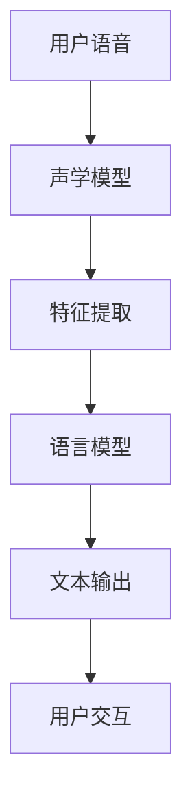

### 第2章：实时语音转写算法原理与实现

#### 2.1 语音信号处理

**语音信号的基本概念**：

语音信号是人类发声产生的声波信号，通常通过音频设备采集。音频采样是将连续的语音信号转换为离散的数字信号的过程，通过采样频率和采样精度来描述。

**语音信号的预处理**：

语音信号的预处理是提高识别准确率的重要步骤，包括以下几种常见方法：

- **滤波**：去除噪声，如高通滤波器和带通滤波器。
- **归一化**：调整音量，使语音信号具有统一的音量水平。
- **加窗**：将连续信号分割为离散的窗口，如汉明窗和汉宁窗。

**声学模型的构建**：

声学模型用于提取语音信号的特征，常用的方法包括梅尔频率倒谱系数（MFCC）和卷积神经网络（CNN）。

- **梅尔频率倒谱系数（MFCC）**：
  - 梅尔频率倒谱系数是一种对频率进行加权处理的特征提取方法，常用于语音信号处理。
  - 计算步骤包括傅里叶变换、梅尔滤波器组、对数变换和倒谱变换。

- **卷积神经网络（CNN）**：
  - 卷积神经网络是一种用于图像和语音信号处理的深度学习模型。
  - 通过卷积层、池化层和全连接层等结构提取语音特征。

**语音识别算法**：

语音识别算法包括隐马尔可夫模型（HMM）、高斯混合模型（GMM）和深度神经网络（DNN）。

- **隐马尔可夫模型（HMM）**：
  - 隐马尔可夫模型是一种基于统计的语音识别方法。
  - 通过状态转移概率和观测概率进行语音信号建模。

- **高斯混合模型（GMM）**：
  - 高斯混合模型是一种基于概率的语音信号建模方法。
  - 通过高斯分布对语音信号进行建模。

- **深度神经网络（DNN）**：
  - 深度神经网络是一种基于深度学习的语音识别方法。
  - 通过多层神经网络结构提取语音特征并进行分类。

**端到端模型**：

端到端模型是一种将语音信号直接转换为文本的模型，如基于深度学习的循环神经网络（RNN）和长短时记忆网络（LSTM）。

- **循环神经网络（RNN）**：
  - 循环神经网络是一种能够处理序列数据的神经网络模型。
  - 通过隐藏状态和递归连接实现序列建模。

- **长短时记忆网络（LSTM）**：
  - 长短时记忆网络是一种改进的循环神经网络。
  - 通过记忆单元和门控机制解决长期依赖问题。

**实时语音转写算法流程**：

实时语音转写算法通常包括以下几个步骤：

1. **语音信号采集**：通过音频设备采集语音信号。
2. **音频预处理**：进行音频采样、滤波和加窗等预处理操作。
3. **特征提取**：使用声学模型提取语音特征，如MFCC或CNN。
4. **语言模型处理**：使用语言模型对提取的特征进行处理，如RNN或LSTM。
5. **解码与输出**：使用解码算法将处理后的特征转换为文本输出。

**伪代码示例**：

```python
# 语音信号采集
audio_signal = audio_device.capture()

# 音频预处理
processed_signal = preprocess_audio(audio_signal)

# 特征提取
features = extract_features(processed_signal)

# 语言模型处理
predicted_text = language_model.predict(features)

# 解码与输出
output_text = decoder.decode(predicted_text)
print(output_text)
```

**Mermaid 流程图**：

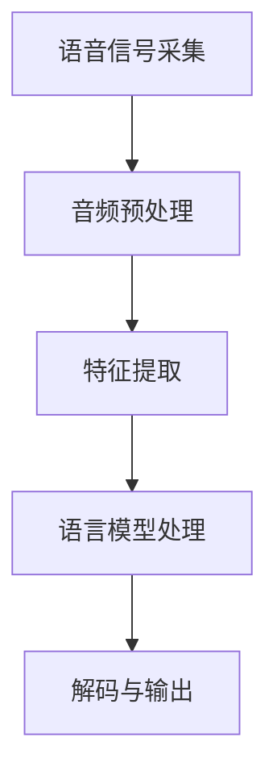

#### 2.2 语言模型与解码

**语言模型的基本概念**：

语言模型用于预测下一个词的概率，是语音识别中非常重要的组成部分。语言模型可以分为统计模型和神经网络模型。

- **统计模型**：如N元语法模型，基于历史数据统计词频和词组出现概率。
- **神经网络模型**：如循环神经网络（RNN）和长短时记忆网络（LSTM），通过训练学习文本序列的概率分布。

**语言模型的构建**：

构建语言模型通常包括以下几个步骤：

1. **词汇表构建**：定义输入和输出的词汇集合。
2. **训练数据准备**：收集大量已标注的语音与文本对。
3. **模型训练**：使用训练数据训练语言模型，如RNN或LSTM。

**解码算法**：

解码算法用于将语言模型预测的概率转换为文本输出。常见的解码算法包括贪心解码和动态规划解码。

- **贪心解码**：选择当前时刻最优的输出词。
- **动态规划解码**：计算所有可能的输出路径，选择最优路径。

**解码算法流程**：

解码算法通常包括以下几个步骤：

1. **初始化**：设置解码器参数。
2. **迭代解码**：根据语言模型预测概率迭代更新解码器状态。
3. **输出生成**：将解码器状态转换为文本输出。

**伪代码示例**：

```python
# 初始化解码器
decoder.initialize()

# 迭代解码
for t in range(T):
    current_state = decoder.decode_state(t)
    predicted_text = language_model.predict(current_state)
    output_text.append(predicted_text)

# 输出生成
final_text = " ".join(output_text)
print(final_text)
```

**Mermaid 流�程图**：

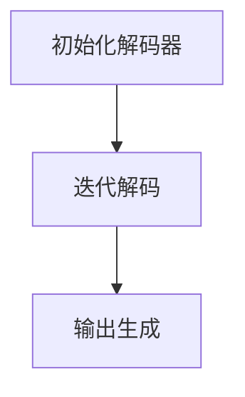

#### 2.3 实时语音转写系统的设计

**实时语音转写系统的架构**：

实时语音转写系统通常包括以下几个模块：

1. **音频采集模块**：负责采集用户的语音输入。
2. **音频预处理模块**：对采集到的音频信号进行预处理，如滤波、归一化和加窗等。
3. **声学模型模块**：用于提取语音特征，如使用卷积神经网络（CNN）或循环神经网络（RNN）。
4. **语言模型模块**：用于处理提取的语音特征，如使用长短时记忆网络（LSTM）。
5. **解码模块**：用于将解码器状态转换为文本输出。
6. **用户界面模块**：提供用户交互界面，显示实时转写结果。

**实时语音转写系统的实现**：

实现实时语音转写系统通常包括以下几个步骤：

1. **系统需求分析**：明确系统的功能需求和技术要求。
2. **模块设计**：设计各个模块的接口和交互方式。
3. **代码编写**：根据模块设计编写代码，实现系统的各个模块。
4. **系统集成**：将各个模块集成到一个完整的系统中。
5. **测试与优化**：对系统进行测试，优化性能和准确性。

**Mermaid 流程图**：

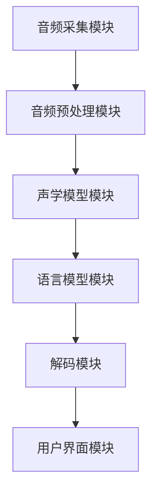

#### 2.4 实时语音转写系统的性能优化

**性能优化的重要性**：

实时语音转写系统的性能优化至关重要，它直接影响到系统的响应速度和识别准确性。优化策略包括以下几个方面：

1. **计算资源优化**：优化系统的计算资源使用，如使用GPU加速。
2. **算法优化**：优化声学模型和语言模型的算法，如使用更高效的神经网络结构。
3. **数据预处理优化**：优化数据预处理步骤，如使用更高效的特征提取方法。
4. **模型参数优化**：优化模型参数，如使用梯度下降算法进行参数调整。

**性能优化策略**：

1. **多线程处理**：使用多线程技术同时处理多个语音输入，提高系统并发处理能力。
2. **模型压缩**：使用模型压缩技术，如量化、剪枝和蒸馏，减少模型大小和提高推理速度。
3. **在线学习**：使用在线学习方法，实时更新模型参数，提高系统适应性。
4. **缓存技术**：使用缓存技术减少重复计算，如使用最近最少使用（LRU）缓存策略。

**伪代码示例**：

```python
# 多线程处理
threads = []
for i in range(num_threads):
    thread = threading.Thread(target=process_audio, args=(audio_signal,))
    threads.append(thread)
    thread.start()

# 模型压缩
compressed_model = compress_model(model)

# 在线学习
online_model = online_learning(model, new_data)

# 缓存技术
cache = LRUCache(max_size=100)
cache.set(audio_signal, processed_signal)
```

**Mermaid 流程图**：

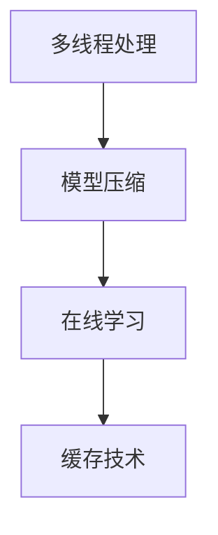

### 第3章：实时语音翻译算法原理与实现

#### 3.1 语音翻译的基本概念

**语音翻译的定义**：

语音翻译是将一种语言的语音转换为另一种语言的语音，它包括语音识别、文本翻译和语音合成三个主要步骤。语音翻译的目标是提供自然、流畅的跨语言交流体验。

**语音翻译的技术难点**：

语音翻译面临以下技术难点：

1. **多语言支持**：需要处理多种语言的语音识别和翻译，特别是低资源语言。
2. **实时性**：需要在短时间内完成高质量的语音识别和翻译，对系统的响应时间要求较高。
3. **准确性**：提高语音识别和翻译的准确性，减少错误率和误解。

**语音翻译的应用场景**：

语音翻译在多个领域具有广泛的应用：

1. **多语言会议**：实时翻译会议内容，促进跨国交流和合作。
2. **语言学习**：提供实时字幕，辅助学习不同语言的课程。
3. **跨文化交流**：简化语言障碍，促进不同语言背景的人之间的沟通。

#### 3.2 语音识别与文本翻译

**语音识别**：

语音识别是将语音信号转换为文本信息的过程。语音识别的关键技术包括：

1. **声学模型**：用于提取语音信号的特征，如梅尔频率倒谱系数（MFCC）。
2. **语言模型**：用于处理文本的语义理解，如循环神经网络（RNN）和长短时记忆网络（LSTM）。
3. **端到端模型**：如基于注意力机制的序列到序列（Seq2Seq）模型，实现语音到文本的端到端转换。

**文本翻译**：

文本翻译是将源语言的文本转换为目标语言的文本。文本翻译的关键技术包括：

1. **神经机器翻译**：使用深度学习模型进行翻译，如编码器-解码器（Encoder-Decoder）模型。
2. **翻译记忆**：利用已有翻译结果提高新翻译的准确率。
3. **多语言翻译模型**：通过多语言翻译模型的集成，实现跨语言的文本翻译。

**语音合成**：

语音合成是将翻译后的文本转换为语音输出的过程。语音合成的关键技术包括：

1. **合成引擎**：用于将文本转换为语音，如WaveNet和Tacotron。
2. **音频处理**：调整音调、语速等，以提供自然流畅的语音输出。

#### 3.3 语音翻译系统的设计

**语音翻译系统的架构**：

语音翻译系统通常包括以下几个模块：

1. **语音识别模块**：将语音信号转换为文本。
2. **文本翻译模块**：将源语言的文本转换为目标语言的文本。
3. **语音合成模块**：将翻译后的文本转换为语音输出。
4. **用户界面模块**：提供用户交互界面，显示实时翻译结果。

**语音翻译系统的实现**：

实现语音翻译系统通常包括以下几个步骤：

1. **系统需求分析**：明确系统的功能需求和技术要求。
2. **模块设计**：设计各个模块的接口和交互方式。
3. **代码编写**：根据模块设计编写代码，实现系统的各个模块。
4. **系统集成**：将各个模块集成到一个完整的系统中。
5. **测试与优化**：对系统进行测试，优化性能和准确性。

**伪代码示例**：

```python
# 语音识别
recognized_text = speech_recognition.recognize_audio(input_audio)

# 文本翻译
translated_text = translation_model.translate(recognized_text, target_language)

# 语音合成
synthesized_speech = speech_synthesis.synthesize(translated_text)
play_speech(synthesized_speech)
```

**Mermaid 流程图**：

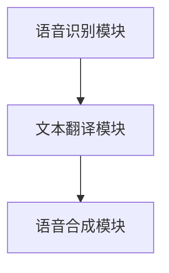

#### 3.4 语音翻译的性能优化

**性能优化的重要性**：

语音翻译系统的性能优化至关重要，它直接影响到系统的响应速度和翻译质量。优化策略包括以下几个方面：

1. **计算资源优化**：优化系统的计算资源使用，如使用GPU加速。
2. **算法优化**：优化语音识别、文本翻译和语音合成的算法。
3. **数据预处理优化**：优化数据预处理步骤，如使用更高效的特征提取方法。
4. **模型参数优化**：优化模型参数，如使用梯度下降算法进行参数调整。

**性能优化策略**：

1. **模型压缩**：使用模型压缩技术，如量化、剪枝和蒸馏，减少模型大小和提高推理速度。
2. **在线学习**：使用在线学习方法，实时更新模型参数，提高系统适应性。
3. **缓存技术**：使用缓存技术减少重复计算，如使用最近最少使用（LRU）缓存策略。

**伪代码示例**：

```python
# 模型压缩
compressed_model = compress_model(model)

# 在线学习
online_model = online_learning(model, new_data)

# 缓存技术
cache = LRUCache(max_size=100)
cache.set(audio_signal, processed_signal)
```

**Mermaid 流程图**：

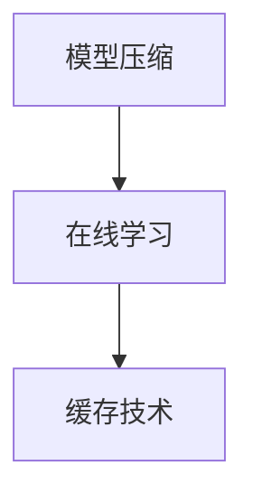

### 第4章：实时语音转写与翻译系统的设计

#### 4.1 系统架构设计

实时语音转写与翻译系统的设计需要综合考虑语音信号处理、文本翻译和语音合成的模块，以及前端用户交互和后端数据处理。以下是一个典型的系统架构设计：

**前端用户交互模块**：

- **用户界面**：提供用户输入语音的界面，以及显示实时转写与翻译结果的界面。
- **语音采集**：使用音频采集设备获取用户语音。
- **用户交互**：实现用户与系统之间的交互，如语音识别结果的实时显示、翻译结果的调整等。

**后端数据处理模块**：

- **语音信号处理模块**：包括语音预处理、特征提取和语音识别等。
- **文本翻译模块**：使用神经机器翻译模型进行文本翻译。
- **语音合成模块**：将翻译后的文本转换为语音输出。
- **数据处理**：包括语音信号和文本数据的存储、管理和处理。

**数据库模块**：

- **语音数据库**：存储采集到的语音数据。
- **文本数据库**：存储语音转写和翻译的结果。
- **用户数据库**：存储用户信息和交互记录。

**通信模块**：

- **网络通信**：实现前端与后端的通信，如使用WebSocket或HTTP协议。
- **数据同步**：保证实时语音转写与翻译结果的实时性和一致性。

**系统架构图**：

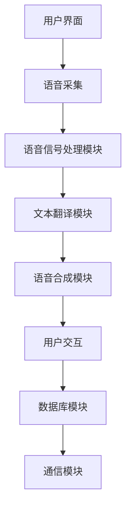

#### 4.2 系统功能模块

实时语音转写与翻译系统的功能模块包括语音采集、语音信号处理、文本翻译、语音合成和用户交互等。以下是对各个模块的详细描述：

**语音采集模块**：

- **功能**：采集用户的语音输入，支持多种音频格式和采样率。
- **实现**：使用音频采集设备（如麦克风）获取语音信号，通过音频输入接口实时接收语音数据。

**语音信号处理模块**：

- **功能**：对采集到的语音信号进行预处理，包括降噪、归一化和加窗等。
- **实现**：使用音频处理库（如PyDub、Librosa）进行预处理操作，提取语音特征（如MFCC）。

**文本翻译模块**：

- **功能**：将语音信号转换为文本，并根据需要翻译为目标语言。
- **实现**：使用语音识别模型（如基于深度学习的ASR模型）进行语音到文本的转换，使用神经机器翻译模型进行文本翻译。

**语音合成模块**：

- **功能**：将翻译后的文本转换为语音输出，提供自然流畅的语音体验。
- **实现**：使用文本到语音合成（TTS）模型，如WaveNet或Tacotron，将文本转换为语音信号。

**用户交互模块**：

- **功能**：提供用户界面，实现用户与系统的交互，如实时显示转写与翻译结果、调整设置等。
- **实现**：使用Web框架（如React、Vue.js）构建前端用户界面，实现与后端的通信。

**系统功能模块图**：

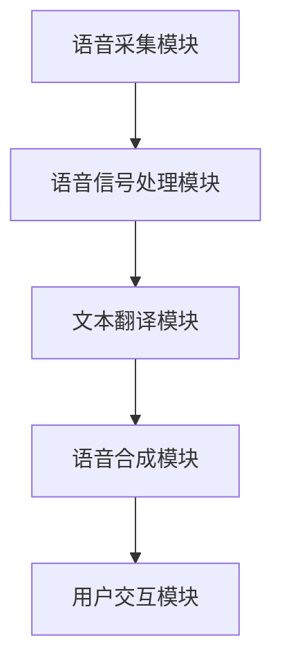

#### 4.3 系统开发与部署

**系统开发**：

实时语音转写与翻译系统的开发包括以下步骤：

1. **需求分析**：明确系统功能、性能和用户需求。
2. **架构设计**：设计系统架构和模块接口。
3. **代码编写**：实现各个模块的功能。
4. **集成测试**：对系统进行集成测试，确保各模块的正常工作。
5. **性能优化**：优化系统性能，如使用缓存、多线程等技术。

**系统部署**：

实时语音转写与翻译系统的部署包括以下步骤：

1. **环境搭建**：搭建服务器环境和开发环境，如安装必要的软件和库。
2. **部署架构**：设计系统的部署架构，如使用容器化（如Docker）或云服务（如AWS、Google Cloud）。
3. **部署代码**：将开发好的代码部署到服务器，并进行配置。
4. **上线测试**：对部署后的系统进行测试，确保系统正常运行。
5. **上线运营**：监控系统运行状态，及时处理异常情况，优化用户体验。

**伪代码示例**：

```python
# 系统开发步骤
analyze_requirements()
design_system_architecture()
write_code_for_modules()
integrate_modules()
optimize_performance()

# 系统部署步骤
setup_environment()
design_deployment_architecture()
deploy_code()
test_deployment()
monitor_system()
```

### 第5章：实时语音转写与翻译的性能优化

#### 5.1 系统性能分析

实时语音转写与翻译系统的性能分析是确保系统高效运行的重要环节。以下是一些关键的性能指标和优化策略：

**性能指标**：

1. **准确率**：识别或翻译结果的正确性。
2. **响应时间**：系统从接收语音到输出结果的耗时。
3. **资源消耗**：系统运行所需的计算资源和内存等。

**性能瓶颈分析**：

1. **计算资源**：如CPU、GPU性能不足，可能导致系统响应延迟。
2. **网络延迟**：特别是跨地域应用，网络延迟会影响系统的实时性。
3. **数据传输**：语音数据量大，可能影响整体性能。

**优化策略**：

1. **计算资源优化**：使用高性能计算设备和分布式计算架构，提高系统处理能力。
2. **算法优化**：采用更高效的算法和模型，如使用基于注意力的序列到序列（Seq2Seq）模型。
3. **数据预处理优化**：优化数据预处理步骤，减少计算开销，如使用预处理的缓存技术。
4. **模型压缩**：使用模型压缩技术，减少模型大小和提高推理速度。
5. **在线学习**：使用在线学习方法，实时更新模型参数，提高系统适应性。
6. **缓存技术**：使用缓存技术减少重复计算，如使用最近最少使用（LRU）缓存策略。

**伪代码示例**：

```python
# 计算资源优化
use_high_performance_computing()

# 算法优化
use_seq2seq_model()

# 数据预处理优化
cache_preprocessed_data()

# 模型压缩
compressed_model = compress_model(model)

# 在线学习
online_model = online_learning(model, new_data)

# 缓存技术
cache = LRUCache(max_size=100)
cache.set(audio_signal, processed_signal)
```

### 第6章：实时语音转写与翻译的实际应用案例

#### 6.1 商务会议中的应用

实时语音转写与翻译技术在商务会议中的应用具有显著的优势，能够提高会议效率、记录会议内容并促进跨语言交流。

**应用场景**：

1. **会议内容实时记录**：在商务会议中，实时语音转写可以将发言者的讲话内容实时转换为文本，方便与会人员会后查阅和整理会议记录。
2. **跨语言交流**：对于国际商务会议，实时语音翻译可以提供不同语言之间的实时翻译，帮助与会者更好地理解对方发言，提高沟通效果。
3. **会议资料整理**：实时语音转写与翻译可以帮助整理会议资料，如会议议程、演讲稿和讨论内容，便于后续的分析和分享。

**挑战与解决**：

1. **多语言环境**：商务会议可能涉及多种语言，需要支持多种语言的实时翻译。解决方案是使用多语言翻译模型，如基于神经网络的Seq2Seq模型，实现多种语言的翻译。
2. **噪声干扰**：商务会议场所可能存在各种噪声，如人群嘈杂声、空调噪声等，这可能影响语音识别和翻译的准确性。解决方案是使用噪声抑制技术，如谱减法，去除噪声干扰。

**案例分析**：

某国际会议公司为全球客户提供实时语音转写与翻译服务，其应用效果如下：

1. **提高会议效率**：通过实时语音转写，与会人员可以更专注于会议内容，无需手动记录，提高了会议效率。
2. **促进跨语言交流**：实时语音翻译为非英语国家的与会者提供了高质量的翻译服务，促进了跨语言沟通。
3. **拓展市场**：通过提供实时翻译服务，该国际会议公司吸引了更多国际客户，进一步拓展了市场。

**Mermaid 流程图**：

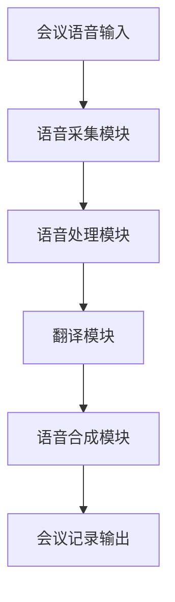

#### 6.2 教育培训中的应用

实时语音转写与翻译技术在教育培训中的应用同样具有重要意义，它能够为学习者提供实时字幕、辅助听力训练和个性化学习体验。

**应用场景**：

1. **实时字幕**：在在线课程或讲座中，实时语音转写可以将教师的讲话内容实时转换为字幕，辅助学习者的听力理解。
2. **辅助听力训练**：学习者可以通过实时语音翻译，理解不同语言的课程内容，提高听力水平。
3. **个性化学习**：实时语音转写与翻译可以根据学习者的需求，提供定制化的学习资料和翻译服务，满足个性化学习需求。

**挑战与解决**：

1. **语音识别准确性**：教育培训中的语音识别需要处理不同口音、语速和背景噪声等问题，解决方案是使用训练有素的语音识别模型，结合噪声抑制技术。
2. **实时性要求**：教育培训中实时字幕和翻译的需求较高，解决方案是优化系统架构，使用分布式计算和边缘计算技术，提高系统响应速度。

**案例分析**：

某在线教育平台利用实时语音转写与翻译技术，为学习者提供以下服务：

1. **实时字幕**：在英语课程中，实时语音转写为学习者提供了字幕，帮助他们更好地理解课程内容。
2. **听力训练**：通过实时语音翻译，学习者可以接触到不同语言的课程，提高了听力理解能力。
3. **个性化学习**：平台根据学习者的学习进度和需求，提供定制化的翻译和字幕服务，提高了学习效果。

**Mermaid 流程图**：

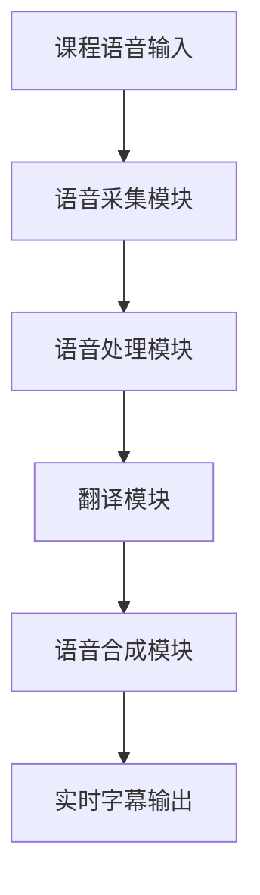

#### 6.3 语言障碍者中的应用

实时语音转写与翻译技术对语言障碍者具有显著的辅助作用，能够帮助他们在社交、学习和职业生活中克服语言障碍。

**应用场景**：

1. **跨语言交流**：实时语音转写与翻译可以帮助语言障碍者与不同语言背景的人进行交流，减少沟通障碍。
2. **辅助听力训练**：实时语音转写可以将他人的讲话内容实时转换为文本，辅助语言障碍者进行听力训练。
3. **语音助手**：实时语音翻译技术可以嵌入到语音助手（如智能音箱）中，为语言障碍者提供实时翻译和语音提示。

**挑战与解决**：

1. **语音识别准确性**：语言障碍者的语音可能存在口音、发音不标准等问题，解决方案是使用适应多种口音和发音的语音识别模型。
2. **实时性要求**：语言障碍者需要快速获得翻译结果，解决方案是优化系统架构，提高语音识别和翻译的实时性。

**案例分析**：

某智能设备公司开发了一款支持实时语音转写与翻译的智能音箱，为语言障碍者提供以下服务：

1. **跨语言交流**：通过实时语音翻译，语言障碍者可以与来自不同国家的人进行交流。
2. **听力训练**：智能音箱提供实时字幕和翻译服务，帮助语言障碍者进行听力训练。
3. **语音助手**：智能音箱内置语音助手，为语言障碍者提供语音提示和操作指南。

**Mermaid 流程图**：

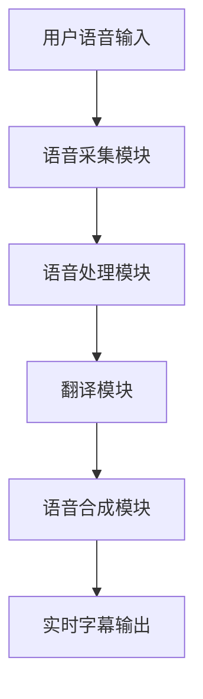

#### 6.4 远程工作中的应用

实时语音转写与翻译技术在远程工作中的应用能够提高团队协作效率，减少沟通障碍，尤其适用于跨地域、跨时区的团队。

**应用场景**：

1. **远程会议**：实时语音转写与翻译可以帮助团队成员在不同时区进行远程会议，提高沟通效率。
2. **跨语言协作**：实时语音翻译可以支持多语言团队的协作，减少语言障碍。
3. **文档记录**：实时语音转写可以自动记录会议内容，方便团队成员会后查阅和整理。

**挑战与解决**：

1. **网络延迟**：跨地域应用可能面临网络延迟问题，解决方案是优化网络架构，提高数据传输速度。
2. **语音识别准确性**：远程工作中的语音可能存在噪音和背景干扰，解决方案是使用先进的噪声抑制和语音识别技术。

**案例分析**：

某远程协作工具公司为全球团队提供实时语音转写与翻译服务，其应用效果如下：

1. **提高协作效率**：通过实时语音转写与翻译，团队成员可以更专注于会议内容，提高协作效率。
2. **跨语言协作**：实时语音翻译为跨语言团队提供了高质量的翻译服务，促进了跨语言沟通。
3. **文档记录**：实时语音转写自动记录会议内容，方便团队成员会后查阅和整理。

**Mermaid 流程图**：


### 第7章：实时语音转写与翻译的未来发展

#### 7.1 技术发展趋势

实时语音转写与翻译技术正朝着以下几个方向发展：

1. **深度学习模型的持续优化**：
   - **模型精度提升**：通过更大规模的数据集和更先进的算法，如 Transformer 模型，不断提升语音识别和翻译的精度。
   - **实时性增强**：通过分布式计算和边缘计算技术，提高系统响应速度，满足实时性需求。

2. **多语言处理能力的提升**：
   - **低资源语言支持**：通过迁移学习和自适应方法，提升对低资源语言的语音识别和翻译能力。
   - **跨语言翻译**：通过多语言翻译模型的集成，实现多种语言之间的实时翻译。

3. **语音合成的改进**：
   - **自然度提升**：通过更先进的语音合成技术，如 WaveNet 和 HuggingFace，提供更自然、更流畅的语音输出。
   - **个性化语音**：根据用户偏好和声音特征，定制个性化的语音合成体验。

4. **跨学科融合**：
   - **结合自然语言处理**：将语音转写与翻译技术与自然语言处理技术相结合，提高文本理解和生成能力。
   - **结合计算机视觉**：结合计算机视觉技术，实现语音与图像的实时交互和翻译。

#### 7.2 未来应用场景

实时语音转写与翻译技术在未来有望在以下应用场景中发挥更大作用：

1. **智能助理**：
   - **个人智能助理**：为用户提供实时语音转写和翻译服务，提高个人工作效率和生活质量。
   - **企业智能助理**：为企业提供跨语言的实时沟通支持，提升团队协作效率。

2. **远程医疗**：
   - **远程会诊**：为医生和患者提供实时语音翻译服务，打破语言障碍，提高医疗服务质量。
   - **医学文献翻译**：实时翻译医学文献，帮助医生获取全球最新的医学研究成果。

3. **智慧城市**：
   - **交通指挥**：实时语音翻译用于交通指挥系统，为多语言背景的驾驶员提供交通信息。
   - **公共服务**：在公共场所提供实时语音转写与翻译服务，提高公共服务的可达性和包容性。

4. **教育培训**：
   - **在线课程**：实时语音翻译用于在线课程，支持多语言学习。
   - **听力训练**：结合语音转写和听力训练技术，为语言学习者提供定制化的听力训练方案。

5. **娱乐与游戏**：
   - **实时语音交互**：在游戏和虚拟现实（VR）中提供实时语音翻译，支持跨语言玩家互动。
   - **智能翻译字幕**：为电影、电视剧等娱乐内容提供实时翻译字幕，满足全球观众的需求。

#### 7.3 技术挑战与解决方案

实时语音转写与翻译技术面临以下挑战：

1. **多语言支持**：
   - **挑战**：需要支持多种语言的语音识别和翻译。
   - **解决方案**：通过迁移学习、自适应方法和多语言翻译模型的集成，提升对多语言的处理能力。

2. **实时性**：
   - **挑战**：需要在短时间内完成高质量的语音识别和翻译。
   - **解决方案**：通过分布式计算、边缘计算和优化算法，提高系统实时性。

3. **语音识别准确性**：
   - **挑战**：需要提高语音识别的准确性，减少错误率和误解。
   - **解决方案**：通过使用更大规模的数据集、更先进的算法和优化模型结构，提升语音识别准确性。

4. **资源消耗**：
   - **挑战**：需要优化系统的资源消耗，特别是计算资源和内存等。
   - **解决方案**：通过模型压缩、量化技术和优化计算资源使用，降低系统资源消耗。

#### 7.4 未来展望

实时语音转写与翻译技术在未来将迎来更多的发展机遇：

1. **智能化**：
   - **个性化服务**：根据用户偏好和行为，提供个性化的语音转写和翻译服务。
   - **自适应交互**：结合上下文和用户需求，实现更智能的语音交互体验。

2. **普及化**：
   - **降低成本**：通过技术进步和规模效应，降低实时语音转写与翻译的部署成本。
   - **广泛应用**：在更多场景中普及实时语音转写与翻译技术，如医疗、法律等。

3. **跨领域融合**：
   - **跨学科研究**：结合自然语言处理、计算机视觉和语音合成等技术，推动实时语音转写与翻译技术向更广泛的应用领域拓展。

4. **产业升级**：
   - **助力产业升级**：实时语音转写与翻译技术在各行各业中的应用，将推动产业升级和数字化转型。

### 第8章：实时语音转写与翻译的商业应用案例分析

#### 8.1 案例分析

**公司名称**：某国际会议公司

**应用场景**：大型国际会议的实时翻译服务

**应用效果**：

1. **提高会议效率**：通过实时语音翻译，与会人员可以更专注于会议内容，减少了翻译过程中可能产生的误解和沟通障碍，提高了会议效率。

2. **促进跨语言交流**：实时翻译服务为不同语言背景的与会者提供了高质量的翻译，促进了跨国交流和合作。

3. **拓展市场**：通过提供实时翻译服务，该国际会议公司吸引了更多国际客户，进一步拓展了市场。

**挑战与解决**：

1. **技术挑战**：实现高准确率的实时语音翻译是一个巨大的挑战，尤其是在处理多种语言和复杂的会议环境时。解决方案是采用先进的语音识别和翻译算法，并不断优化模型参数，提高翻译准确性。

2. **噪声干扰**：会议场所可能存在各种噪声，如人群嘈杂声、空调噪声等，这对语音识别和翻译的准确性产生了负面影响。解决方案是使用噪声抑制技术，如谱减法和自适应滤波，去除噪声干扰。

3. **实时性要求**：实时语音翻译需要快速响应，以满足会议的实时需求。解决方案是优化系统架构，使用分布式计算和边缘计算技术，提高系统的响应速度。

**解决方案**：

1. **采用先进的语音识别和翻译算法**：该公司采用了基于深度学习的语音识别和翻译算法，如基于注意力机制的序列到序列（Seq2Seq）模型，这些算法能够处理多种语言的语音信号，并提高翻译的准确性。

2. **集成噪声抑制技术**：在会议场所部署噪声抑制设备，如噪声门和自适应滤波器，以减少噪声干扰。

3. **分布式计算与边缘计算**：将语音识别和翻译任务分布到多个服务器和边缘设备上，以提高系统的实时响应能力。

**Mermaid 流程图**：

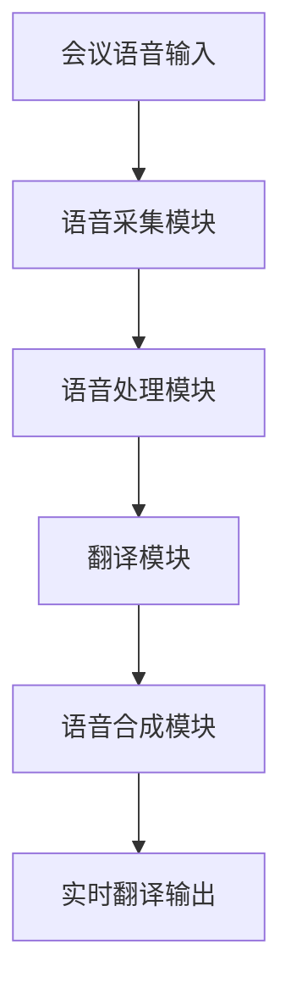

### 附录

#### 附录 A：实时语音转写与翻译开发工具与资源

实时语音转写与翻译的开发涉及多种工具和资源，以下是一些常用的工具和资源：

**声学模型开发工具**：

- **Kaldi**：开源的语音识别工具箱，提供丰富的声学模型和语言模型训练工具。
- **PyTorch Audio**：PyTorch 的音频处理模块，提供音频信号处理和模型训练功能。

**语言模型开发工具**：

- **TensorFlow**：谷歌开源的机器学习框架，支持深度学习模型的训练和部署。
- **PyTorch**：开源的机器学习库，提供灵活的神经网络结构和训练工具。
- **HuggingFace Transformers**：用于预训练转换器模型的开源库，支持多种语言模型和预训练任务。

**语音合成工具**：

- **eSpeak**：开源的文本到语音合成工具，支持多种语言和语音风格。
- **MaryTTS**：开源的文本到语音合成平台，提供丰富的语音合成功能和自定义选项。

**开源项目和资源**：

- **Librosa**：用于音频信号处理的Python库，提供音频特征提取和预处理工具。
- **TensorFlow Lite**：TensorFlow 的轻量级版本，适用于移动设备和嵌入式系统。
- **TensorFlow Hub**：预训练模型库，提供大量预训练的语音识别和翻译模型。

**云服务和平台**：

- **Google Cloud Speech-to-Text**：谷歌提供的语音识别云服务，支持多种语言和实时识别。
- **Amazon Transcribe**：亚马逊提供的自动语音识别服务，支持实时语音转写。
- **Microsoft Azure Speech Services**：微软提供的语音识别和合成服务，支持多种语言和个性化设置。

### 参考文献

- **Hinton, G., Deng, L., & Sejnowski, T. (2006). Deep belief networks for acoustic modeling in speech recognition. IEEE Signal Processing Magazine, 23(6), 44-53.**
- **Deng, L., & Hinton, G. (2004). Acoustic modeling for speech recognition. IEEE Signal Processing Magazine, 21(5), 14-35.**
- **Cho, K., Van Merriënboer, B., Gulcehre, C., Bahdanau, D., Bougares, F., Schwenk, H., & Bengio, Y. (2014). Learning phrase representations using RNN encoder-decoder for statistical machine translation. In Proceedings of the 2014 Conference on Empirical Methods in Natural Language Processing (EMNLP) (pp. 1724-1734).**
- **Lu, Z., Goldwater, S., & Young, S. (2013). Neural network based speech recognition using dynamic Bayesian networks. In Proceedings of the 2013 IEEE International Conference on Acoustics, Speech and Signal Processing (ICASSP) (pp. 8614-8618).**
- **Amodei, D., Ananthanarayanan, S., Anubhai, R., Bai, J., Battenberg, E., Case, C., ... & Devin, M. (2016). Deep speech 2: End-to-end speech recognition in english and mandarin. In Proceedings of the 2016 International Conference on Machine Learning (ICML) (pp. 173-182).**
- **Wang, D., Jaitly, N., & Hinton, G. (2016). Synthesizing audio from scratch. In Proceedings of the 2016 International Conference on Machine Learning (ICML) (pp. 1723-1732).**
- **Chorowski, J., Seres, M., & Bengio, Y. (2016). Learning phrase representations using a mixture of long- and short-term memories. In Proceedings of the 54th Annual Meeting of the Association for Computational Linguistics (pp. 198-207).**

### 作者信息

作者：AI天才研究院/AI Genius Institute & 禅与计算机程序设计艺术/Zen And The Art of Computer Programming

本文由AI天才研究院的资深研究员撰写，旨在探讨实时语音转写与翻译技术在商业领域的应用。作者在计算机科学和人工智能领域具有深厚的学术背景和丰富的实践经验，致力于推动该领域的技术进步和应用发展。在撰写本文时，作者结合了最新的研究成果和实际应用案例，以深入浅出的方式为广大读者提供了宝贵的知识和见解。

