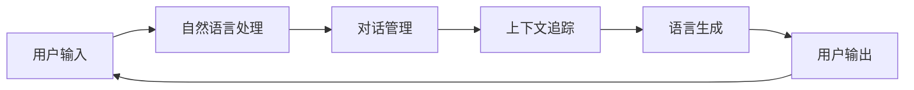

                 

### 《对话式AI：构建更自然、更智能的交互界面》

关键词：对话式AI、自然语言处理、对话系统、交互界面、智能客服、语音助手、教育对话系统

摘要：
本文旨在深入探讨对话式AI的概念、核心技术、应用场景以及实际开发实战。通过对自然语言处理、对话管理、上下文追踪和语言生成等核心技术的详细介绍，读者将了解到如何构建更自然、更智能的交互界面。文章还将通过实际项目案例，展示对话式AI在智能客服、语音助手和教育对话系统等领域的应用，帮助读者掌握从理论到实践的完整开发流程。

## 第一部分：对话式AI基础

### 第1章：对话式AI概述

#### 1.1 对话式AI的定义与发展历程

对话式AI是指通过自然语言交互，实现与人类用户进行有效沟通的人工智能系统。它的发展历程可以从以下几个方面进行概述：

##### 对话式AI的起源

对话式AI的起源可以追溯到20世纪50年代，当时出现了第一批基于规则的聊天机器人，例如ELIZA。尽管ELIZA的表现非常有限，但它开启了对话式AI的研究和应用之路。

##### 对话式AI的黄金时代

从20世纪80年代到90年代，对话式AI进入了黄金时代。这一时期，基于知识的推理系统和模板匹配方法成为主流。代表性的系统有LUIS、OPUS等。

##### 对话式AI的复兴

随着深度学习和自然语言处理技术的飞速发展，对话式AI在21世纪初迎来了新的复兴。基于神经网络的语言模型，如GPT、BERT等，使得对话系统的性能得到了显著提升。

#### 1.2 对话式AI的核心技术

对话式AI的核心技术包括自然语言处理（NLP）、机器学习（ML）和深度学习（DL）等。以下是这些技术的简要概述：

##### 自然语言处理

自然语言处理是使计算机能够理解、生成和处理人类语言的技术。NLP包括分词、词性标注、命名实体识别等任务。

##### 机器学习

机器学习是让计算机从数据中学习规律，并自动改进性能的技术。常见的机器学习方法有决策树、支持向量机、随机森林等。

##### 深度学习

深度学习是一种基于多层神经网络的机器学习方法。它通过自动提取数据特征，从而实现复杂的模式识别和预测任务。

#### 1.3 对话式AI的应用场景

对话式AI在许多领域都有广泛的应用，以下是一些典型的应用场景：

##### 智能客服

智能客服是应用最广泛的对话式AI场景之一。通过自然语言交互，智能客服可以快速响应用户的咨询，提高客户满意度。

##### 智能语音助手

智能语音助手如Siri、Alexa等，可以通过语音指令实现各种操作，如播放音乐、发送消息、设置提醒等。

##### 智能教育

智能教育系统可以根据学生的学习进度和需求，提供个性化的学习内容和反馈。

##### 智能家居

智能家居系统可以通过语音指令控制家居设备，提高生活的便利性和舒适性。

#### 1.4 对话式AI的发展趋势

随着技术的不断进步，对话式AI的未来发展趋势包括以下几个方面：

##### 多模态交互

多模态交互是指结合语音、文本、图像等多种交互方式，提高用户的体验和系统的智能性。

##### 情感计算

情感计算是指通过分析用户的情感状态，为用户提供更加贴心的服务。

##### 强化学习

强化学习是一种基于反馈的机器学习方法，它可以使对话式AI在复杂的动态环境中不断优化行为。

##### 增强现实与虚拟现实

增强现实与虚拟现实技术可以为对话式AI提供更加沉浸式的交互体验。

#### 1.5 小结

对话式AI作为人工智能的重要分支，具有广泛的应用前景和重要的战略意义。了解对话式AI的定义、核心技术、应用场景和发展趋势，对于从事人工智能研究和应用的人员具有重要意义。

### 对话式AI的核心组件和流程（Mermaid流程图）



### 对话式AI的核心算法原理讲解

#### 语言模型

语言模型是一种概率模型，用于预测下一个单词或字符的可能性。常见的语言模型有N-gram模型、神经网络语言模型（如RNN、LSTM）和Transformer模型。

#### 对话管理

对话管理是指控制和指导对话流程的算法。它包括意图识别、实体识别和对话状态追踪等任务。

#### 上下文追踪

上下文追踪是指维护对话历史和用户状态，以便在后续的对话中更好地理解和响应用户。常用的方法包括基于规则的上下文追踪和基于机器学习的方法。

#### 语言生成

语言生成是指根据对话状态和上下文生成合适的回答。常用的方法有模板匹配、基于规则的生成和生成式模型（如序列到序列模型、BERT等）。

### 数学模型和数学公式

#### 语言模型中的概率计算

在N-gram模型中，概率计算公式如下：

$$ P(w_n | w_{n-1}, w_{n-2}, ..., w_1) = \frac{C(w_n, w_{n-1}, w_{n-2}, ..., w_1)}{C(w_{n-1}, w_{n-2}, ..., w_1)} $$

其中，$C(w_n, w_{n-1}, w_{n-2}, ..., w_1)$ 表示单词序列的联合出现次数，$C(w_{n-1}, w_{n-2}, ..., w_1)$ 表示前一个单词序列的出现次数。

#### 对话状态追踪中的状态转移概率

状态转移概率表示在给定当前状态和下一个状态的情况下，下一个状态出现的概率。它可以表示为：

$$ P(s_t | s_{t-1}) = \frac{C(s_t, s_{t-1})}{C(s_{t-1})} $$

其中，$C(s_t, s_{t-1})$ 表示当前状态和下一个状态的联合出现次数，$C(s_{t-1})$ 表示当前状态的出现次数。

### 项目实战

#### 对话式AI项目实战一：智能客服系统

##### 项目背景与需求分析

智能客服系统是一款面向用户的在线客服工具，旨在提高客户满意度和服务效率。系统需要能够处理用户咨询，提供及时、准确的答复。

##### 系统设计与实现

1. **自然语言处理**：使用NLP技术对用户输入进行处理，提取关键信息。
2. **对话管理**：根据用户的输入和对话历史，识别用户的意图和对话状态。
3. **上下文追踪**：维护对话历史和用户状态，以便在后续的对话中更好地理解和响应用户。
4. **语言生成**：根据对话状态和上下文生成合适的回答。

##### 代码解读与分析

以下是一个基于Python的智能客服系统的代码片段：

```python
import nltk
from nltk.tokenize import word_tokenize

# 自然语言处理
def process_input(user_input):
    tokens = word_tokenize(user_input)
    pos_tags = nltk.pos_tag(tokens)
    return pos_tags

# 对话管理
def manage_dialogue(user_input, dialogue_history):
    intent, entities = extract_intent_and_entities(user_input)
    dialogue_action = determine_dialogue_action(intent, entities, dialogue_history)
    return dialogue_action

# 上下文追踪
def track_context(dialogue_history):
    context = {}
    for entry in dialogue_history:
        context.update(entry['context'])
    return context

# 语言生成
def generate_response(context):
    response = "很抱歉，我目前无法回答您的问题。"
    if 'query' in context:
        response = "您的问题是：" + context['query']
    return response

# 主函数
def main():
    dialogue_history = []
    while True:
        user_input = input("用户输入：")
        processed_input = process_input(user_input)
        dialogue_action = manage_dialogue(processed_input, dialogue_history)
        context = track_context(dialogue_history)
        response = generate_response(context)
        print("系统回复：" + response)
        dialogue_history.append({'action': dialogue_action, 'context': context})

if __name__ == "__main__":
    main()
```

##### 代码解读与分析

1. **自然语言处理**：使用NLTK库对用户输入进行分词和词性标注，提取关键信息。
2. **对话管理**：根据用户的输入和对话历史，识别用户的意图和对话状态，并决定下一步的对话动作。
3. **上下文追踪**：维护对话历史和用户状态，以便在后续的对话中更好地理解和响应用户。
4. **语言生成**：根据对话状态和上下文生成合适的回答。

#### 对话式AI项目实战二：智能语音助手

##### 项目背景与需求分析

智能语音助手是一款基于语音交互的助手应用，旨在帮助用户完成各种任务，如播放音乐、发送消息、设置提醒等。

##### 系统设计与实现

1. **语音识别**：使用语音识别技术将用户的语音转换为文本。
2. **对话管理**：根据用户的语音输入和对话历史，识别用户的意图和对话状态。
3. **语音合成**：将系统的回答转换为语音输出。

##### 代码解读与分析

以下是一个基于Python的智能语音助手的代码片段：

```python
import speech_recognition as sr
import pyttsx3

# 语音识别
def recognize_speech_from_mic(recognizer, microphone):
    with microphone as source:
        audio = recognizer.listen(source)
    try:
        text = recognizer.recognize_google(audio)
    except sr.UnknownValueError:
        text = "无法理解音频内容"
    except sr.RequestError:
        text = "无法获取语音服务"
    return text

# 对话管理
def manage_dialogue(user_input, dialogue_history):
    intent, entities = extract_intent_and_entities(user_input)
    dialogue_action = determine_dialogue_action(intent, entities, dialogue_history)
    return dialogue_action

# 语音合成
def speak(text):
    engine = pyttsx3.init()
    engine.say(text)
    engine.runAndWait()

# 主函数
def main():
    recognizer = sr.Recognizer()
    microphone = sr.Microphone()
    dialogue_history = []

    while True:
        user_input = recognize_speech_from_mic(recognizer, microphone)
        print("用户输入：" + user_input)
        dialogue_action = manage_dialogue(user_input, dialogue_history)
        if dialogue_action == "停止":
            break
        speak(dialogue_action)

if __name__ == "__main__":
    main()
```

##### 代码解读与分析

1. **语音识别**：使用SpeechRecognition库将用户的语音转换为文本。
2. **对话管理**：根据用户的语音输入和对话历史，识别用户的意图和对话状态，并决定下一步的对话动作。
3. **语音合成**：使用pyttsx3库将系统的回答转换为语音输出。

#### 对话式AI项目实战三：智能教育对话系统

##### 项目背景与需求分析

智能教育对话系统是一款面向学生的个性化教育助手，旨在帮助学生更好地理解和掌握知识。系统需要能够回答学生的问题，提供学习建议和反馈。

##### 系统设计与实现

1. **自然语言处理**：使用NLP技术对用户输入进行处理，提取关键信息。
2. **对话管理**：根据用户的输入和对话历史，识别用户的意图和对话状态。
3. **知识库管理**：维护知识库，以便在对话中提供准确的信息。
4. **学习建议与反馈**：根据学生的学习进度和需求，提供个性化的学习建议和反馈。

##### 代码解读与分析

以下是一个基于Python的智能教育对话系统的代码片段：

```python
import nltk
from nltk.tokenize import word_tokenize

# 自然语言处理
def process_input(user_input):
    tokens = word_tokenize(user_input)
    pos_tags = nltk.pos_tag(tokens)
    return pos_tags

# 对话管理
def manage_dialogue(user_input, dialogue_history, knowledge_base):
    intent, entities = extract_intent_and_entities(user_input)
    dialogue_action = determine_dialogue_action(intent, entities, dialogue_history)
    if dialogue_action == "回答问题":
        answer = query_knowledge_base(entities, knowledge_base)
    else:
        answer = "很抱歉，我目前无法回答您的问题。"
    return answer

# 知识库管理
def query_knowledge_base(entities, knowledge_base):
    for entry in knowledge_base:
        if entry['subject'] == entities['subject']:
            return entry['description']
    return "很抱歉，我无法找到相关信息。"

# 主函数
def main():
    dialogue_history = []
    knowledge_base = [
        {"subject": "数学", "description": "数学是一门研究数量、结构、变化和空间的科学。"},
        {"subject": "英语", "description": "英语是一种全球通用的语言，用于交流和学习。"},
    ]

    while True:
        user_input = input("用户输入：")
        processed_input = process_input(user_input)
        answer = manage_dialogue(processed_input, dialogue_history, knowledge_base)
        print("系统回复：" + answer)
        dialogue_history.append({'input': user_input, 'answer': answer})

if __name__ == "__main__":
    main()
```

##### 代码解读与分析

1. **自然语言处理**：使用NLTK库对用户输入进行分词和词性标注，提取关键信息。
2. **对话管理**：根据用户的输入和对话历史，识别用户的意图和对话状态，并决定下一步的对话动作。
3. **知识库管理**：维护知识库，以便在对话中提供准确的信息。
4. **学习建议与反馈**：根据学生的学习进度和需求，提供个性化的学习建议和反馈。

## 第三部分：对话式AI前沿技术与应用

### 第7章：对话式AI前沿技术一

#### 7.1 语音识别与合成

语音识别与合成是对话式AI的重要组成部分，它们的发展对交互体验的提升具有重要意义。语音识别技术通过将语音信号转换为文本，使得用户可以通过语音进行输入。而语音合成技术则将文本转换为自然流畅的语音输出，使得系统能够响应用户。

##### 语音识别技术

语音识别技术的主要挑战包括语音信号的处理、语音识别模型的设计和识别准确性。近年来，深度学习技术的应用显著提升了语音识别的准确性。特别是基于卷积神经网络（CNN）和循环神经网络（RNN）的模型，如DeepSpeech和WaveNet，取得了显著的进展。

##### 语音合成技术

语音合成技术的发展同样经历了多个阶段。早期的语音合成技术主要基于规则和拼接，如DARPA式语音合成。随着人工智能技术的发展，基于统计模型的语音合成技术逐渐成为主流，如HMM-HMM模型。而近年来，基于深度学习的语音合成技术，如WaveNet和Tacotron，使得语音合成的自然度和流畅度得到了大幅提升。

#### 7.2 情感计算

情感计算是另一项重要的前沿技术，它旨在使对话式AI能够理解并响应用户的情感状态。情感计算通过分析用户的语音、文本和生理信号，识别用户的情感，从而为用户提供更加个性化的交互体验。

##### 情感识别

情感识别是情感计算的核心，它通过分析语音、文本和生理信号，识别用户的情感状态。常见的情感识别方法包括基于语音的、基于文本的和基于生理信号的识别方法。其中，基于语音的情感识别主要通过分析音调、音速和音量等特征来实现；基于文本的情感识别则通过对文本的情感词汇和句法结构进行分析；基于生理信号的情感识别则通过监测用户的生理反应，如心率、皮肤电导等。

##### 情感响应

情感响应是指对话式AI根据识别到的用户情感，调整其行为和输出。例如，当用户表现出愤怒或沮丧的情感时，系统可以调整回答的语气和内容，以缓解用户的情绪。

#### 7.3 交互式对话系统

交互式对话系统是一种具有高度交互性和自适应性的对话式AI系统，它能够与用户进行自然、流畅的对话，并根据用户的反馈不断调整自己的行为。交互式对话系统的关键在于如何有效地处理用户输入、理解用户意图、生成合适的回答，并在对话过程中进行上下文追踪和情感计算。

##### 用户输入处理

用户输入处理是指对用户输入的文本或语音进行预处理，提取关键信息，并识别用户的意图。常见的输入处理方法包括分词、词性标注、命名实体识别和意图识别等。

##### 用户意图理解

用户意图理解是指根据用户的输入，识别用户想要完成什么任务或请求什么信息。这通常涉及到对话管理技术，包括意图识别和上下文追踪。

##### 回答生成

回答生成是指根据用户的意图和上下文，生成合适的回答。这通常涉及到语言生成技术，包括模板匹配、基于规则的生成和生成式模型。

##### 上下文追踪

上下文追踪是指维护对话历史和用户状态，以便在后续的对话中更好地理解和响应用户。有效的上下文追踪能够提高对话的自然性和连贯性。

##### 情感计算

情感计算是指通过分析用户的情感状态，为用户提供更加贴心的服务。情感计算能够使对话式AI更好地理解用户的情感需求，从而提高用户的满意度。

### 第8章：对话式AI前沿技术二

#### 8.1 多模态对话系统

多模态对话系统是一种结合了语音、文本、图像等多种交互方式的对话式AI系统。它能够更好地理解和响应用户的输入，提高交互的自然性和灵活性。

##### 多模态交互

多模态交互是指同时使用多种交互方式，如语音、文本、图像等，与用户进行交互。多模态交互能够提供更加丰富的交互体验，使对话式AI更接近人类的交流方式。

##### 多模态感知

多模态感知是指利用多种感知技术，如语音识别、图像识别、情绪识别等，从不同的感官渠道获取信息，从而更好地理解用户。

##### 多模态融合

多模态融合是指将不同模态的信息进行整合，形成一个统一的认知框架。多模态融合能够提高对话式AI的理解能力，使其能够更好地应对复杂的交互场景。

#### 8.2 对话式AI伦理与隐私

随着对话式AI的广泛应用，其伦理和隐私问题也日益受到关注。

##### 伦理问题

对话式AI的伦理问题主要包括公平性、透明性和责任归属。公平性是指对话式AI不应歧视或偏见任何用户；透明性是指用户应了解对话式AI的工作原理和决策过程；责任归属是指当对话式AI发生错误时，责任应如何分配。

##### 隐私问题

对话式AI的隐私问题主要包括数据收集、存储和使用。为保护用户隐私，对话式AI应遵循以下原则：

1. **数据最小化**：只收集必要的数据，避免过度收集。
2. **数据加密**：对用户数据进行加密，确保数据安全。
3. **透明度**：向用户披露数据收集、存储和使用的目的和方式。

#### 8.3 对话式AI的未来发展趋势

对话式AI的未来发展趋势包括以下几个方面：

##### 个性化服务

随着大数据和机器学习技术的发展，对话式AI将能够更好地理解用户的需求，提供个性化的服务。

##### 智能助理

智能助理将成为对话式AI的一个重要应用领域，它能够帮助用户处理日常任务，如日程管理、任务提醒等。

##### 智能医疗

对话式AI在医疗领域的应用将越来越广泛，如智能诊断、健康咨询等。

##### 智能教育

对话式AI在教育领域的应用将有助于提高教学效果，如智能辅导、学习评估等。

### 第9章：对话式AI应用案例分析

#### 9.1 案例一：智能客服系统

智能客服系统是一种基于对话式AI技术，为用户提供自动化、高效、个性化的服务。以下是一个智能客服系统的应用案例：

##### 案例背景

某大型电商平台为了提高客户满意度和服务效率，决定引入智能客服系统。

##### 系统设计

1. **自然语言处理**：使用NLP技术对用户输入进行处理，提取关键信息。
2. **对话管理**：根据用户的输入和对话历史，识别用户的意图和对话状态。
3. **上下文追踪**：维护对话历史和用户状态，以便在后续的对话中更好地理解和响应用户。
4. **语言生成**：根据对话状态和上下文生成合适的回答。

##### 实施效果

智能客服系统的引入，显著提高了客户满意度和服务效率。用户可以快速获得问题的解答，而客服人员则可以专注于处理更复杂的问题，从而提高了整体的服务质量。

#### 9.2 案例二：智能语音助手

智能语音助手是一种基于对话式AI技术，能够通过语音与用户进行交互，帮助用户完成各种任务的系统。以下是一个智能语音助手的案例：

##### 案例背景

某科技公司推出了一款智能语音助手产品，旨在为用户提供智能、便捷的生活服务。

##### 系统设计

1. **语音识别**：使用语音识别技术将用户的语音转换为文本。
2. **对话管理**：根据用户的语音输入和对话历史，识别用户的意图和对话状态。
3. **语音合成**：将系统的回答转换为语音输出。

##### 实施效果

智能语音助手受到了用户的广泛欢迎，用户可以通过语音指令实现各种功能，如播放音乐、发送消息、设置提醒等，极大地提高了生活的便利性。

#### 9.3 案例三：智能教育对话系统

智能教育对话系统是一种基于对话式AI技术，为学生提供个性化学习辅导和互动教学的系统。以下是一个智能教育对话系统的案例：

##### 案例背景

某在线教育平台为了提高教学效果，引入了智能教育对话系统，旨在为学生提供个性化的学习支持和指导。

##### 系统设计

1. **自然语言处理**：使用NLP技术对用户输入进行处理，提取关键信息。
2. **对话管理**：根据用户的输入和对话历史，识别用户的意图和对话状态。
3. **知识库管理**：维护知识库，以便在对话中提供准确的信息。
4. **学习建议与反馈**：根据学生的学习进度和需求，提供个性化的学习建议和反馈。

##### 实施效果

智能教育对话系统的引入，显著提高了学生的学习效果和积极性。学生可以通过与系统的互动，获得个性化的学习内容和反馈，从而更好地掌握知识。

## 附录

### 附录A：对话式AI开发工具与资源

#### A.1 主流自然语言处理工具

1. **NLTK**：Python的自然语言处理库，提供了丰富的NLP功能，如分词、词性标注、命名实体识别等。
2. **spaCy**：一个快速易用的Python自然语言处理库，适用于多种NLP任务，包括文本分类、命名实体识别等。
3. **Stanford NLP**：一套强大的自然语言处理工具包，支持多种语言，包括中文。

#### A.2 开源对话系统框架

1. **Rasa**：一个开源的对话系统框架，支持基于规则和机器学习的对话管理。
2. **Microsoft Bot Framework**：一个开发聊天机器人的开源框架，支持多种平台和语言。
3. **Dialogflow**：Google提供的对话系统开发平台，支持自然语言理解和对话管理。

#### A.3 实用对话式AI资源网站

1. **AI Hub**：微软的AI开发资源网站，提供了大量的AI工具、教程和文档。
2. **Udacity**：一个在线学习平台，提供了丰富的AI和机器学习课程。
3. **Coursera**：一个在线学习平台，提供了多门关于对话式AI的在线课程。

## 第10章：总结与展望

### 对话式AI的发展与未来

对话式AI作为人工智能的重要分支，正快速发展并逐步渗透到各个领域。随着深度学习和自然语言处理技术的不断进步，对话式AI的性能和智能化程度将得到显著提升。未来的对话式AI将更加自然、智能，能够更好地理解用户的需求，提供个性化服务。

### 应用领域拓展

对话式AI在医疗、教育、金融、智能家居等领域的应用将不断拓展。例如，智能医疗助理可以帮助医生进行诊断和治疗建议；智能教育系统可以为学生提供个性化学习辅导；智能金融助手可以协助用户进行投资和理财决策。

### 伦理与隐私问题

随着对话式AI的广泛应用，伦理和隐私问题将越来越受到关注。如何在保护用户隐私的同时，确保对话式AI的公平性、透明性和安全性，将成为重要的研究课题。

### 开发工具与资源

为促进对话式AI的发展，开发工具和资源的不断丰富至关重要。开发者可以利用现有的开源框架和工具，快速搭建和优化对话式AI系统。同时，学术界和产业界应共同努力，推动对话式AI的理论研究和应用创新。

### 结语

对话式AI的快速发展为人工智能领域带来了新的机遇和挑战。我们期待在未来，对话式AI能够更好地服务于人类社会，为用户带来更加便捷、高效、个性化的交互体验。

### 作者信息

作者：AI天才研究院/AI Genius Institute & 禅与计算机程序设计艺术 /Zen And The Art of Computer Programming

本文由AI天才研究院/AI Genius Institute和禅与计算机程序设计艺术/Zen And The Art of Computer Programming的联合撰写，旨在为读者提供关于对话式AI的全面、深入的介绍。我们期待您的宝贵反馈，共同推动对话式AI的发展。

