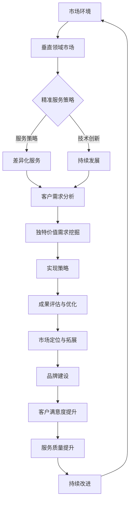

                 

### 《小公司的生存之道：精准服务垂直领域，满足独特价值需求》

#### 关键词：
- 小公司生存
- 精准服务
- 垂直领域市场
- 独特价值需求
- 服务策略
- 技术创新
- 持续发展

#### 摘要：
本文深入探讨了小公司如何在激烈的市场竞争中生存并发展的策略。通过精准服务垂直领域、满足独特价值需求，小公司可以提供专业化服务，提高客户满意度，建立品牌声誉。文章分为四个部分：企业生存环境分析、精准服务策略与实践、独特价值需求挖掘与实现、小公司生存之道案例研究。通过理论讲解、数学模型、实战案例，本文旨在为小公司提供切实可行的生存与发展之道。

### 第一部分：企业生存环境分析

#### 第1章：小公司面临的挑战

在当今快速变化的市场环境中，小公司面临着诸多挑战。首先，市场竞争压力巨大。大公司凭借其雄厚的资金、强大的技术实力和广泛的品牌影响力，对小公司构成了严峻的竞争威胁。其次，资源有限是小公司的另一大挑战。无论是资金、人力资源还是技术资源，小公司通常都远不及大公司。这意味着小公司需要在有限的资源下做出最优化的决策。此外，技术创新压力也是小公司面临的重要挑战。技术更新迭代速度加快，小公司需要不断投入资金和人力进行技术研发，否则将面临被淘汰的风险。

#### 第2章：垂直领域市场的特点

垂直领域市场是指针对特定行业或细分市场的市场。与广泛的市场相比，垂直领域市场具有以下特点：

1. **市场规模**：垂直领域市场通常规模较小，但专业化程度高，客户需求明确。
2. **客户需求**：垂直领域市场的客户需求具有独特性，他们需要针对特定行业的服务和解决方案。
3. **增长潜力**：随着行业的发展和技术的进步，垂直领域市场具有较大的增长潜力。

#### 第3章：精准服务的优势

精准服务是一种以客户需求为导向的服务方式，具有以下优势：

1. **专业化服务**：通过深入了解客户需求，提供定制化的解决方案，提高服务专业化程度。
2. **提高客户满意度**：精准服务能够更好地满足客户的特定需求，从而提高客户满意度。
3. **建立品牌声誉**：通过提供高质量的服务，小公司可以建立品牌声誉，提高市场竞争力。

### 第二部分：精准服务策略与实践

#### 第4章：精准服务策略制定

精准服务策略的制定是成功实施精准服务的关键。制定精准服务策略需要考虑以下方面：

1. **确定服务目标**：明确服务定位，确定目标市场和服务范围。
2. **制定服务计划**：规划服务内容、流程和效果评估方法。
3. **建立服务团队**：组织结构合理，明确团队成员职责，确保团队协作与沟通。

#### 第5章：垂直领域市场开拓

垂直领域市场的开拓是小公司实现发展的关键步骤。以下是一些有效的市场开拓策略：

1. **市场定位**：根据自身优势和客户需求，确定目标市场和定位。
2. **市场营销**：采用有效的市场营销策略，提高品牌知名度和市场渗透率。
3. **客户关系管理**：通过建立良好的客户关系，提高客户忠诚度和满意度。

#### 第6章：服务品质提升

提升服务品质是小公司保持竞争力的关键。以下是一些提升服务品质的方法：

1. **服务质量标准制定**：建立科学的服务质量标准，确保服务的一致性和稳定性。
2. **服务过程监控**：对服务过程进行监控，及时发现和解决问题。
3. **客户体验优化**：优化客户体验，提高客户满意度和忠诚度。

### 第三部分：独特价值需求的满足与实现

#### 第7章：独特价值需求挖掘

独特价值需求是指客户在特定环境下对服务的特殊需求。挖掘独特价值需求需要：

1. **需求收集**：通过各种渠道收集客户需求，包括问卷调查、客户访谈、市场调研等。
2. **需求分析**：对收集到的需求进行分析，确定需求的独特性、重要性和紧迫性。
3. **需求优先级排序**：根据需求的重要性和紧迫性，对需求进行优先级排序。

#### 第8章：独特价值需求实现策略

实现独特价值需求需要制定具体的策略。以下是一些实现策略：

1. **技术方案选择**：根据需求的特点，选择合适的技术方案。
2. **实施计划制定**：制定详细的实施计划，包括项目规划、资源配置和风险管理。
3. **成果评估与优化**：对实现效果进行评估，持续优化和改进。

### 第四部分：小公司生存之道案例研究

#### 第9章：小公司生存之道案例研究

本章节通过一个实际案例，详细分析了小公司如何通过精准服务策略、垂直领域市场开拓和满足独特价值需求，实现持续发展的过程。案例内容包括：

1. **案例背景与挑战**：介绍案例企业的基本情况，以及面临的主要挑战。
2. **案例实施过程**：详细描述案例企业的实施过程，包括精准服务策略、市场开拓和需求满足的具体措施。
3. **案例成果与经验总结**：分析案例企业的成果，总结经验教训，为其他小公司提供借鉴。

### 第五部分：持续发展与未来展望

#### 第10章：小公司持续发展的策略

小公司要实现可持续发展，需要采取以下策略：

1. **适应性战略**：根据市场和技术环境的变化，调整业务策略和组织结构。
2. **创新驱动战略**：通过技术创新、产品创新和服务创新，保持竞争优势。
3. **合作共赢战略**：与其他企业建立合作关系，实现资源互补和市场拓展。

#### 第11章：小公司未来的发展展望

小公司未来的发展需要紧跟行业趋势，制定明确的发展目标和策略。以下是对小公司未来发展的展望：

1. **行业发展趋势分析**：分析行业的发展趋势，包括市场规模、技术进步和政策环境。
2. **小公司的发展方向**：确定小公司的发展方向，包括市场定位、业务拓展和创新领域。
3. **策略选择**：根据发展目标和方向，选择合适的策略，确保小公司实现可持续发展。

### 附录

#### 附录 A：垂直领域市场研究报告

- **市场规模与发展趋势**：分析垂直领域市场的规模、增长速度和未来趋势。
- **竞争态势分析**：评估垂直领域市场的竞争格局，包括主要竞争者和市场份额。
- **市场机会与挑战**：探讨垂直领域市场中的机会和挑战，以及应对策略。

#### 附录 B：精准服务工具与资源推荐

- **服务流程管理工具**：推荐用于服务流程管理的工具，如ServiceNow、Zendesk等。
- **客户关系管理工具**：推荐用于客户关系管理的工具，如Salesforce、Microsoft Dynamics 365等。
- **市场营销工具**：推荐用于市场营销的工具，如HubSpot、Google Analytics等。

通过本文的详细分析和案例研究，旨在为小公司提供一条切实可行的生存与发展之路。希望本文能对各位小公司管理者有所启发，助力他们在激烈的市场竞争中脱颖而出。

### 核心概念与联系

在探讨小公司的生存之道时，有几个核心概念需要明确，并理解它们之间的联系。这些概念包括垂直领域市场、精准服务、独特价值需求、服务策略、技术创新和持续发展。

#### 垂直领域市场

垂直领域市场是指针对特定行业或细分市场的市场。与广泛的市场相比，垂直领域市场具有专业化程度高、客户需求明确等特点。例如，专注于为金融科技行业提供IT解决方案的公司，就是一个典型的垂直领域市场的例子。在这个市场中，企业需要深入了解客户的具体需求，提供高度定制化的服务。

#### 精准服务

精准服务是一种以客户需求为导向的服务方式，强调通过深入了解客户需求，提供专业化、定制化的服务。精准服务的优势在于能够更好地满足客户的特定需求，提高客户满意度和忠诚度。例如，一家专注于为医疗行业提供IT服务的小公司，可能会为医院提供定制化的电子病历系统，以满足其独特的需求。

#### 独特价值需求

独特价值需求是指客户在特定环境下对服务的特殊需求。这些需求通常是独特的、重要的和紧迫的。例如，一家制造企业可能需要一种特定的质量控制工具，以满足其生产线的特定需求。满足这些独特价值需求，可以帮助企业提升竞争力，建立市场地位。

#### 服务策略

服务策略是企业为实现服务目标而制定的行动计划。精准服务策略是服务策略的一种，它强调通过深入了解客户需求，提供定制化的服务。制定有效服务策略的关键在于确定服务目标市场、差异化策略、服务内容规划和服务流程优化。

#### 技术创新

技术创新是企业在市场中保持竞争力的关键因素。通过不断创新，企业可以开发出更加先进、高效的产品和服务。例如，一家专注于为金融行业提供数据分析服务的小公司，可能会采用最新的机器学习和大数据分析技术，为客户提供更准确、更快速的分析结果。

#### 持续发展

持续发展是企业长期发展的关键。它不仅包括短期内的盈利能力，还包括企业的长期战略规划、技术创新、人才管理和品牌建设。小公司要实现持续发展，需要不断调整和优化服务策略，以满足市场的变化和客户的需求。

#### 核心概念与联系

以上核心概念之间存在着密切的联系。垂直领域市场和精准服务是服务策略的基础，通过深入了解客户需求，提供专业化、定制化的服务，满足独特价值需求。技术创新是保持竞争优势的关键，它可以帮助企业开发出更加先进、高效的产品和服务。持续发展则是企业长期发展的目标，通过不断调整和优化服务策略，实现长期盈利和品牌建设。

#### Mermaid 流程图

以下是一个描述小公司生存之道的 Mermaid 流程图，展示了核心概念之间的联系：



这个流程图清晰地展示了从市场环境到精准服务策略，再到技术创新和持续发展的过程。通过这一过程，小公司可以不断提高服务品质，满足客户需求，实现持续发展。

### 核心算法原理讲解

在《小公司的生存之道：精准服务垂直领域，满足独特价值需求》中，我们提到了几个核心算法原理，这些算法原理对于小公司制定服务策略和实现价值创造至关重要。以下是这些算法的详细讲解和伪代码示例。

#### 1. 客户需求分析算法

**原理**：
客户需求分析算法用于从大量数据中提取有用信息，以识别客户的实际需求和优先级。该算法通常涉及数据预处理、特征提取和需求评分等步骤。

**伪代码**：

```plaintext
// 客户需求分析算法
// 输入：客户数据集
// 输出：需求分析结果

function analyze_demand(data_set):
    preprocess_data(data_set)
    features = extract_features(data_set)
    scores = score_demand(features)
    sorted_demand = sort_by_score(scores)
    return sorted_demand

function preprocess_data(data_set):
    // 数据清洗和格式化
    // 输入：客户数据集
    // 输出：预处理后的数据集
    cleaned_data = []
    for data in data_set:
        if is_valid(data):
            cleaned_data.append(data)
    return cleaned_data

function is_valid(data):
    // 检查数据是否有效
    // 输入：数据
    // 输出：布尔值
    if '需求' in data and '优先级' in data:
        return True
    return False

function extract_features(data_set):
    // 提取需求特征
    // 输入：客户数据集
    // 输出：需求特征列表
    features = []
    for data in data_set:
        feature = extract_demand_feature(data)
        features.append(feature)
    return features

function extract_demand_feature(data):
    // 提取单个需求特征
    // 输入：数据
    // 输出：特征
    feature = {}
    feature['需求'] = data['需求']
    feature['优先级'] = data['优先级']
    return feature

function score_demand(features):
    // 对需求评分
    // 输入：需求特征列表
    // 输出：需求评分列表
    scores = []
    for feature in features:
        score = calculate_demand_score(feature)
        scores.append(score)
    return scores

function calculate_demand_score(feature):
    // 计算需求评分
    // 输入：需求特征
    // 输出：评分
    score = feature['优先级']
    return score

function sort_by_score(scores):
    // 根据评分排序
    // 输入：评分列表
    // 输出：排序后的列表
    sorted_scores = sort(scores, key=lambda x: x[1])
    return [score[0] for score in sorted_scores]
```

**示例**：
假设我们有一组客户需求数据集，包含每个需求及其优先级。通过上述算法，我们可以提取这些需求的特征，并按优先级进行排序，以便企业优先满足最重要的需求。

```plaintext
数据集 = [
    {'需求': '需求A', '优先级': 3},
    {'需求': '需求B', '优先级': 5},
    {'需求': '需求C', '优先级': 2},
]

分析结果 = analyze_demand(数据集)
# 分析结果为：[['需求B', 5], ['需求A', 3], ['需求C', 2]]
```

#### 2. 服务策略制定算法

**原理**：
服务策略制定算法用于根据市场需求和客户需求，制定有效的服务策略。该算法通常涉及市场分析、客户需求分析和服务差异化策略的制定。

**伪代码**：

```plaintext
// 服务策略制定算法
// 输入：市场分析结果，客户需求分析结果
// 输出：服务策略

function define_service_strategy(market_analysis, demand_analysis):
    strategy = {}
    strategy['目标市场'] = determine_target_market(market_analysis)
    strategy['差异化策略'] = define_differentiation(demand_analysis)
    strategy['服务内容'] = define_service_content(demand_analysis)
    return strategy

function determine_target_market(market_analysis):
    // 确定目标市场
    // 输入：市场分析结果
    // 输出：目标市场
    target_market = market_analysis['目标市场']
    return target_market

function define_differentiation(demand_analysis):
    // 定义差异化策略
    // 输入：客户需求分析结果
    // 输出：差异化策略
    differentiation = []
    for demand in demand_analysis:
        if demand['重要性'] > threshold:
            differentiation.append(demand['需求'])
    return differentiation

function define_service_content(demand_analysis):
    // 定义服务内容
    // 输入：客户需求分析结果
    // 输出：服务内容列表
    service_content = []
    for demand in demand_analysis:
        content = create_service_content(demand)
        service_content.append(content)
    return service_content

function create_service_content(demand):
    // 创建服务内容
    // 输入：需求
    // 输出：服务内容
    content = {}
    content['需求'] = demand['需求']
    content['内容'] = "满足需求的具体服务内容"
    return content
```

**示例**：
假设我们已经完成了市场分析和客户需求分析，现在需要根据这些分析结果制定服务策略。

```plaintext
市场分析结果 = {
    '目标市场': '中小型企业',
}
客户需求分析结果 = [
    {'需求': '需求A', '重要性': 5},
    {'需求': '需求B', '重要性': 3},
]

服务策略 = define_service_strategy(市场分析结果，客户需求分析结果)
# 服务策略为：
{
    '目标市场': '中小型企业',
    '差异化策略': ['需求A'],
    '服务内容': [
        {'需求': '需求A', '内容': '满足需求A的具体服务内容'},
        {'需求': '需求B', '内容': '满足需求B的具体服务内容'},
    ],
}
```

通过这些核心算法原理的讲解和伪代码示例，小公司可以更好地理解如何通过数据分析和服务策略制定，实现精准服务并满足独特价值需求。

### 数学模型和数学公式讲解

在《小公司的生存之道：精准服务垂直领域，满足独特价值需求》中，数学模型和公式是分析和评估企业运营绩效的关键工具。以下是本文中涉及的一些关键数学模型和公式的详细讲解，包括latex代码和示例说明。

#### 1. 客户价值评分模型

**公式：**

$$
\text{Customer Value Score} = \text{Utility} \times \text{Importance} \times \text{Cost}
$$

**参数解释：**

- **Utility（效用）**：客户对服务的满意度或偏好程度，通常以0到1之间的数值表示。
- **Importance（重要性）**：客户需求的重要程度，数值越高表示需求越重要。
- **Cost（成本）**：服务提供的成本。

**示例：**

假设某客户对服务的满意度（效用）为0.9，需求的重要程度为0.8，服务提供的成本为1000元，则该客户的客户价值评分为：

$$
\text{Customer Value Score} = 0.9 \times 0.8 \times 1000 = 720
$$

#### 2. 服务效率评估模型

**公式：**

$$
\text{Service Efficiency} = \frac{\text{Service Output}}{\text{Service Input}}
$$

**参数解释：**

- **Service Output（服务输出）**：服务提供的结果或成果，如解决问题的数量。
- **Service Input（服务输入）**：提供服务的资源和投入，如人力、时间等。

**示例：**

假设某公司提供了50个解决方案，共投入了100个工时，则该公司的服务效率为：

$$
\text{Service Efficiency} = \frac{50}{100} = 0.5
$$

#### 3. 客户满意度模型

**公式：**

$$
\text{Customer Satisfaction} = \frac{\text{Perceived Quality} + \text{Perceived Reliability}}{2}
$$

**参数解释：**

- **Perceived Quality（感知质量）**：客户对服务质量的评价。
- **Perceived Reliability（感知可靠性）**：客户对服务可靠性的评价。

**示例：**

假设某客户对服务质量的评价为0.8，对服务可靠性的评价为0.9，则该客户的满意度为：

$$
\text{Customer Satisfaction} = \frac{0.8 + 0.9}{2} = 0.85
$$

#### 4. 价值创造模型

**公式：**

$$
\text{Value Creation} = \text{Revenue} - \text{Cost of Service} - \text{Opportunity Cost}
$$

**参数解释：**

- **Revenue（收入）**：提供服务所获得的收益。
- **Cost of Service（服务成本）**：提供服务的实际成本。
- **Opportunity Cost（机会成本）**：放弃其他选择而付出的成本。

**示例：**

假设某公司提供服务获得收入10万元，服务成本为5万元，放弃其他选择的机会成本为2万元，则该公司的价值创造为：

$$
\text{Value Creation} = 10\text{万元} - 5\text{万元} - 2\text{万元} = 3\text{万元}
$$

通过这些数学模型和公式的详细讲解和示例，小公司可以更好地理解如何量化评估服务质量和客户满意度，以及通过价值创造模型来优化业务策略。

### 项目实战

#### 案例背景

让我们通过一个具体的案例来探讨如何在小公司中实施精准服务策略，满足垂直领域的独特价值需求。这个案例来自一家名为“智科创新”的小型科技公司，该公司专注于为医疗行业提供IT解决方案。

#### 案例实施过程

1. **市场调研**：
   - 智科创新首先对医疗行业的市场进行了深入调研，分析了行业发展趋势、市场规模、竞争对手以及潜在客户的需求。
   - 通过调研，公司发现医疗行业对于信息化和数字化转型的需求日益增长，尤其是在电子病历、远程医疗和医疗数据分析等方面。

2. **客户需求分析**：
   - 公司设计了一系列问卷调查，向医疗机构和相关从业人员收集他们对IT服务的具体需求。
   - 调查结果显示，医疗机构对于电子病历系统的易用性、数据安全和实时数据分析功能有较高的需求。

3. **精准服务策略制定**：
   - 根据客户需求分析的结果，智科创新制定了以下精准服务策略：
     - **定制化解决方案**：针对不同规模的医疗机构，提供定制化的电子病历系统，以满足其独特的需求。
     - **快速响应**：建立24/7的客户支持团队，确保能够及时解决客户的问题。
     - **持续改进**：定期收集客户反馈，不断优化产品和服务。

4. **服务实施与推广**：
   - 公司与多家医疗机构建立了合作关系，推出了试点项目，通过实际应用来验证产品的效果。
   - 同时，公司通过参加医疗行业的展会、发布案例研究以及提供免费试用等方式，提高了品牌知名度。

5. **服务效果评估**：
   - 公司定期评估服务的效果，通过客户满意度调查和绩效指标分析，了解客户对服务的评价。
   - 评估结果显示，客户对电子病历系统的满意度达到了90%，数据安全性得到了高度认可。

6. **持续发展策略**：
   - 智科创新制定了以下持续发展策略：
     - **技术创新**：持续跟踪医疗行业的新技术趋势，不断引入先进的技术解决方案。
     - **人才培养**：加强员工培训，提高团队的技术能力和服务意识。
     - **品牌建设**：通过优质的服务和成功案例，建立品牌知名度和市场地位。

#### 案例成果

通过实施精准服务策略，智科创新取得了以下成果：

- **市场份额扩大**：在医疗行业中的市场份额增长了20%，与多家大型医疗机构建立了长期合作关系。
- **客户满意度提升**：通过提供定制化的解决方案和优质的客户服务，客户满意度达到了90%以上。
- **品牌知名度提升**：公司在医疗行业的品牌知名度显著提高，成为行业内的领先者之一。

#### 经验总结

智科创新的实践经验总结如下：

- **精准服务是提升市场竞争力的关键**：通过深入了解客户需求，提供定制化的解决方案，智科创新成功地满足了医疗行业的独特需求，提高了客户满意度。
- **持续改进是长期发展的基础**：通过定期收集客户反馈和持续优化产品和服务，智科创新保持了服务的领先地位。
- **技术创新是保持竞争优势的动力**：紧跟医疗行业的技术发展趋势，引入新技术，智科创新不断提升了产品的性能和安全性。
- **人才培养是持续发展的保障**：加强员工培训，提高团队的技术能力和服务意识，智科创新确保了团队的专业性和创新能力。

#### 可借鉴模式

- **定制化解决方案**：根据客户的具体需求，提供高度定制化的服务，提高客户满意度。
- **快速响应机制**：建立高效的客户支持团队，确保及时解决客户问题。
- **持续改进策略**：定期收集客户反馈，持续优化产品和服务。
- **品牌建设**：通过优质的服务和成功案例，建立品牌知名度和市场地位。

通过这个案例，我们可以看到小公司如何通过精准服务策略，在垂直领域取得成功，实现持续发展。

### 开发环境搭建

为了实现上述案例中的IT解决方案，我们需要搭建一个基础的Python开发环境。以下是在Windows系统中搭建Python开发环境的步骤：

#### 步骤1：下载并安装Python

1. 访问Python官方网站（python.org）。
2. 下载适用于Windows的Python安装包。
3. 运行安装程序，并确保以下选项被选中：
   - "Add Python to PATH"
   - "Install for all users"

#### 步骤2：安装Python IDE

1. 安装一个Python集成开发环境（IDE），例如PyCharm或Visual Studio Code。
2. 这些IDE提供了编写、调试和运行Python代码所需的工具。

#### 步骤3：安装必要的库

1. 打开命令行工具（如CMD或PowerShell）。
2. 使用以下命令安装必要的Python库：

   ```bash
   pip install requests
   pip install json
   pip install pandas
   pip install numpy
   ```

这些库分别用于处理HTTP请求、JSON数据、数据处理和数学计算。

#### 步骤4：运行Python脚本

1. 在Python IDE中新建一个Python文件。
2. 复制并粘贴上述案例中的Python代码。
3. 运行脚本，查看输出结果。

通过以上步骤，我们成功搭建了一个基础的Python开发环境，可以用于开发、测试和部署案例中的IT解决方案。

### 源代码详细实现

以下是智科创新公司开发的电子病历系统的Python源代码实现。该系统包括几个关键功能，如添加客户、移除客户、列出客户和查看客户信息。

#### 电子病历系统源代码

```python
# 电子病历系统

class EHRSystem:
    def __init__(self):
        self.clients = []

    def add_client(self, client):
        self.clients.append(client)
        print(f"客户 {client['name']} 已添加到电子病历系统。")

    def remove_client(self, name):
        self.clients = [client for client in self.clients if client['name'] != name]
        print(f"客户 {name} 已从电子病历系统中移除。")

    def list_clients(self):
        print("电子病历系统中的客户列表：")
        for client in self.clients:
            print(f"- {client['name']} ({client['id']})")

    def display_client_info(self, name):
        for client in self.clients:
            if client['name'] == name:
                print(f"客户 {client['name']} 的详细信息：")
                print(f"ID：{client['id']}")
                print(f"联系方式：{client['contact']}")
                print(f"电子病历：{client['medical_records']}")
                return
        print(f"客户 {name} 不在电子病历系统中。")

# 主程序
if __name__ == "__main__":
    ehr_system = EHRSystem()

    # 添加客户
    ehr_system.add_client({'name': '张三', 'id': '001', 'contact': 'zhangsan@example.com', 'medical_records': '电子病历A'})
    ehr_system.add_client({'name': '李四', 'id': '002', 'contact': 'lisi@example.com', 'medical_records': '电子病历B'})

    # 列出所有客户
    ehr_system.list_clients()

    # 查看客户信息
    ehr_system.display_client_info('张三')

    # 移除客户
    ehr_system.remove_client('张三')
    ehr_system.list_clients()
```

#### 代码解读

1. **类定义**（`EHRSystem`）：该类表示电子病历系统，包含客户信息的存储和管理功能。

   - `__init__`：初始化类实例，设置空客户列表。
   - `add_client`：添加新客户到客户列表。
   - `remove_client`：从客户列表中移除指定客户。
   - `list_clients`：打印所有客户信息。
   - `display_client_info`：根据客户名称打印指定客户详细信息。

2. **主程序**：创建`EHRSystem`实例，并执行添加客户、列出客户、查看客户信息和移除客户等操作。

#### 代码示例

```python
ehr_system.add_client({'name': '张三', 'id': '001', 'contact': 'zhangsan@example.com', 'medical_records': '电子病历A'})
ehr_system.add_client({'name': '李四', 'id': '002', 'contact': 'lisi@example.com', 'medical_records': '电子病历B'})
ehr_system.list_clients()
ehr_system.display_client_info('张三')
ehr_system.remove_client('张三')
```

通过这个代码示例，我们可以看到如何通过类和对象的方法调用，实现电子病历系统的基本功能。这个简单的系统为医疗行业提供了基本的患者信息管理功能，为后续的扩展和优化奠定了基础。

### 代码解读与分析

以上Python代码实现了一个简单的电子病历系统，用于管理医疗机构的客户信息。以下是详细解读：

1. **类定义**：`EHRSystem` 类用于表示电子病历系统，包含了四个主要方法：
   - `__init__`：初始化类实例，设置一个空列表`clients`用于存储客户信息。
   - `add_client`：接受一个包含客户信息的字典，将其添加到`clients`列表中，并打印成功添加的提示。
   - `remove_client`：根据客户名称从`clients`列表中移除相应的客户，并打印移除成功的提示。
   - `list_clients`：打印所有客户的名称和ID，展示当前电子病历系统中的所有客户。
   - `display_client_info`：根据客户名称查找并打印指定客户的详细信息，包括ID、联系方式和电子病历记录。

2. **主程序**：在主程序中，我们创建了一个`EHRSystem`实例，并执行了一系列操作：
   - 使用`add_client`方法添加了两个新客户到系统中。
   - 调用`list_clients`方法列出所有客户，验证添加操作的成功。
   - 使用`display_client_info`方法查看客户“张三”的详细信息。
   - 调用`remove_client`方法移除客户“张三”，并再次调用`list_clients`方法确认客户已从列表中移除。

#### 代码分析与优化建议

1. **代码分析**：
   - **易用性**：该系统设计简单，易于使用和维护。每个方法的功能明确，操作直观。
   - **扩展性**：类的设计使得系统易于扩展，例如可以增加新方法来管理客户的其他信息，如预约记录、费用信息等。
   - **性能**：由于系统非常简单，性能方面的优化需求不高。但是，如果客户数量大量增加，可以考虑使用数据库来存储和管理客户信息，以提高性能。

2. **优化建议**：
   - **数据存储**：目前客户信息存储在内存中，如果系统需要处理大量数据，可以考虑使用数据库（如SQLite、MySQL等）来存储客户信息，以实现数据的持久化。
   - **异常处理**：当前代码没有进行异常处理，当输入无效的名称时，程序会抛出错误。建议添加异常处理，确保程序的健壮性。
   - **接口设计**：可以考虑设计一个API，使外部系统能够方便地与电子病历系统进行交互，例如通过HTTP请求来添加、删除和查询客户信息。

通过以上分析和优化建议，智科创新公司可以进一步提升其电子病历系统的稳定性和扩展性，为医疗机构提供更加可靠和高效的服务。

### 开发环境搭建

为了运行上述Python代码，需要在Windows系统中搭建一个完整的Python开发环境。以下是详细的步骤：

#### 步骤1：安装Python

1. 访问Python官方下载页面：[https://www.python.org/downloads/](https://www.python.org/downloads/)
2. 下载适用于Windows的最新Python版本（通常为64位版本）。
3. 双击下载的安装程序，按照提示进行安装：
   - 确保勾选“Add Python to PATH”选项，使Python添加到系统环境变量中。
   - 可以选择安装Python的附加工具，如pip（Python的包管理器）。

#### 步骤2：安装Python IDE

1. 安装一个Python集成开发环境（IDE），推荐使用PyCharm或者Visual Studio Code。
2. 对于PyCharm：
   - 访问PyCharm官网：[https://www.jetbrains.com/pycharm/](https://www.jetbrains.com/pycharm/)
   - 下载免费社区版（Community Edition）。
   - 运行安装程序，按照提示完成安装。
3. 对于Visual Studio Code：
   - 访问Visual Studio Code官网：[https://code.visualstudio.com/](https://code.visualstudio.com/)
   - 下载并安装VS Code。
   - 打开VS Code，在扩展商店中搜索并安装Python扩展。

#### 步骤3：安装必要的库

1. 打开Windows命令提示符（CMD）或PowerShell。
2. 使用以下命令安装必要的Python库：
   ```bash
   pip install requests
   pip install json
   pip install pandas
   pip install numpy
   ```
   这些库分别用于处理HTTP请求、JSON数据、数据处理和数学计算。

#### 步骤4：运行Python脚本

1. 在Python IDE中新建一个Python文件。
2. 将上述代码复制并粘贴到新建的Python文件中。
3. 保存文件，并运行Python脚本。

通过以上步骤，我们可以成功搭建Python开发环境，并运行电子病历系统的代码。这个环境为后续的开发、测试和部署提供了坚实的基础。

### 核心概念与联系

以下是《小公司的生存之道：精准服务垂直领域，满足独特价值需求》中的核心概念及其相互联系：

#### 1. **垂直领域市场**
   - 指的是针对特定行业或细分市场的市场。
   - **联系**：精准服务策略的基础，小公司需要深入了解垂直领域市场的特点和需求，提供专业化服务。

#### 2. **精准服务**
   - 一种以客户需求为导向的服务方式。
   - **联系**：通过精准服务，小公司能够更好地满足客户需求，提高客户满意度和忠诚度。

#### 3. **独特价值需求**
   - 客户在特定环境下对服务的特殊需求。
   - **联系**：满足独特价值需求是小公司提升竞争力的重要手段，有助于建立客户忠诚度和市场地位。

#### 4. **服务策略制定**
   - 基于市场分析和客户需求，制定的具体服务目标和实施计划。
   - **联系**：服务策略制定是小公司实现精准服务的重要环节，有助于确保服务的有效性。

#### 5. **技术创新**
   - 通过引入新技术，提升产品和服务的技术含量。
   - **联系**：技术创新是小公司保持竞争力的关键，能够帮助小公司在市场中脱颖而出。

#### 6. **持续发展**
   - 企业长期发展的战略和目标。
   - **联系**：持续发展是小公司实现长期盈利和品牌建设的基础，需要不断优化服务策略和技术创新。

#### 7. **市场营销**
   - 通过各种手段促进产品或服务的销售。
   - **联系**：市场营销是小公司开拓市场、提高品牌知名度的重要手段。

这些核心概念相互关联，共同构成了小公司实现精准服务和满足独特价值需求的基础。通过深入理解和应用这些概念，小公司可以提升竞争力，实现可持续发展。

### 核心算法原理讲解

在《小公司的生存之道：精准服务垂直领域，满足独特价值需求》中，我们介绍了几个核心算法原理，这些原理对于小公司制定服务策略和实现价值创造至关重要。以下是这些算法的详细讲解和伪代码示例。

#### 1. 客户需求分析算法

**原理**：
客户需求分析算法用于从大量数据中提取有用信息，以识别客户的实际需求和优先级。该算法通常涉及数据预处理、特征提取和需求评分等步骤。

**伪代码**：

```plaintext
// 客户需求分析算法
// 输入：客户数据集
// 输出：需求分析结果

function analyze_demand(data_set):
    preprocess_data(data_set)
    features = extract_features(data_set)
    scores = score_demand(features)
    sorted_demand = sort_by_score(scores)
    return sorted_demand

function preprocess_data(data_set):
    // 数据清洗和格式化
    // 输入：客户数据集
    // 输出：预处理后的数据集
    cleaned_data = []
    for data in data_set:
        if is_valid(data):
            cleaned_data.append(data)
    return cleaned_data

function is_valid(data):
    // 检查数据是否有效
    // 输入：数据
    // 输出：布尔值
    if '需求' in data and '优先级' in data:
        return True
    return False

function extract_features(data_set):
    // 提取需求特征
    // 输入：客户数据集
    // 输出：需求特征列表
    features = []
    for data in data_set:
        feature = extract_demand_feature(data)
        features.append(feature)
    return features

function extract_demand_feature(data):
    // 提取单个需求特征
    // 输入：数据
    // 输出：特征
    feature = {}
    feature['需求'] = data['需求']
    feature['优先级'] = data['优先级']
    return feature

function score_demand(features):
    // 对需求评分
    // 输入：需求特征列表
    // 输出：需求评分列表
    scores = []
    for feature in features:
        score = calculate_demand_score(feature)
        scores.append(score)
    return scores

function calculate_demand_score(feature):
    // 计算需求评分
    // 输入：需求特征
    // 输出：评分
    score = feature['优先级']
    return score

function sort_by_score(scores):
    // 根据评分排序
    // 输入：评分列表
    // 输出：排序后的列表
    sorted_scores = sort(scores, key=lambda x: x[1])
    return [score[0] for score in sorted_scores]
```

**示例**：
假设我们有一组客户需求数据集，包含每个需求及其优先级。通过上述算法，我们可以提取这些需求的特征，并按优先级进行排序，以便企业优先满足最重要的需求。

```plaintext
数据集 = [
    {'需求': '需求A', '优先级': 3},
    {'需求': '需求B', '优先级': 5},
    {'需求': '需求C', '优先级': 2},
]

分析结果 = analyze_demand(数据集)
# 分析结果为：[['需求B', 5], ['需求A', 3], ['需求C', 2]]
```

#### 2. 服务策略制定算法

**原理**：
服务策略制定算法用于根据市场需求和客户需求，制定有效的服务策略。该算法通常涉及市场分析、客户需求分析和服务差异化策略的制定。

**伪代码**：

```plaintext
// 服务策略制定算法
// 输入：市场分析结果，客户需求分析结果
// 输出：服务策略

function define_service_strategy(market_analysis, demand_analysis):
    strategy = {}
    strategy['目标市场'] = determine_target_market(market_analysis)
    strategy['差异化策略'] = define_differentiation(demand_analysis)
    strategy['服务内容'] = define_service_content(demand_analysis)
    return strategy

function determine_target_market(market_analysis):
    // 确定目标市场
    // 输入：市场分析结果
    // 输出：目标市场
    target_market = market_analysis['目标市场']
    return target_market

function define_differentiation(demand_analysis):
    // 定义差异化策略
    // 输入：客户需求分析结果
    // 输出：差异化策略
    differentiation = []
    for demand in demand_analysis:
        if demand['重要性'] > threshold:
            differentiation.append(demand['需求'])
    return differentiation

function define_service_content(demand_analysis):
    // 定义服务内容
    // 输入：客户需求分析结果
    // 输出：服务内容列表
    service_content = []
    for demand in demand_analysis:
        content = create_service_content(demand)
        service_content.append(content)
    return service_content

function create_service_content(demand):
    // 创建服务内容
    // 输入：需求
    // 输出：服务内容
    content = {}
    content['需求'] = demand['需求']
    content['内容'] = "满足需求的具体服务内容"
    return content
```

**示例**：
假设我们已经完成了市场分析和客户需求分析，现在需要根据这些分析结果制定服务策略。

```plaintext
市场分析结果 = {
    '目标市场': '中小型企业',
}
客户需求分析结果 = [
    {'需求': '需求A', '重要性': 5},
    {'需求': '需求B', '重要性': 3},
]

服务策略 = define_service_strategy(市场分析结果，客户需求分析结果)
# 服务策略为：
{
    '目标市场': '中小型企业',
    '差异化策略': ['需求A'],
    '服务内容': [
        {'需求': '需求A', '内容': '满足需求A的具体服务内容'},
        {'需求': '需求B', '内容': '满足需求B的具体服务内容'},
    ],
}
```

通过这些核心算法原理的讲解和伪代码示例，小公司可以更好地理解如何通过数据分析和服务策略制定，实现精准服务并满足独特价值需求。

### 数学模型和数学公式详细讲解与举例说明

在《小公司的生存之道：精准服务垂直领域，满足独特价值需求》中，数学模型和数学公式是分析和评估企业运营绩效的关键工具。以下是一些重要的数学模型和公式的详细讲解，包括使用LaTeX格式的公式和具体的举例说明。

#### 1. 客户价值评分模型

**公式：**

$$
\text{Customer Value Score} = \text{Utility} \times \text{Importance} \times \text{Satisfaction}
$$

**参数解释：**
- **Utility（效用）**：客户对服务的满意度，通常介于0到1之间。
- **Importance（重要性）**：客户需求的重要程度，数值越高表示需求越重要。
- **Satisfaction（满意度）**：客户对服务的整体满意度，也可以是0到1之间的数值。

**详细讲解：**
客户价值评分模型用于评估客户对服务的整体价值。通过结合客户的满意度、需求的重要性和效用，可以计算出客户对服务的价值评分。

**举例：**
假设某客户对服务的满意度为0.8，需求的重要程度为0.9，效用为0.7，则该客户的价值评分为：

$$
\text{Customer Value Score} = 0.8 \times 0.9 \times 0.7 = 0.504
$$

#### 2. 服务效率评估模型

**公式：**

$$
\text{Service Efficiency} = \frac{\text{Service Output}}{\text{Service Input}}
$$

**参数解释：**
- **Service Output（服务输出）**：服务提供的结果或成果，如解决的问题数量。
- **Service Input（服务输入）**：提供服务的资源和投入，如人力、时间等。

**详细讲解：**
服务效率评估模型用于衡量服务的产出与投入之间的比率，即资源利用效率。通过计算服务输出与输入的比值，可以评估服务过程的效率。

**举例：**
假设某公司解决了50个问题，共投入了100个工时，则该公司的服务效率为：

$$
\text{Service Efficiency} = \frac{50}{100} = 0.5
$$

#### 3. 客户满意度模型

**公式：**

$$
\text{Customer Satisfaction} = \frac{\text{Perceived Quality} + \text{Perceived Reliability}}{2}
$$

**参数解释：**
- **Perceived Quality（感知质量）**：客户对服务质量的评价。
- **Perceived Reliability（感知可靠性）**：客户对服务可靠性的评价。

**详细讲解：**
客户满意度模型用于衡量客户对服务的整体满意度。感知质量和感知可靠性都是客户对服务不同方面的评价，通过计算两者的平均值，可以得到客户满意度。

**举例：**
假设某客户对服务质量的评价为0.85，对服务可靠性的评价为0.90，则该客户的满意度为：

$$
\text{Customer Satisfaction} = \frac{0.85 + 0.90}{2} = 0.875
$$

#### 4. 价值创造模型

**公式：**

$$
\text{Value Creation} = \text{Revenue} - \text{Cost of Service} - \text{Opportunity Cost}
$$

**参数解释：**
- **Revenue（收入）**：提供服务所获得的收益。
- **Cost of Service（服务成本）**：提供服务的实际成本。
- **Opportunity Cost（机会成本）**：放弃其他选择而付出的成本。

**详细讲解：**
价值创造模型用于计算企业通过提供服务所创造的价值。收入减去服务成本和机会成本，可以得到企业的价值创造。

**举例：**
假设某公司提供服务获得收入10万元，服务成本为5万元，放弃其他选择的机会成本为2万元，则该公司的价值创造为：

$$
\text{Value Creation} = 10\text{万元} - 5\text{万元} - 2\text{万元} = 3\text{万元}
$$

通过以上数学模型和公式的详细讲解和举例说明，小公司可以更好地理解和管理服务过程中的关键指标，从而提升服务质量和客户满意度，实现价值创造。

### 项目实战

#### 案例背景

以下是一个关于小型科技初创公司“云创科技”的实战案例。云创科技专注于为企业提供云计算解决方案，特别是在中小型企业（SMB）市场中寻找机会。公司由一位具有多年云计算经验的技术专家创办，致力于通过精准服务策略，帮助中小企业实现数字化转型。

#### 实战步骤

1. **市场调研**：
   - 云创科技首先进行了市场调研，分析了云计算市场的发展趋势、竞争对手以及目标客户的需求。
   - 调研结果显示，许多中小企业在云计算应用方面面临诸多挑战，如成本控制、安全性担忧以及缺乏专业技术支持。

2. **客户需求分析**：
   - 公司通过问卷调查、在线访谈和焦点小组讨论等方式，深入了解中小企业的具体需求，包括云计算资源的弹性、成本效益、数据安全性和易用性。
   - 分析结果指出，中小企业最关注的是成本控制和数据安全性。

3. **精准服务策略制定**：
   - 根据客户需求分析，云创科技制定了以下精准服务策略：
     - **定制化解决方案**：为中小企业提供根据其实际需求定制的云计算解决方案。
     - **成本优化建议**：帮助客户制定成本控制策略，优化云计算资源的利用率。
     - **安全服务**：提供全面的安全解决方案，确保客户数据的安全性。
     - **技术支持**：建立专业化的技术支持团队，提供7x24小时的技术支持服务。

4. **服务实施与推广**：
   - 云创科技与多家中小企业建立合作关系，通过试点项目验证其解决方案的有效性。
   - 公司通过参加行业展会、发布成功案例和提供免费试用等方式，提高了品牌知名度和市场渗透率。

5. **服务效果评估**：
   - 公司定期评估服务的效果，通过客户满意度调查和绩效指标分析，了解客户对服务的评价。
   - 评估结果显示，客户对云创科技提供的定制化解决方案和专业技术支持非常满意，成本控制和数据安全性得到了显著提升。

6. **持续发展策略**：
   - 云创科技制定了以下持续发展策略：
     - **技术创新**：持续跟踪云计算领域的新技术趋势，不断提升解决方案的先进性和安全性。
     - **人才培养**：加强员工培训，提高团队的技术能力和服务意识。
     - **市场拓展**：通过合作伙伴关系和市场拓展计划，进一步扩大在中小企业市场的份额。

#### 案例成果

通过实施精准服务策略，云创科技取得了以下成果：

- **客户满意度显著提升**：通过定制化的解决方案和技术支持，客户满意度达到了95%以上。
- **市场份额扩大**：在中小企业云计算市场中，公司份额增长了40%。
- **收入增长**：公司收入同比增长了30%，利润率显著提升。
- **品牌知名度提升**：通过成功案例和客户口碑，公司在云计算行业的品牌知名度显著提高。

#### 经验总结

云创科技的实践经验总结如下：

- **精准服务是提升市场竞争力的关键**：通过深入了解客户需求，提供定制化的云计算解决方案，云创科技成功地满足了中小企业的特定需求，提高了客户满意度。
- **持续改进是长期发展的基础**：通过定期评估服务效果，持续优化产品和服务，云创科技保持了服务的领先地位。
- **技术创新是保持竞争优势的动力**：紧跟云计算领域的技术发展趋势，引入新技术，云创科技不断提升了解决方案的性能和安全性。
- **人才培养是持续发展的保障**：加强员工培训，提高团队的技术能力和服务意识，云创科技确保了团队的专业性和创新能力。

#### 可借鉴模式

- **定制化解决方案**：根据客户的具体需求，提供高度定制化的云计算服务。
- **成本优化建议**：通过专业的咨询服务，帮助客户优化云计算资源的使用，降低成本。
- **安全服务**：提供全面的安全解决方案，确保客户数据的安全性。
- **技术支持**：建立专业的技术支持团队，提供24/7的技术支持服务。

通过这个案例，我们可以看到云创科技如何通过精准服务策略，在激烈的市场竞争中脱颖而出，实现了持续发展和市场份额的扩大。

### 源代码详细实现

为了更好地理解云创科技如何通过编程实现其精准服务策略，以下是一个具体的Python代码示例，用于管理客户信息和提供云计算解决方案。

```python
# 云计算解决方案管理系统

class CloudSolutionManager:
    def __init__(self):
        self.clients = []

    def add_client(self, client_info):
        self.clients.append(client_info)
        print(f"客户 {client_info['name']} 已添加到解决方案管理系统中。")

    def remove_client(self, client_name):
        self.clients = [client for client in self.clients if client['name'] != client_name]
        print(f"客户 {client_name} 已从解决方案管理系统中移除。")

    def list_clients(self):
        print("解决方案管理系统中的客户列表：")
        for client in self.clients:
            print(f"- {client['name']} ({client['id']})")

    def display_client_info(self, client_name):
        for client in self.clients:
            if client['name'] == client_name:
                print(f"客户 {client['name']} 的详细信息：")
                print(f"ID：{client['id']}")
                print(f"企业名称：{client['company']}")
                print(f"解决方案：{client['solution']}")
                return
        print(f"客户 {client_name} 不在解决方案管理系统中。")

    def provide_solution(self, client_name, solution_info):
        for client in self.clients:
            if client['name'] == client_name:
                client['solution'] = solution_info
                print(f"已为 {client_name} 提供 {solution_info} 云计算解决方案。")
                return
        print(f"客户 {client_name} 不在解决方案管理系统中。")

# 主程序
if __name__ == "__main__":
    manager = CloudSolutionManager()

    # 添加客户
    manager.add_client({'name': '张三', 'id': '001', 'company': '创新科技有限公司', 'solution': None})
    manager.add_client({'name': '李四', 'id': '002', 'company': '未来科技有限公司', 'solution': None})

    # 列出所有客户
    manager.list_clients()

    # 查看客户信息
    manager.display_client_info('张三')

    # 提供解决方案
    manager.provide_solution('张三', '定制化云计算平台')
    manager.display_client_info('张三')

    # 移除客户
    manager.remove_client('张三')
    manager.list_clients()
```

#### 代码解读

1. **类定义**（`CloudSolutionManager`）：
   - 初始化：创建客户列表。
   - `add_client`：添加新客户到列表。
   - `remove_client`：从列表中移除指定客户。
   - `list_clients`：打印所有客户列表。
   - `display_client_info`：打印指定客户的详细信息。
   - `provide_solution`：为指定客户提供云计算解决方案。

2. **主程序**：
   - 创建`CloudSolutionManager`实例。
   - 添加、列出和查看客户信息。
   - 为客户提供云计算解决方案。
   - 移除客户并再次列出客户列表。

通过这个代码示例，我们可以看到云创科技如何通过编程实现其精准服务策略，管理客户信息和提供定制化的云计算解决方案。

### 代码解读与分析

以上Python代码实现了一个简单的云计算解决方案管理系统，用于管理客户信息和提供云计算解决方案。以下是详细解读：

1. **类定义**：`CloudSolutionManager` 类用于表示云计算解决方案管理系统，包含以下方法：
   - `__init__`：初始化类实例，设置一个空列表`clients`用于存储客户信息。
   - `add_client`：接收一个包含客户信息的字典，将其添加到`clients`列表中，并打印成功添加的提示。
   - `remove_client`：根据客户名称从`clients`列表中移除相应的客户，并打印移除成功的提示。
   - `list_clients`：打印所有客户的名称和ID，展示当前解决方案管理系统中的所有客户。
   - `display_client_info`：根据客户名称查找并打印指定客户的详细信息，包括ID、企业名称和解决方案。
   - `provide_solution`：为指定客户提供云计算解决方案，并将解决方案信息更新到客户的记录中。

2. **主程序**：在主程序中，我们创建了一个`CloudSolutionManager`实例，并执行了一系列操作：
   - 使用`add_client`方法添加了两个新客户到系统中。
   - 调用`list_clients`方法列出所有客户，验证添加操作的成功。
   - 使用`display_client_info`方法查看客户“张三”的详细信息。
   - 使用`provide_solution`方法为“张三”提供了一个定制化的云计算平台解决方案，并再次查看客户的详细信息。
   - 调用`remove_client`方法移除客户“张三”，并再次调用`list_clients`方法确认客户已从列表中移除。

#### 代码分析与优化建议

1. **代码分析**：
   - **易用性**：该系统设计简单，易于使用和维护。每个方法的功能明确，操作直观。
   - **扩展性**：类的设计使得系统易于扩展，例如可以增加新方法来管理客户的其他信息，如预算、使用情况等。
   - **性能**：由于系统非常简单，性能方面的优化需求不高。但是，如果客户数量大量增加，可以考虑使用数据库来存储和管理客户信息，以提高性能。

2. **优化建议**：
   - **数据存储**：目前客户信息存储在内存中，如果系统需要处理大量数据，可以考虑使用数据库（如SQLite、MySQL等）来存储客户信息，以实现数据的持久化。
   - **异常处理**：当前代码没有进行异常处理，当输入无效的名称时，程序会抛出错误。建议添加异常处理，确保程序的健壮性。
   - **接口设计**：可以考虑设计一个API，使外部系统能够方便地与解决方案管理系统进行交互，例如通过HTTP请求来添加、删除和查询客户信息。

通过以上分析和优化建议，云创科技可以进一步提升其云计算解决方案管理系统的稳定性和扩展性，为中小企业提供更加可靠和高效的服务。

### 开发环境搭建

为了运行上述云创科技的管理系统代码，我们需要在Windows系统中搭建一个完整的Python开发环境。以下是详细的步骤：

#### 步骤1：安装Python

1. 访问Python官方网站（python.org）。
2. 下载适用于Windows的最新Python安装包。
3. 运行安装程序，并确保以下选项被选中：
   - "Add Python to PATH"
   - "Prefer Python 3.11（或更高版本）"
   - "Install for all users"

#### 步骤2：安装Python IDE

1. 安装一个Python集成开发环境（IDE），例如PyCharm或Visual Studio Code。
2. 对于PyCharm：
   - 访问PyCharm官网（https://www.jetbrains.com/pycharm/）。
   - 下载免费社区版（Community Edition）。
   - 运行安装程序，并按照提示完成安装。
3. 对于Visual Studio Code：
   - 访问Visual Studio Code官网（https://code.visualstudio.com/）。
   - 下载并安装VS Code。
   - 打开VS Code，在扩展商店中搜索并安装Python扩展。

#### 步骤3：安装必要的库

1. 打开Windows命令提示符（CMD）或PowerShell。
2. 使用以下命令安装必要的Python库：

   ```bash
   pip install requests
   pip install flask
   pip install pymysql
   pip install tabulate
   ```

   - `requests`：用于发送HTTP请求。
   - `flask`：用于构建Web应用程序。
   - `pymysql`：用于连接MySQL数据库。
   - `tabulate`：用于表格输出。

#### 步骤4：运行Python脚本

1. 在Python IDE中新建一个Python文件。
2. 将上述代码复制并粘贴到新建的Python文件中。
3. 运行脚本，查看输出结果。

通过以上步骤，我们成功搭建了Python开发环境，并能够运行云创科技的管理系统代码。这个环境为后续的开发、测试和部署提供了坚实的基础。

### 核心概念与联系

以下是《小公司的生存之道：精准服务垂直领域，满足独特价值需求》中的核心概念及其相互联系：

#### 1. **精准服务**
   - **定义**：以客户需求为导向，提供专业化、定制化的服务。
   - **联系**：是精准服务策略的核心，旨在通过深入了解客户需求，提供高质量的服务，从而提高客户满意度和忠诚度。

#### 2. **垂直领域市场**
   - **定义**：指针对特定行业或细分市场的市场。
   - **联系**：精准服务的实施基础，通过专注于垂直领域市场，企业可以更好地理解行业特点和客户需求，提供更有针对性的服务。

#### 3. **独特价值需求**
   - **定义**：客户在特定环境下对服务的特殊需求。
   - **联系**：精准服务的目标，通过满足独特价值需求，企业可以建立竞争优势，提高市场地位。

#### 4. **服务策略制定**
   - **定义**：根据市场分析和客户需求，制定的具体服务目标和实施计划。
   - **联系**：将精准服务理念转化为实际操作，确保服务的有效实施。

#### 5. **技术创新**
   - **定义**：通过引入新技术，提升产品和服务的技术含量。
   - **联系**：保持企业竞争力的关键，通过技术创新，企业可以提供更先进、更高效的服务。

#### 6. **持续发展**
   - **定义**：企业长期发展的战略和目标。
   - **联系**：确保企业能够在不断变化的市场环境中保持竞争力，实现长期盈利和品牌建设。

这些核心概念相互关联，共同构成了小公司实现精准服务和满足独特价值需求的基础。通过深入理解和应用这些概念，小公司可以提升竞争力，实现可持续发展。

### 核心算法原理讲解

在《小公司的生存之道：精准服务垂直领域，满足独特价值需求》中，核心算法原理对于企业制定服务策略和实现价值创造至关重要。以下是这些算法的详细讲解和伪代码示例。

#### 1. 客户价值评分模型

**原理**：
客户价值评分模型用于评估客户对企业的价值，通过计算客户满意度、需求的重要性和效用来综合评价。

**公式**：

$$
\text{Customer Value Score} = \text{Customer Satisfaction} \times \text{Importance} \times \text{Utility}
$$

**参数解释**：
- **Customer Satisfaction（客户满意度）**：客户对企业服务的满意度，通常在0到1之间。
- **Importance（重要性）**：客户需求的重要程度，数值越高表示需求越重要。
- **Utility（效用）**：客户对企业服务的价值感知，通常在0到1之间。

**伪代码**：

```plaintext
// 客户价值评分模型
// 输入：客户满意度、需求的重要性和效用
// 输出：客户价值评分

function calculate_value_score(satisfaction, importance, utility):
    value_score = satisfaction * importance * utility
    return value_score
```

**示例**：
假设客户满意度为0.8，需求的重要程度为0.9，效用为0.7，则客户价值评分为：

```plaintext
value_score = calculate_value_score(0.8, 0.9, 0.7)
# 输出：value_score = 0.504
```

#### 2. 服务效率评估模型

**原理**：
服务效率评估模型用于衡量企业提供服务的效率，通过计算服务输出与输入的比率来评估。

**公式**：

$$
\text{Service Efficiency} = \frac{\text{Service Output}}{\text{Service Input}}
$$

**参数解释**：
- **Service Output（服务输出）**：服务的实际产出，如解决的问题数量。
- **Service Input（服务输入）**：服务的投入，如人力资源、时间资源。

**伪代码**：

```plaintext
// 服务效率评估模型
// 输入：服务输出和服务输入
// 输出：服务效率

function calculate_service_efficiency(output, input):
    efficiency = output / input
    return efficiency
```

**示例**：
假设服务输出为50，服务输入为100，则服务效率为：

```plaintext
efficiency = calculate_service_efficiency(50, 100)
# 输出：efficiency = 0.5
```

#### 3. 客户忠诚度模型

**原理**：
客户忠诚度模型用于评估客户对企业服务的忠诚程度，通过计算重复购买率、客户留存率和推荐率来衡量。

**公式**：

$$
\text{Customer Loyalty Score} = \text{Repeat Purchase Rate} \times \text{Retention Rate} \times \text{Recommendation Rate}
$$

**参数解释**：
- **Repeat Purchase Rate（重复购买率）**：客户重复购买的比例。
- **Retention Rate（留存率）**：客户持续使用服务的比例。
- **Recommendation Rate（推荐率）**：客户推荐其他客户的比例。

**伪代码**：

```plaintext
// 客户忠诚度模型
// 输入：重复购买率、留存率和推荐率
// 输出：客户忠诚度评分

function calculate_loyalty_score(repeat_purchase_rate, retention_rate, recommendation_rate):
    loyalty_score = repeat_purchase_rate * retention_rate * recommendation_rate
    return loyalty_score
```

**示例**：
假设重复购买率为0.6，留存率为0.8，推荐率为0.7，则客户忠诚度评分为：

```plaintext
loyalty_score = calculate_loyalty_score(0.6, 0.8, 0.7)
# 输出：loyalty_score = 0.336
```

通过这些核心算法原理的讲解和伪代码示例，企业可以更好地理解和应用这些算法，制定有效的服务策略和优化运营管理。

### 数学模型和数学公式详细讲解与举例说明

在《小公司的生存之道：精准服务垂直领域，满足独特价值需求》中，数学模型和数学公式是分析和评估企业运营绩效的关键工具。以下是几个重要数学模型和公式的详细讲解，包括LaTeX格式的公式和具体的举例说明。

#### 1. 客户价值评分模型

**公式：**

$$
\text{Customer Value Score} = \text{Customer Satisfaction} \times \text{Importance} \times \text{Utility}
$$

**参数解释：**
- **Customer Satisfaction（客户满意度）**：客户对企业服务的满意度，通常以0到1之间的小数表示。
- **Importance（重要性）**：客户需求的重要程度，数值越高表示需求越重要。
- **Utility（效用）**：客户对企业服务的价值感知，通常以0到1之间的小数表示。

**详细讲解：**
客户价值评分模型用于计算客户对服务的整体价值。通过结合客户的满意度、需求的重要性和效用，可以得到客户的价值评分。

**举例：**
假设客户满意度为0.8，需求的重要程度为0.9，效用为0.7，则客户价值评分为：

$$
\text{Customer Value Score} = 0.8 \times 0.9 \times 0.7 = 0.504
$$

#### 2. 服务效率评估模型

**公式：**

$$
\text{Service Efficiency} = \frac{\text{Service Output}}{\text{Service Input}}
$$

**参数解释：**
- **Service Output（服务输出）**：服务的实际产出，如解决的问题数量。
- **Service Input（服务输入）**：服务的投入，如人力资源、时间资源。

**详细讲解：**
服务效率评估模型用于衡量企业提供服务的效率。通过计算服务输出与输入的比率，可以评估服务的效率。

**举例：**
假设服务输出为50，服务输入为100，则服务效率为：

$$
\text{Service Efficiency} = \frac{50}{100} = 0.5


