                 

### 第一部分：技术基础

#### 第1章：编程基础

##### 1.1 编程语言概述

编程语言是计算机与人类沟通的桥梁，通过这些语言，程序员可以编写指令，使计算机执行特定的任务。编程语言的种类繁多，从低级语言到高级语言，各具特色。

**核心概念与联系：**
- **编程语言种类**：低级语言（如汇编语言）和高级语言（如Python、Java）。低级语言与机器语言非常接近，而高级语言更接近人类的自然语言。
- **编程语言的层次结构**：编程语言可以分为机器语言、汇编语言和高级语言。高级语言通过编译器或解释器转换为机器语言，机器语言是计算机能够直接理解和执行的代码。
- **编程语言的作用和特点**：编程语言的作用是简化编程过程，提高开发效率。不同编程语言有其独特的特点和适用场景。

**Mermaid 流程图：**
mermaid
graph TB
    A[编程语言概述] --> B[编程语言种类]
    B --> C[低级语言]
    B --> D[高级语言]
    A --> E[编程语言的层次结构]
    E --> F[机器语言]
    E --> G[汇编语言]
    E --> H[高级语言]
    A --> I[编程语言的作用和特点]
    I --> J[简化编程过程]
    I --> K[提高开发效率]

**举例说明：**
Python是一种高级语言，它的语法简洁易懂，非常适合初学者入门。Python的面向对象编程特性使其在数据处理、科学计算等领域具有广泛的应用。

##### 1.2 基本语法

基本语法是编程语言的核心，包括变量和常量的声明、数据类型的定义、运算符的使用以及控制结构的实现。

**核心概念与联系：**
- **变量和常量**：变量用于存储可变的值，常量用于存储不可变的值。
- **数据类型**：编程语言支持多种数据类型，如整数、浮点数、字符串等。
- **运算符**：运算符用于对变量和常量进行操作，如算术运算符、逻辑运算符等。
- **控制结构**：控制结构用于控制程序的执行流程，如条件语句、循环语句等。

**Mermaid 流程图：**
mermaid
graph TB
    A[基本语法] --> B[变量和常量]
    B --> C[变量]
    B --> D[常量]
    A --> E[数据类型]
    E --> F[整数]
    E --> G[浮点数]
    E --> H[字符串]
    A --> I[运算符]
    I --> J[算术运算符]
    I --> K[逻辑运算符]
    A --> L[控制结构]
    L --> M[条件语句]
    L --> N[循环语句]

**伪代码示例：**
```python
// 声明变量和常量
int x = 10;
const float pi = 3.14159;

// 数据类型转换
string name = "John";
int age = int(name.length());

// 运算符示例
int sum = x + y; // 算术运算
bool is_true = true && false; // 逻辑运算

// 控制结构示例
if (x > 0) {
    print("x is positive");
} else {
    print("x is negative");
}

for (int i = 0; i < 10; i++) {
    print(i);
}
```

##### 1.3 常用数据结构

数据结构是编程中用于存储和管理数据的方式。常用的数据结构包括数组、链表、栈、队列等。

**核心概念与联系：**
- **数组**：数组是一种线性数据结构，用于存储相同类型的数据元素。数组可以通过索引快速访问元素，但插入和删除操作可能需要移动其他元素。
- **链表**：链表是一种动态数据结构，由一系列节点组成，每个节点包含数据和指向下一个节点的指针。链表插入和删除操作灵活，但访问元素需要遍历链表。
- **栈**：栈是一种后进先出（LIFO）的数据结构，适用于需要先处理后面添加的元素的场景，如递归调用、表达式求值等。
- **队列**：队列是一种先进先出（FIFO）的数据结构，适用于需要按顺序处理元素的场景，如任务调度、消息队列等。

**Mermaid 流程图：**
mermaid
graph TB
    A[常用数据结构] --> B[数组]
    B --> C[链表]
    B --> D[栈]
    B --> E[队列]

**举例说明：**
```python
# 数组示例
array = [1, 2, 3, 4, 5]
print(array[2]) # 输出元素3

# 链表示例
class Node:
    def __init__(self, data):
        self.data = data
        self.next = None

head = Node(1)
head.next = Node(2)
head.next.next = Node(3)

# 栈示例
class Stack:
    def __init__(self):
        self.items = []
    def push(self, item):
        self.items.append(item)
    def pop(self):
        return self.items.pop()

stack = Stack()
stack.push(1)
stack.push(2)
print(stack.pop()) # 输出2

# 队列示例
class Queue:
    def __init__(self):
        self.items = []
    def enqueue(self, item):
        self.items.append(item)
    def dequeue(self):
        return self.items.pop(0)

queue = Queue()
queue.enqueue(1)
queue.enqueue(2)
print(queue.dequeue()) # 输出1
```

##### 1.4 算法基础

算法是解决问题的步骤集合。算法基础包括基本算法设计方法和算法复杂度分析。

**核心概念与联系：**
- **算法的定义和特性**：算法是解决问题的一系列明确且有效的步骤。算法应具有可行性、确定性、有穷性和输入输出的特性。
- **常见算法设计方法**：分治法、动态规划、贪心算法等。这些方法适用于不同类型的问题，能够提高算法的效率和性能。
- **算法复杂度分析**：包括时间复杂度和空间复杂度。时间复杂度表示算法执行所需时间的增长趋势，空间复杂度表示算法执行所需内存的增长趋势。

**Mermaid 流程图：**
mermaid
graph TB
    A[算法基础] --> B[算法的定义和特性]
    B --> C[可行性]
    B --> D[确定性]
    B --> E[有穷性]
    B --> F[输入输出]
    A --> G[常见算法设计方法]
    G --> H[分治法]
    G --> I[动态规划]
    G --> J[贪心算法]
    A --> K[算法复杂度分析]
    K --> L[时间复杂度]
    K --> M[空间复杂度]

**伪代码示例：**
```python
// 分治法示例（归并排序）
function mergeSort(arr):
    if length of arr <= 1:
        return arr
    
    mid = length of arr / 2
    left = mergeSort(arr[0:mid])
    right = mergeSort(arr[mid:end])
    
    return merge(left, right)

// 动态规划示例（最长公共子序列）
function longestCommonSubsequence(str1, str2):
    m = length of str1
    n = length of str2
    dp = create 2D array of size (m+1) x (n+1)
    
    for i = 0 to m:
        for j = 0 to n:
            if str1[i] == str2[j]:
                dp[i+1][j+1] = dp[i][j] + 1
            else:
                dp[i+1][j+1] = max(dp[i][j+1], dp[i+1][j])
    
    return dp[m][n]

// 贪心算法示例（最短路径）
function shortestPath(graph, start, end):
    distances = create array of size n and fill with infinity
    distances[start] = 0
    
    for each vertex v in graph:
        if distances[v] != infinity:
            for each edge (v, w) in graph:
                if distances[v] + weight of edge (v, w) < distances[w]:
                    distances[w] = distances[v] + weight of edge (v, w)
    
    return distances[end]
```

通过上述内容，我们可以看到编程基础是计算机科学的核心。无论是理解编程语言的特性，还是掌握基本语法和数据结构，都是程序员必备的知识。同时，算法基础也为我们提供了解决问题的思路和方法。在接下来的章节中，我们将继续深入探讨计算机网络、操作系统、前端技术、后端技术和数据库技术，帮助您全面提升技术能力。

#### 第2章：数据结构与算法

数据结构与算法是计算机科学的核心内容，是解决复杂问题的利器。本章将详细介绍常见的几种数据结构，包括数组、链表、栈、队列、树和图，以及常见的算法设计方法，如分治法、动态规划和贪心算法。

##### 2.1 常见数据结构

数据结构是用于存储和管理数据的方式，常见的有数组、链表、栈、队列、树和图等。每种数据结构都有其独特的特点和适用场景。

**数组**

数组是一种线性数据结构，用于存储相同类型的数据元素。数组通过索引快速访问元素，但插入和删除操作可能需要移动其他元素。

**核心概念与联系：**
- **定义**：数组是一个包含固定数量元素的集合，每个元素可以通过一个索引来访问。
- **特点**：数组可以快速访问任何位置的元素，但插入和删除操作可能需要移动其他元素。
- **应用场景**：数组常用于实现堆栈、队列等数据结构，也用于实现各种算法，如排序算法。

**Mermaid 流程图：**
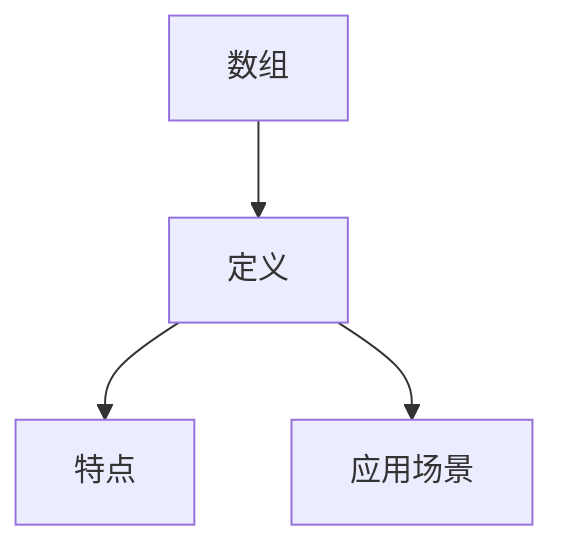

**伪代码示例：**
```python
// 创建数组
array = [1, 2, 3, 4, 5]

// 访问元素
element = array[2] # 输出3

// 插入元素
array.insert(3, 6) # 数组变为[1, 2, 3, 6, 4, 5]

// 删除元素
array.remove(3) # 数组变为[1, 2, 6, 4, 5]
```

**链表**

链表是一种动态数据结构，由一系列节点组成，每个节点包含数据和指向下一个节点的指针。链表插入和删除操作灵活，但访问元素需要遍历链表。

**核心概念与联系：**
- **定义**：链表由一系列节点组成，每个节点包含数据和指向下一个节点的指针。
- **特点**：链表插入和删除操作灵活，但访问元素需要遍历链表。
- **应用场景**：链表常用于实现栈、队列等数据结构，也用于实现各种算法，如链表反转、合并链表等。

**Mermaid 流程图：**


**伪代码示例：**
```python
// 创建链表节点
class Node:
    def __init__(self, data):
        self.data = data
        self.next = None

// 创建链表
head = Node(1)
head.next = Node(2)
head.next.next = Node(3)

// 遍历链表
current = head
while current is not None:
    print(current.data)
    current = current.next
```

**栈**

栈是一种后进先出（LIFO）的数据结构，适用于需要先处理后面添加的元素的场景，如递归调用、表达式求值等。

**核心概念与联系：**
- **定义**：栈是一种线性数据结构，遵循后进先出（LIFO）的原则。
- **特点**：栈的插入和删除操作都在顶部进行。
- **应用场景**：栈常用于实现递归、表达式求值、函数调用等。

**Mermaid 流程图：**


**伪代码示例：**
```python
// 创建栈
class Stack:
    def __init__(self):
        self.items = []
    
    def push(self, item):
        self.items.append(item)
    
    def pop(self):
        return self.items.pop()

# 使用栈
stack = Stack()
stack.push(1)
stack.push(2)
print(stack.pop()) # 输出2
```

**队列**

队列是一种先进先出（FIFO）的数据结构，适用于需要按顺序处理元素的场景，如任务调度、消息队列等。

**核心概念与联系：**
- **定义**：队列是一种线性数据结构，遵循先进先出（FIFO）的原则。
- **特点**：队列的插入操作在尾部进行，删除操作在头部进行。
- **应用场景**：队列常用于实现任务调度、消息队列等。

**Mermaid 流程图：**
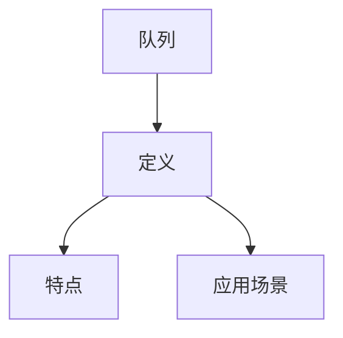

**伪代码示例：**
```python
// 创建队列
class Queue:
    def __init__(self):
        self.items = []
    
    def enqueue(self, item):
        self.items.append(item)
    
    def dequeue(self):
        return self.items.pop(0)

# 使用队列
queue = Queue()
queue.enqueue(1)
queue.enqueue(2)
print(queue.dequeue()) # 输出1
```

**树**

树是一种非线性数据结构，由一系列节点组成，每个节点可以有零个或多个子节点。树常用于表示层次结构，如组织结构、文件系统等。

**核心概念与联系：**
- **定义**：树是一种由节点（或称元素）组成的数据结构，每个节点可以有零个或多个子节点。
- **特点**：树具有层次结构，节点可以有父节点和子节点。
- **应用场景**：树常用于实现目录结构、决策树等。

**Mermaid 流程图：**
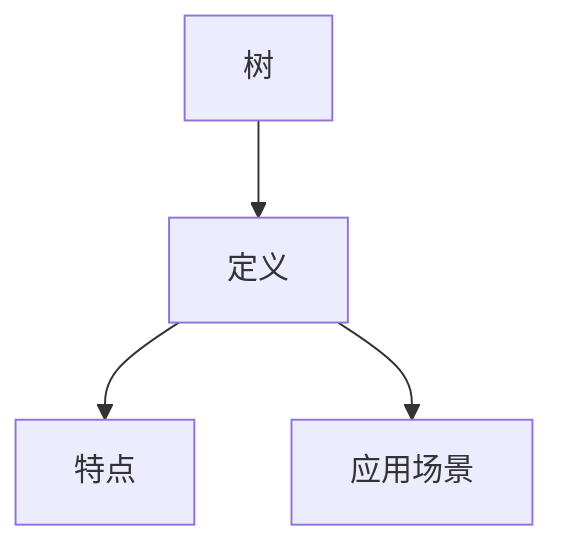

**伪代码示例：**
```python
// 创建树节点
class TreeNode:
    def __init__(self, value):
        self.value = value
        self.children = []

// 创建树
root = TreeNode(1)
root.children.append(TreeNode(2))
root.children.append(TreeNode(3))

// 遍历树
def traverse_tree(node):
    print(node.value)
    for child in node.children:
        traverse_tree(child)

traverse_tree(root) # 输出1, 2, 3
```

**图**

图是一种非线性数据结构，由一系列节点（或称顶点）和连接节点的边组成。图常用于表示复杂的关系，如社交网络、交通网络等。

**核心概念与联系：**
- **定义**：图是一种由节点和边组成的数据结构，节点表示实体，边表示实体之间的关系。
- **特点**：图可以表示复杂的网络结构，节点和边可以是多重的。
- **应用场景**：图常用于实现社交网络、路由算法等。

**Mermaid 流程图：**


**伪代码示例：**
```python
// 创建图节点
class GraphNode:
    def __init__(self, value):
        self.value = value
        self.neighbors = []

// 创建图
node1 = GraphNode(1)
node2 = GraphNode(2)
node1.neighbors.append(node2)

// 添加边
def add_edge(graph, node1, node2):
    node1.neighbors.append(node2)
    node2.neighbors.append(node1)

add_edge(graph, node1, node2)

// 遍历图
def traverse_graph(graph):
    for node in graph:
        print(node.value)
        for neighbor in node.neighbors:
            print(neighbor.value)

traverse_graph(graph) # 输出1, 2
```

##### 2.2 常见算法设计方法

算法设计方法是用于解决特定类型问题的策略。常见的算法设计方法包括分治法、动态规划和贪心算法等。

**分治法**

分治法是一种将大问题分解为若干个小问题，分别解决，再将小问题的解合并成大问题的解的方法。

**核心概念与联系：**
- **定义**：分治法是一种将问题分解为若干个子问题，分别解决，再将子问题的解合并成原问题的解的方法。
- **特点**：分治法可以将复杂问题简化为多个简单问题，便于求解。
- **应用场景**：分治法常用于实现排序算法、搜索算法等。

**Mermaid 流程图：**
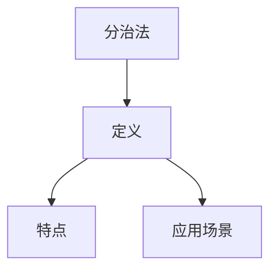

**伪代码示例：**
```python
// 快速排序（分治法实现）
def quick_sort(arr):
    if len(arr) <= 1:
        return arr
    
    pivot = arr[len(arr) // 2]
    left = [x for x in arr if x < pivot]
    middle = [x for x if x == pivot]
    right = [x for x in arr if x > pivot]
    
    return quick_sort(left) + middle + quick_sort(right)

# 使用快速排序
arr = [3, 6, 2, 8, 4]
sorted_arr = quick_sort(arr)
print(sorted_arr) # 输出[2, 3, 4, 6, 8]
```

**动态规划**

动态规划是一种通过将问题分解为多个子问题，并存储子问题的解，以避免重复计算的方法。

**核心概念与联系：**
- **定义**：动态规划是一种通过将问题分解为多个子问题，并存储子问题的解，以避免重复计算的方法。
- **特点**：动态规划可以将复杂问题简化为多个简单问题，并优化计算效率。
- **应用场景**：动态规划常用于实现最长公共子序列、背包问题等。

**Mermaid 流程图：**
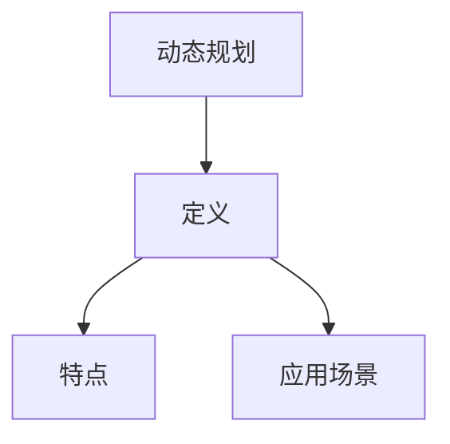

**伪代码示例：**
```python
// 最长公共子序列（动态规划实现）
def longest_common_subsequence(X, Y):
    m = len(X)
    n = len(Y)
    dp = [[0] * (n + 1) for _ in range(m + 1)]

    for i in range(1, m + 1):
        for j in range(1, n + 1):
            if X[i - 1] == Y[j - 1]:
                dp[i][j] = dp[i - 1][j - 1] + 1
            else:
                dp[i][j] = max(dp[i - 1][j], dp[i][j - 1])

    return dp[m][n]

# 使用最长公共子序列
X = "AGGTAB"
Y = "GXTXAYB"
result = longest_common_subsequence(X, Y)
print(result) # 输出"GTAB"
```

**贪心算法**

贪心算法是一种通过每次选择局部最优解，最终得到全局最优解的方法。

**核心概念与联系：**
- **定义**：贪心算法是一种通过每次选择局部最优解，最终得到全局最优解的方法。
- **特点**：贪心算法简单易实现，但需要满足贪心选择性质。
- **应用场景**：贪心算法常用于实现最短路径、最优贪心选择等。

**Mermaid 流程图：**
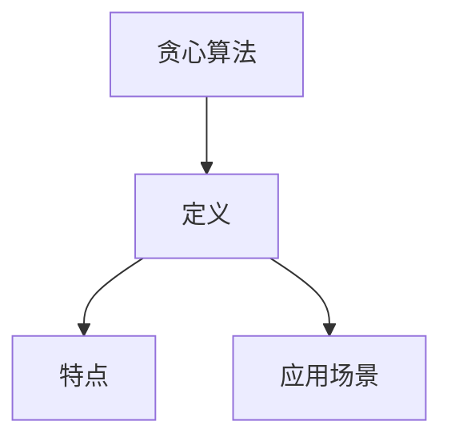

**伪代码示例：**
```python
// 最短路径（Dijkstra算法，贪心算法实现）
def shortest_path(graph, start, end):
    distances = {node: float('infinity') for node in graph}
    distances[start] = 0
    visited = set()

    while True:
        current_node = min((node, distance) for node, distance in distances.items() if node not in visited)
        if current_node is None:
            break
        visited.add(current_node)

        for neighbor, weight in graph[current_node].items():
            old_distance = distances[neighbor]
            new_distance = distances[current_node] + weight
            distances[neighbor] = min(old_distance, new_distance)

    return distances[end]

# 使用最短路径
graph = {
    'A': {'B': 1, 'C': 3},
    'B': {'A': 1, 'C': 1, 'D': 1},
    'C': {'A': 3, 'B': 1, 'D': 3},
    'D': {'B': 1, 'C': 3}
}
start = 'A'
end = 'D'
result = shortest_path(graph, start, end)
print(result) # 输出2
```

通过本章的学习，我们可以看到数据结构与算法在计算机科学中的重要地位。掌握常见的数据结构和算法设计方法，不仅能够提高编程效率，还能够解决复杂的实际问题。在接下来的章节中，我们将继续探讨计算机网络、操作系统、前端技术、后端技术和数据库技术，帮助您全面提升技术能力。

#### 第3章：计算机网络

计算机网络是计算机科学的重要组成部分，它使得计算机之间能够相互通信和数据交换。本章将详细探讨计算机网络的基础知识，包括网络协议、IP地址、子网掩码和网络分层模型。

##### 3.1 网络基础

网络协议是计算机网络的核心，它定义了计算机之间进行通信的规则和标准。网络协议分为物理层、数据链路层、网络层、传输层和应用层等多个层次。

**核心概念与联系：**
- **网络协议**：网络协议是计算机网络中不同设备之间进行通信的规则和标准。常见的网络协议包括TCP/IP、HTTP、FTP、DNS等。
- **IP地址**：IP地址是互联网上每个设备的唯一标识符，用于定位网络中的设备。IP地址分为IPv4和IPv6两种格式。
- **子网掩码**：子网掩码用于定义IP地址中网络部分和主机部分的边界，它决定了IP地址的网络和主机部分。

**Mermaid 流程图：**
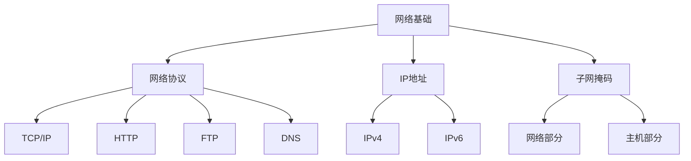

**举例说明：**
- **网络协议**：TCP/IP协议是互联网的基础协议，它定义了数据如何在网络中传输和路由。
- **IP地址**：一个典型的IPv4地址是192.168.1.1，而IPv6地址则是一个更长且更复杂的地址，如2001:0db8:85a3:0000:0000:8a2e:0370:7334。

##### 3.2 常见网络协议

网络协议在计算机网络中起着至关重要的作用，不同的协议负责不同的功能，如数据传输、文件传输、域名解析等。

**核心概念与联系：**
- **HTTP协议**：超文本传输协议（HTTP）是用于在Web浏览器和服务器之间传输数据的协议。HTTP是一个应用层协议，它使用TCP作为传输层协议。
- **HTTPS协议**：安全超文本传输协议（HTTPS）是对HTTP协议的安全扩展，它通过SSL/TLS协议提供加密传输，确保数据传输的安全性。
- **FTP协议**：文件传输协议（FTP）是用于在计算机之间传输文件的协议。FTP使用TCP协议，它在传输过程中对文件进行加密，确保文件传输的安全性。
- **DNS协议**：域名系统协议（DNS）用于将域名解析为IP地址，它是互联网上不可或缺的一部分。DNS使用UDP协议进行传输。

**Mermaid 流程图：**
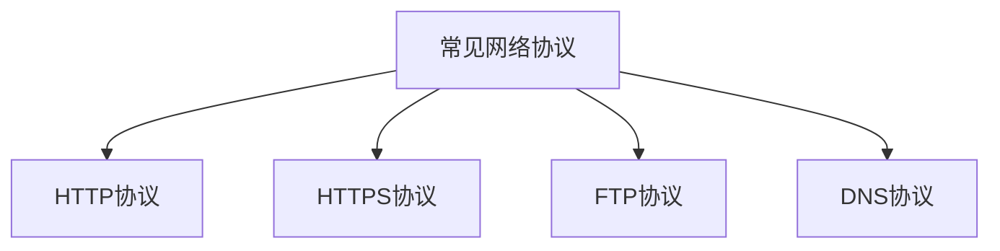

**举例说明：**
- **HTTP协议**：当用户在浏览器中输入网址时，浏览器会向服务器发送一个HTTP请求，服务器返回HTTP响应，包含请求的资源。
- **HTTPS协议**：HTTPS在HTTP协议的基础上增加了SSL/TLS加密，确保数据在传输过程中的安全。
- **FTP协议**：FTP用于在客户端和服务器之间上传和下载文件，它支持多种传输模式，如ASCII模式和二进制模式。
- **DNS协议**：DNS将域名解析为IP地址，使得用户可以通过域名访问网站，而不需要记住复杂的IP地址。

##### 3.3 网络安全

网络安全是计算机网络中一个重要的方面，它涉及到保护网络免受恶意攻击和未授权访问。网络安全措施包括加密技术、认证技术和防火墙等。

**核心概念与联系：**
- **加密技术**：加密技术用于保护数据在传输过程中的安全性，防止数据被窃取或篡改。常见的加密算法包括AES、RSA等。
- **认证技术**：认证技术用于确保网络中的设备或用户是合法的，常见的认证技术包括用户名和密码、数字证书等。
- **防火墙**：防火墙是一种网络安全设备，用于监控和控制进出网络的流量，阻止未经授权的访问。

**Mermaid 流程图：**
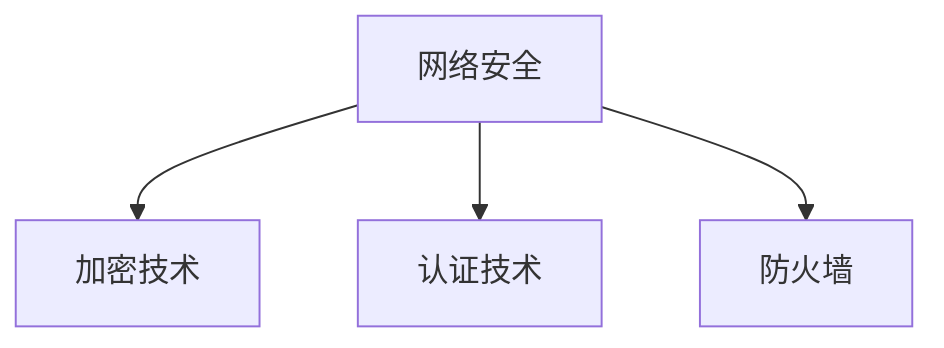

**举例说明：**
- **加密技术**：HTTPS使用SSL/TLS协议对数据进行加密，确保数据在传输过程中的安全性。
- **认证技术**：SSL/TLS协议通过数字证书进行身份验证，确保通信双方是合法的。
- **防火墙**：防火墙通过设置访问控制规则，阻止未经授权的访问，保护网络的安全性。

##### 3.4 网络分层模型

网络分层模型是计算机网络中的一种组织结构，它将网络的功能和协议划分为不同的层次，使得网络设计和管理更加灵活。

**核心概念与联系：**
- **OSI模型**：OSI模型是国际标准化组织（ISO）提出的网络分层模型，它将网络功能划分为七层，从下至上分别为物理层、数据链路层、网络层、传输层、会话层、表示层和应用层。
- **TCP/IP模型**：TCP/IP模型是互联网的基础模型，它将网络功能划分为四层，从下至上分别为网络接口层、互联网层、传输层和应用层。

**Mermaid 流程图：**
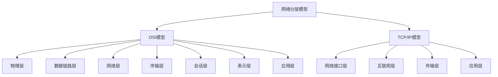

**举例说明：**
- **OSI模型**：在OSI模型中，每一层都有特定的功能和协议，如物理层负责传输比特流，应用层负责提供应用程序接口。
- **TCP/IP模型**：TCP/IP模型中，互联网层负责IP地址的分配和路由，传输层负责TCP和UDP协议，应用层负责提供应用程序接口。

通过本章的学习，我们可以了解到计算机网络的基础知识，包括网络协议、IP地址、子网掩码和网络分层模型。这些知识对于理解计算机网络的工作原理和实现网络应用至关重要。在接下来的章节中，我们将继续探讨操作系统的基本原理，帮助您深入理解计算机系统的运作机制。

#### 第4章：操作系统

操作系统是计算机系统的核心软件，负责管理和控制计算机硬件和软件资源。本章将详细介绍操作系统的基本原理，包括进程管理、内存管理、文件系统、I/O系统等内容。

##### 4.1 操作系统基础

操作系统的基础包括进程管理、内存管理、文件系统、I/O系统等，这些内容构成了操作系统的核心功能。

**核心概念与联系：**
- **进程管理**：进程是操作系统中正在运行的程序实例，进程管理包括进程的创建、撤销、调度和同步等。
- **内存管理**：内存管理负责为进程分配和回收内存空间，保证内存的合理利用和安全性。
- **文件系统**：文件系统负责管理和存储文件，提供文件创建、删除、读写等操作。
- **I/O系统**：I/O系统负责处理输入输出操作，包括设备的驱动程序、缓冲区管理和数据传输等。

**Mermaid 流程图：**
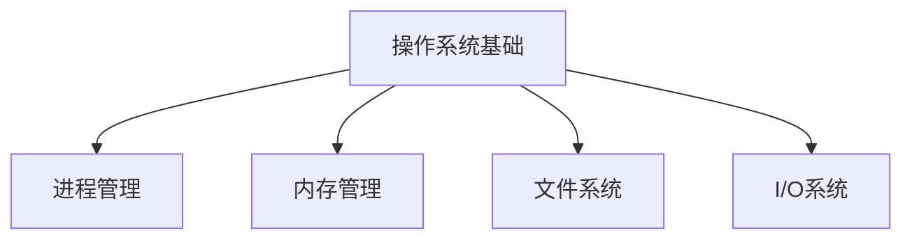

**举例说明：**
- **进程管理**：操作系统通过进程控制块（PCB）来管理进程，包括进程状态、程序计数器、寄存器等。
- **内存管理**：操作系统通过内存分配策略（如分页、分段）来管理内存，保证进程的内存需求。
- **文件系统**：操作系统通过文件系统来组织和管理文件，包括文件目录、文件权限、文件存储等。
- **I/O系统**：操作系统通过设备驱动程序来管理I/O设备，包括设备的初始化、数据传输和错误处理等。

##### 4.2 进程管理

进程管理是操作系统的重要功能之一，它涉及到进程的生命周期、进程调度和进程同步等方面。

**核心概念与联系：**
- **进程状态**：进程可以处于创建、就绪、运行、阻塞和终止等状态。
- **进程调度**：操作系统通过调度算法来选择哪个进程获得CPU时间，常见的调度算法有先来先服务（FCFS）、短作业优先（SJF）和优先级调度等。
- **进程同步**：进程同步是指多个进程在执行过程中如何协调和同步，常见的同步机制有互斥锁、信号量和条件变量等。

**Mermaid 流程图：**
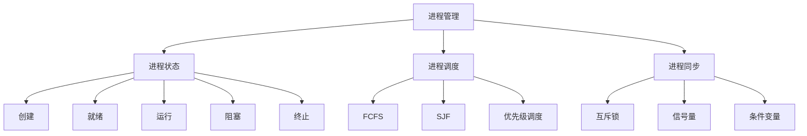

**数学公式：**
$$
P0, P1, P2, ..., Pn
$$

**举例说明：**
- **进程状态**：进程在创建后进入就绪状态，等待CPU时间；在获得CPU时间后进入运行状态；在执行过程中可能因等待I/O操作而进入阻塞状态；最终执行完毕后进入终止状态。
- **进程调度**：操作系统通过调度算法来选择下一个执行进程，如先来先服务算法按照进程到达的顺序执行。
- **进程同步**：互斥锁用于防止多个进程同时访问共享资源，信号量用于实现进程间的同步和通信。

##### 4.3 内存管理

内存管理是操作系统的重要功能之一，它涉及到内存的分配、回收和优化等方面。

**核心概念与联系：**
- **内存分配策略**：内存分配策略用于决定如何为进程分配内存空间，常见的策略有固定分区、动态分区、分页和分段等。
- **内存回收算法**：内存回收算法用于回收不再使用的内存空间，常见的算法有首次适配、最佳适配和最坏适配等。
- **页面置换算法**：页面置换算法用于选择哪个页面被替换出内存，常见的算法有先进先出（FIFO）、最近最少使用（LRU）和最少使用（LFU）等。

**Mermaid 流程图：**
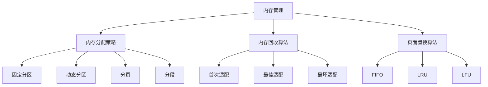

**数学公式：**
$$
Page\ Replacement\ Algorithm\ Metrics:\\
-\\ Longest\\ Frequent\\ Used\\ (LFU)\\:\\ \\
-\\ Most\\ Recently\\ Used\\ (MRU)\\:\\ \\
-\\ Least\\ Recently\\ Used\\ (LRU)\\:\\ \\
-\\ First\\ In\\ First\\ Out\\ (FIFO)\\:\\ \\
$$

**举例说明：**
- **内存分配策略**：固定分区是早期操作系统采用的内存分配策略，它将内存划分为固定大小的分区，每个分区用于一个进程。
- **内存回收算法**：首次适配算法在空闲内存区域中找到第一个满足要求的分区，以便快速分配内存。
- **页面置换算法**：LRU算法通过记录页面最近是否被访问，选择最久未访问的页面进行替换。

##### 4.4 文件系统

文件系统是操作系统用于管理和存储文件的数据结构。它负责文件的创建、删除、读写等操作。

**核心概念与联系：**
- **文件系统结构**：文件系统结构包括文件目录、文件权限、文件存储等，常见的文件系统结构有层次文件系统、磁盘文件系统和分布式文件系统等。
- **文件操作**：文件操作包括文件创建、删除、读取、写入等，操作系统通过文件系统提供这些操作。
- **文件权限管理**：文件权限管理用于控制用户对文件的访问权限，常见的权限有读、写、执行等。

**Mermaid 流程图：**
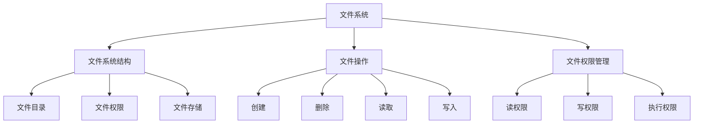

**举例说明：**
- **文件系统结构**：层次文件系统将文件组织成目录树结构，便于管理和访问。
- **文件操作**：操作系统提供文件创建、删除、读取和写入等操作，用户可以通过文件系统接口进行操作。
- **文件权限管理**：操作系统通过文件权限管理来确保用户只能访问自己有权限的文件。

##### 4.5 I/O系统

I/O系统是操作系统用于处理输入输出操作的部分。它负责设备的驱动程序、缓冲区管理和数据传输等。

**核心概念与联系：**
- **设备驱动程序**：设备驱动程序是操作系统用于控制和管理特定设备的软件模块，它负责设备的初始化、数据传输和错误处理等。
- **缓冲区管理**：缓冲区管理用于提高I/O操作的效率，它通过在内存中设置缓冲区来减少磁盘访问次数。
- **数据传输**：数据传输是指操作系统如何将数据从输入设备传输到内存，或将数据从内存传输到输出设备。

**Mermaid 流程图：**
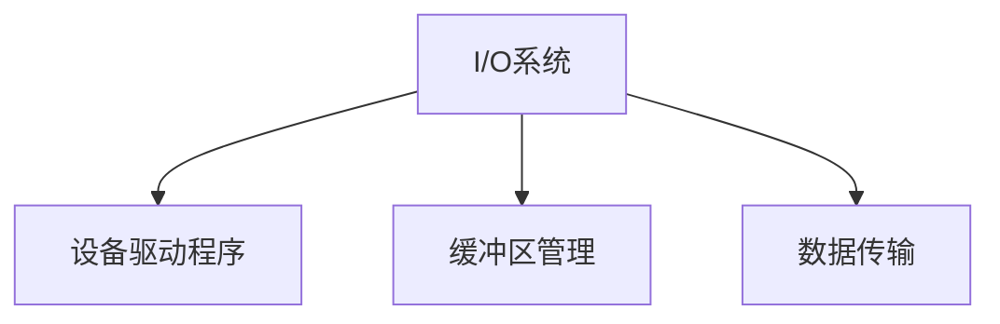

**举例说明：**
- **设备驱动程序**：操作系统通过设备驱动程序来控制和管理硬盘、打印机、鼠标等设备。
- **缓冲区管理**：操作系统在内存中设置缓冲区，用于缓存输入输出数据，减少直接读写磁盘的次数。
- **数据传输**：操作系统通过数据传输机制，将数据从输入设备（如键盘、鼠标）传输到内存，或将数据从内存传输到输出设备（如显示器、打印机）。

通过本章的学习，我们可以了解到操作系统的基本原理，包括进程管理、内存管理、文件系统、I/O系统等。这些知识对于理解计算机系统的运作机制和实现高效、可靠的操作系统至关重要。在接下来的章节中，我们将继续探讨前端技术，帮助您掌握现代Web开发的核心技术。

#### 第5章：前端技术

前端技术是现代Web开发的重要组成部分，它负责实现Web页面的可视化界面和用户交互。本章将详细介绍前端技术，包括HTML、CSS、JavaScript以及前端框架Vue.js、React和Angular。

##### 5.1 HTML与CSS

HTML（超文本标记语言）和CSS（层叠样式表）是前端技术的基石。

**核心概念与联系：**
- **HTML**：HTML是用于创建Web页面的标记语言，它定义了Web页面的结构、内容和格式。HTML通过标签来表示不同的内容，如标题、段落、图片、链接等。
- **CSS**：CSS是用于设置Web页面样式的样式表语言，它定义了Web页面的布局、颜色、字体等视觉效果。CSS通过选择器来匹配HTML元素，并为其设置样式。

**Mermaid 流程图：**
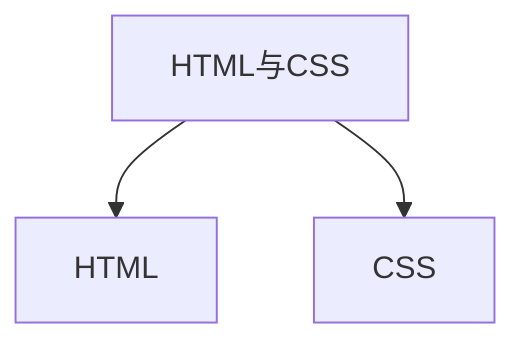

**举例说明：**
- **HTML**：以下是一个简单的HTML示例，其中包含标题、段落和图片。
  ```html
  <!DOCTYPE html>
  <html>
  <head>
    <title>我的网页</title>
  </head>
  <body>
    <h1>欢迎来到我的网页</h1>
    <p>这是一个段落。</p>
    
  </body>
  </html>
  ```
- **CSS**：以下是一个简单的CSS示例，用于设置HTML元素的样式。
  ```css
  body {
    font-family: Arial, sans-serif;
    color: #333;
  }
  h1 {
    color: #000;
  }
  p {
    font-size: 16px;
  }
  ```

##### 5.2 JavaScript

JavaScript是一种客户端脚本语言，用于实现Web页面的动态效果和用户交互。

**核心概念与联系：**
- **基本语法**：JavaScript的基本语法包括变量、数据类型、运算符、控制结构和函数等。
- **内置对象**：JavaScript提供了丰富的内置对象，如String、Array、Date等，用于处理常见的数据操作和函数。
- **异步编程**：异步编程是JavaScript的核心特性，它允许JavaScript在执行同步操作的同时，继续执行其他任务。

**Mermaid 流程图：**
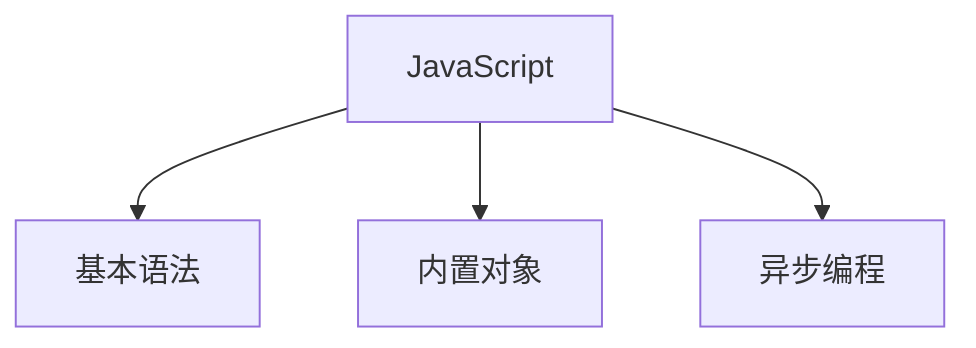

**举例说明：**
- **基本语法**：以下是一个简单的JavaScript示例，用于计算两个数的和。
  ```javascript
  function add(a, b) {
    return a + b;
  }
  let result = add(3, 4);
  console.log(result); // 输出7
  ```
- **内置对象**：以下是一个使用内置对象String的示例，用于将字符串转换为小写。
  ```javascript
  let str = "Hello, World!";
  let lowerCaseStr = str.toLowerCase();
  console.log(lowerCaseStr); // 输出"hello, world!"
  ```
- **异步编程**：以下是一个使用异步编程的示例，用于通过AJAX获取数据。
  ```javascript
  function fetchData(url, callback) {
    let xhr = new XMLHttpRequest();
    xhr.open("GET", url);
    xhr.onload = function() {
      if (xhr.status === 200) {
        callback(xhr.responseText);
      }
    };
    xhr.send();
  }
  fetchData("data.txt", function(data) {
    console.log(data); // 输出从data.txt文件中读取的数据
  });
  ```

##### 5.3 前端框架

前端框架是用于简化前端开发流程和提升开发效率的工具。Vue.js、React和Angular是当前最流行的三个前端框架。

**核心概念与联系：**
- **Vue.js**：Vue.js是一种渐进式JavaScript框架，用于构建用户界面。Vue.js通过数据绑定、组件系统、虚拟DOM等技术，提供了一套简洁、高效的开发工具。
- **React**：React是由Facebook开发的一种声明式、高效的JavaScript库，用于构建用户界面。React通过组件化、虚拟DOM、状态管理等技术，提供了一种灵活、可扩展的开发方式。
- **Angular**：Angular是由Google开发的一种全功能前端框架，用于构建单页应用程序。Angular通过模块化、双向数据绑定、依赖注入等技术，提供了一种强大、高效的开发体验。

**Mermaid 流程图：**
```mermaid
graph TB
    A[前端框架] --> B[Vue.js]
    A --> C[React]
    A --> D[Angular]
```

**举例说明：**
- **Vue.js**：以下是一个简单的Vue.js示例，用于实现数据绑定和组件化。
  ```html
  <div id="app">
    <h1>{{ title }}</h1>
    <p>{{ message }}</p>
    <my-component></my-component>
  </div>
  ```
  ```javascript
  new Vue({
    el: '#app',
    data: {
      title: 'Vue.js示例',
      message: '欢迎学习Vue.js'
    },
    components: {
      'my-component': {
        template: '<p>这是一个Vue.js组件</p>'
      }
    }
  });
  ```
- **React**：以下是一个简单的React示例，用于实现组件化和状态管理。
  ```jsx
  import React, { useState } from 'react';

  function App() {
    const [count, setCount] = useState(0);

    return (
      <div>
        <h1>计数器：{count}</h1>
        <button onClick={() => setCount(count + 1)}>增加</button>
      </div>
    );
  }

  export default App;
  ```
- **Angular**：以下是一个简单的Angular示例，用于实现模块化和依赖注入。
  ```typescript
  import { Component } from '@angular/core';

  @Component({
    selector: 'app-root',
    template: `
      <h1>Angular示例</h1>
      <p>计数器：{{ count }}</p>
      <button (click)="increment()">增加</button>
    `
  })
  export class AppComponent {
    count = 0;

    increment() {
      this.count++;
    }
  }
  ```

通过本章的学习，我们可以了解到前端技术的基本概念和实现原理。掌握HTML、CSS和JavaScript是前端开发的基础，而Vue.js、React和Angular等前端框架则提供了更高效的开发工具和解决方案。在接下来的章节中，我们将继续探讨后端技术，帮助您全面掌握现代Web开发的各个方面。

#### 第6章：后端技术

后端技术是现代Web应用程序的核心，负责处理业务逻辑、数据存储和服务器端操作。本章将详细介绍后端技术，包括Java编程基础、Python编程基础、Golang编程基础、Java框架Spring、Python框架Django和Golang框架Gin。

##### 6.1 Java编程基础

Java是一种广泛使用的高级编程语言，具有跨平台、安全性和稳定性等特点。Java编程基础包括语法、集合框架和多线程编程。

**核心概念与联系：**
- **Java语法**：Java语法包括基本语法、数据类型、运算符和控制结构等。
- **集合框架**：Java集合框架是Java标准库的一部分，提供了丰富的数据结构，如List、Set和Map等。
- **多线程编程**：多线程编程用于提高程序的并发性能，Java提供了线程和锁等机制来支持多线程编程。

**Mermaid 流程图：**
```mermaid
graph TB
    A[Java编程基础] --> B[Java语法]
    A --> C[集合框架]
    A --> D[多线程编程]
```

**举例说明：**
- **Java语法**：以下是一个简单的Java示例，用于实现计算两个数的和。
  ```java
  public class Add {
      public static int add(int a, int b) {
          return a + b;
      }

      public static void main(String[] args) {
          int sum = add(3, 4);
          System.out.println("和为：" + sum);
      }
  }
  ```
- **集合框架**：以下是一个使用Java集合框架的示例，用于存储和遍历列表。
  ```java
  import java.util.ArrayList;
  import java.util.List;

  public class ArrayListExample {
      public static void main(String[] args) {
          List<String> list = new ArrayList<>();
          list.add("Apple");
          list.add("Banana");
          list.add("Cherry");

          for (String fruit : list) {
              System.out.println(fruit);
          }
      }
  }
  ```
- **多线程编程**：以下是一个使用Java多线程编程的示例，用于实现并行计算。
  ```java
  import java.util.concurrent.ExecutorService;
  import java.util.concurrent.Executors;

  public class ParallelProcessing {
      public static void main(String[] args) {
          ExecutorService executor = Executors.newFixedThreadPool(2);

          executor.execute(() -> {
              System.out.println("线程1：执行任务1");
          });

          executor.execute(() -> {
              System.out.println("线程2：执行任务2");
          });

          executor.shutdown();
      }
  }
  ```

##### 6.2 Python编程基础

Python是一种高级、易学易用的编程语言，广泛应用于数据分析、人工智能和Web开发等领域。Python编程基础包括语法、数据科学库和Web开发库。

**核心概念与联系：**
- **Python语法**：Python语法简洁明了，包括基本语法、数据类型、运算符和控制结构等。
- **数据科学库**：Python的数据科学库（如NumPy、Pandas、SciPy）提供了丰富的工具和函数，用于数据处理和分析。
- **Web开发库**：Python的Web开发库（如Flask、Django）提供了快速构建Web应用程序的工具和框架。

**Mermaid 流程图：**
```mermaid
graph TB
    A[Python编程基础] --> B[Python语法]
    A --> C[数据科学库]
    A --> D[Web开发库]
```

**举例说明：**
- **Python语法**：以下是一个简单的Python示例，用于实现计算两个数的和。
  ```python
  def add(a, b):
      return a + b

  print(add(3, 4)) # 输出7
  ```
- **数据科学库**：以下是一个使用Pandas的示例，用于读取和操作CSV文件。
  ```python
  import pandas as pd

  data = pd.read_csv('data.csv')
  print(data.head()) # 输出CSV文件的前五行数据
  ```
- **Web开发库**：以下是一个使用Flask的示例，用于创建简单的Web服务器。
  ```python
  from flask import Flask, request, jsonify

  app = Flask(__name__)

  @app.route('/')
  def hello():
      return 'Hello, World!'

  @app.route('/add', methods=['POST'])
  def add():
      a = request.form['a']
      b = request.form['b']
      result = int(a) + int(b)
      return jsonify({'result': result})

  if __name__ == '__main__':
      app.run()
  ```

##### 6.3 Golang编程基础

Golang（Go语言）是一种由Google开发的高级编程语言，具有并发性、性能和安全性等特点。Golang编程基础包括语法、并发编程和Web框架。

**核心概念与联系：**
- **Golang语法**：Golang语法简洁明了，包括基本语法、数据类型、运算符和控制结构等。
- **并发编程**：Golang通过goroutine和channel实现并发编程，使得Golang在处理并发任务时具有优势。
- **Web框架**：Golang的Web框架（如Gin、Beego）提供了快速构建Web应用程序的工具和框架。

**Mermaid 流程图：**
```mermaid
graph TB
    A[Golang编程基础] --> B[Golang语法]
    A --> C[并发编程]
    A --> D[Web框架]
```

**举例说明：**
- **Golang语法**：以下是一个简单的Golang示例，用于实现计算两个数的和。
  ```go
  package main

  import "fmt"

  func add(a, b int) int {
      return a + b
  }

  func main() {
      fmt.Println(add(3, 4)) // 输出7
  }
  ```
- **并发编程**：以下是一个使用Golang并发编程的示例，用于计算多个数的和。
  ```go
  package main

  import (
      "fmt"
      "math/rand"
      "time"
  )

  func sum(nums ...int) int {
      sum := 0
      for _, num := range nums {
          sum += num
      }
      return sum
  }

  func main() {
      nums := []int{2, 3, 4, 5}
      ch := make(chan int)

      go func() {
          ch <- sum(nums...)
      }()

      time.Sleep(1 * time.Second)
      result := <-ch
      fmt.Println("结果：", result) // 输出结果为14
  }
  ```
- **Web框架**：以下是一个使用Gin框架的示例，用于创建简单的Web服务器。
  ```go
  package main

  import (
      "github.com/gin-gonic/gin"
  )

  func main() {
      router := gin.Default()

      router.GET("/", func(c *gin.Context) {
          c.String(200, "Hello, World!")
      })

      router.POST("/add", func(c *gin.Context) {
          a := c.PostForm("a")
          b := c.PostForm("b")
          result := a + b
          c.JSON(200, gin.H{
              "result": result,
          })
      })

      router.Run(":8080")
  }
  ```

##### 6.4 Java框架Spring

Spring是一个开源的Java框架，用于简化企业级应用程序的开发。Spring提供了依赖注入、事务管理、安全控制等特性。

**核心概念与联系：**
- **依赖注入**：依赖注入是一种设计模式，用于实现组件之间的解耦和重用。
- **事务管理**：事务管理用于确保数据的一致性和完整性，Spring提供了声明式事务管理。
- **安全控制**：安全控制用于保护应用程序免受攻击，Spring Security提供了强大的安全控制功能。

**Mermaid 流程图：**
```mermaid
graph TB
    A[Java框架Spring] --> B[依赖注入]
    A --> C[事务管理]
    A --> D[安全控制]
```

**举例说明：**
- **依赖注入**：以下是一个使用Spring的依赖注入示例。
  ```java
  import org.springframework.context.annotation.AnnotationConfigApplicationContext;
  import org.springframework.context.annotation.Bean;
  import org.springframework.context.annotation.Configuration;

  @Configuration
  public class AppConfig {
      @Bean
      public DependencyBean dependencyBean() {
          return new DependencyBean();
      }
  }

  public class Main {
      public static void main(String[] args) {
          AnnotationConfigApplicationContext context = new AnnotationConfigApplicationContext(AppConfig.class);
          DependencyBean bean = context.getBean(DependencyBean.class);
          bean.doSomething();
          context.close();
      }
  }
  ```
- **事务管理**：以下是一个使用Spring的事务管理示例。
  ```java
  import org.springframework.context.annotation.Configuration;
  import org.springframework.jdbc.core.JdbcTemplate;
  import org.springframework.transaction.annotation.EnableTransactionManagement;
  import org.springframework.transaction.annotation.Transactional;

  @Configuration
  @EnableTransactionManagement
  public class AppConfig {
      @Bean
      public JdbcTemplate jdbcTemplate() {
          // 创建JdbcTemplate实例
          return new JdbcTemplate(dataSource());
      }

      @Bean
      public DataSource dataSource() {
          // 创建DataSource实例
          return new DriverManagerDataSource();
      }

      @Transactional
      public void updateData() {
          jdbcTemplate.update("UPDATE users SET name = ? WHERE id = ?", "Alice", 1);
      }
  }
  ```
- **安全控制**：以下是一个使用Spring Security的安全控制示例。
  ```java
  import org.springframework.beans.factory.annotation.Autowired;
  import org.springframework.context.annotation.Bean;
  import org.springframework.context.annotation.Configuration;
  import org.springframework.security.config.annotation.authentication.builders.AuthenticationManagerBuilder;
  import org.springframework.security.config.annotation.web.builders.HttpSecurity;
  import org.springframework.security.config.annotation.web.configuration.WebSecurityConfigurerAdapter;

  @Configuration
  public class SecurityConfig extends WebSecurityConfigurerAdapter {
      @Autowired
      public void configureGlobal(AuthenticationManagerBuilder auth) throws Exception {
          auth.inMemoryAuthentication()
                  .withUser("user").password("{noop}password").roles("USER")
                  .and()
                  .withUser("admin").password("{noop}password").roles("ADMIN");
      }

      @Override
      protected void configure(HttpSecurity http) throws Exception {
          http
                  .authorizeRequests()
                  .antMatchers("/public/**").permitAll()
                  .antMatchers("/admin/**").hasRole("ADMIN")
                  .anyRequest().authenticated()
                  .and()
                  .formLogin()
                  .and()
                  .httpBasic();
      }
  }
  ```

##### 6.5 Python框架Django

Django是一个开源的Python Web框架，遵循MVC（模型-视图-控制器）设计模式，用于快速构建Web应用程序。

**核心概念与联系：**
- **模型（Model）**：模型是用于表示数据库表的类，它定义了数据结构和操作方法。
- **视图（View）**：视图是用于渲染模板和响应HTTP请求的函数或类。
- **控制器（Controller）**：控制器是用于处理用户请求和转发请求到相应视图的类。

**Mermaid 流程图：**
```mermaid
graph TB
    A[Python框架Django] --> B[模型]
    A --> C[视图]
    A --> D[控制器]
```

**举例说明：**
- **模型**：以下是一个使用Django模型的示例。
  ```python
  from django.db import models

  class Article(models.Model):
      title = models.CharField(max_length=100)
      content = models.TextField()
      created_at = models.DateTimeField(auto_now_add=True)
  ```
- **视图**：以下是一个使用Django视图的示例。
  ```python
  from django.http import HttpResponse
  from .models import Article

  def article_list(request):
      articles = Article.objects.all()
      return HttpResponse(f"文章列表：{articles}")
  ```
- **控制器**：以下是一个使用Django控制器的示例。
  ```python
  from django.shortcuts import render
  from .models import Article

  def article_list(request):
      articles = Article.objects.all()
      return render(request, 'article_list.html', {'articles': articles})
  ```

##### 6.6 Golang框架Gin

Gin是一个高性能的Go Web框架，具有简洁、快速和高效的特点。Gin提供了路由、中间件和模板等功能。

**核心概念与联系：**
- **路由**：路由用于匹配HTTP请求的URL和处理函数。
- **中间件**：中间件用于在请求到达处理函数之前或之后执行一些操作，如日志记录、权限验证等。
- **模板**：模板用于渲染HTML页面，Gin支持多种模板引擎，如HTML、Jade、Handlebars等。

**Mermaid 流程图：**
```mermaid
graph TB
    A[Golang框架Gin] --> B[路由]
    A --> C[中间件]
    A --> D[模板]
```

**举例说明：**
- **路由**：以下是一个使用Gin路由的示例。
  ```go
  package main

  import (
      "github.com/gin-gonic/gin"
  )

  func main() {
      router := gin.Default()

      router.GET("/hello", func(c *gin.Context) {
          c.String(200, "Hello, World!")
      })

      router.POST("/add", func(c *gin.Context) {
          a := c.PostForm("a")
          b := c.PostForm("b")
          result := a + b
          c.JSON(200, gin.H{
              "result": result,
          })
      })

      router.Run(":8080")
  }
  ```
- **中间件**：以下是一个使用Gin中间件的示例。
  ```go
  package main

  import (
      "github.com/gin-gonic/gin"
      "net/http"
  )

  func loggingMiddleware(c *gin.Context) {
      start := time.Now()
      c.Next()
      elapsed := time.Since(start)
      c.Error(elapsed)
  }

  func main() {
      router := gin.Default()
      router.Use(loggingMiddleware)

      router.GET("/hello", func(c *gin.Context) {
          c.String(200, "Hello, World!")
      })

      router.Run(":8080")
  }
  ```
- **模板**：以下是一个使用Gin模板的示例。
  ```go
  package main

  import (
      "github.com/gin-gonic/gin"
      "html/template"
  )

  func main() {
      router := gin.Default()
      tmpl := template.Must(template.ParseFiles("template.html"))

      router.GET("/hello", func(c *gin.Context) {
          data := map[string]interface{}{
              "title": "Hello, World!",
          }
          tmpl.Execute(c.Writer, data)
      })

      router.Run(":8080")
  }
  ```

通过本章的学习，我们可以了解到后端技术的基本概念和实现原理。掌握Java、Python和Golang等编程语言，以及Spring、Django和Gin等框架，将有助于我们开发高效、可靠的Web应用程序。在接下来的章节中，我们将继续探讨数据库技术，帮助您掌握数据存储和管理的核心知识。

#### 第7章：数据库技术

数据库技术是现代信息系统中不可或缺的一部分，它用于存储、管理和检索数据。本章将详细介绍两种常用的数据库技术：MySQL和MongoDB。

##### 7.1 MySQL

MySQL是一个开源的关系型数据库管理系统，广泛用于Web应用、企业级应用等场景。

**核心概念与联系：**
- **数据库设计**：数据库设计包括确定数据库模式、表结构、字段属性和关系等。
- **基本操作**：基本操作包括数据库的创建、表的管理、数据的插入、查询、更新和删除等。
- **性能优化**：性能优化包括索引设计、查询优化、数据库配置调整等。

**Mermaid 流程图：**
```mermaid
graph TB
    A[MySQL] --> B[数据库设计]
    A --> C[基本操作]
    A --> D[性能优化]
```

**举例说明：**
- **数据库设计**：以下是一个简单的数据库设计示例，用于存储用户信息。
  ```sql
  CREATE DATABASE user_db;

  USE user_db;

  CREATE TABLE users (
      id INT PRIMARY KEY AUTO_INCREMENT,
      username VARCHAR(50) NOT NULL,
      password VARCHAR(50) NOT NULL,
      email VARCHAR(100)
  );
  ```
- **基本操作**：以下是一个简单的基本操作示例，用于插入、查询和更新数据。
  ```sql
  INSERT INTO users (username, password, email) VALUES ('john', 'password123', 'john@example.com');

  SELECT * FROM users WHERE username = 'john';

  UPDATE users SET password = 'newpassword' WHERE username = 'john';
  ```
- **性能优化**：以下是一个简单的性能优化示例，用于创建索引。
  ```sql
  CREATE INDEX idx_username ON users (username);

  EXPLAIN SELECT * FROM users WHERE username = 'john';
  ```

##### 7.2 MongoDB

MongoDB是一个开源的文档型数据库，以其灵活的文档模型和横向扩展能力而著称。

**核心概念与联系：**
- **基本操作**：基本操作包括数据库的创建、集合的管理、文档的插入、查询、更新和删除等。
- **文档操作**：文档操作包括文档的查询、排序、聚合和索引等。
- **集群部署**：集群部署包括副本集、分片集群的搭建和管理。

**Mermaid 流程图：**
```mermaid
graph TB
    A[MongoDB] --> B[基本操作]
    A --> C[文档操作]
    A --> D[集群部署]
```

**举例说明：**
- **基本操作**：以下是一个简单的基本操作示例，用于创建数据库和集合，并插入文档。
  ```javascript
  db = db.getSiblingDB("user_db")
  db.createCollection("users")

  db.users.insertOne({
      _id: ObjectId(),
      username: "john",
      password: "password123",
      email: "john@example.com"
  })
  ```
- **文档操作**：以下是一个简单的文档操作示例，用于查询、排序和更新文档。
  ```javascript
  db.users.find({ username: "john" }).sort({ username: 1 })

  db.users.updateOne({ username: "john" }, { $set: { password: "newpassword" } })
  ```
- **集群部署**：以下是一个简单的集群部署示例，用于搭建MongoDB副本集。
  ```shell
  # 在第一个节点上
  mongod --replSet rs0 --dbpath /data/rs0 --port 27017

  # 在第二个节点上
  mongod --replSet rs0 --dbpath /data/rs0 --port 27018

  # 在第三个节点上
  mongod --replSet rs0 --dbpath /data/rs0 --port 27019

  # 在任何节点上初始化副本集
  mongo --port 27017
  rs.initiate({
      _id: "rs0",
      members: [
          { _id: 0, host: "localhost:27017" },
          { _id: 1, host: "localhost:27018" },
          { _id: 2, host: "localhost:27019" }
      ]
  })
  ```

通过本章的学习，我们可以了解到关系型数据库MySQL和文档型数据库MongoDB的基本概念和实现原理。掌握数据库设计、基本操作和性能优化，将有助于我们开发高效、可靠的应用程序。在接下来的章节中，我们将探讨项目实战，通过实际项目案例来巩固和运用所学知识。

#### 第8章：项目实战

项目实战是检验技术能力的重要手段，通过实际项目的开发，可以锻炼编程技能、项目管理能力和团队协作能力。本章将介绍两个实际项目案例：在线教育平台和电商平台。这些项目涵盖了前端技术、后端技术、数据库技术和项目管理等各个方面。

##### 8.1 在线教育平台

在线教育平台是一个为用户提供在线学习资源和互动交流的平台。该项目主要涉及用户管理、课程管理、直播教学、作业提交和评分等功能。

**核心概念与联系：**
- **项目需求**：明确项目需求，包括功能需求和非功能需求。
- **技术选型**：选择合适的技术栈，包括前端技术、后端技术和数据库技术。
- **项目架构**：设计项目的整体架构，包括前端架构、后端架构和数据库架构。
- **功能实现**：实现具体的功能模块，如用户注册登录、课程浏览、直播教学、作业提交等。

**Mermaid 流程图：**
```mermaid
graph TB
    A[在线教育平台] --> B[项目需求]
    A --> C[技术选型]
    A --> D[项目架构]
    A --> E[功能实现]
```

**举例说明：**
- **项目需求**：用户注册登录、课程浏览、直播教学、作业提交、成绩查看等。
- **技术选型**：前端使用Vue.js框架，后端使用Spring Boot框架，数据库使用MySQL。
- **项目架构**：前端采用Vue.js组件化架构，后端采用RESTful API设计，数据库采用主从复制架构。
- **功能实现**：
  - **用户注册登录**：实现用户注册、登录、密码重置等功能，使用JWT（JSON Web Token）进行认证。
    ```java
    // 用户注册
    @PostMapping("/register")
    public ResponseEntity<?> registerUser(@RequestBody UserRegistrationDto registrationDto) {
        // 注册逻辑
        return ResponseEntity.ok("User registered successfully");
    }

    // 用户登录
    @PostMapping("/login")
    public ResponseEntity<?> authenticateUser(@RequestBody LoginRequest loginRequest) {
        // 登录逻辑
        return ResponseEntity.ok("User authenticated successfully");
    }
    ```
  - **课程浏览**：实现课程分类、课程搜索、课程详情展示等功能。
    ```java
    // 查询课程列表
    @GetMapping("/courses")
    public ResponseEntity<?> getAllCourses() {
        // 查询逻辑
        return ResponseEntity.ok(courseService.getAllCourses());
    }

    // 查询课程详情
    @GetMapping("/courses/{courseId}")
    public ResponseEntity<?> getCourseDetails(@PathVariable Long courseId) {
        // 查询逻辑
        return ResponseEntity.ok(courseService.getCourseDetails(courseId));
    }
    ```

##### 8.2 电商平台

电商平台是一个为用户提供在线购物和支付服务的平台。该项目主要涉及商品管理、购物车、订单处理、支付接口等功能。

**核心概念与联系：**
- **项目需求**：明确项目需求，包括功能需求和非功能需求。
- **技术选型**：选择合适的技术栈，包括前端技术、后端技术和数据库技术。
- **项目架构**：设计项目的整体架构，包括前端架构、后端架构和数据库架构。
- **功能实现**：实现具体的功能模块，如商品浏览、购物车、订单提交、支付处理等。

**Mermaid 流程图：**
```mermaid
graph TB
    A[电商平台] --> B[项目需求]
    A --> C[技术选型]
    A --> D[项目架构]
    A --> E[功能实现]
```

**举例说明：**
- **项目需求**：商品浏览、购物车、订单提交、支付、用户评价等。
- **技术选型**：前端使用React框架，后端使用Spring Boot框架，数据库使用MySQL。
- **项目架构**：前端采用React组件化架构，后端采用RESTful API设计，数据库采用主从复制架构。
- **功能实现**：
  - **商品浏览**：实现商品分类、商品搜索、商品详情展示等功能。
    ```java
    // 查询商品列表
    @GetMapping("/products")
    public ResponseEntity<?> getAllProducts() {
        // 查询逻辑
        return ResponseEntity.ok(productService.getAllProducts());
    }

    // 查询商品详情
    @GetMapping("/products/{productId}")
    public ResponseEntity<?> getProductDetails(@PathVariable Long productId) {
        // 查询逻辑
        return ResponseEntity.ok(productService.getProductDetails(productId));
    }
    ```
  - **购物车**：实现添加商品到购物车、删除商品、修改购物车数量等功能。
    ```java
    // 添加商品到购物车
    @PostMapping("/cart/add")
    public ResponseEntity<?> addProductToCart(@RequestBody CartItemDto cartItemDto) {
        // 添加逻辑
        return ResponseEntity.ok("Product added to cart successfully");
    }

    // 删除购物车中的商品
    @DeleteMapping("/cart/remove/{productId}")
    public ResponseEntity<?> removeProductFromCart(@PathVariable Long productId) {
        // 删除逻辑
        return ResponseEntity.ok("Product removed from cart successfully");
    }
    ```

  - **订单处理**：实现订单创建、订单查询、订单支付等功能。
    ```java
    // 创建订单
    @PostMapping("/orders")
    public ResponseEntity<?> createOrder(@RequestBody OrderDto orderDto) {
        // 创建逻辑
        return ResponseEntity.ok("Order created successfully");
    }

    // 查询订单
    @GetMapping("/orders/{orderId}")
    public ResponseEntity<?> getOrderDetails(@PathVariable Long orderId) {
        // 查询逻辑
        return ResponseEntity.ok(orderService.getOrderDetails(orderId));
    }

    // 订单支付
    @PostMapping("/orders/{orderId}/pay")
    public ResponseEntity<?> payOrder(@PathVariable Long orderId) {
        // 支付逻辑
        return ResponseEntity.ok("Order paid successfully");
    }
    ```

通过本章的两个实际项目案例，我们可以看到项目实战是如何将前端技术、后端技术、数据库技术等知识点应用到实际场景中。掌握项目需求分析、技术选型、项目架构设计和功能实现等关键技能，将有助于我们在实际工作中更好地应对各种挑战。在附录中，我们将提供面试准备指南和技术知识点总结，帮助您更好地准备技术面试。

### 附录

#### 附录A：面试准备指南

面试是求职过程中至关重要的一环，良好的面试准备能够帮助您在面试中脱颖而出。以下是一些面试准备的建议：

**A.1 面试常见问题**

- **自我介绍**：准备一段简洁明了的自我介绍，包括姓名、学历、工作经验、技术特长等。
- **项目经验**：准备详细的项目经验描述，包括项目背景、技术选型、功能实现、遇到的问题及解决方案等。
- **技术问题**：回顾所学技术知识，特别是数据结构与算法、计算机网络、操作系统、前端技术、后端技术和数据库技术等。
- **业务问题**：了解所应聘公司的业务领域和产品，准备相关问题的答案。

**A.2 面试技巧**

- **心态调整**：保持积极、自信和专注的态度，面试前适当休息，保持良好的精神状态。
- **沟通表达**：清晰、流畅地表达自己的观点，注意用词准确、逻辑清晰。
- **问题理解**：仔细倾听面试官的问题，确保自己理解正确，如有疑问可适当提问。
- **案例分析**：结合自己的实际经验，用案例来说明问题，展示自己的分析能力和解决问题的能力。

**A.3 面试心态调整**

- **调整心态**：面试是双向选择，不仅是公司评估求职者，求职者也在评估公司是否适合自己。
- **提前准备**：充分准备面试，了解公司和职位要求，增强自信心。
- **积极应对**：面对面试中的挑战和问题，保持冷静、积极应对，展示自己的能力和潜力。

#### 附录B：技术知识点总结

技术知识点总结是对所学知识的回顾和梳理，以下是对各个技术领域的知识点进行简要总结：

**B.1 常见编程语言知识点**

- **Java**：基础语法、集合框架、多线程编程、I/O操作、网络编程等。
- **Python**：基础语法、数据科学库（如NumPy、Pandas）、Web开发库（如Flask、Django）、异步编程等。
- **Golang**：基础语法、并发编程、网络编程、Web框架（如Gin、Beego）等。

**B.2 常见数据结构与算法知识点**

- **数据结构**：数组、链表、栈、队列、树、图等。
- **算法**：排序算法（如冒泡排序、快速排序）、搜索算法（如二分查找）、图算法（如深度优先搜索、广度优先搜索）等。
- **算法复杂度**：时间复杂度、空间复杂度、时间复杂度分析等。

**B.3 常见数据库知识点**

- **关系型数据库**：MySQL、SQL语言、数据库设计、索引、查询优化等。
- **文档型数据库**：MongoDB、文档操作、查询、聚合、集群部署等。
- **NoSQL数据库**：Redis、数据结构、操作、性能优化等。

通过附录A和附录B的内容，您可以更好地准备技术面试，梳理所学知识，提升面试表现。在面试中，充分展示自己的技术能力和解决问题的能力，将是成功的关键。

## 作者

作者：AI天才研究院/AI Genius Institute & 禅与计算机程序设计艺术 /Zen And The Art of Computer Programming

