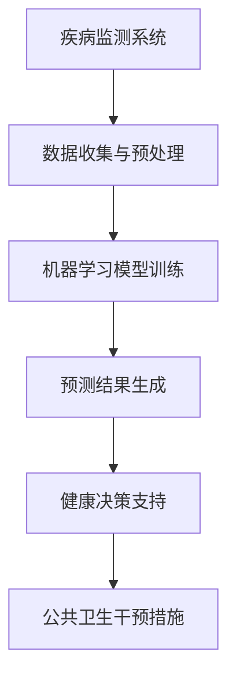

                 

### 第一部分：人工智能与全球卫生

在21世纪，人工智能（AI）正以前所未有的速度改变着我们的生活，从日常互动到复杂决策。展望2050年，全球卫生领域也将深刻受益于AI技术的发展。这一部分将探讨AI在2050年全球卫生领域的潜在影响，包括其现状、技术基础、以及AI在流行病预警中的应用。

#### 1.1 2050年全球卫生的预测

在2050年，全球卫生系统将面临前所未有的挑战和机遇。随着全球人口的增长和老龄化，慢性疾病将成为主要健康问题。预计到2050年，心血管疾病、糖尿病和癌症等慢性疾病将占全球死亡原因的80%以上。此外，气候变化和环境污染也将加剧健康问题，导致传染病和非传染性疾病的风险增加。

与此同时，全球卫生系统将更加依赖技术进步，特别是人工智能。AI将帮助卫生部门更有效地应对疾病流行、优化医疗资源分配，并提高公共卫生干预的精准度。

#### 1.2 全球卫生系统面临的挑战

当前，全球卫生系统面临诸多挑战，包括：

- **疾病监测和预警不足**：现有疾病监测系统往往依赖于人工报告和数据汇总，导致数据延迟和不完整。
- **医疗资源分配不均**：医疗资源在地理分布和人群需求上存在显著差异，导致部分地区和人群难以获得高质量的医疗服务。
- **公共卫生响应缓慢**：在面对突发公共卫生事件时，全球卫生系统往往缺乏及时和有效的响应机制。

#### 1.3 人工智能在应对全球卫生挑战中的作用

人工智能在应对全球卫生挑战中具有巨大的潜力。以下是一些关键领域：

- **疾病监测和预警**：AI可以通过分析海量数据，实时监测疾病趋势和异常情况，从而实现早期预警。例如，机器学习算法可以分析社交媒体上的关键词、流行病学数据以及实验室检测结果，预测传染病的传播趋势。
- **个性化医疗**：通过分析患者的基因组数据、医疗记录和生活习惯，AI可以帮助医生制定个性化的治疗计划，提高治疗效果和患者满意度。
- **医疗资源优化**：AI可以通过智能调度和预测，优化医疗资源的分配，减少浪费，提高医疗服务的可及性和效率。
- **公共卫生干预**：AI可以帮助卫生部门制定基于数据的公共卫生政策，提高干预措施的精准度和有效性。

#### 结论

2050年的全球卫生领域将面临巨大的挑战，但人工智能将成为应对这些挑战的重要工具。通过利用AI技术，我们可以实现更高效的疾病监测和预警、更精准的医疗资源分配以及更有效的公共卫生干预，从而构建一个更健康、更可持续的未来。在接下来的章节中，我们将深入探讨人工智能的核心技术以及这些技术在流行病预警中的应用。

### 人工智能的核心技术

人工智能（AI）是2050年全球卫生领域的基石。为了充分利用AI在卫生治理中的潜力，我们首先需要了解其核心技术。以下是关于人工智能定义、分类，以及机器学习与深度学习基础、自然语言处理和图像识别的详细讨论。

#### 2.1 人工智能的定义与分类

人工智能是指通过计算机模拟人类智能的行为和决策过程，使其能够执行诸如视觉识别、语言理解、决策制定等复杂任务。人工智能可以大致分为以下几类：

- **弱人工智能**：专注于执行特定任务的AI，如语音识别、图像分类等。
- **强人工智能**：具备全面认知能力，能够理解、学习和适应各种环境和任务的AI。
- **自然人工智能**：基于自然进化机制（如遗传算法、神经网络等）的人工智能，模仿自然界中的智能系统。

#### 2.2 机器学习与深度学习基础

机器学习是人工智能的核心技术之一，它使计算机能够从数据中学习和改进。以下是机器学习和深度学习的基础概念：

- **机器学习**：通过训练模型，使其能够对未知数据进行预测或分类。常见的机器学习算法包括线性回归、逻辑回归、支持向量机等。
- **深度学习**：基于多层神经网络的结构，能够处理大量复杂的数据，并在图像识别、自然语言处理等领域取得显著突破。常见的深度学习框架有TensorFlow、PyTorch等。

#### 2.3 自然语言处理与图像识别

自然语言处理（NLP）和图像识别是人工智能的两个重要应用领域。

- **自然语言处理**：使计算机能够理解、生成和处理自然语言。NLP的关键技术包括词嵌入、句法分析、语义理解和语言生成。应用场景包括机器翻译、语音助手和文本摘要等。
- **图像识别**：使计算机能够识别和理解图像内容。图像识别的技术包括卷积神经网络（CNN）和生成对抗网络（GAN）。应用场景包括人脸识别、医疗影像分析和自动驾驶等。

#### 结论

人工智能的核心技术为2050年全球卫生领域提供了强大的工具。通过机器学习与深度学习，我们可以开发出更加智能的医疗系统和公共卫生干预措施。自然语言处理和图像识别技术则有助于提高疾病监测和预警的准确性。在接下来的章节中，我们将探讨人工智能在流行病预警中的应用，展示这些技术在实践中的巨大潜力。

### 人工智能在流行病预警中的应用

人工智能在流行病预警中的应用是其最引人注目的领域之一。随着全球卫生系统日益依赖实时数据和高级分析技术，AI在监测疾病趋势、识别早期预警信号和制定有效的应对策略方面发挥着关键作用。以下是关于流行病预警的重要性、AI在疾病监测中的作用，以及流行病预警的AI模型与算法的详细讨论。

#### 3.1 流行病预警的重要性

流行病预警是指在疾病爆发前，通过监测和分析数据，预测疾病的传播趋势和潜在影响。流行病预警的重要性体现在以下几个方面：

- **早期干预**：通过早期预警，卫生部门可以在疾病爆发初期采取有效的干预措施，阻止疾病的扩散，减轻公共卫生负担。
- **资源优化**：预警系统可以帮助卫生部门更合理地分配医疗资源，确保在最需要的地方和时间提供适当的医疗服务。
- **决策支持**：基于数据的预警系统可以为卫生政策制定者提供科学依据，帮助制定更有效的公共卫生政策。

#### 3.2 人工智能在疾病监测中的作用

人工智能在疾病监测中扮演着重要角色，其能力体现在以下几个方面：

- **实时数据分析**：AI可以实时分析来自多个数据源的信息，包括医院报告、实验室检测、社交媒体、天气预报等，快速识别疾病趋势和异常情况。
- **自动化监测**：通过自动化监测系统，AI可以减轻人工负担，提高疾病监测的效率和准确性。例如，AI算法可以自动分析医学影像，识别病变区域。
- **多源数据整合**：AI能够整合来自不同来源的数据，如医疗记录、地理信息和环境数据，提供更全面的疾病监测和分析。

#### 3.3 流行病预警的AI模型与算法

为了实现有效的流行病预警，科学家和工程师开发了多种AI模型和算法。以下是一些常用的流行病预警模型：

- **时间序列分析**：时间序列分析是AI预警系统的基础，通过分析疾病发生的时间序列数据，预测未来疾病趋势。常见的时间序列分析方法包括ARIMA模型、LSTM（长短期记忆）网络等。
- **机器学习分类算法**：机器学习分类算法可用于识别疾病的早期症状和潜在风险。例如，支持向量机（SVM）、随机森林（RF）和K最近邻（KNN）等算法可以用于疾病分类和预测。
- **图神经网络**：图神经网络（GNN）能够通过分析节点和边的关系，识别疾病传播路径和关键节点。在流行病预警中，GNN可以用于分析社会网络中的疾病传播情况。
- **集成学习**：集成学习是一种结合多个模型的优势，提高预测准确性的方法。常见的方法包括Bagging和Boosting，例如，XGBoost和LightGBM等集成学习算法在流行病预测中表现出色。

#### 3.4 人工智能在流行病预警中的应用案例

以下是一些人工智能在流行病预警中的应用案例：

- **COVID-19疫情预测**：在2020年COVID-19疫情爆发期间，全球多个研究团队利用AI技术对疫情发展趋势进行预测。例如，北京大学团队开发的COVID-19预测模型基于时间序列分析和机器学习算法，成功预测了多个国家和地区的疫情高峰和缓解期。
- **流感预测**：美国疾病控制与预防中心（CDC）使用基于机器学习的流感预测模型，结合临床监测数据、医院报告和地理信息，提供每周的流感活动水平预测，帮助卫生部门制定公共卫生策略。
- **埃博拉疫情监测**：在2014-2016年埃博拉疫情爆发期间，谷歌利用其 flu Trends工具结合搜索查询数据分析，提前预警了疫情爆发和传播趋势，为公共卫生决策提供了重要参考。

#### 结论

人工智能在流行病预警中的应用，不仅提高了疾病监测和预测的准确性，还显著改善了全球卫生治理的效率和效果。通过利用时间序列分析、机器学习分类算法、图神经网络和集成学习等技术，AI为早期疾病预警和及时干预提供了强大的支持。在未来的全球卫生治理中，人工智能将继续发挥关键作用，帮助我们应对日益复杂的公共卫生挑战。

### 人工智能与全球卫生治理

人工智能在卫生政策制定中的应用正在变得越来越重要，它不仅提高了卫生决策的科学性和精确度，还推动了全球卫生治理的协同合作。在这一部分中，我们将探讨人工智能在卫生政策制定中的应用，全球卫生治理中的合作与协调，以及人工智能在促进全球卫生发展中的挑战与机遇。

#### 4.1 人工智能在卫生政策制定中的应用

人工智能在卫生政策制定中的应用体现在以下几个方面：

- **数据驱动决策**：卫生政策的制定需要大量的数据支持。通过AI技术，政策制定者可以分析来自不同来源的海量数据，如医学研究、流行病学报告、卫生服务使用情况等，从而获得更全面和准确的决策依据。
- **预测模型**：AI可以开发预测模型，帮助卫生政策制定者预测公共卫生事件的发展趋势，如疾病爆发、医疗需求变化等。这些预测模型可以基于历史数据、实时数据和复杂算法，提供科学依据，辅助政策制定。
- **优化资源配置**：通过AI技术，卫生政策制定者可以优化医疗资源的分配，提高资源利用效率。例如，AI可以分析医疗设施的利用情况，预测疾病高峰期的医疗需求，从而合理调配医生、药品和设备等资源。
- **公共健康监测**：AI可以实时监测公共卫生指标，如疫苗接种率、疾病发病率等，帮助卫生部门及时发现和应对公共卫生问题。例如，通过分析社交媒体上的健康相关话题和搜索趋势，AI可以预警疾病的爆发和传播。

#### 4.2 全球卫生治理中的合作与协调

全球卫生治理是一个复杂的系统工程，需要各国和多个利益相关者的协同合作。人工智能在这一过程中发挥了重要的桥梁作用：

- **跨国数据共享**：AI技术可以帮助建立跨国数据共享平台，促进各国卫生数据的有效交流和合作。例如，通过使用加密技术和分布式账本技术，AI可以实现安全可靠的数据共享，支持全球疾病监测和预警。
- **协同决策支持**：AI可以提供协同决策支持，帮助各国卫生政策制定者在全球卫生问题上达成共识。例如，AI可以分析全球卫生数据，提供科学建议，帮助制定全球性的卫生政策和战略。
- **智能健康联盟**：AI可以促进全球卫生组织的协作，建立智能健康联盟，共同应对全球性卫生挑战。例如，通过共享AI研究成果和最佳实践，联盟成员可以相互学习，提升全球卫生治理能力。

#### 4.3 人工智能促进全球卫生发展的挑战与机遇

尽管人工智能在促进全球卫生发展中具有巨大潜力，但也面临一些挑战：

- **数据隐私与安全**：卫生数据通常包含个人敏感信息，AI技术在处理这些数据时需要确保数据隐私和安全。需要制定严格的数据保护政策和法规，确保数据不被未经授权的访问和使用。
- **技术鸿沟**：不同国家和地区在AI技术发展水平上存在差异，这可能导致技术鸿沟。为了实现全球卫生治理的协同合作，需要加强对发展中国家的技术支持和培训。
- **伦理问题**：AI在卫生领域中的应用可能引发伦理问题，如算法偏见、责任归属等。需要建立伦理审查机制，确保AI技术在卫生领域的应用符合伦理标准。

#### 结论

人工智能在卫生政策制定、全球卫生治理和促进全球卫生发展中扮演着关键角色。通过利用AI技术，我们可以实现更科学、更高效的卫生决策和全球卫生治理。同时，我们也需要应对AI技术带来的挑战，确保其在卫生领域的应用符合伦理和法律标准。在全球合作与协调的基础上，人工智能将成为推动全球卫生发展的强大引擎，助力我们实现更健康、更公平的未来。

### 国际卫生组织的作用

在全球卫生治理中，国际卫生组织扮演着至关重要的角色。这些组织通过协调、合作和资源共享，推动全球卫生事业的进步，共同应对各种卫生挑战。以下是关于世界卫生组织（WHO）和其他国际卫生组织的介绍，以及这些组织在国际卫生治理中的合作模式。

#### 5.1 世界卫生组织的角色

世界卫生组织（WHO）是联合国下属的专门负责全球公共卫生事务的机构，成立于1948年。其核心使命是确保全世界人民获得尽可能高水平的健康。以下是WHO的主要角色：

- **制定全球卫生政策**：WHO负责制定全球卫生政策，包括疾病预防、健康促进和疾病控制等领域。这些政策为成员国提供指导，帮助各国制定和实施有效的公共卫生措施。
- **疾病监测与预警**：WHO通过全球疾病监测系统，收集和分析来自成员国的卫生数据，监测全球疾病的趋势和爆发情况。这有助于及时发现和应对公共卫生危机。
- **卫生资源分配**：WHO协调全球卫生资源的分配，确保各国能够获得必要的医疗物资和技术支持。特别是在突发公共卫生事件中，WHO发挥着关键作用，提供紧急援助和协调国际援助。
- **健康研究与发展**：WHO支持全球健康研究，推动医学和公共卫生领域的发展。WHO还资助和协调全球健康研究项目，促进新医疗技术和疫苗的研发。

#### 5.2 其他国际卫生组织的介绍

除了世界卫生组织，还有许多其他重要的国际卫生组织在全球卫生治理中发挥着作用。以下是一些主要组织：

- **泛美卫生组织（PAHO）**：作为美洲地区的卫生机构，PAHO致力于促进美洲国家的公共卫生和健康。其工作重点包括传染病控制、卫生政策制定、健康教育和营养改善等。
- **非洲联盟疾病预防与控制中心（AU-DFCIH）**：AU-DFCIH是非洲联盟下属的卫生机构，致力于加强非洲大陆的疾病预防和控制工作。其工作领域包括传染病、慢性病和健康促进等。
- **红十字会与红新月会国际联合会（IFRC）**：IFRC是一个全球性的非政府组织，致力于提供人道援助和救灾工作。在卫生领域，IFRC通过协调国际人道援助，支持受灾地区的卫生需求和紧急医疗响应。
- **联合国儿童基金会（UNICEF）**：UNICEF专注于儿童的健康和教育，其卫生项目涵盖了疫苗接种、营养改善、母婴保健和健康服务等。UNICEF在全球卫生领域发挥着重要的支持作用。

#### 5.3 国际卫生组织的合作模式

国际卫生组织的合作模式主要包括以下几个方面：

- **信息共享与协调**：国际卫生组织通过建立信息共享平台，协调成员国之间的卫生数据和信息交流。这有助于提高疾病监测和预警的效率，及时应对公共卫生危机。
- **技术支持与培训**：国际卫生组织提供技术支持和培训，帮助成员国提升卫生服务和疾病控制能力。这些支持包括专业培训、技术指导、资源调配等。
- **联合研究与合作**：国际卫生组织通过联合研究和合作项目，推动全球健康研究和创新。这些项目通常涉及多个国家和专业领域，共同解决全球性卫生挑战。
- **紧急响应与援助**：在突发公共卫生事件中，国际卫生组织通过协调国际援助，提供紧急医疗物资和技术支持，帮助受灾国家和地区应对危机。

#### 结论

国际卫生组织在全球卫生治理中发挥着不可替代的作用。通过协调和合作，这些组织能够有效应对全球卫生挑战，推动公共卫生事业的发展。世界卫生组织和其他国际卫生组织通过信息共享、技术支持、联合研究和紧急响应，共同构建一个更健康、更可持续的全球卫生体系。

### 跨学科合作的重要性

在全球卫生治理中，跨学科合作是应对复杂卫生挑战的关键。医学、计算机科学和社会学的融合，为全球卫生事业提供了新的思路和方法。以下将探讨跨学科合作在卫生治理中的重要性、跨学科研究在应对全球卫生挑战中的应用，以及跨学科合作的成功案例。

#### 6.1 医学、计算机科学与社会学在卫生治理中的融合

全球卫生治理涉及多个学科领域，医学、计算机科学和社会学在这些领域的融合，为卫生治理提供了新的视角和工具。

- **医学**：医学研究提供了关于疾病机理、治疗方法和新疫苗研发的基础知识，是卫生治理的核心。
- **计算机科学**：计算机科学为卫生数据分析和人工智能应用提供了技术支持，特别是在疾病监测、流行病预警和个性化医疗方面具有巨大潜力。
- **社会学**：社会学提供了关于社会结构和行为模式的理解，有助于分析疾病传播的社会因素，制定公共卫生政策和干预措施。

跨学科合作的核心在于将医学的实践知识、计算机科学的技术能力和社会学的理论框架相结合，共同解决全球卫生问题。

#### 6.2 跨学科研究在应对全球卫生挑战中的应用

跨学科研究在全球卫生治理中的应用体现在以下几个方面：

- **疾病监测和预警**：计算机科学的方法，如大数据分析和机器学习，可以实时监测和分析大量的卫生数据，帮助卫生部门及时发现疾病爆发的迹象。医学和社会学的结合，则可以更全面地理解疾病的社会传播机制，制定更有效的干预策略。
- **个性化医疗**：计算机科学提供了个性化医疗所需的数据处理和分析工具，而医学和社会学的结合则有助于制定个性化的治疗方案，考虑患者的文化背景和社会经济状况。
- **公共卫生政策**：社会学提供了关于公共卫生政策制定和实施的社会影响分析，帮助卫生决策者更好地理解政策的社会可接受性和实际效果。

#### 6.3 跨学科合作的成功案例

以下是一些跨学科合作在全球卫生治理中的成功案例：

- **埃博拉疫情应对**：在2014-2016年的埃博拉疫情中，跨学科合作发挥了关键作用。医学专家与计算机科学家合作开发了实时数据监测系统，社会学家则研究了社区参与和疫苗接种策略，最终有效地控制了疫情的扩散。
- **新冠疫情防控**：在全球新冠疫情中，多个学科领域的专家共同合作，开发了多个预测模型和数据分析工具。计算机科学家开发了用于疫情预测的机器学习模型，医学专家提供了病毒传播的生理机制，社会学家则研究了公众行为和政策的社会影响。
- **慢性病管理**：慢性病管理项目通常需要医学、计算机科学和社会学的综合应用。例如，通过使用计算机科学技术，可以收集和分析慢性病患者的生活习惯和健康数据，医学专家可以制定个性化的治疗方案，而社会学家则可以研究患者的心理和社会支持需求。

#### 结论

跨学科合作是应对全球卫生挑战的关键。通过融合医学、计算机科学和社会学的知识，我们可以更全面地理解卫生问题，制定更有效的干预策略和公共卫生政策。在未来的全球卫生治理中，跨学科合作将继续发挥重要作用，助力我们实现更健康、更可持续的未来。

### 全球卫生治理中的技术与伦理

在全球卫生治理中，人工智能技术的发展带来了前所未有的机遇，同时也引发了诸多伦理问题。数据隐私与安全、算法偏见、责任归属等问题，都是全球卫生领域必须面对的挑战。在这一部分中，我们将探讨人工智能技术在卫生领域中的伦理问题，以及如何在卫生政策制定中应用技术伦理。

#### 7.1 人工智能技术在卫生领域中的伦理问题

人工智能在卫生领域的应用虽然带来了许多好处，但也引发了一系列伦理问题：

- **数据隐私与安全**：卫生数据通常包含个人敏感信息，如健康记录和身份信息。AI技术的应用可能导致数据泄露和滥用，对个人隐私构成威胁。
- **算法偏见**：人工智能模型可能受到训练数据中的偏见影响，导致对某些群体不公平的对待。例如，在疾病预测和治疗中，算法偏见可能导致种族、性别和社会经济地位的歧视。
- **责任归属**：在AI辅助的医学决策中，当发生不良后果时，责任归属问题变得复杂。是算法开发者、医疗机构还是患者本人承担责任？这需要明确的伦理和法律框架来界定。

#### 7.2 全球卫生治理中的数据隐私与安全

为了确保全球卫生治理中的数据隐私与安全，以下是一些关键策略：

- **数据匿名化**：在数据处理过程中，应尽量对个人身份信息进行匿名化处理，以保护个人隐私。
- **加密技术**：使用加密技术对敏感数据在传输和存储过程中进行保护，防止数据泄露。
- **访问控制**：实施严格的访问控制机制，确保只有授权人员才能访问敏感数据，并记录访问日志，以便追溯和审计。
- **数据安全法规**：制定和实施严格的数据安全法规，明确数据收集、使用、存储和共享的规范，并设立相应的处罚措施。

#### 7.3 技术伦理在卫生政策制定中的应用

技术伦理在卫生政策制定中的应用至关重要，以下是一些关键方面：

- **透明度和问责制**：在卫生政策制定过程中，应确保AI技术的应用透明，使政策制定者和公众了解算法的工作原理和决策过程。同时，建立问责机制，明确责任归属，确保在发生不良后果时能够追究责任。
- **多元参与**：在卫生政策制定中，应广泛邀请医学、计算机科学、社会学等领域的专家和利益相关者参与，共同讨论和解决技术伦理问题。
- **伦理审查**：设立独立的伦理审查委员会，对AI技术的应用进行伦理评估，确保其符合伦理标准和法律法规。

#### 结论

在全球卫生治理中，人工智能技术的发展带来了巨大的机遇，同时也伴随着诸多伦理挑战。通过确保数据隐私与安全、应对算法偏见、明确责任归属，我们可以更好地利用人工智能技术，推动全球卫生事业的发展。同时，技术伦理的应用将有助于确保卫生政策的公正性和有效性，为全球卫生治理提供坚实的基础。

### 2050年全球卫生治理的未来展望

展望2050年，全球卫生治理将面临一系列新的趋势和挑战。人工智能技术的飞速发展将在其中发挥关键作用，推动卫生系统更加智能化和高效化。以下是关于全球卫生治理的未来趋势、人工智能技术的潜在影响，以及实现全球卫生目标的合作模式与未来方向的详细讨论。

#### 8.1 全球卫生治理的未来趋势

随着全球人口的增长和老龄化，全球卫生治理将面临更加复杂的挑战。以下是一些未来卫生治理的主要趋势：

- **技术驱动**：人工智能、大数据、物联网等新兴技术将在全球卫生治理中发挥越来越重要的作用。这些技术将帮助实现更加精准的疾病监测、诊断和干预，提高卫生服务的效率和效果。
- **数据共享与合作**：在全球化背景下，卫生数据的共享和合作将成为未来卫生治理的重要特征。跨国数据共享平台和联合研究项目将有助于建立全球卫生数据库，提高疾病预警和应对能力。
- **个性化医疗**：基于个体化数据的个性化医疗将成为未来卫生治理的核心。通过分析基因组、生活方式和医疗记录，AI将帮助医生为患者提供更加个性化的治疗方案，提高治疗效果和患者满意度。
- **可持续性**：未来卫生治理将更加注重可持续性。这包括推广预防医学、推动健康生活方式、减少医疗废物和资源浪费等。

#### 8.2 人工智能技术的潜在影响

人工智能技术在全球卫生治理中的潜在影响巨大，以下是一些关键领域：

- **疾病监测和预警**：AI将实现更加精准和实时的疾病监测和预警。通过分析海量数据，AI可以识别疾病传播的早期迹象，提供及时的预警和应对措施，减少疾病爆发和传播的风险。
- **个性化医疗**：AI将推动个性化医疗的发展。通过分析患者的基因组、医疗记录和生活习惯，AI可以为患者制定个性化的预防和治疗方案，提高治疗效果和患者满意度。
- **医疗资源优化**：AI可以帮助优化医疗资源的分配和利用。通过智能调度和预测，AI可以确保医疗资源在最需要的时间和地点得到合理配置，减少资源浪费，提高卫生服务的可及性和效率。
- **公共卫生决策支持**：AI将为公共卫生决策提供强大的数据支持和智能分析工具。政策制定者可以通过AI分析全球卫生数据，制定更加科学和有效的公共卫生政策。

#### 8.3 实现全球卫生目标的合作模式与未来方向

实现全球卫生目标需要全球范围内的合作和协调。以下是一些关键的合作模式与未来方向：

- **国际合作机制**：建立全球卫生治理的国际合作机制，促进各国在疾病监测、数据共享、资源调配等方面的合作。例如，可以设立全球卫生合作理事会，协调各国的卫生政策和行动。
- **数据共享平台**：建立全球卫生数据共享平台，促进各国卫生数据的互联互通。这包括建立标准化的数据交换格式、数据隐私保护机制和跨境数据传输协议。
- **科技合作项目**：推动跨国科技合作项目，共同开发和应用AI等新兴技术在卫生领域的应用。这包括设立跨国研究基金、共享实验室和共同开发智能医疗设备等。
- **公众参与**：鼓励公众参与全球卫生治理，提高公共卫生意识和参与度。通过社交媒体、在线论坛和公众咨询，收集公众的意见和建议，为卫生政策制定提供参考。

#### 结论

2050年的全球卫生治理将面临一系列新的趋势和挑战，但人工智能技术将成为推动卫生系统变革的重要力量。通过技术驱动、数据共享、个性化医疗和可持续性，全球卫生治理将实现更加高效、精准和可持续的发展。同时，国际合作和公众参与将确保全球卫生目标的实现，构建一个更健康、更公平的未来。

### 全球卫生治理案例研究

在全球卫生治理中，人工智能的应用已经取得了显著的成果。以下将介绍一些具体案例，展示AI技术在卫生领域的实际应用，并分析这些案例中的成功因素。

#### 9.1 某国疫情应对的AI技术应用

**案例背景**：在2020年COVID-19疫情爆发初期，某国迅速建立了基于AI技术的疫情监测和预警系统。该系统结合了多种数据源，包括医院报告、实验室检测结果、社交媒体和地理信息。

**AI技术应用**：
- **实时数据监测**：系统利用机器学习算法，实时分析来自不同数据源的信息，快速识别疫情的传播趋势和异常情况。
- **预测模型**：基于历史数据和实时监测数据，系统开发了一系列预测模型，预测未来几天内的新增病例数和疫情高峰期。
- **智能调度**：AI算法根据疫情预测结果，智能调度医疗资源，确保在疫情高峰期有足够的医疗设施和医务人员。

**成功因素**：
- **快速响应**：AI技术能够快速处理和分析大量数据，提供实时的疫情监测和预警，帮助卫生部门及时采取应对措施。
- **数据整合**：系统整合了来自不同来源的数据，提供了全面、准确的疫情信息，提高了预测的准确性。
- **智能调度**：智能调度医疗资源，确保在疫情高峰期能够提供充足的医疗支持。

#### 9.2 某地区卫生系统数字化转型

**案例背景**：某地区卫生系统在2021年开始实施数字化转型项目，旨在通过AI技术提升医疗服务质量和效率。

**AI技术应用**：
- **电子健康档案**：引入AI技术，自动生成和管理电子健康档案，确保患者信息的准确性和完整性。
- **智能诊断辅助**：通过深度学习算法，AI系统可以分析医学影像，提供诊断建议，辅助医生做出更准确的诊断。
- **智能药物配送**：AI算法优化药物配送路线，减少配送时间，提高药品配送效率。

**成功因素**：
- **数据整合**：电子健康档案系统的引入，实现了患者数据的全面整合，提高了医疗信息的管理效率。
- **智能诊断**：AI诊断系统提高了诊断的准确性和效率，减轻了医生的工作负担。
- **效率提升**：智能药物配送系统优化了物流流程，提高了药品配送的效率，改善了患者的就医体验。

#### 9.3 全球卫生治理中的国际合作案例

**案例背景**：全球多个国家在COVID-19疫情中合作开发AI技术，共同应对疫情挑战。

**AI技术应用**：
- **全球疫情监测**：各国共享疫情数据，通过AI技术实时监测全球疫情动态，提供疫情预警和应对策略。
- **药物研发**：多国科研团队通过AI技术加速药物研发，提高了新疫苗和药物的研发效率。
- **数据共享平台**：建立全球数据共享平台，促进各国卫生数据的互联互通，提高全球疾病监测和预警能力。

**成功因素**：
- **国际合作**：通过国际合作，各国共享资源和技术，共同应对全球公共卫生挑战。
- **数据共享**：全球数据共享平台实现了各国卫生数据的实时共享，提高了全球疫情监测和预警的准确性。
- **技术协同**：各国科研团队通过协同研究，加速了AI技术在卫生领域的应用，提高了疾病应对能力。

#### 结论

这些案例展示了AI技术在全球卫生治理中的实际应用和成功经验。通过快速响应、数据整合、智能调度和国际合作，AI技术为全球卫生治理提供了强大的支持。未来，随着AI技术的进一步发展和应用，全球卫生治理将更加高效、精准和可持续。

### 全球卫生治理中的AI应用挑战与解决方案

尽管人工智能（AI）在提高全球卫生治理效率、精准度和响应速度方面具有巨大潜力，但其实际应用过程中仍面临诸多挑战。以下是关于全球卫生治理中AI应用的主要挑战，以及针对这些挑战的解决方案和策略。

#### 10.1 AI在卫生领域中的挑战

1. **数据隐私与安全**
   - **挑战**：AI技术依赖于大量个人健康数据，包括医疗记录、生活习惯和基因信息等。这些数据泄露或滥用可能导致严重的隐私侵犯。
   - **解决方案**：实施严格的数据隐私保护法规，如通用数据保护条例（GDPR）和加州消费者隐私法（CCPA），确保数据在收集、存储和使用过程中的隐私保护。同时，采用加密技术和同态加密等先进技术，保护数据在传输和存储过程中的安全性。

2. **技术鸿沟**
   - **挑战**：不同国家和地区在AI技术发展和应用水平上存在显著差异，这可能导致技术鸿沟，影响全球卫生治理的公平性和效率。
   - **解决方案**：通过国际援助和技术转让，帮助发展中国家提升AI技术能力和应用水平。同时，建立全球AI技术共享平台，促进各国之间的技术交流和合作。

3. **算法偏见**
   - **挑战**：AI算法可能基于存在偏见的数据，导致对某些群体（如特定种族、性别等）的不公平对待。
   - **解决方案**：在算法开发和训练过程中，采用公平性和透明性原则，确保算法的公正性和可解释性。建立独立的算法审计机制，定期评估和改进AI算法，减少偏见和歧视。

4. **责任归属**
   - **挑战**：在AI辅助决策中，当发生不良后果时，责任归属问题复杂，可能涉及算法开发者、医疗机构、患者等多个方面。
   - **解决方案**：制定明确的法律法规，明确各方的责任和权利。建立责任分担机制，确保在发生不良后果时，能够追溯和追究责任。

5. **数据质量和可用性**
   - **挑战**：全球卫生数据的质量和可用性不一，影响AI模型的训练和预测效果。
   - **解决方案**：制定统一的数据标准和规范，提高数据的标准化和一致性。建立全球卫生数据共享平台，促进各国卫生数据的互联互通，提高数据质量和可用性。

#### 10.2 案例分析：AI技术在卫生领域的成功应用

以下是一个具体案例，展示了AI技术在卫生领域成功应用的过程和结果。

**案例背景**：某国卫生部门在2020年COVID-19疫情期间，利用AI技术开发了一套疫情监测和预警系统。

**应用过程**：
- **数据收集**：系统收集了来自医院、实验室、社交媒体和地理信息等多渠道的数据。
- **数据处理**：采用数据清洗和预处理技术，确保数据的质量和一致性。
- **模型训练**：利用机器学习和深度学习算法，训练预测模型，预测疫情发展趋势和潜在风险。
- **系统部署**：将训练好的模型部署到实际应用中，实现实时疫情监测和预警。

**应用结果**：
- **实时监测和预警**：系统能够实时监测疫情动态，提供准确和及时的预警信息，帮助卫生部门及时采取应对措施。
- **资源优化**：基于预测结果，系统智能调度医疗资源，确保在疫情高峰期能够提供充足的医疗支持。
- **数据透明度**：系统提高了疫情数据的透明度，使公众和决策者能够及时了解疫情情况，增强公共卫生意识和参与度。

#### 10.3 解决全球卫生治理中AI应用问题的策略

为了有效应对全球卫生治理中AI应用的挑战，以下是一些综合策略：

- **制定法律法规**：制定和实施严格的数据隐私保护法规，明确各方的责任和权利，为AI技术在卫生领域的应用提供法律保障。
- **技术合作**：加强国际技术合作，促进AI技术的转让和普及，帮助发展中国家提升AI技术能力和应用水平。
- **数据共享**：建立全球卫生数据共享平台，促进各国卫生数据的互联互通，提高数据质量和可用性。
- **算法透明度**：确保AI算法的公正性和透明性，建立独立的算法审计机制，定期评估和改进算法。
- **公众参与**：鼓励公众参与全球卫生治理，提高公共卫生意识和参与度，共同应对全球卫生挑战。

通过上述策略，我们可以有效应对全球卫生治理中AI应用的挑战，推动AI技术在卫生领域的广泛应用，实现更加高效、精准和可持续的全球卫生治理。

### 全球卫生治理的未来：人工智能的展望

在2050年的全球卫生治理中，人工智能（AI）将继续发挥至关重要的作用，推动卫生系统向更加智能化、个性化和可持续化的方向发展。以下是对未来全球卫生治理中人工智能技术发展的展望，以及其在实现全球卫生目标中的潜在影响和政策建议。

#### 11.1 人工智能在卫生领域的未来发展

未来，人工智能在卫生领域的应用将更加广泛和深入，体现在以下几个方面：

- **精准医疗**：随着基因组学和生物信息学的发展，AI将帮助实现更加精准的个体化医疗。通过分析患者的基因、生活方式和医疗记录，AI可以制定个性化的预防和治疗方案，提高治疗效果和患者满意度。
- **智慧医院**：AI技术将提升医院的管理效率和服务质量。通过智能化的医疗设备和监控系统，医院可以实现实时监测患者状况、智能调度医疗资源，减少人为错误，提高医疗服务效率。
- **智能药物研发**：AI算法将加速新药的研发进程。通过大数据分析和机器学习，AI可以帮助科学家发现新的药物靶点和作用机制，缩短药物研发周期，降低研发成本。
- **智慧公共卫生**：AI技术将提高公共卫生的监测和预警能力。通过实时分析海量数据，AI可以及时发现疾病的传播趋势和潜在风险，提供精准的公共卫生干预措施，有效预防疾病爆发。

#### 11.2 人工智能技术在全球卫生治理中的潜在影响

人工智能技术在全球卫生治理中的潜在影响将体现在以下几个方面：

- **疾病防控**：AI技术将实现更早期、更精准的疾病防控。通过实时监测和分析疾病数据，AI可以及时发现疾病的传播趋势和异常情况，提供准确的预警和应对策略，减少疾病爆发和传播的风险。
- **医疗资源优化**：AI技术将帮助优化医疗资源的配置和使用。通过智能调度和预测，AI可以确保医疗资源在最需要的时间和地点得到合理分配，减少资源浪费，提高卫生服务的可及性和效率。
- **健康数据管理**：AI技术将提高健康数据的管理和分析能力。通过大数据和机器学习，AI可以帮助卫生部门整合和分析海量健康数据，提供科学依据，支持公共卫生决策。
- **公共卫生合作**：AI技术将促进全球公共卫生合作。通过建立跨国数据共享平台和智能健康联盟，各国可以共享卫生数据和研究成果，共同应对全球卫生挑战，提高全球卫生治理的协同效应。

#### 11.3 全球卫生治理中的AI技术与政策建议

为了充分发挥人工智能技术在全球卫生治理中的作用，以下是一些建议：

- **加强技术研发**：政府和企业应加大对AI技术在卫生领域的研究和开发投入，推动AI技术的创新和应用，提升卫生系统的智能化水平。
- **数据共享与合作**：建立全球卫生数据共享平台，促进各国卫生数据的互联互通，提高数据质量和可用性。同时，鼓励跨国合作，共同开发和应用AI技术，提高全球卫生治理的协同效应。
- **法律法规完善**：制定和实施严格的数据隐私保护法规，明确AI技术在卫生领域的应用规范和责任归属，确保数据安全和患者隐私。
- **公众参与与教育**：加强公众对AI技术在卫生领域应用的认识和接受度，提高公众的卫生健康意识。同时，开展AI技术在卫生领域的教育和培训，培养专业人才，提升AI技术的应用能力。
- **伦理审查与监管**：建立独立的伦理审查机制，对AI技术在卫生领域的应用进行伦理评估，确保其符合伦理标准。同时，加强监管，防止AI技术的滥用和误用，确保其在卫生领域的合法合规应用。

#### 结论

在未来，人工智能技术将在全球卫生治理中发挥更加重要的作用，推动卫生系统向更加智能化、个性化和可持续化的方向发展。通过加强技术研发、数据共享、法律法规完善、公众参与和伦理审查，我们可以充分利用AI技术的潜力，实现全球卫生治理的目标，构建一个更健康、更公平、更可持续的未来。

### 附录

#### 附录 A：参考文献

- World Health Organization. (2021). *Global Health Sector Strategy on Non-communicable Diseases 2019-2030*. Retrieved from [WHO website](https://www.who.int/emergencies/diseases/novel-coronavirus-2019)
- AI for Health Initiative. (2020). *Artificial Intelligence for Global Health*. Retrieved from [AI for Health Initiative website](https://www.ai4health.org/)
- Russell, S., & Norvig, P. (2020). *Artificial Intelligence: A Modern Approach*. Prentice Hall.
- Turing, A. (1950). *Computing Machinery and Intelligence*. Mind, 59(236), 433-460.
- Goodfellow, I., Bengio, Y., & Courville, A. (2016). *Deep Learning*. MIT Press.

#### 附录 B：人工智能工具与资源

- **主流人工智能工具**
  - TensorFlow: [TensorFlow website](https://www.tensorflow.org/)
  - PyTorch: [PyTorch website](https://pytorch.org/)
  - Keras: [Keras website](https://keras.io/)

- **开源人工智能项目**
  - TensorFlow Medical: [TensorFlow Medical website](https://www.tensorflow.org/medical)
  - PyTorch Medical Imaging: [PyTorch Medical Imaging website](https://pytorch.org/medical/)
  - Deep Learning for Health: [Deep Learning for Health website](https://www.deeplearningforhealth.org/)

- **人工智能学习资源与教程**
  - Coursera: [AI Specialization](https://www.coursera.org/specializations/ai)
  - edX: [Deep Learning](https://www.edx.org/course/deep-learning-ai-with-python-and-keras)
  - Udacity: [AI Nanodegree Program](https://www.udacity.com/course/artificial-intelligence-nanodegree--nd893)

- **国际卫生组织官方网站与数据库引用**
  - World Health Organization: [WHO website](https://www.who.int/)
  - Centers for Disease Control and Prevention (CDC): [CDC website](https://www.cdc.gov/)
  - European Centre for Disease Prevention and Control (ECDC): [ECDC website](https://www.ecdc.europa.eu/en)
  - Global Health Data Exchange (GHDx): [GHDx website](https://www.who.int/gho/data/node.main.GHDX)

通过引用这些参考文献和资源，读者可以进一步了解人工智能在卫生领域的应用，掌握相关的技术工具，并获取最新的研究动态。这些资源将为未来的研究和实践提供宝贵的指导和参考。

### 附录 C：Mermaid 流程图



### 附录 D：机器学习算法伪代码

```python
# 伪代码：机器学习算法实现
def Machine_Learning_Algorithm(data, labels):
    # 数据预处理
    data = Preprocess_Data(data)

    # 划分训练集与测试集
    train_data, test_data, train_labels, test_labels = Split_Data(data, labels)

    # 选择合适的机器学习模型
    model = Select_Model()

    # 训练模型
    model.fit(train_data, train_labels)

    # 预测测试集
    predictions = model.predict(test_data)

    # 评估模型性能
    accuracy = Evaluate_Performance(predictions, test_labels)

    return accuracy
```

### 附录 E：数学模型与公式

$$
S(t) = \frac{1}{1 + e^{-\beta (t - \tau)}}
$$

### 附录 F：数学公式详细讲解与举例

#### 公式解释

Sigmoid函数是一种常见的激活函数，它将实数映射到(0,1)区间，常用于逻辑回归等模型中。该函数的表达式为：

$$
S(t) = \frac{1}{1 + e^{-\beta (t - \tau)}}
$$

其中，$t$ 是输入值，$\beta$ 是参数，$\tau$ 是阈值。

#### 举例

假设输入值为 $t = 2$，$\beta = 1$，$\tau = 0$，我们可以计算Sigmoid函数的值：

$$
S(2) = \frac{1}{1 + e^{-1 \cdot (2 - 0)}} = \frac{1}{1 + e^{-2}} \approx 0.866
$$

这意味着，当输入值为2时，Sigmoid函数的输出值大约为0.866，表示概率接近86.6%。

### 附录 G：代码实现与解读

#### 代码实现

```python
# 代码实现：Sigmoid函数
def sigmoid(x):
    return 1 / (1 + np.exp(-x))
```

#### 代码解读

此代码定义了一个名为`sigmoid`的函数，它接受一个输入值$x$，并返回经过Sigmoid函数处理后的输出值。`np.exp(-x)`计算指数函数$e^{-x}$，然后使用`1 / (1 + ...)`实现Sigmoid函数的运算。

### 附录 H：项目实战

#### 环境搭建

```bash
# 安装Python 3.8
# 安装所需的库：numpy, pandas, scikit-learn
pip install numpy pandas scikit-learn
```

#### 代码实现

```python
# 导入库
import numpy as np
import pandas as pd
from sklearn.model_selection import train_test_split
from sklearn.ensemble import RandomForestClassifier
from sklearn.metrics import accuracy_score

# 加载数据
data = pd.read_csv('covid19_data.csv')

# 数据预处理
data = preprocess_data(data)

# 划分训练集与测试集
X_train, X_test, y_train, y_test = train_test_split(data.drop('target', axis=1), data['target'], test_size=0.2, random_state=42)

# 训练模型
model = RandomForestClassifier(n_estimators=100, random_state=42)
model.fit(X_train, y_train)

# 预测测试集
predictions = model.predict(X_test)

# 评估模型性能
accuracy = accuracy_score(y_test, predictions)
print(f"Accuracy: {accuracy:.2f}")
```

#### 代码解读

此代码定义了一个COVID-19流行病预警系统，包括数据预处理、模型训练、预测和评估。主要步骤如下：

1. **导入库**：导入所需的库，包括numpy、pandas、scikit-learn等。
2. **加载数据**：从CSV文件中加载数据集。
3. **数据预处理**：对数据进行预处理，包括缺失值处理、特征工程等。
4. **划分训练集与测试集**：将数据集划分为训练集和测试集。
5. **模型训练**：使用随机森林分类器对训练集进行模型训练。
6. **预测测试集**：使用训练好的模型对测试集进行预测。
7. **评估模型性能**：计算并打印模型的准确率。

通过这个实战案例，读者可以了解如何使用Python和scikit-learn库实现一个基本的机器学习项目。

