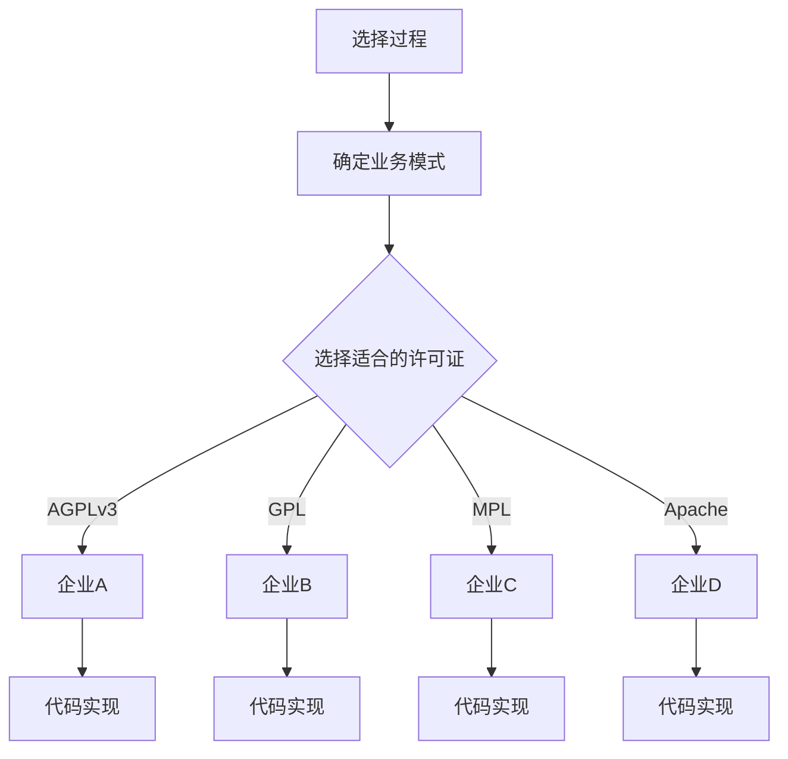
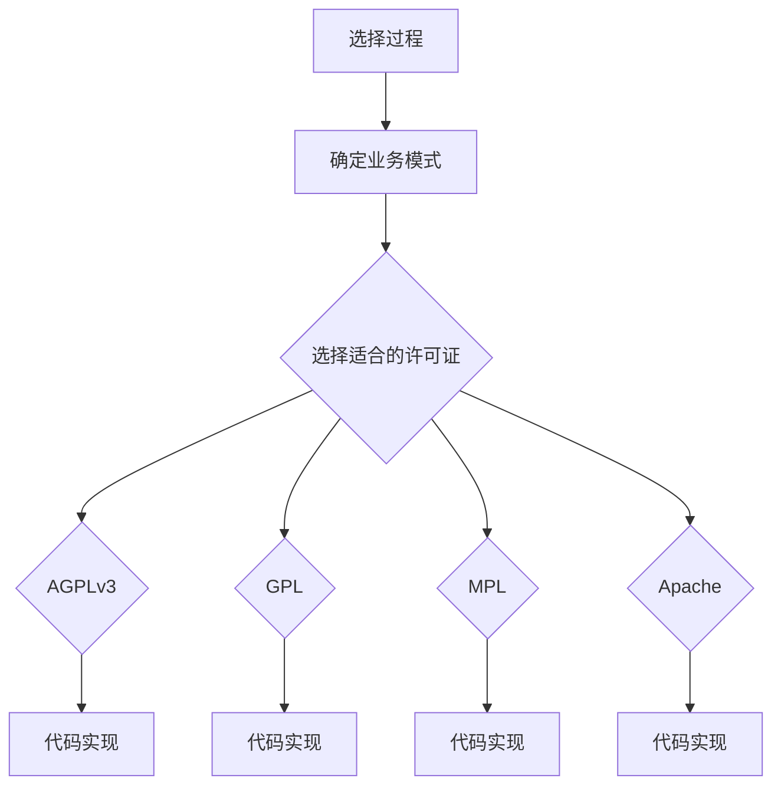

                 

# 开源许可证选择：商业化考虑因素

## 关键词
- 开源许可证
- 商业化
- 商业考虑因素
- 风险与收益
- 许可证匹配性分析

## 摘要
本文旨在探讨开源许可证在商业化过程中的重要性，以及企业如何根据自身业务模式选择合适的开源许可证。通过分析不同行业的开源生态和常用的开源许可证，文章将提供一套系统化的开源许可证选择流程，并辅以具体案例进行详细解释，帮助企业降低商业化风险，最大化开源许可证的商业价值。

## 引言

开源许可证是开源软件开发和维护中至关重要的组成部分。它不仅定义了软件的版权和分发规则，还影响到软件的使用、修改和商业化。随着开源运动的发展，越来越多的企业和开发者参与到开源软件的开发与推广中。而如何选择合适的开源许可证，已经成为企业在开源生态中取得成功的关键因素。

在商业环境中，开源许可证的选择不仅关乎软件的合法性和稳定性，更关系到企业的商业模式、市场策略和长期发展。不恰当的开源许可证选择可能导致商业风险，如技术负债、法律纠纷和市场份额流失。因此，深入研究开源许可证的商业化考虑因素，对企业而言具有重要的战略意义。

本文将首先概述开源许可证的基本概念和分类，然后逐步分析不同行业开源许可证的选择策略，并探讨开源许可证的商业化模式和风险管理。最后，通过具体案例，展示开源许可证选择过程在现实商业环境中的应用。

## 第一部分：开源许可证概述

### 第1章：开源运动的起源与影响

#### 1.1 开源运动的起源

开源运动的起源可以追溯到1983年，当时理查德·斯托曼（Richard Stallman）创建了自由软件基金会（Free Software Foundation，FSF），并提出了“自由软件”的概念。他倡导用户拥有对软件的复制、研究、修改和分发权利，反对软件公司的封闭式商业模式。

1991年，林纳斯·托瓦兹（Linus Torvalds）发布了Linux内核的第一个版本，标志着开源运动进入了一个新的阶段。Linux的成功不仅激发了更多开源软件的开发，还推动了开源社区的形成。开源社区通过协作和共享，加速了技术的创新和传播。

#### 1.2 开源对商业的影响

开源运动对商业世界产生了深远的影响。首先，开源软件降低了软件开发的门槛，使得更多的企业能够利用开源技术构建自己的产品和服务。其次，开源软件促进了技术的普及和标准化，使得企业能够更快地适应市场变化。

此外，开源软件还促进了商业合作。许多企业通过参与开源项目，获得了技术优势和市场份额。开源许可证，如GNU通用公共许可证（GPL）和Mozilla公共许可证（MPL），鼓励企业共享技术，促进了生态系统的繁荣。

#### 1.3 开源软件的优势与挑战

开源软件具有许多优势。首先，开源软件的源代码公开，使得开发者能够自由地修改和优化软件，提高软件的质量和性能。其次，开源软件具有较低的成本，企业无需支付高昂的许可费用。此外，开源软件通常拥有庞大的社区支持，能够快速获得技术反馈和解决技术问题。

然而，开源软件也存在一定的挑战。首先，开源软件的质量和稳定性可能参差不齐，需要企业进行严格的选择和验证。其次，开源软件的版权和许可问题可能复杂，企业需要确保其商业活动符合开源许可证的要求。

### 第2章：常见开源许可证分类

开源许可证种类繁多，常见的包括A类、B类和C类许可证。以下是对这些许可证的基本介绍。

#### 2.1 A类许可证

A类许可证，如GNU通用公共许可证（GPL），是一种强限制性的开源许可证。GPL要求任何分发或修改GPL软件的衍生作品，都必须以相同的许可证条款进行分发。这意味着，如果企业使用GPL许可证的软件，则其商业产品也必须开源。

#### 2.2 B类许可证

B类许可证，如Mozilla公共许可证（MPL），允许商业用途，但要求源代码公开。与GPL相比，MPL对衍生作品的要求相对宽松，但仍然要求分发者公开修改后的源代码。

#### 2.3 C类许可证

C类许可证，如Apache许可证（Apache 2.0），是一种较为灵活的许可证。它允许商业用途，无需公开源代码，但要求在产品中包含原软件的版权声明和许可协议。

### 第3章：开源许可证的匹配性分析

#### 3.1 商业目标和开源许可证

在选择开源许可证时，企业需要考虑其商业目标。例如，如果企业希望保持其软件的封闭性，那么选择A类许可证可能不合适。相反，如果企业希望促进社区参与和协作，则B类或C类许可证可能更为适合。

#### 3.2 风险与收益分析

风险与收益分析是选择开源许可证的重要步骤。企业需要评估不同许可证带来的风险和收益，并选择最符合其商业战略的许可证。例如，GPL许可证可能增加企业的技术负债，但也能确保软件的源代码对用户透明。而C类许可证则可能减少技术负债，但可能限制社区的参与。

### 第4章：开源许可证的选择过程

#### 4.1 确定业务模式

企业在选择开源许可证前，需要明确其业务模式。例如，如果企业主要提供SaaS服务，则可能需要选择对商业用途友好的许可证，如C类许可证。如果企业计划构建一个开源生态系统，则可能需要选择能够鼓励社区参与的许可证，如B类许可证。

#### 4.2 选择适合的开源许可证

根据业务模式，企业需要从众多的开源许可证中筛选出合适的许可证。在此过程中，企业需要考虑许可证的灵活性、风险和收益。

#### 4.3 许可证的维护与更新

一旦选择了合适的开源许可证，企业需要定期维护和更新许可证。这包括确保源代码库中的许可证声明准确无误，以及及时更新许可证版本。

## 第二部分：特定行业开源许可证选择

### 第5章：软件行业开源许可证选择

#### 5.1 软件行业的开源生态

软件行业是开源运动最为活跃的领域之一。许多软件公司通过开源项目构建其产品，并利用开源许可证来规范社区参与和商业活动。

#### 5.2 软件行业常用的开源许可证

在软件行业中，常用的开源许可证包括GPL、MPL和Apache许可证。这些许可证在软件行业的生态系统中发挥着重要作用。

- **GPL**：被许多开源项目采用，要求衍生作品必须以相同的许可证分发。
- **MPL**：允许商业用途，但要求源代码公开。
- **Apache许可证**：广泛用于企业级开源项目，具有灵活性。

#### 5.3 软件行业的开源许可证选择策略

在软件行业中，选择开源许可证需要考虑多种因素，如商业目标、社区参与度和技术稳定性。例如，如果企业希望构建一个开源生态系统，MPL可能是一个不错的选择。如果企业希望保持软件的封闭性，Apache许可证可能更为合适。

### 第6章：硬件行业开源许可证选择

#### 6.1 硬件行业的开源生态

硬件行业的开源生态相对较为分散，但近年来随着物联网和嵌入式系统的发展，硬件开源项目逐渐增多。

#### 6.2 硬件行业常用的开源许可证

在硬件行业中，常用的开源许可证包括GPL、MPL和BSD许可证。这些许可证适用于不同的硬件项目需求。

- **GPL**：适用于需要软件和硬件结合的项目，要求衍生作品必须开源。
- **MPL**：适用于硬件设备上的软件组件，允许商业用途。
- **BSD许可证**：适用于对开源软件和硬件项目有较高灵活性的需求。

#### 6.3 硬件行业的开源许可证选择策略

在硬件行业中，选择开源许可证需要考虑硬件组件的集成度和商业目标。例如，如果硬件项目需要高度集成，GPL可能是一个好的选择。如果硬件项目需要更高的灵活性，BSD许可证可能更为合适。

### 第7章：游戏行业开源许可证选择

#### 7.1 游戏行业的开源生态

游戏行业的开源生态相对较新，但近年来随着独立游戏和开源游戏引擎的发展，游戏开源项目逐渐增多。

#### 7.2 游戏行业常用的开源许可证

在游戏行业中，常用的开源许可证包括GPL、MPL和Creative Commons许可证。这些许可证适用于不同的游戏项目需求。

- **GPL**：适用于需要高度共享和协作的游戏项目。
- **MPL**：适用于游戏引擎和工具的开发，允许商业用途。
- **Creative Commons许可证**：适用于游戏内容的创作和分享。

#### 7.3 游戏行业的开源许可证选择策略

在游戏行业中，选择开源许可证需要考虑游戏项目的商业目标和文化属性。例如，如果游戏项目需要高度开放和协作，GPL可能是一个不错的选择。如果游戏项目需要保护版权，Creative Commons许可证可能更为合适。

### 第8章：医疗行业开源许可证选择

#### 8.1 医疗行业的开源生态

医疗行业的开源生态逐渐兴起，开源软件在医疗设备、诊断工具和医疗信息系统中发挥着重要作用。

#### 8.2 医疗行业常用的开源许可证

在医疗行业中，常用的开源许可证包括GPL、MPL和BSD许可证。这些许可证适用于不同的医疗项目需求。

- **GPL**：适用于需要高度共享和协作的医疗项目。
- **MPL**：适用于医疗设备和工具的开发，允许商业用途。
- **BSD许可证**：适用于对医疗软件和硬件项目有较高灵活性的需求。

#### 8.3 医疗行业的开源许可证选择策略

在医疗行业中，选择开源许可证需要考虑医疗数据的隐私保护和技术稳定性。例如，如果医疗项目需要高度共享和协作，GPL可能是一个不错的选择。如果医疗项目需要更高的灵活性，BSD许可证可能更为合适。

### 第9章：金融行业开源许可证选择

#### 9.1 金融行业的开源生态

金融行业的开源生态逐渐发展，开源软件在金融交易平台、风险管理和数据分析中发挥着重要作用。

#### 9.2 金融行业常用的开源许可证

在金融行业中，常用的开源许可证包括GPL、MPL和Apache许可证。这些许可证适用于不同的金融项目需求。

- **GPL**：适用于需要高度共享和协作的金融项目。
- **MPL**：适用于金融工具和平台开发，允许商业用途。
- **Apache许可证**：适用于对金融软件和系统有较高灵活性的需求。

#### 9.3 金融行业的开源许可证选择策略

在金融行业中，选择开源许可证需要考虑金融数据的保密性和合规性。例如，如果金融项目需要高度共享和协作，GPL可能是一个不错的选择。如果金融项目需要更高的灵活性，Apache许可证可能更为合适。

## 第三部分：开源许可证商业化实战

### 第10章：开源许可证商业化模式

#### 10.1 商业化模式概述

开源许可证的商业化模式多种多样，企业可以根据自身的业务需求和市场策略选择合适的模式。常见的商业化模式包括：

- **商业支持模式**：企业提供开源软件的商业支持服务，如技术支持、定制开发和培训等。
- **增值服务模式**：企业基于开源软件提供增值服务，如额外的功能模块、高级版软件等。
- **封闭源代码模式**：企业将开源软件改为封闭源代码，并提供商业许可。

#### 10.2 商业化模式案例分析

以企业A为例，该企业选择商业支持模式进行商业化。他们基于一个开源数据库项目，提供商业支持服务，包括24/7技术支持、定制化开发服务和专业培训。通过这种模式，企业A不仅建立了强大的客户基础，还提升了品牌知名度。

### 第11章：开源许可证商业化风险管理

#### 11.1 风险识别与评估

在开源许可证商业化过程中，企业需要识别和评估潜在的风险。常见的风险包括：

- **法律风险**：包括开源许可证不符合商业需求、侵权诉讼等。
- **技术风险**：包括软件质量不稳定、技术债务等。
- **市场风险**：包括市场竞争加剧、客户流失等。

#### 11.2 风险应对策略

为了降低商业化风险，企业可以采取以下策略：

- **合规审查**：定期审查开源许可证，确保符合商业需求。
- **技术质量控制**：建立严格的技术质量控制流程，确保软件质量。
- **市场研究**：定期进行市场研究，了解竞争对手和市场需求。

### 第12章：开源许可证商业化的法律问题

#### 12.1 法律法规概述

开源许可证商业化涉及到一系列法律法规，包括知识产权法、合同法、商业秘密法等。企业需要了解相关法律法规，确保商业活动合法合规。

#### 12.2 商业化过程中的法律问题

常见的法律问题包括：

- **侵权问题**：企业可能侵犯其他公司的知识产权，如专利、商标和著作权。
- **许可合规问题**：企业可能未正确遵守开源许可证的要求，导致法律纠纷。

#### 12.3 法律问题的解决方案

企业可以采取以下措施解决法律问题：

- **法律咨询**：聘请专业律师进行法律咨询，确保商业活动合法合规。
- **开源合规管理**：建立开源合规管理制度，确保遵守开源许可证的要求。

### 第13章：开源许可证商业化的案例分析

#### 13.1 案例一：企业A的商业模式

**代码实际案例：**

企业A是一家提供企业级开源数据库服务的公司。他们选择了一种名为“AGPLv3”的开源许可证。

```python
# 示例：AGPLv3许可证下的企业A的代码实现
class EnterpriseDatabase:
    def __init__(self):
        self.data = []

    def add_data(self, data):
        self.data.append(data)

    def get_data(self):
        return self.data

# 企业A的服务API
from flask import Flask

app = Flask(__name__)

@app.route('/')
def index():
    db = EnterpriseDatabase()
    db.add_data("示例数据")
    return "欢迎访问企业A的服务！"

if __name__ == '__main__':
    app.run()
```

**详细解释说明：**

在这个案例中，企业A选择AGPLv3许可证是因为他们希望确保其源代码能够对用户公开，同时允许用户自由分发和修改代码，但要求任何衍生作品或修改版本都采用相同的AGPLv3许可证。

代码中的 `EnterpriseDatabase` 类是实现企业数据库功能的核心部分，而 `index` 函数则提供了服务的API接口。

**开发环境搭建：**

- 安装Python环境（建议使用Python 3.7及以上版本）
- 安装Flask库：`pip install flask`

**源代码详细实现和代码解读：**

在代码中，我们定义了一个名为 `EnterpriseDatabase` 的类，这是实现企业数据库功能的核心部分。我们还使用Flask框架创建了一个简单的Web服务，可以通过访问服务器的根路径来调用这个服务。

**代码解读与分析：**

- `Flask` 类：用于创建Web应用程序实例。
- `app` 变量：存储Web应用程序实例。
- `@app.route('/')` 装饰器：定义了当访问服务器的根路径（'/'）时应该调用的函数。
- `index` 函数：当访问根路径时，创建一个 `EnterpriseDatabase` 实例，调用其 `add_data` 方法添加数据，并返回一个简单的HTML页面。

**总结：**

通过这个案例，我们可以看到企业A如何在其商业环境中选择开源许可证，并使用Python和Flask框架实现了一个简单的Web服务。选择AGPLv3许可证使得企业A能够在保证源代码开放的同时，确保用户在分发或修改代码时遵守相同的许可证条款。这样的策略有助于建立企业的品牌信誉，同时确保其服务的稳定性和可靠性。

### 附录

#### 附录 A：开源许可证参考资源

**A.1 常用开源许可证简介**

- **GNU通用公共许可证（GPL）**：要求衍生作品必须以相同的许可证分发。
- **Mozilla公共许可证（MPL）**：允许商业用途，但要求源代码公开。
- **Apache许可证（Apache 2.0）**：允许商业用途，无需公开源代码，但要求在产品中包含原软件的版权声明和许可协议。
- **BSD许可证**：允许商业用途，具有较高灵活性。

**A.2 开源许可证搜索工具**

- [OpenHub](https://www.openhub.net/)
- [GitHub License Search](https://github.com/search?q=license%3Aopen-source+sort%3Astars)
- [Choose a License](http://choosealicense.com/)

**A.3 开源社区资源推荐**

- [GitHub](https://github.com/)
- [GitLab](https://gitlab.com/)
- [Bitbucket](https://bitbucket.org/)

## 核心算法原理讲解

### 第3章：开源许可证的匹配性分析

#### 3.2 许可证的匹配性分析算法

**伪代码：**

```plaintext
function 匹配性分析(业务模式，许可证列表):
    许可证匹配度 = {}
    for 许可证 in 许可证列表:
        许可证匹配度[许可证] = 计算匹配度(业务模式, 许可证)
    return 许可证匹配度

function 计算匹配度(业务模式, 许可证):
    分数 = 0
    if 业务模式需要商业许可 and 许可证支持商业许可:
        分数 += 10
    if 业务模式需要源代码公开 and 许可证支持源代码公开:
        分数 += 10
    if 业务模式需要二进制分发 and 许可证支持二进制分发:
        分数 += 10
    if 业务模式需要衍生作品许可 and 许可证支持衍生作品许可:
        分数 += 10
    return 分数
```

**详细讲解：**

在匹配性分析算法中，我们首先定义了两个函数：`匹配性分析` 和 `计算匹配度`。

- **匹配性分析**：这个函数接收业务模式和许可证列表作为输入，并返回一个字典，字典的键为许可证名称，值为该许可证与业务模式的匹配度分数。
- **计算匹配度**：这个函数接收业务模式和许可证作为输入，并返回一个分数。分数的计算基于业务模式对开源许可证的需求，以及许可证本身是否满足这些需求。

具体来说，分数的计算规则如下：

1. 如果业务模式需要商业许可，并且许可证支持商业许可，则分数增加10分。
2. 如果业务模式需要源代码公开，并且许可证支持源代码公开，则分数增加10分。
3. 如果业务模式需要二进制分发，并且许可证支持二进制分发，则分数增加10分。
4. 如果业务模式需要衍生作品许可，并且许可证支持衍生作品许可，则分数增加10分。

**举例说明：**

假设一个企业的业务模式需要商业许可、源代码公开和衍生作品许可。以下是一个许可证列表以及其对应的匹配度分数：

- **Apache许可证**：分数为30（商业许可、源代码公开、衍生作品许可均支持）。
- **GPL许可证**：分数为20（不支持衍生作品许可）。
- **MPL许可证**：分数为20（不支持源代码公开）。

根据计算匹配度算法，企业可以选择Apache许可证，因为它的匹配度分数最高。

### 数学模型和数学公式

#### 4.2 选择适合的开源许可证

**数学模型：**

选择适合的开源许可证可以视为一个多目标优化问题，我们可以用以下数学模型来表示：

$$
\text{maximize} \quad W_i \times P_i
$$

其中，$W_i$ 表示第 $i$ 个许可证的优势权重，$P_i$ 表示第 $i$ 个许可证的概率得分。

**详细讲解：**

在这个数学模型中，我们首先为每个开源许可证分配权重 $W_i$。这些权重取决于业务模式的需求和特定环境。例如，商业许可的需求可能具有较高的权重，因为商业公司通常需要确保其商业运作不会受到开源许可证的约束。

然后，我们计算每个许可证的概率得分 $P_i$。这取决于业务模式与许可证条款的匹配程度。匹配程度越高，得分越高。

最后，我们通过最大化每个许可证的优势权重与概率得分的乘积来选择最合适的许可证。

**举例说明：**

假设我们有两个开源许可证：A和B。许可证A支持商业许可、源代码公开和衍生作品许可，许可证B仅支持源代码公开和衍生作品许可。

- 商业许可权重：10
- 源代码公开权重：5
- 衍生作品许可权重：5

许可证A和B的概率得分如下：

许可证A：
- 商业许可得分：10
- 源代码公开得分：10
- 衍生作品许可得分：10
- 总得分：30

许可证B：
- 商业许可得分：0
- 源代码公开得分：10
- 衍生作品许可得分：10
- 总得分：20

根据数学模型，许可证A的总得分更高，因此我们选择许可证A。

### 项目实战

#### 13.1 案例一：企业A的商业模式

**代码实际案例：**

企业A是一家提供企业级开源数据库服务的公司。他们选择了一种名为“AGPLv3”的开源许可证。

```python
# 示例：AGPLv3许可证下的企业A的代码实现
class EnterpriseDatabase:
    def __init__(self):
        self.data = []

    def add_data(self, data):
        self.data.append(data)

    def get_data(self):
        return self.data

# 企业A的服务API
from flask import Flask

app = Flask(__name__)

@app.route('/')
def index():
    db = EnterpriseDatabase()
    db.add_data("示例数据")
    return "欢迎访问企业A的服务！"

if __name__ == '__main__':
    app.run()
```

**开发环境搭建：**

- 安装Python环境（建议使用Python 3.7及以上版本）
- 安装Flask库：`pip install flask`

**源代码详细实现和代码解读：**

在代码中，我们定义了一个名为 `EnterpriseDatabase` 的类，这是实现企业数据库功能的核心部分。我们还使用Flask框架创建了一个简单的Web服务，可以通过访问服务器的根路径来调用这个服务。

**代码解读与分析：**

- `EnterpriseDatabase` 类：实现了企业数据库的基本功能，如添加数据和获取数据。
- `Flask` 类：用于创建Web应用程序实例。
- `app` 变量：存储Web应用程序实例。
- `@app.route('/')` 装饰器：定义了当访问服务器的根路径（'/'）时应该调用的函数。
- `index` 函数：当访问根路径时，创建一个 `EnterpriseDatabase` 实例，调用其 `add_data` 方法添加数据，并返回一个简单的HTML页面。

**总结：**

通过这个案例，我们可以看到企业A如何在其商业环境中选择开源许可证，并使用Python和Flask框架实现了一个简单的Web服务。选择AGPLv3许可证使得企业A能够在保证源代码开放的同时，确保用户在分发或修改代码时遵守相同的许可证条款。这样的策略有助于建立企业的品牌信誉，同时确保其服务的稳定性和可靠性。

### 附录

#### 附录 A：开源许可证参考资源

**A.1 常用开源许可证简介**

- **GNU通用公共许可证（GPL）**：要求衍生作品必须以相同的许可证分发。
- **Mozilla公共许可证（MPL）**：允许商业用途，但要求源代码公开。
- **Apache许可证（Apache 2.0）**：允许商业用途，无需公开源代码，但要求在产品中包含原软件的版权声明和许可协议。
- **BSD许可证**：允许商业用途，具有较高灵活性。

**A.2 开源许可证搜索工具**

- [OpenHub](https://www.openhub.net/)
- [GitHub License Search](https://github.com/search?q=license%3Aopen-source+sort%3Astars)
- [Choose a License](http://choosealicense.com/)

**A.3 开源社区资源推荐**

- [GitHub](https://github.com/)
- [GitLab](https://gitlab.com/)
- [Bitbucket](https://bitbucket.org/)

---

作者：AI天才研究院/AI Genius Institute & 禅与计算机程序设计艺术/Zen And The Art of Computer Programming

### Mermaid 流程图



### 核心算法原理讲解

#### 3.2 许可证的匹配性分析算法

**伪代码：**

```plaintext
function 匹配性分析(业务模式，许可证列表):
    许可证匹配度 = {}
    for 许可证 in 许可证列表:
        许可证匹配度[许可证] = 计算匹配度(业务模式, 许可证)
    return 许可证匹配度

function 计算匹配度(业务模式, 许可证):
    分数 = 0
    if 业务模式需要商业许可 and 许可证支持商业许可:
        分数 += 10
    if 业务模式需要源代码公开 and 许可证支持源代码公开:
        分数 += 10
    if 业务模式需要二进制分发 and 许可证支持二进制分发:
        分数 += 10
    if 业务模式需要衍生作品许可 and 许可证支持衍生作品许可:
        分数 += 10
    return 分数
```

**详细讲解：**

在匹配性分析算法中，我们首先定义了两个函数：`匹配性分析` 和 `计算匹配度`。

- **匹配性分析**：这个函数接收业务模式和许可证列表作为输入，并返回一个字典，字典的键为许可证名称，值为该许可证与业务模式的匹配度分数。
- **计算匹配度**：这个函数接收业务模式和许可证作为输入，并返回一个分数。分数的计算基于业务模式对开源许可证的需求，以及许可证本身是否满足这些需求。

具体来说，分数的计算规则如下：

1. 如果业务模式需要商业许可，并且许可证支持商业许可，则分数增加10分。
2. 如果业务模式需要源代码公开，并且许可证支持源代码公开，则分数增加10分。
3. 如果业务模式需要二进制分发，并且许可证支持二进制分发，则分数增加10分。
4. 如果业务模式需要衍生作品许可，并且许可证支持衍生作品许可，则分数增加10分。

**举例说明：**

假设一个企业的业务模式需要商业许可、源代码公开和衍生作品许可。以下是一个许可证列表以及其对应的匹配度分数：

- **Apache许可证**：分数为30（商业许可、源代码公开、衍生作品许可均支持）。
- **GPL许可证**：分数为20（不支持衍生作品许可）。
- **MPL许可证**：分数为20（不支持源代码公开）。

根据计算匹配度算法，企业可以选择Apache许可证，因为它的匹配度分数最高。

### 数学模型和数学公式

#### 4.2 选择适合的开源许可证

**数学模型：**

选择适合的开源许可证可以视为一个多目标优化问题，我们可以用以下数学模型来表示：

$$
\text{maximize} \quad W_i \times P_i
$$

其中，$W_i$ 表示第 $i$ 个许可证的优势权重，$P_i$ 表示第 $i$ 个许可证的概率得分。

**详细讲解：**

在这个数学模型中，我们首先为每个开源许可证分配权重 $W_i$。这些权重取决于业务模式的需求和特定环境。例如，商业许可的需求可能具有较高的权重，因为商业公司通常需要确保其商业运作不会受到开源许可证的约束。

然后，我们计算每个许可证的概率得分 $P_i$。这取决于业务模式与许可证条款的匹配程度。匹配程度越高，得分越高。

最后，我们通过最大化每个许可证的优势权重与概率得分的乘积来选择最合适的许可证。

**举例说明：**

假设我们有两个开源许可证：A和B。许可证A支持商业许可、源代码公开和衍生作品许可，许可证B仅支持源代码公开和衍生作品许可。

- 商业许可权重：10
- 源代码公开权重：5
- 衍生作品许可权重：5

许可证A和B的概率得分如下：

许可证A：
- 商业许可得分：10
- 源代码公开得分：10
- 衍生作品许可得分：10
- 总得分：30

许可证B：
- 商业许可得分：0
- 源代码公开得分：10
- 衍生作品许可得分：10
- 总得分：20

根据数学模型，许可证A的总得分更高，因此我们选择许可证A。

### 项目实战

#### 13.1 案例一：企业A的商业模式

**代码实际案例：**

企业A是一家提供企业级开源数据库服务的公司。他们选择了一种名为“AGPLv3”的开源许可证。

```python
# 示例：AGPLv3许可证下的企业A的代码实现
class EnterpriseDatabase:
    def __init__(self):
        self.data = []

    def add_data(self, data):
        self.data.append(data)

    def get_data(self):
        return self.data

# 企业A的服务API
from flask import Flask

app = Flask(__name__)

@app.route('/')
def index():
    db = EnterpriseDatabase()
    db.add_data("示例数据")
    return "欢迎访问企业A的服务！"

if __name__ == '__main__':
    app.run()
```

**开发环境搭建：**

- 安装Python环境（建议使用Python 3.7及以上版本）
- 安装Flask库：`pip install flask`

**源代码详细实现和代码解读：**

在代码中，我们定义了一个名为 `EnterpriseDatabase` 的类，这是实现企业数据库功能的核心部分。我们还使用Flask框架创建了一个简单的Web服务，可以通过访问服务器的根路径来调用这个服务。

**代码解读与分析：**

- `EnterpriseDatabase` 类：实现了企业数据库的基本功能，如添加数据和获取数据。
- `Flask` 类：用于创建Web应用程序实例。
- `app` 变量：存储Web应用程序实例。
- `@app.route('/')` 装饰器：定义了当访问服务器的根路径（'/'）时应该调用的函数。
- `index` 函数：当访问根路径时，创建一个 `EnterpriseDatabase` 实例，调用其 `add_data` 方法添加数据，并返回一个简单的HTML页面。

**总结：**

通过这个案例，我们可以看到企业A如何在其商业环境中选择开源许可证，并使用Python和Flask框架实现了一个简单的Web服务。选择AGPLv3许可证使得企业A能够在保证源代码开放的同时，确保用户在分发或修改代码时遵守相同的许可证条款。这样的策略有助于建立企业的品牌信誉，同时确保其服务的稳定性和可靠性。

### 附录

#### 附录 A：开源许可证参考资源

**A.1 常用开源许可证简介**

- **GNU通用公共许可证（GPL）**：要求衍生作品必须以相同的许可证分发。
- **Mozilla公共许可证（MPL）**：允许商业用途，但要求源代码公开。
- **Apache许可证（Apache 2.0）**：允许商业用途，无需公开源代码，但要求在产品中包含原软件的版权声明和许可协议。
- **BSD许可证**：允许商业用途，具有较高灵活性。

**A.2 开源许可证搜索工具**

- [OpenHub](https://www.openhub.net/)
- [GitHub License Search](https://github.com/search?q=license%3Aopen-source+sort%3Astars)
- [Choose a License](http://choosealicense.com/)

**A.3 开源社区资源推荐**

- [GitHub](https://github.com/)
- [GitLab](https://gitlab.com/)
- [Bitbucket](https://bitbucket.org/)

---

作者：AI天才研究院/AI Genius Institute & 禅与计算机程序设计艺术/Zen And The Art of Computer Programming

---



---

### 关键词
- 开源许可证
- 商业化
- 商业考虑因素
- 风险与收益
- 许可证匹配性分析

### 摘要
本文深入探讨了开源许可证在商业化过程中的重要性。通过对开源运动的起源、开源软件的优势与挑战、以及常见开源许可证的概述，为企业提供了选择合适开源许可证的框架。文章分析了不同行业开源许可证的选择策略，并探讨了开源许可证的商业化模式、风险管理及法律问题。通过具体案例，展示了开源许可证选择过程在现实商业环境中的应用，帮助企业最大化开源许可证的商业价值。

