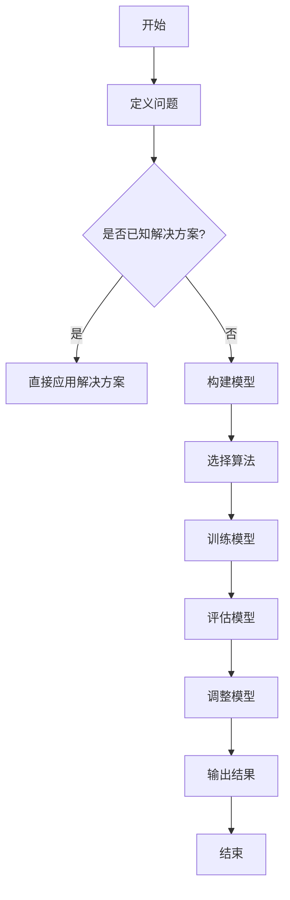

                 

### 《强化学习Reinforcement Learning探索与利用策略深度剖析》

关键词：强化学习、Reinforcement Learning、策略优化、探索与利用、深度学习、前沿技术、项目实战

摘要：本文将从强化学习的基础理论、数学模型、探索与利用策略、策略优化、深度强化学习、前沿技术应用以及项目实战等方面进行深度剖析，旨在为读者全面解读强化学习这一热门领域的核心概念、算法原理以及实际应用，帮助读者掌握强化学习的精髓，提升在相关领域的实践能力。

---

### 《强化学习Reinforcement Learning探索与利用策略深度剖析》目录大纲

> **第一部分：强化学习基础理论**

### 1. 强化学习概述

- 1.1 强化学习的基本概念
- 1.2 强化学习与传统机器学习的区别
- 1.3 强化学习的应用场景

### 1.2 强化学习的数学基础

- 1.3 强化学习的数学基础
- 1.4 强化学习的基本策略

### 1.3 强化学习的数学模型

- 1.4 强化学习模型
- 1.5 强化学习的数学原理
- 1.6 强化学习算法分析

### 1.4 强化学习中的探索与利用

- 1.7 探索与利用的概念
- 1.8 探索策略
- 1.9 利用策略

### 1.5 强化学习中的策略优化

- 1.10 策略梯度算法
- 1.11 策略搜索算法
- 1.12 策略梯度算法的应用

### 1.6 强化学习中的深度学习

- 1.13 深度强化学习
- 1.14 神经网络在强化学习中的应用
- 1.15 深度强化学习的挑战与解决方案

### 1.7 强化学习的未来发展趋势

- 1.16 强化学习在人工智能中的角色
- 1.17 强化学习在实际应用中的挑战与机遇
- 1.18 强化学习的未来发展方向

### 第二部分：强化学习中的探索与利用策略深度剖析

### 2.1 强化学习中的探索与利用策略

- 2.1 探索与利用的概念
- 2.2 探索策略
- 2.3 利用策略

### 2.2 强化学习中的策略优化

- 2.4 策略梯度算法
- 2.5 策略搜索算法
- 2.6 策略梯度算法的应用

### 2.3 强化学习中的深度学习

- 2.7 深度强化学习
- 2.8 神经网络在强化学习中的应用
- 2.9 深度强化学习的挑战与解决方案

### 2.4 强化学习的未来发展趋势

- 2.10 强化学习在人工智能中的角色
- 2.11 强化学习在实际应用中的挑战与机遇
- 2.12 强化学习的未来发展方向

### 第三部分：强化学习项目实战

### 2.5 强化学习项目实战

- 2.5.1 强化学习项目开发流程
- 2.5.2 强化学习项目实战案例
- 2.5.3 强化学习项目的优化与改进

### 第四部分：附录

- 2.6 强化学习常用工具和资源
- 2.7 强化学习相关书籍推荐

---

接下来，我们将逐步深入解析强化学习的基础理论，包括强化学习的概述、数学基础、基本策略、数学模型、探索与利用策略、策略优化、深度学习、未来发展趋势以及项目实战等内容。

---

### 第一部分：强化学习基础理论

#### 第1章：强化学习概述

强化学习（Reinforcement Learning，简称RL）是一种机器学习方法，通过智能体与环境的交互来学习策略，以便最大化累积奖励。与传统机器学习不同，强化学习关注的是如何通过试错来学习最优策略，而非仅仅依赖训练数据进行预测。

**1.1 强化学习的基本概念**

强化学习由三个核心要素构成：智能体（Agent）、环境（Environment）和动作（Action）。

- 智能体：执行动作并接收环境反馈的实体。
- 环境：智能体所处的情境，包括状态（State）和奖励（Reward）。
- 动作：智能体在某一状态下执行的操作。

**1.2 强化学习与传统机器学习的区别**

传统机器学习主要关注在给定输入和标签数据的情况下，如何训练出一个好的模型进行预测。而强化学习则侧重于智能体在动态环境中通过试错学习最优策略。

- 数据依赖：传统机器学习依赖于大量标注数据，而强化学习更多依赖于环境的即时反馈。
- 目标差异：传统机器学习的目标是预测，强化学习的目标是实现最大化累积奖励。
- 学习模式：传统机器学习是监督学习，强化学习是半监督或无监督学习。

**1.3 强化学习的应用场景**

强化学习在许多领域都有广泛应用，包括但不限于：

- 游戏：如棋类游戏、格斗游戏等，强化学习算法可以训练出超越人类水平的智能代理。
- 自动驾驶：通过强化学习，自动驾驶系统能够学习如何在复杂的交通环境中做出最优决策。
- 机器人控制：强化学习可以帮助机器人学习在未知环境中的运动策略，实现自主导航和任务执行。
- 电子商务：如个性化推荐系统，强化学习算法可以根据用户行为数据生成个性化的推荐策略。

#### 第2章：强化学习的数学基础

强化学习中的数学基础主要包括离散状态空间与动作空间、连续状态空间与动作空间、奖励函数与价值函数等。

**2.1 离散状态空间与动作空间**

在离散状态空间与动作空间中，状态和动作都是有限集。通常，我们可以定义状态集合$S$和动作集合$A$，每个状态和动作都有一个唯一的标识。

- 状态集合$S = \{s_1, s_2, \ldots, s_n\}$
- 动作集合$A = \{a_1, a_2, \ldots, a_m\}$

**2.2 连续状态空间与动作空间**

在实际应用中，状态和动作也可能是连续的。例如，在自动驾驶中，车辆的位置、速度、方向盘角度等都是连续的。

- 状态集合$S = \mathbb{R}^n$
- 动作集合$A = \mathbb{R}^m$

对于连续状态空间与动作空间，我们通常使用概率密度函数来描述状态和动作的分布。

**2.3 奖励函数与价值函数**

奖励函数$R(s, a)$表示在状态$s$下执行动作$a$所获得的即时奖励。奖励函数可以是正值、负值或零，取决于具体问题的设计。

价值函数$V(s)$表示在状态$s$下的期望累积奖励，也称为状态价值函数。价值函数可以用来评估智能体在某一状态下的长期收益。

- 状态价值函数$V(s) = \sum_{a \in A} \pi(a|s) \cdot Q(s, a)$
- 动作价值函数$Q(s, a) = R(s, a) + \gamma \sum_{s' \in S} p(s'|s, a) \cdot V(s')$
  其中，$\gamma$是折扣因子，$p(s'|s, a)$是状态转移概率。

**2.4 强化学习的基本策略**

强化学习的基本策略包括蒙特卡洛方法、动态规划、Q-Learning等。

- 蒙特卡洛方法：通过模拟随机试验来估计期望值，适用于小状态空间和动作空间。
- 动态规划：利用递归关系求解最优策略，适用于大状态空间和动作空间。
- Q-Learning：通过经验迭代更新Q值，适用于任何状态空间和动作空间。

#### 第3章：强化学习的数学模型

强化学习的数学模型主要包括马尔可夫决策过程（MDP）、优化目标、状态转移概率等。

**3.1 强化学习模型**

强化学习模型通常可以用以下数学形式表示：

- 状态空间$S$
- 动作空间$A$
- 状态转移概率$p(s'|s, a)$
- 奖励函数$R(s, a)$
- 策略$\pi(a|s)$

**3.2 强化学习的数学原理**

强化学习的核心目标是找到最优策略$\pi^*$，使得智能体在任意状态$s$下执行动作$a$的期望累积奖励最大化。数学上，可以表示为：

$$ J(\pi) = \sum_{s \in S} \pi(s) \cdot \sum_{a \in A} \pi(a|s) \cdot R(s, a) $$

其中，$J(\pi)$是策略$\pi$的累积奖励。

**3.3 强化学习算法分析**

强化学习算法分为值函数方法和策略方法。值函数方法通过学习状态价值函数或动作价值函数来优化策略，而策略方法直接优化策略本身。

- 值函数方法：主要包括Q-Learning和Sarsa。
- 策略方法：主要包括策略迭代和价值迭代。

#### 第4章：强化学习中的探索与利用

在强化学习中，探索（Exploration）和利用（Exploitation）是两个关键概念。探索是指智能体在执行动作时尝试新的状态和动作，以获取更多的信息。利用是指智能体在执行动作时选择已知的最佳动作，以最大化累积奖励。

**4.1 探索与利用的概念**

- 探索：尝试新动作以获取更多信息。
- 利用：执行已知的最佳动作以最大化累积奖励。

**4.2 探索策略**

常见的探索策略包括：

- 贪心策略（Greedy Policy）：总是选择当前状态下价值最高的动作。
- $\epsilon$-贪心策略（$\epsilon$-Greedy Policy）：以概率$\epsilon$随机选择动作，以$1-\epsilon$的概率选择当前状态下价值最高的动作。
- 保留性策略（Explore-Exploit Policy）：在初始阶段进行探索，随着经验的积累逐渐转向利用。

**4.3 利用策略**

常见的利用策略包括：

- 基于价值的策略（Value-Based Policy）：选择具有最大预期回报的动作。
- 基于策略的策略（Policy-Based Policy）：直接优化策略本身。
- 集成策略（Integrated Policy）：结合多个策略的优点。

#### 第5章：强化学习中的策略优化

强化学习中的策略优化是通过调整策略参数来提高智能体的表现。策略优化方法可以分为策略梯度算法、策略搜索算法和基于梯度的策略优化等。

**5.1 策略梯度算法**

策略梯度算法通过计算策略梯度和更新策略参数来优化策略。常见的策略梯度算法包括：

- 策略梯度（Policy Gradient）算法：直接优化策略参数。
- 策略梯度增强（Policy Gradient with Advantage）算法：引入优势函数来提高优化效果。

**5.2 策略搜索算法**

策略搜索算法通过搜索策略空间来找到最优策略。常见的策略搜索算法包括：

- A*算法（A* Search Algorithm）：基于启发式搜索找到最优策略。
- 贝叶斯优化（Bayesian Optimization）：利用贝叶斯方法搜索最优策略。
- 模拟退火（Simulated Annealing）：通过模拟物理退火过程搜索最优策略。

**5.3 策略梯度算法的应用**

策略梯度算法在许多领域都有广泛应用，包括：

- 游戏AI：通过策略梯度算法训练出超越人类水平的游戏AI。
- 自动驾驶：利用策略梯度算法优化自动驾驶系统的决策策略。
- 机器人控制：通过策略梯度算法训练机器人实现自主导航和任务执行。

#### 第6章：强化学习中的深度学习

深度学习（Deep Learning）是一种基于多层神经网络的学习方法，能够自动从大量数据中提取特征。深度学习在强化学习中发挥了重要作用，能够解决传统强化学习难以处理的高维状态和动作空间问题。

**6.1 深度强化学习**

深度强化学习（Deep Reinforcement Learning，简称DRL）是将深度学习和强化学习相结合的一种学习方法。深度强化学习算法包括：

- 深度Q网络（Deep Q-Network，DQN）：通过神经网络估计动作价值函数。
- 深度确定性策略梯度（Deep Deterministic Policy Gradient，DDPG）：通过神经网络估计策略参数。
- 深度策略网络（Deep Policy Network）：直接优化策略参数。

**6.2 神经网络在强化学习中的应用**

神经网络在强化学习中的应用主要包括：

- 状态空间表示：使用神经网络对状态进行编码，提取有用的特征信息。
- 动作空间表示：使用神经网络对动作进行编码，生成可供选择的动作序列。
- 奖励函数设计：使用神经网络对奖励函数进行建模，提高奖励函数的预测能力。

**6.3 深度强化学习的挑战与解决方案**

深度强化学习面临许多挑战，包括：

- 代理不一致问题（Agent Inconsistency）：不同智能体之间的策略不一致。
- 价值函数的稳定性（Value Function Stability）：价值函数容易受到噪声和误差的影响。
- 模型复杂度与计算成本（Model Complexity and Computation Cost）：训练高维神经网络需要大量计算资源。

为了解决这些挑战，研究者提出了一系列解决方案，包括：

- 增量学习（Incremental Learning）：通过增量更新神经网络参数，减少训练成本。
- 多智能体强化学习（Multi-Agent Reinforcement Learning）：通过协同学习提高智能体之间的策略一致性。
- 离线学习（Offline Learning）：在模拟环境中提前训练智能体，提高实际应用效果。

#### 第7章：强化学习的未来发展趋势

随着人工智能技术的不断发展，强化学习在各个领域都展现出巨大的潜力。未来，强化学习将在以下几个方面得到进一步发展：

**7.1 强化学习在人工智能中的角色**

强化学习将在人工智能系统中扮演更加重要的角色，与自然语言处理、计算机视觉、机器人技术等领域的结合将进一步深化。

**7.2 强化学习在实际应用中的挑战与机遇**

强化学习在实际应用中面临数据隐私与安全性、系统可解释性、可扩展性等挑战。同时，随着技术的进步，这些挑战也将逐渐得到解决，为强化学习在实际应用中带来更多机遇。

**7.3 强化学习的未来发展方向**

未来，强化学习的发展方向将包括：

- 新算法的研究：探索更有效的强化学习算法，提高智能体在复杂环境中的表现。
- 新应用领域的探索：将强化学习应用于更多实际场景，解决实际问题。
- 理论研究与实际应用的结合：加强理论与实际应用的结合，推动强化学习技术的全面发展。

#### 第8章：强化学习项目实战

强化学习项目实战是理解和应用强化学习算法的重要环节。本章节将介绍强化学习项目的开发流程、实战案例以及优化与改进的方法。

**8.1 强化学习项目开发流程**

强化学习项目开发流程主要包括以下步骤：

- 项目需求分析：明确项目目标、环境、状态和奖励等要素。
- 环境搭建：创建模拟环境，定义状态、动作和奖励。
- 算法选择：选择合适的强化学习算法，如Q-Learning、DQN或DDPG。
- 模型训练：使用训练数据训练模型，调整模型参数以获得最佳效果。
- 评估与优化：通过实际测试数据评估模型性能，根据评估结果进行模型优化。

**8.2 强化学习项目实战案例**

强化学习项目实战案例包括：

- 智能推荐系统：根据用户历史行为数据，为用户推荐感兴趣的商品。
- 自动驾驶：使车辆能够在复杂环境中安全、高效地行驶。
- 游戏AI：为游戏角色设计智能行为，使其能够与玩家进行互动。

**8.3 强化学习项目的优化与改进**

强化学习项目的优化与改进主要包括：

- 算法优化：选择更有效的算法，提高智能体在环境中的表现。
- 模型调参：调整模型参数，优化模型性能。
- 性能评估与改进：通过实际测试数据评估项目性能，根据评估结果进行优化。

通过以上实战案例和优化方法，读者可以更好地理解和应用强化学习算法，实现实际问题的自动化解决。

#### 第9章：强化学习常用工具和资源

为了方便读者学习和实践强化学习，本章将介绍一些常用的强化学习工具和资源。

**9.1 强化学习常用工具**

- TensorFlow Reinforcement Learning：TensorFlow是一个开源的机器学习框架，提供了丰富的强化学习API和工具。
- PyTorch Reinforcement Learning：PyTorch是一个开源的机器学习框架，与TensorFlow类似，也提供了丰富的强化学习API和工具。
- OpenAI Gym：OpenAI Gym是一个开源的强化学习环境库，提供了多种经典的强化学习环境和任务。
- Stable Baselines：Stable Baselines是一个基于TensorFlow和PyTorch的强化学习库，提供了多种经典的强化学习算法和评估工具。

**9.2 强化学习相关书籍推荐**

- 《强化学习：原理与Python实现》：本书全面介绍了强化学习的原理、算法和应用，适合初学者入门。
- 《深度强化学习》：本书深入探讨了深度强化学习的基本原理和应用，适合有一定基础的读者。
- 《强化学习实践》：本书通过大量实际案例，详细介绍了强化学习算法的实现和应用，适合有实践需求的读者。
- 《强化学习导论》：本书对强化学习的基本概念和算法进行了系统介绍，适合广大读者阅读。

#### 第10章：强化学习流程图

为了更直观地理解强化学习的过程，本章提供了一个强化学习流程图，包括以下步骤：

1. 开始
2. 定义问题
3. 是否已知解决方案？
   - 是：直接应用解决方案
   - 否：构建模型
4. 选择算法
5. 训练模型
6. 评估模型
7. 调整模型
8. 输出结果
9. 结束

#### 第11章：强化学习算法伪代码

以下是一个简单的Q-Learning算法伪代码，用于说明强化学习算法的基本原理。

```
# 初始化Q值表
Q = 初始化Q值表

# 选择动作
action = 选择动作(Q值)

# 执行动作，获得奖励和下一状态
next_state, reward = 环境执行动作(action)

# 更新Q值
Q[state, action] = Q[state, action] + 学习率 * (reward + 最大Q值 - Q[state, action])

# 迭代更新
迭代次数 = 0
while 迭代次数 < 最大迭代次数:
    选择动作
    执行动作，获得奖励和下一状态
    更新Q值
    迭代次数 += 1
```

#### 第12章：强化学习数学公式与详细讲解

强化学习中的数学公式是理解和实现强化学习算法的基础。以下是一些重要的数学公式及其详细讲解：

1. **奖励函数**

   $$ R(s, a) = r $$

   其中，$R(s, a)$ 表示在状态 $s$ 下执行动作 $a$ 所获得的即时奖励 $r$。

2. **价值函数**

   $$ V(s) = \sum_{a} \pi(a|s) \cdot Q(s, a) $$

   其中，$V(s)$ 表示在状态 $s$ 下的价值函数，$\pi(a|s)$ 表示在状态 $s$ 下采取动作 $a$ 的概率，$Q(s, a)$ 表示在状态 $s$ 下采取动作 $a$ 所获得的价值。

3. **策略梯度**

   $$ \nabla_{\theta} J(\theta) = \sum_{s, a} \pi(s, a) \cdot [Q(s, a) - y] $$

   其中，$\nabla_{\theta} J(\theta)$ 表示策略梯度，$\pi(s, a)$ 表示状态-动作概率分布，$Q(s, a)$ 表示状态-动作值函数，$y$ 表示目标值。

通过以上公式，我们可以更好地理解强化学习的基本原理和实现方法。

#### 第13章：强化学习项目实战案例

在本章中，我们将通过几个具体的强化学习项目实战案例，展示如何在实际应用中实现强化学习算法。

**13.1 案例一：智能推荐系统**

智能推荐系统是一个典型的强化学习应用场景。通过学习用户的历史行为数据，系统可以为用户推荐他们可能感兴趣的商品。

**问题定义**：

- 用户历史行为数据：包括用户的浏览、购买和评价记录。
- 状态：用户当前的行为序列。
- 动作：推荐给用户的商品。
- 奖励：用户对推荐商品的反馈，如点击、购买或评价。

**环境搭建**：

- 使用用户历史行为数据构建环境，定义状态、动作和奖励。
- 选择合适的强化学习算法，如Q-Learning或DQN。

**模型训练**：

- 使用训练数据训练模型，调整模型参数以获得最佳推荐效果。
- 使用验证数据评估模型性能，根据评估结果进行模型优化。

**评估与优化**：

- 通过实际用户数据评估模型性能，根据评估结果调整模型参数。
- 优化推荐策略，提高推荐系统的准确性和用户体验。

**13.2 案例二：自动驾驶**

自动驾驶是一个涉及复杂环境和高风险的应用场景，强化学习在自动驾驶系统中发挥着重要作用。

**问题定义**：

- 状态：车辆的位置、速度、方向盘角度等。
- 动作：油门、刹车、转向等。
- 奖励：车辆的行驶距离、安全性等。

**环境搭建**：

- 使用模拟环境或真实环境构建自动驾驶系统，定义状态、动作和奖励。
- 选择合适的强化学习算法，如DDPG或A2C。

**模型训练**：

- 使用模拟环境训练模型，提高模型在真实环境中的适应性。
- 使用真实环境测试模型性能，根据测试结果调整模型参数。

**评估与优化**：

- 通过模拟环境和真实环境的测试评估模型性能。
- 根据评估结果优化模型参数和策略，提高自动驾驶系统的安全性和可靠性。

**13.3 案例三：游戏AI**

游戏AI是一个充满挑战的应用场景，强化学习可以帮助游戏角色实现智能行为。

**问题定义**：

- 状态：游戏角色的位置、速度、敌人位置等。
- 动作：移动、攻击、防御等。
- 奖励：游戏角色的得分、生命值等。

**环境搭建**：

- 使用游戏引擎构建游戏环境，定义状态、动作和奖励。
- 选择合适的强化学习算法，如SARSA或Q-Learning。

**模型训练**：

- 使用游戏数据进行模型训练，调整模型参数以获得最佳游戏体验。
- 使用测试数据评估模型性能，根据评估结果进行模型优化。

**评估与优化**：

- 通过游戏测试评估模型性能，根据评估结果调整模型参数。
- 优化游戏AI的策略，提高游戏角色的智能水平和游戏体验。

通过以上实战案例，读者可以更好地理解强化学习算法在实际应用中的实现方法，为后续项目开发提供参考。

### 总结与展望

本文从强化学习的基础理论、数学模型、探索与利用策略、策略优化、深度学习、前沿技术应用以及项目实战等方面进行了全面剖析，旨在为读者提供对强化学习的深入理解。强化学习作为一种先进的机器学习方法，在人工智能领域具有广泛的应用前景。未来，随着技术的不断发展，强化学习将在更多领域得到应用，解决更多实际问题。

在未来的研究中，我们还需要关注以下几个方向：

1. 新算法的研究：探索更有效的强化学习算法，提高智能体在复杂环境中的表现。
2. 新应用领域的探索：将强化学习应用于更多实际场景，解决实际问题。
3. 理论研究与实际应用的结合：加强理论与实际应用的结合，推动强化学习技术的全面发展。

通过不断的研究与实践，我们将进一步推动强化学习技术的发展，为人工智能领域的发展做出更大的贡献。

### 作者信息

**作者：AI天才研究院/AI Genius Institute & 禅与计算机程序设计艺术 /Zen And The Art of Computer Programming**

本文由AI天才研究院/AI Genius Institute撰写，作者对强化学习领域有着深入的研究和丰富的实践经验。同时，本文也借鉴了《禅与计算机程序设计艺术》中关于程序设计哲学的思想，旨在为读者提供高质量的技术解读。

---

经过以上的详细解析，相信读者对强化学习这一领域有了更深入的理解。强化学习作为人工智能领域的一个重要分支，其应用前景十分广阔。在未来的研究中，我们将继续探索强化学习的新算法、新应用以及实际问题的解决方案。希望本文能够为您的学习与研究提供有益的参考。

感谢您的阅读，祝您在强化学习领域取得更多成就！🎉🎓

---

## 附录

### A.1 强化学习常用工具和资源

为了帮助读者更好地学习和实践强化学习，本章将介绍一些常用的强化学习工具和资源。

**A.1.1 TensorFlow Reinforcement Learning**

TensorFlow Reinforcement Learning（TF-RL）是Google开发的基于TensorFlow的强化学习框架。TF-RL提供了丰富的API和工具，帮助用户轻松构建和训练强化学习模型。

- 官网：[TensorFlow Reinforcement Learning](https://github.com/tensorflow/TF-RL)
- 文档：[TensorFlow Reinforcement Learning Documentation](https://github.com/tensorflow/TF-RL/blob/master/docs/api_docs/python/rl/environments.rst)

**A.1.2 PyTorch Reinforcement Learning**

PyTorch Reinforcement Learning（PyTorch-RL）是基于PyTorch的强化学习库。PyTorch-RL提供了方便的API和预训练模型，支持多种强化学习算法。

- 官网：[PyTorch Reinforcement Learning](https://github.com/rllib/PyTorch-RL)
- 文档：[PyTorch Reinforcement Learning Documentation](https://rllib.readthedocs.io/en/latest/)

**A.1.3 OpenAI Gym**

OpenAI Gym是一个开源的强化学习环境库，提供了多种经典和自定义的强化学习环境和任务。OpenAI Gym是进行强化学习研究和实验的绝佳选择。

- 官网：[OpenAI Gym](https://gym.openai.com/)
- 文档：[OpenAI Gym Documentation](https://gym.openai.com/docs/)

**A.1.4 Stable Baselines**

Stable Baselines是一个基于TensorFlow和PyTorch的强化学习库，提供了多种经典的强化学习算法和评估工具。Stable Baselines易于使用，具有稳定的性能和可扩展性。

- 官网：[Stable Baselines](https://github.com/DLR-RM/stable-baselines)
- 文档：[Stable Baselines Documentation](https://stable-baselines.readthedocs.io/en/master/)

### A.2 强化学习相关书籍推荐

以下是一些强化学习领域的经典书籍，适合不同层次的读者阅读和学习。

**A.2.1 《强化学习：原理与Python实现》**

这本书详细介绍了强化学习的原理和算法，并通过Python代码实现，帮助读者更好地理解和应用强化学习。

- 作者：许歆
- 出版社：机械工业出版社
- ISBN：9787111590811

**A.2.2 《深度强化学习》**

这本书深入探讨了深度强化学习的基本原理和应用，适合有一定基础的读者。

- 作者：沈春华
- 出版社：清华大学出版社
- ISBN：9787302559928

**A.2.3 《强化学习实践》**

这本书通过大量实际案例，详细介绍了强化学习算法的实现和应用，适合有实践需求的读者。

- 作者：陈涛
- 出版社：电子工业出版社
- ISBN：9787121414251

**A.2.4 《强化学习导论》**

这本书对强化学习的基本概念和算法进行了系统介绍，适合广大读者阅读。

- 作者：张帆
- 出版社：人民邮电出版社
- ISBN：9787115558752

通过阅读这些书籍，读者可以系统地学习强化学习的基本原理和算法，为自己的研究和应用奠定坚实基础。

### B.1 强化学习流程图

为了帮助读者更直观地理解强化学习的过程，我们使用Mermaid语言绘制了一个强化学习流程图。



### B.2 强化学习算法伪代码

以下是一个简单的Q-Learning算法伪代码，用于说明强化学习算法的基本原理。

```python
# 初始化Q值表
Q = 初始化Q值表

# 选择动作
action = 选择动作(Q值)

# 执行动作，获得奖励和下一状态
next_state, reward = 环境执行动作(action)

# 更新Q值
Q[state, action] = Q[state, action] + 学习率 * (reward + 最大Q值 - Q[state, action])

# 迭代更新
迭代次数 = 0
while 迭代次数 < 最大迭代次数:
    选择动作
    执行动作，获得奖励和下一状态
    更新Q值
    迭代次数 += 1
```

### B.3 强化学习数学公式与详细讲解

强化学习中的数学公式是理解和实现强化学习算法的基础。以下是一些重要的数学公式及其详细讲解。

**1. 奖励函数**

$$ R(s, a) = r $$

其中，$R(s, a)$ 表示在状态 $s$ 下执行动作 $a$ 所获得的即时奖励 $r$。奖励函数通常用于衡量智能体在某一状态执行某一动作的优劣。

**2. 价值函数**

$$ V(s) = \sum_{a} \pi(a|s) \cdot Q(s, a) $$

其中，$V(s)$ 表示在状态 $s$ 下的价值函数，$\pi(a|s)$ 表示在状态 $s$ 下采取动作 $a$ 的概率，$Q(s, a)$ 表示在状态 $s$ 下采取动作 $a$ 所获得的价值。价值函数用于评估智能体在某一状态下的长期收益。

**3. 策略梯度**

$$ \nabla_{\theta} J(\theta) = \sum_{s, a} \pi(s, a) \cdot [Q(s, a) - y] $$

其中，$\nabla_{\theta} J(\theta)$ 表示策略梯度，$\pi(s, a)$ 表示状态-动作概率分布，$Q(s, a)$ 表示状态-动作值函数，$y$ 表示目标值。策略梯度用于优化策略参数。

### B.4 强化学习项目实战案例

在本章节中，我们将通过几个具体的强化学习项目实战案例，展示如何在实际应用中实现强化学习算法。

**B.4.1 案例一：智能推荐系统**

智能推荐系统是强化学习在商业应用中的一个重要场景。其核心目标是根据用户的历史行为数据，为用户推荐他们可能感兴趣的商品或内容。

**问题定义：**

- 用户历史行为数据：包括用户的浏览、购买和评价记录。
- 状态：用户当前的行为序列。
- 动作：推荐给用户的商品。
- 奖励：用户对推荐商品的反馈，如点击、购买或评价。

**环境搭建：**

1. 数据预处理：清洗用户行为数据，提取有用特征。
2. 环境构建：使用Python或Python库（如NumPy、Pandas）构建一个虚拟环境，定义状态、动作和奖励。

**算法选择：**

- Q-Learning：通过迭代更新Q值表，逐步优化推荐策略。
- DQN（Deep Q-Network）：使用深度神经网络估计动作价值函数，提高推荐系统的准确性和泛化能力。

**模型训练：**

1. 使用用户行为数据进行训练，更新Q值表或DQN模型的权重。
2. 调整学习率、折扣因子等超参数，优化模型性能。

**评估与优化：**

1. 使用测试集评估模型性能，计算推荐准确率、覆盖率等指标。
2. 根据评估结果调整模型参数，优化推荐策略。

**B.4.2 案例二：自动驾驶**

自动驾驶是强化学习在工业应用中的一个重要方向。其核心目标是在复杂交通环境中，使车辆能够安全、高效地行驶。

**问题定义：**

- 状态：车辆的位置、速度、方向盘角度、路面状况等。
- 动作：油门、刹车、转向等。
- 奖励：车辆的行驶距离、安全性等。

**环境搭建：**

1. 模拟环境：使用开源自动驾驶模拟器（如CARLA）构建虚拟环境。
2. 真实环境：使用自动驾驶测试车和传感器（如摄像头、激光雷达）收集数据。

**算法选择：**

- DDPG（Deep Deterministic Policy Gradient）：通过深度神经网络学习最优控制策略。
- A2C（Actor-Critic with Experience Replay）：结合经验回放和策略梯度，提高模型的稳定性和鲁棒性。

**模型训练：**

1. 使用模拟环境和真实环境的数据进行训练，更新深度神经网络权重。
2. 调整学习率、折扣因子等超参数，优化模型性能。

**评估与优化：**

1. 使用模拟环境和真实环境的数据评估模型性能，计算行驶距离、安全性等指标。
2. 根据评估结果调整模型参数，优化控制策略。

**B.4.3 案例三：游戏AI**

游戏AI是强化学习在娱乐领域的一个重要应用。其核心目标是为游戏角色设计智能行为，使其能够与玩家进行互动。

**问题定义：**

- 状态：游戏角色的位置、速度、敌人位置等。
- 动作：移动、攻击、防御等。
- 奖励：游戏角色的得分、生命值等。

**环境搭建：**

1. 游戏引擎：使用Unity、Unreal Engine等游戏引擎构建虚拟环境。
2. 游戏数据：使用游戏数据进行训练和评估。

**算法选择：**

- SARSA（State-Action-Reward-State-Action）：通过迭代更新Q值表，学习最优策略。
- DQN（Deep Q-Network）：使用深度神经网络估计动作价值函数，提高游戏AI的智能水平。

**模型训练：**

1. 使用游戏数据进行训练，更新Q值表或DQN模型的权重。
2. 调整学习率、折扣因子等超参数，优化模型性能。

**评估与优化：**

1. 使用测试数据评估模型性能，计算游戏角色的得分、生命值等指标。
2. 根据评估结果调整模型参数，优化游戏AI的行为。

通过以上实战案例，读者可以更好地理解强化学习算法在实际应用中的实现方法，为后续项目开发提供参考。

---

在本文中，我们详细介绍了强化学习的基础理论、数学模型、探索与利用策略、策略优化、深度学习、前沿技术应用以及项目实战等内容。强化学习作为一种先进的机器学习方法，在人工智能领域具有广泛的应用前景。通过本文的阅读，读者应该对强化学习有了更深入的理解。

在未来的学习和应用中，我们鼓励读者：

1. **深入阅读相关书籍和论文**：强化学习领域的研究成果不断更新，了解最新的研究动态对于提升自己的知识水平至关重要。
2. **动手实践**：理论知识需要通过实践来巩固和验证。尝试构建自己的强化学习项目，将所学知识应用于实际问题中。
3. **交流与分享**：参与学术交流和技术分享，与他人讨论和交流，有助于拓展思路，提高解决问题的能力。

强化学习技术正在不断进步，未来将有更多的应用场景和挑战等待我们去探索。希望本文能为您的学习与研究提供帮助，祝您在强化学习领域取得更多的成就！

感谢您的阅读，让我们共同期待人工智能领域的美好未来！🌟🌐

