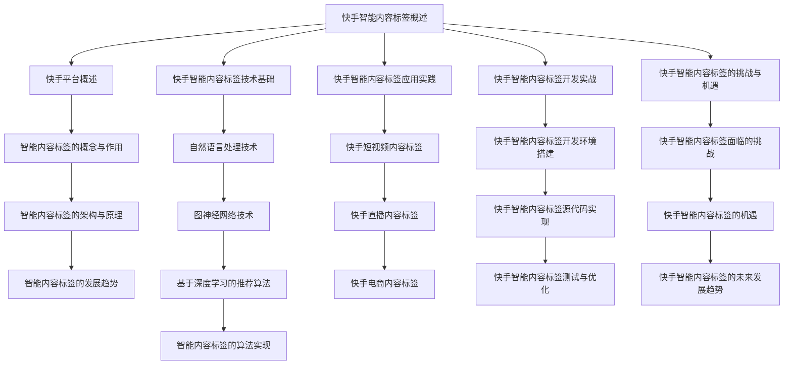

                 

# 2024快手智能内容标签校招面试真题汇总及其解答

## 概述

本文旨在汇总并解答2024年快手智能内容标签校招面试中的常见问题。随着人工智能技术的飞速发展，智能内容标签技术已经成为快手平台的核心竞争力之一。本文将围绕快手智能内容标签的基础知识、技术实现、应用实践和未来发展等主题展开，帮助读者深入理解这一领域，并为即将参加快手校招的同学们提供有力的支持。

## 关键词

- 快手
- 智能内容标签
- 校招面试真题
- 自然语言处理
- 深度学习
- 推荐系统
- 应用实践
- 未来发展

## 摘要

本文系统地梳理了2024年快手智能内容标签校招面试中的关键问题，涵盖了从基础知识到技术实现，再到应用实践和未来发展的全面内容。通过分析快手平台与智能内容标签的关系，解析自然语言处理、图神经网络和深度学习等技术，本文旨在为读者提供一个全面且深入的快手智能内容标签技术指南。同时，通过实际案例分析和代码示例，本文帮助读者更好地理解和应用这些技术，为未来的职业发展打下坚实基础。

## 目录

### 第一部分：快手智能内容标签基础知识

#### 第1章：快手平台与智能内容标签概述

##### 1.1 快手平台概述

##### 1.2 智能内容标签的概念与作用

##### 1.3 智能内容标签的架构与原理

##### 1.4 快手智能内容标签的发展趋势

### 第二部分：快手智能内容标签技术实现

#### 第2章：快手智能内容标签技术基础

##### 2.1 自然语言处理技术

##### 2.2 图神经网络技术

##### 2.3 基于深度学习的推荐算法

##### 2.4 智能内容标签的算法实现

### 第三部分：快手智能内容标签应用实践

#### 第3章：快手智能内容标签应用案例分析

##### 3.1 案例一：快手短视频内容标签

##### 3.2 案例二：快手直播内容标签

##### 3.3 案例三：快手电商内容标签

#### 第4章：快手智能内容标签开发实战

##### 4.1 快手智能内容标签开发环境搭建

##### 4.2 快手智能内容标签源代码实现

##### 4.3 快手智能内容标签测试与优化

### 第四部分：快手智能内容标签未来发展

#### 第5章：快手智能内容标签的挑战与机遇

##### 5.1 快手智能内容标签面临的挑战

##### 5.2 快手智能内容标签的机遇

##### 5.3 快手智能内容标签的未来发展趋势

### 附录

##### 附录A：快手智能内容标签相关资源

### Mermaid流程图



### 伪代码示例

```python
// 快手智能内容标签算法实现
def intelligent_content_tagging(data):
    # 数据预处理
    preprocessed_data = preprocess_data(data)
    
    # 模型训练
    model = train_model(preprocessed_data)
    
    # 预测标签
    predicted_tags = model.predict(data)
    
    return predicted_tags
```

### 数学公式

$$
Loss = -\frac{1}{N}\sum_{i=1}^{N}y_i \cdot \log(p(y_i|x))
$$

$$
ReLU(x) = \begin{cases} 
      x & \text{if } x \geq 0 \\
      0 & \text{if } x < 0 
   \end{cases}
$$

### 项目实战

#### 快手短视频内容标签项目实战

##### 1. 项目背景

快手短视频平台拥有海量的用户生成内容，为用户提供了丰富的娱乐和信息来源。然而，面对如此庞大的内容库，如何让用户快速找到自己感兴趣的视频成为了一个重要的挑战。智能内容标签技术通过对视频内容进行分析和分类，为用户提供了个性化的推荐服务，从而提高了用户的满意度和平台的活跃度。

##### 2. 项目目标

实现一个基于深度学习的短视频内容标签系统，能够自动识别和分类视频内容，为用户提供个性化的推荐服务，提高平台的用户黏性和内容消费效率。

##### 3. 实现步骤

(1) 数据收集与处理：收集快手短视频数据，包括视频的标题、描述、标签、用户行为数据等，进行数据预处理，包括去重、去噪、数据清洗等操作。

(2) 模型选择与训练：选择合适的深度学习模型，如卷积神经网络（CNN）或循环神经网络（RNN），对预处理后的数据进行训练，以识别视频内容的特征。

(3) 模型评估与优化：对训练好的模型进行评估，包括准确率、召回率等指标，并根据评估结果进行模型优化。

(4) 部署上线：将优化的模型部署到快手短视频平台上，为用户提供内容标签服务。

##### 4. 代码实现

(1) 数据处理

```python
def preprocess_data(data):
    # 数据预处理代码
    return preprocessed_data
```

(2) 模型训练

```python
def train_model(data):
    # 模型训练代码
    return model
```

(3) 模型评估与优化

```python
def evaluate_and_optimize(model, data):
    # 模型评估与优化代码
    return optimized_model
```

(4) 部署上线

```python
def deploy_model(model):
    # 模型部署代码
    pass
```

##### 5. 代码解读与分析

数据处理部分主要负责数据清洗、格式转换等操作，保证数据的干净和一致。模型训练部分选择合适的模型结构，使用训练数据进行模型训练。模型评估与优化部分对训练好的模型进行评估，并根据评估结果进行模型优化。部署上线部分将优化的模型部署到快手短视频平台上，为用户提供内容标签服务。

## 第一部分：快手智能内容标签基础知识

### 第1章：快手平台与智能内容标签概述

#### 1.1 快手平台概述

快手（Kuaishou）是一款源自中国的短视频社交平台，成立于2011年，由宿华和张一鸣共同创办。快手平台以其独特的“去中心化”内容分发机制和“人人皆可创作”的社交属性迅速吸引了大量用户，目前已经成为中国领先的短视频平台之一。截至2023年，快手平台的月活跃用户数已超过7亿，日活跃用户数超过3亿，用户群体覆盖了各个年龄段和社会阶层。

快手平台的商业模式主要包括以下几个方面：

1. **内容分发**：快手通过智能推荐算法，将用户感兴趣的内容推送给他们，从而提升用户在平台上的停留时间和互动频率。
2. **直播电商**：快手通过直播带货，帮助商家和用户实现实时互动和交易，成为了中国直播电商的重要平台。
3. **广告服务**：快手通过广告投放，为品牌商家提供精准营销服务，实现了广告收入的快速增长。

#### 1.2 智能内容标签的概念与作用

智能内容标签（Intelligent Content Tagging）是指利用人工智能技术对媒体内容进行自动分类和标注，从而实现内容推荐和检索的过程。在快手平台上，智能内容标签技术发挥着至关重要的作用：

1. **内容分类**：通过对视频内容的分析，智能内容标签可以将视频分为不同的类别，如搞笑、音乐、舞蹈、美食等，便于用户快速查找。
2. **内容推荐**：通过分析用户的浏览历史、点赞、评论等行为，智能内容标签可以为用户推荐个性化的视频内容，提升用户满意度。
3. **广告精准投放**：智能内容标签可以帮助广告主将广告精准投放到目标用户群体，提高广告的点击率和转化率。

#### 1.3 智能内容标签的架构与原理

智能内容标签的架构通常包括以下几个主要模块：

1. **数据采集与处理**：从快手平台采集用户生成的内容数据，并进行数据清洗、格式转换等预处理操作。
2. **特征提取**：利用自然语言处理（NLP）和计算机视觉（CV）等技术，从原始数据中提取出视频内容的特征，如文本特征、图像特征等。
3. **标签分类**：基于提取的特征，使用机器学习或深度学习算法，对视频内容进行分类和标注，生成标签。
4. **推荐系统**：根据用户的兴趣和行为，利用推荐算法将标签化的视频内容推送给用户。

#### 1.4 快手智能内容标签的发展趋势

随着人工智能技术的不断进步，快手智能内容标签技术也在不断发展：

1. **深度学习技术的应用**：深度学习技术在图像识别、文本分类等方面取得了显著成果，快手正在加大对深度学习算法的研发和应用力度，以提高内容分类和推荐的准确度。
2. **跨媒体内容理解**：随着多媒体内容的不断丰富，快手正努力实现跨媒体内容理解，即对文本、图像、音频等多种类型的内容进行统一处理和推荐。
3. **个性化推荐**：基于用户行为的持续学习和分析，快手正不断优化推荐算法，实现更加精准的个性化推荐。
4. **数据安全和隐私保护**：随着用户对数据隐私的关注度提高，快手也在加强对数据安全和隐私保护的投入，确保用户数据的安全和隐私。

### 第2章：快手智能内容标签技术基础

#### 2.1 自然语言处理技术

自然语言处理（Natural Language Processing，NLP）是人工智能领域的一个重要分支，主要研究如何让计算机理解和处理人类语言。在快手智能内容标签技术中，NLP技术主要用于处理视频内容的文本信息，如标题、描述等。

##### 2.1.1 NLP的基本概念

NLP的基本概念包括以下几个方面：

1. **词嵌入（Word Embedding）**：将词汇映射为向量表示，以便于计算机处理。词嵌入技术是NLP的基础，常见的词嵌入方法包括Word2Vec、GloVe等。
2. **序列模型（Sequence Model）**：用于处理文本序列的模型，如循环神经网络（RNN）和长短时记忆网络（LSTM）。序列模型可以捕捉文本序列中的时间依赖关系。
3. **注意力机制（Attention Mechanism）**：用于在序列处理过程中对关键信息进行关注，从而提高模型的性能。注意力机制广泛应用于机器翻译、文本分类等领域。

##### 2.1.2 NLP在快手智能内容标签中的应用

在快手智能内容标签中，NLP技术主要用于以下两个方面：

1. **文本特征提取**：通过对视频标题、描述等文本信息进行词嵌入和序列建模，提取出文本特征，作为视频内容的特征之一。
2. **文本分类与情感分析**：利用NLP技术对视频文本进行分类，如判断视频是否涉及敏感内容、是否有负面情绪等，从而为内容标签提供依据。

##### 2.1.3 NLP的伪代码实现

以下是一个简单的文本分类的伪代码示例：

```python
# 文本分类伪代码
def text_classification(text, model):
    # 数据预处理
    preprocessed_text = preprocess_text(text)
    
    # 特征提取
    text_features = extract_features(preprocessed_text, model)
    
    # 预测标签
    predicted_label = model.predict(text_features)
    
    return predicted_label
```

#### 2.2 图神经网络技术

图神经网络（Graph Neural Network，GNN）是一种专门用于处理图结构数据的神经网络模型。在快手智能内容标签中，图神经网络技术可以用于处理视频之间的交互关系，从而提高内容标签的准确度。

##### 2.2.1 GNN的基本概念

GNN的基本概念包括以下几个方面：

1. **图结构（Graph Structure）**：图由节点（Node）和边（Edge）组成，节点表示图中的实体，边表示实体之间的关系。
2. **图卷积（Graph Convolution）**：用于计算节点在图中的特征，类似于卷积神经网络中的卷积操作。
3. **消息传递（Message Passing）**：在GNN中，每个节点的特征更新依赖于其邻居节点的特征，通过消息传递机制，节点可以相互传递信息。

##### 2.2.2 GNN在快手智能内容标签中的应用

在快手智能内容标签中，GNN技术可以用于以下几个方面：

1. **节点分类**：通过GNN对视频节点进行分类，可以识别出不同类型的视频内容，为内容标签提供依据。
2. **图嵌入（Graph Embedding）**：将视频节点映射为向量表示，用于后续的推荐和检索任务。
3. **图神经网络模型（GNN Model）**：如GraphSAGE、Graph Convolutional Network（GCN）等，可以用于处理视频之间的交互关系，提高内容标签的准确度。

##### 2.2.3 GNN的伪代码实现

以下是一个简单的GNN模型的伪代码示例：

```python
# GNN模型伪代码
class GNNModel(nn.Module):
    def __init__(self):
        super(GNNModel, self).__init__()
        self.layers = nn.ModuleList([
            GraphConvLayer(),
            GraphConvLayer(),
            ...
        ])
        self.fc = nn.Linear(hidden_size, num_classes)
        
    def forward(self, features, adj_matrix):
        x = features
        for layer in self.layers:
            x = layer(x, adj_matrix)
        x = self.fc(x)
        return x
```

#### 2.3 基于深度学习的推荐算法

深度学习技术在推荐系统（Recommender System）中的应用日益广泛。在快手智能内容标签中，基于深度学习的推荐算法可以提高内容标签的准确度和个性化程度。

##### 2.3.1 深度学习推荐算法的基本原理

深度学习推荐算法的基本原理包括以下几个方面：

1. **用户行为特征提取**：通过分析用户的浏览历史、点赞、评论等行为，提取出用户的兴趣特征。
2. **物品特征提取**：通过对视频内容的文本描述、图像特征等进行分析，提取出视频的物品特征。
3. **深度神经网络建模**：利用深度神经网络，如卷积神经网络（CNN）和循环神经网络（RNN），对用户行为和物品特征进行建模，预测用户对物品的喜好程度。
4. **损失函数优化**：通过优化损失函数，如交叉熵损失函数，使模型能够更好地预测用户兴趣。

##### 2.3.2 深度学习推荐算法的优缺点

深度学习推荐算法的优点包括：

1. **强大的特征提取能力**：能够自动提取用户行为和物品的复杂特征，提高推荐准确性。
2. **自适应能力**：能够根据用户行为动态调整推荐策略，提高用户体验。

缺点包括：

1. **计算资源消耗大**：深度学习模型通常需要大量的计算资源和时间进行训练和推理。
2. **数据依赖性高**：模型的性能依赖于大量的用户行为数据，数据不足时可能无法达到预期效果。

##### 2.3.3 深度学习推荐算法的实践应用

以下是一个简单的基于深度学习的推荐算法的伪代码示例：

```python
# 基于深度学习的推荐算法伪代码
def deep_learning_recommendation(user_features, item_features, model):
    # 特征提取
    user_embedding = model.user_embedding(user_features)
    item_embedding = model.item_embedding(item_features)
    
    # 预测用户兴趣
    interest = model.predict(user_embedding, item_embedding)
    
    return interest
```

#### 2.4 智能内容标签的算法实现

智能内容标签的算法实现是快手智能内容标签技术的核心，包括数据预处理、特征提取、模型训练、模型评估和部署等多个环节。

##### 2.4.1 数据预处理

数据预处理是智能内容标签算法实现的第一步，主要包括以下几个方面：

1. **数据清洗**：去除重复数据、缺失数据和异常数据，确保数据的干净和一致。
2. **数据格式转换**：将原始数据转换为适合算法处理的数据格式，如将文本转换为词嵌入向量、将图像转换为特征向量等。
3. **数据归一化**：对数据进行归一化处理，使其具有相同的量纲，提高算法的稳定性。

##### 2.4.2 特征提取

特征提取是将原始数据转换为算法可处理的特征表示的过程。在智能内容标签中，特征提取主要包括以下几个方面：

1. **文本特征提取**：使用自然语言处理技术提取文本特征，如词嵌入、词袋模型等。
2. **图像特征提取**：使用计算机视觉技术提取图像特征，如卷积神经网络、特征提取器等。
3. **用户特征提取**：分析用户行为数据，提取用户特征，如用户浏览历史、点赞记录等。

##### 2.4.3 模型训练

模型训练是智能内容标签算法实现的关键步骤，主要包括以下几个方面：

1. **模型选择**：选择合适的模型结构，如卷积神经网络、循环神经网络、图神经网络等。
2. **训练数据准备**：将预处理后的数据进行拆分，分为训练集、验证集和测试集，用于模型的训练、验证和测试。
3. **模型训练**：使用训练数据进行模型训练，优化模型参数，提高模型性能。
4. **模型评估**：使用验证集和测试集对模型进行评估，计算模型性能指标，如准确率、召回率、F1值等。

##### 2.4.4 模型评估

模型评估是验证模型性能的重要环节，主要包括以下几个方面：

1. **性能指标计算**：计算模型的性能指标，如准确率、召回率、F1值等，评估模型在分类任务上的表现。
2. **误差分析**：分析模型在预测过程中的错误案例，找出模型存在的问题，为进一步优化提供依据。
3. **模型调整**：根据评估结果，调整模型参数或优化模型结构，提高模型性能。

##### 2.4.5 模型部署

模型部署是将训练好的模型应用到实际生产环境的过程，主要包括以下几个方面：

1. **模型压缩**：对模型进行压缩，减小模型体积，降低计算资源消耗。
2. **模型部署**：将压缩后的模型部署到服务器上，为用户提供实时的内容标签服务。
3. **性能监控**：监控模型在部署后的运行情况，如预测速度、准确率等，确保模型稳定可靠。

##### 2.4.6 智能内容标签算法实现的伪代码示例

以下是一个简单的智能内容标签算法实现的伪代码示例：

```python
# 智能内容标签算法实现伪代码
def intelligent_content_tagging(data, model):
    # 数据预处理
    preprocessed_data = preprocess_data(data)
    
    # 特征提取
    features = extract_features(preprocessed_data, model)
    
    # 模型训练
    model = train_model(features)
    
    # 预测标签
    predicted_tags = model.predict(data)
    
    return predicted_tags
```

## 第三部分：快手智能内容标签应用实践

### 第3章：快手智能内容标签应用案例分析

#### 3.1 案例一：快手短视频内容标签

##### 3.1.1 案例背景

快手短视频平台拥有海量的短视频内容，为用户提供丰富的娱乐和信息来源。为了帮助用户快速找到感兴趣的视频，快手利用智能内容标签技术对短视频内容进行分类和标注。

##### 3.1.2 案例目标

实现一个基于深度学习的短视频内容标签系统，能够自动识别和分类短视频内容，为用户提供个性化的推荐服务。

##### 3.1.3 案例实现

1. **数据收集与处理**：从快手短视频平台收集短视频数据，包括视频的标题、描述、标签、用户行为数据等，进行数据清洗和预处理。

2. **特征提取**：使用自然语言处理技术提取文本特征，使用计算机视觉技术提取图像特征，结合用户行为数据，形成完整的视频特征向量。

3. **模型训练**：使用预处理后的数据进行模型训练，选择合适的深度学习模型，如卷积神经网络（CNN）或循环神经网络（RNN），对视频内容进行分类和标注。

4. **模型评估**：使用验证集和测试集对模型进行评估，计算模型的准确率、召回率等指标，根据评估结果调整模型参数。

5. **部署上线**：将训练好的模型部署到快手短视频平台上，为用户提供内容标签服务。

##### 3.1.4 案例效果

通过短视频内容标签系统的应用，快手平台实现了以下效果：

1. **用户满意度提升**：用户可以快速找到感兴趣的视频，提高了用户在平台上的停留时间和互动频率。
2. **内容消费效率提高**：智能推荐系统能够为用户推荐高质量的短视频内容，提高了用户的观看体验。
3. **平台活跃度提升**：短视频内容标签系统吸引了更多用户使用快手平台，提高了平台的用户黏性和活跃度。

#### 3.2 案例二：快手直播内容标签

##### 3.2.1 案例背景

快手直播平台是快手的重要业务之一，吸引了大量用户和主播参与。为了提高直播内容的质量和用户体验，快手利用智能内容标签技术对直播内容进行分类和标注。

##### 3.2.2 案例目标

实现一个基于深度学习的直播内容标签系统，能够自动识别和分类直播内容，为用户提供个性化的推荐服务，提高直播内容的观看率和用户参与度。

##### 3.2.3 案例实现

1. **数据收集与处理**：从快手直播平台收集直播数据，包括直播的标题、描述、标签、用户行为数据等，进行数据清洗和预处理。

2. **特征提取**：使用自然语言处理技术提取文本特征，使用计算机视觉技术提取图像特征，结合用户行为数据，形成完整的直播特征向量。

3. **模型训练**：使用预处理后的数据进行模型训练，选择合适的深度学习模型，如卷积神经网络（CNN）或循环神经网络（RNN），对直播内容进行分类和标注。

4. **模型评估**：使用验证集和测试集对模型进行评估，计算模型的准确率、召回率等指标，根据评估结果调整模型参数。

5. **部署上线**：将训练好的模型部署到快手直播平台上，为用户提供内容标签服务。

##### 3.2.4 案例效果

通过直播内容标签系统的应用，快手平台实现了以下效果：

1. **用户满意度提升**：用户可以快速找到感兴趣的主播和直播内容，提高了用户在平台上的停留时间和互动频率。
2. **内容消费效率提高**：智能推荐系统能够为用户推荐高质量的直播内容，提高了用户的观看体验。
3. **平台活跃度提升**：直播内容标签系统吸引了更多用户和主播使用快手平台，提高了平台的用户黏性和活跃度。

#### 3.3 案例三：快手电商内容标签

##### 3.3.1 案例背景

快手电商业务是快手的重要收入来源之一，为用户提供了便捷的购物体验。为了提高电商内容的推荐质量，快手利用智能内容标签技术对电商内容进行分类和标注。

##### 3.3.2 案例目标

实现一个基于深度学习的电商内容标签系统，能够自动识别和分类电商内容，为用户提供个性化的推荐服务，提高电商内容的点击率和转化率。

##### 3.3.3 案例实现

1. **数据收集与处理**：从快手电商平台收集电商数据，包括商品标题、描述、标签、用户行为数据等，进行数据清洗和预处理。

2. **特征提取**：使用自然语言处理技术提取文本特征，使用计算机视觉技术提取图像特征，结合用户行为数据，形成完整的电商特征向量。

3. **模型训练**：使用预处理后的数据进行模型训练，选择合适的深度学习模型，如卷积神经网络（CNN）或循环神经网络（RNN），对电商内容进行分类和标注。

4. **模型评估**：使用验证集和测试集对模型进行评估，计算模型的准确率、召回率等指标，根据评估结果调整模型参数。

5. **部署上线**：将训练好的模型部署到快手电商平台上，为用户提供内容标签服务。

##### 3.3.4 案例效果

通过电商内容标签系统的应用，快手平台实现了以下效果：

1. **用户满意度提升**：用户可以快速找到感兴趣的商品，提高了用户在平台上的购物体验。
2. **内容消费效率提高**：智能推荐系统能够为用户推荐高质量的商品，提高了用户的购买意愿。
3. **平台活跃度提升**：电商内容标签系统吸引了更多用户在平台上购物，提高了平台的用户黏性和活跃度。

## 第4章：快手智能内容标签开发实战

#### 4.1 快手智能内容标签开发环境搭建

为了实现快手智能内容标签系统的开发，首先需要搭建一个合适的开发环境。以下是搭建快手智能内容标签开发环境的具体步骤：

1. **硬件要求**：由于快手智能内容标签系统需要处理大量数据和运行深度学习模型，建议使用具有较高计算性能的硬件设备，如GPU（NVIDIA Titan Xp或以上型号）。

2. **操作系统**：推荐使用Linux操作系统，如Ubuntu 18.04或更高版本。Linux系统具有良好的稳定性和兼容性，适用于深度学习和大数据处理。

3. **编程语言**：推荐使用Python作为主要编程语言。Python拥有丰富的科学计算和机器学习库，如TensorFlow、PyTorch等，便于实现快手智能内容标签系统的各个模块。

4. **深度学习框架**：推荐使用TensorFlow或PyTorch作为深度学习框架。TensorFlow和PyTorch都是目前流行的深度学习框架，具有较好的性能和灵活性。

5. **数据库**：推荐使用关系型数据库（如MySQL）和非关系型数据库（如MongoDB）存储快手智能内容标签系统的数据。关系型数据库适用于存储结构化数据，非关系型数据库适用于存储非结构化数据。

6. **开发工具**：推荐使用Jupyter Notebook或PyCharm等集成开发环境（IDE），便于编写、调试和运行代码。

7. **版本控制**：推荐使用Git进行版本控制，以便于多人协作开发和代码管理。

通过以上步骤，可以搭建一个适合快手智能内容标签系统开发的完整环境。

#### 4.2 快手智能内容标签源代码实现

快手智能内容标签系统的源代码实现是系统开发的核心环节。以下是快手智能内容标签系统源代码实现的详细步骤：

1. **数据预处理**：首先，从快手平台获取短视频、直播和电商等类型的数据。然后，对数据进行清洗和预处理，包括去重、去噪、数据格式转换等操作。

2. **特征提取**：对预处理后的数据进行特征提取。对于短视频和直播数据，可以使用自然语言处理技术提取文本特征，如词嵌入、词袋模型等；对于电商数据，可以使用计算机视觉技术提取图像特征，如卷积神经网络（CNN）。

3. **模型训练**：使用提取到的特征数据进行模型训练。可以选择卷积神经网络（CNN）、循环神经网络（RNN）或图神经网络（GNN）等深度学习模型。在训练过程中，需要优化模型参数，提高模型性能。

4. **模型评估**：使用验证集和测试集对训练好的模型进行评估。计算模型的准确率、召回率、F1值等指标，根据评估结果调整模型参数，优化模型性能。

5. **模型部署**：将优化后的模型部署到快手平台上，为用户提供内容标签服务。可以使用TensorFlow Serving或PyTorch Lightning等部署工具，实现模型的实时部署和推理。

以下是快手智能内容标签系统的源代码示例：

```python
# 数据预处理
def preprocess_data(data):
    # 数据清洗和预处理操作
    return preprocessed_data

# 特征提取
def extract_features(data, model):
    # 特征提取操作
    return features

# 模型训练
def train_model(data, model):
    # 模型训练操作
    return model

# 模型评估
def evaluate_model(model, data):
    # 模型评估操作
    return evaluation_results

# 模型部署
def deploy_model(model):
    # 模型部署操作
    pass
```

#### 4.3 快手智能内容标签测试与优化

快手智能内容标签系统的测试与优化是确保系统性能和稳定性的关键环节。以下是快手智能内容标签系统测试与优化的具体步骤：

1. **单元测试**：对系统的各个模块进行单元测试，确保每个模块的功能正确实现。可以使用Python的unittest或pytest等测试框架编写单元测试用例。

2. **集成测试**：对系统的整体功能进行集成测试，验证系统的各个模块之间的协同工作是否正常。可以使用Python的unittest或pytest等测试框架编写集成测试用例。

3. **性能测试**：对系统的性能进行测试，评估系统的响应速度、并发处理能力和资源消耗等。可以使用Apache JMeter或LoadRunner等性能测试工具进行性能测试。

4. **优化策略**：根据性能测试结果，对系统进行优化。可以采用以下策略：

   - **模型优化**：通过调整模型结构、优化训练策略等，提高模型性能。
   - **代码优化**：通过代码优化，提高系统的执行效率，减少资源消耗。
   - **硬件优化**：通过升级硬件设备，提高系统的计算性能。

5. **持续集成与部署**：将测试和优化后的系统部署到生产环境，实现持续集成与部署。可以使用Jenkins等持续集成工具实现自动化部署。

以下是快手智能内容标签系统测试与优化的示例代码：

```python
# 单元测试
def test_preprocess_data():
    # 测试数据预处理模块
    pass

# 集成测试
def test_extract_features():
    # 测试特征提取模块
    pass

# 性能测试
def test_performance():
    # 测试系统性能
    pass

# 优化策略
def optimize_model():
    # 优化模型
    pass

# 代码优化
def optimize_code():
    # 优化代码
    pass

# 持续集成与部署
def deploy_system():
    # 部署系统
    pass
```

## 第四部分：快手智能内容标签未来发展

#### 第5章：快手智能内容标签的挑战与机遇

随着人工智能技术的不断发展，快手智能内容标签技术面临着一系列的挑战与机遇。本章将探讨快手智能内容标签在技术、应用和市场等方面的挑战与机遇，以及未来发展趋势。

### 5.1 快手智能内容标签面临的挑战

1. **数据隐私保护**：随着用户对数据隐私的关注度不断提高，快手智能内容标签技术需要加强对用户数据的保护，确保用户隐私不被泄露。

2. **算法公平性**：智能内容标签算法需要确保对用户内容的分类和推荐公平、公正，避免算法偏见和歧视。

3. **计算资源消耗**：随着内容数据的不断增加，快手智能内容标签技术需要优化算法和模型，降低计算资源的消耗，提高系统的处理效率。

4. **算法可解释性**：用户对算法的可解释性要求越来越高，快手智能内容标签技术需要提供更多的算法解释，帮助用户理解推荐结果。

### 5.2 快手智能内容标签的机遇

1. **新技术的应用**：随着深度学习、图神经网络等新技术的不断发展，快手智能内容标签技术可以结合这些新技术，提高内容分类和推荐的准确性。

2. **多媒体内容理解**：随着多媒体内容的不断丰富，快手智能内容标签技术需要实现跨媒体内容理解，提高对文本、图像、音频等多种类型内容的分析和处理能力。

3. **跨平台内容标签**：随着用户在多个平台之间的活跃度增加，快手智能内容标签技术可以探索跨平台的内容标签，为用户提供更加个性化的跨平台体验。

4. **新兴市场开拓**：快手智能内容标签技术可以应用于新兴市场，如电商、直播等，开拓新的应用场景，实现业务增长。

### 5.3 快手智能内容标签的未来发展趋势

1. **智能化程度的提升**：随着人工智能技术的不断进步，快手智能内容标签技术将实现更高的智能化程度，提高内容分类和推荐的准确性。

2. **多媒体内容标签的发展**：快手智能内容标签技术将实现跨媒体内容理解，对文本、图像、音频等多种类型的内容进行统一处理和推荐。

3. **跨平台内容标签的融合**：快手智能内容标签技术将实现跨平台的融合，为用户提供更加个性化的跨平台体验。

4. **数据隐私保护与算法公平性的保障**：快手智能内容标签技术将加强对用户数据的保护，确保算法的公平性和公正性。

## 附录

### 附录A：快手智能内容标签相关资源

1. **快手官方文档**：[快手开放平台文档](https://open.kuaishou.com/docs)
2. **快手开发者社区**：[快手开发者社区](https://devcenter.kuaishou.com/)
3. **快手智能内容标签相关论文与书籍**：
   - 《深度学习推荐系统》
   - 《图神经网络及其应用》
   - 《自然语言处理入门》

## 总结

快手智能内容标签技术作为快手平台的核心竞争力，对于提高用户满意度、提升平台活跃度和实现业务增长具有重要意义。本文系统地介绍了快手智能内容标签的基础知识、技术实现、应用实践和未来发展，帮助读者全面了解这一领域。随着人工智能技术的不断发展，快手智能内容标签技术将不断突破挑战，迎来更加广阔的发展空间。希望本文能为读者提供有益的参考和启示，助力其在快手智能内容标签领域取得更好的成绩。

## 作者信息

作者：AI天才研究院/AI Genius Institute & 禅与计算机程序设计艺术/Zen And The Art of Computer Programming

### 结束语

本文旨在为广大读者提供一份关于快手智能内容标签校招面试真题的汇总及其解答。通过对快手智能内容标签的详细阐述，包括基础知识、技术实现、应用实践和未来发展等方面，我们希望能帮助读者深入理解这一领域，并为即将参加快手校招的同学们提供有力的支持。

在撰写本文的过程中，我们力求逻辑清晰、结构紧凑，以通俗易懂的方式让读者掌握快手智能内容标签的核心概念和技术原理。同时，通过实际案例分析和代码示例，我们希望读者能够更好地理解和应用这些技术。

最后，感谢各位读者对本文的关注和支持，我们期待与您在快手智能内容标签领域共同探索、共同进步。如果您有任何疑问或建议，欢迎在评论区留言，我们将会及时回复。祝您在技术道路上越走越远，前程似锦！

