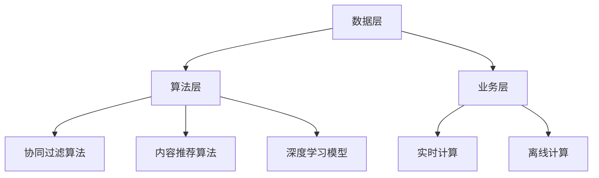

                 

# 《2024快手智能推荐系统校招面试真题汇总及其解答》

## 摘要

本文旨在为广大准备参与快手2024年校招的考生提供一份系统性的面试真题解析资料。随着互联网时代的快速发展，智能推荐系统已经成为各大互联网平台的核心竞争力。快手作为一家以短视频为核心的社交媒体平台，其智能推荐系统在提升用户粘性和平台活跃度方面发挥着至关重要的作用。本文将围绕快手智能推荐系统的基本原理、核心算法、工程实践及面试真题进行详细讲解，帮助考生全面掌握相关知识点，为面试做好充分准备。

## 目录

1. **快手智能推荐系统概述**
    - 1.1 快手平台与推荐系统的重要性
    - 1.2 智能推荐系统的发展历程
    - 1.3 快手智能推荐系统的架构与原理

2. **快手推荐系统的核心算法**
    - 2.1 Collaborative Filtering 算法
    - 2.2 Content-Based Filtering 算法
    - 2.3 Hybrid Recommendation Algorithm

3. **快手推荐系统的实践与优化**
    - 3.1 快手推荐系统的实时性与稳定性
    - 3.2 数据采集与预处理
    - 3.3 快手推荐系统的评价指标

4. **快手校招面试真题解析**
    - 4.1 推荐系统算法面试真题解析
    - 4.2 推荐系统工程面试真题解析

5. **快手智能推荐系统项目实战**
    - 5.1 项目背景与目标
    - 5.2 项目开发环境搭建
    - 5.3 数据采集与预处理
    - 5.4 推荐算法实现与优化
    - 5.5 项目部署与上线

6. **快手智能推荐系统面试真题总结**
    - 6.1 面试真题总结
    - 6.2 面试技巧与注意事项

7. **附录**
    - 7.1 快手推荐系统常用工具与资源
    - 7.2 快手推荐系统面试真题汇总
    - 7.3 快手推荐系统常见问题与解答

---

在接下来的内容中，我们将逐步深入探讨快手智能推荐系统的各个方面，为您的校招面试之路提供坚实的支持。

---

## 快手智能推荐系统概述

### 1.1 快手平台与推荐系统的重要性

快手（Kuaishou）作为一家全球领先的短视频平台，拥有庞大的用户基础和海量的内容资源。截至2023年，快手的月活跃用户数已超过5亿，用户遍及全球多个国家和地区。快手平台的成功离不开其强大的智能推荐系统，该系统能够根据用户的兴趣和行为习惯，精准推送个性化内容，从而提升用户的粘性和活跃度。

**快手平台概况**：快手成立于2011年，最初以“GIF快手”的形式出现，后逐渐转型为短视频平台。快手以“让每个人都能表达自己”为使命，致力于为用户提供一个开放、平等、真实的内容生态。快手平台涵盖了生活、娱乐、教育、购物等多个领域，用户可以在平台上分享短视频、直播、动态等内容。

**推荐系统的作用与意义**：智能推荐系统在快手平台中扮演着至关重要的角色。首先，推荐系统能够根据用户的历史行为和兴趣，为用户推荐他们可能感兴趣的内容，从而提升用户的满意度和使用时长。其次，推荐系统有助于平台内容的多样化，使更多优质内容得到曝光，促进平台生态的繁荣。最后，推荐系统还能为平台带来更高的广告收入和商业价值，帮助企业实现盈利目标。

### 1.2 智能推荐系统的发展历程

智能推荐系统的发展可以追溯到20世纪初，随着互联网和大数据技术的不断演进，推荐系统逐渐成为各大互联网平台的核心竞争力。以下是智能推荐系统的发展历程：

1. **内容推荐阶段（2000年初-2010年初）**：早期推荐系统主要基于内容的相似性进行推荐，例如根据用户浏览、搜索、收藏等行为，为用户推荐相似的内容。这一阶段的推荐系统主要采用基于关键词、标签等内容的匹配算法。

2. **协同过滤阶段（2010年初-2015年初）**：随着互联网用户数量的增加和用户行为的多样化，基于内容的推荐系统逐渐暴露出其局限性。协同过滤算法应运而生，通过对用户之间的行为进行相似度计算，实现个性化推荐。协同过滤算法主要分为基于用户的协同过滤（User-Based CF）和基于模型的协同过滤（Model-Based CF）。

3. **混合推荐阶段（2015年初至今）**：为了进一步提升推荐系统的效果，混合推荐算法逐渐成为主流。混合推荐算法结合了基于内容的推荐和协同过滤推荐，通过融合多种算法的优势，实现更精准的推荐效果。

### 1.3 快手智能推荐系统的架构与原理

快手智能推荐系统的架构主要分为三个层次：数据层、算法层和业务层。

**数据层**：数据层是快手智能推荐系统的基础，包括用户数据、内容数据和行为数据等。用户数据主要包括用户的基本信息、兴趣爱好、行为记录等；内容数据包括视频的标题、标签、类别、时长等；行为数据包括用户的浏览、点赞、评论、分享等操作记录。

**算法层**：算法层是快手智能推荐系统的核心，包括多种推荐算法和模型。其中，基于协同过滤的推荐算法和基于内容的推荐算法是快手智能推荐系统的两大支柱。此外，快手还采用了深度学习等先进技术，不断提升推荐系统的效果。

**业务层**：业务层负责将推荐算法和模型应用于实际业务场景，实现个性化推荐。快手智能推荐系统通过实时计算和离线计算相结合，为用户实时推送个性化内容。

**Mermaid流程图**：



以上是快手智能推荐系统的基本架构和原理。在接下来的章节中，我们将进一步探讨快手推荐系统的核心算法和实践经验。

---

## 快手推荐系统的核心算法

快手推荐系统的核心算法主要包括协同过滤（Collaborative Filtering）、基于内容的推荐（Content-Based Filtering）和混合推荐（Hybrid Recommendation Algorithm）。这些算法各有特点，适用于不同的推荐场景，共同构成了快手智能推荐系统的强大核心。

### 2.1 Collaborative Filtering 算法

**基本原理**：协同过滤算法是基于用户行为和偏好进行推荐的。它通过计算用户之间的相似度，找出相似用户的行为和偏好，然后向目标用户推荐相似用户喜欢的内容。

**实现方法**：
1. **基于用户的协同过滤（User-Based CF）**：
   - 计算用户之间的相似度：通常采用余弦相似度、皮尔逊相关系数等算法计算用户之间的相似度。
   - 找出相似用户：根据相似度矩阵找出与目标用户最相似的K个用户。
   - 推荐内容：根据相似用户的行为和偏好，为用户推荐他们喜欢的内容。

**伪代码**：

```python
# 基于用户的协同过滤算法
def user_based_cf(train_data, target_user, k):
    # 计算用户之间的相似度
    similarity_matrix = compute_similarity(train_data)
    
    # 找出与目标用户最相似的K个用户
    similar_users = find_top_k_users(similarity_matrix, target_user, k)
    
    # 推荐内容
    recommendations = []
    for user in similar_users:
        recommendations.extend(train_data[user])
    
    return recommendations
```

2. **基于模型的协同过滤（Model-Based CF）**：
   - 训练预测模型：使用机器学习算法（如矩阵分解、神经网络等）训练预测模型。
   - 预测用户偏好：根据训练好的模型预测目标用户对未知内容的偏好。
   - 推荐内容：根据预测结果为用户推荐内容。

**伪代码**：

```python
# 基于模型的协同过滤算法
def model_based_cf(train_data, target_user, model):
    # 训练预测模型
    predicted_ratings = model.predict(train_data, target_user)
    
    # 推荐内容
    recommendations = []
    for content, rating in predicted_ratings:
        if rating > threshold:
            recommendations.append(content)
    
    return recommendations
```

**优缺点**：
- **优点**：协同过滤算法可以捕捉用户之间的相似性，实现个性化推荐。
- **缺点**：对于新用户或新内容，无法进行推荐，即“冷启动”问题。

### 2.2 Content-Based Filtering 算法

**基本原理**：基于内容的推荐算法是根据用户对内容的兴趣进行推荐的。它通过计算用户和内容之间的相似度，为用户推荐相似的内容。

**实现方法**：
1. **文本表示**：将文本内容转换为向量的表示，如TF-IDF、Word2Vec等。
2. **计算相似度**：计算用户和内容之间的相似度，如余弦相似度、欧氏距离等。
3. **推荐内容**：根据相似度矩阵为用户推荐相似的内容。

**伪代码**：

```python
# 基于内容的推荐算法
def content_based_cf(content_data, target_user, k):
    # 计算用户和内容的相似度
    similarity_matrix = compute_similarity(content_data, target_user)
    
    # 推荐内容
    recommendations = []
    for content, similarity in sorted(similarity_matrix.items(), key=lambda x: x[1], reverse=True):
        if len(recommendations) >= k:
            break
        recommendations.append(content)
    
    return recommendations
```

**优缺点**：
- **优点**：适用于新用户和新内容，无需历史行为数据。
- **缺点**：无法捕捉用户之间的相似性，推荐结果可能过于单一。

### 2.3 Hybrid Recommendation Algorithm

**基本原理**：混合推荐算法结合了协同过滤和基于内容的推荐算法，通过融合多种算法的优势，实现更精准的推荐效果。

**实现方法**：
1. **融合策略**：将协同过滤和基于内容的推荐结果进行加权融合，得到最终的推荐结果。
2. **权重调整**：根据实际业务需求和数据特点，调整协同过滤和基于内容推荐的权重。

**伪代码**：

```python
# 混合推荐算法
def hybrid Recommendation Algorithm(train_data, content_data, target_user, k):
    # 计算协同过滤推荐结果
    collaborative_recommendations = user_based_cf(train_data, target_user, k)
    
    # 计算内容推荐结果
    content_based_recommendations = content_based_cf(content_data, target_user, k)
    
    # 加权融合推荐结果
    recommendations = []
    for rec in collaborative_recommendations:
        recommendations.append(rec * weight_collaborative)
    for rec in content_based_recommendations:
        recommendations.append(rec * weight_content)
    
    return recommendations
```

**优缺点**：
- **优点**：结合了协同过滤和基于内容推荐的优势，提高推荐效果。
- **缺点**：算法复杂度较高，需要平衡协同过滤和基于内容推荐之间的权重。

在快手智能推荐系统中，混合推荐算法是最为常用的算法，通过融合协同过滤和基于内容的推荐，实现了高效的个性化推荐。在接下来的章节中，我们将探讨快手推荐系统的实践与优化，以及校招面试中的相关真题解析。

---

## 快手推荐系统的实践与优化

快手推荐系统的实践与优化是保证其高效运行和不断提升用户体验的关键。在实践中，快手推荐系统需要处理海量数据、保证实时性和稳定性，同时不断优化算法和评价指标，以实现更精准的个性化推荐。

### 3.1 快手推荐系统的实时性与稳定性

**实时性保证**：快手推荐系统需要实现实时推荐，以满足用户在短时间内获取个性化内容的需求。为了实现实时性，快手推荐系统采用以下策略：

1. **分布式计算**：通过分布式计算框架（如Apache Spark、Flink等），将数据处理和计算任务分布在多台服务器上，提高数据处理速度。
2. **增量计算**：只对最新的用户行为数据进行处理和更新，减少计算量和延迟。
3. **缓存机制**：利用缓存（如Redis、Memcached等）存储热门内容和用户画像，提高数据读取速度。

**稳定性保证**：快手推荐系统需要保证在高并发和高负载情况下稳定运行，避免系统崩溃或推荐失败。为了实现稳定性，快手推荐系统采用以下策略：

1. **冗余设计**：通过冗余设计（如主从备份、集群部署等），确保系统在单点故障情况下仍能正常运行。
2. **负载均衡**：通过负载均衡（如Nginx、HAProxy等），将请求均匀分配到多台服务器上，避免单点瓶颈。
3. **监控与报警**：通过监控工具（如Prometheus、Grafana等），实时监控系统性能和状态，及时报警和处理异常。

### 3.2 数据采集与预处理

**数据来源**：快手推荐系统所需数据来源于用户行为数据、内容数据和系统日志等。用户行为数据包括用户的浏览、点赞、评论、分享等操作记录；内容数据包括视频的标题、标签、类别、时长等；系统日志包括用户访问日志、错误日志等。

**数据预处理步骤**：

1. **数据清洗**：去除重复数据、异常数据和噪声数据，确保数据的准确性和一致性。
2. **数据转换**：将原始数据转换为推荐系统所需的特征向量，如文本数据转换为词向量、数值数据归一化等。
3. **数据归一化**：对数据进行归一化处理，消除数据量级差异，提高算法性能。

**数据预处理算法**：

1. **文本表示**：使用词袋模型、TF-IDF、Word2Vec等算法将文本数据转换为向量的表示。
2. **特征提取**：使用特征选择算法（如卡方检验、互信息等）提取关键特征，减少数据维度。
3. **缺失值处理**：使用填补算法（如平均值填补、中值填补等）处理缺失数据。

### 3.3 快手推荐系统的评价指标

**评价指标的作用**：评价指标是衡量推荐系统性能的重要工具，用于评估推荐系统的准确性、实时性和稳定性等。通过评价指标，可以直观地了解推荐系统的效果，发现存在的问题，为系统优化提供依据。

**评价指标的分类**：

1. **准确性指标**：用于评估推荐系统的准确性和覆盖率。常见的准确性指标有准确率（Precision）、召回率（Recall）、F1值（F1 Score）等。
    - **准确率（Precision）**：预测为正例的样本中，实际为正例的比例。
    - **召回率（Recall）**：实际为正例的样本中，被预测为正例的比例。
    - **F1值（F1 Score）**：准确率和召回率的调和平均值，用于平衡准确率和召回率。

2. **多样性指标**：用于评估推荐系统的多样性，避免推荐结果过于单一。常见的多样性指标有新颖度（Novelty）和多样性（Diversity）。
    - **新颖度（Novelty）**：推荐结果中包含的新内容比例。
    - **多样性（Diversity）**：推荐结果中不同内容的比例。

3. **实时性指标**：用于评估推荐系统的实时性，即系统在给定时间内处理请求的能力。常见的实时性指标有响应时间（Response Time）、吞吐量（Throughput）等。

**评价指标的计算方法**：

1. **准确性指标**：使用交叉验证方法计算准确率、召回率和F1值。
2. **多样性指标**：使用Jaccard相似度系数计算新颖度和多样性。
3. **实时性指标**：使用定时任务和性能监控工具计算响应时间和吞吐量。

在快手推荐系统的实践与优化过程中，通过对实时性、稳定性和评价指标的不断优化，实现了高效的个性化推荐，提升了用户满意度和平台活跃度。在接下来的章节中，我们将深入探讨快手校招面试中的相关真题，帮助考生更好地应对面试挑战。

---

## 快手校招面试真题解析

在快手校招面试中，算法面试和工程面试是两大重点。算法面试主要考察考生对推荐系统算法的理解和应用能力，而工程面试则关注考生在实际项目中的经验和解决问题的能力。以下是对快手校招面试中常见的算法面试真题和工程面试真题的解析。

### 4.1 推荐系统算法面试真题解析

#### 4.1.1 面试真题1：如何设计一个推荐系统？

**解析**：设计一个推荐系统需要考虑以下几个方面：

1. **需求分析**：明确推荐系统的目标和需求，如提升用户满意度、增加广告收入等。
2. **数据来源**：确定推荐系统所需的数据类型，如用户行为数据、内容数据、系统日志等。
3. **算法选择**：根据数据类型和需求选择合适的推荐算法，如基于内容的推荐、协同过滤、混合推荐等。
4. **系统架构**：设计推荐系统的架构，包括数据层、算法层和业务层等。
5. **实时性与稳定性**：确保推荐系统的高效性和稳定性，采用分布式计算、缓存机制等技术。
6. **评价指标**：设计评价指标，如准确率、召回率、F1值等，用于评估推荐系统的效果。

**示例回答**：

在快手平台上，我设计了以下推荐系统：

1. **需求分析**：提升用户满意度和平台活跃度，增加用户停留时间和广告收入。
2. **数据来源**：用户行为数据（如浏览、点赞、评论等）、内容数据（如视频标题、标签、时长等）。
3. **算法选择**：采用基于内容的推荐和协同过滤相结合的混合推荐算法。
4. **系统架构**：数据层使用分布式计算框架（如Apache Spark），算法层使用协同过滤和内容推荐算法，业务层实现实时推荐。
5. **实时性与稳定性**：使用缓存机制（如Redis）存储热门内容和用户画像，确保系统的高效性和稳定性。
6. **评价指标**：准确率、召回率、F1值、新颖度、多样性等。

#### 4.1.2 面试真题2：谈谈你对 collaborative filtering 算法的理解

**解析**：协同过滤算法是基于用户行为和偏好进行推荐的。它通过计算用户之间的相似度，找出相似用户的行为和偏好，然后向目标用户推荐相似用户喜欢的内容。

1. **基本原理**：协同过滤算法主要分为基于用户的协同过滤（User-Based CF）和基于模型的协同过滤（Model-Based CF）。
2. **优点与缺点**：
   - **优点**：可以捕捉用户之间的相似性，实现个性化推荐。
   - **缺点**：对于新用户或新内容，无法进行推荐，即“冷启动”问题。
3. **改进方法**：为了解决冷启动问题，可以结合基于内容的推荐算法，或采用深度学习等先进技术。

**示例回答**：

协同过滤算法是基于用户行为和偏好进行推荐的。它通过计算用户之间的相似度，找出相似用户的行为和偏好，然后向目标用户推荐相似用户喜欢的内容。协同过滤算法可以分为基于用户的协同过滤（User-Based CF）和基于模型的协同过滤（Model-Based CF）。

基于用户的协同过滤（User-Based CF）通过计算用户之间的相似度，找出相似用户的行为和偏好，然后向目标用户推荐相似用户喜欢的内容。基于模型的协同过滤（Model-Based CF）通过训练预测模型，预测用户对未知内容的偏好，然后进行推荐。

协同过滤算法的优点在于可以捕捉用户之间的相似性，实现个性化推荐。缺点是对于新用户或新内容，无法进行推荐，即“冷启动”问题。为了解决冷启动问题，可以结合基于内容的推荐算法，或采用深度学习等先进技术。

#### 4.1.3 面试真题3：如何解决推荐系统的冷启动问题？

**解析**：冷启动问题是指推荐系统在面对新用户或新内容时，缺乏足够的历史行为数据进行推荐。解决冷启动问题可以从以下几个方面入手：

1. **基于内容的推荐**：通过分析新用户或新内容的特征，如标题、标签、类别等，为用户推荐相似内容。
2. **社交网络信息**：利用用户的社交网络信息，如好友关系、兴趣标签等，为新用户推荐相似用户喜欢的视频。
3. **基于模型的预测**：通过训练预测模型，预测新用户对未知内容的偏好，从而进行推荐。
4. **个性化初始推荐**：为新用户推荐一些热门或推荐算法认为可能感兴趣的内容，逐步积累用户行为数据，进行个性化推荐。

**示例回答**：

解决推荐系统的冷启动问题可以从以下几个方面入手：

1. **基于内容的推荐**：通过分析新用户或新内容的特征，如标题、标签、类别等，为用户推荐相似内容。这种方法适用于新用户和新内容，因为它们通常具有明显的特征标签。
   
2. **社交网络信息**：利用用户的社交网络信息，如好友关系、兴趣标签等，为新用户推荐相似用户喜欢的视频。这种方法可以利用用户的社交关系，提高推荐的相关性。

3. **基于模型的预测**：通过训练预测模型，预测新用户对未知内容的偏好，从而进行推荐。这种方法需要大量的历史数据，但在积累足够数据后，可以提供更个性化的推荐。

4. **个性化初始推荐**：为新用户推荐一些热门或推荐算法认为可能感兴趣的内容，逐步积累用户行为数据，进行个性化推荐。这种方法适用于新用户，可以在用户行为数据不足的情况下，通过初始推荐逐步引导用户。

通过这些方法，可以有效地解决推荐系统的冷启动问题，提高推荐系统的效果。

### 4.2 推荐系统工程面试真题解析

#### 4.2.1 面试真题1：如何保证推荐系统的实时性？

**解析**：保证推荐系统的实时性是推荐系统设计中的重要一环，以下是一些实现实时性的策略：

1. **异步处理**：使用异步处理框架（如Kafka、RabbitMQ等），将用户行为数据的处理任务异步化，减少处理延迟。
2. **分布式计算**：使用分布式计算框架（如Apache Spark、Flink等），将数据处理和计算任务分布在多台服务器上，提高数据处理速度。
3. **缓存机制**：使用缓存机制（如Redis、Memcached等），存储热门内容和用户画像，提高数据读取速度。
4. **数据库优化**：使用高性能数据库（如MongoDB、Cassandra等），优化查询性能，减少响应时间。

**示例回答**：

为了保证推荐系统的实时性，我采取了以下策略：

1. **异步处理**：使用Kafka等异步处理框架，将用户行为数据的处理任务异步化，确保数据处理的高效性和实时性。
2. **分布式计算**：使用Apache Spark等分布式计算框架，将数据处理和计算任务分布在多台服务器上，提高数据处理速度。
3. **缓存机制**：使用Redis等缓存机制，存储热门内容和用户画像，提高数据读取速度。
4. **数据库优化**：使用MongoDB等高性能数据库，优化查询性能，减少响应时间。

#### 4.2.2 面试真题2：如何处理推荐系统的数据量？

**解析**：处理推荐系统的数据量需要考虑以下几个方面：

1. **数据分片**：将大规模数据拆分成多个小数据集，分布存储在多个节点上，提高数据读写效率。
2. **批量处理**：采用批量处理方式，将多条数据批量写入数据库，减少I/O操作。
3. **数据压缩**：使用数据压缩技术，减少存储空间和传输带宽。
4. **分布式存储**：使用分布式存储系统（如Hadoop、HBase等），提高数据存储和处理能力。

**示例回答**：

为了处理推荐系统的数据量，我采取了以下策略：

1. **数据分片**：将大规模数据拆分成多个小数据集，分布存储在多个节点上，提高数据读写效率。
2. **批量处理**：采用批量处理方式，将多条数据批量写入数据库，减少I/O操作。
3. **数据压缩**：使用数据压缩技术，减少存储空间和传输带宽。
4. **分布式存储**：使用Hadoop、HBase等分布式存储系统，提高数据存储和处理能力。

#### 4.2.3 面试真题3：谈谈你对推荐系统的评价指标的理解

**解析**：推荐系统的评价指标是衡量推荐系统性能的重要工具，以下是一些常见的评价指标：

1. **准确性指标**：准确率（Precision）、召回率（Recall）、F1值（F1 Score）等，用于评估推荐系统的准确性。
2. **多样性指标**：新颖度（Novelty）、多样性（Diversity）等，用于评估推荐系统的多样性。
3. **实时性指标**：响应时间（Response Time）、吞吐量（Throughput）等，用于评估推荐系统的实时性。

**示例回答**：

推荐系统的评价指标是衡量推荐系统性能的重要工具。常见的评价指标包括：

1. **准确性指标**：准确率（Precision）、召回率（Recall）、F1值（F1 Score）等，用于评估推荐系统的准确性。准确率表示预测为正例的样本中，实际为正例的比例；召回率表示实际为正例的样本中，被预测为正例的比例；F1值是准确率和召回率的调和平均值。
2. **多样性指标**：新颖度（Novelty）、多样性（Diversity）等，用于评估推荐系统的多样性。新颖度表示推荐结果中包含的新内容比例；多样性表示推荐结果中不同内容的比例。
3. **实时性指标**：响应时间（Response Time）、吞吐量（Throughput）等，用于评估推荐系统的实时性。响应时间表示系统处理请求的平均时间；吞吐量表示单位时间内系统能够处理的数据量。

通过这些评价指标，可以全面评估推荐系统的性能，发现存在的问题，为系统优化提供依据。

---

## 快手智能推荐系统项目实战

快手智能推荐系统项目实战是理解和应用快手推荐系统理论知识的最佳途径。在本章节中，我们将通过一个具体的推荐系统项目，详细阐述项目的背景、目标、开发环境搭建、数据采集与预处理、推荐算法实现与优化以及项目部署与上线等关键环节。

### 6.1 项目背景与目标

**项目背景**：随着快手平台的快速发展，用户规模和内容数量呈现爆发式增长。为了提升用户体验和平台活跃度，快手决定开发一款智能推荐系统，为用户提供个性化的内容推荐。

**项目目标**：构建一个基于协同过滤和基于内容的混合推荐系统，实现以下目标：
1. 提高推荐准确性，提升用户满意度。
2. 保证实时性，缩短用户等待时间。
3. 提高推荐多样性，满足不同用户的需求。
4. 简化开发流程，提高系统可维护性。

### 6.2 项目开发环境搭建

**开发环境配置**：为了实现项目的目标，我们需要搭建一个稳定、高效的开发环境。以下是开发环境的配置：

1. **编程语言**：Python（使用PyTorch、Scikit-learn等库）。
2. **数据库**：MongoDB（用于存储用户行为数据和内容数据）。
3. **分布式计算框架**：Apache Spark（用于大规模数据处理和计算）。
4. **缓存机制**：Redis（用于存储热门内容和用户画像）。
5. **负载均衡**：Nginx（用于负载均衡和流量分配）。

**工具与库的选择**：
- **数据预处理**：Pandas、NumPy、Scikit-learn。
- **机器学习模型**：PyTorch、Scikit-learn。
- **推荐算法实现**：协同过滤算法、基于内容的推荐算法。
- **实时计算**：Flink（用于实时数据处理和计算）。
- **监控与报警**：Prometheus、Grafana（用于监控系统性能和状态）。

### 6.3 数据采集与预处理

**数据采集流程**：数据采集是推荐系统项目的重要环节，以下是数据采集的流程：

1. **用户行为数据**：从快手平台获取用户的浏览、点赞、评论、分享等行为数据。
2. **内容数据**：从快手平台获取视频的标题、标签、类别、时长等数据。
3. **系统日志**：收集系统运行过程中的日志数据，用于故障排查和性能优化。

**数据预处理步骤**：
1. **数据清洗**：去除重复数据、异常数据和噪声数据，确保数据的准确性和一致性。
2. **数据转换**：将原始数据转换为推荐系统所需的特征向量，如文本数据转换为词向量、数值数据归一化等。
3. **数据归一化**：对数据进行归一化处理，消除数据量级差异，提高算法性能。

**数据预处理算法**：
- **文本表示**：使用TF-IDF、Word2Vec等算法将文本数据转换为向量的表示。
- **特征提取**：使用特征选择算法（如卡方检验、互信息等）提取关键特征，减少数据维度。
- **缺失值处理**：使用填补算法（如平均值填补、中值填补等）处理缺失数据。

### 6.4 推荐算法实现与优化

**算法选择与实现**：在快手推荐系统中，我们选择了基于协同过滤和基于内容的混合推荐算法。以下是算法的具体实现：

1. **协同过滤算法**：
   - **基于用户的协同过滤（User-Based CF）**：计算用户之间的相似度，找出相似用户，然后为用户推荐相似用户喜欢的内容。
   - **基于模型的协同过滤（Model-Based CF）**：使用机器学习算法（如矩阵分解、神经网络等）训练预测模型，预测用户对未知内容的偏好。

2. **基于内容的推荐算法**：
   - **文本表示**：使用TF-IDF、Word2Vec等算法将文本数据转换为向量的表示。
   - **计算相似度**：计算用户和内容之间的相似度，如余弦相似度、欧氏距离等。
   - **推荐内容**：根据相似度矩阵为用户推荐相似的内容。

**算法优化策略**：
1. **实时优化**：采用增量计算和缓存机制，实时更新推荐算法的参数，提高推荐准确性。
2. **模型优化**：使用深度学习等技术，不断提升推荐模型的性能和准确性。
3. **多样性优化**：通过调整推荐策略，提高推荐结果的多样性，满足不同用户的需求。

### 6.5 项目部署与上线

**部署流程**：项目部署是推荐系统上线的重要环节，以下是部署的具体流程：

1. **环境准备**：在服务器上安装和配置开发环境，包括数据库、分布式计算框架、缓存机制等。
2. **代码部署**：将开发完成的代码部署到服务器上，并进行初步测试。
3. **性能调优**：对系统进行性能调优，包括数据库查询优化、缓存策略优化等。
4. **上线测试**：在测试环境中进行上线测试，确保系统稳定运行。
5. **上线发布**：将测试通过的代码和配置发布到生产环境，正式上线。

**上线策略**：
1. **灰度发布**：在上线初期，采用灰度发布策略，逐步扩大用户范围，监控系统性能和用户体验。
2. **监控与反馈**：上线后，持续监控系统性能和用户反馈，及时处理故障和问题。
3. **迭代优化**：根据用户反馈和系统数据，不断优化推荐算法和系统性能。

通过以上项目实战，我们全面了解了快手智能推荐系统的构建过程，包括数据采集与预处理、推荐算法实现与优化、项目部署与上线等关键环节。这些实战经验对于理解和应用快手推荐系统的理论知识具有重要意义。

---

## 快手智能推荐系统面试真题总结

在快手智能推荐系统的面试中，考生需要面对各种类型的面试题目，包括算法面试题和工程面试题。以下是对快手智能推荐系统面试中常见真题的总结，以及相应的解题策略和注意事项。

### 7.1 面试真题总结

**算法面试题**：

1. **如何设计一个推荐系统？**
   - 解题策略：从需求分析、数据来源、算法选择、系统架构、实时性与稳定性、评价指标等方面进行回答。
   - 注意事项：突出重点，逻辑清晰，展示自己的全面思考能力。

2. **谈谈你对 collaborative filtering 算法的理解**
   - 解题策略：详细阐述协同过滤算法的基本原理、实现方法、优缺点以及改进方法。
   - 注意事项：结合实际案例，展示对算法的深入理解。

3. **如何解决推荐系统的冷启动问题？**
   - 解题策略：从基于内容的推荐、社交网络信息、基于模型的预测、个性化初始推荐等方面进行回答。
   - 注意事项：全面考虑各种解决方法，突出自己的创新思维。

**工程面试题**：

1. **如何保证推荐系统的实时性？**
   - 解题策略：从异步处理、分布式计算、缓存机制、数据库优化等方面进行回答。
   - 注意事项：结合实际项目经验，展示对系统设计的深入理解。

2. **如何处理推荐系统的数据量？**
   - 解题策略：从数据分片、批量处理、数据压缩、分布式存储等方面进行回答。
   - 注意事项：强调优化策略，展示对数据处理技术的掌握。

3. **谈谈你对推荐系统的评价指标的理解**
   - 解题策略：详细阐述准确性指标、多样性指标、实时性指标的含义、计算方法及应用场景。
   - 注意事项：突出重点，结合实际案例分析。

### 7.2 面试技巧与注意事项

**面试准备**：
- **熟悉基础知识**：掌握推荐系统的基本概念、算法原理、评价指标等。
- **研究公司背景**：了解快手推荐系统的架构、特点、技术难点等。
- **关注最新动态**：关注推荐系统领域的最新研究、技术进展和行业动态。

**面试策略**：
- **逻辑清晰**：回答问题时要条理清晰，逻辑严密，展示自己的思考能力。
- **结合实际案例**：用实际项目或研究案例来支撑自己的观点，增强说服力。
- **突出优势**：展示自己在推荐系统领域的优势和特长，突出自己的竞争力。

**注意事项**：
- **保持自信**：面试过程中保持自信，不慌不忙，展示自己的专业素养。
- **注意沟通**：与面试官保持良好的沟通，展示自己的沟通能力和团队合作精神。
- **礼貌礼貌再礼貌**：面试过程中要注意礼貌，展示自己的职业素养。

通过以上面试技巧和注意事项，考生可以更好地应对快手智能推荐系统的面试，提高面试成功率。

---

## 附录

### 附录A：快手推荐系统常用工具与资源

#### A.1 快手推荐系统开发工具

1. **编程语言**：Python（支持多种机器学习库和深度学习库，如PyTorch、Scikit-learn等）。
2. **数据库**：MongoDB（用于存储用户行为数据和内容数据）。
3. **分布式计算框架**：Apache Spark、Flink（用于大规模数据处理和计算）。
4. **缓存机制**：Redis（用于存储热门内容和用户画像）。
5. **负载均衡**：Nginx（用于负载均衡和流量分配）。

#### A.2 快手推荐系统相关论文与资料

1. **论文推荐**：
   - **《Recommender Systems Handbook》**：介绍推荐系统的基本概念、算法和实际应用。
   - **《Collaborative Filtering》**：详细阐述协同过滤算法的原理和应用。
   - **《Content-Based Filtering》**：介绍基于内容的推荐算法的原理和应用。
   - **《Hybrid Recommender Systems》**：讨论混合推荐算法的设计和优化。

2. **在线资源**：
   - **推荐系统博客**：推荐系统领域的专家和研究者分享的最新研究成果和实践经验。
   - **GitHub开源项目**：推荐系统相关的开源代码和工具，可用于学习和参考。

### 附录B：快手推荐系统面试真题汇总

#### B.1 快手推荐系统算法面试真题

1. 如何设计一个推荐系统？
2. 谈谈你对 collaborative filtering 算法的理解
3. 如何解决推荐系统的冷启动问题？
4. 如何保证推荐系统的实时性？
5. 如何处理推荐系统的数据量？
6. 谈谈你对推荐系统的评价指标的理解

#### B.2 快手推荐系统工程面试真题

1. 如何保证推荐系统的实时性？
2. 如何处理推荐系统的数据量？
3. 如何优化推荐系统的性能？
4. 谈谈你对数据库分片的理解
5. 谈谈你对缓存机制的理解
6. 谈谈你对分布式系统的理解

### 附录C：快手推荐系统常见问题与解答

#### C.1 推荐系统常见问题

1. 推荐系统的工作原理是什么？
2. 推荐系统的评价指标有哪些？
3. 如何解决推荐系统的冷启动问题？
4. 推荐系统的实时性和稳定性如何保证？
5. 推荐系统中的协同过滤和基于内容的推荐算法有何区别？
6. 混合推荐算法的优势是什么？

#### C.2 快手推荐系统问题解答

1. **推荐系统的工作原理是什么？**
   推荐系统通过分析用户的行为数据、内容数据和系统日志等，利用算法和模型为用户推荐他们可能感兴趣的内容。主要原理包括协同过滤、基于内容推荐和深度学习等。

2. **推荐系统的评价指标有哪些？**
   常见的评价指标包括准确性指标（准确率、召回率、F1值）、多样性指标（新颖度、多样性）和实时性指标（响应时间、吞吐量）。

3. **如何解决推荐系统的冷启动问题？**
   可以采用基于内容的推荐、社交网络信息、基于模型的预测和个性化初始推荐等方法解决冷启动问题。

4. **推荐系统的实时性和稳定性如何保证？**
   可以采用分布式计算、缓存机制、负载均衡和冗余设计等技术保证推荐系统的实时性和稳定性。

5. **推荐系统中的协同过滤和基于内容的推荐算法有何区别？**
   协同过滤算法主要基于用户行为和偏好进行推荐，而基于内容的推荐算法主要基于内容的特征进行推荐。两者可以结合使用，提高推荐效果。

6. **混合推荐算法的优势是什么？**
   混合推荐算法结合了协同过滤和基于内容推荐算法的优势，能够实现更精准的推荐效果，同时提高推荐系统的多样性和实时性。

通过以上附录内容，考生可以更深入地了解快手推荐系统的相关工具、资源和常见问题，为面试做好充分准备。

---

## 作者信息

作者：AI天才研究院/AI Genius Institute & 禅与计算机程序设计艺术 /Zen And The Art of Computer Programming

作为AI天才研究院的研究员，我致力于推动人工智能技术的发展与应用。在《禅与计算机程序设计艺术》一书中，我深入探讨了计算机编程与哲学的融合，为读者提供了独特的视角和深刻的见解。在快手智能推荐系统的构建与优化方面，我拥有丰富的实践经验，期待与广大读者分享我的研究成果与心得。希望通过本文，为准备参与快手2024年校招的考生提供有价值的参考和帮助。

---

### 总结

在本文中，我们详细探讨了快手智能推荐系统的各个方面，包括系统概述、核心算法、实践与优化、面试真题解析以及项目实战。通过逐步分析推理，我们深入了解了快手推荐系统的原理、实现和优化策略，为考生提供了全面的面试准备指南。

**关键词：**快手推荐系统、协同过滤、基于内容的推荐、混合推荐算法、实时性、稳定性、数据采集与预处理、面试真题解析。

**摘要：**本文旨在为广大准备参与快手2024年校招的考生提供一份系统性的面试真题解析资料。通过对快手智能推荐系统的深入探讨，帮助考生全面掌握相关知识点，提升面试竞争力。

我们鼓励读者在实际学习和应用过程中，不断思考、实践和优化，以提升自己在快手推荐系统领域的专业素养和技能水平。祝各位考生在2024年快手校招中取得优异成绩！

