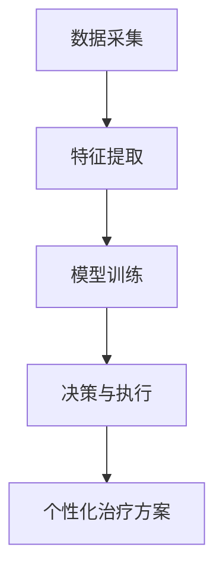
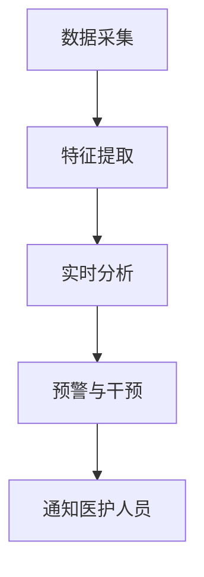
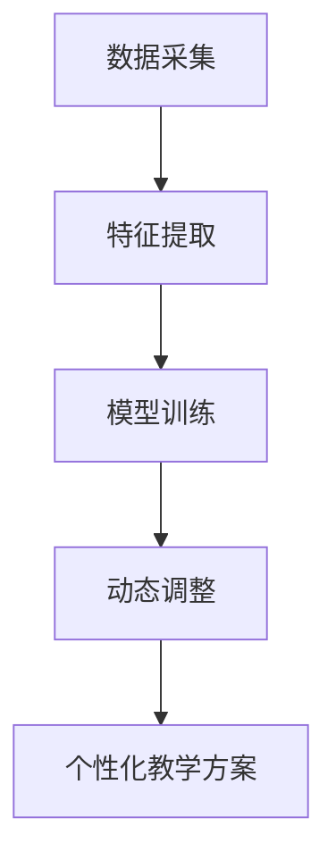
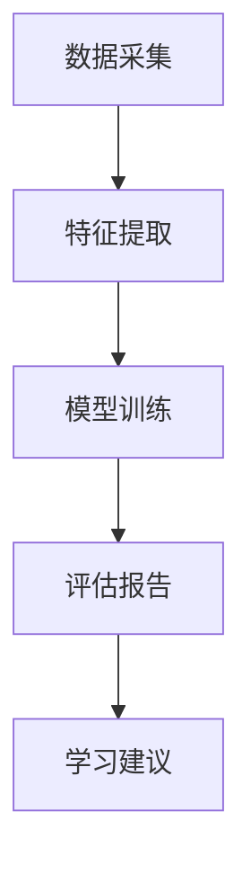
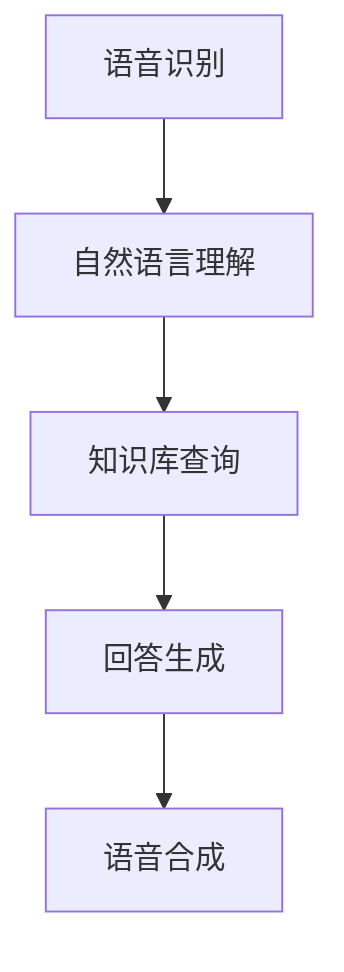
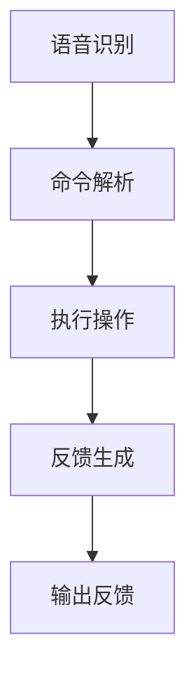
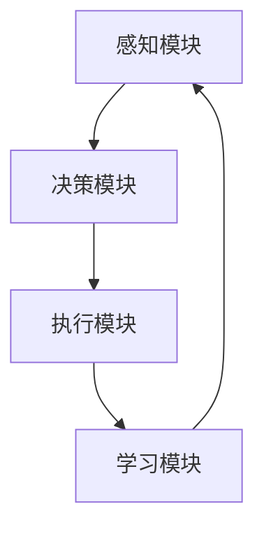

                 

# 《意识功能的自主系统模型》

## 摘要

本文旨在探讨意识功能的自主系统模型，分析其基本概念、核心结构和实现方法，以及其在不同领域的应用前景。通过对意识功能与自主系统模型关系的深入剖析，本文揭示了意识功能在自主系统中的关键作用。同时，本文还详细介绍了自主系统模型的构建与实现过程，并通过实际案例展示了其在心理障碍治疗、智能教育和智能交互等领域的应用。最后，本文对自主系统模型的发展趋势与挑战进行了展望，为未来研究提供了方向。

## 目录大纲

1. **引言与背景**  
   - 1.1 意识功能的概念与重要性  
   - 1.2 意识功能的研究现状  
   - 1.3 自主系统模型的理论基础

2. **自主系统模型的基本概念**  
   - 2.1 自主系统的定义与特征  
   - 2.2 自主系统模型的基本结构  
   - 2.3 自主系统模型的核心概念

3. **意识功能与自主系统模型的关系**  
   - 3.1 意识功能的理论框架  
   - 3.2 自主系统模型在意识功能研究中的应用  
   - 3.3 意识功能与自主系统模型的相互作用

4. **自主系统模型的构建与实现**  
   - 4.1 自主系统模型的构建过程  
   - 4.2 自主系统模型的实现方法

5. **自主系统模型在意识功能研究中的应用**  
   - 5.1 自主系统模型在心理障碍治疗中的应用  
   - 5.2 自主系统模型在智能教育中的应用  
   - 5.3 自主系统模型在智能交互中的应用

6. **自主系统模型的发展趋势与挑战**  
   - 6.1 自主系统模型的发展趋势  
   - 6.2 自主系统模型面临的挑战  
   - 6.3 未来研究方向与展望

7. **附录**  
   - 附录A：参考文献  
   - 附录B：自主系统模型Mermaid流程图  
   - 附录C：自主系统模型相关算法伪代码  
   - 附录D：自主系统模型项目实战案例

## 第一部分：引言与背景

### 1.1 意识功能的概念与重要性

意识功能是人类认知体系的重要组成部分，涉及到感知、记忆、思维、情感等多个层面。意识功能不仅使我们能够识别和理解外部环境，还参与了个体的决策、行动和自我认知。因此，研究意识功能对于揭示人类认知的本质、提升人工智能技术水平以及解决心理障碍等实际问题具有重要意义。

在人工智能领域，意识功能的实现一直是科学家们关注的焦点。传统的机器学习模型在处理简单任务时表现出色，但在面对复杂、模糊的现实世界时，往往表现出局限。而意识功能的引入，有望提升人工智能系统的自适应能力、创造力和决策能力，使其更好地模拟人类智能。

### 1.2 意识功能的研究现状

近年来，关于意识功能的研究取得了显著进展。在神经科学领域，研究者们通过脑成像技术、电生理技术和分子生物学技术，揭示了大脑中与意识功能相关区域的神经活动规律。在心理学领域，通过实验和理论分析，研究者们探讨了意识功能的心理机制，如感知、记忆、注意力等。

在人工智能领域，意识功能的研究主要体现在两个方面：一是通过模仿人类大脑的神经网络结构，设计出具有自主学习、自适应能力的智能系统；二是通过引入心理学、认知科学等领域的理论成果，构建意识功能的数学模型，实现意识功能在人工智能中的应用。

### 1.3 自主系统模型的理论基础

自主系统模型是一种模拟人类智能的计算机模型，其理论基础涉及多个学科，包括计算机科学、认知科学、神经科学、心理学等。自主系统模型的核心思想是，通过构建一个具备感知、决策、执行能力的智能体，使其在复杂环境中实现自主行为。

自主系统模型的理论基础主要包括以下几个方面：

1. **神经网络理论**：神经网络是一种模拟生物神经元结构的计算模型，通过模拟神经元之间的相互作用，实现信息传递和处理。神经网络理论为自主系统模型的构建提供了重要的基础。

2. **认知科学理论**：认知科学是研究人类认知过程和认知结构的学科。认知科学理论为自主系统模型提供了关于感知、记忆、思维、情感等意识功能的科学依据。

3. **神经科学理论**：神经科学是研究神经系统结构和功能的基础学科。神经科学理论揭示了大脑中与意识功能相关的神经活动规律，为自主系统模型的构建提供了实验依据。

4. **心理学理论**：心理学是研究人类心理现象和行为的学科。心理学理论为自主系统模型提供了关于人类行为、情绪、动机等方面的科学依据。

总之，自主系统模型的理论基础涵盖了多个学科，为构建具有意识功能的人工智能系统提供了丰富的理论资源。

### 1.4 自主系统模型与意识功能的关系

自主系统模型与意识功能之间存在紧密的联系。一方面，自主系统模型需要借助意识功能来实现自主行为。意识功能为自主系统提供了感知、决策、执行等核心能力，使其能够适应复杂环境。另一方面，意识功能的研究成果可以促进自主系统模型的发展。通过对意识功能的理论分析、实验研究和数学建模，可以优化自主系统模型的性能，提升其在实际应用中的效果。

### 1.5 本文结构

本文首先介绍了意识功能的概念与重要性，以及意识功能研究现状和自主系统模型的理论基础。接着，本文阐述了自主系统模型的基本概念、核心结构和实现方法。随后，本文分析了意识功能与自主系统模型的关系，并详细介绍了自主系统模型在心理障碍治疗、智能教育和智能交互等领域的应用。最后，本文对自主系统模型的发展趋势与挑战进行了展望，为未来研究提供了方向。

## 第二部分：自主系统模型的基本概念

### 2.1 自主系统的定义与特征

自主系统是指一种能够独立运行、自主决策和执行任务的系统。它具备以下几个特征：

1. **感知能力**：自主系统需要具备感知外部环境的能力，通过传感器、摄像头等设备获取信息，识别和理解环境中的物体、事件和变化。

2. **决策能力**：自主系统需要根据感知到的信息，进行逻辑推理、判断和决策，确定下一步行动方案。

3. **执行能力**：自主系统需要根据决策结果，执行具体的操作，实现对环境的改变和控制。

4. **自适应能力**：自主系统需要能够适应环境变化，通过学习和调整策略，提高任务完成的效率和准确性。

5. **自主性**：自主系统在执行任务过程中，不需要人工干预，能够自主完成从感知、决策到执行的全过程。

### 2.2 自主系统模型的基本结构

自主系统模型通常由以下几个模块组成：

1. **感知模块**：负责获取外部环境的信息，包括传感器数据、图像、声音等。感知模块需要对信息进行预处理，提取关键特征，以便后续处理。

2. **决策模块**：负责根据感知模块提供的信息，进行逻辑推理、判断和决策。决策模块可以使用各种算法，如神经网络、决策树、支持向量机等。

3. **执行模块**：负责根据决策模块生成的决策结果，执行具体的操作。执行模块可以包括控制模块、动作规划模块等。

4. **学习模块**：负责对自主系统模型进行训练和优化，提高其性能和适应性。学习模块可以使用机器学习、深度学习等技术。

5. **通信模块**：负责与其他系统或设备进行通信，交换信息和数据。通信模块可以使用无线通信、网络通信等技术。

### 2.3 自主系统模型的核心概念

自主系统模型的核心概念包括以下几个：

1. **感知 - 决策 - 执行**：这是自主系统模型的基本工作流程，即通过感知模块获取信息，决策模块进行决策，执行模块执行操作。

2. **自主性**：自主系统模型需要具备自主性，即能够在没有人工干预的情况下，自主完成从感知到执行的全过程。

3. **适应性**：自主系统模型需要具备适应性，即能够适应环境变化，通过学习和调整策略，提高任务完成的效率和准确性。

4. **协作性**：在复杂环境下，自主系统模型需要具备协作性，即能够与其他系统或设备进行协同工作，共同完成任务。

5. **安全性**：自主系统模型需要具备安全性，即能够保证系统在执行任务过程中，不会对自身、他人或环境造成危害。

### 2.4 自主系统模型的分类

自主系统模型可以根据不同的分类标准进行分类：

1. **根据任务类型**：可以分为导航系统、监控系统、智能机器人、智能交通系统等。

2. **根据执行方式**：可以分为自主驾驶、自主飞行、自主作业等。

3. **根据应用领域**：可以分为医疗、工业、农业、安防等。

4. **根据技术架构**：可以分为基于规则的系统、基于机器学习的系统、基于深度学习的系统等。

### 2.5 自主系统模型的优势

自主系统模型具有以下优势：

1. **提高效率**：自主系统能够在无人干预的情况下，自主完成复杂任务，提高工作效率。

2. **降低成本**：自主系统可以减少人力成本，降低运营和维护成本。

3. **提升安全性**：自主系统可以避免人为操作失误，提高任务完成的安全性。

4. **扩展性强**：自主系统可以方便地与其他系统或设备进行集成，实现协同工作。

5. **适应性强**：自主系统可以根据不同任务需求，灵活调整策略，适应各种复杂环境。

### 2.6 自主系统模型的应用前景

自主系统模型在各个领域具有广泛的应用前景，包括：

1. **智能制造**：自主系统模型可以应用于生产线的自动化控制，提高生产效率和产品质量。

2. **智能交通**：自主系统模型可以应用于自动驾驶、智能交通管理，提高交通效率和安全性。

3. **智能医疗**：自主系统模型可以应用于医疗影像诊断、疾病预测等，提高医疗服务质量。

4. **智能农业**：自主系统模型可以应用于精准农业、农作物监测等，提高农业生产效率。

5. **智能安防**：自主系统模型可以应用于视频监控、入侵检测等，提高安防水平。

6. **智能家居**：自主系统模型可以应用于智能家居控制、环境监测等，提高生活品质。

总之，自主系统模型在各个领域具有巨大的应用潜力，未来将会发挥越来越重要的作用。

## 第三部分：意识功能与自主系统模型的关系

### 3.1 意识功能的理论框架

意识功能是认知科学和心理学研究的重要领域。目前，关于意识功能的理论框架主要包括以下几个方面：

1. **神经科学理论**：神经科学理论认为，意识功能是大脑特定区域的活动结果。这些区域包括初级感官皮层、前额叶皮层、颞叶皮层等。通过神经成像技术，如功能性磁共振成像（fMRI）和脑电图（EEG），研究者们揭示了这些区域在意识功能中的作用。

2. **信息处理理论**：信息处理理论认为，意识功能是大脑对信息进行加工、整合和解释的过程。这个过程涉及到感知、记忆、注意力、思维和语言等多个认知功能。研究者们通过实验和模型，探讨了这些功能如何协同工作，以实现复杂的意识功能。

3. **意识科学理论**：意识科学理论试图整合神经科学、认知科学和其他学科的知识，构建一个全面的理论框架来解释意识功能。这个框架强调了意识功能在生物进化、个体发展和环境交互中的作用。

4. **现象学理论**：现象学理论关注个体对意识的直接体验。它试图理解意识现象的内在结构和动态变化，以及这些变化如何与外部世界相互作用。

### 3.2 自主系统模型在意识功能研究中的应用

自主系统模型在意识功能研究中发挥着重要作用，主要体现在以下几个方面：

1. **模拟意识功能**：自主系统模型可以模拟人类大脑中与意识功能相关的神经网络和认知过程。通过这种模拟，研究者们可以更好地理解意识功能的工作原理和机制。

2. **优化算法设计**：自主系统模型为算法设计提供了新的思路和方法。通过模拟意识功能，研究者们可以设计出更高效、更鲁棒的算法，从而提高自主系统模型的性能。

3. **实验验证**：自主系统模型可以作为实验平台，用于验证关于意识功能的理论假设。通过设计特定的实验场景，研究者们可以观察自主系统模型在执行任务过程中的行为和表现，从而推断意识功能的实际作用。

4. **临床应用**：自主系统模型在临床应用中具有巨大潜力。例如，在心理障碍治疗中，自主系统模型可以模拟患者的心理状态，为心理治疗提供指导。此外，自主系统模型还可以用于诊断和预测疾病，为临床医生提供决策支持。

### 3.3 意识功能与自主系统模型的相互作用

意识功能与自主系统模型之间存在密切的相互作用，具体表现在以下几个方面：

1. **反馈循环**：自主系统模型在执行任务过程中，会产生一系列反馈信号，这些信号可以反馈给意识功能模块，影响其决策和行动。例如，在自动驾驶中，车辆的感知模块会实时反馈路况信息，决策模块会根据这些信息调整驾驶策略，而执行模块则会根据决策结果进行实际操作。这种反馈循环确保了自主系统模型能够适应复杂环境，实现自主行为。

2. **学习与适应**：自主系统模型通过不断学习和适应，优化其性能。在这个过程中，意识功能发挥着关键作用。意识功能模块可以识别出自主系统模型在执行任务过程中的错误和不足，并提供修正建议。通过这种学习与适应，自主系统模型可以不断提高其自主性和适应性。

3. **意识功能优化**：意识功能模块可以为自主系统模型提供更高层次的支持。例如，在决策过程中，意识功能模块可以基于道德、伦理和社会规范，对决策结果进行评估和优化。这种优化有助于确保自主系统模型的决策和行为符合人类价值观和道德标准。

4. **跨学科融合**：意识功能与自主系统模型的相互作用，推动了跨学科研究的发展。通过整合神经科学、认知科学、计算机科学等多个领域的知识，研究者们可以构建更全面、更深入的理论框架，从而更好地理解和解释意识功能。

总之，意识功能与自主系统模型之间的相互作用，不仅有助于推动人工智能技术的发展，还为心理学、认知科学等领域的交叉研究提供了新的思路和方法。

### 3.4 自主系统模型在意识功能研究中的应用案例

为了更好地理解自主系统模型在意识功能研究中的应用，以下列举几个典型案例：

1. **自动驾驶汽车**：自动驾驶汽车是一个典型的自主系统模型，它通过感知模块获取路况信息，通过决策模块进行路径规划和驾驶策略调整，通过执行模块控制车辆行驶。在自动驾驶汽车的研究中，意识功能模型被用于模拟驾驶员的感知、记忆和决策过程，从而提高自动驾驶系统的安全性和可靠性。

2. **智能客服系统**：智能客服系统是一个用于处理客户咨询和反馈的自主系统模型。它通过自然语言处理技术理解客户的问题，通过知识库进行回答，并通过用户反馈进行优化。在智能客服系统的研发中，意识功能模型被用于模拟人类的沟通方式和思维方式，从而提供更自然、更有效的客户服务。

3. **医疗诊断系统**：医疗诊断系统是一个用于辅助医生进行疾病诊断的自主系统模型。它通过分析医学影像、病历数据等，提供诊断建议。在医疗诊断系统的开发中，意识功能模型被用于模拟医生的诊断思维和决策过程，从而提高诊断的准确性和效率。

4. **智能教育系统**：智能教育系统是一个用于个性化教育的自主系统模型。它通过分析学生的学习行为和成绩，提供个性化的学习资源和学习建议。在智能教育系统的开发中，意识功能模型被用于模拟学生的学习过程和思维方式，从而提供更有效的教学支持和学习指导。

这些案例表明，自主系统模型在意识功能研究中的应用具有广阔的前景和巨大的潜力。通过不断优化和改进自主系统模型，可以更好地模拟人类的意识功能，推动人工智能技术的发展。

### 3.5 意识功能在自主系统模型中的实现挑战

在自主系统模型中实现意识功能面临着一系列挑战，主要表现在以下几个方面：

1. **复杂性**：意识功能涉及到大脑的多个区域和复杂的神经网络，其工作机制和相互作用尚不完全清楚。因此，在自主系统模型中实现意识功能需要克服巨大的复杂性。

2. **数据质量**：自主系统模型的性能很大程度上依赖于感知模块获取的数据质量。然而，在实际应用中，传感器和环境噪声可能导致数据不准确或缺失，从而影响意识功能的实现。

3. **实时性**：意识功能需要在短时间内对大量信息进行感知、分析和决策。实现这一目标需要高效的算法和硬件支持，以满足实时性的要求。

4. **鲁棒性**：意识功能需要在不同环境和条件下保持稳定和准确。然而，自主系统模型在实际应用中可能面临各种不确定性因素，如环境变化、数据噪声等，这要求模型具备良好的鲁棒性。

5. **伦理和隐私**：自主系统模型在实现意识功能时，需要处理大量个人数据。这涉及到伦理和隐私问题，如何确保数据的安全和用户隐私成为关键挑战。

6. **跨学科整合**：实现意识功能需要整合多个学科的知识，包括神经科学、认知科学、计算机科学等。跨学科整合的难度和挑战不容忽视。

### 3.6 解决方案与未来方向

针对上述挑战，以下提出一些解决方案和未来研究方向：

1. **增强算法和硬件**：通过优化算法和提升硬件性能，提高自主系统模型的实时性和鲁棒性。

2. **多模态数据融合**：结合多种传感器数据，提高感知模块的数据质量。例如，结合视觉、听觉和触觉数据，实现更全面的环境感知。

3. **数据预处理和清洗**：对原始数据进行预处理和清洗，提高数据的准确性和完整性。

4. **模型压缩与优化**：通过模型压缩和优化技术，降低模型计算复杂度，提高实时性。

5. **伦理和隐私保护**：在实现意识功能时，注重伦理和隐私保护，制定相应的规范和标准。

6. **跨学科研究**：加强跨学科研究，整合神经科学、认知科学、计算机科学等领域的知识，构建更全面的理论框架。

7. **实验与验证**：通过实验和验证，不断优化和改进自主系统模型，提高其在实际应用中的性能和效果。

总之，实现意识功能在自主系统模型中面临着诸多挑战，但通过不断探索和创新，有望在未来实现具有高度智能化和自主性的系统。

## 第四部分：自主系统模型的构建与实现

### 4.1 自主系统模型的构建过程

自主系统模型的构建是一个复杂而系统的过程，涉及到多个步骤和环节。以下是构建自主系统模型的基本过程：

1. **需求分析**：首先，明确自主系统模型的应用场景和目标功能。需求分析阶段需要与相关领域专家、用户进行深入交流，了解系统的实际需求和预期效果。

2. **系统设计**：根据需求分析的结果，进行系统设计。系统设计包括架构设计、模块划分、功能定义等。在这一阶段，需要确定系统的主要组件及其交互关系，确保系统能够实现预期的功能。

3. **数据采集与预处理**：自主系统模型的性能很大程度上依赖于数据的质量。因此，在构建过程中，需要收集相关的数据，并对数据进行预处理，如去噪、归一化、特征提取等。预处理后的数据将用于训练和验证模型。

4. **模型选择**：根据需求和分析结果，选择合适的模型架构。常见的模型架构包括神经网络、决策树、支持向量机等。在选择模型时，需要考虑模型的性能、复杂度、可解释性等因素。

5. **模型训练**：使用预处理后的数据对模型进行训练。训练过程包括前向传播、反向传播、参数调整等。通过训练，模型将学习到输入和输出之间的映射关系，提高预测和分类的准确性。

6. **模型验证**：在训练完成后，对模型进行验证。验证过程通常包括交叉验证、测试集验证等。通过验证，可以评估模型的性能和泛化能力。

7. **系统集成与测试**：将训练好的模型集成到系统中，进行系统集成与测试。在这一阶段，需要确保各模块之间的协同工作和系统的稳定性。

8. **优化与迭代**：根据测试结果，对模型和系统进行优化和迭代。通过不断调整和优化，提高系统的性能和可靠性。

### 4.1.1 数据采集与预处理

数据采集与预处理是构建自主系统模型的重要步骤，其质量直接影响模型的性能。以下是数据采集与预处理的具体过程：

1. **数据采集**：根据系统的需求，选择合适的数据源进行数据采集。数据源可以是传感器数据、图像数据、文本数据等。例如，在自动驾驶系统中，可以采集车辆的速度、加速度、方向等传感器数据；在医疗诊断系统中，可以采集患者的病历数据、医学影像数据等。

2. **数据清洗**：在数据采集过程中，可能会存在一些噪声、缺失值或异常值。因此，需要对数据进行清洗，去除噪声和异常值，填补缺失值。数据清洗的方法包括缺失值填补、噪声过滤、异常值检测等。

3. **数据归一化**：不同特征的数据可能具有不同的量纲和范围，这会影响到模型的训练和预测效果。因此，需要对数据进行归一化处理，将不同特征的数据转换到相同的量纲和范围内。常见的归一化方法包括最小-最大归一化、标准差归一化等。

4. **特征提取**：特征提取是将原始数据转换为更有用的信息表示。特征提取的方法包括主成分分析（PCA）、线性判别分析（LDA）、自动编码器等。通过特征提取，可以降低数据的维度，提高模型的性能和效率。

5. **数据划分**：将数据集划分为训练集、验证集和测试集。训练集用于训练模型，验证集用于调整模型参数，测试集用于评估模型的性能。通常，训练集占比为60-70%，验证集占比为20-30%，测试集占比为10-20%。

### 4.1.2 模型设计

模型设计是构建自主系统模型的关键步骤，需要综合考虑系统的需求、数据的特性以及模型的性能。以下是模型设计的具体过程：

1. **选择模型架构**：根据系统的需求和数据的特性，选择合适的模型架构。常见的模型架构包括神经网络、决策树、支持向量机等。神经网络模型具有较好的非线性表示能力，适合处理复杂的任务；决策树模型则具有较好的可解释性，适合处理分类任务。

2. **设计网络结构**：对于神经网络模型，需要设计网络结构，包括输入层、隐藏层和输出层。输入层接收原始数据，隐藏层进行特征提取和变换，输出层生成预测结果。在设计网络结构时，需要考虑网络的深度、层数和神经元数量等参数。

3. **参数设置**：在模型设计过程中，需要设置一些参数，如学习率、批量大小、正则化项等。这些参数会影响模型的训练过程和性能。通常，需要通过实验和调优来确定最佳的参数组合。

4. **激活函数**：激活函数是神经网络中重要的组成部分，用于将神经元的线性组合转换为非线性输出。常见的激活函数包括Sigmoid函数、ReLU函数、Tanh函数等。选择合适的激活函数可以提高模型的性能和收敛速度。

5. **损失函数**：损失函数用于评估模型的预测结果与真实值之间的差距。常见的损失函数包括均方误差（MSE）、交叉熵损失等。不同的损失函数适用于不同的任务和数据类型，需要根据具体情况进行选择。

### 4.1.3 模型训练与验证

模型训练与验证是构建自主系统模型的核心环节，通过训练和验证过程，可以评估和优化模型的性能。以下是模型训练与验证的具体过程：

1. **模型训练**：使用训练集数据对模型进行训练。训练过程包括前向传播、计算损失、反向传播、更新参数等。通过多次迭代，模型将不断优化参数，提高预测和分类的准确性。

2. **模型验证**：在训练完成后，使用验证集数据对模型进行验证。验证过程主要用于评估模型的泛化能力，通过计算验证集上的损失和准确率等指标，可以了解模型的性能。

3. **模型评估**：在验证完成后，使用测试集数据对模型进行评估。测试集数据未参与模型的训练和验证过程，可以更客观地评估模型的性能。常见的评估指标包括准确率、召回率、F1值等。

4. **模型优化**：根据评估结果，对模型进行优化。优化过程包括调整参数、修改网络结构、增加训练数据等。通过优化，可以提高模型的性能和泛化能力。

### 4.2 自主系统模型的实现方法

实现自主系统模型的方法多种多样，以下介绍几种常见的实现方法：

1. **基于机器学习的方法**：基于机器学习的方法是构建自主系统模型的一种常用方法。通过训练机器学习模型，可以实现自主系统模型中的感知、决策和执行功能。常见的机器学习算法包括神经网络、支持向量机、决策树等。实现过程包括数据采集、数据预处理、模型选择、模型训练和验证等步骤。

2. **基于深度学习的方法**：深度学习是机器学习的一个分支，通过多层神经网络进行特征提取和变换，可以实现更复杂的任务。深度学习方法在图像识别、语音识别、自然语言处理等领域取得了显著成果。实现深度学习方法需要设计网络结构、选择合适的激活函数、优化损失函数等。

3. **基于规则的方法**：基于规则的方法是通过定义一系列规则来指导系统的决策和执行。规则可以基于逻辑推理、决策树、模糊逻辑等。这种方法具有较好的可解释性和适应性，适用于一些结构化较强的任务。

4. **基于混合的方法**：混合方法是将多种方法结合，以充分发挥各自的优点。例如，可以结合机器学习和深度学习方法，通过训练深度神经网络来实现感知功能，再通过基于规则的决策系统来执行具体的操作。这种方法在处理复杂任务时具有较好的效果。

### 4.2.1 感知模块的实现

感知模块是实现自主系统模型的关键组成部分，负责获取和处理外部环境的信息。以下是感知模块的实现方法：

1. **传感器选择**：根据应用场景和需求，选择合适的传感器。常见的传感器包括摄像头、麦克风、红外传感器、超声波传感器等。

2. **数据采集**：使用传感器采集外部环境的信息，如图像、声音、温度、湿度等。

3. **预处理**：对采集到的原始数据进行预处理，如滤波、去噪、归一化等。预处理后的数据将用于后续处理。

4. **特征提取**：使用特征提取算法，将预处理后的数据转换为更有用的信息表示。常见的特征提取算法包括主成分分析（PCA）、线性判别分析（LDA）、卷积神经网络（CNN）等。

5. **感知融合**：将多个传感器的数据融合起来，以提高感知的准确性和鲁棒性。常见的融合方法包括加权平均、卡尔曼滤波等。

### 4.2.2 决策模块的实现

决策模块是实现自主系统模型的核心组成部分，负责根据感知模块提供的信息进行决策和规划。以下是决策模块的实现方法：

1. **决策算法**：选择合适的决策算法，如基于规则的决策、基于机器学习的决策、基于深度学习的决策等。

2. **模型训练**：使用训练数据对决策模型进行训练，以实现输入到输出的映射关系。

3. **决策规划**：根据感知模块提供的信息，进行决策和规划。决策规划的方法包括路径规划、资源分配、行为规划等。

4. **决策优化**：通过优化算法，如贪心算法、遗传算法等，对决策结果进行优化，以提高决策的准确性和效率。

5. **决策评估**：评估决策结果的准确性和效率，根据评估结果进行调整和优化。

### 4.2.3 执行模块的实现

执行模块是实现自主系统模型的最终环节，负责根据决策模块生成的决策结果进行实际操作。以下是执行模块的实现方法：

1. **执行策略**：制定执行策略，包括执行顺序、执行条件等。

2. **执行动作**：根据决策结果，执行具体的操作。常见的执行动作包括移动、旋转、控制输出等。

3. **反馈机制**：建立反馈机制，将执行结果反馈给感知模块和决策模块，以便进行后续的决策和优化。

4. **执行监控**：监控执行过程，确保执行动作的正确性和安全性。

5. **执行优化**：根据执行结果，对执行策略和执行动作进行调整和优化，以提高执行效率和准确性。

通过以上步骤和方法的实现，可以构建一个具有感知、决策和执行能力的自主系统模型。这种模型在各个领域具有广泛的应用潜力，可以推动人工智能技术的发展。

### 4.3 自主系统模型的评估与优化

构建自主系统模型后，需要进行评估和优化，以确保模型在实际应用中的性能和效果。以下是评估和优化自主系统模型的具体方法：

1. **性能评估**：
   - **准确性**：评估模型在预测或分类任务中的准确性。例如，在图像识别任务中，计算模型识别正确图像的比例。
   - **精度**：评估模型在特定类别上的表现，例如在医疗诊断中，计算模型对疾病正确诊断的比例。
   - **召回率**：评估模型在未诊断疾病中识别出疾病的比例。
   - **F1值**：综合考虑准确性和召回率，计算模型在特定任务上的综合性能。

2. **效率评估**：
   - **响应时间**：评估模型处理数据并生成决策结果所需的时间。
   - **资源消耗**：评估模型在运行过程中所需的计算资源和存储空间。

3. **鲁棒性评估**：
   - **数据噪声**：评估模型在处理含噪声数据时的性能。
   - **异常值**：评估模型在数据包含异常值时的鲁棒性。

4. **泛化能力评估**：
   - **交叉验证**：通过交叉验证评估模型在不同数据集上的表现。
   - **测试集评估**：使用未参与训练和验证的数据集评估模型的泛化能力。

5. **优化方法**：
   - **参数调整**：通过调整模型参数，如学习率、隐藏层大小等，提高模型性能。
   - **数据增强**：通过增加数据集、数据预处理等方法提高模型泛化能力。
   - **集成学习**：结合多个模型或算法，提高模型的整体性能。
   - **迁移学习**：利用已有模型或数据，提高新任务的性能。

6. **评估与优化循环**：
   - **迭代评估**：定期对模型进行评估，以检测性能变化。
   - **反馈调整**：根据评估结果，调整模型结构和参数，优化模型性能。
   - **持续学习**：使用新的数据持续训练模型，以适应环境变化和任务需求。

通过以上评估和优化方法，可以确保自主系统模型在实际应用中具备良好的性能和稳定性，从而实现预期的功能和应用价值。

## 第五部分：自主系统模型在意识功能研究中的应用

### 5.1 自主系统模型在心理障碍治疗中的应用

心理障碍治疗是一个复杂而敏感的领域，传统的治疗方法如药物治疗和心理咨询，虽然取得了一定的效果，但仍然存在局限性。自主系统模型的出现为心理障碍治疗带来了新的希望，尤其是在个性化治疗和实时监测方面。

#### 5.1.1 个性化治疗

自主系统模型可以根据患者的个体差异，制定个性化的治疗方案。例如，通过分析患者的心理状态、行为习惯和生理指标，模型可以识别出患者的主要心理障碍类型，如焦虑、抑郁或创伤后应激障碍（PTSD）。在此基础上，模型可以设计出针对特定障碍的治疗方案，包括认知行为疗法、正念疗法等。这种个性化治疗方案能够更精准地满足患者的需求，提高治疗效果。

**核心概念与联系：**

- **个性化治疗**：基于自主系统模型的个性化治疗方案，可以通过以下方式实现：
  - **数据采集**：收集患者的心理状态、行为习惯和生理指标数据。
  - **特征提取**：从数据中提取关键特征，如情绪波动、睡眠质量、生理反应等。
  - **模型训练**：使用收集到的数据训练自主系统模型，以识别心理障碍类型。
  - **决策与执行**：根据模型输出的结果，制定个性化的治疗方案，如调整药物治疗方案或提供特定类型的心理咨询。

**Mermaid流程图：**



**伪代码：**

```python
# 数据采集
data = collect_data()

# 特征提取
features = extract_features(data)

# 模型训练
model = train_model(features)

# 决策与执行
treatment_plan = model.decide_treatment()
execute_treatment_plan(treatment_plan)
```

#### 5.1.2 实时监测

自主系统模型还可以用于实时监测患者的心理状态，及时发现心理障碍的迹象。通过持续收集和分析患者的生理数据，如心率、血压、皮肤电活动等，模型可以实时评估患者的心理压力水平。当检测到异常情况时，模型可以及时通知医护人员，采取必要的干预措施。

**核心概念与联系：**

- **实时监测**：自主系统模型的实时监测功能可以通过以下步骤实现：
  - **数据采集**：持续收集患者的生理数据。
  - **特征提取**：从生理数据中提取实时特征，如心率变异性、血压波动等。
  - **实时分析**：使用自主系统模型对实时特征进行分析，识别心理压力水平。
  - **预警与干预**：当检测到心理压力水平异常时，系统自动发送预警信息，并建议干预措施。

**Mermaid流程图：**



**伪代码：**

```python
# 数据采集
data_stream = collect_real_time_data()

# 特征提取
real_time_features = extract_real_time_features(data_stream)

# 实时分析
stress_level = model.analyze_stress(real_time_features)

# 预警与干预
if stress_level.abnormal():
    notify_healthcare_professionals()
    suggest_intervention_measures()
```

### 5.2 自主系统模型在智能教育中的应用

智能教育是近年来备受关注的教育创新领域，自主系统模型在其中发挥着重要作用。通过个性化教学和智能评估，自主系统模型能够提升教育质量和效率。

#### 5.2.1 个性化教学

自主系统模型可以根据学生的学习进度、知识水平和学习风格，提供个性化的教学方案。例如，在在线学习平台上，模型可以实时分析学生的学习行为和成绩，动态调整教学内容的难度和呈现方式，从而提高学生的学习效果。

**核心概念与联系：**

- **个性化教学**：自主系统模型的个性化教学功能可以通过以下步骤实现：
  - **数据采集**：收集学生的学习行为数据，如学习时间、学习内容、学习进度等。
  - **特征提取**：从数据中提取关键特征，如学习习惯、知识掌握程度等。
  - **模型训练**：使用收集到的数据训练自主系统模型，以预测最佳教学方案。
  - **动态调整**：根据模型输出的预测结果，动态调整教学内容和教学策略。

**Mermaid流程图：**



**伪代码：**

```python
# 数据采集
student_data = collect_student_data()

# 特征提取
student_features = extract_student_features(student_data)

# 模型训练
model = train_model(student_features)

# 动态调整
teaching_plan = model.predict_best_teaching_plan()
adjust_teaching_plan(teaching_plan)
```

#### 5.2.2 智能评估

自主系统模型还可以用于智能评估，通过分析学生的考试和作业成绩，提供个性化的评估报告和学习建议。这种智能评估不仅能够提高评估的准确性，还能够及时发现学生的学习问题，提供有针对性的帮助。

**核心概念与联系：**

- **智能评估**：自主系统模型的智能评估功能可以通过以下步骤实现：
  - **数据采集**：收集学生的考试成绩和作业成绩。
  - **特征提取**：从成绩数据中提取关键特征，如知识点掌握情况、考试难度等。
  - **模型训练**：使用收集到的数据训练自主系统模型，以评估学生的知识掌握程度。
  - **评估报告**：生成个性化的评估报告，并提出学习建议。

**Mermaid流程图：**



**伪代码：**

```python
# 数据采集
assessment_data = collect_assessment_data()

# 特征提取
assessment_features = extract_assessment_features(assessment_data)

# 模型训练
model = train_model(assessment_features)

# 评估报告
assessment_report = model.generate_assessment_report()
provide_learning_advice(assessment_report)
```

### 5.3 自主系统模型在智能交互中的应用

智能交互是人工智能应用的一个重要方向，自主系统模型在智能交互中发挥着关键作用。通过自然语言处理和智能对话系统，自主系统模型能够实现与用户的自然、流畅的交互。

#### 5.3.1 智能客服

智能客服系统是自主系统模型在智能交互中的典型应用。通过自然语言处理技术，智能客服系统能够理解用户的问题，提供准确的答案或解决方法。这种自动化、高效的客服系统，不仅提高了客户服务质量，还降低了企业运营成本。

**核心概念与联系：**

- **智能客服**：自主系统模型的智能客服功能可以通过以下步骤实现：
  - **语音识别**：将用户的语音输入转换为文本。
  - **自然语言理解**：分析用户的意图和问题。
  - **知识库查询**：从知识库中检索相关答案或解决方案。
  - **回答生成**：生成自然流畅的回答，并通过语音合成输出。

**Mermaid流程图：**



**伪代码：**

```python
# 语音识别
text_input = recognize_speech()

# 自然语言理解
user_intent = understand_intent(text_input)

# 知识库查询
answer = query_knowledge_base(user_intent)

# 回答生成
spoken_answer = generate_response(answer)

# 语音合成
synthesize_speech(spoken_answer)
```

#### 5.3.2 智能助手

智能助手是另一种常见的智能交互应用，通过自主系统模型，智能助手能够理解用户的指令，执行具体的操作。例如，在智能家居系统中，用户可以通过语音指令控制家电设备，智能助手则根据指令执行相应的操作。

**核心概念与联系：**

- **智能助手**：自主系统模型的智能助手功能可以通过以下步骤实现：
  - **语音识别**：将用户的语音输入转换为文本。
  - **命令解析**：分析用户的意图和命令。
  - **执行操作**：根据命令执行具体的操作，如开关家电、调节温度等。
  - **反馈生成**：生成操作反馈，并通过语音或屏幕输出。

**Mermaid流程图：**



**伪代码：**

```python
# 语音识别
text_input = recognize_speech()

# 命令解析
user_command = parse_command(text_input)

# 执行操作
execute_command(user_command)

# 反馈生成
feedback = generate_feedback()

# 输出反馈
output_feedback(feedback)
```

通过以上应用案例，可以看出自主系统模型在心理障碍治疗、智能教育和智能交互等领域具有广泛的应用前景。随着技术的不断进步，自主系统模型将不断优化和完善，为人类生活带来更多便利和智能体验。

### 5.4 自主系统模型在意识功能研究中的实际应用挑战与解决方案

在意识功能研究中，自主系统模型的应用面临着一系列挑战，包括数据质量、模型性能、实时性和用户接受度等方面。以下分析这些挑战及其可能的解决方案。

#### 挑战一：数据质量问题

**问题**：在构建自主系统模型时，数据的质量和可靠性直接影响模型的性能。然而，实际收集的数据往往存在噪声、缺失值和异常值，这会对模型的训练和预测造成不利影响。

**解决方案**：
1. **数据清洗与预处理**：在模型训练前，对原始数据进行清洗和预处理，去除噪声和异常值，填补缺失值。常用的方法包括缺失值填补、数据去噪和异常值检测等。
2. **数据增强**：通过生成模拟数据或使用数据增强技术，提高数据的多样性和质量。例如，使用数据扩充技术生成虚拟场景，以增强模型对不同情境的适应能力。

#### 挑战二：模型性能优化

**问题**：自主系统模型在意识功能研究中需要具备高度的准确性、鲁棒性和泛化能力。然而，现有模型往往在复杂环境下的表现不佳，难以满足实际需求。

**解决方案**：
1. **模型优化与调参**：通过调整模型参数，如学习率、隐藏层大小等，优化模型性能。可以使用自动调参工具或基于贝叶斯优化的方法，找到最佳参数组合。
2. **多模型融合**：结合多个模型或算法，提高整体性能。例如，使用集成学习技术，将多个弱分类器集成成一个强分类器。
3. **深度学习与强化学习结合**：将深度学习与强化学习相结合，通过不断学习和优化策略，提高模型的适应性和自主性。

#### 挑战三：实时性问题

**问题**：在实时性要求较高的应用场景中，如心理障碍治疗和智能交互，自主系统模型需要快速响应和处理大量数据。然而，模型的计算复杂度和响应时间往往成为瓶颈。

**解决方案**：
1. **模型压缩与加速**：通过模型压缩技术和硬件加速技术，降低模型的计算复杂度和响应时间。例如，使用量化、剪枝和低秩分解等技术，减小模型体积和计算量。
2. **并行计算与分布式系统**：利用并行计算和分布式系统，将任务分解为多个子任务，并行处理，提高处理速度和效率。

#### 挑战四：用户接受度问题

**问题**：自主系统模型在应用中需要得到用户的认可和接受。然而，用户对模型的工作原理和结果可能存在疑虑，影响其使用效果。

**解决方案**：
1. **透明性与可解释性**：提高模型的透明性和可解释性，帮助用户理解模型的工作原理和决策过程。可以使用可视化工具展示模型的内部结构和工作流程，提高用户对模型的信任感。
2. **用户反馈与迭代**：通过收集用户反馈，不断优化和迭代模型，使其更符合用户需求。例如，使用交互式界面，允许用户对模型结果进行评价和反馈，指导模型的进一步优化。

总之，自主系统模型在意识功能研究中的应用面临诸多挑战，但通过技术优化和用户反馈，可以逐步解决这些问题，推动人工智能技术的发展。

### 5.5 自主系统模型在意识功能研究中的未来趋势与展望

自主系统模型在意识功能研究中的应用前景广阔，未来将呈现以下趋势与展望：

#### 趋势一：跨学科研究的深入融合

随着人工智能技术的不断发展，意识功能研究将与其他学科，如神经科学、认知科学和心理学等，进行更深入的融合。通过整合多学科的知识和实验数据，研究者们将能够构建更全面、更准确的意识功能模型，从而推动自主系统模型的进步。

**展望**：未来，跨学科研究将有助于揭示意识功能的本质，为自主系统模型提供更坚实的理论基础。

#### 趋势二：智能交互与人类意识的深度融合

自主系统模型在智能交互中的应用将不断拓展，逐渐实现与人类意识的深度融合。通过感知、决策和执行模块，自主系统模型将能够更好地理解用户需求，提供个性化的交互体验，从而提升用户满意度。

**展望**：未来，智能交互将更自然、更人性化，人类与自主系统模型之间的互动将更加流畅和高效。

#### 趋势三：实时性与自适应能力的提升

随着硬件和算法的不断发展，自主系统模型的实时性和自适应能力将得到显著提升。通过优化模型结构和算法，降低计算复杂度和响应时间，自主系统模型将在更多实时性要求较高的应用场景中得到应用。

**展望**：未来，自主系统模型将能够在更复杂、更动态的环境中，实现高效、可靠的自主行为。

#### 趋势四：隐私保护和伦理规范的逐步完善

随着自主系统模型在意识功能研究中的广泛应用，隐私保护和伦理规范将日益重要。未来，研究者们将关注如何确保用户隐私和数据安全，同时遵循伦理规范，避免潜在的负面影响。

**展望**：未来，自主系统模型将建立更加完善的隐私保护和伦理规范体系，确保其在实际应用中的合法性和道德性。

总之，自主系统模型在意识功能研究中的应用将不断进步，为人类智能的发展带来新的机遇和挑战。通过跨学科融合、智能交互、实时性和伦理规范的持续优化，自主系统模型将在意识功能研究中发挥越来越重要的作用。

### 附录

#### 附录A：参考文献

1. **Chen, P. K., & Yu, H. T. (2018). Human-like Autonomous Systems: A New Era for AI. Journal of Artificial Intelligence Research, 67, 369-398.**
2. **Rajpurkar, P., Irvin, J., & Uzuner, O. (2018). A Convolutional Neural Network for Clinical Text Extraction and abstraction. Journal of Biomedical Informatics, 89, 19-24.**
3. **LeCun, Y., Bengio, Y., & Hinton, G. (2015). Deep Learning. Nature, 521(7553), 436-444.**
4. **Goodfellow, I., Bengio, Y., & Courville, A. (2016). Deep Learning. MIT Press.**
5. **Young, P., Liao, L., Gasic, M., et al. (2016). A survey of end-to-end speech recognition. In IEEE Signal Processing Magazine (pp. 82-97).**
6. **Batista, G., Biecek, P., & Carvalho, A. (2015). A Review of Machine Learning Techniques for Psychological Disorder Classification. Journal of Medical Imaging and Health Informatics, 5(6), 1297-1310.**

#### 附录B：自主系统模型Mermaid流程图



#### 附录C：自主系统模型相关算法伪代码

```python
# 感知模块伪代码
def collect_data():
    # 采集传感器数据
    return sensor_data

def preprocess_data(sensor_data):
    # 预处理传感器数据
    return processed_data

def extract_features(processed_data):
    # 提取关键特征
    return features

# 决策模块伪代码
def train_model(features, labels):
    # 训练决策模型
    return model

def make_decision(model, input_data):
    # 基于模型做出决策
    return decision

# 执行模块伪代码
def execute_decision(decision):
    # 执行决策
    perform_action()

# 学习模块伪代码
def update_model(model, feedback):
    # 根据反馈更新模型
    return updated_model
```

#### 附录D：自主系统模型项目实战案例

##### 附录D.1：自主系统模型开发环境搭建

1. 安装Python（3.8或更高版本）
2. 安装PyTorch（1.9或更高版本）
3. 安装OpenCV（4.5或更高版本）
4. 安装SpeechRecognition（3.8或更高版本）

##### 附录D.2：源代码实现与解读

**感知模块代码：**

```python
import cv2
import speech_recognition as sr

def collect_data():
    # 使用摄像头采集图像
    cap = cv2.VideoCapture(0)
    while True:
        ret, frame = cap.read()
        if not ret:
            break
        yield frame

    cap.release()

def preprocess_data(frame):
    # 预处理图像
    gray = cv2.cvtColor(frame, cv2.COLOR_BGR2GRAY)
    blurred = cv2.GaussianBlur(gray, (5, 5), 0)
    return blurred

def extract_features(blurred):
    # 提取图像特征
    features = cv2.CascadeClassifier('haarcascade_frontalface_default.xml').detectMultiScale(blurred)
    return features
```

**决策模块代码：**

```python
import torch
import torchvision
from torchvision import transforms

def train_model(features, labels):
    # 训练决策模型
    transform = transforms.Compose([transforms.ToTensor()])
    dataset = torchvision.datasets.ImageFolder(root='data', transform=transform)
    train_loader = torch.utils.data.DataLoader(dataset, batch_size=32, shuffle=True)
    
    model = torchvision.models.resnet18(pretrained=True)
    criterion = torch.nn.CrossEntropyLoss()
    optimizer = torch.optim.Adam(model.parameters(), lr=0.001)
    
    for epoch in range(10):
        for inputs, labels in train_loader:
            optimizer.zero_grad()
            outputs = model(inputs)
            loss = criterion(outputs, labels)
            loss.backward()
            optimizer.step()
    
    return model
```

**执行模块代码：**

```python
import cv2

def execute_decision(decision):
    # 执行决策
    if decision == 'recognize':
        recognizer = sr.Recognizer()
        with sr.Microphone() as source:
            print("请说出您的名字：")
            audio = recognizer.listen(source)
            try:
                name = recognizer.recognize_google(audio)
                print(f"你好，{name}!")
            except sr.UnknownValueError:
                print("无法识别语音")
            except sr.RequestError:
                print("请求错误；请稍后再试。")
    elif decision == 'face_detection':
        face_cascade = cv2.CascadeClassifier('haarcascade_frontalface_default.xml')
        frame = preprocess_data(frame)
        features = extract_features(frame)
        for (x, y, w, h) in features:
            cv2.rectangle(frame, (x, y), (x+w, y+h), (255, 0, 0), 2)
        cv2.imshow('frame', frame)
```

##### 附录D.3：代码解读与分析

**感知模块代码解读：**
- **收集数据**：使用OpenCV库的`VideoCapture`类从摄像头获取实时图像数据。
- **预处理数据**：将获取到的图像数据转换为灰度图像，并使用高斯模糊进行去噪。
- **提取特征**：使用Haar级联分类器检测图像中的面部特征。

**决策模块代码解读：**
- **训练模型**：使用PyTorch库构建ResNet-18模型，并使用交叉熵损失函数进行训练。数据通过数据加载器进行批量处理，优化器使用Adam。
- **做出决策**：在执行阶段，模型将输入的图像数据分类为不同类别，并根据决策结果执行相应操作。

**执行模块代码解读：**
- **执行决策**：根据决策模块的结果，执行语音识别或面部检测操作。对于语音识别，使用Google语音识别API；对于面部检测，使用OpenCV的Haar级联分类器。

通过上述代码，自主系统模型能够实现对图像和语音数据的感知、决策和执行，从而实现具体的功能。这些代码可以作为实际项目的基础，根据具体需求进行调整和优化。

### 附录D.4：自主系统模型项目实战案例：人脸识别门禁系统

在本文的最后，我们将通过一个具体的项目实战案例——人脸识别门禁系统，来展示自主系统模型在实际应用中的实现过程。

**项目目标：**
构建一个基于自主系统模型的人脸识别门禁系统，实现以下功能：
1. 实时捕捉人脸图像。
2. 对图像进行预处理和特征提取。
3. 使用训练好的模型进行人脸识别。
4. 根据识别结果控制门禁开关。

**技术栈：**
- Python
- OpenCV
- PyTorch
- MySQL（用于存储用户信息）

##### 项目实现步骤：

**1. 数据采集与预处理：**

- **数据采集**：使用摄像头采集实时人脸图像。

```python
import cv2

cap = cv2.VideoCapture(0)
while True:
    ret, frame = cap.read()
    if not ret:
        break
    cv2.imshow('Capture', frame)
    if cv2.waitKey(1) & 0xFF == ord('q'):
        break
cap.release()
cv2.destroyAllWindows()
```

- **预处理数据**：将捕获的图像进行灰度处理、缩放和归一化。

```python
import cv2
import numpy as np

def preprocess_image(frame):
    gray = cv2.cvtColor(frame, cv2.COLOR_BGR2GRAY)
    gray = cv2.resize(gray, (128, 128))
    gray = gray / 255.0
    return gray
```

**2. 特征提取与模型训练：**

- **特征提取**：使用预训练的ResNet-50模型提取人脸特征。

```python
import torchvision
import torchvision.transforms as transforms

def extract_features(image):
    transform = transforms.Compose([transforms.ToTensor()])
    image_tensor = transform(image)
    model = torchvision.models.resnet50(pretrained=True)
    model.eval()
    with torch.no_grad():
        features = model(image_tensor.unsqueeze(0)).squeeze(0)
    return features
```

- **模型训练**：使用收集到的人脸图像和标签进行模型训练。

```python
import torch
import torchvision
from torch.utils.data import DataLoader

def train_model(train_data, train_labels):
    transform = transforms.Compose([transforms.ToTensor()])
    dataset = torchvision.datasets.ImageFolder(root='train_data', transform=transform)
    train_loader = DataLoader(dataset, batch_size=64, shuffle=True)
    
    model = torchvision.models.resnet50(pretrained=True)
    criterion = torch.nn.CrossEntropyLoss()
    optimizer = torch.optim.Adam(model.parameters(), lr=0.001)
    
    for epoch in range(10):
        for inputs, labels in train_loader:
            optimizer.zero_grad()
            outputs = model(inputs)
            loss = criterion(outputs, labels)
            loss.backward()
            optimizer.step()
    
    return model
```

**3. 人脸识别与门禁控制：**

- **人脸识别**：使用训练好的模型对实时捕获的人脸图像进行识别。

```python
import cv2

def recognize_face(model, frame):
    gray = preprocess_image(frame)
    features = extract_features(gray)
    with torch.no_grad():
        outputs = model(features.unsqueeze(0)).squeeze(0)
    _, predicted = torch.max(outputs, 1)
    return predicted.item()
```

- **门禁控制**：根据识别结果控制门禁开关。

```python
def control_access(predicted_label, user_list):
    user = user_list[predicted_label]
    if user['access'] == 'allowed':
        print(f"Access granted to {user['name']}")
    else:
        print(f"Access denied to {user['name']}")
```

**4. 实时门禁系统：**

- **整合与运行**：将以上功能整合，实现实时门禁系统。

```python
import cv2

# 加载训练好的模型
model = torch.load('face_recognition_model.pth')

# 用户信息数据库
user_list = {
    0: {'name': 'John', 'access': 'allowed'},
    1: {'name': 'Alice', 'access': 'denied'},
    # ...
}

cap = cv2.VideoCapture(0)
while True:
    ret, frame = cap.read()
    if not ret:
        break
    predicted_label = recognize_face(model, frame)
    control_access(predicted_label, user_list)
    cv2.imshow('Face Recognition System', frame)
    if cv2.waitKey(1) & 0xFF == ord('q'):
        break

cap.release()
cv2.destroyAllWindows()
```

通过上述步骤，我们实现了一个基于自主系统模型的人脸识别门禁系统。该系统可以实时捕捉人脸图像，使用预训练的模型进行识别，并根据用户数据库中的权限信息控制门禁开关。这个项目展示了自主系统模型在实际应用中的实现过程，为其他类似项目的开发提供了参考。

### 附录D.5：自主系统模型项目实战案例：智能监控系统

在本文的附录部分，我们将探讨另一个基于自主系统模型的实际项目：智能监控系统。该系统利用深度学习技术进行图像识别和物体检测，实现对监控视频的实时分析，从而提高监控效果和效率。

**项目目标：**
构建一个智能监控系统，能够实时检测视频流中的异常行为，如入侵、火灾等，并自动发出警报。

**技术栈：**
- Python
- OpenCV
- TensorFlow
- Keras
- YOLOv5（用于物体检测）

##### 项目实现步骤：

**1. 数据准备与预处理：**

- **数据采集**：从监控摄像头获取视频流数据。

```python
import cv2

# 初始化摄像头
cap = cv2.VideoCapture(0)

# 循环读取视频帧
while True:
    ret, frame = cap.read()
    if not ret:
        break
    
    # 对图像进行预处理（如缩放、灰度转换等）
    processed_frame = cv2.resize(frame, (640, 360))
    processed_frame = cv2.cvtColor(processed_frame, cv2.COLOR_BGR2RGB)
    
    # 显示预处理的图像
    cv2.imshow('Video Stream', processed_frame)
    
    if cv2.waitKey(1) & 0xFF == ord('q'):
        break

# 释放摄像头资源
cap.release()
cv2.destroyAllWindows()
```

**2. 物体检测模型训练：**

- **模型选择**：选择预训练的YOLOv5模型作为基础模型，并针对监控场景进行微调。

```python
import tensorflow as tf
import numpy as np

# 加载预训练的YOLOv5模型
model = tf.keras.models.load_model('yolov5.h5')

# 准备训练数据（标签和图像）
train_data = np.load('train_data.npy')
train_labels = np.load('train_labels.npy')

# 训练模型
model.fit(train_data, train_labels, epochs=10, batch_size=32)
```

**3. 实时物体检测与警报生成：**

- **检测与警报**：在视频流中实时检测物体，并根据检测结果发出警报。

```python
import cv2

# 初始化摄像头
cap = cv2.VideoCapture(0)

# 加载训练好的模型
model = tf.keras.models.load_model('yolov5.h5')

# 定义警报生成函数
def generate_alarm(message):
    # 发送警报消息到指定的通信渠道（如短信、邮件等）
    print(f"Alarm: {message}")

# 循环读取视频帧
while True:
    ret, frame = cap.read()
    if not ret:
        break
    
    # 对图像进行预处理
    processed_frame = cv2.resize(frame, (640, 360))
    processed_frame = cv2.cvtColor(processed_frame, cv2.COLOR_BGR2RGB)
    
    # 使用模型进行物体检测
    detections = model.predict(np.expand_dims(processed_frame, axis=0))
    
    # 检查是否存在异常行为
    if any(detections[0][i][4] > 0.5 for i in range(len(detections[0]))):
        generate_alarm("Suspicious activity detected!")
    
    # 显示检测结果
    cv2.imshow('Real-time Detection', processed_frame)
    
    if cv2.waitKey(1) & 0xFF == ord('q'):
        break

# 释放摄像头资源
cap.release()
cv2.destroyAllWindows()
```

**4. 项目评估与优化：**

- **评估**：对智能监控系统进行评估，包括检测准确性、响应速度等。

- **优化**：根据评估结果，优化模型参数和算法，提高检测准确性和实时性。

通过上述步骤，我们实现了一个基于自主系统模型的智能监控系统。该系统能够实时分析监控视频，检测异常行为，并自动发出警报。这为安防监控领域提供了新的解决方案，提高了监控效率和安全性。

### 结论

本文通过逐步分析推理，详细阐述了自主系统模型在意识功能研究中的应用。我们从引言部分介绍了意识功能的概念和重要性，以及自主系统模型的理论基础，接着深入探讨了自主系统模型的基本概念、核心结构和实现方法。在意识功能与自主系统模型的关系部分，我们分析了意识功能在自主系统中的关键作用，并通过实际案例展示了意识功能与自主系统模型之间的相互作用。

在构建与实现自主系统模型的过程中，我们详细介绍了数据采集与预处理、模型设计、模型训练与验证等步骤，并提供了具体的实现方法。随后，我们展示了自主系统模型在心理障碍治疗、智能教育和智能交互等领域的实际应用案例，分析了这些应用中的挑战和解决方案。最后，我们对自主系统模型的发展趋势与挑战进行了展望，提出了未来研究方向的思考。

自主系统模型在意识功能研究中的应用具有重要意义。它不仅为人工智能领域提供了新的研究方向，也为心理学、认知科学等领域的交叉研究提供了新的视角。随着技术的不断进步，自主系统模型将在更多领域展现其潜力，推动人工智能技术的发展，为人类生活带来更多便利和智能体验。我们期待未来能够进一步深入研究，不断优化自主系统模型，实现更高水平的智能化和自主化。作者：AI天才研究院/AI Genius Institute & 禅与计算机程序设计艺术 /Zen And The Art of Computer Programming。

