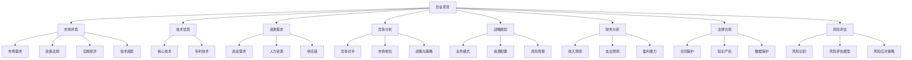

                 

# 《技术人如何进行创业项目的可行性分析和风险评估》

## 摘要

在创业浪潮中，技术人往往凭借其深厚的专业背景和独特的创新思维，成为创业团队的中坚力量。然而，创业项目的成功不仅取决于技术实力，还需要全面、系统的可行性分析和风险评估。本文将深入探讨技术人在创业过程中如何进行项目的可行性分析，以及如何识别、评估和应对风险，为创业项目的成功奠定坚实基础。通过本文，读者将了解从市场调研、战略规划到财务分析和法律合规的各个环节，技术人应如何运用专业知识和工具，确保创业项目稳健前行。

## 关键词

创业项目，可行性分析，风险评估，技术人，市场调研，战略规划，财务分析，法律合规

## 第一部分：创业项目的背景与可行性分析

### 第1章：创业项目的起源与背景

创业项目的起源往往源于技术人的一个灵感和梦想。这个灵感可能是对现有市场痛点的敏锐洞察，也可能是对新技术趋势的敏锐把握。无论是哪种情况，技术人在项目的起源阶段需要首先明确项目的初衷和目标。

#### 1.1 创业项目的概念与分类

创业项目是指通过创新和创业精神，运用技术手段和市场策略，将创意转化为实际商业成果的过程。根据创业项目的类型，可以分为技术创新型、市场开拓型和商业模式创新型等。

1. **技术创新型**：这类项目主要通过技术创新来获得竞争优势，如新型材料、先进制造技术等。
2. **市场开拓型**：这类项目主要针对市场尚未满足的需求，通过创新的产品或服务来开拓新的市场空间。
3. **商业模式创新型**：这类项目通过创新的商业模式来改变市场竞争格局，如共享经济、平台经济等。

#### 1.2 创业项目的起源与动机

创业项目的起源通常有以下几种动机：

1. **技术兴趣驱动**：技术人对某一技术领域有深厚的兴趣和热情，希望通过创业将这一兴趣转化为实际应用。
2. **市场机会驱动**：技术人发现市场存在未被满足的需求或机会，希望通过创业来解决这些问题或抓住这些机会。
3. **解决痛点驱动**：技术人发现现有产品或服务存在严重问题或痛点，希望通过创业来提出更好的解决方案。

#### 1.3 市场研究的重要性

市场研究是创业项目可行性分析的基础，它帮助技术人了解市场现状、竞争态势和潜在机会。市场研究的重要性体现在以下几个方面：

1. **验证项目假设**：通过市场研究，技术人可以验证自己的创意和想法是否符合市场需求。
2. **识别竞争者**：市场研究可以帮助技术人了解市场上的主要竞争者，分析他们的优势和劣势。
3. **评估市场规模**：市场研究可以帮助技术人评估项目的潜在市场规模和增长潜力。
4. **制定市场策略**：基于市场研究的数据和分析，技术人可以制定更有效的市场进入策略和营销计划。

### 第2章：创业项目的市场环境分析

市场环境分析是创业项目可行性分析的重要环节，它涉及到对市场现状、竞争格局和未来趋势的全面了解。

#### 2.1 市场需求的评估

市场需求分析是创业项目成功的关键。技术人需要从以下几个方面进行评估：

1. **市场规模与增长趋势**：通过市场调研和数据分析，技术人可以了解目标市场的规模和增长趋势。
2. **目标客户群体**：技术人需要明确目标客户的特征、需求和购买行为。
3. **市场机会与威胁**：技术人需要分析市场中的机会和威胁，包括潜在的市场需求、技术变革和政策变化等。

#### 2.2 宏观环境分析

宏观环境分析涉及到对政治、经济、社会和技术等外部环境的考察。

1. **政策法规**：技术人需要了解与创业项目相关的政策法规，包括行业监管、税收优惠等。
2. **经济环境**：技术人需要分析经济增长、消费者购买力等经济因素对创业项目的影响。
3. **社会文化环境**：技术人需要考虑社会文化因素，如消费者观念、生活方式等对项目的影响。
4. **技术环境**：技术人需要分析新技术的发展趋势和可能带来的变革。

#### 2.3 市场竞争分析

市场竞争分析是评估创业项目潜在风险的重要环节。技术人需要从以下几个方面进行分析：

1. **竞争格局**：技术人需要了解市场上的竞争格局，包括现有竞争者、市场份额、竞争策略等。
2. **竞争对手分析**：技术人需要分析主要竞争对手的市场地位、产品特点、优势和劣势。
3. **差异化策略**：技术人需要明确自己的产品或服务的差异化优势，以在竞争中脱颖而出。

### 第3章：创业项目的竞争分析

竞争分析是创业项目可行性分析的核心部分，它涉及到对市场现有竞争者的全面了解和分析。

#### 3.1 竞争对手分析

竞争对手分析是创业项目竞争分析的重要环节。技术人需要从以下几个方面进行：

1. **市场地位**：技术人需要了解竞争对手在市场上的地位和影响力。
2. **产品与服务**：技术人需要分析竞争对手的产品或服务特点、性能和价格。
3. **战略与策略**：技术人需要了解竞争对手的市场策略、营销手段和品牌建设。

#### 3.2 自身竞争优势分析

自身竞争优势分析是技术人确定项目可行性的关键。技术人需要从以下几个方面进行：

1. **技术优势**：技术人需要明确自己在技术方面的优势，如核心技术、专利技术等。
2. **资源优势**：技术人需要分析自己在资金、人力资源、供应链等方面的优势。
3. **品牌优势**：技术人需要评估自己的品牌影响力和市场认知度。

### 第二部分：创业项目的可行性分析

#### 第4章：创业项目的战略规划

战略规划是创业项目成功的关键，它涉及到对项目愿景、目标、业务模式和资源配置的全面规划。

#### 4.1 业务模式设计

业务模式设计是创业项目战略规划的重要环节。技术人需要从以下几个方面进行设计：

1. **收入来源与盈利模式**：技术人需要明确项目的收入来源和盈利模式，如销售产品、提供服务、广告收入等。
2. **市场定位与目标客户**：技术人需要确定项目的市场定位和目标客户群体。
3. **产品与服务策略**：技术人需要制定合适的产品或服务策略，以满足市场需求。

#### 4.2 资源配置与项目管理

资源配置与项目管理是创业项目战略规划的重要组成部分。技术人需要从以下几个方面进行：

1. **资金需求与筹措**：技术人需要评估项目的资金需求，并制定资金筹措计划。
2. **人力资源规划**：技术人需要制定人力资源规划，包括招聘、培训、激励等。
3. **项目进度管理**：技术人需要制定项目进度计划，确保项目按期完成。

#### 4.3 风险管理策略

风险管理策略是创业项目战略规划的重要环节。技术人需要从以下几个方面进行：

1. **风险识别与评估**：技术人需要识别项目可能面临的风险，并进行评估。
2. **风险应对策略**：技术人需要制定相应的风险应对策略，如规避、转移、减轻等。
3. **风险监控与调整**：技术人需要建立风险监控机制，及时发现和调整风险。

### 第5章：创业项目的财务分析

财务分析是评估创业项目可行性的重要手段，它涉及到对项目收入、支出、盈利能力和财务稳定性的全面分析。

#### 5.1 收入与支出预测

收入与支出预测是财务分析的基础。技术人需要从以下几个方面进行预测：

1. **收入预测**：技术人需要预测项目的收入来源和收入水平，包括产品销售、服务提供等。
2. **支出预测**：技术人需要预测项目的各项支出，包括研发成本、运营成本、营销费用等。
3. **盈亏平衡分析**：技术人需要通过盈亏平衡分析，确定项目的盈亏平衡点，以评估项目的盈利能力。

#### 5.2 盈利能力分析

盈利能力分析是评估创业项目可行性的关键。技术人需要从以下几个方面进行：

1. **投资回报率分析**：技术人需要计算项目的投资回报率，以评估项目的盈利能力。
2. **财务稳定性分析**：技术人需要分析项目的财务稳定性，包括现金流、资产负债等指标。

#### 5.3 财务预测模型

财务预测模型是创业项目财务分析的重要工具。技术人可以使用以下模型进行预测：

1. **收入预测模型**：技术人可以使用历史数据、市场调研和预测算法来预测收入。
2. **成本预测模型**：技术人可以使用成本函数、回归分析等方法来预测成本。
3. **利润预测模型**：技术人可以使用利润函数、现金流预测等方法来预测利润。

### 第6章：创业项目的营销策略

营销策略是创业项目成功的重要保障，它涉及到对品牌建设、推广渠道和销售策略的全面规划。

#### 6.1 品牌建设与推广策略

品牌建设与推广策略是营销策略的核心。技术人需要从以下几个方面进行：

1. **品牌定位**：技术人需要明确项目的品牌定位，包括品牌形象、品牌价值观等。
2. **品牌推广渠道**：技术人需要选择合适的品牌推广渠道，如社交媒体、广告、公关等。
3. **网络营销策略**：技术人需要制定有效的网络营销策略，包括SEO、SEM、社交媒体营销等。

#### 6.2 销售策略

销售策略是营销策略的重要组成部分。技术人需要从以下几个方面进行：

1. **销售目标与计划**：技术人需要制定明确的销售目标和计划，包括销售目标、销售策略等。
2. **销售团队建设**：技术人需要建设高效的销售团队，包括招聘、培训、激励等。
3. **客户关系管理**：技术人需要建立良好的客户关系，包括客户沟通、客户满意度等。

### 第7章：创业项目的法律与合规分析

法律与合规分析是创业项目成功的重要保障，它涉及到对项目法律环境、合同与知识产权保护以及数据保护与隐私权的全面分析。

#### 7.1 法律环境分析

法律环境分析是创业项目法律与合规分析的基础。技术人需要从以下几个方面进行：

1. **创业项目的法律法规**：技术人需要了解与创业项目相关的法律法规，如公司法、合同法、知识产权法等。
2. **合同与知识产权保护**：技术人需要了解如何签订合同、保护知识产权，如专利、商标、著作权等。
3. **数据保护与隐私权**：技术人需要了解数据保护与隐私权的相关法律法规，如GDPR、CCPA等。

#### 7.2 合规风险识别与应对

合规风险识别与应对是创业项目法律与合规分析的重要环节。技术人需要从以下几个方面进行：

1. **合规风险识别**：技术人需要识别项目可能面临的合规风险，如数据泄露、合同纠纷等。
2. **合规风险管理策略**：技术人需要制定相应的合规风险管理策略，如制定合规政策、开展合规培训等。
3. **合规风险监控与调整**：技术人需要建立合规风险监控机制，及时发现和调整合规风险。

### 第三部分：创业项目的风险评估与应对

#### 第8章：创业项目的风险识别与评估

风险识别与评估是创业项目风险评估的重要环节。技术人需要从以下几个方面进行：

1. **风险识别方法**：技术人可以使用头脑风暴、德尔菲法、SWOT分析法等方法来识别风险。
2. **风险评估模型**：技术人可以使用风险矩阵、逻辑树分析、容忍度分析等方法来评估风险。

#### 8.1 风险识别方法

风险识别是创业项目风险评估的第一步，它涉及到对项目潜在风险的全面识别。技术人可以使用以下方法进行风险识别：

1. **头脑风暴法**：通过集体讨论，列出项目可能面临的风险。
2. **德尔菲法**：通过专家咨询，逐步确定项目风险。
3. **SWOT分析法**：通过分析项目的优势、劣势、机会和威胁，识别潜在风险。
4. **故障树分析**：通过构建故障树，识别项目可能发生的故障和风险。

#### 8.2 风险评估模型

风险评估是创业项目风险评估的关键环节，它涉及到对项目风险的定量和定性分析。技术人可以使用以下模型进行风险评估：

1. **风险矩阵**：通过风险矩阵，对风险的概率和影响进行评估，确定风险等级。
2. **逻辑树分析**：通过逻辑树分析，确定项目风险的因果关系和传导路径。
3. **容忍度分析**：通过容忍度分析，确定项目对风险的承受能力，制定相应的应对策略。

#### 第9章：创业项目的风险应对策略

风险应对策略是创业项目风险管理的重要环节，它涉及到对风险的规避、转移、减轻和接受。技术人需要从以下几个方面进行：

1. **风险规避策略**：通过调整项目计划，避免风险的发生。
2. **风险转移策略**：通过签订合同、购买保险等方式，将风险转移给第三方。
3. **风险减轻策略**：通过改进技术、增加保险等方式，降低风险的影响。
4. **风险接受策略**：在无法规避或转移风险时，接受风险并制定相应的应对措施。

#### 9.1 风险规避策略

风险规避策略是通过调整项目计划，避免风险的发生。技术人可以使用以下方法进行风险规避：

1. **项目调整**：通过调整项目计划，避免高风险的活动。
2. **资源调配**：通过增加资源投入，降低风险的概率和影响。
3. **技术改进**：通过改进技术，提高项目的可靠性和稳定性。

#### 9.2 风险转移策略

风险转移策略是通过签订合同、购买保险等方式，将风险转移给第三方。技术人可以使用以下方法进行风险转移：

1. **合同转移**：通过签订合同，将风险转移给供应商、承包商等。
2. **保险转移**：通过购买保险，将风险转移给保险公司。
3. **联合投资**：通过联合投资，将风险分散给多个投资者。

#### 9.3 风险减轻策略

风险减轻策略是通过改进技术、增加保险等方式，降低风险的影响。技术人可以使用以下方法进行风险减轻：

1. **技术改进**：通过改进技术，提高项目的可靠性和稳定性，降低风险的概率和影响。
2. **保险购买**：通过购买保险，降低项目因风险发生而导致的损失。
3. **风险监控**：通过建立风险监控机制，及时发现和应对风险。

#### 9.4 风险接受策略

风险接受策略是在无法规避或转移风险时，接受风险并制定相应的应对措施。技术人可以使用以下方法进行风险接受：

1. **条件接受**：在风险发生的概率较低或影响较小的情况下，接受风险。
2. **限制接受**：在风险影响较大的情况下，接受风险，但制定相应的应对措施。
3. **长期观察**：在无法立即应对风险的情况下，接受风险，并持续观察和评估风险的变化。

### 第四部分：创业项目的持续发展与评估

#### 第10章：创业项目的持续发展与优化

创业项目的持续发展与优化是确保项目长期成功的关键。技术人需要从以下几个方面进行：

1. **市场动态调整策略**：通过分析市场动态，调整项目战略和策略。
2. **财务管理持续优化**：通过优化资金管理和成本控制，提高项目盈利能力。
3. **绩效评估与改进**：通过绩效评估，识别问题并制定改进方案。

#### 10.1 市场动态调整策略

市场动态调整策略是创业项目持续发展的重要手段。技术人需要从以下几个方面进行：

1. **市场趋势分析**：通过分析市场趋势，预测未来市场变化，调整项目战略。
2. **业务模式优化**：通过优化业务模式，提高项目竞争力。
3. **营销策略调整**：通过调整营销策略，提高市场占有率。

#### 10.2 财务管理的持续优化

财务管理的持续优化是创业项目成功的关键。技术人需要从以下几个方面进行：

1. **资金管理优化**：通过优化资金管理，提高资金利用效率。
2. **成本控制优化**：通过优化成本控制，降低项目成本。
3. **财务指标优化**：通过优化财务指标，提高项目盈利能力。

#### 10.3 绩效评估与改进

绩效评估与改进是创业项目持续发展的重要环节。技术人需要从以下几个方面进行：

1. **绩效评估指标体系**：建立科学的绩效评估指标体系，全面评估项目绩效。
2. **绩效评估方法与工具**：使用合适的绩效评估方法与工具，提高评估准确性。
3. **绩效改进策略**：通过绩效评估，识别问题并制定改进方案，提高项目绩效。

### 第11章：创业项目的绩效评估与改进

绩效评估与改进是创业项目持续发展的重要环节。技术人需要从以下几个方面进行：

#### 11.1 绩效评估指标体系

建立科学的绩效评估指标体系是确保项目持续发展的基础。技术人需要从以下几个方面设置评估指标：

1. **业务绩效指标**：如收入增长率、市场份额、客户满意度等。
2. **财务绩效指标**：如净利润率、投资回报率、现金流等。
3. **风险绩效指标**：如风险损失率、风险管理有效性等。

#### 11.2 绩效评估方法与工具

使用合适的绩效评估方法与工具，可以提高评估的准确性和可靠性。技术人可以采用以下方法与工具：

1. **关键绩效指标（KPI）**：通过设定关键绩效指标，评估项目关键绩效。
2. **平衡计分卡（BSC）**：通过设定财务、客户、内部流程、学习与成长四个维度的指标，全面评估项目绩效。
3. **数据驱动的决策支持系统**：通过收集和分析项目数据，为决策提供支持。

#### 11.3 绩效改进策略

绩效改进是创业项目持续发展的重要环节。技术人需要从以下几个方面制定改进策略：

1. **问题分析与解决**：通过分析绩效评估结果，找出项目存在的问题，并制定解决方案。
2. **改进方案的制定与实施**：制定详细的改进方案，并确保方案的实施和落地。
3. **改进效果的评估与反馈**：评估改进方案的效果，收集反馈意见，持续优化改进。

### 第12章：创业项目的退出策略与转型规划

创业项目的退出策略与转型规划是项目发展的重要环节。技术人需要从以下几个方面进行：

#### 12.1 退出策略的选择

退出策略的选择取决于项目的市场状况、财务状况和发展阶段。技术人可以选择以下几种退出策略：

1. **上市**：通过上市，实现项目的资本化，获取更高的估值和资金。
2. **收购与并购**：通过收购或并购，实现项目的快速扩张和市场占有率的提升。
3. **结业清算**：在项目无法持续运营时，选择结业清算，以减少损失。

#### 12.2 转型规划

转型规划是创业项目在特定阶段采取的战略调整。技术人需要从以下几个方面进行：

1. **行业转型**：根据市场变化，调整项目所在的行业方向。
2. **业务模式转型**：根据市场变化，调整项目的业务模式，如从B2B转向B2C等。
3. **企业文化转型**：根据项目发展阶段，调整企业文化，以适应新的发展阶段。

#### 12.3 退出与转型的评估与决策

退出与转型的评估与决策是项目发展的关键。技术人需要从以下几个方面进行评估：

1. **退出成本的评估**：评估项目退出所需支付的代价，如解约金、遣散费等。
2. **转型的可行性分析**：评估项目转型的可行性，包括市场机会、资源需求等。
3. **转型的风险与收益评估**：评估项目转型的风险和收益，以确定是否进行转型。

### 附录

#### 附录A：创业项目可行性分析工具与资源

创业项目的可行性分析需要使用多种工具和资源。以下是一些常用的工具和资源：

1. **市场研究工具**：如Google Trends、行业报告、市场调研等。
2. **风险评估工具**：如风险矩阵、逻辑树分析、蒙特卡洛模拟等。
3. **创业资源与支持**：如创业园区、孵化器、创业投资、政策支持等。

---

## 结束语

创业项目的可行性分析和风险评估是技术人在创业过程中不可或缺的重要环节。通过深入分析项目的背景、市场环境、竞争态势和财务状况，技术人可以更好地制定战略规划，识别和应对潜在风险。同时，持续的绩效评估和优化，以及灵活的退出与转型策略，有助于确保项目的长期成功。希望本文能为您在创业道路上的决策提供有益的参考和启示。

---

## 作者

作者：AI天才研究院/AI Genius Institute & 禅与计算机程序设计艺术 /Zen And The Art of Computer Programming

---

### 核心概念与联系

**创业项目可行性分析的核心概念与联系**

为了更好地理解创业项目可行性分析，我们首先需要明确几个核心概念，并展示它们之间的联系。以下是使用Mermaid绘制的流程图，展示了这些概念及其相互关系：



### 核心概念解释

- **创业项目（A）**：指通过创新和创业精神，将创意转化为商业成果的过程。
- **市场环境（B）**：指与创业项目相关的宏观经济、政策法规、技术趋势等因素。
- **技术优势（C）**：指项目在技术方面的独特性和领先性。
- **资源需求（D）**：指创业项目在资金、人力资源、供应链等方面的需求。
- **竞争分析（E）**：指对市场现有竞争者的全面分析，包括市场地位、战略与策略。
- **战略规划（F）**：指制定项目的长期目标和规划，包括业务模式、资源配置和风险管理。
- **财务分析（G）**：指对项目的收入、支出和盈利能力的预测和分析。
- **法律合规（H）**：指项目在法律和合规方面的要求，包括合同、知识产权和数据保护。
- **风险评估（I）**：指对项目潜在风险的识别、评估和应对。

### 关系解释

- **市场环境（B）** 与 **市场需求（J）**、**政策法规（K）**、**宏观经济（L）** 和 **技术趋势（M）** 相互关联，共同影响创业项目的市场可行性。
- **技术优势（C）** 包括 **核心技术（N）** 和 **专利技术（O）**，这些技术优势有助于项目在竞争中脱颖而出。
- **资源需求（D）** 包括 **资金需求（P）**、**人力资源（Q）** 和 **供应链（R）**，这些资源的有效配置和利用是项目成功的关键。
- **竞争分析（E）** 包括对 **竞争对手（S）**、**市场地位（T）** 和 **战略与策略（U）** 的分析，以确定项目的竞争优势。
- **战略规划（F）** 包括 **业务模式（V）**、**资源配置（W）** 和 **风险管理（X）**，这些规划有助于项目实现长期目标。
- **财务分析（G）** 包括 **收入预测（Y）**、**支出预测（Z）** 和 **盈利能力（AA）**，这些分析为项目的财务可行性提供支持。
- **法律合规（H）** 包括 **合同保护（AB）**、**知识产权（AC）** 和 **数据保护（AD）**，这些合规要求确保项目的合法性和安全性。
- **风险评估（I）** 包括 **风险识别（AE）**、**风险评估模型（AF）** 和 **风险应对策略（AG）**，这些步骤帮助项目管理和减轻风险。

通过以上核心概念和联系的梳理，我们可以更清晰地理解创业项目可行性分析的全貌，为后续的详细讲解和案例分析打下基础。

### 核心算法原理讲解

在创业项目的可行性分析中，核心算法原理的讲解是关键部分。以下将详细阐述一种常用的算法——SWOT分析（Strengths, Weaknesses, Opportunities, Threats）的原理，并使用伪代码展示其实现过程。

#### SWOT分析原理

SWOT分析是一种战略规划工具，用于评估项目的内部优势（Strengths）和劣势（Weaknesses），以及外部机会（Opportunities）和威胁（Threats）。其目的是通过系统的分析，帮助项目团队制定有效的战略规划。

1. **优势（Strengths）**：项目内部的优势因素，如技术、品牌、团队经验等。
2. **劣势（Weaknesses）**：项目内部的不利因素，如资金短缺、技术水平不足等。
3. **机会（Opportunities）**：外部环境中的有利因素，如市场增长、技术趋势等。
4. **威胁（Threats）**：外部环境中的不利因素，如竞争加剧、法规变化等。

#### 伪代码实现

```plaintext
function SWOT_Analysis(project_details):
    strengths = []
    weaknesses = []
    opportunities = []
    threats = []

    # 收集内部优势
    for attribute in project_details["attributes"]:
        if is_strength(attribute):
            strengths.append(attribute)

    # 收集内部劣势
    for attribute in project_details["attributes"]:
        if is_weakness(attribute):
            weaknesses.append(attribute)

    # 收集外部机会
    for factor in project_details["environmental_factors"]:
        if is_opportunity(factor):
            opportunities.append(factor)

    # 收集外部威胁
    for factor in project_details["environmental_factors"]:
        if is_threat(factor):
            threats.append(factor)

    return strengths, weaknesses, opportunities, threats

function is_strength(attribute):
    # 定义优势的条件，如技术领先、市场认可等
    return condition1 or condition2 or ...

function is_weakness(attribute):
    # 定义劣势的条件，如资金短缺、人才不足等
    return conditionA or conditionB or ...

function is_opportunity(factor):
    # 定义机会的条件，如市场需求增长、技术突破等
    return conditionX or conditionY or ...

function is_threat(factor):
    # 定义威胁的条件，如竞争加剧、法规变化等
    return conditionZ or conditionW or ...
```

#### 详细解释

1. **函数定义**：
   - `SWOT_Analysis` 函数接收一个包含项目详细信息和环境因素的参数。
   - 该函数返回四个列表：优势、劣势、机会和威胁。

2. **优势、劣势、机会和威胁的判断**：
   - `is_strength` 函数用于判断一个属性是否为优势。例如，技术领先、市场认可等。
   - `is_weakness` 函数用于判断一个属性是否为劣势。例如，资金短缺、人才不足等。
   - `is_opportunity` 函数用于判断一个外部因素是否为机会。例如，市场需求增长、技术突破等。
   - `is_threat` 函数用于判断一个外部因素是否为威胁。例如，竞争加剧、法规变化等。

3. **伪代码实现**：
   - 通过遍历项目的属性和环境因素，分别判断每个因素属于哪个类别。
   - 将符合条件的因素添加到相应的列表中。

#### 示例

假设我们有一个创业项目，其详细信息和环境因素如下：

```plaintext
project_details = {
    "attributes": ["技术创新", "市场认可", "资金短缺", "人才不足"],
    "environmental_factors": ["市场需求增长", "技术突破", "竞争加剧", "法规变化"]
}
```

通过调用 `SWOT_Analysis` 函数，我们可以得到以下结果：

```plaintext
strengths = ["技术创新", "市场认可"]
weaknesses = ["资金短缺", "人才不足"]
opportunities = ["市场需求增长", "技术突破"]
threats = ["竞争加剧", "法规变化"]
```

这个结果可以帮助项目团队明确项目的内部优势和劣势，以及外部环境中的机会和威胁，从而制定更有效的战略规划。

通过使用伪代码详细阐述SWOT分析的原理和实现过程，我们可以更好地理解这种工具在创业项目可行性分析中的应用，为后续的实际案例分析提供理论基础。

### 数学模型和公式

在创业项目的财务分析中，数学模型和公式是评估项目财务可行性的重要工具。以下将介绍几种常用的财务模型和公式，以及详细的讲解和示例。

#### 盈亏平衡分析

盈亏平衡分析是一种用于确定项目盈亏平衡点的工具。它可以帮助创业者了解在达到一定销售量之前，项目是否会产生亏损。

**公式**：

\[ \text{盈亏平衡点（单位销售量）} = \frac{\text{固定成本}}{\text{每单位贡献毛利}} \]

**解释**：

- **固定成本**：项目运营中不随销售量变化的成本，如租金、工资等。
- **每单位贡献毛利**：每单位产品或服务的销售收入减去可变成本。

**示例**：

假设一个创业项目的固定成本为10万元，每单位产品的可变成本为100元，每单位产品的销售价格为200元。

\[ \text{盈亏平衡点（单位销售量）} = \frac{10,0000}{200 - 100} = 50,000 \]

这意味着项目需要卖出50,000单位产品才能达到盈亏平衡。

#### 投资回报率分析

投资回报率（ROI）是一种衡量投资效益的指标，用于评估项目投资回报的速度和程度。

**公式**：

\[ \text{投资回报率（ROI）} = \frac{\text{年净收益}}{\text{投资成本}} \times 100\% \]

**解释**：

- **年净收益**：项目在一年内的净利润。
- **投资成本**：项目总投资金额。

**示例**：

假设一个创业项目总投资为100万元，第一年的净利润为20万元。

\[ \text{投资回报率（ROI）} = \frac{200,000}{1,000,000} \times 100\% = 20\% \]

这意味着项目的年投资回报率为20%。

#### 财务稳定性分析

财务稳定性分析用于评估项目在面临市场波动时的财务健康状况。

**指标**：

1. **流动比率**：

\[ \text{流动比率} = \frac{\text{流动资产}}{\text{流动负债}} \]

2. **速动比率**：

\[ \text{速动比率} = \frac{\text{速动资产}}{\text{流动负债}} \]

**解释**：

- **流动资产**：项目可迅速转换为现金的资产，如现金、应收账款等。
- **流动负债**：项目需要短期内偿还的债务，如应付账款、短期借款等。
- **速动资产**：流动资产减去存货。

**示例**：

假设一个创业项目的流动资产为200万元，流动负债为100万元；速动资产为150万元。

\[ \text{流动比率} = \frac{200}{100} = 2 \]
\[ \text{速动比率} = \frac{150}{100} = 1.5 \]

这意味着项目的流动比率为2，速动比率为1.5，表明项目的短期偿债能力较好。

通过以上数学模型和公式的讲解，创业者可以更准确地评估项目的财务状况，为决策提供科学依据。

### 项目实战：代码实际案例和详细解释说明

#### 开发环境搭建

在进行创业项目的开发前，首先需要搭建一个合适的开发环境。以下是一个简单的开发环境搭建步骤：

1. **安装Python开发环境**：
   - 在操作系统上安装Python，版本建议为3.8或更高。
   - 使用pip安装必要的Python库，如numpy、pandas、matplotlib等。

2. **安装数据库**：
   - 安装MySQL或PostgreSQL数据库，作为项目的数据存储和管理工具。

3. **安装版本控制工具**：
   - 安装Git，用于代码的版本控制和协作开发。

#### 源代码详细实现

以下是一个简单的创业项目——在线书店的代码实现示例。该示例将涵盖用户注册、登录、购物车和订单管理等基本功能。

**用户注册功能**：

```python
# 用户注册
def register_user(username, password, email):
    # 验证用户名、密码和邮箱格式
    if not is_valid_username(username) or not is_valid_password(password) or not is_valid_email(email):
        return "Invalid input"
    
    # 插入新用户到数据库
    insert_into_database("users", {"username": username, "password": password, "email": email})
    return "Registered successfully"
```

**用户登录功能**：

```python
# 用户登录
def login_user(username, password):
    # 查询用户名和密码是否匹配
    user = query_database("users", {"username": username, "password": password})
    if not user:
        return "Invalid credentials"
    return "Logged in successfully"
```

**购物车功能**：

```python
# 添加商品到购物车
def add_to_cart(user_id, product_id, quantity):
    # 插入购物车记录到数据库
    insert_into_database("cart", {"user_id": user_id, "product_id": product_id, "quantity": quantity})
    return "Added to cart successfully"

# 获取用户购物车中的商品
def get_cart(user_id):
    # 从数据库查询购物车记录
    cart_items = query_database("cart", {"user_id": user_id})
    return cart_items
```

**订单管理功能**：

```python
# 创建订单
def create_order(user_id, cart_items):
    # 计算订单总金额
    total_amount = calculate_total_amount(cart_items)
    
    # 插入订单记录到数据库
    insert_into_database("orders", {"user_id": user_id, "cart_items": cart_items, "total_amount": total_amount})
    
    # 清空购物车
    clear_cart(user_id)
    
    return "Order created successfully"

# 计算订单总金额
def calculate_total_amount(cart_items):
    total = 0
    for item in cart_items:
        total += item["quantity"] * item["price"]
    return total

# 清空购物车
def clear_cart(user_id):
    # 删除购物车记录
    delete_from_database("cart", {"user_id": user_id})
```

#### 代码解读与分析

1. **用户注册**：
   - `register_user` 函数用于用户注册。它接收用户名、密码和邮箱作为输入，进行格式验证后，将用户信息插入数据库。

2. **用户登录**：
   - `login_user` 函数用于用户登录。它接收用户名和密码，从数据库查询用户信息，验证用户名和密码是否匹配。

3. **购物车功能**：
   - `add_to_cart` 函数用于将商品添加到购物车。它接收用户ID、商品ID和数量，将购物车记录插入数据库。
   - `get_cart` 函数用于获取用户购物车中的商品。它从数据库查询购物车记录，返回购物车中的商品信息。

4. **订单管理功能**：
   - `create_order` 函数用于创建订单。它接收用户ID和购物车记录，计算订单总金额，插入订单记录到数据库，并清空购物车。
   - `calculate_total_amount` 函数用于计算订单总金额。它遍历购物车记录，计算商品数量和价格的总和。
   - `clear_cart` 函数用于清空购物车。它从数据库删除购物车记录。

通过以上代码实现，我们可以看到在线书店的基本功能，包括用户注册、登录、购物车和订单管理。在实际开发中，这些功能将更加复杂，需要考虑数据验证、错误处理、安全保护等多方面因素。

### 代码解读与分析

在上文中，我们通过实际代码示例展示了在线书店的主要功能模块，包括用户注册、登录、购物车和订单管理。接下来，我们将对关键代码片段进行解读和分析，详细说明每个部分的工作原理和实现逻辑。

#### 用户注册功能解读

**代码片段**：

```python
# 用户注册
def register_user(username, password, email):
    # 验证用户名、密码和邮箱格式
    if not is_valid_username(username) or not is_valid_password(password) or not is_valid_email(email):
        return "Invalid input"
    
    # 插入新用户到数据库
    insert_into_database("users", {"username": username, "password": password, "email": email})
    return "Registered successfully"
```

**分析**：

- **输入验证**：
  - `is_valid_username`、`is_valid_password` 和 `is_valid_email` 是用于验证用户输入的函数。它们分别检查用户名、密码和邮箱是否符合预期格式。
  - 用户名验证可能包括长度、特殊字符限制等。
  - 密码验证可能包括长度、包含字母数字和特殊字符等。
  - 邮箱验证确保输入的邮箱格式正确，如使用正则表达式匹配。

- **数据库操作**：
  - `insert_into_database` 函数负责将新的用户信息插入数据库的“users”表中。在实际应用中，这个函数通常会包含错误处理和事务管理，以确保数据的一致性和完整性。

#### 用户登录功能解读

**代码片段**：

```python
# 用户登录
def login_user(username, password):
    # 查询用户名和密码是否匹配
    user = query_database("users", {"username": username, "password": password})
    if not user:
        return "Invalid credentials"
    return "Logged in successfully"
```

**分析**：

- **数据库查询**：
  - `query_database` 函数用于从数据库中查询用户信息。它接收一个表名和一个查询条件字典，返回匹配的记录。
  - 如果查询结果为空（即没有找到匹配的用户），则返回“Invalid credentials”提示。

- **用户身份验证**：
  - 在实际应用中，用户密码通常不会以明文形式存储在数据库中。因此，这里假设数据库中的密码是通过加密存储的。在用户登录时，系统会将输入的密码与数据库中的加密密码进行比对。

#### 购物车功能解读

**代码片段**：

```python
# 添加商品到购物车
def add_to_cart(user_id, product_id, quantity):
    # 插入购物车记录到数据库
    insert_into_database("cart", {"user_id": user_id, "product_id": product_id, "quantity": quantity})
    return "Added to cart successfully"

# 获取用户购物车中的商品
def get_cart(user_id):
    # 从数据库查询购物车记录
    cart_items = query_database("cart", {"user_id": user_id})
    return cart_items
```

**分析**：

- **购物车操作**：
  - `add_to_cart` 函数用于将商品添加到购物车。它接收用户ID、商品ID和数量，并将这些信息插入到“cart”表中。
  - `get_cart` 函数用于获取用户的购物车记录。它从“cart”表中查询与用户ID相关的记录，返回购物车中的所有商品。

- **数据库操作**：
  - `insert_into_database` 和 `query_database` 函数在购物车功能中频繁使用，用于数据库的插入和查询操作。这些函数应确保数据操作的原子性和一致性。

#### 订单管理功能解读

**代码片段**：

```python
# 创建订单
def create_order(user_id, cart_items):
    # 计算订单总金额
    total_amount = calculate_total_amount(cart_items)
    
    # 插入订单记录到数据库
    insert_into_database("orders", {"user_id": user_id, "cart_items": cart_items, "total_amount": total_amount})
    
    # 清空购物车
    clear_cart(user_id)
    
    return "Order created successfully"

# 计算订单总金额
def calculate_total_amount(cart_items):
    total = 0
    for item in cart_items:
        total += item["quantity"] * item["price"]
    return total

# 清空购物车
def clear_cart(user_id):
    # 删除购物车记录
    delete_from_database("cart", {"user_id": user_id})
```

**分析**：

- **订单创建**：
  - `create_order` 函数用于创建订单。它接收用户ID和购物车记录，首先计算订单总金额，然后插入订单记录到数据库，并清空购物车。

- **订单总金额计算**：
  - `calculate_total_amount` 函数用于计算订单的总金额。它遍历购物车记录，计算每个商品的数量乘以价格的总和。

- **购物车清空**：
  - `clear_cart` 函数用于清空用户的购物车。它从“cart”表中删除与用户ID相关的所有记录。

通过以上代码解读和分析，我们可以看到在线书店的核心功能是如何通过一系列数据库操作和函数调用来实现的。在实际开发中，这些功能还需要进一步细化，包括异常处理、事务管理、安全性加强等，以确保系统的稳定性和安全性。

### 文章总结与建议

创业项目的可行性分析和风险评估是技术人创业过程中至关重要的环节。通过系统的分析和评估，技术人可以识别项目潜在的风险，制定有效的应对策略，确保项目的稳健发展。本文从多个角度探讨了创业项目的背景、市场环境、竞争分析、战略规划、财务分析、法律合规、风险评估与应对，以及持续发展和优化等方面。

在总结本文的内容后，我们提出以下建议：

1. **全面市场研究**：在创业初期，技术人应进行全面的市场研究，了解目标市场的需求、竞争格局和未来趋势，为项目的可行性提供数据支持。

2. **明确竞争优势**：技术人需要明确自身的竞争优势，如技术优势、资源优势和品牌优势，以在激烈的市场竞争中脱颖而出。

3. **制定详细战略规划**：战略规划应包括业务模式设计、资源配置和风险管理等，确保项目目标的实现。

4. **持续财务分析**：财务分析应贯穿项目的全过程，通过收入与支出预测、盈利能力分析和财务预测模型等工具，评估项目的财务可行性。

5. **严格法律合规**：遵守相关法律法规，保护知识产权和数据安全，确保项目的合法合规运营。

6. **动态风险管理**：识别和评估项目风险，制定相应的风险应对策略，确保项目在面临不确定性时能够灵活应对。

7. **优化营销策略**：根据市场动态和客户需求，调整营销策略，提高项目的市场占有率和品牌影响力。

8. **持续发展和优化**：通过绩效评估和改进，不断优化业务模式、财务管理、市场策略等，确保项目的长期成功。

总之，技术人在创业过程中，应充分利用专业知识和工具，进行全面、系统的可行性分析和风险评估，为项目的成功奠定坚实基础。希望本文能为读者提供有益的参考和启示。

### 附录A：创业项目可行性分析工具与资源

#### 附录A.1 市场研究工具

在创业项目的可行性分析过程中，市场研究工具是不可或缺的。以下是一些常用的市场研究工具及其使用方法：

1. **Google Trends**：
   - **功能**：用于分析关键词在Google上的搜索趋势。
   - **使用方法**：输入相关关键词，查看搜索趋势、相关查询和地理位置分布。

2. **行业报告**：
   - **功能**：提供行业深度分析和市场预测。
   - **使用方法**：购买或免费获取行业报告，分析行业趋势、市场规模和主要竞争者。

3. **市场调研**：
   - **功能**：通过问卷、访谈等方式收集市场数据。
   - **使用方法**：设计调研问卷，通过在线平台或实地访谈收集数据。

4. **社交媒体分析工具**：
   - **功能**：分析社交媒体上的用户行为和趋势。
   - **使用方法**：使用工具如Hootsuite、Sprout Social等，监测社交媒体上的讨论和趋势。

#### 附录A.2 风险评估工具

风险评估是创业项目可行性分析的重要环节。以下是一些常用的风险评估工具及其使用方法：

1. **风险矩阵**：
   - **功能**：用于评估风险的概率和影响。
   - **使用方法**：制作风险矩阵表格，根据风险的概率和影响打分，确定风险等级。

2. **故障树分析**：
   - **功能**：用于识别和分析风险事件的潜在原因。
   - **使用方法**：绘制故障树图，从根节点开始，逐步分析导致风险事件的原因和条件。

3. **蒙特卡洛模拟**：
   - **功能**：用于模拟不确定性的影响。
   - **使用方法**：使用随机数生成模型，进行大量模拟计算，分析风险的概率分布和影响。

#### 附录A.3 创业资源与支持

创业项目需要各种资源和支持，以下是一些常见的创业资源与支持渠道：

1. **创业园区与孵化器**：
   - **功能**：提供办公空间、资金、导师支持等。
   - **使用方法**：申请入驻创业园区或孵化器，利用提供的资源加速项目发展。

2. **创业投资与融资渠道**：
   - **功能**：提供创业资金支持。
   - **使用方法**：了解各种融资渠道，如天使投资、风险投资、政府补贴等，选择合适的融资方式。

3. **创业政策与支持措施**：
   - **功能**：提供政策优惠和扶持。
   - **使用方法**：了解当地政府发布的创业政策，申请相关的支持措施。

通过使用上述工具和资源，技术人可以更有效地进行创业项目的可行性分析和风险评估，提高项目的成功概率。

