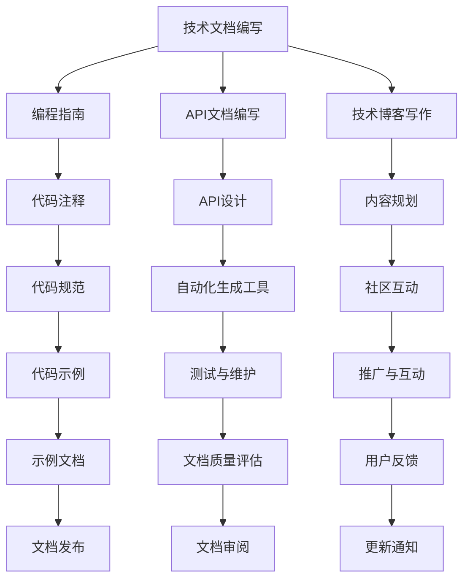

                 

### 背景与意义

随着信息技术的飞速发展，技术写作已经成为程序员不可或缺的一项技能。技术写作不仅能够帮助程序员更好地理解、掌握和应用新技术，还可以为他们提供一条副业选择的途径。程序员通过技术写作，可以实现知识的传播、个人品牌的建立以及收入的增加。本文将从技术写作的基础、副业项目规划与实践以及进阶提升与职业发展三个方面，系统地探讨技术写作对于程序员副业选择的重要性。

#### 核心概念与联系

技术写作涉及到多个核心概念，包括技术文档编写、编程指南、API文档编写、技术博客写作等。这些概念相互关联，共同构成了技术写作的完整体系。以下是一个简单的Mermaid流程图，用以展示这些概念之间的联系：



通过这个流程图，我们可以清晰地看到技术写作的各个环节如何相互关联，共同促进技术知识的传播和应用。

#### 核心算法原理讲解

技术写作中的算法原理主要包括信息组织、文档结构设计、内容呈现等方面的算法。以下是一个简单的伪代码，用以阐述如何设计一个技术文档的基本结构：

```plaintext
// 设计技术文档的基本结构
function createTechnicalDocument(title, sections) {
    document = {
        "title": title,
        "sections": []
    }
    
    for (section in sections) {
        sectionObject = {
            "title": section.title,
            "content": section.content,
            "subsections": []
        }
        
        if (section.subsections != null) {
            sectionObject.subsections = createTechnicalDocument(section.subsections)
        }
        
        document.sections.push(sectionObject)
    }
    
    return document
}
```

这个伪代码展示了如何通过递归函数设计一个嵌套的文档结构，每个文档结构包含标题、内容和子文档。这样的结构设计有助于组织大量的技术信息，使文档易于阅读和理解。

#### 数学模型和公式详解

在技术写作中，数学模型和公式是常见的内容。以下是一个简单的例子，使用LaTeX格式嵌入到文中独立段落中，详细讲解和举例说明：

```latex
% 独立段落中的数学模型和公式
\begin{equation}
    f(x) = ax^2 + bx + c
\end{equation}

% 举例说明
假设我们有一个二次函数，其系数分别为 \( a = 2 \), \( b = -4 \), \( c = 1 \)。我们可以通过以下步骤计算函数的零点：

\begin{align*}
    f(x) &= 2x^2 - 4x + 1 \\
    0 &= 2x^2 - 4x + 1 \\
    x &= \frac{-b \pm \sqrt{b^2 - 4ac}}{2a} \\
    x &= \frac{4 \pm \sqrt{(-4)^2 - 4 \cdot 2 \cdot 1}}{2 \cdot 2} \\
    x &= \frac{4 \pm \sqrt{16 - 8}}{4} \\
    x &= \frac{4 \pm \sqrt{8}}{4} \\
    x &= \frac{4 \pm 2\sqrt{2}}{4} \\
    x &= 1 \pm \frac{\sqrt{2}}{2}
\end{align*}

因此，该二次函数的零点为 \( x = 1 + \frac{\sqrt{2}}{2} \) 和 \( x = 1 - \frac{\sqrt{2}}{2} \)。
```

通过这个例子，我们可以看到如何使用LaTeX格式在文中独立段落中嵌入数学公式，并进行详细讲解和举例说明。

#### 代码实际案例和详细解释说明

为了更好地理解技术写作的应用，以下是一个简单的代码实际案例，用于解释开发环境搭建、源代码实现和代码解读。

**开发环境搭建：**

首先，我们需要搭建一个简单的Python开发环境。以下是步骤：

1. 安装Python：
   ```bash
   sudo apt-get update
   sudo apt-get install python3
   ```
2. 安装虚拟环境工具：
   ```bash
   sudo apt-get install python3-venv
   ```
3. 创建虚拟环境：
   ```bash
   python3 -m venv my_project_env
   ```
4. 激活虚拟环境：
   ```bash
   source my_project_env/bin/activate
   ```

**源代码实现：**

以下是一个简单的Python程序，用于计算斐波那契数列：

```python
def fibonacci(n):
    if n <= 0:
        return 0
    elif n == 1:
        return 1
    else:
        return fibonacci(n-1) + fibonacci(n-2)

# 测试斐波那契数列函数
print(fibonacci(10))
```

**代码解读与分析：**

- **函数定义**：`fibonacci` 函数接收一个整数 `n`，返回斐波那契数列的第 `n` 个数。
- **递归调用**：函数内部使用了递归调用，即调用自身来计算斐波那契数列的值。
- **边界条件**：当 `n` 小于等于 0 时，返回 0；当 `n` 等于 1 时，返回 1。
- **性能分析**：该递归实现的性能较差，因为每次调用都会进行大量的重复计算。在实际应用中，通常使用动态规划或迭代方法来优化性能。

通过这个代码案例，我们可以看到如何搭建开发环境、编写源代码以及解读代码，这对于理解技术写作的实际应用非常有帮助。

### 技术写作与副业选择的重要性

技术写作不仅是一种技能，更是一种副业选择的方式。对于程序员来说，技术写作具有以下几个方面的价值和重要性。

#### 知识传播

技术写作是知识传播的重要手段。通过撰写技术文档、编程指南、API文档和技术博客，程序员可以将自己的技术经验和知识分享给他人。这不仅有助于提升个人的技术影响力，还可以促进整个行业的发展。技术写作可以让程序员成为行业内的意见领袖，从而吸引更多的关注和机会。

#### 个人品牌建设

技术写作是个人品牌建设的重要途径。通过持续地输出高质量的技术内容，程序员可以在行业内树立自己的专业形象。个人品牌的建立不仅有助于提升个人的职业地位，还可以为未来的职业发展打开更多的大门。例如，技术博客可以作为个人简历的重要补充，向潜在的雇主展示个人的技术能力和专业知识。

#### 收入增加

技术写作是一种增加收入的途径。程序员可以通过撰写技术文档、编写编程指南、参与开源项目、提供技术咨询服务等方式实现收入增长。例如，编写并销售自己的编程书籍、开设在线课程、提供定制化的技术培训等都是常见的收入来源。此外，技术写作还可以吸引企业的赞助和广告收入，为程序员带来额外的收益。

#### 职业发展

技术写作有助于职业发展。通过技术写作，程序员可以不断提升自己的技能和知识，保持行业竞争力。同时，技术写作还可以为程序员提供更多的职业机会，如技术文档编写职位、技术培训师、技术咨询顾问等。此外，技术写作还可以促进程序员与其他行业人士的跨界合作，拓展职业发展空间。

#### 提升沟通能力

技术写作是一种锻炼沟通能力的有效方式。在撰写技术文档和博客时，程序员需要清晰地表达自己的观点和思想，使读者能够理解和应用所提供的信息。这种能力的提升不仅对技术写作本身有益，还可以帮助程序员在团队协作、项目管理和职场沟通中更好地与他人沟通和合作。

#### 增强问题解决能力

技术写作有助于增强问题解决能力。在撰写技术文档和博客时，程序员需要深入研究和分析问题，找到最佳的解决方案。这种过程不仅锻炼了程序员的分析和解决问题的能力，还可以帮助他们在实际工作中更加高效地解决技术难题。

综上所述，技术写作对于程序员的副业选择具有重要价值。通过技术写作，程序员可以实现知识传播、个人品牌建设、收入增加、职业发展、沟通能力提升和问题解决能力增强等多方面的目标。因此，技术写作应该成为程序员职业发展的重要策略之一。

### 技术写作的基本原则

技术写作作为一种专业的写作形式，需要遵循一系列基本原则，以确保文档的清晰性、准确性和一致性。以下是一些技术写作的基本原则：

#### 准确性

准确性是技术写作的首要原则。技术文档和博客文章需要准确传达信息，避免任何错误和误导。程序员在编写技术文档时，必须确保所提供的信息是真实和可靠的。以下是一些确保准确性的方法：

- **事实核对**：在编写文档前，对事实和数据来源进行核验，确保所有引用的信息都是准确的。
- **代码验证**：对于代码示例，确保代码能够正常运行，并且与文档描述的功能一致。
- **用户反馈**：在发布文档后，积极收集用户的反馈，及时纠正错误和改进内容。

#### 简洁性

简洁性是提高文档可读性的关键。技术文档和博客文章应避免冗长和复杂的句子，使用简洁明了的语言传达信息。以下是一些实现简洁性的方法：

- **精简语句**：避免使用过多的冗余词汇，使句子更加简洁。
- **使用列表**：使用列表来组织信息，使内容更加直观和易于理解。
- **去除多余内容**：删除无关紧要的细节，确保文档的核心内容清晰明了。

#### 逻辑性

逻辑性是确保文档内容有条理的重要原则。技术文档和博客文章需要按照逻辑顺序组织内容，使读者能够轻松理解文档的结构和思路。以下是一些实现逻辑性的方法：

- **清晰的结构**：使用标题、子标题和段落来组织内容，确保内容结构清晰。
- **逻辑递进**：按照问题的逻辑顺序和解决思路来组织文档内容。
- **一致性**：确保文档中的术语、符号和概念使用一致，避免混淆和误解。

#### 可读性

可读性是技术文档和博客文章成功的关键。技术写作需要使用易于理解的术语和表达方式，确保读者能够轻松理解文档内容。以下是一些提高可读性的方法：

- **简化的语言**：避免使用过于专业或晦涩的术语，使用简单的词汇和表达方式。
- **清晰的说明**：对复杂的概念和算法进行详细的解释和说明，帮助读者理解。
- **适当的格式**：使用适当的格式和排版，如字体、颜色、行距和段落分隔，提高文档的可读性。

#### 一致性

一致性是技术写作的基本要求。技术文档和博客文章需要保持一致的风格和格式，确保读者在阅读过程中不会感到困惑。以下是一些确保一致性的方法：

- **统一的风格**：遵循统一的写作风格，如字体、字号、段落格式等。
- **一致的术语**：在文档中统一使用特定的术语和定义，避免混淆。
- **格式检查**：在发布文档前，进行格式检查，确保文档的一致性和完整性。

通过遵循这些基本原则，程序员可以编写出高质量的技术文档和博客文章，提高文档的可读性、准确性和一致性，为读者提供有价值的信息。

### 技术文档的类型与格式

技术文档在软件开发和产品维护中扮演着至关重要的角色。为了确保技术文档的全面性和可读性，程序员需要了解不同类型的文档以及它们的格式和用途。以下是几种常见的技术文档类型及其详细说明。

#### 用户手册

**定义**：用户手册是一份详细指导用户如何使用软件或硬件产品的文档。

**用途**：用户手册的目标是帮助用户了解产品的基本功能、操作步骤和常见问题解决方案。

**格式**：
- **封面**：包含手册名称、版本号、发布日期和公司信息。
- **目录**：列出手册的章节和子章节，便于用户快速定位内容。
- **概述**：简要介绍产品的用途、特点和安装方法。
- **操作指南**：详细说明产品的使用步骤，包括基本操作、高级功能和配置选项。
- **故障排除**：列出常见问题及解决方案，帮助用户快速解决使用过程中遇到的问题。
- **附录**：提供额外的参考资料，如术语表、常见问题FAQ等。

#### 开发者文档

**定义**：开发者文档是面向开发人员的文档，包括API、框架、工具的使用方法和实现细节。

**用途**：开发者文档的目标是帮助开发者理解产品的内部结构和实现原理，便于他们进行二次开发和问题排查。

**格式**：
- **概述**：介绍文档的目的、受众和文档结构。
- **API参考**：详细描述每个API的名称、参数、返回值和异常处理。
- **模块说明**：介绍每个模块的功能、用途和实现方式。
- **代码示例**：提供具体的代码示例，展示如何使用API或模块。
- **配置说明**：说明如何配置和部署产品，包括环境设置、依赖管理等。
- **贡献指南**：提供如何参与开源项目的指南，包括代码提交、问题报告和文档编写。

#### 技术指南

**定义**：技术指南是针对某一特定技术或解决方案的详细文档，包括技术原理、实现方法和最佳实践。

**用途**：技术指南的目标是帮助技术人员深入了解某一技术领域，掌握相关知识和技能。

**格式**：
- **概述**：介绍技术指南的主题、目的和适用范围。
- **概念介绍**：解释技术的基本概念、原理和应用场景。
- **实现方法**：详细描述技术的实现方法、步骤和要点。
- **最佳实践**：提供技术实现的最佳实践和经验分享。
- **案例分析**：通过具体案例展示技术的实际应用和效果。
- **参考文献**：列出相关的参考资料和文献，便于进一步学习。

#### 白皮书

**定义**：白皮书是用于市场推广或学术报告的详细文档，介绍某一技术或解决方案的背景、原理、优势和实现方法。

**用途**：白皮书的目的是向潜在用户、合作伙伴和投资者展示技术的潜力和优势，促进产品的推广和销售。

**格式**：
- **封面**：包含白皮书名称、版本号、发布日期和公司信息。
- **概述**：介绍白皮书的目的、内容和结构。
- **背景**：解释技术或解决方案的背景和现状。
- **原理**：详细阐述技术或解决方案的原理和实现方法。
- **优势**：分析技术或解决方案的优势和竞争力。
- **实现**：描述技术或解决方案的实现过程和步骤。
- **案例研究**：提供具体案例研究，展示技术或解决方案的实际应用和效果。
- **结论**：总结白皮书的主要内容和结论。
- **参考文献**：列出相关的参考资料和文献。

通过了解不同类型的技术文档及其格式，程序员可以更好地编写和维护技术文档，确保文档的全面性、准确性和可读性，为软件开发和产品维护提供有力的支持。

### 编程指南与代码文档的编写

编程指南和代码文档是软件开发过程中不可或缺的一部分，它们不仅帮助开发人员更好地理解和维护代码，还促进团队合作和知识共享。以下将详细探讨编程指南和代码文档的编写过程，包括编程指南的基本概念、代码注释与文档、代码规范与风格以及代码示例与示例文档的编写。

#### 编程指南的基本概念

**编程指南**是一份指导开发人员如何在特定编程语言或开发环境中编写代码的文档。它通常包括以下内容：

- **编程规范**：定义代码编写的标准，如命名约定、代码格式和注释规范。
- **开发流程**：描述从需求分析到代码实现、测试和部署的整个开发过程。
- **工具与资源**：列出开发过程中需要使用的工具和资源，如集成开发环境（IDE）、版本控制系统和文档生成工具。

编写编程指南的目的是提高代码的一致性和可维护性，确保团队成员遵循相同的开发标准和流程，从而提升开发效率和质量。

#### 代码注释与文档

代码注释是代码文档中至关重要的一部分，它们为代码提供了额外的解释和上下文信息。以下是一些关于代码注释和文档的编写要点：

- **注释类型**：
  - **行内注释**：对代码行进行简要解释，通常用于解释复杂逻辑或临时性注释。
  - **块注释**：对代码块的功能或实现进行详细说明，通常用于解释函数、类或模块。
  - **文档注释**：使用特定语法（如Javadoc、Python的docstrings）生成文档，用于描述函数、类、模块和参数。

- **注释编写规范**：
  - **简洁明了**：注释应简洁明了，避免冗长和复杂的句子。
  - **准确描述**：确保注释准确描述代码的功能和用途，避免模糊和不准确的描述。
  - **及时更新**：随着代码的更新和维护，注释也需要及时更新，保持与代码的一致性。

#### 代码规范与风格

代码规范和风格是确保代码一致性和可维护性的关键。以下是一些常见的代码规范和风格：

- **命名约定**：
  - **变量命名**：使用有意义且简短的名称，避免使用缩写或晦涩难懂的名称。
  - **函数命名**：使用动词性名称，清晰地描述函数的作用。
  - **类命名**：使用名词或名词短语，表示类的功能和用途。

- **代码格式**：
  - **缩进与空白**：使用统一的缩进和空白，确保代码的可读性。
  - **括号使用**：遵循统一的括号使用规则，如K&R风格或WHITESPACE风格。
  - **代码布局**：合理组织代码结构，使用适当的空行和空格分隔不同的代码块。

- **代码风格**：
  - **模块化**：将代码拆分为可重用的模块，提高代码的可维护性。
  - **函数长度**：保持函数长度适中，避免过长或过短的函数。
  - **代码复用**：鼓励代码复用，减少冗余代码。

#### 代码示例与示例文档的编写

代码示例和示例文档是帮助开发人员理解和使用代码的重要工具。以下是一些编写代码示例和示例文档的要点：

- **代码示例**：
  - **功能性**：确保代码示例具有实际功能，可以正常运行并展示特定的功能。
  - **完整性**：提供完整的代码示例，包括必要的依赖和配置。
  - **可复制性**：确保代码示例易于复制和运行，避免因环境配置不同而导致无法运行。

- **示例文档**：
  - **说明性**：示例文档应对代码示例进行详细的解释和说明，帮助读者理解示例的目的和作用。
  - **规范性**：示例文档应遵循统一的格式和风格，确保文档的可读性和一致性。
  - **链接性**：示例文档应包含与代码示例相关的链接，便于读者进一步学习和参考。

通过编写详细的编程指南、注释、规范和示例，程序员可以提升代码的可读性、可维护性和可理解性，为团队合作和知识共享奠定基础。这些文档不仅有助于新成员快速融入项目，还可以提高项目的整体质量，减少维护成本。

### API文档编写的详细说明

API文档是描述应用程序编程接口（API）的重要文档，它详细介绍了API的使用方法、参数、返回值、错误处理等，对开发人员来说至关重要。以下将详细探讨API文档的编写，包括API文档的基本要素、编写规范、自动化生成工具和测试与维护。

#### API文档的基本要素

**接口定义**：描述每个API接口的名称、URL、HTTP方法（GET、POST等）以及请求和响应结构。

**参数说明**：详细说明每个接口的输入参数，包括参数名称、类型、是否必填、示例值等。

**返回值说明**：详细说明每个接口的返回值，包括返回值的类型、是否成功、返回的数据结构等。

**错误处理**：描述接口调用时可能发生的错误，包括错误码、错误信息以及对应的处理方法。

**安全性**：说明API接口的安全性要求，如鉴权方式、加密要求等。

**示例**：提供具体的代码示例，展示如何使用API接口进行调用。

**参考**：提供与API接口相关的其他文档链接或参考资料，便于进一步学习。

#### API文档的编写规范

**一致性**：保持文档风格和格式的一致性，如统一的标题层级、字体、颜色和段落格式。

**准确性**：确保文档描述的准确性和完整性，避免歧义和误解。

**简洁性**：使用简洁明了的语言，避免冗长和复杂的句子。

**逻辑性**：组织内容结构合理，逻辑清晰，便于阅读和理解。

**可读性**：使用易于理解的术语和表达方式，避免使用过于专业或晦涩的术语。

#### 自动化生成工具

**Swagger**：一款流行的API文档生成工具，支持多种编程语言和框架，可以生成基于JSON的API文档。

**OpenAPI Spec**：一种用于定义API的规范，可以自动生成Markdown、HTML等格式的文档。

**Doxygen**：一款通用的文档生成工具，支持多种编程语言，可以生成详细的API文档。

**Swagger Codegen**：一款基于Swagger文档生成客户端库的工具，可以生成多种语言的代码。

#### API文档的测试与维护

**功能测试**：验证API文档描述的接口功能是否正确，包括输入参数、返回值、错误处理等。

**兼容性测试**：验证API文档在不同平台和环境下的一致性和兼容性。

**性能测试**：验证API接口的性能指标，如响应时间、吞吐量等。

**自动化测试**：使用自动化测试工具（如Postman、JMeter等）编写测试脚本，自动执行API测试。

**文档维护**：定期更新API文档，确保与实际接口保持一致，及时反映接口的变更和更新。

通过编写详细且规范的API文档，开发人员可以更轻松地使用和集成API，提高开发效率，减少错误和误解。同时，自动化生成工具和测试与维护策略有助于确保API文档的质量和时效性。

### 技术博客写作的关键技巧

技术博客是程序员分享知识、经验和见解的重要平台，良好的写作技巧有助于提高博客的质量和影响力。以下是一些技术博客写作的关键技巧，包括选题定位、内容规划、写作风格和推广与社区互动。

#### 选题定位

**选题定位**是技术博客写作的第一步，选择具有针对性和价值的话题至关重要。以下是一些选题定位的技巧：

- **关注热点**：关注行业热点和技术趋势，选择热门话题进行写作。
- **解决痛点**：分析读者的需求和痛点，提供有针对性的解决方案。
- **个人专长**：结合自己的专长和经验，选择能够展示个人技术实力的话题。
- **原创性**：避免重复和抄袭，提供独特的见解和原创内容。

#### 内容规划

**内容规划**有助于确保博客文章的结构合理、逻辑清晰。以下是一些内容规划的方法：

- **明确主题**：确定文章的主题，围绕主题展开内容，避免偏离主题。
- **结构化内容**：将文章内容分为引言、正文和结论三个部分，确保内容连贯和有条理。
- **分段落写作**：将长篇文章分为多个段落，每个段落讨论一个具体的话题，提高可读性。
- **使用图表和示例**：适当使用图表、代码示例和截图，帮助读者更好地理解和应用内容。

#### 写作风格

**写作风格**是博客文章的特色，有助于吸引和留住读者。以下是一些写作风格的技巧：

- **简洁明了**：使用简洁明了的语言，避免复杂的术语和冗长的句子。
- **通俗易懂**：尽量使用通俗易懂的词汇和表达方式，避免过于专业或晦涩难懂。
- **逻辑清晰**：确保文章的结构和逻辑清晰，使读者能够轻松跟随思路。
- **个性化**：结合自己的语言风格和表达方式，打造独特的个人品牌。

#### 推广与社区互动

**推广与社区互动**是提高博客影响力的重要环节。以下是一些推广和社区互动的技巧：

- **社交媒体**：利用社交媒体平台（如微博、知乎、Twitter等）宣传博客，增加曝光度。
- **搜索引擎优化（SEO）**：通过合理的SEO优化，提高博客在搜索引擎中的排名。
- **参与讨论**：积极参与技术社区的讨论，分享自己的见解和经验，扩大影响力。
- **读者反馈**：积极回应读者的留言和评论，建立良好的互动关系。
- **内容更新**：定期更新博客内容，保持活跃度和新鲜感。

通过掌握这些技术博客写作的关键技巧，程序员可以编写出高质量、有价值的博客文章，提升个人品牌和影响力。

### 选择合适副业项目的关键步骤

选择合适的副业项目是程序员副业成功的关键。以下将详细讨论评估标准、技术栈与市场需求分析、项目风险与收益分析以及选择案例分析的步骤。

#### 评估标准

**评估标准**是选择副业项目的第一步，它有助于确保项目具有可行性和潜在价值。以下是一些关键的评估标准：

- **市场需求**：分析目标市场的大小和增长潜力，确保项目有足够的需求和用户基础。
- **技术难度**：评估项目所需的技术能力和开发难度，确保自己在技术上能够胜任。
- **时间投入**：评估项目所需的时间投入，确保自己能够合理安排时间，兼顾工作和生活。
- **资金成本**：评估项目的资金成本，包括开发成本、运营成本等，确保自己有足够的资金支持项目。

#### 技术栈与市场需求分析

**技术栈与市场需求分析**有助于确定项目是否与自身技能和市场需求相匹配。以下是一些关键步骤：

- **技术栈分析**：评估自身掌握的技术栈，了解自己在哪些技术领域具有优势，选择与自己技术栈相匹配的副业项目。
- **市场需求分析**：通过市场调研、用户反馈等途径，了解市场需求和用户痛点，选择具有市场前景的副业项目。

#### 项目风险与收益分析

**项目风险与收益分析**有助于全面评估项目的潜在价值和风险。以下是一些关键步骤：

- **风险评估**：分析项目可能面临的风险，包括技术风险、市场风险、资金风险等，制定应对措施。
- **收益分析**：评估项目的潜在收益，包括直接收益（如技术服务费、销售收入）和间接收益（如知识积累、人脉拓展等），制定合理的收益预期。

#### 选择案例分析

**选择案例分析**通过具体实例展示如何选择合适的副业项目。以下是一些常见案例：

- **案例一：个人博客搭建与运营**：通过个人博客分享技术知识和经验，建立个人品牌，拓展职业发展空间。
- **案例二：开源项目贡献与社区参与**：参与开源项目，提升自身技术水平，积累项目经验，扩大影响力。
- **案例三：在线教育平台课程开发**：利用专业知识和经验，开发在线教育平台课程，实现知识变现。
- **案例四：技术咨询服务与培训**：提供技术咨询服务和培训，为企业和个人提供专业的技术支持，实现业务拓展和收入增长。

通过以上关键步骤和分析方法，程序员可以更加科学地选择合适的副业项目，实现个人职业发展和收入增长。

### 项目规划与执行

项目规划与执行是副业项目成功的关键环节，它涉及项目目标的设定、任务分解、时间管理、进度跟踪、团队协作以及风险管理。以下将详细探讨这些关键要素。

#### 项目目标与任务分解

**项目目标**是项目规划的首要步骤，它明确了项目的总体方向和预期成果。以下是一些关键步骤：

- **明确目标**：设定具体、可量化的项目目标，确保目标具有可实现性。
- **分解任务**：将项目目标分解为具体的任务，制定详细的任务列表，确保每个任务都能明确完成。

#### 时间管理

**时间管理**是项目执行中的重要一环，它有助于确保项目按计划进行。以下是一些关键步骤：

- **制定时间表**：制定项目时间表，明确每个任务的时间安排和截止日期。
- **时间分配**：合理分配时间，确保任务能够在预定时间内完成。
- **时间监控**：实时监控项目进度，确保项目按计划进行，及时调整时间和资源分配。

#### 进度跟踪

**进度跟踪**是确保项目按计划进行的重要手段，它有助于及时发现和解决问题。以下是一些关键步骤：

- **进度报告**：定期编写进度报告，总结项目进展情况和遇到的问题。
- **任务跟踪工具**：使用任务跟踪工具（如Trello、Jira等）实时跟踪任务进度，确保每个任务都能按时完成。
- **进度评审**：定期进行进度评审，评估项目进度和风险，确保项目按计划进行。

#### 团队协作

**团队协作**是项目成功的关键，它需要团队成员之间的有效沟通和协作。以下是一些关键步骤：

- **团队组建**：组建合适的团队，明确团队成员的角色和职责。
- **沟通机制**：建立有效的沟通机制，确保团队内部信息畅通。
- **协作工具**：使用协作工具（如Slack、Microsoft Teams等）提高团队协作效率。

#### 风险管理

**风险管理**是项目规划与执行中不可或缺的一环，它有助于识别和应对潜在的风险。以下是一些关键步骤：

- **风险识别**：评估项目可能面临的风险，包括技术风险、市场风险、资金风险等。
- **风险评估**：评估风险的可能性和影响，制定相应的应对策略。
- **风险监控**：实时监控风险的变化，及时调整风险应对措施。

通过以上关键步骤和策略，程序员可以更好地规划与执行副业项目，确保项目顺利进行，实现预期目标。

### 副业项目案例分析

#### 案例一：个人博客搭建与运营

**背景**：程序员小王在业余时间搭建了自己的个人博客，希望通过分享技术知识和经验来提升自己的知名度。

**目标**：通过个人博客，小王希望积累更多的技术知识，拓展职业发展空间，并建立个人品牌。

**项目规划**：
- **第一阶段**：搭建博客平台，选择合适的博客系统（如Hexo）。
- **第二阶段**：撰写和发布技术文章，确保内容高质量和持续更新。
- **第三阶段**：进行博客推广，利用社交媒体和搜索引擎优化（SEO）提高博客的曝光度。

**项目执行与挑战**：
- **技术挑战**：小王在博客搭建过程中遇到了网站性能优化和SEO优化的难题。
- **内容创作**：为了保持博客内容的持续更新，小王需要不断学习和积累素材。

**成果**：通过持续的努力，小王的博客逐渐积累了一定的读者群，他不仅通过广告和赞助获得了收入，还获得了多个技术合作机会。

**反思**：小王认为，在博客运营过程中，定期进行内容规划和技术优化是关键，同时，积极参与技术社区和互动也是提高博客影响力的有效方法。

---

#### 案例二：开源项目贡献与社区参与

**背景**：程序员小李对开源项目充满热情，希望在业余时间贡献自己的力量。

**目标**：通过开源项目，小李希望提升自己的编程技能，建立技术影响力，并拓展职业发展空间。

**项目规划**：
- **第一阶段**：选择合适的开源项目，熟悉项目结构和代码库。
- **第二阶段**：参与代码审查和提交代码补丁，逐步承担更多的责任。
- **第三阶段**：参与社区讨论，分享经验和见解，扩大影响力。

**项目执行与挑战**：
- **技术挑战**：小李在代码提交过程中遇到了一些复杂的技术问题，需要不断学习和研究。
- **沟通协调**：与项目维护者和社区成员的沟通需要保持高效和顺畅。

**成果**：小李在开源项目中积累了丰富的经验，他的代码被多个项目采纳，同时，他也结识了多位技术大咖，拓展了自己的职业网络。

**反思**：小李认为，积极参与开源项目不仅可以提升个人技能，还可以通过贡献代码建立个人品牌，是职业发展中非常宝贵的一部分。

---

#### 案例三：在线教育平台课程开发

**背景**：程序员小张在技术领域拥有丰富经验，希望通过在线教育平台实现知识变现。

**目标**：通过开发在线课程，小张希望将自身的技术知识传授给更多人，同时实现财务自由。

**项目规划**：
- **第一阶段**：确定课程主题和目标受众，编写详细的课程大纲。
- **第二阶段**：录制教学视频，编写配套的讲义和练习题。
- **第三阶段**：在在线教育平台上发布课程，进行推广和营销。

**项目执行与挑战**：
- **内容创作**：课程内容需要持续更新和优化，确保与市场需求保持一致。
- **推广营销**：如何吸引更多的学员和提升课程知名度是重要的挑战。

**成果**：小张的在线课程受到了广泛好评，他的课程销售情况良好，实现了可观的收入。

**反思**：小张认为，在线教育平台的成功离不开良好的课程内容、有效的营销策略和持续的更新与改进。

---

#### 案例四：技术咨询服务与培训

**背景**：程序员小赵在技术领域拥有丰富经验，并具备良好的沟通和教学能力。

**目标**：通过提供技术咨询服务和培训，小赵希望为企业和个人提供专业的技术支持，实现业务拓展和收入增长。

**项目规划**：
- **第一阶段**：确定服务内容和收费标准，建立咨询服务体系。
- **第二阶段**：制定培训计划，编写培训教材，准备培训资源。
- **第三阶段**：开展咨询服务和培训活动，积累客户和学员资源。

**项目执行与挑战**：
- **咨询服务**：如何准确诊断和解决客户问题，提供高质量的服务。
- **培训活动**：如何设计有趣的培训课程，提高学员的学习效果。

**成果**：小赵的技术咨询服务和培训业务逐渐扩大，他的客户和学员数量持续增加。

**反思**：小赵认为，提供优质的技术咨询和培训服务是业务成功的关键，同时，建立良好的客户关系和口碑也是持续发展的重要保障。

通过以上案例，我们可以看到，选择合适的副业项目并科学规划与执行是程序员实现职业发展和收入增长的重要途径。每个案例都有其独特的经验和教训，可以为其他程序员提供有益的启示。

### 副业收入管理与成长路径

副业收入管理与成长路径是程序员开展副业的重要环节，它涉及收入来源分析、收入管理策略、成长路径规划以及职业规划与转型。以下将详细探讨这些方面。

#### 收入来源分析

**直接收入**：包括技术服务费、课程销售收入、咨询费等。程序员可以通过提供技术咨询服务、开发定制化软件或在线课程等方式获得直接收入。

**间接收入**：包括广告收入、赞助收入、合作伙伴收入等。通过技术博客、社交媒体平台或在线教育平台，程序员可以吸引广告商或合作伙伴，获得额外的收入来源。

#### 收入管理策略

**预算制定**：制定合理的副业收入预算，根据收入预期和支出需求，合理安排收入分配。确保收入能够满足日常开销和副业项目的发展。

**费用报销**：记录副业收入和支出，合理报销相关费用。使用财务软件或记账工具，方便管理收入和支出。

**税务处理**：了解当地的税收政策，合理申报和缴纳税收。如需聘请会计师，确保税务申报的准确性和合规性。

#### 成长路径规划

**技能提升**：根据副业需求，不断提升自己的技能和知识。参加培训课程、阅读专业书籍、参加技术会议等，都是提升技能的有效途径。

**市场拓展**：开拓新的市场机会，扩大业务范围。通过市场调研、用户反馈等方式，了解市场需求，调整副业策略。

**团队建设**：组建合适的团队，提高团队协作效率。明确团队成员的角色和职责，建立良好的沟通机制。

#### 职业规划与转型

**职业规划**：根据个人兴趣和市场需求，制定长期的职业规划。考虑是否继续深耕现有领域，还是尝试新的职业方向。

**转型策略**：分析自身优势和市场需求，制定转型策略。如需转型，提前规划，做好准备，确保转型顺利。

通过科学的管理策略和规划，程序员可以更好地管理副业收入，实现个人职业成长，并在副业中找到自己的发展方向。

### 技术写作进阶技巧

技术写作是一项需要不断学习和提升的技能。以下是一些进阶技巧，包括高效写作技巧、文字风格与个人品牌建设、技术文档质量评估以及技术写作职业发展路径。

#### 高效写作技巧

**时间管理**：合理安排写作时间，避免拖延和浪费时间。制定写作计划，确保每天有固定的写作时间。

**草稿整理**：先完成初稿，再进行修改和完善。通过多次修订，提高文章的质量和可读性。

**分块写作**：将写作任务分解为多个小任务，逐个完成。例如，可以先写完文章的引言和结论，再逐步展开正文。

**反馈迭代**：积极寻求反馈，不断改进写作质量和风格。可以通过与同事交流、参加写作工作坊或加入写作社区等方式获取反馈。

#### 文字风格与个人品牌建设

**文字风格**：形成自己独特的文字风格，提高文章的可读性和吸引力。通过持续的写作练习，逐步塑造个人的文字风格。

**个人品牌建设**：通过技术写作树立个人品牌，提升知名度和影响力。定期发布高质量的技术文章，积极参与技术社区讨论，建立自己的专业形象。

**内容输出**：通过不同的平台（如博客、GitHub、社交媒体等）输出高质量的内容，扩大影响力。内容可以是技术文章、教程、代码示例等。

#### 技术文档质量评估

**评估标准**：制定技术文档质量评估标准，如准确性、完整性、可读性、一致性等。使用这些标准对文档进行定期评估。

**用户反馈**：收集用户的反馈，了解文档的实用性和可读性。根据用户反馈，持续改进文档。

**同行评审**：邀请同行对技术文档进行评审，提供专业的意见和建议。通过同行评审，提升文档的质量。

#### 技术写作职业发展路径

**初级阶段**：积累写作经验，提升写作技巧。可以通过撰写博客文章、编写技术文档等方式，逐步提高自己的写作能力。

**中级阶段**：参与项目文档编写，拓展专业领域。在团队项目中担任文档编写职责，提升项目管理能力。

**高级阶段**：担任技术文档负责人，负责文档团队管理。培养团队协作和领导能力，提升文档编写和管理的整体水平。

**专业认证**：通过专业的技术写作认证（如Certified Technical Writer等），提升个人职业竞争力。

通过这些进阶技巧，程序员可以不断提升自己的技术写作能力，实现个人职业发展，并在技术写作领域取得更大的成就。

### 副业项目管理与团队领导

副业项目管理与团队领导是程序员开展副业过程中至关重要的一环，它不仅要求程序员具备出色的技术能力，还需要具备项目管理和团队领导的能力。以下将详细探讨项目管理知识体系、团队领导力培养、项目风险管理以及团队协作与沟通技巧。

#### 项目管理知识体系

**项目计划**：制定项目计划，明确项目目标、时间表、任务分配等。项目计划是项目执行的基础，有助于确保项目按计划进行。

**项目执行**：执行项目计划，监控项目进度，协调团队协作。在项目执行过程中，及时调整计划和资源分配，确保项目目标的实现。

**项目监控**：监控项目风险，及时调整计划和资源分配。项目监控是项目管理中的重要环节，有助于识别和应对潜在的风险。

**项目收尾**：总结项目经验，评估项目成果，撰写项目报告。项目收尾有助于总结项目的成功经验和不足，为未来的项目提供参考。

#### 团队领导力培养

**沟通技巧**：提高沟通能力，确保团队内部信息畅通。有效的沟通可以减少误解和冲突，提高团队协作效率。

**激励与激励**：激发团队成员的积极性，提供合理的激励措施。激励措施可以包括奖金、晋升机会、培训机会等。

**冲突管理**：有效解决团队内部冲突，维护团队和谐。冲突管理是团队领导的重要职责，有助于确保团队的稳定和高效。

**决策能力**：提高决策能力，确保团队决策的科学性和合理性。决策能力是团队领导的关键能力，有助于团队在面对复杂问题时做出正确的决策。

#### 项目风险管理

**风险识别**：识别项目可能面临的风险，包括技术风险、市场风险、资金风险等。风险识别是项目风险管理的基础，有助于提前预防和应对风险。

**风险评估**：评估风险的可能性和影响，制定相应的应对策略。风险评估有助于确定项目风险的重要性和优先级。

**风险监控**：监控风险的变化，及时调整风险应对措施。风险监控是项目风险管理的关键环节，有助于确保风险管理的有效性。

#### 团队协作与沟通技巧

**任务分配**：合理分配任务，确保团队成员的职责明确。任务分配是团队协作的基础，有助于提高团队工作效率。

**进度跟踪**：使用项目管理工具，实时跟踪任务进度。进度跟踪有助于确保任务按时完成，及时发现和解决问题。

**团队会议**：定期召开团队会议，讨论项目进展和问题。团队会议是团队协作的重要形式，有助于确保团队信息的畅通和问题的及时解决。

**知识共享**：鼓励团队成员分享知识，提高团队整体水平。知识共享有助于团队积累经验和知识，提高团队的创新能力和解决问题的能力。

通过掌握项目管理知识体系和团队领导力培养的方法，以及有效的项目风险管理和团队协作与沟通技巧，程序员可以更好地管理副业项目，提高项目成功率，实现个人和团队的共同成长。

### 终身学习与职业发展

终身学习是程序员保持竞争力、实现职业发展的关键。以下将详细探讨技术更新与学习策略、职业发展路径规划、个人品牌建设与影响力提升、跨界合作与职业拓展。

#### 技术更新与学习策略

**持续学习**：关注技术动态，不断更新知识，跟上行业发展。程序员可以通过阅读专业书籍、参加在线课程、观看技术讲座等方式，不断学习和掌握新技术。

**实践应用**：将所学知识应用到实际项目中，提高实践能力。通过实际项目，程序员可以验证自己的技能，发现并解决实际问题，积累宝贵经验。

**学习计划**：制定学习计划，合理安排学习时间和内容。学习计划有助于确保学习目标的实现，提高学习效率。

**技术社区参与**：积极参与技术社区，与技术同行交流和分享经验。技术社区是学习新技术的良好平台，有助于拓宽视野和提升能力。

#### 职业发展路径规划

**职业规划**：根据个人兴趣和市场需求，制定长期的职业规划。职业规划有助于明确职业发展方向，为未来的职业发展提供指导。

**技能提升**：根据自己的职业规划，有针对性地提升技能。可以通过参加培训课程、考取专业证书等方式，提升自己的技能水平。

**跨领域发展**：分析市场需求和自身优势，适时进行职业转型。跨领域发展可以拓宽职业视野，提高职业竞争力。

**职业咨询**：寻求职业顾问的建议，为职业发展提供指导。职业顾问可以提供专业的建议和指导，帮助程序员更好地规划职业发展。

#### 个人品牌建设与影响力提升

**内容输出**：通过技术写作、演讲等方式，输出高质量的内容。内容输出有助于提升个人知名度，建立个人品牌。

**社交媒体**：利用社交媒体平台，扩大个人影响力。社交媒体是展示个人专业形象和分享知识的重要渠道。

**专业认证**：考取专业认证，提升个人职业竞争力。专业认证是展示个人技能和专业水平的权威证明。

**技术分享**：积极参与技术分享活动，分享自己的见解和经验。技术分享有助于扩大个人影响力，建立专业形象。

#### 跨界合作与职业拓展

**跨界合作**：寻找跨界合作机会，拓展业务领域。跨界合作可以带来新的商业机会，促进职业发展。

**行业交流**：参加行业会议和活动，与行业人士建立联系。行业交流有助于了解行业动态，拓宽人脉资源。

**创业机会**：考虑创业机会，实现职业拓展。创业可以带来更多的职业发展空间和机会，但也需要承担更高的风险。

通过终身学习、职业发展路径规划、个人品牌建设与影响力提升以及跨界合作与职业拓展，程序员可以不断提升自己的职业竞争力，实现职业发展的跨越。

### 附录：常用技术写作工具与资源

为了帮助程序员高效地进行技术写作，以下列出了一些常用的工具与资源，包括文本编辑器、版本控制工具、文档生成工具、代码质量分析工具、API文档生成工具以及技术博客搭建与推广工具。

#### 文本编辑器与版本控制工具

**文本编辑器**：
- **Visual Studio Code**：一款轻量级但功能强大的代码编辑器，支持多种编程语言和插件。
- **Sublime Text**：一款简洁但功能丰富的文本编辑器，适合快速开发和编写代码。

**版本控制工具**：
- **Git**：一款分布式版本控制系统，广泛用于代码管理和协作开发。
- **GitHub**：基于Git的代码托管平台，提供免费的代码托管和社区交流功能。

#### 文档生成与版本控制工具

**文档生成工具**：
- **Sphinx**：一款用于生成Python文档的工具，支持生成HTML、LaTeX等格式的文档。
- **Doxygen**：一款用于生成多种语言的文档的工具，支持生成HTML、PDF等格式的文档。

**版本控制工具**：
- **Git**：一款分布式版本控制系统，广泛用于代码管理和协作开发。
- **GitHub**：基于Git的代码托管平台，提供免费的代码托管和社区交流功能。

#### 代码质量分析工具

- **SonarQube**：一款用于代码质量管理的平台，支持静态代码分析、代码质量评估和漏洞检测。
- **Checkstyle**：一款用于Java代码风格检查的工具，确保代码符合特定的编码规范。

#### API文档生成工具

- **Swagger**：一款用于生成API文档的工具，支持生成HTML、JSON等格式的文档，广泛应用于RESTful API的开发和文档化。
- **OpenAPI Spec**：一款用于定义API的规范，支持自动化生成文档，广泛用于API的设计、开发和文档化。

#### 技术博客搭建与推广工具

**博客搭建工具**：
- **Hexo**：一款基于Node.js的快速、简洁的博客框架，支持Markdown格式，易于部署和扩展。
- **WordPress**：一款功能丰富、易于使用的博客平台，支持多种主题和插件，适用于各种博客需求。

**技术博客推广工具**：
- **搜索引擎优化（SEO）**：优化博客在搜索引擎中的排名，提高博客的可见性和流量。
- **社交媒体**：利用社交媒体平台（如微博、知乎、Twitter等）推广博客，扩大影响力。

通过使用这些工具和资源，程序员可以更加高效地进行技术写作，确保文档的质量和一致性，同时提高博客的访问量和影响力。

### 技术写作与副业相关书籍推荐

为了帮助程序员在技术写作和副业领域获得更深入的指导，以下推荐了六本经典书籍，涵盖了技术写作、编程指南、API设计、副业赚钱、项目管理和终身学习等多个方面。

#### 《技术写作：实践指南》

**推荐理由**：这本书详细介绍了技术写作的基本原则、技巧和工具，从编写技术文档、编程指南到编写API文档，提供了全面的指导。

#### 《编程指南：代码风格与文档》

**推荐理由**：这本书讲解了编写高质量代码和文档的最佳实践，包括命名约定、代码格式和注释规范，对提高代码的可读性和可维护性有很大帮助。

#### 《API设计：原则与实践》

**推荐理由**：本书深入探讨了API设计的核心原则和实践方法，适合开发人员和技术写作人员，帮助他们设计出易于使用和文档化的API。

#### 《副业：如何兼职赚钱》

**推荐理由**：这本书提供了丰富的副业项目案例和收益管理策略，适合希望开展副业的人士，帮助他们找到适合自己的兼职方式。

#### 《项目管理：最佳实践》

**推荐理由**：这本书讲解了项目管理的知识体系、方法和工具，有助于提升项目执行和团队协作能力，是项目经理和项目成员的必备指南。

#### 《终身学习：如何在职场中持续成长》

**推荐理由**：这本书介绍了终身学习的理念和方法，帮助职场人士在职业发展中不断成长和进步，是追求持续发展的读者的理想之选。

这些书籍不仅提供了丰富的理论知识，还有许多实际案例和实战经验，适合程序员在技术写作和副业探索过程中参考和学习。通过阅读这些书籍，程序员可以进一步提升自己的技能和知识，实现职业发展和个人成长。

