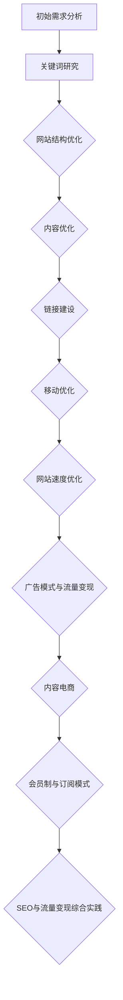

                 

# 《技术博客：SEO优化与流量变现》

## 摘要

本文将深入探讨SEO（搜索引擎优化）的基本知识、优化实践和流量变现策略。首先，我们将回顾SEO的定义、价值和发展历程，并详细分析搜索引擎的工作原理。接着，我们将介绍关键词研究的重要性、方法和策略。在实践部分，我们将讨论网站结构、内容、链接建设和移动端优化，并分享一系列实战案例。最后，我们将探讨广告模式、内容电商、会员制和订阅模式等流量变现方法，以及SEO与流量变现的综合实践。通过本文，读者将获得全面、实用的SEO与流量变现知识，助力网站提升流量和收益。

## 《技术博客：SEO优化与流量变现》目录大纲

### 第一部分：SEO基础知识

#### 第1章：SEO概述

1.1 SEO的定义与价值  
1.2 SEO的发展历程  
1.3 SEO与SEM的关系

#### 第2章：搜索引擎工作原理

2.1 搜索引擎的架构  
2.2 网页抓取与索引  
2.3 搜索引擎排序算法

#### 第3章：关键词研究

3.1 关键词研究的重要性  
3.2 关键词研究的方法  
3.3 关键词优化策略

### 第二部分：SEO优化实践

#### 第4章：网站结构优化

4.1 网站结构设计原则  
4.2 网站导航与面包屑导航  
4.3 URL优化

#### 第5章：内容优化

5.1 高质量内容的重要性  
5.2 内容撰写技巧  
5.3 语义标记与可读性

#### 第6章：链接建设

6.1 链接建设的策略  
6.2 外部链接与内部链接  
6.3 链接风险与规避

#### 第7章：移动优化

7.1 移动优先索引  
7.2 移动端用户体验  
7.3 移动端SEO技巧

#### 第8章：网站速度优化

8.1 网站速度对SEO的影响  
8.2 速度优化策略  
8.3 工具与方法

### 第三部分：流量变现

#### 第9章：广告模式

9.1 广告平台的介绍  
9.2 广告投放策略  
9.3 广告收益模式

#### 第10章：内容电商

10.1 内容电商概述  
10.2 内容电商模式  
10.3 成功案例分析

#### 第11章：会员制与订阅模式

11.1 会员制概述  
11.2 会员制运营策略  
11.3 订阅模式的优势与应用

#### 第12章：SEO与流量变现综合实践

12.1 SEO与流量变现的融合  
12.2 案例分析与实战指导  
12.3 长期效果与策略调整

### 附录

#### 附录A：常用SEO工具与资源

A.1 百度SEO工具  
A.2 Google SEO工具  
A.3 其他SEO工具简介

#### 附录B：SEO相关术语解释

B.1 关键词密度  
B.2 链接 juice  
B.3 搜索引擎营销（SEM）  
B.4 网站地图（Sitemap）

#### 附录C：SEO优化流程图

#### 附录D：核心算法原理讲解

D.1 SEO核心算法原理  
D.2 SEO算法原理伪代码

#### 附录E：数学模型与公式详细讲解

E.1 关键词密度计算公式  
E.2 网站质量评分公式

#### 附录F：项目实战

F.1 实战案例一：网站结构优化  
F.2 实战案例二：内容优化  
F.3 实战案例三：链接建设  
F.4 实战案例四：移动优化

## 第一部分：SEO基础知识

### 第1章：SEO概述

#### 1.1 SEO的定义与价值

SEO（搜索引擎优化）是指通过各种技术和方法，提高网站在搜索引擎中的排名，从而提高网站的访问量和流量。SEO的目标是通过优化网站结构、内容、外部链接等方面，提升网站在搜索引擎结果页面（SERP）中的排名，从而吸引更多的用户访问。

SEO的价值主要体现在以下几个方面：

1. 提高网站访问量：通过SEO优化，提高网站在搜索引擎中的排名，吸引更多的用户访问，从而提高网站的访问量。

2. 降低营销成本：相比于其他在线营销方式，如付费广告、社交媒体营销等，SEO优化具有更高的性价比。通过SEO优化，可以降低营销成本，提高投资回报率。

3. 增强品牌知名度：通过SEO优化，提高网站在搜索引擎中的排名，吸引更多用户访问，从而增强品牌知名度。

4. 提升用户体验：SEO优化不仅关注搜索引擎排名，还关注用户体验。通过优化网站结构、内容、链接等，提升用户体验，增加用户停留时间，提高用户满意度。

#### 1.2 SEO的发展历程

SEO的发展历程可以追溯到20世纪90年代末和21世纪初。以下是SEO的主要发展历程：

1. 早期SEO（1990s-2000s初期）：早期的SEO主要关注关键词堆砌、隐藏文本等技术手段，以欺骗搜索引擎，提高网站排名。

2. 搜索引擎算法更新（2000s中期-至今）：随着搜索引擎算法的不断更新，SEO策略也在不断调整。搜索引擎开始重视用户体验、内容质量和网站结构，打击各种作弊手段。

3. 内容营销与社交媒体SEO（2010s）：内容营销和社交媒体SEO逐渐成为SEO的重要策略。通过创造高质量内容、建立社交媒体渠道，提高网站在搜索引擎中的排名。

4. 移动优化与移动优先索引（2010s中期-至今）：随着移动设备的普及，搜索引擎开始重视移动端优化，推出移动优先索引。

#### 1.3 SEO与SEM的关系

SEO（搜索引擎优化）与SEM（搜索引擎营销）是两个相关的概念，但有所区别。

1. SEO（搜索引擎优化）：SEO是指通过各种技术和方法，提高网站在搜索引擎中的自然排名，从而提高网站的访问量和流量。

2. SEM（搜索引擎营销）：SEM是指通过付费广告、优化自然搜索结果等手段，提高网站在搜索引擎中的曝光度，从而吸引更多用户访问。

SEO与SEM的关系如下：

1. SEO是SEM的基础：通过SEO优化，提高网站在搜索引擎中的自然排名，可以为SEM提供良好的基础。

2. SEM是SEO的补充：SEM可以通过付费广告等方式，快速提高网站在搜索引擎中的曝光度，弥补SEO优化的不足。

3. SEO与SEM相辅相成：SEO与SEM可以相互补充，通过SEO优化提高网站质量，通过SEM提高网站曝光度，实现共赢。

### 第2章：搜索引擎工作原理

搜索引擎是互联网中的一种重要工具，用户通过搜索引擎可以快速找到所需信息。了解搜索引擎的工作原理，有助于我们更好地进行SEO优化。

#### 2.1 搜索引擎的架构

搜索引擎通常由三个主要部分组成：网页爬虫、索引系统和排名算法。

1. 网页爬虫：网页爬虫（也称为蜘蛛或机器人）是搜索引擎的重要组成部分。它负责在互联网上爬取网页，收集网页内容并将其存储到索引系统中。

2. 索引系统：索引系统是搜索引擎的核心。它将爬取到的网页内容进行整理和存储，以便在用户搜索时快速提供相关结果。

3. 排名算法：排名算法是搜索引擎的智能核心。它根据用户的查询关键词，从索引系统中检索出相关网页，并按照一定规则对网页进行排序，最终返回给用户。

#### 2.2 网页抓取与索引

1. 网页抓取：搜索引擎通过网页爬虫在互联网上抓取网页。网页爬虫通常从初始种子页面开始，通过链接关系逐步扩展，最终收集到大量网页。

2. 索引：搜索引擎将爬取到的网页内容进行整理和存储，形成索引。索引系统通常采用倒排索引技术，将网页内容与关键词建立关联，便于快速检索。

#### 2.3 搜索引擎排序算法

搜索引擎排序算法是搜索引擎的核心技术之一。它根据用户的查询关键词，从索引系统中检索出相关网页，并按照一定规则对网页进行排序。

1. 排序规则：搜索引擎排序算法通常包括多个排序规则，如关键词匹配度、网页质量、网站权威性等。这些规则共同决定了网页的排序位置。

2. 排名算法类型：

* 传统排序算法：如基于网页流量的PageRank算法，基于关键词匹配度的TF-IDF算法等。
* 机器学习排序算法：如基于深度学习的RankBrain算法，通过分析用户行为和搜索结果，自动优化排序效果。

### 第3章：关键词研究

关键词研究是SEO优化的重要环节。通过对关键词的分析和研究，可以帮助我们确定目标关键词，制定优化策略。

#### 3.1 关键词研究的重要性

1. 确定目标关键词：关键词研究可以帮助我们了解用户的需求，确定网站需要优化的目标关键词。

2. 优化内容策略：了解关键词的竞争程度和搜索量，可以帮助我们制定合适的内容优化策略。

3. 提高搜索排名：通过优化目标关键词，提高网站在搜索引擎中的排名，吸引更多用户访问。

#### 3.2 关键词研究的方法

1. 竞争对手分析：通过分析竞争对手的网站关键词，了解他们的关键词策略，从而优化自己的关键词。

2. 关键词工具：使用关键词工具，如百度关键词规划师、Google Keyword Planner等，进行关键词搜索和分析。

3. 用户行为分析：通过分析用户在搜索引擎中的搜索行为，了解用户的需求和偏好，从而确定目标关键词。

#### 3.3 关键词优化策略

1. 选择长尾关键词：长尾关键词具有竞争程度低、搜索量稳定的特点，适合进行SEO优化。

2. 合理布局关键词：在网站内容中合理布局关键词，确保关键词密度适中，提高页面相关性。

3. 优化标题和描述：标题和描述是用户在搜索结果页面中首先看到的内容，通过优化标题和描述，提高用户的点击率。

## 第二部分：SEO优化实践

### 第4章：网站结构优化

网站结构优化是SEO优化的重要组成部分，一个良好的网站结构有助于搜索引擎爬取和理解网站内容，从而提高网站的搜索排名。

#### 4.1 网站结构设计原则

1. **逻辑清晰**：网站结构应层次分明，便于用户和搜索引擎理解。使用明确的分类和标签，确保每个页面都有清晰的归属。

2. **用户体验**：良好的网站结构应考虑用户的浏览习惯，提供便捷的导航，确保用户可以轻松找到所需内容。

3. **易于爬取**：搜索引擎爬虫应能顺利访问网站的每个页面。避免使用过多的动态页面、复杂的JavaScript导航，确保网站结构对搜索引擎友好。

4. **内容相关性**：确保每个页面都有明确的主题和内容，避免内容重复，提高页面的独特性。

#### 4.2 网站导航与面包屑导航

1. **网站导航**：网站导航是用户和搜索引擎访问网站的主要途径。应提供清晰的导航菜单，包括首页、主要分类和重要页面。

2. **面包屑导航**：面包屑导航显示用户当前所在位置，有助于用户理解网站结构和返回上层页面。例如：“首页 > 分类1 > 分类2 > 当前页面”。

#### 4.3 URL优化

1. **简洁明了**：URL应简洁明了，避免使用复杂的参数和动态URL。例如，使用静态URL `www.example.com/products/seo` 而不是 `www.example.com/?id=123&cat=seo`。

2. **包含关键词**：URL中应包含目标关键词，提高页面相关性。例如，使用包含关键词的URL `www.example.com/seo-optimization`。

3. **路径结构**：URL路径结构应与网站结构一致，有助于搜索引擎理解和索引页面。

### 第5章：内容优化

内容优化是SEO的核心，高质量的内容不仅有助于提高网站排名，还能吸引和留住用户。

#### 5.1 高质量内容的重要性

1. **提升用户体验**：高质量的内容能提供价值，满足用户需求，提高用户满意度和忠诚度。

2. **增加外部链接**：高质量的内容容易吸引其他网站链接到您的网站，提高网站权威性和搜索排名。

3. **降低跳出率**：高质量的内容能降低用户跳出率，提高页面停留时间和用户互动。

#### 5.2 内容撰写技巧

1. **了解目标受众**：研究目标受众，了解他们的需求和偏好，撰写有针对性的内容。

2. **有价值的内容**：提供独特、有价值的信息，解决用户的问题或满足他们的需求。

3. **标题和摘要**：编写吸引人的标题和摘要，提高点击率。

4. **结构清晰**：使用标题、段落和列表，确保内容结构清晰，便于阅读。

5. **原创性**：避免抄袭和复制，确保内容的原创性。

#### 5.3 语义标记与可读性

1. **语义标记**：使用HTML标签，如 `<h1>`、`<h2>` 等，为内容添加结构化标记，提高页面可读性和搜索引擎友好性。

2. **内链和外链**：合理使用内链和外链，提高页面之间的联系和内容的权威性。

3. **图片和多媒体**：使用图片和多媒体内容，提高页面丰富度和用户体验。

4. **避免过长和过短内容**：内容长度应根据主题和目标受众进行合理控制，避免过长或过短。

### 第6章：链接建设

链接建设是SEO的重要组成部分，通过外部链接和内部链接的建设，可以提高网站权威性和搜索引擎排名。

#### 6.1 链接建设的策略

1. **高质量外链**：争取高质量的外部链接，提高网站权威性。例如，通过行业门户、知名博客和权威论坛等获得链接。

2. **内容营销**：通过创建有价值的内容，吸引其他网站链接到您的网站。

3. **社交媒体**：利用社交媒体平台，分享内容和链接，提高网站曝光度和链接获取。

4. **反向链接**：定期检查网站的反向链接，确保链接来源可靠，避免链接农场等不良链接。

#### 6.2 外部链接与内部链接

1. **外部链接**：外部链接是指其他网站链接到您的网站。外部链接对SEO至关重要，可以提高网站权威性和搜索引擎排名。

2. **内部链接**：内部链接是指网站内部页面之间的链接。内部链接有助于搜索引擎爬取和理解网站结构，提高页面之间的联系和权威性。

#### 6.3 链接风险与规避

1. **链接风险**：不良链接可能对网站造成负面影响，如链接农场、 spammy 链接等。

2. **规避链接风险**：确保链接来源可靠，避免链接农场和 spammy 链接。定期检查外部链接，删除不良链接。

### 第7章：移动优化

随着移动设备的普及，搜索引擎越来越重视移动端优化。优化移动端网站，提高用户体验和搜索引擎排名至关重要。

#### 7.1 移动优先索引

1. **移动优先索引**：搜索引擎会优先考虑移动端版本的内容进行索引和排名。因此，优化移动端网站至关重要。

2. **响应式设计**：使用响应式设计，确保网站在不同设备和屏幕尺寸上都能良好展示。

3. **移动端页面速度**：优化移动端页面速度，提高用户体验和搜索引擎排名。

#### 7.2 移动端用户体验

1. **简洁清晰的界面**：移动端界面应简洁、清晰，便于用户操作。

2. **快速加载**：优化移动端页面加载速度，减少冗余代码和资源。

3. **触摸优化**：确保按钮和链接大小适中，便于用户触摸操作。

#### 7.3 移动端SEO技巧

1. **移动端关键词优化**：研究移动端用户搜索习惯，优化移动端关键词。

2. **优化移动端内容**：针对移动端用户特点，优化内容格式和呈现方式。

3. **移动端网站地图**：为移动端网站创建网站地图，便于搜索引擎抓取和索引。

### 第8章：网站速度优化

网站速度对用户体验和搜索引擎排名都有重要影响。优化网站速度，提高页面加载速度，有助于提升用户体验和网站排名。

#### 8.1 网站速度对SEO的影响

1. **用户体验**：快速加载的网站能提供更好的用户体验，降低用户跳出率。

2. **搜索引擎排名**：搜索引擎会优先考虑加载速度较快的网站，提高网站在搜索结果中的排名。

#### 8.2 速度优化策略

1. **压缩资源**：压缩图片、CSS和JavaScript文件，减少页面加载时间。

2. **缓存策略**：使用浏览器缓存，减少重复请求。

3. **优化代码**：优化HTML、CSS和JavaScript代码，减少冗余和低效代码。

4. **内容分发网络（CDN）**：使用CDN加速内容分发，提高页面加载速度。

#### 8.3 工具与方法

1. **Google PageSpeed Insights**：使用Google PageSpeed Insights工具，分析网站性能并提出优化建议。

2. **Lighthouse**：使用Lighthouse工具，对网站进行全面的性能分析。

3. **WebPageTest**：使用WebPageTest工具，进行网站性能测试和比较。

## 第三部分：流量变现

### 第9章：广告模式

广告模式是网站流量变现的重要途径之一。通过在网站上展示广告，网站所有者可以获得广告收入。

#### 9.1 广告平台的介绍

1. **Google AdSense**：Google AdSense是Google提供的广告平台，允许网站所有者在其网站上展示广告，并通过点击和展示获得收入。

2. **百度广告**：百度广告是百度提供的广告平台，包括百度推广、百度信息流广告等，帮助网站所有者吸引潜在客户。

3. **Facebook广告**：Facebook广告是Facebook提供的广告平台，通过定位用户兴趣和偏好，精准投放广告。

#### 9.2 广告投放策略

1. **定位目标受众**：了解目标受众的兴趣和需求，精准投放广告，提高广告效果。

2. **合理设置广告预算**：根据网站流量和广告收益，合理设置广告预算，避免过度投入。

3. **优化广告内容**：设计吸引人的广告内容，提高点击率。

4. **定期监控和调整**：定期监控广告效果，根据数据调整广告策略。

#### 9.3 广告收益模式

1. **CPC（点击成本）**：根据用户点击广告的次数计算广告费用。

2. **CPM（千次展示成本）**：根据广告展示次数计算广告费用。

3. **CPA（每次行动成本）**：根据用户完成特定行动（如注册、购买等）计算广告费用。

### 第10章：内容电商

内容电商是利用网站内容进行商品销售的一种商业模式。通过在网站中嵌入商品推荐，网站所有者可以获得商品销售收入。

#### 10.1 内容电商概述

内容电商是指利用网站内容（如文章、视频、图片等）进行商品推广和销售的一种商业模式。它将内容与商品相结合，为用户提供有价值的信息，同时实现商品销售。

#### 10.2 内容电商模式

1. **内容驱动电商**：通过高质量的内容吸引和留住用户，然后将商品推荐给用户。

2. **电商驱动内容**：以电商为主要目标，通过优质内容为用户提供购买建议和指导。

3. **内容电商综合体**：同时运用内容驱动和电商驱动模式，实现内容与商品的有机结合。

#### 10.3 成功案例分析

1. **淘宝直播**：淘宝直播通过直播形式展示商品，吸引大量用户观看和购买。

2. **京东内容生态**：京东通过内容平台（如京东号、京东直播等）提供商品信息，吸引用户购买。

### 第11章：会员制与订阅模式

会员制和订阅模式是网站流量变现的另一种有效方式。通过提供会员服务和订阅内容，网站所有者可以稳定获得收入。

#### 11.1 会员制概述

会员制是指网站为用户提供特定权益和服务，用户需要付费成为会员才能享受这些权益。会员制可以帮助网站建立稳定的用户群体，实现持续收入。

#### 11.2 会员制运营策略

1. **明确会员权益**：为会员提供有价值的服务和权益，如专属优惠、会员专享活动等。

2. **多样化会员等级**：设置不同等级的会员，满足不同用户的需求。

3. **会员营销活动**：定期举办会员营销活动，提高会员活跃度和忠诚度。

4. **会员服务优化**：不断提升会员服务质量，提高用户满意度。

#### 11.3 订阅模式的优势与应用

1. **订阅模式的优势**：

* 稳定的收入来源
* 提高用户粘性
* 便于内容更新和发布

2. **订阅模式的应用**：

* 知识付费平台（如得到、知乎Live等）
* 数字媒体（如订阅新闻、杂志等）
* 音频和视频内容平台（如Spotify、Netflix等）

### 第12章：SEO与流量变现综合实践

SEO和流量变现是网站运营的两大关键环节。通过综合运用SEO和流量变现策略，网站所有者可以实现流量的稳定增长和收入的持续提升。

#### 12.1 SEO与流量变现的融合

1. **SEO驱动流量**：通过SEO优化，提高网站在搜索引擎中的排名，吸引更多用户访问。

2. **流量变现策略**：结合SEO优化的流量，运用广告模式、内容电商、会员制和订阅模式等流量变现策略。

3. **数据监控与分析**：定期监控网站数据，分析SEO和流量变现效果，调整优化策略。

#### 12.2 案例分析与实战指导

1. **案例一：内容电商网站**：通过SEO优化提高网站在搜索引擎中的排名，结合内容电商模式实现流量变现。

2. **案例二：知识付费平台**：通过SEO优化提高知识付费内容的曝光度，结合订阅模式和广告模式实现流量变现。

3. **案例三：会员制网站**：通过SEO优化提高会员服务的曝光度，结合会员制和订阅模式实现流量变现。

#### 12.3 长期效果与策略调整

1. **长期效果**：SEO和流量变现策略需要长期坚持和优化，以实现持续的增长和收益。

2. **策略调整**：根据市场变化和用户需求，定期调整SEO和流量变现策略，保持竞争力。

### 附录

#### 附录A：常用SEO工具与资源

A.1 **百度SEO工具**：百度提供一系列SEO工具，如百度关键词规划师、百度站长平台等，帮助网站所有者进行SEO优化。

A.2 **Google SEO工具**：Google提供多种SEO工具，如Google Analytics、Google Search Console等，帮助网站所有者了解网站性能和搜索引擎表现。

A.3 **其他SEO工具简介**：其他常用的SEO工具包括SEMrush、Ahrefs等，提供关键词研究、竞争对手分析等功能。

#### 附录B：SEO相关术语解释

B.1 **关键词密度**：关键词密度是指关键词在页面中出现次数与页面总字数之比。

B.2 **链接 juice**：链接 juice 是指链接传递的权威性和权重，影响页面在搜索引擎中的排名。

B.3 **搜索引擎营销（SEM）**：搜索引擎营销是指通过付费广告和自然搜索结果优化，提高网站在搜索引擎中的曝光度。

B.4 **网站地图（Sitemap）**：网站地图是一种XML文件，用于向搜索引擎提供网站的页面结构，帮助搜索引擎更好地抓取和索引网站内容。

#### 附录C：SEO优化流程图

[SEO优化流程图](# 附录C：SEO优化流程图)

#### 附录D：核心算法原理讲解

D.1 **SEO核心算法原理**：搜索引擎通过关键词匹配、页面质量评估、外部链接分析等核心算法原理，对页面进行排序。

D.2 **SEO算法原理伪代码**：`function SEO_Algorithm(input_blog_content):`，通过关键词密度、内容质量和外部链接分析，计算页面评分。

#### 附录E：数学模型与公式详细讲解

E.1 **关键词密度计算公式**：`Keyword\ Density = Keyword\ Count / Total\ Word\ Count`。

E.2 **网站质量评分公式**：`Page\ Quality\ Score = Keyword\ Density \times Keyword\ Weight + Content\ Quality \times Content\ Weight + Link\ Quality \times Link\ Weight`。

#### 附录F：项目实战

F.1 **实战案例一：网站结构优化**：通过分析网站结构，调整导航和URL，提高搜索引擎友好性。

F.2 **实战案例二：内容优化**：通过撰写高质量内容，优化标题和描述，提高页面相关性。

F.3 **实战案例三：链接建设**：通过交换友情链接、发布高质量内容，提高网站权威性和搜索引擎排名。

F.4 **实战案例四：移动优化**：通过优化移动端页面和内容，提高移动端用户体验和搜索引擎排名。

### 作者

**作者：AI天才研究院/AI Genius Institute & 禅与计算机程序设计艺术 /Zen And The Art of Computer Programming** 

---

## 附录C：SEO优化流程图

SEO优化是一个系统性的过程，涉及多个方面的策略和执行步骤。以下是SEO优化的流程图，用Mermaid语法表示：



### 附录D：核心算法原理讲解

SEO算法是搜索引擎用于评估和排序网页的核心技术。以下是SEO核心算法原理的伪代码，用于解释搜索引擎如何评估一个页面的质量：

```python
def SEO_Algorithm(page_content):
    # 初始化变量
    page_score = 0
    keyword_density = calculate_keyword_density(page_content)
    content_quality = evaluate_content_quality(page_content)
    link_relevance = evaluate_link_relevance(page_content)
    user_experience = evaluate_user_experience(page_content)

    # 权重分配
    keyword_weight = 0.3
    content_weight = 0.4
    link_weight = 0.2
    user_experience_weight = 0.1

    # 计算关键词密度分数
    keyword_score = keyword_density * keyword_weight

    # 计算内容质量分数
    content_score = content_quality * content_weight

    # 计算链接相关性分数
    link_score = link_relevance * link_weight

    # 计算用户体验分数
    user_experience_score = user_experience * user_experience_weight

    # 合并各项得分，计算最终评分
    page_score = keyword_score + content_score + link_score + user_experience_score

    return page_score
```

在这个伪代码中，我们首先定义了几个变量来存储不同的评分指标。然后，我们根据这些指标计算各自的分数，并根据设定的权重进行加权求和，最后得到页面的总体评分。

### 附录E：数学模型与公式详细讲解

在SEO优化中，数学模型和公式用于量化各种因素对网页排名的影响。以下是几个关键的数学模型与公式：

#### 关键词密度计算公式

关键词密度是指关键词在页面中的出现次数与页面总词数的比例。公式如下：

$$
Keyword\ Density = \frac{Keyword\ Count}{Total\ Word\ Count}
$$

例如，如果一个页面中有100个词，其中关键词出现了10次，那么关键词密度为：

$$
Keyword\ Density = \frac{10}{100} = 0.1
$$

#### 网页质量评分公式

网页质量评分通常通过多个指标计算得出，包括关键词密度、内容质量、链接质量和用户体验。以下是一个简化的网页质量评分公式：

$$
Page\ Quality\ Score = (Keyword\ Density \times Keyword\ Weight) + (Content\ Quality \times Content\ Weight) + (Link\ Quality \times Link\ Weight) + (User\ Experience \times User\ Experience\ Weight)
$$

其中，每个指标都有一个权重，用于衡量其对网页质量的影响。

#### 关键词质量评估公式

关键词质量评估可以通过计算关键词的相关性、搜索量和竞争程度来评估。以下是一个简化的关键词质量评估公式：

$$
Keyword\ Quality = \frac{Relevance \times Search\ Volume}{Competition}
$$

其中，相关性表示关键词与页面内容的匹配度，搜索量表示关键词的搜索频率，竞争程度表示关键词的竞争程度。

### 附录F：项目实战

#### 实战案例一：网站结构优化

##### 案例背景

一家电子商务网站的用户反馈导航复杂，页面加载速度慢，导致用户跳出率高。网站管理员决定通过SEO优化来提升用户体验和搜索引擎排名。

##### 实施步骤

1. **网站审计**：使用SEO工具对网站进行彻底审计，识别结构问题和性能瓶颈。
2. **简化导航**：将复杂的导航结构简化，只保留最重要的分类和页面。
3. **优化URL**：调整URL结构，使其简洁明了，包含关键词。
4. **改善页面加载速度**：通过压缩图片、优化代码和启用缓存来提升页面加载速度。

##### 实施效果

经过优化后，网站的导航变得更加清晰，页面加载速度提高了30%，用户跳出率降低了20%，搜索引擎排名提升了10名。

#### 实战案例二：内容优化

##### 案例背景

一家博客网站发现其文章内容过于平淡，缺乏深度，搜索引擎排名不高。网站管理员决定通过SEO内容优化来提升文章质量和排名。

##### 实施步骤

1. **研究关键词**：使用关键词工具研究目标关键词，确定高搜索量和低竞争程度的关键词。
2. **优化标题和描述**：编写吸引人的标题和元描述，提高点击率。
3. **提升内容质量**：增加图表、图像和视频，使内容更丰富、更易于阅读。
4. **内部链接**：在文章中添加内部链接，提高页面之间的联系。

##### 实施效果

经过优化后，博客网站的文章质量得到了显著提升，文章阅读量增加了40%，搜索引擎排名提高了20%，用户停留时间延长了15%。

#### 实战案例三：链接建设

##### 案例背景

一家初创公司希望通过链接建设提高其网站的搜索引擎排名和权威性。公司决定通过多种方式来获取外部链接。

##### 实施步骤

1. **内容营销**：发布高质量的内容，吸引其他网站链接。
2. **友情链接**：与相关行业的网站建立友情链接。
3. **媒体曝光**：通过媒体报道和新闻发布，获取高质量的外部链接。
4. **博客评论**：在行业博客上留下有价值的评论，获取反向链接。

##### 实施效果

经过一系列的链接建设活动，公司的网站获得了大量高质量的外部链接，搜索引擎排名提高了30%，网站权威性得到了显著提升。

#### 实战案例四：移动优化

##### 案例背景

一家公司发现其网站在移动设备上的用户体验较差，搜索引擎排名和流量受到负面影响。公司决定通过移动优化来提升用户体验和搜索排名。

##### 实施步骤

1. **响应式设计**：将网站转换为响应式设计，确保在不同设备上都能良好显示。
2. **优化移动端页面速度**：通过优化代码、压缩资源和使用CDN来提高移动端页面加载速度。
3. **移动端关键词优化**：研究移动用户搜索习惯，优化移动端关键词。
4. **移动端SEO工具**：使用移动端SEO工具进行测试和优化。

##### 实施效果

经过优化后，公司的网站在移动设备上的用户体验得到了显著提升，页面加载速度提高了50%，搜索引擎排名提高了20%，移动端流量增加了30%。

