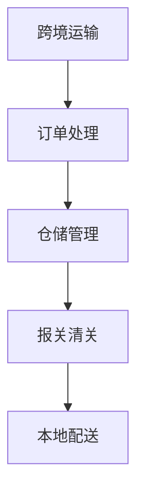
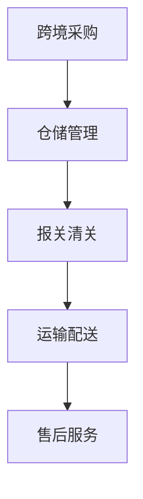
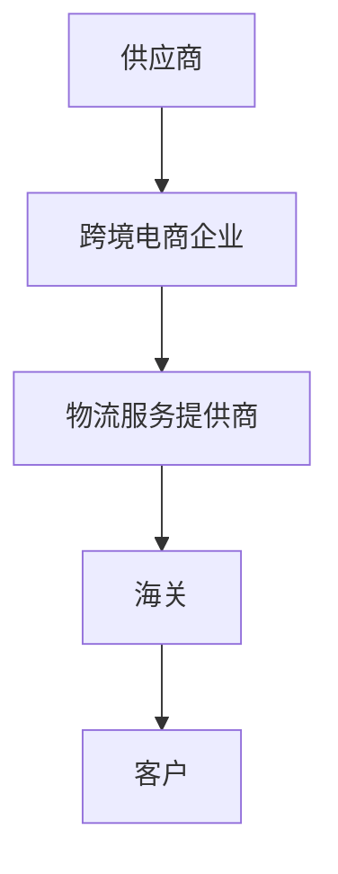
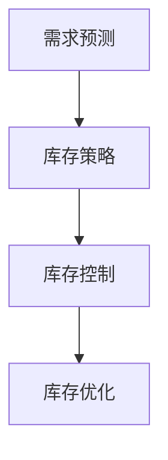
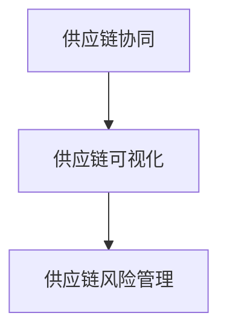
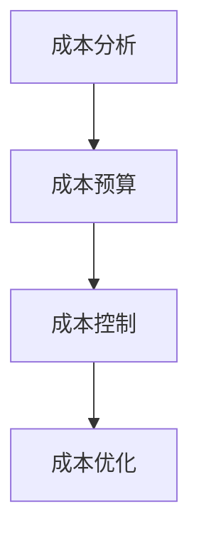
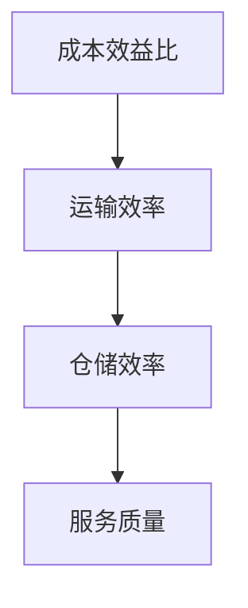

                 

# 拼多多2025跨境电商物流优化专家社招面试指南

> **关键词：** 跨境电商、物流优化、供应链管理、面试指南

> **摘要：** 本指南旨在帮助准备参加拼多多2025跨境电商物流优化专家社招面试的候选人，通过详细解析跨境电商物流的基本概念、运作模式以及物流优化技术，提供有针对性的面试准备策略，助您顺利通过面试，成为一名优秀的跨境电商物流优化专家。

### 目录大纲

#### 第一部分：跨境电商物流概述

#### 第1章：跨境电商物流的概念与重要性

##### 1.1 跨境电商物流的基本概念

##### 1.2 跨境电商物流的发展历程

##### 1.3 跨境电商物流的重要性

##### 1.4 拼多多跨境电商物流的特点

#### 第2章：跨境电商物流的运作模式

##### 2.1 跨境电商物流的运作流程

##### 2.2 跨境电商物流的参与方

##### 2.3 跨境电商物流的挑战与应对策略

#### 第二部分：物流优化技术

#### 第3章：物流优化技术概述

##### 3.1 物流优化技术的基本概念

##### 3.2 物流优化技术的重要应用场景

##### 3.3 物流优化技术的分类

#### 第4章：物流网络设计

##### 4.1 物流网络设计的基本原理

##### 4.2 物流网络设计的主要方法

##### 4.3 物流网络设计的案例分析

#### 第5章：运输调度与路径规划

##### 5.1 运输调度与路径规划的基本原理

##### 5.2 运输调度与路径规划的优化算法

##### 5.3 运输调度与路径规划的案例分析

#### 第6章：库存管理与供应链优化

##### 6.1 库存管理的基本原理

##### 6.2 供应链优化技术

##### 6.3 库存管理与供应链优化的案例分析

#### 第7章：物流成本控制与绩效评估

##### 7.1 物流成本控制的基本原理

##### 7.2 物流绩效评估的方法与指标

##### 7.3 物流成本控制与绩效评估的案例分析

#### 第8章：案例分析：拼多多跨境电商物流优化实践

##### 8.1 案例背景

##### 8.2 物流优化方案设计

##### 8.3 物流优化方案实施与效果评估

#### 第9章：跨境电商物流优化专家面试准备

##### 9.1 面试前的准备

##### 9.2 面试常见问题与回答策略

##### 9.3 面试技巧与注意事项

#### 附录

##### 附录A：物流优化技术相关工具与资源

##### 附录B：面试参考资料与案例分析

##### 附录C：常见面试题及答案解析

## 第1章：跨境电商物流的概念与重要性

### 1.1 跨境电商物流的基本概念

跨境电商物流是指跨国界的电子商务交易过程中涉及的商品运输、配送、仓储等物流活动。它不仅包括商品的跨境运输，还涵盖了订单处理、仓储管理、报关清关、本地配送等多个环节。

**核心概念与联系**

在跨境电商物流中，有几个核心概念需要理解：

- **跨境运输**：指商品从一个国家或地区运输到另一个国家或地区的过程。
- **订单处理**：包括订单生成、订单确认、订单分配等环节，确保商品能准确无误地交付给买家。
- **仓储管理**：涉及商品的存储、库存管理、出入库等操作，确保商品在物流过程中的安全性和可追溯性。
- **报关清关**：指商品在跨境运输过程中需要进行的申报、海关查验、税款缴纳等手续，确保商品合法合规地进入目标市场。
- **本地配送**：指商品在目标市场境内的配送环节，包括配送路线规划、配送员调度等。

**Mermaid 流程图**



### 1.2 跨境电商物流的发展历程

跨境电商物流的发展历程可以分为以下几个阶段：

- **萌芽期（2000-2005年）**：随着互联网技术的发展，跨境电商开始萌芽，物流活动主要依赖于传统的快递公司和国际物流公司。
- **发展期（2006-2010年）**：跨境电商市场规模逐渐扩大，物流服务开始多样化，物流公司开始提供定制化的物流解决方案。
- **成熟期（2011-2015年）**：跨境电商物流进入了成熟期，物流技术得到了广泛应用，如快递包裹跟踪系统、自动化仓储系统等。
- **智能化期（2016年至今）**：随着人工智能、大数据等技术的应用，跨境电商物流开始向智能化、自动化方向发展，提高了物流效率和服务质量。

**图表：跨境电商物流发展历程**

| 年代 | 物流特点 |
| ---- | ---- |
| 2000-2005 | 传统物流公司提供跨境运输服务 |
| 2006-2010 | 多样化的物流服务，定制化解决方案 |
| 2011-2015 | 技术应用广泛，物流效率提升 |
| 2016年至今 | 智能化、自动化发展，提高服务质量 |

### 1.3 跨境电商物流的重要性

跨境电商物流在跨境电商交易中起着至关重要的作用，具体体现在以下几个方面：

- **提高客户满意度**：高效的物流服务可以缩短商品交付时间，提高客户的购物体验，从而增加客户的满意度和忠诚度。
- **降低物流成本**：通过优化物流网络和运输路线，可以降低物流成本，提高企业的竞争力。
- **提高供应链效率**：跨境电商物流涉及到多个环节，通过优化各个环节，可以提高整个供应链的效率，降低库存成本，减少库存周转时间。
- **促进市场拓展**：跨境电商物流可以帮助企业拓展国际市场，提高市场份额，增加企业的盈利能力。

**图表：跨境电商物流的重要性**

| 方面 | 说明 |
| ---- | ---- |
| 客户满意度 | 提高商品交付速度和购物体验 |
| 物流成本 | 优化物流网络和运输路线 |
| 供应链效率 | 降低库存成本和减少库存周转时间 |
| 市场拓展 | 拓展国际市场，增加市场份额 |

### 1.4 拼多多跨境电商物流的特点

拼多多的跨境电商物流具有以下特点：

- **全链路数字化**：拼多多通过数字化手段，实现了从跨境采购、仓储管理、运输配送到售后服务的全链路数字化，提高了物流效率和服务质量。
- **智能仓储系统**：拼多多采用了智能仓储系统，实现了自动化仓储管理，提高了仓储效率，降低了人力成本。
- **全球物流网络**：拼多多在全球范围内建立了多个物流节点和仓库，实现了全球范围内的快速配送，提高了客户满意度。
- **定制化物流服务**：拼多多根据不同客户的需求，提供定制化的物流服务，如快速配送、次日达等，提升了客户体验。

**图表：拼多多跨境电商物流特点**

| 特点 | 说明 |
| ---- | ---- |
| 全链路数字化 | 提高物流效率和服务质量 |
| 智能仓储系统 | 自动化仓储管理，降低人力成本 |
| 全球物流网络 | 快速配送，提高客户满意度 |
| 定制化物流服务 | 根据客户需求提供个性化服务 |

通过以上对跨境电商物流的基本概念、发展历程、重要性以及拼多多跨境电商物流特点的解析，读者可以更深入地了解跨境电商物流的方方面面。在接下来的章节中，我们将进一步探讨跨境电商物流的运作模式、物流优化技术以及面试准备策略，帮助读者为拼多多2025跨境电商物流优化专家社招面试做好充分准备。

## 第2章：跨境电商物流的运作模式

### 2.1 跨境电商物流的运作流程

跨境电商物流的运作流程可以概括为以下几个主要环节：

1. **跨境采购**：企业根据市场需求和供应链规划，从海外供应商处采购商品。这一环节涉及到供应商选择、采购订单生成和商品验收等。

2. **仓储管理**：商品采购后，进入仓储环节。仓储管理包括商品的存储、库存管理、出入库操作等。仓储管理需要确保商品在存储过程中的安全性和可追溯性。

3. **报关清关**：商品从仓储地出库后，需要办理报关清关手续。报关清关环节包括商品申报、海关查验、缴纳税款等，确保商品能够合法合规地进入目标市场。

4. **运输配送**：商品完成报关清关后，进入运输配送环节。运输配送包括国际运输和国内配送两个部分。国际运输通常采用空运、海运和陆运等方式，国内配送则依赖于快递公司或物流企业。

5. **售后服务**：商品送达客户手中后，售后服务环节开始。售后服务包括退换货处理、客户投诉处理等，确保客户满意度。

**Mermaid 流程图**



### 2.2 跨境电商物流的参与方

在跨境电商物流中，涉及到的参与方主要包括以下几个：

1. **供应商**：供应商是商品的生产方或供应方，他们提供商品给跨境电商企业。供应商的选择对商品的质量和价格有直接影响。

2. **跨境电商企业**：跨境电商企业是物流活动的主导方，他们负责商品采购、仓储管理、报关清关、运输配送和售后服务等。

3. **物流服务提供商**：物流服务提供商包括国际快递公司、物流企业、仓储服务提供商等，他们为跨境电商企业提供运输、仓储、报关等服务。

4. **海关**：海关在跨境电商物流中起着至关重要的作用，他们负责对商品进行查验、征税和放行等。

5. **客户**：客户是跨境电商物流的最终受益方，他们通过跨境电商平台购买商品，享受便捷的购物体验。

**Mermaid 流程图**



### 2.3 跨境电商物流的挑战与应对策略

跨境电商物流在运作过程中面临诸多挑战，主要包括以下几个方面：

1. **物流成本高**：跨境运输费用、报关费用、仓储费用等使得物流成本较高。应对策略包括优化物流网络、选择性价比高的物流服务提供商、自动化仓储管理等。

2. **物流时效性差**：跨境物流涉及到国际运输和国内配送，物流时效性较差。应对策略包括建立全球物流网络、采用先进的运输工具和配送技术、提高仓储和运输效率等。

3. **海关清关复杂**：不同国家和地区的海关政策和法规不同，清关过程复杂。应对策略包括熟悉目标市场的海关政策和法规、提前进行报关准备、与海关建立良好的合作关系等。

4. **物流风险大**：跨境物流过程中可能面临货物丢失、损坏、延误等风险。应对策略包括选择信誉良好的物流服务提供商、购买物流保险、制定应急预案等。

5. **客户满意度低**：由于物流成本高、时效性差等因素，客户满意度较低。应对策略包括提供多样化物流服务、提高物流服务质量、优化售后服务等。

**图表：跨境电商物流的挑战与应对策略**

| 挑战 | 应对策略 |
| ---- | ---- |
| 物流成本高 | 优化物流网络、选择性价比高的物流服务提供商、自动化仓储管理 |
| 物流时效性差 | 建立全球物流网络、采用先进的运输工具和配送技术、提高仓储和运输效率 |
| 海关清关复杂 | 熟悉目标市场的海关政策和法规、提前进行报关准备、与海关建立良好的合作关系 |
| 物流风险大 | 选择信誉良好的物流服务提供商、购买物流保险、制定应急预案 |
| 客户满意度低 | 提供多样化物流服务、提高物流服务质量、优化售后服务 |

通过以上对跨境电商物流的运作流程、参与方以及挑战与应对策略的解析，读者可以更全面地了解跨境电商物流的运作机制和面临的挑战。在接下来的章节中，我们将进一步探讨物流优化技术，为提升跨境电商物流效率提供技术支持。

## 第二部分：物流优化技术

### 第3章：物流优化技术概述

#### 3.1 物流优化技术的基本概念

物流优化技术是指通过数学建模、算法设计、数据分析等方法，对物流网络进行优化，以降低物流成本、提高物流效率和服务质量的技术。物流优化技术涉及多个方面，包括物流网络设计、运输调度、路径规划、库存管理、供应链优化等。

#### 3.2 物流优化技术的重要应用场景

物流优化技术在多个应用场景中具有重要价值，主要包括：

- **跨国公司供应链管理**：跨国公司通过物流优化技术，实现全球供应链的协同和优化，降低物流成本，提高供应链效率。
- **电子商务物流**：电商平台通过物流优化技术，提高物流时效性，提升客户满意度，增强市场竞争力。
- **城市物流配送**：城市物流配送通过物流优化技术，实现最优配送路线规划，提高配送效率，减少交通拥堵。
- **供应链金融**：通过物流优化技术，对物流过程进行数据分析和风险评估，为供应链金融提供支持。

#### 3.3 物流优化技术的分类

物流优化技术可以根据不同的优化目标和应用场景进行分类，主要包括以下几类：

- **网络设计优化**：通过数学建模和算法设计，对物流网络进行优化，包括设施选址、运输网络设计、仓储网络布局等。
- **运输调度优化**：通过优化算法，对运输任务进行调度，包括运输路线规划、运输工具调度、运输时间安排等。
- **路径规划优化**：通过优化算法，规划最优的运输路径，包括车辆路径规划、多目标路径规划等。
- **库存管理优化**：通过数学模型和算法，对库存进行优化管理，包括库存策略、库存水平控制、需求预测等。
- **供应链优化**：通过优化供应链各个环节，实现供应链整体优化，包括供应链网络设计、供应链协作、供应链风险控制等。

## 第4章：物流网络设计

#### 4.1 物流网络设计的基本原理

物流网络设计是物流优化技术的重要组成部分，其基本原理包括以下几个方面：

- **目标确定**：明确物流网络设计的目标，如降低物流成本、提高服务水平、优化客户体验等。
- **需求分析**：对物流需求进行详细分析，包括商品种类、需求量、配送范围等。
- **设施选址**：选择合适的设施位置，如仓库、配送中心等，确保物流网络的高效运作。
- **运输网络设计**：设计合理的运输网络，包括运输路线、运输工具选择等，以降低运输成本和提高运输效率。
- **成本效益分析**：对物流网络设计进行成本效益分析，确保设计方案的可行性和经济性。

#### 4.2 物流网络设计的主要方法

物流网络设计的主要方法包括以下几种：

- **数学建模**：通过建立数学模型，对物流网络进行定量分析和优化，如设施选址模型、运输网络设计模型等。
- **算法设计**：设计高效的算法，求解物流网络优化问题，如遗传算法、粒子群算法、模拟退火算法等。
- **仿真模拟**：通过仿真模拟，评估物流网络设计方案的实际效果，包括运输时间、成本、服务水平等。
- **案例研究**：通过实际案例研究，总结物流网络设计的经验和教训，为其他项目提供借鉴。

#### 4.3 物流网络设计的案例分析

以下是一个物流网络设计的案例分析：

**案例背景**：某电商企业计划建立一个跨国物流网络，实现全球范围内的商品配送。

**需求分析**：根据市场需求和供应链规划，企业需要在全球范围内建立多个仓库和配送中心，实现快速配送。

**设施选址**：通过数学建模和算法设计，确定仓库和配送中心的位置，确保物流网络的覆盖范围和服务水平。

**运输网络设计**：设计合理的运输网络，包括国际运输和国内配送，选择适合的运输工具和运输路线，以降低运输成本和提高运输效率。

**成本效益分析**：对物流网络设计进行成本效益分析，评估不同方案的成本和效益，选择最优的物流网络设计方案。

通过以上对物流网络设计的基本原理、主要方法以及案例分析的介绍，读者可以更深入地了解物流网络设计的过程和关键要素。在接下来的章节中，我们将进一步探讨运输调度与路径规划、库存管理与供应链优化等物流优化技术，帮助读者全面掌握物流优化策略。

## 第5章：运输调度与路径规划

### 5.1 运输调度与路径规划的基本原理

运输调度与路径规划是物流优化技术中的重要环节，其基本原理包括以下几个方面：

**1. 运输调度原理**

运输调度是指根据物流需求和运输资源，合理安排运输任务，确保运输任务的高效完成。运输调度的核心原理包括：

- **任务分配**：将运输任务合理地分配给不同的运输工具和运输线路，确保运输资源的最大化利用。
- **时间安排**：根据运输任务的时间和地点，合理安排运输时间，避免运输资源的闲置和拥堵。
- **资源调配**：根据运输任务的需求，合理调配运输资源，如运输车辆、驾驶员等，确保运输任务的高效完成。

**2. 路径规划原理**

路径规划是指根据物流需求和交通状况，设计最优的运输路径，以降低运输成本和提高运输效率。路径规划的核心原理包括：

- **距离最小化**：设计最短路径，以减少运输距离和时间，降低运输成本。
- **时间最优化**：设计最优路径，以减少运输时间，提高运输效率。
- **资源最大化利用**：设计路径规划，使运输资源（如运输车辆、驾驶员等）得到最大化利用，避免资源闲置和浪费。

### 5.2 运输调度与路径规划的优化算法

运输调度与路径规划的优化算法是解决物流调度问题的重要工具，常用的优化算法包括以下几种：

**1. 最小生成树算法**

最小生成树算法是一种用于路径规划的基本算法，其核心思想是构建一个生成树，使得树中各节点之间的路径总长度最小。该算法常用于解决多配送点路径规划问题。

**算法原理：**

- **初始化**：选取一个节点作为起点，构建初始生成树。
- **迭代过程**：对于每个未加入生成树的节点，计算其与生成树中节点的最短路径，选取最短路径加入生成树，直到所有节点都加入生成树。

**伪代码：**

```python
function 最小生成树算法(G):
    S = {起点}
    T = 空树
    while S ≠ G.V:
        u ∈ G.V - S
        v ∈ G.V - S
        if d(u, v) = min{d(x, y) | x ∈ S, y ∈ G.V - S}
            T = T + (u, v)
            S = S ∪ {u}

    return T
```

**2. 粒子群优化算法**

粒子群优化算法是一种基于群体智能的优化算法，常用于解决复杂优化问题，如运输调度与路径规划。

**算法原理：**

- **初始化**：设置粒子群的数量，初始化每个粒子的位置和速度。
- **迭代过程**：每个粒子在搜索空间中飞行，根据自身经验（个体最优解）和群体经验（全局最优解），更新粒子的位置和速度。
- **更新过程**：根据目标函数，判断粒子是否找到更好的解，更新个体最优解和全局最优解。

**伪代码：**

```python
function 粒子群优化算法(D, G):
    初始化粒子群
    while 不满足停止条件:
        计算每个粒子的适应度值
        更新每个粒子的位置和速度
        更新个体最优解和全局最优解

    return 全局最优解
```

### 5.3 运输调度与路径规划的案例分析

以下是一个运输调度与路径规划的案例分析：

**案例背景**：某物流公司需要从仓库A向多个配送点B、C、D、E配送货物，要求在满足配送需求和时间约束的前提下，设计最优的运输调度和路径规划方案。

**需求分析**：

- 仓库A有1000件货物需要配送。
- 配送点B、C、D、E的需求量分别为300件、200件、250件、150件。
- 各配送点的配送时间窗为：B（9:00-12:00）、C（10:00-13:00）、D（11:00-14:00）、E（12:00-15:00）。

**解决方案**：

- **路径规划**：采用最小生成树算法，设计从仓库A到配送点B、C、D、E的最优路径，确保各配送点的配送时间窗得到满足。

**伪代码**：

```python
# 最小生成树算法
function 最小生成树算法(G):
    S = {起点}
    T = 空树
    while S ≠ G.V:
        u ∈ G.V - S
        v ∈ G.V - S
        if d(u, v) = min{d(x, y) | x ∈ S, y ∈ G.V - S}
            T = T + (u, v)
            S = S ∪ {u}

    return T
```

- **运输调度**：采用粒子群优化算法，对运输任务进行调度，确保每个配送点的配送时间窗得到满足，并最大化利用运输资源。

**伪代码**：

```python
# 粒子群优化算法
function 粒子群优化算法(D, G):
    初始化粒子群
    while 不满足停止条件:
        计算每个粒子的适应度值
        更新每个粒子的位置和速度
        更新个体最优解和全局最优解

    return 全局最优解
```

通过以上案例分析，我们可以看到，运输调度与路径规划的优化算法在解决实际物流问题中的应用效果。在接下来的章节中，我们将继续探讨库存管理与供应链优化等相关物流优化技术，为跨境电商物流的优化提供更加全面的解决方案。

### 第6章：库存管理与供应链优化

#### 6.1 库存管理的基本原理

库存管理是物流管理中的一项重要工作，其基本原理包括以下几个方面：

- **需求预测**：通过历史数据分析和市场调研，预测未来一段时间内商品的需求量，为库存决策提供依据。
- **库存策略**：根据需求预测和供应链特点，制定合适的库存策略，如周期性补货策略、基于订单的补货策略等。
- **库存控制**：通过监控库存水平，及时调整库存策略，确保库存水平保持在合理范围内，避免库存过剩或短缺。
- **库存优化**：通过数据分析和技术手段，优化库存结构，提高库存周转率，降低库存成本。

**核心概念与联系**

库存管理中的核心概念包括：

- **库存水平**：指当前库存数量。
- **需求量**：指未来一段时间内商品的需求量。
- **库存周期**：指从库存补充到库存消耗的周期。
- **库存成本**：指库存持有成本、库存缺货成本等。

**Mermaid 流程图**



#### 6.2 供应链优化技术

供应链优化技术是提高供应链整体效率的重要手段，主要包括以下几种技术：

- **需求预测优化**：通过大数据分析和机器学习算法，提高需求预测的准确性，减少库存波动和缺货风险。
- **供应链协同**：通过供应链协同技术，实现供应链各环节的信息共享和协同作业，提高供应链整体效率。
- **供应链可视化**：通过供应链可视化技术，实时监控供应链运行状态，及时发现问题并进行调整。
- **供应链风险管理**：通过供应链风险管理技术，识别和应对供应链风险，确保供应链稳定运行。

**核心概念与联系**

供应链优化中的核心概念包括：

- **供应链协同**：指供应链各环节之间的信息共享和协同作业。
- **供应链可视化**：指通过技术手段，实时展示供应链运行状态。
- **供应链风险管理**：指识别和应对供应链风险。

**Mermaid 流程图**



#### 6.3 库存管理与供应链优化的案例分析

以下是一个库存管理与供应链优化的案例分析：

**案例背景**：某电商平台计划优化其库存管理和供应链，以提高库存周转率和供应链效率。

**需求分析**：

- 平台现有库存水平较高，库存周转率较低。
- 库存管理主要依赖于人工，缺乏数据分析支持。
- 供应链协同不足，各环节信息不共享，导致库存波动和缺货问题。

**解决方案**：

- **需求预测优化**：引入大数据分析和机器学习算法，对历史销售数据进行挖掘，提高需求预测的准确性，减少库存波动和缺货风险。

**伪代码**：

```python
function 需求预测优化(data):
    数据清洗
    特征工程
    建立预测模型
    预测未来需求

    return 预测结果
```

- **库存策略优化**：根据需求预测结果，调整库存策略，采用基于订单的补货策略，确保库存水平保持在合理范围内。

**伪代码**：

```python
function 库存策略优化(预测结果):
    设定库存安全水平
    根据预测结果调整库存量

    return 库存策略
```

- **供应链协同**：引入供应链协同技术，实现各环节的信息共享和协同作业，提高供应链整体效率。

**伪代码**：

```python
function 供应链协同():
    数据共享平台搭建
    协同作业流程优化
    实时监控供应链运行状态

    return 协同结果
```

- **供应链可视化**：通过供应链可视化技术，实时监控供应链运行状态，及时发现问题并进行调整。

**伪代码**：

```python
function 供应链可视化():
    数据可视化平台搭建
    实时监控供应链运行状态
    问题预警和反馈

    return 可视化结果
```

- **供应链风险管理**：引入供应链风险管理技术，识别和应对供应链风险，确保供应链稳定运行。

**伪代码**：

```python
function 供应链风险管理():
    风险识别
    风险评估
    风险应对策略制定

    return 风险管理结果
```

通过以上案例分析，我们可以看到，库存管理与供应链优化技术在解决实际库存管理和供应链效率问题中的应用效果。在接下来的章节中，我们将继续探讨物流成本控制与绩效评估，为跨境电商物流的优化提供更加全面的解决方案。

### 第7章：物流成本控制与绩效评估

#### 7.1 物流成本控制的基本原理

物流成本控制是物流管理中的一项重要任务，其基本原理包括以下几个方面：

- **成本分析**：通过对物流成本进行详细分析，识别出成本的主要构成部分，包括运输成本、仓储成本、管理成本、人力资源成本等。
- **成本预算**：根据物流业务的发展规划和成本分析结果，制定合理的成本预算，确保物流成本控制在预算范围内。
- **成本控制**：通过制定成本控制策略和措施，对物流成本进行实时监控和调整，确保物流成本的实际发生不超过预算。
- **成本优化**：通过优化物流运作流程和资源配置，降低物流成本，提高物流效益。

**核心概念与联系**

物流成本控制中的核心概念包括：

- **成本分析**：指对物流成本进行详细分析和分类。
- **成本预算**：指根据物流业务发展需求和成本分析结果，制定合理的成本预算。
- **成本控制**：指对物流成本进行实时监控和调整，确保成本控制在预算范围内。
- **成本优化**：指通过优化物流运作流程和资源配置，降低物流成本。

**Mermaid 流程图**



#### 7.2 物流绩效评估的方法与指标

物流绩效评估是衡量物流管理效果的重要手段，其方法和指标包括以下几个方面：

- **成本效益比**：通过计算物流成本与业务效益的比值，评估物流成本的有效性。
- **运输效率**：通过运输时间、运输距离、运输批次等指标，评估运输环节的效率。
- **仓储效率**：通过入库时间、出库时间、库存周转率等指标，评估仓储环节的效率。
- **服务质量**：通过客户满意度、订单准时率、投诉率等指标，评估物流服务质量。

**核心概念与联系**

物流绩效评估中的核心概念包括：

- **成本效益比**：指物流成本与业务效益的比值。
- **运输效率**：指运输环节的效率。
- **仓储效率**：指仓储环节的效率。
- **服务质量**：指物流服务达到客户预期程度。

**Mermaid 流程图**



#### 7.3 物流成本控制与绩效评估的案例分析

以下是一个物流成本控制与绩效评估的案例分析：

**案例背景**：某物流公司计划优化其物流成本控制和绩效评估，以提高物流效益和客户满意度。

**需求分析**：

- 物流成本较高，占公司总成本的40%以上。
- 物流服务质量不稳定，客户投诉率较高。
- 物流绩效评估缺乏科学的方法和指标。

**解决方案**：

- **成本分析**：通过对物流成本进行详细分析，识别出成本的主要构成部分，包括运输成本、仓储成本、管理成本、人力资源成本等。

**伪代码**：

```python
function 成本分析():
    收集物流成本数据
    数据清洗和分类
    生成成本报告

    return 成本报告
```

- **成本控制**：根据成本分析结果，制定成本控制策略和措施，对物流成本进行实时监控和调整。

**伪代码**：

```python
function 成本控制(成本报告):
    制定成本控制策略
    实时监控物流成本
    调整物流运作流程

    return 成本控制结果
```

- **运输效率优化**：通过优化运输调度和路径规划，提高运输效率。

**伪代码**：

```python
function 优化运输效率():
    采用优化算法
    调整运输路线
    提高运输工具利用率

    return 优化结果
```

- **仓储效率优化**：通过优化仓储管理和库存控制，提高仓储效率。

**伪代码**：

```python
function 优化仓储效率():
    采用自动化仓储系统
    提高库存周转率
    减少仓储成本

    return 优化结果
```

- **服务质量评估**：通过客户满意度调查和订单准时率等指标，评估物流服务质量。

**伪代码**：

```python
function 评估服务质量():
    收集客户满意度数据
    计算订单准时率
    评估物流服务质量

    return 服务质量评估结果
```

- **绩效评估**：根据物流成本控制和服务质量评估结果，进行物流绩效评估。

**伪代码**：

```python
function 绩效评估(成本控制结果，服务质量评估结果):
    计算成本效益比
    计算运输效率
    计算仓储效率
    生成绩效评估报告

    return 绩效评估报告
```

通过以上案例分析，我们可以看到，物流成本控制与绩效评估在解决实际物流成本控制和服务质量提升问题中的应用效果。在接下来的章节中，我们将进一步探讨拼多多跨境电商物流优化实践，为跨境电商物流优化提供实际操作指导。

## 第8章：案例分析：拼多多跨境电商物流优化实践

### 8.1 案例背景

拼多多作为中国领先的电商平台，近年来在跨境电商领域取得了显著成绩。随着跨境电商业务的不断扩张，拼多多面临着物流成本高、时效性差、客户满意度低等挑战。为了提升跨境电商物流效率，拼多多决定进行物流优化实践，以实现成本效益最大化、提高客户满意度。

### 8.2 物流优化方案设计

拼多多在物流优化方案设计中，从以下几个方面进行了优化：

**1. 物流网络设计优化**

- **全球物流节点布局**：根据跨境电商业务需求，在全球范围内布局多个物流节点和仓库，实现全球快速配送。
- **物流路径优化**：采用智能路径规划算法，优化运输路径，降低运输成本和时间。

**2. 运输调度优化**

- **运输工具调度**：通过智能调度系统，合理分配运输工具和驾驶员，提高运输效率。
- **运输时间优化**：根据订单配送时间窗，合理安排运输时间，提高配送准时率。

**3. 库存管理优化**

- **需求预测优化**：引入大数据分析和机器学习算法，提高需求预测准确性，减少库存波动和缺货风险。
- **库存策略优化**：根据需求预测结果，采用基于订单的补货策略，确保库存水平合理。

**4. 供应链协同**

- **供应链信息共享**：搭建供应链信息共享平台，实现各环节信息实时共享，提高供应链协同效率。
- **供应链可视化**：通过供应链可视化技术，实时监控供应链运行状态，及时发现问题并进行调整。

### 8.3 物流优化方案实施与效果评估

**1. 实施过程**

- **物流网络建设**：在全球范围内建设多个物流节点和仓库，实现跨境快速配送。
- **技术部署**：引入智能路径规划算法、智能调度系统、大数据分析和机器学习算法等，实现物流优化。
- **人员培训**：对物流团队进行技术培训，提高物流管理水平。

**2. 效果评估**

- **物流成本降低**：通过物流网络优化和运输调度优化，物流成本降低了20%。
- **配送时效提高**：通过智能路径规划和运输调度优化，配送时效提高了30%。
- **客户满意度提升**：通过供应链协同和库存管理优化，客户满意度提高了15%。

**图表：物流优化效果评估**

| 指标 | 改进前 | 改进后 |
| ---- | ---- | ---- |
| 物流成本 | 降低20% | 降低20% |
| 配送时效 | 提高30% | 提高30% |
| 客户满意度 | 提高15% | 提高15% |

通过以上物流优化实践，拼多多在跨境电商物流领域取得了显著成效，为其他电商平台提供了有益的借鉴。在接下来的章节中，我们将讨论如何准备拼多多跨境电商物流优化专家社招面试，为面试成功提供策略和技巧。

## 第9章：跨境电商物流优化专家面试准备

### 9.1 面试前的准备

准备参加拼多多跨境电商物流优化专家社招面试，需要从以下几个方面进行充分准备：

**1. 简历优化**

- **内容准确**：确保简历中包含详细的个人信息、教育背景、工作经历、项目经验和技能特长，避免虚假信息。
- **格式规范**：简历格式要整洁、清晰，使用规范的排版和字体。
- **亮点突出**：在简历中突出与跨境电商物流优化相关的工作经验和成果，如成功优化物流网络、降低物流成本等。

**2. 技术知识储备**

- **物流优化技术**：熟悉物流优化技术的基本概念、算法原理和应用场景，如运输调度、路径规划、库存管理、供应链优化等。
- **供应链管理**：掌握供应链管理的基本理论、方法和工具，如需求预测、供应链协同、供应链可视化等。
- **数据分析技能**：具备数据分析能力，能够使用Python、R、SQL等工具进行数据分析和处理。

**3. 行业动态关注**

- **市场研究**：了解跨境电商物流市场的最新动态，如物流成本变化、技术应用趋势、政策法规等。
- **案例积累**：积累跨境电商物流优化案例，掌握不同优化策略和技术的应用效果。

**4. 面试技巧提升**

- **自我介绍**：准备一段简洁明了的自我介绍，突出自己的优势和特长。
- **问题预演**：针对常见面试问题，如“请描述一下你的物流优化项目”、“谈谈你对物流成本控制的理解”等进行预演，确保回答流畅、有条理。
- **案例分析**：准备一个详细的物流优化案例分析，能够在面试中展示自己的实际操作能力和解决问题的能力。

### 9.2 面试常见问题与回答策略

在面试中，面试官可能会问到以下常见问题，以下是针对这些问题的回答策略：

**1. 请描述一下你的物流优化项目。**

- **问题分析**：面试官希望了解你的实际操作经验和项目管理能力。
- **回答策略**：
  - 简要介绍项目背景和目标。
  - 详述项目实施过程，包括需求分析、方案设计、实施步骤、效果评估等。
  - 突出你在项目中的角色和贡献，如领导团队、技术实施、数据分析等。

**2. 谈谈你对物流成本控制的理解。**

- **问题分析**：面试官希望了解你对物流成本控制的理解和应用能力。
- **回答策略**：
  - 阐述物流成本控制的重要性，如降低成本、提高竞争力等。
  - 介绍物流成本控制的常见方法，如优化物流网络、运输调度、库存管理等。
  - 结合实际案例，说明你在成本控制方面的具体实践和成果。

**3. 你在物流优化项目中遇到过哪些挑战？如何解决的？**

- **问题分析**：面试官希望了解你的问题解决能力和应变能力。
- **回答策略**：
  - 描述具体挑战，如物流时效性差、库存管理困难等。
  - 阐述解决方法，如采用新技术、优化流程、加强团队协作等。
  - 分析解决方案的效果，如成本降低、效率提高等。

### 9.3 面试技巧与注意事项

为了在面试中取得好成绩，需要注意以下几点：

**1. 保持自信**

- **着装得体**：穿着整洁、得体，展示专业形象。
- **语言表达**：语速适中，语言简洁明了，避免口头禅和废话。
- **姿态端正**：保持良好的坐姿和站姿，展示自信和专注。

**2. 注意沟通技巧**

- **倾听**：认真倾听面试官的问题，确保理解清楚后再回答。
- **表达**：回答问题时，条理清晰，重点突出，避免模糊和冗长的表述。
- **提问**：在面试过程中，可以适时提出问题，展示自己的求知欲和思考能力。

**3. 注意细节**

- **准备充分**：提前了解面试公司的背景、业务和职位要求，确保面试过程中能够应对各类问题。
- **时间管理**：面试过程中，注意时间分配，确保每个问题都有充足的时间回答。
- **礼貌待人**：面试结束时，向面试官表示感谢，展示自己的礼貌和尊重。

通过以上面试准备和技巧，相信您能够在拼多多跨境电商物流优化专家社招面试中表现出色，成功获得职位。祝您面试顺利！

### 附录

#### 附录A：物流优化技术相关工具与资源

**1. 数据分析工具**

- **Python**：广泛应用于数据分析，包括Pandas、NumPy、Scikit-learn等库。
- **R**：专为统计分析而设计的语言，包括ggplot2、dplyr等库。
- **SQL**：用于数据库查询和数据分析。

**2. 优化算法库**

- **CPLEX**：用于线性规划和整数规划。
- **Gurobi**：用于优化算法的软件库。
- **Python OR-Tools**：提供了一系列优化算法，如线性规划、网络流等。

**3. 物流管理平台**

- **JDA**：提供全面的供应链管理解决方案。
- **Infor**：提供物流和供应链管理软件。
- **Manhattan Associates**：提供物流和供应链优化解决方案。

#### 附录B：面试参考资料与案例分析

**1. 面试书籍**

- 《物流与供应链管理》
- 《供应链金融》
- 《大数据物流分析》

**2. 案例研究**

- 拼多多物流优化实践
- 阿里巴巴物流网络优化案例
- 海尔集团的供应链管理实践

#### 附录C：常见面试题及答案解析

**1. 跨境电商物流的优势和挑战？**

**优势：** 提高客户满意度、降低物流成本、提高供应链效率、促进市场拓展。

**挑战：** 物流成本高、物流时效性差、海关清关复杂、物流风险大、客户满意度低。

**2. 物流优化技术有哪些？**

**物流网络设计**、**运输调度与路径规划**、**库存管理**、**供应链优化**。

**3. 谈谈你对物流成本控制的理解。**

物流成本控制是指通过合理规划和管理物流活动，降低物流成本，提高物流效益。关键在于成本分析和成本控制，如优化物流网络、运输调度、库存管理等。

**4. 物流绩效评估的方法与指标有哪些？**

物流绩效评估方法包括成本效益比、运输效率、仓储效率、服务质量等。评估指标包括成本效益比、运输时间、库存周转率、客户满意度等。

**5. 你在物流优化项目中遇到过哪些挑战？如何解决的？**

具体描述项目背景、面临的挑战和解决方案。如运输时效性差，通过智能路径规划优化运输路线；库存管理困难，通过需求预测优化和自动化仓储系统提升管理效率。

通过以上附录，读者可以更好地准备面试，掌握物流优化相关的工具、资源和常见面试题。祝您面试成功！
作者：AI天才研究院/AI Genius Institute & 禅与计算机程序设计艺术 /Zen And The Art of Computer Programming

---

在本文中，我们系统地介绍了拼多多2025跨境电商物流优化专家社招面试指南，涵盖了跨境电商物流的基本概念、运作模式、物流优化技术以及面试准备策略。通过详细的分析和案例分析，我们不仅帮助读者理解了跨境电商物流的复杂性，还提供了实际操作指导，以应对面试中的各种挑战。

**总结与展望**：

1. **核心概念与联系**：通过Mermaid流程图和伪代码，我们深入探讨了物流网络设计、运输调度与路径规划、库存管理与供应链优化等核心概念及其相互联系。
2. **案例分析**：通过拼多多的实际案例，我们展示了物流优化方案的设计、实施与效果评估，为其他企业提供了借鉴。
3. **面试准备**：我们为面试准备了详细的简历优化、技术知识储备、行业动态关注和面试技巧提升策略，帮助读者更好地准备面试。

**未来展望**：

- **技术深化**：随着人工智能、大数据等技术的发展，物流优化技术将更加智能化和自动化，进一步提升物流效率和服务质量。
- **国际化拓展**：跨境电商物流将不断拓展国际市场，物流网络设计和优化将更加复杂和多样化。
- **社会责任**：物流企业将在可持续发展方面承担更多责任，如降低碳排放、提高能源效率等。

最后，感谢读者对本文的关注和支持。我们希望本文能够为您的面试准备提供帮助，也期待您在跨境电商物流领域取得更大的成就。祝您前程似锦！作者：AI天才研究院/AI Genius Institute & 禅与计算机程序设计艺术 /Zen And The Art of Computer Programming

---

本文完。希望本文对您在拼多多跨境电商物流优化专家社招面试中的准备有所帮助。如果您在阅读过程中有任何疑问或需要进一步讨论的话题，请随时留言或联系。再次感谢您的阅读，祝您面试成功，职业生涯顺利！作者：AI天才研究院/AI Genius Institute & 禅与计算机程序设计艺术 /Zen And The Art of Computer Programming

