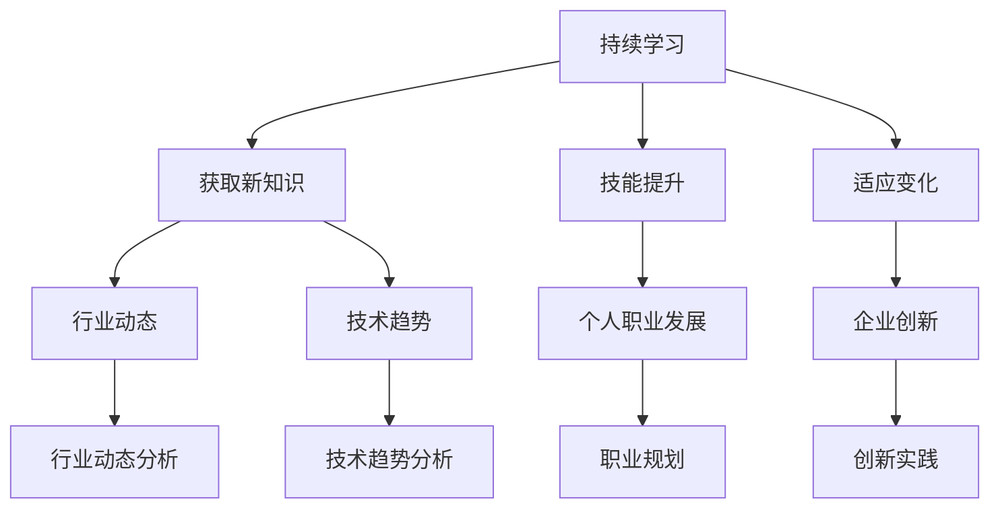

                 

# 持续学习：跟进行业动态和技术趋势

## 摘要

在现代信息技术快速发展的背景下，持续学习已成为个人职业发展、企业创新以及行业进步的关键驱动力。本文将围绕“持续学习”这一核心主题，探讨其定义、重要性，以及如何通过跟进行业动态和技术趋势来实现个人和企业的持续成长。文章将分为五个部分：引言、持续学习的策略与方法、跟进行业动态与技术趋势、案例研究以及总结与展望。每个部分都将深入分析相关概念、策略和方法，并通过具体案例进行实践解析。通过这篇文章，读者将获得关于持续学习的全面理解，并学会如何有效地适应不断变化的技术环境。

## 引言

### 1.1 持续学习的概念与重要性

**持续学习**，又称终身学习，是一种持续性的知识获取和技能提升过程。它不仅仅是为了应对职业生涯中的特定阶段需求，更是为了适应快速变化的社会和技术环境。持续学习的重要性体现在以下几个方面：

#### 1.1.1 持续学习的定义

持续学习是指个人或组织在职业生涯或发展过程中，不断地通过学习新的知识和技能，以保持竞争力、提高适应性和创新能力。它不仅仅是一种教育行为，更是一种生活方式和生存策略。

#### 1.1.2 持续学习在个人职业发展中的作用

- **技能更新**：随着技术的发展，许多传统技能正在被新兴技术所取代。持续学习可以帮助个人掌握这些新技术，从而保持职业竞争力。
- **职业晋升**：持续学习使个人能够不断拓展自己的职业领域，提高专业技能和管理能力，从而更容易获得晋升机会。
- **创新思维**：持续学习不仅使个人能够了解行业最新的动态和趋势，还能激发创新思维，推动个人在职业生涯中实现突破。

#### 1.1.3 持续学习对企业创新的重要性

- **知识储备**：企业通过持续学习，能够不断积累和更新知识库，为创新提供坚实的基础。
- **适应市场变化**：市场环境和技术趋势的不断变化要求企业具备快速适应的能力。持续学习可以帮助企业预见并应对这些变化。
- **竞争力提升**：通过持续学习，企业能够开发出更具创新性和竞争力的产品和服务，从而在激烈的市场竞争中脱颖而出。

### 1.2 行业动态与技术趋势概述

了解行业动态和技术趋势是持续学习的重要一环。以下是对当前行业动态和技术趋势的简要概述及其对持续学习的影响：

#### 1.2.1 行业动态分析

- **数字化转型**：越来越多的企业正在加速数字化转型，这包括利用大数据、云计算、人工智能等新技术来优化业务流程。
- **跨界融合**：传统行业与互联网、人工智能等新兴技术的融合正在加速，这要求从业者具备跨领域知识和技能。
- **行业法规变化**：随着技术的发展，许多行业法规也在不断更新，企业需要持续学习以适应这些变化。

#### 1.2.2 技术趋势解读

- **人工智能**：人工智能技术在各个领域的应用正在不断扩大，包括自动驾驶、智能医疗、智能家居等。
- **物联网**：物联网技术的普及使得设备之间的互联变得更加便捷，这推动了智能城市、智能工厂等新型应用场景的出现。
- **区块链**：区块链技术的去中心化和安全性特点使其在金融、供应链管理等领域得到了广泛应用。

#### 1.2.3 行业与技术趋势对持续学习的影响

- **知识更新频率加快**：随着技术趋势的不断变化，知识更新的频率也在加快。个人和企业需要不断学习以保持知识的时效性。
- **跨领域学习需求增加**：跨界融合的趋势要求个人和企业具备更广泛的跨领域知识，这需要更系统、更全面的持续学习。
- **技能多元化**：为了适应新兴技术的应用，个人和企业的技能需求正在向多元化方向发展，这要求持续学习的内容更加丰富。

### 1.3 持续学习在个人与企业中的应用

在个人层面，持续学习可以帮助从业者提高技能水平，拓展职业发展空间，实现个人价值。在企业层面，持续学习是推动企业创新和保持竞争力的重要手段。以下是一些具体的应用场景：

- **个人职业规划**：通过持续学习，个人可以更清晰地制定职业规划，明确自己的发展目标和路径。
- **企业人才发展**：企业可以通过持续学习计划来培养和提升员工的技能和素质，从而提高整体竞争力。
- **技术创新实践**：企业可以通过持续学习，不断引进新技术和新理念，推动技术创新和产品升级。

通过以上分析，可以看出持续学习在个人职业发展和企业创新中的重要性。接下来，我们将进一步探讨如何制定和实施有效的持续学习策略。

## 持续学习的策略与方法

### 2.1 持续学习的策略

#### 2.1.1 个人学习计划制定

个人学习计划的制定是持续学习的关键步骤。一个有效的学习计划可以帮助个人明确学习目标、选择合适的学习资源，并合理安排学习时间。以下是制定个人学习计划的几个关键点：

1. **设定明确的学习目标**：目标应当具体、可衡量、可实现、相关性强和时限性（SMART原则）。例如，学习目标可以是“在接下来的三个月内掌握Python编程语言”。

2. **分析自身优势和短板**：了解自己的知识结构和技能水平，识别需要提升的领域。例如，如果目标是成为一名数据科学家，那么可能需要在统计学、机器学习、数据处理等方面进行学习。

3. **选择合适的学习资源**：根据学习目标，选择适合的学习资源，如在线课程、书籍、研讨会、工作坊等。确保这些资源能够满足学习需求，同时具有较高的质量和可操作性。

4. **制定详细的学习计划**：将学习目标分解为若干个小目标，并为每个小目标制定具体的行动计划。例如，每天投入2小时学习Python编程，每周完成一个编程项目。

5. **定期评估与调整**：学习过程中，定期评估学习效果，根据评估结果调整学习计划。如果发现进度落后或学习效果不佳，需要及时调整学习策略。

#### 2.1.2 学习目标设定

学习目标的设定是持续学习的重要环节。合理的学习目标能够激发学习动力，确保学习过程的有序和高效。以下是设定学习目标的一些原则和方法：

1. **具体性**：学习目标应当具体明确，而不是模糊的。例如，“提高英语口语水平”不如“每周练习英语口语3次，每次30分钟”。

2. **挑战性**：学习目标应当具有一定的挑战性，以激发学习兴趣和动力。目标过高可能导致挫败感，目标过低则可能失去动力。

3. **可实现性**：学习目标需要是可实现的，即通过努力可以实现。这要求目标既不能过于理想化，也不能过于简单。

4. **相关性**：学习目标应当与个人职业规划和发展方向密切相关，以确保学习内容对职业发展有实际帮助。

5. **时限性**：为学习目标设定一个明确的完成时限，有助于提高学习效率。例如，“在接下来的6个月内通过PMP认证考试”。

#### 2.1.3 学习资源获取与管理

学习资源的获取与管理是持续学习的关键保障。以下是一些有效的学习资源获取与管理方法：

1. **在线学习平台**：如Coursera、edX、Udacity等，提供丰富的在线课程和专业的学习资源。

2. **专业书籍**：选择与学习目标相关的经典书籍和专业书籍，如《深度学习》、《机器学习实战》等。

3. **在线论坛和社区**：如Stack Overflow、GitHub、Reddit等，可以获取最新技术动态和行业经验。

4. **研讨会和工作坊**：参加相关行业的研讨会和工作坊，能够获得最新的行业知识和实践经验。

5. **学习工具**：使用学习管理工具，如Trello、Evernote等，来管理学习任务和进度。

6. **图书馆和书店**：利用公共图书馆和书店，获取实体书籍和资料。

### 2.2 持续学习的方法

#### 2.2.1 传统学习方法

传统学习方法包括阅读书籍、参加讲座和研讨会、参加工作坊等。这些方法具有以下优点：

- **系统性**：能够系统地掌握某个领域的知识。
- **互动性**：通过参与讲座和研讨会，可以与专家和同行进行交流，获取不同的见解和经验。

然而，传统学习方法也存在一些局限性，如学习资源有限、学习时间灵活度不高、互动性较弱等。

#### 2.2.2 在线学习平台使用

在线学习平台如Coursera、edX、Udacity等提供了丰富的在线课程和灵活的学习方式。以下是使用在线学习平台的几个关键点：

1. **课程选择**：根据个人学习目标和兴趣，选择合适的课程。可以参考课程的评价、时长、学习资源等。

2. **学习计划**：制定详细的学习计划，合理安排学习时间和任务。

3. **互动参与**：积极参与课程讨论和作业，与老师和同学互动，提高学习效果。

4. **证书认证**：许多在线学习平台提供证书认证，可以作为学习成果的证明。

#### 2.2.3 社交媒体学习策略

社交媒体如Twitter、LinkedIn、Facebook等，可以成为学习的重要工具。以下是使用社交媒体进行学习的几个策略：

1. **关注行业动态**：通过关注行业专家、技术社区和行业报告，了解最新的技术动态和趋势。

2. **参与讨论**：在社交媒体上参与相关话题的讨论，与同行和专家交流观点和经验。

3. **建立网络**：通过社交媒体建立专业网络，拓展人际关系，获取更多的学习资源和机会。

4. **分享经验**：将自己学习的经验和心得分享到社交媒体上，不仅可以帮助他人，也可以巩固自己的知识。

### 2.3 实践与应用

#### 2.3.1 学习项目实践

学习项目实践是将所学知识应用于实际问题的过程，有助于巩固和提升技能。以下是实施学习项目实践的几个关键点：

1. **选择项目**：根据个人兴趣和职业发展方向，选择具有实际意义的项目。例如，开发一个基于人工智能的智能家居系统。

2. **项目规划**：制定详细的项目计划，包括目标、任务、时间表、资源需求等。

3. **团队协作**：如果项目规模较大，可以考虑组建团队，明确团队成员的职责和任务。

4. **问题解决**：在项目实施过程中，遇到问题时，通过查阅资料、请教专家、团队讨论等方式解决问题。

5. **成果评估**：项目完成后，对项目成果进行评估，总结经验和教训，为未来的项目提供参考。

#### 2.3.2 实践中的问题与解决方案

在持续学习的过程中，实践不可避免地会遇到各种问题。以下是一些常见的问题及其解决方案：

1. **缺乏实践经验**：解决方法是通过实际项目或实习来积累经验。

2. **学习资源不足**：解决方法是利用在线学习平台、图书馆、社交媒体等获取更多的学习资源。

3. **时间管理困难**：解决方法是制定详细的学习计划，合理安排学习时间，优先处理重要任务。

4. **学习动力不足**：解决方法是设定明确的学习目标，与同行交流，分享学习经验，提高学习兴趣。

5. **技术难题**：解决方法是查阅相关资料、请教专家、参加技术社区讨论，逐步克服技术难题。

#### 2.3.3 实践成果评估与反思

实践成果的评估和反思是持续学习的重要环节。以下是一些评估和反思的方法：

1. **成果评估**：对项目成果进行评估，包括功能实现、性能指标、用户体验等方面。可以通过用户反馈、测试数据等方式进行评估。

2. **学习反思**：总结学习过程中的得失，分析存在的问题和不足，并提出改进措施。

3. **经验分享**：将自己的学习经验和成果分享给他人，通过交流获取反馈和建议。

4. **持续改进**：根据评估和反思的结果，调整学习策略和方法，不断改进和优化学习过程。

通过以上策略和方法，个人和企业可以更有效地进行持续学习，提高技能水平，适应不断变化的技术环境，实现个人和企业的长期发展。

### 跟进行业动态与技术趋势

#### 3.1 行业动态跟踪方法

了解行业动态是持续学习的重要环节。以下是一些有效的行业动态跟踪方法：

##### 3.1.1 行业报告解读

行业报告是获取行业动态的重要来源。通过解读行业报告，可以了解行业的整体趋势、市场状况、竞争格局等。以下是解读行业报告的几个关键步骤：

1. **选择权威报告**：选择由知名咨询公司、行业协会等发布的权威报告。

2. **阅读摘要**：首先阅读报告的摘要和结论，了解报告的主要内容和观点。

3. **深入分析**：对报告的详细内容进行深入分析，关注行业的关键指标、发展态势、市场机遇和挑战。

4. **比较分析**：将不同报告的内容进行对比分析，找出差异和共同点，形成更全面的行业认知。

##### 3.1.2 行业新闻收集与分析

行业新闻是了解行业最新动态的实时来源。以下是一些收集和分析行业新闻的方法：

1. **订阅新闻源**：订阅行业相关的新闻网站、微信公众号、邮件订阅等，确保及时获取最新信息。

2. **使用新闻聚合工具**：使用新闻聚合工具，如Feedly、Google Reader等，将多个新闻源的内容集中在一起，方便阅读和分析。

3. **关注关键指标**：关注行业关键指标的变化，如市场份额、增长率、投融资情况等，通过这些指标判断行业的整体趋势。

4. **案例分析**：选择具有代表性的企业或事件进行分析，了解其在行业中的地位和影响。

##### 3.1.3 行业专家观点综述

行业专家的观点和见解是了解行业动态的重要参考。以下是一些获取和综述行业专家观点的方法：

1. **阅读专家专栏**：关注行业专家的专栏和博客，阅读他们对于行业趋势、技术发展的见解。

2. **参加行业会议**：参加行业会议和研讨会，聆听专家的演讲和讨论，获取第一手的行业信息。

3. **社交媒体互动**：通过社交媒体平台，与行业专家互动，提问和交流，获取他们的观点和建议。

4. **整理和总结**：将收集到的专家观点进行整理和总结，形成系统的行业观点综述，为自己的决策提供参考。

#### 3.2 技术趋势分析

了解技术趋势是持续学习的关键。以下是对当前技术趋势的分析：

##### 3.2.1 技术发展历程回顾

回顾技术发展历程，有助于理解当前技术趋势的来龙去脉。以下是一些关键技术的发展历程：

1. **互联网技术**：从ARPANET到互联网，再到移动互联网，互联网技术经历了数十年的发展，深刻影响了人类社会的方方面面。

2. **人工智能技术**：从最初的规则系统到深度学习、强化学习等，人工智能技术不断发展，应用领域也从单一的专家系统扩展到自动驾驶、智能家居、医疗诊断等。

3. **大数据技术**：随着数据量的爆炸式增长，大数据技术应运而生，包括数据采集、存储、处理、分析等方面，成为企业决策的重要工具。

4. **区块链技术**：区块链技术通过去中心化和安全性特点，在金融、供应链管理、物联网等领域得到了广泛应用。

##### 3.2.2 当前技术趋势概述

以下是当前一些重要的技术趋势：

1. **人工智能与物联网的融合**：人工智能技术与物联网技术的融合，推动了智能家居、智能城市等应用场景的出现。

2. **边缘计算**：随着物联网设备的增加，边缘计算成为了一种重要趋势，通过在设备端进行数据处理，降低延迟，提高效率。

3. **区块链2.0**：区块链技术从简单的数字货币扩展到更多应用场景，如供应链管理、身份验证等。

4. **量子计算**：量子计算作为一种具有巨大潜力的新兴技术，正逐渐从理论研究走向实际应用。

##### 3.2.3 未来技术趋势展望

展望未来，以下是一些可能的技术趋势：

1. **6G通信技术**：6G通信技术将进一步提高通信速度和带宽，推动更高效的信息传输。

2. **自主智能系统**：自主智能系统将具备更高水平的自主决策和执行能力，应用于无人驾驶、无人机等领域。

3. **生物计算**：生物计算利用生物分子进行计算，具有潜在的高速计算能力，将在药物研发、基因组分析等领域发挥重要作用。

4. **可持续发展技术**：随着全球环境问题的日益严重，可持续发展技术将成为未来技术发展的重要方向，如可再生能源、环保材料等。

#### 3.3 技术趋势对个人与企业的影响

技术趋势对个人与企业的影响深远，以下是一些具体的影响：

##### 3.3.1 技术变革下的职业挑战

技术变革带来了新的职业机会，同时也对现有职业提出了挑战。以下是一些职业挑战：

1. **技能需求变化**：新技术的发展要求从业者具备更高的技能水平，如人工智能、数据分析、区块链等。

2. **跨界能力要求**：跨界融合的趋势要求从业者具备跨领域知识和技能，如技术与管理、技术与业务等。

3. **持续学习压力**：技术变革速度加快，从业者需要不断学习新知识、新技能，以适应不断变化的市场需求。

##### 3.3.2 企业应对技术变革的策略

企业应对技术变革，需要采取一系列策略，以下是一些关键策略：

1. **技术前瞻性**：关注新兴技术的动态，提前布局，抢占市场先机。

2. **技术创新能力**：建立创新机制，鼓励员工进行技术创新，推动产品和服务升级。

3. **人才培养**：建立人才培训和发展机制，提高员工的技能水平和创新能力。

4. **合作与开放**：与其他企业、研究机构、高校等建立合作关系，共享资源，共同推动技术进步。

##### 3.3.3 个人如何适应技术变革

个人适应技术变革，需要采取以下措施：

1. **持续学习**：保持持续学习的态度，不断更新知识和技能，适应技术变化。

2. **跨界能力培养**：主动学习跨领域的知识和技能，提高跨界能力，增强职业竞争力。

3. **实践与经验**：通过实际项目和实践，积累经验，提高解决问题的能力。

4. **灵活适应**：保持开放心态，适应新的工作环境和角色变化，提高适应性。

通过跟进行业动态和技术趋势，个人和企业可以更好地应对技术变革，抓住机遇，实现持续成长和发展。

### 案例研究

#### 4.1 持续学习的个人案例

**案例背景介绍**：

李华是一名软件工程师，在一家互联网公司工作。随着公司业务的发展，李华意识到需要不断更新自己的技术知识和技能，以适应快速变化的市场需求。为了在职业生涯中保持竞争力，李华决定进行持续学习。

**学习策略与方法**：

1. **制定学习计划**：李华首先制定了详细的学习计划，设定了具体的学习目标和时间表。他选择了Python编程语言作为主要学习目标，并制定了每天学习2小时的时间安排。

2. **利用在线学习平台**：李华在Coursera上选择了相关的编程课程，通过在线学习平台系统地学习了Python的基础知识和高级应用。他积极参与课程讨论，与老师和同学互动，提高学习效果。

3. **实践项目**：为了巩固所学知识，李华选择了一个实际的编程项目——开发一个简单的智能家居系统。他在项目中运用了Python编程语言，学习了如何处理传感器数据、实现智能控制等功能。

**案例成果与反思**：

通过持续学习，李华成功掌握了Python编程语言，并完成了智能家居系统的开发。他在公司项目中展示了这些新技能，获得了同事和领导的高度评价。李华也深刻认识到，持续学习不仅提高了自己的技术水平，还增强了自己的解决问题和团队协作能力。

反思中，李华意识到持续学习需要长期坚持，并且要与实践相结合。他计划在未来的学习中，继续探索新的编程语言和框架，提高自己的综合技能水平。

#### 4.2 企业持续学习的实践案例

**案例背景介绍**：

某互联网公司是一家处于高速成长阶段的企业，为了保持市场竞争力，公司决定实施持续学习计划，提高员工的技能水平和创新能力。

**学习策略与方法**：

1. **建立学习文化**：公司提倡持续学习的文化，鼓励员工自主学习，并提供了丰富的学习资源，如在线课程、图书资料、内部培训等。

2. **制定学习计划**：公司为每个员工制定了个性化的学习计划，根据员工的技术背景和职业发展需求，制定了具体的学习目标和时间表。

3. **组织内部培训**：公司定期组织内部培训，邀请行业专家和资深员工进行知识分享和技能培训，提高员工的技能水平。

4. **实践与项目**：公司鼓励员工参与实际项目，通过实践来巩固所学知识。同时，公司设立了创新实验室，为员工提供了探索新技术的平台。

**案例成果与启示**：

通过持续学习计划，公司员工的技术水平和创新能力得到了显著提升。公司在多个关键项目中取得了突破性进展，产品和服务也得到了客户的认可。此外，公司还培养了一批具有跨界能力的复合型人才，为企业的长远发展奠定了坚实基础。

启示是，企业通过建立持续学习机制，可以有效地提高员工的技能水平，激发创新思维，从而在激烈的市场竞争中保持优势。同时，企业应关注员工的个性化需求，提供多样化的学习资源和支持，确保学习计划的有效实施。

### 第五部分：总结与展望

#### 5.1 持续学习的重要性总结

持续学习在个人职业发展和企业创新中扮演着至关重要的角色。以下是持续学习的重要性总结：

1. **技能更新**：持续学习使个人能够及时更新技能，适应快速变化的市场需求。
2. **职业晋升**：持续学习有助于提高个人职业竞争力，实现职业晋升和事业发展。
3. **创新能力**：持续学习激发创新思维，推动个人和企业不断突破，实现创新。
4. **适应变化**：持续学习使个人和企业能够快速适应市场和技术变革，保持竞争力。

#### 5.2 跟进行业动态与技术趋势的意义

跟进行业动态和技术趋势对于个人和企业的持续成长具有重要意义，具体体现在以下几个方面：

1. **预见机遇**：了解行业动态和技术趋势，有助于预见市场机遇，把握行业发展方向。
2. **制定策略**：通过分析行业动态和技术趋势，个人和企业可以制定更加有效的战略规划和发展策略。
3. **提升竞争力**：紧跟技术趋势，采用新兴技术和方法，有助于提升个人和企业的竞争力。
4. **持续成长**：持续学习和跟进行业动态，使个人和企业能够不断成长，适应不断变化的环境。

#### 5.3 未来展望

未来，持续学习和跟进行业动态与技术趋势将继续发挥重要作用。以下是未来展望：

1. **持续学习的发展趋势**：随着技术的进步，在线学习和智能化学习工具将更加普及，持续学习将更加便捷和高效。
2. **技术趋势对持续学习的影响**：新兴技术如人工智能、物联网、区块链等将继续影响持续学习的内容和方法，推动学习模式的变革。
3. **个人与企业的持续学习策略优化方向**：个人和企业应更加注重个性化学习、跨界能力和实践能力的培养，优化学习策略，以适应未来发展的需求。

总之，持续学习和跟进行业动态与技术趋势是个人和企业在当今快速变化的环境中实现持续成长的关键。通过不断学习和适应，个人和企业将能够把握机遇，迎接挑战，实现长远发展。

### 附录

#### 附录A：持续学习资源推荐

**A.1 在线学习平台推荐**

- **Coursera**：提供来自世界顶尖大学和企业的在线课程。
- **edX**：由哈佛大学和麻省理工学院共同创办，提供高质量的在线课程。
- **Udacity**：专注于技术教育和职业培训，提供实用的编程课程。

**A.2 学习资源网站推荐**

- **Medium**：一个内容丰富的博客平台，涵盖了多个技术领域的文章和见解。
- **GitHub**：一个版本控制系统，也是开源项目的集中地，提供了大量的代码和文档。
- **Stack Overflow**：一个技术问答社区，适合解决编程中的问题。

**A.3 专业书籍推荐**

- **《深度学习》（Ian Goodfellow, Yoshua Bengio, Aaron Courville）**：深度学习的经典教材。
- **《机器学习实战》（Peter Harrington）**：通过实际案例介绍机器学习应用。
- **《数据科学入门》（Joel Grus）**：数据科学的基础入门书籍。

#### 附录B：相关术语解释

**B.1 行业术语解释**

- **数字化转型**：企业通过引入数字技术，优化业务流程和运营模式的过程。
- **人工智能**：通过计算机模拟人类智能行为的科学技术，包括机器学习、深度学习等。
- **物联网**：通过传感器、网络和智能设备实现物体互联的技术。

**B.2 技术术语解释**

- **机器学习**：通过算法和统计模型，使计算机能够从数据中学习和做出决策。
- **深度学习**：一种基于人工神经网络的机器学习技术，能够通过多层神经网络学习数据的复杂特征。
- **区块链**：一种分布式数据库技术，能够实现去中心化的数据存储和交易。

**B.3 持续学习相关术语解释**

- **终身学习**：指个人在一生中不断学习新知识和技能。
- **经验重放**：在机器学习中，将之前的经验数据重新用于训练，以提高模型的泛化能力。
- **增量学习**：在机器学习中，每次只学习一个新的数据集或任务。

### Mermaid 流程图



### 核心概念与联系

**持续学习（Continuous Learning）**：一个持续性的过程，涉及获取新知识、技能和实践，以适应不断变化的环境。它与终身学习（Lifelong Learning）密切相关，但更侧重于持续性和适应性。

**行业动态（Industry Dynamics）**：指行业内部变化的过程，包括技术、市场、竞争等方面的动态。

**技术趋势（Tech Trends）**：指特定技术领域的发展方向和变化趋势，通常是长期性的。

**个人职业发展（Personal Career Development）**：涉及个人在职业生涯中的成长和进步，包括技能提升、职业规划、晋升等方面。

**企业创新（Corporate Innovation）**：指企业通过引入新思想、新方法、新产品或服务来提高市场竞争力。

### 核心算法原理讲解

**持续学习算法（Continual Learning Algorithms）**：

- **概述**：持续学习算法旨在使模型能够在不断变化的环境中持续学习，而不会受到新数据分布变化的影响。

- **原理**：
  - **在线学习**：模型在接收到新数据时立即更新。
  - **经验重放（Experience Replay）**：将之前的学习经验存储在一个记忆库中，并在训练过程中随机抽取样本进行训练，以减少数据分布变化的影响。
  - **增量学习（Incremental Learning）**：模型每次只学习一个新的任务或一小部分数据。

- **伪代码**：

```python
function ContinualLearningModel(model, data_stream, replay_memory, num_epochs):
    for epoch in range(num_epochs):
        for data_batch in data_stream:
            # 在线学习新数据
            model.train(data_batch)
            
        # 从经验重放内存中随机抽取样本进行训练
        replay_batch = random.sample(replay_memory)
        model.train(replay_batch)
```

### 数学模型和数学公式讲解

**指数加权移动平均（Exponential Weighted Moving Average, EWMA）**：

- **公式**：
  $$ EWMA_t = \alpha \cdot X_t + (1 - \alpha) \cdot EWMA_{t-1} $$
  其中，$X_t$ 表示时间 $t$ 的观测值，$EWMA_{t-1}$ 表示时间 $t-1$ 的指数加权移动平均值，$\alpha$ 为平滑常数（通常在0到1之间）。

- **举例说明**：假设 $\alpha = 0.5$，且我们有以下观测值序列：$[10, 12, 11, 13, 15]$。
  - $EWMA_1 = 0.5 \cdot 10 + (1 - 0.5) \cdot 10 = 10$
  - $EWMA_2 = 0.5 \cdot 12 + (1 - 0.5) \cdot 10 = 11$
  - $EWMA_3 = 0.5 \cdot 11 + (1 - 0.5) \cdot 11 = 11$
  - $EWMA_4 = 0.5 \cdot 13 + (1 - 0.5) \cdot 11 = 12$
  - $EWMA_5 = 0.5 \cdot 15 + (1 - 0.5) \cdot 12 = 13.5$

### 项目实战

**使用Kaggle竞赛案例进行持续学习实践**：

- **案例背景**：假设我们参加了一个Kaggle竞赛，目标是预测某个数据的趋势。随着比赛时间的推进，我们收到了更多的数据。

- **实战步骤**：

  1. **数据预处理**：将新数据与已有数据进行合并，并清洗数据中的噪声。

  2. **模型训练**：使用持续学习算法对模型进行训练，结合新数据和已有数据。

  3. **模型评估**：使用验证集对新模型进行评估，确保模型的性能得到提升。

  4. **模型优化**：根据评估结果，对模型进行调整和优化。

  5. **模型部署**：将优化后的模型部署到Kaggle竞赛中，提交结果。

- **代码解读与分析**：

```python
import pandas as pd
from sklearn.linear_model import LinearRegression

# 数据预处理
def preprocess_data(new_data, existing_data):
    # 合并数据
    combined_data = pd.concat([new_data, existing_data], ignore_index=True)
    # 清洗数据中的噪声
    # ...
    return combined_data

# 持续学习算法实现
def continual_learning(model, new_data):
    # 训练模型
    model.fit(new_data)
    # 预测
    predictions = model.predict(new_data)
    return predictions

# 模型评估
def evaluate_model(model, validation_data):
    # 计算准确率
    accuracy = model.score(validation_data)
    return accuracy

# 主函数
def main():
    # 读取新数据和已有数据
    new_data = pd.read_csv('new_data.csv')
    existing_data = pd.read_csv('existing_data.csv')
    # 预处理数据
    combined_data = preprocess_data(new_data, existing_data)
    # 创建模型
    model = LinearRegression()
    # 使用持续学习算法进行训练
    continual_learning(model, combined_data)
    # 使用验证集进行评估
    validation_accuracy = evaluate_model(model, validation_data)
    print(f"Validation Accuracy: {validation_accuracy}")

if __name__ == '__main__':
    main()
```

### 附录

#### 附录A：持续学习资源推荐

**A.1 在线学习平台推荐**

- **Coursera**：提供来自世界顶尖大学和企业的在线课程。
- **edX**：由哈佛大学和麻省理工学院共同创办，提供高质量的在线课程。
- **Udacity**：专注于技术教育和职业培训，提供实用的编程课程。

**A.2 学习资源网站推荐**

- **Medium**：一个内容丰富的博客平台，涵盖了多个技术领域的文章和见解。
- **GitHub**：一个版本控制系统，也是开源项目的集中地，提供了大量的代码和文档。
- **Stack Overflow**：一个技术问答社区，适合解决编程中的问题。

**A.3 专业书籍推荐**

- **《深度学习》（Ian Goodfellow, Yoshua Bengio, Aaron Courville）**：深度学习的经典教材。
- **《机器学习实战》（Peter Harrington）**：通过实际案例介绍机器学习应用。
- **《数据科学入门》（Joel Grus）**：数据科学的基础入门书籍。

#### 附录B：相关术语解释

**B.1 行业术语解释**

- **数字化转型**：企业通过引入数字技术，优化业务流程和运营模式的过程。
- **人工智能**：通过计算机模拟人类智能行为的科学技术，包括机器学习、深度学习等。
- **物联网**：通过传感器、网络和智能设备实现物体互联的技术。

**B.2 技术术语解释**

- **机器学习**：通过算法和统计模型，使计算机能够从数据中学习和做出决策。
- **深度学习**：一种基于人工神经网络的机器学习技术，能够通过多层神经网络学习数据的复杂特征。
- **区块链**：一种分布式数据库技术，能够实现去中心化的数据存储和交易。

**B.3 持续学习相关术语解释**

- **终身学习**：指个人在一生中不断学习新知识和技能。
- **经验重放**：在机器学习中，将之前的经验数据重新用于训练，以提高模型的泛化能力。
- **增量学习**：在机器学习中，每次只学习一个新的数据集或任务。

### 完整性要求

文章内容完整性要求如下：

1. **核心概念与联系**：必须给出核心概念原理和架构的 Mermaid 流程图，并详细阐述核心概念之间的联系。
2. **核心算法原理讲解**：必须使用伪代码详细阐述核心算法的原理，并包含数学模型和公式的详细讲解与举例说明。
3. **项目实战**：必须提供具体的代码实现案例，并包含代码解读与分析，详细解释代码的实现过程和关键步骤。
4. **附录**：必须包含附录A和附录B，分别为持续学习资源推荐和相关术语解释，确保文章的完整性和丰富性。

通过以上要求，确保文章内容的丰富性、逻辑性和实用性，为读者提供全面而深入的学习体验。

