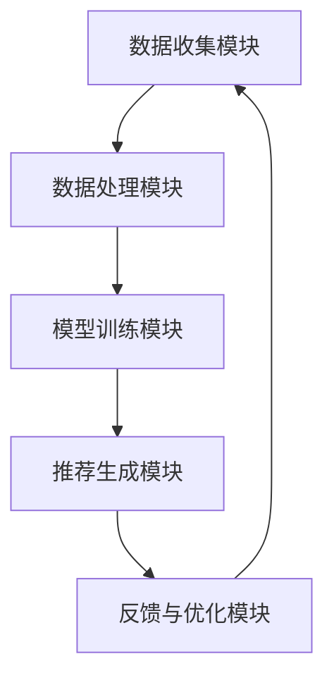

                 

### 引言

推荐系统作为信息过滤和内容分发的重要工具，已经广泛应用于电子商务、社交媒体、视频流媒体等多个领域。其核心目标是通过分析用户的历史行为、兴趣和偏好，向用户推荐符合其兴趣的产品、内容或其他用户。推荐系统不仅提升了用户体验，还为企业带来了显著的商业价值，如提高用户粘性、增加销售量等。

尽管推荐系统在诸多方面取得了显著成果，但它也面临着一系列的局限与挑战。本文将深入探讨推荐系统中存在的过拟合、偏见和多样性问题，旨在为读者提供全面、系统的理解。

过拟合是指模型在训练数据上表现优异，但在未见过的数据上表现不佳。在推荐系统中，过拟合可能导致用户收到重复、低质量的内容，从而影响用户体验。例如，当推荐系统对某些特定类型的商品进行过度推荐时，用户可能会感到厌烦，进而减少使用该系统的频率。

偏见问题则是指推荐系统在推荐结果中存在不公平或歧视现象。例如，某些推荐系统可能因为数据集的不平衡或算法设计的不当，导致对特定群体或内容的偏好或歧视。这种偏见不仅损害了用户体验，还可能导致社会不公平。

多样性问题是指推荐系统在推荐结果中缺乏多样化的内容。当用户频繁接收到相似或重复的内容时，他们可能会感到无聊或疲劳，从而降低对系统的满意度。此外，缺乏多样性的推荐系统也可能导致企业失去潜在的商业机会。

本文将按照以下结构展开讨论：首先介绍推荐系统的基础知识，包括定义、发展历史、基本架构和核心技术；然后深入分析推荐系统的过拟合问题，探讨其定义、原因、影响及解决方案；接着讨论偏见问题，介绍偏见的定义、类型、负面影响以及缓解策略；最后探讨多样性问题，阐述多样性的定义、重要性、缺失原因及提升策略。在第三部分，我们将通过实践案例解析推荐系统的优化过程，并为企业和研究者提供实际应用建议。通过本文的阅读，读者将对推荐系统的局限与挑战有更深刻的理解，并为未来的研究和应用提供有益的启示。

### 推荐系统基础知识

#### 第1章：推荐系统概述

##### 1.1 推荐系统的定义与作用

推荐系统是一种信息过滤和内容分发技术，旨在向用户推荐其可能感兴趣的信息、产品或服务。其核心目标是通过分析用户的历史行为、兴趣和偏好，预测用户未来的需求和偏好，从而提供个性化的推荐。

推荐系统的定义可以从两个方面来理解：功能上和实现上。从功能上看，推荐系统是一种信息过滤工具，其作用包括：

1. **个性化推荐**：根据用户的历史行为和偏好，为用户推荐其可能感兴趣的内容或产品。
2. **内容分发**：将信息或产品以最佳顺序和最佳方式呈现给用户，从而提高用户的满意度和参与度。
3. **用户参与度提升**：通过个性化推荐，吸引和保持用户的兴趣，增加用户在平台上的停留时间和互动次数。

从实现上看，推荐系统是一种利用算法和技术来构建的自动化系统。其基本流程包括数据收集、数据处理、模型训练和推荐生成。具体来说，推荐系统的实现通常包括以下几个关键步骤：

1. **数据收集**：收集用户的行为数据，如浏览记录、点击行为、购买记录、评价等，以及商品或内容的属性数据。
2. **数据处理**：对收集到的数据进行清洗、转换和归一化，以便用于后续的模型训练和推荐生成。
3. **模型训练**：利用用户行为数据和内容属性数据，通过机器学习算法训练推荐模型。常见的推荐算法包括协同过滤算法、基于内容的推荐算法和混合推荐算法。
4. **推荐生成**：根据用户的历史行为和模型预测，生成个性化的推荐结果，并将其呈现给用户。

##### 1.2 推荐系统的历史与发展

推荐系统的历史可以追溯到20世纪80年代，当时最早的推荐系统是基于规则的系统。这些系统通过定义一系列规则来预测用户可能感兴趣的内容或产品。然而，这类系统存在明显的局限性，无法处理大量复杂的数据，也无法应对动态变化的用户需求。

随着互联网的兴起和大数据技术的发展，推荐系统得到了迅速的发展。20世纪90年代末和21世纪初，协同过滤算法成为推荐系统的主流技术。协同过滤算法通过分析用户之间的相似性，预测用户可能感兴趣的内容或产品。这类算法在处理大量数据和预测准确性方面取得了显著进展。

进入21世纪，随着深度学习技术的发展，基于深度学习的推荐系统逐渐成为研究的热点。深度学习算法通过自动提取高维特征，提高了推荐系统的准确性和泛化能力。同时，混合推荐算法将协同过滤和基于内容的推荐算法相结合，进一步提升了推荐系统的性能。

##### 1.3 推荐系统的基本架构

推荐系统通常包括以下几个主要组件，共同协作实现推荐功能：

1. **数据收集模块**：负责从各种来源收集用户行为数据和内容属性数据。这些数据可以是结构化的，如数据库中的用户记录和商品属性，也可以是非结构化的，如图像、文本和音频。

2. **数据处理模块**：对收集到的数据进行预处理，包括数据清洗、转换和归一化。这一步骤的目的是确保数据质量，提高后续模型训练的效率。

3. **模型训练模块**：利用用户行为数据和内容属性数据，通过机器学习算法训练推荐模型。常见的算法包括协同过滤算法、基于内容的推荐算法和混合推荐算法。

4. **推荐生成模块**：根据用户的历史行为和模型预测，生成个性化的推荐结果，并将其呈现给用户。这一模块通常包括推荐策略、推荐排序和推荐展示等子模块。

5. **反馈与优化模块**：收集用户对推荐结果的反馈，包括点击、购买、评价等行为数据，用于评估推荐效果和优化推荐策略。

推荐系统的基本架构如图1所示：

在图1中，数据收集模块负责从各种渠道收集数据，数据处理模块对数据进行预处理，模型训练模块利用预处理后的数据进行训练，推荐生成模块根据训练好的模型生成推荐结果，反馈与优化模块则根据用户反馈对推荐系统进行评估和优化。

通过以上组件的协同工作，推荐系统实现了对用户个性化需求的精准预测和推荐，为用户带来了更好的体验，同时也为企业创造了商业价值。

#### 第2章：推荐系统的核心技术

##### 2.1 协同过滤算法

协同过滤算法（Collaborative Filtering，CF）是推荐系统中最常用的核心技术之一，其基本思想是利用用户之间的相似性进行推荐。协同过滤算法主要分为基于用户的协同过滤（User-Based CF）和基于项目的协同过滤（Item-Based CF）两种类型。

**1. 基于用户的协同过滤（User-Based CF）**

基于用户的协同过滤算法通过分析用户之间的相似度，找到与目标用户相似的其他用户，然后推荐这些相似用户喜欢的项目。相似度计算通常使用用户之间的共同评分来衡量，常见的相似度度量方法包括余弦相似度、皮尔逊相关系数等。

具体实现步骤如下：

1. **计算用户相似度**：首先，计算目标用户与所有其他用户之间的相似度，通常使用用户之间的共同评分来计算相似度。例如，使用余弦相似度计算公式：
   $$
   similarity(u_i, u_j) = \frac{\sum_{k=1}^{n} r_{ik}r_{jk}}{\sqrt{\sum_{k=1}^{n} r_{ik}^2 \sum_{k=1}^{n} r_{jk}^2}}
   $$
   其中，$r_{ik}$ 表示用户 $u_i$ 对项目 $k$ 的评分，$n$ 是用户共同评分的项目数量。

2. **找到相似用户**：根据相似度计算结果，找到与目标用户最相似的 $k$ 个用户。

3. **推荐项目**：对相似用户喜欢的项目进行加权平均，生成推荐列表。具体公式如下：
   $$
   \hat{r_{ij}} = \frac{\sum_{u \in S} w_{u}r_{uj}}{N_j}
   $$
   其中，$S$ 是与目标用户最相似的 $k$ 个用户集合，$w_{u}$ 是用户 $u$ 的权重，通常与相似度成正比，$N_j$ 是用户 $u$ 对项目 $j$ 的评分数量。

**2. 基于项目的协同过滤（Item-Based CF）**

基于项目的协同过滤算法通过分析项目之间的相似性，找到与目标项目相似的其他项目，然后推荐这些相似项目给用户。项目相似性计算方法与用户相似性计算类似，也是基于共同评分。

具体实现步骤如下：

1. **计算项目相似度**：首先，计算目标项目与所有其他项目之间的相似度，通常使用共同评分的用户数来计算相似度。例如，使用余弦相似度计算公式：
   $$
   similarity(i_k, i_l) = \frac{\sum_{u=1}^{m} r_{uik}r_{uik}}{\sqrt{\sum_{u=1}^{m} r_{uik}^2 \sum_{u=1}^{m} r_{uik}^2}}
   $$
   其中，$r_{uik}$ 表示用户 $u$ 对项目 $k$ 的评分，$m$ 是共同评分的用户数。

2. **找到相似项目**：根据相似度计算结果，找到与目标项目最相似的 $k$ 个项目。

3. **推荐项目**：对相似项目进行加权平均，生成推荐列表。具体公式如下：
   $$
   \hat{r_{ij}} = \frac{\sum_{i \in S} w_{i}r_{ij}}{N_j}
   $$
   其中，$S$ 是与目标项目最相似的 $k$ 个项目集合，$w_{i}$ 是项目 $i$ 的权重，通常与相似度成正比，$N_j$ 是项目 $j$ 的评分数量。

**3. 混合协同过滤**

混合协同过滤算法将基于用户的协同过滤和基于项目的协同过滤相结合，以提高推荐系统的性能。混合协同过滤算法通过以下步骤实现：

1. **计算用户相似度**：使用基于用户的协同过滤算法计算用户之间的相似度。
2. **计算项目相似度**：使用基于项目的协同过滤算法计算项目之间的相似度。
3. **推荐项目**：综合用户相似度和项目相似度，生成推荐列表。一种常见的实现方法是将用户相似度和项目相似度的加权平均作为推荐权重，具体公式如下：
   $$
   \hat{r_{ij}} = \alpha \cdot \frac{\sum_{u \in S} w_{u}r_{uj}}{N_j} + (1 - \alpha) \cdot \frac{\sum_{i \in S} w_{i}r_{ij}}{N_j}
   $$
   其中，$\alpha$ 是用户相似度和项目相似度的权重比例。

通过以上步骤，混合协同过滤算法在充分利用用户和项目信息的同时，提高了推荐系统的准确性和多样性。

##### 2.2 内容推荐算法

内容推荐算法（Content-Based Filtering，CBF）基于用户对某些内容的偏好，通过分析内容属性来生成推荐。内容推荐算法不依赖于用户之间的相似性或历史行为数据，而是通过提取内容特征，构建内容模型，然后根据用户历史偏好进行推荐。

**1. 基于关键词的推荐**

基于关键词的推荐算法通过提取内容中的关键词或主题，将内容与用户历史偏好进行匹配，生成推荐列表。具体实现步骤如下：

1. **提取关键词**：使用自然语言处理技术，如词频统计、TF-IDF（词频-逆文档频率）等方法，提取内容中的关键词。

2. **构建内容模型**：将提取的关键词进行编码，构建内容向量。例如，可以使用词嵌入（Word Embedding）技术，将关键词映射到高维空间。

3. **计算内容相似度**：计算用户历史偏好与内容模型之间的相似度，常用的相似度计算方法包括余弦相似度和欧氏距离等。

4. **生成推荐列表**：对相似度进行排序，生成推荐列表。

**2. 基于属性的推荐**

基于属性的推荐算法通过分析内容属性，如类别、标签、价格等，将内容与用户历史偏好进行匹配，生成推荐列表。具体实现步骤如下：

1. **提取内容属性**：从内容中提取属性特征，如类别、标签、价格等。

2. **构建内容模型**：将提取的属性特征进行编码，构建内容向量。

3. **计算内容相似度**：计算用户历史偏好与内容模型之间的相似度，常用的相似度计算方法包括余弦相似度和欧氏距离等。

4. **生成推荐列表**：对相似度进行排序，生成推荐列表。

**3. 混合推荐算法**

混合推荐算法结合内容推荐算法和协同过滤算法的优点，通过融合用户行为数据和内容属性数据，生成更准确的推荐结果。混合推荐算法通常包括以下几种类型：

1. **基于模型的混合推荐**：使用机器学习模型，如线性回归、决策树、神经网络等，同时结合用户行为数据和内容属性数据，进行预测和推荐。

2. **基于规则的混合推荐**：通过定义一系列规则，结合用户行为数据和内容属性数据，进行推荐。

3. **基于协同过滤和内容的融合**：将协同过滤算法和内容推荐算法的结果进行融合，生成最终的推荐列表。例如，可以采用加权平均或投票机制，将两种算法的结果进行整合。

通过以上内容，我们详细介绍了推荐系统的核心技术，包括协同过滤算法和内容推荐算法。这些算法在推荐系统中发挥着重要作用，为用户提供个性化的推荐服务。然而，随着推荐系统的不断发展和应用，我们也需要关注其局限性、偏见和多样性问题，以进一步提升推荐系统的性能和用户体验。

##### 2.3 推荐系统的评价与优化

推荐系统的评价与优化是确保其性能和用户体验的关键环节。有效的评价方法和优化策略能够帮助推荐系统在复杂多变的环境中持续提升其推荐效果。以下是推荐系统的评价指标、优化策略及具体方法。

**3.1 推荐系统评价指标**

推荐系统通常使用以下三个主要指标来评价其性能：

1. **准确性**：准确性是评估推荐系统预测用户兴趣或行为的能力。常用的评估方法包括均方根误差（RMSE）、平均绝对误差（MAE）等。例如，均方根误差计算公式如下：
   $$
   RMSE = \sqrt{\frac{1}{n}\sum_{i=1}^{n} (\hat{r}_i - r_i)^2}
   $$
   其中，$n$ 是测试集中的项目数量，$\hat{r}_i$ 是预测评分，$r_i$ 是真实评分。

2. **覆盖率**：覆盖率是指推荐系统能够覆盖的用户或项目比例。较高的覆盖率意味着更多的用户或项目能够获得推荐。覆盖率通常通过以下公式计算：
   $$
   Coverage = \frac{|\cup_{u \in U}\{R(u)\}|}{|I|}
   $$
   其中，$U$ 是用户集合，$I$ 是项目集合，$R(u)$ 是用户 $u$ 收到的推荐项目集合。

3. **多样性**：多样性是指推荐系统中推荐项目之间的差异性。高多样性的推荐系统能够提供丰富多样的内容，避免用户产生疲劳和厌烦。常用的多样性评价指标包括项目多样性（Item Diversity）和评分多样性（Rating Diversity）。例如，项目多样性可以通过计算推荐项目之间的余弦相似度来评估，公式如下：
   $$
   Item\_Diversity = \frac{1}{|R|} \sum_{i, j \in R} similarity(i, j)
   $$
   其中，$R$ 是推荐项目集合。

**3.2 推荐系统的优化策略**

为了提升推荐系统的性能，我们需要采用一系列优化策略，包括特征工程、模型调参和模型融合等。

1. **特征工程**：特征工程是推荐系统优化的重要环节。通过合理地选择和处理特征，可以提高推荐系统的准确性和多样性。特征工程的方法包括：

   - **特征提取**：使用自然语言处理（NLP）、图像处理等技术，从文本、图像等多媒体数据中提取高维特征。
   - **特征选择**：通过特征重要性评估、互信息等方法，选择对推荐效果影响最大的特征。
   - **特征转换**：使用主成分分析（PCA）、特征缩放等技术，对特征进行降维和标准化处理，提高模型的训练效率。

2. **模型调参**：模型调参是优化推荐系统的关键步骤。通过调整模型参数，可以提升模型的预测性能。常见的调参方法包括：

   - **网格搜索**：通过遍历参数空间，找到最优参数组合。
   - **随机搜索**：随机选择参数组合，进行模型训练和评估，找到最优参数组合。
   - **贝叶斯优化**：使用贝叶斯优化算法，根据历史训练结果，自动调整参数。

3. **模型融合**：模型融合是将多个推荐模型的结果进行整合，生成最终的推荐结果。常见的模型融合方法包括：

   - **加权平均**：将多个模型的预测结果进行加权平均，生成推荐列表。
   - **投票机制**：对多个模型的预测结果进行投票，选择投票结果最多的预测作为最终推荐。
   - **集成学习**：使用集成学习算法，如随机森林、梯度提升树等，将多个模型进行集成训练，生成最终的推荐结果。

通过以上优化策略，推荐系统可以在复杂多变的环境中，持续提升其推荐性能和用户体验。

**3.3 实际案例**

以下是一个实际案例，说明如何优化推荐系统：

某电商平台希望通过优化推荐系统，提高用户的购买转化率和满意度。以下是他们采取的一系列优化措施：

1. **特征工程**：电商平台收集了用户的历史购买记录、浏览记录和商品属性数据。通过自然语言处理技术，从商品描述中提取关键词，使用TF-IDF模型将这些关键词转换为向量表示。同时，对用户的历史行为数据进行编码，构建用户行为向量。

2. **模型调参**：使用网格搜索方法，调整协同过滤模型的参数，如邻居数量、加权系数等。通过多次实验，找到最优参数组合，提高了模型的预测准确性。

3. **模型融合**：将基于用户的协同过滤模型和基于内容推荐模型进行融合。通过加权平均方法，将两种模型的结果进行整合，生成最终的推荐结果。这一策略不仅提高了推荐系统的准确性，还增加了推荐项目的多样性。

通过以上优化措施，该电商平台的推荐系统在准确性和多样性方面得到了显著提升，用户的购买转化率和满意度也得到了提高。

通过本章节的介绍，我们了解了推荐系统的评价方法和优化策略。在实际应用中，通过合理地选择和优化这些方法，可以显著提升推荐系统的性能和用户体验。然而，推荐系统仍面临过拟合、偏见和多样性等挑战，需要我们在未来的研究和实践中不断探索和解决。

### 推荐系统的局限与挑战

#### 第4章：过拟合问题

过拟合（Overfitting）是推荐系统中常见的一个问题，它指的是模型在训练数据上表现优异，但在未见过的数据上表现不佳。在推荐系统中，过拟合可能导致用户接收到重复、低质量的内容，从而影响用户体验。本节将详细探讨过拟合的定义、原因及其影响，并提出相应的解决方案。

##### 4.1 过拟合的定义与影响

**1. 定义**

过拟合是指模型对训练数据学习得“太好”，以至于模型无法泛化到未知数据。换句话说，模型在训练数据上达到了很高的准确性，但在新的、未见过的数据上表现较差。过拟合通常发生在模型复杂度过高或训练数据量不足的情况下。

**2. 影响因素**

过拟合对推荐系统的影响主要体现在以下几个方面：

- **用户体验下降**：过拟合的模型容易导致推荐内容单一，缺乏多样性。用户在长时间使用推荐系统后，可能会感到疲劳和厌烦，从而降低对系统的满意度。
- **推荐效果不佳**：过拟合的模型无法准确预测用户的真实偏好，导致推荐结果不准确。这会导致用户错过可能感兴趣的内容，从而影响用户粘性和平台转化率。
- **模型稳定性差**：过拟合的模型对训练数据过度依赖，对数据的微小变化非常敏感。当数据发生变动时，模型的表现可能急剧下降，导致推荐系统的稳定性差。

##### 4.2 过拟合的主要原因

过拟合的主要原因可以归结为以下几点：

**1. 数据量不足**

当训练数据量不足时，模型容易对训练数据产生过强的依赖，导致在未知数据上表现不佳。例如，如果训练数据只包含少量用户的评分信息，模型可能会过度拟合这些用户的特定偏好，从而在新的用户数据上失效。

**2. 特征选择不当**

特征选择是模型训练的重要环节。如果选择的特征过于特定或包含噪声，模型可能会对这些特征产生过强的依赖，导致泛化能力下降。此外，特征数量过多也可能导致模型复杂度过高，从而增加过拟合的风险。

**3. 模型复杂度过高**

模型复杂度过高意味着模型能够捕捉到训练数据中的更多细节。然而，这也可能导致模型对训练数据的学习过于精细，从而在未知数据上表现不佳。例如，深度神经网络模型如果设计得过于复杂，容易发生过拟合。

##### 4.3 过拟合的解决方案

为了解决过拟合问题，我们可以采用以下几种策略：

**1. 交叉验证**

交叉验证是一种常用的过拟合解决方案。它通过将数据集划分为多个子集，轮流使用这些子集进行训练和验证，从而评估模型的泛化能力。常见的交叉验证方法包括K折交叉验证和留一交叉验证。通过交叉验证，我们可以更准确地评估模型的性能，避免过拟合。

**2. 正则化**

正则化是一种通过在损失函数中加入惩罚项来防止模型复杂度过高的方法。常见的正则化方法包括L1正则化、L2正则化等。L1正则化通过引入L1范数惩罚，可以促进特征稀疏性，而L2正则化通过引入L2范数惩罚，可以避免模型参数过大。通过正则化，我们可以限制模型的复杂度，减少过拟合的风险。

**3. 数据增强**

数据增强是一种通过增加训练数据量来改善模型泛化能力的方法。数据增强可以通过多种方式实现，例如数据采样、数据变换等。通过数据增强，我们可以为模型提供更多的训练样本，从而提高模型的泛化能力，减少过拟合的风险。

**4. 模型简化**

模型简化是一种通过减少模型参数或层数来降低模型复杂度的方法。通过模型简化，我们可以减少过拟合的风险，提高模型的泛化能力。例如，在深度神经网络中，可以通过减少层数或节点数来简化模型。

**5. 贝叶斯模型**

贝叶斯模型通过引入先验知识来限制模型的复杂度，从而减少过拟合的风险。贝叶斯模型可以自动平衡模型复杂度和数据量，从而提高模型的泛化能力。例如，贝叶斯回归和贝叶斯网络等都是常见的贝叶斯模型。

通过以上策略，我们可以有效解决推荐系统中的过拟合问题，提高推荐系统的性能和用户体验。然而，过拟合问题仍然是一个复杂且具有挑战性的问题，需要我们在实际应用中不断探索和优化。下一步，我们将探讨推荐系统中的偏见问题，分析其定义、类型、负面影响及缓解策略。

### 第5章：偏见问题

偏见（Bias）在推荐系统中是一个不容忽视的问题，它指的是推荐系统在推荐结果中存在不公平或歧视现象。偏见问题不仅损害了用户体验，还可能导致社会不公平。本节将详细探讨偏见问题的定义、类型、负面影响及缓解策略。

##### 5.1 偏见的定义与类型

**1. 定义**

偏见是指在推荐系统中，由于算法、数据或人为因素导致的推荐结果对某些群体或内容的不公平偏好或歧视。这种偏见可能是有意的，也可能是无意的，但都会对用户体验和社会公平产生负面影响。

**2. 类型**

偏见问题可以大致分为以下三种类型：

**1. 预先偏见（Prejudice）**

预先偏见是指算法在设计阶段就存在的偏见。这种偏见可能源于数据集的选择、算法的设计或模型训练过程。例如，如果训练数据集本身就存在性别、种族、年龄等方面的不平衡，那么模型很容易在学习过程中产生类似的偏见。

**2. 学习偏见（Learning Bias）**

学习偏见是指算法在训练过程中由于数据不足、噪声或数据分布不均匀导致的偏见。学习偏见可能导致模型对某些特征或群体产生过度依赖，从而在推荐结果中放大这些偏见。例如，如果推荐系统在训练阶段没有足够多的女性用户数据，那么模型可能会对女性用户的偏好产生不准确或片面的预测。

**3. 实际偏见（Practical Bias）**

实际偏见是指算法在实际应用过程中由于用户行为、反馈机制或其他外部因素导致的偏见。实际偏见可能会在推荐结果中不断累积和放大，例如，如果用户对某些推荐内容产生负面反馈，那么系统可能会减少对这些内容的推荐，从而形成一种自我强化的偏见循环。

##### 5.2 偏见的负面影响

偏见问题对推荐系统及其用户和社会产生了诸多负面影响：

**1. 社会不公平**

偏见可能导致某些群体在推荐结果中被边缘化或歧视，从而加剧社会不公平。例如，如果推荐系统在商品推荐中偏好某些特定品牌或类型，那么其他品牌或类型的商品可能会失去曝光机会，从而影响其销售和市场竞争力。

**2. 用户体验下降**

偏见可能导致用户接收到不感兴趣或不相关的推荐内容，从而降低用户的满意度和参与度。例如，如果一个推荐系统总是向某类用户推荐相同类型的内容，那么这些用户可能会感到无聊和厌烦，从而减少使用该系统的频率。

**3. 商业损失**

偏见可能导致企业失去潜在的客户和市场机会。如果推荐系统无法准确预测用户的兴趣和需求，那么企业可能会错过个性化营销和推广的最佳时机，从而影响销售业绩和市场份额。

##### 5.3 偏见的缓解策略

为了缓解偏见问题，我们可以采取以下几种策略：

**1. 数据清洗**

数据清洗是减少偏见的重要步骤。通过识别和去除数据集中的偏差、异常值和噪声，可以提高数据质量，从而减少模型在学习过程中产生的偏见。例如，可以删除包含歧视性关键词的数据记录，或对特定特征进行标准化处理，以消除数据分布的不平衡。

**2. 偏见校正算法**

偏见校正算法是通过在模型训练过程中引入校正机制，减少模型对偏见特征的依赖。常见的偏见校正算法包括统计校正、判别性损失函数等。统计校正通过计算偏差特征的标准差或均值，对模型预测结果进行修正。判别性损失函数则通过在损失函数中引入对偏见特征的惩罚项，迫使模型在学习过程中减少对这些特征的依赖。

**3. 多样性促进**

多样性促进是指通过增加推荐结果中的多样性，减少偏见对用户体验的影响。多样性可以通过多种方式实现，例如，在推荐算法中引入随机性，确保推荐结果中的项目来源多样化；或者在推荐列表中优先展示未被用户多次浏览或点击的项目，以避免过度依赖用户历史行为。

**4. 监督与反馈**

监督与反馈机制是通过用户反馈和第三方监督来监测和调整推荐系统，以减少偏见。例如，可以通过用户反馈系统收集用户对推荐内容的满意度，如果用户对某些推荐内容表示不满，系统可以进行调整或重新推荐。此外，第三方监督机构可以对推荐系统进行独立评估，确保其公平性和透明度。

通过以上策略，我们可以有效缓解推荐系统中的偏见问题，提高系统的公平性和用户体验。然而，偏见问题仍然是一个复杂且具有挑战性的问题，需要我们在实际应用中不断探索和优化。在下一节中，我们将探讨推荐系统中的多样性问题，分析其定义、重要性、缺失原因及提升策略。

### 第6章：多样性问题

多样性（Diversity）在推荐系统中具有重要意义，它指的是推荐结果中不同项目之间的差异性。多样性的重要性体现在以下几个方面：首先，它能够提升用户体验，避免用户在长时间使用推荐系统后感到疲劳和厌烦；其次，多样性能够帮助企业发掘新的商业机会，吸引更多用户；最后，多样性还有助于提高社会的公平性和包容性。本节将详细探讨多样性的定义、重要性、缺失原因及提升策略。

#### 6.1 多样性的定义与重要性

**1. 定义**

多样性通常指的是推荐结果中不同项目之间的差异程度。具体来说，多样性可以从两个角度进行衡量：项目多样性和评分多样性。

- **项目多样性（Item Diversity）**：项目多样性关注推荐列表中不同项目的差异程度。高项目多样性的推荐系统能够向用户展示丰富多样的内容，避免内容重复和单调。

- **评分多样性（Rating Diversity）**：评分多样性关注推荐列表中不同项目与用户历史评分的差异程度。高评分多样性的推荐系统能够确保推荐的内容既符合用户兴趣，又能提供新鲜感和惊喜。

**2. 重要性**

多样性的重要性体现在以下几个方面：

- **提升用户体验**：高多样性的推荐系统能够为用户提供丰富多样的内容，避免用户感到疲劳和厌烦。例如，在视频流媒体平台上，如果用户总是看到相同类型的电影或电视剧，他们可能会失去观看的兴趣。而高多样性的推荐系统能够提供不同类型和风格的内容，提升用户的观看体验。

- **发掘商业机会**：多样性能够帮助企业发现新的商业机会，吸引更多用户。例如，电商平台的推荐系统如果能够提供多样化的商品推荐，不仅能够满足不同用户的兴趣和需求，还能提高用户购买的可能性。此外，多样性还可以帮助企业发掘潜在的市场细分和用户群体，从而制定更精准的营销策略。

- **提高社会公平性**：多样性还有助于提高社会的公平性和包容性。例如，在社交媒体平台上，如果推荐系统能够为不同背景、兴趣和文化的用户推荐多样化的内容，不仅可以避免偏见和歧视，还能促进不同群体之间的交流和理解。

#### 6.2 多样性缺失的原因

尽管多样性在推荐系统中具有重要意义，但多样性缺失的问题仍然普遍存在。多样性缺失的原因主要包括以下几个方面：

**1. 模型限制**

某些推荐模型在设计和实现过程中可能忽视了多样性的重要性，导致推荐结果缺乏多样性。例如，基于协同过滤的推荐模型容易受到用户历史行为和相似用户的影响，从而倾向于推荐相似的内容。此外，深度学习模型如果训练数据集不充分或特征选择不当，也容易发生过拟合，导致推荐结果单一。

**2. 数据不平衡**

数据不平衡是指训练数据集中某些类别或特征的样本数量远大于其他类别或特征。数据不平衡会导致模型在学习过程中对某些类别或特征产生过度依赖，从而在推荐结果中放大这些类别或特征的偏差，降低多样性。例如，如果训练数据集中女性用户的样本数量远小于男性用户，那么推荐模型可能会倾向于推荐给男性用户更多适合女性的内容，从而导致女性用户感到不满。

**3. 算法偏见**

算法偏见是指推荐算法在设计或实现过程中存在某些偏见，导致推荐结果对某些群体或内容的不公平偏好。算法偏见可能源于数据集的选择、算法的设计或模型训练过程。例如，如果训练数据集本身存在性别、种族、年龄等方面的不平衡，那么推荐模型很容易在学习过程中放大这些偏见，导致推荐结果缺乏多样性。

#### 6.3 多样性的提升策略

为了提升推荐系统的多样性，我们可以采取以下几种策略：

**1. 数据增强**

数据增强是一种通过增加训练数据量来提升多样性的方法。数据增强可以通过多种方式实现，例如数据采样、数据变换等。通过数据增强，我们可以为模型提供更多的训练样本，从而提高模型的泛化能力，减少单一性。例如，在商品推荐中，可以通过添加不同颜色、尺寸、品牌等属性来扩展商品数据集。

**2. 特征工程**

特征工程是提升推荐系统多样性的重要手段。通过合理地选择和处理特征，可以丰富模型的学习内容，提高多样性。例如，在内容推荐中，可以通过提取关键词、标签、作者等特征，构建多维度的内容特征向量，从而增加推荐结果的多样性。

**3. 多样性指标设计**

多样性指标设计是评估和提升推荐系统多样性的关键步骤。设计合理的多样性指标可以帮助模型在训练和优化过程中关注多样性的提升。常见的多样性指标包括项目多样性、评分多样性等。通过设计多样性指标，我们可以量化推荐结果中的多样性程度，从而优化模型参数和推荐策略。

**4. 模型改进**

模型改进是通过优化推荐算法来提升多样性的方法。通过改进模型设计，可以减少单一性，提高多样性。例如，在基于协同过滤的推荐模型中，可以引入随机因素，确保推荐结果中的项目来源多样化；在深度学习模型中，可以增加模型层数或节点数，提高模型的泛化能力。

**5. 多样性促进策略**

多样性促进策略是通过在推荐系统中引入多样性机制来提高多样性。多样性促进策略可以包括随机推荐、优先推荐未浏览或点击的内容等。例如，在电商平台的推荐系统中，可以定期为用户推荐未购买或未浏览的商品，以提高推荐结果的多样性。

通过以上策略，我们可以有效提升推荐系统的多样性，提升用户体验和商业价值。然而，多样性问题仍然是一个复杂且具有挑战性的问题，需要我们在实际应用中不断探索和优化。在下一节中，我们将通过具体案例解析推荐系统的优化过程，进一步探讨多样性的提升策略。

### 第三部分：实践案例与解决方案

在本部分，我们将通过具体案例分析，探讨推荐系统在实际应用中的优化过程。这些案例将帮助我们理解如何应对推荐系统中的过拟合、偏见和多样性问题，并提出有效的解决方案。

#### 第7章：推荐系统案例解析

##### 7.1 案例一：某电商平台的推荐系统优化

**案例背景**：

某大型电商平台希望通过优化其推荐系统，提升用户的购物体验和平台的销售转化率。然而，在优化过程中，他们遇到了以下问题：

- **过拟合**：推荐系统在训练数据上表现出色，但在新用户和未见的商品上表现不佳，导致推荐结果单一，用户体验下降。
- **偏见**：由于数据集的不平衡，推荐系统对某些用户群体或商品类型存在偏好，导致部分用户感到不满。
- **多样性缺失**：推荐结果缺乏多样性，用户长时间使用后容易感到疲劳。

**问题分析**：

针对上述问题，平台分析了以下原因：

- **过拟合**：由于训练数据集较小，且用户行为数据不充分，导致模型过度拟合。
- **偏见**：数据集中存在性别、年龄等不平衡，使得模型在预测时对某些用户群体存在偏好。
- **多样性缺失**：模型在推荐时过于依赖用户历史行为，导致推荐内容单一。

**解决方案**：

为了解决上述问题，平台采取了一系列优化措施：

1. **过拟合的解决策略**：

   - **增加训练数据量**：平台通过引入更多用户行为数据和商品属性数据，扩大了训练数据集，从而减少了过拟合的风险。
   - **交叉验证**：采用K折交叉验证方法，评估模型在未见数据上的性能，确保模型具有良好的泛化能力。
   - **正则化**：在模型训练过程中引入L2正则化，限制模型复杂度，减少过拟合。

2. **偏见的缓解策略**：

   - **数据清洗**：去除包含歧视性关键词的数据记录，减少数据集中的偏见。
   - **多样性促进**：引入随机性，确保推荐结果中不同用户群体和商品类型的均衡分布。
   - **偏见校正算法**：采用统计校正方法，对模型预测结果进行修正，减少对偏见特征的依赖。

3. **多样性的提升策略**：

   - **数据增强**：通过扩展商品属性数据集，增加商品多样性。
   - **特征工程**：提取更多维度的用户和商品特征，构建丰富的特征向量，提高模型对多样性的感知能力。
   - **多样性指标设计**：设计项目多样性和评分多样性指标，优化模型参数，提升推荐结果的多样性。

**实施效果**：

通过上述优化措施，平台取得了显著的效果：

- **过拟合问题得到缓解**：推荐系统在新用户和未见商品上的表现明显改善，用户体验提升。
- **偏见问题得到减轻**：推荐结果更加公平，不同用户群体和商品类型得到均衡推荐。
- **多样性问题得到提升**：推荐结果更加丰富多样，用户满意度和平台销售转化率显著提高。

**总结**：

通过本案例，我们可以看到，针对推荐系统中的过拟合、偏见和多样性问题，采取针对性的优化策略是有效且必要的。在实际应用中，需要综合考虑数据质量、模型设计和用户体验等多个方面，持续优化推荐系统，以提升其性能和用户满意度。

### 挑战与未来展望

随着互联网和大数据技术的快速发展，推荐系统面临着前所未有的挑战和机遇。以下将探讨推荐系统在当前面临的新挑战，以及未来的发展趋势。

#### 8.1 推荐系统面临的新挑战

**1. 大数据时代的挑战**

大数据时代的到来，使得推荐系统需要处理的数据量呈指数级增长。然而，海量数据带来了数据存储、处理和分析的巨大挑战。如何高效地存储和处理海量数据，提取有价值的信息，成为推荐系统面临的主要问题。

**2. 隐私保护的要求**

随着用户隐私意识的增强，推荐系统在数据处理过程中需要遵守严格的隐私保护法规。如何在保护用户隐私的同时，充分利用用户数据进行个性化推荐，成为推荐系统需要解决的重要问题。

**3. 实时性的需求**

在实时应用场景中，推荐系统需要在极短的时间内生成并呈现推荐结果。这要求推荐系统具备高效的算法和计算能力，以应对实时数据流和快速变化的用户需求。

#### 8.2 推荐系统的未来发展趋势

**1. 深度学习的应用**

深度学习在推荐系统中的应用日益广泛，其强大的特征提取和建模能力，使得推荐系统在处理复杂和大规模数据时表现优异。未来，深度学习技术将继续在推荐系统中扮演重要角色，推动推荐系统向更精准、更智能的方向发展。

**2. 多模态推荐**

多模态推荐是指结合多种类型的数据（如文本、图像、音频等）进行推荐。随着物联网和人工智能技术的发展，多模态数据将更加丰富和多样。多模态推荐能够更好地捕捉用户的全面需求，提供更个性化的推荐服务。

**3. 社交网络与个性化推荐**

社交网络和个性化推荐相结合，能够更好地理解用户的社交关系和兴趣。通过分析用户在社交网络中的行为和互动，推荐系统可以提供更加精准和有针对性的推荐。未来，社交网络与个性化推荐的结合将成为推荐系统的重要发展方向。

#### 8.3 挑战与未来展望

**1. 挑战**

尽管推荐系统在技术和应用上取得了显著进展，但仍面临诸多挑战。例如，如何处理海量数据和实时推荐的需求，如何在保证隐私保护的前提下进行个性化推荐，如何解决偏见和多样性问题等。

**2. 未来展望**

未来，推荐系统将继续在技术创新和应用拓展方面取得突破。通过结合深度学习、多模态技术和社交网络等前沿技术，推荐系统将能够更好地满足用户的需求，提供更加个性化和高质量的推荐服务。同时，随着技术的不断进步，推荐系统在处理隐私保护和实时性方面也将取得新的进展，为企业和用户带来更多价值。

总之，推荐系统作为信息过滤和内容分发的重要工具，将在未来的信息社会中发挥越来越重要的作用。面对新的挑战和机遇，我们需要不断创新和探索，以推动推荐系统的发展，为用户提供更好的体验。

### 结论与建议

在本文中，我们深入探讨了推荐系统所面临的局限与挑战，包括过拟合、偏见和多样性问题。通过分析这些问题的定义、原因、影响及解决方案，我们为读者提供了全面的技术视角和实践指导。

首先，过拟合是推荐系统中常见的问题，它会导致模型在训练数据上表现优异，但在未见过的数据上表现不佳。解决过拟合的关键在于增加训练数据量、使用交叉验证方法、引入正则化技术和数据增强策略。这些方法能够提升模型的泛化能力，减少过拟合的风险。

其次，偏见问题在推荐系统中可能导致不公平或歧视现象，损害用户体验和社会公平。缓解偏见的方法包括数据清洗、偏见校正算法、多样性促进和监督与反馈机制。通过这些措施，推荐系统能够更加公平和透明，避免对某些群体或内容的不公平偏好。

最后，多样性问题在推荐系统中表现为推荐结果缺乏差异性和新鲜感。提升多样性的策略包括数据增强、特征工程、多样性指标设计和模型改进。通过这些策略，推荐系统能够为用户提供更加丰富和多样的内容，提高用户满意度和平台价值。

#### 对企业与研究者的建议

对于企业，尤其是电商平台、社交媒体和内容分发平台，以下是几点具体建议：

1. **数据质量与多样性**：确保数据来源多样，涵盖不同用户群体和商品类型。对数据进行严格清洗和预处理，避免噪声和偏差。

2. **模型监控与优化**：定期评估推荐系统的性能，包括准确性、覆盖率和多样性等指标。根据评估结果，调整模型参数和优化策略。

3. **用户反馈机制**：建立有效的用户反馈机制，收集用户对推荐结果的满意度。根据用户反馈，及时调整推荐策略，提高用户体验。

4. **多样性促进**：设计多样化的推荐策略，确保推荐结果在不同用户群体和商品类型之间保持平衡。

对于研究者，以下是几点研究方向的建议：

1. **深度学习与多模态推荐**：继续探索深度学习在推荐系统中的应用，特别是多模态推荐，结合文本、图像和音频等多类型数据进行推荐。

2. **公平性与可解释性**：研究推荐系统的公平性和可解释性，开发透明和可解释的推荐算法，减少偏见和歧视现象。

3. **实时推荐与隐私保护**：研究实时推荐算法和隐私保护技术，提高推荐系统的实时性和用户隐私保护水平。

4. **多样性度量与优化**：开发新的多样性度量方法和优化策略，提高推荐系统的多样性和用户体验。

通过遵循以上建议，企业和研究者可以在推荐系统的局限与挑战中找到突破口，推动推荐系统的不断创新和进步，为用户提供更好的服务体验。

### 附录

在本附录中，我们将提供一些推荐系统常用的工具与资源，以供读者进一步学习和实践。

#### 附录 A：推荐系统常用工具与资源

**A.1 数据集与库**

- **MovieLens**：一个常用的电影推荐系统数据集，包含用户评分和电影信息。
- **Netflix Prize**：Netflix提供的竞争性数据集，用于电影推荐系统的挑战。
- **Kaggle**：一个数据科学竞赛平台，提供了多个推荐系统相关的数据集。

**A.2 模型框架**

- **TensorFlow**：Google开源的深度学习框架，广泛应用于推荐系统的模型训练和推理。
- **PyTorch**：Facebook开源的深度学习框架，具有灵活的动态计算图，适用于推荐系统的快速原型开发。
- **Scikit-learn**：一个Python机器学习库，提供了多种协同过滤算法的实现。

**A.3 开源代码与论文**

- **Surprise**：一个Python库，提供了多种协同过滤算法的实现和评估工具。
- **RecSys**：推荐系统年度会议，提供了大量的开源代码和论文资源。
- **推荐系统论文集**：一些经典的推荐系统论文集合，包括协同过滤、深度学习等内容。

#### 附录 B：推荐系统常见问题与解决方案

**B.1 如何处理冷启动问题**

冷启动问题是指新用户或新商品加入推荐系统时，由于缺乏历史数据，导致推荐效果不佳。以下是一些解决方案：

1. **基于内容的推荐**：通过分析新用户或新商品的属性和特征，进行基于内容的推荐。
2. **利用用户社交信息**：如果用户有社交网络信息，可以结合社交信息进行推荐。
3. **使用流行物品推荐**：对新用户推荐流行或热门的物品，以吸引其兴趣。
4. **逐步推荐**：通过逐步收集用户行为数据，逐渐提高推荐精度。

**B.2 如何处理缺失数据**

推荐系统中的数据缺失是常见的问题，以下是一些处理缺失数据的策略：

1. **数据填补**：使用均值、中位数或插值等方法填补缺失数据。
2. **使用其他特征**：如果缺失数据可以用其他特征来表示，可以使用这些特征替代缺失数据。
3. **采用集成方法**：结合多种填补方法，提高填补效果。

**B.3 如何处理实时推荐问题**

实时推荐是推荐系统的重要需求，以下是一些处理实时推荐问题的策略：

1. **在线学习**：使用在线学习算法，实时更新模型，提高推荐系统的实时性。
2. **流处理技术**：使用流处理框架（如Apache Kafka、Apache Flink），实时处理用户行为数据。
3. **缓存与预计算**：对于频繁查询的数据，提前进行计算并存储在缓存中，减少实时计算的负担。

通过以上附录内容，读者可以进一步了解推荐系统的工具、资源以及常见问题的解决方案，为推荐系统的实际应用和深入研究提供参考。

