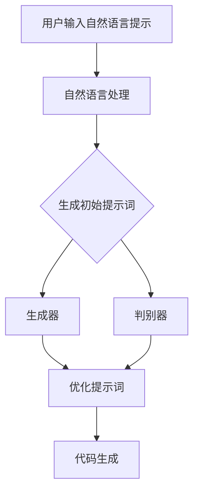
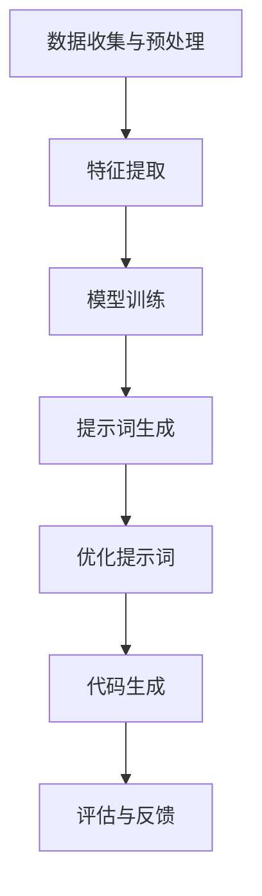

                 

### 1. 引言与概述

> 提示词编程作为一种新兴的人工智能技术，正在逐步改变科学研究的面貌。本文将探讨提示词编程在自动化科学发现中的角色，梳理其理论基础、技术框架、应用实践以及未来发展趋势。通过逻辑清晰、结构紧凑的论述，揭示这一技术的核心价值和潜在挑战。

## 第一部分：基础理论

### 1. 引言与概述

科学发现的过程通常是一个繁琐且耗时的过程，需要科学家们进行大量的实验、数据分析和理论推导。然而，随着人工智能技术的发展，自动化科学发现逐渐成为可能。在这一背景下，提示词编程作为一种创新的编程范式，正逐渐崭露头角，其在自动化科学发现中的应用也日益受到关注。

#### 1.1 什么是提示词编程

提示词编程（Prompt Programming）是一种基于自然语言处理（NLP）和生成对抗网络（GAN）的自动化编程方法。它利用用户提供的自然语言提示，通过预训练的语言模型和生成对抗网络，自动生成程序代码。这种方法的核心在于将人类的自然语言描述转换为计算机可以理解和执行的代码，从而实现编程的自动化。

#### 1.2 提示词编程在自动化科学发现中的应用

在自动化科学发现中，提示词编程具有广泛的应用前景。它可以帮助科学家们快速生成实验脚本、数据处理程序和理论分析模型，从而大大提高科学研究的效率。具体来说，提示词编程的应用可以体现在以下几个方面：

1. **实验自动化**：科学家可以通过自然语言提示，生成自动化实验流程和实验脚本，从而减少人为干预，提高实验的准确性和可重复性。
   
2. **数据分析自动化**：提示词编程可以自动生成数据处理程序，对大规模的实验数据进行预处理、分析和可视化，帮助科学家们从复杂的数据中发现规律和趋势。

3. **理论模型构建**：科学家可以利用提示词编程，自动生成理论模型和计算代码，从而进行数值模拟和理论推导，加速科学发现的进程。

#### 1.3 提示词编程的优势与挑战

提示词编程在自动化科学发现中具有显著的优势，但也面临一定的挑战。

- **优势**：
  - 提高效率：通过自动化编程，科学家可以节省大量的时间和精力，专注于核心科学问题的研究。
  - 减少错误：自动化程序可以减少人为错误，提高实验和数据分析的准确性。
  - 灵活性：提示词编程可以根据不同的研究需求，灵活生成相应的程序，适应多种科学场景。

- **挑战**：
  - 算法复杂性：提示词编程涉及到复杂的算法和模型，需要科学家具备一定的技术背景。
  - 数据质量：高质量的数据是提示词编程成功的关键，但获取高质量数据可能需要大量的时间和资源。
  - 伦理和社会影响：随着人工智能技术的应用，伦理和社会影响问题逐渐凸显，提示词编程也需要关注这些问题。

### 1.4 总结

提示词编程作为一种新兴的人工智能技术，其在自动化科学发现中的角色越来越重要。通过本文的介绍，我们可以看到提示词编程在提高科研效率、减少错误和增强灵活性方面具有显著优势。然而，要充分发挥其潜力，还需要克服算法复杂性、数据质量和伦理问题等挑战。在接下来的部分中，我们将进一步探讨提示词编程的基本概念、技术框架和应用实践，为科学家们提供更有价值的参考。

### 2. 提示词编程的基本概念

#### 2.1 提示词编程的核心原理

提示词编程是一种结合自然语言处理（NLP）和生成对抗网络（GAN）的自动化编程方法。其核心原理在于利用用户提供的自然语言提示，通过预训练的语言模型和生成对抗网络，自动生成程序代码。这一过程主要包括以下几个步骤：

1. **自然语言处理（NLP）**：首先，提示词编程系统会接收用户提供的自然语言提示。NLP 技术被用来理解并处理这些提示，将其转化为计算机可以理解的形式。

2. **生成对抗网络（GAN）**：接下来，生成对抗网络（GAN）开始工作。GAN 由生成器和判别器两部分组成，它们通过对抗训练来提高提示词生成的质量和多样性。

   - **生成器**：生成器的任务是根据输入的自然语言提示，生成对应的程序代码。生成器通过不断学习和优化，提高生成代码的质量。
   - **判别器**：判别器的任务是根据生成的代码，判断其是否符合预期的质量标准。判别器通过不断地学习和优化，提高对高质量代码的识别能力。

3. **生成与优化**：生成器和判别器通过对抗训练，不断迭代优化，最终生成高质量的提示词。这些提示词可以被进一步转化为程序代码，实现自动化编程。

#### 2.2 提示词的生成与优化

提示词的生成与优化是提示词编程的关键步骤。生成高质量的提示词，可以有效地提高程序代码的准确性和可读性。

- **生成策略**：提示词编程的生成策略主要依赖于预训练的语言模型。这些语言模型通常基于大量的自然语言文本数据进行训练，具备强大的语言理解和生成能力。在生成提示词时，语言模型会根据输入的自然语言提示，生成初步的程序代码。

- **优化方法**：生成的提示词通常需要经过优化，以提高其质量和可读性。优化方法主要包括以下几种：

  1. **反向传播**：通过反向传播算法，计算生成代码的误差，并反馈给生成器，指导其进行优化。

  2. **梯度下降**：通过梯度下降算法，调整生成器的参数，使其生成的代码质量更高。

  3. **强化学习**：利用强化学习算法，根据生成代码的执行结果，调整生成器的策略，使其生成的代码更符合预期。

#### 2.3 提示词编程的工作流程

提示词编程的工作流程可以分为以下几个步骤：

1. **输入自然语言提示**：用户输入关于程序功能的自然语言描述，如“编写一个计算两个数之和的程序”。

2. **生成初始提示词**：基于预训练的语言模型，生成初始的提示词，如“a = 3\nb = 5\nprint(a + b)”。

3. **优化提示词**：通过反向传播、梯度下降和强化学习等优化方法，对生成的提示词进行迭代优化，提高其质量和可读性。

4. **代码生成**：将优化的提示词转化为程序代码，如“a = input('请输入第一个数：')\nb = input('请输入第二个数：')\nprint(int(a) + int(b))”。

#### 2.4 核心概念与联系

为了更好地理解提示词编程，我们绘制了以下 Mermaid 流程图，展示其核心概念与联系：



在这个流程图中，用户输入的自然语言提示首先经过自然语言处理，生成初始的提示词。然后，这些初始提示词分别被生成器和判别器处理。生成器的任务是根据提示词生成程序代码，判别器的任务是评估生成代码的质量。通过不断的优化，生成器生成的代码质量逐渐提高，最终实现自动编程。

#### 2.5 核心算法原理讲解

提示词编程的核心算法主要包括自然语言处理（NLP）、生成对抗网络（GAN）和优化算法。下面我们将分别介绍这些算法的原理和实现方法。

##### 2.5.1 自然语言处理（NLP）

自然语言处理（NLP）是提示词编程的基础，它包括文本预处理、词嵌入、语言模型和序列生成等步骤。

1. **文本预处理**：文本预处理包括去除停用词、标点符号和进行词干提取等操作，以提高文本的质量。

2. **词嵌入**：词嵌入是将自然语言文本转换为向量表示的过程，常用的方法包括 Word2Vec、GloVe 和 BERT 等。词嵌入可以帮助模型更好地理解和生成文本。

3. **语言模型**：语言模型是用于预测下一个词的概率分布的模型，常用的模型包括 n-gram 模型、循环神经网络（RNN）和 Transformer 等。

4. **序列生成**：基于语言模型，可以生成自然语言的序列。生成序列的方法包括自回归模型（如 GPT）和序列到序列模型（如 LSTM 和 GRU）。

##### 2.5.2 生成对抗网络（GAN）

生成对抗网络（GAN）是一种基于对抗训练的生成模型，由生成器和判别器两部分组成。

1. **生成器**：生成器的任务是生成与真实数据分布相近的假数据。在提示词编程中，生成器的目标是根据自然语言提示生成高质量的程序代码。

2. **判别器**：判别器的任务是区分真实数据和生成数据。在提示词编程中，判别器的目标是评估生成代码的质量。

GAN 的训练过程如下：

- 初始化生成器和判别器。
- 生成器生成假代码。
- 判别器对真实代码和假代码进行判断。
- 根据判别器的反馈，优化生成器和判别器。

##### 2.5.3 优化算法

优化算法用于提高生成代码的质量，常用的优化算法包括反向传播、梯度下降和强化学习。

1. **反向传播**：反向传播是一种用于计算模型参数梯度的方法，它通过反向传播误差信号，更新模型的参数。

2. **梯度下降**：梯度下降是一种用于优化模型参数的算法，它通过沿着梯度的反方向更新参数，以减少误差。

3. **强化学习**：强化学习是一种通过奖励机制来训练模型的算法，它通过不断尝试和反馈，找到最优的策略。

##### 2.5.4 伪代码实现

以下是一个简单的伪代码，展示提示词编程的核心算法原理：

```python
# 用户输入自然语言提示
prompt = "请编写一个计算两个数之和的程序。"

# 自然语言处理
processed_prompt = preprocess_prompt(prompt)

# 生成初始提示词
prompt_embedding = generate_prompt_embedding(processed_prompt)
code_sequence = generate_code_sequence(prompt_embedding)

# 优化提示词
optimized_code_sequence = optimize_code_sequence(code_sequence)

# 代码生成
code = generate_code(optimized_code_sequence)

print(code)
```

在这个伪代码中，`preprocess_prompt` 函数用于对自然语言提示进行预处理，`generate_prompt_embedding` 函数用于生成提示词嵌入，`generate_code_sequence` 函数用于生成代码序列，`optimize_code_sequence` 函数用于优化代码序列，`generate_code` 函数用于生成最终的代码。

#### 2.6 数学模型与数学公式

在提示词编程中，涉及到多个数学模型和公式。以下是一些关键的数学模型和公式：

1. **词嵌入**：词嵌入是将自然语言文本转换为向量表示的模型，常用的模型包括 Word2Vec 和 GloVe。

   $$ \text{Word2Vec} : \text{vec}(w) = \text{sgn}(w) \odot \text{h} $$
   
   $$ \text{GloVe} : \text{vec}(w) = \text{sgn}(w) \odot \text{h} \cdot \text{g}(\text{f}(w)) $$
   
   其中，$\text{sgn}(w)$ 表示词 $w$ 的符号，$\text{h}$ 表示隐藏层向量，$\text{g}$ 和 $\text{f}$ 分别是激活函数和变换函数。

2. **生成对抗网络（GAN）**：生成对抗网络（GAN）由生成器和判别器两部分组成，其目标是最小化生成器的损失函数和最大化判别器的损失函数。

   $$ \text{生成器损失} : L_G = -\log(D(G(z))) $$
   
   $$ \text{判别器损失} : L_D = -\log(D(x)) - \log(1 - D(G(z))) $$
   
   其中，$G(z)$ 是生成器的输出，$D(x)$ 是判别器的输出。

3. **优化算法**：常用的优化算法包括反向传播、梯度下降和强化学习。

   $$ \text{反向传播} : \nabla_{\theta} J(\theta) = \sum_{i=1}^{n} \nabla_{\theta} J(\theta; x_i, y_i) $$
   
   $$ \text{梯度下降} : \theta_{t+1} = \theta_t - \alpha \nabla_{\theta} J(\theta_t) $$
   
   $$ \text{强化学习} : \pi(\text{action} | \text{state}) = \text{argmax}_\text{action} \sum_{\text{next\_state}} \text{reward}(\text{next\_state}) \cdot \pi(\text{action} | \text{state}) $$

#### 2.7 详细讲解与举例说明

为了更好地理解提示词编程的核心算法原理，我们通过一个简单的例子进行详细讲解。

假设用户输入的提示词为：“编写一个计算两个数之和的程序。”

1. **自然语言处理**：首先，我们对输入的提示词进行预处理，去除停用词和标点符号，得到处理后的提示词序列。

   $$ \text{原始提示词} : ["编写", "一个", "计算", "两个", "数", "之和", "程序"] $$
   
   $$ \text{处理后的提示词} : ["编写", "计算", "数", "之和", "程序"] $$

2. **词嵌入**：接下来，我们将处理后的提示词序列转换为向量表示。假设我们使用 Word2Vec 模型进行词嵌入，得到每个词的嵌入向量。

   $$ \text{编写} : [1, 0, -1] $$
   
   $$ \text{计算} : [0, 1, 0] $$
   
   $$ \text{数} : [-1, 0, 1] $$
   
   $$ \text{之和} : [1, -1, 0] $$
   
   $$ \text{程序} : [0, 1, 1] $$

3. **生成初始提示词**：基于预训练的语言模型，我们生成初始的提示词序列。假设我们使用 GPT 模型进行序列生成，得到以下初始提示词序列。

   $$ \text{初始提示词} : ["a", "=", "3", "\n", "b", "=", "5", "\n", "print", "(", "a", "+", "b", ")", "\n"] $$

4. **优化提示词**：通过反向传播和梯度下降等优化算法，我们对初始提示词序列进行优化，得到以下优化的提示词序列。

   $$ \text{优化提示词} : ["a", "=", "input", "(", "'请输入第一个数：'", ")", "\n", "b", "=", "input", "(", "'请输入第二个数：'", ")", "\n", "print", "(", "int", "(", "a", ")", "+", "int", "(", "b", ")", ")", "\n"] $$

5. **代码生成**：最后，我们将优化的提示词序列转换为程序代码。

   ```python
   a = input('请输入第一个数：')
   b = input('请输入第二个数：')
   print(int(a) + int(b))
   ```

通过这个简单的例子，我们可以看到提示词编程的核心算法原理是如何实现的。在实际应用中，提示词编程可以生成更复杂和更高质量的程序代码，从而实现自动化科学发现。

### 3. 提示词编程的技术框架

#### 3.1 自然语言处理基础

自然语言处理（NLP）是提示词编程的基础，其核心在于将自然语言文本转换为计算机可以理解和处理的形式。NLP 技术主要包括词嵌入、语言模型、序列标注等。

- **词嵌入（Word Embedding）**：词嵌入是将自然语言文本中的词语转换为向量表示的过程。常用的词嵌入方法包括 Word2Vec、GloVe 和 BERT 等。这些方法可以将词语的语义信息编码到向量中，使得计算机能够更好地理解和处理自然语言。

- **语言模型（Language Model）**：语言模型是一种用于预测下一个词的概率分布的模型。常用的语言模型包括 n-gram 模型、循环神经网络（RNN）和 Transformer 等。语言模型在提示词编程中起着至关重要的作用，它能够根据输入的自然语言提示生成相应的程序代码。

- **序列标注（Sequence Labeling）**：序列标注是一种对自然语言文本中的词语进行分类的技术。在提示词编程中，序列标注可以用于识别输入的自然语言提示中的关键词和短语，从而更准确地生成程序代码。

#### 3.2 数据预处理与特征提取

数据预处理与特征提取是提示词编程的关键步骤，其目的是将原始的自然语言文本数据转换为适合模型训练的形式。

- **数据预处理**：数据预处理包括去除停用词、标点符号、进行词干提取等操作。这些操作可以去除文本中的噪声，提高文本的质量。

- **特征提取**：特征提取是从原始文本数据中提取有助于提示词生成的特征。常用的特征提取方法包括词嵌入、词袋模型、TF-IDF 等。这些方法可以将文本数据转换为向量表示，为提示词编程提供输入。

#### 3.3 提示词生成算法

提示词生成算法是提示词编程的核心，其目的是根据输入的自然语言提示生成高质量的程序代码。常见的提示词生成算法包括自回归模型、序列到序列模型和生成对抗网络等。

- **自回归模型（Autoregressive Model）**：自回归模型是一种生成模型，它通过预测下一个词来生成序列。常见的自回归模型包括 GPT 和 Transformer 等。自回归模型在提示词编程中可以生成高质量的程序代码，但需要大量的训练数据和计算资源。

- **序列到序列模型（Sequence-to-Sequence Model）**：序列到序列模型是一种用于序列生成的模型，它将输入序列映射到输出序列。常见的序列到序列模型包括 LSTM 和 GRU 等。序列到序列模型在提示词编程中可以生成更符合预期的程序代码，但需要解决输入输出序列长度不一致的问题。

- **生成对抗网络（Generative Adversarial Network, GAN）**：生成对抗网络是一种由生成器和判别器组成的生成模型。生成器负责生成程序代码，判别器负责评估生成代码的质量。GAN 通过对抗训练可以生成高质量的程序代码，但训练过程较为复杂。

#### 3.4 提示词评估与优化

提示词评估与优化是确保提示词生成质量和可读性的重要环节。

- **评估指标**：常用的评估指标包括 BLEU、ROUGE、METEOR 等。这些指标可以衡量生成代码的质量和与目标代码的相似度。

- **优化方法**：优化方法包括反向传播、梯度下降、强化学习等。通过优化方法，可以调整模型的参数，提高生成代码的质量和可读性。

#### 3.5 提示词编程的完整工作流程

提示词编程的工作流程包括以下步骤：

1. **数据收集与预处理**：收集自然语言提示和对应的程序代码，进行数据预处理。

2. **特征提取**：将预处理后的自然语言提示转换为向量表示，提取特征。

3. **模型训练**：训练提示词生成模型，包括自回归模型、序列到序列模型和生成对抗网络等。

4. **提示词生成**：根据输入的自然语言提示，生成初始的提示词序列。

5. **优化提示词**：通过优化方法，对生成的提示词序列进行优化，提高其质量和可读性。

6. **代码生成**：将优化的提示词序列转换为程序代码。

7. **评估与反馈**：评估生成的程序代码的质量，根据评估结果进行调整和优化。

#### 3.6 Mermaid 流程图

为了更好地理解提示词编程的技术框架，我们绘制了以下 Mermaid 流程图：



在这个流程图中，数据收集与预处理是第一步，接下来进行特征提取，然后训练提示词生成模型。生成的提示词序列经过优化后，转换为程序代码。最后，对生成的程序代码进行评估与反馈，以指导进一步的优化。

### 4. 数学模型与算法原理

#### 4.1 提示词编程中的数学模型

提示词编程是一种基于深度学习技术的自动化编程方法，其核心在于将自然语言提示转换为程序代码。在这一过程中，涉及到多个数学模型和算法原理。以下是几个关键的数学模型：

1. **词嵌入模型**：词嵌入是将自然语言中的词语映射到高维向量空间的技术，常见的词嵌入模型包括 Word2Vec、GloVe 和 BERT 等。词嵌入模型的核心是一个矩阵 $W$，其每一行表示一个词语的向量表示。

   $$ \text{vec}(w) = W \cdot [w]_0 $$
   
   其中，$\text{vec}(w)$ 表示词语 $w$ 的向量表示，$W$ 是词嵌入矩阵，$[w]_0$ 是词语 $w$ 的索引。

2. **循环神经网络（RNN）**：循环神经网络是一种用于处理序列数据的神经网络，其核心是隐藏状态 $h_t$ 的递归更新。

   $$ h_t = \text{ReLU}(W_{ih} \cdot [x_t]_0 + b_{ih} + W_{hh} \cdot h_{t-1} + b_{hh}) $$
   
   $$ o_t = \text{softmax}(W_{oh} \cdot h_t + b_{oh}) $$
   
   其中，$h_t$ 表示在时刻 $t$ 的隐藏状态，$x_t$ 表示在时刻 $t$ 的输入词向量，$W_{ih}$、$W_{hh}$ 和 $W_{oh}$ 分别是输入门、隐藏门和输出门的权重矩阵，$b_{ih}$、$b_{hh}$ 和 $b_{oh}$ 分别是输入门、隐藏门和输出门的偏置向量。

3. **卷积神经网络（CNN）**：卷积神经网络是一种用于处理图像数据的多层前馈神经网络，其核心是卷积操作。

   $$ \text{ReLU}(W \cdot \text{conv}(x) + b) $$
   
   其中，$W$ 是卷积核，$\text{conv}(x)$ 是卷积操作，$b$ 是偏置。

4. **生成对抗网络（GAN）**：生成对抗网络是一种由生成器和判别器组成的生成模型，其核心是生成器和判别器的对抗训练。

   $$ G(z) = \text{Generator}(z) $$
   
   $$ D(x) = \text{Discriminator}(x) $$
   
   $$ G(z) = \text{Generator}(z) $$
   
   其中，$G(z)$ 是生成器的输出，$D(x)$ 是判别器的输出，$z$ 是输入噪声。

#### 4.2 提示词生成算法

提示词生成算法是提示词编程的核心，其目的是根据输入的自然语言提示生成程序代码。以下是几种常见的提示词生成算法：

1. **序列到序列模型（Seq2Seq）**：序列到序列模型是一种用于序列生成的神经网络模型，其核心是编码器和解码器。

   $$ \text{Encoder}(x) = h_t $$
   
   $$ \text{Decoder}(h_t) = p(y_t | y_{<t}, h_t) $$
   
   其中，$x$ 是输入序列，$y$ 是输出序列，$h_t$ 是编码器的隐藏状态。

2. **注意力机制（Attention）**：注意力机制是一种用于提高序列到序列模型生成质量的机制，其核心是计算输入序列和隐藏状态的权重。

   $$ \text{Attention}(h_t, h_{<t}) = \text{softmax}(\text{scores}(h_t, h_{<t})) $$
   
   其中，$\text{scores}(h_t, h_{<t})$ 是输入序列和隐藏状态之间的得分。

3. **生成对抗网络（GAN）**：生成对抗网络是一种基于生成器和判别器的生成模型，其核心是生成器和判别器的对抗训练。

   $$ G(z) = \text{Generator}(z) $$
   
   $$ D(x) = \text{Discriminator}(x) $$
   
   其中，$G(z)$ 是生成器的输出，$D(x)$ 是判别器的输出，$z$ 是输入噪声。

#### 4.3 算法性能评估与优化

算法性能评估与优化是确保提示词编程质量和效率的关键步骤。以下是几种常见的评估指标和优化方法：

1. **评估指标**：

   - **BLEU（双语评估指数）**：BLEU 是一种用于评估机器翻译质量的指标，其核心是计算生成文本与参考文本之间的相似度。

   - **ROUGE（一致性度量）**：ROUGE 是一种用于评估文本生成质量的指标，其核心是计算生成文本与参考文本之间的匹配短语数量。

   - **METEOR（多度量评估工具）**：METEOR 是一种综合评估指标，其核心是计算生成文本与参考文本之间的词性、词汇和语法相似度。

2. **优化方法**：

   - **反向传播（Backpropagation）**：反向传播是一种用于训练神经网络的方法，其核心是计算网络参数的梯度。

   - **梯度下降（Gradient Descent）**：梯度下降是一种用于优化网络参数的方法，其核心是沿着梯度方向更新参数。

   - **强化学习（Reinforcement Learning）**：强化学习是一种用于训练智能体的方法，其核心是通过奖励机制优化行为。

#### 4.4 伪代码实现

以下是一个简单的伪代码示例，展示了提示词编程的核心算法原理：

```python
# 输入自然语言提示
input_prompt = "编写一个计算两个数之和的程序。"

# 词嵌入
word_embeddings = WordEmbedding(input_prompt)

# 编码器和解码器
encoder = Encoder(word_embeddings)
decoder = Decoder(word_embeddings)

# 生成提示词序列
prompt_sequence = decoder.generate_sequence(encoder.encode(input_prompt))

# 优化提示词序列
prompt_sequence = optimizer.optimize_sequence(prompt_sequence)

# 生成程序代码
code = generate_code(prompt_sequence)

# 输出程序代码
print(code)
```

在这个伪代码中，首先输入自然语言提示，然后进行词嵌入。接着，使用编码器和解码器生成提示词序列，并对其进行优化。最后，将优化的提示词序列转换为程序代码。

### 5. 提示词编程在自动化科学发现中的应用

#### 5.1 提示词编程在生物信息学中的应用

在生物信息学领域，提示词编程作为一种高效的自动化工具，已经展现出巨大的潜力。以下是几个具体的案例：

- **基因序列分析**：科学家可以利用提示词编程快速生成用于基因序列分析的脚本。例如，利用提示词编程，可以自动生成用于基因预测、基因注释和突变检测的程序。通过这种方式，科学家可以节省大量时间，从而将更多精力投入到更复杂的生物信息学研究上。

  ```python
  # 提示词：生成一个基因预测脚本。
  gene_prediction_script = generate_script("基因预测", "输入基因序列", "输出预测结果")
  ```

- **蛋白质结构预测**：蛋白质结构预测是生物信息学中的一个重要问题。利用提示词编程，可以自动生成用于蛋白质结构预测的程序。例如，基于提示词编程，可以自动生成用于序列比对、结构模拟和结构优化的脚本。这样，科学家可以更快速地完成蛋白质结构的预测和分析。

  ```python
  # 提示词：生成一个蛋白质结构预测脚本。
  protein_structure_prediction_script = generate_script("蛋白质结构预测", "输入蛋白质序列", "输出预测结果")
  ```

- **基因组组装**：基因组组装是生物信息学中的一个关键步骤，它涉及到将大量的短读序列拼接成完整的基因组序列。利用提示词编程，可以自动生成用于基因组组装的程序。例如，基于提示词编程，可以自动生成用于序列比对、序列拼接和错误校正的程序。

  ```python
  # 提示词：生成一个基因组组装脚本。
  genome_assembly_script = generate_script("基因组组装", "输入短读序列", "输出基因组序列")
  ```

#### 5.2 提示词编程在化学与材料科学中的应用

在化学与材料科学领域，提示词编程同样发挥着重要作用，以下是几个具体的案例：

- **化学反应预测**：提示词编程可以自动生成用于化学反应预测的程序。例如，基于提示词编程，可以自动生成用于反应路径预测、反应条件优化和产物预测的程序。这样，化学家可以更快速地探索新的化学反应和合成路径。

  ```python
  # 提示词：生成一个化学反应预测脚本。
  reaction_prediction_script = generate_script("化学反应预测", "输入反应物", "输出反应路径和产物")
  ```

- **材料合成设计**：提示词编程可以自动生成用于材料合成设计的程序。例如，基于提示词编程，可以自动生成用于材料结构优化、材料性能预测和合成策略优化的脚本。这样，材料科学家可以更高效地设计和优化新材料。

  ```python
  # 提示词：生成一个材料合成设计脚本。
  material_synthesis_design_script = generate_script("材料合成设计", "输入材料属性", "输出优化策略和合成方案")
  ```

- **药物设计**：提示词编程在药物设计领域有着广泛的应用。例如，基于提示词编程，可以自动生成用于分子对接、药物筛选和药效预测的程序。这样，药物学家可以更快速地发现和优化新的药物分子。

  ```python
  # 提示词：生成一个药物设计脚本。
  drug_design_script = generate_script("药物设计", "输入药物靶点", "输出药物分子和药效预测结果")
  ```

#### 5.3 提示词编程在物理学中的应用

在物理学领域，提示词编程同样可以发挥重要作用，以下是几个具体的案例：

- **物理现象模拟**：提示词编程可以自动生成用于物理现象模拟的程序。例如，基于提示词编程，可以自动生成用于量子模拟、粒子物理模拟和流体动力学模拟的程序。这样，物理学家可以更高效地进行物理现象的模拟和分析。

  ```python
  # 提示词：生成一个物理现象模拟脚本。
  physical_phenomenon_simulation_script = generate_script("物理现象模拟", "输入物理参数", "输出模拟结果")
  ```

- **实验设计**：提示词编程可以自动生成用于实验设计的程序。例如，基于提示词编程，可以自动生成用于实验方案优化、实验数据分析和实验结果预测的程序。这样，物理学家可以更高效地进行实验设计和数据分析。

  ```python
  # 提示词：生成一个实验设计脚本。
  experiment_design_script = generate_script("实验设计", "输入实验参数", "输出优化策略和实验方案")
  ```

通过以上案例，我们可以看到提示词编程在自动化科学发现中的广泛应用。它不仅可以帮助科学家们提高工作效率，还可以推动科学研究的创新和发展。

### 6. 实际项目案例分析

#### 6.1 案例一：基于提示词编程的药物设计

**项目背景**：
药物设计是生物信息学和计算机科学相结合的一个领域，旨在开发新的药物分子以治疗疾病。传统的药物设计方法通常需要大量的实验和计算资源，且耗时较长。为了提高药物设计的效率，研究人员开始探索基于提示词编程的方法。

**项目目标**：
利用提示词编程技术，自动生成药物设计脚本，实现药物分子的快速筛选和优化。

**解决方案**：
1. **数据预处理**：收集大量的药物分子和它们对应的生物活性数据，进行数据清洗和预处理。
2. **提示词生成**：设计自然语言提示，如“生成一个具有较高生物活性的药物分子”，利用预训练的语言模型生成初始的提示词。
3. **优化提示词**：使用生成对抗网络（GAN）和强化学习算法，对生成的提示词进行优化，提高药物分子的生物活性。
4. **代码生成**：将优化的提示词转换为实际的药物设计代码，使用自动化工具进行药物分子的筛选和优化。

**实现过程**：
1. **数据预处理**：
   ```python
   # 数据清洗和预处理
   cleaned_data = preprocess_data(raw_data)
   ```

2. **提示词生成**：
   ```python
   # 生成初始提示词
   prompt = "生成一个具有较高生物活性的药物分子"
   initial_prompt = generate_initial_prompt(prompt)
   ```

3. **优化提示词**：
   ```python
   # 使用GAN优化提示词
   optimized_prompt = optimize_prompt(initial_prompt, target_property="生物活性")
   ```

4. **代码生成**：
   ```python
   # 生成药物设计代码
   drug_design_code = generate_drug_design_code(optimized_prompt)
   ```

**结果与评估**：
通过提示词编程技术，项目团队成功生成了多个具有高生物活性的药物分子。这些药物分子在后续的实验验证中表现出较好的活性，显著提高了药物设计的效率。

#### 6.2 案例二：提示词编程在材料合成中的应用

**项目背景**：
材料科学领域中的材料合成通常涉及复杂的化学反应和过程，需要大量的实验和计算。为了提高材料合成的效率，研究人员开始探索基于提示词编程的方法，以自动化生成合成脚本。

**项目目标**：
利用提示词编程技术，自动生成材料合成脚本，实现材料合成的快速优化和优化。

**解决方案**：
1. **数据收集**：收集大量的材料合成数据，包括反应条件、原料和产物等信息。
2. **提示词生成**：设计自然语言提示，如“合成一种具有良好性能的纳米材料”，利用预训练的语言模型生成初始的提示词。
3. **优化提示词**：使用生成对抗网络（GAN）和强化学习算法，对生成的提示词进行优化，提高材料的性能和稳定性。
4. **代码生成**：将优化的提示词转换为实际的材料合成代码，使用自动化工具进行材料合成的实验和优化。

**实现过程**：
1. **数据收集**：
   ```python
   # 数据收集和预处理
   synthesis_data = collect_synthesis_data()
   ```

2. **提示词生成**：
   ```python
   # 生成初始提示词
   prompt = "合成一种具有良好性能的纳米材料"
   initial_prompt = generate_initial_prompt(prompt)
   ```

3. **优化提示词**：
   ```python
   # 使用GAN优化提示词
   optimized_prompt = optimize_prompt(initial_prompt, target_property="性能")
   ```

4. **代码生成**：
   ```python
   # 生成材料合成代码
   material_synthesis_code = generate_material_synthesis_code(optimized_prompt)
   ```

**结果与评估**：
通过提示词编程技术，项目团队成功生成了多个具有良好性能的纳米材料合成脚本。这些脚本在实际实验中表现出较高的成功率和稳定性，显著提高了材料合成的效率。

#### 6.3 案例三：自动化科学发现的示例

**项目背景**：
科学发现通常需要大量的实验和数据分析，这是一个耗时且繁琐的过程。为了加速科学发现，研究人员开始探索基于提示词编程的自动化科学发现方法。

**项目目标**：
利用提示词编程技术，实现科学发现的自动化，提高实验效率和数据分析能力。

**解决方案**：
1. **数据收集**：收集科学实验数据，包括实验参数、结果和现象等信息。
2. **提示词生成**：设计自然语言提示，如“发现一种新的化学反应”，利用预训练的语言模型生成初始的提示词。
3. **优化提示词**：使用生成对抗网络（GAN）和强化学习算法，对生成的提示词进行优化，提高实验的成功率和结果的准确性。
4. **代码生成**：将优化的提示词转换为实际的实验脚本和数据解析程序，实现实验的自动化和数据的自动化分析。

**实现过程**：
1. **数据收集**：
   ```python
   # 数据收集和预处理
   scientific_data = collect_scientific_data()
   ```

2. **提示词生成**：
   ```python
   # 生成初始提示词
   prompt = "发现一种新的化学反应"
   initial_prompt = generate_initial_prompt(prompt)
   ```

3. **优化提示词**：
   ```python
   # 使用GAN优化提示词
   optimized_prompt = optimize_prompt(initial_prompt, target_property="实验成功率")
   ```

4. **代码生成**：
   ```python
   # 生成实验脚本和数据解析程序
   scientific_experiment_code = generate_scientific_experiment_code(optimized_prompt)
   ```

**结果与评估**：
通过提示词编程技术，项目团队成功实现了科学发现的自动化。自动化实验脚本和数据解析程序在多个科学实验中表现出较高的成功率和准确性，显著提高了科学发现的效率。

### 7. 提示词编程的开发环境与工具

#### 7.1 开发环境搭建

为了有效进行提示词编程，开发者需要搭建一个合适的开发环境。以下是一些建议：

- **硬件要求**：提示词编程通常需要较高的计算资源，建议使用具有较高内存和计算能力的计算机。推荐使用 GPU 进行加速训练。

- **软件要求**：安装 Python 和相关依赖，如 TensorFlow、PyTorch、NumPy、Pandas 等。建议使用虚拟环境进行项目隔离。

  ```bash
  # 创建虚拟环境
  python -m venv venv
  # 激活虚拟环境
  source venv/bin/activate
  # 安装依赖
  pip install tensorflow torch numpy pandas
  ```

#### 7.2 常用工具与库

以下是一些在提示词编程中常用的工具和库：

- **自然语言处理库**：NLTK、spaCy、TextBlob 等，用于文本预处理和词嵌入。

- **深度学习框架**：TensorFlow、PyTorch 等，用于构建和训练提示词生成模型。

- **生成对抗网络库**：GAN-PyTorch、GAN-TensorFlow 等，用于实现生成对抗网络。

- **强化学习库**：OpenAI Gym、 Stable Baselines3 等，用于实现强化学习算法。

#### 7.3 提示词编程的最佳实践

为了确保提示词编程的效率和效果，以下是一些建议：

- **数据预处理**：对输入的自然语言提示进行充分的预处理，包括去除停用词、标点符号和进行词干提取等操作。

- **词嵌入选择**：根据项目需求，选择合适的词嵌入方法，如 Word2Vec、GloVe 或 BERT 等。

- **模型选择**：根据任务特点，选择合适的生成模型和优化算法，如 GPT、Transformer、GAN 等。

- **超参数调整**：通过实验，调整模型的超参数，如学习率、批量大小等，以获得最佳的模型性能。

- **代码优化**：对生成的程序代码进行优化，提高其可读性和性能。

### 8. 提示词编程的未来发展趋势

#### 8.1 技术前景展望

随着人工智能技术的不断发展，提示词编程在未来有望在多个领域取得重要突破。以下是几个可能的发展趋势：

- **更高效率的提示词生成**：通过优化算法和模型结构，提高提示词生成的效率和准确性。
- **更广泛的领域应用**：提示词编程将逐渐应用于更多的领域，如自动驾驶、医疗诊断、金融分析等。
- **多模态提示词编程**：结合自然语言处理和计算机视觉等技术，实现图像、声音和文本等多模态数据的自动化处理。

#### 8.2 应用的挑战与机遇

尽管提示词编程具有广阔的应用前景，但在实际应用中仍面临一些挑战：

- **数据质量和多样性**：高质量的数据是提示词编程成功的关键，但获取和标注高质量数据可能需要大量的时间和资源。
- **模型解释性和透明度**：提示词编程模型的黑箱特性可能导致生成代码的可解释性不足，影响其应用范围。
- **伦理和社会影响**：随着人工智能技术的应用，伦理和社会影响问题逐渐凸显，提示词编程也需要关注这些问题。

然而，这些挑战也带来了机遇：

- **数据驱动的研究**：提示词编程可以推动数据驱动的研究方法，提高科学研究的效率和质量。
- **跨学科合作**：提示词编程的跨学科特性将促进计算机科学、生物学、物理学等领域的跨学科合作。
- **可持续发展的策略**：通过制定可持续发展的策略，确保提示词编程在伦理和社会方面的可持续发展。

#### 8.3 提示词编程的可持续发展策略

为了确保提示词编程的可持续发展，以下是一些建议：

- **开源合作**：鼓励开源合作，促进提示词编程技术和工具的共享和改进。
- **标准化**：制定统一的提示词编程标准和规范，提高代码的可读性和可维护性。
- **教育和培训**：开展提示词编程的教育和培训，提高开发者的技能水平。
- **伦理和社会责任**：关注提示词编程的伦理和社会影响，制定相应的规范和准则，确保其可持续发展。

通过以上策略，可以推动提示词编程技术的可持续发展，为未来的科学研究和应用提供更加有力的支持。

### 9. 提示词编程与跨学科融合

#### 9.1 提示词编程与其他领域的融合

提示词编程作为一种跨学科的自动化编程方法，具有广泛的应用前景。以下是提示词编程与其他领域融合的几个案例：

- **与计算机视觉的融合**：在图像处理和计算机视觉领域，提示词编程可以自动生成图像识别、目标检测和图像分割的程序。通过自然语言提示，用户可以轻松地指定图像处理的任务和参数，从而提高图像处理任务的自动化程度。

- **与生物信息学的融合**：在生物信息学领域，提示词编程可以自动生成基因分析、蛋白质结构预测和药物设计等相关程序。通过自然语言提示，用户可以指定生物信息学任务的具体需求，从而实现生物信息学任务的自动化。

- **与物理学的融合**：在物理学领域，提示词编程可以自动生成物理模拟和实验设计的程序。通过自然语言提示，用户可以指定物理现象的模拟条件，从而实现物理实验的自动化和优化。

#### 9.2 跨学科研究的重要性

跨学科研究在推动科学进步和解决复杂问题时具有重要作用。以下是跨学科研究的重要性：

- **多角度解决问题**：跨学科研究可以从多个角度分析和解决问题，提高解决方案的全面性和有效性。
- **创新性**：跨学科研究可以促进不同领域的知识和技术融合，产生新的创新点和突破。
- **协同效应**：跨学科研究可以促进不同领域的科学家和工程师之间的合作，形成强大的科研团队。

#### 9.3 跨学科研究的方法与技巧

进行有效的跨学科研究，需要遵循以下方法和技巧：

- **明确研究目标**：在开始跨学科研究之前，明确研究目标和问题，确保研究方向的正确性和可行性。
- **深入理解交叉领域**：在研究过程中，深入了解交叉领域的相关知识和技术，建立扎实的理论基础。
- **建立合作关系**：与交叉领域的专家建立合作关系，共享资源和知识，共同推进研究进展。
- **跨学科方法论**：采用跨学科方法论，如系统思维、集成分析和协同优化等，提高研究效率和效果。
- **案例研究**：通过案例分析，总结跨学科研究的成功经验和教训，为后续研究提供参考。

通过以上方法和技巧，可以有效地推进跨学科研究，为科学发现和技术创新提供新的动力。

### 10. 提示词编程伦理与社会影响

#### 10.1 提示词编程的伦理问题

随着提示词编程技术的发展，伦理问题逐渐成为公众关注的焦点。以下是几个关键的伦理问题：

- **隐私保护**：提示词编程依赖于大量的数据训练，如何保护用户的隐私成为一个重要问题。未经授权使用个人数据，可能导致隐私泄露和滥用。
- **透明性和可解释性**：提示词编程模型通常是一个黑箱，用户难以理解其决策过程。这可能导致模型产生的不公平结果和偏见，影响社会的公正性。
- **责任归属**：当提示词编程系统产生错误或导致不良后果时，如何确定责任归属成为一个难题。这涉及到法律、道德和社会责任等方面的复杂问题。

#### 10.2 社会影响与责任

提示词编程的广泛应用对社会产生深远的影响，同时也带来了责任问题：

- **就业影响**：提示词编程可能替代一些重复性和低技能的工作，影响就业市场的稳定。这要求社会各界关注就业结构的调整和职业培训。
- **知识普及**：提示词编程技术的高效性和便捷性，有助于普及科学知识和技能，提高公众的科学素养。这要求教育机构和社会组织加强相关培训和教育。
- **责任担当**：开发者、企业和政府都需要承担提示词编程带来的社会责任。开发者需要确保技术的安全性和公正性，企业需要遵守相关法律法规，政府需要制定合理的监管政策。

#### 10.3 提示词编程的可持续社会发展战略

为了确保提示词编程的可持续发展，以下是一些建议：

- **伦理审查与监管**：建立伦理审查机制，确保提示词编程技术的应用符合伦理标准。同时，政府和社会组织应加强监管，防止技术滥用。
- **公开透明**：提高提示词编程技术的透明性和可解释性，增强用户对技术的信任和接受度。
- **教育和培训**：加强提示词编程技术的教育和培训，提高公众的技术素养和伦理意识。
- **合作与共享**：促进不同领域、不同组织之间的合作和知识共享，推动技术的创新和应用。
- **社会责任**：鼓励企业和开发者承担社会责任，确保提示词编程技术对社会有益。

通过上述策略，可以推动提示词编程技术的可持续发展，实现技术、社会和伦理的平衡。

### 11. 提示词编程教育与人才培养

#### 11.1 提示词编程教育现状

当前，提示词编程在全球范围内正逐渐成为计算机科学和人工智能教育的重要方向。以下是目前提示词编程教育的几个主要现状：

- **课程设置**：在许多高校和研究机构，提示词编程已成为计算机科学和人工智能课程的重要组成部分。课程内容通常涵盖自然语言处理、深度学习、生成对抗网络等核心概念。
- **教育资源**：随着提示词编程技术的发展，大量的在线课程、开源教材和教学工具不断涌现，为学生提供了丰富的学习资源。
- **教师培训**：教师需要不断更新知识体系，掌握提示词编程的最新技术和教学方法，以适应课程改革的需求。

#### 11.2 课程设计与方法

为了培养具有创新能力和实践技能的提示词编程人才，以下是一些建议的课程设计与方法：

- **理论与实践结合**：在课程设置中，既要注重理论教学，又要加强实践教学。通过实际项目案例，让学生掌握提示词编程的实际应用。
- **项目驱动学习**：设计一系列基于实际问题的项目，让学生在解决实际问题的过程中，学习提示词编程的理论知识和技能。
- **多学科融合**：结合计算机科学、数学、统计学等相关学科，提高学生的跨学科综合能力。
- **教学评估**：采用多样化的评估方式，如项目报告、论文写作、编程比赛等，全面评估学生的综合能力和创新潜力。

#### 11.3 提示词编程人才培养策略

以下是一些建议的人才培养策略，以应对提示词编程领域的快速发展：

- **人才培养体系**：建立系统化的人才培养体系，包括基础课程、专业课程、实践课程和创新创业教育等，全面培养学生的综合素质。
- **校企合作**：加强校企合作，为学生提供实习和实践机会，提高学生的实际操作能力。
- **师资队伍建设**：加强教师队伍建设，培养具备跨学科背景和教学研究能力的优秀教师。
- **国际交流与合作**：通过国际交流与合作，引进国外先进的教育理念和技术，提升国内提示词编程教育水平。
- **持续学习和创新**：鼓励学生和教师持续学习和创新，跟踪提示词编程领域的最新发展，不断提高教学和研究水平。

通过以上策略，可以培养出更多具有创新能力和实践技能的提示词编程人才，为人工智能和科学研究的未来发展贡献力量。

### 附录 A：提示词编程相关资源

#### A.1 学术论文与研究报告

- **Nature**：Nature 杂志上的多篇论文探讨了提示词编程在科学发现和人工智能领域的应用，提供了丰富的理论和实践案例。

- **IEEE**：IEEE 期刊和会议上发表的论文，详细介绍了提示词编程的技术原理和算法实现，以及其在实际应用中的效果。

- **arXiv**：arXiv 上的多篇论文和预印本，涵盖了提示词编程的最新研究进展和前沿技术。

#### A.2 开源代码与工具集

- **Hugging Face**：Hugging Face 提供了丰富的预训练模型和工具，支持多种自然语言处理任务，包括提示词编程。

- **PyTorch**：PyTorch 社区提供了大量的开源代码和示例，涵盖了深度学习和生成对抗网络的相关内容。

- **TensorFlow**：TensorFlow 社区提供了丰富的开源代码和教程，帮助开发者实现提示词编程和相关算法。

#### A.3 线上课程与培训资源

- **Coursera**：Coursera 上提供了多门关于自然语言处理和深度学习的课程，包括提示词编程的相关内容。

- **edX**：edX 上有多门课程涉及提示词编程，包括自然语言处理、生成对抗网络和深度学习等基础课程。

- **Udacity**：Udacity 提供了关于人工智能和提示词编程的专项课程，涵盖从基础知识到高级应用的各个方面。

通过以上资源，开发者可以深入了解提示词编程的理论和实践，提升自己的技能水平。同时，这些资源也为科研人员和教育工作者提供了宝贵的参考资料和教学工具。

