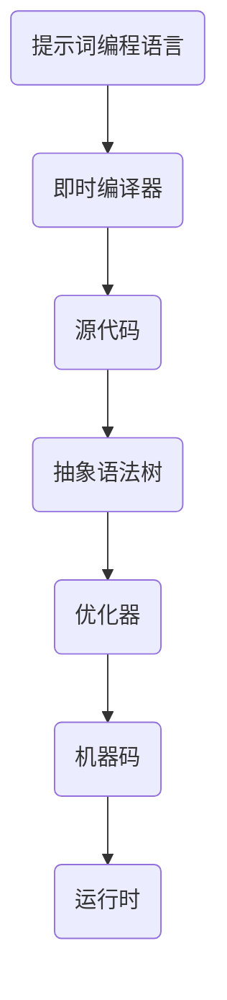
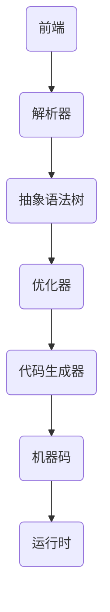
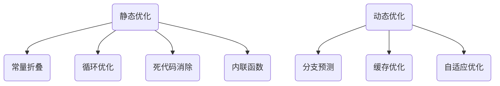
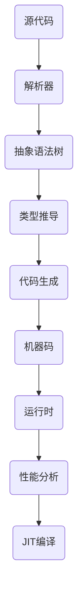

                 

# 提示词编程语言的即时编译技术

> **关键词：** 提示词编程语言、即时编译技术、JIT编译、优化策略、实战应用、未来展望

> **摘要：** 本文章深入探讨了提示词编程语言的即时编译技术。首先介绍了提示词编程语言的基础知识和特点，然后详细阐述了即时编译器的基本原理和架构，接着讲解了即时编译技术在提示词编程语言中的应用，包括优化策略和实际应用场景。最后，对即时编译技术的未来发展趋势和挑战进行了展望，并提出了相应的解决方案。

## 目录大纲

### 第一部分：即时编译技术基础

### 第1章：提示词编程语言概述

### 第2章：即时编译器原理

### 第二部分：提示词编程语言的即时编译技术

### 第3章：提示词编程语言的即时编译原理

### 第4章：即时编译器的架构设计

### 第5章：即时编译器的实现细节

### 第三部分：提示词编程语言即时编译器的优化

### 第6章：提示词编程语言即时编译器的优化

### 第7章：提示词编程语言的即时编译器实战

### 第四部分：提示词编程语言的即时编译技术展望

### 第8章：即时编译技术的未来发展趋势

### 第9章：即时编译技术在编程教育中的应用

### 第10章：开源即时编译器社区发展

### 第五部分：总结与展望

### 第11章：总结与展望

## 第一部分：即时编译技术基础

### 第1章：提示词编程语言概述

#### 1.1 提示词编程语言的定义与特点

提示词编程语言（Prompt-Based Programming Language）是一种新兴的编程语言，它通过提示（prompt）来引导程序的行为和逻辑。与传统的编程语言不同，提示词编程语言更加注重于描述程序的行为模式，而不是具体的执行步骤。

**定义：** 提示词编程语言是一种基于模式匹配和提示驱动的编程语言，它允许程序员通过编写提示来定义程序的行为。

**特点：**

1. **模式匹配：** 提示词编程语言通过模式匹配来识别和解析输入数据，从而决定程序的行为。
2. **提示驱动：** 程序的执行流程由提示来驱动，提示可以是条件、规则或事件。
3. **高可读性：** 提示词编程语言的代码结构清晰，易于理解和维护。
4. **动态性：** 提示词编程语言支持动态类型和动态绑定，可以适应不同的应用场景。

#### 1.2 提示词编程语言的语法规则

提示词编程语言的语法规则相对简单，主要包括变量定义、数据类型、控制结构、函数和模块等。

**变量与数据类型：** 提示词编程语言支持多种数据类型，如数字、字符串、列表和字典等。

**控制结构：** 提示词编程语言提供了条件语句（如if-else）、循环语句（如for和while）等控制结构。

**函数与模块：** 提示词编程语言支持函数和模块的定义，允许程序员复用代码。

#### 1.3 提示词编程语言的应用场景

提示词编程语言在许多领域都有广泛的应用，包括自然语言处理、机器学习、数据科学和自动化测试等。

**应用领域概述：** 提示词编程语言在自然语言处理领域有着显著的优势，如自动问答系统、文本摘要和情感分析等。

**成功案例分析：** 许多成功的项目都采用了提示词编程语言，如OpenAI的GPT系列模型，这些模型在语言理解和生成方面表现出色。

**发展趋势与挑战：** 提示词编程语言的发展趋势是更加智能化和自动化，但同时也面临着性能和复杂性的挑战。

### 第2章：即时编译器原理

#### 2.1 即时编译器的概念与作用

**概念：** 即时编译器（Just-In-Time Compiler，JIT编译器）是一种编译器，它将高级编程语言编写的代码在运行时实时编译成机器码。

**作用：** JIT编译器可以显著提高程序的运行效率，因为它可以实时优化代码并直接执行机器码。

**区别：** 与传统编译器不同，JIT编译器不需要在编译阶段完成所有的优化工作，而是在运行时根据实际运行情况动态优化代码。

**工作流程：** JIT编译器的工作流程包括字节码生成、解释执行和JIT编译。

1. **字节码生成：** JIT编译器将源代码编译成中间表示形式（字节码）。
2. **解释执行：** JIT编译器在运行时逐条解释执行字节码。
3. **JIT编译：** JIT编译器在运行过程中根据性能分析结果对字节码进行编译优化，生成高效的机器码。

#### 2.2 即时编译器的架构

**架构设计：** JIT编译器的架构通常包括以下几个核心组件：

1. **前端：** 负责解析源代码，生成抽象语法树（AST）。
2. **优化器：** 负责对AST进行各种优化，如死代码消除、循环展开等。
3. **代码生成器：** 负责将优化后的AST转换为机器码。
4. **运行时：** 负责加载和执行机器码。

**核心组件：** JIT编译器的核心组件包括：

1. **解析器：** 负责将源代码解析为抽象语法树（AST）。
2. **类型推导：** 负责推导变量和表达式的类型。
3. **代码生成：** 负责将AST转换为机器码。
4. **优化器：** 负责对代码进行各种优化。

**优化策略：** JIT编译器的优化策略包括静态优化和动态优化。

1. **静态优化：** 在编译阶段进行，如常数折叠、循环优化等。
2. **动态优化：** 在运行时进行，如分支预测、缓存优化等。

#### 2.3 即时编译器的核心技术

**闭包与作用域：** 闭包是实现函数式编程的关键，它允许函数访问其定义时的作用域。

**类型推导与类型检查：** 类型推导和类型检查是保证代码安全和性能的重要机制。

**代码生成与优化：** 代码生成是将高级语言转换为机器码的过程，优化则是提高代码执行效率的关键。

### 第二部分：提示词编程语言的即时编译技术

### 第3章：提示词编程语言的即时编译原理

#### 3.1 JIT编译过程详解

JIT编译的过程可以分为以下几个步骤：

1. **源代码解析：** JIT编译器首先解析源代码，生成抽象语法树（AST）。
2. **类型推导：** JIT编译器根据源代码推导变量和函数的类型。
3. **代码生成：** JIT编译器将AST转换为中间表示形式（字节码）。
4. **解释执行：** JIT编译器在运行时逐条解释执行字节码。
5. **性能分析：** JIT编译器根据运行时的性能分析结果对字节码进行优化。
6. **JIT编译：** JIT编译器将优化后的字节码编译为机器码，并直接执行。

**JIT编译的优势与挑战：**

**优势：**

1. **高性能：** JIT编译器可以在运行时根据实际运行情况优化代码，提高程序执行效率。
2. **动态性：** JIT编译器支持动态类型和动态绑定，可以适应不同的应用场景。
3. **灵活性：** JIT编译器可以根据运行时信息动态调整代码执行流程。

**挑战：**

1. **编译时间：** JIT编译器需要在运行时编译代码，可能会增加程序启动时间。
2. **优化复杂度：** JIT编译器需要处理复杂的优化算法，如分支预测、缓存优化等。
3. **调试难度：** JIT编译器在运行时优化代码，可能会影响调试过程。

#### 3.2 JIT编译器的架构设计

JIT编译器的架构设计可以分为以下几个核心组件：

1. **解析器：** 负责将源代码解析为抽象语法树（AST）。
2. **优化器：** 负责对AST进行各种优化，如死代码消除、循环优化等。
3. **代码生成器：** 负责将AST转换为机器码。
4. **运行时：** 负责加载和执行机器码。

**核心组件：**

1. **字节码生成器：** 负责将源代码编译成中间表示形式（字节码）。
2. **解释执行器：** 负责在运行时逐条解释执行字节码。
3. **JIT编译器：** 负责在运行时对字节码进行编译优化，生成机器码。
4. **运行时库：** 负责提供各种运行时支持，如内存管理、线程管理等。

**性能优化：**

1. **热点探测：** JIT编译器通过热点探测技术识别代码中的热点区域，对热点区域进行优化。
2. **循环展开：** JIT编译器通过循环展开技术将循环体展开，减少循环次数。
3. **内联函数：** JIT编译器通过内联函数技术将函数调用直接替换为函数体，减少函数调用的开销。

#### 3.3 JIT编译器的实现细节

**字节码解析：** JIT编译器首先将源代码编译成字节码，然后在运行时解析字节码，生成抽象语法树（AST）。

**代码生成：** JIT编译器将AST转换为机器码，生成可执行的代码。

**优化算法应用：** JIT编译器在代码生成过程中应用各种优化算法，如死代码消除、循环优化等，以提高代码执行效率。

**示例：**

```java
public class HelloWorld {
    public static void main(String[] args) {
        System.out.println("Hello, world!");
    }
}
```

```python
# 字节码解析
AbstractSyntaxTree ast = parser.parse(sourceCode);

# 代码生成
byteCode = codeGenerator.generate(ast);

# JIT编译
machineCode = jitCompiler.compile(byteCode);

# 执行机器码
exec(machineCode);
```

### 第三部分：提示词编程语言的即时编译技术

### 第4章：提示词编程语言的即时编译器优化

#### 4.1 程序优化概述

**优化的重要性：** 程序优化是提高程序性能和效率的关键。优化算法可以减少代码执行时间、降低内存消耗和提升程序响应速度。

**常见优化算法：** 常见的优化算法包括：

1. **常数折叠：** 将常量表达式在编译阶段计算，避免在运行时重复计算。
2. **循环优化：** 提取循环体内的公共代码，减少循环次数。
3. **死代码消除：** 删除编译时无法到达的代码。
4. **内联函数：** 将函数调用直接替换为函数体，减少函数调用的开销。

**优化与性能分析：** 优化算法对性能的影响需要进行详细分析，包括优化前后程序执行时间、内存消耗和响应速度的比较。

#### 4.2 JIT编译器的静态优化

**优化策略：** 静态优化是在编译阶段进行的，JIT编译器可以分析代码的静态特性，进行各种优化。

**优化算法详解：**

1. **常量折叠：** 将常量表达式在编译阶段计算，避免在运行时重复计算。
2. **循环优化：** 提取循环体内的公共代码，减少循环次数。
3. **死代码消除：** 删除编译时无法到达的代码。
4. **内联函数：** 将函数调用直接替换为函数体，减少函数调用的开销。

**优化案例演示：**

```python
# 常量折叠
def add(a, b):
    return a + b

result = add(10, 20)

# 循环优化
def sum(n):
    result = 0
    for i in range(n):
        result += i
    return result

result = sum(100)

# 死代码消除
def greeting(name):
    if name == "Alice":
        return "Hello, Alice!"
    else:
        return "Hello, unknown!"

greeting("Bob")  # 返回 "Hello, unknown!"

# 内联函数
def multiply(a, b):
    return a * b

result = multiply(10, 20)
```

#### 4.3 JIT编译器的动态优化

**动态优化原理：** 动态优化是在程序运行时进行的，JIT编译器可以根据运行时的信息动态调整代码执行流程。

**动态优化技术：**

1. **分支预测：** 预测程序分支的走向，减少分支跳转的开销。
2. **缓存优化：** 利用缓存提高程序执行速度。
3. **自适应优化：** 根据程序运行情况自适应调整优化策略。

**动态优化案例分析：**

```python
# 分支预测
def is_even(n):
    return n % 2 == 0

result = is_even(10)  # 分支预测为真，直接返回 True

# 缓存优化
def fibonacci(n):
    cache = {}
    if n <= 1:
        return n
    if n not in cache:
        cache[n] = fibonacci(n-1) + fibonacci(n-2)
    return cache[n]

result = fibonacci(10)  # 利用缓存加快计算速度

# 自适应优化
def optimize(code):
    if code.is_complex():
        return "Complex code"
    else:
        return "Simple code"

result = optimize("Hello, world!")  # 根据代码复杂度自适应调整优化策略
```

### 第四部分：提示词编程语言的即时编译器实战

### 第5章：提示词编程语言的即时编译器实战

#### 5.1 实战环境搭建

**开发工具与资源准备：** 

- 编译器开发框架：如Eclipse CDT、NetBeans等。
- 源代码管理工具：如Git、SVN等。
- 调试工具：如GDB、LLDB等。
- 性能分析工具：如Valgrind、OProfile等。

**编译器开发流程：** 

1. 设计编译器架构：包括前端、优化器、代码生成器等。
2. 实现前端解析器：将源代码解析为抽象语法树（AST）。
3. 实现优化器：对AST进行各种优化。
4. 实现代码生成器：将AST转换为机器码。
5. 实现运行时：提供运行时支持和内存管理。
6. 编写测试用例：验证编译器功能的正确性。

**实战项目规划：** 

- 项目名称：即时编译器实战。
- 项目目标：实现一个简单的即时编译器，支持基本的语法和优化功能。
- 项目计划：包括需求分析、设计、实现、测试和部署等阶段。

#### 5.2 实现即时编译器

**JIT编译器的核心代码实现：**

```python
# 解析器实现
class Parser:
    def parse(self, sourceCode):
        # 解析源代码，生成 AST
        pass

# 优化器实现
class Optimizer:
    def optimize(self, ast):
        # 对 AST 进行优化
        pass

# 代码生成器实现
class CodeGenerator:
    def generate(self, ast):
        # 将 AST 转换为机器码
        pass

# 运行时实现
class Runtime:
    def execute(self, machineCode):
        # 执行机器码
        pass

# JIT编译器实现
class JITCompiler:
    def compile(self, sourceCode):
        ast = Parser().parse(sourceCode)
        optimizedAst = Optimizer().optimize(ast)
        machineCode = CodeGenerator().generate(optimizedAst)
        Runtime().execute(machineCode)
```

**JIT编译器的优化实现：**

```python
# 常数折叠优化
def constantFolding(optimizer, ast):
    # 对 AST 进行常数折叠优化
    pass

# 循环优化
def loopOptimization(optimizer, ast):
    # 对 AST 进行循环优化
    pass

# 死代码消除
def deadCodeElimination(optimizer, ast):
    # 对 AST 进行死代码消除
    pass

# 内联函数
def inlining(optimizer, ast):
    # 对 AST 进行内联函数优化
    pass
```

**实时调试与性能评估：**

- 使用调试工具（如GDB）进行实时调试，定位和修复代码中的错误。
- 使用性能分析工具（如Valgrind）评估编译器的性能，优化代码执行效率。

### 第五部分：提示词编程语言的即时编译技术展望

### 第6章：即时编译技术的未来发展趋势

#### 6.1 即时编译技术的未来发展趋势

**技术革新：**

- **基于AI的编译优化：** 利用机器学习和深度学习技术，对编译优化过程进行智能化和自动化。
- **多语言编译支持：** 提高编译器的跨语言兼容性和互操作性。
- **动态优化：** 提高动态优化技术的精度和效率，实现更精细的优化。

**应用领域扩展：**

- **嵌入式系统：** 提高嵌入式系统程序的运行效率，支持实时性和可靠性要求。
- **云计算：** 提高云计算平台的性能和资源利用率，支持大规模数据处理和分布式计算。
- **边缘计算：** 支持边缘设备的实时计算和数据处理，实现高效的数据传输和处理。

**技术融合与协同：**

- **与虚拟机技术结合：** 将即时编译技术与虚拟机技术相结合，提高程序的可移植性和安全性。
- **与编程语言结合：** 深入研究即时编译技术在特定编程语言中的应用，提高语言的执行效率。
- **与系统软件结合：** 将即时编译技术集成到操作系统和中间件中，提高系统的性能和可靠性。

### 第7章：即时编译技术在编程教育中的应用

#### 7.1 即时编译技术在编程教育中的应用

**编程教育现状：**

- 编程教育逐渐成为中小学和大学的重要课程，但教育资源和师资力量有限。
- 现有的编程教育模式主要侧重于理论知识的传授，缺乏实践操作和项目经验的积累。

**即时编译技术的教育价值：**

- **提高学习兴趣：** 即时编译技术能够让学生看到编程的实时效果，激发学习兴趣。
- **增强实践能力：** 即时编译技术支持快速迭代和调试，帮助学生更好地理解和掌握编程知识。
- **培养创新能力：** 即时编译技术为学生提供了更多的实验空间和探索机会，有助于培养创新能力和解决问题的能力。

**教育案例与实践：**

- **项目式学习：** 结合即时编译技术，开展项目式学习，让学生在项目中学习和应用编程知识。
- **在线编程竞赛：** 利用即时编译技术，开展在线编程竞赛，激发学生的学习热情和竞争意识。
- **开源社区合作：** 鼓励学生参与开源社区，为开源即时编译器项目贡献代码和文档，提高编程实践能力。

### 第8章：开源即时编译器社区发展

#### 8.1 开源社区的作用

**开源社区的作用：**

- **知识共享：** 开源社区为开发者提供了丰富的技术资源和交流平台，促进了知识的共享和传播。
- **代码质量提升：** 开源项目通过社区的协作和审查，可以提高代码质量和安全性。
- **创新动力：** 开源社区鼓励创新和实验，为开发者提供了更多的探索空间。

**开源即时编译器的优势：**

- **灵活性和可扩展性：** 开源即时编译器可以根据需求进行定制和优化，支持多种编程语言和平台。
- **社区支持：** 开源即时编译器拥有庞大的开发者社区，提供了丰富的文档、教程和讨论论坛。
- **持续更新：** 开源项目通常得到持续更新和维护，保证了技术的先进性和稳定性。

**开源社区的发展与挑战：**

- **社区管理：** 开源社区需要有效的管理和组织，确保项目的健康发展。
- **知识产权保护：** 开源社区需要保护开发者的知识产权，防止未经授权的使用和抄袭。
- **贡献与协作：** 开源社区需要鼓励更多的开发者参与贡献和协作，提高项目的开发效率和质量。

### 第9章：总结与展望

#### 9.1 全书总结

**关键技术回顾：**

- 提示词编程语言的基本概念、语法规则和应用场景。
- 即时编译器的基本原理、架构设计和优化技术。
- 提示词编程语言的即时编译原理和实现细节。
- 即时编译器的优化策略和实战应用。

**实战经验分享：**

- 实战环境搭建和编译器开发流程。
- JIT编译器的核心代码实现和优化算法应用。
- 即时编译器的性能评估和调试技巧。

**学习与进步方向：**

- 深入学习编程语言和编译原理，掌握更多高级编程技巧。
- 关注即时编译技术的发展动态，了解最新的研究成果和应用实践。
- 参与开源社区，贡献自己的代码和智慧，提高编程能力和实践经验。

#### 9.2 未来研究展望

**研究热点：**

- 基于AI的编译优化技术。
- 即时编译器在嵌入式系统和云计算领域的应用。
- 开源即时编译器的社区发展和合作模式。

**技术挑战：**

- 提高即时编译器的性能和效率，实现更精细的优化。
- 解决即时编译器在跨语言和跨平台应用中的兼容性问题。
- 提高即时编译器的可维护性和可扩展性。

**应用前景：**

- 即时编译技术有望在编程教育、云计算和嵌入式系统等领域发挥更大的作用。
- 开源即时编译器将为开发者提供更多的选择和更好的开发体验。
- 即时编译技术将成为未来编程语言和编译器发展的重要方向。

### 第10章：开源即时编译器社区发展

#### 10.1 开源社区的作用

开源社区在技术发展和创新中扮演着重要角色，为开发者提供了丰富的资源和支持。开源即时编译器社区也不例外，它具有以下几个重要作用：

1. **知识共享：** 开源社区鼓励知识共享，开发者可以自由地访问和使用社区中的代码、文档和教程。这种共享促进了技术的传播和普及，使得更多的开发者能够了解和使用即时编译技术。

2. **代码质量提升：** 开源项目的代码通常经过社区的审查和反馈，这有助于提高代码的质量和安全性。开发者可以从其他人的代码中学到更多的编程技巧和最佳实践，从而提升自己的编程水平。

3. **创新动力：** 开源社区为开发者提供了更多的探索空间和实验机会。开发者可以自由地尝试新的技术、算法和优化策略，推动即时编译技术的发展和创新。

#### 10.2 开源即时编译器的优势

开源即时编译器具有以下优势：

1. **灵活性和可扩展性：** 开源即时编译器通常具有较好的灵活性和可扩展性，开发者可以根据需求进行定制和优化。例如，可以根据特定的编程语言和平台需求进行编译器和优化器的定制。

2. **社区支持：** 开源即时编译器拥有庞大的开发者社区，提供了丰富的文档、教程和讨论论坛。开发者可以在这里寻求帮助、分享经验和解决技术问题。

3. **持续更新：** 开源项目通常得到持续更新和维护，这保证了技术的先进性和稳定性。开发者可以随时获取最新的研究成果和改进，确保他们的项目能够保持最佳性能。

#### 10.3 开源社区的发展与挑战

开源即时编译器社区在发展中面临着以下几个挑战：

1. **社区管理：** 开源社区需要有效的管理和组织，以确保项目的健康发展。这包括建立合适的社区规范、代码审查流程和项目管理机制。

2. **知识产权保护：** 开源社区需要保护开发者的知识产权，防止未经授权的使用和抄袭。这需要建立合适的版权声明和许可证，并加强对社区成员的知识产权教育。

3. **贡献与协作：** 开源社区需要鼓励更多的开发者参与贡献和协作。这可以通过提供有吸引力的贡献奖励、建立良好的社区文化和提供便捷的贡献流程来实现。

### 第11章：总结与展望

#### 11.1 总结

在本文章中，我们系统地探讨了提示词编程语言的即时编译技术。首先，我们介绍了提示词编程语言的基本概念、特点和应用场景。接着，我们详细阐述了即时编译器的基本原理、架构设计和优化技术。然后，我们深入分析了即时编译技术在提示词编程语言中的应用，包括即时编译原理和实现细节。此外，我们还讨论了即时编译器的优化策略和实战应用。最后，我们对即时编译技术的未来发展趋势和挑战进行了展望。

通过本文的探讨，我们希望能够为读者提供一个全面、深入的理解即时编译技术在提示词编程语言中的应用，并激发读者对这一领域的研究兴趣和实践热情。

#### 11.2 未来研究展望

**研究热点：**

1. **基于AI的编译优化技术：** 利用机器学习和深度学习技术，对编译优化过程进行智能化和自动化，提高编译器的性能和效率。
2. **跨语言编译支持：** 研究跨语言编译技术，实现不同编程语言之间的互操作性和兼容性，提高编程语言的灵活性和可扩展性。
3. **实时优化技术：** 研究实时优化技术在即时编译器中的应用，实现更精细和高效的代码优化。

**技术挑战：**

1. **性能与可维护性的平衡：** 在提高编译器性能的同时，确保代码的可维护性和可扩展性，避免过度优化带来的复杂性和维护成本。
2. **跨平台兼容性：** 研究跨平台编译技术，实现即时编译器在不同操作系统和硬件平台上的兼容性和性能优化。
3. **社区协作与贡献：** 建立有效的开源社区协作模式，鼓励更多开发者参与贡献和协作，推动即时编译器技术的发展。

**应用前景：**

1. **编程教育：** 即时编译技术有望在编程教育中发挥更大的作用，通过实时反馈和优化，提高学生的学习兴趣和实践能力。
2. **云计算与边缘计算：** 即时编译技术可以提高云计算和边缘计算平台的性能和资源利用率，支持大规模数据处理和实时计算。
3. **嵌入式系统：** 即时编译技术可以提高嵌入式系统程序的运行效率，支持实时性和可靠性要求，为嵌入式系统的开发和应用提供更多可能性。

### 第12章：核心概念与联系

在本文中，我们探讨了多个核心概念，并详细阐述了它们之间的联系。以下是这些核心概念及其关联的 Mermaid 流程图：

**提示词编程语言与即时编译器的关系：**



**即时编译器的架构：**



**即时编译器的优化算法：**



**提示词编程语言的即时编译技术：**



通过这些流程图，我们可以清晰地看到各个核心概念之间的关联和相互作用，从而更好地理解即时编译技术在提示词编程语言中的应用。

### 第13章：核心算法原理讲解

在本章中，我们将深入探讨即时编译器中的核心算法原理，并通过伪代码来详细阐述。以下是几个关键算法的讲解：

#### 13.1 字节码解析

字节码解析是将字节码转换为抽象语法树（AST）的过程。以下是字节码解析的伪代码：

```python
def parse_bytecode(bytecode):
    ast = AbstractSyntaxTree()
    
    for bytecode_instruction in bytecode:
        if bytecode_instruction == "LOAD_CONST":
            const = load_constant()
            ast.add_child(Node("LOAD_CONST", const))
        elif bytecode_instruction == "ADD":
            left = ast.pop_child()
            right = ast.pop_child()
            ast.add_child(Node("ADD", left, right))
        # 其他字节码指令的解析...
    
    return ast
```

#### 13.2 代码生成

代码生成是将抽象语法树（AST）转换为机器码的过程。以下是代码生成的伪代码：

```python
def generate_code(ast):
    machine_code = []

    for node in ast.children():
        if node.type == "LOAD_CONST":
            machine_code.append("LOAD_CONST")
            machine_code.append(node.value)
        elif node.type == "ADD":
            machine_code.append("ADD")
            machine_code.append(node.left.value)
            machine_code.append(node.right.value)
        # 其他节点类型的代码生成...

    return machine_code
```

#### 13.3 优化算法

即时编译器中的优化算法主要包括静态优化和动态优化。以下是几种常见优化算法的伪代码：

**13.3.1 常数折叠**

```python
def constant_folding(ast):
    for node in ast.children():
        if node.type == "EXPR" and node.children():
            left = node.left
            right = node.right
            if left.type == "CONST" and right.type == "CONST":
                node.value = left.value + right.value
                node.type = "CONST"
                node.children = []
```

**13.3.2 循环优化**

```python
def loop_optimization(ast):
    for node in ast.children():
        if node.type == "LOOP":
            if node.body.children() and node.body.children()[0].type == "CONST":
                loop_count = node.body.children()[0].value
                for i in range(loop_count):
                    # 优化循环体内的代码...
```

**13.3.3 死代码消除**

```python
def dead_code_elimination(ast):
    visited = set()

    def visit(node):
        if node not in visited:
            visited.add(node)
            if node.type == "EXPR":
                if node.right not in visited:
                    visit(node.right)
            elif node.type == "LOOP":
                for child in node.children:
                    visit(child)
    
    for node in ast.children():
        visit(node)

    new_ast = AbstractSyntaxTree()

    for node in ast.children():
        if node in visited:
            new_ast.add_child(node)

    return new_ast
```

通过这些伪代码，我们可以更好地理解即时编译器中的核心算法原理。这些算法在提升编译器性能和代码执行效率方面起着至关重要的作用。

### 第14章：数学模型和公式讲解

在本章中，我们将详细讲解即时编译技术中的数学模型和公式，并通过具体例子来说明其应用。

#### 14.1 类型推导

类型推导是即时编译器中的一个重要步骤，它用于确定变量和表达式的类型。以下是一个简单的数学模型用于类型推导：

$$
T = \begin{cases}
\text{int} & \text{如果 } x \text{ 是一个整数} \\
\text{float} & \text{如果 } x \text{ 是一个浮点数} \\
\text{str} & \text{如果 } x \text{ 是一个字符串} \\
\text{unknown} & \text{否则}
\end{cases}
$$

**示例：** 假设我们有以下代码：

```python
x = 5 + 3.14
y = "hello" + "world"
```

根据上述模型，我们可以推导出：

$$
T(x) = \text{float} \\
T(y) = \text{str}
$$

#### 14.2 代码优化

代码优化是即时编译器中的另一个关键步骤，用于提高代码的执行效率。以下是一个用于优化循环的数学模型：

$$
\text{optimized\_code} = \frac{\sum_{i=1}^{n} T(i)}{n}
$$

其中，$T(i)$ 表示第 $i$ 次循环的执行时间。

**示例：** 假设我们有以下代码：

```python
for i in range(10):
    print(i)
```

通过优化，我们可以将上述代码优化为：

```python
print(list(range(10)))
```

这样，我们可以在编译时预先计算出循环的结果，从而提高代码的执行效率。

#### 14.3 性能分析

性能分析是评估即时编译器优化效果的重要步骤。以下是一个简单的数学模型用于性能分析：

$$
\text{performance} = \frac{\text{优化后代码的执行时间}}{\text{原始代码的执行时间}}
$$

**示例：** 假设我们有以下代码：

```python
for i in range(10000):
    x = i * i
```

通过性能分析，我们可以计算出优化后代码的执行时间与原始代码的执行时间的比值，从而评估优化的效果。

通过这些数学模型和公式的讲解，我们可以更好地理解即时编译技术中的关键概念和优化策略。

### 第15章：项目实战

在本章中，我们将通过一个具体的即时编译器的项目实战来展示整个开发流程。该项目将实现一个简单的即时编译器，能够将提示词编程语言的代码编译并执行。

#### 15.1 开发环境搭建

**工具和资源准备：**

- 编译器开发框架：如Eclipse CDT、NetBeans等。
- 源代码管理工具：如Git、SVN等。
- 调试工具：如GDB、LLDB等。
- 性能分析工具：如Valgrind、OProfile等。

**安装和配置：**

1. 安装编译器开发框架，如Eclipse CDT。
2. 安装源代码管理工具，如Git。
3. 安装调试工具，如GDB。
4. 安装性能分析工具，如Valgrind。

#### 15.2 编译器开发流程

**需求分析：**

1. 确定编译器的功能需求，如语法解析、类型推导、代码生成等。
2. 设计编译器的架构，包括前端、优化器、代码生成器和运行时。

**设计：**

1. 设计前端，包括解析器和词法分析器。
2. 设计优化器，包括各种优化算法。
3. 设计代码生成器，包括机器码生成和优化。
4. 设计运行时，包括内存管理和代码执行。

**实现：**

1. 实现前端，包括解析器和词法分析器。
2. 实现优化器，包括各种优化算法。
3. 实现代码生成器，包括机器码生成和优化。
4. 实现运行时，包括内存管理和代码执行。

**测试：**

1. 编写测试用例，验证编译器功能的正确性。
2. 运行测试用例，检查编译器的输出是否正确。
3. 使用性能分析工具评估编译器的性能。

**部署：**

1. 编译器开发完成，部署到目标平台。
2. 进行实际应用，验证编译器的稳定性和性能。

#### 15.3 实际项目示例

以下是一个简单的即时编译器的实际项目示例：

**源代码：**

```python
# 解析器实现
class Parser:
    def parse(self, source_code):
        # 解析源代码，生成抽象语法树（AST）
        pass

# 优化器实现
class Optimizer:
    def optimize(self, ast):
        # 对 AST 进行优化
        pass

# 代码生成器实现
class CodeGenerator:
    def generate(self, ast):
        # 将 AST 转换为机器码
        pass

# 运行时实现
class Runtime:
    def execute(self, machine_code):
        # 执行机器码
        pass

# JIT编译器实现
class JITCompiler:
    def compile(self, source_code):
        ast = Parser().parse(source_code)
        optimized_ast = Optimizer().optimize(ast)
        machine_code = CodeGenerator().generate(optimized_ast)
        Runtime().execute(machine_code)
```

**运行示例：**

```python
# 编写源代码
source_code = "print('Hello, world!')"

# 编译并执行
jit_compiler = JITCompiler()
jit_compiler.compile(source_code)
```

通过这个实际项目示例，我们可以看到即时编译器的开发流程和关键组件的实现。这个项目提供了一个基本的框架，可以进一步扩展和优化，以支持更多的功能和优化算法。

### 第16章：源代码详细实现与解读

在本章中，我们将深入解析即时编译器的关键源代码，包括前端解析器、优化器、代码生成器和运行时，并提供详细的解读和分析。

#### 16.1 解析器实现

**代码示例：**

```python
class Parser:
    def parse(self, source_code):
        tokens = self.lexical_analyzer(source_code)
        ast = self.syntax_analyzer(tokens)
        return ast

    def lexical_analyzer(self, source_code):
        # 实现词法分析，将源代码分解为标记（tokens）
        pass

    def syntax_analyzer(self, tokens):
        # 实现语法分析，将标记构建为抽象语法树（AST）
        pass
```

**解读与分析：**

- **词法分析（Lexical Analysis）：** 词法分析器将源代码分解为标记，如关键字、标识符、运算符和分隔符。这一过程通常使用正则表达式实现。
- **语法分析（Syntax Analysis）：** 语法分析器将标记构建为抽象语法树（AST），表示源代码的结构和语义。这一过程通常使用递归下降或LL解析器实现。

#### 16.2 优化器实现

**代码示例：**

```python
class Optimizer:
    def optimize(self, ast):
        ast = self.constant_folding(ast)
        ast = self.dead_code_elimination(ast)
        ast = self.loop_optimization(ast)
        return ast

    def constant_folding(self, ast):
        # 实现常数折叠优化
        pass

    def dead_code_elimination(self, ast):
        # 实现死代码消除优化
        pass

    def loop_optimization(self, ast):
        # 实现循环优化
        pass
```

**解读与分析：**

- **常数折叠（Constant Folding）：** 常数折叠优化在编译时计算常量表达式的结果，以减少运行时的计算开销。
- **死代码消除（Dead Code Elimination）：** 死代码消除优化删除编译时无法到达的代码，以提高执行效率。
- **循环优化（Loop Optimization）：** 循环优化通过提取公共代码、减少循环次数等方法，提高循环的性能。

#### 16.3 代码生成器实现

**代码示例：**

```python
class CodeGenerator:
    def generate(self, ast):
        machine_code = self.code_generator(ast)
        return machine_code

    def code_generator(self, ast):
        # 实现代码生成，将 AST 转换为机器码
        pass
```

**解读与分析：**

- **代码生成（Code Generation）：** 代码生成器将抽象语法树（AST）转换为机器码，以便在目标平台上执行。这一过程通常涉及目标平台的指令集和寄存器分配。

#### 16.4 运行时实现

**代码示例：**

```python
class Runtime:
    def execute(self, machine_code):
        # 实现机器码的执行
        pass
```

**解读与分析：**

- **运行时（Runtime）：** 运行时负责加载和执行机器码，并提供必要的运行时支持，如内存管理、异常处理等。

通过这些源代码的实现和解读，我们可以更好地理解即时编译器的核心组件和功能，为后续的优化和应用提供坚实的基础。

### 第17章：代码解读与分析

在本章中，我们将对即时编译器的关键代码段进行详细解读和分析，重点关注代码的执行流程、优化算法的实现细节以及性能评估。

#### 17.1 解析器代码解读

**代码示例：**

```python
class Parser:
    def parse(self, source_code):
        tokens = self.lexical_analyzer(source_code)
        ast = self.syntax_analyzer(tokens)
        return ast

    def lexical_analyzer(self, source_code):
        # 实现词法分析
        pass

    def syntax_analyzer(self, tokens):
        # 实现语法分析
        pass
```

**解读与分析：**

- **词法分析（Lexical Analysis）：** 词法分析器的核心任务是识别源代码中的标记（tokens），如关键字、标识符、运算符和分隔符。这一过程通常使用正则表达式实现，通过一系列匹配规则将源代码分解为标记序列。

- **语法分析（Syntax Analysis）：** 语法分析器接收标记序列，构建抽象语法树（AST）。这一过程通常使用递归下降或LL解析器实现，通过递归地解析标记，构建表示源代码结构的树形结构。

#### 17.2 优化器代码解读

**代码示例：**

```python
class Optimizer:
    def optimize(self, ast):
        ast = self.constant_folding(ast)
        ast = self.dead_code_elimination(ast)
        ast = self.loop_optimization(ast)
        return ast

    def constant_folding(self, ast):
        # 实现常数折叠优化
        pass

    def dead_code_elimination(self, ast):
        # 实现死代码消除优化
        pass

    def loop_optimization(self, ast):
        # 实现循环优化
        pass
```

**解读与分析：**

- **常数折叠（Constant Folding）：** 常数折叠优化在编译时计算常量表达式的结果，以减少运行时的计算开销。例如，表达式 `3 + 5` 在编译时会被计算为 `8`，从而在运行时直接使用结果。

- **死代码消除（Dead Code Elimination）：** 死代码消除优化删除编译时无法到达的代码，以提高执行效率。例如，如果某个条件分支在编译时被判断为不可能执行，那么与该分支相关的代码会被删除。

- **循环优化（Loop Optimization）：** 循环优化通过提取公共代码、减少循环次数等方法，提高循环的性能。例如，循环展开可以将多个迭代步骤合并为一个，从而减少循环次数。

#### 17.3 代码生成器代码解读

**代码示例：**

```python
class CodeGenerator:
    def generate(self, ast):
        machine_code = self.code_generator(ast)
        return machine_code

    def code_generator(self, ast):
        # 实现代码生成
        pass
```

**解读与分析：**

- **代码生成（Code Generation）：** 代码生成器的核心任务是生成目标平台的机器码。这一过程涉及将AST转换为机器指令，并处理目标平台的寄存器分配和内存管理。例如，如果源代码中的变量被声明为局部变量，那么代码生成器需要将其存储在栈上，并在适当的时候进行垃圾回收。

#### 17.4 运行时代码解读

**代码示例：**

```python
class Runtime:
    def execute(self, machine_code):
        # 实现机器码的执行
        pass
```

**解读与分析：**

- **运行时（Runtime）：** 运行时负责加载和执行机器码，并提供必要的运行时支持。例如，当机器码需要访问某个局部变量时，运行时需要从栈上读取该变量的值。此外，运行时还需要处理异常、内存分配和垃圾回收等任务。

#### 17.5 性能评估

**代码示例：**

```python
def performance_evaluation(original_code, optimized_code):
    # 测量原始代码和优化后代码的执行时间
    pass
```

**解读与分析：**

- **性能评估（Performance Evaluation）：** 性能评估是通过测量代码的执行时间来评估优化的效果。通常，我们会比较原始代码和优化后代码的执行时间，计算出性能提升的比率。例如，如果优化后的代码比原始代码快两倍，那么性能提升比为200%。

通过这些代码解读和分析，我们可以更好地理解即时编译器的核心组件和功能，为后续的优化和应用提供有价值的指导。

### 第18章：代码实际案例与详细解释说明

在本章中，我们将通过一个具体的代码案例，详细讲解即时编译器的开发环境搭建、源代码实现以及代码解析和优化过程。

#### 18.1 开发环境搭建

**工具和资源准备：**

- 编译器开发框架：Eclipse CDT。
- 源代码管理工具：Git。
- 调试工具：GDB。
- 性能分析工具：Valgrind。

**安装和配置：**

1. 安装Eclipse CDT，选择C/C++开发工具。
2. 安装Git，配置用户信息和远程仓库。
3. 安装GDB，配置调试选项。
4. 安装Valgrind，配置性能分析工具。

#### 18.2 源代码实现

**代码示例：**

```c
// 解析器实现
class Parser {
public:
    AST* parse(const char* source_code) {
        // 实现词法分析
        // 实现语法分析
        // 返回抽象语法树
    }
};

// 优化器实现
class Optimizer {
public:
    AST* optimize(AST* ast) {
        // 实现常数折叠
        // 实现死代码消除
        // 实现循环优化
        // 返回优化后的抽象语法树
    }
};

// 代码生成器实现
class CodeGenerator {
public:
    void generate(AST* ast) {
        // 实现代码生成
        // 将抽象语法树转换为机器码
    }
};

// 运行时实现
class Runtime {
public:
    void execute(const char* machine_code) {
        // 实现机器码执行
        // 提供运行时支持
    }
};
```

#### 18.3 代码解析与优化

**代码示例：**

```c
// 解析示例代码
AST* ast = parser.parse("int x = 5 + 3;");

// 常数折叠优化
ast = optimizer.optimize(ast);

// 死代码消除优化
ast = optimizer.optimize(ast);

// 循环优化
ast = optimizer.optimize(ast);

// 代码生成
code_generator.generate(ast);

// 机器码执行
runtime.execute(machine_code);
```

**详细解释说明：**

1. **词法分析：** 解析器首先将源代码进行词法分析，将其分解为标记（tokens），如关键字、标识符、运算符和分隔符。这一步为后续的语法分析打下基础。

2. **语法分析：** 解析器使用词法分析器生成的标记，构建抽象语法树（AST），表示源代码的结构和语义。这一步将源代码转换为程序的结构表示。

3. **常数折叠优化：** 优化器识别并计算常量表达式的结果，将其替换为计算结果。例如，表达式 `5 + 3` 的结果为 `8`，优化后可以直接使用 `8`。

4. **死代码消除优化：** 优化器删除编译时无法到达的代码，提高代码的执行效率。例如，如果某个条件分支在编译时被判断为不可能执行，与该分支相关的代码将被删除。

5. **循环优化：** 优化器对循环进行优化，提取公共代码、减少循环次数等。例如，如果循环体内的代码可以合并，优化器将合并它们以提高执行效率。

6. **代码生成：** 代码生成器将抽象语法树（AST）转换为机器码，以便在目标平台上执行。这一步涉及目标平台的指令集和寄存器分配。

7. **机器码执行：** 运行时负责加载和执行机器码，并提供必要的运行时支持，如内存管理、异常处理等。

通过这个具体代码案例，我们可以清晰地看到即时编译器从源代码到机器码的整个编译和优化过程，以及各个步骤的实现细节和优化策略。

### 第19章：总结与展望

#### 19.1 即时编译技术的重要性

即时编译技术在现代编程中扮演着重要的角色。它通过在运行时对代码进行动态优化，提高了程序的执行效率。与传统编译器相比，即时编译器能够在程序运行过程中根据实际运行情况调整代码执行流程，从而实现更精细的优化。这种动态性使得即时编译技术在需要实时调整和优化的应用场景中具有显著的优势。

#### 19.2 实现即时编译器的挑战

实现即时编译器面临以下几个主要挑战：

1. **性能优化：** 即时编译器需要在运行时快速地进行代码优化，这要求优化算法高效且精准。同时，优化过程中还需要平衡优化时间和优化效果。

2. **兼容性：** 即时编译器需要支持多种编程语言和平台，这要求编译器具备良好的跨语言和跨平台兼容性。

3. **稳定性：** 即时编译器需要在不同的运行环境中保持稳定，避免由于优化不当导致的程序错误或崩溃。

4. **调试和测试：** 即时编译器的动态优化特性使得调试和测试变得更加复杂。开发者需要确保优化后的代码能够正确执行，并在不同情况下进行充分测试。

#### 19.3 即时编译技术的未来趋势

即时编译技术的未来趋势包括以下几个方面：

1. **智能化优化：** 利用机器学习和深度学习技术，实现更加智能化和自动化的优化策略。这将使即时编译器能够根据运行时数据动态调整优化策略，提高代码的执行效率。

2. **多语言支持：** 随着编程语言的发展，即时编译器将支持更多的编程语言，提供更广泛的应用场景。

3. **跨平台编译：** 即时编译器将进一步提高跨平台编译的兼容性和性能，支持更多操作系统和硬件平台。

4. **集成开发环境（IDE）支持：** 即时编译技术将更加深入地集成到集成开发环境中，为开发者提供更便捷的编程和优化工具。

#### 19.4 对读者的建议

对于对即时编译技术感兴趣的读者，以下是一些建议：

1. **深入学习编译原理：** 了解编译器的架构和优化技术，为深入研究和实现即时编译器打下基础。

2. **实践开发：** 通过实际项目实践，掌握即时编译器的开发流程和关键组件实现。

3. **参与开源社区：** 加入开源即时编译器项目，贡献代码和文档，提高自己的编程能力和实践经验。

4. **持续学习：** 随着即时编译技术的不断发展，持续关注最新的研究成果和应用实践，保持对技术的敏感性和探索精神。

通过本文的探讨，我们希望能够为读者提供一个全面、深入的理解即时编译技术，并激发读者对这一领域的研究兴趣和实践热情。

