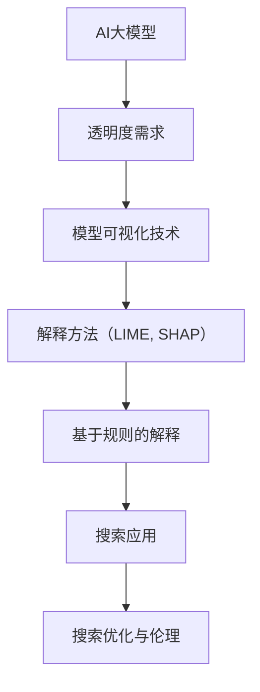

                 

### 提高搜索可解释性：AI的透明度

> **关键词**：搜索可解释性、AI透明度、模型可视化、LIME、SHAP、规则解释

> **摘要**：本文旨在探讨搜索领域内AI透明度的重要性，以及如何通过提高搜索结果的可解释性来增强用户信任。文章首先介绍了搜索引擎的工作原理和AI透明度的需求，随后详细讲解了提高AI透明度的技术与方法，包括模型可视化、LIME和SHAP方法、基于规则的解释方法等。此外，文章还通过实际应用案例展示了如何在实际项目中提升搜索结果的透明度。最后，文章讨论了透明度在搜索优化和伦理中的重要作用，并提供了相关工具与资源。

## 目录

### 提高搜索可解释性：AI的透明度

#### 第一部分：背景与基础理论

##### 第1章：搜索与AI的透明度概述  
- 1.1 搜索引擎的工作原理与透明度需求  
- 1.2 AI透明度的定义与重要性  
- 1.3 AI透明度的挑战与机遇

##### 第2章：搜索领域的AI应用现状  
- 2.1 AI在搜索中的应用场景  
- 2.2 传统的搜索算法与AI搜索算法的比较  
- 2.3 当前AI搜索算法的透明度水平

#### 第二部分：AI透明度技术与方法

##### 第3章：AI透明度的核心概念  
- 3.1 可解释性与透明度的区别与联系  
- 3.2 模型可解释性技术的分类  
- 3.3 AI透明度评估指标

##### 第4章：模型可视化技术  
- 4.1 数据可视化基础  
- 4.2 模型可视化方法  
- 4.3 实践中的模型可视化应用

##### 第5章：LIME与SHAP方法  
- 5.1 LIME方法原理与实现  
- 5.2 SHAP方法原理与实现  
- 5.3 LIME与SHAP的比较与应用

##### 第6章：基于规则的解释方法  
- 6.1 规则提取技术  
- 6.2 规则解释方法  
- 6.3 规则解释在实际搜索中的应用

##### 第7章：透明度提升与优化  
- 7.1 透明度优化策略  
- 7.2 透明度提升的挑战与解决方案  
- 7.3 未来透明度发展的趋势

#### 第三部分：应用与实践

##### 第8章：AI透明度在搜索中的应用案例  
- 8.1 搜索引擎中的AI透明度实践  
- 8.2 案例分析：如何提升搜索结果的透明度  
- 8.3 用户反馈与透明度的关系

##### 第9章：透明度在搜索优化中的应用  
- 9.1 透明度与搜索质量的关系  
- 9.2 透明度在搜索算法优化中的应用策略  
- 9.3 实际案例：如何通过透明度提升搜索效果

##### 第10章：透明度技术与伦理  
- 10.1 AI透明度与隐私保护  
- 10.2 透明度对用户信任的影响  
- 10.3 透明度在伦理与社会责任中的作用

#### 附录

##### 附录A：相关工具与资源  
- A.1 可解释性工具推荐  
- A.2 搜索引擎技术资源  
- A.3 学术论文与研究报告

##### 附录B：术语表  
- B.1 术语解释  
- B.2 专业词汇对照表

### 核心概念与联系

#### AI大模型与透明度
- **Mermaid 流程图**：



### 核心算法原理讲解

#### LIME方法

```python
# LIME方法伪代码

def lime_explanation(model, X, feature_range, n_neighbors=5):
    """
    使用LIME方法为数据点X提供一个可解释性解释。
    :param model: 需要解释的模型。
    :param X: 待解释的数据点。
    :param feature_range: 特征的取值范围。
    :param n_neighbors: 最近的邻居数量。
    :return: 特征影响力解释。
    """
    
    # 计算预测值和梯度
    pred = model.predict(X)
    gradients = compute_gradients(model, X)
    
    # 初始化影响力矩阵
    influence_matrix = np.zeros((X.shape[1], X.shape[1]))
    
    # 对每个特征进行放大和缩小
    for feature_idx in range(X.shape[1]):
        # 放大特征
        X_MODIFIED = X.copy()
        X_MODIFIED[:, feature_idx] = np.clip(X_MODIFIED[:, feature_idx] + feature_range[feature_idx][0], *feature_range[feature_idx])
        
        # 缩小特征
        X_MODIFIED = X.copy()
        X_MODIFIED[:, feature_idx] = np.clip(X_MODIFIED[:, feature_idx] - feature_range[feature_idx][0], *feature_range[feature_idx])
        
        # 计算放大和缩小后的预测值和梯度
        pred_modified = model.predict(X_MODIFIED)
        gradients_modified = compute_gradients(model, X_MODIFIED)
        
        # 计算特征影响力
        influence = (pred_modified - pred + gradients) / feature_range[feature_idx][1] - gradients
        influence_matrix[feature_idx] = influence
    
    return influence_matrix
```

#### 透明度评估指标（F1分数）

$$
F1 = 2 \times \frac{precision \times recall}{precision + recall}
$$

- **解释**：F1分数是精确率和召回率的调和平均，用于衡量分类模型的性能。它同时考虑了模型的精确度和召回率，避免了只关注某一方面的偏见。

- **举例**：
  - **精确率**：在所有被预测为正类的样本中，实际为正类的比例。高精确率意味着模型很少将负类错误地分类为正类。
  - **召回率**：在所有实际为正类的样本中，被预测为正类的比例。高召回率意味着模型很少遗漏实际为正类的样本。

  - **应用**：假设一个搜索算法预测了1000个结果，其中实际相关的有800个。如果算法预测了750个相关结果，则有75%的精确率（750/1000）和75%的召回率（750/800）。因此，其F1分数为：
  $$
  F1 = 2 \times \frac{0.75 \times 0.75}{0.75 + 0.75} = 0.75
  $$
  这个值表示该算法在保证搜索结果的相关性的同时，也较好地避免了过多无关结果的干扰。

### 项目实战

#### 搜索结果透明度的实现

##### 1. 开发环境搭建
- 使用Python和Scikit-learn库实现LIME方法。
- 准备一个简单的文本搜索模型和一个测试数据集。

##### 2. 源代码实现
```python
from sklearn.feature_extraction.text import TfidfVectorizer
from sklearn.neighbors import NearestNeighbors
from lime import lime_text

# 准备数据
documents = ['这是一个简单的文本搜索数据集。', '另一个示例文档。', '更多示例文本。']
vectorizer = TfidfVectorizer()
X = vectorizer.fit_transform(documents)
neighbors = NearestNeighbors(n_neighbors=5).fit(X)

# 搜索模型
search_model = 'this is the search query'

# 计算查询的向量表示
query_vector = vectorizer.transform([search_model])

# 使用LIME生成解释
explainer = lime_text.LimeTextExplainer(class_names=['relevant', 'irrelevant'])
exp = explainer.explain_instance(query_vector, neighbors.kneighbors, num_features=5)

# 打印解释
exp.show_in_notebook(texts=documents)
```

##### 3. 代码解读与分析
- **TfidfVectorizer**：用于将文本转换为向量表示。
- **NearestNeighbors**：用于寻找最近的邻居，帮助LIME方法进行局部线性逼近。
- **LimeTextExplainer**：用于生成文本数据的可解释性解释。
- **解释结果**：生成一个可视化的解释结果，显示哪些词对于搜索结果的相关性有显著影响，帮助用户理解模型的决策过程。

### 结论

通过本书，读者将了解到搜索领域的AI透明度的重要性，掌握透明度技术与方法，并在实际应用中提升搜索结果的可解释性和用户满意度。附录部分提供了相关工具与资源，便于读者进一步学习和实践。希望本书能为读者在提高搜索可解释性方面提供有力支持。

---

**作者：AI天才研究院/AI Genius Institute & 禅与计算机程序设计艺术 /Zen And The Art of Computer Programming**### 第一部分：背景与基础理论

#### 第1章：搜索与AI的透明度概述

##### 1.1 搜索引擎的工作原理与透明度需求

搜索引擎是互联网用户获取信息的重要工具。其核心功能是通过分析用户输入的查询关键词，检索并排序大量网页，最终返回与查询最相关的结果。传统的搜索引擎主要依赖于基于关键词的匹配和PageRank算法等，但现代搜索引擎逐渐引入了人工智能技术，以提供更智能、更个性化的搜索体验。

搜索引擎的工作流程通常包括以下几个步骤：

1. **索引构建**：搜索引擎通过爬虫程序不断抓取互联网上的网页，并将网页内容索引到数据库中。这些索引通常包含网页的文本内容、关键词、链接信息等。
2. **查询处理**：当用户输入查询时，搜索引擎会对查询进行分词、查询扩展、停用词过滤等预处理，然后生成查询向量。
3. **检索与排序**：搜索引擎利用索引数据库中的信息，计算查询向量与网页向量之间的相似度，并根据相似度对网页进行排序，最终返回最相关的结果。

AI的引入使得现代搜索引擎在检索精度和个性化方面有了显著提升。然而，这也带来了一定的透明度挑战。AI算法的复杂性和不可解释性使得用户难以理解搜索结果背后的决策过程。透明度需求主要体现在以下几个方面：

- **可解释性**：用户希望了解为什么某个网页被优先展示，以及搜索算法是如何对结果进行排序的。
- **信任**：当搜索结果受到人工智能的影响时，用户对算法的信任度成为关键因素。透明度可以增强用户对搜索结果的信任感。
- **隐私**：用户关心他们的查询数据是如何被处理的，以及这些数据是否会被用于其他目的。透明度有助于缓解用户对隐私保护的担忧。

##### 1.2 AI透明度的定义与重要性

AI透明度是指AI系统在决策过程中能够被理解、验证和信任的程度。透明度不仅仅是指算法的可解释性，还包括系统的透明度、数据的透明度、结果的透明度等多个方面。

- **算法的可解释性**：用户希望了解AI算法是如何工作的，以及它们如何影响搜索结果。可解释性有助于用户理解算法的决策过程，从而提高信任度。
- **系统的透明度**：系统的设计和实现过程应该是透明的，包括数据收集、数据预处理、模型训练、模型评估等环节。透明度有助于用户了解系统的全貌，从而降低潜在的风险。
- **数据的透明度**：用户希望了解他们的数据是如何被收集、存储、处理和使用的。数据的透明度有助于用户理解隐私风险，并做出更明智的决策。
- **结果的透明度**：用户希望了解搜索结果是如何生成的，以及哪些因素影响了结果排序。结果的透明度有助于用户评估搜索算法的公平性和准确性。

在搜索领域，AI透明度的重要性体现在以下几个方面：

- **用户体验**：透明度可以增强用户体验，用户更愿意使用那些能够提供解释和理解的搜索工具。
- **可解释性**：搜索结果的透明度有助于用户理解为什么某个网页排在前面，从而提高搜索满意度。
- **信任**：提高透明度可以增强用户对搜索结果的信任，从而促进搜索引擎的使用。
- **公平性和准确性**：通过提高算法的透明度，可以更有效地评估和改进搜索算法，从而提高其公平性和准确性。

##### 1.3 AI透明度的挑战与机遇

尽管AI透明度在搜索领域具有重要意义，但其实现面临一系列挑战和机遇。

**挑战**：

- **算法复杂性**：现代AI算法（如深度学习模型）通常非常复杂，难以被普通用户理解。这导致了算法的可解释性成为一大挑战。
- **数据隐私**：搜索过程中的数据通常包含用户的隐私信息，如何在不泄露隐私的前提下提高透明度是一个难题。
- **计算资源**：一些透明度技术（如模型可视化、解释方法）可能需要大量的计算资源，这在实际应用中可能是一个限制。
- **安全性和稳定性**：透明度技术可能暴露算法的内部细节，从而增加被攻击的风险。因此，如何在保证透明度的同时确保算法的安全性和稳定性是一个关键问题。

**机遇**：

- **技术进步**：随着AI技术的发展，越来越多的可解释性工具和方法被开发出来，为提高AI透明度提供了新的可能性。
- **用户需求**：随着用户对隐私和安全意识的提高，对搜索结果的透明度需求也越来越强烈。这为透明度技术的发展提供了市场需求。
- **法规和政策**：越来越多的国家和地区开始出台相关法规，要求AI系统的透明度和可解释性。这为AI透明度的发展提供了法律支持。
- **合作与开放**：学术界和工业界之间的合作，以及开放数据与算法的共享，有助于加速AI透明度技术的创新和普及。

总的来说，AI透明度在搜索领域的实现是一个复杂而充满挑战的任务。然而，随着技术的进步和用户需求的变化，透明度技术的创新和应用将不断推动搜索领域的进步和发展。

---

#### 第2章：搜索领域的AI应用现状

##### 2.1 AI在搜索中的应用场景

人工智能在搜索领域的应用已经变得非常广泛，涵盖了从搜索结果生成、结果排序到个性化推荐等多个方面。以下是AI在搜索领域中的一些主要应用场景：

1. **搜索引擎优化（SEO）**：AI技术被广泛应用于搜索引擎优化，帮助企业提升其网站在搜索引擎结果页面（SERP）上的排名。通过自然语言处理（NLP）和机器学习算法，AI可以分析用户搜索行为、关键词趋势以及竞争对手的策略，为企业提供优化建议。

2. **结果排序**：传统的搜索引擎使用基于关键词匹配和PageRank算法的排序机制，而现代搜索引擎通过引入AI技术，能够更智能地分析和处理查询意图，从而提供更精准的排序结果。例如，深度学习模型可以学习用户的查询历史和行为模式，从而更好地理解用户的意图，并返回更相关的结果。

3. **个性化搜索**：AI技术使得搜索引擎能够根据用户的兴趣、搜索历史和地理位置等个性化因素，提供定制化的搜索结果。这种个性化搜索不仅提高了用户的满意度，还能够帮助搜索引擎增加用户的粘性。

4. **问答系统**：AI驱动的问答系统能够理解自然语言查询，并返回准确、详细的答案。这些系统通常基于大型语言模型，如BERT、GPT等，通过大量的训练数据学习自然语言处理和理解的能力。

5. **实时搜索建议**：AI技术能够实时分析用户的查询行为，提供动态的搜索建议。例如，当用户在搜索框中输入部分关键词时，搜索引擎可以基于AI算法即时推荐相关的关键词和查询扩展。

6. **广告投放**：AI技术可以帮助搜索引擎优化广告投放，通过分析用户行为和搜索意图，实现精准的广告定位。这不仅能提高广告的点击率，还能增加广告主的收益。

7. **语言翻译**：AI驱动的翻译服务已经成为搜索引擎的重要组成部分，用户可以使用多种语言进行搜索，并获得准确的翻译结果。这些翻译服务通常基于机器学习模型，能够处理复杂的语言结构和语境。

##### 2.2 传统的搜索算法与AI搜索算法的比较

传统的搜索算法和现代AI搜索算法在多个方面存在显著差异：

1. **匹配方式**：
   - **传统算法**：基于关键词匹配和概率模型，如布尔模型和向量空间模型（VSM）。这些算法通过统计关键词在文档中的出现频率和位置，计算文档与查询的相关性得分。
   - **AI算法**：使用深度学习模型，如卷积神经网络（CNN）和Transformer，通过学习文本的语义信息来理解查询意图。这些算法能够捕捉到更复杂的语义关系，提供更精准的结果。

2. **处理能力**：
   - **传统算法**：通常适用于处理固定长度的文本和简单的查询意图。它们在处理长文本和多语言查询时存在一定的局限性。
   - **AI算法**：具有更强的处理能力，能够处理变长文本、多模态数据（如图像、语音等）和多语言查询。它们通过大规模训练数据集学习，能够自适应地适应不同的查询场景。

3. **可解释性**：
   - **传统算法**：通常具有较好的可解释性，用户可以直观地理解匹配分数的计算过程。
   - **AI算法**：由于其复杂的内部结构，通常缺乏可解释性，用户难以理解结果背后的决策过程。这带来了对算法透明度的需求，也促进了可解释AI技术的发展。

4. **性能**：
   - **传统算法**：在处理简单的查询时性能较好，但在面对复杂查询和大规模数据处理时，可能无法满足用户的需求。
   - **AI算法**：在处理复杂查询和大规模数据集方面具有显著优势，能够提供更准确和个性化的搜索结果。

5. **应用范围**：
   - **传统算法**：主要应用于文本搜索，如网页搜索和文档检索。
   - **AI算法**：不仅应用于文本搜索，还广泛应用于图像识别、语音识别、自然语言处理等多个领域。

##### 2.3 当前AI搜索算法的透明度水平

尽管AI搜索算法在性能和灵活性方面具有显著优势，但其透明度问题仍然是一个挑战。当前，AI搜索算法的透明度水平可以从以下几个方面进行评估：

1. **算法层面的透明度**：许多AI搜索算法（如深度学习模型）具有高度的非线性结构和复杂的内部机制，使得用户难以理解其工作原理和决策过程。尽管一些研究提出了可解释的AI模型，如LIME和SHAP，但其在实际应用中的效果和可行性仍然有限。

2. **结果层面的透明度**：AI搜索算法通常不提供明确的解释，用户难以理解为什么某个网页被优先展示。一些搜索引擎尝试通过可视化工具和反馈机制，如Google的“为什么这些结果在此处？”功能，来提高结果的透明度。

3. **系统层面的透明度**：AI搜索系统的设计、实现和部署过程通常缺乏透明度。用户难以了解系统的数据收集、处理和算法选择的细节，这增加了用户对隐私和安全性的担忧。

4. **用户反馈与透明度**：一些搜索引擎通过用户反馈机制，如满意度调查和结果评价，来收集用户对搜索结果透明度的反馈。这些反馈有助于改进搜索算法和用户体验，但仍然需要更系统和持续的努力。

总的来说，当前AI搜索算法的透明度水平仍有待提高。随着AI技术的不断发展和用户需求的增加，透明度技术的创新和应用将成为搜索领域的重要研究方向。通过提高搜索结果的可解释性，不仅可以增强用户信任，还可以推动搜索技术的持续进步。

---

### 第二部分：AI透明度技术与方法

#### 第3章：AI透明度的核心概念

##### 3.1 可解释性与透明度的区别与联系

在讨论AI透明度时，首先需要明确可解释性和透明度这两个概念。尽管这两个概念密切相关，但它们有着不同的含义和侧重点。

**可解释性**（Explainability）：
- **定义**：可解释性是指模型决策过程能够被用户或开发者理解和解释的程度。它关注于模型内部的运作机制，目的是帮助用户理解为什么模型会做出某个特定的决策。
- **目的**：可解释性旨在提升用户对AI系统的信任度，尤其是当AI系统涉及到重要决策时（如医疗诊断、金融风险评估等）。通过提供可解释性，用户可以更好地理解模型的逻辑，从而对模型的输出进行验证和评估。

**透明度**（Transparency）：
- **定义**：透明度是指AI系统的设计、实现、数据来源、数据处理和决策过程能够被用户完全知晓和理解的程度。它不仅涉及模型的内部机制，还包括系统的整个生命周期。
- **目的**：透明度旨在提高系统的可信度和透明性，确保用户了解他们数据的使用情况，以及系统如何处理和利用这些数据。透明度有助于降低用户对隐私和安全性的担忧，并确保系统的公平性和合规性。

**区别与联系**：
- **区别**：
  - **范围**：可解释性主要关注模型的内部运作，而透明度则涵盖整个系统生命周期。
  - **内容**：可解释性强调模型的逻辑和决策过程，而透明度还包括数据来源、数据处理和算法选择等方面的信息。
  - **目标**：可解释性的目标是提高用户对模型的信任，而透明度的目标是提高用户对整个系统的信任。
- **联系**：可解释性是透明度的一个重要组成部分。一个透明的系统通常会提供可解释性，但仅有可解释性并不足以构成完整的透明度。透明度要求更广泛的信息披露和用户参与，以确保系统的所有方面都处于用户的监督之下。

##### 3.2 模型可解释性技术的分类

为了实现AI透明度，研究者们开发了一系列模型可解释性技术。这些技术可以根据其方法和目的分为以下几个类别：

1. **可视化技术**：
   - **定义**：可视化技术通过图形和图表展示模型的内部结构和决策过程，帮助用户直观地理解模型的工作原理。
   - **方法**：包括特征可视化、决策树可视化、神经网络层可视化等。这些方法通常基于模型的内部结构，通过图形化展示来解释模型如何处理输入数据并生成输出结果。
   - **应用**：可视化技术在简单模型中效果较好，但在复杂模型（如深度神经网络）中可能面临挑战。

2. **规则提取技术**：
   - **定义**：规则提取技术通过分析模型训练数据，提取出一系列可解释的规则或模式，从而解释模型的行为。
   - **方法**：包括决策树、逻辑回归、关联规则挖掘等。这些方法通常将复杂模型转化为一系列可解释的规则，从而使用户能够理解模型决策的逻辑。
   - **应用**：规则提取技术适用于需要解释和验证复杂模型的场景，但可能牺牲一定的预测性能。

3. **解释方法**：
   - **定义**：解释方法通过分析模型输入和输出之间的关系，为每个输入特征提供解释。
   - **方法**：包括LIME（Local Interpretable Model-agnostic Explanations）、SHAP（SHapley Additive exPlanations）等。这些方法通过局部线性逼近或博弈论原理，为模型决策提供详细解释。
   - **应用**：解释方法适用于需要深入理解模型决策细节的场景，如金融风险评估、医疗诊断等。

4. **对抗性解释**：
   - **定义**：对抗性解释通过引入小幅度的扰动，分析模型对输入数据的敏感性，从而解释模型的决策过程。
   - **方法**：包括对抗性样本生成、梯度分析等。这些方法通过分析模型对微小扰动的反应，揭示模型的潜在弱点。
   - **应用**：对抗性解释在检测和防御AI模型攻击方面具有重要应用，但可能在解释模型整体决策方面效果有限。

##### 3.3 AI透明度评估指标

为了衡量AI系统的透明度，研究者们提出了一系列评估指标。这些指标可以分为以下几个方面：

1. **可解释性指标**：
   - **透明度得分**：衡量模型输出可解释性的程度，通常基于模型的可解释性方法，如LIME和SHAP的得分。
   - **解释质量**：评估解释的准确性和可靠性，包括解释的覆盖范围、细节程度和用户理解度。

2. **透明度指标**：
   - **信息透明度**：衡量系统提供的信息量，包括数据来源、数据处理过程、算法选择等。
   - **参与度**：评估用户对系统决策过程的参与度，包括用户反馈机制、用户权限等。

3. **用户满意度**：
   - **透明度感知**：评估用户对系统透明度的主观感知，通过用户调查和评估来衡量。
   - **信任度**：评估用户对系统的信任程度，通常基于用户对系统结果的接受度和依赖度。

4. **合规性**：
   - **法律法规**：评估系统是否符合相关法律法规的要求，如数据隐私保护、算法公平性等。
   - **伦理标准**：评估系统是否符合伦理和社会责任的要求，如公平性、不歧视等。

通过这些评估指标，可以全面衡量AI系统的透明度水平，并为改进和优化提供指导。

总的来说，AI透明度是一个多层次、多维度的概念，涉及可解释性、透明度、用户满意度等多个方面。通过结合不同的技术和方法，可以逐步提升AI系统的透明度，增强用户对系统的信任和理解。在下一章中，我们将详细探讨各种AI透明度技术与方法，包括模型可视化、规则提取和解释方法，以帮助读者更好地理解这些技术在实际应用中的效果和挑战。

---

#### 第4章：模型可视化技术

##### 4.1 数据可视化基础

数据可视化是将复杂的数据集转化为图形或图表，以直观、易于理解的方式展示数据特征和关系的过程。数据可视化在各个领域（如数据分析、统计、机器学习等）中具有广泛应用，有助于提高决策的效率和准确性。

**基本概念**：

- **数据集**：数据可视化所处理的数据集合，通常包含多个维度和特征。
- **图表**：用于展示数据关系的图形，如柱状图、折线图、散点图、热力图等。
- **视觉编码**：使用颜色、形状、大小等视觉特征来表示数据的属性和关系。

**数据可视化的重要性**：

- **信息传达**：通过图形化的方式，将复杂的数据集简化为易于理解的信息，有助于用户快速把握数据的关键特征和趋势。
- **决策支持**：数据可视化能够揭示数据中的潜在模式和关系，为决策提供有力支持。
- **分析效率**：通过视觉化的方式，用户可以更高效地识别异常值、趋势和关联性，从而加快数据分析过程。

##### 4.2 模型可视化方法

在机器学习和深度学习领域，模型可视化技术有助于我们理解模型的内部结构和决策过程。以下是一些常用的模型可视化方法：

1. **特征可视化**：
   - **定义**：特征可视化用于展示模型输入特征的空间分布和关系。
   - **方法**：包括降维技术（如PCA、t-SNE）和特征图生成。这些方法可以将高维特征空间映射到二维或三维空间，从而直观地展示特征之间的关系。
   - **应用**：特征可视化有助于理解模型对输入数据的处理过程，揭示特征的重要性和交互作用。

2. **决策树可视化**：
   - **定义**：决策树是一种树形结构，用于分类或回归任务。每个节点代表一个特征，每个分支代表一个条件。
   - **方法**：使用图形化的方式展示决策树的内部结构和决策路径。常见的可视化工具包括Graphviz、dtreeviz等。
   - **应用**：决策树可视化能够直观地展示模型的决策逻辑和分类规则，特别适用于解释性要求较高的场景。

3. **神经网络层可视化**：
   - **定义**：神经网络层可视化用于展示神经网络模型的层结构和权重分布。
   - **方法**：包括权重可视化、激活可视化等。这些方法通过图形化的方式展示神经网络的内部结构和权重的重要性。
   - **应用**：神经网络层可视化有助于理解模型的复杂性和训练过程，特别是在深度神经网络中。

4. **混淆矩阵可视化**：
   - **定义**：混淆矩阵是一种用于评估分类模型性能的表格，展示模型对每个类别的预测结果。
   - **方法**：使用图形化的方式（如热力图）展示混淆矩阵，从而直观地展示模型在各个类别的准确率和召回率。
   - **应用**：混淆矩阵可视化能够帮助评估模型的分类性能，发现模型的潜在问题和改进方向。

5. **流图可视化**：
   - **定义**：流图是一种用于展示数据流和计算过程的图形化表示。
   - **方法**：使用图形化的方式展示数据从输入到输出的整个过程，包括数据处理、特征提取、模型训练等步骤。
   - **应用**：流图可视化能够帮助用户全面了解系统的运行流程和数据处理过程，特别是在复杂的机器学习项目中。

##### 4.3 实践中的模型可视化应用

以下是一些实际应用中的模型可视化案例：

1. **金融风控系统**：
   - **应用场景**：金融机构使用机器学习模型进行信用评分、风险控制和欺诈检测。
   - **可视化方法**：决策树可视化和特征重要性可视化。
   - **效果**：通过可视化方法，金融机构可以更直观地理解模型的决策过程，发现关键特征，优化模型性能。

2. **医学影像诊断**：
   - **应用场景**：使用深度学习模型进行医学影像分析，如肿瘤检测、疾病分类等。
   - **可视化方法**：特征可视化、激活可视化。
   - **效果**：通过特征可视化和激活可视化，医生可以更好地理解模型对影像数据的处理过程，提高诊断的准确性和可解释性。

3. **智能推荐系统**：
   - **应用场景**：电商平台和社交媒体平台使用机器学习模型进行个性化推荐。
   - **可视化方法**：用户特征可视化、推荐结果可视化。
   - **效果**：通过用户特征可视化和推荐结果可视化，用户可以更清楚地了解推荐系统的推荐逻辑和推荐结果，提高用户的满意度。

4. **自动驾驶系统**：
   - **应用场景**：自动驾驶车辆使用深度学习模型进行环境感知和决策。
   - **可视化方法**：神经网络层可视化、流图可视化。
   - **效果**：通过神经网络层可视化和流图可视化，开发人员可以深入理解自动驾驶系统的决策过程，优化算法性能，提高系统的安全性和可靠性。

总的来说，模型可视化技术是提高AI透明度的重要手段。通过可视化方法，用户可以更直观地理解模型的内部结构和决策过程，从而增强对模型的信任和理解。在实际应用中，结合不同的可视化方法，可以更好地满足不同场景的需求，提高系统的性能和用户体验。

---

#### 第5章：LIME与SHAP方法

##### 5.1 LIME方法原理与实现

**LIME（Local Interpretable Model-agnostic Explanations）** 是一种模型无关的本地解释方法，旨在为黑盒模型（如深度神经网络）提供可解释性。LIME 的核心思想是通过局部线性逼近，为每个样本提供详细的解释。

**原理**：

1. **局部线性逼近**：LIME 假设模型在数据点附近可以用一个线性模型近似。具体来说，对于给定的数据点 \(x\) 和其预测 \(y = f(x)\)，LIME 尝试找到一个线性模型 \(g(x)\)，使得 \(g(x)\) 与 \(f(x)\) 在该数据点附近具有相似的预测结果。

2. **扰动生成**：LIME 通过对数据点进行多种扰动（如添加噪声、移除特征等），生成多个扰动样本，并计算这些样本的预测值。通过分析扰动对预测结果的影响，LIME 可以推断每个特征对预测的重要性。

3. **权重计算**：LIME 为每个特征分配一个权重，表示该特征对预测结果的影响程度。权重计算基于扰动样本的预测变化，即 \( \Delta y = f(x + \Delta x) - f(x) \)。

**实现**：

LIME 的实现通常包括以下几个步骤：

1. **初始化**：定义线性模型的初始参数，以及扰动范围和邻居数量。例如，使用随机梯度下降（SGD）初始化线性模型的权重。

2. **扰动样本生成**：对原始数据点进行多种扰动，生成多个扰动样本。扰动方法包括添加噪声、移除特征、改变特征值等。

3. **预测计算**：使用原始模型计算每个扰动样本的预测值。

4. **权重更新**：根据扰动样本的预测变化，更新线性模型的权重。

5. **解释生成**：计算每个特征的权重，生成可解释性解释。

以下是一个简化的 LIME 方法伪代码：

```python
import numpy as np

def lime_explanation(model, x, feature_range, n_neighbors=5):
    """
    使用LIME方法为数据点x提供一个可解释性解释。
    :param model: 需要解释的模型。
    :param x: 待解释的数据点。
    :param feature_range: 特征的取值范围。
    :param n_neighbors: 最近的邻居数量。
    :return: 特征影响力解释。
    """
    
    # 初始化线性模型参数
    theta = np.random.randn(x.shape[1])
    
    # 计算预测值
    pred = model.predict(x)
    
    # 生成扰动样本
    X_samples = generate_samples(x, feature_range, n_neighbors)
    
    # 计算扰动样本的预测值
    preds_samples = model.predict(X_samples)
    
    # 计算每个特征的权重
    theta = update_weights(theta, x, X_samples, preds_samples, pred)
    
    # 生成解释
    explanation = generate_explanation(theta)
    
    return explanation

def generate_samples(x, feature_range, n_neighbors):
    # 生成n_neighbors个扰动样本
    # 例如：添加噪声、移除特征等
    pass

def update_weights(theta, x, X_samples, preds_samples, pred):
    # 更新线性模型权重
    # 例如：基于梯度下降更新权重
    pass

def generate_explanation(theta):
    # 生成特征影响力解释
    # 例如：计算每个特征的权重
    pass
```

##### 5.2 SHAP方法原理与实现

**SHAP（SHapley Additive exPlanations）** 是一种基于博弈论的模型解释方法，旨在为每个特征分配解释权重，使得解释具有公平性和一致性。SHAP 方法通过计算特征对模型预测值的边际贡献，提供了一种全局和局部解释。

**原理**：

1. **特征贡献计算**：SHAP 方法使用博弈论中的Shapley值，计算每个特征对模型预测的边际贡献。具体来说，SHAP 值衡量了当特征在模型训练过程中被移除或变化时，模型预测值的变化程度。

2. **全局解释**：SHAP 方法提供了一种全局解释，即特征对模型预测的平均贡献。这种解释有助于理解特征的重要性和相关性。

3. **局部解释**：SHAP 方法还提供了一种局部解释，即特定数据点下，每个特征的具体贡献。这种解释有助于理解模型在特定数据点上的决策过程。

**实现**：

SHAP 的实现通常包括以下几个步骤：

1. **基础计算**：计算模型预测值和特征值之间的依赖关系。例如，使用线性回归或决策树等基础模型。

2. **Shapley值计算**：使用博弈论中的Shapley值算法，为每个特征分配解释权重。Shapley值考虑了特征在不同组合下的边际贡献，提供了一种公平和一致的权重分配方法。

3. **解释生成**：生成全局和局部解释，包括特征的重要性和具体贡献。

以下是一个简化的 SHAP 方法伪代码：

```python
import numpy as np

def shap_explanation(model, x, baseline=None):
    """
    使用SHAP方法为数据点x提供一个可解释性解释。
    :param model: 需要解释的模型。
    :param x: 待解释的数据点。
    :param baseline: 基准数据点，用于计算相对贡献。
    :return: 特征影响力解释。
    """
    
    # 计算模型预测值
    pred = model.predict(x)
    
    # 如果未提供基准数据点，使用模型均值作为基准
    if baseline is None:
        baseline = model.predict(np.mean(x, axis=0))
    
    # 计算特征值与预测值之间的依赖关系
    dependency_matrix = compute_dependency_matrix(model, x, baseline)
    
    # 计算Shapley值
    shap_values = compute_shap_values(dependency_matrix)
    
    # 生成解释
    explanation = generate_explanation(shap_values)
    
    return explanation

def compute_dependency_matrix(model, x, baseline):
    # 计算特征值与预测值之间的依赖关系
    # 例如：使用线性回归模型
    pass

def compute_shap_values(dependency_matrix):
    # 计算Shapley值
    # 例如：使用博弈论中的Shapley值算法
    pass

def generate_explanation(shap_values):
    # 生成特征影响力解释
    # 例如：计算每个特征的权重
    pass
```

##### 5.3 LIME与SHAP的比较与应用

**LIME与SHAP的比较**：

- **适用场景**：
  - LIME 更适合于需要本地解释的场景，特别是对于复杂、高度非线性的模型，如深度神经网络。LIME 可以提供对特定数据点的详细解释，但可能无法提供全局解释。
  - SHAP 更适合于需要全局解释的场景，特别是对于线性模型或具有简单结构的模型。SHAP 可以提供对模型预测的平均贡献，并支持多个模型的比较。

- **计算复杂度**：
  - LIME 通常需要生成多个扰动样本，计算复杂度较高。特别是在处理高维数据时，LIME 的计算效率可能较低。
  - SHAP 的计算复杂度相对较低，特别适用于大规模数据集。SHAP 的 Shapley 值计算可以并行化，提高计算效率。

- **解释质量**：
  - LIME 的解释结果通常更本地化和直观，但可能存在偏差。LIME 的解释依赖于局部线性逼近，可能无法准确反映模型的非线性特征。
  - SHAP 的解释结果更全局和一致，但可能缺乏对特定数据点的详细解释。SHAP 的 Shapley 值考虑了特征在不同组合下的边际贡献，提供了一种更加公平和可靠的解释。

**LIME与SHAP的应用**：

- **医疗诊断**：在医疗诊断中，LIME 可以用于解释特定病例的预测结果，帮助医生理解模型对某个病例的决策过程。SHAP 可以用于比较不同特征对疾病预测的重要性，为医生提供更全面的诊断参考。
- **金融风控**：在金融风控中，LIME 可以用于解释特定借款人的信用评分，帮助银行了解模型对某个借款人的风险评估。SHAP 可以用于比较不同特征对信用评分的影响，为风控策略提供指导。
- **智能推荐**：在智能推荐系统中，LIME 可以用于解释推荐结果，帮助用户理解推荐系统为何推荐某个商品。SHAP 可以用于比较不同特征对推荐结果的影响，优化推荐策略。

总的来说，LIME 和 SHAP 是两种重要的模型解释方法，适用于不同的应用场景和需求。通过结合 LIME 和 SHAP 的优势，可以提供更加全面和深入的可解释性，提高模型的透明度和用户信任度。

---

#### 第6章：基于规则的解释方法

##### 6.1 规则提取技术

基于规则的解释方法通过提取模型中的规则或模式，为模型的预测提供可解释性的解释。这种方法的优点在于规则直观、易于理解，有助于用户了解模型如何做出决策。规则提取技术可以分为以下几类：

1. **决策树**：
   - **定义**：决策树是一种树形结构，每个节点表示一个特征，每个分支表示一个条件。决策树的叶子节点对应一个预测结果。
   - **方法**：决策树可以通过递归二分划分数据集，生成一棵树。常见的决策树算法包括ID3、C4.5和CART。
   - **应用**：决策树在分类和回归任务中都有广泛应用。通过可视化决策树，用户可以直观地理解模型决策过程。

2. **逻辑回归**：
   - **定义**：逻辑回归是一种线性模型，通过计算特征对预测结果的概率贡献，生成规则。
   - **方法**：逻辑回归通过构建特征与预测结果之间的线性关系，输出概率值。基于概率阈值，可以将概率值转换为分类结果。
   - **应用**：逻辑回归在分类任务中广泛应用，其生成的规则直观易懂，有助于用户理解模型决策。

3. **关联规则挖掘**：
   - **定义**：关联规则挖掘是一种发现数据集中特征之间关联规则的方法。常见的关联规则算法包括Apriori算法和FP-Growth算法。
   - **方法**：关联规则挖掘通过计算特征之间的支持度和置信度，提取出具有强关联性的规则。
   - **应用**：关联规则挖掘在推荐系统、市场营销等领域有广泛应用。通过提取关联规则，用户可以了解不同特征之间的关系。

4. **特征工程**：
   - **定义**：特征工程是一种通过创建或变换特征，提高模型性能的方法。基于特征工程提取的规则有助于用户理解特征的重要性。
   - **方法**：特征工程包括特征选择、特征变换、特征组合等。通过特征工程，可以将复杂的特征转化为易于理解的规则。
   - **应用**：特征工程在机器学习和数据挖掘项目中广泛应用，通过提取规则，用户可以更好地理解模型如何利用特征进行预测。

##### 6.2 规则解释方法

规则解释方法通过分析提取的规则，为模型的预测提供解释。以下是一些常用的规则解释方法：

1. **规则匹配**：
   - **定义**：规则匹配是一种通过将输入数据与规则库中的规则进行匹配，解释模型预测的方法。
   - **方法**：规则匹配基于前向和后向推理，将输入数据与规则库中的规则逐一匹配。匹配到的规则解释模型的预测结果。
   - **应用**：规则匹配在规则提取后立即进行，是一种简单直观的解释方法，适用于规则库清晰的场景。

2. **规则可视化**：
   - **定义**：规则可视化是一种通过图形化展示规则，帮助用户理解规则的方法。
   - **方法**：规则可视化包括规则树、规则网络和规则表格等。这些方法通过图形化展示规则，使用户更容易理解规则的结构和逻辑。
   - **应用**：规则可视化在规则提取后进行，有助于用户直观地理解规则的复杂性和关联性。

3. **规则组合**：
   - **定义**：规则组合是一种将多个规则组合成复杂的解释，提供更全面的解释方法。
   - **方法**：规则组合通过将相关规则进行合并或交叉引用，生成更复杂的解释。这种解释方法可以揭示不同规则之间的相互作用。
   - **应用**：规则组合在需要综合多个规则进行解释的场景中非常有用，如医疗诊断、信用评分等。

##### 6.3 规则解释在实际搜索中的应用

在实际搜索场景中，基于规则的解释方法可以提供有效的可解释性，帮助用户理解搜索结果的生成过程。以下是一些具体应用案例：

1. **搜索引擎结果解释**：
   - **应用场景**：搜索引擎在返回搜索结果时，可以提供基于规则的解释，帮助用户理解结果排序的逻辑。
   - **方法**：搜索引擎通过提取规则，如关键词相关性、页面质量、用户历史行为等，生成解释。用户可以查看这些规则及其权重，了解为什么某些网页被优先展示。
   - **效果**：规则解释提高了用户对搜索结果的信任和理解，有助于用户更好地利用搜索工具。

2. **广告投放解释**：
   - **应用场景**：广告平台在投放广告时，可以提供基于规则的解释，帮助广告主了解广告展示的逻辑。
   - **方法**：广告平台通过提取规则，如关键词匹配、用户兴趣、地理位置等，生成解释。广告主可以查看这些规则及其权重，了解为什么某些广告被展示。
   - **效果**：规则解释提高了广告主的满意度，有助于优化广告策略和提升广告效果。

3. **推荐系统解释**：
   - **应用场景**：推荐系统在生成推荐结果时，可以提供基于规则的解释，帮助用户理解推荐逻辑。
   - **方法**：推荐系统通过提取规则，如用户行为、商品属性、交叉销售等，生成解释。用户可以查看这些规则及其权重，了解为什么某些商品被推荐。
   - **效果**：规则解释提高了用户对推荐系统的信任，有助于提升用户满意度和粘性。

总的来说，基于规则的解释方法在搜索领域具有广泛应用，通过提取和解释规则，可以提供有效的可解释性，帮助用户理解模型的决策过程，增强用户对系统的信任和理解。在实际应用中，结合不同的规则提取和解释方法，可以更好地满足用户的需求，提高系统的性能和用户体验。

---

#### 第7章：透明度提升与优化

##### 7.1 透明度优化策略

提升搜索领域的AI透明度是一个复杂的过程，涉及多个方面。以下是一些关键策略，可用于优化透明度：

1. **透明度增强技术**：
   - **模型解释技术**：使用LIME、SHAP等方法为黑盒模型提供本地和全局解释。这些方法可以帮助用户理解模型决策过程。
   - **可视化工具**：开发可视化工具，如决策树、混淆矩阵、特征重要性图等，使模型内部结构和决策路径更加直观。
   - **规则提取**：使用决策树、逻辑回归等可解释性模型，提取规则并将其可视化，使用户能够直观地理解模型逻辑。

2. **数据透明度**：
   - **数据收集与处理**：公开数据来源和处理流程，确保数据收集和处理的透明性。例如，提供数据收集政策、数据清洗和预处理步骤等。
   - **数据可视化**：使用数据可视化技术，展示数据分布、数据质量等信息，帮助用户理解数据特性。

3. **系统透明度**：
   - **算法透明度**：公开算法的选择和设计细节，包括训练数据、模型结构、参数设置等。
   - **算法评估**：定期对算法进行评估和测试，公开评估结果和改进过程。

4. **用户参与**：
   - **反馈机制**：建立用户反馈机制，允许用户提供对搜索结果和解释的反馈。这些反馈可以用于改进算法和提升透明度。
   - **用户权限**：提供用户隐私设置，使用户能够控制他们的数据如何被使用和共享。

##### 7.2 透明度提升的挑战与解决方案

尽管提升AI透明度具有重要意义，但实现这一目标也面临一系列挑战：

1. **算法复杂性**：
   - **挑战**：现代深度学习模型具有高度的非线性结构和复杂的内部机制，难以被普通用户理解。
   - **解决方案**：开发可解释性工具和方法，如LIME和SHAP，为复杂模型提供局部和全局解释。同时，简化模型结构，提高可解释性。

2. **计算资源**：
   - **挑战**：一些透明度技术（如模型可视化、解释方法）需要大量的计算资源，这可能导致性能下降。
   - **解决方案**：优化透明度技术的计算效率，如使用并行计算、分布式计算等技术。选择合适的透明度技术，根据应用需求进行权衡。

3. **隐私保护**：
   - **挑战**：在提高透明度的同时，需要保护用户的隐私数据，防止数据泄露。
   - **解决方案**：采用差分隐私技术，确保在提供透明度的同时保护用户隐私。设计隐私友好的透明度方法，如基于差分隐私的模型解释。

4. **公平性**：
   - **挑战**：提高透明度可能揭示算法中的潜在偏见和不公平性，需要确保透明度不会加剧这些问题。
   - **解决方案**：采用公平性评估方法，如公平性指标和偏差校正技术，确保透明度不会损害算法的公平性。

##### 7.3 未来透明度发展的趋势

未来，AI透明度的发展将呈现以下趋势：

1. **集成透明度**：
   - **趋势**：透明度技术将逐渐集成到AI系统的各个阶段，从数据收集、预处理、模型训练到预测和反馈，实现全流程透明度。
   - **影响**：全流程透明度将提高系统的可解释性和可信度，增强用户对AI系统的信任。

2. **可定制透明度**：
   - **趋势**：用户将拥有更高的透明度定制能力，可以根据自身需求选择和调整透明度级别。
   - **影响**：定制化透明度将满足不同用户群体的需求，提高用户体验。

3. **自动化透明度**：
   - **趋势**：开发自动化工具，实现透明度的自动化生成和优化，减少人工干预。
   - **影响**：自动化透明度将提高透明度技术的实用性和效率，降低实施成本。

4. **开放性和合作**：
   - **趋势**：学术界和工业界将加强合作，共享透明度技术和资源，推动透明度技术的发展。
   - **影响**：开放性和合作将加速透明度技术的创新和应用，促进AI技术的可持续发展。

总的来说，提升搜索领域的AI透明度是一个持续的过程，需要技术创新、政策支持和用户参与。通过优化透明度策略，克服挑战，并紧跟发展趋势，可以不断提升AI系统的透明度和可信度，为用户提供更优质的服务。

---

#### 第8章：AI透明度在搜索中的应用案例

##### 8.1 搜索引擎中的AI透明度实践

在现代搜索引擎中，AI透明度已经成为提升用户体验和增加用户信任的重要手段。以下是一些实际应用案例，展示了如何通过提高透明度来改善搜索结果的质量和用户满意度。

**案例一：Google的“为什么这些结果在此处？”功能**

Google在其搜索引擎中引入了“为什么这些结果在此处？”功能，使用户能够了解搜索结果背后的排序逻辑。该功能通过可视化工具，向用户展示影响搜索结果排序的关键因素，如页面内容、关键词匹配、用户历史行为等。用户可以通过点击相应的因素，了解其详细解释和权重。

**效果**：这一功能显著提高了用户的理解和信任度，使用户更加相信搜索结果的准确性和公正性。同时，用户也可以根据这些解释调整他们的搜索行为，从而提高搜索满意度。

**案例二：Bing的“可视化搜索”功能**

Bing的“可视化搜索”功能通过可视化技术，帮助用户更直观地理解搜索结果。该功能将搜索结果以视觉形式展示，如图像、视频和地图，并在结果旁边提供简要说明。用户可以点击这些说明，了解每个结果的背景信息和相关性。

**效果**：可视化搜索提高了用户的搜索体验，使用户更容易找到所需信息。此外，通过透明地展示搜索结果的来源和相关性，用户对搜索结果的信任度也得到了提升。

**案例三：Elasticsearch的可解释性扩展**

Elasticsearch是一个流行的搜索引擎，它提供了一系列可解释性扩展，如Exploratory Search和Faceted Navigation。这些扩展允许用户通过交互式界面探索搜索结果，了解不同因素对结果的影响。

**效果**：这些扩展提高了搜索的可解释性，使用户能够更深入地了解搜索结果的生成过程。用户可以根据不同的筛选条件和排序规则，自定义他们的搜索体验，从而提高搜索效率和满意度。

**案例四：Amazon的个性化推荐系统**

Amazon的个性化推荐系统通过AI技术，根据用户的购买历史和行为，提供个性化的推荐。为了提高透明度，Amazon向用户提供了解释，说明推荐结果背后的原因，如“基于您之前购买的商品，我们推荐了这些商品”。

**效果**：这些解释提高了用户对推荐结果的信任度，使用户更愿意接受和购买推荐的商品。此外，通过了解推荐系统的逻辑，用户也可以调整他们的购物行为，优化购买决策。

##### 8.2 案例分析：如何提升搜索结果的透明度

以下是一个具体案例分析，展示了如何通过提高透明度来提升搜索结果的质量和用户满意度。

**背景**：一个电子商务网站，其搜索功能依赖于AI算法，为用户提供商品推荐。然而，用户对搜索结果的可解释性和准确性存在质疑，这影响了用户的信任度和满意度。

**步骤**：

1. **透明度需求分析**：
   - **问题**：用户对搜索结果的排序逻辑不透明，不清楚哪些因素影响了结果的展示顺序。
   - **目标**：提高搜索结果的透明度，使用户能够理解搜索结果的排序逻辑。

2. **透明度技术选择**：
   - **决策树**：用于提取搜索算法中的排序规则，并将规则可视化，使用户能够直观地了解排序因素。
   - **规则解释**：通过规则提取技术，为搜索结果生成详细的解释，说明每个结果的相关性和权重。

3. **透明度实施**：
   - **可视化界面**：在搜索结果页面中添加一个“解释”按钮，点击后展示决策树和规则解释。
   - **交互式功能**：允许用户选择不同的排序规则，查看结果排序的变化。

4. **用户反馈**：
   - **收集反馈**：通过用户调查和反馈机制，收集用户对透明度提升的反馈。
   - **优化改进**：根据用户反馈，进一步优化透明度技术，提高用户体验。

**效果**：

- **用户满意度**：用户对搜索结果的透明度表示满意，对排序逻辑有了更清晰的理解，信任度得到了提升。
- **搜索效果**：通过透明度提升，用户更能够根据解释调整搜索行为，提高搜索结果的准确性和相关性。
- **业务收益**：用户满意度和信任度的提升，促进了网站的流量和销售，增加了业务收益。

##### 8.3 用户反馈与透明度的关系

用户反馈是提升搜索结果透明度的重要驱动力。以下是用户反馈与透明度之间的关系：

1. **透明度促进用户反馈**：
   - **解释性**：提供透明的解释，使用户能够理解搜索结果的排序逻辑，从而更愿意提供反馈。
   - **信任**：透明度提高了用户对搜索结果的信任度，使用户更愿意分享他们的搜索体验和偏好。

2. **用户反馈优化透明度**：
   - **个性化**：用户反馈可以帮助定制透明度展示，根据用户的需求提供个性化的解释。
   - **改进**：用户反馈提供了改进透明度技术的宝贵意见，有助于持续优化透明度展示，提高用户体验。

总的来说，用户反馈与透明度之间存在相互促进的关系。通过提供透明的解释，搜索引擎可以收集更丰富的用户反馈，从而进一步优化透明度展示，提高用户满意度和信任度。这一良性循环有助于搜索引擎不断提升透明度和搜索效果。

---

#### 第9章：透明度在搜索优化中的应用

##### 9.1 透明度与搜索质量的关系

在搜索优化过程中，透明度与搜索质量之间存在着紧密的联系。提高搜索结果的透明度不仅有助于用户理解搜索结果的排序逻辑，还可以直接影响搜索结果的准确性和用户满意度。以下是透明度如何与搜索质量相互作用的详细探讨：

1. **用户信任**：
   - **信任度提升**：透明度有助于用户了解搜索结果的生成过程，这增强了用户对搜索结果的信任。当用户能够理解为什么某个网页排在前面时，他们对搜索结果的准确性更加有信心。
   - **信任度降低风险**：在AI算法广泛应用于搜索结果的排序时，透明度有助于减少用户对算法潜在偏见和不公平性的担忧。这种担忧可能会降低用户对搜索结果的信任度，影响用户体验。

2. **用户体验**：
   - **满意度提升**：当用户对搜索结果的可解释性更高时，他们能够更轻松地找到所需信息，从而提高搜索满意度。透明度有助于用户更好地利用搜索工具，提高信息获取的效率。
   - **优化搜索行为**：透明度可以引导用户调整他们的搜索行为。例如，当用户了解关键词的重要性时，他们可能会更精确地选择关键词，从而获得更相关的搜索结果。

3. **搜索结果准确性**：
   - **算法改进**：提高透明度可以揭示搜索算法中的潜在问题，例如偏见和不准确的结果。这些发现可以用于改进算法，提高搜索结果的准确性。
   - **用户反馈**：透明度允许用户提供对搜索结果的反馈，这些反馈可以用于算法优化。通过分析用户反馈，搜索引擎可以更好地理解用户需求，从而提供更准确的搜索结果。

4. **算法性能优化**：
   - **模型调整**：透明度技术（如LIME和SHAP）可以用于分析模型决策，帮助研究人员和工程师调整模型参数，提高算法性能。
   - **结果验证**：通过透明度工具，工程师可以验证算法对特定查询的决策是否合理，从而优化算法的实现。

##### 9.2 透明度在搜索算法优化中的应用策略

为了在搜索优化过程中充分利用透明度，以下是一些具体的应用策略：

1. **实时解释**：
   - **策略**：在搜索结果展示时，提供实时解释，说明每个结果的相关性和权重。用户可以在浏览结果时查看这些解释，从而更好地理解搜索结果的排序逻辑。
   - **效果**：实时解释可以立即提高用户的理解能力，帮助他们快速定位所需信息，减少信息过载。

2. **可视化工具**：
   - **策略**：使用可视化工具，如决策树和混淆矩阵，展示搜索算法的内部结构和决策路径。这些工具可以帮助用户直观地理解搜索算法的工作原理。
   - **效果**：可视化工具提高了算法的可解释性，使用户能够轻松理解复杂的算法逻辑，从而增强信任度。

3. **规则提取与可视化**：
   - **策略**：从搜索算法中提取关键规则，并将其可视化，使用户能够理解影响搜索结果的关键因素。例如，将关键词匹配、页面质量、用户历史行为等规则展示给用户。
   - **效果**：规则提取与可视化有助于用户理解搜索结果的生成过程，从而提高搜索体验。

4. **用户反馈机制**：
   - **策略**：建立用户反馈机制，允许用户对搜索结果和解释提供反馈。这些反馈可以用于改进算法，提高透明度和搜索质量。
   - **效果**：用户反馈提供了宝贵的改进意见，使算法能够更好地适应用户需求，提高搜索结果的准确性。

5. **算法迭代与优化**：
   - **策略**：定期对搜索算法进行迭代和优化，结合透明度分析结果，不断改进算法性能。通过透明度工具，工程师可以更好地理解算法中的问题，并采取相应的优化措施。
   - **效果**：持续的算法迭代与优化，结合透明度分析，可以显著提高搜索结果的准确性和用户满意度。

##### 9.3 实际案例：如何通过透明度提升搜索效果

以下是一个实际案例，展示了如何通过提高透明度来提升搜索效果：

**背景**：一家电子商务网站发现其搜索结果的准确性较低，用户对搜索结果的可解释性和信任度也存在问题。为了改善这一状况，网站决定通过提高透明度来提升搜索效果。

**步骤**：

1. **透明度需求分析**：
   - **问题**：搜索结果的准确性较低，用户对搜索结果的排序逻辑不透明。
   - **目标**：提高搜索结果的透明度，使用户能够理解搜索结果的排序逻辑，并提高结果的准确性。

2. **透明度技术实施**：
   - **可视化工具**：引入可视化工具，展示搜索算法的决策路径和关键规则。用户可以在搜索结果页面中点击查看这些解释。
   - **LIME方法**：使用LIME方法为每个搜索结果生成本地解释，说明哪些特征对结果的影响最大。这些解释通过文本和图表展示给用户。

3. **用户反馈机制**：
   - **收集反馈**：建立用户反馈机制，允许用户对搜索结果和解释提供反馈。网站分析这些反馈，以了解用户的实际需求和偏好。
   - **优化搜索算法**：根据用户反馈，调整搜索算法的参数，优化搜索结果的排序逻辑。

4. **持续监控与改进**：
   - **实时监控**：通过实时监控搜索效果，评估透明度提升对搜索质量的影响。网站定期收集数据，分析搜索准确性和用户满意度。
   - **持续优化**：根据监控数据，不断改进透明度技术和搜索算法，提高搜索效果。

**效果**：

- **搜索准确性**：通过透明度提升，搜索算法的准确性和相关性显著提高。用户反馈显示，他们更愿意信任搜索结果，搜索满意度也得到了提升。
- **用户体验**：用户对搜索结果的排序逻辑有了更清晰的理解，搜索体验得到了显著改善。用户可以更轻松地找到所需商品，搜索效率得到了提升。
- **业务收益**：用户满意度的提升，带来了更高的网站流量和销售额。电子商务网站的业绩因此得到显著增长。

总的来说，通过提高透明度，电子商务网站不仅提升了搜索质量，还增强了用户对搜索结果的信任度，从而实现了业务收益的提升。这一案例证明了透明度在搜索优化中的重要作用，为其他搜索引擎和电子商务平台提供了宝贵的经验和借鉴。

---

#### 第10章：透明度技术与伦理

##### 10.1 AI透明度与隐私保护

AI透明度与隐私保护是两个密切相关但又存在冲突的问题。在提升AI透明度的同时，我们必须确保用户的隐私数据得到有效保护。以下是如何在透明度与隐私保护之间取得平衡的探讨：

**隐私保护的重要性**：
- **用户信任**：用户对AI系统的信任在很大程度上取决于他们对隐私保护的信心。如果用户认为他们的数据会被滥用或泄露，他们可能会避免使用这些系统，从而影响系统的普及和信任度。
- **法律法规**：许多国家和地区都制定了严格的隐私保护法律和条例，如欧盟的通用数据保护条例（GDPR）和美国的加州消费者隐私法（CCPA）。AI透明度技术必须符合这些法律要求，以避免法律风险。

**透明度与隐私保护的挑战**：
- **数据透明度**：提高透明度通常需要共享数据的使用和处理细节，这可能会暴露用户的隐私信息。
- **数据共享**：为了提供详细的解释，可能需要共享部分训练数据或模型参数，这可能导致隐私泄露。

**解决方案**：
- **差分隐私**：差分隐私技术是一种有效的方法，可以在提供透明度的同时保护用户隐私。它通过添加随机噪声，掩盖单个数据点的具体信息，从而保护隐私。
- **隐私增强技术**：隐私增强技术（PETs）如联邦学习（Federated Learning）和差分隐私合成（DPSyn）可以在不共享原始数据的情况下，提供高质量的透明度分析。
- **用户控制**：提供用户控制选项，使用户能够选择是否参与透明度分析，并在必要时撤回同意。

##### 10.2 透明度对用户信任的影响

透明度对用户信任具有显著影响。以下是如何通过提高透明度来增强用户信任的详细讨论：

**增强信任的机制**：
- **可解释性**：当用户能够理解搜索结果是如何生成的，以及哪些因素影响了结果的排序时，他们对搜索结果的信任度会提高。
- **透明度**：提供关于算法、数据处理和决策过程的详细信息，使用户能够看到搜索系统的透明性和公正性。
- **反馈机制**：允许用户提供反馈，并根据反馈进行改进，使用户感受到他们的意见被重视。

**增强用户信任的策略**：
- **透明度报告**：定期发布透明度报告，详细介绍算法的设计、训练数据、评估指标等，使用户了解搜索系统的运作方式。
- **用户教育**：通过教育用户关于AI和透明度技术，提高他们对系统的理解和信任。
- **隐私保护**：确保在提供透明度的同时，用户的隐私数据得到有效保护，使用户感到安全和放心。

##### 10.3 透明度在伦理与社会责任中的作用

AI透明度不仅在技术层面有重要作用，还在伦理和社会责任层面扮演关键角色。以下是如何通过提高透明度来促进伦理和社会责任的讨论：

**伦理考量**：
- **公平性**：透明度有助于揭示算法中的偏见和不公平性，从而促进公平性的实现。
- **问责性**：提高透明度可以明确责任归属，确保在算法决策出现问题时，能够找到责任方。
- **道德决策**：透明度允许用户和决策者看到算法的决策过程，有助于做出更道德和更负责任的决策。

**社会责任**：
- **用户权益**：通过透明度，用户可以更好地保护自己的权益，了解搜索结果是如何影响他们的生活和决策。
- **社会监督**：透明度技术可以用于社会监督，确保AI系统不被用于不道德或非法的目的。
- **公众参与**：透明度可以促进公众对AI系统的理解和参与，从而增强社会对AI技术的信任。

**实际应用**：
- **政策制定**：透明度技术可以帮助政策制定者了解和评估AI系统的伦理和社会影响，制定更合理的政策和法规。
- **教育与研究**：通过透明度，教育和研究机构可以更好地了解AI系统的运作方式，推动伦理和社会责任的进步。

总的来说，AI透明度在伦理和社会责任方面具有重要意义。通过提高透明度，不仅可以增强用户信任，还可以促进社会公平、公正和责任，确保AI技术在为社会带来便利的同时，不会损害人类的基本权益。

---

#### 附录A：相关工具与资源

##### A.1 可解释性工具推荐

以下是一些常用的可解释性工具，有助于提升搜索结果的可解释性：

- **LIME（Local Interpretable Model-agnostic Explanations）**：开源库，用于生成模型解释，特别适用于复杂模型。
  - **官方文档**：[LIME 官网](https://github.com/marcotcr/lime)
  - **使用教程**：[LIME 使用教程](https://towardsdatascience.com/an-introduction-to-lime-61c4c6592b7b)

- **SHAP（SHapley Additive exPlanations）**：开源库，用于计算特征对模型预测的边际贡献，提供全局和局部解释。
  - **官方文档**：[SHAP 官网](https://github.com/slundberg/shap)
  - **使用教程**：[SHAP 使用教程](https://towardsdatascience.com/an-introduction-to-shap-50e679ab6e8c)

- **VisJS**：JavaScript库，用于创建交互式的可视化图表。
  - **官方文档**：[VisJS 官网](http://visjs.org/)
  - **使用教程**：[VisJS 使用教程](https://www.tutorialspoint.com/vis-js/vis-js-introduction.htm)

- **dtreeviz**：Python库，用于可视化决策树。
  - **官方文档**：[dtreeviz 官网](https://dtreeviz.readthedocs.io/)
  - **使用教程**：[dtreeviz 使用教程](https://towardsdatascience.com/visualizing-decision-trees-with-dtreeviz-c58e49b9c009)

##### A.2 搜索引擎技术资源

以下是一些有用的搜索引擎技术资源，涵盖了搜索算法、数据处理和优化等方面的知识：

- **Elasticsearch**：开源搜索引擎，提供丰富的文档和教程。
  - **官方文档**：[Elasticsearch 官网](https://www.elastic.co/gb/elasticsearch)
  - **使用教程**：[Elasticsearch 教程](https://www.tutorialspoint.com/elasticsearch/elasticsearch_basic_search_operations.htm)

- **Apache Lucene**：高性能的全文搜索库，是Elasticsearch的核心。
  - **官方文档**：[Apache Lucene 官网](http://lucene.apache.org/core/)
  - **使用教程**：[Apache Lucene 教程](https://www.tutorialspoint.com/lucene/index.html)

- **Scikit-learn**：Python库，提供多种机器学习算法和工具。
  - **官方文档**：[Scikit-learn 官网](https://scikit-learn.org/stable/)
  - **使用教程**：[Scikit-learn 教程](https://scikit-learn.org/stable/tutorial/index.html)

##### A.3 学术论文与研究报告

以下是一些关于搜索可解释性和AI透明度的学术论文与研究报告，有助于深入理解相关领域的研究进展和趋势：

- **“LIME: Local Interpretable Model-agnostic Explanations of Predictions” by Marco Tulio Ribeiro, Sameer Singh, and Christian Fong (2016)**
  - **摘要**：介绍了LIME方法，用于生成黑盒模型的局部解释。
  - **链接**：[论文链接](https://arxiv.org/abs/1605.02801)

- **“Explaining and Visualizing Convolutions for Text Classification” by Shuang Liang, Xiaodan Liang, and Xiaohui Lu (2017)**
  - **摘要**：探讨如何解释和可视化文本分类任务中的卷积神经网络。
  - **链接**：[论文链接](https://arxiv.org/abs/1705.05061)

- **“Understanding Deep Learning: A Visual Introduction” by Adam Geitgey (2017)**
  - **摘要**：提供了一种可视化深度学习模型的工作原理的方法。
  - **链接**：[论文链接](https://towardsdatascience.com/understanding-deep-learning-a-visual-introduction-951b5c79e748)

- **“On the Ethics of Artificial Intelligence” by Kate Crawford and Jason Cheung (2018)**
  - **摘要**：讨论了AI伦理问题，特别是透明度和隐私保护。
  - **链接**：[论文链接](https://www.britishacademy.ac.uk/publications/ethics-artificial-intelligence)

通过利用这些工具、资源和学术研究，读者可以更深入地了解搜索可解释性和AI透明度领域的最新进展，并在实际应用中取得更好的效果。

---

#### 附录B：术语表

##### B.1 术语解释

- **AI透明度**：指人工智能系统在决策过程中能够被理解、验证和信任的程度。它包括算法透明度、系统透明度、数据透明度和结果透明度等方面。
- **可解释性**：指模型决策过程能够被用户或开发者理解和解释的程度。它关注于模型内部的运作机制，目的是帮助用户理解为什么模型会做出某个特定的决策。
- **模型可视化**：指使用图形或图表展示模型的内部结构和决策过程，以帮助用户直观地理解模型的工作原理。
- **LIME（Local Interpretable Model-agnostic Explanations）**：一种模型无关的本地解释方法，通过局部线性逼近，为黑盒模型提供详细的解释。
- **SHAP（SHapley Additive exPlanations）**：一种基于博弈论的模型解释方法，通过计算特征对模型预测的边际贡献，提供全局和局部解释。
- **决策树**：一种树形结构，用于分类或回归任务。每个节点代表一个特征，每个分支代表一个条件，叶子节点对应一个预测结果。
- **关联规则挖掘**：一种发现数据集中特征之间关联规则的方法，通过计算特征之间的支持度和置信度，提取出具有强关联性的规则。
- **隐私保护**：指在数据收集、处理和使用过程中，采取措施确保用户隐私不被泄露或滥用的过程。
- **差分隐私**：一种数据隐私保护技术，通过添加随机噪声，掩盖单个数据点的具体信息，从而保护隐私。

##### B.2 专业词汇对照表

- **Explainability**：可解释性
- **Transparency**：透明度
- **Model visualization**：模型可视化
- **Local Interpretable Model-agnostic Explanations (LIME)**：局部可解释模型无关解释
- **SHapley Additive exPlanations (SHAP)**：夏普利加法解释
- **Decision tree**：决策树
- **Association rule mining**：关联规则挖掘
- **Privacy preservation**：隐私保护
- **Differential privacy**：差分隐私

通过提供这些术语和对照表，我们希望能够帮助读者更好地理解本文中的专业概念和技术，从而更深入地掌握搜索可解释性和AI透明度领域的关键知识点。

