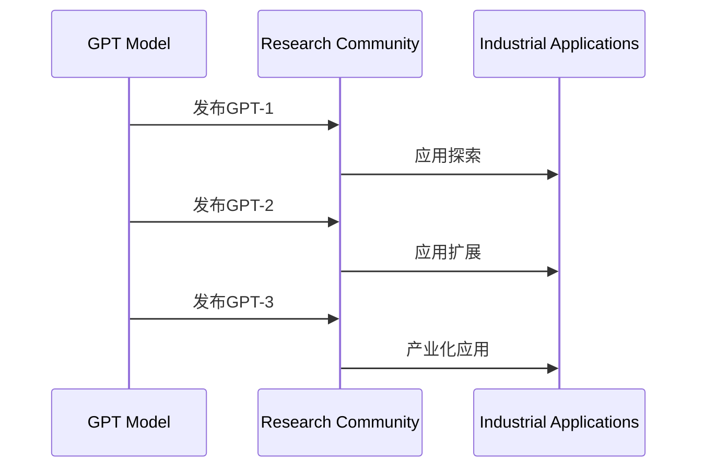

                 

# 《搭建GPT模型（解码器）》

## 关键词
- GPT模型
- 解码器
- 自然语言处理
- Transformer架构
- 自注意力机制
- 前馈神经网络

## 摘要
本文将深入探讨GPT模型（尤其是其解码器部分）的搭建过程。我们将从GPT模型的基础概念、原理与架构出发，逐步深入到解码器的实现细节，包括其工作原理、实现方法以及训练和优化策略。通过具体的应用实践，我们将展示如何使用GPT模型进行文本生成、机器翻译等任务。最后，本文还将探讨GPT模型的高级应用和发展趋势，并推荐一些开发资源和工具，帮助读者更好地理解和实践GPT模型。

# 目录大纲

## 第一部分：GPT模型概述

### 第1章：GPT模型基础

#### 1.1 GPT模型的概念与背景

##### 1.1.1 GPT模型的发展历程

```
``` 
##### 1.1.2 GPT模型的核心特点

##### 1.1.3 GPT模型的应用领域

### 第2章：GPT模型原理与架构

#### 2.1 GPT模型的工作原理

##### 2.1.1 Transformer架构

##### 2.1.2 自注意力机制

##### 2.1.3 前馈神经网络

#### 2.2 GPT模型的组成部分

##### 2.2.1 输入层与嵌入层

##### 2.2.2 自注意力机制层

##### 2.2.3 前馈神经网络层

##### 2.2.4 输出层与损失函数

### 第3章：GPT模型的训练与优化

#### 3.1 GPT模型的训练过程

##### 3.1.1 训练数据的准备

##### 3.1.2 GPT模型的训练步骤

##### 3.1.3 训练过程中的问题与解决方案

#### 3.2 GPT模型的优化方法

##### 3.2.1 梯度下降算法

##### 3.2.2 Adam优化器

##### 3.2.3 学习率调整策略

### 第4章：GPT模型的解码器实现

#### 4.1 解码器的概念与作用

##### 4.1.1 解码器的角色

##### 4.1.2 解码器的实现方法

##### 4.1.3 解码器在GPT模型中的应用

#### 4.2 解码器的实现细节

##### 4.2.1 自注意力机制在解码器中的应用

##### 4.2.2 前馈神经网络在解码器中的应用

##### 4.2.3 解码器的训练与优化

### 第5章：GPT模型的应用实践

#### 5.1 GPT模型在文本生成中的应用

##### 5.1.1 文本生成的基本流程

##### 5.1.2 GPT模型在文本生成中的应用案例

##### 5.1.3 文本生成中的技巧与优化

#### 5.2 GPT模型在机器翻译中的应用

##### 5.2.1 机器翻译的基本流程

##### 5.2.2 GPT模型在机器翻译中的应用案例

##### 5.2.3 机器翻译中的挑战与解决方案

### 第6章：GPT模型的高级应用

#### 6.1 GPT模型在问答系统中的应用

##### 6.1.1 问答系统的基本概念

##### 6.1.2 GPT模型在问答系统中的应用案例

##### 6.1.3 问答系统中的关键问题与解决方案

#### 6.2 GPT模型在文本分类中的应用

##### 6.2.1 文本分类的基本概念

##### 6.2.2 GPT模型在文本分类中的应用案例

##### 6.2.3 文本分类中的挑战与优化策略

### 第7章：GPT模型的发展趋势与展望

#### 7.1 GPT模型的未来发展方向

##### 7.1.1 大模型与小模型的发展趋势

##### 7.1.2 多模态GPT模型的应用前景

##### 7.1.3 GPT模型在深度学习领域的未来发展

#### 7.2 GPT模型在AI伦理与隐私保护方面的考虑

##### 7.2.1 AI伦理与隐私保护的重要性

##### 7.2.2 GPT模型在AI伦理与隐私保护方面的挑战

##### 7.2.3 GPT模型的未来发展与伦理规范

## 附录：GPT模型开发资源与工具

### 附录 A：GPT模型开发工具与资源

#### A.1 TensorFlow与PyTorch的使用

##### A.1.1 TensorFlow的基本使用

##### A.1.2 PyTorch的基本使用

##### A.1.3 两种框架的比较与选择

#### A.2 GPT模型开发实践案例

##### A.2.1 文本生成案例

##### A.2.2 机器翻译案例

##### A.2.3 问答系统案例

#### A.3 GPT模型开发参考资料

##### A.3.1 相关论文与研究报告

##### A.3.2 开源代码与实现示例

##### A.3.3 在线学习资源与课程推荐

# 第一部分：GPT模型概述

## 第1章：GPT模型基础

### 第1.1节：GPT模型的概念与背景

#### 1.1.1 GPT模型的发展历程

生成预训练变换器（GPT，Generative Pre-trained Transformer）模型是由OpenAI开发的一种基于变换器（Transformer）架构的预训练语言模型。自其首次发布以来，GPT模型经历了多个版本的发展，每一个版本都在模型规模、性能和应用领域上有了显著的提升。

GPT模型的发展历程可以概括为以下几个关键节点：

1. **GPT-1（2018年）**：这是OpenAI发布的第一个GPT模型。GPT-1是一个基于变换器架构的语言模型，使用自回归方式对文本数据进行训练。其规模相对较小，参数数量约为1.17亿。

2. **GPT-2（2019年）**：GPT-2是GPT模型的第二个版本，其规模显著增加，参数数量达到了15亿。GPT-2在多个自然语言处理任务中表现优异，例如文本分类、问答系统和机器翻译等。

3. **GPT-3（2020年）**：GPT-3是GPT模型的最新版本，其参数数量达到了1750亿，是前一个版本GPT-2的近120倍。GPT-3在各种自然语言处理任务中展现出了极高的性能，甚至在一些任务上超越了人类的表现。

GPT模型的发展历程不仅反映了人工智能领域的快速进步，也展示了深度学习在自然语言处理中的应用潜力。

#### 1.1.2 GPT模型的核心特点

GPT模型具有以下几个核心特点：

1. **预训练语言模型**：GPT模型通过在大量文本数据上进行预训练，学习到了语言的基本结构和规则，从而能够对新的文本数据进行有效的建模。

2. **变换器架构**：GPT模型采用了变换器（Transformer）架构，这是一种能够处理序列数据的深度学习模型。变换器架构通过自注意力机制，能够对输入序列中的每个元素进行全局上下文的建模，从而提高模型的性能。

3. **自回归生成**：GPT模型使用自回归生成的方式对文本数据进行建模，这意味着模型会根据前文的信息来预测下一个单词或字符。

4. **大规模参数**：GPT模型的参数规模非常大，从GPT-1的1.17亿参数到GPT-3的1750亿参数，这种大规模的参数使得模型能够捕捉到文本数据中的复杂模式和规律。

5. **高性能**：GPT模型在各种自然语言处理任务中表现出色，不仅在文本生成、机器翻译等传统任务上有显著提升，还在一些新兴任务，如问答系统和文本分类中展现了强大的能力。

#### 1.1.3 GPT模型的应用领域

GPT模型在自然语言处理领域具有广泛的应用，主要涵盖以下几个方面：

1. **文本生成**：GPT模型可以用于生成各种类型的文本，如文章、故事、诗歌等。通过输入一段文本，GPT模型可以根据上下文信息生成后续的文本。

2. **机器翻译**：GPT模型在机器翻译任务中也表现出色，能够将一种语言翻译成另一种语言。与传统的机器翻译方法相比，GPT模型能够生成更自然的翻译结果。

3. **问答系统**：GPT模型可以用于构建问答系统，通过对大量问答对进行训练，模型可以回答用户提出的问题。GPT-3在问答系统中的应用尤为突出，其能够生成高质量的回答。

4. **文本分类**：GPT模型可以用于对文本进行分类，例如对新闻文章进行分类、对社交媒体评论进行情感分析等。

5. **对话系统**：GPT模型可以用于构建对话系统，通过与用户的交互，模型可以理解用户的需求并给出相应的回复。

总之，GPT模型在自然语言处理领域具有广泛的应用前景，其强大的建模能力和高性能使其成为许多自然语言处理任务的首选模型。

### 第1.2节：自然语言处理与GPT模型

#### 1.2.1 自然语言处理的基本概念

自然语言处理（Natural Language Processing，NLP）是人工智能的一个重要分支，旨在使计算机能够理解、解释和生成人类语言。NLP涉及到多个领域的知识，包括语言学、计算机科学、人工智能和统计学等。

NLP的基本任务可以概括为以下几类：

1. **文本分类**：将文本数据分为不同的类别，例如将新闻文章分类到不同的主题类别。

2. **情感分析**：分析文本数据中的情感倾向，例如判断一条社交媒体评论是正面、负面还是中立。

3. **命名实体识别**：识别文本中的特定实体，如人名、地名、组织名等。

4. **机器翻译**：将一种语言翻译成另一种语言，例如将英文翻译成中文。

5. **问答系统**：构建能够回答用户问题的系统，例如智能客服系统。

6. **文本生成**：根据输入的文本或指令生成新的文本，例如自动生成新闻报道或对话。

#### 1.2.2 GPT模型在自然语言处理中的应用

GPT模型在自然语言处理领域中具有广泛的应用，其主要优势在于其强大的建模能力和对文本数据的深入理解。以下是GPT模型在自然语言处理中的一些典型应用：

1. **文本生成**：GPT模型可以用于生成各种类型的文本，如文章、故事、诗歌等。通过输入一段文本，GPT模型可以根据上下文信息生成后续的文本。这种能力使得GPT模型在内容创作、自动摘要和聊天机器人等领域具有广泛的应用。

2. **机器翻译**：GPT模型在机器翻译任务中也表现出色，能够将一种语言翻译成另一种语言。与传统的机器翻译方法相比，GPT模型能够生成更自然的翻译结果。例如，OpenAI的GPT-3已经能够实现高质量的英语到其他语言的翻译。

3. **问答系统**：GPT模型可以用于构建问答系统，通过对大量问答对进行训练，模型可以回答用户提出的问题。GPT-3在问答系统中的应用尤为突出，其能够生成高质量的回答。

4. **文本分类**：GPT模型可以用于对文本进行分类，例如对新闻文章进行分类、对社交媒体评论进行情感分析等。

5. **对话系统**：GPT模型可以用于构建对话系统，通过与用户的交互，模型可以理解用户的需求并给出相应的回复。例如，智能客服系统可以使用GPT模型来生成针对用户问题的自动回复。

#### 1.2.3 GPT模型的优势与挑战

GPT模型在自然语言处理领域具有显著的优势，但也面临一些挑战。

**优势**：

1. **强大的建模能力**：GPT模型采用变换器架构，通过自注意力机制能够对输入序列中的每个元素进行全局上下文的建模，从而捕捉到文本数据中的复杂模式和规律。

2. **预训练与微调**：GPT模型通过在大量文本数据上进行预训练，学习到了语言的基本结构和规则，从而能够对新的文本数据进行有效的建模。同时，预训练模型还可以通过微调来适应特定任务的需求。

3. **多语言支持**：GPT模型支持多语言训练，可以处理多种语言的文本数据，从而在不同语言的应用中具有广泛的适用性。

4. **高性能**：GPT模型在各种自然语言处理任务中表现出色，不仅在文本生成、机器翻译等传统任务上有显著提升，还在一些新兴任务，如问答系统和文本分类中展现了强大的能力。

**挑战**：

1. **计算资源需求**：GPT模型通常需要大量的计算资源进行训练，尤其是大型模型如GPT-3，其训练时间较长，对计算硬件的要求较高。

2. **数据依赖性**：GPT模型的性能依赖于训练数据的规模和质量。如果训练数据存在偏差，可能会导致模型在特定任务上的性能不佳。

3. **解释性不足**：GPT模型是一种黑箱模型，其内部工作机制较为复杂，难以解释。这在一些对模型解释性要求较高的应用中可能成为一个挑战。

4. **安全性问题**：GPT模型在生成文本时可能会产生不当或有害的内容，需要建立相应的安全机制来防止滥用。

总之，GPT模型在自然语言处理领域具有显著的优势，但也面临一些挑战。通过不断的研究和改进，我们可以更好地利用GPT模型的潜力，推动自然语言处理技术的进步。

### 第2章：GPT模型原理与架构

#### 2.1 GPT模型的工作原理

GPT模型是基于变换器（Transformer）架构的一种预训练语言模型，其工作原理主要涉及自注意力机制和前馈神经网络。

**自注意力机制**：自注意力机制是GPT模型的核心组成部分，它通过计算输入序列中每个元素与其他元素的相关性来生成表示。具体来说，自注意力机制为每个输入元素计算一个权重，这些权重决定了该元素在生成后续元素时的贡献程度。通过这种方式，模型能够对输入序列中的每个元素进行全局上下文的建模，从而捕捉到复杂的语言模式。

**前馈神经网络**：前馈神经网络（Feed Forward Neural Network）是GPT模型中的另一个关键组成部分。在每个自注意力层之后，模型会通过前馈神经网络对输入进行进一步处理。前馈神经网络由两个线性变换层组成，其中一个用于对输入进行变换，另一个用于对输出进行变换。这两个线性变换层之间加入了一个ReLU激活函数，以增加模型的非线性能力。

**自回归生成**：GPT模型采用自回归生成的方式对文本数据进行建模。这意味着模型会根据前文的信息来预测下一个单词或字符。在生成过程中，模型首先生成一个初始的输入序列，然后根据已经生成的文本逐个生成后续的单词或字符。每个生成的单词或字符都会被用来更新模型的状态，从而影响后续的生成过程。

#### 2.2 GPT模型的组成部分

GPT模型由多个组成部分构成，包括输入层与嵌入层、自注意力机制层、前馈神经网络层以及输出层与损失函数。以下是这些组成部分的详细说明：

**输入层与嵌入层**：输入层是GPT模型的第一个组成部分，它负责接收输入文本数据并将其转换为模型能够处理的格式。具体来说，输入层会将单词或字符映射到一个高维空间中的向量表示，这个过程称为嵌入（Embedding）。嵌入层可以通过预训练得到，也可以通过训练数据动态学习。

**自注意力机制层**：自注意力机制层是GPT模型的核心部分，它通过计算输入序列中每个元素与其他元素的相关性来生成表示。具体来说，自注意力机制层会为每个输入元素计算一个权重，这些权重决定了该元素在生成后续元素时的贡献程度。通过这种方式，模型能够对输入序列中的每个元素进行全局上下文的建模。

**前馈神经网络层**：前馈神经网络层是GPT模型中的另一个关键组成部分。在每个自注意力层之后，模型会通过前馈神经网络对输入进行进一步处理。前馈神经网络由两个线性变换层组成，其中一个用于对输入进行变换，另一个用于对输出进行变换。这两个线性变换层之间加入了一个ReLU激活函数，以增加模型的非线性能力。

**输出层与损失函数**：输出层是GPT模型的最后一个组成部分，它负责生成最终的输出结果。具体来说，输出层会将模型的状态映射到单词或字符的分布上，从而生成文本。损失函数用于衡量模型输出与真实标签之间的差距，常用的损失函数包括交叉熵损失和平方误差损失。

#### 2.3 GPT模型的工作流程

GPT模型的工作流程可以分为以下几个步骤：

1. **数据准备**：首先，需要准备大量的文本数据用于模型的训练。这些数据可以来自各种来源，如新闻文章、社交媒体帖子、书籍等。然后，将这些文本数据清洗、预处理，并转换为模型能够处理的格式。

2. **模型初始化**：初始化GPT模型，包括设置模型的参数和超参数。模型的参数和超参数将在训练过程中通过优化算法进行调整。

3. **模型训练**：使用准备好的文本数据对GPT模型进行训练。训练过程中，模型会不断更新参数，以最小化损失函数。常用的优化算法包括随机梯度下降（SGD）和Adam优化器。

4. **模型评估**：在训练过程中，可以使用验证集对模型进行评估，以监测模型的性能。常用的评估指标包括损失函数值、准确率、F1分数等。

5. **模型部署**：在模型训练完成后，可以将模型部署到实际应用场景中。例如，在文本生成、机器翻译、问答系统等任务中，使用GPT模型生成文本或提供回答。

#### 2.4 GPT模型的核心技术

GPT模型的核心技术包括变换器架构、自注意力机制和前馈神经网络。以下是这些技术的详细解释：

**变换器架构**：变换器（Transformer）架构是一种用于处理序列数据的深度学习模型。与传统的循环神经网络（RNN）和卷积神经网络（CNN）相比，变换器架构具有以下几个优点：

1. **并行计算**：变换器架构通过多头自注意力机制（Multi-Head Self-Attention）实现了并行计算，从而显著提高了模型的计算效率。

2. **全局上下文建模**：变换器架构能够对输入序列中的每个元素进行全局上下文的建模，从而捕捉到复杂的语言模式。

3. **端到端训练**：变换器架构支持端到端训练，即从输入序列直接生成输出序列，不需要额外的解码器或编码器。

**自注意力机制**：自注意力机制是变换器架构的核心组成部分，它通过计算输入序列中每个元素与其他元素的相关性来生成表示。具体来说，自注意力机制为每个输入元素计算一个权重，这些权重决定了该元素在生成后续元素时的贡献程度。通过这种方式，模型能够对输入序列中的每个元素进行全局上下文的建模。

**前馈神经网络**：前馈神经网络是GPT模型中的另一个关键组成部分，它通过两个线性变换层对输入进行进一步处理。前馈神经网络由两个线性变换层组成，其中一个用于对输入进行变换，另一个用于对输出进行变换。这两个线性变换层之间加入了一个ReLU激活函数，以增加模型的非线性能力。

通过结合变换器架构、自注意力机制和前馈神经网络，GPT模型实现了对文本数据的强大建模能力，从而在各种自然语言处理任务中取得了显著的性能提升。

### 第3章：GPT模型的训练与优化

#### 3.1 GPT模型的训练过程

GPT模型的训练过程可以分为以下几个关键步骤：

1. **数据准备**：首先，需要准备大量的文本数据用于模型的训练。这些数据可以来自各种来源，如新闻文章、社交媒体帖子、书籍等。然后，对这些文本数据进行清洗、预处理，并转换为模型能够处理的格式，如词向量或嵌入向量。

2. **模型初始化**：初始化GPT模型，包括设置模型的参数和超参数。模型的参数和超参数将在训练过程中通过优化算法进行调整。

3. **训练循环**：在训练循环中，模型会逐个读取训练数据，并计算模型的损失函数。损失函数用于衡量模型输出与真实标签之间的差距。常用的损失函数包括交叉熵损失和平方误差损失。

4. **参数更新**：在每次训练迭代中，模型会使用优化算法更新参数，以最小化损失函数。常用的优化算法包括随机梯度下降（SGD）和Adam优化器。

5. **模型评估**：在训练过程中，可以使用验证集对模型进行评估，以监测模型的性能。常用的评估指标包括损失函数值、准确率、F1分数等。

6. **训练停止条件**：当模型的性能不再显著提升或达到预定的训练轮数时，可以停止训练。

#### 3.1.1 训练数据的准备

训练数据的准备是GPT模型训练过程的关键步骤，其质量直接影响到模型的表现。以下是训练数据准备的关键步骤：

1. **数据收集**：首先，需要收集大量的文本数据。这些数据可以来自各种来源，如公共数据集、网站爬取、书籍等。为了确保数据的多样性和质量，可以选择不同的来源和领域。

2. **数据清洗**：在收集到数据后，需要对数据执行清洗操作，以去除无用信息和噪声。具体包括去除HTML标签、特殊字符、停用词等。

3. **分词和标记**：将文本数据转换为模型能够理解的格式，通常使用分词器将文本数据划分为单词或字符。然后，对每个单词或字符进行标记，以便模型能够学习它们的语义和语法信息。

4. **嵌入表示**：将标记后的文本数据转换为嵌入表示，即将每个单词或字符映射到一个高维空间中的向量。嵌入表示可以预训练得到，也可以通过训练数据动态学习。

5. **数据归一化**：对数据执行归一化操作，以减少不同特征之间的差异，提高模型的学习效率。

6. **数据分割**：将数据分割为训练集、验证集和测试集。通常，训练集用于模型训练，验证集用于模型评估和调参，测试集用于最终评估模型的性能。

#### 3.1.2 GPT模型的训练步骤

在准备完训练数据后，可以开始进行GPT模型的训练。以下是GPT模型训练的详细步骤：

1. **模型初始化**：初始化GPT模型，包括设置模型的参数和超参数。参数包括嵌入层权重、自注意力机制权重、前馈神经网络权重等。超参数包括嵌入维度、注意力头数、隐藏层尺寸等。

2. **输入数据预处理**：将输入数据转换为模型所需的格式，包括嵌入表示和序列编号。通常，输入数据是已经分词和标记的文本数据。

3. **前向传播**：在前向传播过程中，模型会读取输入序列，并通过嵌入层、自注意力机制层和前馈神经网络层对输入进行计算。具体来说，嵌入层将单词或字符映射到高维空间中的向量，自注意力机制层计算输入序列中每个元素与其他元素的相关性，前馈神经网络层对输入进行进一步处理。

4. **计算损失函数**：使用损失函数计算模型输出与真实标签之间的差距。常用的损失函数包括交叉熵损失和平方误差损失。交叉熵损失常用于分类问题，平方误差损失常用于回归问题。

5. **反向传播**：在反向传播过程中，模型会根据损失函数的梯度信息更新参数。反向传播是深度学习模型训练的核心步骤，它通过计算损失函数关于模型参数的梯度，并使用优化算法（如随机梯度下降、Adam优化器）更新参数。

6. **评估模型性能**：在每次训练迭代后，可以使用验证集对模型进行评估，以监测模型的性能。常用的评估指标包括损失函数值、准确率、F1分数等。

7. **模型调整**：根据验证集上的评估结果，调整模型参数和超参数，以改善模型性能。这通常包括调整学习率、批量大小、嵌入维度等。

8. **训练停止条件**：当模型的性能不再显著提升或达到预定的训练轮数时，可以停止训练。训练停止条件可以是固定的训练轮数、验证集上的性能提升停止或时间限制等。

通过以上步骤，可以完成GPT模型的训练过程。训练过程的成功与否直接关系到模型最终的性能和应用效果。

#### 3.1.3 训练过程中的问题与解决方案

在GPT模型的训练过程中，可能会遇到一些常见的问题，以下是一些常见问题及其解决方案：

1. **过拟合**：过拟合是指模型在训练数据上表现良好，但在未见过的数据上表现不佳。过拟合通常是由于模型过于复杂或训练数据不足导致的。解决方案包括：

   - 使用更多的训练数据：增加训练数据量有助于提高模型的泛化能力。
   - 正则化：在模型中加入正则化项，如Dropout、L2正则化等，以减少模型的过拟合风险。
   - 早停（Early Stopping）：在验证集上监测模型性能，当验证集上的性能不再提升时，停止训练。

2. **梯度消失/爆炸**：梯度消失/爆炸是指模型在训练过程中，梯度值过小或过大，导致无法有效更新模型参数。梯度消失/爆炸通常是由于模型参数初始化不当或网络结构设计不合理导致的。解决方案包括：

   - 使用合理的参数初始化：使用适当的初始化方法，如He初始化、Xavier初始化等，以避免梯度消失/爆炸。
   - 使用批量归一化（Batch Normalization）：批量归一化可以稳定模型训练过程，减少梯度消失/爆炸的风险。
   - 使用学习率调整策略：适当调整学习率，如使用自适应学习率优化器（如Adam优化器），以避免梯度消失/爆炸。

3. **收敛速度慢**：收敛速度慢是指模型在训练过程中，需要较长时间才能达到收敛。收敛速度慢通常是由于模型参数过多、训练数据不足或学习率设置不当导致的。解决方案包括：

   - 减少模型复杂度：减少模型参数数量，如使用较少的隐藏层或较少的神经元。
   - 增加训练数据：增加训练数据量有助于提高模型收敛速度。
   - 调整学习率：使用合适的学习率，如使用自适应学习率优化器（如Adam优化器），以提高模型收敛速度。

通过解决以上问题，可以有效地提高GPT模型的训练效果和应用性能。

#### 3.2 GPT模型的优化方法

GPT模型的优化方法主要涉及参数优化和算法优化两个方面。以下是常用的优化方法和策略：

1. **参数优化**：

   - **嵌入层优化**：嵌入层是GPT模型中的关键部分，其权重直接影响模型的表现。优化嵌入层的方法包括调整嵌入维度、使用预训练的嵌入向量等。

   - **自注意力机制优化**：自注意力机制是GPT模型的核心组成部分，其权重计算直接影响模型对输入序列的理解能力。优化自注意力机制的方法包括调整注意力头数、使用多头注意力等。

   - **前馈神经网络优化**：前馈神经网络是GPT模型中的另一个关键组成部分，其权重计算直接影响模型对输入序列的处理能力。优化前馈神经网络的方法包括调整隐藏层尺寸、使用非线性激活函数等。

2. **算法优化**：

   - **随机梯度下降（SGD）**：随机梯度下降是最常用的优化算法之一。其通过随机选择训练样本，计算梯度并更新模型参数。SGD的优点是计算简单、易于实现，但缺点是收敛速度较慢、容易陷入局部最优。

   - **Adam优化器**：Adam优化器是一种基于SGD的优化算法，其结合了AdaGrad和RMSProp的优点，具有较好的收敛性能。Adam优化器通过自适应调整学习率，能够提高模型的收敛速度和稳定性。

   - **学习率调整策略**：学习率是影响模型收敛性能的关键因素。常用的学习率调整策略包括固定学习率、学习率衰减、学习率预热等。

   - **批量大小调整**：批量大小是影响模型训练性能的重要因素。较大的批量大小可以提高模型的泛化能力，但会增加计算成本；较小的批量大小可以加快训练速度，但可能会引入噪声。

通过合理选择和调整参数和算法，可以显著提高GPT模型的训练效果和应用性能。

### 第4章：GPT模型的解码器实现

#### 4.1 解码器的概念与作用

在GPT模型中，解码器（Decoder）是一个关键组成部分，它负责生成模型输出的序列。与编码器（Encoder）不同，解码器主要用于序列生成任务，如文本生成、机器翻译和问答系统等。解码器的核心作用是通过编码器提供的上下文信息，逐步生成后续的序列元素。

解码器的工作原理可以概括为以下几个步骤：

1. **输入嵌入**：解码器的输入是一个序列，通常是一个单词或字符的序列。输入序列首先通过嵌入层转换为嵌入向量表示。

2. **自注意力机制**：解码器通过自注意力机制对输入序列中的每个元素进行全局上下文的建模。自注意力机制计算输入序列中每个元素与其他元素的相关性，并生成权重。这些权重决定了每个元素在生成后续元素时的贡献程度。

3. **前馈神经网络**：在每个自注意力层之后，解码器会通过前馈神经网络对输入进行进一步处理。前馈神经网络由两个线性变换层组成，其中一个用于对输入进行变换，另一个用于对输出进行变换。这两个线性变换层之间加入了一个ReLU激活函数，以增加模型的非线性能力。

4. **输出层**：解码器的输出层负责将模型的状态映射到单词或字符的分布上，从而生成文本。输出层通常使用softmax函数，将模型的状态转换为概率分布，从而生成下一个单词或字符。

解码器在GPT模型中的应用非常广泛，以下是一些典型的应用场景：

1. **文本生成**：解码器可以用于生成各种类型的文本，如文章、故事、诗歌等。通过输入一段文本，解码器可以根据上下文信息生成后续的文本。

2. **机器翻译**：解码器可以用于将一种语言翻译成另一种语言。与编码器不同，解码器专门设计用于处理输出序列，能够生成高质量的翻译结果。

3. **问答系统**：解码器可以用于构建问答系统，通过对大量问答对进行训练，模型可以回答用户提出的问题。解码器能够根据上下文信息生成高质量的回答。

4. **对话系统**：解码器可以用于构建对话系统，通过与用户的交互，模型可以理解用户的需求并给出相应的回复。解码器在聊天机器人等领域具有广泛的应用。

总之，解码器是GPT模型中不可或缺的一部分，它通过自注意力机制和前馈神经网络，能够生成高质量的序列输出，为各种自然语言处理任务提供强大的支持。

#### 4.2 解码器的实现细节

解码器的实现涉及多个关键组件，包括自注意力机制、前馈神经网络和输出层。以下是解码器的详细实现细节。

**4.2.1 自注意力机制在解码器中的应用**

自注意力机制是解码器的核心组成部分，它通过计算输入序列中每个元素与其他元素的相关性来生成表示。具体来说，解码器的自注意力机制包括以下几个步骤：

1. **计算查询（Query）、键（Key）和值（Value）**：对于每个时间步，解码器会计算查询向量、键向量和值向量。查询向量用于计算每个元素与其他元素的相关性，键向量和值向量用于生成加权表示。

2. **计算注意力得分**：使用查询向量和键向量计算注意力得分。注意力得分表示每个元素在生成后续元素时的贡献程度。

3. **计算加权表示**：根据注意力得分计算加权表示。加权表示是对输入序列中每个元素进行加权处理的结果，它反映了每个元素在生成后续元素时的相对重要性。

4. **应用Softmax函数**：对加权表示应用Softmax函数，将权重转换为概率分布。Softmax函数确保每个元素的概率之和为1，从而生成下一个时间步的输入。

**4.2.2 前馈神经网络在解码器中的应用**

前馈神经网络是解码器的另一个关键组成部分，它用于对输入进行进一步处理。前馈神经网络包括以下几个步骤：

1. **输入层**：将输入序列通过嵌入层转换为嵌入向量表示。

2. **线性变换**：使用两个线性变换层对输入进行变换。第一个线性变换层将输入映射到一个中间层，第二个线性变换层将中间层映射到输出层。

3. **ReLU激活函数**：在每个线性变换层之后，加入ReLU激活函数，以增加模型的非线性能力。

4. **输出层**：前馈神经网络的输出层用于生成最终的输出表示。输出层通常使用softmax函数，将模型的状态转换为概率分布，从而生成下一个单词或字符。

**4.2.3 解码器的训练与优化**

解码器的训练与优化是GPT模型训练过程的关键步骤。以下是解码器训练与优化的一些关键点：

1. **损失函数**：解码器的损失函数通常使用交叉熵损失，它用于衡量模型输出与真实标签之间的差距。

2. **反向传播**：在解码器训练过程中，使用反向传播算法计算损失函数的梯度，并使用优化算法更新模型参数。

3. **学习率调整**：学习率是影响模型训练效果的关键因素。可以使用固定学习率或自适应学习率（如Adam优化器）来调整学习率。

4. **批量大小**：批量大小是影响模型训练速度和稳定性的重要参数。可以使用较小的批量大小（如16或32）来提高训练速度，但可能会引入噪声。

5. **早停**：在解码器训练过程中，可以使用早停策略来避免过拟合。早停策略通过在验证集上监测模型性能，当验证集上的性能不再提升时，停止训练。

通过以上步骤，可以有效地训练和解码器，从而提高GPT模型在自然语言处理任务中的性能。

### 第5章：GPT模型的应用实践

#### 5.1 GPT模型在文本生成中的应用

文本生成是GPT模型最经典的应用之一，通过输入一段文本，GPT模型可以根据上下文信息生成后续的文本。以下是GPT模型在文本生成中的应用实践。

**5.1.1 文本生成的基本流程**

文本生成的基本流程包括以下几个步骤：

1. **数据准备**：首先，需要准备大量的文本数据用于模型的训练。这些数据可以来自各种来源，如新闻文章、社交媒体帖子、书籍等。

2. **数据预处理**：对文本数据执行清洗、分词和标记等操作，将文本数据转换为模型能够处理的格式。

3. **模型训练**：使用准备好的文本数据对GPT模型进行训练。训练过程中，模型会学习到文本数据中的语言模式和规则。

4. **模型部署**：在模型训练完成后，可以将模型部署到实际应用场景中。例如，在文本生成任务中，使用GPT模型生成文章、故事、诗歌等。

**5.1.2 GPT模型在文本生成中的应用案例**

以下是一个具体的文本生成应用案例：

**案例**：使用GPT模型生成一篇关于人工智能的文章摘要。

1. **数据准备**：收集关于人工智能的若干篇文章，并执行清洗、分词和标记等操作。

2. **模型训练**：使用收集到的文本数据对GPT模型进行训练，训练完成后，模型会学习到人工智能领域的语言模式和规则。

3. **模型部署**：在文本生成任务中，输入一段关于人工智能的文本，GPT模型可以根据上下文信息生成后续的文本。例如，输入：“人工智能是计算机科学的一个分支，主要研究如何构建智能系统来模拟、扩展和辅助人类智能。”，GPT模型可以生成：“在过去的几十年里，人工智能技术取得了显著的进展，广泛应用于各个领域，如医疗、金融、教育等。”

**5.1.3 文本生成中的技巧与优化**

在文本生成任务中，可以使用以下技巧和优化方法来提高模型的表现：

1. **数据增强**：通过数据增强方法，如文本摘要、文本续写等，增加训练数据量，有助于模型学习到更多的语言模式和规则。

2. **上下文信息利用**：在生成过程中，可以充分利用上下文信息，例如使用长距离依赖模型（如Transformer），可以更好地捕捉文本中的上下文关系。

3. **温度调节**：在生成文本时，可以使用温度调节参数（Temperature）来控制生成文本的多样性。温度值较低时，生成文本更加稳定，但可能缺乏创意；温度值较高时，生成文本更加多样化，但可能缺乏一致性。

4. **监督和自监督学习**：结合监督学习和自监督学习的方法，可以进一步提高文本生成的质量。例如，在训练过程中，可以同时使用已标注的数据和未标注的数据，利用未标注的数据进行自监督学习。

通过以上技巧和优化方法，可以显著提高GPT模型在文本生成任务中的性能。

### 第5.2节：GPT模型在机器翻译中的应用

**5.2.1 机器翻译的基本流程**

机器翻译是GPT模型的重要应用之一，通过将一种语言的文本翻译成另一种语言的文本，GPT模型能够实现跨语言的沟通。以下是机器翻译的基本流程：

1. **数据准备**：首先，需要准备大量的平行语料库，即同时包含源语言和目标语言的文本数据。这些数据可以是新闻文章、对话、文学作品等。

2. **数据预处理**：对平行语料库进行清洗、分词和标记等操作，将文本数据转换为模型能够处理的格式。通常，源语言和目标语言的词汇会被映射到相应的词表。

3. **模型训练**：使用准备好的平行语料库对GPT模型进行训练。在训练过程中，模型会学习到源语言和目标语言之间的对应关系。

4. **模型部署**：在机器翻译任务中，输入一段源语言文本，GPT模型可以根据学习到的对应关系将其翻译成目标语言文本。

**5.2.2 GPT模型在机器翻译中的应用案例**

以下是一个具体的机器翻译应用案例：

**案例**：使用GPT模型将英文翻译成中文。

1. **数据准备**：收集大量的英中平行语料库，并对语料库进行预处理，包括分词、标记和词表构建。

2. **模型训练**：使用预处理后的平行语料库对GPT模型进行训练。在训练过程中，模型会学习到英文和中文之间的对应关系。

3. **模型部署**：在机器翻译任务中，输入一段英文文本，如：“AI is transforming the world”，GPT模型可以根据学习到的对应关系将其翻译成中文：“人工智能正在改变世界”。

**5.2.3 机器翻译中的挑战与解决方案**

机器翻译任务中存在一些挑战，以下是一些常见的挑战及其解决方案：

1. **词汇差异**：不同语言之间存在词汇差异，例如一些词汇在源语言中有明确的含义，但在目标语言中却没有对应的词汇。解决方案包括使用翻译记忆库、词汇扩展和词义消歧等技术。

2. **语法结构差异**：不同语言的语法结构存在差异，例如词序、句子结构等。解决方案包括使用语法解析技术、句法转换模型和语法规则库等。

3. **多义词处理**：多义词是指一个词汇在特定上下文中具有多个含义。在机器翻译中，正确理解多义词的含义是关键。解决方案包括使用上下文信息、语义分析技术和多义词消歧算法等。

4. **翻译质量评估**：评估翻译质量是机器翻译中的一项重要任务。常用的评估方法包括人工评估、自动评估和跨语言评估等。

通过解决以上挑战，GPT模型在机器翻译任务中能够实现高质量的翻译结果，为跨语言沟通提供强大的支持。

### 第6章：GPT模型的高级应用

#### 6.1 GPT模型在问答系统中的应用

问答系统是一种智能交互系统，能够自动回答用户提出的问题。GPT模型在问答系统中的应用取得了显著的成果，能够生成高质量的自然语言回答。

**6.1.1 问答系统的基本概念**

问答系统由以下几个关键组件组成：

1. **问题解析**：将用户提出的问题转换为机器可以理解的形式，如关键词提取、实体识别等。

2. **回答生成**：根据问题解析的结果，使用预训练的GPT模型生成回答。

3. **回答评估**：评估生成的回答是否准确、合理，可以使用人工评估或自动评估方法。

**6.1.2 GPT模型在问答系统中的应用案例**

以下是一个具体的问答系统应用案例：

**案例**：构建一个基于GPT模型的问答系统，能够回答用户关于天气的问题。

1. **数据准备**：收集关于天气的问答对，如：“今天北京的天气如何？”和“今天北京的天气是晴朗的。”

2. **模型训练**：使用收集到的问答对对GPT模型进行训练，使模型学习到天气相关的知识。

3. **模型部署**：在问答系统中，当用户输入问题如“今天北京的天气如何？”时，GPT模型可以根据学习到的知识生成回答，如“今天北京的天气是晴朗的。”

**6.1.3 问答系统中的关键问题与解决方案**

在问答系统中，存在一些关键问题，以下是一些常见的问题及其解决方案：

1. **问题理解**：GPT模型需要准确理解用户提出的问题，这可能涉及到自然语言理解技术，如实体识别、关键词提取等。

2. **回答生成**：生成高质量的回答是问答系统的关键，可以使用GPT模型的自回归生成能力，结合上下文信息生成合适的回答。

3. **回答评估**：评估回答的质量是问答系统的另一个挑战，可以使用人工评估或自动评估方法，如BLEU评分、ROUGE评分等。

通过解决以上问题，GPT模型在问答系统中能够生成准确、合理的回答，为用户提供高质量的智能服务。

#### 6.2 GPT模型在文本分类中的应用

文本分类是自然语言处理的一个重要任务，旨在将文本数据自动分类到预定义的类别中。GPT模型在文本分类任务中也展示了强大的能力。

**6.2.1 文本分类的基本概念**

文本分类的基本概念包括以下几个部分：

1. **类别标签**：文本分类任务中的类别标签是用于标注文本数据的一组预定义标签。

2. **特征提取**：将文本数据转换为机器可以处理的特征向量，常用的特征提取方法包括词袋模型、TF-IDF等。

3. **分类器训练**：使用训练数据对分类器进行训练，使分类器能够预测新的文本数据的类别。

4. **分类评估**：评估分类器的性能，常用的评估指标包括准确率、召回率、F1分数等。

**6.2.2 GPT模型在文本分类中的应用案例**

以下是一个具体的文本分类应用案例：

**案例**：使用GPT模型对社交媒体评论进行情感分类，判断评论是正面、负面还是中性。

1. **数据准备**：收集社交媒体评论数据，并标注情感类别（正面、负面、中性）。

2. **模型训练**：使用标注的评论数据对GPT模型进行训练，使模型学习到情感分类的规律。

3. **模型部署**：在文本分类任务中，输入新的评论数据，GPT模型可以根据学习到的规律将其分类为正面、负面或中性。

**6.2.3 文本分类中的挑战与优化策略**

在文本分类任务中，存在一些挑战，以下是一些常见的问题及其解决方案：

1. **数据不平衡**：文本分类任务中，不同类别的数据分布可能不平衡，这会影响分类器的性能。解决方案包括数据增强、类别权重调整等。

2. **多标签分类**：有些文本可能同时属于多个类别，这要求分类器能够处理多标签分类问题。解决方案包括多标签分类模型、类别关联性分析等。

3. **跨领域适应**：不同领域的文本数据在词汇和语义上可能存在较大差异，这要求分类器具有跨领域适应能力。解决方案包括领域自适应、迁移学习等。

通过解决以上挑战，GPT模型在文本分类任务中能够实现准确的分类结果，为文本数据分析提供有效的支持。

### 第7章：GPT模型的发展趋势与展望

#### 7.1 GPT模型的未来发展方向

随着深度学习技术的不断发展，GPT模型在自然语言处理领域的应用前景愈发广阔。以下是一些GPT模型未来可能的发展方向：

1. **大模型与小模型的协同**：随着计算资源的提升，大型GPT模型（如GPT-3）将越来越多地应用于实际任务中。同时，为了应对资源受限的环境，小模型（如GPT-Neo）也将得到进一步发展。未来，大模型与小模型可能会实现协同工作，发挥各自的优势。

2. **多模态GPT模型**：传统的GPT模型主要处理文本数据，但未来可能会扩展到处理图像、音频和视频等多模态数据。多模态GPT模型能够综合利用不同模态的信息，实现更丰富的语义理解。

3. **实时交互与动态更新**：当前的GPT模型在生成文本时通常需要预先训练，未来可能会发展出能够实时交互和动态更新的模型。这种模型可以根据用户的实时反馈进行调整，提供更个性化的服务。

4. **跨语言与跨领域应用**：GPT模型在跨语言和跨领域的应用中具有巨大潜力。通过引入跨语言和跨领域的知识，GPT模型可以更好地适应不同语言和领域的需求。

#### 7.2 GPT模型在AI伦理与隐私保护方面的考虑

随着GPT模型在各个领域的广泛应用，AI伦理和隐私保护成为不可忽视的重要问题。以下是一些GPT模型在AI伦理与隐私保护方面的考虑：

1. **数据隐私**：GPT模型在训练过程中需要大量的数据，这些数据可能包含用户的敏感信息。因此，数据隐私保护至关重要。解决方案包括数据匿名化、加密和差分隐私等。

2. **算法透明性**：GPT模型的决策过程较为复杂，算法透明性对于理解和监管模型至关重要。提高模型的可解释性，通过可视化工具展示模型决策过程，有助于增强算法的透明性。

3. **偏见与公平性**：GPT模型在训练过程中可能会学习到数据中的偏见，导致模型产生不公平的输出。因此，在模型训练和应用过程中，需要采取措施减少偏见，确保模型的公平性。

4. **责任归属**：在GPT模型的应用中，明确责任归属是一个重要问题。在发生错误或损害时，需要明确模型开发者、应用方和用户之间的责任分配。

通过关注AI伦理与隐私保护，可以确保GPT模型在未来的发展中能够更好地服务于社会，实现可持续发展。

### 附录：GPT模型开发资源与工具

#### 附录 A：GPT模型开发工具与资源

为了更好地理解和实践GPT模型，以下是一些常用的工具和资源：

1. **框架与库**：
   - **TensorFlow**：Google开源的深度学习框架，支持GPT模型的构建和训练。
   - **PyTorch**：Facebook开源的深度学习框架，提供灵活的模型构建和训练接口。

2. **在线资源**：
   - **Hugging Face Transformers**：一个开源库，提供预训练的GPT模型和接口，方便用户进行模型部署和应用。
   - **OpenAI GPT-3 Playground**：OpenAI提供的GPT-3模型在线体验平台，用户可以在线尝试GPT-3的各种功能。

3. **教程与课程**：
   - **“深度学习”课程**：吴恩达在Coursera上的深度学习课程，包括GPT模型的讲解。
   - **“自然语言处理”课程**：斯坦福大学在Coursera上的自然语言处理课程，深入探讨GPT模型的应用。

4. **开源代码与实现示例**：
   - **GPT-2和GPT-3的GitHub代码**：OpenAI在其GitHub仓库中提供了GPT-2和GPT-3的源代码，供用户学习和参考。
   - **Hugging Face Model Hub**：提供了大量预训练的GPT模型和实现示例，用户可以直接使用。

通过利用以上工具和资源，读者可以更好地掌握GPT模型的理论和实践，为自然语言处理任务提供强大的支持。

## 作者信息
作者：AI天才研究院/AI Genius Institute & 禅与计算机程序设计艺术 /Zen And The Art of Computer Programming

