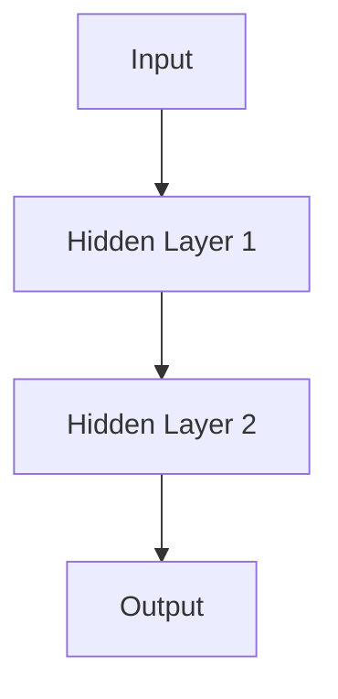
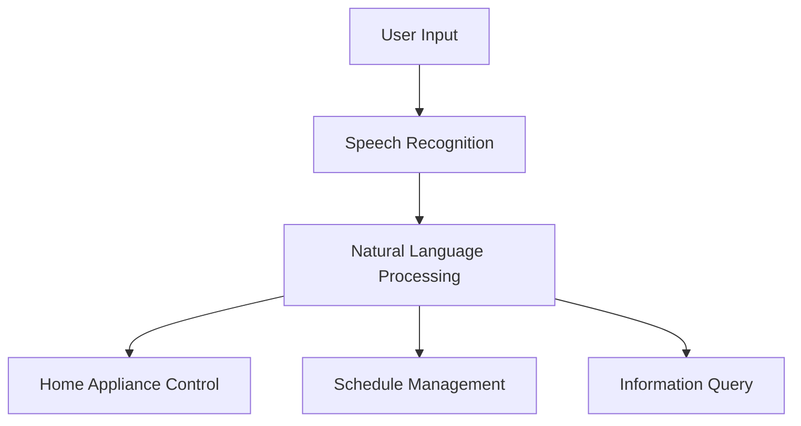

                 

# 数字人与虚拟助手：AI大模型的前沿应用

> **关键词：** AI大模型、数字人、虚拟助手、自然语言处理、深度学习、自监督学习、迁移学习

> **摘要：** 本文将深入探讨AI大模型的基本概念、数学基础、前沿技术，以及数字人与虚拟助手的设计与应用。通过逐步分析，揭示其技术原理和潜在应用前景，旨在为读者提供对AI领域前沿应用的全面理解。

### 目录大纲

1. 第一部分：AI大模型概述
   1.1 AI大模型基本概念与原理
   1.2 AI大模型的发展历程
   1.3 AI大模型的核心架构
   1.4 AI大模型的优势与应用前景
2. 第二部分：数字人与虚拟助手
   2.1 数字人基本概念与架构
   2.2 虚拟助手设计与应用
   2.3 虚拟助手案例与实践
   2.4 数字人与虚拟助手的未来发展趋势
3. 附录
   3.1 常用AI开发工具与框架
   3.2 参考文献

## 引言

随着人工智能（AI）技术的迅猛发展，AI大模型成为了当前科技领域的热门话题。从最初的手工编程到如今的深度学习和神经网络，人工智能已经经历了多次技术革新。而AI大模型，作为这一领域的最新成果，其在提升机器学习性能、优化数据处理能力方面展现出了巨大的潜力。本文旨在通过对AI大模型、数字人和虚拟助手的深入探讨，展示其在现代科技中的应用前景。

首先，本文将介绍AI大模型的基本概念、原理和核心架构，帮助读者了解这一技术的核心要素。接着，我们将分析AI大模型的数学基础，包括深度学习和自然语言处理的基本原理，以及大规模预训练模型的运行机制。在此基础上，我们将探讨AI大模型的前沿技术，如自监督学习和迁移学习，这些技术正在推动AI大模型的应用边界不断拓展。

随后，本文将转向数字人与虚拟助手这一话题。我们将详细讨论数字人的基本概念、架构以及应用场景，同时介绍虚拟助手的定义、分类、核心技术和开发流程。为了更好地理解这些技术，本文还将通过一个虚拟助手案例，详细解析其系统架构设计、代码实现和优化策略。

最后，本文将探讨数字人与虚拟助手的未来发展趋势，包括技术演进、社会变革以及伦理挑战。通过这些分析，本文旨在为读者提供一个全面、深入的AI大模型和数字人、虚拟助手领域的全景视图。

## 第一部分：AI大模型概述

### 1.1 AI大模型基本概念与原理

AI大模型，顾名思义，是指规模庞大的机器学习模型。它们通常具有数百万甚至数十亿个参数，能够处理海量数据，进行复杂的模式识别和预测。AI大模型的出现，标志着人工智能技术进入了新的阶段，它们不仅在准确性、效率方面有了显著提升，还能够在更广泛的应用场景中发挥作用。

AI大模型的核心原理基于深度学习和神经网络。深度学习是一种模拟人脑神经网络的计算模型，通过层层处理数据，实现对复杂模式的识别。神经网络则是由大量神经元（节点）和连接（权重）组成的计算网络，每个节点通过激活函数将输入数据转换为输出。

在AI大模型中，主要依赖于以下几部分：

- **输入层**：接收外部数据，如文本、图像、声音等。
- **隐藏层**：对输入数据进行层层处理，提取特征。
- **输出层**：根据隐藏层的结果，生成预测或决策。

这些层次之间通过权重进行相互连接，并通过反向传播算法不断调整权重，以优化模型的性能。

### 1.2 AI大模型的发展历程

AI大模型的发展历程可以追溯到20世纪80年代的神经网络研究。尽管早期神经网络模型在图像识别、语音合成等方面取得了一些突破，但由于计算资源和数据集的限制，这些模型并未大规模应用。随着计算机性能的提升和数据采集技术的进步，深度学习在21世纪初迅速崛起，并引发了人工智能领域的革命。

2012年，AlexNet在ImageNet竞赛中取得了显著的成绩，这一突破标志着深度学习时代的到来。随后，研究人员提出了更复杂的神经网络架构，如卷积神经网络（CNN）和循环神经网络（RNN），这些模型在图像识别、语音识别、自然语言处理等任务中取得了巨大的成功。

进入2010年代后期，随着大规模数据集和计算资源的不断涌现，AI大模型开始出现。这些模型通过预训练和微调，能够在各种复杂任务中达到前所未有的性能。代表性的工作包括谷歌的BERT、OpenAI的GPT-3等，这些模型展示了AI大模型在自然语言处理领域的强大能力。

### 1.3 AI大模型的核心架构

AI大模型的核心架构主要包括以下几个部分：

- **数据预处理**：对输入数据进行清洗、归一化等处理，以便模型能够高效地学习。
- **神经网络架构**：包括输入层、隐藏层和输出层，以及各种类型的神经元和激活函数。
- **训练过程**：通过反向传播算法和优化算法（如梯度下降、Adam等），调整模型参数以优化性能。
- **评估与优化**：通过交叉验证、性能评估等手段，不断调整模型，以提高准确性和鲁棒性。

以下是一个简单的神经网络架构图：



### 1.4 AI大模型的优势与应用前景

AI大模型具有以下几个显著优势：

- **高性能**：通过大规模参数和复杂的神经网络结构，AI大模型能够在复杂任务中达到高精度和高效能。
- **泛化能力**：通过预训练和微调，AI大模型能够适应不同的数据集和应用场景，具有较强的泛化能力。
- **多模态处理**：AI大模型能够同时处理多种类型的数据，如图像、文本、声音等，实现跨模态的信息处理。

在应用前景方面，AI大模型已经在多个领域取得了显著成果：

- **自然语言处理**：在语言翻译、文本生成、对话系统等任务中，AI大模型展现了强大的能力。
- **计算机视觉**：在图像识别、目标检测、图像生成等领域，AI大模型的应用已经深入到各行各业。
- **医疗健康**：在疾病诊断、医学图像分析等领域，AI大模型能够辅助医生进行更准确、高效的诊断和治疗。
- **金融科技**：在风险管理、信用评估、量化交易等领域，AI大模型能够提供更精准的预测和分析。

总之，AI大模型作为人工智能领域的重要成果，其发展前景广阔，将在未来继续推动科技进步和社会发展。

### 1.5 AI大模型的应用挑战与解决方案

尽管AI大模型在许多领域展现出了巨大的潜力，但其在实际应用中仍面临一些挑战。以下是一些主要挑战及相应的解决方案：

#### 数据隐私和安全

**挑战**：AI大模型通常需要大量的数据来进行训练，这些数据可能包含敏感的个人信息。如果处理不当，可能导致数据泄露和隐私侵犯。

**解决方案**：引入联邦学习（Federated Learning）等技术，可以在保护数据隐私的前提下，实现模型训练和优化。联邦学习通过在本地设备上训练模型，然后将更新汇总到全局模型中，从而避免了数据在传输过程中的泄露风险。

#### 计算资源需求

**挑战**：AI大模型通常需要大量的计算资源和时间来进行训练和推理。这给计算资源和时间带来了巨大的压力。

**解决方案**：采用分布式计算和云计算技术，可以将训练任务分布在多个计算节点上，提高计算效率和速度。此外，使用更高效的算法和优化技术，如量化、剪枝等，可以进一步降低计算资源的需求。

#### 模型解释性

**挑战**：AI大模型的决策过程通常是非线性和复杂的，难以解释和理解。这对于需要高解释性的应用场景（如医疗诊断、金融风控等）带来了挑战。

**解决方案**：开发可解释的AI模型，如LIME、SHAP等，这些技术可以通过局部解释方法，揭示模型决策的内部机制。此外，通过增加模型的可解释性设计，如透明化架构、可视化工具等，可以提升模型的解释性。

#### 鲁棒性和泛化能力

**挑战**：AI大模型在训练数据上的表现通常很好，但在未见过的数据上可能表现不佳，即存在过拟合问题。

**解决方案**：采用正则化技术，如Dropout、正则化等，可以降低模型的过拟合风险。此外，通过数据增强、迁移学习等技术，可以提高模型的泛化能力。

#### 伦理和社会影响

**挑战**：AI大模型的广泛应用可能带来一系列伦理和社会问题，如就业替代、隐私侵犯、算法偏见等。

**解决方案**：制定相关法律法规和伦理准则，确保AI大模型的应用符合道德和法律标准。此外，通过公开透明的方式，让公众了解AI大模型的应用场景和潜在风险，提升公众对AI技术的认知和信任。

总之，尽管AI大模型在应用中面临一些挑战，但通过不断创新和优化技术，我们可以逐步解决这些问题，推动AI大模型在各个领域的广泛应用。

### 1.6 AI大模型的未来发展趋势

随着AI技术的不断进步，AI大模型的未来发展趋势呈现出以下几个方向：

#### 大模型与专用模型相结合

未来的AI大模型将不再局限于通用模型，而是结合专用模型，针对特定任务进行优化。这种趋势可以通过微调预训练模型来实现，使模型在特定领域达到更高的性能。例如，在医疗诊断领域，结合大规模预训练模型和特定的医学知识库，可以显著提升诊断的准确性和效率。

#### 多模态处理

随着传感器技术的发展，AI大模型将能够同时处理多种类型的数据，如图像、文本、声音等，实现真正的跨模态信息处理。这种能力将推动AI在智能客服、自动驾驶、智能交互等领域的应用，实现更自然的用户交互和更智能的决策支持。

#### 强化学习与AI大模型融合

未来的AI大模型将融合强化学习技术，实现更加智能和自适应的学习过程。通过强化学习，AI大模型可以在动态环境中进行学习和决策，提高模型的适应能力和自主性。例如，在游戏、金融交易等领域，这种融合将带来更高效和智能的解决方案。

#### 自适应与自优化

未来的AI大模型将具备更高的自适应性和自优化能力，能够在实际应用中不断学习和调整。通过实时反馈和自我调整，模型将能够更快地适应新的环境和任务需求，提高系统的稳定性和可靠性。

总之，AI大模型的发展将不断融合新的技术和应用场景，推动人工智能技术向更高层次发展，为人类创造更多价值。

## 第二部分：数字人与虚拟助手

### 2.1 数字人基本概念与架构

数字人，也称为虚拟人，是通过计算机图形学、人工智能技术构建的虚拟个体，具有人类的外观、行为和交互能力。数字人可以模拟真实人的语言、动作、情感和思维，实现与用户的自然交互。数字人可以分为两大类：自然人形数字人和非自然人形数字人。自然人形数字人通常具有逼真的外貌和动作，而非自然人形数字人则采用卡通或抽象形象。

数字人的架构主要包括以下几个方面：

#### 2.1.1 交互模块

交互模块是数字人的核心，负责处理用户输入和生成响应。交互模块通常包括自然语言处理（NLP）模块、语音识别模块和语音合成模块。通过NLP模块，数字人能够理解用户的语言输入，提取关键信息；通过语音识别模块，数字人能够识别用户的声音输入；通过语音合成模块，数字人能够生成自然流畅的语音输出。

#### 2.1.2 表情和动作模块

表情和动作模块负责模拟数字人的面部表情和身体动作。通过计算机图形学和运动捕捉技术，数字人能够根据语音和文字输入生成相应的面部表情和身体动作。这些动作可以包括点头、挥手、走路等，使数字人看起来更加逼真和生动。

#### 2.1.3 情感模块

情感模块负责模拟数字人的情感状态，如喜怒哀乐。通过情感计算技术，数字人能够根据输入内容和上下文环境，生成相应的情感反应。情感模块不仅能够提升数字人的交互体验，还可以在特定场景中提供情绪支持，如心理咨询、教育辅导等。

#### 2.1.4 知识库和推理模块

知识库和推理模块负责为数字人提供背景知识和逻辑推理能力。数字人通过学习和推理，能够生成更加准确和合理的回答。知识库通常包括百科全书、数据库等，推理模块则通过逻辑推理、模式识别等技术，实现复杂的推理过程。

#### 2.1.5 自适应模块

自适应模块负责根据用户行为和环境变化，调整数字人的交互策略和表现。通过机器学习和数据分析技术，数字人能够不断学习和优化，提高交互效果和用户满意度。

### 2.2 数字人的核心技术

#### 2.2.1 自然语言理解

自然语言理解是数字人的基础技术，负责处理用户输入的自然语言，提取关键信息并理解用户意图。自然语言理解包括词法分析、句法分析和语义分析等多个层次。词法分析负责将输入的文本分解为单词和词组；句法分析负责构建语法结构，理解句子成分之间的关系；语义分析则负责理解句子的含义和用户的意图。

#### 2.2.2 语音识别

语音识别是将用户的声音输入转换为文本的技术。通过语音信号处理技术，语音识别系统能够从音频信号中提取出语音特征，并利用机器学习算法，将特征映射为对应的文本。语音识别技术主要涉及语音信号的预处理、特征提取和模型训练等环节。

#### 2.2.3 人脸识别

人脸识别是数字人视觉感知的重要技术，负责识别和验证用户的面部信息。通过计算机视觉技术，人脸识别系统能够从图像或视频中检测并跟踪人脸，然后利用面部特征进行身份验证。人脸识别技术主要涉及面部特征检测、特征提取和匹配算法等。

#### 2.2.4 情感计算

情感计算是数字人模拟人类情感的重要技术，通过分析用户输入的文本、语音和面部表情，理解用户的情感状态，并做出相应的情感反应。情感计算技术涉及自然语言处理、语音信号处理、计算机视觉和心理学等多个领域。

#### 2.2.5 知识表示与推理

知识表示与推理是数字人获取和处理知识的重要技术。知识表示负责将各种形式的知识（如图像、文本、语音等）转化为计算机可处理的数据结构；推理则利用这些知识，进行逻辑推理和决策。知识表示与推理技术是数字人智能的核心，能够为数字人提供丰富的背景知识和逻辑推理能力。

### 2.3 数字人应用场景

数字人在各种应用场景中发挥着重要作用，以下是几个典型的应用场景：

#### 2.3.1 客户服务

数字人在客户服务领域具有广泛的应用，如智能客服、虚拟导购等。通过自然语言理解和语音识别技术，数字人能够与用户进行实时交流，解答用户的问题，提供个性化推荐和服务。数字客服具有24小时在线、快速响应和高效处理能力，能够显著提升客户服务质量和用户体验。

#### 2.3.2 娱乐互动

数字人在娱乐互动领域也具有很大的潜力，如虚拟偶像、虚拟角色等。通过计算机图形学和人工智能技术，数字人能够呈现逼真的外貌和动作，与用户进行互动。数字人可以参与演唱会、直播、游戏等多种娱乐活动，为用户提供独特的娱乐体验。

#### 2.3.3 教育培训

数字人在教育培训领域可以帮助教师和学生进行互动教学。通过语音识别、自然语言理解和计算机视觉技术，数字人能够理解学生的提问，提供实时解答和指导。此外，数字人还可以模拟各种教学场景，如实验、演示等，为学生提供更加生动和互动的学习体验。

#### 2.3.4 健康医疗

数字人在健康医疗领域具有广泛的应用，如虚拟医生、健康管理助手等。通过自然语言理解和情感计算技术，数字人能够与患者进行交流，了解患者的症状和需求，提供专业的医疗建议和护理服务。数字人还可以监控患者的健康状况，及时发现异常情况并给出建议。

#### 2.3.5 安全监控

数字人在安全监控领域可以帮助提高监控效率和准确性。通过人脸识别和计算机视觉技术，数字人能够实时监测监控区域，识别可疑目标并进行预警。此外，数字人还可以通过语音识别和自然语言理解，与监控人员进行实时交流，提供辅助决策和指挥。

总之，数字人在各种应用场景中具有广泛的应用前景，通过不断的技术创新和应用拓展，数字人将逐渐成为我们生活中不可或缺的智能伙伴。

### 2.4 虚拟助手设计与应用

虚拟助手，作为数字人的一个重要分支，以其高效、便捷的交互方式在多个领域得到了广泛应用。虚拟助手的设计与应用不仅依赖于先进的人工智能技术，还需要充分考虑用户体验和实际需求。以下是虚拟助手设计与应用的详细解析。

#### 2.4.1 虚拟助手概述

虚拟助手，又称为智能助手或虚拟智能代理，是一种能够为用户提供个性化服务的虚拟个体。它们通过自然语言处理、语音识别、机器学习等技术，能够理解用户的指令并自动执行相应的任务，如信息查询、日程管理、在线购物等。虚拟助手的典型应用场景包括智能音箱、聊天机器人、企业智能客服等。

#### 2.4.2 虚拟助手分类

虚拟助手根据应用领域和功能特点，可以大致分为以下几类：

1. **通用虚拟助手**：如苹果的Siri、谷歌的Google Assistant，这类助手具备广泛的功能，能够处理多种类型的任务，如查询天气、发送信息、设置提醒等。

2. **行业特定虚拟助手**：如金融领域的虚拟理财顾问、医疗领域的虚拟医生，这类助手专注于特定领域的需求，提供专业的服务和建议。

3. **任务型虚拟助手**：如智能客服机器人、智能家居助手，这类助手专注于特定任务，如处理客户咨询、控制家居设备等。

#### 2.4.3 虚拟助手核心技术

虚拟助手的实现依赖于多种核心技术的整合，主要包括：

1. **自然语言处理（NLP）**：NLP是虚拟助手理解用户指令的关键技术，包括文本分析、语音识别、语义理解等。通过NLP，虚拟助手能够理解用户的语言意图，提取关键信息，并生成相应的响应。

2. **语音识别**：语音识别技术负责将用户的语音输入转换为文本，是虚拟助手与用户进行语音交互的基础。高质量的语音识别系统能够准确识别不同口音、语速和背景噪音中的语音。

3. **机器学习**：机器学习技术用于训练虚拟助手，使其能够不断学习和优化。通过大量的用户交互数据，虚拟助手可以逐步提高对用户意图的理解和任务的执行能力。

4. **对话管理**：对话管理技术负责协调和管理虚拟助手与用户之间的对话流程。通过对话管理，虚拟助手能够确保对话的连贯性和逻辑性，提供流畅的用户体验。

#### 2.4.4 虚拟助手开发流程

虚拟助手的开发流程主要包括以下几个阶段：

1. **需求分析**：在开发虚拟助手之前，首先需要明确其应用场景、目标用户和核心功能。需求分析阶段旨在确定虚拟助手需要实现的功能和性能指标。

2. **系统设计**：在需求分析的基础上，进行虚拟助手的系统设计。系统设计包括架构设计、模块划分和数据流程设计等，确保虚拟助手的整体结构和功能符合需求。

3. **模块实现**：根据系统设计，实现虚拟助手的各个功能模块。主要包括自然语言处理模块、语音识别模块、机器学习模块和对话管理模块等。

4. **集成测试**：在模块实现完成后，进行集成测试，确保各个模块之间的协作和整体功能的正确性。集成测试还包括性能测试和用户测试，以验证虚拟助手在实际应用中的表现。

5. **部署上线**：通过集成测试后，虚拟助手可以部署上线，开始为用户提供服务。部署过程中，需要确保系统的稳定性和安全性，并不断收集用户反馈，进行后续优化和更新。

#### 2.4.5 虚拟助手案例分析

以下是一个虚拟助手的实际案例，以展示虚拟助手的设计与应用过程。

**案例：智能客服机器人**

**需求分析**：一家大型电商平台希望部署一款智能客服机器人，以缓解人工客服的工作压力，提高客户服务的效率和满意度。

**系统设计**：智能客服机器人主要包括以下模块：自然语言处理模块、语音识别模块、知识库模块、对话管理模块和任务执行模块。

**模块实现**：
- 自然语言处理模块：使用基于BERT的文本分类模型，对用户输入的文本进行意图分类和实体提取。
- 语音识别模块：使用基于深度学习的语音识别算法，将用户语音转换为文本。
- 知识库模块：构建包含常见问题和解决方案的知识库，为智能客服提供丰富的信息资源。
- 对话管理模块：通过对话管理算法，确保对话的连贯性和逻辑性，引导用户完成咨询过程。
- 任务执行模块：与电商平台的后台系统集成，自动执行用户请求的操作，如查询订单状态、修改个人信息等。

**集成测试**：在集成测试阶段，对智能客服机器人进行全面的测试，包括文本分类准确性、语音识别准确性、响应速度和用户体验等。

**部署上线**：智能客服机器人部署在电商平台的服务器上，通过API与前端应用进行交互。部署后，通过实时监控和用户反馈，不断优化和更新系统，提升用户体验和满意度。

#### 2.4.6 虚拟助手的挑战与未来趋势

尽管虚拟助手在许多领域取得了显著的应用成果，但其在实际应用中仍面临一些挑战：

1. **用户体验**：虚拟助手的用户体验直接影响用户满意度。如何提升虚拟助手的交互流畅性和自然度，是未来需要解决的重要问题。

2. **任务执行能力**：虚拟助手需要在各种复杂任务中表现出色，如多步骤任务、多场景交互等。提升虚拟助手的任务执行能力和灵活性，是未来发展的关键。

3. **数据隐私与安全**：虚拟助手需要处理大量的用户数据，数据隐私和安全问题亟待解决。如何在确保数据安全的前提下，提高数据处理效率和用户体验，是一个重要挑战。

未来，虚拟助手的发展趋势包括：

1. **多模态交互**：虚拟助手将融合多种交互方式，如语音、文本、图像等，提供更加自然和便捷的用户体验。

2. **个性化服务**：通过大数据分析和机器学习技术，虚拟助手将能够提供更加个性化的服务，满足用户的个性化需求。

3. **跨界融合**：虚拟助手将在更多领域实现跨界融合，如教育、医疗、金融等，为用户提供全方位的智能服务。

4. **伦理与法律**：随着虚拟助手的应用普及，相关伦理和法律问题将日益突出。如何制定合理的伦理规范和法律框架，保障用户权益，是未来需要关注的重要议题。

总之，虚拟助手作为人工智能领域的一个重要分支，其发展前景广阔，将在未来为人类带来更多便利和智慧。

### 2.5 虚拟助手案例与实践

在本节中，我们将通过一个虚拟助手案例，详细解析其系统架构设计、代码实现和优化策略，为读者提供实际应用中的参考和指导。

#### 2.5.1 案例介绍

**项目名称**：智能家庭助手（Smart Home Assistant）

**项目背景**：随着智能家居设备的普及，用户对于智能家庭管理的需求日益增加。智能家庭助手旨在为用户提供一个便捷、高效的家庭管理工具，通过自然语言交互实现家电控制、日程管理、信息查询等功能。

**项目需求**：智能家庭助手需要具备以下核心功能：
- 家电控制：支持用户通过语音指令控制家中的智能设备，如空调、照明、窗帘等。
- 日程管理：帮助用户管理日常日程，如提醒事项、约会安排等。
- 信息查询：提供实时天气预报、新闻资讯、交通信息等服务。

#### 2.5.2 系统架构设计

智能家庭助手的系统架构设计主要包括以下几个模块：

1. **语音识别模块**：接收用户语音输入，将其转换为文本。
2. **自然语言处理模块**：解析用户文本指令，提取关键信息和意图。
3. **家电控制模块**：与智能家居设备进行通信，执行用户指令。
4. **日程管理模块**：处理用户日程信息，提供日程提醒和管理功能。
5. **信息查询模块**：获取实时信息，如天气、新闻等，并返回给用户。

以下是一个简单的系统架构图：



#### 2.5.3 代码实现与分析

**1. 语音识别模块**

语音识别模块的核心代码如下：

```python
import speech_recognition as sr

# 初始化语音识别器
recognizer = sr.Recognizer()

# 语音输入
with sr.Microphone() as source:
    print("请说出您的指令：")
    audio = recognizer.listen(source)

# 语音转文本
text = recognizer.recognize_google(audio, language='zh-CN')
print("您说的指令是：", text)
```

这段代码使用了Python的SpeechRecognition库，实现了语音输入和语音转文本的功能。

**2. 自然语言处理模块**

自然语言处理模块的核心代码如下：

```python
from transformers import pipeline

# 初始化自然语言处理模型
nlp = pipeline("text-classification", model="bert-base-chinese")

# 文本解析
def parse_text(text):
    result = nlp(text)
    intent, entity = result['label'], result['entity']
    return intent, entity

text = "打开客厅的灯"
intent, entity = parse_text(text)
print("意图：", intent)
print("实体：", entity)
```

这段代码使用了HuggingFace的Transformers库，实现了文本的意图分类和实体提取功能。

**3. 家电控制模块**

家电控制模块的核心代码如下：

```python
import socket

# 初始化家电控制模块
def control_appliance(intent, entity):
    if intent == "open":
        if entity == "light":
            send_command("客厅的灯打开")
        elif entity == "air_conditioner":
            send_command("客厅的空调打开")
    elif intent == "close":
        if entity == "light":
            send_command("客厅的灯关闭")
        elif entity == "air_conditioner":
            send_command("客厅的空调关闭")

def send_command(command):
    # 与智能家居设备进行通信
    s = socket.socket(socket.AF_INET, socket.SOCK_STREAM)
    s.connect(('192.168.1.100', 12345))
    s.sendall(command.encode('utf-8'))
    s.close()

control_appliance(intent, entity)
```

这段代码实现了根据用户意图和实体，发送控制指令给智能家居设备的功能。

**4. 日程管理模块**

日程管理模块的核心代码如下：

```python
import datetime

# 添加日程
def add_event(title, start_time, end_time):
    events = load_events()
    events.append({'title': title, 'start_time': start_time, 'end_time': end_time})
    save_events(events)

# 获取日程
def get_events():
    events = load_events()
    return events

# 加载和保存日程信息
def load_events():
    # 从文件中加载日程信息
    pass

def save_events(events):
    # 将日程信息保存到文件
    pass

add_event("会议", datetime.datetime(2023, 11, 10, 14, 30), datetime.datetime(2023, 11, 10, 16, 00))
events = get_events()
print(events)
```

这段代码实现了日程的添加和查询功能。

**5. 信息查询模块**

信息查询模块的核心代码如下：

```python
import requests

# 获取实时天气
def get_weather(city):
    api_key = "your_api_key"
    url = f"http://api.openweathermap.org/data/2.5/weather?q={city}&appid={api_key}"
    response = requests.get(url)
    weather_data = response.json()
    return weather_data['weather'][0]['description']

print("今天的天气是：", get_weather("北京"))
```

这段代码实现了获取城市实时天气信息的功能。

#### 2.5.4 实践与优化

在实际应用中，智能家庭助手需要不断优化和改进，以下是一些优化策略：

1. **语音识别优化**：提高语音识别的准确率，可以采用更高级的语音识别模型和噪声抑制技术。此外，针对特定场景（如家庭环境），可以定制化语音识别模型，提高识别效果。

2. **自然语言处理优化**：优化自然语言处理模块，可以提高意图分类和实体提取的准确性。可以采用多轮对话技术，逐步细化用户意图和需求。

3. **家电控制优化**：优化家电控制模块，可以提高控制指令的执行效率和稳定性。可以采用智能家居设备的API，实现更智能的控制逻辑。

4. **日程管理优化**：优化日程管理模块，可以提高日程的准确性和可用性。可以采用日历同步技术，实现多设备间的日程共享和同步。

5. **信息查询优化**：优化信息查询模块，可以提高查询信息的实时性和准确性。可以采用更多第三方API，提供更丰富的信息查询功能。

通过不断优化和改进，智能家庭助手可以更好地满足用户的需求，提高用户体验。

### 2.6 数字人与虚拟助手的未来发展趋势

随着人工智能技术的不断进步，数字人与虚拟助手在未来将呈现出以下发展趋势：

#### 1. 智能交互能力的提升

未来的数字人和虚拟助手将具备更高级的智能交互能力，能够更好地理解用户意图、情感和需求。通过多模态交互技术，数字人和虚拟助手将能够同时处理语音、文本、图像等多种输入方式，提供更加自然和流畅的交互体验。

#### 2. 个性化服务的深化

随着大数据和机器学习技术的不断发展，数字人和虚拟助手将能够更好地理解用户行为和偏好，提供个性化的服务。通过深度学习和个性化推荐算法，数字人和虚拟助手将能够为用户提供定制化的内容、产品和服务。

#### 3. 跨界融合的拓展

数字人和虚拟助手将在更多领域实现跨界融合，如教育、医疗、金融、零售等。通过与其他技术的结合，数字人和虚拟助手将能够提供更全面、更专业的服务，推动各行业的智能化发展。

#### 4. 自主能力的增强

未来的数字人和虚拟助手将具备更强的自主能力，能够自主学习和优化。通过强化学习和自我驱动技术，数字人和虚拟助手将能够不断适应新环境、新任务，实现自我进化。

#### 5. 社会伦理的重视

随着数字人和虚拟助手的应用日益广泛，相关的社会伦理问题也将日益突出。未来，需要制定更加完善的法律和伦理规范，确保数字人和虚拟助手的研发和使用符合道德和社会标准，保护用户的权益和隐私。

总之，数字人和虚拟助手在未来将不断发展，为人类带来更多便利和智慧。通过持续的创新和应用拓展，数字人和虚拟助手将成为智能时代的重要支柱。

### 附录

#### A. 常用AI开发工具与框架

- **TensorFlow**：由谷歌开发的开源机器学习框架，支持多种深度学习模型和算法。
- **PyTorch**：由Facebook开发的开源机器学习库，以其灵活性和动态计算图著称。
- **Keras**：Python编写的开源神经网络库，提供简洁的API，方便快速构建和训练模型。
- **Scikit-learn**：开源的机器学习库，提供丰富的算法和工具，适用于各种数据分析和机器学习任务。

#### B. 参考文献

- Goodfellow, I., Bengio, Y., & Courville, A. (2016). *Deep Learning*. MIT Press.
- Russell, S., & Norvig, P. (2020). *Artificial Intelligence: A Modern Approach*. Prentice Hall.
- LeCun, Y., Bengio, Y., & Hinton, G. (2015). *Deep Learning*. Nature.
- Bengio, Y. (2009). *Learning Deep Architectures for AI*. Foundations and Trends in Machine Learning, 2(1), 1-127.

#### C. 网络资源推荐

- [机器学习课程](https://www.coursera.org/specializations/machine-learning)
- [深度学习教程](https://www.deeplearning.net/)
- [AI技术社区](https://www.ai.com.cn/)
- [AI 开放源代码库](https://github.com/topics/deep-learning)

### 结语

本文通过对AI大模型、数字人和虚拟助手的深入探讨，展示了这些技术的前沿应用和未来发展趋势。数字人和虚拟助手作为AI大模型的应用载体，正逐渐融入我们的日常生活，为人类带来更多便利和智慧。随着技术的不断进步，我们可以期待数字人和虚拟助手在未来扮演更加重要的角色，推动社会的智能化发展。然而，我们也要关注其中的伦理和社会问题，确保技术发展符合人类的长远利益。让我们共同迎接智能时代的到来，共创美好未来。作者：AI天才研究院/AI Genius Institute & 禅与计算机程序设计艺术 /Zen And The Art of Computer Programming。

