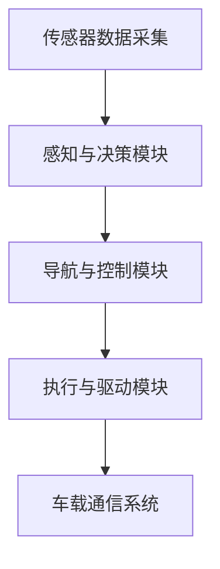
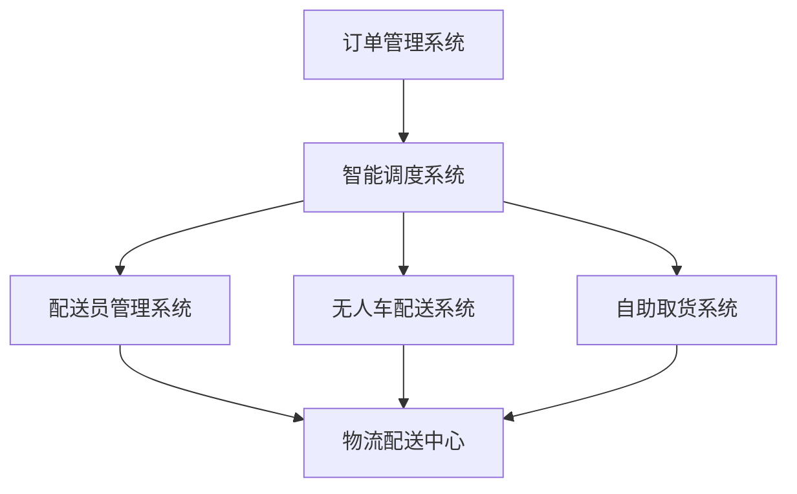

                 

# 第一部分：引言与概述

## 第1章：数字实体与物理实体的自动化趋势概述

### 1.1 引言

#### 1.1.1 时代的变革：数字化与自动化趋势的崛起

随着信息技术的迅猛发展，人类社会正经历着一场前所未有的数字化变革。数字化不仅改变了我们的生活方式，也深刻影响了各行各业的生产方式和管理模式。特别是在工业、农业、交通、医疗等领域，数字化的浪潮正在推动传统产业的转型升级。

自动化作为数字化进程的重要一环，正日益成为产业升级的关键驱动力。自动化技术的应用不仅提高了生产效率，降低了成本，还显著提升了产品质量和安全性。自动化趋势的崛起，标志着人类生产力的一次重大飞跃。

#### 1.1.2 数字实体与物理实体的定义与联系

数字实体是指通过数字化手段表示的物理实体，它可以是产品、设备、系统或过程。数字实体通常存在于计算机系统、数据库和网络中，以数据的形式进行存储、处理和传输。

物理实体则是现实世界中的实际存在，如机器、设备、建筑物、道路等。物理实体在生产和生活中发挥着直接作用，是数字化信息的基础。

数字实体与物理实体的联系主要体现在以下几个方面：

1. **数据采集**：通过传感器和监测设备，物理实体的状态和参数被实时采集并转化为数字信号。
2. **数据处理**：数字实体通过计算机系统和算法对采集到的数据进行分析和处理，生成有价值的信息。
3. **控制与反馈**：处理后的数据被用于控制物理实体的行为，并通过反馈机制不断优化和调整。

#### 1.1.3 自动化趋势对产业的影响

自动化趋势对各个行业产生了深远的影响：

1. **制造业**：自动化技术的应用显著提高了生产效率，缩短了产品周期，降低了生产成本。智能工厂、智能制造系统和工业物联网正在改变传统制造业的面貌。
2. **农业**：农业自动化通过智能灌溉、自动采摘和无人机监测等技术，提高了农业生产效率和产量，实现了农业生产的智能化和精准化。
3. **物流与运输**：自动化仓储、自动驾驶和智能配送系统正在提升物流与运输行业的效率和可靠性，降低了运营成本。
4. **城市管理**：智能交通系统、智能监控和智能基础设施的应用，提升了城市管理的效率和居民生活质量。

### 1.2 自动化趋势的核心概念

#### 1.2.1 数字孪生技术

数字孪生是一种创新的技术方法，它通过创建物理实体的虚拟副本（数字孪生体），实现对物理实体的全生命周期管理和优化。数字孪生技术包括数据采集、数据处理、仿真分析和实时控制等环节，其核心在于将物理实体的数据转化为可操作的数字信息。

#### 1.2.2 工业物联网（IIoT）

工业物联网是指将传感器、设备、网络系统和云计算平台连接起来，实现对工业设备和生产过程的实时监控和管理。IIoT的核心技术包括物联网通信协议、边缘计算、大数据分析和人工智能等。

#### 1.2.3 机器学习和人工智能在自动化中的应用

机器学习和人工智能技术为自动化带来了前所未有的发展机遇。通过机器学习算法，自动化系统能够从大量数据中学习和提取规律，实现对复杂问题的自动识别和优化。人工智能技术还广泛应用于图像识别、语音识别、自然语言处理等领域，提升了自动化系统的智能化水平。

### 1.3 自动化趋势的行业应用

#### 1.3.1 制造业的数字化转型

制造业正经历着数字化的深刻变革。通过引入自动化技术，制造企业能够实现生产过程的智能化、网络化和协同化。数字孪生技术、工业物联网和人工智能在制造业中的应用，推动了智能制造的快速发展。

#### 1.3.2 城市管理与基础设施自动化

智能城市的建设离不开自动化技术的支持。通过自动化监控、智能调度和数据分析，城市管理者能够更高效地管理城市交通、能源和环境。智能基础设施如智能电网、智能交通和智能水务系统，提升了城市的服务水平和居民的生活质量。

#### 1.3.3 物流与运输的自动化解决方案

物流与运输行业正通过自动化技术的应用，实现从仓储管理到配送运输的全面智能化。自动化仓储系统、自动驾驶车辆和智能配送系统，提高了物流与运输的效率和准确性。

#### 1.3.4 农业自动化趋势

农业自动化通过智能灌溉、自动采摘和无人机监测等技术，提高了农业生产效率和产量。农业物联网（AIoT）的广泛应用，使得农业生产更加智能化和精准化。

## 第二部分：数字孪生技术详解

### 2.1 数字孪生基本概念

#### 2.1.1 数字孪生的发展历史

数字孪生（Digital Twin）的概念最早由美国密歇根大学教授Michael Grieves在2002年提出。数字孪生旨在通过创建物理实体的虚拟副本，实现对物理实体的全生命周期管理和优化。

随着物联网、大数据和云计算技术的发展，数字孪生技术逐渐成熟并得到广泛应用。近年来，数字孪生技术在制造业、能源、医疗、建筑等领域取得了显著成果。

#### 2.1.2 数字孪生的定义与分类

数字孪生是指通过数字化手段，创建一个与物理实体高度相似的虚拟副本，实现对物理实体的实时监控、分析和优化。数字孪生可以分为以下几类：

1. **物理模型数字孪生**：通过计算机辅助设计（CAD）软件创建物理实体的三维数字模型。
2. **传感器数字孪生**：通过安装在物理实体上的传感器，实时采集物理实体的状态数据，构建数字孪生体。
3. **行为数字孪生**：通过仿真模型和算法，模拟物理实体的行为和运行状态。
4. **数字孪生平台**：整合数据采集、数据处理、仿真分析和实时控制等功能，提供数字孪生技术的综合解决方案。

#### 2.1.3 数字孪生的核心组成部分

数字孪生技术包括以下几个核心组成部分：

1. **数据采集**：通过传感器和监测设备，实时采集物理实体的状态数据。
2. **数据处理**：对采集到的数据进行分析和处理，提取有价值的信息。
3. **数字模型**：创建物理实体的虚拟副本，作为数字孪生体的基础。
4. **仿真分析**：利用数字模型和算法，对物理实体的运行状态和性能进行仿真和分析。
5. **实时控制**：根据仿真分析和数据处理结果，对物理实体的行为进行实时控制和优化。

### 2.2 数字孪生应用场景

#### 2.2.1 制造业中的应用

数字孪生技术在制造业中有着广泛的应用。通过数字孪生技术，制造企业能够实现对生产设备的实时监控、故障预测和性能优化。以下是一个制造业中的数字孪生应用案例：

1. **生产设备监控**：通过安装在设备上的传感器，实时采集设备的工作状态数据，如温度、压力、振动等。
2. **故障预测**：利用数据分析算法，对采集到的设备状态数据进行实时分析，预测设备的故障风险。
3. **性能优化**：根据仿真分析结果，对设备的运行参数进行调整，实现最优的运行状态。

#### 2.2.2 能源行业中的应用

数字孪生技术在能源行业中的应用同样具有重要意义。通过数字孪生技术，能源企业能够实现对能源设备的实时监控、故障预测和性能优化。

以下是一个能源行业中的数字孪生应用案例：

1. **设备状态监测**：通过传感器和监测设备，实时采集能源设备的工作状态数据。
2. **故障预测**：利用数据分析算法，对采集到的设备状态数据进行实时分析，预测设备的故障风险。
3. **能源管理**：根据仿真分析结果，优化能源设备的运行策略，提高能源利用效率。

#### 2.2.3 建筑与基础设施中的应用

数字孪生技术在建筑与基础设施管理中具有广泛的应用前景。通过数字孪生技术，建筑企业能够实现对建筑物的实时监控、故障预测和维护管理。

以下是一个建筑与基础设施中的数字孪生应用案例：

1. **建筑物监控**：通过安装在建筑物内的传感器，实时采集建筑物的状态数据，如温度、湿度、能耗等。
2. **故障预测**：利用数据分析算法，对采集到的建筑物状态数据进行实时分析，预测建筑物的故障风险。
3. **维护管理**：根据仿真分析结果，制定合理的维护计划，确保建筑物的安全和正常运行。

#### 2.2.4 医疗保健中的应用

数字孪生技术在医疗保健领域也有着重要的应用。通过数字孪生技术，医疗机构能够实现对病人的实时监控、疾病预测和个性化治疗。

以下是一个医疗保健中的数字孪生应用案例：

1. **病人监测**：通过传感器和监测设备，实时采集病人的生理参数，如心率、血压、血氧等。
2. **疾病预测**：利用数据分析算法，对采集到的病人数据进行实时分析，预测病人的疾病风险。
3. **个性化治疗**：根据仿真分析结果，为病人制定个性化的治疗方案，提高治疗效果。

### 2.3 数字孪生技术的挑战与展望

#### 2.3.1 技术挑战

尽管数字孪生技术在各个领域取得了显著成果，但仍然面临着一系列技术挑战：

1. **数据质量**：数据是数字孪生的核心，数据质量直接影响数字孪生的效果。如何确保数据的高质量和准确性，是一个亟待解决的问题。
2. **数据处理能力**：随着传感器和监测设备的普及，数据量呈爆炸式增长。如何高效地处理海量数据，是一个重要的技术挑战。
3. **实时性**：数字孪生技术需要实现对物理实体的实时监控和分析。如何提高实时性，是另一个关键问题。

#### 2.3.2 应用前景

数字孪生技术具有广阔的应用前景：

1. **智能制造**：数字孪生技术将推动智能制造的发展，实现生产过程的智能化和自动化。
2. **智慧城市**：数字孪生技术将提高城市管理的效率和水平，实现智慧城市的建设。
3. **医疗健康**：数字孪生技术将提升医疗保健的服务质量和效率，实现个性化医疗。

### 2.4 数字孪生案例分析

#### 2.4.1 案例一：智能制造业

智能制造业是数字孪生技术的重要应用领域。通过数字孪生技术，制造企业能够实现对生产设备的实时监控、故障预测和性能优化。

以下是一个智能制造业的数字孪生应用案例：

1. **生产设备监控**：通过安装在设备上的传感器，实时采集设备的工作状态数据，如温度、压力、振动等。
2. **故障预测**：利用数据分析算法，对采集到的设备状态数据进行实时分析，预测设备的故障风险。
3. **性能优化**：根据仿真分析结果，对设备的运行参数进行调整，实现最优的运行状态。

#### 2.4.2 案例二：智能医疗

智能医疗是数字孪生技术的另一个重要应用领域。通过数字孪生技术，医疗机构能够实现对病人的实时监控、疾病预测和个性化治疗。

以下是一个智能医疗的数字孪生应用案例：

1. **病人监测**：通过传感器和监测设备，实时采集病人的生理参数，如心率、血压、血氧等。
2. **疾病预测**：利用数据分析算法，对采集到的病人数据进行实时分析，预测病人的疾病风险。
3. **个性化治疗**：根据仿真分析结果，为病人制定个性化的治疗方案，提高治疗效果。

#### 2.4.3 案例三：智能城市

智能城市是数字孪生技术的广泛应用的领域之一。通过数字孪生技术，城市管理者能够实现对城市基础设施的实时监控、故障预测和优化管理。

以下是一个智能城市的数字孪生应用案例：

1. **城市基础设施监控**：通过安装在基础设施上的传感器，实时采集基础设施的工作状态数据，如温度、湿度、能耗等。
2. **故障预测**：利用数据分析算法，对采集到的基础设施状态数据进行实时分析，预测基础设施的故障风险。
3. **优化管理**：根据仿真分析结果，制定合理的维护计划，确保基础设施的安全和正常运行。

## 第三部分：工业物联网（IIoT）与智能工厂

### 3.1 工业物联网（IIoT）概述

#### 3.1.1 IIoT的定义与重要性

工业物联网（Industrial Internet of Things，IIoT）是指将传感器、设备、网络系统和云计算平台连接起来，实现对工业设备和生产过程的实时监控和管理。IIoT的核心目标是提高生产效率、降低运营成本、提升产品质量和安全性。

IIoT在智能工厂建设、智能制造、工业自动化等领域具有重要意义。它不仅能够实现生产过程的智能化和网络化，还能够提供丰富的数据支持，为企业的决策提供有力依据。

#### 3.1.2 IIoT的关键技术

IIoT的关键技术包括以下几个方面：

1. **物联网通信协议**：物联网通信协议是实现设备间数据传输的关键。常见的物联网通信协议有ZigBee、Wi-Fi、LoRa等。
2. **边缘计算**：边缘计算是指在靠近数据源的地方进行计算和处理，减轻中心服务器的负担。边缘计算技术能够实现实时数据处理和快速响应。
3. **大数据分析**：大数据分析技术能够对海量数据进行处理和分析，提取有价值的信息。大数据分析技术在IIoT中发挥着重要作用。
4. **人工智能**：人工智能技术能够实现对复杂问题的自动识别和优化。在IIoT中，人工智能技术主要用于设备预测性维护和智能调度。

#### 3.1.3 IIoT在智能工厂中的应用

IIoT在智能工厂中的应用主要体现在以下几个方面：

1. **设备监控**：通过安装在设备上的传感器，实时采集设备的工作状态数据，实现对设备的远程监控和管理。
2. **生产过程优化**：通过对生产过程的数据分析，识别生产瓶颈和优化生产流程，提高生产效率。
3. **预测性维护**：通过数据分析，预测设备的故障风险，提前进行维护，降低设备故障率和维修成本。
4. **供应链管理**：通过物联网技术，实现供应链的实时监控和优化，提高供应链的透明度和协同效率。

### 3.2 智能工厂建设

#### 3.2.1 智能工厂的架构设计

智能工厂的架构设计是智能工厂建设的关键。智能工厂的架构设计通常包括以下几个方面：

1. **感知层**：感知层是智能工厂的感知系统，主要包括各种传感器和监测设备。感知层的主要任务是实时采集设备和工作环境的状态数据。
2. **传输层**：传输层是智能工厂的数据传输系统，主要负责将感知层采集到的数据传输到数据中心。传输层通常采用物联网通信协议。
3. **平台层**：平台层是智能工厂的核心，主要负责数据存储、处理和分析。平台层通常采用云计算和大数据分析技术。
4. **应用层**：应用层是智能工厂的应用系统，主要负责对数据进行可视化展示和业务应用。应用层包括设备监控、生产调度、质量检测等模块。

#### 3.2.2 智能制造系统的实现

智能制造系统是智能工厂的核心系统。智能制造系统的实现通常包括以下几个方面：

1. **设备自动化**：通过自动化设备，实现生产过程的自动化和智能化。自动化设备包括机器人、自动导引车（AGV）等。
2. **数据集成**：将各种设备的数据集成到一个统一的平台上，实现数据的统一管理和分析。
3. **智能调度**：通过对生产过程的数据分析，实现智能调度，优化生产流程和提高生产效率。
4. **质量管理**：通过对产品质量的实时监控和数据分析，实现质量管理的智能化和精细化。

#### 3.2.3 智能工厂的运营与维护

智能工厂的运营与维护是确保智能工厂正常运行的关键。智能工厂的运营与维护通常包括以下几个方面：

1. **设备维护**：通过物联网技术和数据分析，实现对设备的实时监控和预测性维护，降低设备故障率和维修成本。
2. **环境监控**：通过传感器和监测设备，实时监控工厂的环境状态，如温度、湿度、噪音等，确保生产环境的舒适和安全。
3. **安全管理**：通过视频监控和入侵检测等技术，实现对工厂的安全监控和管理，确保工厂的安全运营。
4. **能源管理**：通过能源监控和数据分析，实现能源的高效利用和优化管理，降低能源消耗和运营成本。

### 3.3 案例分析

#### 3.3.1 案例一：汽车制造厂

汽车制造厂是智能工厂的典型代表。通过IIoT技术和智能制造系统，汽车制造厂实现了生产过程的自动化和智能化。

以下是一个汽车制造厂的智能工厂案例分析：

1. **设备监控**：通过安装在生产线上的传感器，实时采集设备的工作状态数据，实现对设备的远程监控和管理。
2. **生产调度**：通过对生产过程的数据分析，实现智能调度，优化生产流程和提高生产效率。
3. **质量管理**：通过对产品质量的实时监控和数据分析，实现质量管理的智能化和精细化。
4. **能源管理**：通过能源监控和数据分析，实现能源的高效利用和优化管理，降低能源消耗和运营成本。

#### 3.3.2 案例二：电子制造业

电子制造业是另一个智能工厂的重要应用领域。通过IIoT技术和智能制造系统，电子制造业实现了生产过程的自动化和智能化。

以下是一个电子制造业的智能工厂案例分析：

1. **设备自动化**：通过自动化设备，实现生产过程的自动化和智能化。自动化设备包括SMT贴片机、自动焊接机等。
2. **数据集成**：将各种设备的数据集成到一个统一的平台上，实现数据的统一管理和分析。
3. **智能调度**：通过对生产过程的数据分析，实现智能调度，优化生产流程和提高生产效率。
4. **质量管理**：通过对产品质量的实时监控和数据分析，实现质量管理的智能化和精细化。

#### 3.3.3 案例三：食品加工业

食品加工业是智能工厂的另一个重要应用领域。通过IIoT技术和智能制造系统，食品加工业实现了生产过程的自动化和智能化。

以下是一个食品加工业的智能工厂案例分析：

1. **设备监控**：通过安装在生产线上的传感器，实时采集设备的工作状态数据，实现对设备的远程监控和管理。
2. **生产调度**：通过对生产过程的数据分析，实现智能调度，优化生产流程和提高生产效率。
3. **质量管理**：通过对产品质量的实时监控和数据分析，实现质量管理的智能化和精细化。
4. **能源管理**：通过能源监控和数据分析，实现能源的高效利用和优化管理，降低能源消耗和运营成本。

## 第四部分：人工智能在自动化中的应用

### 4.1 人工智能的基本原理

#### 4.1.1 机器学习基础

机器学习是人工智能（AI）的核心技术之一，它使计算机系统能够从数据中学习和改进。机器学习的基本原理包括以下几个步骤：

1. **数据收集**：收集用于训练的数据集，这些数据集应该包含输入（特征）和对应的输出（目标）。
2. **数据处理**：对收集到的数据进行清洗、归一化等预处理，以提高数据质量和模型的性能。
3. **模型选择**：选择合适的机器学习算法，如线性回归、决策树、支持向量机、神经网络等。
4. **模型训练**：使用训练数据集训练模型，模型通过不断调整内部参数来最小化预测误差。
5. **模型评估**：使用验证数据集评估模型的性能，常用的评估指标包括准确率、召回率、F1分数等。
6. **模型部署**：将训练好的模型部署到生产环境中，实现对新数据的预测。

#### 4.1.2 深度学习算法简介

深度学习是机器学习的一个重要分支，它通过多层神经网络来模拟人脑的神经结构，实现对复杂数据的处理和模式识别。深度学习算法的基本原理如下：

1. **神经网络结构**：深度学习模型通常由多个隐藏层组成，每个隐藏层都能对输入数据进行特征提取。
2. **前向传播**：输入数据通过网络的各个层进行传播，每一层都会对数据进行线性变换和激活函数应用。
3. **反向传播**：计算输出误差，并反向传播误差，通过梯度下降等优化算法更新网络的权重。
4. **优化目标**：深度学习模型的目标是最小化预测误差，常用的优化算法有随机梯度下降（SGD）、Adam等。
5. **超参数调优**：调整学习率、批次大小、正则化参数等超参数，以提高模型的性能和泛化能力。

#### 4.1.3 强化学习在自动化中的应用

强化学习是一种通过试错和奖励机制来学习策略的机器学习方法。强化学习在自动化系统中有着广泛的应用，例如机器人控制、自动驾驶、游戏AI等。强化学习的基本原理如下：

1. **环境和agent**：agent代表决策主体，环境是agent执行动作的场所。agent通过感知环境状态，选择动作并得到奖励。
2. **状态-动作值函数**：状态-动作值函数（State-Action Value Function）表示在特定状态下执行特定动作的预期奖励。
3. **策略**：策略（Policy）是agent在给定状态下的最佳动作选择。策略可以通过值函数或策略梯度方法进行学习。
4. **奖励机制**：奖励机制用于评估agent的动作是否有利于达到目标。奖励可以是正面的（如完成任务），也可以是负面的（如发生错误）。
5. **学习过程**：agent通过不断尝试和反馈，不断调整策略，以最大化长期奖励。

### 4.2 人工智能在工业自动化中的应用

#### 4.2.1 机器人自动化

机器人自动化是工业自动化中的重要组成部分。通过人工智能技术，机器人能够实现自主决策和操作，提高生产效率和灵活性。以下是机器人自动化的几个关键应用：

1. **装配**：机器人可以在生产线上自动完成装配任务，如装配电子元件、组装汽车零件等。
2. **搬运**：机器人可以自动搬运重物、放置产品，减少人工操作的风险和成本。
3. **焊接**：机器人可以进行自动焊接，提高焊接质量和生产效率。
4. **检测**：机器人可以用于产品质量检测，如检测零件尺寸、外观等。

以下是一个机器人自动化的实例：

```python
# 示例：使用Python实现机器人自动装配

import numpy as np
import cv2

# 初始化摄像头
cap = cv2.VideoCapture(0)

while True:
    # 读取一帧图像
    ret, frame = cap.read()
    
    # 图像预处理
    gray = cv2.cvtColor(frame, cv2.COLOR_BGR2GRAY)
    blurred = cv2.GaussianBlur(gray, (5, 5), 0)
    threshold = cv2.threshold(blurred, 0, 255, cv2.THRESH_BINARY_INV + cv2.THRESH_OTSU)[1]
    
    # 检测装配零件
    contours, _ = cv2.findContours(threshold, cv2.RETR_EXTERNAL, cv2.CHAIN_APPROX_SIMPLE)
    for contour in contours:
        if cv2.contourArea(contour) > 500:
            x, y, w, h = cv2.boundingRect(contour)
            cv2.rectangle(frame, (x, y), (x+w, y+h), (0, 255, 0), 2)
            # 执行装配操作
            # ...
    
    # 显示图像
    cv2.imshow('Robot Assembly', frame)
    
    if cv2.waitKey(1) & 0xFF == ord('q'):
        break

cap.release()
cv2.destroyAllWindows()
```

#### 4.2.2 机器视觉与图像处理

机器视觉是人工智能在自动化中的重要应用领域。通过图像处理技术，系统可以自动识别、分析和理解图像信息。以下是机器视觉与图像处理的几个关键应用：

1. **缺陷检测**：通过机器视觉系统，可以自动检测产品表面的缺陷，如裂纹、气泡等。
2. **物体识别**：机器视觉系统可以识别和分类不同的物体，如识别不同类型的零部件。
3. **姿态估计**：通过图像处理，可以估计物体的姿态和位置，用于机器人操作和导航。
4. **行为分析**：通过分析视频图像，可以识别和预测人的行为，如交通监控、安全防护等。

以下是一个简单的机器视觉实例：

```python
# 示例：使用OpenCV实现物体检测

import cv2

# 加载预训练的物体检测模型
net = cv2.dnn.readNetFromCaffe('deploy.prototxt', 'res10_300x300_iter_400000.caffemodel')

# 加载测试图像
image = cv2.imread('test_image.jpg')

# 进行图像预处理
h, w = image.shape[:2]
blob = cv2.dnn.blobFromImage(image, 1.0, (w, h), (104.0, 177.0, 123.0))

# 进行物体检测
net.setInput(blob)
detections = net.forward()

# 遍历检测结果
for i in range(detections.shape[2]):
    confidence = detections[0, 0, i, 2]
    if confidence > 0.5:
        class_id = int(detections[0, 0, i, 1])
        label = labels[class_id]
        x, y, w, h = detections[0, 0, i, 3:7] * np.array([w, h, w, h])
        cv2.rectangle(image, (int(x), int(y)), (int(x+w), int(y+h)), (0, 255, 0), 2)
        cv2.putText(image, label, (int(x), int(y-10)), cv2.FONT_HERSHEY_SIMPLEX, 0.5, (255, 0, 0), 2)

# 显示检测结果
cv2.imshow('Object Detection', image)
cv2.waitKey(0)
cv2.destroyAllWindows()
```

#### 4.2.3 智能调度与优化

智能调度是工业自动化中的重要问题。通过人工智能技术，可以实现对生产任务的智能调度和优化，提高生产效率和资源利用率。以下是智能调度与优化的一些关键应用：

1. **任务分配**：根据生产任务的要求和设备状态，智能分配任务到不同的设备或机器人，提高生产效率。
2. **资源调度**：根据生产任务的需求，动态调整资源（如人力、设备、原材料等），实现资源的最优配置。
3. **库存管理**：通过智能调度系统，实时监控库存状态，优化库存策略，降低库存成本。
4. **流程优化**：通过分析生产数据和流程，优化生产流程，减少生产周期和成本。

以下是一个简单的智能调度实例：

```python
# 示例：使用Python实现生产任务调度

import heapq

# 定义生产任务
tasks = [
    {'name': 'task1', 'duration': 10, 'required_resources': ['resource1', 'resource2']},
    {'name': 'task2', 'duration': 5, 'required_resources': ['resource2', 'resource3']},
    {'name': 'task3', 'duration': 8, 'required_resources': ['resource1', 'resource3']},
]

# 定义设备状态
devices = [
    {'name': 'device1', 'available_resources': ['resource1', 'resource2']},
    {'name': 'device2', 'available_resources': ['resource2', 'resource3']},
    {'name': 'device3', 'available_resources': ['resource1', 'resource3']},
]

# 定义调度算法
def schedule_tasks(tasks, devices):
    scheduled_tasks = []
    for task in tasks:
        for device in devices:
            if all(resource in device['available_resources'] for resource in task['required_resources']):
                scheduled_tasks.append((device['name'], task['name'], task['duration']))
                devices[devices.index(device)]['available_resources'].extend(task['required_resources'])
                break
    return scheduled_tasks

# 调度生产任务
scheduled_tasks = schedule_tasks(tasks, devices)

# 打印调度结果
print("Scheduled Tasks:")
for task in scheduled_tasks:
    print(f"Device: {task[0]}, Task: {task[1]}, Duration: {task[2]}")
print("Remaining Resources:")
for device in devices:
    print(f"Device: {device['name']}, Resources: {device['available_resources']}")
```

## 第五部分：智能物流与运输

### 5.1 智能物流技术概述

#### 5.1.1 自动化仓储系统

自动化仓储系统是智能物流技术中的重要组成部分。通过自动化设备，如自动导引车（AGV）、自动货架拣选机器人等，仓储系统能够实现高效的货物存储和检索。以下是自动化仓储系统的几个关键特点：

1. **高效率**：自动化仓储系统能够在短时间内完成大量的货物搬运和拣选任务，提高仓储作业效率。
2. **准确性**：自动化设备具有高精度的定位和检测功能，能够确保货物准确无误地存储和检索。
3. **灵活性**：自动化仓储系统可以根据需求灵活调整作业流程和设备配置，适应不同的仓储场景。
4. **可扩展性**：自动化仓储系统可以根据业务需求进行扩展，增加存储容量和作业能力。

以下是一个简单的自动化仓储系统架构图：

```mermaid
graph TD
    A[订单处理系统] --> B[仓储管理系统]
    B --> C[自动导引车(AGV)]
    B --> D[自动货架拣选机器人]
    C --> E[货架存储系统]
    D --> E
```

#### 5.1.2 自动驾驶技术与无人车

自动驾驶技术是智能物流与运输领域的另一重要突破。无人车能够在没有人类干预的情况下自主导航和行驶，实现货物的自动运输。以下是自动驾驶技术的主要特点和应用：

1. **自主导航**：自动驾驶技术通过传感器、摄像头和GPS等设备，实现车辆在复杂环境中的自主导航和行驶。
2. **高可靠性**：自动驾驶技术能够实时感知周围环境，并做出快速反应，确保行驶的安全和可靠性。
3. **降低成本**：无人车能够减少人力成本，提高运输效率，降低运营成本。
4. **广泛适用**：自动驾驶技术可以应用于城市配送、长途货运、仓储运输等多种场景。

以下是一个简单的自动驾驶系统架构图：



#### 5.1.3 智能配送与最后一公里解决方案

智能配送是智能物流与运输的最后一环，直接关系到物流服务的用户体验。智能配送通过自动化和智能化手段，实现货物的快速、准确交付。以下是智能配送与最后一公里解决方案的关键特点：

1. **实时跟踪**：智能配送系统能够实时跟踪货物的位置和状态，提高配送的透明度和可靠性。
2. **智能调度**：通过数据分析，智能配送系统能够优化配送路线，减少配送时间和成本。
3. **多样化交付方式**：智能配送系统支持多种交付方式，如快递员配送、无人车配送、自助取货等，满足不同用户的需求。
4. **高效交付**：智能配送系统能够快速响应订单，确保货物在最后一公里高效交付。

以下是一个智能配送与最后一公里解决方案的架构图：



### 5.2 智能物流案例分析

#### 5.2.1 案例一：电商物流的智能化改造

电商物流的智能化改造是智能物流技术的典型应用之一。通过引入自动化仓储系统和智能配送系统，电商物流企业能够显著提高配送效率和用户体验。

以下是一个电商物流智能化改造的案例分析：

1. **自动化仓储**：引入自动导引车（AGV）和自动货架拣选机器人，实现货物的自动存储和检索。通过仓储管理系统，实时监控仓储作业，优化仓储布局和作业流程。
2. **智能配送**：采用无人车和快递员管理系统，实现货物的智能配送。通过智能调度系统，优化配送路线和时间，确保货物快速、准确交付。
3. **用户反馈**：通过用户反馈系统，实时收集用户对配送服务的评价，不断优化配送流程和服务质量。

#### 5.2.2 案例二：冷链物流的智能优化

冷链物流的智能优化是另一个智能物流技术的重要应用领域。通过智能监控和自动化技术，冷链物流企业能够确保货物在运输过程中的安全和质量。

以下是一个冷链物流智能优化的案例分析：

1. **智能监控**：采用传感器和物联网技术，实时监控货物的温度、湿度等环境参数，确保货物在运输过程中的质量。
2. **智能调度**：通过数据分析，优化冷链物流的运输路线和时间，减少运输时间和成本。
3. **温控管理**：采用智能温控设备，确保货物在运输过程中的温度控制，提高货物质量。

#### 5.2.3 案例三：国际物流的智能解决方案

国际物流的智能解决方案是智能物流技术的另一个重要应用领域。通过智能物流系统，国际物流企业能够提高运输效率和降低运营成本。

以下是一个国际物流智能解决方案的案例分析：

1. **智能报关**：采用电子报关系统，实现货物的智能报关，提高报关效率和准确性。
2. **智能仓储**：通过自动化仓储系统，实现货物的智能存储和检索，提高仓储效率。
3. **智能运输**：采用无人车和智能导航系统，实现货物的智能运输，提高运输效率和安全性。
4. **物流跟踪**：通过物联网技术，实时跟踪货物的位置和状态，提高物流服务的透明度和可靠性。

## 第六部分：农业自动化趋势

### 6.1 农业自动化概述

农业自动化是指利用现代信息技术和自动化技术，提高农业生产效率和品质，降低生产成本，实现农业的智能化和精准化。农业自动化技术的广泛应用，将显著改变传统的农业生产方式，推动农业现代化进程。

#### 6.1.1 农业自动化的重要性

农业自动化在现代农业发展中具有重要意义：

1. **提高生产效率**：自动化设备能够高效完成播种、施肥、灌溉、收割等农事操作，提高农业生产效率。
2. **降低生产成本**：自动化技术能够减少人力投入，降低生产成本，提高农业经济效益。
3. **保障农产品质量**：自动化技术能够实现农产品的精准化生产和管理，提高农产品质量，保障食品安全。
4. **促进农业现代化**：农业自动化是现代农业发展的重要标志，有助于推动农业转型升级和可持续发展。

#### 6.1.2 农业自动化技术的分类

农业自动化技术主要包括以下几个方面：

1. **机械自动化**：利用农业机械和设备，实现农事操作的自动化，如播种机、施肥机、收割机等。
2. **物联网技术**：通过物联网技术，实现对农业生产环境的实时监控和智能管理，如智能灌溉系统、土壤传感器等。
3. **无人机技术**：利用无人机进行农田监测、施肥、喷药等操作，提高农业生产的精准度。
4. **智能监测与控制系统**：通过智能监测与控制系统，实现农业生产的自动化和智能化管理，如智能温室控制系统、智能灌溉系统等。

#### 6.1.3 农业自动化技术的应用领域

农业自动化技术在农业生产中的应用广泛，涵盖了种植、灌溉、施肥、收割、病虫害防治等各个环节：

1. **种植自动化**：通过自动化播种机、移栽机等设备，实现播种、移栽等操作的自动化。
2. **灌溉自动化**：利用智能灌溉系统，根据土壤水分含量和作物需水情况，实现精准灌溉。
3. **施肥自动化**：通过智能施肥机，根据作物生长需求和土壤养分状况，实现精准施肥。
4. **收割自动化**：利用自动化收割机，实现农作物的自动化收割，提高收割效率。
5. **病虫害防治自动化**：利用无人机和智能监控系统，实时监测病虫害发生情况，实现自动化喷药和防治。

### 6.2 农业自动化案例分析

#### 6.2.1 案例一：智能灌溉系统

智能灌溉系统是农业自动化技术的重要应用之一。通过物联网技术和智能控制系统，实现灌溉过程的自动化和精准化。

以下是一个智能灌溉系统的案例分析：

1. **传感器监测**：在农田中布置土壤湿度传感器，实时监测土壤水分含量。
2. **数据分析**：通过数据处理和分析，确定灌溉的最佳时间和灌溉量。
3. **自动控制**：利用智能灌溉系统，根据土壤水分监测数据，自动控制灌溉设备的开启和关闭。
4. **节能降耗**：通过智能灌溉系统，减少水资源浪费，降低灌溉成本。

#### 6.2.2 案例二：自动采摘机器人

自动采摘机器人是农业自动化技术的又一重要应用。通过视觉识别和机械臂技术，实现农作物的自动化采摘。

以下是一个自动采摘机器人的案例分析：

1. **视觉识别**：利用计算机视觉技术，识别农田中的农作物和周边环境。
2. **路径规划**：根据农作物位置和机器人运动状态，规划采摘路径。
3. **机械臂操作**：通过机械臂完成农作物的抓取、运输和放置等操作。
4. **自动化运行**：实现农作物的自动化采摘，提高采摘效率和质量。

#### 6.2.3 案例三：农业无人机监测与应用

农业无人机监测是农业自动化技术的重要应用领域。通过无人机和传感器技术，实现对农田的实时监测和数据分析。

以下是一个农业无人机监测的案例分析：

1. **无人机监测**：利用农业无人机，搭载高清摄像头和传感器，实时监测农田状况。
2. **数据分析**：通过数据分析，确定农田的土壤养分、作物生长状况和病虫害情况。
3. **决策支持**：根据监测数据，为农民提供精准的农业管理建议，如施肥、喷药等。
4. **智能化应用**：通过农业无人机监测系统，实现农田的智能化管理，提高农业生产效率。

### 6.3 农业自动化发展趋势

#### 6.3.1 农业物联网（AIoT）在农业中的应用

农业物联网（AIoT）是农业自动化的重要发展方向。通过物联网技术和大数据分析，实现农业生产的智能化和精准化。

以下是一个农业物联网在农业中的应用趋势：

1. **实时监测**：通过传感器网络，实时监测农田的温度、湿度、土壤养分等环境参数。
2. **数据融合**：将传感器数据、遥感数据、气象数据等进行融合分析，为农业生产提供全面的信息支持。
3. **智能决策**：利用大数据分析和人工智能技术，为农业生产提供智能决策支持，如灌溉、施肥、病虫害防治等。
4. **农业区块链**：通过区块链技术，实现农产品从生产到销售的全过程可追溯，提高农产品质量和安全。

#### 6.3.2 智能农业与可持续发展

智能农业是现代农业发展的重要方向，与可持续发展密不可分。

以下是一个智能农业与可持续发展的发展趋势：

1. **精准农业**：通过物联网技术和大数据分析，实现精准农业，降低农业生产对资源的消耗，提高资源利用效率。
2. **生态农业**：通过生态农业技术，如有机种植、生物防治等，实现农业生产的可持续发展和生态环境保护。
3. **智慧农业**：通过智慧农业技术，实现农业生产的智能化、网络化和协同化，提高农业生产效率和农产品质量。
4. **农业社会化服务**：通过农业社会化服务，如农业电商平台、农业智能管理等，提高农业社会化服务水平，促进农业可持续发展。

#### 6.3.3 农业自动化对劳动力的影响

农业自动化技术的广泛应用将对劳动力产生深远影响。

以下是一个农业自动化对劳动力的影响分析：

1. **就业结构变化**：农业自动化将改变传统的农业生产方式，减少对农业生产劳动力的需求，但同时也将创造新的就业机会，如农业技术员、农业物联网工程师等。
2. **劳动力素质要求提高**：农业自动化对劳动力的素质要求提高，需要具备一定的技术知识和操作技能，适应现代农业发展的需求。
3. **农业劳动力转移**：农业自动化将推动农业劳动力向城市和非农产业转移，促进农村劳动力就业结构优化。
4. **劳动力权益保障**：农业自动化在提高农业生产效率的同时，也需要关注农业劳动力的权益保障，确保劳动力的合法权益得到保障。

## 第七部分：未来展望与挑战

### 7.1 自动化技术的未来趋势

#### 7.1.1 新一代人工智能技术

新一代人工智能技术将在未来进一步推动自动化技术的发展。深度学习、强化学习、自然语言处理等技术的不断突破，将使自动化系统更加智能化、自适应和高效。

以下是一个自动化技术的未来发展趋势：

1. **自适应系统**：通过强化学习等技术，实现自动化系统在复杂环境下的自适应能力，提高系统的稳定性和鲁棒性。
2. **自主决策**：通过深度学习等技术，实现自动化系统在未知环境下的自主决策能力，减少对人类干预的需求。
3. **多模态感知**：通过多模态感知技术，实现自动化系统对多种感知数据的融合处理，提高系统的感知能力和决策能力。
4. **人机协作**：通过人机协作技术，实现人与自动化系统的无缝协作，提高系统的整体效率。

#### 7.1.2 自动化技术在新兴行业中的应用

自动化技术将在未来新兴行业中得到广泛应用，如医疗健康、金融服务、教育等行业。

以下是一个自动化技术在新兴行业中的应用趋势：

1. **医疗健康**：通过自动化技术，实现医疗设备的智能化管理和患者数据的实时监测，提高医疗服务质量和效率。
2. **金融服务**：通过自动化技术，实现金融交易和风险评估的自动化，提高金融服务的效率和安全性。
3. **教育**：通过自动化技术，实现教育资源的智能化管理和个性化教学，提高教育质量和学习效果。
4. **智慧城市**：通过自动化技术，实现城市管理的智能化和精细化，提高城市服务水平和居民生活质量。

#### 7.1.3 自动化与人类工作的融合

自动化技术的发展将深刻改变人类的工作方式，实现自动化与人类工作的融合。

以下是一个自动化与人类工作融合的发展趋势：

1. **协同工作**：通过自动化技术，实现人与自动化系统的协同工作，提高工作效率和质量。
2. **技能提升**：通过自动化技术，推动人类工作技能的提升，培养适应自动化时代的人才。
3. **就业转型**：通过自动化技术，推动就业结构的转型，创造新的就业机会，提高就业质量。
4. **社会和谐**：通过自动化技术，促进社会和谐发展，提高人类生活质量和社会幸福感。

### 7.2 自动化技术的挑战

#### 7.2.1 技术发展面临的难题

自动化技术的发展仍然面临着一系列技术难题，需要持续攻关。

以下是一个自动化技术发展面临的难题：

1. **复杂性**：自动化系统通常涉及到复杂的物理过程、不确定的环境和多种因素相互作用，需要解决复杂系统的建模和优化问题。
2. **实时性**：自动化系统需要具备实时响应和决策能力，如何在有限时间内完成复杂的计算和处理，是一个重要挑战。
3. **可靠性和安全性**：自动化系统需要具备高可靠性和安全性，确保系统在各种环境下的稳定运行和安全性。
4. **数据处理能力**：随着传感器和设备数量的增加，数据处理能力成为一个重要的挑战，需要解决海量数据的高效处理和存储问题。

#### 7.2.2 自动化对社会的影响

自动化技术的发展将对社会产生深远的影响，需要关注其经济、社会和文化等方面的挑战。

以下是一个自动化技术对社会影响的挑战：

1. **就业替代**：自动化技术可能导致部分就业岗位的替代，需要关注就业结构的调整和劳动力的再培训。
2. **经济结构调整**：自动化技术的发展将推动经济结构的调整和升级，需要关注产业转型和创新能力。
3. **社会伦理**：自动化技术引发的道德和伦理问题，如隐私保护、公平性、责任归属等，需要加强社会伦理和法律建设。
4. **技术垄断**：自动化技术的发展可能导致技术垄断，影响市场竞争和创新发展，需要加强技术创新和知识产权保护。

#### 7.2.3 自动化伦理与法律问题

自动化技术的发展引发了一系列伦理和法律问题，需要制定相应的伦理和法律规范。

以下是一个自动化伦理和法律问题的挑战：

1. **责任归属**：在自动化系统中，如何界定责任归属成为一个重要问题，需要制定明确的责任界定和法律规范。
2. **隐私保护**：自动化系统通常涉及到大量个人数据的收集和使用，需要加强隐私保护，防止数据泄露和滥用。
3. **伦理审查**：在自动化技术的应用过程中，需要建立伦理审查机制，确保技术的应用符合伦理规范和道德标准。
4. **法律规范**：需要制定相应的法律法规，规范自动化技术的研发、应用和监管，确保技术安全和社会公共利益。

## 附录：自动化相关资源与工具

### 附录 A：自动化技术相关文献与报告

为了更好地了解自动化技术的发展和应用，以下是一些推荐的文献和报告：

1. **文献**：
   - 《智能制造技术与应用》
   - 《工业物联网技术与应用》
   - 《人工智能在自动化中的应用》
   - 《农业自动化技术》

2. **报告**：
   - **国际报告**：
     - 国际电信联盟（ITU）：《物联网发展报告》
     - 国际机器人联合会（IFR）：《全球机器人报告》
     - 国际电气电子工程师协会（IEEE）：《工业物联网白皮书》
   - **国内报告**：
     - 工业和信息化部：《智能制造发展规划（2016-2020年）》
     - 国家统计局：《中国工业物联网产业发展报告》
     - 中国人工智能学会：《中国人工智能发展报告》

### 附录 B：自动化工具与平台介绍

为了支持自动化技术的研发和应用，以下是一些常用的自动化工具和平台：

1. **工具**：
   - **Python**：一种流行的编程语言，广泛应用于数据科学、机器学习和自动化领域。
   - **MATLAB**：一款强大的科学计算和数据分析软件，适用于自动化算法开发和仿真。
   - **ROS（Robot Operating System）**：一款开源的机器人操作系统，用于机器人编程和控制。

2. **平台**：
   - **AWS IoT**：亚马逊提供的物联网平台，支持设备连接、数据收集和处理。
   - **Azure IoT Hub**：微软提供的物联网平台，提供设备连接、数据存储和智能分析功能。
   - **IBM Watson IoT**：IBM提供的物联网平台，支持设备连接、数据分析和智能决策。

### 附录 C：自动化行业协会与组织介绍

自动化技术的发展离不开行业协会和组织的推动和支持，以下是一些重要的自动化行业协会和组织：

1. **国际自动化协会（IAA）**：全球领先的自动化行业协会，致力于推动自动化技术的研发和应用。
2. **国际机器人联合会（IFR）**：全球机器人行业的权威组织，发布全球机器人市场报告和标准。
3. **国际电气电子工程师协会（IEEE）**：全球电气和电子工程领域的重要组织，开展自动化技术的研究和应用。
4. **中国自动化学会**：中国领先的自动化行业协会，致力于推动自动化技术在各行业的应用和发展。
5. **中国机器人产业联盟**：中国机器人行业的权威组织，推动机器人技术的创新和应用。
6. **中国物联网产业联盟**：中国物联网行业的权威组织，推动物联网技术在各领域的应用和发展。

## 参考文献

- Grieves, M. (2002). *Product Digital Twin: A Definition and Examination*. Concurrent Engineering: Research and Applications, 10(3), 243-255.
- International Telecommunication Union (ITU). (2019). *Internet of Things Development Report*.
- International Federation of Robotics (IFR). (2020). *World Robotics Report*.
- Institute of Electrical and Electronics Engineers (IEEE). (2020). *Industrial Internet of Things White Paper*.
- Ministry of Industry and Information Technology (MIIT) of the People's Republic of China. (2016). *Made in China 2025 Planning Programme*.
- National Bureau of Statistics of China. (2019). *China Industry Internet Development Report*.
- Chinese Association of Automation. (2020). *China Artificial Intelligence Development Report*.
- Chinese Robotics Industry Alliance. (2020). *China Robotics Industry Development Report*.
- China Information Technology Intelligence Alliance. (2020). *China Internet of Things Industry Development Report*.

