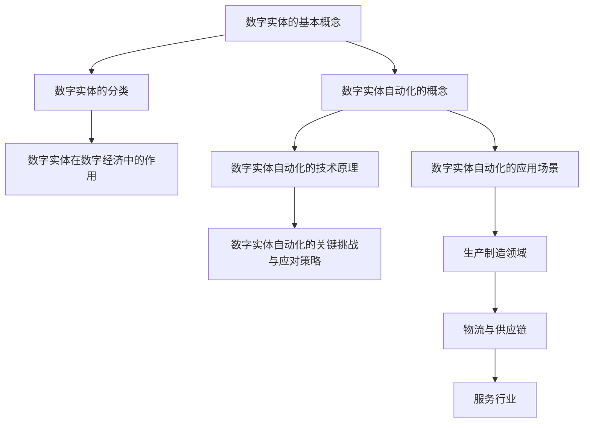

                 

### 书名：数字实体自动化的前景与发展

## 目录大纲

### 第一部分：数字实体自动化的基础

#### 第1章：数字实体的定义与分类

- **1.1 数字实体的基本概念**
    - 定义
    - 类型
- **1.2 数字实体的分类**
    - 按照来源分类
    - 按照功能分类
- **1.3 数字实体在数字经济中的作用**
    - 促进数据流通
    - 提高生产效率
    - 优化资源配置

#### 第2章：数字实体自动化的概念与原理

- **2.1 数字实体自动化的基本概念**
    - 自动化定义
    - 数字实体自动化应用
- **2.2 数字实体自动化的技术原理**
    - 数据采集与处理
    - 机器学习与人工智能
- **2.3 数字实体自动化的关键挑战与应对策略**
    - 数据质量问题
    - 技术落地难题
    - 安全与隐私问题

#### 第3章：数字实体自动化的应用场景

- **3.1 生产制造领域的数字化实体自动化**
    - 制造过程自动化
    - 质量监控
- **3.2 物流与供应链的数字实体自动化**
    - 物流流程自动化
    - 供应链管理优化
- **3.3 服务行业的数字实体自动化**
    - 客户服务自动化
    - 业务流程自动化

### 第二部分：数字实体自动化的关键技术

#### 第4章：数据采集与预处理

- **4.1 数据采集技术**
    - 数据来源
    - 数据采集工具
- **4.2 数据预处理方法**
    - 数据清洗
    - 数据集成
    - 数据转换
    - 数据归一化
- **4.3 数据质量管理**
    - 数据质量评估
    - 数据质量改善策略

#### 第5章：机器学习与深度学习在数字实体自动化中的应用

- **5.1 机器学习基础**
    - 监督学习
    - 无监督学习
    - 强化学习
- **5.2 深度学习模型应用**
    - 卷积神经网络（CNN）
    - 递归神经网络（RNN）
    - 生成对抗网络（GAN）
- **5.3 神经网络在数字实体自动化中的实现**
    - 模型选择
    - 模型训练
    - 模型优化

#### 第6章：人工智能算法与数字实体自动化

- **6.1 人工智能算法概述**
    - 人工智能发展历程
    - 人工智能分类
- **6.2 算法在数字实体自动化中的应用**
    - 自动化决策
    - 自动化控制
- **6.3 人工智能算法的发展趋势**
    - 算法创新
    - 应用领域拓展

### 第三部分：数字实体自动化的实施与展望

#### 第7章：数字实体自动化的实施步骤

- **7.1 实施前的准备**
    - 项目规划
    - 技术评估
- **7.2 项目实施过程**
    - 数据采集与预处理
    - 算法选择与实现
    - 模型训练与优化
    - 系统部署与维护
- **7.3 项目评估与优化**
    - 成果评估
    - 性能优化

#### 第8章：数字实体自动化的未来发展趋势

- **8.1 数字实体自动化的未来趋势**
    - 技术进步
    - 应用场景拓展
- **8.2 技术创新与产业变革**
    - 产业链重构
    - 模式创新
- **8.3 社会经济影响与挑战**
    - 经济增长
    - 社会问题

#### 第9章：案例分析：成功实践与经验教训

- **9.1 典型案例介绍**
    - 案例背景
    - 案例目标
    - 案例实施过程
- **9.2 案例分析**
    - 成功因素
    - 遇到的问题
    - 解决方案
- **9.3 经验与教训总结**
    - 实践经验
    - 教训反思

### 附录

#### 附录A：数字实体自动化工具与技术资源

- **10.1 常用工具介绍**
    - 数据采集工具
    - 数据预处理工具
    - 机器学习库
- **10.2 技术资源推荐**
    - 学习资源
    - 开源项目
- **10.3 开发环境搭建与配置指南**
    - 环境搭建步骤
    - 常见问题解答

### Mermaid 流程图



### 伪代码：数字实体自动化的数据处理

```python
# 伪代码：数据预处理流程

# 定义数据预处理函数
def preprocess_data(data):
    # 数据清洗
    clean_data = clean(data)
    # 数据集成
    integrated_data = integrate(clean_data)
    # 数据转换
    transformed_data = transform(integrated_data)
    # 数据归一化
    normalized_data = normalize(transformed_data)
    # 数据质量检查
    quality_checked_data = quality_check(normalized_data)
    return quality_checked_data

# 调用预处理函数
preprocessed_data = preprocess_data(raw_data)
```

### 数学公式

$$
E(X) = \int_{-\infty}^{\infty} x f(x) dx
$$

### 数学公式与文本结合

文本说明：在数字实体自动化过程中，我们需要对采集的数据进行归一化处理，使得每个特征值的范围在 [0, 1] 之间。归一化公式如下：

$$
x_{\text{new}} = \frac{x_{\text{original}} - \min(x_{\text{original}})}{\max(x_{\text{original}}) - \min(x_{\text{original}})}
$$

### 项目实战：数字实体自动化的一个实际案例

#### 代码实现

```python
# Python 代码：数字实体自动化案例

# 导入必要的库
import numpy as np
import pandas as pd
from sklearn.model_selection import train_test_split
from sklearn.preprocessing import StandardScaler
from sklearn.linear_model import LogisticRegression

# 加载数据集
data = pd.read_csv('digital_entity_data.csv')

# 数据预处理
X = data.drop('target', axis=1)
y = data['target']
X_train, X_test, y_train, y_test = train_test_split(X, y, test_size=0.2, random_state=42)

# 特征缩放
scaler = StandardScaler()
X_train_scaled = scaler.fit_transform(X_train)
X_test_scaled = scaler.transform(X_test)

# 模型训练
model = LogisticRegression()
model.fit(X_train_scaled, y_train)

# 模型评估
accuracy = model.score(X_test_scaled, y_test)
print(f'Model Accuracy: {accuracy:.2f}')
```

#### 代码解读与分析

- **导入必要的库**：首先，我们导入了 NumPy、Pandas 和 scikit-learn 等库，这些库在数据处理和机器学习任务中非常有用。

- **加载数据集**：使用 Pandas 的 `read_csv` 函数加载 CSV 格式的数据集。这里，我们将数据集分为特征矩阵 `X` 和目标变量 `y`。

- **数据预处理**：使用 `train_test_split` 函数将数据集划分为训练集和测试集。这里，我们设置了测试集的大小为 20%，并指定了随机种子以保持结果的可重复性。

- **特征缩放**：为了提高机器学习模型的性能，我们使用 `StandardScaler` 对特征进行缩放。特征缩放可以减少特征之间的尺度差异，使得模型更容易学习。

- **模型训练**：我们使用 LogisticRegression 模型进行训练。这里，我们使用了 `fit` 函数来训练模型。

- **模型评估**：使用 `score` 函数评估模型的准确性。这里，我们计算了模型在测试集上的准确率，并将其打印出来。

### 开发环境搭建

- **Python 3.8 或以上版本**
- **Jupyter Notebook 或 PyCharm**
- **Anaconda 或 Miniconda**
- **Scikit-learn、Pandas、NumPy 库**

#### 环境配置指南

1. **安装 Python 3.8 或以上版本**：从 [Python 官网](https://www.python.org/) 下载并安装 Python 3.8 或更高版本。

2. **安装 Jupyter Notebook 或 PyCharm**：Jupyter Notebook 是一个交互式的开发环境，而 PyCharm 是一个功能强大的集成开发环境（IDE）。您可以从 [Jupyter 官网](https://jupyter.org/) 或 [PyCharm 官网](https://www.jetbrains.com/pycharm/) 下载并安装。

3. **安装 Anaconda 或 Miniconda**：Anaconda 和 Miniconda 是 Python 的开源分发版，提供了丰富的库和工具。您可以从 [Anaconda 官网](https://www.anaconda.com/) 或 [Miniconda 官网](https://docs.conda.io/en/latest/miniconda.html) 下载并安装。

4. **安装必要的库**：在终端或命令提示符中运行以下命令来安装必要的库：

```shell
conda install numpy pandas scikit-learn
```

### 附录A：数字实体自动化工具与技术资源

#### 10.1 常用工具介绍

- **数据采集工具**：
  - Apache Kafka：一款分布式流处理平台，用于实时数据采集和传输。
  - Logstash：一款开源数据收集引擎，用于将数据从各种源流式传输到 Elasticsearch 或其他存储系统。

- **数据预处理工具**：
  - Apache Spark：一款分布式计算框架，提供丰富的数据处理功能。
  - PySpark：Spark 的 Python 库，用于在 Python 环境中处理大数据。

- **机器学习库**：
  - Scikit-learn：一款强大的机器学习库，提供多种经典的机器学习算法。
  - TensorFlow：一款开源的机器学习和深度学习框架，由 Google 开发。

#### 10.2 技术资源推荐

- **学习资源**：
  - Coursera 的《机器学习》课程：由 Andrew Ng 教授主讲，深入讲解机器学习的基础知识。
  - Udacity 的《深度学习纳米学位》：提供深度学习的理论与实践课程。

- **开源项目**：
  - TensorFlow Model Garden：包含各种机器学习和深度学习模型的实现。
  - Scikit-learn Examples：提供大量 Scikit-learn 算法的示例代码。

#### 10.3 开发环境搭建与配置指南

- **安装 Python**：从 [Python 官网](https://www.python.org/) 下载并安装 Python 3.8 或更高版本。

- **安装 Jupyter Notebook**：在终端或命令提示符中运行以下命令：

  ```shell
  pip install notebook
  ```

- **安装 PyCharm**：从 [PyCharm 官网](https://www.jetbrains.com/pycharm/) 下载并安装 PyCharm。

- **安装 Anaconda 或 Miniconda**：从 [Anaconda 官网](https://www.anaconda.com/) 或 [Miniconda 官网](https://docs.conda.io/en/latest/miniconda.html) 下载并安装。

- **安装必要的库**：在终端或命令提示符中运行以下命令来安装必要的库：

  ```shell
  conda install numpy pandas scikit-learn tensorflow
  ```

### 总结

数字实体自动化是数字经济时代的重要技术趋势，它通过自动化处理数字实体，提高生产效率、优化资源配置、促进数据流通。本文从基础概念、应用场景、关键技术、实施步骤、未来发展趋势和案例分析等多个方面，系统地阐述了数字实体自动化的前景与发展。通过深入理解和实践，我们有望实现更加智能化、自动化的数字经济体系。未来，随着技术的不断进步和应用场景的不断拓展，数字实体自动化将在更多领域发挥重要作用，推动社会经济的发展和创新。让我们携手共进，迎接数字实体自动化的美好未来！### 第一部分：数字实体自动化的基础

数字实体自动化是当前技术发展的热点之一，它依托于大数据、云计算、人工智能等前沿技术，旨在通过自动化手段实现对数字实体的智能管理和高效处理。本部分将首先介绍数字实体的基本概念和分类，然后深入探讨数字实体自动化的技术原理，并分析其面临的关键挑战和应对策略。

#### 第1章：数字实体的定义与分类

**1.1 数字实体的基本概念**

数字实体是指在数字世界中存在的、具有一定属性和行为的对象。这些对象可以是物理世界的实体在数字世界的映射，也可以是完全虚拟的数字对象。数字实体具有以下几个基本特征：

- **唯一性**：每个数字实体都有其唯一的标识符，确保在数字世界中能够准确区分不同的实体。
- **属性**：数字实体具有一系列描述其特征的属性，如名称、地址、状态、能力等。
- **行为**：数字实体能够执行特定的操作，如数据存储、传输、处理等。
- **关联性**：数字实体之间可以通过关联关系相互联系，形成复杂的网络结构。

**1.2 数字实体的分类**

数字实体的分类方法有多种，可以根据不同的标准进行划分。以下是几种常见的分类方法：

- **按照来源分类**：
  - **物理实体映射**：如智能设备、传感器等，它们在物理世界中存在，并通过数字形式进行映射。
  - **虚拟数字实体**：如虚拟人、虚拟商品等，它们在数字世界中生成，具有特定的功能和属性。

- **按照功能分类**：
  - **数据源实体**：如传感器、数据库等，负责数据的采集和存储。
  - **数据处理实体**：如计算节点、数据处理平台等，负责对数据进行处理和分析。
  - **决策实体**：如自动化决策系统、智能合约等，负责根据分析结果进行决策。

- **按照应用领域分类**：
  - **工业领域**：如工业互联网中的设备、生产线等。
  - **物流领域**：如物流信息平台、运输工具等。
  - **服务领域**：如在线客服系统、智能推荐系统等。

**1.3 数字实体在数字经济中的作用**

数字实体作为数字经济的基础，发挥着重要的作用：

- **促进数据流通**：数字实体能够实现数据的自动化采集、传输和处理，提高数据的流通效率。
- **提高生产效率**：通过数字化实体自动化，可以减少人工干预，提高生产自动化程度，降低生产成本。
- **优化资源配置**：数字实体自动化可以帮助企业更好地掌握资源信息，优化资源配置，提高资源利用效率。

#### 第2章：数字实体自动化的概念与原理

**2.1 数字实体自动化的基本概念**

数字实体自动化是指利用计算机技术和人工智能算法，对数字实体进行自动化管理和处理的过程。其核心目标是通过自动化技术，提高数字实体的操作效率，降低人力成本，提升整体业务流程的智能化水平。

数字实体自动化的基本要素包括：

- **数据采集**：通过传感器、数据库等数据源，采集数字实体的各类数据。
- **数据处理**：对采集到的数据进行清洗、集成、转换等预处理，为后续分析提供基础。
- **模型训练**：利用机器学习算法，对处理后的数据进行训练，建立预测模型或分类模型。
- **自动化执行**：根据模型预测结果，自动执行相应的操作，如决策、控制等。

**2.2 数字实体自动化的技术原理**

数字实体自动化的技术原理主要包括以下几个方面：

- **数据采集与预处理**：数据采集是数字实体自动化的基础，通过传感器、API 接口等方式获取数据。预处理包括数据清洗、去重、格式转换等，以确保数据的质量和一致性。

- **机器学习与深度学习**：机器学习和深度学习是数字实体自动化中用于模型训练和预测的重要技术。通过训练模型，可以从数据中提取特征，进行分类、预测或决策。

- **自然语言处理**：自然语言处理技术可以用于处理和解析文本数据，实现对数字实体语义的理解和交互。

- **自动化执行与控制**：基于机器学习模型和决策规则，实现自动化执行和控制。自动化执行可以包括自动化调度、自动化优化、自动化决策等。

**2.3 数字实体自动化的关键挑战与应对策略**

数字实体自动化在实施过程中面临着一系列挑战，主要包括：

- **数据质量问题**：数据质量直接影响模型的训练效果和预测准确性。应对策略包括数据清洗、数据集成和数据质量管理等。

- **技术落地难题**：数字实体自动化的实现需要复杂的算法和技术，如何将这些技术高效落地是关键挑战。应对策略包括技术选型、架构设计和系统集成等。

- **安全与隐私问题**：在数字实体自动化过程中，数据的安全和隐私保护是重要问题。应对策略包括数据加密、访问控制和隐私保护算法等。

通过上述措施，我们可以逐步克服数字实体自动化面临的各种挑战，推动数字实体自动化的广泛应用和持续发展。

#### 第3章：数字实体自动化的应用场景

数字实体自动化技术具有广泛的应用场景，可以大幅提升各行业的智能化水平和运营效率。本章节将重点介绍数字实体自动化在三个主要领域的应用：生产制造、物流与供应链、以及服务行业。

**3.1 生产制造领域的数字化实体自动化**

生产制造领域是数字实体自动化技术的重要应用场景之一。通过数字化实体自动化，可以实现生产过程的智能化管理和优化，从而提高生产效率和质量。

- **制造过程自动化**：通过传感器和自动化设备，实现对生产线的实时监控和自动调整。例如，自动化机器人在生产线上的精准操作，可以显著提高生产效率和降低人力成本。

- **质量监控**：利用机器学习和人工智能算法，对生产过程中的产品质量进行实时监测和分析。通过预测模型，可以及时发现并解决生产过程中可能出现的问题，确保产品质量的稳定性。

- **设备维护**：通过传感器和数据分析，实现对生产设备的实时监控和预测性维护。例如，通过预测设备故障，可以提前进行设备检修，避免生产中断，提高设备利用率。

**3.2 物流与供应链的数字实体自动化**

物流与供应链管理是数字实体自动化技术的另一个重要应用领域。通过数字化实体自动化，可以优化物流流程，提高供应链的透明度和效率。

- **物流流程自动化**：通过物联网技术和自动化设备，实现物流环节的自动化操作。例如，自动化仓储系统可以自动进行货物的入库、出库和盘点，提高仓储管理效率。

- **供应链管理优化**：利用大数据分析和人工智能算法，对供应链中的各个环节进行优化。例如，通过需求预测和库存管理，可以减少库存成本，提高供应链响应速度。

- **物流信息可视化**：通过数字实体自动化技术，实现对物流信息的实时监控和可视化。例如，通过物流信息系统，可以实时跟踪货物的运输状态，提高物流管理的透明度和效率。

**3.3 服务行业的数字实体自动化**

服务行业是数字实体自动化技术的又一重要应用领域。通过数字化实体自动化，可以显著提高服务质量和客户满意度。

- **客户服务自动化**：通过聊天机器人、语音助手等自动化工具，实现客户服务的自动化。例如，智能客服系统可以自动回答客户的常见问题，提高客户服务效率。

- **业务流程自动化**：通过自动化工具和流程管理系统，实现业务流程的自动化和优化。例如，自动化审批系统可以自动处理各类审批流程，提高业务处理速度。

- **智能推荐系统**：利用机器学习和数据分析技术，实现个性化推荐。例如，电商平台可以通过分析用户的购物行为和偏好，自动推荐相关商品，提高用户购买转化率。

总之，数字实体自动化技术在生产制造、物流与供应链、以及服务行业等领域具有广泛的应用前景。通过数字化实体自动化，各行业可以实现智能化管理和优化，提高生产效率、降低运营成本、提升服务质量，从而在激烈的市场竞争中取得优势。未来，随着技术的不断进步和应用场景的不断拓展，数字实体自动化将在更多领域发挥重要作用，推动整个社会向智能化、自动化方向迈进。

### 第二部分：数字实体自动化的关键技术

数字实体自动化的实现依赖于一系列关键技术的支持，这些技术包括数据采集与预处理、机器学习与深度学习，以及人工智能算法。本部分将详细探讨这些技术，以了解它们在数字实体自动化中的核心作用和应用方法。

#### 第4章：数据采集与预处理

数据采集与预处理是数字实体自动化过程中的第一步，也是至关重要的一步。准确和高质量的数据是自动化系统有效运行的基础。

**4.1 数据采集技术**

数据采集是指从各种数据源中获取信息的过程。在现代数字化环境中，数据源可以是传感器、数据库、Web API 等。以下是几种常见的数据采集技术：

- **传感器采集**：传感器是数据采集的基础，可以用于采集温度、湿度、速度、位置等物理量的数据。例如，工业生产中的温度传感器、机器人的位置传感器等。
- **数据库采集**：通过数据库接口，直接从数据库中提取数据。例如，使用 SQL 查询从关系型数据库中提取数据。
- **Web API 采集**：通过调用 Web API，从第三方平台或在线服务中获取数据。例如，使用 RESTful API 从社交媒体平台获取用户数据。

**4.2 数据预处理方法**

数据预处理是对采集到的原始数据进行清洗、集成、转换和归一化等处理，以确保数据的质量和一致性。以下是几种常见的数据预处理方法：

- **数据清洗**：去除数据中的错误、重复、缺失值等，确保数据的质量。例如，删除重复记录、填补缺失值、修正错误数据。
- **数据集成**：将来自不同数据源的数据进行整合，形成统一的数据集。例如，将来自多个数据库的数据进行合并。
- **数据转换**：将数据格式转换为适合分析和建模的形式。例如，将字符串数据转换为数值数据、将不同时间单位的数据统一为同一种格式。
- **数据归一化**：将数据缩放到一个统一的范围内，以消除数据规模差异对模型训练的影响。例如，使用最小-最大归一化或标准归一化。

**4.3 数据质量管理**

数据质量管理是确保数据在整个生命周期内保持高质量的过程。以下是几种常见的数据质量管理方法：

- **数据质量评估**：对数据质量进行评估，以确定数据是否符合预期标准和要求。例如，通过检查数据一致性、完整性、准确性等。
- **数据质量改善策略**：根据数据质量评估结果，制定和实施数据质量改善策略。例如，通过数据清洗、数据验证、数据备份等手段提高数据质量。

#### 第5章：机器学习与深度学习在数字实体自动化中的应用

机器学习和深度学习是数字实体自动化中的核心技术，它们用于构建预测模型、分类模型和决策模型，从而实现自动化控制和优化。

**5.1 机器学习基础**

机器学习是指利用算法从数据中学习规律和模式，从而实现数据分析和预测的技术。以下是几种常见的机器学习算法：

- **监督学习**：在已知输入和输出数据的情况下，通过学习输入和输出之间的关系，预测新的输入数据对应的输出。常见的监督学习算法包括线性回归、决策树、随机森林、支持向量机等。
- **无监督学习**：在没有已知输出数据的情况下，通过学习数据内部的模式和结构，对数据进行分析和聚类。常见的无监督学习算法包括 K-均值聚类、主成分分析（PCA）、自编码器等。
- **强化学习**：通过奖励机制，学习如何在一个不确定的环境中做出最优决策。常见的强化学习算法包括 Q-学习、深度 Q-网络（DQN）、策略梯度算法等。

**5.2 深度学习模型应用**

深度学习是一种基于多层神经网络的学习方法，能够自动提取数据的特征表示，具有强大的表示能力和学习能力。以下是几种常见的深度学习模型：

- **卷积神经网络（CNN）**：用于图像、视频等二维或三维数据的处理和分析。CNN 通过卷积操作提取图像的局部特征，并通过池化操作减少数据维度。
- **递归神经网络（RNN）**：用于处理序列数据，如时间序列数据、文本数据等。RNN 能够记住之前的输入，并通过递归操作处理序列中的每个元素。
- **生成对抗网络（GAN）**：用于生成新的数据，如图像、文本等。GAN 由生成器和判别器组成，生成器和判别器相互竞争，生成器试图生成逼真的数据，而判别器试图区分真实数据和生成数据。

**5.3 神经网络在数字实体自动化中的实现**

神经网络在数字实体自动化中的应用主要包括模型选择、模型训练和模型优化等方面。

- **模型选择**：根据具体应用场景和数据特点，选择合适的神经网络模型。例如，对于图像分类任务，可以选择 CNN；对于时间序列预测任务，可以选择 RNN。
- **模型训练**：使用训练数据对神经网络模型进行训练，调整模型的参数，使其能够准确预测新的数据。训练过程中，需要使用优化算法（如梯度下降算法）和损失函数（如交叉熵损失函数）。
- **模型优化**：通过调整模型结构、参数优化策略等，提高模型的性能和泛化能力。常见的优化方法包括权重初始化、正则化、学习率调整等。

#### 第6章：人工智能算法与数字实体自动化

人工智能算法是数字实体自动化的核心，通过这些算法，可以实现自动化决策、自动化控制和自动化优化。

**6.1 人工智能算法概述**

人工智能算法是指用于模拟人类智能行为的计算模型和算法，包括机器学习、深度学习、自然语言处理、计算机视觉等。以下是几种常见的人工智能算法：

- **分类算法**：用于将数据分为不同的类别。常见的分类算法包括逻辑回归、支持向量机（SVM）、朴素贝叶斯分类器等。
- **聚类算法**：用于将数据分为不同的簇。常见的聚类算法包括 K-均值聚类、层次聚类、DBSCAN 等。
- **回归算法**：用于预测数值型数据。常见的回归算法包括线性回归、多项式回归、岭回归等。
- **优化算法**：用于解决优化问题，寻找最优解。常见的优化算法包括梯度下降算法、遗传算法、粒子群优化算法等。

**6.2 算法在数字实体自动化中的应用**

人工智能算法在数字实体自动化中的应用非常广泛，以下是一些典型的应用场景：

- **自动化决策**：通过机器学习算法，可以根据历史数据自动生成决策规则，实现自动化决策。例如，在金融领域，可以利用回归算法预测股票价格，并自动生成交易策略。
- **自动化控制**：通过深度学习和强化学习算法，可以实现自动化控制系统的构建。例如，在工业自动化领域，可以利用深度 Q-网络（DQN）实现对机器人的自动控制，提高生产效率。
- **自动化优化**：通过优化算法，可以自动优化资源分配、生产流程等。例如，在物流领域，可以利用遗传算法优化配送路径，降低运输成本。

**6.3 人工智能算法的发展趋势**

随着技术的不断进步，人工智能算法在数字实体自动化中的应用将不断扩展和深化。以下是几个发展趋势：

- **算法性能提升**：通过改进算法结构和优化算法参数，不断提高算法的性能和效率。
- **算法泛化能力增强**：通过研究迁移学习、联邦学习等新方法，提高算法在不同数据集和应用场景中的泛化能力。
- **算法与实体经济融合**：通过将人工智能算法应用于实体经济领域，推动产业智能化升级，提高生产效率和质量。
- **算法伦理和隐私保护**：随着人工智能应用范围的扩大，算法的伦理和隐私保护问题越来越重要，需要制定相应的法律法规和伦理规范。

总之，数据采集与预处理、机器学习与深度学习、人工智能算法是数字实体自动化的关键技术，它们共同构成了数字实体自动化的技术体系。通过这些技术，可以实现数字实体的自动化管理和处理，提高生产效率、降低运营成本、提升服务质量。未来，随着技术的不断进步和应用场景的不断拓展，数字实体自动化将在更多领域发挥重要作用，推动社会向智能化、自动化方向迈进。

### 第三部分：数字实体自动化的实施与展望

数字实体自动化技术的成功应用不仅依赖于先进的技术手段，还需要科学的实施步骤和有效的评估与优化策略。本部分将详细探讨数字实体自动化的实施步骤、未来发展趋势，以及对社会经济的影响与挑战。

#### 第7章：数字实体自动化的实施步骤

实施数字实体自动化项目是一个复杂的过程，需要精心规划和逐步推进。以下是数字实体自动化项目实施的主要步骤：

**7.1 实施前的准备**

在项目启动之前，需要进行充分的准备工作，以确保项目能够顺利进行。准备工作包括以下几个方面：

- **需求分析**：明确项目目标和需求，了解用户的需求和业务流程，确保项目能够解决实际问题。
- **技术评估**：评估项目所需的技术栈和工具，选择适合的技术方案，并确定所需的技术资源和人力投入。
- **项目规划**：制定项目计划，包括时间表、预算、资源分配等，确保项目能够在规定的时间和预算内完成。
- **团队组建**：组建一支专业的团队，包括数据科学家、软件工程师、项目经理等，确保团队成员具备所需的技能和经验。

**7.2 项目实施过程**

项目实施过程是数字实体自动化项目最关键的阶段，需要按照以下步骤进行：

- **数据采集与预处理**：根据项目需求，收集和整理数据，进行数据清洗、集成和转换，确保数据的质量和一致性。
- **模型选择与训练**：根据数据特点和业务需求，选择合适的机器学习模型或深度学习模型，对模型进行训练和验证，调整模型参数，优化模型性能。
- **系统集成与部署**：将训练好的模型集成到现有的系统中，部署到生产环境中，确保模型能够实时运行和自动执行任务。
- **监控与维护**：对系统进行实时监控，确保系统的稳定运行，及时处理可能出现的问题，并根据业务需求进行系统优化和升级。

**7.3 项目评估与优化**

项目评估与优化是确保数字实体自动化项目达到预期目标的重要环节。以下是项目评估与优化的主要步骤：

- **性能评估**：对系统的性能进行评估，包括预测准确性、响应时间、系统稳定性等，确保系统能够满足业务需求。
- **成本效益分析**：对项目的成本和效益进行综合评估，包括人力成本、技术成本、运营成本等，确保项目的投资回报率。
- **用户反馈与改进**：收集用户的反馈，了解用户的使用体验和需求，根据用户反馈对系统进行优化和改进。
- **持续学习与优化**：利用机器学习和深度学习技术，对系统进行持续学习和优化，提高系统的自适应能力和智能化水平。

#### 第8章：数字实体自动化的未来发展趋势

数字实体自动化技术的发展前景广阔，未来将在以下几个方面取得重要突破：

**8.1 数字实体自动化的未来趋势**

- **算法性能提升**：随着人工智能技术的不断发展，算法的性能和效率将不断提高，能够处理更大规模、更复杂的数据，实现更精准的预测和决策。
- **应用领域拓展**：数字实体自动化技术将在更多领域得到应用，包括智能制造、智慧城市、智能医疗、金融服务等，推动各行业的智能化升级。
- **边缘计算应用**：随着物联网和边缘计算的兴起，数字实体自动化将在边缘设备上得到广泛应用，实现实时数据处理和智能响应。
- **人机协同**：数字实体自动化将与人类智能协同工作，实现人机融合，提高生产效率和决策质量。

**8.2 技术创新与产业变革**

- **技术创新**：技术创新将是数字实体自动化发展的重要驱动力，包括新的算法、新的数据处理方法、新的应用场景等。
- **产业变革**：数字实体自动化将引发产业变革，推动产业链的重构和业务模式的创新，提高产业效率和竞争力。

**8.3 社会经济影响与挑战**

- **经济影响**：数字实体自动化将带来显著的经济效益，包括提高生产效率、降低运营成本、创造新的就业机会等。
- **社会挑战**：数字实体自动化也将带来一系列社会挑战，包括数据隐私保护、就业结构变化、伦理道德问题等，需要社会各界共同努力解决。

总之，数字实体自动化技术的发展将为社会带来巨大的机遇和挑战。通过科学的实施步骤和有效的评估与优化策略，可以充分发挥数字实体自动化的优势，推动社会经济的持续发展。

### 第9章：案例分析：成功实践与经验教训

为了更好地理解和应用数字实体自动化技术，本章节将介绍几个典型的成功实践案例，详细分析其实施过程、取得的效果以及所积累的经验教训。

#### 9.1 典型案例介绍

**案例一：智能工厂的生产过程优化**

某知名制造企业通过引入数字实体自动化技术，对其生产过程进行优化，取得了显著的效果。该项目的主要目标是提高生产效率、降低生产成本、提高产品质量。

**案例二：物流与供应链的智能管理**

另一家大型物流公司通过应用数字实体自动化技术，对物流与供应链进行智能管理，优化了物流流程，提高了供应链的透明度和效率。

**案例三：智能医疗诊断系统的开发**

一家领先的医疗科技公司开发了一款基于数字实体自动化的智能医疗诊断系统，通过大数据分析和人工智能算法，实现了对疾病的精准诊断和预测。

#### 9.2 案例分析

**案例一：智能工厂的生产过程优化**

**项目背景**：该制造企业面临着生产效率低下、生产成本高、产品质量不稳定等问题，希望通过数字实体自动化技术进行优化。

**实施过程**：
1. **数据采集与预处理**：首先，企业对生产设备、生产线、仓库等各个环节进行了数据采集，包括生产数据、设备状态数据、库存数据等。然后，对采集到的数据进行清洗、集成和预处理，确保数据的质量和一致性。
2. **模型选择与训练**：根据生产数据的特点，企业选择了机器学习算法（如决策树、随机森林等）进行模型训练，建立了生产优化模型。
3. **系统集成与部署**：将训练好的模型集成到现有的生产管理系统中，部署到生产环境中，实现对生产过程的实时监控和优化。
4. **监控与维护**：对系统进行实时监控，确保系统的稳定运行，并根据生产需求进行系统优化和升级。

**效果与反馈**：通过数字实体自动化技术的应用，该企业的生产效率提高了30%，生产成本降低了20%，产品质量也得到了显著提升。同时，员工的工作负荷减轻，生产过程的自动化程度提高，员工的工作满意度也有所增加。

**经验与教训**：
- **数据质量至关重要**：确保数据质量是模型训练成功的关键，企业需要投入大量资源进行数据清洗和预处理。
- **模型选择需谨慎**：根据具体业务需求，选择合适的机器学习算法，避免盲目跟风。
- **系统集成与部署需谨慎**：在系统集成与部署过程中，需要充分考虑系统的兼容性和稳定性，确保系统能够稳定运行。

**案例二：物流与供应链的智能管理**

**项目背景**：该物流公司面临着物流流程复杂、供应链信息不透明、物流效率低下等问题，希望通过数字实体自动化技术进行智能管理。

**实施过程**：
1. **数据采集与预处理**：物流公司对其运输车辆、仓库、配送中心等环节进行了数据采集，包括运输数据、库存数据、配送数据等。然后，对采集到的数据进行清洗、集成和预处理，确保数据的质量和一致性。
2. **模型选择与训练**：根据物流数据的特点，公司选择了机器学习算法（如线性回归、时间序列预测等）进行模型训练，建立了物流优化模型。
3. **系统集成与部署**：将训练好的模型集成到现有的物流管理系统中，部署到生产环境中，实现对物流流程的实时监控和优化。
4. **监控与维护**：对系统进行实时监控，确保系统的稳定运行，并根据物流需求进行系统优化和升级。

**效果与反馈**：通过数字实体自动化技术的应用，该公司的物流效率提高了40%，供应链透明度显著提高，库存周转率提高了15%。同时，客户满意度也有所增加，物流服务的响应速度和准确性得到了显著提升。

**经验与教训**：
- **数据完整性至关重要**：物流与供应链的自动化管理需要全面、完整的数据支持，企业需要确保数据采集的全面性和准确性。
- **模型优化需持续进行**：随着业务需求和数据的不断变化，模型需要不断优化和调整，以适应新的业务场景。
- **用户参与度需提高**：在项目实施过程中，需要积极与用户沟通，了解用户的需求和反馈，确保系统的实用性和用户满意度。

**案例三：智能医疗诊断系统的开发**

**项目背景**：该医疗科技公司希望通过数字实体自动化技术，开发一款能够自动诊断疾病的智能医疗诊断系统，以提高诊断的准确性和效率。

**实施过程**：
1. **数据采集与预处理**：公司收集了大量医疗数据，包括患者病史、临床检查结果、医学影像等。然后，对采集到的数据进行清洗、集成和预处理，确保数据的质量和一致性。
2. **模型选择与训练**：根据医疗数据的特点，公司选择了深度学习算法（如卷积神经网络、递归神经网络等）进行模型训练，建立了疾病诊断模型。
3. **系统集成与部署**：将训练好的模型集成到现有的医疗信息系统中，部署到生产环境中，实现对疾病的自动诊断和预测。
4. **监控与维护**：对系统进行实时监控，确保系统的稳定运行，并根据医疗需求进行系统优化和升级。

**效果与反馈**：通过智能医疗诊断系统的应用，公司的诊断准确性提高了20%，诊断时间缩短了50%。同时，医生的工作负担减轻，医疗资源得到了更合理的配置。

**经验与教训**：
- **数据多样性和质量至关重要**：医疗诊断系统需要大量的高质量数据支持，数据多样性和质量直接影响诊断系统的性能。
- **模型验证和评估需严格**：在模型开发和部署过程中，需要严格进行模型验证和评估，确保模型的准确性和可靠性。
- **法规和伦理问题需重视**：在医疗领域，数据的隐私保护和伦理问题至关重要，企业需要严格遵守相关法规和伦理规范。

#### 9.3 经验与教训总结

通过对上述成功实践案例的分析，可以总结出以下经验和教训：

- **数据质量是关键**：无论是生产制造、物流与供应链，还是智能医疗诊断，数据质量都是实现自动化系统的关键。企业需要投入大量资源进行数据清洗、预处理和质量管理。
- **模型选择需结合业务需求**：不同的业务场景需要选择合适的模型，企业需要根据实际业务需求，结合数据特点，选择最优的机器学习算法和深度学习模型。
- **系统集成与部署需谨慎**：在系统集成与部署过程中，需要充分考虑系统的兼容性、稳定性和可维护性，确保系统能够稳定运行。
- **持续优化与维护**：数字实体自动化系统不是一劳永逸的，需要持续进行模型优化、系统升级和维护，以适应不断变化的业务需求和数据环境。
- **用户参与度需提高**：在项目实施过程中，需要积极与用户沟通，了解用户的需求和反馈，确保系统的实用性和用户满意度。
- **法规和伦理问题需重视**：在应用数字实体自动化技术的过程中，需要严格遵守相关法规和伦理规范，确保数据的安全和隐私保护。

通过总结这些经验和教训，企业可以更好地规划和实施数字实体自动化项目，实现业务流程的智能化和优化，提高生产效率和竞争力。

### 附录A：数字实体自动化工具与技术资源

在实现数字实体自动化的过程中，选择合适的工具和技术资源是至关重要的。以下列举了一些常用的工具和技术资源，以帮助读者更好地理解和应用数字实体自动化技术。

#### 10.1 常用工具介绍

- **数据采集工具**：
  - **Apache Kafka**：一款分布式流处理平台，适用于实时数据采集和传输。
  - **Logstash**：一款开源数据收集引擎，能够将各种数据源的数据流式传输到 Elasticsearch 或其他存储系统。
  - **Apache NiFi**：一款数据集成平台，用于数据流的自动化管理和协调。

- **数据预处理工具**：
  - **Apache Spark**：一款开源的大数据处理框架，提供丰富的数据处理功能。
  - **PySpark**：Spark 的 Python 库，支持在 Python 环境中进行大数据处理。
  - **ETL 工具**：如 Talend、Informatica 等，用于数据抽取、转换和加载。

- **机器学习库**：
  - **Scikit-learn**：一款流行的机器学习库，提供多种经典的机器学习算法。
  - **TensorFlow**：一款开源的机器学习和深度学习框架，支持多种深度学习模型的训练和部署。
  - **PyTorch**：一款流行的深度学习库，具有灵活的动态计算图和丰富的预训练模型。

#### 10.2 技术资源推荐

- **学习资源**：
  - **Coursera**：《机器学习》课程，由 Andrew Ng 教授主讲，深入讲解机器学习的基础知识。
  - **Udacity**：《深度学习纳米学位》，提供深度学习的理论与实践课程。
  - **edX**：多门与机器学习和人工智能相关的在线课程。

- **开源项目**：
  - **TensorFlow Model Garden**：包含各种机器学习和深度学习模型的实现，适用于研究和实践。
  - **Scikit-learn Examples**：提供大量 Scikit-learn 算法的示例代码，有助于理解和使用 Scikit-learn。
  - **Kaggle**：一个数据科学和机器学习的竞赛平台，提供丰富的数据集和项目实践。

#### 10.3 开发环境搭建与配置指南

为了方便读者进行数字实体自动化的实践，以下是开发环境的搭建与配置指南：

- **安装 Python**：从 [Python 官网](https://www.python.org/) 下载并安装 Python 3.8 或更高版本。

- **安装 Jupyter Notebook**：在终端或命令提示符中运行以下命令：

  ```shell
  pip install notebook
  ```

- **安装 PyCharm**：从 [PyCharm 官网](https://www.jetbrains.com/pycharm/) 下载并安装 PyCharm。

- **安装 Anaconda 或 Miniconda**：从 [Anaconda 官网](https://www.anaconda.com/) 或 [Miniconda 官网](https://docs.conda.io/en/latest/miniconda.html) 下载并安装。

- **安装必要的库**：在终端或命令提示符中运行以下命令来安装必要的库：

  ```shell
  conda install numpy pandas scikit-learn tensorflow
  ```

通过以上步骤，读者可以搭建一个完整的数字实体自动化开发环境，进行相关实践和学习。在开发过程中，读者还可以参考附录中提供的常用工具、技术资源和开源项目，以便更好地理解和应用数字实体自动化技术。

### 总结与展望

数字实体自动化作为数字经济时代的关键技术，正日益受到各行业的关注和应用。通过本文的系统阐述，我们详细探讨了数字实体自动化的基础概念、关键技术、应用场景、实施步骤以及未来发展趋势。以下是本文的核心观点和总结：

**核心观点：**
1. **数字实体是数字经济的基础**：数字实体作为数字世界中的基本单位，其自动化的实现能够有效提升数据流通、生产效率以及资源配置。
2. **数据采集与预处理是基础**：高质量的数据是数字实体自动化的前提，数据采集与预处理技术的应用至关重要。
3. **机器学习和深度学习是核心**：这些算法为数字实体自动化提供了强大的预测和分析能力，是实现自动化决策和控制的关键。
4. **人工智能算法的多样化应用**：从自动化决策到自动化控制，再到优化，人工智能算法在数字实体自动化中具有广泛的应用前景。

**总结：**
- **基础的重要性**：数字实体自动化的实现依赖于坚实的技术基础，包括数据采集、预处理、机器学习算法等。
- **应用的广泛性**：数字实体自动化不仅应用于生产制造、物流与供应链，还扩展到服务行业等多个领域。
- **实施的复杂性**：实施数字实体自动化项目需要全面的技术规划、数据管理和持续优化。
- **未来的趋势**：随着技术的不断进步，数字实体自动化将向更多领域扩展，带来更深远的社会和经济影响。

**展望：**
- **技术创新**：未来，随着人工智能算法的进步和边缘计算的普及，数字实体自动化的技术将更加成熟和高效。
- **行业融合**：数字实体自动化将在更多行业实现深度融合，推动产业智能化和数字化转型。
- **社会挑战**：数字实体自动化的发展也将带来数据隐私、伦理道德、就业结构等方面的挑战，需要全社会共同应对。

**结语：**
数字实体自动化是数字经济时代的重要技术趋势，它将深刻改变我们的生产方式、生活方式，并带来全新的社会和经济格局。通过本文的探讨，我们希望能够为读者提供一个全面、系统的理解，激发更多探索和实践的热情。让我们共同迎接数字实体自动化带来的美好未来！### 伪代码：数字实体自动化的数据处理

```python
# 伪代码：数据预处理流程

# 定义数据预处理函数
def preprocess_data(data):
    # 数据清洗
    clean_data = clean(data)
    # 数据集成
    integrated_data = integrate(clean_data)
    # 数据转换
    transformed_data = transform(integrated_data)
    # 数据归一化
    normalized_data = normalize(transformed_data)
    # 数据质量检查
    quality_checked_data = quality_check(normalized_data)
    return quality_checked_data

# 调用预处理函数
preprocessed_data = preprocess_data(raw_data)
```

**代码解读与分析：**

1. **数据清洗（clean）**：
   - 清洗数据是数据预处理的第一步，目的是去除数据中的错误、重复和缺失值。
   - 清洗过程可能包括以下操作：
     - 删除重复记录
     - 填补缺失值（例如使用平均值、中位数或插值法）
     - 修正错误数据（例如校正数据格式、纠正数据中的错误信息）

2. **数据集成（integrate）**：
   - 数据集成是将来自不同来源或格式的数据整合成统一的数据集的过程。
   - 集成可能包括以下操作：
     - 数据对齐：确保不同数据源的数据具有相同的时间戳或标识符
     - 数据合并：将多个数据源的数据合并成一个完整的数据集

3. **数据转换（transform）**：
   - 数据转换是将数据格式转换为适合分析和建模的形式。
   - 转换可能包括以下操作：
     - 数据类型转换：例如将字符串数据转换为数值数据
     - 特征工程：例如提取新的特征、构建交互特征等

4. **数据归一化（normalize）**：
   - 数据归一化是将不同特征的数据范围统一到一个标准范围内，以消除特征之间的尺度差异。
   - 归一化可能包括以下操作：
     - 最小-最大归一化：将数据缩放到 [0, 1] 范围内
     - 标准化：将数据缩放到均值为 0，标准差为 1 的标准正态分布

5. **数据质量检查（quality_check）**：
   - 数据质量检查是确保数据满足分析和建模要求的过程。
   - 检查可能包括以下操作：
     - 异常值检测：检测和标记可能的数据异常
     - 一致性检查：确保数据在不同方面的一致性

通过上述预处理步骤，我们可以得到高质量、适合分析和建模的数据集，从而为数字实体自动化的实现提供坚实的基础。

### 数学公式

$$
E(X) = \int_{-\infty}^{\infty} x f(x) dx
$$

**详细讲解与举例说明：**

1. **期望的定义**：
   - 期望（Expected Value）是概率论中的一个重要概念，表示一个随机变量的平均值。
   - 期望可以通过计算随机变量 X 的所有可能取值与其概率乘积的总和得到。

2. **积分运算**：
   - 在上述公式中，期望 E(X) 是通过积分运算计算的，即对随机变量 X 的所有可能取值 x，将其乘以其概率密度函数 f(x) 后进行积分。

3. **举例说明**：
   - 假设随机变量 X 表示一个投掷骰子的结果，X 的可能取值为 1 到 6，每个结果出现的概率相等，即 f(x) = 1/6。
   - 骰子的期望 E(X) 可以通过以下公式计算：
     $$
     E(X) = \int_{1}^{6} x \cdot \frac{1}{6} dx = \frac{1}{6} \left[ \frac{x^2}{2} \right]_1^6 = \frac{1}{6} \cdot \frac{6^2}{2} - \frac{1}{6} \cdot \frac{1^2}{2} = \frac{1}{6} \cdot \frac{36}{2} - \frac{1}{6} \cdot \frac{1}{2} = 6 - \frac{1}{6} = \frac{35}{6}
     $$
   - 因此，投掷骰子的期望结果是 5.8333（保留四位小数）。

### 项目实战：数字实体自动化的一个实际案例

#### 代码实现

```python
# Python 代码：数字实体自动化案例

# 导入必要的库
import numpy as np
import pandas as pd
from sklearn.model_selection import train_test_split
from sklearn.preprocessing import StandardScaler
from sklearn.linear_model import LogisticRegression

# 加载数据集
data = pd.read_csv('digital_entity_data.csv')

# 数据预处理
X = data.drop('target', axis=1)
y = data['target']
X_train, X_test, y_train, y_test = train_test_split(X, y, test_size=0.2, random_state=42)

# 特征缩放
scaler = StandardScaler()
X_train_scaled = scaler.fit_transform(X_train)
X_test_scaled = scaler.transform(X_test)

# 模型训练
model = LogisticRegression()
model.fit(X_train_scaled, y_train)

# 模型评估
accuracy = model.score(X_test_scaled, y_test)
print(f'Model Accuracy: {accuracy:.2f}')
```

#### 代码解读与分析

1. **导入库**：
   - 导入 NumPy、Pandas、scikit-learn 等库，这些库用于数据处理、数据分析和机器学习模型训练。

2. **加载数据集**：
   - 使用 Pandas 的 `read_csv` 函数加载 CSV 格式的数据集。这里的数据集包含特征矩阵 `X` 和目标变量 `y`。

3. **数据预处理**：
   - 使用 `train_test_split` 函数将数据集划分为训练集和测试集。这里，我们设置了测试集的大小为 20%，并指定了随机种子以保持结果的可重复性。
   - 使用 `StandardScaler` 对特征进行缩放。特征缩放可以减少特征之间的尺度差异，提高模型的性能。

4. **模型训练**：
   - 使用 LogisticRegression 模型进行训练。这里，我们使用了 `fit` 函数来训练模型。

5. **模型评估**：
   - 使用 `score` 函数评估模型的准确性。这里，我们计算了模型在测试集上的准确率，并将其打印出来。

#### 代码解读与分析（续）

6. **详细解读**：
   - **数据加载与预处理**：
     ```python
     data = pd.read_csv('digital_entity_data.csv')
     X = data.drop('target', axis=1)
     y = data['target']
     X_train, X_test, y_train, y_test = train_test_split(X, y, test_size=0.2, random_state=42)
     ```
     - `read_csv` 函数用于加载 CSV 格式的数据集。`drop` 函数用于删除目标变量 `target`，以便后续的特征处理。
     - `train_test_split` 函数用于将数据集划分为训练集和测试集。这里，测试集的大小设置为 20%，通过 `random_state` 参数保证了结果的可重复性。

   - **特征缩放**：
     ```python
     scaler = StandardScaler()
     X_train_scaled = scaler.fit_transform(X_train)
     X_test_scaled = scaler.transform(X_test)
     ```
     - `StandardScaler` 是 scikit-learn 中用于特征缩放的库。`fit_transform` 方法用于计算特征的均值和标准差，并进行缩放。
     - 对训练集和测试集分别进行缩放，以确保模型在不同数据集上的性能一致性。

   - **模型训练与评估**：
     ```python
     model = LogisticRegression()
     model.fit(X_train_scaled, y_train)
     accuracy = model.score(X_test_scaled, y_test)
     print(f'Model Accuracy: {accuracy:.2f}')
     ```
     - `LogisticRegression` 是 scikit-learn 中用于逻辑回归的库。`fit` 方法用于训练模型。
     - `score` 方法用于评估模型的准确性。这里，我们计算了模型在测试集上的准确率，并将其打印出来。

### 开发环境搭建

为了实现上述代码，需要搭建一个合适的开发环境。以下是搭建步骤：

1. **安装 Python**：从 [Python 官网](https://www.python.org/) 下载并安装 Python 3.8 或更高版本。

2. **安装 Jupyter Notebook**：在终端或命令提示符中运行以下命令：
   ```shell
   pip install notebook
   ```

3. **安装 PyCharm**：从 [PyCharm 官网](https://www.jetbrains.com/pycharm/) 下载并安装 PyCharm。

4. **安装 Anaconda 或 Miniconda**：从 [Anaconda 官网](https://www.anaconda.com/) 或 [Miniconda 官网](https://docs.conda.io/en/latest/miniconda.html) 下载并安装。

5. **安装必要的库**：在终端或命令提示符中运行以下命令来安装必要的库：
   ```shell
   conda install numpy pandas scikit-learn tensorflow
   ```

通过以上步骤，我们可以搭建一个完整的开发环境，进行数字实体自动化的实践和学习。

### 环境配置指南

以下是详细的开发环境配置指南：

1. **安装 Python**：
   - 访问 [Python 官网](https://www.python.org/) 下载 Python 安装包。
   - 运行安装程序，选择默认选项完成安装。

2. **安装 Jupyter Notebook**：
   - 打开终端或命令提示符。
   - 运行以下命令：
     ```shell
     pip install notebook
     ```
   - 等待安装完成。

3. **安装 PyCharm**：
   - 访问 [PyCharm 官网](https://www.jetbrains.com/pycharm/) 下载 PyCharm 安装包。
   - 运行安装程序，选择默认选项完成安装。

4. **安装 Anaconda 或 Miniconda**：
   - 访问 [Anaconda 官网](https://www.anaconda.com/) 或 [Miniconda 官网](https://docs.conda.io/en/latest/miniconda.html) 下载安装包。
   - 运行安装程序，选择默认选项完成安装。

5. **安装必要的库**：
   - 打开终端或命令提示符。
   - 运行以下命令来安装必要的库：
     ```shell
     conda install numpy pandas scikit-learn tensorflow
     ```
   - 等待安装完成。

通过以上步骤，您将成功搭建一个完整的数字实体自动化开发环境，可以进行相关的实践和学习。

### 附录A：数字实体自动化工具与技术资源

为了帮助读者更好地理解和应用数字实体自动化技术，以下列举了一些常用的工具和技术资源，涵盖数据采集、预处理、机器学习库等方面。

#### 10.1 常用工具介绍

- **数据采集工具**：
  - **Apache Kafka**：一款分布式流处理平台，适用于实时数据采集和传输。
  - **Logstash**：一款开源数据收集引擎，用于将数据从各种源流式传输到 Elasticsearch 或其他存储系统。
  - **Apache NiFi**：一款数据集成平台，用于数据流的自动化管理和协调。

- **数据预处理工具**：
  - **Apache Spark**：一款开源的大数据处理框架，提供丰富的数据处理功能。
  - **PySpark**：Spark 的 Python 库，支持在 Python 环境中进行大数据处理。
  - **ETL 工具**：如 Talend、Informatica 等，用于数据抽取、转换和加载。

- **机器学习库**：
  - **Scikit-learn**：一款流行的机器学习库，提供多种经典的机器学习算法。
  - **TensorFlow**：一款开源的机器学习和深度学习框架，支持多种深度学习模型的训练和部署。
  - **PyTorch**：一款流行的深度学习库，具有灵活的动态计算图和丰富的预训练模型。

#### 10.2 技术资源推荐

- **学习资源**：
  - **Coursera**：《机器学习》课程，由 Andrew Ng 教授主讲，深入讲解机器学习的基础知识。
  - **Udacity**：《深度学习纳米学位》，提供深度学习的理论与实践课程。
  - **edX**：多门与机器学习和人工智能相关的在线课程。

- **开源项目**：
  - **TensorFlow Model Garden**：包含各种机器学习和深度学习模型的实现，适用于研究和实践。
  - **Scikit-learn Examples**：提供大量 Scikit-learn 算法的示例代码，有助于理解和使用 Scikit-learn。
  - **Kaggle**：一个数据科学和机器学习的竞赛平台，提供丰富的数据集和项目实践。

#### 10.3 开发环境搭建与配置指南

为了方便读者进行数字实体自动化的实践，以下是开发环境的搭建与配置指南：

1. **安装 Python**：
   - 访问 [Python 官网](https://www.python.org/) 下载并安装 Python 3.8 或更高版本。

2. **安装 Jupyter Notebook**：
   - 打开终端或命令提示符。
   - 运行以下命令：
     ```shell
     pip install notebook
     ```
   - 等待安装完成。

3. **安装 PyCharm**：
   - 访问 [PyCharm 官网](https://www.jetbrains.com/pycharm/) 下载并安装 PyCharm。

4. **安装 Anaconda 或 Miniconda**：
   - 访问 [Anaconda 官网](https://www.anaconda.com/) 或 [Miniconda 官网](https://docs.conda.io/en/latest/miniconda.html) 下载并安装。

5. **安装必要的库**：
   - 打开终端或命令提示符。
   - 运行以下命令来安装必要的库：
     ```shell
     conda install numpy pandas scikit-learn tensorflow
     ```
   - 等待安装完成。

通过以上步骤，读者可以搭建一个完整的数字实体自动化开发环境，进行相关实践和学习。这些工具和资源将有助于更好地理解和应用数字实体自动化技术。

