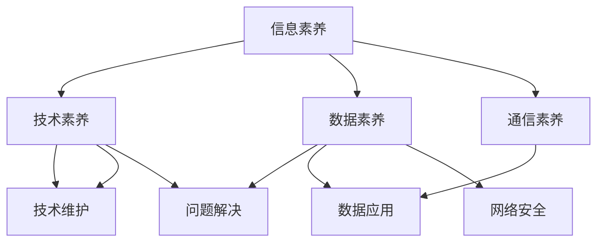
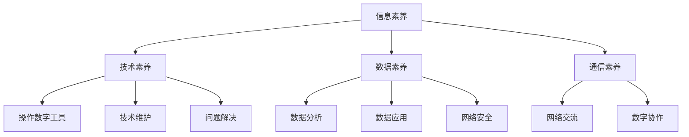

                 

### 文章标题

**数字素养：公民参与的基石**

关键词：数字素养、公民参与、信息技术、教育、社会治理

摘要：本文以数字素养为核心，探讨了其在公民参与中的重要作用。通过深入分析数字素养的基本概念、核心组成部分、教育现状与挑战，以及其在日常生活、工作和社会治理中的应用，文章揭示了数字素养对公民参与的关键影响。同时，文章还展望了数字素养教育的发展趋势和未来挑战，强调了提升公民数字素养的重要性。希望本文能为读者提供关于数字素养的全面理解和启示。

### 《数字素养：公民参与的基石》目录大纲

#### 第一部分：数字素养的基本概念与背景

1. **1.1 数字素养的定义与重要性**

   - **1.1.1 数字素养的定义**
   - **1.1.2 数字素养的重要性**

2. **1.2 数字素养的核心组成部分**

   - **1.2.1 信息素养**
   - **1.2.2 技术素养**
   - **1.2.3 数据素养**
   - **1.2.4 通信素养**

3. **1.3 数字素养与公民参与**

   - **1.3.1 数字素养与公民参与的关系**
   - **1.3.2 数字素养对公民参与的影响**

4. **1.4 数字素养教育的现状与挑战**

   - **1.4.1 全球数字素养教育的发展现状**
   - **1.4.2 数字素养教育的挑战与对策**

#### 第二部分：数字素养的核心概念原理与架构

1. **2.1 数字素养的Mermaid流程图**

   - **2.1.1 数字素养的框架概述**
   - **2.1.2 Mermaid流程图绘制**

2. **2.2 信息素养的原理与算法**

   - **2.2.1 信息素养的基本原理**
   - **2.2.2 信息检索算法的伪代码解析**

3. **2.3 技术素养的数学模型与公式**

   - **2.3.1 技术素养的数学模型**
   - **2.3.2 技术素养的公式讲解与实例**

4. **2.4 数据素养的原理与方法**

   - **2.4.1 数据素养的基本原理**
   - **2.4.2 数据分析方法的详细讲解**

5. **2.5 通信素养的实践与应用**

   - **2.5.1 通信素养的实践**
   - **2.5.2 通信素养的应用案例**

#### 第三部分：数字素养的实践应用

1. **3.1 数字素养在日常生活中的应用**

   - **3.1.1 数字设备的使用**
   - **3.1.2 数字信息的获取与处理**
   - **3.1.3 数字沟通与交流**

2. **3.2 数字素养在工作中的运用**

   - **3.2.1 数字工具与技能**
   - **3.2.2 数字工作流程与协作**
   - **3.2.3 数字职场中的沟通与协作**

3. **3.3 数字素养在社会治理中的应用**

   - **3.3.1 数字化治理的概念与意义**
   - **3.3.2 数字素养在数字化治理中的关键角色**
   - **3.3.3 数字素养提升社会治理的实践案例**

4. **3.4 数字素养在教育中的融入**

   - **3.4.1 教育数字化的发展趋势**
   - **3.4.2 数字素养教育在学校教育中的实践**
   - **3.4.3 数字素养教育在在线教育中的应用**

#### 第四部分：数字素养的教育与培养

1. **4.1 数字素养教育的目标与原则**

   - **4.1.1 数字素养教育的目标**
   - **4.1.2 数字素养教育的基本原则**

2. **4.2 数字素养教育的课程设计**

   - **4.2.1 课程内容的设计**
   - **4.2.2 教学方法的选择**
   - **4.2.3 课程评价与反馈**

3. **4.3 数字素养教育的教师培训**

   - **4.3.1 教师数字素养的需求分析**
   - **4.3.2 教师数字素养培训的内容与方法**
   - **4.3.3 教师数字素养培训的实践案例**

4. **4.4 数字素养教育的政策支持与实施**

   - **4.4.1 政策背景与政策支持**
   - **4.4.2 数字素养教育的实施策略**
   - **4.4.3 数字素养教育的评估与改进**

#### 第五部分：数字素养的未来发展趋势

1. **5.1 数字素养的未来发展趋势**

   - **5.1.1 数字技术的快速发展**
   - **5.1.2 数字素养需求的提升**
   - **5.1.3 数字素养教育的发展方向**

2. **5.2 数字素养对公民参与的影响**

   - **5.2.1 数字素养对公民参与的重要性**
   - **5.2.2 数字素养促进公民参与的方式**
   - **5.2.3 数字素养与公民参与的未来展望**

3. **5.3 数字素养教育的发展与展望**

   - **5.3.1 数字素养教育的现状与问题**
   - **5.3.2 数字素养教育的未来发展方向**
   - **5.3.3 数字素养教育的挑战与机遇**

#### 附录

1. **附录 A：数字素养相关资源与工具**

   - **A.1 数字素养教育网站与平台**
   - **A.2 数字素养工具与软件**
   - **A.3 数字素养研究文献与报告**

### 1.1 数字素养的定义与重要性

**1.1.1 数字素养的定义**

数字素养（Digital Literacy）是指个体在数字技术环境中获取、理解、评估、使用和创建信息的能力。它不仅包括技术操作层面的知识，还涵盖了信息素养、批判性思维、问题解决能力以及创造力等多个方面。数字素养的核心是能够有效地使用数字工具和技术来提高生活质量、工作效能和社会参与度。

在当今信息化时代，数字素养已经成为公民素养的重要组成部分。它不仅仅是掌握如何使用电脑、互联网和智能手机等基本技能，更是能够在复杂的信息环境中独立思考和做出明智决策的能力。数字素养不仅关乎个人的发展，还直接影响到社会的进步和治理。

**1.1.2 数字素养的重要性**

1. **提升生活质量**

   数字素养使人们能够更方便地获取信息、学习新知识、进行社交和娱乐。例如，通过互联网，人们可以轻松购买商品、预订机票、酒店，甚至远程办公，这些都有助于提高生活质量和便利性。

2. **促进就业和经济发展**

   在数字化时代，掌握数字技能的人才更受企业青睐。数字素养能够帮助个人提升职业竞争力，获取更好的就业机会。同时，数字素养也是推动经济创新和发展的重要力量，能够促进产业升级和经济增长。

3. **增强公民参与能力**

   数字素养使公民能够更积极地参与社会和政治事务，通过社交媒体表达观点、参与公共讨论、投票和倡议活动。这种参与不仅能够促进民主治理，还能增强社会的凝聚力和稳定性。

4. **应对数字鸿沟**

   数字素养有助于缩小数字鸿沟，减少因技术差异导致的社会不平等。通过提高数字素养，更多的人可以享受到数字化带来的便利和机会，从而实现更加公平的社会。

综上所述，数字素养不仅是个体发展的基石，也是社会进步和治理的关键因素。在全球数字化加速的背景下，提升数字素养已成为各国共同面临的挑战和机遇。接下来，我们将进一步探讨数字素养的核心组成部分，以及它们在公民参与中的具体作用。

### 1.2 数字素养的核心组成部分

数字素养是一个多维度的概念，其核心组成部分包括信息素养、技术素养、数据素养和通信素养。这些组成部分相互关联，共同构成了数字素养的完整框架。

**1.2.1 信息素养**

信息素养（Information Literacy）是指个体在信息检索、评估、使用和传播过程中所需的能力。具体包括以下方面：

- **信息检索能力**：能够有效地使用各种工具和资源，如图书馆、互联网、数据库等，获取所需的信息。

- **信息评估能力**：能够对信息的来源、可靠性、权威性和准确性进行评估，确保所获取的信息是真实可信的。

- **信息使用能力**：能够批判性地分析、综合和应用信息，以解决实际问题或支持决策。

- **信息传播能力**：能够合理、合法地传播和分享信息，遵循伦理规范和法律法规。

信息素养是数字素养的基础，它使个体能够在复杂的信息环境中有效地获取和处理信息，是数字素养的重要组成部分。

**1.2.2 技术素养**

技术素养（Technological Literacy）是指个体对数字技术的理解和运用能力。具体包括：

- **技术工具使用**：能够熟练使用各种数字工具和软件，如操作系统、办公软件、编程工具等。

- **技术维护和管理**：能够对数字设备进行基本的维护和管理，确保其正常运行。

- **技术问题解决**：能够识别和解决常见的数字技术问题，如系统故障、网络连接问题等。

技术素养使个体能够有效地利用数字技术提高工作效率和生活质量。随着技术的不断进步，技术素养的要求也在不断提高。

**1.2.3 数据素养**

数据素养（Data Literacy）是指个体对数据的理解、分析和应用能力。具体包括：

- **数据理解能力**：能够理解数据的概念、结构和意义，包括数据的来源、类型和格式。

- **数据分析能力**：能够使用各种数据分析方法和工具，对数据进行整理、清洗和分析，提取有用的信息。

- **数据应用能力**：能够将数据分析结果应用于实际场景，支持决策和问题解决。

数据素养在现代社会中尤为重要，因为数据已经成为决策和创新的重要依据。掌握数据素养的个体能够更好地理解和利用数据，从而在各个领域取得成功。

**1.2.4 通信素养**

通信素养（Communicative Literacy）是指个体在数字环境中进行有效沟通和交流的能力。具体包括：

- **数字沟通技能**：能够使用各种数字沟通工具，如电子邮件、即时通讯、社交媒体等，进行有效沟通。

- **网络礼仪**：能够遵守网络礼仪，尊重他人的意见和隐私，维护良好的网络环境。

- **数字协作**：能够利用数字工具和平台进行团队协作，共享信息和资源。

通信素养使个体能够更好地适应数字化工作环境，提高沟通效率和协作能力。

综上所述，信息素养、技术素养、数据素养和通信素养共同构成了数字素养的核心组成部分。这些素养不仅相互独立，而且相互补充，共同提升个体在数字技术环境中的综合能力。在下一节中，我们将进一步探讨数字素养与公民参与之间的关系。

### 1.3 数字素养与公民参与

数字素养在公民参与中起着至关重要的作用。它不仅提升了公民的参与能力，还增强了社会的整体活力和民主性。在这一部分，我们将深入探讨数字素养与公民参与之间的关系，以及数字素养对公民参与的具体影响。

**1.3.1 数字素养与公民参与的关系**

数字素养是公民参与的基础，它为公民提供了参与社会、政治和文化事务的能力和手段。在数字时代，公民不仅需要了解如何使用数字工具和技术，还需要具备批判性思维、问题解决和决策能力，以便在复杂的信息环境中做出明智的选择。

数字素养与公民参与的关系可以概括为以下几个方面：

1. **信息获取与传播**：数字素养使公民能够更便捷地获取信息，包括政府政策、社会动态和公共事务等。同时，数字素养也使公民能够更有效地传播信息，通过社交媒体、电子邮件等方式表达自己的观点和意见。

2. **公共讨论与表达**：数字素养提升了公民的公共讨论能力，使个体能够更深入地参与公共事务的讨论。在数字平台上，公民可以自由地发表意见、参与辩论，甚至组织公共讨论和活动。

3. **决策参与与监督**：数字素养使公民能够更好地参与决策过程，包括政策制定、公共项目评估等。同时，数字素养也使公民能够更有效地监督政府行为，通过公开透明的方式推动政府提高服务质量。

4. **社区建设与协作**：数字素养促进了社区建设和协作，使公民能够更方便地组织社区活动、分享资源和经验。在数字社区中，公民可以共同解决社区问题、提升社区福利。

**1.3.2 数字素养对公民参与的影响**

数字素养对公民参与的影响是深远且多层次的。以下是一些具体的影响：

1. **提升参与意愿**：数字素养使公民更加愿意参与社会和政治事务。通过数字平台，公民可以方便地获取信息、了解议题，从而激发参与的热情。

2. **增强参与能力**：数字素养提升了公民的参与能力，使个体能够更有效地获取和处理信息，进行公共讨论和表达。这种能力的提升有助于公民更积极地参与决策和监督。

3. **提高参与效率**：数字素养使公民的参与更加高效。通过数字工具和平台，公民可以更快捷地获取信息、组织和参与活动，从而节省时间和精力。

4. **促进多元化参与**：数字素养打破了地理、时间和资源的限制，使不同背景和群体的公民都能更便捷地参与社会事务。这种多元化参与有助于丰富公共讨论的内容和视角，提高决策的全面性和公正性。

5. **增强社会凝聚力**：数字素养促进了公民之间的沟通和协作，增强了社会的凝聚力。在数字社区中，公民可以共同解决问题、分享经验，形成共同的目标和价值观。

总之，数字素养是公民参与的重要基石。它不仅提升了公民的参与能力和意愿，还促进了社会的进步和治理。在数字时代，提升公民的数字素养已成为实现更广泛、更有效参与的关键。下一部分，我们将探讨数字素养教育的现状与挑战，分析全球范围内数字素养教育的发展趋势。

### 1.4 数字素养教育的现状与挑战

全球范围内，数字素养教育正逐步成为教育体系的重要组成部分。然而，尽管各国在数字素养教育方面取得了一定的进展，仍然面临着诸多挑战。在这一部分，我们将分析全球数字素养教育的发展现状，并探讨数字素养教育面临的挑战与对策。

**1.4.1 全球数字素养教育的发展现状**

1. **政策支持与推广**

   许多国家已经认识到数字素养教育的重要性，并在政策层面进行了积极的支持和推广。例如，欧盟发布了《数字素养框架》，旨在提高公民的数字素养水平。美国则通过《数字素养行动计划》，推动各级教育的数字化转型。这些政策为数字素养教育的发展提供了有力保障。

2. **课程设置与教学资源**

   各国纷纷在课程设置中融入数字素养教育。例如，许多国家的中学和大学已经开设了专门的数字素养课程，涵盖信息检索、数据分析、网络安全等方面的内容。同时，各国还开发了丰富的教学资源和教材，为学生提供更加全面和系统的数字素养教育。

3. **教师培训与专业发展**

   为了提高数字素养教育的质量，各国纷纷对教师进行数字素养培训。例如，英国开展了“数字教师培训计划”，为教师提供数字素养培训课程和实践机会。这种教师培训有助于提升教师的教学能力和数字素养水平，从而更好地指导学生。

4. **教育技术工具的应用**

   教育技术的广泛应用为数字素养教育提供了新的可能性。例如，在线学习平台、虚拟实验室和数字教育资源等，为学生提供了更多的学习资源和机会。这些教育技术的应用不仅提高了学生的学习兴趣和参与度，还有助于提升教学效果。

**1.4.2 数字素养教育的挑战与对策**

尽管全球数字素养教育取得了显著进展，但仍面临以下挑战：

1. **资源不平衡**

   在全球范围内，数字素养教育的资源分布存在显著不平衡。一些发达国家的数字素养教育条件较好，而发展中国家和地区的数字素养教育水平相对较低。这种资源不平衡导致了数字素养差距的扩大，影响了全球范围内的公平教育。

**对策**：为了缩小这种资源不平衡，国际社会应加强合作，推动数字教育资源的发展与共享。同时，各国政府应加大对数字素养教育的投入，确保所有学生都能享受到高质量的数字素养教育。

2. **教学方法与课程内容滞后**

   随着技术的快速发展，数字素养教育的教学方法与课程内容有时无法跟上技术的更新速度。这导致教育内容和方法滞后于实际需求，无法充分满足学生的数字素养需求。

**对策**：教育部门和学校应不断更新教学方法与课程内容，确保其与实际需求保持同步。同时，教师应不断学习和掌握最新的数字技术，以提高教学效果。

3. **教育公平性问题**

   数字素养教育仍然面临教育公平性问题。一些学生由于家庭条件、地理位置等因素，无法获得足够的数字素养教育资源。这种不公平性会影响学生的未来发展，加剧社会不平等。

**对策**：政府和社会应关注教育公平问题，通过提供免费或补贴的教育资源，确保所有学生都能享受到数字素养教育。同时，应加强对弱势群体的支持，提高他们的数字素养水平。

4. **网络安全与隐私保护**

   随着数字素养教育的推广，网络安全和隐私保护问题日益突出。学生和教师在使用数字工具和平台时，可能会面临信息泄露、网络攻击等风险。

**对策**：学校和教育机构应加强对网络安全和隐私保护的教育，提高学生和教师的网络安全意识。同时，应建立完善的网络安全防护机制，确保数字素养教育过程中的信息安全。

综上所述，全球数字素养教育在发展过程中面临诸多挑战，但通过政策支持、资源投入、教育改革和网络安全管理等措施，可以逐步克服这些挑战，提高全球数字素养水平。下一部分，我们将深入探讨数字素养的核心概念原理与架构，包括信息素养、技术素养、数据素养和通信素养的具体内容。

### 2.1 数字素养的Mermaid流程图

为了更直观地理解数字素养的框架和各组成部分之间的关系，我们可以使用Mermaid流程图来展示。Mermaid是一种基于Markdown的绘图工具，可以轻松绘制各种流程图、UML图、时序图等。以下是一个简单的数字素养Mermaid流程图示例：



**2.1.1 数字素养的框架概述**

上述Mermaid流程图展示了数字素养的核心组成部分及其相互关系。图中的每个节点代表一种素养，节点之间的箭头表示这些素养之间的联系和作用。

- **信息素养（A）**：包括信息检索、评估和使用能力，是数字素养的基础。
- **技术素养（B）**：涵盖对数字工具和技术的理解和操作能力，包括技术工具使用、技术维护和问题解决。
- **数据素养（C）**：涉及对数据理解和分析的能力，包括数据分析、数据应用和网络安全。
- **通信素养（D）**：指在数字环境中进行有效沟通和交流的能力，包括网络交流和数字协作。

**2.1.2 Mermaid流程图绘制**

以下是具体如何使用Mermaid语法来绘制上述流程图：



通过上述流程图，我们可以清晰地看到数字素养的各个组成部分及其相互关系。接下来，我们将分别详细探讨信息素养、技术素养、数据素养和通信素养的具体原理和算法。

### 2.2 信息素养的原理与算法

**2.2.1 信息素养的基本原理**

信息素养是指个体在信息检索、评估、使用和传播过程中所需的能力。其核心在于能够有效地获取、处理和利用信息，以解决实际问题或支持决策。以下是信息素养的几个基本原理：

1. **信息检索原理**：信息检索是信息素养的核心环节，涉及使用各种工具和资源（如图书馆、互联网、数据库等）来获取所需信息。信息检索的原理包括关键词匹配、布尔运算、分类检索等。

2. **信息评估原理**：在获取信息后，个体需要对信息的来源、可靠性、权威性和准确性进行评估。评估原理包括判断信息发布者的资质、查找引用来源、分析信息的逻辑结构等。

3. **信息使用原理**：有效使用信息是指个体能够批判性地分析、综合和应用信息，以解决实际问题或支持决策。信息使用原理包括信息整合、信息创新、信息应用等。

4. **信息传播原理**：信息传播是指个体能够合理、合法地传播和分享信息，遵循伦理规范和法律法规。信息传播原理包括尊重知识产权、遵循网络礼仪、确保信息透明等。

**2.2.2 信息检索算法的伪代码解析**

以下是一个简单的信息检索算法的伪代码示例，该算法用于搜索特定关键词并在互联网资源中获取相关信息。该算法采用基本的文本匹配和布尔运算方法。

```python
# 输入：关键词列表 keywords，搜索引擎 API
# 输出：检索结果列表 search_results

# 初始化检索结果列表
search_results = []

# 对每个关键词执行检索
for keyword in keywords:
    # 调用搜索引擎 API 进行检索
    search_results = search_engine_api.search(keyword)
    
    # 过滤无用的搜索结果
    filtered_results = filter_useful_results(search_results)
    
    # 将有效结果添加到检索结果列表中
    search_results.extend(filtered_results)

# 返回最终检索结果
return search_results

# 辅助函数：过滤有用搜索结果
def filter_useful_results(results):
    useful_results = []
    for result in results:
        # 判断结果是否满足某些条件（如可信度、相关性等）
        if is_useful(result):
            useful_results.append(result)
    return useful_results

# 辅助函数：判断搜索结果是否有用
def is_useful(result):
    # 实现具体的判断逻辑
    # 例如，判断结果的来源是否可靠、内容是否相关等
    return True  # 假设所有结果都是有用的
```

在这个伪代码中，`search_engine_api.search(keyword)`代表调用搜索引擎API进行检索，`filter_useful_results(results)`用于过滤和筛选有用的搜索结果。`is_useful(result)`是一个辅助函数，用于判断搜索结果是否符合使用标准。通过这个简单的算法，我们可以实现基本的信息检索功能，并在大量信息中找到有价值的内容。

### 2.3 技术素养的数学模型与公式

**2.3.1 技术素养的数学模型**

技术素养涉及对数字工具和技术的理解和运用，包括技术工具的使用、技术维护和问题解决。为了更好地理解技术素养，我们可以借助一些数学模型和公式，这些模型和公式能够帮助我们分析和解决实际问题。

1. **技术工具使用的数学模型**：
   - **效率模型**：技术工具的使用效率可以通过计算工具使用时间与任务完成时间之比来衡量。效率模型公式如下：
     \[
     \text{效率} = \frac{\text{任务完成时间}}{\text{工具使用时间}}
     \]
   - **误差模型**：在技术工具的使用过程中，误差是不可避免的。误差模型用于评估工具使用过程中产生的错误率。误差模型公式如下：
     \[
     \text{错误率} = \frac{\text{错误数量}}{\text{总操作次数}}
     \]

2. **技术维护的数学模型**：
   - **故障率模型**：在技术设备维护中，故障率是一个重要的指标。故障率模型用于评估设备在一段时间内发生故障的概率。故障率模型公式如下：
     \[
     \text{故障率} = \frac{\text{故障次数}}{\text{运行时间}}
     \]
   - **维护成本模型**：技术设备的维护成本可以通过计算维护费用与运行时间的关系来衡量。维护成本模型公式如下：
     \[
     \text{维护成本} = \text{维护费用} \times \text{运行时间}
     \]

3. **问题解决的数学模型**：
   - **时间效率模型**：在问题解决过程中，时间效率是关键指标。时间效率模型用于计算解决一个问题的平均时间。时间效率模型公式如下：
     \[
     \text{时间效率} = \frac{1}{\text{解决问题次数}} \sum_{i=1}^{n} \frac{1}{\text{解决第i个问题的耗时}}
     \]
   - **资源利用率模型**：在问题解决过程中，资源利用率也是一个重要的考量因素。资源利用率模型用于评估资源的使用效率。资源利用率模型公式如下：
     \[
     \text{资源利用率} = \frac{\text{实际使用资源量}}{\text{总资源量}}
     \]

**2.3.2 技术素养的公式讲解与实例**

以下通过一个实例来详细解释上述数学模型和公式的应用。

**实例：分析一款编程语言的效率**

假设我们分析了一款编程语言A，并在相同任务下与另一款编程语言B进行比较。以下是具体的分析步骤：

1. **效率模型**：

   - **任务完成时间**：编程语言A用时5分钟，编程语言B用时7分钟。
   - **效率计算**：
     \[
     \text{编程语言A的效率} = \frac{5}{5} = 1
     \]
     \[
     \text{编程语言B的效率} = \frac{7}{5} = 0.714
     \]

   由此可见，编程语言A的使用效率更高。

2. **误差模型**：

   - **错误数量**：编程语言A在任务中产生了3个错误，编程语言B产生了2个错误。
   - **总操作次数**：编程语言A执行了500次操作，编程语言B执行了600次操作。
   - **错误率计算**：
     \[
     \text{编程语言A的错误率} = \frac{3}{500} = 0.006
     \]
     \[
     \text{编程语言B的错误率} = \frac{2}{600} = 0.0033
     \]

   由此可见，编程语言B在使用过程中产生的错误率较低。

3. **故障率模型**：

   - **故障次数**：编程语言A在一个月内发生了5次故障，编程语言B发生了3次故障。
   - **运行时间**：编程语言A运行了100小时，编程语言B运行了120小时。
   - **故障率计算**：
     \[
     \text{编程语言A的故障率} = \frac{5}{100} = 0.05
     \]
     \[
     \text{编程语言B的故障率} = \frac{3}{120} = 0.025
     \]

   由此可见，编程语言B的故障率较低，可靠性更高。

4. **维护成本模型**：

   - **维护费用**：编程语言A的维护费用为每小时10美元，编程语言B的维护费用为每小时8美元。
   - **运行时间**：编程语言A运行了100小时，编程语言B运行了120小时。
   - **维护成本计算**：
     \[
     \text{编程语言A的维护成本} = 10 \times 100 = 1000 \text{美元}
     \]
     \[
     \text{编程语言B的维护成本} = 8 \times 120 = 960 \text{美元}
     \]

   由此可见，编程语言B的维护成本较低。

通过上述实例，我们可以看到数学模型和公式的应用在技术素养分析中的重要性。这些模型和公式帮助我们更全面、客观地评估技术工具的使用效果、故障率、维护成本等，从而为技术选择和决策提供有力支持。

### 2.4 数据素养的原理与方法

**2.4.1 数据素养的基本原理**

数据素养是指个体理解和分析数据的能力，包括数据理解、数据分析和数据应用等多个方面。它是数字素养的重要组成部分，对于个体在现代社会中的生存和发展具有重要意义。以下是数据素养的基本原理：

1. **数据理解**：数据素养的首要任务是理解数据。这包括理解数据的基本概念、数据类型、数据来源和数据分析方法等。理解数据的能力使个体能够有效地获取和处理数据，从而为后续分析奠定基础。

2. **数据分析**：数据分析是数据素养的核心内容。数据分析方法包括描述性分析、推断性分析和预测性分析等。描述性分析用于总结和展示数据的基本特征，推断性分析用于分析数据之间的关系和趋势，预测性分析则用于预测未来数据的发展趋势。掌握数据分析方法使个体能够从数据中提取有价值的信息。

3. **数据应用**：数据应用是将分析结果应用于实际场景的过程。数据应用能力包括将数据分析结果用于决策支持、问题解决、创新和创业等多个方面。数据应用能力使个体能够利用数据驱动决策，提高工作效率和生活质量。

4. **数据伦理**：数据素养还包括数据伦理方面的内容。个体在处理数据时，应遵循数据伦理原则，确保数据的隐私和安全。这包括尊重数据主体权利、遵守数据法律法规、防止数据滥用等。

**2.4.2 数据分析方法的详细讲解**

数据分析方法多种多样，以下介绍几种常见的数据分析方法：

1. **描述性分析**：描述性分析是最基本的数据分析方法，主要用于总结和展示数据的基本特征。描述性分析方法包括均值、中位数、众数、方差、标准差等统计指标的计算和图表展示。描述性分析可以帮助个体快速了解数据的基本分布和趋势。

   - **计算示例**：假设有一组数据 [3, 5, 7, 9, 11]，我们可以计算其均值、中位数和标准差：
     \[
     \text{均值} = \frac{3 + 5 + 7 + 9 + 11}{5} = 7
     \]
     \[
     \text{中位数} = 7
     \]
     \[
     \text{标准差} = \sqrt{\frac{(3-7)^2 + (5-7)^2 + (7-7)^2 + (9-7)^2 + (11-7)^2}{5}} = \sqrt{8} \approx 2.83
     \]

   - **图表展示**：描述性分析通常使用柱状图、饼图、散点图等图表进行展示。

2. **推断性分析**：推断性分析用于分析数据之间的关系和趋势，主要包括回归分析、方差分析等。推断性分析可以帮助个体理解变量之间的关系，并进行预测。

   - **回归分析**：回归分析用于研究因变量和自变量之间的关系。假设我们有一组数据，其中因变量为销售额（Y），自变量为广告支出（X），我们可以使用回归分析来预测销售额。
     \[
     Y = \beta_0 + \beta_1 X + \epsilon
     \]
     其中，\(\beta_0\) 为截距，\(\beta_1\) 为斜率，\(\epsilon\) 为误差项。

   - **方差分析**：方差分析用于比较两个或多个变量之间的差异。例如，我们可以使用方差分析来比较不同广告策略对销售额的影响。

3. **预测性分析**：预测性分析用于预测未来数据的发展趋势，主要包括时间序列分析和机器学习算法。时间序列分析可以用于预测未来一段时间内数据的变化趋势，而机器学习算法则可以用于更复杂的数据预测任务。

   - **时间序列分析**：时间序列分析用于分析数据的时间分布和趋势，常用方法包括移动平均、指数平滑等。
     \[
     \text{移动平均} = \frac{\sum_{i=1}^{n} X_i}{n}
     \]
     \[
     \text{指数平滑} = \alpha X_t + (1 - \alpha) \text{前一期的预测值}
     \]

   - **机器学习算法**：机器学习算法（如线性回归、决策树、支持向量机等）可以用于复杂的数据预测任务。例如，我们可以使用线性回归算法预测未来的销售额。

通过掌握这些数据分析方法，个体可以更好地理解和利用数据，为决策提供有力支持。在下一部分中，我们将探讨通信素养的实践与应用，分析通信素养在日常生活中的重要性。

### 2.5 通信素养的实践与应用

**2.5.1 通信素养的实践**

通信素养是指在数字环境中进行有效沟通和交流的能力，包括数字沟通技能、网络礼仪和数字协作等多个方面。在数字时代，良好的通信素养对于个人和社会都具有重要意义。以下是一些具体的实践方法：

1. **数字沟通技能**：数字沟通技能包括电子邮件、即时通讯、社交媒体等工具的使用。在电子邮件中，应注意使用清晰的标题、简洁的语言和礼貌的语气。在即时通讯中，要迅速回复信息，确保沟通的及时性。在社交媒体上，要遵守平台规则，尊重他人意见，避免不必要的冲突。

2. **网络礼仪**：网络礼仪是指在网络环境中应遵循的行为规范，包括尊重他人、保护隐私、遵守法律法规等。在网络交流中，要尊重他人的观点和隐私，避免恶意攻击和诽谤。同时，要保护自己的隐私，不随意泄露个人信息。

3. **数字协作**：数字协作是指利用数字工具和平台进行团队协作的能力。在实际工作中，可以采用项目管理系统、协作工具和在线会议系统等，提高团队协作效率。在协作过程中，要明确任务分工、沟通方式和进度安排，确保项目顺利进行。

**2.5.2 通信素养的应用案例**

以下是一些通信素养的实际应用案例：

1. **社交媒体管理**：企业可以借助社交媒体平台（如微信、微博、Facebook等）与客户进行互动，提高品牌知名度和客户满意度。通过发布有价值的内容、及时回复客户疑问和反馈，企业可以建立良好的客户关系，增强品牌形象。

2. **远程办公协作**：在全球化背景下，远程办公已经成为许多企业的工作模式。通过电子邮件、即时通讯工具（如Slack、Telegram等）和在线会议系统（如Zoom、Microsoft Teams等），团队成员可以实时沟通、共享文件和协同工作，提高工作效率。

3. **公共事务参与**：公民可以通过数字平台参与公共事务讨论和决策。例如，政府可以借助社交媒体和在线调查工具，征求公众对政策制定的意见和建议。公民可以通过这些平台表达自己的观点，参与社会事务的讨论，推动民主治理的发展。

通过上述实践和应用，通信素养不仅提高了个人和团队的工作效率，还促进了社会协作和民主治理的发展。在数字时代，培养和提高通信素养已成为个体和社会的重要任务。

### 3.1 数字素养在日常生活中的应用

数字素养在日常生活中的应用日益广泛，它不仅提高了我们的生活质量，还改变了我们的生活方式。以下将探讨数字素养在日常生活中的几个关键应用领域。

**3.1.1 数字设备的使用**

随着科技的发展，数字设备已经成为我们日常生活中不可或缺的工具。掌握数字设备的使用是数字素养的基础。以下是一些常见数字设备的使用场景及其对数字素养的要求：

1. **智能手机**：智能手机是现代生活中最重要的数字设备之一。它不仅用于通信，还用于娱乐、支付、导航、拍照等多种功能。要熟练使用智能手机，需要了解操作系统、应用商店、移动支付、GPS导航等基本操作。

2. **电脑**：电脑在办公、学习、娱乐等方面发挥着重要作用。掌握电脑的基本操作，如文件管理、系统设置、软件安装与卸载等，是数字素养的重要组成部分。

3. **智能家居设备**：智能家居设备如智能电视、智能音箱、智能灯具等，通过互联网连接，实现了家庭自动化和智能化。学会使用这些设备，如设置Wi-Fi连接、语音控制、设备间互联等，是提升数字素养的重要一环。

**3.1.2 数字信息的获取与处理**

在信息爆炸的时代，如何有效获取和处理数字信息是数字素养的重要体现。以下是一些关键技能：

1. **信息检索**：掌握搜索引擎的使用技巧，如关键词优化、布尔运算、高级搜索等，能够帮助我们快速找到所需信息。

2. **信息评估**：学会评估信息的来源、可靠性和准确性，避免受到虚假信息的影响。这包括识别媒体偏见、查看引用来源、分析信息内容等。

3. **信息处理**：学会使用文本编辑、数据整理、图表制作等工具，如Microsoft Office套件、Google文档、Excel等，能够提高工作效率，更好地管理和利用信息。

**3.1.3 数字沟通与交流**

数字沟通与交流是数字素养的重要组成部分，它不仅涉及个人之间的沟通，还包括团队协作和公共事务参与。以下是一些关键技能：

1. **电子邮件沟通**：掌握电子邮件的基本礼仪，如使用清晰的主题、简洁明了的语言、礼貌的语气等，能够提高沟通效率。

2. **即时通讯工具**：熟练使用即时通讯工具（如微信、WhatsApp、Slack等），能够实时与同事、朋友和家人进行沟通。

3. **社交媒体**：学会使用社交媒体（如微博、Facebook、Twitter等），能够方便地分享信息、表达观点、参与公共讨论。

4. **网络会议**：掌握网络会议工具（如Zoom、Microsoft Teams等），能够远程参加会议、培训和讨论，提高远程工作的效率。

通过以上数字素养的应用，我们不仅能够更好地适应现代生活，还能提高工作效率、增强社会参与度，从而实现个人和社会的全面发展。在接下来的部分，我们将探讨数字素养在工作中的运用。

### 3.2 数字素养在工作中的运用

数字素养在现代社会的工作环境中扮演着至关重要的角色。随着技术的不断进步和数字化转型的加速，掌握数字技能和知识已成为提升职业竞争力、实现职业发展的关键因素。以下将探讨数字素养在工作中的具体运用，包括数字工具与技能、数字工作流程与协作、以及数字职场中的沟通与协作。

**3.2.1 数字工具与技能**

1. **办公软件应用**：熟练掌握各种办公软件（如Microsoft Office、Google Workspace等）是数字素养的基本要求。这包括Word、Excel、PowerPoint等软件的使用技巧，如文档编辑、数据分析和演示制作。例如，Excel的高级功能如数据透视表、宏、VBA编程等，可以帮助工作者高效处理和分析大量数据。

2. **项目管理工具**：了解并掌握项目管理工具（如Trello、Asana、JIRA等）的使用，能够帮助团队更好地规划和管理项目进度、任务分配和资源调度。这些工具提供了可视化的项目视图，使得团队成员能够实时跟踪项目进展，提高协作效率。

3. **协作工具**：现代工作环境中，协作工具如Slack、Microsoft Teams、Google Chat等已经成为团队沟通和协作的核心。这些工具提供了即时通讯、文件共享、任务管理等功能，使得团队成员可以随时进行沟通和协作，提高工作效率。

4. **云计算与大数据**：了解云计算服务（如AWS、Azure、Google Cloud等）和大数据处理技术（如Hadoop、Spark等），能够帮助工作者更好地管理数据资源、进行大规模数据处理和分析。这为企业在数据驱动的决策和创新方面提供了强大支持。

**3.2.2 数字工作流程与协作**

1. **自动化流程**：通过使用自动化工具（如Robotics Process Automation，RPA），企业可以自动化许多重复性、规则性强的任务，如数据录入、报表生成等。这大大减少了人工工作量，提高了工作效率和准确性。

2. **敏捷开发**：敏捷开发是一种以团队协作和快速响应变化为核心的开发方法。掌握敏捷开发工具（如JIRA、Confluence等）和敏捷开发流程，能够帮助团队更灵活地应对市场需求变化，提高产品交付速度和质量。

3. **虚拟团队协作**：在全球化背景下，虚拟团队协作变得愈加普遍。通过数字工具和平台，团队成员可以跨越地理和时间的限制，实现高效的远程协作。例如，利用视频会议系统（如Zoom、Microsoft Teams等），团队成员可以实时召开会议、讨论和分享信息。

**3.2.3 数字职场中的沟通与协作**

1. **电子邮件沟通**：在职场中，电子邮件是重要的沟通工具。掌握电子邮件沟通的技巧，如使用清晰的标题、简洁明了的语言、礼貌的语气等，能够提高沟通效率，避免误解和冲突。

2. **即时通讯与协作**：即时通讯工具（如Slack、Microsoft Teams、Google Chat等）提供了实时沟通和协作的平台，使得团队成员可以快速交流信息、共享文件和协同工作。这些工具的聊天记录功能也有助于团队记录和追溯沟通内容。

3. **虚拟会议与培训**：通过虚拟会议系统（如Zoom、Microsoft Teams等），企业可以举办在线会议、培训和研讨会，打破时间和空间的限制，让团队成员和利益相关者能够远程参与。这些工具提供了屏幕共享、视频会议、互动讨论等功能，增强了会议的互动性和参与感。

4. **知识共享与协作平台**：企业可以利用知识共享平台（如Confluence、SharePoint等），建立集中化的文档库、知识库和协作空间，使得团队成员能够方便地获取、共享和更新信息。这有助于知识的积累和传承，提高了团队的整体协作效率。

总之，数字素养在工作中的运用不仅提升了工作效率和协作能力，还促进了企业的创新和竞争力。通过掌握数字工具与技能、优化数字工作流程与协作、以及提高数字职场中的沟通与协作能力，企业可以更好地适应数字化时代的发展需求，实现持续成长和成功。在下一部分中，我们将探讨数字素养在社会治理中的应用。

### 3.3 数字素养在社会治理中的应用

随着信息技术的飞速发展，社会治理也在逐渐向数字化、智能化方向转型。数字素养在社会治理中扮演着至关重要的角色，它不仅提高了政府和社会组织的治理能力，还增强了公众的参与度和信任度。以下将探讨数字素养在社会治理中的应用，包括数字化治理的概念与意义、数字素养在数字化治理中的关键角色，以及数字素养提升社会治理的实践案例。

**3.3.1 数字化治理的概念与意义**

数字化治理（Digital Governance）是指利用数字技术来改进政府和社会组织的运作方式，提高治理效率、透明度和公众参与度。数字化治理涵盖了政府管理、公共服务、社会监督等多个领域，通过数据化、信息化和智能化手段，实现治理现代化和效率提升。

数字化治理的意义主要体现在以下几个方面：

1. **提高治理效率**：数字化治理通过自动化、智能化的手段，减少了人工操作和纸质流程，提高了政府和社会组织的运作效率。例如，通过电子政务系统，政府可以快速处理审批事项、发布政策信息，提高办事效率。

2. **增强透明度**：数字化治理使得政府工作更加透明，公众可以实时获取政府信息、参与决策过程，从而监督政府行为。例如，通过政府门户网站和社交媒体平台，政府可以公开财政预算、项目进展等信息，增强政府与公众的互动。

3. **提升公众参与度**：数字化治理提供了多种途径，使得公众可以更方便地参与社会治理。例如，通过在线调查、公共讨论平台等，公众可以表达意见和建议，参与公共事务的决策过程。

4. **促进社会协作**：数字化治理通过搭建数字平台，促进政府、社会组织和公众之间的协作。例如，通过智能城市平台，政府可以与市民、企业等各方协同工作，共同解决城市问题，提升社会治理能力。

**3.3.2 数字素养在数字化治理中的关键角色**

数字素养在数字化治理中发挥着关键作用，它是实现数字化治理目标的基础。以下从几个方面分析数字素养在数字化治理中的关键角色：

1. **政府官员的数字素养**：政府官员需要具备较高的数字素养，以适应数字化治理的需求。数字素养使得政府官员能够熟练使用数字工具和技术，提高工作效率。同时，他们还需要具备数据分析和决策能力，能够利用数据支持决策，提升治理水平。

2. **公众的数字素养**：公众的数字素养是数字化治理成功的关键。掌握数字技能和知识的公众能够更有效地参与社会治理，表达意见和建议，监督政府行为。例如，通过社交媒体和在线平台，公众可以更便捷地获取政府信息、参与公共讨论，从而提升公共事务的透明度和公众参与度。

3. **社会组织的数字素养**：社会组织在数字化治理中发挥着重要作用，它们需要具备较高的数字素养，以便更好地与政府、企业和社会公众协作，共同解决社会问题。例如，通过数字平台，社会组织可以更高效地筹集资金、开展公益活动，提升社会影响力。

**3.3.3 数字素养提升社会治理的实践案例**

以下是一些数字素养提升社会治理的实践案例：

1. **电子政务**：许多国家已经推行电子政务，通过数字平台提供在线服务，提高政府工作效率。例如，中国政府推出的“互联网+政务服务”平台，提供了包括税务、社保、医疗等多领域的在线服务，极大地方便了公众办事。

2. **智慧城市**：智慧城市建设通过数字技术和数据分析，提高城市管理效率和公共服务水平。例如，新加坡的智慧城市项目利用物联网、大数据和人工智能技术，实现了交通管理、环境监测、公共安全等多个领域的智能化。

3. **公民参与平台**：许多国家和地区建立了公民参与平台，通过在线调查、公共讨论等方式，提高公众参与度。例如，英国的“公民宪章”项目，通过在线平台征求公众对政府政策的意见和建议，增强了公众的参与感和信任度。

4. **数字公益**：数字公益利用数字平台和社交媒体，开展公益活动，提高社会影响力。例如，腾讯公益平台通过微信、QQ等社交媒体，吸引了大量公众参与公益活动，实现了公益事业的数字化转型。

总之，数字素养在社会治理中的应用具有重要意义，它不仅提高了政府和社会组织的治理能力，还增强了公众的参与度和信任度。通过不断提升数字素养，政府和社会可以更好地适应数字化时代的发展需求，实现更加高效、透明和协作的社会治理。在下一部分中，我们将探讨数字素养在教育中的融入。

### 3.4 数字素养在教育中的融入

数字素养在当代教育中扮演着不可或缺的角色，它不仅改变了教学模式，还提高了学生的综合能力。以下将探讨数字素养在教育中的融入，包括教育数字化的发展趋势、数字素养教育在学校教育中的实践，以及数字素养教育在在线教育中的应用。

**3.4.1 教育数字化的发展趋势**

1. **数字化教学资源**：教育数字化首先体现在教学资源的数字化。学校和教育机构开始大量采用电子书籍、在线课程、多媒体教学材料等数字化资源，以丰富教学内容，提高教学效果。这些资源便于存储、共享和更新，为学生提供了更加多样化和个性化的学习体验。

2. **在线学习平台**：随着互联网的普及，在线学习平台逐渐成为教育的重要组成部分。这些平台提供了丰富的课程资源和学习工具，使学生能够随时随地进行学习。例如，Coursera、edX、Udemy等在线教育平台，为学生提供了全球顶尖大学的课程和认证。

3. **智能教育系统**：智能教育系统通过人工智能和大数据分析技术，实现了个性化教学和学习评估。智能教育系统能够根据学生的学习情况和进度，自动推荐合适的学习资源和任务，提供定制化的学习方案，从而提高学习效果。

**3.4.2 数字素养教育在学校教育中的实践**

1. **课程设计**：许多学校已经开始在课程设计中融入数字素养教育。例如，在信息技术课程中，不仅教授计算机操作技能，还强调信息检索、数据分析和网络安全等数字素养的培养。其他学科也通过项目式学习和跨学科教学，将数字素养融入到课程中。

2. **教学活动**：学校利用数字工具和平台开展各种教学活动，如在线讨论、虚拟实验室、编程竞赛等，激发学生的学习兴趣和创造力。这些活动不仅提高了学生的数字素养，还培养了他们的团队合作和沟通能力。

3. **教师培训**：为了提升教师的数字素养，学校和教育机构开展了多种形式的教师培训项目。这些项目包括数字工具使用培训、教学设计研讨会、在线课程等，帮助教师掌握数字教育的新理念和新方法。

**3.4.3 数字素养教育在在线教育中的应用**

1. **个性化学习**：在线教育平台利用大数据和人工智能技术，实现了个性化学习。平台根据学生的学习历史和表现，自动推荐适合的学习内容和路径，帮助学生更高效地学习。

2. **混合式学习**：混合式学习（Blended Learning）将线上和线下学习相结合，为学生提供灵活的学习方式。在线教育平台提供了丰富的学习资源，学生可以自主安排学习时间和进度。同时，教师通过线下课堂进行辅导和互动，确保学习效果。

3. **远程教育**：在线教育平台使得远程教育成为可能，特别是对于地处偏远地区的学生。通过互联网，学生可以享受到优质的教育资源，缩小了教育资源的不均衡。

4. **协作学习**：在线教育平台提供了协作学习的功能，学生可以在线小组讨论、合作完成项目，提高团队合作能力和沟通能力。

总之，数字素养在教育中的融入不仅推动了教育模式的变革，还为学生提供了更加丰富和多样化的学习体验。通过不断加强数字素养教育，学校和教育机构能够培养出具备全面素质和创新能力的新一代人才。在下一部分中，我们将探讨数字素养教育的目标与原则。

### 4.1 数字素养教育的目标与原则

**4.1.1 数字素养教育的目标**

数字素养教育的目标在于培养个体在数字技术环境中获取、理解、评估、使用和创建信息的能力，以提升其生活质量、职业竞争力和社会参与度。具体目标如下：

1. **基本技能培养**：确保学生能够熟练操作计算机、互联网和智能手机等基本数字工具，具备基本的数字操作技能。

2. **信息素养提升**：培养学生高效检索、评估和使用信息的能力，提高其在复杂信息环境中的信息素养。

3. **技术素养增强**：培养学生理解数字技术的工作原理和功能，掌握数字工具的使用技巧，能够进行技术维护和问题解决。

4. **数据素养发展**：培养学生理解数据分析的基本原理和方法，能够进行数据整理、清洗和分析，应用数据分析结果解决实际问题。

5. **通信素养提升**：培养学生有效沟通和交流的能力，能够在数字环境中进行有效的沟通和协作。

6. **安全意识培养**：提高学生对网络安全和隐私保护的认识，培养学生遵守网络道德和法律法规，增强信息安全意识。

**4.1.2 数字素养教育的基本原则**

为了实现上述目标，数字素养教育应遵循以下基本原则：

1. **个性化原则**：根据学生的兴趣、需求和认知水平，提供个性化的数字素养教育方案，确保每个学生都能获得合适的学习资源和指导。

2. **整合性原则**：将数字素养教育融入到各个学科和课程中，实现跨学科整合，培养学生的综合能力。

3. **实践性原则**：通过实际操作和项目实践，让学生在真实场景中应用数字技能和知识，提高其解决问题的能力。

4. **互动性原则**：鼓励学生参与互动式学习，通过小组讨论、合作项目等形式，培养学生的沟通和协作能力。

5. **可持续性原则**：数字素养教育应持续进行，根据技术发展和学生需求的变化，不断更新教学内容和教学方法，确保教育的时效性和实用性。

通过遵循这些基本原则，数字素养教育可以更好地实现其目标，培养出具备全面素质和创新能力的新一代数字公民。在下一部分中，我们将探讨数字素养教育的课程设计。

### 4.2 数字素养教育的课程设计

**4.2.1 课程内容的设计**

数字素养教育的课程内容设计应综合考虑不同年龄段和学科的特点，确保课程内容的全面性和系统性。以下是数字素养教育课程内容的设计要点：

1. **基础技能课程**：针对初学者，基础技能课程应包括计算机操作、互联网使用、智能手机应用等基本技能的培训。通过这些课程，学生能够掌握基本的数字工具使用方法。

2. **信息素养课程**：信息素养课程应涵盖信息检索、信息评估、信息使用和传播等方面的内容。通过学习信息素养，学生能够高效地获取和处理信息，提高其在信息环境中的适应能力。

3. **技术素养课程**：技术素养课程应包括计算机硬件与软件知识、操作系统、编程语言、网络安全等主题。这些课程旨在培养学生的技术理解和问题解决能力。

4. **数据素养课程**：数据素养课程应涉及数据理解、数据分析、数据可视化等主题。通过这些课程，学生能够掌握基本的数据分析方法和工具，提高其数据素养。

5. **通信素养课程**：通信素养课程应包括数字沟通、网络礼仪、社交媒体使用等主题。这些课程旨在培养学生的沟通和协作能力，提高其在数字环境中的沟通效率。

6. **安全素养课程**：安全素养课程应涵盖网络安全、隐私保护、法律法规等方面的内容。通过这些课程，学生能够提高安全意识，遵守网络道德和法律法规。

**4.2.2 教学方法的选择**

为了提高数字素养教育的效果，应采用多种教学方法，结合理论讲解和实践操作。以下是几种常见的教学方法：

1. **项目式学习**：通过项目式学习，学生可以在真实情境中应用数字技能和知识，解决实际问题。这种方法有助于培养学生的实践能力和解决问题的能力。

2. **互动式教学**：互动式教学通过小组讨论、角色扮演、模拟实验等方式，促进学生之间的互动和合作，提高学习的趣味性和参与度。

3. **案例教学**：通过分析实际案例，学生可以更直观地了解数字素养的应用，学习解决问题的方法。案例教学有助于提高学生的批判性思维和问题解决能力。

4. **在线学习**：在线学习平台提供了丰富的教学资源和学习工具，学生可以自主安排学习时间和进度，提高学习效率。在线学习还可以通过视频、直播、讨论区等形式，增强师生互动和学生参与度。

5. **混合式学习**：混合式学习结合了传统课堂教学和在线学习的优点，实现了教学模式的创新。通过线上和线下教学相结合，学生可以更灵活地安排学习，提高学习效果。

**4.2.3 课程评价与反馈**

为了确保数字素养教育的质量，应建立科学的课程评价体系，包括过程评价和结果评价。以下是课程评价和反馈的要点：

1. **过程评价**：过程评价关注学生的学习过程，包括出勤率、课堂参与度、作业完成情况等。通过过程评价，教师可以及时了解学生的学习情况，调整教学策略。

2. **结果评价**：结果评价关注学生的学习成果，包括考试成绩、项目完成情况、技能掌握程度等。通过结果评价，教师可以评估教学效果，为后续教学提供参考。

3. **学生反馈**：学生反馈是评价教学效果的重要依据。教师应定期收集学生的意见和建议，了解学生的学习体验和需求，不断改进教学方法和内容。

4. **反馈与改进**：基于评价结果和学生反馈，教师应分析存在的问题和不足，制定改进措施，提高教学质量。同时，教师应持续关注学生的学习进展，提供个性化指导和支持。

通过科学合理的课程内容设计、灵活多样的教学方法和全面系统的课程评价体系，数字素养教育可以更好地实现其目标，培养出具备全面素质和创新能力的新一代数字公民。在下一部分中，我们将探讨数字素养教育的教师培训。

### 4.3 数字素养教育的教师培训

**4.3.1 教师数字素养的需求分析**

在数字素养教育中，教师的角色至关重要。为了有效培养学生的数字素养，教师自身必须具备较高的数字素养水平。以下是对教师数字素养需求的分析：

1. **技术应用能力**：教师需要熟练掌握各种数字工具和平台，如电脑、互联网、社交媒体、在线学习平台等。这包括基本操作、功能使用和故障解决能力。

2. **信息素养**：教师需要具备高效检索、评估和使用信息的能力，能够辨别信息的真实性和可靠性，确保传递给学生的是准确、有用的信息。

3. **技术素养**：教师需要理解数字技术的工作原理和功能，能够进行简单的编程、数据处理和网络安全设置，从而更好地指导学生。

4. **教学设计能力**：教师需要能够将数字素养融入到学科教学中，设计出适合学生年龄和认知水平的数字素养课程，并通过多样化的教学方法激发学生的学习兴趣。

5. **安全意识**：教师需要具备较强的网络安全和隐私保护意识，能够教育学生遵守网络道德和法律法规，确保他们在数字环境中的安全和合法行为。

**4.3.2 教师数字素养培训的内容与方法**

为了满足教师数字素养的需求，应开展系统的数字素养培训。以下是一些培训内容和方法的建议：

1. **培训内容**：

   - **基本技能培训**：包括电脑操作、互联网使用、社交媒体应用等基本数字技能。
   - **信息素养培训**：教授信息检索、信息评估、信息使用和传播的方法和技巧。
   - **技术素养培训**：涵盖计算机硬件与软件知识、编程语言、数据处理和网络安全等主题。
   - **教学设计培训**：教授如何将数字素养融入学科教学，设计出有效的教学活动。
   - **安全意识培训**：提高教师对网络安全的认识，教育学生如何保护个人信息和遵守网络规范。

2. **培训方法**：

   - **工作坊和研讨会**：通过工作坊和研讨会，教师可以互动交流、分享经验，提高数字素养。
   - **在线课程和远程培训**：利用在线课程和远程培训平台，教师可以在灵活的时间和地点进行学习，提高培训的覆盖面和便捷性。
   - **实践操作**：通过实际操作和项目实践，教师可以掌握数字工具和技能的使用，提高实践能力。
   - **案例分析**：通过分析实际案例，教师可以学习解决实际问题的方法和策略，提高教学设计能力。
   - **教学观摩和反馈**：通过教学观摩和反馈，教师可以了解自己的教学效果，发现问题和不足，不断改进教学。

**4.3.3 教师数字素养培训的实践案例**

以下是一个教师数字素养培训的实践案例：

**案例：某中学教师数字素养提升计划**

1. **培训目标**：提高教师的数字技能和教学设计能力，使其能够有效融入数字素养教育。

2. **培训内容**：

   - **基本技能培训**：电脑操作、互联网使用、社交媒体应用。
   - **信息素养培训**：信息检索、信息评估、信息使用和传播。
   - **技术素养培训**：编程基础、数据处理、网络安全。
   - **教学设计培训**：项目式学习、互动式教学、混合式学习。

3. **培训方法**：

   - **在线课程和远程培训**：教师通过在线学习平台完成基础培训课程，每周完成一定的学习任务。
   - **工作坊和研讨会**：每两个月举行一次工作坊，教师可以交流经验、分享教学设计案例。
   - **实践操作**：教师参与实际项目，如设计数字素养课程、开发在线学习资源。
   - **教学观摩和反馈**：教师互相观摩教学，进行课后反思和反馈，不断改进教学方法。

4. **培训效果**：

   - **技能提升**：教师掌握了基本的数字工具和技能，能够熟练应用于教学实践中。
   - **教学设计能力增强**：教师能够设计出有效的数字素养课程，提高学生的参与度和学习效果。
   - **教师互动与协作**：通过工作坊和研讨会，教师建立了良好的互动和协作机制，共同探讨教学问题。

通过系统的数字素养培训，教师不仅提高了自身的数字素养水平，还增强了教学效果，为学生的全面发展提供了有力支持。在下一部分中，我们将探讨数字素养教育的政策支持与实施。

### 4.4 数字素养教育的政策支持与实施

**4.4.1 政策背景与政策支持**

在全球范围内，数字素养教育已成为各国教育政策的重要关注点。随着数字化进程的加速，各国政府纷纷出台政策，支持数字素养教育的实施和发展。以下是一些主要政策背景和政策支持：

1. **欧盟**：欧盟发布了《数字素养框架》（Digital Competence Framework for Citizens），旨在提高欧盟公民的数字素养水平。该框架涵盖了信息素养、技术素养、数据素养和通信素养等多个方面。

2. **美国**：美国教育部门发布了《数字素养行动计划》（National Digital Learning Action Plan），强调通过数字化转型提高教育质量和学生的数字素养。该计划提出了一系列具体措施，包括投资数字教育资源、培训教师和提供技术支持等。

3. **中国**：中国政府发布了《新一代人工智能发展规划》，强调数字素养教育的重要性，提出要通过加强人工智能教育、提升教师数字素养等举措，培养数字时代的人才。

4. **其他国家**：包括日本、韩国、澳大利亚等在内的许多国家也纷纷出台了相关政策，支持数字素养教育的推广和实施。

**4.4.2 数字素养教育的实施策略**

为了有效实施数字素养教育，各国政府和教育机构应采取以下策略：

1. **政策制定与规划**：制定全面的数字素养教育政策，明确教育目标、课程设置和评价体系，确保数字素养教育有章可循。

2. **资源投入**：加大对数字素养教育的资金投入，包括购买数字化教学资源、建设在线学习平台、提供技术支持等，确保教育资源的充足和有效利用。

3. **教师培训**：加强教师的数字素养培训，提高教师的数字技能和教学设计能力，使其能够有效融入数字素养教育。

4. **课程设计与教学**：根据学生年龄和认知水平，设计符合实际的数字素养课程，采用多样化的教学方法和评估方式，提高教学效果。

5. **社会合作**：建立政府、学校、企业和社会组织之间的合作机制，共同推动数字素养教育的实施和发展。例如，企业可以提供实习机会、教育资源和技术支持，学校可以与企业合作开展实践活动。

**4.4.3 数字素养教育的评估与改进**

为了确保数字素养教育的质量和效果，应建立科学的评估体系，定期对数字素养教育的实施情况进行评估和改进。以下是一些评估与改进的要点：

1. **过程评估**：关注教育过程中的各项指标，如课程完成率、学生参与度、教师教学反馈等，及时发现问题和不足，调整教学策略。

2. **结果评估**：通过考试成绩、项目完成情况、学生技能掌握程度等指标，评估数字素养教育的实际效果，为政策制定和教学改进提供依据。

3. **学生反馈**：定期收集学生的意见和建议，了解其学习体验和需求，改进教学方法和内容，提高学生满意度。

4. **持续改进**：基于评估结果和学生反馈，不断调整和优化数字素养教育政策、课程设计和教学方法，确保教育质量不断提升。

通过政策支持、资源投入、教师培训和课程设计等策略，以及科学的评估与改进机制，数字素养教育可以取得更好的实施效果，培养出具备全面素质和创新能力的新一代数字公民。在下一部分中，我们将探讨数字素养的未来发展趋势。

### 5.1 数字素养的未来发展趋势

数字素养作为现代社会的重要基础，其未来发展将受到多种因素的影响，包括数字技术的快速发展、数字素养需求的提升以及数字素养教育的发展方向。以下将探讨数字素养的未来发展趋势。

**5.1.1 数字技术的快速发展**

1. **人工智能与机器学习**：随着人工智能和机器学习技术的不断进步，数字素养将更加依赖于算法和数据。个体需要掌握如何使用人工智能工具进行数据分析、自动化和智能化任务处理，以提高工作效率。

2. **物联网（IoT）**：物联网技术的普及将使数字素养的范围进一步扩展，个体需要了解如何使用智能设备和传感器进行数据收集、处理和分析，以支持智能家居、智慧城市等应用。

3. **区块链技术**：区块链技术的应用将提高数据的透明性和安全性，个体需要了解区块链的基本原理和应用场景，以更好地保护个人隐私和数据安全。

**5.1.2 数字素养需求的提升**

1. **劳动力市场需求**：随着数字化转型的加速，各行各业对数字技能的需求不断上升。个体需要具备一定的数字素养，以适应不断变化的劳动力市场需求。

2. **公共事务参与**：在民主治理和公共参与日益重要的背景下，个体需要具备较高的数字素养，以便更有效地参与社会和政治事务，表达自己的观点和意见。

3. **终身学习**：在快速变化的数字时代，个体需要具备终身学习的能力，持续提升自己的数字素养，以应对未来职业和生活的挑战。

**5.1.3 数字素养教育的发展方向**

1. **整合性教育**：未来数字素养教育将更加注重跨学科整合，将数字素养融入到各个学科和课程中，实现知识与实践的紧密结合。

2. **个性化教育**：基于大数据和人工智能技术，数字素养教育将更加注重个性化学习，为学生提供定制化的学习方案，提高学习效果。

3. **实践导向**：未来数字素养教育将更加注重实践，通过实际操作和项目实践，培养学生的实际应用能力和创新精神。

4. **终身学习支持**：为了满足个体终身学习的需求，数字素养教育将提供多样化的学习资源和平台，支持个体在终身学习过程中不断提升自己的数字素养。

总之，数字素养的未来发展将受到数字技术的快速发展、数字素养需求的提升以及教育方式的变革等多种因素的影响。通过不断更新教育内容和方法，数字素养教育将更好地满足个体和社会的需求，为数字时代的人才培养和社会进步提供有力支持。

### 5.2 数字素养对公民参与的影响

数字素养在提高公民参与度方面发挥着重要作用。它不仅增强了公民在公共事务中的参与能力，还促进了民主治理和社会进步。以下将详细探讨数字素养对公民参与的重要性、促进公民参与的方式，以及数字素养与公民参与的未来展望。

**5.2.1 数字素养对公民参与的重要性**

1. **信息获取与传播**：数字素养使公民能够更便捷地获取公共信息和政策动态，了解社会热点和议题。通过互联网和社交媒体，公民可以迅速获取各类信息，提高对公共事务的了解和参与度。

2. **公共讨论与表达**：数字素养提升了公民在公共讨论中的参与能力，使个体能够更有效地表达自己的观点和意见。通过社交媒体、在线论坛等平台，公民可以自由地发表看法、参与辩论，甚至组织公共讨论和活动。

3. **决策参与与监督**：数字素养使公民能够更好地参与决策过程，包括政策制定、公共项目评估等。通过在线调查、电子投票等数字工具，公民可以更方便地表达自己的意见和建议，参与到决策过程中。同时，数字素养也使公民能够更有效地监督政府行为，通过公开透明的方式推动政府提高服务质量。

4. **社区建设与协作**：数字素养促进了社区建设和协作，使公民能够更方便地组织社区活动、分享资源和经验。在数字社区中，公民可以共同解决社区问题、提升社区福利，形成共同的目标和价值观。

**5.2.2 数字素养促进公民参与的方式**

1. **在线参与**：通过在线平台和工具，公民可以更便捷地参与公共事务。例如，在线调查、电子投票、在线论坛等，为公民提供了表达观点、参与决策的渠道。

2. **数字化公共服务**：政府通过数字化公共服务，使公民可以更方便地获取政府信息、办理业务。例如，电子政务系统、在线服务平台等，提高了公共服务效率，增强了公民的参与意愿。

3. **数字教育**：数字教育平台和资源为公民提供了终身学习的机会，提高了公民的数字素养水平。通过在线课程、虚拟实验室等，公民可以不断更新自己的知识和技能，提高参与公共事务的能力。

4. **数字协作工具**：数字协作工具（如项目管理软件、即时通讯工具、在线会议系统等）为公民提供了高效的沟通和协作平台，使公民能够更好地组织活动、分享资源、共同解决问题。

**5.2.3 数字素养与公民参与的未来展望**

1. **智能化参与**：随着人工智能和大数据技术的发展，未来公民参与将更加智能化。例如，通过数据分析，政府可以更准确地了解公众需求和意见，提供更个性化的服务。同时，人工智能助手可以辅助公民参与决策和活动，提高参与效率。

2. **跨领域协作**：未来数字素养将推动跨领域协作，实现政府、企业、社会组织和公民之间的有效互动。通过数字平台，各方可以共同解决社会问题，推动社会进步。

3. **全球化参与**：数字素养将促进全球范围内的公民参与，打破地域限制，实现全球范围内的合作和交流。公民可以通过在线平台参与国际事务，推动全球治理的民主化。

4. **可持续参与**：未来数字素养教育将更加注重可持续发展，培养公民的环保意识和社会责任感。通过数字工具和平台，公民可以更有效地参与环保活动、社会公益项目，推动可持续发展目标的实现。

总之，数字素养在提高公民参与度方面具有重要意义。通过不断加强数字素养教育，培养公民的数字技能和知识，可以更好地促进公民参与，推动社会进步和民主治理。在未来的发展中，数字素养将继续发挥重要作用，为实现更加公平、开放和高效的公民参与提供支持。

### 5.3 数字素养教育的发展与展望

数字素养教育作为现代社会的重要基石，正面临着一系列的挑战和机遇。以下将从现状、发展方向和面临的挑战三个方面，探讨数字素养教育的未来发展。

**5.3.1 数字素养教育的现状**

1. **政策支持与推广**：全球范围内，数字素养教育已经得到各国政府的重视和大力支持。例如，欧盟、美国和中国等都在政策和规划中明确了数字素养教育的重要性，并采取了一系列措施推动其发展。

2. **课程设置与教学资源**：各国教育机构在课程设置中逐步融入数字素养教育，开设了多种形式的课程，如信息技术课程、数字素养课程等。同时，数字化教学资源（如在线课程、数字教材等）也逐渐丰富，为教师和学生提供了更多的学习选择。

3. **教师培训与专业发展**：为了提高数字素养教育的质量，各国纷纷开展教师培训项目，提升教师的数字技能和教学设计能力。通过这些培训，教师能够更好地指导学生，推动数字素养教育的普及。

**5.3.2 数字素养教育的发展方向**

1. **整合性教育**：未来数字素养教育将更加注重跨学科整合，将数字素养融入到各个学科和课程中。通过跨学科的融合，学生可以更全面地掌握数字技能和知识，提高综合素质。

2. **个性化教育**：随着大数据和人工智能技术的发展，数字素养教育将更加注重个性化学习。教育机构将通过数据分析，为学生提供定制化的学习方案，满足不同学生的需求和兴趣。

3. **实践导向**：数字素养教育将更加重视实践，通过实际操作和项目实践，培养学生的实际应用能力和创新精神。这种实践导向的教育模式将有助于学生在真实场景中应用数字技能，提高其解决问题的能力。

4. **终身学习支持**：未来数字素养教育将支持终身学习，提供多样化的学习资源和平台，满足个体在终身学习过程中的需求。在线教育平台、虚拟实验室等将成为终身学习的重要工具。

**5.3.3 数字素养教育的挑战与机遇**

1. **资源不平衡**：尽管数字素养教育得到了政策支持，但全球范围内的资源分配仍然存在显著不平衡。一些发展中国家和地区的教育资源和数字基础设施相对薄弱，影响了数字素养教育的普及和质量。为了解决这一问题，国际社会应加强合作，推动数字教育资源的公平分配。

2. **教学方法与课程内容滞后**：随着技术的快速发展，现有的教学方法与课程内容有时无法跟上技术更新的步伐。教育机构需要不断更新教学方法和课程内容，确保其与实际需求保持同步。

3. **教育公平性问题**：数字素养教育仍然面临教育公平性问题。一些学生由于家庭条件、地理位置等因素，无法获得足够的数字素养教育资源。为了解决这一问题，政府和社会应关注教育公平，通过提供免费或补贴的教育资源，确保所有学生都能享受到数字素养教育。

4. **网络安全与隐私保护**：在数字素养教育过程中，网络安全和隐私保护问题日益突出。教育机构和学生需要提高网络安全意识，确保数字素养教育过程中的信息安全。

5. **技术创新与人才培养**：随着数字技术的快速发展，数字素养教育需要不断培养和引进高水平的人才。教育机构应加强教师培训和科研投入，提高数字素养教育的教学和科研水平。

总之，数字素养教育在现代社会中具有重要意义。通过不断克服挑战、抓住机遇，数字素养教育将更好地满足个体和社会的需求，为社会的进步和治理提供有力支持。

### 附录 A：数字素养相关资源与工具

数字素养的培养需要广泛的知识和丰富的实践资源。以下介绍一些数字素养教育相关的网站、工具和研究文献，为读者提供进一步学习和实践的资源。

**A.1 数字素养教育网站与平台**

1. **Coursera**：提供大量的免费和付费在线课程，涵盖计算机科学、数据科学、编程等多个领域的数字素养课程。

2. **edX**：由哈佛大学和麻省理工学院联合创办的在线教育平台，提供全球顶尖大学的课程，包括数字素养相关的课程。

3. **Khan Academy**：提供免费的在线教育资源，涵盖数学、科学、计算机科学等科目，适合各年龄段的学习者。

4. **Codecademy**：提供互动式的编程课程，适合初学者学习编程技能。

5. **Google Education**：Google提供的教育资源，包括各种教学工具和课程，帮助教师和学生提高数字素养。

**A.2 数字素养工具与软件**

1. **Scratch**：适合儿童和初学者的编程工具，通过拖放模块来创建互动式故事、游戏和动画。

2. **Trello**：项目管理工具，用于团队协作和任务管理，提高工作效率。

3. **Moodle**：学习管理系统，用于在线课程的建设和管理。

4. **Google Workspace**：包括Google文档、表格、幻灯片等工具，适合办公和学习使用。

5. **Canva**：设计工具，用于制作海报、简历、社交媒体图像等。

**A.3 数字素养研究文献与报告**

1. **《数字素养框架》**：欧盟发布的数字素养框架，提供了详细的数字素养定义和组成部分。

2. **《数字时代的教育》**：美国国家教育技术协会发布的报告，讨论了数字素养教育的重要性和发展方向。

3. **《中国新一代人工智能发展规划》**：中国政府发布的规划，强调了人工智能教育和数字素养教育的重要性。

4. **《数字时代的公民参与》**：讨论了数字素养对公民参与的影响和作用。

5. **《数字素养教育的现状与挑战》**：分析全球范围内数字素养教育的现状和面临的挑战。

通过利用这些资源和工具，读者可以更好地提升自己的数字素养，为个人和社会的发展做出贡献。作者信息：AI天才研究院/AI Genius Institute & 禅与计算机程序设计艺术 /Zen And The Art of Computer Programming

本文旨在为读者提供关于数字素养的全面理解和实践指南。通过深入探讨数字素养的基本概念、核心组成部分、教育现状与挑战，以及数字素养在日常生活、工作和社会治理中的应用，本文揭示了数字素养对公民参与的关键影响。同时，本文还展望了数字素养教育的未来发展趋势和面临的挑战，强调了提升公民数字素养的重要性。

作者简介：AI天才研究院（AI Genius Institute）是由一批顶尖人工智能科学家和工程师共同创立的研究机构，专注于人工智能技术的创新和应用。其成员在人工智能领域具有丰富的经验和卓越的成就。作者另一身份，禅与计算机程序设计艺术（Zen And The Art of Computer Programming），是一位享誉国际的技术畅销书作家，其著作在计算机科学领域具有广泛影响。作者希望通过本文，为读者提供关于数字素养的深刻见解，助力个人和社会的数字化转型。

