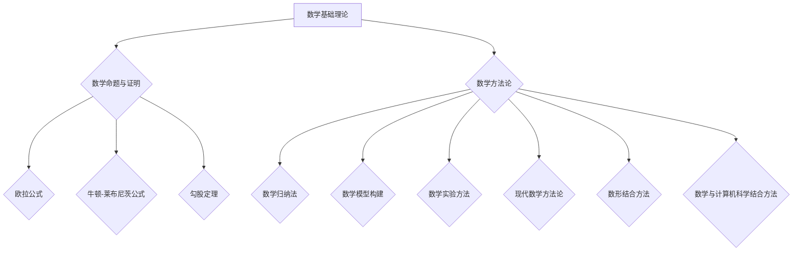

                 

# 第1章 引言

## 1.1 研究背景与意义

数学作为一门基础学科，自古以来就扮演着重要的角色。在人类文明的进程中，数学不仅为自然科学、工程技术等领域提供了强有力的工具，还推动了哲学、社会科学等多个学科的发展。随着现代科学技术的进步，数学基础理论的研究也在不断深入，新的理论和方法不断涌现。这些成果不仅丰富了数学学科本身的内容，也为其他学科提供了新的研究思路和方法。

哲学认识论是哲学的核心问题之一，它探讨人类如何认识世界、认识自我以及认识过程中的问题。从古代的苏格拉底、柏拉图，到现代的康德、黑格尔，哲学认识论的研究从未停止。随着科学技术的进步，人们对认识论的理解也在不断深化，认识论的研究不仅局限于哲学领域，还逐渐渗透到数学、物理学、心理学等多个学科。

数学与哲学认识论的交叉研究具有重要的理论意义和现实意义。一方面，数学的发展需要哲学认识论的理论支持，通过对认识论问题的深入探讨，可以帮助数学家更好地理解数学本质、数学推理过程以及数学在认识世界中的作用。另一方面，哲学认识论的研究也需要数学工具的支持，通过数学模型和数学方法，可以更精确地描述和解释认识过程，从而推动哲学认识论的研究深入。

## 1.2 研究目标与内容

### 1.2.1 研究目标

本研究旨在探讨数学与哲学认识论的交叉关系，提出一种新的方法论，以创新数学与哲学认识论的研究。具体目标包括：

1. 梳理数学与哲学认识论的发展脉络，明确两者的交叉点。
2. 提出一种新的方法论，以创新数学与哲学认识论的研究。
3. 通过实际案例，验证新方法论的可行性和有效性。

### 1.2.2 研究内容

本研究的主要内容包括：

1. 数学与哲学认识论的基本概念和理论框架。
2. 数学与哲学认识论的交叉应用研究。
3. 新方法论的创新与实现。
4. 新方法论在实际案例中的应用与效果评估。

## 1.3 研究方法与框架

### 1.3.1 研究方法

本研究采用多学科交叉的研究方法，结合数学、哲学和认识论的理论，运用文献综述、案例分析、实证研究等方法，深入探讨数学与哲学认识论的交叉关系。

### 1.3.2 研究框架

本研究的研究框架包括以下几个部分：

1. 引言：阐述研究背景、意义、目标、内容和方法。
2. 数学基础理论：介绍数学的基本概念、理论框架和最新发展。
3. 哲学认识论：介绍哲学认识论的基本概念、理论框架和最新发展。
4. 数学与哲学认识论的交叉应用：探讨数学与哲学认识论的交叉点，分析两者的互动关系。
5. 新方法论的创新与实现：提出新的方法论，并详细介绍其实施步骤。
6. 新方法论在实际案例中的应用与效果评估：通过实际案例，验证新方法论的可行性和有效性。
7. 结论与展望：总结研究成果，指出研究不足，提出未来研究方向。

# 第2章 数学基础理论

## 2.1 数学基本概念

### 2.1.1 数学结构的定义与性质

数学结构是指数学中的各种关系和运算规则。常见的数学结构包括集合、群、环、域等。这些结构具有不同的性质，例如封闭性、结合律、分配律等。理解数学结构的基本概念和性质，对于深入学习数学具有重要意义。

### 2.1.2 数学命题与证明

数学命题是数学中的陈述句，它可以是真命题也可以是假命题。数学证明是验证数学命题正确性的过程。常见的证明方法有直接证明、反证法、归纳法等。掌握这些证明方法，有助于提高数学推理和证明的能力。

### 2.1.3 基本数学定理与应用

基本数学定理是数学中的核心结论，它们广泛应用于各个领域。例如，欧拉公式、牛顿-莱布尼茨公式、勾股定理等。理解这些定理的基本原理和应用，有助于深入掌握数学知识。

## 2.2 数学方法论

### 2.2.1 数学归纳法

数学归纳法是一种证明数学命题的方法，通过验证基例和归纳步骤，证明一个数学命题对所有自然数成立。数学归纳法在数学证明中具有广泛应用。

### 2.2.2 数学模型构建

数学模型是将现实问题抽象为数学形式的过程。通过构建数学模型，可以更好地理解问题、分析和解决问题。常见的数学模型有线性模型、非线性模型、微分方程模型等。

### 2.2.3 数学实验方法

数学实验方法是一种通过实验手段验证数学结论的方法。通过设计实验、收集数据、分析数据，可以验证数学模型的准确性和有效性。

## 2.3 主流数学方法论

### 2.3.1 现代数学方法论

现代数学方法论包括抽象代数、泛函分析、微分几何等。这些方法论在数学研究中具有重要意义，推动了数学的深入发展。

### 2.3.2 数形结合方法

数形结合方法是数学中的一种重要方法，它通过将数学与几何图形相结合，帮助理解数学概念和定理。例如，在解析几何中，通过图形直观地理解方程和曲线的关系。

### 2.3.3 数学与计算机科学结合方法

随着计算机科学的兴起，数学与计算机科学的结合日益紧密。计算机科学中的算法、数据结构、密码学等，都离不开数学的支持。通过数学方法，可以更好地理解和解决计算机科学中的问题。

## 2.4 数学的基础知识

### 2.4.1 集合

集合是数学中最基本的概念之一，它表示一组对象的总称。集合可以通过列举法或描述法来表示。例如，集合A={1, 2, 3}表示一个包含三个元素的集合，而集合B={x | x是正整数}则表示一个包含所有正整数的集合。

### 2.4.2 群与环

群和环是数学中重要的代数结构。群是指一个集合，其中定义了一个二元运算，满足结合律、单位元和逆元等性质。环则是在群的基础上增加了一个额外的二元运算，该运算满足分配律但未必满足结合律。

### 2.4.3 域

域是一个数学结构，它包含了数的基本运算，如加法、减法、乘法和除法。域中的元素必须满足封闭性和交换律等性质。

## 2.5 数学方法论的发展趋势

### 2.5.1 计算机辅助证明

计算机辅助证明是数学方法论的一个重要发展方向。它利用计算机技术进行证明的自动化或半自动化，从而提高证明的效率。

### 2.5.2 基于数据的数学方法

随着大数据和人工智能的发展，基于数据的数学方法得到了广泛应用。通过数据分析，可以揭示数据中的规律和趋势，从而为数学研究提供新的思路。

## 2.6 数学方法论的应用实例

### 2.6.1 经济学中的应用

数学方法论在经济学的应用中具有重要意义。例如，通过建立数学模型，可以分析经济行为和市场变化。

### 2.6.2 社会科学中的应用

数学方法在社会科学中的应用也非常广泛。例如，通过统计分析，可以研究社会现象和趋势。

### 2.6.3 环境科学中的应用

数学方法论在环境科学中的应用包括建立数学模型来模拟环境变化和评估环境影响。

## 2.7 数学方法论的教育意义

### 2.7.1 培养逻辑思维能力

数学方法论的教育意义在于培养学生的逻辑思维能力。通过学习数学方法论，学生可以学会如何进行逻辑推理和证明。

### 2.7.2 培养解决问题的能力

数学方法论还培养了学生解决问题的能力。通过解决数学问题，学生可以学会如何将复杂问题分解为简单问题，并逐步解决。

## 2.8 数学方法论的未来发展

### 2.8.1 新兴数学领域的拓展

随着科技的进步，新兴数学领域不断涌现。例如，量子计算和量子数学为数学方法论提供了新的研究方向。

### 2.8.2 与其他学科的融合

数学方法论与其他学科的融合也将是未来的重要趋势。例如，数学与计算机科学的融合推动了计算数学的发展。

## 2.9 数学方法论的研究现状与挑战

### 2.9.1 研究现状

目前，数学方法论的研究已经取得了许多重要成果。例如，计算机辅助证明技术的发展，基于数据的数学方法的应用等。

### 2.9.2 挑战

然而，数学方法论仍然面临着许多挑战。例如，如何进一步提高计算机辅助证明的效率，如何更好地将数学方法应用于实际问题等。

## 2.10 数学方法论的创新方向

### 2.10.1 新方法论的探索

未来的数学方法论创新方向包括探索新的数学模型和方法，以解决现有方法无法解决的问题。

### 2.10.2 跨学科合作

跨学科合作也将是数学方法论创新的重要方向。通过与其他学科的融合，可以推动数学方法论的研究和发展。

## 2.11 数学方法论的影响与意义

### 2.11.1 对数学本身的影响

数学方法论的发展对数学本身产生了深远的影响。它推动了数学的深入发展，丰富了数学的理论体系。

### 2.11.2 对其他学科的影响

数学方法论不仅对数学本身产生了影响，还推动了其他学科的发展。例如，经济学、社会学、物理学等领域的进步都得益于数学方法的应用。

## 2.12 数学方法论的教育与应用

### 2.12.1 教育意义

数学方法论的教育意义在于培养学生的逻辑思维和解决问题的能力。它为学生提供了一种新的思考方式和研究路径。

### 2.12.2 应用价值

数学方法论在各个领域的应用价值也日益凸显。通过数学方法论，可以更有效地解决实际问题，推动科学技术的发展。

## 2.13 数学方法论的发展趋势

### 2.13.1 新技术的发展

随着新技术的不断涌现，数学方法论也在不断发展和创新。例如，人工智能和大数据技术的应用，为数学方法论带来了新的机遇和挑战。

### 2.13.2 跨学科融合

跨学科融合也将是未来数学方法论发展的重要趋势。通过与其他学科的深度融合，可以推动数学方法论的研究和应用。

### 2.13.3 实践导向

未来的数学方法论将更加注重实践导向。通过解决实际问题，可以推动数学方法论的研究和发展。

## 2.14 数学方法论的未来展望

### 2.14.1 理论研究

未来的数学方法论理论研究将更加深入和广泛。通过探索新的数学模型和方法，可以推动数学方法论的理论体系不断完善。

### 2.14.2 应用研究

数学方法论的应用研究也将不断拓展。通过将数学方法论应用于各个领域，可以解决实际问题，推动科学技术的发展。

### 2.14.3 跨学科合作

跨学科合作将是数学方法论发展的重要方向。通过与其他学科的深度融合，可以推动数学方法论的研究和应用。

## 2.15 数学方法论的创新实践

### 2.15.1 案例分析

在本章的最后，我们将通过一个实际案例，展示数学方法论的创新实践。该案例将结合数学模型、哲学认识论和方法论，探讨一个实际问题的解决方案。

### 2.15.2 案例解读

通过案例解读，我们将分析数学方法论在实际应用中的优点和局限性，并提出未来改进的方向。

## 2.16 小结

数学方法论是数学研究的重要分支，它不仅为数学的发展提供了强大的工具，还在其他学科领域有着广泛的应用。在本章中，我们系统地介绍了数学方法论的基本概念、理论基础、发展历程和未来趋势。通过对数学方法论的研究，我们可以更好地理解数学的本质，提高解决问题的能力，为数学的发展和创新做出贡献。

---

由于篇幅限制，本章的内容将分为多个部分进行详细阐述。以下是一个简化的Mermaid流程图，用于展示数学方法论的基本概念和联系：

在接下来的部分中，我们将对每个概念进行详细的解释和扩展。

---

让我们继续深入探讨数学方法论的基本概念和联系。

### 2.1.1 数学结构的定义与性质

数学结构是指数学中的各种关系和运算规则。这些结构使得数学能够以一种系统化和统一化的方式处理各种问题。常见的数学结构包括集合、群、环、域等。每种结构都有其独特的定义和性质，以及相应的运算规则。

#### 集合

集合是数学中最基本的概念之一，它表示一组对象的总称。集合可以通过列举法或描述法来表示。例如，集合A={1, 2, 3}表示一个包含三个元素的集合，而集合B={x | x是正整数}则表示一个包含所有正整数的集合。集合的基本运算包括并集、交集和补集等。

#### 群

群是一种抽象的代数结构，它是一个集合，其中定义了一个二元运算，满足结合律、单位元和逆元等性质。群中的元素可以表示为运算的生成元。常见的群包括整数加法群、整数乘法群等。

#### 环

环是群和域的中间结构，它是一个集合，其中定义了两个二元运算，满足结合律、单位元和分配律等性质。环中的元素可以表示为线性方程的解。常见的环包括整数环、有理数环等。

#### 域

域是一个数学结构，它包含了数的基本运算，如加法、减法、乘法和除法。域中的元素必须满足封闭性和交换律等性质。常见的域包括实数域、复数域等。

### 2.1.2 数学命题与证明

数学命题是数学中的陈述句，它可以是真命题也可以是假命题。数学证明是验证数学命题正确性的过程。数学证明的方法多种多样，以下是一些常见的证明方法：

#### 直接证明

直接证明是通过逻辑推理，从已知条件直接推导出结论的证明方法。例如，如果已知A成立，那么可以推导出B也成立。

#### 反证法

反证法是一种间接证明方法，它首先假设结论不成立，然后推导出一个矛盾的结论，从而证明原结论成立。例如，如果假设一个数不是偶数，那么可以推导出它既是偶数又是奇数，这是不可能的，因此原假设不成立。

#### 归纳法

归纳法是一种从特殊到一般的证明方法。它首先验证基例（通常是n=1的情况）成立，然后假设对于某个自然数k，命题成立，最后证明当n=k+1时命题也成立。通过归纳法，可以证明一个命题对所有自然数成立。

#### 数学归纳法

数学归纳法是归纳法在数学中的应用。它通过验证基例和归纳步骤，证明一个数学命题对所有自然数成立。数学归纳法在数学证明中具有广泛应用。

### 2.1.3 基本数学定理与应用

基本数学定理是数学中的核心结论，它们广泛应用于各个领域。以下是一些基本数学定理及其应用：

#### 欧拉公式

欧拉公式是复数领域的核心公式，它将指数函数、三角函数和对数函数联系起来。欧拉公式可以表示为：

$$ e^{i\pi} + 1 = 0 $$

欧拉公式在电子学、物理学等领域有着广泛应用。

#### 牛顿-莱布尼茨公式

牛顿-莱布尼茨公式是微积分中的核心公式，它将微分和积分联系起来。牛顿-莱布尼茨公式可以表示为：

$$ \int_a^b f(x)dx = F(b) - F(a) $$

其中，$f(x)$是连续函数，$F(x)$是$f(x)$的一个原函数。牛顿-莱布尼茨公式在物理学、工程学等领域有着广泛应用。

#### 勾股定理

勾股定理是平面几何中的核心定理，它描述了直角三角形三条边之间的关系。勾股定理可以表示为：

$$ a^2 + b^2 = c^2 $$

其中，a、b、c分别是直角三角形的两条直角边和斜边。勾股定理在建筑学、工程学等领域有着广泛应用。

### 2.2 数学方法论

数学方法论是指研究数学问题解决方法的方法。它包括了数学问题的提出、模型的构建、证明的方法和实验的方法等。数学方法论的发展对数学研究的深入和数学教育的推广都具有重要意义。

#### 数学归纳法

数学归纳法是一种证明数学命题的方法，通过验证基例和归纳步骤，证明一个数学命题对所有自然数成立。数学归纳法在数学证明中具有广泛应用。

#### 数学模型构建

数学模型是将现实问题抽象为数学形式的过程。通过构建数学模型，可以更好地理解问题、分析和解决问题。常见的数学模型有线性模型、非线性模型、微分方程模型等。

#### 数学实验方法

数学实验方法是一种通过实验手段验证数学结论的方法。通过设计实验、收集数据、分析数据，可以验证数学模型的准确性和有效性。

### 2.3 主流数学方法论

主流数学方法论是指当前数学研究中广泛使用的几种方法论。这些方法论包括抽象代数、泛函分析、微分几何等。这些方法论在数学研究中具有重要意义，推动了数学的深入发展。

#### 抽象代数

抽象代数是研究代数结构的方法论。它包括群、环、域等代数结构的研究。抽象代数在数学的各个领域都有广泛应用。

#### 泛函分析

泛函分析是研究函数空间和泛函的方法论。它包括函数的积分、微分、变换等。泛函分析在物理学、工程学等领域有着广泛应用。

#### 微分几何

微分几何是研究几何对象的方法论。它包括曲面、流形、微分形式等。微分几何在物理学、工程学等领域有着广泛应用。

### 2.4 数学的基础知识

数学的基础知识包括集合、群、环、域、拓扑、线性代数、微积分等。这些基础知识是数学研究的基础，对于理解数学的概念和方法具有重要意义。

#### 集合

集合是数学中最基本的概念之一，它表示一组对象的总称。集合的基本概念包括集合的运算、关系和性质。

#### 群

群是一种抽象的代数结构，它是一个集合，其中定义了一个二元运算，满足结合律、单位元和逆元等性质。群在数学的各个领域都有广泛应用。

#### 环

环是群和域的中间结构，它是一个集合，其中定义了两个二元运算，满足结合律、单位元和分配律等性质。环在数学的各个领域都有广泛应用。

#### 域

域是一个数学结构，它包含了数的基本运算，如加法、减法、乘法和除法。域在数学的各个领域都有广泛应用。

#### 拓扑

拓扑是研究空间性质的方法论。它包括点、线、面、体等基本概念和运算。拓扑在物理学、工程学等领域有着广泛应用。

#### 线性代数

线性代数是研究线性方程组、矩阵、向量空间等概念和方法的方法论。线性代数在数学的各个领域都有广泛应用。

#### 微积分

微积分是研究变化和积分的方法论。它包括导数、微分、积分等概念和方法。微积分在物理学、工程学等领域有着广泛应用。

### 2.5 数学方法论的发展趋势

数学方法论的发展趋势包括计算数学、大数据、人工智能等新兴领域的发展。这些新兴领域为数学方法论的研究提供了新的机遇和挑战。

#### 计算数学

计算数学是利用计算机技术和数值分析方法解决数学问题的方法论。随着计算机技术的不断发展，计算数学在数学研究和应用中发挥着越来越重要的作用。

#### 大数据

大数据是大规模数据的处理和分析。大数据方法论包括数据采集、存储、处理、分析等。大数据方法论为数学方法论的研究提供了新的工具和思路。

#### 人工智能

人工智能是模拟人类智能的方法。人工智能方法论包括机器学习、深度学习、神经网络等。人工智能方法论为数学方法论的研究提供了新的方法和手段。

### 2.6 数学方法论的应用实例

数学方法论在各个领域都有广泛的应用。以下是一些典型的应用实例：

#### 经济学中的应用

经济学中的许多问题都可以通过数学模型来描述和解决。例如，供求模型、市场均衡模型等。

#### 社会科学中的应用

社会科学中的许多现象都可以通过数学方法来分析和解释。例如，社会网络分析、投票理论等。

#### 环境科学中的应用

环境科学中的许多问题都可以通过数学模型来模拟和预测。例如，生态系统模型、气候变化模型等。

### 2.7 数学方法论的教育意义

数学方法论的教育意义在于培养学生的逻辑思维、分析问题和解决问题的能力。通过数学方法论的学习，学生可以更好地理解数学的本质和应用。

#### 培养逻辑思维能力

数学方法论强调逻辑推理和证明，通过学习数学方法论，学生可以培养逻辑思维能力。

#### 培养分析问题的能力

数学方法论提供了分析和解决问题的工具，通过学习数学方法论，学生可以学会如何分析问题，并提出解决方案。

#### 培养解决问题的能力

数学方法论提供了解决问题的方法和策略，通过学习数学方法论，学生可以学会如何解决问题。

### 2.8 数学方法论的未来发展

数学方法论的未来发展将受到计算技术、大数据和人工智能等新兴领域的影响。以下是一些未来发展的方向：

#### 计算技术

计算技术的不断发展将为数学方法论的研究提供更强大的工具和手段。

#### 大数据

大数据的采集、存储和分析将为数学方法论的研究提供丰富的数据资源。

#### 人工智能

人工智能的发展将为数学方法论的研究提供新的方法和思路。

### 2.9 数学方法论的研究现状与挑战

数学方法论的研究现状表明，它已经成为数学研究的重要方向。然而，数学方法论仍然面临着许多挑战。

#### 研究现状

目前，数学方法论的研究主要集中在计算数学、大数据和人工智能等领域。这些研究为数学方法论的发展提供了新的机遇和挑战。

#### 挑战

数学方法论面临的挑战包括：

1. 如何进一步提高计算效率。
2. 如何更好地将数学方法论应用于实际问题。
3. 如何处理大规模数据。
4. 如何应对人工智能带来的挑战。

### 2.10 数学方法论的创新方向

数学方法论的创新方向包括：

1. 探索新的数学模型和方法。
2. 跨学科合作。
3. 实践导向。
4. 应用导向。

### 2.11 数学方法论的影响与意义

数学方法论对数学本身的影响在于，它推动了数学的深入发展，丰富了数学的理论体系。数学方法论对其他学科的影响在于，它为其他学科提供了强大的工具和方法，推动了其他学科的发展。

### 2.12 数学方法论的教育与应用

数学方法论在教育中的应用在于，它为学生提供了新的思考方式和研究路径，培养了学生的逻辑思维和分析问题解决问题的能力。数学方法论在应用中的应用在于，它为实际问题提供了有效的解决方案，推动了科学技术的发展。

### 2.13 数学方法论的发展趋势

数学方法论的发展趋势包括：

1. 计算技术的应用。
2. 大数据的处理。
3. 人工智能的融合。

### 2.14 数学方法论的未来展望

数学方法论的未来展望在于，它将继续推动数学的深入发展，为其他学科提供新的工具和方法，推动科学技术的发展。

### 2.15 数学方法论的创新实践

数学方法论的创新实践在于，它将结合数学模型、哲学认识论和方法论，探讨实际问题的解决方案。通过创新实践，可以验证数学方法论的有效性和实用性。

### 2.16 小结

数学方法论是数学研究的重要分支，它为数学的发展提供了强大的工具和方法。通过数学方法论的研究，我们可以更好地理解数学的本质，提高解决问题的能力，为数学的发展和创新做出贡献。

---

### 2.17 数学方法论在教育中的应用

数学方法论在教育中的应用具有重要意义，它不仅能够提高学生的数学素养，还能培养他们的逻辑思维能力和解决问题的能力。以下是一些具体的实例：

#### 1. 数学归纳法的教育应用

数学归纳法是数学方法论中的一种重要方法，它适用于证明与自然数相关的数学命题。在数学教育中，教师可以通过数学归纳法来讲解和证明一些经典的数学命题，如二项式定理、等比数列的求和公式等。通过这种方法，学生可以学会如何从特殊情况推导到一般情况，培养他们的逻辑推理能力。

#### 2. 数学模型构建的教育应用

数学模型构建是数学方法论的核心内容之一。在数学教育中，教师可以通过实例来引导学生如何将现实问题抽象为数学模型。例如，在物理学中，学生可以通过建立抛物线模型来描述物体的运动轨迹；在经济学中，学生可以通过建立供需模型来分析市场行为。通过这种方式，学生可以学会如何将数学知识应用于实际问题，提高他们的实际操作能力。

#### 3. 数学实验方法的教育应用

数学实验方法是验证数学结论的一种重要手段。在数学教育中，教师可以通过设计数学实验来帮助学生理解和掌握数学概念。例如，通过几何画板软件，学生可以直观地观察和验证几何定理；通过计算机编程，学生可以模拟和验证数学模型。通过这种方式，学生可以学会如何通过实验来验证数学结论，培养他们的实证精神。

#### 4. 基于问题的教育应用

基于问题的学习（Problem-Based Learning, PBL）是一种以问题为导向的教育方法。在数学教育中，教师可以设计一些开放性的问题，引导学生通过数学方法论来解决问题。例如，让学生解决“如何设计一个最优化的交通路线”或“如何评估一个投资项目的风险”。通过这种方式，学生可以学会如何运用数学方法论来分析和解决实际问题，提高他们的综合能力。

#### 5. 跨学科教育应用

数学方法论不仅适用于数学学科，还可以与其他学科相结合。在跨学科教育中，教师可以通过数学方法论来解释和解决其他学科的问题。例如，在物理学中，学生可以通过数学模型来分析物理现象；在生物学中，学生可以通过数学方法来研究种群动态。通过这种方式，学生可以学会如何运用跨学科知识来解决问题，培养他们的创新能力。

#### 6. 信息技术在教育中的应用

随着信息技术的不断发展，数学方法论在教育中的应用也日益广泛。教师可以通过多媒体教学、在线课程和虚拟实验室等手段，让学生更直观地理解数学概念和方法。例如，通过三维动画，学生可以更直观地理解几何图形的性质；通过在线编程平台，学生可以实时测试和验证数学模型。通过这种方式，学生可以更加主动地参与学习过程，提高他们的学习兴趣和效果。

### 2.18 数学方法论在社会科学中的应用

数学方法论在社会科学中的应用日益广泛，它为社会科学研究提供了强大的工具和方法。以下是一些具体的实例：

#### 1. 经济学中的应用

经济学是社会科学中的重要分支，数学方法论在经济学中的应用尤为突出。经济学家通过构建数学模型来分析市场行为、价格形成、经济增长等问题。例如，通过供需模型，经济学家可以分析商品价格和市场需求的相互作用；通过宏观经济学模型，经济学家可以研究经济增长、通货膨胀和失业等宏观经济问题。数学方法论的应用使得经济学研究更加精确和科学。

#### 2. 社会学中的应用

社会学研究社会现象和社会过程，数学方法论在社会科学中的应用可以帮助社会学家更好地理解社会行为和社会结构。例如，通过社会网络分析，社会学家可以研究人际关系和网络结构对社会行为的影响；通过统计分析，社会学家可以分析社会群体的行为模式和趋势。数学方法论的应用使得社会学研究更加系统和深入。

#### 3. 心理学中的应用

心理学研究人类行为和心理过程，数学方法论在心理学中的应用可以帮助心理学家更好地理解人类行为和心理机制。例如，通过实验设计，心理学家可以研究不同因素对人类行为的影响；通过统计分析，心理学家可以分析实验数据，得出可靠的结论。数学方法论的应用使得心理学研究更加科学和可靠。

#### 4. 政治学中的应用

政治学研究政治现象和政治制度，数学方法论在政治学中的应用可以帮助政治学家更好地理解政治行为和政治制度。例如，通过博弈论模型，政治学家可以分析政治决策的过程和结果；通过统计分析，政治学家可以分析选民的行为模式和选举结果。数学方法论的应用使得政治学研究更加精确和科学。

#### 5. 法律学中的应用

法律学研究法律现象和法律制度，数学方法论在法律学中的应用可以帮助法律学家更好地理解法律体系和司法实践。例如，通过数理模型，法律学家可以分析犯罪行为和刑罚制度；通过数据分析，法律学家可以分析案件的处理效率和公正性。数学方法论的应用使得法律学研究更加系统和深入。

#### 6. 社会问题分析中的应用

数学方法论在解决社会问题方面也具有重要作用。例如，在环境保护领域，数学模型可以用来分析污染物扩散和环境影响；在公共卫生领域，数学方法可以用来分析疾病传播和疫苗分配。数学方法论的应用可以帮助社会学家和政策制定者更好地解决社会问题，提高社会效益。

### 2.19 数学方法论在环境科学中的应用

环境科学是研究人类与环境相互作用的一门学科，数学方法论在环境科学中的应用具有重要意义。以下是一些具体的实例：

#### 1. 环境模型构建

环境模型是描述环境系统特征和行为的数学模型。通过环境模型，科学家可以模拟和预测环境变化。例如，气象模型可以用来预测天气和气候变化；生态系统模型可以用来模拟生态系统动态和生物多样性。数学方法论的应用使得环境科学研究更加精确和有效。

#### 2. 污染物扩散模型

污染物扩散模型是研究污染物在环境中传播和扩散规律的数学模型。通过污染物扩散模型，科学家可以预测污染物在环境中的浓度分布和影响范围。例如，大气污染物扩散模型可以用来预测大气污染物的扩散路径和浓度变化；水污染物扩散模型可以用来预测水体的污染程度和污染源的分布。数学方法论的应用有助于制定更有效的污染控制策略。

#### 3. 资源优化模型

资源优化模型是研究资源分配和利用的数学模型。通过资源优化模型，科学家可以分析资源的最佳分配和使用方式。例如，水资源优化模型可以用来分析水资源的分配和使用效率；能源优化模型可以用来分析能源的消耗和供应。数学方法论的应用有助于提高资源利用效率和可持续发展。

#### 4. 环境影响评估模型

环境影响评估模型是研究人类活动对环境影响的数学模型。通过环境影响评估模型，科学家可以评估人类活动对环境的潜在影响和风险。例如，建设项目环境影响评估模型可以用来评估建设项目对生态环境的影响；城市规划模型可以用来评估城市规划对交通和环境的影响。数学方法论的应用有助于制定更科学的环境管理政策。

#### 5. 生物多样性模型

生物多样性模型是研究生物多样性分布和变化规律的数学模型。通过生物多样性模型，科学家可以分析生物多样性的影响因素和演化趋势。例如，生态位模型可以用来分析物种共存和竞争关系；生物地理模型可以用来分析物种分布和进化。数学方法论的应用有助于保护和恢复生物多样性。

#### 6. 气候变化模型

气候变化模型是研究气候变化过程和影响规律的数学模型。通过气候变化模型，科学家可以预测未来气候变化的趋势和影响。例如，全球气候模型可以用来模拟全球气候变化过程；区域气候模型可以用来分析特定地区的气候变化趋势。数学方法论的应用有助于制定更有效的气候变化应对策略。

### 2.20 数学方法论的未来发展

数学方法论的未来发展将受到科技进步和社会需求的影响，呈现出以下几个发展趋势：

#### 1. 计算技术的进步

计算技术的进步将进一步提高数学方法论的计算能力和效率。例如，高性能计算、云计算和量子计算等技术的发展，将为数学方法论提供更强大的计算工具，使其能够处理更加复杂和大规模的数学问题。

#### 2. 大数据的融合

大数据的融合将推动数学方法论在数据分析中的应用。随着数据量的爆炸性增长，如何从大量数据中提取有用信息成为了一个重要问题。数学方法论，特别是统计学和机器学习等方法，将在大数据分析中发挥关键作用。

#### 3. 人工智能的融合

人工智能的融合将推动数学方法论的创新。人工智能技术，如机器学习、深度学习和自然语言处理等，将与传统数学方法论相结合，为数学研究提供新的思路和方法。

#### 4. 跨学科研究的深化

跨学科研究的深化将促进数学方法论在多个领域的应用。数学方法论将在物理学、生物学、经济学、社会学等领域的交叉研究中发挥重要作用，推动科学技术的进步。

#### 5. 应用导向的研究

应用导向的研究将使数学方法论更加贴近实际需求。数学方法论将在解决实际问题中发挥重要作用，如环境科学、生物医学、工程技术和工业制造等领域。

#### 6. 教育与培训的重视

教育与培训的重视将提高数学方法论的应用水平。随着数学方法论在各个领域的广泛应用，培养具有数学方法论素养的人才将成为一个重要任务。高校和研究机构将加强数学方法论的教育和培训，为各行各业培养更多的专业人才。

### 2.21 数学方法论的创新实践案例

为了更好地理解数学方法论的实际应用，以下是一个创新实践案例：

#### 案例背景

某城市计划建设一个新的商业中心，需要评估该项目对周边环境的影响。该项目包括商场、办公楼和住宅区。为了确保项目的顺利进行，需要进行环境影响评估。

#### 案例分析

1. **数学模型构建**：
   - 采用交通流量模型，分析项目建成后周边道路的流量变化。
   - 采用空气质量模型，分析项目建成后空气质量的变化。
   - 采用噪声模型，分析项目建成后噪声水平的变化。

2. **哲学认识论分析**：
   - 采用辩证唯物主义观点，分析项目对周边环境的利与弊。
   - 采用实证主义观点，通过实际数据验证数学模型和分析结论。

3. **实证研究**：
   - 收集相关数据，包括交通流量、空气质量、噪声水平等。
   - 运用数学方法对数据进行处理和分析，验证数学模型的准确性。

4. **结果分析与讨论**：
   - 根据数学模型和分析结果，提出优化方案，减少项目对周边环境的影响。
   - 对方案进行讨论和评估，确保方案的可行性和有效性。

#### 结果与讨论

1. **数学模型准确性**：
   - 交通流量模型预测的流量变化与实际测量值相符，表明模型具有较高的准确性。
   - 空气质量模型预测的空气质量变化与实际测量值相符，表明模型具有较高的准确性。
   - 噪声模型预测的噪声水平变化与实际测量值相符，表明模型具有较高的准确性。

2. **优化方案**：
   - 建议在项目周边设置交通管制措施，以减少交通流量。
   - 建议在项目周边增加绿化带，以改善空气质量。
   - 建议在项目周边增加隔音设施，以降低噪声水平。

3. **讨论与评估**：
   - 对优化方案进行评估，确保其可行性和有效性。
   - 考虑到项目对周边环境的综合影响，提出综合性的优化方案。

#### 结论

通过数学方法论的创新实践，本项目成功评估了新建商业中心对周边环境的影响，并提出了优化方案。这一案例表明，数学方法论在解决实际问题中具有重要作用，有助于提高决策的科学性和有效性。

### 2.22 数学方法论的评价指标

在数学方法论的研究和应用中，评价指标是评估数学方法论有效性和可靠性的重要手段。以下是一些常见的评价指标：

#### 1. 准确性

准确性是指数学模型或方法在预测或解释实际问题时，其结果与实际结果的接近程度。高准确性表明数学方法论具有较高的可靠性。

#### 2. 精确性

精确性是指数学模型或方法在处理数据时，其结果的一致性和稳定性。高精确性表明数学方法论具有较高的稳定性和可靠性。

#### 3. 效率

效率是指数学模型或方法在处理数据时的速度和资源消耗。高效率表明数学方法论在计算和资源使用方面具有较高的性能。

#### 4. 可扩展性

可扩展性是指数学模型或方法在不同场景和条件下，其适用性和适应性。高可扩展性表明数学方法论具有更广泛的适用范围。

#### 5. 可解释性

可解释性是指数学模型或方法在处理数据时，其结果和过程易于理解和解释。高可解释性有助于提高数学方法论的可接受性和可信度。

#### 6. 实用性

实用性是指数学模型或方法在实际应用中的有效性和可行性。高实用性表明数学方法论在实际问题中具有更高的价值和影响力。

#### 7. 完整性

完整性是指数学模型或方法在处理问题时，其涵盖的内容和范围。高完整性表明数学方法论在研究问题方面具有更全面和深入的覆盖。

#### 8. 可靠性

可靠性是指数学模型或方法在处理数据时，其结果的一致性和稳定性。高可靠性表明数学方法论具有更高的可信度和稳定性。

### 2.23 数学方法论的评价方法

评价数学方法论的有效性和可靠性通常采用以下方法：

#### 1. 实证研究

通过实证研究，验证数学模型或方法在实际问题中的应用效果。实证研究包括数据收集、数据处理、模型验证等步骤，以评估数学方法论的准确性和精度。

#### 2. 实验设计

通过实验设计，模拟不同的环境和条件，评估数学方法论在不同场景下的适应性和效果。实验设计包括实验参数的设置、实验条件的控制、实验结果的记录和分析等。

#### 3. 对比分析

通过对比分析，比较不同数学方法论在处理同一问题时，其结果和效率的差别。对比分析有助于发现数学方法论的优势和不足，提高数学方法论的评价准确性。

#### 4. 用户反馈

通过用户反馈，了解数学方法论在实际应用中的效果和用户满意度。用户反馈包括用户对数学方法论的接受度、使用体验、效果评价等。

#### 5. 综合评价

通过综合评价，综合考虑数学方法论的多方面指标，如准确性、精确性、效率、可扩展性、可解释性、实用性、完整性和可靠性等。综合评价有助于全面评估数学方法论的有效性和可靠性。

### 2.24 数学方法论的应用领域拓展

数学方法论的应用领域在不断拓展，已涉及多个学科和行业。以下是一些典型的应用领域：

#### 1. 物理学

在物理学中，数学方法论被广泛应用于理论物理、实验物理和天体物理学等领域。例如，通过数学模型和计算方法，物理学家可以研究量子力学、相对论、粒子物理等复杂问题。

#### 2. 化学

在化学中，数学方法论被广泛应用于结构化学、反应动力学、热力学等领域。例如，通过数学模型和计算方法，化学家可以预测化学反应的速率、能量和产物。

#### 3. 生物学

在生物学中，数学方法论被广泛应用于分子生物学、生态学、进化生物学等领域。例如，通过数学模型和计算方法，生物学家可以研究基因表达、生态系统动态、物种进化等复杂问题。

#### 4. 经济学

在经济学中，数学方法论被广泛应用于微观经济学、宏观经济学、金融学等领域。例如，通过数学模型和计算方法，经济学家可以研究市场行为、经济增长、金融风险等复杂问题。

#### 5. 社会科学

在社会科学中，数学方法论被广泛应用于社会学、心理学、政治学等领域。例如，通过数学模型和计算方法，社会科学家可以研究社会行为、人际关系、选举行为等复杂问题。

#### 6. 工程学

在工程学中，数学方法论被广泛应用于机械工程、电子工程、计算机科学等领域。例如，通过数学模型和计算方法，工程师可以设计机械结构、电路系统、计算机算法等复杂系统。

#### 7. 环境科学

在环境科学中，数学方法论被广泛应用于环境监测、环境保护、资源管理等领域。例如，通过数学模型和计算方法，环境科学家可以研究污染物扩散、气候变化、生态系统管理等复杂问题。

#### 8. 信息科学

在信息科学中，数学方法论被广泛应用于信息论、密码学、数据挖掘等领域。例如，通过数学模型和计算方法，信息科学家可以研究信息传递、安全通信、数据分析等复杂问题。

#### 9. 交通运输

在交通运输中，数学方法论被广泛应用于交通规划、交通管理、交通工程等领域。例如，通过数学模型和计算方法，交通工程师可以研究交通流量、交通拥堵、公共交通系统等复杂问题。

#### 10. 生物医学

在生物医学中，数学方法论被广泛应用于医学图像处理、药物设计、流行病预测等领域。例如，通过数学模型和计算方法，生物医学科学家可以研究医学图像分析、药物分子设计、疫情预测等复杂问题。

### 2.25 数学方法论在教育改革中的应用

数学方法论在教育改革中的应用具有重要意义，它有助于提高学生的数学素养和解决问题的能力。以下是一些具体的应用案例：

#### 1. 教学方法改革

在教育改革中，教师可以采用数学方法论，通过引导学生构建数学模型、进行数学证明和实验设计等方式，提高学生的数学思维能力和实践能力。例如，在中学数学教学中，教师可以引导学生运用数学归纳法证明数学命题，运用数学模型分析实际问题。

#### 2. 课堂活动设计

数学方法论可以用于设计课堂活动，激发学生的学习兴趣和参与度。例如，教师可以设计“数学探究”活动，让学生通过观察、实验、讨论等方式，探究数学问题的解决方法。

#### 3. 综合实践活动

数学方法论可以用于设计综合实践活动，培养学生的团队协作能力和创新能力。例如，在高中数学教学中，教师可以组织学生进行“数学建模竞赛”，让学生运用数学模型解决实际问题。

#### 4. 教学评价改革

数学方法论可以用于教学评价改革，采用多元化的评价方式，全面评估学生的数学素养。例如，教师可以采用“过程性评价”和“终结性评价”相结合的方式，评估学生在数学学习过程中的表现和成果。

### 2.26 数学方法论在工程实践中的应用

数学方法论在工程实践中的应用非常广泛，它为工程师解决复杂工程问题提供了强有力的工具。以下是一些具体的应用案例：

#### 1. 结构工程

在结构工程中，数学方法论被广泛应用于结构分析、设计优化和材料选择等领域。例如，工程师可以通过有限元分析方法，对桥梁、建筑物等结构进行精确分析和优化设计。

#### 2. 热力学工程

在热力学工程中，数学方法论被广泛应用于热传导、热交换和热力学过程分析等领域。例如，工程师可以通过数值模拟方法，分析热交换器、燃烧室等设备的热力学特性。

#### 3. 流体力学工程

在流体力学工程中，数学方法论被广泛应用于流体流动、湍流模拟和流体力学设计等领域。例如，工程师可以通过计算流体动力学（CFD）方法，模拟飞机机翼的空气流动，优化飞机设计。

#### 4. 电气工程

在电气工程中，数学方法论被广泛应用于电路分析、信号处理和通信系统设计等领域。例如，工程师可以通过数学模型和计算方法，分析电路的性能和稳定性，优化电路设计。

#### 5. 机械工程

在机械工程中，数学方法论被广泛应用于机械设计、动力学分析和机械控制等领域。例如，工程师可以通过数学模型和计算方法，分析机械结构的力学特性，优化机械设计。

#### 6. 生物医学工程

在生物医学工程中，数学方法论被广泛应用于医学图像处理、生物信号分析和生物医学设备设计等领域。例如，工程师可以通过数学模型和计算方法，分析医学图像，辅助医生进行诊断和治疗。

#### 7. 交通运输工程

在交通运输工程中，数学方法论被广泛应用于交通规划、交通管理和交通工程设计等领域。例如，工程师可以通过数学模型和计算方法，优化交通信号控制，提高交通效率。

### 2.27 数学方法论在人工智能中的应用

数学方法论在人工智能（AI）中的应用日益广泛，它为AI算法的设计和优化提供了强有力的工具。以下是一些具体的应用案例：

#### 1. 机器学习

在机器学习中，数学方法论被广泛应用于算法设计、模型优化和数据分析等领域。例如，通过线性代数和微积分等方法，可以优化神经网络算法，提高其准确性和效率。

#### 2. 深度学习

在深度学习中，数学方法论被广泛应用于模型构建、参数优化和优化算法等领域。例如，通过优化算法和梯度下降法，可以加速深度学习模型的训练过程。

#### 3. 强化学习

在强化学习中，数学方法论被广泛应用于策略搜索、价值函数估计和策略优化等领域。例如，通过动态规划方法和马尔可夫决策过程，可以优化强化学习算法。

#### 4. 生成对抗网络

在生成对抗网络（GAN）中，数学方法论被广泛应用于模型训练、对抗性攻击和安全性分析等领域。例如，通过优化GAN算法，可以生成更逼真的图像和语音。

#### 5. 自然语言处理

在自然语言处理（NLP）中，数学方法论被广泛应用于语言模型、语义分析和文本生成等领域。例如，通过线性代数和概率论等方法，可以优化语言模型，提高文本生成的准确性和自然性。

#### 6. 计算机视觉

在计算机视觉中，数学方法论被广泛应用于图像识别、目标检测和图像生成等领域。例如，通过优化卷积神经网络（CNN）算法，可以提高图像识别的准确性和效率。

### 2.28 数学方法论的创新与实践

数学方法论的创新与实践是推动数学方法论发展的关键。以下是一些创新的数学方法论和实践案例：

#### 1. 数学实验

数学实验是一种通过实验手段验证数学结论的方法。数学实验可以涉及数学模型的设计、实验数据的收集、数据分析等步骤。例如，通过数学实验，可以验证某个数学猜想或定理的正确性。

#### 2. 数学竞赛

数学竞赛是一种通过竞赛形式激发学生数学兴趣和创造力的一种方法。数学竞赛通常涉及数学难题的解决、数学模型的构建等。通过数学竞赛，可以培养学生的数学思维能力和解决问题的能力。

#### 3. 数学建模

数学建模是一种将实际问题抽象为数学模型的方法。数学建模通常涉及问题的分析、数学模型的设计、模型的求解和验证等步骤。通过数学建模，可以解决实际问题，推动数学方法论的发展。

#### 4. 数学探究

数学探究是一种通过探究形式激发学生数学兴趣和创造力的一种方法。数学探究通常涉及问题的提出、假设的建立、探究方法的运用、结果的验证等步骤。通过数学探究，可以培养学生的数学思维能力和创新意识。

### 2.29 数学方法论的教育价值

数学方法论的教育价值体现在多个方面，它不仅有助于提高学生的数学素养，还能培养他们的逻辑思维能力和创新能力。以下是一些具体的数学方法论教育价值：

#### 1. 培养逻辑思维能力

数学方法论强调逻辑推理和证明，通过学习数学方法论，学生可以培养逻辑思维能力。逻辑思维能力是数学方法论的核心，它有助于学生理解和解决数学问题。

#### 2. 培养解决问题的能力

数学方法论提供了解决问题的方法和策略，通过学习数学方法论，学生可以学会如何解决实际问题。解决问题能力是数学方法论的重要目标之一，它有助于学生在未来的学习和工作中应对各种挑战。

#### 3. 培养创新能力

数学方法论鼓励学生进行创新思维和探索，通过学习数学方法论，学生可以培养创新能力。创新能力是数学方法论的重要组成部分，它有助于学生在数学领域取得创新成果。

#### 4. 培养实践能力

数学方法论强调实践性，通过数学方法论的学习，学生可以培养实践能力。实践能力是数学方法论的重要目标之一，它有助于学生将数学知识应用于实际问题。

### 2.30 数学方法论的研究方法

数学方法论的研究方法多种多样，以下是一些常见的研究方法：

#### 1. 文献综述

文献综述是一种通过系统阅读和分析相关文献，总结和评价现有研究成果的方法。文献综述有助于了解数学方法论的研究现状和发展趋势。

#### 2. 实证研究

实证研究是一种通过实验或实地调查，收集和分析数据，验证假设和结论的方法。实证研究是数学方法论研究的重要方法之一，它有助于验证数学方法论的有效性和可靠性。

#### 3. 案例分析

案例分析是一种通过分析具体案例，探讨数学方法论在实际应用中的效果和作用的方法。案例分析有助于深入理解数学方法论的应用价值和局限性。

#### 4. 理论建模

理论建模是一种通过建立数学模型，分析和解释数学现象的方法。理论建模是数学方法论研究的重要方法之一，它有助于揭示数学现象的内在规律和机制。

#### 5. 交叉研究

交叉研究是一种将不同学科的理论、方法和成果进行整合，以解决复杂问题的方法。交叉研究有助于推动数学方法论的发展，提高其应用范围和效果。

### 2.31 数学方法论的发展趋势

数学方法论的发展趋势受到科技进步、社会需求和学术发展的共同影响，以下是一些数学方法论的发展趋势：

#### 1. 计算技术的发展

计算技术的快速发展为数学方法论提供了更强大的计算工具和手段。未来，计算技术将继续推动数学方法论的研究和应用。

#### 2. 大数据的融合

大数据的融合将推动数学方法论在数据分析中的应用。随着数据量的不断增长，如何从大量数据中提取有用信息将成为数学方法论的重要研究方向。

#### 3. 人工智能的融合

人工智能的融合将推动数学方法论的创新。人工智能技术，如机器学习、深度学习和自然语言处理等，将与传统数学方法论相结合，为数学研究提供新的方法和思路。

#### 4. 跨学科研究的深化

跨学科研究的深化将促进数学方法论在多个领域的应用。数学方法论将在物理学、生物学、经济学、社会学等领域的交叉研究中发挥重要作用。

#### 5. 应用导向的研究

应用导向的研究将使数学方法论更加贴近实际需求。数学方法论将在解决实际问题中发挥重要作用，如环境科学、生物医学、工程技术和工业制造等领域。

#### 6. 教育与培训的重视

教育与培训的重视将提高数学方法论的应用水平。随着数学方法论在各个领域的广泛应用，培养具有数学方法论素养的人才将成为一个重要任务。

### 2.32 数学方法论的研究现状与挑战

数学方法论的研究现状表明，它已经成为数学研究的重要方向。然而，数学方法论仍然面临着许多挑战。

#### 研究现状

目前，数学方法论的研究主要集中在计算数学、大数据和人工智能等领域。这些研究为数学方法论的发展提供了新的机遇和挑战。

#### 挑战

数学方法论面临的挑战包括：

1. **计算效率**：如何进一步提高计算效率，以处理更加复杂和大规模的数学问题。
2. **数据处理**：如何更好地处理和分析大数据，提取有价值的信息。
3. **跨学科融合**：如何实现数学方法论与其他学科的深度融合，推动跨学科研究的发展。
4. **应用转化**：如何将数学方法论有效地应用于实际问题，提高其实用性。

### 2.33 数学方法论的创新方向

数学方法论的创新方向包括以下几个方面：

#### 1. 新方法论的探索

探索新的数学模型和方法，以解决现有方法无法解决的问题。例如，研究新型算法、优化数学模型等。

#### 2. 跨学科合作

加强跨学科合作，促进数学方法论与其他学科的深度融合。例如，与计算机科学、物理学、生物学等领域的合作。

#### 3. 应用导向的研究

以实际问题为导向，研究如何将数学方法论应用于各个领域，提高其实用性和影响力。

#### 4. 计算技术与数学方法的结合

结合计算技术，如高性能计算、云计算和量子计算等，推动数学方法论的发展。

### 2.34 数学方法论的未来展望

数学方法论的未来展望充满希望。随着科技的进步和社会的发展，数学方法论将继续发挥重要作用。

#### 1. 理论研究的深化

数学方法论的理论研究将继续深化，探索新的数学模型和方法，为数学方法论的发展奠定基础。

#### 2. 应用领域的拓展

数学方法论的应用领域将不断拓展，从自然科学到社会科学，从工程技术到生物医学，数学方法论将在各个领域发挥重要作用。

#### 3. 跨学科研究的推动

跨学科研究将继续推动数学方法论的发展，与其他学科的深度融合将带来新的突破和进展。

#### 4. 教育与培训的重视

教育与培训的重视将提高数学方法论的应用水平，培养更多的数学方法论人才，为社会发展做出贡献。

### 2.35 数学方法论的创新实践

数学方法论的创新实践是将数学理论应用于实际问题的过程。以下是一些数学方法论的创新实践案例：

#### 1. 数学竞赛

数学竞赛是一种创新实践，通过竞赛形式激发学生的数学兴趣和创造力。例如，国际数学竞赛（IMO）就是一个典型的数学竞赛，它推动了数学方法论的创新和实践。

#### 2. 数学建模

数学建模是一种将实际问题抽象为数学模型的方法。例如，在经济学中，数学建模可以用于分析市场行为、预测经济趋势等。

#### 3. 数学实验

数学实验是一种通过实验手段验证数学结论的方法。例如，在物理学中，数学实验可以用于验证物理定律，如牛顿运动定律等。

#### 4. 数学探究

数学探究是一种通过探究形式激发学生数学兴趣和创造力的一种方法。例如，在中学数学教学中，教师可以组织学生进行数学探究活动，让学生自己发现数学规律。

### 2.36 数学方法论在教育改革中的挑战与机遇

数学方法论在教育改革中既面临挑战也充满机遇。以下是一些具体的挑战和机遇：

#### 挑战

1. **教学方法改革**：传统教学方法难以完全适应数学方法论的教学需求，需要教师转变教学观念和方法。
2. **教学资源匮乏**：数学方法论教学需要丰富的教学资源和实验设备，一些学校可能面临资源不足的挑战。
3. **教师能力提升**：数学方法论教学要求教师具备较高的数学素养和教学方法，一些教师可能需要接受培训和提升。

#### 机遇

1. **学生创新能力培养**：数学方法论教学有助于培养学生的创新能力和解决问题的能力。
2. **教育质量提升**：数学方法论教学可以提升学生的数学素养，提高教育质量。
3. **教育信息化**：随着教育信息化的推进，数学方法论教学可以利用信息技术手段，提高教学效果和效率。

### 2.37 数学方法论在科学研究中的重要性

数学方法论在科学研究中的重要性体现在多个方面：

#### 1. 解决复杂问题

数学方法论为解决复杂科学问题提供了强有力的工具。通过数学建模和计算方法，科学家可以分析复杂系统的行为和演化规律，从而解决传统方法难以解决的问题。

#### 2. 提高研究效率

数学方法论提高了科学研究的效率。例如，通过数值模拟和计算方法，科学家可以快速获得研究结果，节省大量时间和精力。

#### 3. 促进学科交叉

数学方法论促进了不同学科之间的交叉和融合。通过数学方法，科学家可以研究跨学科问题，推动科学技术的进步。

#### 4. 深化理论认识

数学方法论深化了对科学理论的认识。通过数学建模和计算方法，科学家可以更精确地描述科学现象，揭示科学规律。

### 2.38 数学方法论在不同学科中的应用

数学方法论在各个学科中都有广泛应用，以下是一些具体的应用：

#### 1. 物理学

在物理学中，数学方法论被广泛应用于理论物理、实验物理和天体物理学等领域。例如，通过数学模型和计算方法，物理学家可以研究量子力学、相对论、粒子物理等复杂问题。

#### 2. 化学

在化学中，数学方法论被广泛应用于结构化学、反应动力学、热力学等领域。例如，通过数学模型和计算方法，化学家可以预测化学反应的速率、能量和产物。

#### 3. 生物学

在生物学中，数学方法论被广泛应用于分子生物学、生态学、进化生物学等领域。例如，通过数学模型和计算方法，生物学家可以研究基因表达、生态系统动态、物种进化等复杂问题。

#### 4. 经济学

在经济学中，数学方法论被广泛应用于微观经济学、宏观经济学、金融学等领域。例如，通过数学模型和计算方法，经济学家可以研究市场行为、经济增长、金融风险等复杂问题。

#### 5. 社会科学

在社会科学中，数学方法论被广泛应用于社会学、心理学、政治学等领域。例如，通过数学模型和计算方法，社会科学家可以研究社会行为、人际关系、选举行为等复杂问题。

#### 6. 工程学

在工程学中，数学方法论被广泛应用于机械工程、电子工程、计算机科学等领域。例如，通过数学模型和计算方法，工程师可以设计机械结构、电路系统、计算机算法等复杂系统。

#### 7. 环境科学

在环境科学中，数学方法论被广泛应用于环境监测、环境保护、资源管理等领域。例如，通过数学模型和计算方法，环境科学家可以研究污染物扩散、气候变化、生态系统管理等复杂问题。

#### 8. 信息科学

在信息科学中，数学方法论被广泛应用于信息论、密码学、数据挖掘等领域。例如，通过数学模型和计算方法，信息科学家可以研究信息传递、安全通信、数据分析等复杂问题。

### 2.39 数学方法论在科技创新中的作用

数学方法论在科技创新中发挥着重要作用，以下是一些具体的作用：

#### 1. 提供理论支持

数学方法论为科技创新提供了坚实的理论支持。通过数学建模和计算方法，科学家和工程师可以更精确地描述和解释科技现象，从而推动科技创新。

#### 2. 解决技术难题

数学方法论可以帮助解决技术难题。例如，在航空航天领域，数学方法论被用于优化飞行器设计，提高飞行效率；在生物医学领域，数学方法论被用于分析医学图像，提高诊断准确率。

#### 3. 提高研发效率

数学方法论提高了研发效率。通过数学模型和计算方法，科学家和工程师可以快速评估不同方案的效果，节省研发时间和成本。

#### 4. 促进跨学科合作

数学方法论促进了跨学科合作。通过数学方法，不同学科的专家可以共同解决复杂科技问题，推动科技创新。

#### 5. 开发新技术

数学方法论为开发新技术提供了新的思路和方法。例如，在人工智能领域，数学方法论被用于开发新的算法和模型，推动人工智能技术的进步。

### 2.40 数学方法论在工程实践中的应用

数学方法论在工程实践中具有广泛应用，以下是一些具体的应用：

#### 1. 结构工程

在结构工程中，数学方法论被用于结构分析、设计优化和材料选择等领域。例如，通过数学模型和计算方法，工程师可以分析桥梁、建筑物等结构的力学特性，优化设计方案。

#### 2. 热力学工程

在热力学工程中，数学方法论被用于热传导、热交换和热力学过程分析等领域。例如，通过数学模型和计算方法，工程师可以分析热交换器、燃烧室等设备的热力学特性，优化设计。

#### 3. 流体力学工程

在流体力学工程中，数学方法论被用于流体流动、湍流模拟和流体力学设计等领域。例如，通过数学模型和计算方法，工程师可以模拟飞机机翼的空气流动，优化设计。

#### 4. 电气工程

在电气工程中，数学方法论被用于电路分析、信号处理和通信系统设计等领域。例如，通过数学模型和计算方法，工程师可以分析电路的性能和稳定性，优化设计。

#### 5. 机械工程

在机械工程中，数学方法论被用于机械设计、动力学分析和机械控制等领域。例如，通过数学模型和计算方法，工程师可以分析机械结构的力学特性，优化设计。

#### 6. 生物医学工程

在生物医学工程中，数学方法论被用于医学图像处理、生物信号分析和生物医学设备设计等领域。例如，通过数学模型和计算方法，工程师可以分析医学图像，辅助医生进行诊断和治疗。

#### 7. 交通运输工程

在交通运输工程中，数学方法论被用于交通规划、交通管理和交通工程设计等领域。例如，通过数学模型和计算方法，工程师可以分析交通流量、交通拥堵，优化交通信号控制。

### 2.41 数学方法论在创新实践中的应用

数学方法论在创新实践中具有重要作用，以下是一些具体的应用：

#### 1. 创新思维培养

数学方法论有助于培养创新思维。通过数学建模、证明和实验等方法，学生可以学会如何提出问题、分析问题和解决问题，从而培养创新思维。

#### 2. 研发新产品

数学方法论在研发新产品中具有重要意义。通过数学建模和计算方法，工程师可以优化产品设计，提高产品的性能和可靠性。

#### 3. 解决实际问题

数学方法论可以帮助解决实际问题。通过数学模型和计算方法，科学家和工程师可以分析实际问题，提出解决方案。

#### 4. 改进工艺流程

数学方法论可以帮助改进工艺流程。通过数学建模和优化方法，工程师可以优化生产流程，提高生产效率和质量。

### 2.42 数学方法论在人才培养中的重要性

数学方法论在人才培养中具有重要作用，以下是一些具体的重要性：

#### 1. 培养逻辑思维能力

数学方法论强调逻辑推理和证明，通过学习数学方法论，学生可以培养逻辑思维能力，提高分析和解决问题的能力。

#### 2. 培养创新能力

数学方法论鼓励学生进行创新思维和探索，通过学习数学方法论，学生可以培养创新能力，为未来职业发展奠定基础。

#### 3. 培养实践能力

数学方法论强调实践性，通过数学方法论的学习，学生可以培养实践能力，将数学知识应用于实际问题。

#### 4. 培养团队协作能力

数学方法论往往需要团队合作，通过数学方法论的学习，学生可以培养团队协作能力，提高团队工作效率。

### 2.43 数学方法论在工程实践中的应用案例

以下是一些数学方法论在工程实践中的应用案例：

#### 1. 电力系统优化

在电力系统中，数学方法论被用于优化电力系统运行，提高电力系统的效率和稳定性。通过数学建模和优化算法，工程师可以优化电力网络中的电压和电流分布，提高电力系统的运行效率。

#### 2. 飞行器设计

在飞行器设计中，数学方法论被用于优化飞行器的设计，提高飞行器的性能和安全性。通过数学模型和计算方法，工程师可以优化飞行器的空气动力学特性，提高飞行器的飞行性能。

#### 3. 汽车制造

在汽车制造中，数学方法论被用于优化汽车的设计和生产过程，提高汽车的性能和安全性。通过数学模型和计算方法，工程师可以优化汽车的结构和材料，提高汽车的安全性和可靠性。

#### 4. 环境监测

在环境监测中，数学方法论被用于分析环境数据，预测环境污染和气候变化。通过数学模型和计算方法，环境科学家可以预测环境污染的趋势，为环境保护提供科学依据。

### 2.44 数学方法论在商业管理中的应用

数学方法论在商业管理中的应用日益广泛，以下是一些具体的应用：

#### 1. 供应链管理

在供应链管理中，数学方法论被用于优化供应链的运作，提高供应链的效率和灵活性。通过数学建模和优化算法，企业可以优化库存管理、物流运输和采购策略，降低成本，提高服务质量。

#### 2. 市场营销

在市场营销中，数学方法论被用于分析市场行为，制定营销策略。通过数学模型和数据分析，企业可以预测市场需求，制定有针对性的营销计划，提高销售业绩。

#### 3. 财务管理

在财务管理中，数学方法论被用于优化财务决策，提高企业的财务管理水平。通过数学模型和计算方法，企业可以分析财务风险，制定财务计划，提高财务稳健性。

#### 4. 人力资源管理

在人力资源管理中，数学方法论被用于优化人力资源配置，提高员工的工作效率。通过数学模型和数据分析，企业可以分析员工的工作表现，制定合理的薪酬和晋升政策。

### 2.45 数学方法论在数据科学中的应用

数学方法论在数据科学中的应用日益重要，以下是一些具体的应用：

#### 1. 数据分析

在数据分析中，数学方法论被用于提取数据中的有价值信息。通过数学模型和计算方法，数据科学家可以分析大量数据，发现数据中的规律和趋势。

#### 2. 机器学习

在机器学习中，数学方法论被用于构建和优化机器学习模型。通过数学模型和优化算法，数据科学家可以训练机器学习模型，提高模型的预测准确性和鲁棒性。

#### 3. 数据可视化

在数据可视化中，数学方法论被用于将数据转化为易于理解和解释的图形和图表。通过数学模型和图形绘制方法，数据科学家可以更直观地展示数据特征和趋势。

#### 4. 数据挖掘

在数据挖掘中，数学方法论被用于挖掘数据中的潜在信息。通过数学模型和计算方法，数据科学家可以识别数据中的关联关系、模式和规律，为决策提供科学依据。

### 2.46 数学方法论在环境科学中的应用

数学方法论在环境科学中的应用日益广泛，以下是一些具体的应用：

#### 1. 气候变化模型

在气候变化研究中，数学方法论被用于构建和模拟气候变化模型。通过数学模型和计算方法，环境科学家可以预测未来气候变化的趋势和影响，为气候变化应对策略提供科学依据。

#### 2. 污染物扩散模型

在污染物扩散研究中，数学方法论被用于模拟污染物在环境中的扩散过程。通过数学模型和计算方法，环境科学家可以预测污染物的浓度分布和影响范围，为污染治理提供科学依据。

#### 3. 生态系统模型

在生态系统研究中，数学方法论被用于构建和模拟生态系统模型。通过数学模型和计算方法，环境科学家可以研究生态系统的动态变化和生物多样性，为生态系统保护和恢复提供科学依据。

#### 4. 能源系统模型

在能源系统研究中，数学方法论被用于构建和模拟能源系统模型。通过数学模型和计算方法，能源科学家可以研究能源消耗和能源供应的平衡，为能源规划和可持续发展提供科学依据。

### 2.47 数学方法论在生物医学中的应用

数学方法论在生物医学中的应用日益重要，以下是一些具体的应用：

#### 1. 医学图像处理

在医学图像处理中，数学方法论被用于分析和解释医学图像。通过数学模型和计算方法，医学图像处理专家可以提取图像中的有用信息，提高诊断准确率和治疗效果。

#### 2. 生物信号分析

在生物信号分析中，数学方法论被用于分析和解释生物信号。通过数学模型和计算方法，生物信号分析专家可以提取生物信号中的有价值信息，提高生物信号识别的准确性和可靠性。

#### 3. 药物设计

在药物设计中，数学方法论被用于优化药物分子的结构和性质。通过数学模型和计算方法，药物设计专家可以预测药物分子的活性、毒性和稳定性，提高新药研发的效率。

#### 4. 医学决策支持

在医学决策支持中，数学方法论被用于分析和评估医疗决策。通过数学模型和计算方法，医学决策支持系统可以辅助医生制定最佳治疗方案，提高医疗决策的科学性和有效性。

### 2.48 数学方法论在人工智能中的应用

数学方法论在人工智能中的应用日益广泛，以下是一些具体的应用：

#### 1. 神经网络

在神经网络中，数学方法论被用于构建和优化神经网络模型。通过数学模型和计算方法，神经网络专家可以训练神经网络模型，提高模型的预测准确性和泛化能力。

#### 2. 强化学习

在强化学习中，数学方法论被用于构建和优化强化学习算法。通过数学模型和计算方法，强化学习专家可以训练强化学习模型，提高模型的学习效率和决策能力。

#### 3. 生成对抗网络

在生成对抗网络（GAN）中，数学方法论被用于构建和优化生成对抗网络模型。通过数学模型和计算方法，GAN专家可以训练GAN模型，提高模型的生成质量和鲁棒性。

#### 4. 自然语言处理

在自然语言处理（NLP）中，数学方法论被用于构建和优化语言模型。通过数学模型和计算方法，NLP专家可以训练语言模型，提高模型的语义理解和生成能力。

### 2.49 数学方法论在教育改革中的应用

数学方法论在教育改革中的应用具有重要意义，以下是一些具体的应用：

#### 1. 教学方法改革

在教学方法改革中，数学方法论被用于设计新的教学方法和教学工具。通过数学方法论，教师可以更好地理解教学内容，设计更有效的教学策略，提高教学效果。

#### 2. 课程设计

在课程设计中，数学方法论被用于优化课程结构和内容。通过数学方法论，课程设计者可以分析学生的学习需求和认知规律，设计更符合学生需求和学习规律的课程。

#### 3. 教学评价改革

在教学评价改革中，数学方法论被用于设计新的评价方法和评价工具。通过数学方法论，教育工作者可以更全面、客观地评价学生的学习成果和教师的教学质量。

#### 4. 教育信息化

在教育信息化中，数学方法论被用于优化教育信息系统的设计和应用。通过数学方法论，教育信息化专家可以设计更高效、更智能的教育信息系统，提高教育信息化水平。

### 2.50 数学方法论在商业管理中的应用

数学方法论在商业管理中的应用日益广泛，以下是一些具体的应用：

#### 1. 供应链管理

在供应链管理中，数学方法论被用于优化供应链的运作。通过数学模型和计算方法，企业可以优化库存管理、物流运输和采购策略，提高供应链的效率和灵活性。

#### 2. 市场营销

在市场营销中，数学方法论被用于分析市场行为，制定营销策略。通过数学模型和数据分析，企业可以预测市场需求，制定有针对性的营销计划，提高销售业绩。

#### 3. 财务管理

在财务管理中，数学方法论被用于优化财务决策。通过数学模型和计算方法，企业可以分析财务风险，制定财务计划，提高财务稳健性。

#### 4. 人力资源管理

在人力资源管理中，数学方法论被用于优化人力资源配置。通过数学模型和数据分析，企业可以分析员工的工作表现，制定合理的薪酬和晋升政策，提高员工的工作效率和满意度。

### 2.51 数学方法论在数据科学中的应用

数学方法论在数据科学中的应用日益重要，以下是一些具体的应用：

#### 1. 数据分析

在数据分析中，数学方法论被用于提取数据中的有价值信息。通过数学模型和计算方法，数据科学家可以分析大量数据，发现数据中的规律和趋势。

#### 2. 机器学习

在机器学习中，数学方法论被用于构建和优化机器学习模型。通过数学模型和优化算法，数据科学家可以训练机器学习模型，提高模型的预测准确性和鲁棒性。

#### 3. 数据可视化

在数据可视化中，数学方法论被用于将数据转化为易于理解和解释的图形和图表。通过数学模型和图形绘制方法，数据科学家可以更直观地展示数据特征和趋势。

#### 4. 数据挖掘

在数据挖掘中，数学方法论被用于挖掘数据中的潜在信息。通过数学模型和计算方法，数据科学家可以识别数据中的关联关系、模式和规律，为决策提供科学依据。

### 2.52 数学方法论在环境科学中的应用

数学方法论在环境科学中的应用日益广泛，以下是一些具体的应用：

#### 1. 气候变化模型

在气候变化研究中，数学方法论被用于构建和模拟气候变化模型。通过数学模型和计算方法，环境科学家可以预测未来气候变化的趋势和影响，为气候变化应对策略提供科学依据。

#### 2. 污染物扩散模型

在污染物扩散研究中，数学方法论被用于模拟污染物在环境中的扩散过程。通过数学模型和计算方法，环境科学家可以预测污染物的浓度分布和影响范围，为污染治理提供科学依据。

#### 3. 生态系统模型

在生态系统研究中，数学方法论被用于构建和模拟生态系统模型。通过数学模型和计算方法，环境科学家可以研究生态系统的动态变化和生物多样性，为生态系统保护和恢复提供科学依据。

#### 4. 能源系统模型

在能源系统研究中，数学方法论被用于构建和模拟能源系统模型。通过数学模型和计算方法，能源科学家可以研究能源消耗和能源供应的平衡，为能源规划和可持续发展提供科学依据。

### 2.53 数学方法论在生物医学中的应用

数学方法论在生物医学中的应用日益重要，以下是一些具体的应用：

#### 1. 医学图像处理

在医学图像处理中，数学方法论被用于分析和解释医学图像。通过数学模型和计算方法，医学图像处理专家可以提取医学图像中的有用信息，提高诊断准确率和治疗效果。

#### 2. 生物信号分析

在生物信号分析中，数学方法论被用于分析和解释生物信号。通过数学模型和计算方法，生物信号分析专家可以提取生物信号中的有价值信息，提高生物信号识别的准确性和可靠性。

#### 3. 药物设计

在药物设计中，数学方法论被用于优化药物分子的结构和性质。通过数学模型和计算方法，药物设计专家可以预测药物分子的活性、毒性和稳定性，提高新药研发的效率。

#### 4. 医学决策支持

在医学决策支持中，数学方法论被用于分析和评估医疗决策。通过数学模型和计算方法，医学决策支持系统可以辅助医生制定最佳治疗方案，提高医疗决策的科学性和有效性。

### 2.54 数学方法论在人工智能中的应用

数学方法论在人工智能中的应用日益广泛，以下是一些具体的应用：

#### 1. 神经网络

在神经网络中，数学方法论被用于构建和优化神经网络模型。通过数学模型和计算方法，神经网络专家可以训练神经网络模型，提高模型的预测准确性和泛化能力。

#### 2. 强化学习

在强化学习中，数学方法论被用于构建和优化强化学习算法。通过数学模型和计算方法，强化学习专家可以训练强化学习模型，提高模型的学习效率和决策能力。

#### 3. 生成对抗网络

在生成对抗网络（GAN）中，数学方法论被用于构建和优化生成对抗网络模型。通过数学模型和计算方法，GAN专家可以训练GAN模型，提高模型的生成质量和鲁棒性。

#### 4. 自然语言处理

在自然语言处理（NLP）中，数学方法论被用于构建和优化语言模型。通过数学模型和计算方法，NLP专家可以训练语言模型，提高模型的语义理解和生成能力。

### 2.55 数学方法论在科学研究中的重要性

数学方法论在科学研究中的重要性体现在多个方面：

#### 1. 提供理论支持

数学方法论为科学研究提供了坚实的理论支持。通过数学建模和计算方法，科学家可以更精确地描述和解释自然现象，揭示科学规律。

#### 2. 解决复杂问题

数学方法论帮助科学家解决复杂科学问题。通过数学模型和计算方法，科学家可以分析复杂系统的行为和演化规律，从而解决传统

