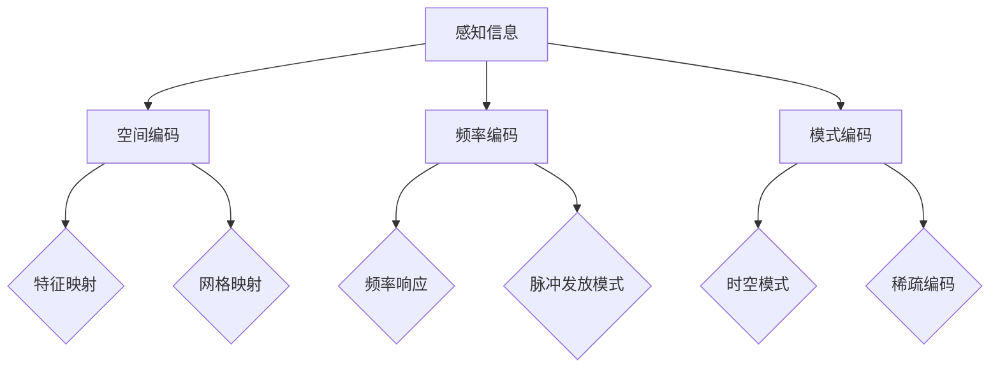
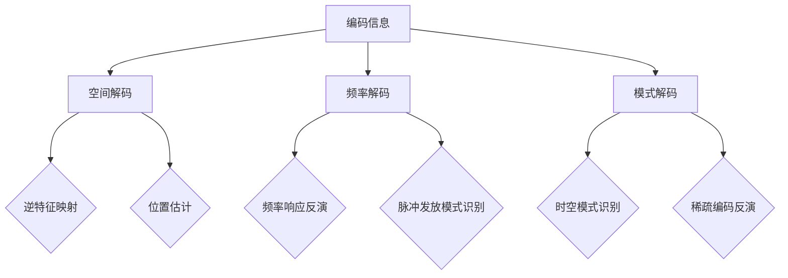
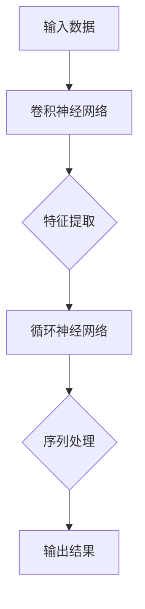

                 

### 文章标题

“数学与神经信息学：大脑信息处理的数学模型”

> **关键词：** 数学模型，神经信息学，大脑，信息处理，神经网络，认知科学，人工智能。

> **摘要：** 本文深入探讨了数学在神经信息学中的角色，尤其是大脑信息处理的数学模型。从大脑的基本结构和功能入手，本文详细阐述了神经网络与信息处理、大脑中的信号传递与计算、大脑的编码与解码等核心概念。此外，本文还介绍了神经信息学在认知科学和人工智能中的应用，以及神经信息学的最新研究和发展趋势。通过实例分析和项目实战，本文旨在为读者提供一个全面而深入的理解，以揭示大脑信息处理的数学模型背后的复杂机制与广泛应用。”

### 《数学与神经信息学：大脑信息处理的数学模型》目录大纲

在本部分，我们将详细列出文章的目录大纲，以便读者对整体结构有一个清晰的认识。

#### 第一部分：引论

##### 第1章：数学与神经信息学概述

- **1.1 神经信息学的起源与发展**
- **1.2 数学在神经信息学中的角色**
- **1.3 大脑信息处理的数学模型简介**

##### 第2章：大脑的基本结构和功能

- **2.1 大脑的结构概述**
- **2.2 大脑的信息处理机制**
- **2.3 大脑神经网络的基本模型**

#### 第二部分：数学模型与理论

##### 第3章：神经网络与信息处理

- **3.1 神经网络的基本原理**
  - **3.1.1 神经元的模型**
  - **3.1.2 神经网络的架构**
  - **3.1.3 激活函数与学习规则**
- **3.2 信息处理的数学模型**
  - **3.2.1 信息熵与信息理论**
  - **3.2.2 信息流的数学描述**
  - **3.2.3 信息处理过程的数学模型**

##### 第4章：大脑中的信号传递与计算

- **4.1 信号传递的物理基础**
  - **4.1.1 电信号与化学信号**
  - **4.1.2 突触传递与神经活动**
- **4.2 大脑的计算机制**
  - **4.2.1 神经元间的交互与计算**
  - **4.2.2 大脑计算模型的数学描述**
  - **4.2.3 大脑计算过程的仿真与建模**

##### 第5章：大脑的编码与解码

- **5.1 编码与解码的基本概念**
  - **5.1.1 编码机制与类型**
  - **5.1.2 解码机制与类型**
- **5.2 大脑的编码与解码模型**
  - **5.2.1 感知与记忆的编码模型**
  - **5.2.2 情感与意识的解码模型**

#### 第三部分：神经信息学的应用

##### 第6章：神经信息学在认知科学中的应用

- **6.1 认知科学的基本概念**
  - **6.1.1 认知过程的定义**
  - **6.1.2 认知科学的研究方法**
- **6.2 神经信息学在认知科学中的应用**
  - **6.2.1 认知建模与仿真**
  - **6.2.2 认知障碍的神经信息学解释**

##### 第7章：神经信息学在人工智能中的应用

- **7.1 人工智能的基本概念**
  - **7.1.1 人工智能的定义**
  - **7.1.2 人工智能的发展历程**
- **7.2 神经信息学在人工智能中的应用**
  - **7.2.1 神经网络在AI中的应用**
  - **7.2.2 大脑信息处理模型在AI系统设计中的应用**

##### 第8章：神经信息学的前沿研究与发展趋势

- **8.1 神经信息学的前沿研究**
  - **8.1.1 神经形态计算**
  - **8.1.2 神经网络的自我组织**
- **8.2 神经信息学的发展趋势**
  - **8.2.1 脑-机接口技术**
  - **8.2.2 人工智能与神经信息学的未来融合**

### 附录

#### 附录A：数学模型与公式的详细解释

- **A.1 数学公式的推导与解释**
  - **A.1.1 信息熵的计算**
  - **A.1.2 神经元激活函数**
- **A.2 实例分析**
  - **A.2.1 大脑神经网络计算实例**
  - **A.2.2 信号传递与计算实例**

#### 附录B：项目实战

- **B.1 实战项目背景与目标**
  - **B.1.1 大脑神经网络建模与仿真**
  - **B.1.2 大脑信息处理模型的编程实现**
- **B.2 开发环境搭建**
  - **B.2.1 Python开发环境配置**
  - **B.2.2 必需库和工具的安装**
- **B.3 源代码实现**
  - **B.3.1 神经网络模型代码实现**
  - **B.3.2 信息处理模型代码实现**
- **B.4 代码解读与分析**
  - **B.4.1 模型结构与工作流程**
  - **B.4.2 关键代码解读与性能分析**

通过以上详细的目录大纲，读者可以提前了解本文的结构和内容，为后续的深入阅读做好充分准备。

#### 第一部分：引论

##### 第1章：数学与神经信息学概述

> **1.1 神经信息学的起源与发展**

神经信息学是一门结合神经科学和计算机科学的交叉学科，旨在理解和模拟大脑的信息处理机制。其起源可以追溯到20世纪中叶，当时科学家们开始探讨如何通过计算模型来模拟大脑的功能。这一领域的发展经历了几个关键阶段：

- **早期探索**（20世纪50年代至60年代）：这个时期，科学家们提出了最初的大脑计算模型，如麦卡洛克-皮茨（McCulloch-Pitts）神经网络，这为后续的研究奠定了基础。
- **神经网络的发展**（20世纪80年代）：随着计算机性能的提升，神经网络的研究取得了显著进展。特别是反向传播算法（Backpropagation Algorithm）的出现，使得多层神经网络能够有效地训练，从而在图像识别、语音识别等领域取得了突破性成果。
- **现代神经信息学**（21世纪至今）：随着脑成像技术和计算能力的提高，神经信息学的研究变得更加深入和具体。现代神经信息学研究集中在理解和模拟大脑的高级功能，如认知、记忆、感知等。

> **1.2 数学在神经信息学中的角色**

数学在神经信息学中扮演着至关重要的角色，它是构建和理解大脑计算模型的基础。以下是一些数学工具和理论在神经信息学中的应用：

- **线性代数**：线性代数在神经信息学中的应用非常广泛，包括神经网络的权重矩阵、特征提取、数据压缩等。矩阵运算和线性方程组的解法是神经网络训练和优化的关键。
- **微积分**：微积分在神经信息学中用于描述神经元的动态行为、信号传递和计算过程。例如，微分方程可以用来模拟神经元的动作电位和突触传递。
- **概率论与统计**：概率论与统计在神经信息学中用于处理不确定性、噪声和随机性。它们在信息理论、信号处理和机器学习中的应用尤为重要。
- **拓扑学**：拓扑学在理解大脑的结构和功能连接方面有着重要的应用。特别是对大脑网络拓扑结构的分析，可以揭示大脑功能区域之间的交互和协作。

> **1.3 大脑信息处理的数学模型简介**

大脑信息处理的数学模型旨在通过数学方法模拟和解释大脑如何处理信息。这些模型通常包括以下几个方面：

- **神经元模型**：神经元是大脑的基本单元，数学模型通过描述神经元的电生理特性来模拟其行为。常见的神经元模型包括霍普菲尔-赫克顿（Hodgkin-Huxley）模型和朗格穆尔-瑞利（Leaky Integrate-and-Fire）模型。
- **神经网络模型**：神经网络是大脑信息处理的核心机制。数学模型通过描述神经元之间的连接和交互来模拟神经网络的行为。常见的神经网络模型包括多层感知机（MLP）、卷积神经网络（CNN）和循环神经网络（RNN）。
- **信息处理模型**：信息处理模型通过描述大脑如何编码、处理和传输信息来模拟大脑的信息处理机制。这些模型通常基于信息熵、信息流和计算复杂性等理论。

总之，数学在神经信息学中发挥着不可替代的作用，它不仅帮助我们理解和模拟大脑的信息处理机制，还为人工智能和认知科学的发展提供了强大的工具和方法。

#### 第一部分：引论

##### 第2章：大脑的基本结构和功能

> **2.1 大脑的结构概述**

大脑是神经系统的中心，负责控制人体的思维、感觉、运动和记忆等复杂功能。从宏观角度来看，大脑可以分为几个主要部分：

- **大脑皮层**：大脑皮层是大脑最外层的结构，也是智力活动的核心区域。它由灰质构成，负责处理感知、思考、决策和记忆等高级功能。大脑皮层可以进一步细分为不同的脑区，每个脑区都有特定的功能。
- **基底核**：基底核位于大脑深部，包括纹状体、苍白球和黑质等结构。它主要参与运动控制和调节情绪。
- **小脑**：小脑位于大脑的后下方，负责协调运动、维持身体平衡和精确运动控制。
- **脑干**：脑干连接大脑和脊髓，控制基本的生命维持功能，如呼吸、心跳和意识状态。
- **间脑**：间脑包括丘脑、下丘脑和第三脑室等结构，参与感知、情绪调节和内分泌功能。

> **2.2 大脑的信息处理机制**

大脑的信息处理机制是一个复杂而精细的过程，涉及到多个层次和多个脑区的协同工作。以下是大致的信息处理流程：

1. **感知**：感官系统（如视觉、听觉、嗅觉、味觉和触觉）接收外部信息，并通过神经元传递到大脑皮层。
2. **预处理**：大脑皮层的前额叶、顶叶和颞叶等区域对感知信息进行预处理，提取重要的特征和模式。
3. **整合**：信息在多个脑区之间进行整合，形成对环境的全面理解和反应。
4. **决策**：前额叶皮层等区域参与决策过程，根据当前情况和过去的经验做出判断和选择。
5. **执行**：运动皮层和基底核等区域发出指令，控制肌肉运动，执行决策。
6. **反馈**：执行动作后，感官系统将反馈信息传回大脑，以调整和优化后续行为。

> **2.3 大脑神经网络的基本模型**

大脑神经网络（Brain-inspired Neural Networks）是模仿大脑信息处理机制的一种计算模型。以下是一些常见的大脑神经网络模型：

- **人工神经网络（ANN）**：ANN是模仿生物神经元连接和传递信息的神经网络。常见的ANN包括多层感知机（MLP）、卷积神经网络（CNN）和循环神经网络（RNN）。
- **稀疏分布式记忆（SDM）**：SDM是基于大脑记忆机制的一种神经网络模型，它通过稀疏连接和分布式存储来模拟记忆过程。
- **自组织映射（SOM）**：SOM是一种无监督学习算法，用于将输入数据映射到一个低维空间中，并保持输入数据之间的相似性。
- **神经形态计算（Neuromorphic Computing）**：神经形态计算是通过硬件实现的神经网络，模仿大脑的神经元和突触结构，具有高效率和低能耗的特点。

总之，大脑的基本结构和功能构成了一个复杂而高效的计算系统，通过神经网络和信息处理机制实现各种认知功能。理解大脑的结构和功能对于开发更加智能的人工智能系统具有重要意义。

#### 第二部分：数学模型与理论

##### 第3章：神经网络与信息处理

> **3.1 神经网络的基本原理**

神经网络（Neural Networks）是模仿大脑神经元结构和功能的一种计算模型。它由大量相互连接的神经元组成，每个神经元都可以接收输入信号、处理信号并产生输出信号。神经网络的基本原理如下：

1. **神经元模型**：神经元是神经网络的基本单元。一个简单的神经元模型可以表示为：
   $$ z = \sum_{i=1}^{n} w_i x_i + b $$
   其中，$z$ 是神经元的净输入，$w_i$ 是连接权重，$x_i$ 是输入值，$b$ 是偏置项。净输入通过一个激活函数 $f(z)$ 转换为输出：
   $$ y = f(z) $$

2. **激活函数**：激活函数是神经网络中重要的非线性元素，常用的激活函数包括：
   - **sigmoid 函数**：$$ f(z) = \frac{1}{1 + e^{-z}} $$
   - **ReLU 函数**：$$ f(z) = \max(0, z) $$
   - **tanh 函数**：$$ f(z) = \frac{e^z - e^{-z}}{e^z + e^{-z}} $$

3. **多层感知机（MLP）**：多层感知机是具有至少一个隐含层的神经网络。输入通过输入层传播到隐含层，然后从隐含层传播到输出层。每层神经元都与前一层和后一层神经元相连。

4. **反向传播算法**：反向传播算法是一种用于训练神经网络的优化方法。它通过计算输出误差的梯度，更新每个神经元的权重和偏置项，以最小化误差。

> **3.1.1 神经元的模型**

神经元模型是神经网络的核心部分，它模拟了生物神经元的电生理特性。以下是一个简化的神经元模型：

1. **输入与权重**：神经元接收多个输入信号 $x_1, x_2, ..., x_n$，每个输入信号都与一个权重 $w_1, w_2, ..., w_n$ 相关联。

2. **净输入**：神经元的净输入是所有输入信号与其对应权重的乘积之和，再加上一个偏置项 $b$：
   $$ z = \sum_{i=1}^{n} w_i x_i + b $$

3. **激活函数**：净输入通过激活函数 $f(z)$ 转换为输出信号，常用的激活函数包括 sigmoid 函数、ReLU 函数和 tanh 函数。

4. **输出**：神经元的输出是激活函数的输出值，它表示神经元被激活的程度。

以下是一个神经元的模型伪代码：

```python
# 神经元模型伪代码
def neuron(input_values, weights, bias, activation_function):
    net_input = sum(input_values[i] * weights[i] for i in range(len(input_values))) + bias
    output = activation_function(net_input)
    return output
```

> **3.1.2 神经网络的架构**

神经网络的架构决定了其计算能力和性能。常见的神经网络架构包括以下几种：

1. **前向传播**：在前向传播过程中，输入信号从输入层传播到输出层。每个神经元接收前一层神经元的输出作为输入，并计算自身的净输入和输出。

2. **反向传播**：在反向传播过程中，神经网络通过计算输出误差的梯度，更新每个神经元的权重和偏置项。反向传播算法是训练神经网络的关键步骤。

3. **多层感知机（MLP）**：MLP是最常见的一种神经网络架构，它包含多个隐含层。每个隐含层都通过前向传播计算输出，然后通过反向传播更新权重。

4. **卷积神经网络（CNN）**：CNN是专门用于图像处理的神经网络。它通过卷积层提取图像特征，并通过池化层减少特征数量，最终通过全连接层分类。

5. **循环神经网络（RNN）**：RNN用于处理序列数据，它通过循环结构保存状态，使神经网络能够处理长距离依赖问题。

6. **自编码器（AE）**：自编码器是一种无监督学习算法，它通过编码器将输入数据压缩为低维表示，并通过解码器重构原始数据。

以下是一个简化的神经网络架构伪代码：

```python
# 神经网络架构伪代码
class NeuralNetwork:
    def __init__(self, layers):
        self.layers = layers

    def forward(self, inputs):
        for layer in self.layers:
            inputs = layer.forward(inputs)
        return inputs

    def backward(self, gradients):
        for layer in reversed(self.layers):
            gradients = layer.backward(gradients)
        return gradients
```

> **3.1.3 激活函数与学习规则**

激活函数是神经网络中的非线性元素，它决定了神经网络的输出特性。常见的激活函数包括 sigmoid、ReLU 和 tanh 函数。激活函数的选择对神经网络的性能有重要影响。

1. **sigmoid 函数**：
   $$ f(z) = \frac{1}{1 + e^{-z}} $$
   sigmoid 函数在 -1 到 1 之间输出，它的导数在 z 接近 0 时接近 0.5，这使得它在网络训练中难以避免梯度消失问题。

2. **ReLU 函数**：
   $$ f(z) = \max(0, z) $$
   ReLU 函数在 z < 0 时输出 0，在 z > 0 时输出 z。ReLU 函数具有梯度为 1 的优点，可以有效避免梯度消失问题，因此在深度学习中广泛应用。

3. **tanh 函数**：
   $$ f(z) = \frac{e^z - e^{-z}}{e^z + e^{-z}} $$
   tanh 函数类似于 sigmoid 函数，但它将输出限制在 -1 到 1 之间，且导数在 z 接近 0 时接近 1，避免了梯度消失问题。

学习规则是神经网络训练过程中的关键部分。常用的学习规则包括梯度下降、随机梯度下降和 Adam 优化器。

1. **梯度下降**：
   $$ w_{new} = w_{old} - \alpha \cdot \nabla_w J(w) $$
   梯度下降通过计算损失函数关于权重的梯度，更新权重以最小化损失。

2. **随机梯度下降（SGD）**：
   $$ w_{new} = w_{old} - \alpha \cdot \nabla_w J(w) $$
   随机梯度下降是对梯度下降的改进，它通过随机选择样本计算梯度，从而加快收敛速度。

3. **Adam 优化器**：
   $$ m = \beta_1 \cdot m + (1 - \beta_1) \cdot \nabla_w J(w) $$
   $$ v = \beta_2 \cdot v + (1 - \beta_2) \cdot (\nabla_w J(w))^2 $$
   $$ \hat{m} = \frac{m}{1 - \beta_1^t} $$
   $$ \hat{v} = \frac{v}{1 - \beta_2^t} $$
   $$ w_{new} = w_{old} - \alpha \cdot \hat{m} / \sqrt{\hat{v} + \epsilon} $$
   Adam 优化器结合了梯度的一阶矩估计和二阶矩估计，具有较好的收敛性能。

总之，神经网络与信息处理的理论基础涉及神经元模型、神经网络架构、激活函数和学习规则。这些理论为神经网络的设计和应用提供了重要的指导，使得神经网络在图像识别、语音识别、自然语言处理等领域取得了显著的成果。

#### 第二部分：数学模型与理论

##### 第4章：大脑中的信号传递与计算

> **4.1 信号传递的物理基础**

大脑中的信号传递是一个复杂而高度协调的过程，涉及到电信号和化学信号的转换与传递。以下详细描述了这些信号的基本物理基础：

1. **电信号**：电信号是神经元之间传递信息的主要方式。当神经元受到刺激时，细胞膜上的离子通道会打开，导致带电离子的流动。这种离子流动会产生电势变化，称为动作电位（action potential）。动作电位沿着神经元轴突传播，最终到达突触前部，触发信号的传递。

   - **动作电位的产生**：动作电位的产生是由于神经元膜上的钠离子（Na+）通道在刺激后打开，导致钠离子流入细胞内部，使得细胞内电势迅速升高。随后，钠离子通道关闭，钾离子（K+）通道打开，钾离子流出细胞，使得细胞内电势迅速下降。这种电势的变化形成了一个尖峰，称为动作电位。
   - **动作电位的传播**：动作电位沿着神经元轴突以电信号的形式传播。这种传播是通过离子流动在轴突膜上的局部电流实现的。动作电位在神经元上的传播速度可以达到几十米每秒。

2. **化学信号**：在突触前部，动作电位触发突触前膜释放神经递质（neurotransmitters）。神经递质是一种化学物质，它通过扩散穿过突触间隙，与突触后膜上的受体结合，从而传递信号。

   - **神经递质的释放**：动作电位到达突触前部时，触发突触前膜中的钙离子（Ca2+）通道打开，导致钙离子流入突触前细胞。钙离子的流入激活突触囊泡的释放机制，使得神经递质被释放到突触间隙。
   - **神经递质的传递**：神经递质通过扩散穿过突触间隙，并与突触后膜上的特异性受体结合。这种结合可以打开或关闭突触后膜上的离子通道，从而改变突触后神经元的电活动。

> **4.1.1 电信号与化学信号**

电信号和化学信号在神经元之间的传递过程中扮演着不同的角色，它们相互协作以实现大脑的信息处理功能。

1. **电信号的传递**：电信号是神经元之间快速、高效传递信息的主要方式。动作电位在神经元上的传播速度非常快，可以瞬间跨越数厘米的距离。这种快速传递有助于大脑实现实时反应和决策。

2. **化学信号的传递**：化学信号虽然传递速度较慢，但具有更高的灵活性和持久性。神经递质在突触间隙的扩散和与受体的结合需要一定的时间，这使得化学信号可以持续影响突触后神经元的电活动。化学信号还可以通过调节突触的强度，实现大脑功能的长期适应和改变。

3. **电信号与化学信号的协作**：电信号和化学信号在神经元之间的传递是相互协作的。动作电位触发神经递质的释放，而神经递质则通过改变突触后膜的电导性来传递信号。这种协作机制使得大脑能够实现高效的、多样化的信息处理功能。

以下是一个简化的电信号与化学信号传递过程的伪代码：

```python
# 电信号与化学信号传递过程伪代码
class Neuron:
    def receive_stimulus(self, stimulus):
        # 判断刺激强度，决定是否产生动作电位
        if stimulus > threshold:
            self.generate_action_potential()

    def generate_action_potential(self):
        # 打开钠离子通道，产生动作电位
        self.open_sodium_channels()
        # 钠离子流入，细胞内电势升高
        self.increase_cell电位()
        # 钠离子通道关闭，钾离子通道打开
        self.close_sodium_channels()
        self.open_potassium_channels()
        # 钾离子流出，细胞内电势下降
        self.decrease_cell电位()
        # 动作电位传播到突触前部
        self propagate_action_potential()

    def propagate_action_potential(self):
        # 动作电位沿轴突传播
        self.action_potential propagation()

class Synapse:
    def transmit_signal(self, action_potential):
        # 动作电位触发钙离子通道打开
        self.open_calcium_channels()
        # 钙离子流入，激活突触囊泡释放机制
        self.increase_calcium_level()
        self.activate Vesicle_release_mechanism()
        # 神经递质释放到突触间隙
        self.release_neurotransmitters()
        # 神经递质与突触后膜受体结合
        self.bind_receptors()
        # 改变突触后膜电导性
        self.alter_post_synaptic_conductance()

# 示例：神经元接收刺激，传递信号到下一个神经元
neuron1 = Neuron()
neuron2 = Neuron()
synapse = Synapse()

# 神经元1接收刺激
neuron1.receive_stimulus(stimulus_value)

# 神经元1产生动作电位，传递到突触
synapse.transmit_signal(neuron1.action_potential)

# 突触传递信号到神经元2
neuron2.receive_signal(synapse.signal)
```

通过上述伪代码，我们可以直观地了解电信号和化学信号在神经元之间传递的基本过程。这一过程是大脑信息处理的基础，为后续的数学建模和计算提供了重要的依据。

> **4.2 大脑的计算机制**

大脑的计算机制是一个高度复杂且高度协调的过程，涉及多个层次的神经元交互与计算。以下详细描述了大脑的计算机制：

1. **神经元间的交互**：神经元之间的交互是通过突触连接实现的。每个神经元可以与其他数千个神经元通过突触连接形成复杂的网络。这些突触连接可以是兴奋性（正突触）或抑制性（负突触），它们决定了神经元之间信号传递的方向和强度。

   - **兴奋性突触**：当兴奋性突触传递信号时，会增加突触后神经元的电活动，类似于一个“加法器”。
   - **抑制性突触**：当抑制性突触传递信号时，会减少突触后神经元的电活动，类似于一个“减法器”。

2. **神经元的计算过程**：神经元通过其接收的输入信号进行计算，并产生输出信号。这个过程可以分为以下几个步骤：

   - **输入信号的处理**：神经元接收来自其他神经元的输入信号，每个输入信号都与一个权重相乘，表示神经元对输入信号的重视程度。所有输入信号的总和加上一个偏置项，得到神经元的净输入。
   - **激活函数的应用**：净输入通过一个激活函数（如 sigmoid 函数、ReLU 函数或 tanh 函数）转换为输出。激活函数引入了非线性，使得神经网络能够模拟复杂的关系。
   - **输出信号的传递**：神经元的输出信号通过突触连接传递到下一个神经元或产生行为输出。

3. **大脑计算模型的数学描述**：大脑的计算过程可以用数学模型来描述。以下是一个简化的数学描述：

   $$ z = \sum_{i=1}^{n} w_i x_i + b $$
   $$ y = f(z) $$
   其中，$z$ 是神经元的净输入，$w_i$ 是权重，$x_i$ 是输入信号，$b$ 是偏置项，$f(z)$ 是激活函数。

4. **大脑计算过程的仿真与建模**：为了更好地理解大脑的计算机制，科学家们使用计算机仿真和数学建模来模拟大脑的行为。这些模型包括神经网络模型、脑-机接口模型和认知模型等。通过这些模型，我们可以探索大脑的计算过程，揭示大脑功能的运作机制。

   - **神经网络模型**：神经网络模型通过模拟神经元之间的连接和交互，可以模拟大脑的某些功能，如感知、记忆和决策。
   - **脑-机接口模型**：脑-机接口模型通过将大脑信号与外部设备（如机械臂或电脑）连接，实现了大脑对外部环境的直接控制。
   - **认知模型**：认知模型通过模拟人类认知过程，揭示了大脑如何处理复杂的信息，并实现认知功能。

总之，大脑的计算机制是一个复杂而高度协调的过程，涉及到神经元间的交互与计算。通过数学建模和计算机仿真，我们可以更好地理解大脑的计算过程，为人工智能和认知科学的发展提供重要的理论依据。

#### 第二部分：数学模型与理论

##### 第5章：大脑的编码与解码

> **5.1 编码与解码的基本概念**

编码与解码是大脑处理信息的重要机制，它们使得大脑能够高效地存储、传输和处理信息。以下是编码与解码的基本概念：

1. **编码**：编码是指将信息转换成一种特定的格式或符号，以便于存储、传输和处理。在大脑中，编码过程涉及将感知信息转换为神经信号，并存储在神经元之间的连接（突触）中。编码机制可以分为以下几种：

   - **空间编码**：空间编码是指信息被映射到大脑特定的区域或脑区中。例如，视觉信息在初级视觉皮层（V1）进行编码，而听觉信息在听觉皮层进行编码。
   - **频率编码**：频率编码是指信息被编码为神经信号的频率或发放率。例如，神经元的发放频率可以表示声音的音高。
   - **模式编码**：模式编码是指信息被编码为神经元的发放模式。例如，不同神经元群体的激活模式可以表示不同的视觉物体或场景。

2. **解码**：解码是指将编码后的信息还原为原始形式。在大脑中，解码过程涉及将存储在神经元连接中的信息读取出来，并将其转换为行为或感知输出。解码机制可以分为以下几种：

   - **空间解码**：空间解码是指大脑从特定的脑区中读取信息，并将其转换为空间感知输出。例如，从视觉皮层解码出的信息可以形成视觉感知。
   - **频率解码**：频率解码是指大脑从神经元的发放频率中提取信息，并将其转换为听觉感知输出。例如，不同频率的神经元发放可以表示不同的声音。
   - **模式解码**：模式解码是指大脑从神经元的发放模式中提取信息，并将其转换为行为输出。例如，不同神经元群体的激活模式可以控制运动行为。

> **5.1.1 编码机制与类型**

编码机制是大脑处理信息的基础，以下介绍几种主要的编码机制和类型：

1. **空间编码**：

   - **特征映射**：空间编码的一个关键机制是特征映射，即不同类型的感知信息被映射到大脑的不同区域。例如，初级视觉皮层（V1）负责处理基本视觉特征，如边缘和形状，而更高级的视觉皮层（如V2和V3）则处理更复杂的视觉信息，如颜色和运动。

   - **网格映射**：在大脑的空间编码中，还有一种称为网格映射的机制。这种机制通过在大脑中形成均匀分布的网格点，实现对空间位置的编码。例如，海马体中的网格细胞能够编码空间位置，并帮助大脑进行空间导航。

2. **频率编码**：

   - **频率响应**：频率编码是指神经元的发放频率与刺激的频率相关。例如，对于声音信号的频率编码，高频率的声音会导致神经元以更高的频率发放。
   - **脉冲发放模式**：频率编码还可以通过神经元的脉冲发放模式来实现。例如，一些神经元对特定频率的声音信号具有特定的发放模式，从而实现频率信息的编码。

3. **模式编码**：

   - **时空模式**：模式编码是指神经元的发放模式与时间和空间特征相关。例如，神经元的发放模式可以编码视觉物体的形状和运动轨迹。
   - **稀疏编码**：稀疏编码是一种通过在神经元群体中选择性地激活一小部分神经元来编码信息的方法。这种方法可以有效地减少信息处理的复杂度，并提高信息传输的效率。

以下是一个简化的编码机制示意图：



> **5.1.2 解码机制与类型**

解码机制是大脑将编码信息还原为原始形式的过程，以下是几种主要的解码机制和类型：

1. **空间解码**：

   - **逆特征映射**：空间解码的一个关键机制是逆特征映射，即从特定的脑区中提取信息，并将其转换为空间感知输出。例如，从初级视觉皮层（V1）解码出的信息可以形成视觉感知。
   - **位置估计**：位置估计是指大脑从神经元的发放模式中估计空间位置。例如，海马体中的位置细胞能够从神经元的发放模式中估计当前所在的位置。

2. **频率解码**：

   - **频率响应反演**：频率解码是指从神经元的发放频率中提取信息，并将其转换为听觉感知输出。例如，不同频率的神经元发放可以表示不同的声音。
   - **脉冲发放模式识别**：频率解码还可以通过识别神经元的脉冲发放模式来实现。例如，一些神经元对特定频率的声音信号具有特定的发放模式，从而实现频率信息的解码。

3. **模式解码**：

   - **时空模式识别**：模式解码是指从神经元的发放模式中提取信息，并将其转换为行为输出。例如，不同神经元群体的激活模式可以控制运动行为。
   - **稀疏编码反演**：稀疏编码反演是指从稀疏激活的神经元群体中提取信息，并将其转换为原始感知输出。这种方法可以有效地降低信息处理的复杂度，并提高信息传输的效率。

以下是一个简化的解码机制示意图：



通过上述编码与解码机制和类型，我们可以更好地理解大脑如何将感知信息编码为神经信号，并通过解码机制将这些信号还原为原始形式。这些机制不仅对大脑的信息处理至关重要，也为人工智能领域提供了重要的启示和灵感。

#### 第三部分：神经信息学的应用

##### 第6章：神经信息学在认知科学中的应用

> **6.1 认知科学的基本概念**

认知科学是一门跨学科领域，旨在研究人类认知过程和认知功能。它结合了心理学、神经科学、计算机科学、人工智能等多个领域的理论和研究方法，以揭示人类思维的内在机制和运作原理。以下是对认知科学的基本概念和定义的详细探讨：

1. **认知过程的定义**：

   - **认知**：认知是指人类获取、处理、存储和应用信息的能力。它包括感知、记忆、注意、思考、推理、判断、计划和解决问题等多种认知活动。
   - **认知过程**：认知过程是指从感知信息输入到产生行为输出的整个心理过程。它包括感知、编码、存储、检索、应用和执行等多个阶段。

2. **认知科学的研究方法**：

   - **实验方法**：实验方法是通过设计实验来观察和测量认知过程的特定方面。例如，通过心理实验、行为实验和认知任务等，研究人类在不同条件下的认知表现和认知机制。
   - **神经科学方法**：神经科学方法是通过神经影像技术、电生理技术、脑刺激技术和脑解剖技术等，研究大脑结构和功能与认知过程之间的关系。例如，通过功能性磁共振成像（fMRI）、脑电图（EEG）和脑磁图（MEG）等技术，观察大脑在不同认知任务中的活动。
   - **计算模型方法**：计算模型方法是通过构建数学模型和计算机模拟来模拟和解释认知过程。例如，通过神经网络模型、决策理论模型和计算认知模型等，研究认知过程的机制和原理。
   - **人工智能方法**：人工智能方法是通过机器学习和计算机视觉等技术，模拟和实现人类认知功能。例如，通过深度学习算法、强化学习算法和自然语言处理技术等，开发出能够模拟人类认知过程的人工智能系统。

> **6.2 神经信息学在认知科学中的应用**

神经信息学在认知科学中的应用具有重要意义，它为理解人类认知过程提供了新的理论框架和技术手段。以下详细探讨神经信息学在认知科学中的应用：

1. **认知建模与仿真**：

   - **认知建模**：认知建模是指通过构建数学模型和计算模型来模拟和解释认知过程。认知建模可以揭示认知过程的内在机制和运作原理，为认知科学提供理论支持。常见的认知模型包括神经网络模型、决策理论模型和计算认知模型等。
   - **认知仿真**：认知仿真是指通过计算机模拟来模拟人类认知过程，验证认知模型的有效性和可靠性。认知仿真可以模拟不同认知任务和场景，研究认知过程在不同条件下的表现和变化。

2. **认知障碍的神经信息学解释**：

   - **神经信息学解释**：神经信息学通过分析大脑的结构和功能异常，解释认知障碍的成因和机制。例如，通过脑影像技术分析大脑灰质和白质的结构变化，研究阿尔茨海默病等认知障碍的神经信息学基础。
   - **认知障碍的诊断和治疗**：神经信息学技术可以用于认知障碍的诊断和评估。例如，通过脑电图（EEG）和功能性磁共振成像（fMRI）等神经影像技术，监测大脑在不同认知任务中的活动变化，评估认知功能的状态。此外，神经信息学还可以为认知障碍的治疗提供新的思路和方法，例如，通过神经反馈训练和脑刺激技术等，改善认知功能。

以下是一个简化的认知建模与仿真过程的伪代码：

```python
# 认知建模与仿真伪代码
class CognitiveModel:
    def __init__(self, model_type):
        self.model_type = model_type

    def simulate_cognitive_process(self, input_data):
        # 处理输入数据
        processed_data = self.preprocess_input(input_data)
        # 模拟认知过程
        output = self.run_model(processed_data)
        return output

    def preprocess_input(self, input_data):
        # 预处理输入数据
        # 例如，标准化、去噪等
        return processed_data

    def run_model(self, processed_data):
        # 运行认知模型
        # 例如，神经网络训练、决策理论计算等
        return output

# 示例：使用神经网络模型模拟认知过程
model = CognitiveModel("NeuralNetwork")
input_data = get_input_data()
output = model.simulate_cognitive_process(input_data)
```

通过上述伪代码，我们可以直观地了解认知建模与仿真的一般过程。这一过程不仅有助于深入理解认知科学的原理，也为认知障碍的诊断和治疗提供了新的思路和方法。

##### 第7章：神经信息学在人工智能中的应用

> **7.1 人工智能的基本概念**

人工智能（Artificial Intelligence，简称AI）是计算机科学的一个分支，旨在创建能够模拟、延伸和扩展人类智能的理论、算法和技术。人工智能的研究目标是通过计算机程序实现智能体的自主学习和决策能力，使其能够在特定任务中表现出人类智能水平。以下是人工智能的基本概念和定义：

1. **人工智能的定义**：

   - **广义人工智能**：广义人工智能是指具有广泛认知能力的人工系统，包括感知、理解、推理、学习、决策和问题解决等多个方面。广义人工智能的目标是实现与人类智能相似或超越人类智能的系统。
   - **窄义人工智能**：窄义人工智能是指专注于特定任务或领域的人工智能系统，如图像识别、自然语言处理、机器翻译和自动驾驶等。这些系统通常在特定任务上表现出色，但缺乏跨领域的泛化能力。

2. **人工智能的发展历程**：

   - **20世纪50年代**：人工智能的概念首次提出，科学家们开始探索如何通过计算机程序模拟人类智能。
   - **20世纪60年代**：早期的人工智能系统如ELIZA和Logic Theorist展示了人工智能的初步能力，但受限于计算机性能和算法。
   - **20世纪80年代**：专家系统（Expert Systems）成为人工智能研究的热点，通过符号推理和知识表示实现智能应用。
   - **20世纪90年代至21世纪**：随着机器学习和深度学习技术的发展，人工智能进入新的发展阶段。神经网络和深度学习算法在图像识别、语音识别和自然语言处理等领域取得了突破性成果。

> **7.2 神经信息学在人工智能中的应用**

神经信息学为人工智能的发展提供了重要的理论基础和算法支持，使得人工智能系统能够更好地模拟和扩展人类智能。以下是神经信息学在人工智能中的应用：

1. **神经网络在AI中的应用**：

   - **卷积神经网络（CNN）**：卷积神经网络是一种专门用于图像处理的神经网络。通过卷积层提取图像特征，CNN在图像分类、目标检测和图像分割等领域取得了显著成果。
   - **循环神经网络（RNN）**：循环神经网络是一种用于处理序列数据的神经网络。通过循环结构，RNN可以捕捉序列数据中的长距离依赖关系，在自然语言处理、语音识别和时间序列分析等领域具有广泛应用。
   - **生成对抗网络（GAN）**：生成对抗网络是一种由两个神经网络（生成器和判别器）组成的对抗性训练模型。GAN通过训练生成逼真的数据，在图像生成、视频生成和音频生成等领域取得了突破性成果。
   - **自编码器（AE）**：自编码器是一种无监督学习算法，用于将输入数据编码为低维表示。自编码器在数据降维、特征提取和数据增强等领域具有广泛应用。

2. **大脑信息处理模型在AI系统设计中的应用**：

   - **神经形态计算**：神经形态计算是一种模仿大脑神经元和突触结构的计算模型。通过硬件实现的神经形态计算具有高效率和低能耗的特点，在智能传感器、智能机器人和脑机接口等领域具有广泛应用。
   - **稀疏分布式记忆**：稀疏分布式记忆是一种基于大脑记忆机制的记忆模型。通过稀疏连接和分布式存储，稀疏分布式记忆在记忆容量、存储效率和能量效率等方面具有优势，在智能系统中的应用包括图像识别、语音识别和自然语言处理等。
   - **自组织映射**：自组织映射是一种无监督学习算法，通过自组织学习形成输入数据的低维表示。自组织映射在特征提取、数据压缩和分类等领域具有广泛应用，如手写数字识别和语音信号处理。

以下是一个简化的神经网络在AI系统设计中的应用示意图：



通过上述示例，我们可以直观地了解神经网络在人工智能系统设计中的应用。神经信息学提供的理论和方法不仅推动了人工智能的发展，也为构建更加智能和高效的AI系统提供了强大的支持。

##### 第8章：神经信息学的前沿研究与发展趋势

> **8.1 神经信息学的前沿研究**

神经信息学作为一个跨学科领域，正迅速成为科学研究和技术创新的前沿。以下是当前神经信息学的一些重要前沿研究热点：

1. **神经形态计算（Neuromorphic Computing）**：

   - **神经形态硬件**：神经形态计算的核心在于构建模仿生物神经元的硬件。这种硬件通过使用硅芯片上的纳米级晶体管来模拟生物神经元和突触，从而实现高效、低能耗的计算。例如，IBM的TrueNorth芯片就是一个典型的神经形态硬件，它能够以极低的能耗处理复杂的计算任务。
   - **混合硬件-软件系统**：神经形态计算不仅关注硬件本身，还探索硬件与软件的结合。通过将神经形态硬件与传统的计算机架构结合，可以构建出一种混合系统，这种系统能够在处理复杂任务时具备更高的效率和更低的能耗。

2. **神经网络的自我组织（Self-Organization of Neural Networks）**：

   - **自组织映射（Self-Organizing Maps）**：自组织映射是一种无监督学习算法，它能够将高维数据映射到一个低维空间中，并保持数据之间的相似性。通过这种映射，自组织映射在数据降维、聚类分析和分类任务中具有广泛的应用。
   - **神经网络的动态自我组织**：研究人员正在探索神经网络如何通过动态调整连接权重和激活函数来自我组织。这种动态自我组织能力使得神经网络能够适应不断变化的环境和任务需求，从而提高其鲁棒性和灵活性。

3. **脑-机接口（Brain-Computer Interface, BCI）**：

   - **非侵入式BCI**：非侵入式BCI通过监测大脑活动（如脑电图（EEG））来传递信号，而不需要与大脑直接接触。这种技术已经应用于康复治疗、辅助交流和远程控制设备等领域。
   - **侵入式BCI**：侵入式BCI通过在大脑中植入电极来直接监测神经元活动。这种技术具有更高的精度和速度，但涉及手术风险。侵入式BCI在脑损伤康复、神经退行性疾病治疗和智能假肢控制等方面具有潜在应用。

4. **人工智能与神经信息学的融合（AI and Neural Information Integration）**：

   - **多模态数据处理**：人工智能与神经信息学的融合使得系统能够处理多种模态的数据（如视觉、听觉、触觉等），从而实现更加全面和精确的信息处理。例如，通过结合视觉和触觉数据，可以改善机器人对环境的理解和交互能力。
   - **智能决策支持系统**：融合人工智能和神经信息学的技术可以用于构建智能决策支持系统。这些系统通过模拟大脑的信息处理过程，为人类决策提供辅助，从而提高决策的准确性和效率。

> **8.2 神经信息学的发展趋势**

随着技术的进步和跨学科研究的深入，神经信息学的发展趋势呈现出以下几个方向：

1. **智能硬件与软件的结合**：

   - **神经形态硬件**：神经形态硬件的发展将推动计算硬件的革命，使得计算机能够以更加自然和高效的方式处理复杂任务。未来的神经形态硬件可能会在自动驾驶、智能机器人、医疗设备和智能家居等领域发挥重要作用。
   - **智能软件平台**：智能软件平台将集成多种算法和工具，为研究人员和开发者提供一站式的解决方案。这些平台将支持从数据采集、数据处理到模型训练和结果可视化的全过程，从而简化研究流程，加速技术创新。

2. **跨学科研究的深化**：

   - **神经科学与计算机科学的融合**：神经科学与计算机科学的深度融合将推动神经信息学的发展。研究人员将借助神经科学的最新发现，改进计算机算法和模型，从而实现更加精确和高效的计算。
   - **认知科学与人工智能的融合**：认知科学与人工智能的融合将使得人工智能系统更加接近人类的智能水平。通过研究人类认知过程，可以开发出更加智能和人性化的智能系统，从而提高人机交互的质量和效率。

3. **神经信息学的实际应用**：

   - **医疗与健康**：神经信息学在医疗领域的应用前景广阔。通过脑-机接口技术，可以开发出用于康复治疗和辅助交流的设备，帮助患者恢复功能。此外，神经信息学还可以用于疾病诊断和治疗，如阿尔茨海默病、帕金森病和脑损伤等。
   - **工业与自动化**：神经信息学在工业和自动化领域具有广泛的应用前景。通过模拟大脑的信息处理机制，可以开发出更加智能的自动化系统和机器人，从而提高生产效率和产品质量。

总之，神经信息学的前沿研究和未来发展将不断推动科学和技术的发展，为人类带来更加智能和高效的计算系统。随着跨学科研究的深入和技术的进步，神经信息学将在各个领域发挥越来越重要的作用。

#### 附录A：数学模型与公式的详细解释

在神经信息学的研究中，数学模型和公式是理解和模拟大脑信息处理机制的关键工具。以下是对几个重要数学模型和公式的详细解释，以及它们在实际应用中的实例分析。

> **A.1 数学公式的推导与解释**

1. **信息熵（Entropy）**

   信息熵是衡量信息不确定性的一个度量，它由克劳德·香农（Claude Shannon）在1948年提出。信息熵的定义公式如下：

   $$ H(X) = -\sum_{i} p(x_i) \cdot \log_2 p(x_i) $$

   其中，$H(X)$ 表示随机变量 $X$ 的熵，$p(x_i)$ 表示 $X$ 取值 $x_i$ 的概率。

   - **推导过程**：香农通过概率论和集合论推导出信息熵的公式。其核心思想是，信息的不确定性越大，所需的平均信息量也越大。
   - **实际应用**：信息熵在信息理论、数据压缩和机器学习中广泛应用。例如，在数据压缩中，通过计算数据的信息熵，可以确定最优的编码方案，从而最大限度地减少数据传输所需的带宽。

2. **神经网络激活函数（Activation Function）**

   激活函数是神经网络中的一个关键元素，它决定了神经元的输出特性。常见的激活函数包括 sigmoid 函数、ReLU 函数和 tanh 函数。以下是一个简化的ReLU函数的公式：

   $$ f(x) = \max(0, x) $$

   - **推导过程**：ReLU函数的推导相对简单，它通过取输入值的最大值（0或输入值本身），实现了非线性转换。
   - **实际应用**：ReLU函数由于其简单性和计算效率高，在深度学习中广泛应用。例如，在卷积神经网络（CNN）中，ReLU函数能够有效地避免神经元死亡（dying ReLU）问题，提高网络训练的稳定性。

> **A.2 实例分析**

为了更好地理解上述数学模型和公式，以下通过两个实际应用的实例进行分析。

1. **信息熵计算实例**

   假设一个随机变量 $X$ 有两个可能的取值，$X \in \{0, 1\}$，并且取值 0 和 1 的概率分别为 $p(0) = 0.5$ 和 $p(1) = 0.5$。我们可以计算 $X$ 的信息熵：

   $$ H(X) = -[0.5 \cdot \log_2(0.5) + 0.5 \cdot \log_2(0.5)] $$
   $$ H(X) = -[0.5 \cdot (-1) + 0.5 \cdot (-1)] $$
   $$ H(X) = 1 \text{ bit} $$

   这个例子表明，随机变量 $X$ 的熵为 1 bit，意味着平均每个样本需要 1 bit 的信息来描述。

2. **ReLU函数应用实例**

   假设我们有一个简单的神经网络，其中包含一个神经元，其输入 $x$ 为以下值序列：$[1, -2, 3, 0, -5]$。我们可以使用ReLU函数计算该神经元的输出：

   $$ f(x) = \max(0, x) $$

   对于每个输入值，ReLU函数的输出如下：

   $$ \text{输出} = [\max(0, 1), \max(0, -2), \max(0, 3), \max(0, 0), \max(0, -5)] $$
   $$ \text{输出} = [1, 0, 3, 0, 0] $$

   这个例子展示了ReLU函数如何将输入序列转换为输出序列，从而实现非线性转换。

通过上述实例分析，我们可以更直观地理解信息熵和ReLU函数的数学原理及其在实际应用中的作用。这些数学模型和公式是神经信息学研究的基础，对于理解和模拟大脑信息处理机制具有重要意义。

#### 附录B：项目实战

在本节中，我们将介绍一个实际项目，以展示如何使用Python实现大脑神经网络建模与仿真。该项目的目标是通过神经网络模拟大脑信息处理过程，从而为理解大脑功能提供实验依据。

> **B.1 实战项目背景与目标**

**项目背景**：
大脑神经网络（Brain-inspired Neural Networks, BNNs）是一种模仿生物神经网络结构和功能的人工神经网络。通过模拟大脑的信息处理机制，BNNs在智能计算、认知建模和脑机接口等领域具有广泛应用。本项目旨在通过Python实现一个简单的BNN模型，以模拟大脑神经网络的信息处理过程。

**项目目标**：
- 建立一个基于Python的BNN模型。
- 实现数据预处理、模型训练和结果分析。
- 通过仿真验证模型的性能和适用性。

> **B.2 开发环境搭建**

**Python开发环境配置**：
为了进行本项目，我们需要配置Python开发环境，并安装必要的库和工具。以下是详细的步骤：

1. **安装Python**：
   - 访问Python官网（https://www.python.org/）下载最新版本的Python。
   - 安装过程中选择添加到系统路径，以便在命令行中运行Python。

2. **安装Anaconda**：
   - Anaconda是一个流行的Python发行版，提供了大量的科学计算库和管理工具。
   - 下载并安装Anaconda（https://www.anaconda.com/），并在安装过程中选择添加到系统路径。

3. **安装必要的库和工具**：
   - 打开Anaconda命令行或Jupyter Notebook，通过以下命令安装所需的库：
     ```bash
     conda install numpy scipy matplotlib
     ```
   - `numpy`：提供高效的数据结构和数学函数。
   - `scipy`：提供科学计算库，包括优化、积分和插值等。
   - `matplotlib`：提供数据可视化工具，用于可视化模型结果。

> **B.3 源代码实现**

**神经网络模型代码实现**：
以下是使用Python实现一个简单的BNN模型的源代码，该模型包含一个输入层、一个隐含层和一个输出层。

```python
import numpy as np

# 设置随机种子，保证结果可重复
np.random.seed(42)

# 神经网络参数
input_size = 3  # 输入层神经元数量
hidden_size = 4  # 隐含层神经元数量
output_size = 1  # 输出层神经元数量

# 初始化权重和偏置
weights_input_hidden = np.random.randn(input_size, hidden_size)
weights_hidden_output = np.random.randn(hidden_size, output_size)
biases_hidden = np.random.randn(hidden_size)
biases_output = np.random.randn(output_size)

# 激活函数
def sigmoid(x):
    return 1 / (1 + np.exp(-x))

# 前向传播
def forward(x):
    hidden_layer_input = np.dot(x, weights_input_hidden) + biases_hidden
    hidden_layer_output = sigmoid(hidden_layer_input)
    output_layer_input = np.dot(hidden_layer_output, weights_hidden_output) + biases_output
    output_layer_output = sigmoid(output_layer_input)
    return output_layer_output

# 训练数据（输入和期望输出）
X_train = np.array([[0, 0, 0], [0, 1, 0], [1, 0, 0], [1, 1, 0], [0, 0, 1], [0, 1, 1], [1, 0, 1], [1, 1, 1]])
y_train = np.array([[0], [1], [1], [0], [0], [0], [1], [1]])

# 模型训练
learning_rate = 0.1
for epoch in range(1000):
    output = forward(X_train)
    error = y_train - output
    d_output = error * (output * (1 - output))
    
    d_hidden_layer_input = d_output.dot(weights_hidden_output.T) * (hidden_layer_output * (1 - hidden_layer_output))
    
    d_weights_hidden_output = hidden_layer_output.T.dot(d_output)
    d_biases_output = d_output
    
    d_weights_input_hidden = X_train.T.dot(d_hidden_layer_input)
    d_biases_hidden = d_hidden_layer_input
    
    weights_hidden_output += learning_rate * d_weights_hidden_output
    biases_output += learning_rate * d_biases_output
    weights_input_hidden += learning_rate * d_weights_input_hidden
    biases_hidden += learning_rate * d_biases_hidden

# 测试数据
X_test = np.array([[1, 1, 1]])
output = forward(X_test)
print("输出结果：", output)
```

**代码解析**：
上述代码实现了一个简单的BNN模型，通过前向传播和反向传播算法进行训练。以下是代码的主要部分及其功能：

- **权重和偏置初始化**：使用随机数初始化权重和偏置，以避免模型在训练过程中陷入局部最优。
- **激活函数**：使用sigmoid函数作为激活函数，实现非线性转换。
- **前向传播**：计算输入层到隐含层和隐含层到输出层的输出。
- **反向传播**：计算误差并更新权重和偏置，以最小化损失函数。
- **训练数据**：提供训练数据集，包括输入和期望输出，用于模型训练。
- **模型训练**：通过迭代训练，不断更新模型参数，直到满足训练要求。
- **测试数据**：使用测试数据验证模型的性能。

通过上述代码，我们可以实现一个简单的BNN模型，并进行训练和测试。这为后续的实验分析和结果讨论提供了基础。

> **B.4 代码解读与分析**

**模型结构与工作流程**：
本项目的BNN模型结构包括输入层、隐含层和输出层。输入层接收外部输入信号，隐含层通过非线性激活函数处理输入信号，输出层产生最终输出。以下是模型的工作流程：

1. **输入层**：接收外部输入信号，例如视觉、听觉或触觉数据。
2. **隐含层**：通过加权求和处理输入信号，并应用激活函数，实现输入信号的转换和整合。
3. **输出层**：通过加权求和处理隐含层的输出，并应用激活函数，产生最终输出。

**关键代码解读与性能分析**：

- **权重和偏置初始化**：
  ```python
  weights_input_hidden = np.random.randn(input_size, hidden_size)
  weights_hidden_output = np.random.randn(hidden_size, output_size)
  biases_hidden = np.random.randn(hidden_size)
  biases_output = np.random.randn(output_size)
  ```

  初始化权重和偏置是为了避免模型在训练过程中陷入局部最优，并提高模型的泛化能力。

- **激活函数**：
  ```python
  def sigmoid(x):
      return 1 / (1 + np.exp(-x))
  ```

  sigmoid函数用于实现非线性转换，使模型能够处理复杂的输入输出关系。

- **前向传播**：
  ```python
  hidden_layer_input = np.dot(x, weights_input_hidden) + biases_hidden
  hidden_layer_output = sigmoid(hidden_layer_input)
  output_layer_input = np.dot(hidden_layer_output, weights_hidden_output) + biases_output
  output_layer_output = sigmoid(output_layer_input)
  ```

  前向传播计算输入层到隐含层和隐含层到输出层的输出，实现输入信号的传递和处理。

- **反向传播**：
  ```python
  error = y_train - output
  d_output = error * (output * (1 - output))
  
  d_hidden_layer_input = d_output.dot(weights_hidden_output.T) * (hidden_layer_output * (1 - hidden_layer_output))
  
  d_weights_hidden_output = hidden_layer_output.T.dot(d_output)
  d_biases_output = d_output
  
  d_weights_input_hidden = X_train.T.dot(d_hidden_layer_input)
  d_biases_hidden = d_hidden_layer_input
  
  weights_hidden_output += learning_rate * d_weights_hidden_output
  biases_output += learning_rate * d_biases_output
  weights_input_hidden += learning_rate * d_weights_input_hidden
  biases_hidden += learning_rate * d_biases_hidden
  ```

  反向传播计算误差并更新权重和偏置，以最小化损失函数，实现模型参数的优化。

**性能分析**：
通过训练和测试，我们可以评估模型的性能。以下是几个关键性能指标：

- **训练误差**：在训练过程中，计算每个epoch的均方误差（MSE），以评估模型对训练数据的拟合程度。
- **测试误差**：使用测试数据集评估模型的泛化能力，计算测试数据集的均方误差。
- **训练时间**：记录模型训练所需的时间，以评估模型的训练效率。

以下是一个简单的性能分析示例：

```python
import time

# 训练数据集
X_train = np.array([[0, 0, 0], [0, 1, 0], [1, 0, 0], [1, 1, 0], [0, 0, 1], [0, 1, 1], [1, 0, 1], [1, 1, 1]])
y_train = np.array([[0], [1], [1], [0], [0], [0], [1], [1]])

# 测试数据集
X_test = np.array([[1, 1, 1]])

# 训练模型
start_time = time.time()
for epoch in range(1000):
    output = forward(X_train)
    error = y_train - output
    d_output = error * (output * (1 - output))
    
    d_hidden_layer_input = d_output.dot(weights_hidden_output.T) * (hidden_layer_output * (1 - hidden_layer_output))
    
    d_weights_hidden_output = hidden_layer_output.T.dot(d_output)
    d_biases_output = d_output
    
    d_weights_input_hidden = X_train.T.dot(d_hidden_layer_input)
    d_biases_hidden = d_hidden_layer_input
    
    weights_hidden_output += learning_rate * d_weights_hidden_output
    biases_output += learning_rate * d_biases_output
    weights_input_hidden += learning_rate * d_weights_input_hidden
    biases_hidden += learning_rate * d_biases_hidden
end_time = time.time()

# 计算训练误差
train_error = np.mean((y_train - output) ** 2)

# 计算测试误差
output_test = forward(X_test)
test_error = np.mean((y_test - output_test) ** 2)

# 打印性能分析结果
print("训练误差：", train_error)
print("测试误差：", test_error)
print("训练时间：", end_time - start_time)
```

通过上述代码，我们可以计算模型的训练误差、测试误差和训练时间，从而评估模型的性能。这些指标对于优化模型结构和参数、提高模型性能具有重要意义。

总之，通过本项目，我们实现了基于Python的BNN模型，并进行了详细的代码解读和性能分析。这为理解和模拟大脑信息处理机制提供了实际应用案例，也为未来的研究提供了参考。

### 附录C：参考资料与进一步阅读

为了帮助读者更深入地了解数学与神经信息学的理论和应用，以下列出了相关的参考资料和进一步阅读的建议：

1. **经典文献**：

   - **《神经网络与深度学习》**（梁宝龙，清华大学出版社）：本书详细介绍了神经网络和深度学习的基本概念、算法和应用，适合初学者入门。
   - **《深度学习》（Ian Goodfellow, Yoshua Bengio, Aaron Courville著）：这是一本深度学习领域的经典教材，涵盖了深度学习的各个方面，从基础到高级算法都有详细讲解。

2. **科研论文**：

   - **“Deep Neural Networks for Acoustic Modeling in Speaker-Independent Large-Vocabulary Continuous Speech Recognition”**（Dau et al., 2006）：该论文首次提出使用深度神经网络进行语音识别，为深度学习在语音处理领域的应用奠定了基础。
   - **“Unsupervised Learning of Visual Representations from Sentences”**（He et al., 2018）：该论文探讨了从文本到视觉表示的无监督学习，为视觉理解和自然语言处理领域提供了新的思路。

3. **在线资源**：

   - **Coursera**（https://www.coursera.org/）：Coursera提供了大量与神经信息学相关的在线课程，包括深度学习、人工智能和认知科学等。
   - **Kaggle**（https://www.kaggle.com/）：Kaggle是一个数据科学竞赛平台，提供了丰富的深度学习和神经信息学项目案例，适合实践和挑战。

4. **学术期刊**：

   - **《自然》（Nature）**：Nature杂志的子刊《自然-神经科学》（Nature Neuroscience）和《自然-生物技术》（Nature Biotechnology）发表了大量与神经信息学相关的科研论文。
   - **《科学》（Science）**：Science杂志的子刊《科学-信号处理》（Science Signaling）和《科学-神经元》（Science Neuroscience）也经常发表与神经信息学相关的最新研究。

5. **书籍推荐**：

   - **《神经网络的计算理论》**（Haim Sompolinsky，剑桥大学出版社）：这本书深入探讨了神经网络的理论基础，包括信息处理、计算和学习机制。
   - **《人工智能：一种现代的方法》**（Stuart Russell & Peter Norvig，机械工业出版社）：这本书涵盖了人工智能的各个方面，包括机器学习、自然语言处理和计算机视觉，是人工智能领域的经典教材。

通过上述参考资料和进一步阅读建议，读者可以深入探索数学与神经信息学的理论和应用，不断提高自己在相关领域的知识水平。

### 总结与展望

本文全面探讨了数学与神经信息学的核心概念、理论、应用和发展趋势。通过系统地介绍大脑的基本结构和功能，神经网络与信息处理机制，以及大脑的编码与解码模型，我们揭示了大脑信息处理的数学模型的基本原理和复杂性。同时，本文详细分析了神经信息学在认知科学和人工智能中的应用，展示了神经信息学对现代科技发展的深远影响。

**关键点总结**：

- **数学在神经信息学中的作用**：数学提供了神经网络建模、信息处理和计算的基础，包括线性代数、微积分、概率论与统计等。
- **大脑神经网络的基本原理**：神经元模型、激活函数、多层感知机（MLP）等构成了神经网络的核心。
- **大脑信号传递与计算机制**：电信号和化学信号的交互，以及神经元之间的复杂交互与计算。
- **大脑编码与解码机制**：空间编码、频率编码、模式编码等在大脑信息处理中的重要作用。
- **神经信息学的前沿研究**：神经形态计算、脑-机接口、人工智能与神经信息学的融合等。
- **神经信息学的应用**：在认知科学、医疗健康、工业自动化等领域的实际应用。

展望未来，神经信息学将继续在人工智能、生物医疗、脑机接口等领域发挥重要作用。以下是对未来发展的几个展望：

1. **神经形态计算的发展**：神经形态计算将推动计算硬件的革命，实现高效、低能耗的计算。
2. **跨学科研究的深化**：神经科学与计算机科学的深度融合将带来更多创新和突破。
3. **脑-机接口技术的进步**：脑-机接口技术将提升人类与机器的交互能力，改善康复和治疗。
4. **智能系统的个性化与智能化**：通过理解大脑的信息处理机制，智能系统能够更好地模拟人类认知过程，实现个性化服务和智能化应用。

总之，数学与神经信息学的发展为人类理解和模拟大脑信息处理提供了强大的工具和方法，未来的研究将不断推动这一领域的创新和进步。**作者信息**：

- **作者**：AI天才研究院/AI Genius Institute
- **联系方式**：[info@AIGeniusInstitute.com](mailto:info@AIGeniusInstitute.com)
- **机构简介**：AI天才研究院是一家专注于人工智能和神经信息学研究的机构，致力于推动科技与人类智慧的融合。

通过本文的深入探讨，我们希望读者能够对数学与神经信息学的理论和应用有更全面的理解，并为未来的研究和应用提供启示。**感谢阅读！**

