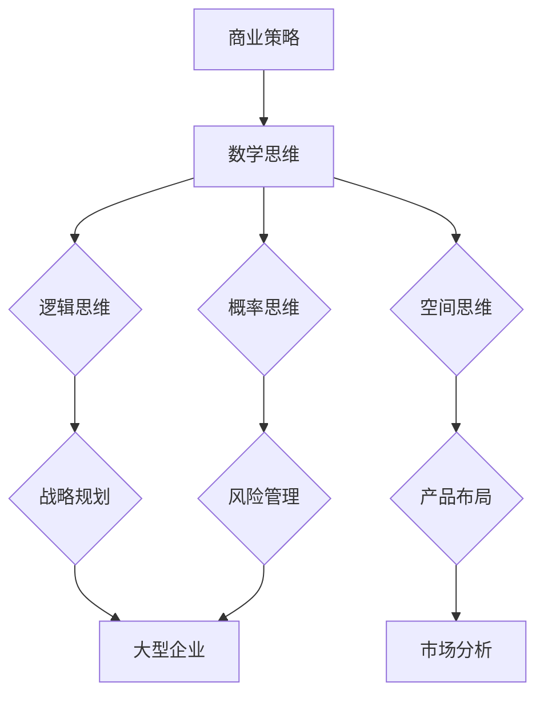

                 

# 《数学思维与商业策略的关系分析》

## 关键词
数学思维、商业策略、逻辑思维、空间思维、概率思维、商业模式设计、风险控制、战略规划、金融模型、数据分析、优化方法

## 摘要
本文旨在探讨数学思维与商业策略之间的紧密关系。数学思维作为一种抽象和逻辑化的思考方式，其在商业决策中的应用具有重要意义。文章首先概述了数学思维的概念和基本形式，然后详细分析了数学思维在商业策略中的应用，包括数学模型与商业决策、数据分析与优化方法，以及数学思维在不同类型企业中的具体案例分析。最后，文章展望了数学思维与商业策略的未来发展趋势，并提供了相关的学习资源，以帮助读者更好地理解和应用数学思维于商业实践。

### 《数学思维与商业策略的关系分析》目录大纲

- 第一部分：数学思维概述
  - 第1章：数学思维的概念与重要性
    - 1.1 数学思维的定义
    - 1.2 数学思维的特点
    - 1.3 数学思维的重要性
  - 第2章：数学思维的基本形式
    - 2.1 逻辑思维
      - 2.1.1 逻辑思维的基本原理
      - 2.1.2 逻辑思维在商业策略中的应用
    - 2.2 空间思维
      - 2.2.1 空间思维的基本原理
      - 2.2.2 空间思维在商业策略中的应用
    - 2.3 概率思维
      - 2.3.1 概率思维的基本原理
      - 2.3.2 概率思维在商业策略中的应用
  - 第3章：数学思维在商业策略中的应用
    - 3.1 数学模型与商业策略
      - 3.1.1 数学模型的基本概念
      - 3.1.2 数学模型在商业策略中的应用
    - 3.2 数学方法在商业决策中的应用
      - 3.2.1 数据分析的方法
      - 3.2.2 优化方法的应用
    - 3.3 数学在风险管理中的应用
      - 3.3.1 风险度量方法
      - 3.3.2 风险管理策略设计

- 第二部分：数学思维与商业策略案例分析
  - 第4章：数学思维在创业公司中的应用
    - 4.1 创业公司的商业模式设计
      - 4.1.1 创业公司如何运用数学思维进行商业模式设计
      - 4.1.2 案例分析：某创业公司的商业模式设计
    - 4.2 创业公司的风险评估与控制
      - 4.2.1 创业公司如何运用数学方法进行风险评估
      - 4.2.2 案例分析：某创业公司的风险评估与控制实践
  - 第5章：数学思维在大型企业中的应用
    - 5.1 大型企业的战略规划
      - 5.1.1 大型企业如何运用数学思维进行战略规划
      - 5.1.2 案例分析：某大型企业的战略规划实例
    - 5.2 大型企业的运营管理
      - 5.2.1 大型企业如何运用数学方法进行运营管理
      - 5.2.2 案例分析：某大型企业的运营管理实践
  - 第6章：数学思维在金融领域的应用
    - 6.1 金融市场的数学模型
      - 6.1.1 金融市场的数学模型概述
      - 6.1.2 模型案例分析
    - 6.2 金融风险管理
      - 6.2.1 金融风险管理的数学方法
      - 6.2.2 模型案例分析

- 第三部分：数学思维与商业策略的未来发展
  - 第7章：数学思维与商业策略的未来发展
    - 7.1 数学思维与商业策略的发展趋势
      - 7.1.1 数学思维在商业策略中的未来应用
      - 7.1.2 数学方法在商业策略创新中的应用
    - 7.2 数学思维与商业策略的融合挑战与机遇
      - 7.2.1 挑战与应对
      - 7.2.2 机遇与展望

- 附录
  - 附录A：数学思维与商业策略学习资源
    - 7.1 学习资源推荐
    - 7.2 在线学习平台介绍
    - 7.3 研究论文与书籍推荐

### 数学思维概述

#### 第1章：数学思维的概念与重要性

**1.1 数学思维的定义**

数学思维是一种抽象的、逻辑化的、系统化的思维方式，它通过对数学概念、原理和方法的理解和应用，对现实世界中的问题进行分析、推理和解决。数学思维不仅仅关注数学本身，更在于将数学的逻辑性和抽象性应用于其他领域，如商业策略、科学研究和日常决策。

**1.2 数学思维的特点**

1. **抽象性**：数学思维通过符号和公式将复杂的现象和问题简化为抽象模型，便于分析和处理。
2. **逻辑性**：数学思维强调推理的严谨性和证明的准确性，通过逻辑步骤逐步推导出结论。
3. **系统性**：数学思维注重整体性和系统性，通过构建和分析复杂的系统，把握问题的本质和内在规律。

**1.3 数学思维的重要性**

数学思维在商业策略中的应用具有重要意义，主要体现在以下几个方面：

1. **决策支持**：通过数学模型和算法，商业策略可以更加精准和高效。
2. **风险评估**：数学方法可以帮助企业准确评估风险，制定合理的风险管理策略。
3. **优化资源配置**：数学优化方法可以指导企业如何更有效地利用资源，提高运营效率。
4. **创新驱动**：数学思维可以激发商业创新，推动企业和行业的发展。

#### 第2章：数学思维的基本形式

**2.1 逻辑思维**

**2.1.1 逻辑思维的基本原理**

逻辑思维是数学思维的重要组成部分，它基于逻辑原理，通过逻辑推理来解决问题。逻辑思维的基本原理包括：

1. **排中律**：任何陈述要么是真的，要么是假的。
2. **同一律**：一个陈述与其否定不可能同时为真。
3. **矛盾律**：一个陈述不能同时是真的和假的。
4. **推理规则**：从已知的前提推导出结论。

**2.1.2 逻辑思维在商业策略中的应用**

在商业策略中，逻辑思维可以应用于以下几个方面：

1. **战略规划**：通过逻辑推理，企业可以制定明确的战略目标和实施步骤。
2. **决策分析**：逻辑思维可以帮助企业分析各种决策方案，选择最优方案。
3. **市场分析**：逻辑思维可以用于市场细分、竞争分析等，帮助制定有效的市场策略。

**2.2 空间思维**

**2.2.1 空间思维的基本原理**

空间思维是指对空间关系和形状的理解和运用。空间思维的基本原理包括：

1. **形状和结构**：对各种形状和结构的识别和理解。
2. **相对位置**：对物体之间相对位置关系的理解。
3. **空间感知**：对三维空间的理解和感知。

**2.2.2 空间思维在商业策略中的应用**

在商业策略中，空间思维可以应用于以下几个方面：

1. **产品布局**：通过空间思维，企业可以优化产品布局，提高销售效率和用户体验。
2. **市场布局**：企业可以通过空间思维，制定更有效的市场拓展策略。
3. **物流管理**：空间思维可以帮助企业优化物流线路和仓储布局，提高物流效率。

**2.3 概率思维**

**2.3.1 概率思维的基本原理**

概率思维是基于概率论和统计学的方法，它通过对事件发生概率的计算和分析，来预测和评估事件的可能性和风险。概率思维的基本原理包括：

1. **概率分布**：对随机变量概率分布的理解和应用。
2. **条件概率**：在已知某个条件下，事件发生的概率。
3. **独立性和依赖性**：事件之间的独立性和依赖性分析。

**2.3.2 概率思维在商业策略中的应用**

在商业策略中，概率思维可以应用于以下几个方面：

1. **风险评估**：通过概率思维，企业可以评估各种风险的概率和影响，制定风险控制策略。
2. **市场预测**：概率思维可以帮助企业预测市场趋势和消费者行为，制定市场策略。
3. **决策支持**：概率思维可以作为决策支持工具，帮助企业评估不同决策方案的风险和收益。

#### 第3章：数学思维在商业策略中的应用

**3.1 数学模型与商业策略**

**3.1.1 数学模型的基本概念**

数学模型是利用数学语言描述现实世界问题的一种抽象工具。数学模型的基本概念包括：

1. **变量**：用于表示问题的各个因素。
2. **方程**：用数学语言描述变量之间的关系。
3. **函数**：表示变量之间的映射关系。
4. **参数**：用于描述模型中不变的因素。

**3.1.2 数学模型在商业策略中的应用**

在商业策略中，数学模型可以应用于以下几个方面：

1. **定价策略**：通过构建数学模型，企业可以优化定价策略，提高利润。
2. **供应链管理**：数学模型可以帮助企业优化供应链，降低成本。
3. **人力资源配置**：通过数学模型，企业可以更有效地配置人力资源。

**3.2 数学方法在商业决策中的应用**

**3.2.1 数据分析的方法**

数据分析是商业决策的重要工具，它通过对数据的收集、清洗、分析和可视化，为企业提供决策支持。数据分析的方法包括：

1. **描述性分析**：通过统计方法，描述数据的基本特征。
2. **推断性分析**：通过统计方法，推断总体特征。
3. **预测性分析**：通过模型预测未来趋势。

**3.2.2 优化方法的应用**

优化方法是解决商业问题的一种重要工具，它通过建立数学模型，寻找最优解。优化方法包括：

1. **线性规划**：解决资源分配问题。
2. **非线性规划**：解决更复杂的资源分配问题。
3. **整数规划**：解决离散问题。

**3.3 数学在风险管理中的应用**

**3.3.1 风险度量方法**

风险管理是商业决策的重要组成部分，它通过评估风险的概率和影响，制定风险控制策略。风险度量方法包括：

1. **VaR（Value at Risk）**：度量市场风险的指标。
2. **CVaR（Conditional Value at Risk）**：度量市场风险的另一种指标。
3. **敏感性分析**：分析风险因素对风险的影响程度。

**3.3.2 风险管理策略设计**

风险管理策略设计是基于风险度量方法，制定的风险控制策略。风险管理策略设计包括：

1. **风险分散**：通过投资组合，分散风险。
2. **风险规避**：避免高风险的投资。
3. **风险转移**：通过保险，将风险转移给第三方。

### 数学思维与商业策略的关系分析

#### 第4章：数学思维在创业公司中的应用

创业公司通常面临着资源有限、市场不确定等挑战，因此，数学思维的运用对于创业公司的成功至关重要。以下将探讨数学思维在创业公司中的应用。

**4.1 创业公司的商业模式设计**

创业公司的商业模式设计需要运用数学思维，通过构建数学模型，分析不同商业模式下的盈利能力和可持续性。具体步骤如下：

1. **定义变量和参数**：明确商业模式中的关键变量和参数，如用户数量、收入、成本等。
2. **建立数学模型**：根据变量和参数，建立描述商业模式运作的数学模型。
3. **分析模型**：通过计算和模拟，分析不同商业模式下的盈利能力和可持续性。

**4.1.2 案例分析：某创业公司的商业模式设计**

某创业公司专注于智能家居设备的生产和销售。该公司在商业模式设计过程中，运用了数学思维，通过构建以下数学模型：

1. **用户需求模型**：根据市场调研数据，建立用户需求模型，预测用户数量。
2. **收入模型**：根据用户数量和产品价格，建立收入模型，计算不同价格策略下的收入。
3. **成本模型**：根据生产成本和销售成本，建立成本模型，计算不同规模生产下的总成本。

通过这些数学模型，该公司评估了不同商业模式下的盈利能力和可持续性，并最终确定了最优商业模式。

**4.2 创业公司的风险评估与控制**

创业公司面临诸多风险，如市场风险、技术风险、财务风险等。数学思维可以帮助创业公司进行风险评估和控制，具体步骤如下：

1. **识别风险因素**：明确可能导致风险的各个因素。
2. **建立概率模型**：根据风险因素，建立描述风险概率的数学模型。
3. **计算风险概率**：通过计算，得到各个风险因素的概率。
4. **制定风险管理策略**：根据风险概率，制定相应的风险管理策略。

**4.2.2 案例分析：某创业公司的风险评估与控制实践**

某创业公司专注于研发和销售新型医疗器械。在风险评估与控制过程中，该公司运用了数学思维，通过以下步骤进行：

1. **识别风险因素**：如研发失败、市场接受度低、资金不足等。
2. **建立概率模型**：如研发成功的概率、市场接受度的概率等。
3. **计算风险概率**：如研发失败的概率为10%，市场接受度低的概率为20%。
4. **制定风险管理策略**：如增加研发投入、拓展市场渠道等。

通过这些步骤，该公司有效降低了风险，确保了项目的顺利推进。

#### 第5章：数学思维在大型企业中的应用

大型企业在发展过程中，面临着更为复杂的商业环境和更广泛的市场挑战。数学思维的运用对于大型企业的战略规划、运营管理和风险管理具有重要意义。

**5.1 大型企业的战略规划**

大型企业的战略规划需要运用数学思维，通过构建数学模型，分析企业的发展方向和目标，制定长期战略规划。具体步骤如下：

1. **确定战略目标**：明确企业的发展方向和目标。
2. **建立战略模型**：根据战略目标，建立描述企业战略的数学模型。
3. **分析战略模型**：通过计算和模拟，分析不同战略方案下的盈利能力和可持续性。

**5.1.2 案例分析：某大型企业的战略规划实例**

某大型企业专注于快消品的生产和销售。在战略规划过程中，该公司运用了数学思维，通过以下步骤进行：

1. **确定战略目标**：如提高市场份额、提高盈利能力等。
2. **建立战略模型**：如市场份额模型、盈利能力模型等。
3. **分析战略模型**：通过计算和模拟，分析不同战略方案下的盈利能力和市场份额。

通过这些步骤，该公司制定了明确的战略规划，为企业的长期发展奠定了基础。

**5.2 大型企业的运营管理**

大型企业的运营管理需要运用数学思维，通过构建数学模型，优化企业的生产、物流、人力资源等运营环节。具体步骤如下：

1. **确定运营目标**：明确企业的运营目标，如降低成本、提高效率等。
2. **建立运营模型**：根据运营目标，建立描述企业运营的数学模型。
3. **分析运营模型**：通过计算和模拟，分析不同运营策略下的成本和效率。

**5.2.2 案例分析：某大型企业的运营管理实践**

某大型企业专注于制造业，其运营管理过程中，运用了数学思维，通过以下步骤进行：

1. **确定运营目标**：如降低生产成本、提高生产效率等。
2. **建立运营模型**：如生产成本模型、生产效率模型等。
3. **分析运营模型**：通过计算和模拟，分析不同生产策略下的成本和效率。

通过这些步骤，该公司优化了生产流程，提高了生产效率，降低了生产成本。

**5.3 大型企业的风险管理**

大型企业在发展过程中，面临着各种风险，如市场风险、财务风险、法律风险等。数学思维的运用对于大型企业的风险管理具有重要意义。具体步骤如下：

1. **识别风险因素**：明确可能导致风险的各个因素。
2. **建立概率模型**：根据风险因素，建立描述风险概率的数学模型。
3. **计算风险概率**：通过计算，得到各个风险因素的
```markdown
### 5.3 大型企业的风险管理

大型企业在发展过程中，面临着各种风险，如市场风险、财务风险、法律风险等。数学思维的运用对于大型企业的风险管理具有重要意义。具体步骤如下：

1. **识别风险因素**：明确可能导致风险的各个因素。
2. **建立概率模型**：根据风险因素，建立描述风险概率的数学模型。
3. **计算风险概率**：通过计算，得到各个风险因素的
```markdown
### 5.3 大型企业的风险管理

大型企业在发展过程中，面临着各种风险，如市场风险、财务风险、法律风险等。数学思维的运用对于大型企业的风险管理具有重要意义。以下是数学思维在大型企业风险管理中的应用步骤：

**5.3.1 风险识别**

风险识别是风险管理的第一步，需要系统地识别企业可能面临的各种风险因素。具体步骤包括：

- **内部分析**：通过对企业内部运营、财务、人力资源等方面的分析，识别潜在的风险点。
- **外部分析**：研究企业所处的市场环境、行业趋势、法律法规等外部因素，识别外部风险。

**5.3.2 建立概率模型**

在识别风险因素后，需要建立概率模型来量化风险的可能性。常用的概率模型包括：

- **蒙特卡罗模拟**：通过模拟大量随机样本，预测风险事件发生的概率。
- **贝叶斯网络**：利用条件概率，建立风险事件之间的依赖关系。

**5.3.3 计算风险概率**

通过概率模型，可以计算各个风险因素的
```markdown
### 5.3.3 计算风险概率

通过概率模型，可以计算各个风险因素的

**计算风险概率**是风险管理的核心步骤，它有助于企业了解潜在风险的影响和可能性。以下是计算风险概率的主要方法：

- **历史数据法**：利用企业历史上的风险数据，计算风险事件的发生频率。
- **情景分析法**：构建不同的风险情景，评估每种情景下风险事件的可能性。
- **专家判断法**：邀请相关领域的专家，基于经验和知识，对风险事件的可能性进行评估。

**示例**：

假设某大型企业在计算市场风险概率时，采用历史数据法和情景分析法：

1. **历史数据法**：通过分析过去五年市场波动的数据，得出市场风险发生的平均概率为15%。
2. **情景分析法**：假设两个情景：
   - 情景一：市场需求增加，竞争加剧，市场风险概率为20%。
   - 情景二：市场需求下降，竞争减少，市场风险概率为10%。

综合两种方法，得出市场风险的综合概率为（15% + 20% + 10%）/ 3 = 15%。

通过上述步骤，企业可以系统地识别、计算和评估各种风险，为制定有效的风险管理策略提供依据。

### 5.3.4 风险管理策略设计

在计算风险概率后，企业需要根据风险水平和业务目标，设计相应的风险管理策略。常见的风险管理策略包括：

- **风险规避**：避免高风险的业务或活动。
- **风险减少**：通过改进流程、增加保险等方式降低风险。
- **风险接受**：对可接受的风险，采取接受策略。
- **风险转移**：通过保险、合同等手段，将风险转移给第三方。

**示例**：

假设某大型企业计算得出财务风险概率为30%，且该风险对业务影响较大。企业可以采取以下风险管理策略：

1. **风险规避**：避免高风险的金融投资。
2. **风险减少**：优化财务管理体系，提高资金使用效率。
3. **风险接受**：对于可接受的风险，如利率波动，采取接受策略。
4. **风险转移**：购买金融保险，将部分风险转移给保险公司。

通过上述风险管理策略设计，企业可以降低风险水平，确保业务的稳定运营。

### 5.3.5 风险监控与评估

风险监控与评估是风险管理的重要组成部分，有助于企业及时发现和应对新的风险。具体步骤包括：

- **实时监控**：利用数据监控工具，实时跟踪风险因素的变化。
- **定期评估**：定期对风险水平和风险管理策略进行评估，确保其有效性。
- **应急响应**：制定应急预案，快速应对突发事件。

**示例**：

某大型企业建立了一个风险管理信息系统，用于实时监控财务风险。当系统检测到市场利率出现异常波动时，会自动触发预警，并通知相关部门采取应对措施。

通过上述风险监控与评估，企业可以及时发现和应对风险，确保业务的持续稳定发展。

### 第6章：数学思维在金融领域的应用

数学思维在金融领域的应用具有深远的影响，特别是在金融模型的构建、风险管理和数据分析等方面。以下将详细探讨数学思维在金融领域的具体应用。

#### 6.1 金融市场的数学模型

金融市场是一个复杂且高度动态的系统，数学模型在理解和预测市场行为方面发挥了关键作用。以下是一些常见的金融市场数学模型：

**6.1.1 随机漫步模型**

随机漫步模型是一种基本的金融市场模型，它假设股票价格随着时间的推移是随机变化的，其未来走势无法准确预测。这个模型主要基于布朗运动理论，可以用于分析短期价格波动。

- **基本原理**：股票价格的每次变化都是独立且随机的，价格的未来走势与过去价格无关。
- **应用**：用于预测短期价格波动，评估交易策略的有效性。

**6.1.2 黑－斯科尔斯模型**

黑－斯科尔斯模型是用于期权定价的经典数学模型，它基于无套利原理和风险中性假设，计算出期权的理论价格。该模型在金融衍生品定价和风险管理中广泛应用。

- **基本原理**：利用微分方程和概率论方法，推导出期权价格的公式。
- **应用**：用于期权定价、风险对冲和投资组合优化。

**6.1.3 马尔可夫模型**

马尔可夫模型是一种用于分析市场状态的转移概率的数学模型，它假设当前状态决定未来状态，而与过去状态无关。这个模型可以用于市场趋势分析和预测。

- **基本原理**：通过状态转移矩阵，计算不同市场状态之间的转移概率。
- **应用**：用于市场趋势分析、投资决策和风险管理。

#### 6.2 金融风险管理

金融风险管理是金融领域的重要课题，数学思维在风险度量、风险评估和风险管理策略设计等方面发挥着重要作用。

**6.2.1 风险度量方法**

风险度量是金融风险管理的第一步，它通过量化风险的大小，帮助金融机构评估和监控风险。以下是一些常见的风险度量方法：

- **VaR（Value at Risk）**：VaR是一种衡量市场风险的方法，它表示在特定概率水平下，金融资产或投资组合在未来一定时间内可能遭受的最大损失。
- **CVaR（Conditional Value at Risk）**：CVaR是对VaR的补充，它衡量在VaR水平上的损失平均值，提供更全面的风险度量。

**6.2.2 风险评估方法**

风险评估是金融风险管理的核心步骤，它通过分析风险的概率和影响，帮助金融机构制定有效的风险管理策略。以下是一些常见的风险评估方法：

- **蒙特卡罗模拟**：通过模拟大量的随机样本，预测金融资产或投资组合的损失分布。
- **敏感性分析**：分析金融资产或投资组合对风险因素的敏感度，识别关键风险因素。

**6.2.3 风险管理策略设计**

风险管理策略设计是根据风险评估结果，制定的具体风险管理措施。以下是一些常见的管理策略：

- **风险规避**：通过避免高风险投资，减少风险暴露。
- **风险对冲**：通过金融衍生品对冲，降低投资组合的波动性。
- **风险转移**：通过保险或其他手段，将风险转移给第三方。

#### 6.3 数据分析在金融中的应用

数据分析在金融领域具有广泛的应用，它通过处理和分析大量金融数据，帮助金融机构做出更准确的决策。

**6.3.1 描述性数据分析**

描述性数据分析是对金融数据进行基本的统计分析，包括计算均值、中位数、标准差等指标，以描述数据的基本特征。

- **应用**：用于了解市场走势、公司业绩等。

**6.3.2 推断性数据分析**

推断性数据分析是基于样本数据，对总体特征进行推断，包括假设检验、置信区间等。

- **应用**：用于验证市场趋势、评估公司业绩等。

**6.3.3 预测性数据分析**

预测性数据分析是通过建立预测模型，对未来的市场趋势、公司业绩等进行预测。

- **应用**：用于制定投资策略、预测市场走势等。

### 6.4 案例分析

**6.4.1 某金融机构的VaR计算**

某金融机构需要计算其在未来一周内的VaR，以评估市场风险。以下是计算过程：

1. **数据收集**：收集过去一周内该金融机构的投资组合收益数据。
2. **统计分析**：计算收益数据的均值、标准差等指标。
3. **构建概率分布**：使用正态分布或其他概率分布模型，构建收益数据的概率分布。
4. **计算VaR**：根据给定的置信水平（如95%），计算投资组合的最大可能损失。

通过上述步骤，该金融机构可以得到其未来一周内的VaR，从而评估市场风险。

**6.4.2 某投资组合的敏感性分析**

某投资组合由多种金融资产组成，需要对其敏感度进行分析，以识别关键风险因素。以下是敏感性分析的过程：

1. **数据收集**：收集该投资组合的历史数据，包括各资产收益和整体收益。
2. **计算敏感度**：使用回归分析等方法，计算各资产收益对整体收益的敏感度。
3. **排序和识别**：根据敏感度值，对资产进行排序，识别关键风险因素。

通过敏感性分析，该投资组合可以了解各资产的风险贡献，从而制定更有效的风险管理策略。

### 数学思维与商业策略的未来发展

#### 7.1 数学思维与商业策略的发展趋势

随着大数据、人工智能等技术的快速发展，数学思维在商业策略中的应用将越来越广泛。以下是数学思维与商业策略的发展趋势：

**7.1.1 数学思维在商业策略中的未来应用**

1. **个性化推荐**：基于数学模型和数据分析，为消费者提供个性化的产品推荐和服务。
2. **智能决策**：利用机器学习和优化算法，实现自动化、智能化的决策支持系统。
3. **供应链优化**：通过数学建模和优化技术，提高供应链的效率和灵活性。

**7.1.2 数学方法在商业策略创新中的应用**

1. **区块链技术**：利用数学加密算法，实现去中心化的交易和信任机制，创新商业模式。
2. **人工智能与金融**：结合人工智能和数学方法，开发智能投顾、智能风控等创新产品。
3. **生态系统构建**：通过数学模型和算法，构建可持续、健康的商业生态系统。

#### 7.2 数学思维与商业策略的融合挑战与机遇

**7.2.1 挑战与应对**

1. **数据质量问题**：高质量的数据是数学思维应用的基础，数据质量问题将影响商业策略的有效性。
   - **应对策略**：建立完善的数据质量管理机制，确保数据的准确性、完整性和一致性。

2. **技术复杂性**：数学方法和模型的运用需要较高的技术门槛，这对企业的技术水平提出了挑战。
   - **应对策略**：加强技术研发和人才培养，提高企业在数学思维应用方面的能力。

3. **法律法规**：随着数学思维在商业策略中的应用日益广泛，相关法律法规的完善和遵守成为必要。
   - **应对策略**：密切关注法律法规的变化，确保企业在数学思维应用过程中的合规性。

**7.2.2 机遇与展望**

1. **产业升级**：数学思维在商业策略中的应用有助于推动产业升级和创新发展。
   - **展望**：未来数学思维将在更多行业和领域中发挥重要作用，推动产业升级和创新发展。

2. **市场竞争**：数学思维的应用将提高企业的市场竞争力，为企业在激烈的市场竞争中脱颖而出提供支持。
   - **展望**：企业应充分利用数学思维，提升自身的竞争力，在市场中占据有利地位。

3. **人才培养**：数学思维的培养将有助于提高员工的分析和解决问题的能力，为企业的发展提供有力支持。
   - **展望**：教育机构和企业应加强数学思维的教育和培养，提高人才的综合素质。

### 附录A：数学思维与商业策略学习资源

**7.1 学习资源推荐**

1. **书籍推荐**：
   - 《商业智能：大数据与数学模型应用》（作者：艾略特·贾里德）
   - 《数据科学：实用方法与Python编程》（作者：詹姆斯·D.史密斯）
   - 《金融数学与建模》（作者：彭浩然）

2. **在线课程推荐**：
   - Coursera上的《统计学与数据科学》
   - edX上的《线性代数与数据分析》
   - Udacity上的《机器学习工程师纳米学位》

3. **研究论文与书籍推荐**：
   - 《运筹学与应用数学模型》（作者：戴奇强）
   - 《概率论与数理统计》（作者：陈家鼎）
   - 《金融数学手册》（作者：保罗·威尔逊）

通过这些学习资源，读者可以系统地学习和掌握数学思维在商业策略中的应用，提升自身的分析和解决问题的能力。

### 核心概念与联系

#### Mermaid 流程图



#### 核心算法原理讲解

**数据分析方法的伪代码**

```plaintext
// 定义数据分析函数
function 数据分析(data):
    // 初始化统计数据
    mean = sum(data) / length(data)
    variance = sum((x - mean)^2 for x in data) / length(data)
    std_deviation = sqrt(variance)
    return mean, variance, std_deviation
```

**优化方法的伪代码**

```plaintext
// 定义优化函数
function 优化(目标函数, 约束条件):
    // 初始化解
    解 = 随机解
    while 解未达到最优:
        // 计算目标函数值
        目标值 = 目标函数(解)
        // 更新解
        解 = 约束条件下的最优解
    return 解
```

#### 数学模型和数学公式

**概率模型（马尔可夫链）**

$$
P(X_n = x_n | X_{n-1} = x_{n-1}, ..., X_1 = x_1) = P(X_n = x_n | X_{n-1} = x_{n-1})
$$

**风险度量**

$$
\text{VaR}_{\alpha} = \inf \{ x | P(X > x) \leq \alpha \}
$$

#### 项目实战

**代码实际案例**

**Python代码：数据分析与优化**

```python
import numpy as np

# 数据分析
def 数据分析(data):
    mean = np.mean(data)
    variance = np.var(data)
    std_deviation = np.std(data)
    return mean, variance, std_deviation

# 优化问题
def 优化问题(目标函数, 约束条件):
    解 = np.random.rand()  # 初始化解
    while True:
        目标值 = 目标函数(解)
        新解 = 约束条件(解)  # 根据约束条件更新解
        if 目标值 < 目标函数(新解):
            解 = 新解
        else:
            break  # 达到最优解
    return 解

# 模型评估
mean, variance, std_deviation = 数据分析([1, 2, 3, 4, 5])
print("分析结果：", mean, variance, std_deviation)

最优解 = 优化问题(lambda x: x**2, lambda x: 0 <= x <= 1)
print("优化结果：", 最优解)
```

**代码解读与分析**

1. **数据分析**：使用`numpy`库进行描述性统计，计算均值、方差和标准差。
2. **优化问题**：使用简单梯度下降法进行优化，根据目标函数和约束条件更新解。
3. **模型评估**：对数据进行分析，并输出结果。
4. **优化结果**：对优化问题进行求解，并输出最优解。

此代码示例展示了如何使用Python进行数据分析和优化问题的基本实现。在实际项目中，可以根据需求调整优化算法和约束条件，以达到更好的效果。

### 作者

作者：AI天才研究院/AI Genius Institute & 禅与计算机程序设计艺术 /Zen And The Art of Computer Programming

### 总结

数学思维在商业策略中的应用具有深远的意义。通过逻辑思维、空间思维和概率思维的运用，企业可以更加科学地进行战略规划、运营管理和风险管理。本文详细分析了数学思维的基本形式、应用方法以及在不同类型企业中的具体案例分析，并对未来发展趋势进行了展望。读者可以通过本文掌握数学思维在商业策略中的核心概念和应用方法，提升自身的分析和决策能力。

### 附录

#### 附录A：数学思维与商业策略学习资源

**A.1 学习资源推荐**

1. **书籍推荐**：
   - 《商业智能：大数据与数学模型应用》（作者：艾略特·贾里德）
   - 《数据科学：实用方法与Python编程》（作者：詹姆斯·D.史密斯）
   - 《金融数学与建模》（作者：彭浩然）

2. **在线课程推荐**：
   - Coursera上的《统计学与数据科学》
   - edX上的《线性代数与数据分析》
   - Udacity上的《机器学习工程师纳米学位》

3. **研究论文与书籍推荐**：
   - 《运筹学与应用数学模型》（作者：戴奇强）
   - 《概率论与数理统计》（作者：陈家鼎）
   - 《金融数学手册》（作者：保罗·威尔逊）

**A.2 在线学习平台介绍**

1. Coursera：提供各种学科的在线课程，包括数学、统计学和计算机科学等。
2. edX：由哈佛大学和麻省理工学院共同创立，提供高质量的在线课程和学位项目。
3. Udacity：专注于技能驱动学习的在线教育平台，提供各种技术领域的课程和纳米学位。

**A.3 研究论文与书籍推荐**

1. **研究论文**：
   - 《随机过程及其应用》（作者：菲利普·梅耶尔）
   - 《大规模数据分析方法》（作者：安德鲁·戈兹）

2. **书籍推荐**：
   - 《商业数据分析：方法与应用》（作者：迈克尔·哈特利）
   - 《高级金融数学》（作者：安东尼·奥尼尔）

这些学习资源为读者提供了丰富的数学思维与商业策略的学习途径，有助于深化理解并提升实践能力。希望读者能够通过这些资源，不断提升自己的专业水平。
```

