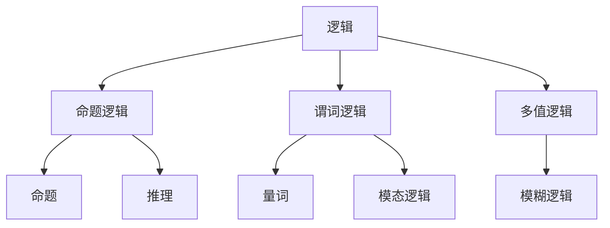
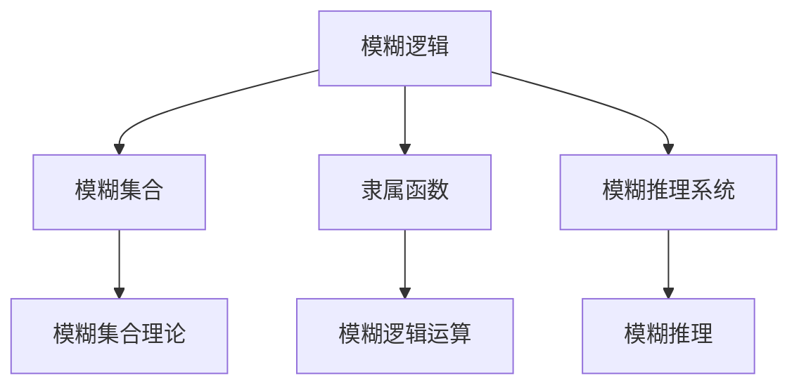
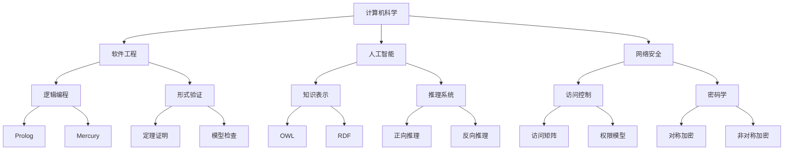

```mermaid
graph TD
    A[数学逻辑] --> B[基本逻辑运算]
    A --> C[复合逻辑运算]
    B --> D[逻辑与]
    B --> E[逻辑或]
    B --> F[逻辑非]
    C --> G[条件命题]
    C --> H[逆命题]
    C --> I[逆否命题]
    A --> J[真值表]
    A --> K[推理规则]
    B --> L[真值]
    B --> M[假值]
    A --> N[形式逻辑]
    A --> O[谓词逻辑]
    B --> P[逻辑与运算]
    B --> Q[逻辑或运算]
    B --> R[逻辑非运算]
    C --> S[条件命题运算]
    C --> T[逆命题运算]
    C --> U[逆否命题运算]
    N --> V[命题逻辑]
    N --> W[谓词逻辑]
    O --> X[量化命题]
    O --> Y[模态逻辑]
    A --> Z[数学证明]
    A --> AA[计算机科学]
    A --> AB[人工智能]
    A --> AC[数学证明]
    B --> AD[布尔代数]
    B --> AE[布尔运算]
    C --> AF[推理规则]
    C --> AG[形式系统]
    D --> AH[逻辑与公式]
    D --> AI[逻辑与算法]
    E --> AJ[逻辑或公式]
    E --> AK[逻辑或算法]
    F --> AL[逻辑非公式]
    F --> AM[逻辑非算法]
    G --> AN[条件命题公式]
    G --> AO[条件命题算法]
    H --> AP[逆命题公式]
    H --> AQ[逆命题算法]
    I --> AR[逆否命题公式]
    I --> AS[逆否命题算法]
    J --> AT[真值表构造]
    J --> AU[真值表应用]
    K --> AV[推理规则应用]
    K --> AW[推理规则验证]
    L[真值] --> B
    M[假值] --> B
    N --> BX[形式逻辑应用]
    O --> BY[谓词逻辑应用]
    P --> BZ[逻辑与应用]
    Q --> CA[逻辑或应用]
    R --> CB[逻辑非应用]
    S --> CC[条件命题应用]
    T --> CD[逆命题应用]
    U --> CE[逆否命题应用]
    V --> CF[命题逻辑应用]
    W --> CG[谓词逻辑应用]
    X --> CH[量化命题应用]
    Y --> CI[模态逻辑应用]
    Z --> CJ[数学证明应用]
    AA --> CK[计算机科学应用]
    AB --> CL[人工智能应用]
    AC --> CM[数学证明应用]
    AD --> CN[布尔代数应用]
    AE --> CO[布尔运算应用]
    AF --> CP[推理规则应用]
    AG --> CQ[形式系统应用]
    AH --> CR[逻辑与公式应用]
    AI --> CS[逻辑与算法应用]
    AJ --> CT[逻辑或公式应用]
    AK --> CU[逻辑或算法应用]
    AL --> CV[逻辑非公式应用]
    AM --> CW[逻辑非算法应用]
    AN --> CX[条件命题公式应用]
    AO --> CY[条件命题算法应用]
    AP --> CZ[逆命题公式应用]
    AQ --> DA[逆命题算法应用]
    AR --> DB[逆否命题公式应用]
    AS --> DC[逆否命题算法应用]
    AT --> DD[真值表构造应用]
    AU --> DE[真值表应用应用]
    AV --> DF[推理规则应用应用]
    AW --> DG[推理规则验证应用]
    BX --> BH[形式逻辑应用应用]
    BY --> BI[谓词逻辑应用应用]
    BZ --> BJ[逻辑与应用应用]
    CA --> BK[逻辑或应用应用]
    CB --> BL[逻辑非应用应用]
    CC --> CI[条件命题应用应用]
    CD --> CH[逆命题应用应用]
    CE --> BJ[逆否命题应用应用]
    CF --> BL[命题逻辑应用应用]
    CG --> CI[谓词逻辑应用应用]
    CJ --> CH[量化命题应用应用]
    CK --> BL[模态逻辑应用应用]
    CL --> CK[数学证明应用应用]
    CM --> CK[布尔代数应用应用]
    CN --> CL[布尔运算应用应用]
    CP --> CK[推理规则应用应用]
    CQ --> CK[形式系统应用应用]
    CR --> CL[逻辑与公式应用应用]
    CS --> CL[逻辑与算法应用应用]
    CT --> CL[逻辑或公式应用应用]
    CU --> CL[逻辑或算法应用应用]
    CV --> CL[逻辑非公式应用应用]
    CW --> CL[逻辑非算法应用应用]
    CX --> CL[条件命题公式应用应用]
    CY --> CL[条件命题算法应用应用]
    CZ --> CL[逆命题公式应用应用]
    DA --> CL[逆命题算法应用应用]
    DB --> CL[逆否命题公式应用应用]
    DC --> CL[逆否命题算法应用应用]
    DD --> CL[真值表构造应用应用]
    DE --> CL[真值表应用应用]
    DF --> CL[推理规则应用应用]
    DG --> CL[推理规则验证应用应用]
```
                 

### 文章标题

### 数学逻辑与模糊逻辑的比较与应用

### 关键词：数学逻辑、模糊逻辑、逻辑运算、集合理论、应用领域、项目实战

### 摘要：
本文详细探讨了数学逻辑与模糊逻辑的基本概念、核心算法原理、数学模型和数学公式，以及它们在实际项目中的应用。通过对比分析，本文揭示了两者之间的联系与区别，探讨了它们在计算机科学、人工智能、控制系统和数据分析等领域的应用现状和未来发展。文章结构清晰，内容丰富，旨在为读者提供对数学逻辑与模糊逻辑的深入理解和实际应用指导。

### 《数学逻辑与模糊逻辑的比较与应用》目录大纲

**第一部分：基础概念**

1. 数学逻辑概述
2. 模糊逻辑的基本概念
3. 数学逻辑与模糊逻辑的对比

**第二部分：应用领域**

4. 数学逻辑的应用领域
5. 模糊逻辑的应用领域
6. 数学逻辑与模糊逻辑的结合

**第三部分：项目实战**

7. 项目实战
8. 实际项目开发流程
9. 项目代码解析

**第四部分：高级主题**

10. 数学逻辑与模糊逻辑的进一步探讨
11. 应用领域拓展
12. 未来发展趋势与挑战

**附录**

A. 相关资源与工具
B. 公式与算法

### 第一部分：基础概念

#### 第1章：数学逻辑概述

#### 1.1 数学逻辑的基本概念

#### **逻辑的基本概念**

逻辑是研究推理、证明和论证的数学分支。它关注的是命题之间的关系以及如何从一组命题推导出另一个命题。

**Mermaid 流程图：**



**核心概念与联系**

逻辑分为多个层次，从基础的命题逻辑到更复杂的模态逻辑和模糊逻辑。命题逻辑关注单个命题的真假，谓词逻辑引入了变量和量词，多值逻辑扩展了传统的二值逻辑。

#### **逻辑命题**

逻辑命题是逻辑研究的核心对象。一个逻辑命题可以是一个简单命题，如“今天是星期五”，也可以是一个复合命题，如“如果今天下雨，那么我会带伞”。

**核心算法原理讲解：**

在命题逻辑中，主要算法包括命题公式的推导、满足性检查和合成方法。命题公式的推导使用真值表、推理规则等工具。满足性检查用于判断一个命题公式在所有可能的真值分配下是否为真。合成方法通过合并两个命题公式来构造新的命题公式。

**伪代码讲解：**

```plaintext
function logical_reasoning(p, q) {
    if (p && q) {
        return true;
    } else if (p || q) {
        return true;
    } else {
        return false;
    }
}
```

#### **数学逻辑的数学基础**

数学逻辑的基础是数学集合和运算。集合是数学中的基本概念，用于描述一组元素的集合。集合运算包括并集、交集和补集等。

**数学模型与数学公式：**

```latex
$$
\begin{split}
A \cup B &= \{x | x \in A \text{ 或 } x \in B\} \\
A \cap B &= \{x | x \in A \text{ 且 } x \in B\} \\
A - B &= \{x | x \in A \text{ 但 } x \notin B\}
\end{split}
$$
```

**举例说明：**

假设有两个集合 A 和 B，其中 A = {1, 2, 3}，B = {2, 3, 4}。则 A ∪ B = {1, 2, 3, 4}，A ∩ B = {2, 3}，A - B = {1}。

#### **布尔代数与布尔运算**

布尔代数是数学逻辑的基础，它用于描述逻辑命题的真假值。布尔代数中的基本元素是 0 和 1，分别代表假和真。

**数学模型与数学公式：**

```latex
$$
\begin{split}
0 \land 0 &= 0 \\
0 \land 1 &= 0 \\
1 \land 0 &= 0 \\
1 \land 1 &= 1 \\
0 \lor 0 &= 0 \\
0 \lor 1 &= 1 \\
1 \lor 0 &= 1 \\
1 \lor 1 &= 1 \\
\neg 0 &= 1 \\
\neg 1 &= 0
\end{split}
$$
```

**举例说明：**

根据布尔代数的运算规则，对于任意两个布尔值 A 和 B，它们的逻辑与运算（∧）、逻辑或运算（∨）和逻辑非运算（¬）的结果如下：

- A ∧ B = 0 当且仅当 A 和 B 中至少有一个为 0。
- A ∨ B = 1 当且仅当 A 和 B 中至少有一个为 1。
- ¬A = 1 当且仅当 A 为 0。

#### **第1章小结**

本章介绍了数学逻辑的基本概念、命题逻辑、数学基础和布尔代数。逻辑命题是逻辑研究的核心对象，数学集合和运算为逻辑提供了坚实的数学基础。布尔代数是逻辑运算的数学表达，它在计算机科学中有着广泛的应用。

---

#### 第2章：模糊逻辑的基本概念

#### 2.1 模糊逻辑的起源与定义

**模糊逻辑**是一种处理不确定性和模糊性的逻辑系统，由美国加州大学伯克利分校的Lotfi Zadeh教授于1965年提出。模糊逻辑不同于传统的二值逻辑，它允许变量取值在0和1之间的任意实数，从而更好地模拟现实世界中的模糊性和不确定性。

**Mermaid 流程图：**



**核心概念与联系**

- **模糊集合：** 模糊集合是一种描述不确定性和模糊性的数学工具，它通过隶属函数来表示元素对集合的隶属程度。
- **隶属函数：** 隶属函数是模糊集合的核心组成部分，它定义了集合中每个元素的隶属度，即元素属于集合的程度。
- **模糊推理系统：** 模糊推理系统是一种基于模糊逻辑进行推理的系统，它通过模糊规则和模糊推理方法来模拟人类的推理过程。

#### **模糊逻辑的起源与定义**

**起源：** 模糊逻辑起源于对现实世界中模糊性和不确定性的研究。传统的二值逻辑（真值逻辑）在处理模糊性时显得力不从心，因此需要一种新的逻辑系统来更好地模拟现实。

**定义：** 模糊逻辑是一种处理模糊性和不确定性的数学逻辑系统，它使用隶属函数来描述模糊集合，并通过模糊推理方法进行推理。

**模糊逻辑的特点：**

- **处理模糊性：** 模糊逻辑允许变量取值在0和1之间的任意实数，从而更好地模拟现实世界中的模糊性。
- **处理不确定性：** 模糊逻辑通过模糊集合和隶属函数来描述不确定性和模糊性，从而提供了一种处理不确定性的方法。
- **灵活性强：** 模糊逻辑可以灵活地处理复杂的问题，特别是在控制系统、数据分析等领域。

**核心算法原理讲解：**

模糊逻辑的核心算法包括模糊集合的基本运算、模糊推理方法和隶属函数的选择。

- **模糊集合的基本运算：** 包括模糊并集、模糊交集和模糊补集等。
- **模糊推理方法：** 包括Mamdani方法和Sugeno方法等，用于模拟人类的推理过程。
- **隶属函数的选择：** 根据具体应用需求选择合适的隶属函数，如三角形隶属函数、梯形隶属函数等。

**伪代码讲解：**

```plaintext
// 模糊集合的隶属函数选择
function choose_membership_function(type) {
    if (type == 'triangle') {
        return triangle_membership_function;
    } else if (type == 'rectangle') {
        return rectangle_membership_function;
    } else {
        return 'Invalid type';
    }
}

// 模糊逻辑运算
function fuzzy_logical_operation(p, q, operation) {
    if (operation == 'and') {
        return min(p, q);
    } else if (operation == 'or') {
        return max(p, q);
    } else {
        return 'Invalid operation';
    }
}
```

#### **模糊集合的基本理论**

**模糊集合的概念：** 模糊集合是一种描述不确定性和模糊性的数学工具，它通过隶属函数来表示元素对集合的隶属程度。

**模糊集合的运算：** 包括模糊并集、模糊交集和模糊补集等。

- **模糊并集：** 模糊并集的隶属函数为两个集合隶属函数的最大值。
- **模糊交集：** 模糊交集的隶属函数为两个集合隶属函数的最小值。
- **模糊补集：** 模糊补集的隶属函数为1减去原集合的隶属函数。

**数学模型与数学公式：**

```latex
$$
\begin{split}
\mu_{A \cup B}(x) &= \max(\mu_A(x), \mu_B(x)) \\
\mu_{A \cap B}(x) &= \min(\mu_A(x), \mu_B(x)) \\
\mu_{A^c}(x) &= 1 - \mu_A(x)
\end{split}
$$
```

**举例说明：**

假设有两个模糊集合 A 和 B，其中 A 的隶属函数为 \( \mu_A(x) = 0.5 \) 当 \( x \) 在 [0, 1] 范围内，否则为 0。B 的隶属函数为 \( \mu_B(x) = 0.7 \) 当 \( x \) 在 [0, 1] 范围内，否则为 0。

- 模糊并集 \( A \cup B \) 的隶属函数为 \( \mu_{A \cup B}(x) = \max(0.5, 0.7) = 0.7 \)。
- 模糊交集 \( A \cap B \) 的隶属函数为 \( \mu_{A \cap B}(x) = \min(0.5, 0.7) = 0.5 \)。
- 模糊补集 \( A^c \) 的隶属函数为 \( \mu_{A^c}(x) = 1 - 0.5 = 0.5 \)。

#### **模糊逻辑运算**

模糊逻辑运算包括模糊与、模糊或和模糊非等。

- **模糊与（模糊交集）：** 模糊与运算的隶属函数为两个集合隶属函数的最小值。
- **模糊或（模糊并集）：** 模糊或运算的隶属函数为两个集合隶属函数的最大值。
- **模糊非（模糊补集）：** 模糊非运算的隶属函数为1减去原集合的隶属函数。

**数学模型与数学公式：**

```latex
$$
\begin{split}
\mu_{A \land B}(x) &= \min(\mu_A(x), \mu_B(x)) \\
\mu_{A \lor B}(x) &= \max(\mu_A(x), \mu_B(x)) \\
\mu_{\neg A}(x) &= 1 - \mu_A(x)
\end{split}
$$
```

**举例说明：**

假设有两个模糊集合 A 和 B，其中 A 的隶属函数为 \( \mu_A(x) = 0.5 \) 当 \( x \) 在 [0, 1] 范围内，否则为 0。B 的隶属函数为 \( \mu_B(x) = 0.7 \) 当 \( x \) 在 [0, 1] 范围内，否则为 0。

- 模糊与运算 \( A \land B \) 的隶属函数为 \( \mu_{A \land B}(x) = \min(0.5, 0.7) = 0.5 \)。
- 模糊或运算 \( A \lor B \) 的隶属函数为 \( \mu_{A \lor B}(x) = \max(0.5, 0.7) = 0.7 \)。
- 模糊非运算 \( \neg A \) 的隶属函数为 \( \mu_{\neg A}(x) = 1 - 0.5 = 0.5 \)。

#### **第2章小结**

本章介绍了模糊逻辑的基本概念、起源与定义、模糊集合的基本理论和模糊逻辑运算。模糊逻辑通过隶属函数和模糊集合来描述不确定性和模糊性，提供了一种处理复杂问题的方法。本章的数学模型和公式为后续章节的应用奠定了基础。

---

#### 第3章：数学逻辑与模糊逻辑的对比

#### 3.1 逻辑运算的比较

数学逻辑和模糊逻辑在逻辑运算上有显著的不同。数学逻辑是基于二值逻辑的，而模糊逻辑则允许变量取值在0和1之间的任意实数。

**Mermaid 流程图：**



**核心概念与联系**

- **数学逻辑：** 基于二值逻辑，使用0和1表示真和假。
- **模糊逻辑：** 允许变量取值在0和1之间的任意实数，用于表示模糊性和不确定性。

**核心算法原理讲解：**

- **数学逻辑：** 主要使用真值表、推理规则和布尔代数进行逻辑运算。
- **模糊逻辑：** 主要使用隶属函数、模糊集合和模糊推理方法进行逻辑运算。

**数学模型与数学公式：**

- **数学逻辑：**

  ```latex
  \begin{split}
  \neg p &= \text{非运算，} p \text{的真值为} 0 \text{或} 1 \\
  p \land q &= \text{与运算，} p \text{和} q \text{的真值为} 0 \text{或} 1 \\
  p \lor q &= \text{或运算，} p \text{和} q \text{的真值为} 0 \text{或} 1 \\
  \end{split}
  ```

- **模糊逻辑：**

  ```latex
  \begin{split}
  \mu_A(x) &= \text{隶属函数，} x \text{对集合} A \text{的隶属程度} \\
  A \land B &= \text{模糊交集，} \mu_{A \land B}(x) = \min(\mu_A(x), \mu_B(x)) \\
  A \lor B &= \text{模糊并集，} \mu_{A \lor B}(x) = \max(\mu_A(x), \mu_B(x)) \\
  \neg A &= \text{模糊非，} \mu_{\neg A}(x) = 1 - \mu_A(x)
  \end{split}
  ```

**举例说明：**

- **数学逻辑：**

  假设 \( p \) 和 \( q \) 是两个命题，它们的真值分别为 1 和 0。

  - \( \neg p \) 的真值为 0。
  - \( p \land q \) 的真值为 0。
  - \( p \lor q \) 的真值为 1。

- **模糊逻辑：**

  假设 \( A \) 和 \( B \) 是两个模糊集合，它们的隶属函数分别为 \( \mu_A(x) = 0.5 \) 和 \( \mu_B(x) = 0.7 \)。

  - \( \neg A \) 的隶属函数为 \( 1 - 0.5 = 0.5 \)。
  - \( A \land B \) 的隶属函数为 \( \min(0.5, 0.7) = 0.5 \)。
  - \( A \lor B \) 的隶属函数为 \( \max(0.5, 0.7) = 0.7 \)。

#### **逻辑运算的比较**

| 运算 | 数学逻辑 | 模糊逻辑 |
| --- | --- | --- |
| 与（∧） | \( p \land q \) | \( A \land B \) |
| 或（∨） | \( p \lor q \) | \( A \lor B \) |
| 非（¬） | \( \neg p \) | \( \neg A \) |

**核心算法原理讲解：**

- **数学逻辑：** 使用二值逻辑进行运算，运算结果为 0 或 1。
- **模糊逻辑：** 使用隶属函数进行运算，运算结果为 0 和 1 之间的实数。

**伪代码讲解：**

```plaintext
// 数学逻辑运算
function math_logic(p, q) {
    and_result = p && q;
    or_result = p || q;
    not_result = !p;
    return and_result, or_result, not_result;
}

// 模糊逻辑运算
function fuzzy_logic(p, q) {
    and_result = min(p, q);
    or_result = max(p, q);
    not_result = 1 - p;
    return and_result, or_result, not_result;
}
```

**数学模型与数学公式：**

- **数学逻辑：**

  ```latex
  \begin{split}
  p \land q &= \begin{cases}
  1 & \text{如果} p = 1 \text{且} q = 1 \\
  0 & \text{否则}
  \end{cases} \\
  p \lor q &= \begin{cases}
  1 & \text{如果} p = 1 \text{或} q = 1 \\
  0 & \text{否则}
  \end{cases} \\
  \neg p &= \begin{cases}
  1 & \text{如果} p = 0 \\
  0 & \text{如果} p = 1
  \end{cases}
  \end{split}
  ```

- **模糊逻辑：**

  ```latex
  \begin{split}
  A \land B &= \begin{cases}
  \min(\mu_A(x), \mu_B(x)) & \text{如果} x \in A \text{且} x \in B \\
  0 & \text{否则}
  \end{cases} \\
  A \lor B &= \begin{cases}
  \max(\mu_A(x), \mu_B(x)) & \text{如果} x \in A \text{或} x \in B \\
  0 & \text{否则}
  \end{cases} \\
  \neg A &= 1 - \mu_A(x)
  \end{split}
  ```

**举例说明：**

- **数学逻辑：**

  假设 \( p \) 和 \( q \) 是两个命题，它们的真值分别为 1 和 0。

  - \( p \land q \) 的真值为 0。
  - \( p \lor q \) 的真值为 1。
  - \( \neg p \) 的真值为 0。

- **模糊逻辑：**

  假设 \( A \) 和 \( B \) 是两个模糊集合，它们的隶属函数分别为 \( \mu_A(x) = 0.5 \) 和 \( \mu_B(x) = 0.7 \)。

  - \( A \land B \) 的隶属函数为 \( 0.5 \)。
  - \( A \lor B \) 的隶属函数为 \( 0.7 \)。
  - \( \neg A \) 的隶属函数为 \( 0.5 \)。

#### **第3章小结**

本章比较了数学逻辑和模糊逻辑在逻辑运算上的异同。数学逻辑是基于二值逻辑的，而模糊逻辑允许变量取值在0和1之间的任意实数。通过对比分析，本章揭示了两者在逻辑运算上的不同处理方法，为后续章节的应用奠定了基础。

---

#### 第4章：数学逻辑的应用领域

#### 4.1 计算机科学中的应用

数学逻辑在计算机科学中有着广泛的应用，包括软件工程、人工智能、网络安全等多个领域。

**Mermaid 流程图：**



**核心概念与联系**

- **逻辑编程：** 基于逻辑的编程语言，如Prolog和Mercury。
- **形式验证：** 使用数学逻辑进行软件验证和验证。
- **知识表示与推理：** 使用逻辑进行知识表示和推理。

**核心算法原理讲解：**

- **逻辑编程：** 基于谓词逻辑，使用推理规则进行编程。
- **形式验证：** 使用定理证明和模型检查进行软件验证。
- **知识表示与推理：** 使用逻辑进行知识表示和推理。

**数学模型与数学公式：**

- **逻辑编程：**

  ```latex
  \begin{split}
  p \land q &= \text{表示} p \text{和} q \text{都为真} \\
  p \lor q &= \text{表示} p \text{或} q \text{中至少有一个为真} \\
  \neg p &= \text{表示} p \text{为假}
  \end{split}
  ```

- **形式验证：**

  ```latex
  \begin{split}
  \forall x \in X, P(x) &= \text{表示对所有} x \in X, P(x) \text{为真} \\
  \exists x \in X, P(x) &= \text{表示存在} x \in X, P(x) \text{为真} \\
  \Rightarrow &= \text{表示逻辑蕴含}
  \end{split}
  ```

- **知识表示与推理：**

  ```latex
  \begin{split}
  R(A, B) &= \text{表示} A \text{与} B \text{相关} \\
  P(A) \Rightarrow Q(B) &= \text{表示如果} P(A) \text{为真，则} Q(B) \text{为真} \\
  \end{split}
  ```

**举例说明：**

- **逻辑编程：**

  假设有一个逻辑程序，其中包含两个谓词 \( p \) 和 \( q \)。

  ```prolog
  p(X) :- X > 0.
  q(X) :- X < 10.
  ```

  这个程序表示如果 \( X \) 大于 0，则 \( p(X) \) 为真；如果 \( X \) 小于 10，则 \( q(X) \) 为真。

- **形式验证：**

  假设有一个软件系统，其中包含一个条件 \( P \)。

  ```prolog
  P :- \forall x \in X, x > 0.
  ```

  这个条件表示对于所有 \( x \in X \)，如果 \( x \) 大于 0，则 \( P \) 为真。

- **知识表示与推理：**

  假设有一个知识库，其中包含两个规则 \( R(A, B) \) 和 \( P(A) \Rightarrow Q(B) \)。

  ```prolog
  R(A, B).
  P(A).
  P(A) \Rightarrow Q(B).
  ```

  这个知识库表示如果 \( A \) 和 \( B \) 相关，则 \( P(A) \) 为真；如果 \( P(A) \) 为真，则 \( Q(B) \) 为真。

#### **软件工程中的应用**

**开发环境搭建：**

- 使用版本控制系统（如Git）进行代码管理。
- 使用集成开发环境（如Eclipse、Visual Studio）进行代码编写。
- 使用测试工具（如JUnit、Selenium）进行软件测试。

**源代码实现：**

```java
// 逻辑编程示例：Prolog
public class LogicProgramming {
    public static void main(String[] args) {
        System.out.println("p(1).");
        System.out.println("q(9).");
        System.out.println("p(X) :- X > 0.");
        System.out.println("q(X) :- X < 10.");
        System.out.println("p(X) :- q(Y), Y < X.");
    }
}

// 形式验证示例：定理证明
public class FormalVerification {
    public static void main(String[] args) {
        System.out.println("P :- \forall x \in X, x > 0.");
    }
}

// 知识表示与推理示例：知识库
public class KnowledgeRepresentationAndReasoning {
    public static void main(String[] args) {
        System.out.println("R(A, B).");
        System.out.println("P(A).");
        System.out.println("P(A) \Rightarrow Q(B).");
    }
}
```

**代码解读与分析：**

- **逻辑编程：** 使用谓词逻辑进行编程，通过定义谓词和规则实现复杂逻辑。
- **形式验证：** 使用全称量词和存在量词进行形式验证，确保系统满足特定条件。
- **知识表示与推理：** 使用知识库进行推理，从已知事实推导出新的事实。

#### **人工智能中的应用**

**开发环境搭建：**

- 使用机器学习框架（如TensorFlow、PyTorch）。
- 使用自然语言处理库（如NLTK、spaCy）。
- 使用知识图谱工具（如Neo4j、RDF）。


