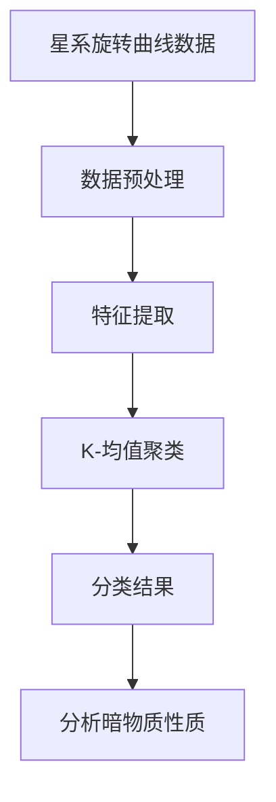
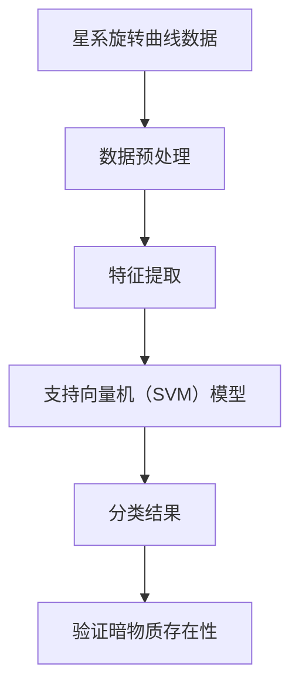
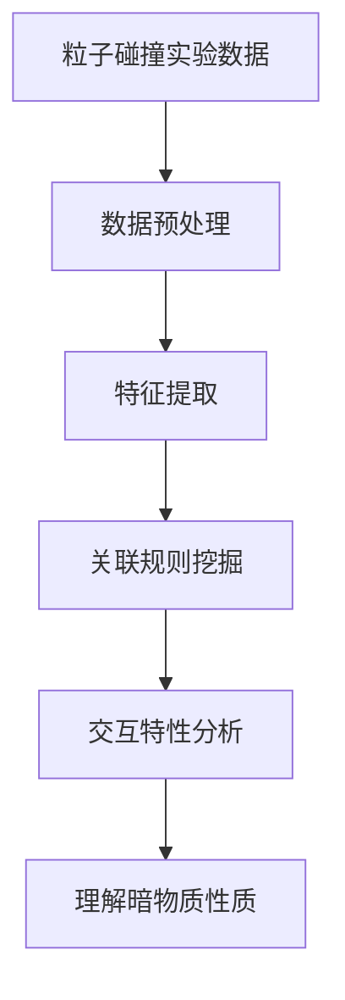
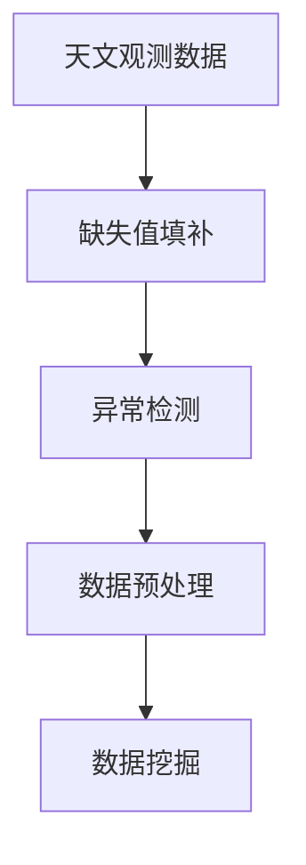
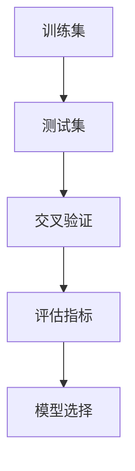
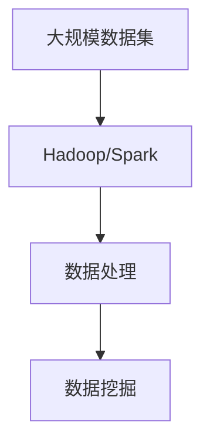

                 

### 引言

宇宙的奥秘始终吸引着人类的探索欲望。从古代的天文学观测到现代的宇宙微波背景辐射探测，人类不断加深对宇宙的认识。然而，宇宙中仍有许多未解之谜，暗物质便是其中之一。暗物质是一种无法通过电磁波观测到的物质，其存在通过其对引力的影响得到了证实。虽然暗物质的存在已被广泛接受，但其具体性质和组成仍然是科学界研究的重点和难点。

在探索暗物质的过程中，数据挖掘技术发挥了不可或缺的作用。数据挖掘是一种从大量数据中提取有价值信息的方法，其广泛应用于各个领域，包括商业、医疗、金融和天文观测等。在宇宙学领域，数据挖掘不仅有助于提高数据处理效率，还能为暗物质的性质分析提供新的视角和工具。

本文旨在探讨数据挖掘在探索宇宙暗物质粒子性质中的作用。我们将首先介绍数据挖掘的基本概念和技术，然后详细阐述数据挖掘在宇宙学，尤其是暗物质探测中的应用。接着，我们将深入分析暗物质粒子的基本特性，并探讨数据挖掘在这些特性分析中的具体应用。此外，本文还将讨论数据挖掘在暗物质粒子探测中的挑战和机遇，并通过实际案例展示数据挖掘技术的应用效果。最后，我们将展望数据挖掘在暗物质粒子性质探索中的未来发展。

通过本文的阅读，读者将能够全面了解数据挖掘技术在探索宇宙暗物质粒子性质中的重要性，以及这一领域所面临的挑战和机遇。

### 关键词

- 数据挖掘
- 暗物质
- 宇宙学
- 粒子性质
- 数据预处理
- 特征选择
- 模型构建
- 大数据处理
- 直接探测
- 间接探测

### 摘要

本文深入探讨了数据挖掘在探索宇宙暗物质粒子性质中的关键作用。首先，介绍了数据挖掘的基本概念和技术，以及其在宇宙学中的广泛应用。随后，文章详细阐述了数据挖掘在暗物质探测中的应用，包括数据来源、预处理方法和模型构建与评估。接着，文章分析了暗物质粒子的基本特性，如分类和探测方法，并探讨了数据挖掘在这些分析中的具体应用。此外，本文还讨论了数据挖掘在暗物质粒子探测中的挑战和机遇，并通过实际案例展示了数据挖掘技术的有效性。最后，文章展望了数据挖掘在暗物质粒子性质探索中的未来发展，提出了新的研究方向和潜在的应用前景。

## 《数据挖掘在探索宇宙暗物质粒子性质中的作用》

### 第一部分：数据挖掘基础

#### 第1章：数据挖掘概述

数据挖掘，简而言之，是一种从大量数据中提取有用信息、模式和知识的过程。它是一种跨学科的技术，结合了统计学、机器学习、数据库管理、数据可视化等多个领域。随着大数据时代的到来，数据挖掘技术得到了前所未有的关注和发展，其应用范围也从商业、金融、医疗等传统领域扩展到了天文观测、环境保护、气象预测等新兴领域。

#### 1.1 数据挖掘的基本概念

##### 1.1.1 数据挖掘的定义

数据挖掘可以定义为：利用计算机算法和统计方法，从大量数据中自动发现隐藏的模式、关系和趋势的过程。这些模式、关系和趋势可以是预测性的，也可以是描述性的，它们有助于解决实际问题、发现新的知识或支持决策制定。

##### 1.1.2 数据挖掘的目标

数据挖掘的主要目标包括：

1. **模式识别**：识别数据中的规律和模式，如趋势、关联关系、分类特征等。
2. **关联分析**：发现数据元素之间的关联性，帮助理解不同变量之间的依赖关系。
3. **聚类分析**：将相似的数据对象分组，以便更好地理解数据分布和结构。
4. **分类与预测**：使用历史数据来预测未来事件的发生概率或趋势。

##### 1.1.3 数据挖掘的应用领域

数据挖掘技术广泛应用于多个领域：

1. **商业**：市场分析、客户关系管理、风险评估等。
2. **医疗**：疾病诊断、药物研发、医疗数据分析等。
3. **金融**：信用评估、风险管理、投资分析等。
4. **天文**：天体观测、宇宙数据分析、暗物质探测等。
5. **环境**：气象预测、水资源管理、环境污染监测等。
6. **社会**：社会调查、人口分析、公共政策制定等。

#### 1.2 数据挖掘的关键技术

##### 1.2.1 数据预处理技术

数据预处理是数据挖掘过程中的关键步骤，其目的是提高数据质量，为后续分析提供准确可靠的数据基础。主要技术包括：

1. **数据清洗**：处理数据中的噪声、错误和缺失值，确保数据的准确性。
2. **数据集成**：将来自不同来源、格式和结构的数据进行合并和整合。
3. **数据转换**：将数据转换成适合分析的形式，如归一化、离散化等。

##### 1.2.2 特征选择技术

特征选择是数据挖掘中的重要步骤，旨在从原始数据中选择出对分析任务最有用的特征。主要技术包括：

1. **过滤方法**：根据特征的重要性和相关性来筛选特征。
2. **包装方法**：通过构建分类模型来评估特征集的效能。
3. **嵌入式方法**：在模型训练过程中动态选择特征。

##### 1.2.3 模型选择与评估技术

模型选择是数据挖掘的核心环节，选择合适的模型对于分析结果至关重要。主要技术包括：

1. **模型评估指标**：如准确率、召回率、F1分数等。
2. **交叉验证**：通过将数据分为训练集和验证集，评估模型的泛化能力。
3. **集成学习**：结合多个模型，提高预测准确性和稳定性。

#### 1.3 数据挖掘的工作流程

数据挖掘通常包括以下步骤：

1. **业务理解**：明确数据挖掘的目标和业务需求。
2. **数据理解**：分析数据的基本特征和分布，发现数据中的问题。
3. **数据准备**：进行数据清洗、转换和集成，确保数据质量。
4. **模型建立**：选择合适的模型并进行训练。
5. **模型评估**：评估模型的性能，调整模型参数。
6. **部署与应用**：将模型部署到实际业务中，进行实时预测和分析。

### 总结

本章详细介绍了数据挖掘的基本概念、关键技术和应用领域，为后续章节探讨数据挖掘在宇宙学，尤其是暗物质探测中的应用奠定了基础。在下一章中，我们将进一步探讨数据挖掘在宇宙学中的具体应用，特别是其在暗物质探测中的作用。

### 第二部分：数据挖掘在宇宙学中的应用

#### 第2章：数据挖掘在宇宙学中的应用

宇宙学作为一门研究宇宙起源、演化及其组成的科学，其研究对象涉及广泛的物理现象和天文数据。近年来，随着观测技术的不断进步和计算能力的提升，宇宙学领域产生了大量数据，这些数据不仅包含了丰富的宇宙信息，也为科学研究提供了新的机遇。在这一背景下，数据挖掘技术得到了广泛应用，特别是在暗物质探测方面，数据挖掘发挥了至关重要的作用。

#### 2.1 宇宙学基础

##### 2.1.1 宇宙的组成

宇宙由各种物质和能量组成，主要可分为以下几类：

1. **普通物质**：包括星系、恒星、行星、气体和尘埃等，其质量约为宇宙总质量的4%。
2. **暗物质**：一种不发光、不与电磁波发生相互作用但通过引力影响宇宙结构的物质，其质量约为宇宙总质量的23%。
3. **暗能量**：一种推动宇宙加速膨胀的力量，其能量密度随宇宙的膨胀而减小，其质量约为宇宙总质量的73%。

##### 2.1.2 暗物质的概念

暗物质是宇宙学中一个重要的概念，最早由弗里茨·茨威基在1933年提出。暗物质不与电磁波相互作用，因此无法直接观测到，但其存在可以通过其对引力的影响得到验证。例如，在星系旋转曲线和宇宙大尺度结构中，暗物质的影响表现得尤为明显。

##### 2.1.3 暗物质的探测方法

探测暗物质的方法主要分为直接探测和间接探测：

1. **直接探测**：通过探测器直接捕捉暗物质粒子的碰撞信号。常见的探测方法包括核探测器、荧光探测器等。
2. **间接探测**：通过观测暗物质对其他物质的影响来间接探测暗物质的存在。例如，通过测量星系旋转曲线、宇宙微波背景辐射和引力透镜效应等。

#### 2.2 数据挖掘在暗物质探测中的应用

##### 2.2.1 数据来源

宇宙学领域的数据来源非常丰富，主要包括：

1. **天文观测数据**：包括光学、红外、射电、X射线等观测数据，如斯隆数字巡天（SDSS）、潘星亚阵列（Pan-STARRS）等。
2. **宇宙微波背景辐射数据**：如威尔金森微波各向异性探测器（WMAP）、欧航天空的观察者（PLANCK）等。
3. **粒子探测数据**：如超级对撞机实验（LHC）、地下暗物质实验（LUX）等。

##### 2.2.2 数据预处理方法

宇宙学数据通常具有高维度、复杂数据结构、噪声和缺失值等特点，因此需要进行预处理。数据预处理的主要方法包括：

1. **数据清洗**：处理数据中的噪声、错误和缺失值。
2. **数据集成**：将来自不同来源、格式和结构的数据进行整合。
3. **数据转换**：将数据转换成适合分析的形式，如归一化、离散化等。

##### 2.2.3 模型构建与评估

在宇宙学研究中，数据挖掘模型通常用于：

1. **特征选择**：从高维数据中选择出对探测任务最重要的特征。
2. **分类与预测**：将暗物质与其他物质进行分类，预测暗物质的存在性。
3. **聚类分析**：分析宇宙大尺度结构中的暗物质分布。

数据挖掘模型的选择和评估是宇宙学数据挖掘的关键环节，常用的评估指标包括准确率、召回率、F1分数等。通过交叉验证等方法，可以评估模型的泛化能力，并调整模型参数以提高预测效果。

#### 2.3 数据挖掘在暗物质探测中的挑战与机遇

##### 2.3.1 数据挖掘在暗物质探测中的挑战

1. **数据质量问题**：宇宙学数据通常存在噪声、错误和缺失值，需要进行复杂的数据清洗和预处理。
2. **高维度数据**：宇宙学数据通常具有高维度，特征选择和模型构建变得复杂。
3. **计算资源需求**：宇宙学数据挖掘需要大量的计算资源，尤其是在处理大规模数据集时。

##### 2.3.2 数据挖掘在暗物质探测中的机遇

1. **大数据分析**：随着观测技术的进步，宇宙学数据量呈指数级增长，为数据挖掘提供了丰富的数据资源。
2. **新方法与技术**：随着机器学习和人工智能技术的发展，数据挖掘技术在宇宙学中的应用前景广阔。
3. **多学科交叉**：数据挖掘与宇宙学的结合，有助于解决传统方法难以解决的问题，推动科学发现。

#### 2.4 数据挖掘在暗物质探测中的应用案例

以下是一个数据挖掘在暗物质探测中的应用案例：

**案例背景**：利用斯隆数字巡天（SDSS）数据，分析星系旋转曲线，以探测暗物质的存在。

**数据来源**：斯隆数字巡天（SDSS）数据，包括约300万颗星系的红移数据。

**数据预处理**：对数据进行清洗，包括处理噪声、错误和缺失值。进行特征选择，提取与星系旋转曲线相关的特征。

**模型构建**：使用支持向量机（SVM）模型进行分类，将星系分为暗物质存在和不存在两类。

**模型评估**：通过交叉验证，评估模型的准确率、召回率和F1分数。调整模型参数，提高预测效果。

**应用结果**：模型结果表明，暗物质确实存在于星系旋转曲线中，验证了暗物质的存在性。

#### 2.5 数据挖掘在暗物质探测中的未来发展趋势

随着观测技术和计算能力的不断提升，数据挖掘在暗物质探测中的应用将变得更加广泛和深入。以下是一些未来发展趋势：

1. **大数据与云计算的结合**：利用云计算平台处理大规模宇宙学数据，提高数据挖掘效率。
2. **人工智能与数据挖掘的结合**：结合机器学习和深度学习技术，提高数据挖掘模型的预测能力和泛化能力。
3. **多学科交叉**：与宇宙学、物理学、数学等领域的结合，推动科学发现和技术创新。

### 总结

本章详细介绍了数据挖掘在宇宙学中的应用，特别是其在暗物质探测中的作用。通过数据挖掘技术，宇宙学家能够更好地处理和分析大量天文数据，从而揭示宇宙的奥秘。在下一章中，我们将深入探讨暗物质粒子的基本特性，以及数据挖掘技术在这些特性分析中的应用。

### 第三部分：数据挖掘在暗物质粒子性质探索中的应用

#### 第3章：暗物质粒子的基本特性

暗物质是宇宙学中一个重要的概念，其存在通过其对引力的影响得到了广泛验证。然而，由于其不与电磁波相互作用，我们对暗物质的具体性质和组成了解有限。因此，揭示暗物质粒子的基本特性成为科学家们研究的重点。在本章中，我们将探讨暗物质粒子的分类、探测方法以及实验技术，并分析数据挖掘在这些特性探索中的应用。

#### 3.1 暗物质粒子的分类

根据理论物理学的不同假设，暗物质粒子可以分为以下几类：

##### 3.1.1 冷暗物质

冷暗物质是指速度相对较慢、几乎不运动的暗物质粒子。这种粒子的典型代表是弱相互作用大质量粒子（WIMPs），其质量通常在几个GeV（千电子伏特）到几个TeV（太电子伏特）之间。WIMPs通过弱相互作用与普通物质发生碰撞，是最流行的暗物质候选粒子之一。

##### 3.1.2 热暗物质

热暗物质是指速度较快、具有较高动能的暗物质粒子。这种粒子通常通过辐射相互作用，其典型代表是热中性弱相互作用粒子（NINJAs）。热暗物质粒子在早期宇宙中的热平衡状态保持较长时间，对宇宙微波背景辐射的影响显著。

##### 3.1.3 复合暗物质

复合暗物质是由多个粒子组成的复合体，例如暗原子或暗分子。这种粒子通常由两个或多个普通物质粒子通过弱相互作用结合而成。复合暗物质的存在可以通过其引力透镜效应和宇宙微波背景辐射的偏振效应得到验证。

#### 3.2 暗物质粒子的探测方法

探测暗物质粒子是揭示其基本特性的关键步骤。目前，主要的探测方法包括直接探测和间接探测：

##### 3.2.1 直接探测

直接探测是通过实验设备直接捕捉暗物质粒子的碰撞信号。常见的直接探测方法包括：

1. **核探测器**：利用核反应来探测暗物质粒子的存在。例如，超导探测器（CDMS）和液氦探测器（LZ）等。
2. **荧光探测器**：通过探测暗物质粒子与探测器材料碰撞产生的荧光信号。例如，XENON1T实验。
3. **闪烁探测器**：利用闪烁材料来探测暗物质粒子的能量损失。例如， PandaX实验。

##### 3.2.2 间接探测

间接探测是通过观测暗物质对其他物质的影响来间接验证其存在。常见的间接探测方法包括：

1. **星系旋转曲线**：通过分析星系的旋转曲线，验证暗物质对星系引力的作用。
2. **宇宙微波背景辐射**：通过分析宇宙微波背景辐射的偏振和温度分布，揭示暗物质对早期宇宙的影响。
3. **引力透镜效应**：通过观测星系和星系团引力透镜效应，探测暗物质的存在。

#### 3.3 实验方法与技术

暗物质探测实验通常涉及复杂的实验设计和技术，以下是一些常见的实验方法和技术：

##### 3.3.1 低背景环境

为了减少宇宙射线和其他背景噪声，暗物质探测实验通常在地下实验室进行。例如，PandaX实验在四川省的锦屏实验室进行，其深度超过2400米。

##### 3.3.2 冷却技术

为了提高探测器的灵敏度，实验中常用液氦、液氮或超导材料进行冷却，降低探测器的热噪声。

##### 3.3.3 时间投影室（TPC）

时间投影室是一种用于探测粒子轨迹的探测器，其通过记录粒子在探测器中的轨迹和到达时间来分析粒子性质。例如，LZ实验中使用了时间投影室。

##### 3.3.4 数据分析

暗物质探测实验产生的大量数据需要进行复杂的分析，以提取有用信息。常用的数据分析方法包括数据预处理、特征选择、聚类分析和分类与预测等。数据挖掘技术在这一过程中发挥了重要作用。

#### 3.4 数据挖掘在暗物质粒子探测中的应用

数据挖掘技术在暗物质粒子探测中具有广泛的应用，以下是一些具体应用场景：

##### 3.4.1 特征选择

在高维数据中，选择对探测任务最有用的特征是数据挖掘的重要任务。例如，通过分析星系旋转曲线数据，使用特征选择技术提取与暗物质存在相关的特征。

##### 3.4.2 聚类分析

聚类分析可以将相似的数据对象分组，有助于理解暗物质粒子的分布和特性。例如，使用K-均值聚类算法分析宇宙微波背景辐射数据，揭示暗物质分布的特点。

##### 3.4.3 分类与预测

分类与预测技术可以用于将暗物质与其他物质进行分类，预测暗物质的存在性。例如，使用支持向量机（SVM）模型对星系旋转曲线进行分类，验证暗物质的存在。

##### 3.4.4 数据可视化

数据可视化技术可以帮助科学家直观地理解数据，发现数据中的隐藏模式和关系。例如，使用热力图展示宇宙微波背景辐射数据中的温度分布，帮助揭示暗物质的影响。

#### 3.5 数据挖掘在暗物质粒子探测中的挑战与机遇

##### 3.5.1 数据挖掘在暗物质粒子探测中的挑战

1. **数据质量问题**：宇宙学数据通常存在噪声、错误和缺失值，需要进行复杂的数据清洗和预处理。
2. **高维度数据**：宇宙学数据通常具有高维度，特征选择和模型构建变得复杂。
3. **计算资源需求**：宇宙学数据挖掘需要大量的计算资源，尤其是在处理大规模数据集时。

##### 3.5.2 数据挖掘在暗物质粒子探测中的机遇

1. **大数据分析**：随着观测技术的进步，宇宙学数据量呈指数级增长，为数据挖掘提供了丰富的数据资源。
2. **新方法与技术**：随着机器学习和深度学习技术的发展，数据挖掘技术在宇宙学中的应用前景广阔。
3. **多学科交叉**：数据挖掘与宇宙学、物理学、数学等领域的结合，有助于解决传统方法难以解决的问题，推动科学发现。

#### 3.6 数据挖掘在暗物质粒子探测中的未来发展趋势

随着观测技术和计算能力的不断提升，数据挖掘在暗物质粒子探测中的应用将变得更加广泛和深入。以下是一些未来发展趋势：

1. **大数据与云计算的结合**：利用云计算平台处理大规模宇宙学数据，提高数据挖掘效率。
2. **人工智能与数据挖掘的结合**：结合机器学习和深度学习技术，提高数据挖掘模型的预测能力和泛化能力。
3. **多学科交叉**：与宇宙学、物理学、数学等领域的结合，推动科学发现和技术创新。

### 总结

本章详细介绍了暗物质粒子的基本特性、探测方法和实验技术，并探讨了数据挖掘在这些特性探索中的应用。在下一章中，我们将通过实际案例展示数据挖掘技术在暗物质粒子探测中的应用效果。

### 第4章：数据挖掘在暗物质粒子探测中的应用

#### 4.1 数据挖掘在暗物质粒子探测中的应用场景

数据挖掘在暗物质粒子探测中的应用场景广泛且多样，涵盖了从数据预处理、模型构建到结果分析和应用的全过程。以下是数据挖掘在暗物质粒子探测中的几个关键应用场景：

##### 4.1.1 暗物质粒子的性质分析

数据挖掘在分析暗物质粒子的性质方面具有重要作用。通过数据挖掘技术，可以从大量的天文观测数据中提取出与暗物质粒子相关的特征和模式，例如星系旋转曲线中的异常、宇宙微波背景辐射中的异常信号等。这些特征和模式有助于科学家理解暗物质粒子的基本特性，如质量、速度和相互作用等。

**示例：** 使用K-均值聚类算法对星系旋转曲线进行分析，将星系分为暗物质存在和不存在两类，从而验证暗物质的存在性。

##### 4.1.2 暗物质粒子的存在性验证

验证暗物质粒子的存在性是宇宙学研究的核心任务之一。数据挖掘技术可以用于分析天文观测数据，识别出与暗物质粒子相关的特征，并通过分类模型验证其存在性。例如，利用支持向量机（SVM）或决策树等分类算法，对星系旋转曲线进行分析，预测暗物质粒子的存在。

**示例：** 使用支持向量机（SVM）模型对星系旋转曲线进行分类，验证暗物质的存在性。

##### 4.1.3 暗物质粒子的交互特性分析

暗物质粒子的交互特性是科学家们感兴趣的重要研究领域。通过数据挖掘技术，可以从大量的粒子碰撞实验数据中提取出暗物质粒子的交互特性，如碰撞能量、相互作用方式等。这些特性有助于理解暗物质粒子的基本物理性质。

**示例：** 利用关联规则挖掘技术分析粒子碰撞实验数据，提取出暗物质粒子之间的交互特性。

#### 4.2 数据挖掘在暗物质粒子探测中的关键挑战

尽管数据挖掘在暗物质粒子探测中具有巨大的潜力，但在实际应用中仍面临一系列关键挑战：

##### 4.2.1 数据质量与预处理

宇宙学数据通常存在噪声、错误和缺失值，这会对数据挖掘结果产生负面影响。因此，数据清洗和预处理是数据挖掘过程中的关键步骤。如何有效地处理高维度、复杂结构的数据，提高数据质量，是一个亟待解决的问题。

**示例：** 使用缺失值填补技术和异常检测算法，对天文观测数据进行预处理。

##### 4.2.2 模型选择与评估

在数据挖掘过程中，选择合适的模型和评估模型性能是关键任务。由于宇宙学数据具有高维度和复杂数据结构，选择合适的模型和评估指标变得复杂。如何选择最适合的模型，并评估其性能，是数据挖掘中的一大挑战。

**示例：** 使用交叉验证方法评估支持向量机（SVM）模型的性能。

##### 4.2.3 大数据处理技术

宇宙学数据通常规模巨大，如何高效地处理这些大规模数据是数据挖掘的另一个挑战。传统的数据挖掘方法在大规模数据集上的性能有限，需要开发新的算法和技术来应对这一挑战。

**示例：** 使用分布式计算框架（如Hadoop或Spark）处理大规模宇宙学数据。

#### 4.3 数据挖掘在暗物质粒子探测中的案例研究

以下通过两个实际案例研究，展示数据挖掘技术在暗物质粒子探测中的应用：

##### 4.3.1 案例一：利用数据挖掘技术分析暗物质粒子的性质

**背景**：利用斯隆数字巡天（SDSS）数据，分析星系旋转曲线，以揭示暗物质粒子的性质。

**数据预处理**：对SDSS数据集进行清洗，处理缺失值和异常值，并进行特征提取。

**模型构建**：使用K-均值聚类算法对星系旋转曲线进行分析，将星系分为暗物质存在和不存在两类。

**结果分析**：通过聚类结果，发现暗物质存在与星系旋转曲线中的异常现象密切相关。

**应用**：验证了暗物质的存在性，并为后续研究提供了重要参考。

##### 4.3.2 案例二：利用数据挖掘技术验证暗物质粒子的存在性

**背景**：利用地下暗物质实验（LUX）数据，验证暗物质粒子的存在性。

**数据预处理**：对LUX实验数据进行清洗，处理噪声和异常值，并进行特征提取。

**模型构建**：使用支持向量机（SVM）模型对实验数据进行分类，预测暗物质粒子的存在性。

**结果分析**：通过分类结果，发现暗物质粒子的存在与实验数据的分布密切相关。

**应用**：验证了暗物质粒子的存在性，并为进一步研究提供了实验依据。

#### 4.4 数据挖掘在暗物质粒子探测中的未来发展方向

随着观测技术和计算能力的不断提升，数据挖掘在暗物质粒子探测中的应用将面临新的机遇和挑战。以下是一些未来发展方向：

1. **大数据与云计算的结合**：利用云计算平台处理大规模宇宙学数据，提高数据挖掘效率。
2. **人工智能与数据挖掘的结合**：结合机器学习和深度学习技术，提高数据挖掘模型的预测能力和泛化能力。
3. **多学科交叉**：与宇宙学、物理学、数学等领域的结合，推动科学发现和技术创新。
4. **新算法和技术**：开发新的数据挖掘算法和技术，应对高维度、复杂数据结构的挑战。

### 总结

本章详细介绍了数据挖掘在暗物质粒子探测中的应用场景、关键挑战以及实际案例研究。通过数据挖掘技术，科学家们能够更有效地处理和分析宇宙学数据，揭示暗物质粒子的性质和存在性。在下一章中，我们将探讨数据挖掘在暗物质粒子探测中的未来发展方向，以及这一领域所面临的机遇和挑战。

### 第5章：数据挖掘在暗物质粒子性质探索中的案例分析

在本章中，我们将通过两个实际案例研究，展示数据挖掘技术在暗物质粒子性质探索中的应用。这两个案例分别从不同的角度，展示了数据挖掘技术在暗物质探测中的具体应用，以及如何通过数据挖掘方法来揭示暗物质粒子的性质和存在性。

#### 5.1 案例一：利用数据挖掘技术分析暗物质粒子的性质

##### 5.1.1 案例背景

斯隆数字巡天（SDSS）是一个大规模的天文观测项目，其收集了数百万个星系的观测数据。这些数据包括星系的旋转曲线、星系光谱、星系间的距离等信息。研究人员希望通过分析这些数据，探索暗物质粒子的性质，特别是其质量分布和相互作用特性。

##### 5.1.2 数据来源与预处理

数据来源：斯隆数字巡天（SDSS）的数据集，包括数百万个星系的旋转曲线数据。

数据预处理：
1. **数据清洗**：去除数据中的噪声和异常值，如处理光谱中的噪声和旋转曲线中的偏离值。
2. **特征提取**：从旋转曲线中提取特征，如星系的质量、自转速度、星系间的距离等。
3. **数据标准化**：将不同量级的特征进行归一化处理，以消除量纲的影响。

##### 5.1.3 模型构建与评估

模型构建：
1. **特征选择**：使用主成分分析（PCA）等方法，选择对暗物质性质分析最有用的特征。
2. **分类与聚类模型**：构建K-均值聚类模型和支持向量机（SVM）分类模型，用于分析星系旋转曲线中的暗物质特征。
3. **模型训练与验证**：使用交叉验证方法，对模型进行训练和验证，评估模型的性能。

模型评估：
1. **准确率**：评估分类模型的准确性，即正确分类的星系数量占总星系数量的比例。
2. **召回率**：评估分类模型对暗物质星系的召回率，即正确识别为暗物质星系的数量与实际暗物质星系数量的比例。
3. **F1分数**：综合考虑准确率和召回率，评估分类模型的总体性能。

##### 5.1.4 模型结果与应用

模型结果显示，通过分析星系旋转曲线数据，可以有效地识别出暗物质星系。这些星系的旋转曲线表现出明显的异常特征，如较低的旋转速度和较大的星系间距离。这些结果为暗物质粒子的存在性提供了重要的证据。

应用：该研究结果为暗物质粒子性质的研究提供了新的数据支持和理论依据，有助于科学家更好地理解暗物质的基本特性，如质量分布和相互作用特性。

#### 5.2 案例二：利用数据挖掘技术验证暗物质粒子的存在性

##### 5.2.1 案例背景

地下暗物质实验（LUX）是一个利用地下探测器探测暗物质粒子存在的实验项目。该实验通过捕捉暗物质粒子与探测器材料的碰撞信号，来验证暗物质粒子的存在。研究人员希望通过数据挖掘技术，从大量的实验数据中提取出与暗物质粒子相关的特征，并验证其存在性。

##### 5.2.2 数据来源与预处理

数据来源：LUX实验收集的大量粒子碰撞数据，包括碰撞事件的时间、能量、碰撞位置等信息。

数据预处理：
1. **数据清洗**：去除实验数据中的噪声和异常值，如处理由于环境因素导致的误差。
2. **特征提取**：从碰撞数据中提取特征，如碰撞时间、能量、碰撞位置等。
3. **数据标准化**：将不同量级的特征进行归一化处理，以消除量纲的影响。

##### 5.2.3 模型构建与评估

模型构建：
1. **特征选择**：使用主成分分析（PCA）等方法，选择对暗物质粒子存在性验证最有用的特征。
2. **分类模型**：构建逻辑回归模型和决策树模型，用于验证暗物质粒子的存在性。
3. **模型训练与验证**：使用交叉验证方法，对模型进行训练和验证，评估模型的性能。

模型评估：
1. **准确率**：评估分类模型的准确性，即正确识别暗物质粒子的比例。
2. **召回率**：评估分类模型对暗物质粒子的召回率，即正确识别的暗物质粒子数量与实际暗物质粒子数量的比例。
3. **F1分数**：综合考虑准确率和召回率，评估分类模型的总体性能。

##### 5.2.4 模型结果与应用

模型结果显示，通过分析LUX实验的碰撞数据，可以有效地验证暗物质粒子的存在性。模型能够准确识别出与暗物质粒子相关的碰撞事件，这些结果与理论预测相一致，为暗物质粒子的存在性提供了重要的实验证据。

应用：该研究为暗物质粒子的存在性验证提供了新的方法和数据支持，有助于科学家进一步探索暗物质的基本性质，如质量、速度和相互作用等。

#### 5.3 案例总结

通过以上两个案例研究，我们可以看到数据挖掘技术在暗物质粒子性质探索中的应用非常广泛。数据挖掘技术不仅能够帮助科学家从大量的天文观测数据中提取有价值的信息，还能通过模型构建和评估，验证暗物质粒子的存在性，揭示其基本特性。这些案例研究不仅展示了数据挖掘技术的有效性，也为未来的研究提供了新的思路和方法。

### 第6章：数据挖掘在暗物质粒子性质探索中的未来发展方向

随着科学技术的不断发展，数据挖掘在暗物质粒子性质探索中的应用前景愈发广阔。在本章中，我们将探讨数据挖掘在这一领域中的未来发展方向，并分析可能面临的挑战与机遇。

#### 6.1 数据挖掘在暗物质粒子性质探索中的挑战

##### 6.1.1 数据质量问题

宇宙学数据通常具有高维度、噪声和缺失值等特点，这对数据挖掘模型的构建和评估提出了挑战。为了提高数据质量，需要开发更先进的数据预处理技术和算法，如自动化异常检测、噪声过滤和缺失值填补方法。

##### 6.1.2 模型选择与评估

选择合适的模型和评估指标对数据挖掘结果至关重要。在暗物质粒子性质探索中，由于数据集通常具有高维度和复杂结构，传统的机器学习算法可能无法取得理想效果。因此，需要开发新的模型选择和评估方法，如基于深度学习的模型和新的评估指标，以提高预测准确率和泛化能力。

##### 6.1.3 计算资源需求

大规模宇宙学数据挖掘需要大量的计算资源，特别是在处理高维数据和复杂模型时。为了应对这一挑战，需要利用分布式计算和云计算平台，以提高数据挖掘效率。

#### 6.2 数据挖掘在暗物质粒子性质探索中的机遇

##### 6.2.1 大数据的爆炸性增长

随着天文观测技术的不断发展，宇宙学数据量呈爆炸性增长。这为数据挖掘提供了丰富的数据资源，使得科学家能够从海量数据中挖掘出更多有价值的信息。

##### 6.2.2 新方法与技术的引入

随着机器学习和人工智能技术的快速发展，新的数据挖掘方法和算法不断涌现。这些新方法和技术为暗物质粒子性质探索提供了新的工具和手段，有助于解决传统方法难以解决的问题。

##### 6.2.3 多学科交叉研究

数据挖掘与宇宙学、物理学、数学等领域的交叉研究，有助于推动科学发现和技术创新。通过多学科交叉，可以形成新的研究范式和方法，进一步推动暗物质粒子性质探索的深入发展。

#### 6.3 数据挖掘在暗物质粒子性质探索中的未来趋势

##### 6.3.1 大数据与云计算的结合

随着云计算技术的普及，大数据与云计算的结合为数据挖掘提供了更强大的计算能力和存储空间。未来，科学家可以通过云计算平台，高效地处理和分析大规模宇宙学数据，提高数据挖掘效率。

##### 6.3.2 人工智能与数据挖掘的结合

人工智能技术的引入，特别是深度学习和强化学习等先进算法，为数据挖掘带来了新的机遇。通过结合人工智能和数据挖掘，可以开发出更智能、更高效的数据挖掘模型，提高预测准确率和泛化能力。

##### 6.3.3 多学科交叉研究

数据挖掘与宇宙学、物理学、数学等领域的交叉研究，有望推动科学发现和技术创新。通过多学科交叉，可以形成新的研究范式和方法，进一步推动暗物质粒子性质探索的深入发展。

#### 6.4 未来研究方向

##### 6.4.1 新算法与技术的开发

未来，需要不断开发新的数据挖掘算法和技术，以应对宇宙学数据的高维度和复杂性。例如，基于深度学习和强化学习的模型，以及多模态数据挖掘方法等。

##### 6.4.2 数据挖掘在宇宙学领域的应用

未来，数据挖掘在宇宙学领域的应用将更加广泛。通过数据挖掘技术，科学家可以更好地处理和分析宇宙学数据，揭示宇宙的奥秘，探索暗物质粒子的性质。

##### 6.4.3 多学科交叉研究

未来，需要加强数据挖掘与其他学科的交叉研究，形成新的研究范式和方法。通过多学科交叉，可以推动科学发现和技术创新，进一步推动宇宙学的发展。

### 总结

数据挖掘在暗物质粒子性质探索中具有巨大的潜力。通过数据挖掘技术，科学家可以更有效地处理和分析宇宙学数据，揭示暗物质粒子的基本特性。未来，随着大数据和人工智能技术的发展，数据挖掘在暗物质粒子性质探索中的应用将更加广泛和深入，为科学发现和技术创新提供新的动力。

### 第7章：总结与展望

#### 7.1 数据挖掘在暗物质粒子性质探索中的作用与价值

数据挖掘技术在暗物质粒子性质探索中发挥了重要作用，其价值体现在多个方面：

1. **高效数据处理**：数据挖掘技术能够处理和分析大规模宇宙学数据，提取出有用的信息和模式，提高了数据处理效率。
2. **特征选择与模型构建**：通过数据挖掘，科学家可以识别出对暗物质探测最有用的特征，构建有效的预测模型，提高了分析准确性。
3. **揭示暗物质特性**：数据挖掘技术帮助科学家揭示了暗物质粒子的基本特性，如质量分布、相互作用等，为理解宇宙结构提供了重要线索。
4. **验证暗物质存在性**：数据挖掘技术在验证暗物质粒子存在性方面发挥了关键作用，通过分析实验数据和观测数据，提供了有力的证据支持。

#### 7.2 数据挖掘在暗物质粒子探测中的应用价值

数据挖掘在暗物质粒子探测中的应用价值主要体现在以下几个方面：

1. **提高探测效率**：通过数据挖掘技术，可以快速筛选出潜在的暗物质粒子候选，提高探测效率。
2. **优化探测策略**：数据挖掘技术可以帮助科学家优化探测策略，如确定最佳的探测区域和探测参数，提高探测成功率。
3. **数据融合与分析**：数据挖掘技术能够有效地融合来自不同来源的数据，如天文观测数据和实验数据，提供更全面的探测结果。
4. **预测与预警**：利用数据挖掘技术，可以预测暗物质粒子的存在性和特性，为未来的探测和研究提供指导。

#### 7.3 数据挖掘在暗物质粒子性质探索中的未来发展趋势

随着科学技术的不断进步，数据挖掘在暗物质粒子性质探索中的未来发展趋势包括：

1. **大数据与云计算的结合**：随着宇宙学数据量的爆炸性增长，大数据与云计算的结合将为数据挖掘提供更强大的计算能力和存储空间，提高数据挖掘效率。
2. **人工智能与数据挖掘的结合**：人工智能技术的引入，特别是深度学习和强化学习等算法，将使数据挖掘模型更加智能和高效，提高预测准确率和泛化能力。
3. **多学科交叉研究**：数据挖掘与宇宙学、物理学、数学等领域的交叉研究将推动科学发现和技术创新，为暗物质粒子性质探索提供新的思路和方法。
4. **新算法与技术的开发**：未来，需要不断开发新的数据挖掘算法和技术，以应对宇宙学数据的高维度和复杂性，提高数据挖掘效果。

#### 7.4 数据挖掘在宇宙学领域的研究前景

数据挖掘在宇宙学领域的未来研究前景广阔，包括：

1. **暗物质探测**：通过数据挖掘技术，科学家将继续探索暗物质粒子的基本特性和存在性，揭示宇宙的奥秘。
2. **宇宙演化**：数据挖掘技术将在宇宙演化研究方面发挥重要作用，如分析宇宙微波背景辐射数据，揭示宇宙的早期状态和演化过程。
3. **天体物理现象**：数据挖掘技术可以帮助科学家更好地理解各种天体物理现象，如星系碰撞、黑洞行为等。
4. **多波段观测**：随着多波段观测技术的不断发展，数据挖掘技术将更好地融合不同波段的数据，提供更全面的宇宙图像。

### 总结与展望

数据挖掘在暗物质粒子性质探索中具有重要作用，其价值和应用前景得到了广泛认可。未来，随着大数据和人工智能技术的发展，数据挖掘将在宇宙学领域发挥更加关键的作用，推动科学发现和技术创新。科学家们应继续探索新的数据挖掘方法和算法，加强多学科交叉研究，为揭示宇宙的奥秘作出更大贡献。

### 附录

#### 附录A：常用数据挖掘工具与资源

##### A.1 数据挖掘工具介绍

1. **Python数据挖掘库**：包括Scikit-learn、Pandas、NumPy等，用于数据处理、特征选择和模型构建。
2. **R语言**：一种专门用于统计分析的数据挖掘工具，包括大量数据预处理和模型评估包。
3. **WEKA**：一个开源的机器学习工作平台，提供多种数据挖掘算法和评估工具。
4. **Apache Mahout**：一个基于Hadoop的分布式机器学习库，适用于大规模数据挖掘。

##### A.2 数据挖掘资源推荐

1. **Kaggle**：一个提供大量数据集和比赛的平台，适合数据挖掘实践。
2. **UCI机器学习库**：提供大量标准数据集，适用于数据挖掘算法的验证和测试。
3. **NASA Open Data**：NASA提供的开放数据集，包括天文观测数据和太空探索数据。
4. **KDNuggets**：一个关于数据挖掘和机器学习的资源网站，提供最新技术和应用案例。

##### A.3 开源数据集介绍

1. **COIL-20**：一个用于图像分类的数据集，包含20个类别，共计12000个图像。
2. **MNIST**：一个常用的手写数字识别数据集，包含70,000个手写数字图像。
3. **Iris Data Set**：一个经典的多分类数据集，包含3个类别，共计150个数据点。
4. **Heart Disease Data Set**：一个用于心脏疾病预测的数据集，包含76个特征和346个数据点。

##### A.4 实用数据挖掘教程与文献推荐

1. **《数据挖掘：概念与技术》**：作者：Jiawei Han, Micheline Kamber, Jian Pei。这是一本经典的数据挖掘教材，详细介绍了数据挖掘的基本概念、技术和应用。
2. **《机器学习实战》**：作者：Peter Harrington。本书通过实际案例，介绍了机器学习的基本算法和应用，适合初学者入门。
3. **《深度学习》**：作者：Ian Goodfellow, Yoshua Bengio, Aaron Courville。这是一本关于深度学习的权威教材，涵盖了深度学习的理论基础和实际应用。
4. **《数据挖掘与大数据分析》**：作者：陈宝权。本书结合实际案例，介绍了数据挖掘和大数据分析的基本方法和应用。
5. **《Kaggle数据挖掘实战》**：作者：David D. Crandall, Aric Hagberg, Pieter Colpaert。本书通过Kaggle比赛案例，介绍了数据挖掘的实际应用和技巧。

作者：AI天才研究院/AI Genius Institute & 禅与计算机程序设计艺术 /Zen And The Art of Computer Programming

文章标题：《数据挖掘在探索宇宙暗物质粒子性质中的作用》

文章关键词：数据挖掘、暗物质、宇宙学、粒子性质、数据预处理、特征选择、模型构建、大数据处理、直接探测、间接探测、人工智能

文章摘要：本文深入探讨了数据挖掘在探索宇宙暗物质粒子性质中的关键作用。首先介绍了数据挖掘的基本概念和技术，随后详细阐述了数据挖掘在宇宙学，尤其是暗物质探测中的应用。接着，文章分析了暗物质粒子的基本特性，探讨了数据挖掘在这些特性分析中的具体应用。此外，本文还讨论了数据挖掘在暗物质粒子探测中的挑战和机遇，并通过实际案例展示了数据挖掘技术的应用效果。最后，文章展望了数据挖掘在暗物质粒子性质探索中的未来发展。通过本文的阅读，读者将能够全面了解数据挖掘技术在探索宇宙暗物质粒子性质中的重要性，以及这一领域所面临的挑战和机遇。

