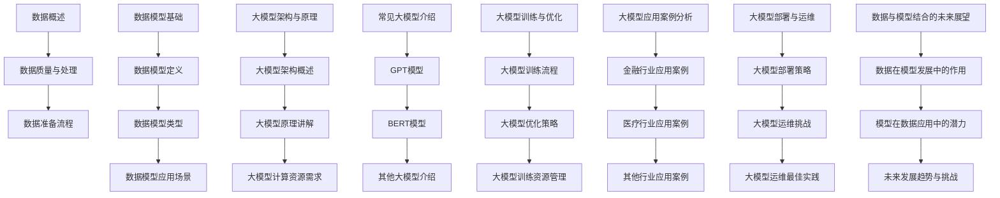
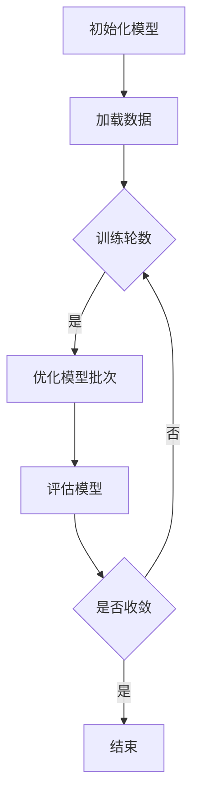

                 

# 数据是大模型发展的关键

## 关键词
- 数据基础
- 大模型
- 模型训练
- 计算资源
- 应用案例
- 未来展望

## 摘要

本文将深入探讨数据在大模型发展中的关键作用。首先，我们会对数据的基础概念进行概述，并介绍数据准备和处理的方法。接下来，我们将详细解释大模型的基本原理和架构，以及常见的几种大模型。随后，文章将阐述大模型训练和优化的流程及策略，并探讨大模型在不同行业中的应用案例。此外，我们还将讨论大模型部署和运维的挑战及最佳实践。最后，文章将展望数据与模型结合的未来发展趋势和挑战。

## 目录大纲

### 第一部分：数据基础与模型原理

#### 第1章：数据概述与准备

1.1 数据概述
1.2 数据质量与处理
1.3 数据准备流程

#### 第2章：数据模型基础

2.1 数据模型定义
2.2 数据模型类型
2.3 数据模型应用场景

#### 第3章：大模型架构与原理

3.1 大模型架构概述
3.2 大模型原理讲解
3.3 大模型计算资源需求

#### 第4章：常见大模型介绍

4.1 GPT模型
4.2 BERT模型
4.3 其他大模型介绍

#### 第5章：大模型训练与优化

5.1 大模型训练流程
5.2 大模型优化策略
5.3 大模型训练资源管理

#### 第6章：大模型应用案例分析

6.1 金融行业应用案例
6.2 医疗行业应用案例
6.3 其他行业应用案例

#### 第7章：大模型部署与运维

7.1 大模型部署策略
7.2 大模型运维挑战
7.3 大模型运维最佳实践

#### 第8章：数据与模型结合的未来展望

8.1 数据在模型发展中的作用
8.2 模型在数据应用中的潜力
8.3 未来发展趋势与挑战

### Mermaid 流�程图



### 大模型算法原理讲解

#### 大模型训练流程

伪代码：

```python
initialize_model()
load_data()

for epoch in range(num_epochs):
    for batch in data_loader:
        optimize_model_on_batch(batch)

evaluate_model_on_validation_set()
```

#### 大模型优化策略

伪代码：

```python
set_learning_rate(rate)
set_optimizer(optimizer)

while not converged:
    compute_gradient()
    update_model_weights(optimizer, gradient)
    adjust_learning_rate(rate, epoch)
```

#### 前向传播

$$
\text{Output} = \text{激活函数}(\text{权重} \cdot \text{输入} + \text{偏置})
$$

#### 反向传播

$$
\text{梯度} = \frac{\partial \text{损失函数}}{\partial \text{权重}}
$$

### Mermaid 流程图



### 项目实战

#### 数据集准备

```python
# 读取数据集
data = pd.read_csv("data.csv")

# 数据清洗
data = data.dropna()

# 数据预处理
data = data.astype({'feature1': 'float', 'feature2': 'int'})

# 划分训练集和测试集
train_data, test_data = train_test_split(data, test_size=0.2)
```

#### 大模型训练

```python
# 定义模型
model = keras.Sequential([
    keras.layers.Dense(128, activation='relu', input_shape=(num_features,)),
    keras.layers.Dense(1, activation='sigmoid')
])

# 编译模型
model.compile(optimizer='adam', loss='binary_crossentropy', metrics=['accuracy'])

# 训练模型
model.fit(train_data, epochs=num_epochs, batch_size=batch_size, validation_data=test_data)
```

### 代码解读与分析

- 数据集读取与清洗：使用 pandas 库从 CSV 文件中读取数据集，删除缺失值，并将特征类型转换为适合训练的格式。
- 数据预处理：将特征转换为浮点数或整数类型，以便模型能够处理。
- 划分训练集和测试集：使用 `train_test_split` 函数将数据集分为训练集和测试集，测试集用于评估模型性能。
- 定义模型：使用 `keras.Sequential` 定义一个序列模型，包含一个全连接层和一个输出层。
- 编译模型：设置优化器和损失函数，并指定评价指标。
- 训练模型：使用 `fit` 方法训练模型，指定训练轮数、批量大小和验证数据。

通过以上步骤，模型将学习如何对数据进行分类，并可以在测试集上评估其性能。在训练过程中，可以通过调整学习率、批量大小和训练轮数来优化模型性能。

### 总结

本文系统地介绍了数据在大模型发展中的关键作用。从数据概述与准备，到数据模型基础，再到大模型架构与原理，以及大模型训练与优化，再到大模型的应用案例和部署运维，最后对数据与模型结合的未来进行了展望。通过本文的讲解，读者可以深入了解数据在大模型发展中的重要性，以及如何有效地处理和分析数据来推动大模型的发展。在未来，随着数据技术的不断进步，大模型的应用将更加广泛，为各个行业带来更多的创新和变革。

### 作者

作者：AI天才研究院/AI Genius Institute & 禅与计算机程序设计艺术 /Zen And The Art of Computer Programming

### 注释

本文所述内容仅代表个人观点，不代表任何机构或组织的立场。如需引用，请务必注明出处。

### 致谢

感谢所有参与本文撰写和讨论的同事和朋友，感谢您们的辛勤工作和智慧贡献。同时，特别感谢我的导师，您的指导和建议对本文的完成至关重要。感谢您们的支持与鼓励！

