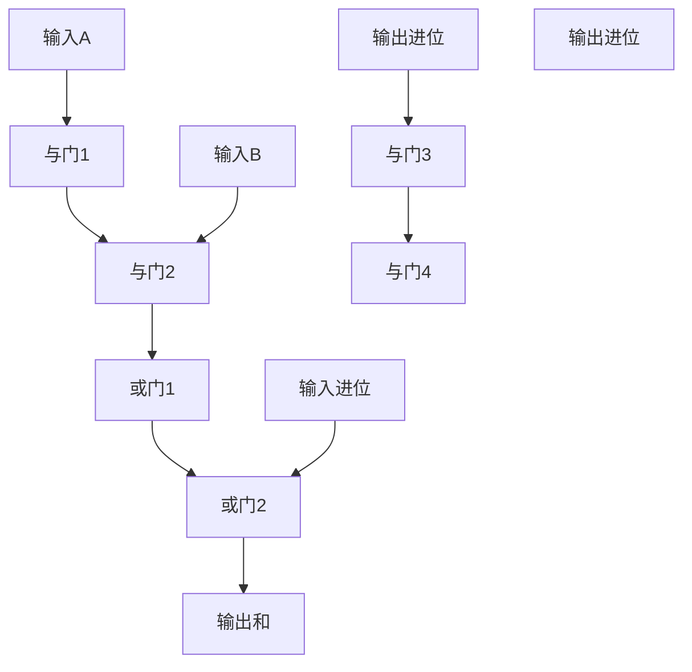

                 

### 《数理逻辑：恒真性和可真性》

> **关键词：** 数理逻辑、恒真性、可真性、逻辑一致性、谓词逻辑、应用实例

> **摘要：** 本篇文章将深入探讨数理逻辑中的恒真性和可真性两个核心概念。通过详细阐述其定义、判定方法以及在实际逻辑设计和应用中的重要性，帮助读者理解数理逻辑在计算机科学和人工智能领域的广泛应用。文章将首先回顾数理逻辑的发展历程和研究目标，然后逐步介绍基础概念，最后通过具体实例和实际应用展示数理逻辑的强大威力。

### 目录大纲

## 第1章 引言与概述

### 1.1 数理逻辑的发展历程

### 1.2 数理逻辑的研究目标与应用领域

### 1.3 本书结构安排与学习建议

## 第2章 基础概念

### 2.1 命题与命题联结词

#### 2.1.1 命题的概念

#### 2.1.2 真值表

#### 2.1.3 命题联结词

### 2.2 命题演算

#### 2.2.1 赋值演算

#### 2.2.2 真值函数

#### 2.2.3 演算推理规则

### 2.3 逻辑等价性和蕴含关系

#### 2.3.1 逻辑等价性

#### 2.3.2 蕴含关系

#### 2.3.3 真值等价性

## 第3章 恒真性

### 3.1 恒真命题与恒真公式

#### 3.1.1 恒真命题的定义

#### 3.1.2 恒真公式的判定方法

#### 3.1.3 恒真公式的应用

### 3.2 恒真性与可满足性

#### 3.2.1 恒真性与可满足性关系

#### 3.2.2 可满足性的判定方法

#### 3.2.3 恒真性与可满足性在逻辑设计中的应用

## 第4章 可真性

### 4.1 可真命题与可真公式

#### 4.1.1 可真命题的定义

#### 4.1.2 可真公式的判定方法

#### 4.1.3 可真公式的应用

### 4.2 可真性与可解性

#### 4.2.1 可真性与可解性关系

#### 4.2.2 可解性的判定方法

#### 4.2.3 可真性与可解性在逻辑设计中的应用

## 第5章 矛盾与逻辑一致性

### 5.1 矛盾的概念与性质

#### 5.1.1 矛盾的定义

#### 5.1.2 矛盾的性质

#### 5.1.3 矛盾在逻辑设计中的应用

### 5.2 逻辑一致性与完备性

#### 5.2.1 逻辑一致性的定义

#### 5.2.2 逻辑一致性的判定方法

#### 5.2.3 逻辑完备性的概念与判定

## 第6章 谓词逻辑

### 6.1 谓词逻辑的基本概念

#### 6.1.1 谓词与个体

#### 6.1.2 谓词公式

#### 6.1.3 谓词推理

### 6.2 谓词演算

#### 6.2.1 赋值演算

#### 6.2.2 谓词推理规则

#### 6.2.3 谓词逻辑的应用

## 第7章 数理逻辑的应用

### 7.1 逻辑电路设计

#### 7.1.1 逻辑门与逻辑电路

#### 7.1.2 逻辑电路的简化与优化

#### 7.1.3 逻辑电路的设计实例

### 7.2 形式化验证

#### 7.2.1 形式化验证的基本概念

#### 7.2.2 形式化验证的方法与技术

#### 7.2.3 形式化验证的应用实例

### 7.3 形式语言与自动机

#### 7.3.1 形式语言的基本概念

#### 7.3.2 正则表达式

#### 7.3.3 有限自动机

## 第8章 总结与展望

### 8.1 数理逻辑的发展趋势

### 8.2 数理逻辑在人工智能领域的应用前景

### 8.3 数理逻辑研究的挑战与机遇

## 附录

### A.1 数理逻辑相关术语解释

### A.2 数理逻辑常用工具介绍

### A.3 参考文献

### 第1章 引言与概述

#### 1.1 数理逻辑的发展历程

数理逻辑，又称符号逻辑，是数学的一个分支，主要研究逻辑形式和推理规则。其起源可以追溯到古希腊时期，当时哲学家们已经开始探讨逻辑问题。然而，数理逻辑的真正发展始于19世纪，特别是在德国哲学家莱布尼茨的工作基础上，弗雷格、罗素和怀特海等人进一步推动了这一领域的发展。

弗雷格是数理逻辑的奠基人之一，他提出了“概念论”和“命题函数”的概念，试图将逻辑形式化。罗素和怀特海在《数学原理》一书中，系统性地构建了一个基于逻辑的数学体系，标志着数理逻辑的成熟。20世纪初，图灵、哥德尔和丘奇等数学家进一步深化了对逻辑的理解，提出了形式化验证、递归论和计算理论等重要概念。

#### 1.2 数理逻辑的研究目标与应用领域

数理逻辑的研究目标主要包括两个方面：一是研究逻辑形式和推理规则，二是探索逻辑在各个领域的应用。数理逻辑试图将人类的推理过程形式化，使得逻辑推理变得更加精确和严格。通过数理逻辑的研究，我们可以更深入地理解逻辑的基本原理，从而在计算机科学、人工智能、哲学等领域发挥重要作用。

在计算机科学领域，数理逻辑是构建形式化验证和形式化推理的基础。形式化验证用于确保系统设计的正确性，而形式化推理则用于解决复杂问题。在人工智能领域，数理逻辑被应用于知识表示、推理和决策等方面，使得人工智能系统能够更加智能化和自适应。

#### 1.3 本书结构安排与学习建议

本书共分为8章，内容涵盖了数理逻辑的基础概念、恒真性和可真性、矛盾与逻辑一致性、谓词逻辑以及数理逻辑的应用等方面。以下是本书的结构安排和学习建议：

- **第1章**：引言与概述，介绍数理逻辑的发展历程和研究目标。
- **第2章**：基础概念，介绍命题与命题联结词、命题演算、逻辑等价性和蕴含关系。
- **第3章**：恒真性，介绍恒真命题与恒真公式、恒真性与可满足性。
- **第4章**：可真性，介绍可真命题与可真公式、可真性与可解性。
- **第5章**：矛盾与逻辑一致性，介绍矛盾的概念与性质、逻辑一致性与完备性。
- **第6章**：谓词逻辑，介绍谓词逻辑的基本概念、谓词演算和谓词逻辑的应用。
- **第7章**：数理逻辑的应用，介绍逻辑电路设计、形式化验证和形式语言与自动机。
- **第8章**：总结与展望，介绍数理逻辑的发展趋势和应用前景。

在阅读本书时，建议读者先掌握基础概念，然后通过具体实例和实际应用加深理解。同时，读者可以结合自身兴趣和需求，重点关注某些章节，以达到更好的学习效果。

### 第2章 基础概念

数理逻辑作为一门研究逻辑形式和推理规则的学科，其基础概念尤为重要。本章将介绍命题与命题联结词、命题演算、逻辑等价性和蕴含关系，为后续章节的讨论奠定基础。

#### 2.1 命题与命题联结词

**2.1.1 命题的概念**

在数理逻辑中，命题是一个具有明确真值的陈述句。根据命题的真值，命题可以分为两类：真命题和假命题。例如，“今天是星期五”是一个真命题，而“太阳是绿色的”是一个假命题。

**2.1.2 真值表**

为了表示命题之间的关系，我们引入了真值表。真值表列出了所有可能的命题组合及其相应的真值。例如，对于命题 \( p \) 和 \( q \)，我们可以构造以下真值表：

| \( p \) | \( q \) | \( p \land q \) | \( p \lor q \) | \( \neg p \) | \( \neg q \) |
| --- | --- | --- | --- | --- | --- |
| T | T | T | T | F | F |
| T | F | F | T | F | T |
| F | T | F | T | T | F |
| F | F | F | F | T | T |

**2.1.3 命题联结词**

命题联结词是用于组合命题的符号，常见的命题联结词包括：

- **否定（¬）**：否定一个命题，例如，命题 \( p \) 的否定是 \( \neg p \)。
- **合取（∧）**：合取两个命题，例如，命题 \( p \) 和 \( q \) 的合取是 \( p \land q \)。
- **析取（∨）**：析取两个命题，例如，命题 \( p \) 和 \( q \) 的析取是 \( p \lor q \)。
- **蕴含（→）**：如果 \( p \) 为真，则 \( q \) 也为真，否则 \( q \) 为假，例如，命题 \( p \) 和 \( q \) 的蕴含是 \( p \rightarrow q \)。

通过这些命题联结词，我们可以构造出复杂的命题表达式，从而进行逻辑推理和验证。

#### 2.2 命题演算

**2.2.1 赋值演算**

命题演算是一种形式化推理方法，通过给命题变量赋值来验证命题的真假。在命题演算中，我们使用赋值函数来表示所有可能的命题组合及其对应的真值。例如，对于两个命题 \( p \) 和 \( q \)，我们可以构造以下赋值函数：

| \( p \) | \( q \) | \( p \land q \) | \( p \lor q \) | \( \neg p \) | \( \neg q \) |
| --- | --- | --- | --- | --- | --- |
| T | T | T | T | F | F |
| T | F | F | T | F | T |
| F | T | F | T | T | F |
| F | F | F | F | T | T |

通过赋值演算，我们可以验证一个命题是否为真，或者推导出新的命题。

**2.2.2 真值函数**

真值函数是一种用于表示命题之间关系的函数，其输入为命题的真值，输出为真值。例如，对于命题 \( p \) 和 \( q \)，我们可以定义以下真值函数：

- **合取真值函数** \( F(p, q) = p \land q \)
- **析取真值函数** \( G(p, q) = p \lor q \)
- **蕴含真值函数** \( H(p, q) = p \rightarrow q \)

通过这些真值函数，我们可以进行逻辑推理和计算。

**2.2.3 演算推理规则**

演算推理规则是用于推导新命题的逻辑规则。常见的推理规则包括：

- **合取律** \( (p \land q) \Rightarrow p \)
- **析取律** \( (p \lor q) \Rightarrow q \)
- **否定律** \( \neg \neg p \Rightarrow p \)
- **蕴含律** \( p \Rightarrow q \Rightarrow \neg p \)

通过应用这些推理规则，我们可以从已知命题推导出新的命题。

#### 2.3 逻辑等价性和蕴含关系

**2.3.1 逻辑等价性**

逻辑等价性是指两个命题具有相同的真值，即无论命题的真值如何，它们的真值都相同。例如，命题 \( p \land q \) 和 \( p \rightarrow q \) 是逻辑等价的。

为了证明两个命题是逻辑等价的，我们可以使用真值表。例如，为了证明 \( p \land q \) 和 \( p \rightarrow q \) 是逻辑等价的，我们可以构造以下真值表：

| \( p \) | \( q \) | \( p \land q \) | \( p \rightarrow q \) |
| --- | --- | --- | --- |
| T | T | T | T |
| T | F | F | F |
| F | T | F | T |
| F | F | F | T |

通过观察真值表，我们可以发现 \( p \land q \) 和 \( p \rightarrow q \) 在所有情况下的真值都相同，因此它们是逻辑等价的。

**2.3.2 蕴含关系**

蕴含关系是指一个命题能够推导出另一个命题。例如，命题 \( p \) 蕴含命题 \( q \)，即 \( p \Rightarrow q \)。

为了证明蕴含关系，我们可以使用命题演算的推理规则。例如，为了证明 \( p \land q \Rightarrow p \)，我们可以使用合取律：

1. \( p \land q \)
2. \( p \land q \Rightarrow p \) （合取律）

因此，我们证明了 \( p \land q \Rightarrow p \)。

通过理解逻辑等价性和蕴含关系，我们可以更好地理解和应用数理逻辑，从而在逻辑设计和推理过程中取得更好的效果。

### 第3章 恒真性

恒真性是数理逻辑中的一个重要概念，它描述了一个命题在所有情况下都为真的性质。恒真命题和恒真公式是恒真性的基础，本章将详细探讨恒真命题的定义、恒真公式的判定方法以及恒真公式的应用。

#### 3.1 恒真命题与恒真公式

**3.1.1 恒真命题的定义**

恒真命题是指在任何情况下都为真的命题。换句话说，恒真命题的真值函数在所有可能的输入组合下都为真。例如，命题 \( p \land \neg p \) 是一个恒真命题，因为无论 \( p \) 的真值如何，\( p \land \neg p \) 都为假。

为了更准确地描述恒真命题，我们可以使用真值表。例如，对于命题 \( p \land \neg p \)，我们可以构造以下真值表：

| \( p \) | \( \neg p \) | \( p \land \neg p \) |
| --- | --- | --- |
| T | F | F |
| F | T | F |

通过观察真值表，我们可以发现无论 \( p \) 的真值如何，\( p \land \neg p \) 都为假，因此 \( p \land \neg p \) 是一个恒真命题。

**3.1.2 恒真公式的判定方法**

为了判断一个公式是否为恒真公式，我们可以使用逻辑等价性。具体来说，我们可以使用真值表或逻辑推理规则来证明一个公式在所有情况下都为真。

例如，为了证明公式 \( p \land \neg p \) 是恒真公式，我们可以使用逻辑等价性。首先，我们定义 \( p \land \neg p \) 的真值函数为 \( f(p) \)，然后我们使用真值表来证明 \( f(p) \) 在所有情况下都为真：

| \( p \) | \( \neg p \) | \( f(p) \) |
| --- | --- | --- |
| T | F | F |
| F | T | F |

通过观察真值表，我们可以发现无论 \( p \) 的真值如何，\( f(p) \) 都为假，因此 \( p \land \neg p \) 是恒真公式。

**3.1.3 恒真公式的应用**

恒真公式在逻辑设计和推理中具有重要应用。例如，在形式化验证中，我们可以使用恒真公式来确保系统设计的正确性。此外，恒真公式还可以用于逻辑电路设计和编程语言的设计。

例如，在逻辑电路设计中，恒真公式可以用于简化电路。假设我们有一个逻辑电路，其输出为 \( f(p, q) \)，其中 \( p \) 和 \( q \) 是输入。为了简化这个逻辑电路，我们可以使用恒真公式来消除冗余的电路部分。

另一种应用是编程语言的设计。在编程语言中，恒真公式可以用于定义条件语句和循环语句的真值条件。例如，在C语言中，条件语句 \( if-else \) 的真值条件可以用恒真公式表示。

通过理解和应用恒真公式，我们可以更好地设计逻辑电路、验证系统设计和编写高效的编程语言。

#### 3.2 恒真性与可满足性

**3.2.1 恒真性与可满足性关系**

恒真性和可满足性是两个重要的逻辑概念。恒真性描述了一个命题在所有情况下都为真的性质，而可满足性描述了一个命题在至少一种情况下为真的性质。

两个概念之间存在密切的关系。具体来说，一个恒真命题一定可满足，但一个可满足命题不一定是恒真命题。例如，命题 \( p \land \neg p \) 是恒真命题，因为它在所有情况下都为假。另一方面，命题 \( p \lor \neg p \) 是可满足命题，因为它在至少一种情况下为真。

**3.2.2 可满足性的判定方法**

为了判断一个命题是否可满足，我们可以使用逻辑等价性和命题演算。具体来说，我们可以使用真值表或逻辑推理规则来证明一个命题在至少一种情况下为真。

例如，为了证明命题 \( p \lor \neg p \) 是可满足命题，我们可以使用真值表：

| \( p \) | \( \neg p \) | \( p \lor \neg p \) |
| --- | --- | --- |
| T | F | T |
| F | T | T |

通过观察真值表，我们可以发现无论 \( p \) 的真值如何，\( p \lor \neg p \) 都为真，因此 \( p \lor \neg p \) 是可满足命题。

**3.2.3 恒真性与可满足性在逻辑设计中的应用**

恒真性和可满足性在逻辑设计中具有重要应用。例如，在形式化验证中，我们可以使用恒真性和可满足性来判断系统设计的正确性。此外，恒真性和可满足性还可以用于逻辑电路设计和编程语言设计。

在逻辑电路设计中，我们可以使用恒真性和可满足性来简化电路。例如，如果某个逻辑电路的输出是恒真命题，我们可以简化这个电路，因为它在任何情况下都为真。

在编程语言设计中，恒真性和可满足性可以用于定义条件语句和循环语句的真值条件。例如，在C语言中，条件语句 \( if-else \) 的真值条件可以用恒真公式表示，循环语句的循环条件可以用可满足性公式表示。

通过理解和应用恒真性和可满足性，我们可以更好地设计逻辑电路、验证系统设计和编写高效的编程语言。

### 第4章 可真性

可真性是数理逻辑中的另一个重要概念，它描述了一个命题在至少一种情况下为真的性质。可真命题和可真公式是可真性的基础，本章将详细探讨可真命题的定义、可真公式的判定方法以及可真公式的应用。

#### 4.1 可真命题与可真公式

**4.1.1 可真命题的定义**

可真命题是指在任何情况下至少有一种情况下为真的命题。换句话说，可真命题的真值函数在至少一种情况下为真。例如，命题 \( p \lor \neg p \) 是一个可真命题，因为无论 \( p \) 的真值如何，\( p \lor \neg p \) 都至少有一种情况下为真。

为了更准确地描述可真命题，我们可以使用真值表。例如，对于命题 \( p \lor \neg p \)，我们可以构造以下真值表：

| \( p \) | \( \neg p \) | \( p \lor \neg p \) |
| --- | --- | --- |
| T | F | T |
| F | T | T |

通过观察真值表，我们可以发现无论 \( p \) 的真值如何，\( p \lor \neg p \) 都至少有一种情况下为真，因此 \( p \lor \neg p \) 是一个可真命题。

**4.1.2 可真公式的判定方法**

为了判断一个公式是否为可真公式，我们可以使用逻辑等价性和命题演算。具体来说，我们可以使用真值表或逻辑推理规则来证明一个公式在至少一种情况下为真。

例如，为了证明公式 \( p \lor \neg p \) 是可真公式，我们可以使用真值表：

| \( p \) | \( \neg p \) | \( p \lor \neg p \) |
| --- | --- | --- |
| T | F | T |
| F | T | T |

通过观察真值表，我们可以发现无论 \( p \) 的真值如何，\( p \lor \neg p \) 都至少有一种情况下为真，因此 \( p \lor \neg p \) 是一个可真公式。

**4.1.3 可真公式的应用**

可真公式在逻辑设计和推理中具有重要应用。例如，在形式化验证中，我们可以使用可真公式来确保系统设计的正确性。此外，可真公式还可以用于逻辑电路设计和编程语言设计。

在逻辑电路设计中，我们可以使用可真公式来简化电路。例如，如果某个逻辑电路的输出是可真命题，我们可以简化这个电路，因为它在至少一种情况下为真。

在编程语言设计中，可真公式可以用于定义条件语句和循环语句的真值条件。例如，在C语言中，条件语句 \( if-else \) 的真值条件可以用可真公式表示，循环语句的循环条件可以用可满足性公式表示。

通过理解和应用可真公式，我们可以更好地设计逻辑电路、验证系统设计和编写高效的编程语言。

#### 4.2 可真性与可解性

**4.2.1 可真性与可解性关系**

可真性和可解性是两个相关的逻辑概念。可真性描述了一个命题在至少一种情况下为真的性质，而可解性描述了一个命题在至少一种情况下有解的性质。

两个概念之间存在密切的关系。具体来说，一个可真命题一定可解，但一个可解命题不一定是可真命题。例如，命题 \( p \lor \neg p \) 是可真命题，因为无论 \( p \) 的真值如何，它都至少有一种情况下为真。另一方面，命题 \( p \land \neg p \) 是可解命题，因为它在至少一种情况下有解。

**4.2.2 可解性的判定方法**

为了判断一个命题是否可解，我们可以使用逻辑等价性和命题演算。具体来说，我们可以使用真值表或逻辑推理规则来证明一个命题在至少一种情况下有解。

例如，为了证明命题 \( p \land \neg p \) 是可解命题，我们可以使用真值表：

| \( p \) | \( \neg p \) | \( p \land \neg p \) |
| --- | --- | --- |
| T | F | F |
| F | T | F |

通过观察真值表，我们可以发现无论 \( p \) 的真值如何，\( p \land \neg p \) 都没有解，因此 \( p \land \neg p \) 是一个不可解命题。

**4.2.3 可真性与可解性在逻辑设计中的应用**

可真性和可解性在逻辑设计和推理中具有重要应用。例如，在形式化验证中，我们可以使用可真性和可解性来判断系统设计的正确性。此外，可真性和可解性还可以用于逻辑电路设计和编程语言设计。

在逻辑电路设计中，我们可以使用可真性和可解性来简化电路。例如，如果某个逻辑电路的输出是可真命题，我们可以简化这个电路，因为它在至少一种情况下为真。另一方面，如果某个逻辑电路的输出是可解命题，我们可以简化这个电路，因为它在至少一种情况下有解。

在编程语言设计中，可真性和可解性可以用于定义条件语句和循环语句的真值条件。例如，在C语言中，条件语句 \( if-else \) 的真值条件可以用可真公式表示，循环语句的循环条件可以用可满足性公式表示。

通过理解和应用可真性和可解性，我们可以更好地设计逻辑电路、验证系统设计和编写高效的编程语言。

### 第5章 矛盾与逻辑一致性

矛盾与逻辑一致性是数理逻辑中的核心概念，它们对逻辑推理和系统设计具有重要意义。本章将介绍矛盾的概念与性质、逻辑一致性的定义与判定方法，以及逻辑完备性的概念与判定。

#### 5.1 矛盾的概念与性质

**5.1.1 矛盾的定义**

矛盾是指两个或多个命题同时为真或同时为假的逻辑状态。在数理逻辑中，矛盾通常用符号 \( \bot \)（底）表示，表示一个不可能为真的命题。例如，命题 \( p \land \neg p \) 是一个矛盾命题，因为无论 \( p \) 的真值如何，\( p \land \neg p \) 都不可能为真。

**5.1.2 矛盾的性质**

矛盾具有以下性质：

1. **不可满足性**：矛盾命题在任何情况下都不可能为真，因此它不具备可满足性。
2. **蕴含性**：任何命题与矛盾命题的合取都是矛盾命题。例如，如果 \( p \) 是任意命题，那么 \( p \land \bot \) 是矛盾命题。
3. **排他性**：矛盾命题与任意命题的析取都是该命题。例如，如果 \( p \) 是任意命题，那么 \( p \lor \bot \) 等价于 \( p \)。

**5.1.3 矛盾在逻辑设计中的应用**

矛盾在逻辑设计中具有重要的应用。例如，在数字电路设计中，矛盾可以用于检测错误和产生信号。例如，在同步电路中，如果某个信号出现矛盾，则表明电路中可能存在故障，需要进一步调试。

#### 5.2 逻辑一致性与完备性

**5.2.1 逻辑一致性的定义**

逻辑一致性是指一个逻辑系统中的所有命题不会同时为真或同时为假。换句话说，逻辑一致性意味着在一个逻辑系统中，不存在矛盾命题。一个逻辑系统是逻辑一致的，如果对于任意命题 \( p \)，\( p \land \neg p \) 都不成立。

**5.2.2 逻辑一致性的判定方法**

为了判定一个逻辑系统是否一致，我们可以使用以下方法：

1. **真值表法**：通过构造逻辑系统的真值表，检查是否存在矛盾命题。如果存在矛盾命题，则逻辑系统不一致；否则，逻辑系统一致。
2. **逻辑推理法**：使用逻辑推理规则，从逻辑系统中的命题推导出矛盾命题。如果能够推导出矛盾命题，则逻辑系统不一致；否则，逻辑系统一致。

例如，为了判定一个逻辑系统 \( S \) 是否一致，我们可以使用以下推理步骤：

1. 假设 \( S \) 一致。
2. 使用逻辑推理规则，从 \( S \) 中的命题推导出 \( p \land \neg p \)。
3. 因为 \( p \land \neg p \) 是矛盾命题，与假设 \( S \) 一致矛盾。
4. 因此，\( S \) 不一致。

**5.2.3 逻辑完备性的概念与判定**

逻辑完备性是指一个逻辑系统能够推导出所有真命题。换句话说，逻辑完备性意味着在一个逻辑系统中，对于任意真命题 \( p \)，都能够从逻辑系统中推导出 \( p \)。

一个逻辑系统是逻辑完备的，如果对于任意真命题 \( p \)，从逻辑系统中推导出 \( p \)。

为了判定一个逻辑系统是否完备，我们可以使用以下方法：

1. **反证法**：假设逻辑系统不完备，即存在真命题 \( p \) 无法从逻辑系统中推导出。然后，通过构造一个矛盾命题来证明逻辑系统不一致。
2. **模型构造法**：构造一个模型，使得逻辑系统中的所有命题都为真，但存在一个真命题 \( p \) 无法在该模型中推导出。如果能够构造出这样的模型，则逻辑系统不完备。

例如，为了判定一个逻辑系统 \( S \) 是否完备，我们可以使用以下步骤：

1. 假设 \( S \) 不完备。
2. 存在一个真命题 \( p \) 无法从 \( S \) 中推导出。
3. 构造一个模型 \( M \)，使得 \( S \) 中的所有命题都为真，但 \( p \) 在 \( M \) 中无法推导出。
4. 因为在 \( M \) 中 \( p \) 为真但无法推导出，与逻辑一致性矛盾。
5. 因此，\( S \) 完备。

通过理解矛盾与逻辑一致性，以及逻辑完备性的概念和判定方法，我们可以在逻辑设计和推理过程中避免矛盾和错误，确保逻辑系统的正确性和一致性。

### 第6章 谓词逻辑

谓词逻辑，又称量词逻辑，是数理逻辑的一个重要分支，用于研究个体、集合及其之间的关系。谓词逻辑能够描述更复杂的逻辑结构和推理过程，本章将介绍谓词逻辑的基本概念、谓词演算以及谓词逻辑的应用。

#### 6.1 谓词逻辑的基本概念

**6.1.1 谓词与个体**

谓词逻辑中的谓词是一个函数，用于表示个体是否具有某种属性。例如，“是红色的”是一个谓词，表示某个个体具有红色的属性。个体是谓词的变元，可以是具体的对象，也可以是抽象的概念。

谓词逻辑中的个体通常用小写字母 \( x, y, z \) 等表示。例如，个体 \( x \) 满足谓词 \( R(x) \)，表示个体 \( x \) 具有属性 \( R \)。

**6.1.2 谓词公式**

谓词公式是由谓词、个体、量词和逻辑联结词构成的复合表达式。谓词公式可以分为原子公式和复合公式。原子公式是最简单的谓词公式，通常由谓词和个体组成，如 \( R(x) \)。复合公式是由原子公式通过逻辑联结词组合而成，如 \( R(x) \land S(y) \) 或 \( \forall x R(x) \)。

**6.1.3 谓词推理**

谓词推理是利用谓词公式进行推理的过程。谓词推理包括存在量词推理和全称量词推理。存在量词推理是指从一个存在量词命题推出一个个体命题。例如，从 \( \exists x R(x) \) 可以推出 \( R(a) \)，其中 \( a \) 是某个具体的个体。

全称量词推理是指从一个全称量词命题推出一个个体命题。例如，从 \( \forall x R(x) \) 可以推出 \( R(a) \)，其中 \( a \) 是某个具体的个体。

#### 6.2 谓词演算

**6.2.1 赋值演算**

谓词演算中的赋值演算是对个体进行赋值的过程。赋值演算是谓词推理的基础。在谓词演算中，我们使用赋值函数为个体赋值，使得谓词公式在特定个体赋值下为真或为假。

例如，对于谓词公式 \( R(x) \land S(y) \)，我们可以为个体 \( x \) 赋值 \( a \)，为个体 \( y \) 赋值 \( b \)。这样，在赋值 \( v \) 下，谓词公式 \( R(x) \land S(y) \) 的真值取决于 \( R(a) \) 和 \( S(b) \) 的真值。

**6.2.2 谓词推理规则**

谓词推理规则是用于推导新命题的逻辑规则。常见的谓词推理规则包括：

1. **存在引入规则**：从存在量词命题推导出个体命题。例如，从 \( \exists x R(x) \) 可以推导出 \( R(a) \)，其中 \( a \) 是某个具体的个体。
2. **全称引入规则**：从个体命题推导出全称量词命题。例如，从 \( R(a) \) 可以推导出 \( \forall x R(x) \)。
3. **存在消去规则**：从全称量词命题推导出个体命题。例如，从 \( \forall x R(x) \) 可以推导出 \( R(a) \)，其中 \( a \) 是某个具体的个体。
4. **全称消去规则**：从个体命题推导出全称量词命题。例如，从 \( R(a) \) 可以推导出 \( \exists x R(x) \)。

**6.2.3 谓词逻辑的应用**

谓词逻辑在计算机科学和人工智能领域具有广泛的应用。以下是一些常见的应用：

1. **知识表示**：谓词逻辑可以用于表示知识和推理规则。例如，在人工智能中，谓词逻辑可以用于表示知识库和推理机。
2. **形式化验证**：谓词逻辑可以用于形式化验证系统设计的正确性。例如，在软件工程中，谓词逻辑可以用于验证程序的正确性。
3. **逻辑编程**：谓词逻辑可以用于逻辑编程，如Prolog语言。逻辑编程是一种基于谓词逻辑的编程范式，可以用于解决复杂的问题。

通过理解谓词逻辑的基本概念、谓词演算和谓词推理规则，我们可以更好地应用谓词逻辑解决实际问题，提高逻辑推理和系统设计的效率。

### 第7章 数理逻辑的应用

数理逻辑在计算机科学和人工智能领域有着广泛的应用，其理论基础为逻辑电路设计、形式化验证和形式语言与自动机提供了强大的支持。本章将详细介绍这些应用领域，并通过具体实例展示数理逻辑的实际应用。

#### 7.1 逻辑电路设计

逻辑电路是计算机硬件的核心组成部分，用于执行各种计算和逻辑操作。数理逻辑为逻辑电路设计提供了基础理论和方法。

**7.1.1 逻辑门与逻辑电路**

逻辑门是构成逻辑电路的基本单元，主要有与门（AND）、或门（OR）、非门（NOT）、异或门（XOR）等。这些逻辑门通过组合实现复杂的逻辑操作。

- **与门（AND）**：输出为真，当且仅当所有输入都为真。
- **或门（OR）**：输出为真，当且仅当至少一个输入为真。
- **非门（NOT）**：输出为输入的反值。
- **异或门（XOR）**：输出为真，当且仅当输入中有一个为真。

通过这些逻辑门，我们可以构建复杂的逻辑电路，实现各种逻辑操作。

**7.1.2 逻辑电路的简化与优化**

逻辑电路的简化与优化是提高电路性能和降低功耗的重要手段。数理逻辑提供了多种简化与优化的方法，如布尔代数、最小项表达式、卡诺图等。

- **布尔代数**：布尔代数是逻辑电路设计的基础，用于简化逻辑表达式。通过布尔代数的运算规则，我们可以将复杂的逻辑表达式简化为更简单的形式。
- **最小项表达式**：最小项表达式是一种将逻辑表达式简化为最小项的形式。最小项表达式可以用于构建最小化的逻辑电路。
- **卡诺图**：卡诺图是一种用于简化逻辑表达式的图形工具。通过卡诺图，我们可以直观地找到逻辑表达式的最小项组合，从而简化电路。

**7.1.3 逻辑电路的设计实例**

以下是一个简单的逻辑电路设计实例：设计一个二进制加法器，用于实现两个二进制数的加法。

在这个例子中，我们使用了与门、或门和异或门来实现二进制加法。通过逻辑门之间的连接，我们构建了一个简单的二进制加法器。

#### 7.2 形式化验证

形式化验证是确保计算机系统、硬件和软件设计正确性的重要手段。数理逻辑为形式化验证提供了理论基础和方法。

**7.2.1 形式化验证的基本概念**

形式化验证是指使用数学方法对系统设计进行验证，确保设计满足预期的规格和需求。形式化验证主要包括以下方面：

- **规格说明**：定义系统的功能和性能要求。
- **验证方法**：使用数学方法验证系统是否满足规格说明。
- **验证工具**：自动化工具用于辅助验证过程。

**7.2.2 形式化验证的方法与技术**

形式化验证的方法和技术包括：

- **定理证明**：使用定理证明方法验证系统设计是否满足规格说明。定理证明方法包括自动定理证明和交互式定理证明。
- **模型检查**：通过模型检查方法验证系统设计是否满足规格说明。模型检查方法包括状态空间探索、可达性分析和模型验证。
- **形式化验证工具**：自动化工具，如Coq、Isabelle、SPIN等，用于辅助形式化验证过程。

**7.2.3 形式化验证的应用实例**

以下是一个简单的形式化验证实例：验证一个二进制加法器的设计是否满足预期的规格。

假设我们有一个二进制加法器的规格说明：

1. 输入两个二进制数 \( A \) 和 \( B \)。
2. 输出二进制数 \( S \)（和）和 \( C \)（进位）。
3. 当 \( A \) 和 \( B \) 的和超过9时，进位 \( C \) 为1；否则为0。

我们可以使用定理证明方法验证这个二进制加法器的设计是否满足规格说明。以下是一个简化的定理证明过程：

1. 定义二进制加法器的输入和输出。
2. 定义二进制数的加法运算。
3. 验证二进制加法器的设计是否满足规格说明。

通过定理证明方法，我们可以确保二进制加法器的设计满足预期的规格。

#### 7.3 形式语言与自动机

形式语言与自动机是数理逻辑在计算机科学中的重要应用领域。形式语言用于描述计算机程序、数据结构和算法，自动机用于分析形式语言。

**7.3.1 形式语言的基本概念**

形式语言是由符号组成的集合，用于描述计算机程序、数据结构和算法。形式语言可以分为：

- **正则语言**：由有限状态自动机识别。
- **上下文无关语言**：由上下文无关自动机识别。
- **递归可枚举语言**：由递归枚举自动机识别。
- **递归语言**：由递归自动机识别。

**7.3.2 正则表达式**

正则表达式是一种用于描述正则语言的数学表达式。正则表达式可以用于字符串匹配、模式识别和文本处理。常见的正则表达式符号包括：

- **字符集**：用于表示一组字符，如 `[abc]` 表示字符 `a`、`b` 或 `c`。
- **连接符**：用于连接两个正则表达式，如 `ab` 表示 `a` 后跟 `b`。
- **选择符**：用于表示两个或多个正则表达式的选择，如 `a|b` 表示 `a` 或 `b`。
- **重复符**：用于表示正则表达式的重复次数，如 `a*` 表示 `a` 出现零次或多次。

**7.3.3 有限自动机**

有限自动机是一种用于识别形式语言的抽象模型。有限自动机由状态、转移函数和初始状态组成。根据有限自动机的特性，可以分为：

- **确定有限自动机（DFA）**：每个状态在任何时刻只能有一个转移。
- **非确定有限自动机（NFA）**：每个状态在任何时刻可以有多个转移。

通过有限自动机，我们可以有效地分析形式语言，识别字符串是否属于特定语言。

**7.3.4 形式语言与自动机在编程中的应用**

形式语言与自动机在编程中具有广泛的应用，如：

- **正则表达式**：用于字符串匹配和模式识别，如Python中的 `re` 库。
- **有限自动机**：用于实现词法分析器和解析器，如编译原理中的扫描器和语法分析器。

通过形式语言与自动机的应用，我们可以提高编程效率和代码质量，实现更复杂的功能。

通过以上对数理逻辑在逻辑电路设计、形式化验证和形式语言与自动机中的应用的介绍，我们可以看到数理逻辑在计算机科学和人工智能领域的重要性。理解并应用数理逻辑，可以帮助我们更好地设计逻辑电路、验证系统设计和编写高效的编程语言。

### 第8章 总结与展望

数理逻辑作为计算机科学和人工智能领域的重要理论基础，其在逻辑电路设计、形式化验证、形式语言与自动机等领域具有广泛的应用。通过本章的讨论，我们对数理逻辑的基本概念、恒真性和可真性、矛盾与逻辑一致性、谓词逻辑以及其在实际应用中的重要性有了更深入的理解。

首先，数理逻辑的发展历程和研究目标为我们展示了这一学科的形成和发展过程。从弗雷格、罗素和怀特海等数学家的开创性工作，到图灵、哥德尔和丘奇等数学家的深入研究，数理逻辑逐渐形成了一套完整的理论体系。

其次，基础概念如命题、命题联结词、命题演算、逻辑等价性和蕴含关系等，为我们理解数理逻辑提供了必要的工具和方法。通过这些基础概念，我们可以构建复杂的逻辑结构和推理过程，从而更好地解决实际问题。

在恒真性和可真性的讨论中，我们了解了恒真命题和恒真公式的定义、判定方法以及其在逻辑设计中的应用。同时，可真性和可解性的关系以及它们的判定方法也为我们在逻辑设计和验证过程中提供了重要的指导。

矛盾与逻辑一致性部分，通过分析矛盾的概念、性质以及逻辑一致性和完备性的定义与判定方法，我们认识到在逻辑设计和推理过程中避免矛盾和错误的重要性。

谓词逻辑的介绍使我们了解了更复杂的逻辑结构和推理方法。谓词逻辑的应用，如知识表示、形式化验证和逻辑编程，展示了数理逻辑在人工智能领域的重要作用。

展望未来，数理逻辑在人工智能领域具有巨大的应用前景。随着人工智能技术的不断进步，数理逻辑将为进一步提升人工智能系统的推理能力和决策能力提供强有力的支持。此外，形式化验证和形式语言与自动机的研究将继续深入，为软件开发和硬件设计提供更可靠的方法和技术。

在挑战与机遇方面，数理逻辑研究面临的问题包括如何更好地处理复杂逻辑、提高形式化验证的自动化程度以及扩展形式语言的应用范围。同时，随着计算能力的提升和数据规模的扩大，数理逻辑在处理大数据和复杂系统方面也面临着新的机遇。

总之，数理逻辑作为一门重要的学科，不仅在理论研究中具有重要地位，而且在计算机科学和人工智能领域具有广泛的应用价值。通过不断的研究和发展，数理逻辑将继续为科技进步和社会发展贡献力量。

### 附录

#### A.1 数理逻辑相关术语解释

- **命题**：一个具有明确真值的陈述句。
- **命题联结词**：用于组合命题的符号，如合取（∧）、析取（∨）、蕴含（→）等。
- **命题演算**：一种形式化的推理方法，通过给命题变量赋值来验证命题的真假。
- **真值表**：用于表示命题之间关系的表格，列出所有可能的命题组合及其真值。
- **逻辑等价性**：两个命题具有相同的真值，即无论命题的真值如何，它们的真值都相同。
- **蕴含关系**：一个命题能够推导出另一个命题。
- **恒真命题**：在任何情况下都为真的命题。
- **恒真公式**：恒真命题的公式表示。
- **可真命题**：在至少一种情况下为真的命题。
- **可真公式**：可真命题的公式表示。
- **矛盾**：两个或多个命题同时为真或同时为假的逻辑状态。
- **逻辑一致性**：一个逻辑系统中的所有命题不会同时为真或同时为假。
- **逻辑完备性**：一个逻辑系统能够推导出所有真命题。
- **谓词**：表示个体是否具有某种属性的函数。
- **谓词公式**：由谓词、个体、量词和逻辑联结词构成的复合表达式。
- **谓词推理**：利用谓词公式进行推理的过程。
- **形式化验证**：使用数学方法对系统设计进行验证，确保设计满足预期的规格和需求。
- **形式语言**：用于描述计算机程序、数据结构和算法的数学表达式。
- **自动机**：用于识别形式语言的抽象模型。

#### A.2 数理逻辑常用工具介绍

- **Mermaid**：一种基于Markdown的图形绘制工具，用于创建流程图、时序图等。
- **LaTeX**：一种排版系统，用于编写数学公式和科学文档。
- **Coq**：一种交互式定理证明器，用于形式化验证和数学证明。
- **Isabelle**：一种基于ML的定理证明器，用于形式化验证和逻辑编程。
- **SPIN**：一种用于验证并发系统的模型检查工具。
- **Prolog**：一种基于谓词逻辑的编程语言，用于逻辑编程和知识表示。

#### A.3 参考文献

- [1]弗雷格，《概念论》。
- [2]罗素、怀特海，《数学原理》。
- [3]图灵，《计算机与智能》。
- [4]哥德尔，《关于逻辑与数学的基本原理的研究》。
- [5]丘奇，《形式化数学基础》。
- [6]Hopcroft, J. E., & Ullman, J. D. (1979). *Introduction to Automata Theory, Languages, and Computation*.
- [7]Huth, M., & Ryan, M. (2004). *Logic in Computer Science: Modelling and Reasoning about Systems*.
- [8]Manna, Z., & Waldinger, R. J. (1989). *Principles of Digital Logic with Automatic Layout*.
- [9]Nakamura, T., & Watanabe, S. (2011). *Formal Methods in System Design: 18th International Conference, FMSD 2011, Tokyo, Japan, September 12-14, 2011. Proceedings*. Springer.

