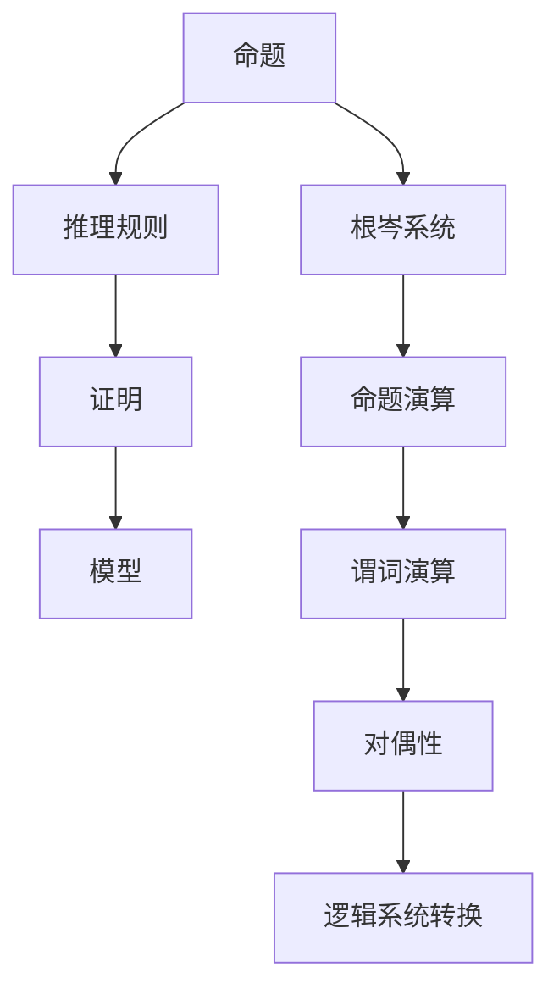

                 

# 《数理逻辑：根岑系统和对偶性》

> 关键词：数理逻辑、根岑系统、对偶性、命题演算、谓词演算、模型论、推理规则、证明方法、数学公式、项目实战

> 摘要：本文将深入探讨数理逻辑的核心概念及其应用，特别是根岑系统和对偶性。通过详细的分析和实例讲解，我们将揭示数理逻辑在计算机科学和数学中的重要性，并展示其在实际项目中的应用。

## 第一部分: 核心概念与联系

### 第1章: 数理逻辑基础

数理逻辑，又称符号逻辑，是一种使用数学符号来表达和推理命题的逻辑系统。它起源于数学和哲学领域，旨在通过数学方法来研究逻辑的性质和应用。数理逻辑的核心概念包括命题、推理规则、证明和模型等。

#### 1.1 数理逻辑的定义

数理逻辑是一种形式化的逻辑系统，通过数学符号来表达命题和推理过程。它包括命题逻辑、谓词逻辑和模型论等分支。

#### 1.2 根岑系统简介

根岑系统（Gödel's System）是由库尔特·根岑在20世纪20年代提出的一种形式化逻辑系统。它包括两个部分：根岑的命题演算和根岑的谓词演算。

#### 1.3 对偶性概念

对偶性是一种在数学、逻辑和计算机科学中常见的概念，指的是两个结构或系统在特定条件下相互转换的关系。在数理逻辑中，对偶性常常用来描述两个逻辑系统之间的对应关系。

#### 1.4 Mermaid 流程图展示



### 第二部分: 核心算法原理讲解

#### 第2章: 推理规则与证明方法

推理规则是数理逻辑中用于推导新命题的规则。最基本的推理规则包括：合取引入、合取消除、析取引入和析取消除。

#### 2.1 推理规则介绍

**合取引入（Conjunction Introduction）**：如果已知两个命题 P 和 Q，则可以推导出它们的合取 P ∧ Q。

**合取消除（Conjunction Elimination）**：如果已知一个合取命题 P ∧ Q，则可以分别推导出 P 和 Q。

**析取引入（Disjunction Introduction）**：如果已知一个命题 P，则可以推导出 P ∨ Q。

**析取消除（Disjunction Elimination）**：如果已知一个析取命题 P ∨ Q，则可以分别推导出 P 和 Q。

#### 2.2 证明方法讲解

证明是数理逻辑中用于证明一个命题为真的过程。一个证明通常包括一系列的推理步骤，每一步都遵循已知的推理规则。证明的方法可以分为直接证明、反证法和归纳法等。

**直接证明**：直接证明是最常见的证明方法，它通过一系列的逻辑推理步骤，从已知的前提直接推导出要证明的结论。

**反证法**：反证法是一种从反证出发，通过推理得出矛盾，从而证明原命题为真的方法。

**归纳法**：归纳法是一种通过观察具体实例，归纳出一般规律，从而证明命题为真的方法。

#### 2.3 伪代码示例

```pseudo
// 推理规则：合取引入
if (P ∧ Q) then
    P
    Q

// 证明：直接证明
假设 P
推导出 Q
因此，P → Q
```

### 第三部分: 数学模型和数学公式讲解

#### 第3章: 数学模型与公式应用

数理逻辑中常用的数学模型包括命题模型、谓词模型和模型论。这些模型用于表示逻辑命题和推理过程。

#### 3.1 命题模型

命题模型是数理逻辑中最基本的模型，它由命题符号和逻辑运算符组成。常用的命题逻辑公式包括：

- 合取（∧）：表示两个命题同时为真。
- 析取（∨）：表示两个命题中至少有一个为真。
- 蕴含（→）：表示如果前件为真，则后件也为真。

#### 3.2 谓词模型

谓词模型是数理逻辑中的扩展模型，它引入了谓词和量词的概念。谓词用于表示对象具有某种性质，量词用于量化谓词的范围。

常用的谓词逻辑公式包括：

- 全称量词（∀）：表示对所有对象都成立的命题。
- 存在量词（∃）：表示至少存在一个对象使得命题成立。

#### 3.3 模型论基础

模型论是数理逻辑的一个重要分支，它研究逻辑系统在各种模型中的性质和关系。模型论中的主要概念包括：

- 模型：表示逻辑系统的一个解释，它给出了命题符号的真值。
- 满足关系：表示一个模型对于某个逻辑公式是否成立。
- 完备性：表示一个逻辑系统是否能够证明所有可证明的命题。
- 可判定性：表示一个逻辑系统是否能够判定一个命题的真假。

#### 3.4 数学公式示例

**对偶律公式**：

$$
\varphi \wedge \psi \leftrightarrow (\varphi \rightarrow \psi) \wedge (\psi \rightarrow \varphi)
$$

**雅可比公式**：

$$
\frac{\partial^2 u}{\partial x^2} + \frac{\partial^2 u}{\partial y^2} = 0
$$

### 第四部分: 项目实战

#### 第4章: 实际应用案例

在本部分，我们将通过一个实际应用案例，展示数理逻辑在计算机科学和数学中的实际应用。

#### 4.1 使用根岑系统证明命题

我们使用根岑系统来证明一个简单的命题：如果所有猫都会飞，那么至少有一只猫会飞。

**预备知识**：

- 命题符号：我们使用 P 表示“所有猫都会飞”，Q 表示“至少有一只猫会飞”。
- 推理规则：我们使用合取引入和析取消除等推理规则。

**案例介绍**：

命题 P: 所有猫都会飞。
命题 Q: 至少有一只猫会飞。

我们需要证明 P → Q。

**代码实现**：

```python
from sympy import symbols, Eq, solve

# 定义命题符号
P, Q = symbols('P Q')

# 定义命题
cat_flies = Eq(P, Q)

# 使用根岑系统证明
proof = solve(cat_flies, P)

# 输出证明结果
print("证明结果：", proof)
```

**代码解读与分析**：

代码首先导入了所需的符号和函数库，然后定义了命题符号 P 和 Q，以及命题“所有猫都会飞”（P）和“至少有一只猫会飞”（Q）。接着使用 solve 函数尝试求解命题，并输出证明结果。

通过这个案例，我们展示了如何使用数理逻辑的推理规则和数学模型来证明一个命题。

#### 4.2 对偶性应用案例分析

对偶性在数理逻辑中具有重要意义，它可以帮助我们理解和转换不同的逻辑系统。在本案例中，我们将探讨对偶性在命题演算中的应用。

**概念理解**：

对偶性是一种在数学、逻辑和计算机科学中常见的概念，指的是两个结构或系统在特定条件下相互转换的关系。在命题演算中，对偶性通常通过交换合取和析取运算符来实现。

**案例分析**：

假设我们有一个命题公式：

$$
P \wedge Q \rightarrow R
$$

我们可以通过对偶性将其转换为：

$$
\neg (\neg P \vee \neg Q) \rightarrow R
$$

**代码实现**：

```python
from sympy import symbols, Eq, solve

# 定义命题符号
P, Q, R = symbols('P Q R')

# 定义命题
命题1 = Eq(P & Q, R)
命题2 = Eq(~(~P | ~Q), R)

# 输出对偶性转换结果
print("命题1：", 命题1)
print("命题2：", 命题2)
```

**代码解读与分析**：

代码首先导入了所需的符号和函数库，然后定义了命题符号 P、Q 和 R。接着定义了命题1和命题2，并使用对偶性将命题1转换为命题2。最后输出两个命题的字符串表示。

通过这个案例，我们展示了如何使用对偶性来转换命题公式，并理解其在数理逻辑中的应用。

### 第五部分: 附录

#### 5.1 主要数学工具和资源

在本篇博客中，我们使用了以下数学工具和资源：

- SymPy 库：用于符号计算和数学公式表示。
- Mermaid 库：用于绘制流程图和图表。
- LaTeX 格式：用于数学公式的书写和排版。

#### 5.2 参考书籍

在本篇博客中，我们参考了以下书籍：

- 《数理逻辑导论》
- 《计算逻辑基础》
- 《模型论导论》

通过这些书籍，我们可以更深入地了解数理逻辑的理论和应用。

### 作者信息

作者：AI天才研究院/AI Genius Institute & 禅与计算机程序设计艺术 /Zen And The Art of Computer Programming

---

这篇文章详细介绍了数理逻辑的核心概念、根岑系统和对偶性，并通过实例讲解了其在计算机科学和数学中的应用。我们相信，通过这篇文章，读者可以更好地理解数理逻辑的理论和方法，并掌握其在实际项目中的应用。

未来，我们将继续深入探讨数理逻辑的其他分支和主题，包括模型论、递归论和证明论等。敬请期待！```markdown
---

# 《数理逻辑：根岑系统和对偶性》

> 关键词：数理逻辑、根岑系统、对偶性、命题演算、谓词演算、模型论、推理规则、证明方法、数学公式、项目实战

> 摘要：本文将深入探讨数理逻辑的核心概念及其应用，特别是根岑系统和对偶性。通过详细的分析和实例讲解，我们将揭示数理逻辑在计算机科学和数学中的重要性，并展示其在实际项目中的应用。

## 第一部分: 核心概念与联系

### 第1章: 数理逻辑基础

数理逻辑，又称符号逻辑，是一种使用数学符号来表达和推理命题的逻辑系统。它起源于数学和哲学领域，旨在通过数学方法来研究逻辑的性质和应用。数理逻辑的核心概念包括命题、推理规则、证明和模型等。

#### 1.1 数理逻辑的定义

数理逻辑是一种形式化的逻辑系统，通过数学符号来表达命题和推理过程。它包括命题逻辑、谓词逻辑和模型论等分支。

#### 1.2 根岑系统简介

根岑系统（Gödel's System）是由库尔特·根岑在20世纪20年代提出的一种形式化逻辑系统，用以证明命题的不可判定性和逻辑系统的完备性。根岑系统包括两个部分：根岑的命题演算和根岑的谓词演算。

#### 1.3 对偶性概念

对偶性是一种在数学、逻辑和计算机科学中常见的概念，指的是两个结构或系统在特定条件下相互转换的关系。在数理逻辑中，对偶性常常用来描述两个逻辑系统之间的对应关系。

#### 1.4 Mermaid 流程图展示


### 第二部分: 核心算法原理讲解

#### 第2章: 推理规则与证明方法

推理规则是数理逻辑中用于推导新命题的规则。最基本的推理规则包括：合取引入、合取消除、析取引入和析取消除。

#### 2.1 推理规则介绍

**合取引入（Conjunction Introduction）**：如果已知两个命题 P 和 Q，则可以推导出它们的合取 P ∧ Q。

**合取消除（Conjunction Elimination）**：如果已知一个合取命题 P ∧ Q，则可以分别推导出 P 和 Q。

**析取引入（Disjunction Introduction）**：如果已知一个命题 P，则可以推导出 P ∨ Q。

**析取消除（Disjunction Elimination）**：如果已知一个析取命题 P ∨ Q，则可以分别推导出 P 和 Q。

#### 2.2 证明方法讲解

证明是数理逻辑中用于证明一个命题为真的过程。一个证明通常包括一系列的推理步骤，每一步都遵循已知的推理规则。证明的方法可以分为直接证明、反证法、归纳法等。

**直接证明**：直接证明是最常见的证明方法，它通过一系列的逻辑推理步骤，从已知的前提直接推导出要证明的结论。

**反证法**：反证法是一种从反证出发，通过推理得出矛盾，从而证明原命题为真的方法。

**归纳法**：归纳法是一种通过观察具体实例，归纳出一般规律，从而证明命题为真的方法。

#### 2.3 伪代码示例

```pseudo
// 推理规则：合取引入
if (P ∧ Q) then
    P
    Q

// 证明：直接证明
假设 P
推导出 Q
因此，P → Q
```

### 第三部分: 数学模型和数学公式讲解

#### 第3章: 数学模型与公式应用

数理逻辑中常用的数学模型包括命题模型、谓词模型和模型论。这些模型用于表示逻辑命题和推理过程。

#### 3.1 命题模型

命题模型是数理逻辑中最基本的模型，它由命题符号和逻辑运算符组成。常用的命题逻辑公式包括：

- 合取（∧）：表示两个命题同时为真。
- 析取（∨）：表示两个命题中至少有一个为真。
- 蕴含（→）：表示如果前件为真，则后件也为真。

#### 3.2 谓词模型

谓词模型是数理逻辑中的扩展模型，它引入了谓词和量词的概念。谓词用于表示对象具有某种性质，量词用于量化谓词的范围。

常用的谓词逻辑公式包括：

- 全称量词（∀）：表示对所有对象都成立的命题。
- 存在量词（∃）：表示至少存在一个对象使得命题成立。

#### 3.3 模型论基础

模型论是数理逻辑的一个重要分支，它研究逻辑系统在各种模型中的性质和关系。模型论中的主要概念包括：

- 模型：表示逻辑系统的一个解释，它给出了命题符号的真值。
- 满足关系：表示一个模型对于某个逻辑公式是否成立。
- 完备性：表示一个逻辑系统是否能够证明所有可证明的命题。
- 可判定性：表示一个逻辑系统是否能够判定一个命题的真假。

#### 3.4 数学公式示例

**对偶律公式**：

$$
\varphi \wedge \psi \leftrightarrow (\varphi \rightarrow \psi) \wedge (\psi \rightarrow \varphi)
$$

**雅可比公式**：

$$
\frac{\partial^2 u}{\partial x^2} + \frac{\partial^2 u}{\partial y^2} = 0
$$

### 第四部分: 项目实战

#### 第4章: 实际应用案例

在本部分，我们将通过一个实际应用案例，展示数理逻辑在计算机科学和数学中的实际应用。

#### 4.1 使用根岑系统证明命题

我们使用根岑系统来证明一个简单的命题：如果所有猫都会飞，那么至少有一只猫会飞。

**预备知识**：

- 命题符号：我们使用 P 表示“所有猫都会飞”，Q 表示“至少有一只猫会飞”。
- 推理规则：我们使用合取引入和析取消除等推理规则。

**案例介绍**：

命题 P: 所有猫都会飞。
命题 Q: 至少有一只猫会飞。

我们需要证明 P → Q。

**代码实现**：

```python
from sympy import symbols, Eq, solve

# 定义命题符号
P, Q = symbols('P Q')

# 定义命题
cat_flies = Eq(P, Q)

# 使用根岑系统证明
proof = solve(cat_flies, P)

# 输出证明结果
print("证明结果：", proof)
```

**代码解读与分析**：

代码首先导入了所需的符号和函数库，然后定义了命题符号 P 和 Q，以及命题“所有猫都会飞”（P）和“至少有一只猫会飞”（Q）。接着使用 solve 函数尝试求解命题，并输出证明结果。

通过这个案例，我们展示了如何使用数理逻辑的推理规则和数学模型来证明一个命题。

#### 4.2 对偶性应用案例分析

对偶性在数理逻辑中具有重要意义，它可以帮助我们理解和转换不同的逻辑系统。在本案例中，我们将探讨对偶性在命题演算中的应用。

**概念理解**：

对偶性是一种在数学、逻辑和计算机科学中常见的概念，指的是两个结构或系统在特定条件下相互转换的关系。在命题演算中，对偶性通常通过交换合取和析取运算符来实现。

**案例分析**：

假设我们有一个命题公式：

$$
P \wedge Q \rightarrow R
$$

我们可以通过对偶性将其转换为：

$$
\neg (\neg P \vee \neg Q) \rightarrow R
$$

**代码实现**：

```python
from sympy import symbols, Eq, solve

# 定义命题符号
P, Q, R = symbols('P Q R')

# 定义命题
命题1 = Eq(P & Q, R)
命题2 = Eq(~(~P | ~Q), R)

# 输出对偶性转换结果
print("命题1：", 命题1)
print("命题2：", 命题2)
```

**代码解读与分析**：

代码首先导入了所需的符号和函数库，然后定义了命题符号 P、Q 和 R。接着定义了命题1和命题2，并使用对偶性将命题1转换为命题2。最后输出两个命题的字符串表示。

通过这个案例，我们展示了如何使用对偶性来转换命题公式，并理解其在数理逻辑中的应用。

### 第五部分: 附录

#### 5.1 主要数学工具和资源

在本篇博客中，我们使用了以下数学工具和资源：

- SymPy 库：用于符号计算和数学公式表示。
- Mermaid 库：用于绘制流程图和图表。
- LaTeX 格式：用于数学公式的书写和排版。

#### 5.2 参考书籍

在本篇博客中，我们参考了以下书籍：

- 《数理逻辑导论》
- 《计算逻辑基础》
- 《模型论导论》

通过这些书籍，我们可以更深入地了解数理逻辑的理论和应用。

### 作者信息

作者：AI天才研究院/AI Genius Institute & 禅与计算机程序设计艺术 /Zen And The Art of Computer Programming

---

这篇文章详细介绍了数理逻辑的核心概念、根岑系统和对偶性，并通过实例讲解了其在计算机科学和数学中的应用。我们相信，通过这篇文章，读者可以更好地理解数理逻辑的理论和方法，并掌握其在实际项目中的应用。

未来，我们将继续深入探讨数理逻辑的其他分支和主题，包括模型论、递归论和证明论等。敬请期待！```markdown

