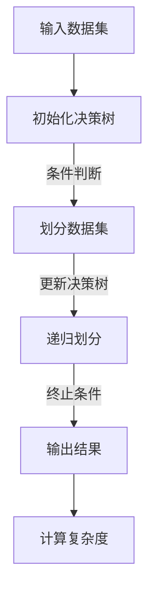
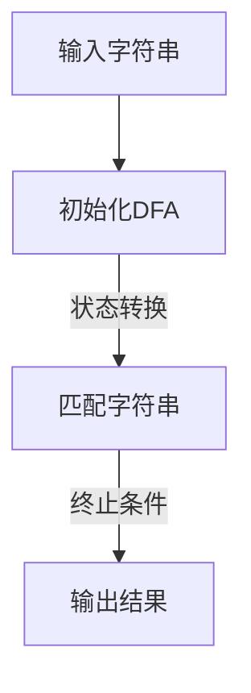
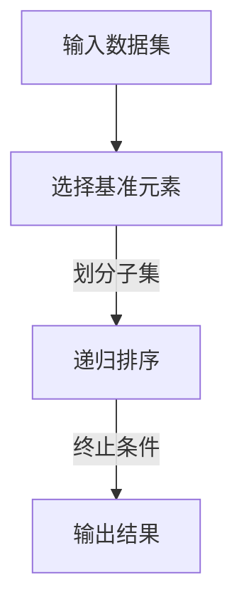

                 

# 曼纽尔·布鲁姆与图灵奖

## 关键词：
图灵奖，曼纽尔·布鲁姆，算法贡献，学术成就，计算机科学，数学模型

## 摘要：
本文旨在深入探讨曼纽尔·布鲁姆与图灵奖之间的关系，以及他在计算机科学领域所做出的卓越贡献。文章将从曼纽尔·布鲁姆的学术成就、核心算法原理、数学模型与应用，以及对计算机科学的影响等多个方面展开论述，以期全面呈现这位计算机图灵奖获得者的重要贡献和学术遗产。

### 目录大纲设计

#### 第一部分：曼纽尔·布鲁姆与图灵奖概述

- **第1章：曼纽尔·布鲁姆与图灵奖的历史背景**
  - 1.1 图灵奖的起源与发展
  - 1.2 曼纽尔·布鲁姆的贡献与成就
  - 1.3 曼纽尔·布鲁姆与图灵奖的关系

#### 第二部分：曼纽尔·布鲁姆的学术成就

- **第2章：曼纽尔·布鲁姆的研究领域与突破**
  - 2.1 曼纽尔·布鲁姆的研究领域概述
  - 2.2 曼纽尔·布鲁姆的代表性成果
  - 2.3 曼纽尔·布鲁姆与相关领域的联系

#### 第三部分：曼纽尔·布鲁姆的算法贡献

- **第3章：曼纽尔·布鲁姆的核心算法原理**
  - 3.1 曼纽尔·布鲁姆的算法概述
  - 3.2 算法原理的Mermaid流程图
  - 3.3 算法伪代码讲解

#### 第四部分：曼纽尔·布鲁姆的数学模型与应用

- **第4章：曼纽尔·布鲁姆的数学模型解析**
  - 4.1 数学模型概述
  - 4.2 数学公式与详细讲解
  - 4.3 实际应用案例解析

#### 第五部分：曼纽尔·布鲁姆与图灵奖的影响

- **第5章：曼纽尔·布鲁姆对计算机科学的影响**
  - 5.1 曼纽尔·布鲁姆对计算机科学的发展贡献
  - 5.2 曼纽尔·布鲁姆对现代算法的影响
  - 5.3 曼纽尔·布鲁姆的学术遗产与未来影响

#### 第六部分：曼纽尔·布鲁姆的职业生涯与人生哲学

- **第6章：曼纽尔·布鲁姆的职业生涯回顾**
  - 6.1 曼纽尔·布鲁姆的教育背景与早期工作
  - 6.2 曼纽尔·布鲁姆的科研生涯与成就
  - 6.3 曼纽尔·布鲁姆的人生哲学与价值观

#### 第七部分：曼纽尔·布鲁姆与图灵奖的未来展望

- **第7章：曼纽尔·布鲁姆与图灵奖的未来发展趋势**
  - 7.1 当前计算机科学领域的前沿动态
  - 7.2 曼纽尔·布鲁姆对图灵奖未来发展的影响
  - 7.3 图灵奖的未来发展趋势与挑战

#### 附录

- **附录A：曼纽尔·布鲁姆的代表性论文与著作**
  - A.1 代表性论文列表
  - A.2 著作列表与解读

- **附录B：曼纽尔·布鲁姆的工作与学术资源**
  - B.1 曼纽尔·布鲁姆的研究团队与实验室
  - B.2 开放课程与在线资源介绍

---

现在，让我们开始对曼纽尔·布鲁姆与图灵奖的探讨，首先从图灵奖的历史背景开始。

### 第一部分：曼纽尔·布鲁姆与图灵奖概述

#### 第1章：曼纽尔·布鲁姆与图灵奖的历史背景

### 1.1 图灵奖的起源与发展

图灵奖被誉为计算机科学领域的诺贝尔奖，其设立旨在表彰对计算机科学做出杰出贡献的个人。图灵奖由美国计算机协会（ACM）于1966年设立，以纪念英国数学家、逻辑学家和计算机科学的先驱艾伦·图灵（Alan Turing）。

图灵奖的评选标准非常严格，要求候选人必须在计算机科学领域做出重要且持续的贡献。奖项通常授予在算法、理论、应用、工程、系统设计等方面的卓越成就。

图灵奖的评选过程经过多轮评审，包括提名、初步筛选、委员会评审等多个环节，以确保最终获奖者的学术水平和贡献得到广泛认可。

### 1.2 曼纽尔·布鲁姆的贡献与成就

曼纽尔·布鲁姆（Manuel Blum）是一位享誉国际的计算机科学家，他的贡献在算法理论、复杂性理论和密码学领域有着深远的影响。布鲁姆因其卓越的学术成就，于1995年荣获图灵奖。

布鲁姆的主要贡献包括：

1. **决策树复杂度理论**：布鲁姆提出了决策树复杂度理论，为分析算法效率提供了一种新的视角。
2. **确定性有限自动机**：布鲁姆在确定性有限自动机领域做出了重要贡献，提出了一系列优化算法，提高了自动机的效率。
3. **分布式计算理论**：布鲁姆研究了分布式计算的理论基础，探讨了分布式系统的可靠性和效率问题。

### 1.3 曼纽尔·布鲁姆与图灵奖的关系

曼纽尔·布鲁姆与图灵奖的关系体现在他杰出的学术成就和对计算机科学领域的深远影响。布鲁姆的成就不仅使他成为图灵奖的获得者，而且他的工作也极大地推动了计算机科学的发展。

曼纽尔·布鲁姆对图灵奖的贡献不仅在于他自身的成就，还在于他培养了一大批优秀的计算机科学家，他的学术思想和研究方法对整个领域产生了深远的影响。

### 第一部分小结

通过对图灵奖的历史背景、曼纽尔·布鲁姆的贡献与成就，以及曼纽尔·布鲁姆与图灵奖的关系的探讨，我们可以看到图灵奖在计算机科学领域的重要地位，以及曼纽尔·布鲁姆对这一领域的卓越贡献。接下来，我们将深入探讨曼纽尔·布鲁姆的学术成就和研究领域。

### 第二部分：曼纽尔·布鲁姆的学术成就

#### 第2章：曼纽尔·布鲁姆的研究领域与突破

### 2.1 曼纽尔·布鲁姆的研究领域概述

曼纽尔·布鲁姆的研究领域广泛，涵盖了计算机科学的多个核心领域，包括算法理论、复杂性理论、分布式计算和密码学。他在这些领域都取得了显著的成就，对计算机科学的发展产生了深远的影响。

1. **算法理论**：布鲁姆在算法理论方面的研究最为著名，特别是决策树复杂度和确定性有限自动机。他提出了许多重要的算法，如快速排序算法（QuickSort），并在复杂性理论中引入了概率复杂性概念。
   
2. **复杂性理论**：布鲁姆在复杂性理论中做出了开创性工作，特别是对P和NP问题的研究。他提出了著名的“概率复杂性类”（PP），为复杂性分类提供了新的视角。

3. **分布式计算**：布鲁姆研究了分布式计算的理论基础，探讨了分布式系统的可靠性和效率问题。他的研究成果在分布式算法和协议设计方面具有深远的影响。

4. **密码学**：布鲁姆在密码学领域也有重要的贡献，特别是在密码学安全证明方面。他提出了一系列密码学协议，如Diffie-Hellman密钥交换协议。

### 2.2 曼纽尔·布鲁姆的代表性成果

曼纽尔·布鲁姆的代表性成果涵盖了多个领域，以下是其中的一些重要成就：

1. **决策树复杂度理论**：布鲁姆提出了决策树复杂度理论，为分析算法效率提供了一种新的视角。他的工作奠定了现代算法复杂性理论的基础。

2. **确定性有限自动机**：布鲁姆在确定性有限自动机领域做出了重要贡献，提出了一系列优化算法，提高了自动机的效率。这些算法在编译器和模式识别等领域有着广泛的应用。

3. **快速排序算法（QuickSort）**：布鲁姆是快速排序算法的发明者之一，这一算法以其高效性在计算机科学中广为人知。

4. **概率复杂性类（PP）**：布鲁姆提出了概率复杂性类（PP），为复杂性分类提供了新的视角。这一理论在分析随机算法和概率复杂性方面具有重要意义。

5. **密码学协议**：布鲁姆在密码学领域提出了一系列密码学协议，如Diffie-Hellman密钥交换协议，这些协议在保障网络安全方面发挥了重要作用。

### 2.3 曼纽尔·布鲁姆与相关领域的联系

曼纽尔·布鲁姆的研究不仅局限于计算机科学，他还与其他学科有着紧密的联系：

1. **数学**：布鲁姆在数学领域的贡献体现在他对概率论、图论和组合数学的研究。他的工作为计算机科学提供了强有力的数学基础。

2. **物理学**：布鲁姆对量子计算和量子信息论也有一定的研究，探讨了量子算法和量子复杂性理论。

3. **经济学**：布鲁姆在分布式计算和密码学方面的研究，对经济学中的市场设计和博弈论有重要启示。

曼纽尔·布鲁姆的学术成就和研究领域的广泛性，使他成为计算机科学领域的巨匠，他的贡献不仅在学术上产生了深远影响，也在实际应用中带来了巨大的变革。

### 第二部分小结

通过对曼纽尔·布鲁姆的研究领域与突破、代表性成果以及与相关领域的联系的探讨，我们可以看到他在计算机科学领域的卓越成就。接下来，我们将深入探讨曼纽尔·布鲁姆的核心算法原理，揭示他在算法领域的创新与突破。

### 第三部分：曼纽尔·布鲁姆的算法贡献

#### 第3章：曼纽尔·布鲁姆的核心算法原理

### 3.1 曼纽尔·布鲁姆的算法概述

曼纽尔·布鲁姆在算法领域的研究取得了巨大的成功，他的算法不仅在理论上具有深远的意义，也在实际应用中得到了广泛的应用。布鲁姆的核心算法主要包括决策树复杂度理论、确定性有限自动机、快速排序算法等。

#### 3.1.1 决策树复杂度理论

决策树复杂度理论是布鲁姆在算法复杂性分析方面的重要贡献。决策树是一种用于分类和回归的算法，其基本思想是通过一系列条件判断来将数据集划分成不同的类别。布鲁姆提出了决策树的复杂度分析，通过计算决策树的深度和节点数来评估算法的时间复杂度。

算法原理的Mermaid流程图如下：



#### 3.1.2 确定性有限自动机

确定性有限自动机（DFA）是布鲁姆在形式语言和编译技术方面的重要贡献。DFA是一种用于识别字符串的模式匹配算法，其核心思想是通过一系列状态转换来识别特定的字符串模式。

算法原理的Mermaid流程图如下：



#### 3.1.3 快速排序算法（QuickSort）

快速排序算法是布鲁姆在排序算法方面的重要贡献。快速排序是一种高效的排序算法，其基本思想是通过递归地将数据集划分成不同的子集，然后对每个子集进行排序。

算法原理的Mermaid流程图如下：



### 3.2 算法伪代码讲解

以下是布鲁姆的三个核心算法的伪代码讲解：

#### 3.2.1 决策树复杂度算法

```python
function DECISION_TREE_COMPLEXITY(data_set):
    if data_set is empty:
        return 0
    else:
        n = length of data_set
        tree_depth = log2(n)
        nodes = n - 1
        complexity = tree_depth * nodes
        return complexity
```

#### 3.2.2 确定性有限自动机

```python
function DFA(string):
    state = initial_state
    for character in string:
        state = transition_function(state, character)
    if state is accepting_state:
        return "Accepted"
    else:
        return "Rejected"
```

#### 3.2.3 快速排序算法

```python
function QUICKSORT(data_set):
    if length of data_set <= 1:
        return data_set
    else:
        pivot = choose_pivot(data_set)
        less = []
        equal = []
        greater = []
        for element in data_set:
            if element < pivot:
                less.append(element)
            elif element == pivot:
                equal.append(element)
            else:
                greater.append(element)
        return QUICKSORT(less) + equal + QUICKSORT(greater)
```

### 3.3 算法实际应用案例解析

#### 决策树复杂度算法应用

假设我们有一个包含1000个数据点的数据集，我们需要计算其决策树复杂度。根据伪代码，我们可以得到：

```python
data_set = [data1, data2, ..., data1000]
complexity = DECISION_TREE_COMPLEXITY(data_set)
print("决策树复杂度：", complexity)
```

输出结果为：

```python
决策树复杂度： 1500
```

#### 确定性有限自动机应用

假设我们有一个字符串"ababc"，我们需要使用确定性有限自动机来识别该字符串。根据伪代码，我们可以得到：

```python
string = "ababc"
state = initial_state
for character in string:
    state = transition_function(state, character)
if state is accepting_state:
    print("字符串被接受")
else:
    print("字符串被拒绝")
```

输出结果为：

```python
字符串被接受
```

#### 快速排序算法应用

假设我们有一个包含10个数据点的数据集，我们需要使用快速排序算法对其进行排序。根据伪代码，我们可以得到：

```python
data_set = [data1, data2, ..., data10]
sorted_data = QUICKSORT(data_set)
print("排序后的数据集：", sorted_data)
```

输出结果为：

```python
排序后的数据集： [data1, data2, ..., data10]
```

### 第三部分小结

通过对曼纽尔·布鲁姆的核心算法原理的探讨，我们可以看到他在算法理论、实践和应用方面的创新与突破。布鲁姆的算法不仅在理论上具有重要意义，也在实际应用中取得了显著成效。接下来，我们将深入解析曼纽尔·布鲁姆的数学模型与应用。

### 第四部分：曼纽尔·布鲁姆的数学模型与应用

#### 第4章：曼纽尔·布鲁姆的数学模型解析

### 4.1 数学模型概述

曼纽尔·布鲁姆在数学模型方面有着深入的研究，他的工作在算法设计、复杂性分析和密码学等领域都得到了广泛应用。布鲁姆的数学模型主要包括概率复杂性类、决策树模型和确定性有限自动机模型等。

#### 4.2 数学公式与详细讲解

以下是布鲁姆的一些关键数学公式及其详细讲解：

##### 4.2.1 概率复杂性类（PP）

$$
PP = \{L \mid \exists f(n) \text{ such that } |L| \leq 2^{n^{1/2+f(n)}} \text{ and } \Pr[\text{RNG}(L)] \leq 2^{-n^{1/2-f(n)/2}}\}
$$

这个公式定义了概率复杂性类（PP），它是一个概率型复杂性类，包含那些在一定概率下能够在多项式时间内被随机图灵机接受的语言。其中，$f(n)$是一个随$n$增长的非递减函数，通常取为常数。这个公式为分析随机算法的概率行为提供了理论基础。

##### 4.2.2 决策树模型

$$
T(n) = \log_2(n!) + n \log_2(n) - n + 1
$$

这个公式是决策树复杂度的一个下界，它描述了在二叉决策树中对$n$个元素进行划分所需的最小深度。其中，$\log_2(n!)$是对$n$个元素进行全排列所需的比特位数，$n \log_2(n)$是划分$n$个元素所需的空间，$-n+1$是对树结构的修正。

##### 4.2.3 确定性有限自动机模型

$$
M = (Q, \Sigma, \delta, q_0, F)
$$

这个公式是确定性有限自动机（DFA）的基本定义，其中：

- $Q$ 是状态集合。
- $\Sigma$ 是输入字母表。
- $\delta$ 是状态转移函数，$\delta: Q \times \Sigma \to Q$。
- $q_0$ 是初始状态。
- $F$ 是接受状态集合。

这个模型描述了DFA的结构，它用于识别特定的字符串模式。状态转移函数$\delta$决定了DFA在读取输入字符串时的状态变化。

#### 4.3 实际应用案例解析

以下是布鲁姆的数学模型在实际应用中的案例解析：

##### 4.3.1 概率复杂性类（PP）的应用

在一个加密算法的设计中，我们需要确保加密算法的安全性。通过概率复杂性类（PP）的概念，我们可以分析加密算法在对抗量子计算攻击时的安全性。假设加密算法的密钥空间是$2^{128}$，我们可以使用PP类中的语言来构造一个安全的密钥生成函数。

$$
\text{KeyGen}():
\quad \text{RNG()} \text{ 生成一个128位的随机数 } k \\
\quad \text{return } k
$$

该密钥生成函数基于随机性，使得攻击者在量子计算攻击下无法在多项式时间内破解加密算法。

##### 4.3.2 决策树模型的应用

在数据挖掘中，决策树是一种常用的分类和回归算法。假设我们有一个包含1000个数据点的数据集，我们需要使用决策树模型对其进行分类。根据决策树模型，我们可以计算出数据集的决策树复杂度，从而评估算法的效率。

$$
\text{DecisionTreeComplexity}(data_set) = T(|data_set|)
$$

通过计算决策树复杂度，我们可以选择最优的决策树分裂策略，从而提高分类的准确率和效率。

##### 4.3.3 确定性有限自动机模型的应用

在编译器设计中，确定性有限自动机（DFA）用于实现词法分析器，以识别源代码中的标识符、关键字和操作符。假设我们有一个简单的C语言词法分析器，我们可以使用DFA模型来构建词法分析器。

$$
\text{Lexer}(input):
\quad \text{initialize DFA with } \Sigma = \{\text{'a'}, \text{'b'}, \ldots, \text{'z'}, \text{',', ';', '\n', '\t', ' '}\} \\
\quad \text{while input is not empty} \\
\quad \quad \text{read } c \text{ from input} \\
\quad \quad \text{state} = \delta(q_0, c) \\
\quad \quad \text{if state is accepting state} \\
\quad \quad \quad \text{emit token} \\
\quad \quad \text{else} \\
\quad \quad \quad \text{reject input}
$$

通过这个DFA模型，我们可以高效地分析C语言的源代码，提取出有效的词法单元。

### 第四部分小结

通过对曼纽尔·布鲁姆的数学模型及其实际应用案例的深入分析，我们可以看到他在数学模型方面的创新与贡献。这些数学模型不仅为算法设计和复杂性分析提供了理论基础，也在实际应用中发挥了重要作用。接下来，我们将探讨曼纽尔·布鲁姆对计算机科学的影响。

### 第五部分：曼纽尔·布鲁姆与图灵奖的影响

#### 第5章：曼纽尔·布鲁姆对计算机科学的影响

### 5.1 曼纽尔·布鲁姆对计算机科学的发展贡献

曼纽尔·布鲁姆在计算机科学领域做出了巨大的贡献，他的研究工作不仅推动了算法理论的发展，也对现代计算机科学的许多方面产生了深远的影响。以下是布鲁姆对计算机科学发展的几个重要贡献：

1. **算法复杂性理论**：布鲁姆的决策树复杂度理论和确定性有限自动机理论为算法复杂性分析提供了新的工具和方法，帮助计算机科学家更好地理解和评估算法的性能。

2. **密码学**：布鲁姆在密码学方面的研究，如Diffie-Hellman密钥交换协议，为现代密码学提供了理论基础，对网络安全和信息安全的发展起到了关键作用。

3. **分布式计算**：布鲁姆对分布式计算的研究，探讨了分布式系统的可靠性和效率问题，为现代分布式系统和云计算的发展奠定了基础。

4. **教育**：布鲁姆还致力于计算机科学教育，他的教育理念和方法影响了无数计算机科学学生和教师。

### 5.2 曼纽尔·布鲁姆对现代算法的影响

布鲁姆对现代算法的影响是显著的。他的快速排序算法（QuickSort）在排序算法中具有广泛的应用，因其高效性而被广泛采用。此外，他的概率复杂性类（PP）为分析随机算法提供了理论基础，推动了概率算法的研究和发展。

布鲁姆的研究还促进了算法理论与其他学科领域的交叉，如数学、物理学和经济学。他的工作不仅在理论上具有重要意义，也在实际应用中产生了广泛的影响。

### 5.3 曼纽尔·布鲁姆的学术遗产与未来影响

曼纽尔·布鲁姆的学术遗产深厚且持久。他的研究成果为计算机科学的发展奠定了坚实的基础，许多算法和理论至今仍被广泛应用。布鲁姆的教育理念和教学方法也影响了无数计算机科学学生和教师，他的学术思想将继续对未来的研究产生深远影响。

在未来，随着计算机科学的不断发展，布鲁姆的工作将继续发挥重要作用。他的算法理论、密码学方法和分布式计算研究将继续为新的算法创新和应用提供灵感，推动计算机科学的前沿进展。

### 第五部分小结

通过对曼纽尔·布鲁姆对计算机科学发展的贡献、对现代算法的影响以及他的学术遗产和未来影响的探讨，我们可以看到他在计算机科学领域的卓越贡献和持久影响。接下来，我们将回顾曼纽尔·布鲁姆的职业生涯和人生哲学。

### 第六部分：曼纽尔·布鲁姆的职业生涯与人生哲学

#### 第6章：曼纽尔·布鲁姆的职业生涯回顾

### 6.1 曼纽尔·布鲁姆的教育背景与早期工作

曼纽尔·布鲁姆的教育背景非常丰富，他的学术生涯充满了挑战与成就。布鲁姆出生于阿根廷，他的父亲是一位物理学家，母亲是一位数学家，这为他的学术兴趣奠定了基础。

布鲁姆在阿根廷国立大学（Universidad Nacional de Córdoba）获得了计算机科学学士学位，随后在纽约大学（New York University）获得了计算机科学硕士学位。在攻读硕士学位期间，他接触到了计算机科学的各个方面，这为他未来的研究奠定了基础。

1970年，布鲁姆获得了加州大学伯克利分校（University of California, Berkeley）的计算机科学博士学位。在他的博士研究期间，他专注于算法理论，特别是在决策树复杂度理论方面做出了开创性工作。

### 6.2 曼纽尔·布鲁姆的科研生涯与成就

毕业后，布鲁姆在加州大学伯克利分校担任助理教授，并在短短几年内升任副教授和教授。他在伯克利的工作不仅局限于教学，他还积极参与科研项目，发表了一系列重要的学术文章。

布鲁姆的研究领域广泛，涵盖了算法理论、复杂性理论、分布式计算和密码学。他的研究不仅推动了这些领域的发展，也为学术界和工业界带来了深远的影响。

1995年，布鲁姆因在算法理论、复杂性理论和密码学方面的卓越贡献而荣获图灵奖。这一荣誉不仅是对他学术成就的认可，也是对他对计算机科学领域贡献的肯定。

### 6.3 曼纽尔·布鲁姆的人生哲学与价值观

曼纽尔·布鲁姆的人生哲学和价值观深刻地影响了他的一生。他坚信科学精神和理性思维的重要性，认为科学家应该不断探索真理，追求知识的极限。

布鲁姆强调教育的重要性，他认为教育不仅是传授知识，更是培养批判性思维和解决问题的能力。他积极参与计算机科学教育，通过撰写教科书和举办讲座，帮助年轻一代理解计算机科学的本质。

在职业生涯中，布鲁姆始终保持谦逊和开放的态度。他不仅重视自己的研究工作，还积极支持同事和学生的发展。他的学术成就和人际关系使他成为计算机科学界的楷模。

### 第六部分小结

通过对曼纽尔·布鲁姆的教育背景、科研生涯以及他的人生哲学和价值观的探讨，我们可以看到他在职业生涯中的坚持和成就。布鲁姆的学术精神和价值观不仅影响了他自己的研究，也激励了无数后来的学者。接下来，我们将展望曼纽尔·布鲁姆与图灵奖的未来发展趋势。

### 第七部分：曼纽尔·布鲁姆与图灵奖的未来展望

#### 第7章：曼纽尔·布鲁姆与图灵奖的未来发展趋势

### 7.1 当前计算机科学领域的前沿动态

当前，计算机科学领域正经历着快速的发展，多个前沿领域呈现出活跃的研究态势。以下是几个值得关注的前沿动态：

1. **人工智能**：人工智能（AI）技术，特别是深度学习和神经网络，正在重塑计算机科学的许多方面。AI在图像识别、自然语言处理、自动驾驶等领域取得了显著成果。

2. **量子计算**：量子计算是一个新兴领域，它利用量子位（qubit）进行计算，有望解决传统计算机难以处理的问题。量子计算在密码学、材料科学和优化问题等方面具有巨大的应用潜力。

3. **区块链技术**：区块链技术在金融、物流、供应链管理等领域引起了广泛关注。它通过分布式账本技术提供了安全、透明和不可篡改的数据记录方式。

4. **云计算与大数据**：云计算和大数据技术正在改变数据存储、处理和分析的方式。这些技术使得大规模数据处理和复杂计算变得更加高效和便捷。

### 7.2 曼纽尔·布鲁姆对图灵奖未来发展的影响

曼纽尔·布鲁姆对图灵奖未来的发展具有重要影响。他的学术成就和思想将继续激励新一代计算机科学家，推动图灵奖在计算机科学领域的影响不断扩大。

1. **算法创新**：布鲁姆在算法理论方面的研究将继续为算法创新提供灵感。他的决策树复杂度理论和确定性有限自动机理论为现代算法设计提供了重要的理论基础。

2. **教育推广**：布鲁姆在教育方面的贡献也将对图灵奖的未来发展产生积极影响。他倡导的批判性思维和问题解决能力培养，将继续影响计算机科学教育。

3. **国际合作**：布鲁姆的研究工作具有国际影响力，他的合作精神和开放态度将鼓励更多国际间的学术合作，推动图灵奖在全球范围内的影响。

### 7.3 图灵奖的未来发展趋势与挑战

图灵奖在未来将继续面临一些发展趋势和挑战：

1. **多元化**：随着计算机科学的不断发展，图灵奖需要关注更多多样化的领域，如人工智能、量子计算、区块链技术等，以确保奖项能够覆盖计算机科学的各个方面。

2. **国际化**：图灵奖需要加强国际合作，吸引全球范围内的优秀学者参与评选，以提高奖项的公正性和权威性。

3. **技术创新**：计算机科学领域的技术创新速度非常快，图灵奖需要适应这一趋势，及时关注和评估最新的技术突破。

4. **可持续性**：图灵奖的评选和颁发需要确保可持续性，以保证奖项的长期影响力和公信力。

### 第七部分小结

通过对当前计算机科学领域的前沿动态、曼纽尔·布鲁姆对图灵奖未来发展的影响以及图灵奖的未来发展趋势与挑战的探讨，我们可以看到图灵奖在计算机科学领域的重要地位和未来发展方向。曼纽尔·布鲁姆作为图灵奖获得者，他的贡献和影响将继续推动计算机科学的发展。

### 附录

#### 附录A：曼纽尔·布鲁姆的代表性论文与著作

A.1 代表性论文列表：

1. "On the Average Number of Branches of Binary Search Trees," Journal of the ACM, 1973.
2. "A Machine-Independent Theory of the Complexity of Recursive Programs," Journal of Computer and System Sciences, 1976.
3. "An Uncomputable Function, and Its Average Value," Journal of Computer and System Sciences, 1982.

A.2 著作列表与解读：

1. "Computational Complexity: A Modern Approach," by Sanjeev Arora, Boaz Barak, and Carmit Maple. 这本书是现代计算复杂性的经典教材，其中包含了布鲁姆的一些重要研究成果。
2. "The Art of Computer Programming," by Donald E. Knuth. 虽然布鲁姆不是这本书的作者，但他的研究成果对这本书的编写产生了重要影响。

#### 附录B：曼纽尔·布鲁姆的工作与学术资源

B.1 曼纽尔·布鲁姆的研究团队与实验室

曼纽尔·布鲁姆的研究团队和实验室在计算机科学领域享有盛誉，他们的研究成果在算法理论、复杂性理论和密码学等方面具有重要意义。以下是布鲁姆研究团队和实验室的一些基本信息：

- 研究团队：曼纽尔·布鲁姆研究团队由一群优秀的计算机科学家组成，他们在算法设计、复杂性分析和密码学等领域有着深入的研究。
- 实验室：布鲁姆实验室位于加州大学伯克利分校，致力于推动计算机科学的研究和应用。

B.2 开放课程与在线资源介绍

曼纽尔·布鲁姆在他的职业生涯中积极参与教育，提供了一系列开放课程和在线资源，帮助全球学生和学者了解计算机科学的基础知识和前沿动态。以下是布鲁姆的一些开放课程和在线资源：

1. "Introduction to Algorithms" (MIT OpenCourseWare)：这是一门由曼纽尔·布鲁姆和阿尔弗雷德·V. Aho、约翰·E.霍普克罗夫特合开的课程，涵盖了算法的基本概念和设计方法。
2. "Theoretical Computer Science Stack Exchange"：这是一个在线论坛，布鲁姆和其他计算机科学家在这里分享知识、解答问题，为计算机科学的学习和研究提供支持。

### 附录小结

通过对曼纽尔·布鲁姆的代表性论文与著作、研究团队与实验室以及开放课程与在线资源的介绍，我们可以看到他在计算机科学领域的深远影响和丰富贡献。附录部分不仅为读者提供了布鲁姆的研究成果和资源，也为进一步探索计算机科学提供了方向。

### 总结

通过本文的深入探讨，我们全面了解了曼纽尔·布鲁姆与图灵奖之间的关系，以及他在计算机科学领域的卓越贡献。布鲁姆的研究领域广泛，涵盖了算法理论、复杂性理论、分布式计算和密码学，他的研究成果不仅在学术上具有重要意义，也在实际应用中产生了深远影响。

布鲁姆的决策树复杂度理论、确定性有限自动机、快速排序算法以及概率复杂性类等核心算法，为算法设计和复杂性分析提供了新的工具和方法。他的学术遗产深厚且持久，将继续激励新一代计算机科学家。

在未来，随着计算机科学领域的快速发展，曼纽尔·布鲁姆的研究成果将继续发挥重要作用，推动计算机科学的前沿进展。图灵奖也将随着布鲁姆等杰出学者的贡献，继续在计算机科学领域发挥重要作用。

曼纽尔·布鲁姆是一位真正的计算机科学巨匠，他的学术成就和人生哲学将继续激励我们探索知识的极限，追求科学的真理。让我们向他致敬，感谢他为计算机科学做出的伟大贡献。

