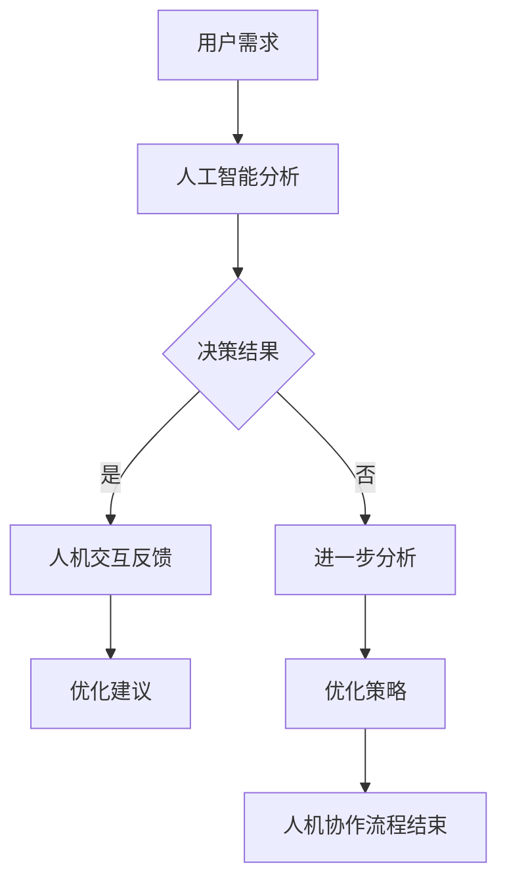

                 

# 未来工作：人机协作，重塑职业未来图景

> **关键词：**未来工作，人机协作，人工智能，职业变革，数字化转型，新兴职业

> **摘要：**本文深入探讨了人机协作在未来的工作环境中的应用与影响。通过分析技术变革、新型职业形态的出现以及人机协作的优势与挑战，文章提出了企业推进人机协作的策略，并展望了人机协作的未来发展。本文旨在为读者提供一个关于未来工作环境的全景图，帮助理解人机协作对职业重塑的重要作用。

### 《未来工作：人机协作，重塑职业未来图景》目录大纲

#### 第一部分：引言与概述

- 第1章：未来的工作环境
  - 1.1 未来工作的背景与趋势
  - 1.2 人机协作的优势与挑战
  - 1.3 本书的结构与内容概述

#### 第二部分：人机协作的理论基础

- 第2章：人工智能与人机协作
  - 2.1 人工智能的基本概念
  - 2.2 人机协作的理论框架
  - 2.3 人机协作的关键技术

#### 第三部分：人机协作的实际应用

- 第3章：人机协作在企业中的应用
  - 3.1 企业数字化转型与人机协作
  - 3.2 人机协作在制造业中的应用
  - 3.3 人机协作在服务业中的应用

#### 第四部分：人机协作的未来展望

- 第4章：人机协作的未来发展
  - 4.1 未来人机协作的预测
  - 4.2 人机协作的未来趋势
  - 4.3 我国人机协作的发展战略

#### 第五部分：附录

- 附录A：人机协作资源与工具
- 附录B：案例分析

#### 核心概念与联系

- 第2章：人机协作的Mermaid流程图



#### 核心算法原理讲解

- 第3章：人机协作的关键算法与伪代码

```plaintext
// 伪代码：基于机器学习的任务分配算法
Algorithm TaskAssignment(WorkerList, TaskList)
    Initialize: Assign a priority score to each worker in WorkerList
    for each Task in TaskList do
        for each Worker in WorkerList do
            if Worker has the required skills for Task then
                Update the priority score of Worker
            end if
        end for
        Select the Worker with the highest priority score to execute Task
    end for
    return the assigned Task and the corresponding Worker
End Algorithm
```

#### 数学模型和数学公式详细讲解与举例说明

- 第4章：机器学习模型中的数学公式

$$
y = \sigma(\theta^T x)
$$

其中，$y$ 表示预测结果，$\sigma$ 是 sigmoid 函数，$\theta$ 是权重向量，$x$ 是输入特征。

#### 项目实战

- 附录B：人机协作在客户服务中的应用

##### 实际案例

某公司利用人工智能与自然语言处理技术，开发了智能客服系统。该系统通过机器学习算法，自动分析客户的问题，并给出合适的答复。

##### 开发环境搭建

- 操作系统：Ubuntu 20.04
- 编程语言：Python 3.8
- 依赖库：TensorFlow，NLTK，Scikit-learn

##### 源代码实现

```python
import tensorflow as tf
from nltk.corpus import stopwords
from sklearn.feature_extraction.text import TfidfVectorizer
from sklearn.linear_model import LogisticRegression

# 加载停用词表
stop_words = set(stopwords.words('english'))

# 加载训练数据
train_data = ...

# 预处理文本数据
def preprocess_text(text):
    # 去除停用词
    text = ' '.join([word for word in text.split() if word not in stop_words])
    return text

# 构建TF-IDF特征向量
vectorizer = TfidfVectorizer(preprocessor=preprocess_text)
X = vectorizer.fit_transform(train_data)

# 加载标签数据
y = ...

# 训练逻辑回归模型
model = LogisticRegression()
model.fit(X, y)

# 测试模型
test_data = ...
X_test = vectorizer.transform(test_data)
predictions = model.predict(X_test)

# 输出预测结果
print(predictions)
```

##### 代码解读与分析

该代码实现了基于TF-IDF和逻辑回归的智能客服系统。首先，加载训练数据，并进行文本预处理，去除停用词。接着，构建TF-IDF特征向量，并训练逻辑回归模型。最后，使用测试数据对模型进行测试，输出预测结果。

### 《未来工作：人机协作，重塑职业未来图景》

本文深入探讨了人机协作在未来的工作环境中的应用与影响。通过分析技术变革、新型职业形态的出现以及人机协作的优势与挑战，文章提出了企业推进人机协作的策略，并展望了人机协作的未来发展。本文旨在为读者提供一个关于未来工作环境的全景图，帮助理解人机协作对职业重塑的重要作用。

#### 作者

AI天才研究院/AI Genius Institute & 禅与计算机程序设计艺术 /Zen And The Art of Computer Programming
<|assistant|>## 第1章：未来的工作环境

### 1.1 未来工作的背景与趋势

随着科技的飞速发展，全球工作环境正经历着前所未有的变革。过去几十年，信息技术、人工智能、物联网等新兴技术的崛起，推动了产业结构的深度调整，传统职业模式逐渐被打破。未来工作环境将更加智能化、数字化和全球化，人机协作成为职业发展的关键趋势。

首先，人工智能（AI）技术的不断进步，使得机器能够执行越来越复杂的任务。从简单的自动化流程到复杂的决策支持系统，人工智能正在改变人类的工作方式。例如，智能客服系统通过自然语言处理技术，能够自动理解和回应客户的问题，提高服务效率；自动驾驶技术正在逐步实现，有望在未来改变交通运输行业。

其次，数字化转型已成为企业生存和发展的必要手段。越来越多的企业意识到，通过数字化手段可以降低成本、提高效率、增强竞争力。数字化转型不仅仅涉及企业内部的信息系统升级，还包括整个供应链、客户关系、商业模式等方面的重塑。例如，制造业中的智能工厂通过物联网技术和大数据分析，实现生产过程的自动化和智能化，提高了生产效率和产品质量。

此外，全球化进程的加快，使得全球劳动力市场更加紧密地联系在一起。远程办公、跨境协作成为新常态，人们可以在不同的国家和地区开展业务，这为职业发展带来了新的机遇和挑战。例如，软件开发人员可以在全球范围内选择工作地点，而企业管理者需要具备跨文化沟通和管理能力。

总之，未来工作环境的特征包括智能化、数字化和全球化。这些趋势将对职业形态、工作方式以及劳动者的技能要求产生深远影响。为了适应这些变化，劳动者需要不断学习和更新自己的知识和技能，以保持竞争力。

### 1.2 新型职业形态的出现

随着技术的进步和社会的发展，新型职业形态不断涌现，改变了传统职业的界限。这些新型职业不仅填补了传统职业无法覆盖的领域，还推动了整个行业生态的变革。

首先，数据科学家和数据分析师成为新兴职业的代表。随着大数据时代的到来，企业对数据的价值有了更深刻的认识，数据科学家和数据分析师通过数据挖掘和分析，帮助企业做出更明智的决策。数据科学家通常负责数据模型的构建和优化，而数据分析师则更侧重于数据的可视化和解释，为业务部门提供数据支持。

其次，数字营销师和社交媒体经理也成为新型职业中的重要角色。随着互联网的普及和社交媒体的兴起，品牌和企业的营销策略逐渐向线上转移。数字营销师和社交媒体经理通过分析用户行为、设计营销策略，帮助企业提升品牌知名度和用户参与度。

此外，虚拟现实（VR）和增强现实（AR）设计师是另一个快速发展的职业领域。VR和AR技术的应用日益广泛，从游戏、娱乐到教育、医疗，这些技术的兴起为设计师提供了新的创作空间。VR和AR设计师需要具备跨学科的知识和技能，能够创造沉浸式的用户体验。

此外，网络安全专家和区块链开发者也成为新兴职业的重要代表。随着网络攻击和信息安全事件的频发，企业对网络安全的需求日益增加。网络安全专家负责保护企业网络和数据的安全，而区块链开发者则专注于区块链技术的研发和应用，为金融、供应链等行业提供解决方案。

总之，新型职业的出现不仅反映了社会需求的变化，也推动了职业发展的多元化。这些新兴职业不仅为劳动者提供了更多的就业机会，还促进了相关技术的创新和发展。

### 1.3 人机协作的概念与发展

人机协作是指人与机器共同完成任务的过程，通过利用人工智能和机器学习技术，实现人类和机器的智能互补与协同工作。人机协作不仅是技术发展的产物，也是社会进步的必然趋势。

人机协作的发展可以追溯到20世纪中期计算机技术的兴起。随着计算能力的不断提升和算法的进步，机器能够处理和分析的数据量越来越大，这为人类提供了强大的工具和助手。早期的自动化系统主要依靠预设的程序和规则，而现代的人机协作则更加智能化，通过机器学习和深度学习技术，机器能够自主学习和适应，提高任务完成的效率和准确性。

在人机协作的发展历程中，几个重要的里程碑事件值得关注。首先，智能客服系统的出现标志着人机协作的初步应用。通过自然语言处理技术，智能客服系统能够理解并回应客户的问题，提高了服务效率和客户满意度。其次，自动驾驶技术的发展展示了人机协作的潜力。自动驾驶汽车不仅能够提高道路安全性，还能提升交通效率，减少交通事故。

此外，智能制造也是人机协作的重要应用领域。通过工业机器人、传感器和智能调度系统，制造业可以实现生产过程的自动化和智能化。人机协作使得工人能够从重复性、危险的工作中解脱出来，专注于更高价值的任务，提高生产效率和产品质量。

在人机协作的发展过程中，技术进步和社会需求是主要推动力。随着人工智能技术的不断突破，人机协作的应用场景越来越广泛，从客服、医疗、教育到制造业、服务业，都在积极探索和应用人机协作。同时，社会对高效、智能、个性化的服务需求不断增长，也为人机协作提供了广阔的市场空间。

总的来说，人机协作不仅改变了人类的工作方式，还推动了社会的进步。未来，随着技术的进一步发展，人机协作将在更多领域得到应用，成为职业发展和社会创新的重要动力。

### 1.4 人机协作的优势与挑战

人机协作作为一种新兴的工作方式，具有诸多优势，同时也面临一定的挑战。理解和分析这些优势与挑战，对于企业和社会来说都具有重要意义。

#### 1.4.1 人机协作的优势

首先，人机协作显著提高了工作效率。通过人工智能和机器学习技术，系统能够自动执行重复性、繁琐的任务，减轻了人类的工作负担。例如，在客服行业中，智能客服系统能够24小时不间断地处理客户咨询，大大提升了服务效率。此外，在制造业中，机器人和自动化设备能够精确、高效地完成生产任务，提高了生产效率和产品质量。

其次，人机协作有助于提高决策的准确性。人工智能系统能够处理和分析大量数据，快速识别潜在的风险和机会，为决策者提供更加全面和准确的信息支持。例如，在金融行业，智能算法可以实时监控市场动态，预测投资风险，帮助投资者做出更明智的决策。

此外，人机协作还能够促进创新。通过人机协作，人类能够从重复性工作中解放出来，专注于更高层次的创造性工作。例如，在软件开发领域，人工智能可以帮助开发者进行代码优化和调试，从而有更多的时间和精力投入到新功能的开发和创新中。

最后，人机协作有助于提升用户体验。智能系统能够根据用户的行为和偏好提供个性化的服务，提高用户满意度和忠诚度。例如，在电子商务领域，智能推荐系统能够根据用户的浏览和购买记录，推荐符合用户兴趣的商品，提高转化率和销售额。

#### 1.4.2 人机协作的挑战

尽管人机协作具有诸多优势，但在实际应用中仍面临一些挑战。首先，技术瓶颈是主要障碍。当前的人工智能技术虽然已经取得了显著进展，但在某些领域，如自然语言理解和复杂决策方面，仍存在一定局限。这限制了人机协作在更多复杂场景中的应用。

其次，数据隐私和安全问题是人机协作面临的重大挑战。人工智能系统需要大量数据来训练和优化，这些数据往往涉及用户隐私和企业机密。如果数据泄露或被滥用，可能引发严重的隐私和安全问题。因此，如何确保数据安全和隐私保护成为人机协作应用中必须解决的问题。

此外，人机协作对劳动市场也带来了不确定因素。随着人工智能技术的应用，一些传统职业可能会被自动化取代，导致劳动力市场的结构变化。这要求劳动者具备更高的技能和适应性，否则可能面临失业的风险。因此，如何进行职业培训和技能升级，以适应人机协作时代的到来，是一个亟待解决的问题。

最后，人机协作的伦理和社会影响也需要深入探讨。随着人工智能系统的广泛应用，如何确保这些系统遵循道德规范，避免对人类产生负面影响，是一个值得关注的议题。此外，人机协作如何影响社会结构和劳动关系，也是需要深入研究的领域。

总之，人机协作在带来诸多好处的同时，也面临一定的挑战。理解和解决这些问题，将有助于人机协作的健康发展，为未来工作环境带来更多的机遇。

### 1.5 企业在推进人机协作中的责任

在推动人机协作的过程中，企业扮演着至关重要的角色。企业不仅需要积极拥抱技术变革，还应当在推进人机协作方面承担起相应的责任，以确保人机协作的健康发展。

首先，企业需要加强对人工智能和机器学习技术的投入。只有通过不断的技术创新，企业才能在人机协作领域保持竞争优势。这包括加大对人工智能研究人员的招聘和培养力度，引进先进的算法和技术，以及搭建完善的技术平台和基础设施。

其次，企业应当重视数据安全和隐私保护。在人机协作过程中，企业需要收集和处理大量用户数据和业务数据。如何确保这些数据的安全和隐私，是企业必须面对的重要挑战。企业应当建立完善的数据管理体系，遵循相关的法律法规，采取先进的技术手段，如加密、匿名化处理等，确保数据的安全和隐私。

此外，企业还需要关注员工的职业发展和技能提升。人机协作虽然能够提高工作效率，但也可能改变劳动市场的结构，影响劳动者的就业机会。因此，企业应当积极推动员工培训和技能升级，帮助他们适应人机协作时代的需求。例如，可以提供在线培训课程、组织技能竞赛、开展跨部门交流等，提升员工的多技能水平和团队协作能力。

最后，企业应当积极参与社会讨论和伦理研究。人机协作不仅是一个技术问题，还涉及伦理、社会和法律等多个方面。企业需要关注人机协作对社会结构和劳动关系的影响，积极参与相关的研究和讨论，为制定合理的社会政策和行业标准提供参考。例如，可以参与行业协会、学术机构的研究项目，推动人机协作伦理和社会影响的深入研究。

总之，企业在推进人机协作过程中，不仅需要关注技术层面的创新，还应当在数据安全、员工培训和伦理研究等方面承担起社会责任。通过这些举措，企业可以为人机协作的健康发展提供有力支持，为社会的可持续发展贡献力量。

### 1.6 本书的结构与内容概述

本书旨在全面探讨人机协作在未来的工作环境中的应用与影响。全书共分为五个部分，涵盖了从理论基础到实际应用，再到未来展望的各个方面。

**第一部分：引言与概述**  
首先，本书介绍了未来工作环境的背景与趋势，分析了新型职业形态的出现以及人机协作的概念与发展。这部分内容为读者搭建了一个关于未来工作环境的全景图，帮助读者理解人机协作的重要性。

**第二部分：人机协作的理论基础**  
第二部分深入探讨了人工智能和人机协作的理论基础，包括人工智能的基本概念、人机协作的理论框架以及关键技术的分析。这一部分为读者提供了理论层面的支持，帮助读者理解人机协作的原理和机制。

**第三部分：人机协作的实际应用**  
第三部分聚焦于人机协作在企业中的应用，详细介绍了企业数字化转型、制造业和服务业中的人机协作案例。通过实际案例的分析，读者可以了解到人机协作在现实中的具体应用场景和效果。

**第四部分：人机协作的未来展望**  
第四部分展望了人机协作的未来发展趋势，探讨了人工智能技术的进步、人机交互的发展方向以及人机协作的伦理和社会问题。这一部分内容为读者提供了关于未来人机协作的思考，帮助读者把握未来发展的方向。

**第五部分：附录**  
最后一部分提供了人机协作的资源与工具，包括开源框架、优质参考文献和国际合作与交流平台。此外，还包含了案例分析，为读者提供实际应用案例的详细解读。

通过这五个部分的系统阐述，本书旨在为读者提供一个全面、深入的了解人机协作的视角，帮助读者把握人机协作的发展趋势，为未来职业规划和企业发展提供参考。

### 第2章：人工智能与人机协作

在探讨人机协作的理论基础时，我们不得不深入分析人工智能（AI）的核心概念和关键技术。人工智能作为现代科技的重要组成部分，其发展与演进对人机协作起到了至关重要的推动作用。本章将详细介绍人工智能的基本概念、历史与发展、核心技术和人机协作的理论框架，以帮助读者全面理解人工智能在推动人机协作中的关键作用。

#### 2.1 人工智能的基本概念

人工智能，通常简称为AI，是指通过计算机程序和算法模拟、延伸和扩展人类智能的理论、方法和技术。人工智能的目标是使计算机系统能够执行通常需要人类智能才能完成的任务，如视觉识别、语音识别、决策制定、自然语言处理等。

**人工智能的分类**：

人工智能可以分为多种类型，根据其能力和实现方式，大致可以分为以下几类：

1. **弱人工智能（Narrow AI）**：弱人工智能专注于执行特定任务，如语音识别、图像识别、推荐系统等。这种人工智能不具备普遍的智能，不能进行跨领域的任务。

2. **强人工智能（General AI）**：强人工智能是指具备广泛智能的计算机系统，能够理解和执行任何人类可以执行的任务。目前，强人工智能还处于理论阶段，尚未实现。

3. **人工神经网络（ANN）**：人工神经网络是一种模仿生物神经网络计算功能的计算模型，通过大量的神经元和连接进行数据分析和处理。深度学习是人工神经网络的一种扩展，通过多层神经网络模型来提高智能性能。

4. **专家系统（Expert Systems）**：专家系统是一种模拟人类专家解决特定领域问题的计算机程序，通过规则库和推理机来处理复杂问题。

**人工智能的发展历史**：

人工智能的概念可以追溯到20世纪50年代，最初的研究主要集中在逻辑推理和规则系统。随着计算机技术的发展，20世纪80年代至90年代，机器学习和神经网络技术逐渐兴起。进入21世纪，大数据和计算能力的提升，推动了深度学习和强化学习等新兴技术的快速发展，人工智能进入了新的阶段。

#### 2.2 人机协作的理论框架

人机协作是指人类和计算机系统共同完成任务的协同工作模式。在人机协作中，人类和计算机各自发挥自己的优势，通过有效的交互和协作，实现任务的最优解。

**人机协作的基本概念**：

1. **交互性**：人机协作需要具备良好的交互性，确保人类用户能够方便地与计算机系统进行沟通和操作。

2. **协同性**：人机协作要求计算机系统能够理解人类的需求和意图，并与其共同完成任务。

3. **适应性**：人机协作系统应当具备自适应能力，能够根据用户和环境的变化调整自己的行为和策略。

**人机协作的理论框架**：

人机协作的理论框架主要包括以下几个方面：

1. **任务分配**：在人机协作中，需要明确人类和计算机各自的任务和职责。通过任务分配，实现人类和计算机的优势互补。

2. **决策支持**：计算机系统通过分析数据和模型，为人类提供决策支持，帮助人类做出更明智的决策。

3. **反馈与优化**：人机协作过程中，需要建立有效的反馈机制，根据任务执行结果调整系统行为，实现不断优化。

**人机交互的心理学原理**：

人机协作的有效性很大程度上取决于人机交互的设计。人机交互的心理学原理主要包括：

1. **认知负荷理论**：认知负荷理论认为，人类在处理任务时，认知资源是有限的。人机协作系统应当尽量减少人类的认知负荷，确保人类专注于关键任务。

2. **感知与反馈**：良好的感知和反馈设计能够增强用户对系统的信任感和控制感，提高人机协作的效率。

3. **一致性**：人机协作系统应当保持界面和交互的一致性，避免用户在不同场景下产生困惑。

#### 2.3 人机协作的伦理与社会影响

人机协作不仅是一个技术问题，还涉及伦理和社会影响。随着人工智能技术的广泛应用，如何确保人机协作遵循道德规范，避免对人类产生负面影响，成为一个重要议题。

**伦理影响**：

1. **隐私保护**：在人机协作过程中，计算机系统需要处理大量用户数据。如何保护用户隐私，避免数据泄露，是一个重要伦理问题。

2. **公平与公正**：人工智能系统在决策过程中可能会存在偏见，影响公平与公正。如何确保系统决策的透明性和公平性，是一个关键问题。

3. **责任归属**：在人机协作中，如果发生错误或事故，如何确定责任归属，是一个复杂的问题。

**社会影响**：

1. **劳动力市场**：人机协作可能改变劳动力市场的结构，一些传统职业可能会被自动化取代，导致就业机会减少。如何应对这一变化，是一个重要的社会问题。

2. **社会结构**：人机协作可能会改变人类的工作方式和社会结构，影响社会关系和劳动组织。

3. **文化传承**：人工智能和自动化技术的发展，可能会影响人类的文化传承和创新，需要特别关注。

综上所述，人工智能与人机协作的理论基础涵盖了多个方面，从基本概念到应用框架，再到伦理和社会影响，为人机协作的健康发展提供了重要的理论支持。理解和应用这些理论，将有助于企业和社会更好地推动人机协作，实现人类与机器的智能互补和协同发展。

#### 2.4 人机协作的关键技术

在人机协作中，关键技术是确保系统高效、可靠运行的基础。这些技术包括自然语言处理（NLP）、计算机视觉、机器学习和深度学习等。以下将详细介绍这些关键技术，并探讨它们在人机协作中的应用。

**2.4.1 自然语言处理（NLP）**

自然语言处理是人工智能领域的一个重要分支，旨在使计算机能够理解、生成和处理人类语言。NLP技术在人机协作中扮演着关键角色，通过它，计算机系统能够与人类进行自然、流畅的对话。

**核心技术**：

1. **文本分类**：通过分类算法，将文本数据分为不同的类别。例如，电子邮件系统可以自动将邮件分类为个人邮件、工作邮件等。

2. **情感分析**：分析文本数据中的情感倾向，如正面、负面或中立。这对于智能客服系统、社交媒体分析等领域至关重要。

3. **问答系统**：通过建立问答模型，系统能够自动回答用户提出的问题。例如，智能客服系统可以回答用户关于产品、服务等方面的问题。

**应用场景**：

1. **智能客服**：利用NLP技术，智能客服系统能够自动理解用户的问题，并给出合适的答复，提高服务效率和客户满意度。

2. **语音助手**：语音助手如Siri、Alexa等，通过NLP技术，能够理解用户的语音指令，执行相应的任务。

3. **内容审核**：通过情感分析和文本分类，NLP技术可以帮助平台自动审核用户生成的内容，确保内容合规。

**2.4.2 计算机视觉**

计算机视觉是使计算机具备像人类一样的视觉感知能力的技术。它涉及图像识别、目标检测、面部识别等多个领域，在人机协作中具有广泛应用。

**核心技术**：

1. **图像识别**：通过机器学习算法，计算机能够识别图像中的物体、场景和动作。例如，自动驾驶汽车使用图像识别技术来识别道路上的行人和车辆。

2. **目标检测**：目标检测是一种能够在图像中定位并识别特定目标的技术。例如，安防监控系统能够检测并识别入侵者。

3. **面部识别**：面部识别技术通过分析面部特征，实现身份验证和识别。广泛应用于门禁系统、移动支付等场景。

**应用场景**：

1. **智能制造**：计算机视觉技术应用于生产过程中的质量检测、缺陷识别等环节，提高生产效率和产品质量。

2. **安防监控**：通过面部识别和目标检测技术，安防监控系统可以实时监控公共场所，提高安全防护能力。

3. **医疗影像分析**：计算机视觉技术在医学影像分析中，如X光、CT扫描等，可以帮助医生快速、准确地诊断疾病。

**2.4.3 机器学习与深度学习**

机器学习和深度学习是人工智能的核心技术，通过这些技术，计算机系统能够从数据中学习并改进性能。

**核心技术**：

1. **监督学习**：监督学习是一种从标注数据中学习的方法。例如，在图像分类任务中，系统通过学习标注的图像和标签，来预测新图像的类别。

2. **无监督学习**：无监督学习不依赖于标注数据，通过分析未标记的数据，自动发现数据中的模式和结构。例如，聚类算法可以将相似的数据点归为一类。

3. **深度学习**：深度学习是一种基于多层神经网络的学习方法，通过多层次的非线性变换，提取数据中的复杂特征。例如，卷积神经网络（CNN）在图像识别任务中表现出色。

**应用场景**：

1. **预测分析**：通过机器学习算法，企业可以预测市场趋势、客户行为等，为企业决策提供支持。

2. **个性化推荐**：基于用户的兴趣和行为数据，深度学习技术可以帮助平台实现个性化推荐，提高用户满意度和转化率。

3. **智能诊断**：在医疗领域，深度学习技术可以帮助医生分析影像数据，提供更准确的诊断。

综上所述，自然语言处理、计算机视觉、机器学习和深度学习是人机协作的关键技术。这些技术不仅提升了计算机系统的智能化水平，也为人机协作提供了强大的支持。通过不断的技术创新和应用，人机协作将在未来发挥更大的作用。

#### 2.5 人机协作中的心理学原理

在人机协作中，心理学原理起着至关重要的作用。理解这些原理有助于设计更加高效、直观且易于使用的人机界面，从而提高协作效果。以下将详细探讨人机协作中的几个关键心理学原理。

**2.5.1 认知负荷理论**

认知负荷理论是探讨人类在处理任务时的认知资源限制及其对任务表现的影响。根据该理论，人类的认知资源是有限的，当认知负荷过高时，任务表现会受到影响。

在人工智能和机器学习驱动的协作系统中，认知负荷管理是一个重要问题。设计良好的系统应当尽量减少用户的认知负荷，确保用户能够专注于关键任务。例如，通过自动化处理冗余信息、提供简洁明了的界面和交互提示，可以帮助用户更高效地完成任务。

**2.5.2 感知与反馈**

感知与反馈是用户与系统互动的核心环节。有效的感知和反馈机制能够增强用户对系统的信任感和控制感，从而提高人机协作的效率。

在交互设计中，感知机制涉及到用户如何接收和处理来自系统的信息。一个直观的感知机制应确保信息的准确传递，避免误解或困惑。例如，通过视觉和听觉反馈，系统能够清晰地指示用户当前的操作状态。

反馈机制则涉及到系统如何响应用户的行为。积极的反馈可以增强用户的信心，而及时的错误反馈可以帮助用户纠正操作。例如，在智能客服系统中，系统可以即时回复用户的问题，并在用户提供更多信息时更新对话状态。

**2.5.3 一致性**

一致性是指系统在不同环境和场景下保持一致的行为和界面设计。一致性有助于用户建立对系统的预期，减少学习成本，提高协作效率。

在设计中，一致性体现在多个方面：

1. **界面风格**：系统应保持统一的界面风格和设计元素，例如颜色、字体和图标，以增强用户对系统的熟悉度。

2. **交互模式**：系统应采用一致的交互模式，例如按钮布局、导航逻辑等，以确保用户在不同应用场景下都能轻松操作。

3. **语义一致性**：系统中的术语和表达方式应保持一致，以避免用户产生混淆。

**2.5.4 学习与适应性**

学习与适应性是指系统根据用户的反馈和行为模式不断改进，以更好地满足用户需求。这一原则强调了人机协作中的动态调整和个性化。

1. **个性化设置**：系统应允许用户自定义设置，如界面布局、功能偏好等，以满足不同用户的个性化需求。

2. **自适应调整**：系统应能够根据用户的操作模式和学习历史，自动调整交互方式和服务策略，提供更精准的协作支持。

**案例分析**

以智能客服系统为例，其设计遵循了上述心理学原理：

1. **感知与反馈**：智能客服系统通过即时回复和清晰的指示，确保用户能够轻松理解系统反馈。例如，当用户发送一条消息时，系统会立即显示一个加载图标，并在处理完毕后给出详细的答复。

2. **一致性**：智能客服系统在界面设计上保持一致性，使用统一的图标和按钮布局，使用户在不同场景下都能轻松操作。

3. **学习与适应性**：智能客服系统通过机器学习算法，根据用户的提问历史和偏好，不断优化回答策略，提高用户满意度。

综上所述，理解人机协作中的心理学原理，有助于设计出更高效、直观且用户友好的系统。通过应用这些原理，企业可以更好地实现人机协作，提高工作效率和用户满意度。

### 第3章：人机协作在企业中的应用

人机协作在企业中的应用不仅提升了工作效率，还推动了企业的数字化转型。本章将探讨企业数字化转型与人机协作的关系，以及人机协作在制造业和服务业中的具体应用。

#### 3.1 企业数字化转型与人机协作

数字化转型是指企业利用数字技术和工具，对业务流程、运营模式、客户服务和组织结构进行深层次的改造和创新。数字化转型不仅是技术升级，更是企业商业模式和文化的转变。人机协作在数字化转型中扮演着关键角色，通过以下方式推动企业的发展：

1. **提高工作效率**：通过引入人工智能和机器学习技术，企业能够自动化处理大量重复性和规则化的工作，如数据录入、报告生成等。这大大减少了人工操作的时间和错误率，提高了整体工作效率。

2. **优化决策过程**：人工智能系统能够处理和分析大量数据，为管理层提供实时、准确的业务洞察。通过数据驱动的决策，企业能够更快速地响应市场变化，提高决策的准确性。

3. **增强客户体验**：人机协作能够提供个性化、智能化的服务，满足客户的多样化需求。例如，通过智能客服系统，企业能够7x24小时提供即时响应，提高客户满意度和忠诚度。

4. **降低运营成本**：人机协作通过自动化和智能化，降低了企业在人力资源、设备维护等方面的投入。例如，在制造业中，机器人和自动化设备的引入，不仅提高了生产效率，还减少了人工成本。

#### 3.2 人机协作在制造业中的应用

制造业是数字化转型的重要领域，人机协作在制造业中的应用，极大地提升了生产效率和产品质量。

1. **自动化生产线**：自动化生产线通过机器人、传感器和智能调度系统，实现了生产过程的全面自动化。机器人能够精确地完成装配、焊接、搬运等任务，减少人工操作，提高生产效率。传感器实时监控生产线状态，及时预警和调整，确保生产过程的稳定。

2. **预测性维护**：通过人工智能和物联网技术，企业能够实现设备的预测性维护。设备传感器收集运行数据，通过机器学习算法分析，预测设备可能发生的故障。这样，企业可以提前安排维护，避免突发故障导致的停机时间，提高设备的利用率。

3. **智能供应链管理**：人机协作在供应链管理中，通过数据分析和预测，优化库存管理、物流配送等环节。智能算法能够实时分析市场需求、库存水平、供应商绩效等数据，为企业提供决策支持，提高供应链的效率和灵活性。

#### 3.3 人机协作在服务业中的应用

服务业是数字化转型中的另一个重要领域，人机协作在服务业中的应用，显著提升了服务质量和客户体验。

1. **智能客服系统**：智能客服系统利用自然语言处理技术和机器学习算法，能够自动理解和回应客户的问题，提供即时的、个性化的服务。这不仅提高了服务效率，还减少了人力成本。

2. **个性化推荐系统**：通过分析用户的浏览历史、购买记录等数据，智能推荐系统能够为用户推荐符合其兴趣的产品和服务。这种个性化服务提高了用户的满意度和转化率，增加了企业的销售额。

3. **金融服务**：在金融行业，人工智能技术被广泛应用于风险管理、投资分析、信用评分等领域。通过机器学习模型，金融机构能够更准确地评估风险，提高决策的准确性。例如，智能投顾系统能够根据投资者的风险偏好和资产状况，提供个性化的投资建议。

4. **医疗健康服务**：人机协作在医疗健康服务中，通过人工智能和大数据分析，提高了疾病诊断和治疗的效率。智能医疗系统可以通过分析患者的病历数据，提供个性化的治疗方案。此外，智能健康设备能够实时监测患者的健康状况，及时预警和干预。

#### 3.4 案例分析

以下是一些企业如何利用人机协作实现数字化转型的案例分析：

1. **制造业案例：富士康**  
富士康通过引入大量自动化设备和机器人，实现了生产线的自动化。公司还采用预测性维护系统，通过实时监控设备状态，提前预防故障。这些举措不仅提高了生产效率，还降低了生产成本。

2. **服务业案例：亚马逊**  
亚马逊通过智能客服系统和个性化推荐系统，大幅提升了客户体验。智能客服系统能够7x24小时提供即时响应，解决客户的问题。个性化推荐系统则根据用户的浏览和购买记录，推荐相关商品，提高了销售额。

3. **金融业案例：摩根士丹利**  
摩根士丹利利用人工智能和大数据分析，实现了风险管理和服务优化的自动化。公司的智能投顾系统为投资者提供个性化的投资建议，提高了投资回报率。同时，智能分析工具帮助分析师更快地获取市场信息，做出更准确的决策。

通过上述案例可以看出，人机协作在推动企业数字化转型中发挥了重要作用。通过智能化、自动化的手段，企业不仅提高了效率，还增强了客户体验，降低了成本。随着人工智能技术的不断进步，人机协作将在更多行业和领域得到广泛应用，为企业的发展注入新的动力。

### 第4章：人机协作的未来发展

随着人工智能和机器学习技术的不断进步，人机协作正朝着更加智能化、高效化和人性化的方向发展。本章将探讨未来人机协作的预测、发展趋势以及我国在人机协作方面的战略。

#### 4.1 未来人机协作的预测

未来人机协作的发展将呈现出以下趋势：

1. **智能化程度的提升**：随着算法和计算能力的提升，人机协作系统的智能化程度将进一步提高。人工智能系统能够更好地理解人类的需求和意图，提供更加精准和个性化的服务。

2. **自动化程度的提高**：自动化技术将在更多领域得到应用，从简单的任务自动化到复杂的决策支持系统。自动化程度的提高将减少人类的工作负担，提高工作效率。

3. **人机交互的增强**：人机交互将更加自然和直观，通过语音、图像、手势等多种方式实现人与机器的互动。这将使人机协作更加便捷和高效。

4. **跨界融合**：不同领域的技术将相互融合，产生更多的新兴职业和应用场景。例如，医疗与人工智能的结合将推动精准医疗的发展；教育与人机协作的结合将实现个性化教育。

#### 4.2 人机协作的未来趋势

1. **人工智能与人类智能的深度融合**：未来的人机协作将不再是简单的任务分工，而是人工智能与人类智能的深度融合。人工智能将成为人类的智能助手，协助人类完成复杂任务，提高决策的准确性。

2. **人机协同创新**：人工智能和人类将共同参与创新过程，通过各自的优势实现创新最大化。人工智能能够处理海量数据，提供决策支持，而人类则具备创造力、情感和道德判断能力，能够在创新中发挥重要作用。

3. **跨领域协作**：随着技术的进步，不同领域的技术将更加紧密地结合，实现跨领域的协作。例如，医疗、金融、教育等领域将利用人工智能技术，实现跨领域的合作和资源共享。

4. **伦理和社会责任的重视**：随着人工智能应用的广泛普及，伦理和社会责任问题将越来越受到关注。人机协作的发展需要遵循道德规范，确保技术的公正、透明和安全，保护用户的隐私和数据安全。

#### 4.3 我国人机协作的发展战略

我国在人机协作方面具有巨大的发展潜力，以下是我国的战略方向：

1. **政策支持与法规制定**：政府应出台相关政策，鼓励企业投资人工智能和机器学习技术，推动人机协作的发展。同时，应制定相应的法规，确保人工智能技术的安全、透明和公正。

2. **技术研发与产业创新**：加强人工智能和机器学习技术的研发，推动关键技术的突破。同时，鼓励企业进行产业创新，将人工智能技术应用于不同领域，提升产业竞争力。

3. **人才培养与教育改革**：加强人工智能和机器学习领域的人才培养，改革教育体系，推动跨学科教育和实践培训，培养具有创新能力和实践能力的人才。

4. **国际合作与交流**：积极参与国际人工智能和机器学习领域的合作与交流，引进国外先进技术和经验，提升我国人机协作的水平。

总之，未来人机协作将朝着智能化、跨界融合和伦理合规的方向发展。我国应积极把握这一发展机遇，制定合理的发展战略，推动人机协作的健康发展，为社会的可持续发展贡献力量。

### 附录A：人机协作资源与工具

为了帮助读者更好地了解和应用人机协作技术，本节将介绍一些常用的开源框架、优质参考文献以及国际合作与交流平台。

#### A.1 开源框架与库

1. **TensorFlow**：TensorFlow是谷歌开发的开源机器学习库，广泛应用于深度学习和人工智能领域。其丰富的API和强大的计算能力，使得开发者能够轻松构建和部署复杂的机器学习模型。

2. **PyTorch**：PyTorch是Facebook开发的开源深度学习库，以其灵活的动态计算图和易于使用的接口而受到广泛欢迎。许多深度学习的研究人员和开发者都选择PyTorch来构建和训练模型。

3. **NLTK**：NLTK是自然语言处理领域的经典库，提供了丰富的文本处理和机器学习功能。NLTK支持多种语言，适用于文本分类、情感分析、命名实体识别等任务。

4. **Scikit-learn**：Scikit-learn是一个开源的机器学习库，提供了丰富的算法和工具，适用于分类、回归、聚类等任务。Scikit-learn的API简洁明了，适合快速实现和验证机器学习模型。

5. **OpenCV**：OpenCV是开源计算机视觉库，提供了丰富的图像处理和计算机视觉算法。OpenCV广泛应用于图像识别、目标检测、视频分析等领域。

6. **Keras**：Keras是一个高级神经网络API，能够在TensorFlow和Theano后端运行。Keras提供了简洁、易于理解的接口，适合快速实验和开发深度学习模型。

#### A.2 优质参考文献

1. **《人工智能：一种现代的方法》**：这本书全面介绍了人工智能的基础理论和应用技术，是人工智能领域的经典教材。

2. **《深度学习》**：由Goodfellow、Bengio和Courville合著的《深度学习》详细介绍了深度学习的基本概念、算法和技术，是深度学习领域的权威著作。

3. **《机器学习实战》**：这本书通过实际案例和代码示例，介绍了机器学习的基本概念和常见算法，适合初学者和进阶者阅读。

4. **《人机交互：以用户为中心的设计方法》**：这本书探讨了人机交互的基本原理和方法，提供了实用的设计技巧和案例分析。

5. **《自然语言处理与中文计算》**：这本书系统地介绍了自然语言处理的基本理论和技术，是自然语言处理领域的参考书。

#### A.3 国际合作与交流平台

1. **IEEE International Conference on Intelligent Systems**：IEEE智能系统国际会议是一个高水平的学术会议，涵盖了人工智能、机器学习、人机协作等多个领域。

2. **International Conference on Human-Computer Interaction**：人机交互国际会议是计算机科学和人机交互领域的重要会议，吸引了全球顶尖的研究人员和技术专家。

3. **AAAI Conference on Artificial Intelligence**：AAAI人工智能会议是人工智能领域最著名的会议之一，涵盖了人工智能的多个研究方向。

4. **NeurIPS Conference on Neural Information Processing Systems**：神经信息处理系统会议是深度学习和神经网络领域的重要会议，每年吸引全球顶尖的研究人员参会。

通过这些开源框架、优质参考文献和国际合作与交流平台，读者可以更深入地了解人机协作的技术和应用，为未来的研究和工作提供有力支持。

### 附录B：案例分析

为了更好地展示人机协作的实际应用效果，本节将介绍两个典型案例：人机协作在制造业和服务业中的应用。

#### B.1 制造业案例

**公司背景**：某大型制造企业，主要从事电子产品制造，生产过程涉及多个复杂的生产线和自动化设备。

**应用场景**：为了提高生产效率，降低成本，该企业引入了人工智能和机器学习技术，实现生产线的智能化和自动化。

**解决方案**：

1. **自动化生产线**：企业采用了机器人、传感器和智能调度系统，实现了生产线的自动化。机器人负责装配、焊接、搬运等任务，传感器实时监控设备状态和产品质量，智能调度系统优化生产流程，提高生产效率。

2. **预测性维护**：企业通过物联网技术和机器学习算法，实现了设备的预测性维护。设备传感器收集运行数据，通过机器学习模型分析，预测设备可能发生的故障。企业可以提前安排维护，避免突发故障导致的停机时间。

3. **智能质量控制**：企业利用计算机视觉技术，实现了生产过程的智能质量控制。摄像头实时监控生产线，通过图像识别技术检测产品质量，及时发现和纠正缺陷。

**效果分析**：

- 生产效率提高20%：通过自动化生产线和智能调度系统，生产效率显著提升，产品合格率提高。
- 维护成本降低30%：预测性维护系统有效减少了设备的故障率和维修成本。
- 质量控制更加精准：智能质量控制系统提高了产品质量，减少了次品率。

#### B.2 服务业案例

**公司背景**：某大型电商平台，提供多样化的在线购物服务，用户量巨大。

**应用场景**：为了提升用户体验，降低运营成本，该电商平台引入了人工智能和机器学习技术，优化客户服务和运营效率。

**解决方案**：

1. **智能客服系统**：电商平台采用了基于自然语言处理的智能客服系统，能够自动理解用户的咨询和投诉，提供即时的、个性化的回复。系统通过不断学习和优化，提高了回答的准确性和用户体验。

2. **个性化推荐系统**：电商平台利用机器学习算法，分析用户的浏览历史、购买记录等数据，为用户推荐符合其兴趣的产品。这提高了用户的购物满意度和转化率。

3. **智能物流调度**：电商平台通过人工智能技术，优化物流配送流程。系统根据订单量、用户位置和交通状况，智能调度物流资源，提高配送效率和客户满意度。

**效果分析**：

- 客服响应时间缩短50%：智能客服系统能够7x24小时提供即时响应，大幅缩短了用户等待时间。
- 转化率提高20%：个性化推荐系统提高了用户的购物满意度和转化率，增加了销售额。
- 物流配送效率提高30%：智能物流调度系统优化了物流资源分配，提高了配送效率和客户满意度。

通过上述案例分析可以看出，人机协作在制造业和服务业中具有广泛的应用前景。通过人工智能和机器学习技术的应用，企业能够显著提高生产效率、降低成本、提升服务质量，从而获得竞争优势。随着技术的不断进步，人机协作将在更多领域得到广泛应用，为企业和行业的可持续发展提供强大支持。

