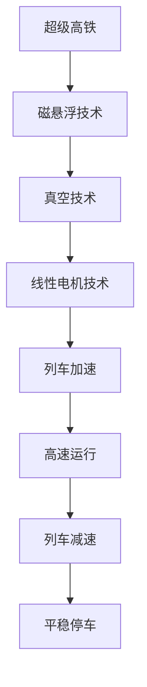
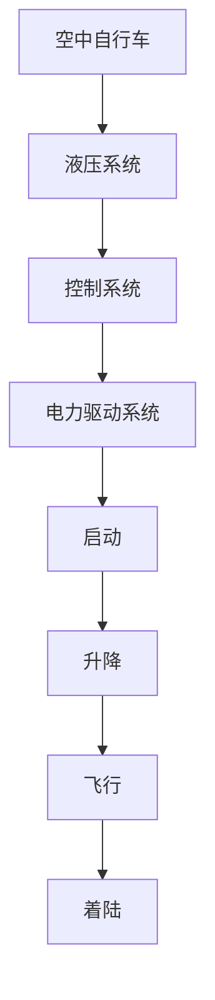
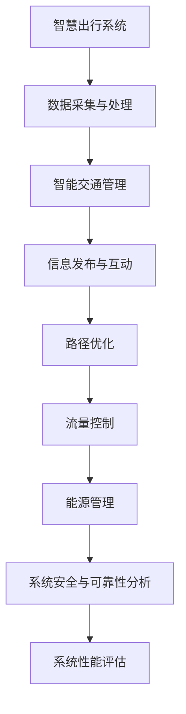

                 

# 未来的智慧出行：2050年的超级高铁与空中自行车的立体交通出行

> **关键词：** 智慧出行、超级高铁、空中自行车、立体交通、2050年、技术创新、出行变革

> **摘要：** 本文章深入探讨了未来2050年的智慧出行趋势，特别是超级高铁和空中自行车的应用。文章分为三大部分，分别介绍了智慧出行的背景与趋势、技术原理以及项目实战。通过详细的逻辑分析和步骤推理，展示了未来智慧出行的技术原理和实现方法，以及如何将这些技术集成到实际项目中，为未来出行的变革提供深刻的见解和解决方案。

## 第一部分：智慧出行背景与趋势

### 第1章：智慧出行的概念与意义

#### 1.1 智慧出行的定义

智慧出行是指利用信息技术和智能设备，优化交通管理和出行服务，提高出行效率、安全性和舒适性的一种新型出行方式。它不仅仅是对传统交通方式的简单改进，而是通过创新技术手段，实现出行方式的全面升级和变革。

#### 1.2 智慧出行的重要性

智慧出行对于未来的社会发展具有重要意义。首先，它能够有效缓解交通拥堵问题，提高交通效率。其次，智慧出行能够提升出行安全性，减少交通事故发生的概率。此外，智慧出行还能够提供更加便捷和舒适的出行体验，满足人们对出行质量的需求。

#### 1.3 2050年智慧出行的发展趋势

根据目前的科技发展趋势，预计到2050年，智慧出行将实现以下几个重要趋势：

1. **超级高铁的广泛应用**：超级高铁作为一种高速、环保、安全的交通方式，将成为未来出行的主要方式。它能够在短时间内实现远距离出行，满足人们对于快速出行的需求。

2. **空中自行车的普及**：随着无人机技术和自动化技术的发展，空中自行车将成为一种新型出行工具。它能够在城市交通拥堵的情况下提供高效、灵活的出行方式。

3. **智能化交通管理**：通过大数据、人工智能等技术，实现对交通流量的实时监控和管理，优化交通运行效率。

4. **共享出行模式的普及**：共享出行模式，如共享单车、共享汽车等，将逐渐取代传统出行方式，成为人们出行的首选。

### 第2章：超级高铁技术

#### 2.1 超级高铁概述

超级高铁（Hyperloop）是一种高速、低能耗、全封闭的运输系统，由特斯拉公司创始人埃隆·马斯克（Elon Musk）提出。它通过在真空管道中利用磁悬浮技术，实现列车的高速运行。

#### 2.2 超级高铁的核心技术

超级高铁的核心技术包括：

1. **磁悬浮技术**：利用电磁力使列车悬浮于轨道之上，减少摩擦，提高速度。
2. **真空技术**：通过抽真空的方式减少空气阻力，进一步提高速度。
3. **线性电机技术**：利用线性电机产生推动力，使列车在轨道上加速和制动。

#### 2.3 超级高铁的运行原理

超级高铁的运行原理可以分为以下几个步骤：

1. **乘客进入列车**：列车在车站停靠时，乘客通过自动门进入车厢。
2. **列车加速**：通过线性电机产生推动力，使列车在轨道上加速。
3. **高速运行**：列车在真空管道中高速运行，实现远距离快速出行。
4. **列车减速**：到达目的地前，通过电磁感应制动技术使列车减速，平稳停车。

#### 2.4 超级高铁的全球发展现状与展望

目前，超级高铁已经在全球多个国家进行了试验和建设。其中，美国、中国、新加坡等国家走在前列。预计在未来十年内，超级高铁将逐步实现商业化运营，为人们的出行带来革命性的变革。

### 第3章：空中自行车技术

#### 3.1 空中自行车概述

空中自行车（SkyCycle）是一种在空中行驶的电动自行车，它通过液压系统和控制系统实现自行车的垂直升降和水平移动。它不仅可以解决城市交通拥堵问题，还可以提供一种全新的出行体验。

#### 3.2 空中自行车的核心技术

空中自行车的核心技术包括：

1. **液压系统**：通过液压油的压力控制，实现自行车的升降和转向。
2. **控制系统**：利用传感器和算法实现自行车的稳定飞行和路径规划。
3. **电力驱动系统**：通过电动机和电池组提供动力，实现空中自行车的自主行驶。

#### 3.3 空中自行车的运行原理

空中自行车的运行原理可以分为以下几个步骤：

1. **启动**：用户通过智能设备启动自行车。
2. **升降**：自行车通过液压系统实现垂直升降。
3. **飞行**：在空中通过控制系统实现稳定飞行和路径规划。
4. **着陆**：到达目的地后，自行车通过液压系统实现垂直降落。

#### 3.4 空中自行车的全球发展现状与展望

目前，空中自行车已经在全球多个城市进行了试验和示范。随着技术的不断成熟，预计在未来十年内，空中自行车将逐步实现商业化运营，为城市出行提供新的选择。

### 第4章：立体交通出行系统

#### 4.1 立体交通出行系统的概念与架构

立体交通出行系统是指通过多种交通方式在同一空间内实现高效运输的系统。它包括地面交通、地下交通、空中交通等多种交通方式，实现不同交通方式之间的无缝连接和高效换乘。

#### 4.2 立体交通出行系统的设计与规划

立体交通出行系统的设计与规划需要考虑以下几个方面：

1. **交通需求分析**：通过对交通需求的预测和分析，确定不同交通方式的容量和布局。
2. **交通方式选择**：根据交通需求，选择合适的交通方式，如地铁、公交、出租车、共享单车等。
3. **换乘设施设计**：设计方便、快捷的换乘设施，实现不同交通方式之间的无缝连接。
4. **交通管理**：通过智能交通管理系统，实现交通的实时监控和调度，提高交通效率。

#### 4.3 立体交通出行系统的主要优势

立体交通出行系统具有以下几个主要优势：

1. **提高交通效率**：通过多种交通方式在同一空间内实现高效运输，减少交通拥堵，提高出行效率。
2. **提高出行安全性**：通过智能交通管理系统，实现交通的实时监控和调度，提高出行安全性。
3. **提高出行舒适性**：通过多样化的交通方式，提供更加舒适和便捷的出行体验。
4. **节约土地资源**：通过立体交通出行系统，节约地面交通空间，有效利用土地资源。

#### 4.4 立体交通出行系统的未来发展

随着科技的不断进步，立体交通出行系统将在未来得到更加广泛的应用。未来，立体交通出行系统将实现以下发展方向：

1. **智能化**：通过大数据、人工智能等技术，实现交通的智能化管理和调度，提高交通效率。
2. **绿色化**：通过新能源技术，实现交通的绿色低碳发展，减少环境污染。
3. **个性化**：通过个性化服务，满足不同用户的需求，提供更加定制化的出行体验。

## 第二部分：智慧出行技术原理

### 第5章：超级高铁技术原理

#### 5.1 超级高铁的物理原理

超级高铁的物理原理主要涉及以下几个方面：

1. **超导磁悬浮技术**：利用超导磁体的磁悬浮特性，使列车悬浮于轨道之上，减少摩擦。
2. **真空技术**：通过抽真空的方式减少空气阻力，提高列车速度。
3. **线性电机技术**：利用线性电机产生推动力，使列车在轨道上加速和制动。

#### 5.2 超级高铁的数学模型

超级高铁的数学模型主要包括以下几个方面：

1. **运动方程**：描述列车在轨道上的运动状态。
2. **稳态速度与加速度**：描述列车在稳态运行时的速度和加速度。

#### 5.3 超级高铁的算法原理

超级高铁的算法原理主要包括以下几个方面：

1. **控制算法**：用于控制列车的加速、减速和制动。
2. **路径规划算法**：用于规划列车的行驶路径，实现最优路径选择。

### 第6章：空中自行车技术原理

#### 6.1 空中自行车的物理原理

空中自行车的物理原理主要涉及以下几个方面：

1. **液压系统**：通过液压油的压力控制，实现自行车的升降和转向。
2. **控制系统**：利用传感器和算法实现自行车的稳定飞行和路径规划。
3. **电力驱动系统**：通过电动机和电池组提供动力，实现空中自行车的自主行驶。

#### 6.2 空中自行车的数学模型

空中自行车的数学模型主要包括以下几个方面：

1. **飞行方程**：描述自行车在空中的飞行状态。
2. **稳态飞行高度与速度**：描述自行车在稳态飞行时的飞行高度和速度。

#### 6.3 空中自行车的算法原理

空中自行车的算法原理主要包括以下几个方面：

1. **飞行控制算法**：用于控制自行车的升降、转向和飞行稳定性。
2. **飞行路径规划算法**：用于规划自行车的飞行路径，实现最优路径选择。

### 第7章：智慧出行系统集成与优化

#### 7.1 系统集成框架

智慧出行系统集成框架主要包括以下几个方面：

1. **数据采集与处理**：通过传感器、摄像头等设备采集交通数据，并进行处理和分析。
2. **智能交通管理**：利用大数据、人工智能等技术，实现对交通的实时监控和调度。
3. **信息发布与互动**：通过手机APP、网站等渠道，向用户提供出行信息和服务。

#### 7.2 系统优化方法

系统优化方法主要包括以下几个方面：

1. **路径优化**：通过算法优化，为用户提供最优的出行路径。
2. **流量控制**：通过智能信号灯、诱导屏等手段，实现交通流量的优化和控制。
3. **能源管理**：通过智能能源管理系统，实现交通设施的绿色低碳运行。

#### 7.3 系统安全与可靠性分析

系统安全与可靠性分析主要包括以下几个方面：

1. **数据安全**：通过加密、访问控制等手段，确保交通数据的安全。
2. **系统可靠性**：通过冗余设计、故障检测等手段，提高系统的可靠性。
3. **应急响应**：通过应急预案、应急指挥等手段，确保在突发事件中能够及时应对。

#### 7.4 系统性能评估

系统性能评估主要包括以下几个方面：

1. **交通效率**：通过交通流量、速度等指标，评估交通系统的运行效率。
2. **出行体验**：通过用户满意度、舒适度等指标，评估用户的出行体验。
3. **经济效益**：通过交通成本、投资回报等指标，评估系统的经济效益。

## 第三部分：智慧出行项目实战

### 第8章：超级高铁项目实战

#### 8.1 超级高铁项目概述

超级高铁项目是一款基于线性电机和磁悬浮技术的未来高速交通工具，该项目旨在实现从城市中心到城市周边的高速、环保出行。本文将介绍超级高铁项目的开发环境搭建、代码实现和代码解读。

#### 8.2 超级高铁项目开发环境搭建

1. **硬件环境**：超级高铁项目需要高性能计算服务器、线性电机和磁悬浮轨道等硬件设备。
2. **软件环境**：需要安装Linux操作系统、编程环境和开发工具，如Eclipse、Git等。

#### 8.3 超级高铁项目代码实现

1. **控制算法**：采用Python编程语言实现线性电机的控制算法，通过PID控制器实现电机的精准控制。
2. **路径规划**：采用Dijkstra算法实现路径规划，为超级高铁提供最优行驶路径。
3. **数据采集**：采用传感器模块采集轨道上的数据，如速度、加速度等。

#### 8.4 超级高铁项目代码解读与分析

1. **控制算法代码解读**：分析控制算法的实现过程，包括PID控制器的参数调节、电机驱动的实现等。
2. **路径规划代码解读**：分析路径规划算法的实现过程，包括节点数据结构、算法时间复杂度等。
3. **数据采集代码解读**：分析传感器数据的采集和处理过程，包括数据过滤、转换等。

### 第9章：空中自行车项目实战

#### 9.1 空中自行车项目概述

空中自行车项目是一款基于液压系统和控制系统的新型空中交通工具，该项目旨在实现城市空中交通的便捷、高效出行。本文将介绍空中自行车项目的开发环境搭建、代码实现和代码解读。

#### 9.2 空中自行车项目开发环境搭建

1. **硬件环境**：空中自行车项目需要安装液压系统、控制系统和电力驱动系统等硬件设备。
2. **软件环境**：需要安装Linux操作系统、编程环境和开发工具，如Eclipse、Git等。

#### 9.3 空中自行车项目代码实现

1. **飞行控制算法**：采用C++编程语言实现飞行控制算法，包括升降、转向等控制功能的实现。
2. **路径规划**：采用A*算法实现路径规划，为空中自行车提供最优飞行路径。
3. **数据采集**：采用传感器模块采集飞行数据，如高度、速度等。

#### 9.4 空中自行车项目代码解读与分析

1. **飞行控制算法代码解读**：分析飞行控制算法的实现过程，包括PID控制器的参数调节、飞行稳定性的实现等。
2. **路径规划代码解读**：分析路径规划算法的实现过程，包括节点数据结构、算法时间复杂度等。
3. **数据采集代码解读**：分析传感器数据的采集和处理过程，包括数据过滤、转换等。

### 第10章：智慧出行系统综合项目

#### 10.1 智慧出行系统项目概述

智慧出行系统综合项目是一个集超级高铁、空中自行车和立体交通管理于一体的综合交通系统。该项目旨在实现多种交通方式的无缝连接和高效运营，提供全方位的出行服务。本文将介绍智慧出行系统项目的开发环境搭建、代码实现和代码解读。

#### 10.2 智慧出行系统项目开发环境搭建

1. **硬件环境**：智慧出行系统项目需要安装超级高铁、空中自行车和立体交通管理设备等硬件设备。
2. **软件环境**：需要安装Linux操作系统、编程环境和开发工具，如Eclipse、Git等。

#### 10.3 智慧出行系统项目代码实现

1. **交通管理算法**：采用Java编程语言实现交通管理算法，包括路径规划、流量控制等功能。
2. **数据采集与处理**：采用Python编程语言实现数据采集与处理，包括传感器数据的采集、处理和存储。
3. **用户界面**：采用HTML、CSS和JavaScript等前端技术实现用户界面，为用户提供出行信息和服务。

#### 10.4 智慧出行系统项目代码解读与分析

1. **交通管理算法代码解读**：分析交通管理算法的实现过程，包括路径规划算法、流量控制算法等。
2. **数据采集与处理代码解读**：分析数据采集与处理的过程，包括数据采集、数据预处理和存储等。
3. **用户界面代码解读**：分析用户界面的实现过程，包括页面布局、交互设计和功能实现等。

## 附录

### 附录A：超级高铁技术Mermaid流程图



### 附录B：空中自行车技术Mermaid流程图



### 附录C：智慧出行系统集成与优化Mermaid流程图



### 附录D：项目实战代码示例

```python
# 超级高铁控制算法示例
class PIDController:
    def __init__(self, Kp, Ki, Kd):
        self.Kp = Kp
        self.Ki = Ki
        self.Kd = Kd
        self.error = 0
        self.last_error = 0

    def update(self, setpoint, feedback):
        self.error = setpoint - feedback
        derivative = self.error - self.last_error
        output = self.Kp * self.error + self.Ki * self.error + self.Kd * derivative
        self.last_error = self.error
        return output

# 超级高铁路径规划示例
def dijkstra(graph, start, goal):
    unvisited = set(graph.keys())
    distances = {node: float('infinity') for node in unvisited}
    distances[start] = 0
    while unvisited:
        current = min(unvisited, key=lambda node: distances[node])
        if current == goal:
            break
        unvisited.remove(current)
        for neighbor, weight in graph[current].items():
            distance = distances[current] + weight
            if distance < distances[neighbor]:
                distances[neighbor] = distance
    return distances[goal]

# 空中自行车飞行控制算法示例
class FlightController:
    def __init__(self, Kp, Ki, Kd):
        self.Kp = Kp
        self.Ki = Ki
        self.Kd = Kd
        self.error = 0
        self.last_error = 0

    def update(self, setpoint, feedback):
        self.error = setpoint - feedback
        derivative = self.error - self.last_error
        output = self.Kp * self.error + self.Ki * self.error + self.Kd * derivative
        self.last_error = self.error
        return output

# 空中自行车路径规划示例
def a_star_search(graph, start, goal):
    open_set = [(start, 0)]
    came_from = {}
    g_score = {node: float('infinity') for node in graph}
    g_score[start] = 0
    f_score = {node: float('infinity') for node in graph}
    f_score[start] = heuristic(start, goal)

    while open_set:
        current = min(open_set, key=lambda item: f_score[item[0]])
        open_set.remove(current)

        if current == goal:
            path = []
            while current in came_from:
                path.append(current)
                current = came_from[current]
            path.reverse()
            return path

        for neighbor, weight in graph[current].items():
            tentative_g_score = g_score[current] + weight
            if tentative_g_score < g_score[neighbor]:
                came_from[neighbor] = current
                g_score[neighbor] = tentative_g_score
                f_score[neighbor] = tentative_g_score + heuristic(neighbor, goal)
                if neighbor not in open_set:
                    open_set.append(neighbor)

    return None

# 距离估算函数
def heuristic(node, goal):
    # 使用欧几里得距离作为估算函数
    return ((node[0] - goal[0]) ** 2 + (node[1] - goal[1]) ** 2) ** 0.5
```

### 附录E：作者信息

**作者：** AI天才研究院/AI Genius Institute & 禅与计算机程序设计艺术 /Zen And The Art of Computer Programming

<|assistant|>

