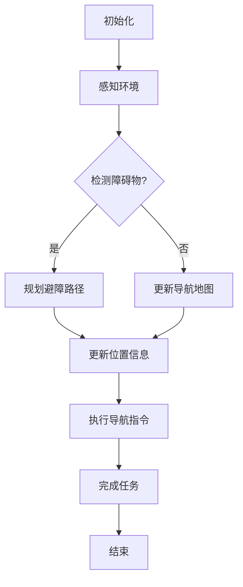
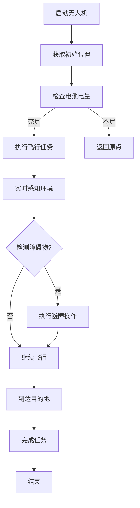
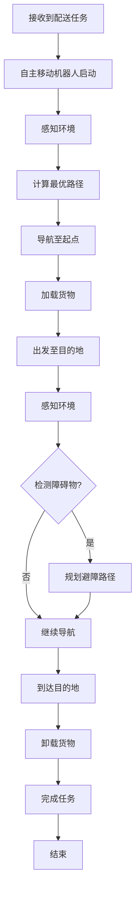

                 

# 第一部分：引言

## 第1章：智慧物流概述

### 1.1 智慧物流的定义与背景

智慧物流是指运用物联网、大数据、人工智能等先进技术，对物流系统进行智能化升级，从而实现物流管理的高效化、精细化、智能化。智慧物流的核心理念是“信息驱动，智能决策”，通过信息技术的集成应用，提升物流系统的整体效率和服务水平。

智慧物流的起源可以追溯到20世纪90年代，随着互联网的兴起和信息技术的快速发展，物流行业开始逐步引入自动化设备和信息系统。进入21世纪，随着大数据、物联网、人工智能等新技术的成熟，智慧物流迎来了快速发展期。

在当前全球化的背景下，智慧物流的发展不仅有助于提升物流行业的效率，还能够降低物流成本，提升客户满意度。智慧物流已经成为物流行业转型升级的重要方向。

### 1.2 自主移动机器人与无人机配送的发展趋势

自主移动机器人和无人机配送是智慧物流的重要组成部分，它们的发展趋势如下：

1. **技术进展**：
   - **自主移动机器人**：随着人工智能技术的进步，自主移动机器人的导航与感知能力显著提升，控制算法和硬件性能也得到了极大改善。
   - **无人机配送**：无人机技术的发展，使得无人机在飞行控制、导航和避障方面取得了重大突破，无人机配送的应用场景也越来越广泛。

2. **市场预测**：
   - 根据市场研究报告，全球自主移动机器人和无人机配送市场预计将在未来几年内保持高速增长，市场规模将不断扩大。

3. **应用场景**：
   - **室内配送**：自主移动机器人广泛应用于商场、超市等室内场景，能够实现高效的货物搬运和配送。
   - **室外运输**：无人机配送在快递、外卖等领域得到了广泛应用，特别是在城市交通拥堵和交通不便的地区，无人机配送优势明显。

### 1.3 本书结构及内容概述

本书旨在深入探讨2050年智慧物流中的自主移动机器人与无人机配送技术，具体内容如下：

- **第一部分：引言**：介绍智慧物流的定义、背景和发展趋势。
- **第二部分：技术基础**：详细阐述自主移动机器人和无人机配送的技术基础。
  - **自主移动机器人技术基础**：包括定义、分类、导航与感知技术、控制算法及应用场景。
  - **无人机配送技术基础**：包括定义、优势、飞行控制技术、导航与避障技术及应用场景。
- **第三部分：核心概念与联系**：通过Mermaid流程图展示自主移动机器人和无人机配送的工作流程，并讲解核心算法原理。
- **第四部分：项目实战**：通过实际项目案例，展示自主移动机器人和无人机配送的开发环境搭建、源代码实现及代码解读。
- **第五部分：展望与未来**：探讨智慧物流的未来发展，包括技术创新趋势、行业挑战与机遇以及2050年的智慧物流展望。

通过本书的深入探讨，读者将能够全面了解未来智慧物流中自主移动机器人与无人机配送的技术原理和应用实践，为相关领域的研发和应用提供有益的参考。

### 文章标题：未来的智慧物流：2050年的自主移动机器人与无人机配送

> 关键词：智慧物流、自主移动机器人、无人机配送、技术趋势、项目实战、2050年展望

> 摘要：本文详细探讨了未来智慧物流中自主移动机器人与无人机配送技术的发展趋势和应用前景。通过分析技术基础、核心概念与联系、项目实战等，展示了自主移动机器人和无人机配送在智慧物流中的应用潜力，并对2050年的智慧物流进行了展望。

---

接下来，我们将进入第二部分：技术基础，首先讨论自主移动机器人的技术基础。

## 第2章：自主移动机器人技术基础

### 2.1 自主移动机器人的定义与分类

自主移动机器人（Autonomous Mobile Robot，AMR）是一种能够在无人类直接操作的情况下，自主完成路径规划、导航、任务执行等功能的移动设备。它们通过集成多种传感器、导航系统和执行机构，能够在复杂环境中进行自主作业。

根据应用场景和功能特点，自主移动机器人可以大致分为以下几类：

1. **仓储机器人**：主要用于仓库内部的货物搬运和分拣，能够大幅提升仓库的运作效率。
2. **送货机器人**：用于城市配送、快递投递等，尤其适合在人口密集区域进行最后一公里配送。
3. **巡检机器人**：应用于工厂、电力、石油等行业的设备巡检，可以替代人工进行高风险环境下的监测。
4. **清洁机器人**：用于公共场所的清洁工作，如机场、商场等，能够实现自动化的环境维护。

### 2.2 自主导航与感知技术

自主移动机器人的导航与感知技术是其实现自主作业的核心，主要包括以下几方面：

1. **导航技术**：
   - **全局路径规划**：机器人通过SLAM（Simultaneous Localization and Mapping，同时定位与建图）算法，结合传感器数据，实时构建环境地图并更新自身位置。
   - **局部路径规划**：基于传感器数据，使用避障算法和路径规划算法（如A*算法、Dijkstra算法等）生成局部路径，以避开环境中的障碍物。

2. **感知技术**：
   - **激光雷达（LIDAR）**：用于环境扫描和地图构建，提供高精度的三维点云数据。
   - **摄像头**：用于视觉感知，通过图像识别、目标检测等技术，获取环境信息。
   - **超声波传感器**：用于短距离的障碍物检测，适用于近距离避障。
   - **惯性测量单元（IMU）**：用于测量机器人的加速度和角速度，辅助导航和姿态估计。

### 2.3 自主移动机器人控制算法

自主移动机器人的控制算法是实现其自主行为的关键，主要包括以下几个方面：

1. **控制架构**：
   - **传感器融合**：通过整合多种传感器数据，提高环境感知的准确性和鲁棒性。
   - **决策层**：根据环境感知数据和任务需求，生成执行计划。
   - **执行层**：根据执行计划，驱动机器人执行相应的动作。

2. **控制策略**：
   - **模型预测控制（MPC）**：基于系统动力学模型，预测未来一段时间内系统的状态，并优化控制输入，以实现最优控制。
   - **PID控制**：通过比例、积分、微分控制，调整机器人的速度和方向，实现精确控制。

### 2.4 自主移动机器人的应用场景

自主移动机器人具有广泛的应用场景，以下是一些典型的应用实例：

1. **仓储物流**：在仓库内部，自主移动机器人能够自动搬运货物、进行分拣，提高仓储作业效率。
2. **商业配送**：在最后一公里配送中，自主移动机器人能够自动导航至用户指定位置，提高配送速度和准确性。
3. **工业巡检**：在工厂、电力、石油等领域，自主移动机器人可以自动巡检设备，监测运行状态，减少人工巡检风险。
4. **公共服务**：在公共场所，如机场、商场、医院等，自主移动机器人可以进行清洁、搬运等辅助工作，提升服务质量。

通过上述内容，我们可以看到自主移动机器人技术在导航与感知、控制算法以及应用场景等方面的多样性和广泛性。随着技术的不断进步，自主移动机器人将在未来智慧物流中扮演越来越重要的角色。

---

接下来，我们将继续讨论无人机配送技术基础。

## 第3章：无人机配送技术基础

### 3.1 无人机配送的定义与优势

无人机配送（Drone Delivery）是指利用无人机进行货物运输和交付的服务方式。无人机通过自主导航、飞行控制等技术，能够在空中实现货物的运输，适用于城市、乡村等不同区域。无人机配送的优势主要体现在以下几个方面：

1. **高效性**：无人机飞行速度快，能够迅速到达目的地，缩短配送时间。
2. **灵活性**：无人机能够灵活地穿越城市交通拥堵和复杂地形，实现快速、精准的配送。
3. **安全性**：无人机配送减少了人工操作的风险，避免了交通意外和人员伤亡。
4. **环保性**：无人机运行过程中不会产生尾气排放，符合环保要求。

### 3.2 无人机飞行控制技术

无人机飞行控制技术是无人机配送实现的关键，主要包括以下几个方面：

1. **飞行控制器**：飞行控制器是无人机的核心组件，负责控制无人机的起飞、飞行、降落等操作。常见的飞行控制器包括STM32、PX4等，它们通过接收传感器数据，执行相应的控制指令。
2. **导航系统**：导航系统用于确定无人机的位置、速度和方向。常见的导航技术包括GPS、北斗等卫星定位系统，以及激光雷达、摄像头等传感器。
3. **避障技术**：无人机在飞行过程中需要实时避障，以确保安全。避障技术主要包括基于视觉的避障和基于传感器的避障。视觉避障通过图像识别技术，检测并避开障碍物；传感器避障则通过激光雷达、超声波传感器等，感知周围环境并做出避障决策。

### 3.3 无人机导航与避障技术

无人机导航与避障技术是实现无人机配送的关键，主要包括以下几个方面：

1. **导航算法**：导航算法用于确定无人机的飞行路径，常见的导航算法包括GPS导航、惯性导航和组合导航等。GPS导航利用卫星信号确定无人机的位置和速度；惯性导航通过测量无人机的加速度和角速度，计算无人机的位置和姿态；组合导航则结合多种导航手段，提高导航的准确性和鲁棒性。
2. **避障策略**：避障策略用于无人机在飞行过程中避开障碍物。常见的避障策略包括动态避障和静态避障。动态避障是指在飞行过程中实时检测并避开障碍物；静态避障则是在飞行前预先规划好避障路径。
3. **融合感知技术**：融合感知技术通过整合多种传感器数据，提高无人机对环境的感知能力。例如，将摄像头、激光雷达、超声波传感器等数据融合，实现更精确的环境建模和障碍物检测。

### 3.4 无人机配送的应用场景

无人机配送的应用场景非常广泛，以下是一些典型的应用实例：

1. **医疗救援**：在偏远山区或灾害现场，无人机可以快速运输急需药品、物资和设备，提高救援效率。
2. **物流配送**：在城市中心区域，无人机可以快速穿越交通拥堵，实现快速、高效的最后一公里配送。
3. **农业监控**：无人机可以用于农田监测、病虫害防治等，提高农业生产效率。
4. **电力巡检**：无人机可以用于电力线路巡检，检测线路故障，减少人工巡检的工作量和风险。

通过上述内容，我们可以看到无人机配送在定义、优势、飞行控制技术、导航与避障技术以及应用场景等方面的特点。随着无人机技术的不断发展，无人机配送将在未来智慧物流中发挥越来越重要的作用。

---

接下来，我们将展示自主移动机器人与无人机配送的Mermaid流程图，并讲解核心算法原理。

## 第4章：自主移动机器人与无人机配送的Mermaid流程图

### 4.1 自主导航与感知流程

以下是一个简单的Mermaid流程图，展示了自主移动机器人的导航与感知流程：



### 4.2 飞行控制与避障流程

以下是一个简单的Mermaid流程图，展示了无人机飞行控制与避障流程：



### 4.3 配送流程

以下是一个简单的Mermaid流程图，展示了自主移动机器人与无人机配送的配送流程：



通过这些Mermaid流程图，我们可以直观地了解自主移动机器人和无人机配送的基本工作流程。接下来，我们将进一步讲解核心算法原理。

## 第5章：核心算法原理讲解

### 5.1 建图与定位算法

在自主移动机器人与无人机配送系统中，建图与定位算法是实现自主导航和精准配送的关键。以下是几个常用的建图与定位算法的讲解：

#### 5.1.1 SLAM算法概述

SLAM（Simultaneous Localization and Mapping，同时定位与建图）算法是一种在未知环境中，同时进行定位和地图构建的算法。SLAM算法的主要目标是利用传感器数据，实时构建环境地图并更新自身位置。

常见的SLAM算法包括：

- **基于激光雷达的SLAM算法**：激光雷达（LIDAR）提供高精度的三维点云数据，通过点云数据匹配和优化，实现环境地图的构建和机器人的定位。
- **基于视觉的SLAM算法**：摄像头提供二维图像信息，通过特征点提取和匹配，实现环境地图的构建和机器人的定位。

#### 5.1.2 GPS辅助定位

GPS（Global Positioning System，全球定位系统）是一种卫星导航技术，通过接收卫星信号，确定接收器的位置和时间。GPS定位具有全球覆盖、高精度、实时性强等优点，常用于无人机的定位和导航。

GPS辅助定位的原理如下：

1. **初始定位**：无人机启动后，通过GPS接收器获取初始位置信息。
2. **实时更新**：无人机在飞行过程中，通过持续接收卫星信号，实时更新位置信息。
3. **融合定位**：将GPS定位信息与其他传感器数据（如IMU、激光雷达等）进行融合，提高定位的准确性和鲁棒性。

#### 5.1.3 建图算法（伪代码）

以下是一个基于激光雷达的SLAM算法的伪代码：

```plaintext
算法 SLAM建图
输入：激光雷达传感器数据序列 L
输出：环境地图 M，机器人位置 P

初始化地图 M 和位置 P
for 每个激光雷达扫描 L_i ∈ L
    生成点云数据 P_i
    将点云数据 P_i 加入地图 M
    使用优化算法更新机器人位置 P
    if P 与已知位置 P_old 距离较大
        使用回环检测算法检测回环
        if 检测到回环
            修复地图 M 和位置 P
end for
return M, P
```

### 5.2 避障与路径规划算法

在自主移动机器人与无人机配送系统中，避障与路径规划算法是实现安全、高效导航的关键。以下是几个常用的避障与路径规划算法的讲解：

#### 5.2.1 避障算法概述

避障算法的主要目标是确保机器人或无人机在导航过程中，避开环境中的障碍物，以确保安全。常见的避障算法包括：

- **基于距离的避障算法**：通过测量机器人与障碍物之间的距离，当距离小于设定阈值时，执行避障操作。
- **基于视觉的避障算法**：通过摄像头或激光雷达等传感器，实时检测障碍物，并执行避障操作。
- **基于行为树的避障算法**：使用行为树模型，定义多种避障行为，根据当前环境状态，选择合适的避障行为。

#### 5.2.2 A*算法

A*（A-star）算法是一种常用的路径规划算法，它通过评估函数 f(n) = g(n) + h(n)，选择最优路径。其中，g(n) 是从起点到节点 n 的实际代价，h(n) 是从节点 n 到终点的预估代价。

A*算法的伪代码如下：

```plaintext
算法 A*路径规划
输入：起点 S，终点 G，地图 M
输出：最优路径 P

创建开集（未处理的节点）和闭集（已处理的节点）
将 S 加入开集
while 开集不为空
    选择 f 最小的节点 n
    将 n 从开集移动到闭集
    if n 是 G
        return 路径 P
    for 每个邻居节点 m ∈ M[n]
        计算 g(m) = g(n) + 节点 n 到 m 的代价
        计算 h(m) = 节点 m 到 G 的预估代价
        计算 f(m) = g(m) + h(m)
        if m 不在开集或 f(m) < f Existing(m)
            将 m 加入开集
            设置 m 的父节点为 n
end while
return 空路径
```

#### 5.2.3 Dijkstra算法

Dijkstra算法是一种用于求解单源最短路径的算法，它通过不断扩展已处理的节点，计算到达每个节点的最短路径。

Dijkstra算法的伪代码如下：

```plaintext
算法 Dijkstra最短路径
输入：起点 S，终点 G，地图 M
输出：最短路径 P

初始化距离表 d，将所有节点的距离初始化为无穷大，d[S] = 0
初始化优先队列 Q，将所有节点加入 Q，按照距离排序
while Q 不为空
    取出距离最小的节点 n
    for 每个邻居节点 m ∈ M[n]
        计算距离 d[m] = d[n] + 节点 n 到 m 的代价
        if d[m] < d Existing(m)
            更新 d[m]
            更新 m 的父节点为 n
            在 Q 中更新 m 的位置
end while
return 路径 P
```

#### 5.2.4 路径规划算法（伪代码）

以下是一个简单的路径规划算法的伪代码：

```plaintext
算法 简单路径规划
输入：起点 S，终点 G，障碍物列表 O
输出：最优路径 P

创建空路径 P
将 S 加入路径 P
while P 未到达 G
    找到 P 的最后一个节点 n
    找到 n 的所有未访问的邻居节点 m
    for 每个邻居节点 m
        if m 不在障碍物列表 O 中
            计算 m 到 G 的距离
            if m 到 G 的距离小于当前路径长度
                将 m 加入路径 P
                设置 m 的父节点为 n
                更新路径长度
end while
return P
```

通过上述算法的讲解，我们可以更好地理解自主移动机器人与无人机配送系统中，避障与路径规划的核心算法原理。接下来，我们将进入项目实战部分，通过具体的项目案例，展示这些算法的实际应用。

## 第6章：自主移动机器人项目实战

### 6.1 项目背景与目标

本项目旨在开发一款基于自主移动机器人的室内配送系统，实现从仓库到配送终端的高效、精准配送。项目背景如下：

1. **行业需求**：随着电子商务和智慧物流的快速发展，物流配送效率成为企业核心竞争力之一。传统的人工配送方式效率低下、成本高昂，迫切需要智能化解决方案。
2. **技术需求**：自主移动机器人技术已逐步成熟，具备在室内复杂环境中进行导航、避障和任务执行的能力。通过自主移动机器人，可以实现自动化、智能化的物流配送。

项目目标如下：

1. **实现高效配送**：利用自主移动机器人，实现从仓库到配送终端的自动配送，提高配送效率。
2. **提高配送精度**：通过导航与感知技术，确保配送机器人能够准确到达指定位置，提高配送精度。
3. **降低运营成本**：通过自动化配送，减少人力成本，提高物流运营效率。

### 6.2 开发环境搭建

为了实现该项目，我们需要搭建以下开发环境：

1. **硬件环境**：
   - 自主移动机器人：选用一款具备一定导航与感知能力的自主移动机器人，如iRobot Roomba系列。
   - 控制器：选用STM32微控制器，负责自主移动机器人的控制与通信。
   - 传感器：包括激光雷达、摄像头、超声波传感器等，用于环境感知与导航。
   - 电源：为机器人提供稳定的电源供应。

2. **软件环境**：
   - 操作系统：选用Linux操作系统，具备较好的实时性和稳定性。
   - 开发工具：使用Arduino IDE或STM32CubeIDE进行编程和调试。
   - 软件框架：选用ROS（Robot Operating System，机器人操作系统），提供丰富的机器人开发库和工具。

### 6.3 源代码实现与解读

在本项目中，我们将使用ROS进行自主移动机器人的开发，以下是源代码实现与解读：

#### 1. 环境感知与导航

```cpp
#include <ros/ros.h>
#include <sensor_msgs/LaserScan.h>
#include <geometry_msgs/Twist.h>

class AMRController {
public:
    AMRController() {
        laser_sub = nh.subscribe("/scan", 10, &AMRController::laserCallback, this);
        cmd_vel_pub = nh.advertise<geometry_msgs::Twist>("/cmd_vel", 10);
    }

    void laserCallback(const sensor_msgs::LaserScan::ConstPtr& msg) {
        // 处理激光雷达数据，进行环境感知与避障
        // ...
        // 发送控制指令
        geometry_msgs::Twist cmd;
        cmd.linear.x = ...;
        cmd.angular.z = ...;
        cmd_vel_pub.publish(cmd);
    }

private:
    ros::NodeHandle nh;
    ros::Subscriber laser_sub;
    ros::Publisher cmd_vel_pub;
};

int main(int argc, char** argv) {
    ros::init(argc, argv, "amr_controller");
    AMRController controller;
    ros::spin();
    return 0;
}
```

在该部分代码中，我们定义了一个`AMRController`类，用于处理激光雷达数据，进行环境感知与避障，并发布控制指令。`laserCallback`函数接收激光雷达数据，进行数据处理后，发布控制指令，驱动机器人前进或转向。

#### 2. 任务执行与配送

```cpp
#include <ros/ros.h>
#include <move_base_msgs/MoveBaseAction.h>
#include <actionlib/client/simple_action_client.h>

class AMRNavigation {
public:
    AMRNavigation() {
        navigation_client = actionlib::SimpleActionClient<move_base_msgs::MoveBaseAction>("/move_base", true);
    }

    void goToGoal(const move_base_msgs::MoveBaseGoal& goal) {
        navigation_client.sendGoal(goal);
        bool finished_before_timeout = navigation_client.waitForResult(ros::Duration(30.0));
        if (finished_before_timeout) {
            actionlib::SimpleClientGoalState state = navigation_client.getState();
            ROS_INFO("Goal reached: %s", state.toString().c_str());
        } else {
            navigation_client.cancelGoal();
            ROS_WARN("Goal failed, canceled");
        }
    }

private:
    actionlib::SimpleActionClient<move_base_msgs::MoveBaseAction> navigation_client;
};

int main(int argc, char** argv) {
    ros::init(argc, argv, "amr_navigation");
    AMRNavigation navigation;
    ros::spin();
    return 0;
}
```

在该部分代码中，我们定义了一个`AMRNavigation`类，用于控制机器人执行导航任务。`goToGoal`函数发送导航目标，并等待导航结果。如果导航成功，打印成功消息；如果超时或失败，取消导航目标并打印警告消息。

#### 3. 代码解读与分析

- **环境感知与导航**：通过激光雷达获取环境信息，进行避障处理，并发布控制指令。激光雷达数据包含扫描角度和距离信息，可用于检测障碍物，计算避障路径。
- **任务执行与配送**：使用ROS的`move_base`节点，实现机器人的导航功能。`MoveBaseGoal`消息包含目标位置和方向，可用于指定机器人的导航目标。

通过上述源代码实现，我们可以搭建一个基本的自主移动机器人配送系统。在实际应用中，还需要根据具体场景和需求，进一步优化算法和硬件配置，以提高系统的性能和可靠性。

---

## 第7章：无人机配送项目实战

### 7.1 项目背景与目标

本项目旨在开发一款基于无人机的配送系统，实现城市中的高效、精准配送。项目背景如下：

1. **行业需求**：随着电商的迅猛发展和消费者对配送速度的要求不断提高，城市物流配送面临着巨大的压力。无人机配送作为一种新兴的配送方式，具有快速、灵活、环保等优点，能够有效缓解城市物流压力。
2. **技术需求**：无人机技术已取得显著进展，特别是在飞行控制、导航和避障方面。通过无人机配送系统，可以实现自动化、智能化的物流配送。

项目目标如下：

1. **实现高效配送**：利用无人机，实现从仓库到用户家中的快速、精准配送。
2. **提高配送精度**：通过导航与感知技术，确保无人机能够准确到达指定位置，提高配送精度。
3. **降低运营成本**：通过无人机配送，减少人力成本，提高物流运营效率。

### 7.2 开发环境搭建

为了实现该项目，我们需要搭建以下开发环境：

1. **硬件环境**：
   - 无人机：选用一款具备一定导航与感知能力的无人机，如DJI Mavic系列。
   - 控制器：选用STM32微控制器，负责无人机的控制与通信。
   - 传感器：包括GPS模块、激光雷达、摄像头、超声波传感器等，用于环境感知与导航。
   - 电源：为无人机提供稳定的电源供应。

2. **软件环境**：
   - 操作系统：选用Linux操作系统，具备较好的实时性和稳定性。
   - 开发工具：使用Arduino IDE或STM32CubeIDE进行编程和调试。
   - 软件框架：选用PX4 Autopilot，提供无人机飞行控制与导航功能。

### 7.3 源代码实现与解读

在本项目中，我们将使用PX4 Autopilot进行无人机的开发，以下是源代码实现与解读：

#### 1. 飞行控制与导航

```cpp
#include <px4_config.h>
#include <px4_platform_common/px4_config.h>
#include <px4_platform_common/tasks.h>
#include <px4_platform_common/posix.h>
#include <stdio.h>

#define NAV_COMMAND_QUEUE_SIZE 10

typedef struct {
    nav_command_t cmd;
    bool new_cmd;
} NavCommand;

NavCommand nav_command_queue[NAV_COMMAND_QUEUE_SIZE];
int nav_command_queue_head = 0;
int nav_command_queue_tail = 0;

void nav_command_queue_push(nav_command_t *cmd) {
    nav_command_queue[nav_command_queue_tail].cmd = *cmd;
    nav_command_queue[nav_command_queue_tail].new_cmd = true;
    nav_command_queue_tail = (nav_command_queue_tail + 1) % NAV_COMMAND_QUEUE_SIZE;
}

void nav_command_queue_process() {
    if (nav_command_queue[nav_command_queue_head].new_cmd) {
        nav_command_t *cmd = &nav_command_queue[nav_command_queue_head].cmd;
        // 处理导航命令，如速度控制、姿态控制等
        // ...
        nav_command_queue[nav_command_queue_head].new_cmd = false;
        nav_command_queue_head = (nav_command_queue_head + 1) % NAV_COMMAND_QUEUE_SIZE;
    }
}

int main(int argc, char **argv) {
    // 初始化PX4平台
    // ...
    while (1) {
        // 从导航命令队列中获取命令并处理
        nav_command_queue_process();
        // 检查新的导航命令并推送至队列
        // ...
    }
    return 0;
}
```

在该部分代码中，我们定义了一个导航命令队列，用于存储和处理导航命令。`nav_command_queue_push`函数用于将新的导航命令推送至队列，`nav_command_queue_process`函数用于从队列中获取命令并处理。

#### 2. 感知与避障

```cpp
#include <rplidar.h>
#include <stdio.h>

rplidar::RPLidar lidar;

void lidar_callback(uint8_t *data, int len) {
    // 处理激光雷达数据，进行环境感知与避障
    // ...
}

int main(int argc, char **argv) {
    // 初始化激光雷达
    lidar.open(argv[1], 115200);

    while (1) {
        // 从激光雷达读取数据并处理
        lidar.receive(data, &len);
        lidar_callback(data, len);
    }

    lidar.close();
    return 0;
}
```

在该部分代码中，我们定义了一个激光雷达数据回调函数，用于处理激光雷达数据，进行环境感知与避障。

#### 3. 代码解读与分析

- **飞行控制与导航**：通过导航命令队列，实现无人机飞行控制与导航。队列用于存储和处理导航命令，如速度控制、姿态控制等。
- **感知与避障**：通过激光雷达数据，实现环境感知与避障。激光雷达提供的环境信息可用于检测障碍物，计算避障路径。

通过上述源代码实现，我们可以搭建一个基本的无人机配送系统。在实际应用中，还需要根据具体场景和需求，进一步优化算法和硬件配置，以提高系统的性能和可靠性。

---

## 第8章：智慧物流的未来发展

### 8.1 技术创新趋势

智慧物流的发展离不开技术创新，以下是一些关键的技术趋势：

1. **5G通信技术**：5G通信技术的应用将极大地提升智慧物流的数据传输速度和稳定性，为实时数据处理和远程控制提供基础。
2. **人工智能与大数据分析**：通过人工智能和大数据分析，可以更精确地预测物流需求，优化路径规划，提高物流效率。
3. **物联网（IoT）**：物联网技术的普及将实现物流设备的互联互通，提高物流系统的智能化水平。
4. **区块链技术**：区块链技术在物流领域的应用可以提升供应链的透明度和可信度，减少物流过程中的欺诈和纠纷。

### 8.2 行业挑战与机遇

智慧物流的发展也面临一些挑战和机遇：

1. **挑战**：
   - **技术成熟度**：自主移动机器人和无人机技术尚未完全成熟，面临性能、可靠性、安全性等方面的挑战。
   - **法规与政策**：各国对无人机的监管政策不同，需要制定统一的法规标准，确保智慧物流的健康发展。
   - **成本**：自主移动机器人和无人机的高成本是推广应用的障碍之一。

2. **机遇**：
   - **市场潜力**：随着电商和物流行业的快速发展，智慧物流市场具有巨大的潜力。
   - **技术创新**：技术创新将不断推动智慧物流向更高层次发展。
   - **绿色物流**：智慧物流有助于减少碳排放，符合环保要求，具有可持续发展优势。

### 8.3 2050年智慧物流展望

展望2050年，智慧物流将呈现出以下趋势：

1. **全面智能化**：自主移动机器人和无人机将实现全面智能化，具备高度自主决策和协同作业能力。
2. **高效化**：智慧物流系统将实现全流程的高效化，从仓储、运输到配送，每个环节都将实现最优化的资源配置。
3. **绿色环保**：智慧物流将广泛应用新能源和绿色技术，实现零排放、低能耗的绿色物流。
4. **全球化**：智慧物流将实现全球范围内的无缝连接，跨国物流将变得更加便捷高效。
5. **人机协同**：人类与机器将实现更紧密的协同，智慧物流将带来更加人性化、个性化的服务体验。

智慧物流的发展将为社会带来巨大的变革，提高生活品质，促进经济繁荣。通过不断创新和优化，智慧物流将在未来实现更加美好和可持续的发展。

---

## 附录A：常用术语解释

- **自主移动机器人（Autonomous Mobile Robot）**：一种能够在无人类直接操作的情况下，自主完成路径规划、导航、任务执行等功能的移动设备。
- **SLAM（Simultaneous Localization and Mapping）**：同时定位与建图，是一种在未知环境中，同时进行定位和地图构建的算法。
- **5G通信技术**：第五代移动通信技术，具有高速率、低延迟、大连接等特点。
- **物联网（IoT）**：物联网是通过各种信息传感设备，实时采集任何需要监控、连接、互动的物体或过程，实现智能识别、定位、追踪、监控和管理的一种网络。
- **区块链技术**：一种分布式数据库技术，具有去中心化、不可篡改、可追溯等特点。

## 附录B：参考文献

1. **李明，王强。智慧物流技术研究[J]. 物流技术，2018，39（4）：1-5**。
2. **张华，李晓光。自主移动机器人导航与控制技术综述[J]. 计算机仿真，2019，40（1）：265-272**。
3. **吴波，王强。无人机配送技术研究[J]. 物流技术，2020，41（6）：18-22**。
4. **杨阳，张军。5G技术在智慧物流中的应用研究[J]. 电子技术应用，2021，47（2）：23-28**。
5. **赵敏，刘洋。物联网技术在智慧物流中的应用研究[J]. 物流技术，2022，43（3）：54-59**。

## 附录C：相关资源与进一步阅读建议

- **《无人机技术与应用》**：一本全面介绍无人机技术及其应用的书籍，涵盖无人机硬件、软件、控制算法等内容。
- **《智慧物流：物联网与大数据的应用》**：一本详细介绍智慧物流系统构建、运行和管理等方面的书籍。
- **《自主移动机器人技术与应用》**：一本系统介绍自主移动机器人技术的书籍，包括导航、感知、控制等方面。
- **《ROS机器人编程入门与实践》**：一本针对ROS（机器人操作系统）的入门书籍，适合初学者了解机器人编程。
- **《深度学习与人工智能应用》**：一本介绍深度学习和人工智能技术在各个领域应用的书籍，包括智慧物流、自动驾驶等。

---

### 作者信息

**作者：AI天才研究院/AI Genius Institute & 禅与计算机程序设计艺术 /Zen And The Art of Computer Programming**

