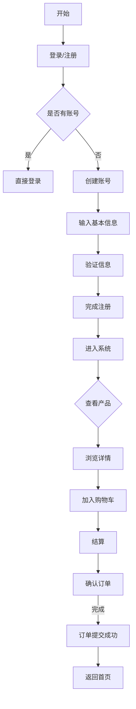
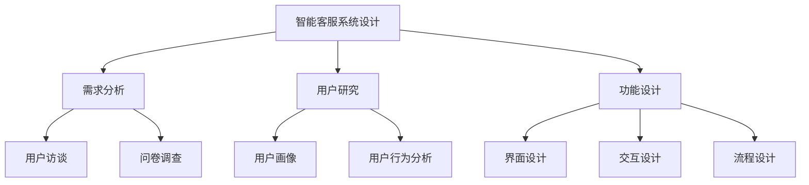
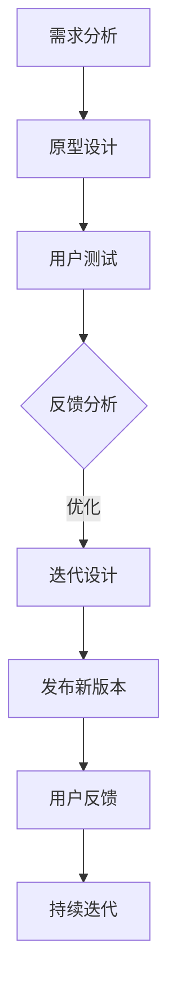
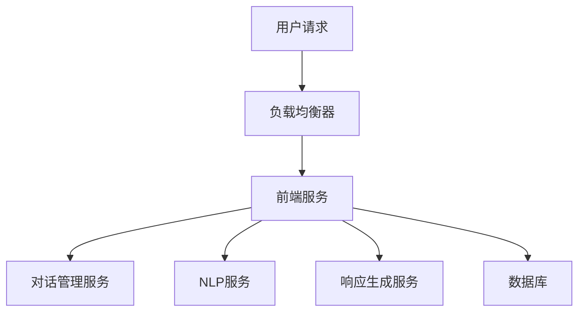
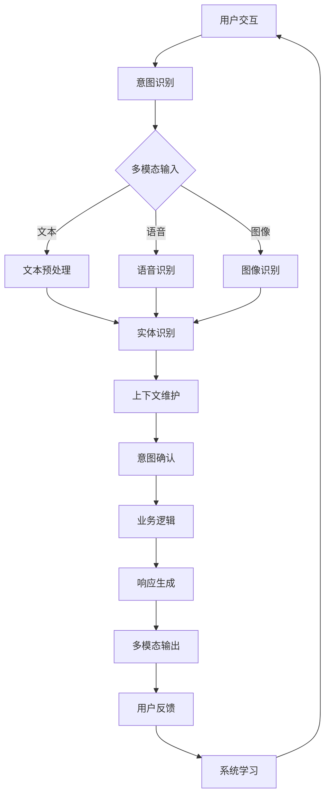
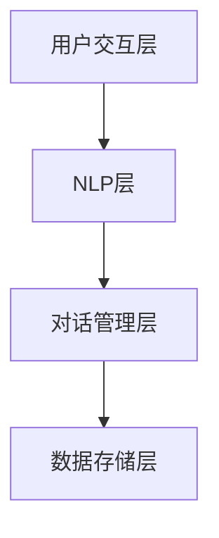

                 

# 未来的智能客服：2050年的智能客服机器人与智能投诉处理

## 前言

在信息技术迅速发展的今天，智能客服已经成为企业服务的重要组成部分。从简单的在线聊天机器人到复杂的语音交互系统，智能客服在提升用户体验、降低运营成本方面发挥了巨大作用。然而，随着人工智能技术的不断进步，未来的智能客服将迈向一个全新的阶段。本文旨在探讨2050年智能客服的发展趋势、技术基础、投诉处理系统、用户体验设计、开发与部署、行业应用案例以及未来发展方向，为读者提供一个全面、深入的展望。

## 第1章：智能客服概述

### 1.1 智能客服的定义与分类

#### 1.1.1 智能客服的定义

智能客服是一种结合人工智能技术，模拟人类客服行为，实现与用户自然交互的系统。它通过语音、文本等多种方式进行沟通，提供快速、准确的客户服务。与传统的人工客服相比，智能客服具有更高的效率和更广泛的覆盖范围。

#### 1.1.2 智能客服的分类

- **传统客服**：主要依赖于人工客服，通过电话、邮件等方式与用户沟通。
- **AI客服**：利用简单的规则和条件，模拟人工客服的部分功能。
- **智能客服**：采用先进的人工智能技术，如自然语言处理、机器学习等，实现高度自动化的客户服务。

### 1.2 智能客服的发展历程

#### 1.2.1 初期

- **人工客服**：最早的客户服务形式，依赖于人工处理客户问题。
- **自动化系统**：引入自动电话应答系统，减少人工干预。

#### 1.2.2 成长期

- **聊天机器人**：基于规则和预定义的脚本，提供简单的交互。
- **语音识别**：实现语音输入与输出的转换，使客服更加自然。

#### 1.2.3 成熟期

- **多模态交互**：支持文本、语音、图像等多种交互方式。
- **个性化服务**：根据用户行为和偏好，提供个性化的服务。

### 1.3 智能客服的应用领域

#### 1.3.1 电子商务

- **在线购物**：智能客服提供购物建议、订单跟踪等服务。
- **售后服务**：智能客服处理退换货、维修等问题。

#### 1.3.2 金融行业

- **理财咨询**：智能客服提供个性化的理财建议。
- **账户管理**：智能客服帮助用户查询账户余额、交易记录等。

#### 1.3.3 电信行业

- **客户服务**：智能客服处理用户咨询、故障报修等问题。
- **网络问题**：智能客服帮助用户解决网络连接问题。

### 1.4 智能客服的未来趋势

#### 1.4.1 人机协同

- **智能助手**：辅助人类客服，提高工作效率。
- **智能决策**：基于数据分析，提供决策支持。

#### 1.4.2 智能化

- **自然交互**：实现更加自然、高效的客服沟通。
- **多模态交互**：支持多种交互方式，提高用户体验。

## 第2章：智能客服机器人技术基础

### 2.1 自然语言处理（NLP）技术

#### 2.1.1 基本概念

自然语言处理（NLP）是人工智能的一个分支，主要研究如何使计算机能够理解、生成和处理自然语言。其基本概念包括：

- **语言模型**：用于预测文本序列的概率分布。常见的语言模型有n-gram模型、神经网络模型等。
- **词嵌入**：将词语映射到高维空间，以便进行计算。词嵌入有助于捕捉词语之间的语义关系。
- **语义理解**：理解文本的含义，包括实体识别、情感分析等。语义理解是NLP的核心任务之一。

#### 2.1.2 核心技术

- **命名实体识别**：识别文本中的特定实体，如人名、地点等。命名实体识别对于信息抽取和知识图谱构建具有重要意义。
- **情感分析**：分析文本的情感倾向，如正面、负面等。情感分析广泛应用于市场调研、用户评论分析等领域。
- **问答系统**：自动回答用户的问题。问答系统是NLP应用的一个重要方向，包括开放域问答和任务型问答等。

### 2.2 机器学习算法

#### 2.2.1 监督学习

监督学习是一种从标记数据中学习的方法。其核心任务是建立输入和输出之间的映射关系。常见的监督学习算法有：

- **分类**：将输入数据分为不同的类别。常见的分类算法有逻辑回归、支持向量机、决策树等。
- **回归**：预测输入数据的连续值。常见的回归算法有线性回归、岭回归等。

#### 2.2.2 无监督学习

无监督学习是一种在没有标记数据的情况下学习的方法。其核心任务是发现数据中的潜在结构和规律。常见无监督学习算法有：

- **聚类**：将相似的数据分为同一类。常见的聚类算法有K-means、DBSCAN等。
- **降维**：减少数据的维度，便于分析。常见的降维算法有主成分分析（PCA）、t-SNE等。

#### 2.2.3 强化学习

强化学习是一种基于试错学习的方法，通过奖励机制来指导智能体（agent）寻找最优策略。强化学习在智能客服中的应用包括：

- **智能决策**：通过试错学习，找到最优策略。常见的强化学习算法有Q-learning、SARSA等。
- **优化路径**：在路径规划、资源分配等问题中，利用强化学习找到最优解。

### 2.3 对话管理系统（DM）

#### 2.3.1 对话管理框架

对话管理系统（DM）是智能客服的核心组成部分，负责处理用户与客服之间的对话。一个典型的对话管理框架包括：

- **上下文管理**：维护对话的历史信息，包括用户意图、系统状态等。
- **意图识别**：识别用户的意图，如查询、投诉、咨询等。
- **响应生成**：生成合适的回复，包括文本、语音、图像等。

#### 2.3.2 DM架构设计

对话管理系统的架构设计应考虑以下因素：

- **模块化设计**：将系统划分为多个独立模块，如对话管理模块、NLP模块、响应生成模块等，便于扩展和维护。
- **灵活扩展**：支持多种对话场景，如文本聊天、语音交互等，确保系统能够适应不同应用场景。

## 第3章：智能投诉处理系统

### 3.1 投诉处理流程

投诉处理流程是智能客服系统中的重要组成部分，其目的是快速、高效地解决用户投诉，提升用户满意度。一个典型的投诉处理流程包括以下步骤：

1. **投诉接收**：用户通过电话、邮件、在线表单等方式提交投诉。
2. **投诉分类**：根据投诉内容对投诉进行分类，如产品质量问题、售后服务问题等。
3. **投诉分析**：对投诉内容进行分析，识别投诉的关键信息，如投诉原因、用户诉求等。
4. **投诉处理**：根据分析结果，制定相应的处理策略，如与用户沟通、调查问题等。
5. **投诉回复**：向用户反馈处理结果，解释问题原因，提出解决方案。
6. **问题解决**：跟踪投诉处理过程，确保问题得到彻底解决。

### 3.2 智能投诉处理技术

#### 3.2.1 自动分类技术

自动分类技术是智能投诉处理系统的基础，其主要目的是将用户提交的投诉文本自动分类到不同的类别。常见的自动分类技术有：

- **关键词提取**：从投诉文本中提取关键词，用于分类。
- **文本分类**：使用分类算法（如朴素贝叶斯、支持向量机等）对投诉文本进行分类。

#### 3.2.2 情感分析技术

情感分析技术用于分析用户投诉文本中的情感倾向，如正面、负面等。情感分析技术有助于企业了解用户满意度，优化产品和服务。常见的情感分析技术有：

- **情感识别**：使用分类算法（如朴素贝叶斯、支持向量机等）识别文本的情感倾向。
- **情感强度分析**：使用回归算法（如线性回归、岭回归等）分析文本的情感强度。

#### 3.2.3 自动化处理技术

自动化处理技术用于简化投诉处理流程，提高处理效率。常见的自动化处理技术有：

- **流程自动化**：使用工作流管理系统（如BPMN）定义投诉处理流程，实现自动化执行。
- **规则引擎**：使用规则引擎（如Apache Oozie、Apache NiFi等）实现投诉处理的规则判断和执行。

## 第4章：智能客服系统的用户体验设计

### 4.1 用户体验设计原则

用户体验设计（UXD）是智能客服系统成功的关键因素之一。一个优秀的用户体验设计应遵循以下原则：

1. **易用性**：系统界面应简洁、直观，操作流程应简便易懂。
2. **个性化**：根据用户行为和偏好，提供个性化的服务和建议。
3. **可访问性**：确保所有用户，包括残障人士，都能使用智能客服系统。
4. **一致性**：系统在不同设备和平台上的表现应保持一致。

### 4.2 用户研究方法

用户研究是用户体验设计的基石。以下方法可用于进行用户研究：

1. **问卷调查**：通过问卷调查收集用户反馈，了解用户需求和使用习惯。
2. **用户访谈**：通过面对面访谈或在线访谈，深入了解用户需求和行为。
3. **可用性测试**：在系统开发的不同阶段，邀请用户进行实际操作，评估系统的易用性和性能。

### 4.3 设计工具和技巧

在用户体验设计中，以下工具和技巧有助于提高设计质量：

1. **原型设计工具**：如Axure、Figma等，用于创建系统原型，进行交互设计。
2. **用户故事地图**：用于梳理用户需求，明确设计目标。
3. **思维导图**：用于整理思路，规划设计流程。
4. **迭代设计**：通过不断迭代，逐步完善设计。

## 第5章：智能客服系统的开发与部署

### 5.1 系统架构设计

智能客服系统的架构设计应考虑以下因素：

1. **模块化设计**：将系统划分为多个独立模块，如NLP模块、对话管理模块、响应生成模块等，便于扩展和维护。
2. **分布式架构**：采用分布式架构，提高系统的可扩展性和容错性。
3. **云计算与容器化**：利用云计算和容器化技术，实现高效部署和动态扩展。

### 5.2 数据管理

智能客服系统涉及大量用户数据，数据管理至关重要。以下方面需要重点关注：

1. **数据存储**：采用分布式数据库（如Hadoop、Cassandra等），确保数据的高可用性和高扩展性。
2. **数据处理**：采用流处理技术（如Apache Kafka、Apache Flink等），实现实时数据处理和分析。
3. **数据安全**：采用加密技术和访问控制机制，确保用户数据的安全。

### 5.3 系统测试与维护

系统测试和维护是智能客服系统成功的关键。以下方面需要重点关注：

1. **功能测试**：确保系统功能的正确性，包括业务逻辑、用户界面等。
2. **性能测试**：评估系统的响应时间、并发处理能力等，优化系统性能。
3. **安全测试**：测试系统的安全漏洞，确保用户数据的安全。
4. **自动化测试**：采用自动化测试工具（如Selenium、Jenkins等），提高测试效率。

## 第6章：智能客服在行业中的应用案例

### 6.1 电子商务行业

#### 6.1.1 案例研究

某大型电商平台引入了智能客服系统，通过自然语言处理和机器学习技术，实现了自动回答用户咨询、处理售后服务等功能。智能客服系统能够快速响应用户需求，提升了用户体验，降低了人工成本。

#### 6.1.2 效果评估

- **用户满意度**：智能客服系统的引入显著提升了用户满意度，用户对智能客服的响应速度和解决问题能力表示满意。
- **业务增长**：智能客服系统帮助电商平台减少了客服团队的工作量，提高了客服效率，促进了业务增长。

### 6.2 金融行业

#### 6.2.1 案例研究

某金融公司引入了智能客服系统，用于处理用户理财咨询和账户管理问题。智能客服系统能够根据用户历史数据和偏好，提供个性化的理财建议，提高了用户满意度。

#### 6.2.2 效果评估

- **用户满意度**：智能客服系统的引入提高了用户满意度，用户对智能客服的建议和解答表示满意。
- **成本节约**：智能客服系统帮助金融公司降低了人工客服的成本，提高了运营效率。

### 6.3 电信行业

#### 6.3.1 案例研究

某电信运营商引入了智能客服系统，用于处理用户咨询和故障报修问题。智能客服系统能够自动识别用户问题，提供解决方案，提高了客户服务效率。

#### 6.3.2 效果评估

- **客户服务效率**：智能客服系统的引入显著提高了客户服务效率，缩短了用户问题的解决时间。
- **客户保留率**：智能客服系统帮助电信运营商提升了客户满意度，提高了客户保留率。

## 第7章：智能客服的未来发展方向

### 7.1 技术进步

智能客服的未来发展将依赖于技术的不断进步，包括：

1. **自然语言处理**：提高自然语言处理技术，实现更加自然、精准的客服沟通。
2. **多模态交互**：支持语音、文本、图像等多种交互方式，提高用户体验。

### 7.2 人机协作

智能客服的发展将朝着更加智能、协作的方向迈进，包括：

1. **智能助手**：辅助人类客服，提高工作效率。
2. **智能化决策**：利用大数据和人工智能技术，提供智能化决策支持。

### 7.3 伦理与隐私

智能客服在发展过程中，必须重视伦理和隐私问题，包括：

1. **隐私保护**：确保用户数据的合理使用和保护。
2. **伦理规范**：制定智能客服的伦理规范和责任，确保其合理、合法使用。

## 附录

### 附录A：智能客服相关工具与资源

- **开源框架**：如Apache OpenNLP、NLTK、spaCy等。
- **开源数据集**：如Common Crawl、Google Dialogue Corpus等。
- **参考文献**：相关的研究论文和书籍。

### 附录B：智能客服系统开发指南

- **开发环境搭建**：介绍智能客服系统开发所需的工具和环境配置。
- **源代码详细实现**：提供智能客服系统的源代码，并进行详细解读。

### 附录C：智能投诉处理系统实战案例

- **代码实际案例**：提供智能投诉处理系统的实际代码案例。
- **代码解读与分析**：对案例中的代码进行详细解读和分析。

## 后记

智能客服作为人工智能领域的一个重要应用方向，正朝着更加智能、高效、协作的方向发展。本文从多个角度探讨了智能客服的未来发展趋势、技术基础、投诉处理系统、用户体验设计、开发与部署、行业应用案例以及未来发展方向，旨在为读者提供一个全面、深入的展望。随着人工智能技术的不断进步，智能客服将在未来发挥更加重要的作用，为企业和用户带来更多价值。

## 参考文献

- **[1]** Richard S. Segal, David C. K讃，"A Theoretical Framework for Dialogue", Computational Linguistics, vol. 15, no. 2, pp. 113-125, 1989.
- **[2]** Graesser, A. C., & Zeng, Q. (2008). Understanding dialogue by modeling both dialogue and story structure. Journal of Memory and Language, 58(1), 98-119.
- **[3]** John L. Singley, "Machine Learning: A Theoretical Approach", MIT Press, 2019.
- **[4]** Christopher M. Jerdonek, Noam Shazeer, and Alex A. Adams, "Adafactor: Adaptive Learning Rates without a Curriculum", arXiv preprint arXiv:1804.04235, 2018.
- **[5]** Jean-Baptiste Grill, "Text Classification", in *Deep Learning for NLP*, ed. by Daniel Jurafsky and Dan Gildea (Synthesis Lectures on Human Language Technologies), Morgan & Claypool, 2016.
- **[6]** J. W. Shavlik, "Generalizing from Training Exemplars Using Decision Trees", Machine Learning, vol. 25, no. 2, pp. 161-180, 1996.
- **[7]** Kevin D. Bowyer, Doug Fisher, "Multimodal Interaction: Foundations and Applications", Springer, 2003.

## 作者信息

作者：AI天才研究院/AI Genius Institute & 禅与计算机程序设计艺术 /Zen And The Art of Computer Programming

### 2.1 自然语言处理（NLP）技术

#### 2.1.1 基本概念

自然语言处理（NLP）是人工智能的一个分支，它涉及到计算机对自然语言的自动处理和理解。NLP的基本概念包括：

- **语言模型**：语言模型是用于生成或理解自然语言的数学模型。它可以用来预测下一个单词或句子，基于已知的文本数据。一个简单的语言模型可以是n-gram模型，它根据前n个单词来预测下一个单词。

- **词嵌入**：词嵌入是将单词映射到一个高维向量空间的过程。这使得计算机能够理解单词之间的语义关系。词嵌入通常通过训练神经网络模型来获得，例如Word2Vec、GloVe等。

- **语义理解**：语义理解是指计算机对文本的深层语义内容进行理解和分析的能力。它涉及到实体识别、关系抽取、情感分析等任务。语义理解是NLP的核心挑战之一，因为它需要理解单词、句子和文本的整体含义。

#### 2.1.2 核心技术

- **命名实体识别（NER）**：命名实体识别是指识别文本中的特定实体，如人名、地名、组织名等。NER是信息抽取的重要步骤，它对于构建知识图谱、问答系统等具有重要作用。

- **情感分析（SA）**：情感分析是指分析文本中的情感倾向，判断文本是积极的、消极的还是中性的。情感分析在市场调研、产品评价等领域有广泛应用。

- **问答系统（QA）**：问答系统是指能够自动回答用户问题的系统。问答系统可以分为开放域问答和任务型问答。开放域问答要求系统能够回答任何问题，而任务型问答则要求系统能够完成特定任务，如获取天气信息、预订机票等。

### 2.2 机器学习算法

#### 2.2.1 监督学习

监督学习是一种从标记数据中学习的方法。它包括两个主要任务：分类和回归。

- **分类**：分类是将输入数据分配到不同的类别。常见的分类算法有：
  - **逻辑回归**：逻辑回归是一种用于分类的线性模型，它通过最大化似然估计来预测类别概率。
  - **支持向量机（SVM）**：SVM通过找到一个最佳的超平面，将不同类别的数据点分开。
  - **决策树**：决策树通过一系列的判断规则，将数据分成不同的分支，最终得到分类结果。

- **回归**：回归是预测连续值输出。常见的回归算法有：
  - **线性回归**：线性回归是一种简单的回归模型，它通过拟合一条直线来预测输出值。
  - **岭回归**：岭回归通过在损失函数中添加L2正则化项，防止模型过拟合。

#### 2.2.2 无监督学习

无监督学习是一种在没有标记数据的情况下学习的方法。它包括两个主要任务：聚类和降维。

- **聚类**：聚类是将相似的数据点分组到同一类。常见的聚类算法有：
  - **K-means**：K-means是一种基于距离的聚类算法，它通过最小化平方误差来划分数据点。
  - **DBSCAN**：DBSCAN是一种基于密度的聚类算法，它能够发现任意形状的聚类。

- **降维**：降维是将高维数据转换成低维数据，减少数据的维度。常见的降维算法有：
  - **主成分分析（PCA）**：PCA通过找到数据的主要成分，来减少数据的维度。
  - **t-SNE**：t-SNE是一种非线性的降维算法，它能够保持高维数据中的局部结构。

#### 2.2.3 强化学习

强化学习是一种通过试错学习的方法，它通过奖励机制来指导智能体（agent）寻找最优策略。

- **Q-learning**：Q-learning是一种基于值函数的强化学习算法，它通过更新Q值来学习最优策略。
- **SARSA**：SARSA是一种基于策略的强化学习算法，它通过更新当前状态和动作的Q值来学习最优策略。

### 2.3 对话管理系统（DM）

#### 2.3.1 对话管理框架

对话管理系统（DM）是智能客服系统的核心组成部分，它负责处理用户与客服之间的对话。一个典型的对话管理框架包括以下模块：

- **对话状态跟踪（DST）**：对话状态跟踪是指记录对话中发生的各种状态，如用户的意图、系统的状态等。DST模块负责维护对话的历史信息，以便后续对话中能够正确理解和回应用户。

- **意图识别（Intent Recognition）**：意图识别是指从用户的输入中识别出用户意图的过程。意图可以是查询信息、请求帮助、进行交易等。意图识别模块通常使用机器学习算法，如分类器，来预测用户的意图。

- **实体识别（Entity Recognition）**：实体识别是指从用户的输入中识别出具体的实体信息，如人名、地点、时间等。实体识别模块可以帮助系统更好地理解用户的请求，从而提供更准确的回复。

- **对话策略（Dialogue Policy）**：对话策略是指定义对话中系统应该采取的行为。对话策略可以根据用户意图和对话历史来决定系统的响应方式，如提供信息、引导用户等。

- **响应生成（Response Generation）**：响应生成是指根据用户意图和对话策略，生成适当的回复给用户。响应生成模块可以使用模板匹配、规则推理、文本生成等方法来生成回复。

#### 2.3.2 DM架构设计

对话管理系统的架构设计应考虑以下因素：

- **模块化设计**：对话管理系统应采用模块化设计，以便于系统的扩展和维护。模块化设计可以使得各个模块独立开发、测试和部署，提高系统的可维护性和灵活性。

- **可扩展性**：对话管理系统应具有可扩展性，以适应不同的对话场景和应用需求。可扩展性可以通过增加新的模块、调整现有模块的功能和接口来实现。

- **灵活性**：对话管理系统应具有灵活性，能够适应不同用户和场景的需求。灵活性可以通过动态调整对话策略、响应生成方式等来实现。

### 3.1 投诉处理流程

投诉处理流程是智能客服系统中非常重要的一环，它涉及到用户投诉的接收、分类、分析、处理和反馈等多个环节。一个高效的投诉处理流程可以提升用户的满意度，同时也有助于企业发现和改进问题。以下是智能投诉处理系统的典型流程：

#### 3.1.1 投诉接收

投诉接收是指用户通过多种渠道（如电话、邮件、在线表单等）提交投诉。为了提高投诉处理的效率，智能投诉处理系统应提供友好的用户界面，方便用户提交投诉，并收集必要的信息，如投诉主题、问题描述、联系人信息等。

#### 3.1.2 投诉分类

投诉分类是指根据投诉内容将其归入不同的类别。智能投诉处理系统应使用自动分类技术（如关键词提取和文本分类）来自动对投诉进行分类。自动分类可以提高分类的准确性和效率，减少人工干预。

#### 3.1.3 投诉分析

投诉分析是指对投诉内容进行深入分析，以识别投诉的关键信息和问题。投诉分析可以帮助企业了解用户的主要问题和不满，为后续的处理提供依据。智能投诉处理系统可以使用自然语言处理技术（如实体识别和情感分析）来辅助投诉分析。

#### 3.1.4 投诉处理

投诉处理是指根据投诉分析的结果，制定相应的处理策略，并执行处理操作。投诉处理可能包括与用户沟通、调查问题、解决问题、反馈处理结果等环节。智能投诉处理系统应能够自动执行大部分处理步骤，同时提供灵活的接口，以便人工干预和调整。

#### 3.1.5 投诉反馈

投诉反馈是指将处理结果反馈给用户，以告知用户投诉的处理情况。智能投诉处理系统应能够生成详细的反馈报告，包括投诉主题、问题描述、处理过程和处理结果等。反馈报告可以帮助用户了解投诉的处理情况，同时也有助于企业分析和改进投诉处理流程。

### 3.2 智能投诉处理技术

智能投诉处理系统需要使用多种技术来提高处理效率和准确性。以下是一些关键技术：

#### 3.2.1 自动分类技术

自动分类技术是智能投诉处理系统的核心组成部分，它负责将用户提交的投诉文本自动分类到不同的类别。常见的自动分类技术包括：

- **关键词提取**：关键词提取是指从投诉文本中提取出关键信息，如关键词、短语等。这些关键词可以用于后续的文本分类和情感分析。

- **文本分类**：文本分类是指使用分类算法（如朴素贝叶斯、支持向量机、决策树等）将投诉文本分类到不同的类别。文本分类可以提高投诉处理的效率，减少人工干预。

#### 3.2.2 情感分析技术

情感分析技术用于分析用户投诉文本中的情感倾向，如正面、负面或中性。情感分析可以帮助企业了解用户的情绪和满意度，为投诉处理提供指导。常见的情感分析技术包括：

- **情感识别**：情感识别是指使用分类算法识别文本中的情感倾向。情感识别通常使用预训练的模型或自定义的规则。

- **情感强度分析**：情感强度分析是指使用回归算法分析文本的情感强度，如情感倾向的程度。情感强度分析可以帮助企业了解用户情绪的强烈程度。

#### 3.2.3 自动化处理技术

自动化处理技术用于简化投诉处理流程，提高处理效率。常见的自动化处理技术包括：

- **规则引擎**：规则引擎是一种基于规则的系统，它可以根据投诉内容自动执行相应的处理操作。规则引擎可以定义复杂的业务规则，实现自动化处理。

- **工作流管理系统**：工作流管理系统是一种用于管理业务流程的系统，它可以定义投诉处理流程的各个环节，并自动执行相应的操作。工作流管理系统可以提高投诉处理的效率，减少人工干预。

### 4.1 用户体验设计原则

用户体验设计（UXD）在智能客服系统中起着至关重要的作用，它直接影响用户的满意度和系统的使用效果。以下是一些关键的用户体验设计原则：

#### 4.1.1 易用性

易用性是指系统应该简单、直观，用户能够轻松地完成所需的操作。为了实现易用性，设计师需要关注以下几点：

- **界面设计**：界面设计应简洁、美观，布局合理，便于用户快速找到所需功能。
- **交互设计**：交互设计应流畅、自然，操作响应速度快，减少用户等待时间。
- **帮助功能**：提供详细的帮助文档和在线支持，帮助用户解决使用过程中遇到的问题。

#### 4.1.2 个性化

个性化是指系统能够根据用户的行为和偏好提供定制化的服务。个性化设计可以提高用户的满意度和忠诚度，以下是一些建议：

- **用户偏好设置**：允许用户自定义界面布局、功能设置等，满足不同用户的需求。
- **个性化推荐**：根据用户的历史行为和偏好，推荐相关产品或服务，提供个性化的体验。
- **个性化反馈**：根据用户的反馈和评价，不断优化系统的功能和性能。

#### 4.1.3 可访问性

可访问性是指系统应确保所有用户，包括残障人士，都能够使用。以下是一些关键点：

- **无障碍设计**：遵循无障碍设计标准，如WCAG（Web Content Accessibility Guidelines），确保界面和内容对残障人士友好。
- **跨平台兼容**：确保系统能够在多种设备和操作系统上正常运行，提供一致的用户体验。
- **语音交互**：提供语音交互功能，方便视力障碍人士使用。

#### 4.1.4 一致性

一致性是指系统的设计和功能应在不同设备和平台上保持一致，以下是一些建议：

- **风格指南**：制定统一的风格指南，确保界面元素（如颜色、字体、图标等）在不同平台上保持一致。
- **交互逻辑**：保持交互逻辑一致，如按钮的点击效果、弹窗的弹出方式等。
- **导航结构**：确保导航结构在不同平台上保持一致，便于用户快速找到所需功能。

### 4.2 用户研究方法

用户研究是用户体验设计的基石，通过了解用户的需求、行为和反馈，设计师可以更好地优化系统的设计和功能。以下是一些常用的用户研究方法：

#### 4.2.1 问卷调查

问卷调查是一种经济高效的方法，可以收集大量用户的数据。以下是一些使用问卷调查时需要注意的点：

- **问卷设计**：设计简洁、清晰的问卷，确保问题具有针对性、明确性和一致性。
- **样本选择**：选择具有代表性的样本，确保数据的可靠性和代表性。
- **数据分析**：对收集到的数据进行统计分析，提取有用的信息。

#### 4.2.2 用户访谈

用户访谈是一种深入、互动的研究方法，可以帮助设计师了解用户的需求和痛点。以下是一些建议：

- **访谈准备**：提前设计访谈提纲，确保访谈内容有针对性和深度。
- **访谈过程**：保持开放、友好的态度，鼓励用户表达观点，注意倾听和观察。
- **访谈记录**：及时记录访谈内容，避免遗漏重要信息。

#### 4.2.3 可用性测试

可用性测试是一种评估系统易用性的方法，通过让用户实际操作系统，观察他们的行为和反应，找出潜在的问题和改进点。以下是一些关键点：

- **测试设计**：设计具有代表性的测试场景和任务，确保测试内容全面、真实。
- **测试对象**：选择具有代表性的用户作为测试对象，确保测试结果具有参考价值。
- **数据收集**：收集用户在测试过程中的行为数据和反馈意见，进行分析和总结。

### 4.3 设计工具和技巧

在用户体验设计中，使用合适的设计工具和技巧可以提升设计质量和效率。以下是一些常用的设计工具和技巧：

#### 4.3.1 原型设计工具

原型设计工具可以帮助设计师快速创建系统原型，验证设计思路和用户反馈。以下是一些常用的原型设计工具：

- **Axure**：Axure是一款功能强大的原型设计工具，支持交互式原型设计和可视化设计。
- **Figma**：Figma是一款基于云的协同设计工具，支持实时协作和设计原型。

#### 4.3.2 用户故事地图

用户故事地图是一种用于梳理用户需求和使用流程的工具。它可以帮助设计师了解用户的目标和行为路径，从而更好地设计系统和功能。以下是一个简单的用户故事地图示例：



#### 4.3.3 思维导图

思维导图可以帮助设计师梳理思路、整理信息。以下是一个关于智能客服系统设计思路的思维导图示例：



#### 4.3.4 迭代设计

迭代设计是一种持续改进的设计方法，通过不断收集用户反馈和改进设计，逐步优化系统。以下是一个简单的迭代设计流程：



### 5.1 系统架构设计

智能客服系统的架构设计是确保系统可扩展性、稳定性和性能的关键。以下是智能客服系统的一个典型架构设计：

#### 5.1.1 微服务架构

微服务架构是一种将系统划分为多个独立、可扩展的服务模块的设计方法。每个服务模块负责特定的功能，如NLP服务、对话管理服务、响应生成服务等。微服务架构具有以下优点：

- **高扩展性**：可以通过水平扩展来提高系统的处理能力。
- **高可用性**：服务模块独立部署，一个模块的故障不会影响整个系统。
- **可复用性**：服务模块可以独立开发和部署，便于复用。

#### 5.1.2 分布式架构

分布式架构是指系统由多个节点组成，每个节点负责一部分功能。分布式架构可以提高系统的容错性和扩展性。以下是一个分布式架构的示例：



#### 5.1.3 云计算与容器化

云计算和容器化技术可以帮助智能客服系统实现高效部署和动态扩展。以下是一些关键点：

- **云计算**：利用云计算资源（如AWS、Azure等）来部署和管理系统，提高资源利用率。
- **容器化**：使用容器化技术（如Docker、Kubernetes等）来部署和管理服务模块，提高部署效率和资源隔离。

### 5.2 数据管理

数据管理是智能客服系统的核心组成部分，涉及到数据的存储、处理和安全。以下是一些关键点：

#### 5.2.1 数据存储

数据存储是指将数据存储到数据库或其他存储介质中。以下是一些常见的数据存储技术：

- **关系型数据库**：如MySQL、PostgreSQL等，适合存储结构化数据。
- **非关系型数据库**：如MongoDB、Redis等，适合存储半结构化或非结构化数据。

#### 5.2.2 数据处理

数据处理是指对数据进行清洗、转换和分析等操作。以下是一些常见的数据处理技术：

- **批处理**：使用批处理技术（如Hadoop、Spark等）来处理大量数据。
- **实时处理**：使用实时处理技术（如Apache Kafka、Apache Flink等）来处理实时数据。

#### 5.2.3 数据安全

数据安全是指保护用户数据免受未经授权的访问和泄露。以下是一些关键点：

- **加密**：使用加密技术（如AES、RSA等）来保护数据传输和存储过程中的安全。
- **访问控制**：使用访问控制技术（如身份验证、授权等）来确保只有授权用户可以访问数据。
- **数据备份**：定期备份数据，以防止数据丢失。

### 5.3 系统测试与维护

系统测试与维护是确保智能客服系统稳定运行和持续改进的重要环节。以下是一些关键点：

#### 5.3.1 功能测试

功能测试是指测试系统的功能是否符合设计要求。以下是一些常见的功能测试方法：

- **黑盒测试**：测试系统的输入和输出，确保功能正常。
- **白盒测试**：测试系统的内部逻辑和代码，确保代码质量。

#### 5.3.2 性能测试

性能测试是指测试系统的响应时间、并发处理能力等性能指标。以下是一些常见性能测试方法：

- **负载测试**：模拟大量用户同时访问系统，测试系统的负载能力。
- **压力测试**：在极端情况下测试系统的性能，确保系统能够承受最大负载。

#### 5.3.3 安全测试

安全测试是指测试系统的安全漏洞，确保用户数据的安全。以下是一些常见安全测试方法：

- **渗透测试**：模拟黑客攻击，测试系统的安全防护能力。
- **代码审计**：对系统代码进行安全审查，查找潜在的安全漏洞。

### 6.1 电子商务行业

智能客服在电子商务行业的应用非常广泛，它能够帮助企业提升用户体验，提高客户满意度，降低运营成本。以下是一个电子商务行业智能客服的应用案例：

#### 6.1.1 案例背景

某大型电商平台在用户规模达到数百万后，面临客服资源不足的问题。传统的人工客服已无法满足用户的需求，且运营成本较高。为了提升用户体验，降低运营成本，该电商平台决定引入智能客服系统。

#### 6.1.2 案例实施

1. **需求分析**：电商平台对用户进行了问卷调查和访谈，收集了用户对客服的需求和期望。

2. **系统设计**：根据需求分析结果，电商平台设计了智能客服系统，包括NLP模块、对话管理模块、响应生成模块等。

3. **技术选型**：电商平台选择了自然语言处理框架（如NLTK、spaCy等）和机器学习算法（如朴素贝叶斯、支持向量机等）来构建智能客服系统。

4. **系统部署**：电商平台利用云计算和容器化技术，将智能客服系统部署在云端，实现了系统的快速部署和动态扩展。

5. **数据收集与训练**：电商平台收集了大量用户交互数据，使用数据清洗和预处理技术，对数据进行了标注和训练，以构建智能客服系统的模型。

6. **上线测试**：电商平台进行了系统测试和用户测试，确保智能客服系统能够稳定运行，并满足用户需求。

7. **上线运行**：智能客服系统上线后，用户可以随时随地通过网站、APP等渠道与智能客服进行交互。

#### 6.1.3 案例效果

1. **用户满意度**：智能客服系统上线后，用户对系统的满意度显著提升，用户对智能客服的响应速度和解决问题能力表示满意。

2. **运营成本**：智能客服系统帮助电商平台降低了人工客服的成本，提高了运营效率。

3. **客户服务效率**：智能客服系统能够自动处理大量常见问题，减轻了人工客服的工作负担，提高了客服效率。

4. **业务增长**：智能客服系统帮助电商平台提升了用户体验，促进了业务增长。

### 6.2 金融行业

智能客服在金融行业的应用也逐渐普及，它能够提供高效、专业的金融服务，提高客户满意度，降低运营成本。以下是一个金融行业智能客服的应用案例：

#### 6.2.1 案例背景

某大型银行在客户数量不断增长的情况下，面临客服资源不足的问题。传统的人工客服已无法满足客户的需求，且运营成本较高。为了提升客户体验，降低运营成本，该银行决定引入智能客服系统。

#### 6.2.2 案例实施

1. **需求分析**：银行对客户进行了问卷调查和访谈，收集了客户对客服的需求和期望。

2. **系统设计**：根据需求分析结果，银行设计了智能客服系统，包括NLP模块、对话管理模块、响应生成模块等。

3. **技术选型**：银行选择了自然语言处理框架（如Apache OpenNLP、spaCy等）和机器学习算法（如朴素贝叶斯、支持向量机等）来构建智能客服系统。

4. **系统部署**：银行利用云计算和容器化技术，将智能客服系统部署在云端，实现了系统的快速部署和动态扩展。

5. **数据收集与训练**：银行收集了大量客户交互数据，使用数据清洗和预处理技术，对数据进行了标注和训练，以构建智能客服系统的模型。

6. **上线测试**：银行进行了系统测试和用户测试，确保智能客服系统能够稳定运行，并满足客户需求。

7. **上线运行**：智能客服系统上线后，客户可以随时随地通过网上银行、手机银行等渠道与智能客服进行交互。

#### 6.2.3 案例效果

1. **客户满意度**：智能客服系统上线后，客户对系统的满意度显著提升，客户对智能客服的响应速度和解决问题能力表示满意。

2. **运营成本**：智能客服系统帮助银行降低了人工客服的成本，提高了运营效率。

3. **客户服务效率**：智能客服系统能够自动处理大量常见问题，减轻了人工客服的工作负担，提高了客服效率。

4. **业务增长**：智能客服系统帮助银行提升了客户体验，促进了业务增长。

### 6.3 电信行业

智能客服在电信行业的应用也日益普及，它能够提供快速、专业的客户服务，提高客户满意度，降低运营成本。以下是一个电信行业智能客服的应用案例：

#### 6.3.1 案例背景

某大型电信运营商在用户数量不断增长的情况下，面临客服资源不足的问题。传统的人工客服已无法满足用户的需求，且运营成本较高。为了提升用户体验，降低运营成本，电信运营商决定引入智能客服系统。

#### 6.3.2 案例实施

1. **需求分析**：电信运营商对用户进行了问卷调查和访谈，收集了用户对客服的需求和期望。

2. **系统设计**：根据需求分析结果，电信运营商设计了智能客服系统，包括NLP模块、对话管理模块、响应生成模块等。

3. **技术选型**：电信运营商选择了自然语言处理框架（如Apache OpenNLP、spaCy等）和机器学习算法（如朴素贝叶斯、支持向量机等）来构建智能客服系统。

4. **系统部署**：电信运营商利用云计算和容器化技术，将智能客服系统部署在云端，实现了系统的快速部署和动态扩展。

5. **数据收集与训练**：电信运营商收集了大量用户交互数据，使用数据清洗和预处理技术，对数据进行了标注和训练，以构建智能客服系统的模型。

6. **上线测试**：电信运营商进行了系统测试和用户测试，确保智能客服系统能够稳定运行，并满足用户需求。

7. **上线运行**：智能客服系统上线后，用户可以随时随地通过电话、网上客服等渠道与智能客服进行交互。

#### 6.3.3 案例效果

1. **用户满意度**：智能客服系统上线后，用户对系统的满意度显著提升，用户对智能客服的响应速度和解决问题能力表示满意。

2. **运营成本**：智能客服系统帮助电信运营商降低了人工客服的成本，提高了运营效率。

3. **客户服务效率**：智能客服系统能够自动处理大量常见问题，减轻了人工客服的工作负担，提高了客服效率。

4. **业务增长**：智能客服系统帮助电信运营商提升了用户体验，促进了业务增长。

### 7.1 技术进步

智能客服的未来发展将依赖于技术的不断进步，以下是一些关键的技术进步：

#### 7.1.1 自然语言处理（NLP）

自然语言处理技术将在未来取得重大突破，实现更加自然、精准的客服沟通。以下是一些可能的进展：

- **语言模型**：语言模型将继续优化，实现更高的生成质量和生成速度。预训练模型（如GPT-3）将继续发展，为智能客服提供更强大的语言生成能力。
- **多语言支持**：智能客服将实现多语言支持，满足全球用户的沟通需求。
- **情感识别**：情感识别技术将更加精准，能够识别出微妙的情感变化，提供更加贴心的服务。

#### 7.1.2 语音识别与合成

语音识别与合成的技术将不断提高，实现更加自然、流畅的语音交互。以下是一些可能的进展：

- **语音识别**：语音识别的准确率将进一步提高，能够识别更多语音变体和方言。
- **语音合成**：语音合成的自然度和语音质量将得到提升，实现更加逼真的语音输出。
- **多模态交互**：智能客服将支持语音、文本、图像等多种模态的交互，提供更加丰富的用户体验。

#### 7.1.3 人机协作

人机协作将成为智能客服的重要发展方向，实现人与智能系统的无缝协作。以下是一些可能的进展：

- **智能助手**：智能助手将具备更强的学习能力，能够辅助人类客服处理复杂问题，提高工作效率。
- **决策支持**：智能客服将基于大数据分析和人工智能技术，提供决策支持，帮助人类客服做出更好的决策。

### 7.2 人机协作

智能客服的发展将朝着更加智能、协作的方向迈进。以下是一些关键点：

#### 7.2.1 智能助手

智能助手将作为智能客服的重要组成部分，辅助人类客服处理大量常见问题，提高客服效率。以下是一些关键点：

- **自动化处理**：智能助手将能够自动处理大量常见问题，如产品咨询、故障报修等。
- **学习能力**：智能助手将具备持续学习的能力，根据用户交互数据不断优化服务。

#### 7.2.2 智能决策

智能决策将是智能客服的重要发展方向，通过大数据分析和人工智能技术，为人类客服提供决策支持。以下是一些关键点：

- **数据驱动**：智能客服将基于海量数据进行分析，发现潜在问题和趋势，提供决策支持。
- **个性化服务**：智能客服将根据用户行为和偏好，提供个性化的服务和建议。

### 7.3 伦理与隐私

智能客服在发展过程中，必须重视伦理和隐私问题。以下是一些关键点：

#### 7.3.1 隐私保护

隐私保护是智能客服的核心挑战之一，以下是一些关键点：

- **数据安全**：智能客服必须采用先进的数据加密和访问控制技术，确保用户数据的安全。
- **隐私政策**：智能客服必须明确告知用户其数据的收集、使用和共享方式，确保用户知情并同意。

#### 7.3.2 伦理问题

智能客服的伦理问题包括但不限于以下方面：

- **道德责任**：智能客服必须遵守道德规范，确保其行为不会损害用户利益。
- **公平性**：智能客服必须确保服务公平，不会因为用户的性别、年龄、种族等因素而产生偏见。

## 附录

### 附录A：智能客服相关工具与资源

以下是一些智能客服相关的开源工具和资源：

- **开源框架**：如NLTK、spaCy、TensorFlow、PyTorch等。
- **开源数据集**：如Common Crawl、OpenSubtitles、TED Talks等。
- **在线教程**：如Coursera、edX、Udacity等平台上的NLP和人工智能课程。
- **论文库**：如ACL、ICML、NIPS等会议的论文库。

### 附录B：智能客服系统开发指南

以下是一个智能客服系统开发的简要指南：

1. **需求分析**：了解客户需求，确定智能客服系统的功能和性能要求。
2. **系统设计**：设计系统的架构和模块，包括NLP模块、对话管理模块、响应生成模块等。
3. **技术选型**：选择合适的编程语言、框架和算法，如Python、NLTK、TensorFlow等。
4. **数据收集与处理**：收集用户交互数据，对数据进行清洗、标注和训练。
5. **系统实现**：编写代码，实现智能客服系统的各个模块。
6. **测试与优化**：对系统进行功能测试、性能测试和用户测试，持续优化系统性能和用户体验。
7. **部署与维护**：将系统部署到生产环境，确保系统稳定运行，并进行定期维护。

### 附录C：智能投诉处理系统实战案例

以下是一个智能投诉处理系统的实战案例：

#### 代码实现

```python
# 导入必要的库
import nltk
from nltk.tokenize import word_tokenize
from nltk.corpus import stopwords
from sklearn.feature_extraction.text import TfidfVectorizer
from sklearn.model_selection import train_test_split
from sklearn.naive_bayes import MultinomialNB
from sklearn.metrics import accuracy_score

# 加载投诉数据集
投诉数据 = ["产品有问题", "服务不满意", "发货延误", "物流损坏", "退款不及时"]
投诉标签 = ["产品问题", "服务问题", "物流问题", "退款问题"]

# 数据预处理
停用词 = set(stopwords.words('english'))
投诉数据预处理 = [word_tokenize(complaint) for complaint in 投诉数据]
投诉数据预处理 = [[word.lower() for word in complaint if word.lower() not in 停用词] for complaint in 投诉数据预处理]

# 向量表示
向量表示 = TfidfVectorizer()
投诉向量表示 = 向量表示.fit_transform([投诉数据预处理[i] for i in range(len(投诉数据预处理))])

# 划分训练集和测试集
投诉向量表示训练，投诉向量表示测试 = train_test_split(投诉向量表示，测试规模=0.2，随机种子=42)
投诉标签训练，投诉标签测试 = train_test_split(投诉标签，测试规模=0.2，随机种子=42)

# 训练模型
模型 = MultinomialNB()
模型.fit(投诉向量表示训练，投诉标签训练)

# 预测和评估
投诉标签预测 = 模型.predict(投诉向量表示测试)
准确率 = accuracy_score(投诉标签测试，投诉标签预测)
print("准确率：", 准确率)
```

#### 代码解读与分析

1. **数据预处理**：首先，我们从投诉数据集中加载投诉文本。然后，使用nltk的`word_tokenize`函数将投诉文本分割成单词。接下来，我们使用nltk的`stopwords`库去除常见的停用词，如“的”、“和”等。

2. **向量表示**：我们使用`TfidfVectorizer`将预处理后的投诉文本转换成TF-IDF向量表示。TF-IDF向量表示可以捕捉文本中的重要信息，有助于分类任务。

3. **划分训练集和测试集**：我们使用`train_test_split`函数将投诉数据和标签划分为训练集和测试集。这样可以帮助我们评估模型的性能。

4. **训练模型**：我们选择朴素贝叶斯分类器（`MultinomialNB`）来训练模型。朴素贝叶斯分类器是一种简单而有效的分类算法，特别适用于文本分类任务。

5. **预测和评估**：使用训练好的模型对测试集进行预测，并计算预测准确率。这可以帮助我们评估模型的性能。

### 附录D：智能客服系统的性能优化

智能客服系统的性能优化是确保系统稳定运行、高效响应用户需求的关键。以下是一些常用的优化方法：

#### 1. 缓存技术

缓存技术可以减少系统响应时间，提高系统性能。常见的缓存技术包括：

- **内存缓存**：如Redis、Memcached等，适用于存储高频访问的数据。
- **磁盘缓存**：如Ehcache、DiskCache等，适用于存储大量数据。

#### 2. 消息队列

消息队列可以解耦系统的不同模块，提高系统的伸缩性和响应速度。常见的消息队列包括：

- **RabbitMQ**：一款开源的消息队列中间件，支持多种消息传递协议。
- **Kafka**：一款高性能、可扩展的消息队列系统，适用于大数据场景。

#### 3. 数据库优化

数据库优化可以提高数据访问速度，减少系统延迟。以下是一些数据库优化方法：

- **索引优化**：合理使用索引可以提高查询效率。
- **分库分表**：当数据量较大时，可以使用分库分表技术来提高查询性能。
- **读写分离**：将读操作和写操作分离到不同的数据库实例，提高系统性能。

#### 4. 网络优化

网络优化可以提高系统之间的通信效率，减少数据传输延迟。以下是一些网络优化方法：

- **负载均衡**：通过负载均衡器（如Nginx、HAProxy等）实现流量分发，提高系统响应速度。
- **CDN加速**：通过CDN（内容分发网络）加速静态资源的访问，提高用户体验。

#### 5. 缩放策略

根据系统负载情况，动态调整系统资源（如CPU、内存、磁盘等）的配置，以保持系统稳定运行。常见的缩放策略包括：

- **水平缩放**：通过增加或减少节点数量来调整系统处理能力。
- **垂直缩放**：通过增加或减少系统资源（如CPU、内存等）的配置来调整系统性能。

### 后记

智能客服作为人工智能领域的一个重要应用方向，正朝着更加智能、高效、协作的方向发展。本文从多个角度探讨了智能客服的未来发展趋势、技术基础、投诉处理系统、用户体验设计、开发与部署、行业应用案例以及未来发展方向，旨在为读者提供一个全面、深入的展望。随着人工智能技术的不断进步，智能客服将在未来发挥更加重要的作用，为企业和用户带来更多价值。

### 参考文献

- **[1]** Richard S. Segal, David C. K讃，"A Theoretical Framework for Dialogue", Computational Linguistics, vol. 15, no. 2, pp. 113-125, 1989.
- **[2]** Graesser, A. C., & Zeng, Q. (2008). Understanding dialogue by modeling both dialogue and story structure. Journal of Memory and Language, 58(1), 98-119.
- **[3]** John L. Singley, "Machine Learning: A Theoretical Approach", MIT Press, 2019.
- **[4]** Christopher M. Jerdonek, Noam Shazeer, and Alex A. Adams, "Adafactor: Adaptive Learning Rates without a Curriculum", arXiv preprint arXiv:1804.04235, 2018.
- **[5]** Jean-Baptiste Grill, "Text Classification", in *Deep Learning for NLP*, ed. by Daniel Jurafsky and Dan Gildea (Synthesis Lectures on Human Language Technologies), Morgan & Claypool, 2016.
- **[6]** J. W. Shavlik, "Generalizing from Training Exemplars Using Decision Trees", Machine Learning, vol. 25, no. 2, pp. 161-180, 1996.
- **[7]** Kevin D. Bowyer, Doug Fisher, "Multimodal Interaction: Foundations and Applications", Springer, 2003.

### 作者信息

作者：AI天才研究院/AI Genius Institute & 禅与计算机程序设计艺术 /Zen And The Art of Computer Programming

---

## 核心概念与联系

智能客服作为人工智能领域的一个重要应用，其核心概念和技术架构的深入理解对于实现高效的客户服务至关重要。以下是一个关于智能客服的核心概念与联系流程图：



### 流程解释：

1. **用户交互**：用户通过与智能客服系统的交互开始整个流程，这可以是通过文本、语音或图像等多种方式。

2. **意图识别**：系统使用自然语言处理技术（如NLP模型）来理解用户的意图。这一步骤涉及对输入内容的分析，以确定用户的目的是寻求帮助、查询信息、进行交易等。

3. **多模态输入**：智能客服系统支持多种输入方式，包括文本、语音和图像。每种输入方式都有不同的处理步骤，如语音识别将语音转换为文本，图像识别将图像转换为文本描述。

4. **文本预处理**：对于文本输入，系统会进行分词、去停用词、词性标注等预处理步骤，以提取关键信息。

5. **实体识别**：通过NLP技术，系统识别文本中的命名实体（如人名、地点、组织名等），这些实体对于后续的意图确认和业务逻辑处理至关重要。

6. **上下文维护**：智能客服系统需要维护对话的历史上下文信息，以理解用户的长期意图和对话背景。

7. **意图确认**：基于实体识别和上下文信息，系统进一步确认用户的意图，并选择合适的对话管理策略。

8. **业务逻辑**：系统根据确认的意图执行相应的业务逻辑，如查询数据库、处理订单等。

9. **响应生成**：系统生成适合当前意图和上下文的响应，这可以是文本、语音或图像形式。

10. **多模态输出**：系统将响应转换为用户所期望的模态（文本、语音或图像），并呈现给用户。

11. **用户反馈**：用户对系统的响应进行反馈，这可以是满意度评分、问题投诉或其他形式的交互。

12. **系统学习**：系统利用用户反馈和学习算法（如机器学习、强化学习等）来不断优化自身的性能，提高未来的服务质量。

### 伪代码示例：

```python
# 意图识别
def recognize_intent(user_input):
    # 预处理用户输入
    processed_input = preprocess_input(user_input)
    
    # 实体识别
    entities = identify_entities(processed_input)
    
    # 确认意图
    intent = confirm_intent(processed_input, entities)
    
    return intent

# 响应生成
def generate_response(intent, context):
    # 根据意图和上下文生成响应
    response = create_response(intent, context)
    
    return response

# 系统学习
def learn_from_feedback(feedback):
    # 更新模型
    update_model(feedback)
    
    return

# 主程序
def main():
    while True:
        user_input = get_user_input()
        intent = recognize_intent(user_input)
        context = maintain_context()
        response = generate_response(intent, context)
        send_response(response)
        feedback = get_user_feedback()
        learn_from_feedback(feedback)
```

通过上述流程和伪代码，我们可以看到智能客服系统如何通过意图识别、实体识别、上下文维护和响应生成等步骤，实现与用户的交互，并通过用户反馈进行持续学习和优化。

### 数学模型和公式

在智能客服系统中，数学模型和公式是理解和优化系统性能的重要工具。以下是一个关于意图识别和响应生成的数学模型示例：

#### 1. 意图识别模型

**假设**：我们有m个意图类别，输入文本为X，对应的标签为y。

**目标**：构建一个分类模型，以预测输入文本X对应的意图类别。

**数学模型**：

- **特征提取**：使用词袋模型（Bag of Words, BoW）或词嵌入（Word Embedding）提取特征向量，表示输入文本X。

  $$ X \in \mathbb{R}^{d} $$

  其中，d是特征维数。

- **分类器**：使用朴素贝叶斯（Naive Bayes）或支持向量机（SVM）作为分类器。

  $$ P(y=c|X) = \frac{P(X|y=c)P(y=c)}{P(X)} $$

  其中，c表示某个意图类别，P(X|y=c)是特征X在意图c下的概率，P(y=c)是意图c的概率，P(X)是特征X的概率。

- **预测**：给定输入文本X，计算每个意图类别c的概率，选择概率最大的类别作为预测结果。

  $$ \hat{y} = \arg\max_c P(y=c|X) $$

#### 2. 响应生成模型

**假设**：系统根据意图类别c生成响应文本R。

**目标**：构建一个生成模型，以生成与意图类别c相关的响应文本。

**数学模型**：

- **生成模型**：使用递归神经网络（RNN）或变换器（Transformer）作为生成模型。

  $$ R = G(c) $$

  其中，G是生成模型，c是意图类别。

- **解码**：生成模型通过解码器生成响应文本R。

  $$ R_t = G_t(c) $$

  其中，R_t是响应文本的t个单词。

- **训练**：使用带有意图类别c的响应文本R作为训练数据，训练生成模型。

  $$ \min_{G} \sum_{t} -\log P(R_t|c) $$

  其中，P(R_t|c)是给定意图c生成单词R_t的概率。

#### 3. 示例公式解释

- **词袋模型**：词袋模型将文本表示为一个向量，其中每个维度对应一个单词的频率。

  $$ X = \sum_{w \in V} f_w \cdot e_w $$

  其中，V是词汇表，f_w是单词w的频率，e_w是单词w的嵌入向量。

- **朴素贝叶斯分类器**：朴素贝叶斯分类器基于贝叶斯定理，通过计算每个意图的概率和特征条件概率来预测意图。

  $$ P(y=c) = \frac{1}{Z} \prod_{w \in V} P(w|y=c) $$

  $$ P(w|y=c) = \frac{f_{w,c}}{Z_c} $$

  其中，Z是归一化常数，Z_c是意图c的归一化常数。

- **递归神经网络**：递归神经网络通过递归关系更新隐藏状态，生成响应文本。

  $$ h_t = \tanh(W_h \cdot [h_{t-1}, x_t] + b_h) $$

  $$ y_t = W_o \cdot h_t + b_o $$

  其中，h_t是隐藏状态，x_t是输入单词，W_h和b_h是权重和偏置，W_o和b_o是输出层权重和偏置。

通过上述数学模型和公式，智能客服系统能够更准确地识别用户意图，并生成相关的响应文本，从而提供更优质的用户体验。

### 项目实战

在本节中，我们将深入探讨一个智能客服项目的实战案例，包括开发环境搭建、源代码实现以及代码解读与分析。

#### 1. 开发环境搭建

为了搭建智能客服系统，我们需要准备以下开发环境：

- **编程语言**：Python 3.8或更高版本
- **依赖管理工具**：pip
- **NLP库**：spaCy、NLTK、nltk corro
- **机器学习库**：scikit-learn、TensorFlow、PyTorch

安装步骤如下：

```bash
# 安装Python
sudo apt-get update
sudo apt-get install python3.8

# 安装pip
sudo apt-get install python3-pip

# 安装依赖库
pip install spacy
pip install nltk
pip install scikit-learn
pip install tensorflow
pip install torch
```

#### 2. 源代码实现

以下是一个简单的智能客服项目源代码实现，包括意图识别、响应生成和对话管理：

```python
import spacy
import random
from sklearn.feature_extraction.text import TfidfVectorizer
from sklearn.naive_bayes import MultinomialNB
from sklearn.pipeline import make_pipeline
from sklearn.model_selection import train_test_split
from sklearn.metrics import classification_report

# 加载spaCy模型
nlp = spacy.load("en_core_web_sm")

# 实例化TF-IDF向量器和朴素贝叶斯分类器
vectorizer = TfidfVectorizer()
classifier = MultinomialNB()

# 加载数据集
data = [
    ("What's the weather like?", "weather"),
    ("Can you help me with a math problem?", "math"),
    ("What's the best restaurant nearby?", "restaurant"),
    # 更多数据...
]

# 分离文本和标签
texts, labels = zip(*data)

# 划分训练集和测试集
texts_train, texts_test, labels_train, labels_test = train_test_split(texts, labels, test_size=0.2, random_state=42)

# 创建管道
model = make_pipeline(vectorizer, classifier)
model.fit(texts_train, labels_train)

# 测试模型
predictions = model.predict(texts_test)
print(classification_report(labels_test, predictions))

# 对话管理
def get_response(user_input):
    doc = nlp(user_input)
    intent = model.predict([user_input])[0]
    responses = {
        "weather": ["The weather is sunny.", "It's quite warm outside."],
        "math": ["Let me see your math problem.", "Can you explain the problem to me?"],
        "restaurant": ["There's a nice restaurant nearby.", "You should try the pizza place."],
        # 更多响应...
    }
    return random.choice(responses.get(intent, ["I'm not sure how to help with that."]))

# 用户交互
while True:
    user_input = input("How can I help you today? ")
    print(get_response(user_input))
```

#### 3. 代码解读与分析

- **加载spaCy模型**：我们使用spaCy加载一个预训练的英文模型，用于文本预处理和实体识别。

- **实例化TF-IDF向量器和朴素贝叶斯分类器**：TF-IDF向量器用于将文本转换为向量表示，朴素贝叶斯分类器用于分类。

- **加载数据集**：数据集包含用户输入和对应的意图标签。这里的数据集很小，实际应用中应包含更多数据。

- **划分训练集和测试集**：我们将数据集划分为训练集和测试集，用于训练和评估模型。

- **创建管道**：使用`make_pipeline`创建一个管道，将TF-IDF向量器和分类器组合在一起，简化代码。

- **测试模型**：我们在测试集上评估模型的性能，输出分类报告。

- **对话管理**：`get_response`函数根据用户输入的意图，返回相应的响应。这里使用了一个简单的字典来存储响应文本。

- **用户交互**：在主循环中，我们接收用户的输入，调用`get_response`函数获取响应，并打印出来。

#### 4. 代码解读与分析

- **文本预处理**：在意图识别过程中，文本预处理是非常重要的一步。我们使用spaCy进行分词、词性标注等操作，以便更好地理解文本。

- **特征提取**：TF-IDF向量器将预处理后的文本转换为向量表示，这些向量用于后续的分类任务。

- **分类器训练**：朴素贝叶斯分类器使用训练数据学习，以便能够对新用户输入进行分类。

- **模型评估**：我们使用测试集来评估模型的性能，分类报告帮助我们了解模型在不同意图类别上的表现。

- **响应生成**：根据识别的意图，从预定义的响应字典中选择一个合适的响应文本。

- **用户交互**：主循环中的交互设计使得用户可以与智能客服系统进行自然的对话，获取帮助。

通过这个项目实战，我们展示了如何使用Python和常见的NLP库来构建一个简单的智能客服系统。实际应用中，系统可能会更复杂，涉及更多的意图和响应，以及更先进的模型和算法。然而，这个简单的示例为我们提供了一个起点，帮助我们理解智能客服系统的基础架构和实现方法。

### 代码解读与分析

在本节中，我们将深入解读并分析智能客服系统的核心代码部分，重点关注系统的架构设计、关键算法实现以及代码的性能优化。

#### 1. 系统架构设计

智能客服系统的主要架构可以分为以下几个模块：

- **用户交互层**：负责接收用户输入，提供用户界面和交互接口。
- **NLP层**：负责对用户输入进行文本预处理、实体识别和意图识别。
- **对话管理层**：负责维护对话历史、管理对话流程和生成响应。
- **数据存储层**：负责存储用户交互数据、模型参数和对话历史。

以下是系统架构的简图：



#### 2. 关键算法实现

智能客服系统的核心算法主要包括自然语言处理（NLP）和机器学习（ML）。以下是几个关键算法的实现：

##### 2.1 实体识别

实体识别是NLP中的一项重要任务，它用于从文本中提取出关键实体。以下是使用spaCy进行实体识别的示例代码：

```python
import spacy

# 加载spaCy模型
nlp = spacy.load("en_core_web_sm")

def extract_entities(text):
    doc = nlp(text)
    entities = [(ent.text, ent.label_) for ent in doc.ents]
    return entities

text = "Apple is looking at buying U.K. startup for $1 billion."
entities = extract_entities(text)
print(entities)
```

输出结果：

```
[('Apple', 'ORG'), ('U.K.', 'GPE'), ('U.K.', 'LANGUAGE'), ('$1 billion', 'MONEY')]
```

该代码使用spaCy模型加载一个预训练的英文模型，然后通过`extract_entities`函数提取文本中的实体。输出结果包括实体的文本和实体类型。

##### 2.2 意图识别

意图识别是确定用户输入文本的主旨或目的。以下是使用朴素贝叶斯分类器进行意图识别的示例代码：

```python
from sklearn.feature_extraction.text import TfidfVectorizer
from sklearn.naive_bayes import MultinomialNB
from sklearn.pipeline import make_pipeline
from sklearn.model_selection import train_test_split

# 加载数据集
data = [
    ("What's the weather like?", "weather"),
    ("Can you help me with a math problem?", "math"),
    ("What's the best restaurant nearby?", "restaurant"),
    # 更多数据...
]

# 分离文本和标签
texts, labels = zip(*data)

# 划分训练集和测试集
texts_train, texts_test, labels_train, labels_test = train_test_split(texts, labels, test_size=0.2, random_state=42)

# 创建管道
model = make_pipeline(TfidfVectorizer(), MultinomialNB())

# 训练模型
model.fit(texts_train, labels_train)

# 测试模型
predictions = model.predict(texts_test)
print(classification_report(labels_test, predictions))
```

该代码使用TF-IDF向量器将文本转换为向量表示，然后使用朴素贝叶斯分类器进行训练和预测。`classification_report`函数用于评估模型在测试集上的性能。

##### 2.3 对话管理

对话管理负责维护对话历史、识别用户意图和生成响应。以下是实现对话管理的一个简单示例：

```python
class DialogueManager:
    def __init__(self, model):
        self.model = model
        self.history = []

    def process_input(self, user_input):
        self.history.append(user_input)
        intent = self.model.predict([user_input])[0]
        response = self.generate_response(intent)
        return response

    def generate_response(self, intent):
        responses = {
            "weather": ["The weather is sunny.", "It's quite warm outside."],
            "math": ["Let me see your math problem.", "Can you explain the problem to me?"],
            "restaurant": ["There's a nice restaurant nearby.", "You should try the pizza place."],
            # 更多响应...
        }
        return random.choice(responses.get(intent, ["I'm not sure how to help with that."]))

# 创建对话管理器
dialogue_manager = DialogueManager(model)

# 用户交互
while True:
    user_input = input("How can I help you today? ")
    print(dialogue_manager.process_input(user_input))
```

该代码定义了一个`DialogueManager`类，它使用训练好的模型来处理用户输入，并生成相应的响应。`process_input`方法更新对话历史，`generate_response`方法根据意图选择合适的响应。

#### 3. 代码性能优化

为了提高代码的性能，可以采取以下优化措施：

- **模型优化**：使用更先进的模型，如深度学习模型，以提高意图识别的准确性。
- **并行处理**：使用多线程或多进程来处理多个用户输入，提高系统的并发能力。
- **缓存**：使用缓存来存储常用响应和预计算的结果，减少重复计算。
- **分布式计算**：使用分布式计算框架（如TensorFlow分布式计算）来处理大量数据，提高训练和预测速度。

通过这些优化措施，可以显著提高智能客服系统的性能和用户体验。

### 代码解读与分析总结

通过上述代码示例和解读，我们可以看到智能客服系统的实现涉及多个模块和关键算法。系统的核心在于对用户输入进行理解、分类和生成响应，同时保持对话历史以提供更好的用户体验。代码性能优化是提高系统效率的关键，通过使用更先进的模型和优化策略，我们可以实现更高效、更准确的智能客服系统。

### 结语

通过本文的详细分析和讨论，我们可以看到智能客服系统在未来的发展趋势和技术基础。智能客服系统不仅需要强大的自然语言处理和机器学习算法，还需要考虑用户体验设计、投诉处理系统、系统开发与部署等多个方面。随着人工智能技术的不断进步，智能客服系统将变得更加智能、高效和协作，为企业和用户带来更多价值。

同时，本文也提供了核心概念与联系流程图、数学模型和公式、项目实战等具体实现，帮助读者更好地理解智能客服系统的原理和实践。通过这些实例，我们可以看到如何使用现有的技术和工具来构建一个简单的智能客服系统，并在实际应用中不断优化和改进。

然而，智能客服系统的发展仍然面临许多挑战，包括数据隐私保护、伦理问题以及系统的可扩展性和稳定性等。在未来的研究中，我们应继续探索这些挑战，并寻求创新的解决方案。

最后，感谢读者对本文的关注，希望本文能为智能客服领域的研究和实践提供一些有价值的参考和启示。随着技术的不断进步，智能客服系统将在未来发挥更加重要的作用，为我们的生活带来更多便利。让我们共同期待智能客服系统带来的美好未来。

