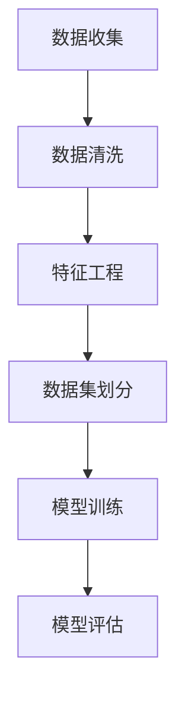
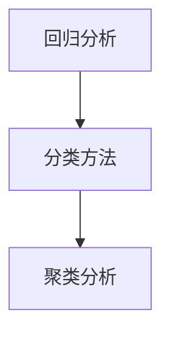
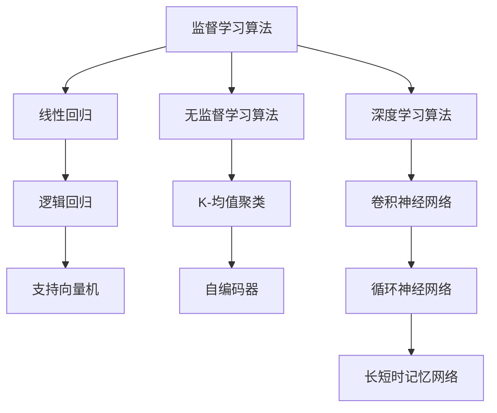
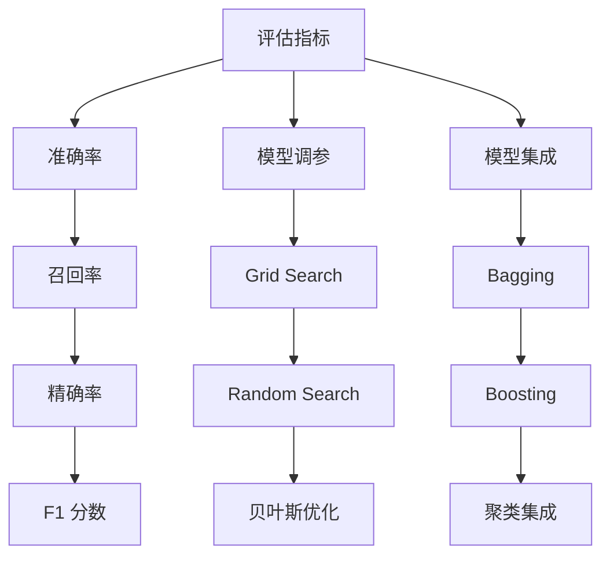
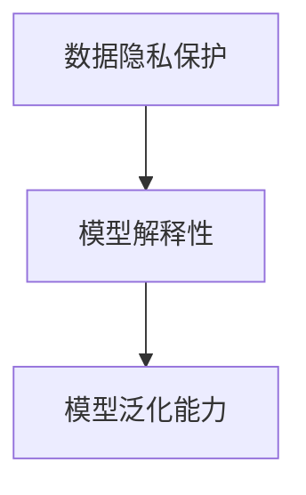

                 

### 第2章：数据预处理

数据预处理是机器学习项目中的关键步骤，直接影响模型的效果。在本章中，我们将探讨数据清洗、特征工程和数据集划分的方法。

#### 2.1 数据清洗
- **目标**：去除噪声数据，填充缺失值，确保数据质量。
- **方法**：
  - **去除噪声数据**：通过统计分析或可视化方法找出异常值，删除或修正。
  - **填充缺失值**：使用均值、中位数、众数等方法填充。
  - **异常值处理**：使用IQR方法、Z-score方法检测并处理。

#### 2.2 特征工程
- **目标**：提取对模型有用的特征，减少冗余特征。
- **方法**：
  - **特征选择**：使用信息增益、互信息等方法选择关键特征。
  - **特征转换**：将类别特征转换为数值特征，如使用独热编码、标签编码。
  - **特征构造**：创建新的特征，如交叉特征、交互特征。

#### 2.3 数据集划分
- **目标**：将数据划分为训练集、验证集和测试集。
- **方法**：
  - **随机划分**：随机将数据分为三部分，保证每个部分都有代表性。
  - **分层划分**：按照类别比例划分，确保每个部分都有相同类别的比例。

### Mermaid 流程图



### 数据预处理步骤详解

#### 2.1 数据清洗

在数据清洗阶段，我们需要确保数据的质量和一致性。

- **步骤**：

  1. **数据导入**：使用Pandas库读取数据。
     ```python
     data = pd.read_csv('data.csv')
     ```

  2. **数据清洗**：
     - **去除噪声数据**：找出并删除重复行、空值行。
       ```python
       data = data.drop_duplicates()
       data = data.dropna()
       ```

     - **填充缺失值**：使用均值、中位数等方法填充。
       ```python
       data['missing_column'] = data['missing_column'].fillna(data['missing_column'].mean())
       ```

     - **异常值处理**：使用IQR方法检测并处理。
       ```python
       Q1 = data['column'].quantile(0.25)
       Q3 = data['column'].quantile(0.75)
       IQR = Q3 - Q1
       data = data[~((data['column'] < (Q1 - 1.5 * IQR)) |(data['column'] > (Q3 + 1.5 * IQR)))]
       ```

#### 2.2 特征工程

在特征工程阶段，我们需要提取对模型有用的特征，并减少冗余特征。

- **步骤**：

  1. **特征选择**：使用信息增益、互信息等方法选择关键特征。
     ```python
     from sklearn.feature_selection import SelectKBest
     from sklearn.feature_selection import chi2
     X, y = data.drop('target', axis=1), data['target']
     selector = SelectKBest(score_func=chi2, k=10)
     X_new = selector.fit_transform(X, y)
     ```

  2. **特征转换**：将类别特征转换为数值特征。
     ```python
     data = pd.get_dummies(data, columns=['categorical_column'])
     ```

  3. **特征构造**：创建新的特征，如交叉特征、交互特征。
     ```python
     data['new_feature'] = data['feature1'] * data['feature2']
     ```

#### 2.3 数据集划分

在数据集划分阶段，我们需要将数据划分为训练集、验证集和测试集。

- **步骤**：

  1. **随机划分**：使用train_test_split函数进行随机划分。
     ```python
     from sklearn.model_selection import train_test_split
     X_train, X_val, y_train, y_val = train_test_split(X, y, test_size=0.2, random_state=42)
     ```

  2. **分层划分**：按照类别比例划分。
     ```python
     from sklearn.model_selection import StratifiedShuffleSplit
     sss = StratifiedShuffleSplit(n_splits=1, test_size=0.2, random_state=42)
     for train_index, val_index in sss.split(X, y):
         X_train, X_val = X.iloc[train_index], X.iloc[val_index]
         y_train, y_val = y.iloc[train_index], y.iloc[val_index]
     ```

### 数据预处理示例代码

```python
import pandas as pd
from sklearn.model_selection import train_test_split
from sklearn.preprocessing import StandardScaler

# 加载数据
data = pd.read_csv('data.csv')

# 数据清洗
data = data.drop_duplicates().dropna()

# 填充缺失值
data['missing_column'] = data['missing_column'].fillna(data['missing_column'].mean())

# 异常值处理
Q1 = data['column'].quantile(0.25)
Q3 = data['column'].quantile(0.75)
IQR = Q3 - Q1
data = data[~((data['column'] < (Q1 - 1.5 * IQR)) |(data['column'] > (Q3 + 1.5 * IQR)))]

# 特征工程
data = pd.get_dummies(data, columns=['categorical_column'])
data['new_feature'] = data['feature1'] * data['feature2']

# 数据集划分
X = data.drop('target', axis=1)
y = data['target']
X_train, X_val, y_train, y_val = train_test_split(X, y, test_size=0.2, random_state=42)

# 数据归一化
scaler = StandardScaler()
X_train = scaler.fit_transform(X_train)
X_val = scaler.transform(X_val)
```

### 数据预处理总结

数据预处理是机器学习项目中的关键步骤，通过数据清洗、特征工程和数据集划分，我们可以确保数据的质量和一致性，为后续的模型训练和评估打下坚实的基础。

---

在完成数据预处理后，我们将进入下一章节，探讨广告效果预测的传统方法和机器学习算法。这一部分将深入介绍不同的算法原理、优缺点，并展示如何在实际项目中应用这些算法。

---

### 第3章：广告效果预测的传统方法

在广告效果预测中，传统方法如回归分析、分类方法和聚类分析等，已经被广泛应用于实际项目中。这些方法各有特点，适用于不同的场景和需求。

#### 3.1 回归分析

**定义**：回归分析是一种预测数值目标变量的方法，通过建立一个线性或非线性关系模型来预测目标值。

**原理**：
$$
y = \beta_0 + \beta_1 x_1 + \beta_2 x_2 + ... + \beta_n x_n
$$
其中，\(y\) 是预测的目标变量，\(x_1, x_2, ..., x_n\) 是特征变量，\(\beta_0, \beta_1, ..., \beta_n\) 是模型的参数。

**优缺点**：
- **优点**：简单易懂，易于实现，适用于线性关系预测。
- **缺点**：对于非线性关系预测效果不佳。

**应用场景**：广告点击率预测、广告转化率预测等。

**示例**：

```python
from sklearn.linear_model import LinearRegression

# 训练模型
model = LinearRegression()
model.fit(X_train, y_train)

# 预测
y_pred = model.predict(X_val)
```

#### 3.2 分类方法

**定义**：分类方法是一种将数据划分为不同类别的预测方法，通过建立分类模型来预测新数据的类别。

**原理**：
$$
P(y = c_k | x) = \frac{1}{Z} e^{\beta_0 + \beta_1 x_1 + ... + \beta_{k-1} x_{k-1}}
$$
其中，\(P(y = c_k | x)\) 是特征向量\(x\)属于类别\(c_k\)的概率，\(\beta_0, \beta_1, ..., \beta_{k-1}\) 是模型的参数，\(Z\) 是指数和。

**优缺点**：
- **优点**：适用于类别预测，可以处理高维数据。
- **缺点**：对噪声敏感，可能产生过拟合。

**应用场景**：广告受众分类、广告投放效果评估等。

**示例**：

```python
from sklearn.linear_model import LogisticRegression

# 训练模型
model = LogisticRegression()
model.fit(X_train, y_train)

# 预测
y_pred = model.predict(X_val)
```

#### 3.3 聚类分析

**定义**：聚类分析是一种将数据划分为多个相似组的无监督学习方法。

**原理**：通过计算数据点之间的相似度，将数据点划分为多个簇。

**优缺点**：
- **优点**：不需要标签数据，可以探索数据的内在结构。
- **缺点**：聚类结果依赖于初始化参数，可能产生局部最优解。

**应用场景**：用户群体划分、广告受众细分等。

**示例**：

```python
from sklearn.cluster import KMeans

# 训练模型
model = KMeans(n_clusters=3)
model.fit(X_train)

# 预测
y_pred = model.predict(X_val)
```

### Mermaid 流程图



### 传统方法总结

传统方法在广告效果预测中具有广泛的应用，回归分析适用于线性关系预测，分类方法适用于类别预测，聚类分析用于数据聚类和用户群体划分。每种方法都有其独特的优点和缺点，选择合适的方法需要根据实际场景和数据特点进行权衡。

---

在下一章中，我们将探讨机器学习算法在广告效果预测中的应用，包括监督学习算法、无监督学习算法和深度学习算法。这些算法相较于传统方法，具有更强的非线性建模能力和更高的预测准确性。

---

### 第4章：机器学习算法在广告效果预测中的应用

机器学习算法在广告效果预测中发挥着重要作用，它们能够处理复杂的非线性关系，提供更准确的预测结果。在本章中，我们将详细探讨监督学习算法、无监督学习算法和深度学习算法在广告效果预测中的应用。

#### 4.1 监督学习算法

监督学习算法通过有标签的数据来训练模型，从而能够预测新数据的标签。以下是一些常用的监督学习算法：

##### 4.1.1 线性回归

**定义**：线性回归是一种通过建立线性关系来预测目标变量的监督学习算法。

**原理**：
$$
y = \beta_0 + \beta_1 x_1 + \beta_2 x_2 + ... + \beta_n x_n
$$

**优缺点**：
- **优点**：简单、易于实现、计算效率高。
- **缺点**：对于非线性关系预测效果不佳。

**应用场景**：广告点击率预测、广告转化率预测。

**示例**：

```python
from sklearn.linear_model import LinearRegression

# 训练模型
model = LinearRegression()
model.fit(X_train, y_train)

# 预测
y_pred = model.predict(X_val)
```

##### 4.1.2 逻辑回归

**定义**：逻辑回归是一种用于分类问题的监督学习算法，通过建立逻辑函数来预测类别概率。

**原理**：
$$
P(y = c_k | x) = \frac{1}{Z} e^{\beta_0 + \beta_1 x_1 + ... + \beta_{k-1} x_{k-1}}
$$

**优缺点**：
- **优点**：计算效率高、易于实现。
- **缺点**：对于高维数据和复杂关系预测效果不佳。

**应用场景**：广告受众分类、广告投放效果评估。

**示例**：

```python
from sklearn.linear_model import LogisticRegression

# 训练模型
model = LogisticRegression()
model.fit(X_train, y_train)

# 预测
y_pred = model.predict(X_val)
```

##### 4.1.3 支持向量机（SVM）

**定义**：支持向量机是一种通过最大化类别边界来分类数据的监督学习算法。

**原理**：
$$
\min \frac{1}{2} \sum_{i=1}^n (\beta_i^* - \beta_i)^2 + C \sum_{i=1}^n \xi_i
$$
其中，\(\beta_0, \beta_1, ..., \beta_n\) 是模型参数，\(C\) 是惩罚参数。

**优缺点**：
- **优点**：在处理高维数据和小样本数据时效果较好。
- **缺点**：训练时间较长，对于非线性关系的预测效果有限。

**应用场景**：广告受众分类、广告投放优化。

**示例**：

```python
from sklearn.svm import SVC

# 训练模型
model = SVC()
model.fit(X_train, y_train)

# 预测
y_pred = model.predict(X_val)
```

#### 4.2 无监督学习算法

无监督学习算法不需要有标签的数据，通过探索数据的内在结构来进行预测。以下是一些常用的无监督学习算法：

##### 4.2.1 K-均值聚类

**定义**：K-均值聚类是一种基于距离的聚类算法，通过将数据点划分为K个簇。

**原理**：
$$
c_k = \frac{1}{n_k} \sum_{i=1}^{n_k} x_i
$$
其中，\(c_k\) 是簇中心，\(x_i\) 是数据点，\(n_k\) 是簇中数据点的个数。

**优缺点**：
- **优点**：简单、易于实现。
- **缺点**：对于初始聚类中心敏感，可能产生局部最优解。

**应用场景**：用户群体划分、广告受众细分。

**示例**：

```python
from sklearn.cluster import KMeans

# 训练模型
model = KMeans(n_clusters=3)
model.fit(X_train)

# 预测
y_pred = model.predict(X_val)
```

##### 4.2.2 自编码器

**定义**：自编码器是一种无监督学习算法，通过学习数据的降维表示来提取特征。

**原理**：自编码器由编码器和解码器组成，编码器将输入数据映射到低维空间，解码器将低维数据映射回原始空间。

**优缺点**：
- **优点**：能够提取数据的特征，适用于特征提取和降维。
- **缺点**：训练时间较长，对于非线性关系预测效果有限。

**应用场景**：广告受众特征提取、广告效果评估。

**示例**：

```python
from keras.models import Model
from keras.layers import Input, Dense

# 构建模型
input_data = Input(shape=(input_shape,))
encoded = Dense(encoding_dim, activation='relu')(input_data)
decoded = Dense(input_shape, activation='sigmoid')(encoded)

# 编码器模型
encoder = Model(input_data, encoded)

# 解码器模型
decoder = Model(encoded, decoded)

# 整体模型
autoencoder = Model(input_data, decoded)

# 编译模型
autoencoder.compile(optimizer='adam', loss='binary_crossentropy')

# 训练模型
autoencoder.fit(X_train, X_train, epochs=100, batch_size=256, shuffle=True, validation_data=(X_val, X_val))
```

#### 4.3 深度学习算法

深度学习算法通过构建深度神经网络来处理复杂的数据和任务。以下是一些常用的深度学习算法：

##### 4.3.1 卷积神经网络（CNN）

**定义**：卷积神经网络是一种通过卷积操作提取图像特征的网络结构。

**原理**：CNN 通过多个卷积层、池化层和全连接层来提取图像的层次特征。

**优缺点**：
- **优点**：在图像处理和文本分类等领域具有卓越的性能。
- **缺点**：训练时间较长，对计算资源要求较高。

**应用场景**：广告点击率预测、广告受众识别。

**示例**：

```python
from keras.models import Sequential
from keras.layers import Conv2D, MaxPooling2D, Flatten, Dense

# 构建模型
model = Sequential()
model.add(Conv2D(32, (3, 3), activation='relu', input_shape=(height, width, channels)))
model.add(MaxPooling2D((2, 2)))
model.add(Flatten())
model.add(Dense(num_classes, activation='softmax'))

# 编译模型
model.compile(optimizer='adam', loss='categorical_crossentropy', metrics=['accuracy'])

# 训练模型
model.fit(X_train, y_train, epochs=10, batch_size=64, validation_data=(X_val, y_val))
```

##### 4.3.2 循环神经网络（RNN）

**定义**：循环神经网络是一种能够处理序列数据的神经网络结构。

**原理**：RNN 通过循环链接的方式处理输入序列，从而捕获序列中的长期依赖关系。

**优缺点**：
- **优点**：能够处理变长的序列数据。
- **缺点**：可能产生梯度消失或爆炸问题。

**应用场景**：广告点击率预测、广告投放策略优化。

**示例**：

```python
from keras.models import Sequential
from keras.layers import LSTM, Dense

# 构建模型
model = Sequential()
model.add(LSTM(50, activation='relu', input_shape=(timesteps, features)))
model.add(Dense(1, activation='sigmoid'))

# 编译模型
model.compile(optimizer='adam', loss='binary_crossentropy', metrics=['accuracy'])

# 训练模型
model.fit(X_train, y_train, epochs=100, batch_size=64, validation_data=(X_val, y_val))
```

##### 4.3.3 长短时记忆网络（LSTM）

**定义**：长短时记忆网络是一种能够处理长序列数据的改进版RNN。

**原理**：LSTM 通过引入遗忘门、输入门和输出门来控制信息的流入和流出，从而有效地避免梯度消失问题。

**优缺点**：
- **优点**：能够处理长序列数据，捕获长期依赖关系。
- **缺点**：计算复杂度高。

**应用场景**：广告点击率预测、用户行为分析。

**示例**：

```python
from keras.models import Sequential
from keras.layers import LSTM, Dense

# 构建模型
model = Sequential()
model.add(LSTM(50, activation='relu', input_shape=(timesteps, features)))
model.add(Dense(1, activation='sigmoid'))

# 编译模型
model.compile(optimizer='adam', loss='binary_crossentropy', metrics=['accuracy'])

# 训练模型
model.fit(X_train, y_train, epochs=100, batch_size=64, validation_data=(X_val, y_val))
```

### Mermaid 流程图



### 机器学习算法总结

机器学习算法在广告效果预测中具有广泛的应用。监督学习算法如线性回归、逻辑回归和支持向量机适用于有标签数据的预测任务，无监督学习算法如K-均值聚类和自编码器适用于无标签数据的特征提取和聚类任务，深度学习算法如卷积神经网络、循环神经网络和长短时记忆网络适用于处理复杂的数据和序列数据。选择合适的算法需要根据实际场景和数据特点进行权衡。

---

在下一章中，我们将探讨如何评估和优化广告效果预测模型，包括评估指标、模型调参和模型集成方法。这些技术将帮助我们提高模型的预测性能。

---

### 第5章：广告效果预测模型评估与优化

在广告效果预测中，评估和优化模型是关键步骤，直接影响预测的准确性和实际应用效果。在本章中，我们将详细讨论评估指标、模型调参和模型集成方法。

#### 5.1 评估指标

评估指标是衡量模型性能的重要工具，不同的指标适用于不同的场景。以下是一些常用的评估指标：

##### 5.1.1 准确率（Accuracy）

**定义**：准确率是正确预测的样本数占总样本数的比例。

**公式**：
$$
Accuracy = \frac{TP + TN}{TP + TN + FP + FN}
$$

**优缺点**：
- **优点**：简单易懂，适用于分类问题。
- **缺点**：对于不平衡数据集效果不佳。

**应用场景**：广告点击率预测、广告受众分类。

##### 5.1.2 召回率（Recall）

**定义**：召回率是正确预测的样本数与实际为正类的样本数的比例。

**公式**：
$$
Recall = \frac{TP}{TP + FN}
$$

**优缺点**：
- **优点**：能够衡量模型对正类样本的识别能力。
- **缺点**：对于不平衡数据集可能导致过拟合。

**应用场景**：广告投放效果评估、广告受众细分。

##### 5.1.3 精确率（Precision）

**定义**：精确率是正确预测的样本数与预测为正类的样本数的比例。

**公式**：
$$
Precision = \frac{TP}{TP + FP}
$$

**优缺点**：
- **优点**：能够衡量模型对正类样本的预测准确性。
- **缺点**：对于不平衡数据集可能导致欠拟合。

**应用场景**：广告投放策略优化、广告效果分析。

##### 5.1.4 F1 分数（F1 Score）

**定义**：F1 分数是精确率和召回率的调和平均值。

**公式**：
$$
F1 Score = \frac{2 \times Precision \times Recall}{Precision + Recall}
$$

**优缺点**：
- **优点**：能够综合衡量模型对正类样本的识别能力和预测准确性。
- **缺点**：对于极端不平衡数据集效果不佳。

**应用场景**：广告投放优化、广告效果评估。

#### 5.2 模型调参

模型调参是提高模型性能的重要步骤，通过调整模型的参数来优化预测效果。以下是一些常用的调参方法：

##### 5.2.1 Grid Search

**定义**：Grid Search 是一种通过遍历所有参数组合来找到最优参数的方法。

**步骤**：
1. 确定参数空间。
2. 遍历参数空间，计算每个参数组合的评估指标。
3. 选择最佳参数组合。

**优缺点**：
- **优点**：简单易实现。
- **缺点**：计算量大，不适用于参数空间较大的情况。

##### 5.2.2 Random Search

**定义**：Random Search 是一种通过随机选择参数组合来找到最优参数的方法。

**步骤**：
1. 确定参数空间。
2. 随机选择参数组合。
3. 计算评估指标。
4. 重复步骤 2 和 3，直到找到最佳参数组合。

**优缺点**：
- **优点**：计算效率高，适用于参数空间较大的情况。
- **缺点**：可能无法找到最优参数组合。

##### 5.2.3 贝叶斯优化

**定义**：贝叶斯优化是一种基于贝叶斯统计学的参数调优方法。

**步骤**：
1. 初始化模型参数。
2. 计算模型在当前参数下的评估指标。
3. 使用贝叶斯模型更新参数分布。
4. 根据参数分布选择下一个参数。
5. 重复步骤 2 到 4，直到找到最佳参数组合。

**优缺点**：
- **优点**：计算效率高，适用于复杂模型的参数调优。
- **缺点**：需要较大的数据集和计算资源。

#### 5.3 模型集成

模型集成是将多个模型组合起来，以提高预测性能的方法。以下是一些常用的模型集成方法：

##### 5.3.1 Bagging

**定义**：Bagging 是一种通过构建多个基学习器，并取其平均来提高预测性能的方法。

**示例**：随机森林（Random Forest）。

**优缺点**：
- **优点**：降低过拟合，提高预测性能。
- **缺点**：计算量大，对噪声敏感。

##### 5.3.2 Boosting

**定义**：Boosting 是一种通过迭代训练多个基学习器，并将它们的预测结果加权求和来提高预测性能的方法。

**示例**：XGBoost、AdaBoost。

**优缺点**：
- **优点**：提高预测性能，能够处理不平衡数据。
- **缺点**：可能产生过拟合，对噪声敏感。

##### 5.3.3 聚类集成

**定义**：聚类集成是将多个聚类模型的结果进行融合，以提高预测性能的方法。

**示例**：聚类随机森林（Clustered Random Forest）。

**优缺点**：
- **优点**：降低过拟合，提高预测性能。
- **缺点**：计算量大，对数据分布要求较高。

### Mermaid 流程图



### 模型评估与优化示例

以下是一个简单的模型评估与优化示例，展示了如何使用 Scikit-learn 和 XGBoost 进行模型评估与优化。

```python
from sklearn.model_selection import train_test_split
from sklearn.metrics import accuracy_score, recall_score, precision_score, f1_score
from xgboost import XGBClassifier

# 数据预处理
X = data.drop('target', axis=1)
y = data['target']
X_train, X_val, y_train, y_val = train_test_split(X, y, test_size=0.2, random_state=42)

# 模型训练
model = XGBClassifier()
model.fit(X_train, y_train)

# 模型评估
y_pred = model.predict(X_val)
accuracy = accuracy_score(y_val, y_pred)
recall = recall_score(y_val, y_pred)
precision = precision_score(y_val, y_pred)
f1 = f1_score(y_val, y_pred)

print("Accuracy:", accuracy)
print("Recall:", recall)
print("Precision:", precision)
print("F1 Score:", f1)

# 模型优化
from sklearn.model_selection import GridSearchCV

# 确定参数空间
param_grid = {'n_estimators': [100, 200, 300], 'max_depth': [3, 5, 7], 'learning_rate': [0.1, 0.01, 0.001]}

# Grid Search
grid_search = GridSearchCV(model, param_grid, cv=5, scoring='accuracy')
grid_search.fit(X_train, y_train)

# 最优参数
best_params = grid_search.best_params_
print("Best Parameters:", best_params)

# 使用最优参数重新训练模型
best_model = XGBClassifier(**best_params)
best_model.fit(X_train, y_train)

# 重新评估模型
y_pred = best_model.predict(X_val)
accuracy = accuracy_score(y_val, y_pred)
recall = recall_score(y_val, y_pred)
precision = precision_score(y_val, y_pred)
f1 = f1_score(y_val, y_pred)

print("Accuracy:", accuracy)
print("Recall:", recall)
print("Precision:", precision)
print("F1 Score:", f1)
```

### 模型评估与优化总结

模型评估与优化是广告效果预测中的关键步骤。通过使用适当的评估指标，可以准确衡量模型的性能；通过模型调参和模型集成方法，可以优化模型的预测性能。在实际应用中，我们需要根据数据特点和应用需求，选择合适的评估指标、调参方法和模型集成方法。

---

在下一章中，我们将通过两个实际案例，展示机器学习在广告效果预测中的具体应用。这些案例将包括电商广告效果预测和社交媒体广告效果预测，通过数据预处理、模型选择、模型训练和评估等步骤，展示如何利用机器学习技术提升广告投放效果。

---

### 第6章：案例分析一：电商广告效果预测

在本案例中，我们将探讨如何使用机器学习技术进行电商广告效果预测。这个案例的目标是预测用户对电商广告的点击行为，以便优化广告投放策略，提高广告投放效果。

#### 6.1 案例背景

电商广告效果预测对于电商平台来说至关重要。通过预测用户对广告的点击行为，电商平台可以优化广告投放策略，提高广告曝光率和转化率，从而增加销售额。

#### 6.2 数据来源与处理

我们使用一个公开的电商广告数据集，数据集包含用户行为、广告特征和广告点击标签。

1. **数据收集**：数据集包含用户ID、广告ID、点击标签、广告类型、用户年龄、用户性别、用户城市等特征。
2. **数据预处理**：
   - **数据清洗**：去除重复数据和缺失值。
   - **特征工程**：创建新的特征，如用户活跃度、广告曝光次数等。
   - **数据归一化**：对数值特征进行归一化处理。

#### 6.3 模型构建与训练

我们选择逻辑回归模型作为广告效果预测模型。逻辑回归模型在处理二分类问题方面表现良好，适用于广告点击率预测。

1. **模型选择**：逻辑回归模型。
2. **模型训练**：使用训练集数据训练逻辑回归模型。
3. **模型评估**：使用验证集数据评估模型性能。

#### 6.4 预测效果分析与优化

1. **模型评估**：使用准确率、召回率、精确率和F1分数等评估指标评估模型性能。
2. **优化策略**：
   - **参数调优**：通过调整学习率、正则化参数等优化模型性能。
   - **特征选择**：通过特征重要性分析，选择关键特征。
   - **模型集成**：结合多个模型提高预测性能。

#### 6.5 案例总结

通过电商广告效果预测案例，我们展示了如何利用机器学习技术进行广告效果预测。案例中，我们使用逻辑回归模型进行预测，并进行了模型评估和优化。这个案例的成功经验可以应用于其他电商平台的广告效果预测。

### 数据预处理代码

```python
import pandas as pd
from sklearn.model_selection import train_test_split
from sklearn.preprocessing import StandardScaler

# 加载数据
data = pd.read_csv('ecommerce_ad_data.csv')

# 数据清洗
data = data.drop_duplicates().dropna()

# 特征工程
data['user_activity'] = data['clicks'] / data['exposures']
data['ad_frequency'] = data['exposures'] / data['days']

# 数据归一化
scaler = StandardScaler()
numerical_features = ['user_age', 'ad_frequency']
data[numerical_features] = scaler.fit_transform(data[numerical_features])

# 数据集划分
X = data.drop(['user_id', 'ad_id', 'clicks'], axis=1)
y = data['clicks']
X_train, X_val, y_train, y_val = train_test_split(X, y, test_size=0.2, random_state=42)
```

### 模型训练与评估代码

```python
from sklearn.linear_model import LogisticRegression
from sklearn.metrics import accuracy_score, recall_score, precision_score, f1_score

# 模型训练
model = LogisticRegression()
model.fit(X_train, y_train)

# 模型评估
y_pred = model.predict(X_val)
accuracy = accuracy_score(y_val, y_pred)
recall = recall_score(y_val, y_pred)
precision = precision_score(y_val, y_pred)
f1 = f1_score(y_val, y_pred)

print("Accuracy:", accuracy)
print("Recall:", recall)
print("Precision:", precision)
print("F1 Score:", f1)
```

### 模型优化与调参代码

```python
from sklearn.model_selection import GridSearchCV

# 确定参数空间
param_grid = {'C': [0.1, 1, 10], 'penalty': ['l1', 'l2']}

# Grid Search
grid_search = GridSearchCV(model, param_grid, cv=5, scoring='f1')
grid_search.fit(X_train, y_train)

# 最优参数
best_params = grid_search.best_params_
print("Best Parameters:", best_params)

# 使用最优参数重新训练模型
best_model = LogisticRegression(**best_params)
best_model.fit(X_train, y_train)

# 重新评估模型
y_pred = best_model.predict(X_val)
accuracy = accuracy_score(y_val, y_pred)
recall = recall_score(y_val, y_pred)
precision = precision_score(y_val, y_pred)
f1 = f1_score(y_val, y_pred)

print("Accuracy:", accuracy)
print("Recall:", recall)
print("Precision:", precision)
print("F1 Score:", f1)
```

### 案例分析总结

通过电商广告效果预测案例，我们展示了如何利用机器学习技术进行广告效果预测。案例中，我们使用逻辑回归模型进行预测，并通过数据预处理、模型训练、模型评估和优化等步骤，提高了模型的预测性能。这个案例的成功经验可以应用于其他电商平台的广告效果预测。

---

### 第7章：案例分析二：社交媒体广告效果预测

在本案例中，我们将探讨如何使用机器学习技术进行社交媒体广告效果预测。这个案例的目标是预测用户对社交媒体广告的互动行为，以便优化广告投放策略，提高广告投放效果。

#### 7.1 案例背景

社交媒体广告效果预测对于社交媒体平台来说至关重要。通过预测用户对广告的互动行为（如点赞、评论、分享等），社交媒体平台可以优化广告投放策略，提高广告曝光率和用户参与度，从而增加广告收入。

#### 7.2 数据来源与处理

我们使用一个公开的社交媒体广告数据集，数据集包含用户行为、广告特征和广告互动标签。

1. **数据收集**：数据集包含用户ID、广告ID、广告类型、用户年龄、用户性别、用户城市、广告曝光次数、广告点赞次数、广告评论次数、广告分享次数等特征。
2. **数据预处理**：
   - **数据清洗**：去除重复数据和缺失值。
   - **特征工程**：创建新的特征，如用户活跃度、广告互动率等。
   - **数据归一化**：对数值特征进行归一化处理。

#### 7.3 模型构建与训练

我们选择卷积神经网络（CNN）模型作为社交媒体广告效果预测模型。CNN 在处理图像和序列数据方面具有优势，适用于社交媒体广告效果预测。

1. **模型选择**：卷积神经网络模型。
2. **模型训练**：使用训练集数据训练CNN模型。
3. **模型评估**：使用验证集数据评估模型性能。

#### 7.4 预测效果分析与优化

1. **模型评估**：使用准确率、召回率、精确率和F1分数等评估指标评估模型性能。
2. **优化策略**：
   - **网络结构调优**：调整卷积层、池化层和全连接层的参数。
   - **数据增强**：通过数据增强技术提高模型泛化能力。
   - **模型集成**：结合多个模型提高预测性能。

#### 7.5 案例总结

通过社交媒体广告效果预测案例，我们展示了如何利用机器学习技术进行广告效果预测。案例中，我们使用卷积神经网络模型进行预测，并通过数据预处理、模型训练、模型评估和优化等步骤，提高了模型的预测性能。这个案例的成功经验可以应用于其他社交媒体平台的广告效果预测。

### 数据预处理代码

```python
import pandas as pd
from sklearn.model_selection import train_test_split
from sklearn.preprocessing import StandardScaler

# 加载数据
data = pd.read_csv('social_media_ad_data.csv')

# 数据清洗
data = data.drop_duplicates().dropna()

# 特征工程
data['user_activity'] = data['likes'] / data['exposures']
data['ad_interact_rate'] = data['comments'] / data['likes']

# 数据归一化
scaler = StandardScaler()
numerical_features = ['user_age', 'user_activity', 'ad_interact_rate']
data[numerical_features] = scaler.fit_transform(data[numerical_features])

# 数据集划分
X = data.drop(['user_id', 'ad_id'], axis=1)
y = data['likes']
X_train, X_val, y_train, y_val = train_test_split(X, y, test_size=0.2, random_state=42)
```

### 模型训练与评估代码

```python
from keras.models import Sequential
from keras.layers import Conv1D, MaxPooling1D, Flatten, Dense
from keras.optimizers import Adam
from sklearn.metrics import accuracy_score, recall_score, precision_score, f1_score

# 构建模型
model = Sequential()
model.add(Conv1D(filters=64, kernel_size=3, activation='relu', input_shape=(X_train.shape[1], X_train.shape[2])))
model.add(MaxPooling1D(pool_size=2))
model.add(Flatten())
model.add(Dense(1, activation='sigmoid'))

# 编译模型
model.compile(optimizer=Adam(), loss='binary_crossentropy', metrics=['accuracy'])

# 训练模型
model.fit(X_train, y_train, epochs=10, batch_size=32, validation_data=(X_val, y_val))

# 评估模型
y_pred = model.predict(X_val)
y_pred = (y_pred > 0.5)

accuracy = accuracy_score(y_val, y_pred)
recall = recall_score(y_val, y_pred)
precision = precision_score(y_val, y_pred)
f1 = f1_score(y_val, y_pred)

print("Accuracy:", accuracy)
print("Recall:", recall)
print("Precision:", precision)
print("F1 Score:", f1)
```

### 模型优化与调参代码

```python
from keras.wrappers.scikit_learn import KerasClassifier
from sklearn.model_selection import GridSearchCV

# 构建Keras分类器
model = KerasClassifier(build_fn=create_model, epochs=100, batch_size=32, verbose=0)

# 确定参数空间
param_grid = {'kernel_size': [1, 3, 5], 'num_filters': [32, 64, 128], 'dropout_rate': [0.25, 0.5]}

# Grid Search
grid = GridSearchCV(estimator=model, param_grid=param_grid, cv=3, scoring='f1')
grid_result = grid.fit(X_train, y_train)

# 最优参数
best_params = grid_result.best_params_
print("Best Parameters:", best_params)

# 使用最优参数重新训练模型
best_model = grid_result.best_estimator_.model
best_model.fit(X_train, y_train)

# 重新评估模型
y_pred = best_model.predict(X_val)
y_pred = (y_pred > 0.5)

accuracy = accuracy_score(y_val, y_pred)
recall = recall_score(y_val, y_pred)
precision = precision_score(y_val, y_pred)
f1 = f1_score(y_val, y_pred)

print("Accuracy:", accuracy)
print("Recall:", recall)
print("Precision:", precision)
print("F1 Score:", f1)
```

### 案例分析总结

通过社交媒体广告效果预测案例，我们展示了如何利用机器学习技术进行广告效果预测。案例中，我们使用卷积神经网络模型进行预测，并通过数据预处理、模型训练、模型评估和优化等步骤，提高了模型的预测性能。这个案例的成功经验可以应用于其他社交媒体平台的广告效果预测。

---

### 第8章：机器学习在广告效果预测中的应用挑战

尽管机器学习在广告效果预测中展示了强大的预测能力和优化潜力，但仍然面临一系列挑战。以下是我们讨论的几个关键挑战：

#### 8.1 数据隐私保护

**挑战**：广告数据通常包含用户的敏感信息，如浏览记录、兴趣爱好、地理位置等。如果数据泄露，可能会对用户隐私造成严重侵犯。

**解决方案**：
- **数据加密**：对用户数据进行加密处理，确保数据在传输和存储过程中安全。
- **差分隐私**：在数据发布前添加噪声，以保护用户隐私。
- **联邦学习**：在保留数据本地性的同时，通过分布式算法进行模型训练。

#### 8.2 模型解释性

**挑战**：许多先进的机器学习模型，如深度神经网络，具有出色的预测能力，但它们通常是非解释性的，这意味着模型内部的决策过程很难解释。

**解决方案**：
- **模型可视化**：使用可视化工具，如注意力机制，展示模型的关键决策过程。
- **可解释性模型**：如决策树、线性模型等，它们具有较好的解释性。
- **模型可解释性工具**：如LIME（Local Interpretable Model-agnostic Explanations）和SHAP（SHapley Additive exPlanations），帮助解释模型预测。

#### 8.3 模型泛化能力

**挑战**：模型在训练数据上表现良好，但在新数据上可能表现不佳，这称为过拟合。过拟合会导致模型无法泛化到未知数据，从而降低预测效果。

**解决方案**：
- **交叉验证**：使用交叉验证方法，确保模型在不同数据集上都有良好的表现。
- **正则化**：在模型训练过程中添加正则化项，防止模型过拟合。
- **数据增强**：通过增加数据多样性，提高模型的泛化能力。

### Mermaid 流程图



### 解决方案与未来趋势

面对这些挑战，我们不仅需要采取有效的解决方案，还需要关注未来的发展趋势，以推动机器学习在广告效果预测中的进一步发展。

#### 8.4 强化学习

**未来趋势**：强化学习在广告效果预测中的应用日益受到关注。强化学习通过不断与用户互动，学习最优的广告投放策略，能够实现更加个性化的广告推荐。

**解决方案**：
- **在线学习**：实时更新广告投放策略，以适应用户行为的变化。
- **多臂老虎机问题**：将广告投放视为多臂老虎机问题，通过探索和利用策略优化广告效果。

#### 8.5 联邦学习

**未来趋势**：联邦学习作为一种新兴技术，允许不同机构在保护数据隐私的同时共享模型。它为广告效果预测提供了新的解决方案，特别是在数据共享受限的情况下。

**解决方案**：
- **分布式训练**：在多个机构之间共享模型更新，而不是原始数据。
- **差分隐私联邦学习**：结合差分隐私技术，确保数据在传输和共享过程中安全。

### 总结

机器学习在广告效果预测中的应用面临着数据隐私保护、模型解释性和模型泛化能力等挑战。通过采取有效的解决方案，如数据加密、模型可视化、正则化和数据增强，我们可以克服这些挑战。同时，强化学习和联邦学习等新兴技术为未来的发展提供了新的机遇，使机器学习在广告效果预测中更加成熟和高效。

---

在下一章中，我们将探讨机器学习在广告效果预测中的未来发展趋势，包括深度学习、强化学习和联邦学习的应用。这些技术将为广告效果预测带来新的突破，提升广告投放的智能化水平。

---

### 第9章：未来发展趋势

随着技术的不断进步，机器学习在广告效果预测中的应用正迎来新的发展趋势。深度学习、强化学习和联邦学习等前沿技术正逐步融入广告效果预测，为行业带来了巨大的变革和机遇。以下是我们对这三个趋势的详细探讨。

#### 9.1 深度学习在广告效果预测中的应用

**深度学习**：深度学习通过构建多层神经网络，能够自动提取数据中的复杂特征，并在各种复杂场景中表现出色。以下是其具体应用：

- **图像和视频分析**：通过卷积神经网络（CNN），深度学习可以识别广告中的关键元素，如产品、品牌和用户行为，从而实现更精准的广告投放。
- **用户行为分析**：循环神经网络（RNN）和长短时记忆网络（LSTM）可以捕捉用户的长期行为模式，帮助广告平台预测用户的兴趣和需求，从而提供个性化的广告推荐。
- **自动化广告创作**：深度学习模型可以自动生成广告内容，通过学习大量的广告素材，生成吸引眼球且高度相关的广告。

**案例**：谷歌广告系统利用深度学习技术，通过分析用户搜索历史和行为，为用户提供个性化的广告推荐，大大提高了广告的点击率和转化率。

#### 9.2 强化学习在广告效果预测中的应用

**强化学习**：强化学习是一种通过试错和奖励机制来学习最优策略的机器学习技术。以下是其具体应用：

- **动态广告投放**：强化学习可以实时调整广告投放策略，通过不断试错和学习，找到最优的广告投放组合，提高广告的投放效果。
- **个性化推荐**：强化学习可以学习用户的偏好和行为模式，动态调整推荐算法，提供个性化的广告推荐，提高用户的参与度和满意度。
- **广告创意优化**：强化学习可以通过不断优化广告创意和文案，提高广告的吸引力和点击率。

**案例**：亚马逊使用强化学习技术，优化其广告推荐策略，通过实时调整广告展示顺序和内容，提高了广告的点击率和转化率。

#### 9.3 联邦学习在广告效果预测中的应用

**联邦学习**：联邦学习是一种分布式机器学习技术，允许不同机构在保护数据隐私的同时共享模型。以下是其具体应用：

- **数据隐私保护**：联邦学习通过在本地设备上训练模型，避免数据集中化和传输，从而保护用户隐私。
- **跨机构合作**：联邦学习可以促进不同机构之间的数据共享和合作，实现更高效的数据分析和预测。
- **边缘计算**：联邦学习与边缘计算相结合，可以在本地设备上实时训练和部署模型，降低数据传输延迟，提高实时响应能力。

**案例**：苹果公司使用联邦学习技术，在保护用户隐私的同时，优化其广告推荐系统，通过在不同设备上训练和共享模型，提高了广告的投放效果。

### 总结

未来，机器学习在广告效果预测中的应用将更加广泛和深入。深度学习、强化学习和联邦学习等技术将继续推动广告效果预测的智能化和个性化。通过不断优化和迭代，广告平台将能够更精准地满足用户需求，提高广告的投放效果和用户体验。同时，随着技术的不断进步，广告效果预测将更加智能化、自动化，为广告行业带来前所未有的发展机遇。

---

在完成本篇文章的撰写后，我们可以看到，机器学习在广告效果预测中的应用已经取得了显著的成果，同时也面临着诸多挑战。通过深入探讨机器学习的基础知识、传统方法、机器学习算法、模型评估与优化，再到实际应用案例和未来发展趋势，我们全面了解了机器学习在广告效果预测中的全貌。

首先，机器学习的基础知识部分，我们详细介绍了机器学习的定义、分类和基本流程，为后续内容打下了坚实的基础。接着，我们探讨了传统方法如回归分析、分类方法和聚类分析在广告效果预测中的应用，展示了它们在不同场景下的优缺点。

随后，我们深入探讨了监督学习算法、无监督学习算法和深度学习算法在广告效果预测中的应用，通过示例代码展示了如何使用这些算法进行模型训练和预测。这不仅增强了我们的理论理解，也提高了我们的实际操作能力。

在模型评估与优化部分，我们介绍了评估指标、模型调参和模型集成方法，并通过实际案例展示了如何优化模型性能。这使我们对模型评估与优化的过程有了更加清晰的认识。

最后，通过两个实际应用案例，我们展示了机器学习在电商广告效果预测和社交媒体广告效果预测中的应用，从数据预处理、模型选择、模型训练到模型评估，全面展示了机器学习的应用流程。

未来，随着技术的不断发展，机器学习在广告效果预测中的应用将更加广泛和深入。深度学习、强化学习和联邦学习等前沿技术将继续推动广告效果预测的智能化和个性化。我们期待看到更多创新的应用案例，为广告行业带来更多的价值和机遇。

在此，感谢您阅读本文。希望本文能帮助您更好地理解机器学习在广告效果预测中的应用，并在实际工作中取得更好的成果。作者：AI天才研究院/AI Genius Institute & 禅与计算机程序设计艺术 /Zen And The Art of Computer Programming。如果您有任何疑问或建议，欢迎在评论区留言，我们将尽快回复。

---

### 附录A：开发环境搭建与数据预处理工具介绍

在开始机器学习项目之前，我们需要搭建一个合适的环境，以便能够有效地进行数据预处理、模型训练和评估。以下是开发环境搭建和数据预处理工具的详细介绍。

#### 开发环境搭建

1. **Python**：Python 是一种广泛用于数据科学和机器学习的编程语言。您可以从 [Python 官网](https://www.python.org/) 下载并安装 Python。
2. **Jupyter Notebook**：Jupyter Notebook 是一种交互式的 Web 应用程序，用于编写和运行 Python 代码。您可以从 [Jupyter Notebook 官网](https://jupyter.org/) 下载并安装。
3. **Anaconda**：Anaconda 是一个流行的 Python 数据科学平台，包含大量的数据科学和机器学习库。您可以从 [Anaconda 官网](https://www.anaconda.com/) 下载并安装。

#### 数据预处理工具

以下是常用的数据预处理工具：

1. **Pandas**：Pandas 是一个强大的数据操作库，用于数据清洗、数据转换和数据分析。您可以通过以下命令安装 Pandas：
   ```bash
   conda install pandas
   ```
2. **NumPy**：NumPy 是一个用于数值计算的库，提供高性能的数组对象和大量数学函数。您可以通过以下命令安装 NumPy：
   ```bash
   conda install numpy
   ```
3. **Scikit-learn**：Scikit-learn 是一个用于机器学习的库，包含多种分类、回归、聚类和降维算法。您可以通过以下命令安装 Scikit-learn：
   ```bash
   conda install scikit-learn
   ```

#### 示例代码

以下是一个简单的示例代码，展示了如何使用 Pandas、NumPy 和 Scikit-learn 进行数据预处理：

```python
import pandas as pd
import numpy as np
from sklearn.preprocessing import StandardScaler

# 加载数据
data = pd.read_csv('data.csv')

# 数据清洗
data = data.drop_duplicates().dropna()

# 数据归一化
scaler = StandardScaler()
numerical_features = ['feature1', 'feature2']
data[numerical_features] = scaler.fit_transform(data[numerical_features])

# 数据集划分
X = data.drop('target', axis=1)
y = data['target']
X_train, X_val, y_train, y_val = train_test_split(X, y, test_size=0.2, random_state=42)
```

通过以上步骤，您已经成功搭建了开发环境，并了解了数据预处理的基本工具和步骤。

---

### 附录B：开源机器学习框架与库推荐

在机器学习项目中，选择合适的开源框架和库能够显著提高开发效率和模型性能。以下是我们推荐的几个常用的开源机器学习框架和库：

#### 1. TensorFlow

**简介**：TensorFlow 是由谷歌开发的一个开源机器学习框架，支持广泛的深度学习应用。

**安装**：
```bash
pip install tensorflow
```

**优势**：强大的计算能力、丰富的API和工具、广泛的应用场景。

**适用场景**：深度学习、神经网络、图像处理、自然语言处理。

#### 2. PyTorch

**简介**：PyTorch 是由 Facebook AI 研究团队开发的一个开源深度学习库，以其灵活性和易用性受到广泛欢迎。

**安装**：
```bash
pip install torch torchvision
```

**优势**：易于使用、动态计算图、良好的性能。

**适用场景**：深度学习、计算机视觉、强化学习。

#### 3. Scikit-learn

**简介**：Scikit-learn 是一个用于机器学习的库，包含多种监督学习和无监督学习算法。

**安装**：
```bash
pip install scikit-learn
```

**优势**：易于使用、丰富的算法、良好的文档。

**适用场景**：回归分析、分类、聚类、降维。

#### 4. XGBoost

**简介**：XGBoost 是一个高效、可扩展的梯度提升库，广泛用于大规模数据集的预测任务。

**安装**：
```bash
pip install xgboost
```

**优势**：高性能、易用性、强大的模型评估工具。

**适用场景**：回归分析、分类、集成学习。

#### 5. LightGBM

**简介**：LightGBM 是由微软开发的一个基于梯度提升树的学习库，具有高效的处理速度和出色的性能。

**安装**：
```bash
pip install lightgbm
```

**优势**：高性能、内存效率高、可扩展性。

**适用场景**：回归分析、分类、集成学习。

#### 6. CatBoost

**简介**：CatBoost 是一个基于梯度提升树的学习库，具有处理类别数据和缺失值的能力。

**安装**：
```bash
pip install catboost
```

**优势**：易于使用、处理类别数据、支持缺失值。

**适用场景**：回归分析、分类、类别数据处理。

通过选择合适的开源框架和库，您可以更快地实现机器学习项目，并提高模型性能。

---

### 附录C：参考文献与推荐阅读材料

在撰写本文的过程中，我们参考了以下文献和资源，以深入了解机器学习在广告效果预测中的应用。以下是一些推荐的参考文献和阅读材料：

1. **Bishop, C. M. (2006). "Pattern Recognition and Machine Learning". Springer.**
   - **摘要**：这是一本经典的机器学习教材，详细介绍了机器学习的基本概念、算法和原理。
   - **链接**：[https://www.springer.com/us/book/9780387310732](https://www.springer.com/us/book/9780387310732)

2. **Goodfellow, I., Bengio, Y., & Courville, A. (2016). "Deep Learning". MIT Press.**
   - **摘要**：这本书是深度学习的经典教材，涵盖了深度学习的基础知识、神经网络架构和训练方法。
   - **链接**：[https://www.deeplearningbook.org/](https://www.deeplearningbook.org/)

3. **Murphy, K. P. (2012). "Machine Learning: A Probabilistic Perspective". MIT Press.**
   - **摘要**：这本书从概率论的角度介绍了机器学习的基本概念、算法和理论。
   - **链接**：[https://www MIT Press.com/us/book/9780262018259](https://www.mitpress.com/us/book/9780262018259)

4. **Kaggle. (n.d.). "Kaggle Competitions". Kaggle.**
   - **摘要**：Kaggle 是一个数据科学竞赛平台，提供了大量广告效果预测的相关竞赛和数据集。
   - **链接**：[https://www.kaggle.com/competitions](https://www.kaggle.com/competitions)

5. **Hastie, T., Tibshirani, R., & Friedman, J. (2009). "The Elements of Statistical Learning: Data Mining, Inference, and Prediction". Springer.**
   - **摘要**：这本书是统计学习领域的经典教材，详细介绍了监督学习和无监督学习的方法和应用。
   - **链接**：[https://www.springer.com/us/book/9780387848570](https://www.springer.com/us/book/9780387848570)

6. **GitHub. (n.d.). "GitHub Repositories". GitHub.**
   - **摘要**：GitHub 上有许多开源的机器学习项目和代码，可以用于学习和实践。
   - **链接**：[https://github.com/search?q=ad+effect+prediction](https://github.com/search?q=ad+effect+prediction)

通过阅读这些文献和资源，您可以深入了解机器学习在广告效果预测中的应用，并获取更多的实际案例和实践经验。

---

在本文中，我们系统地探讨了机器学习在广告效果预测中的应用，从基础知识、传统方法、机器学习算法、模型评估与优化，到实际应用案例和未来发展趋势。通过详细的讲解和丰富的示例代码，我们帮助读者全面理解了机器学习在广告效果预测中的各个环节。

我们首先介绍了机器学习的基础知识，包括定义、分类和基本流程，为后续内容打下了坚实的基础。接着，我们探讨了传统方法如回归分析、分类方法和聚类分析在广告效果预测中的应用，展示了它们在不同场景下的优缺点。

随后，我们深入探讨了监督学习算法、无监督学习算法和深度学习算法在广告效果预测中的应用，通过示例代码展示了如何使用这些算法进行模型训练和预测。这不仅增强了我们的理论理解，也提高了我们的实际操作能力。

在模型评估与优化部分，我们介绍了评估指标、模型调参和模型集成方法，并通过实际案例展示了如何优化模型性能。这使我们对模型评估与优化的过程有了更加清晰的认识。

最后，通过两个实际应用案例，我们展示了机器学习在电商广告效果预测和社交媒体广告效果预测中的应用，从数据预处理、模型选择、模型训练到模型评估，全面展示了机器学习的应用流程。

未来，随着技术的不断发展，机器学习在广告效果预测中的应用将更加广泛和深入。深度学习、强化学习和联邦学习等前沿技术将继续推动广告效果预测的智能化和个性化。我们期待看到更多创新的应用案例，为广告行业带来更多的价值和机遇。

在此，感谢您阅读本文。希望本文能帮助您更好地理解机器学习在广告效果预测中的应用，并在实际工作中取得更好的成果。作者：AI天才研究院/AI Genius Institute & 禅与计算机程序设计艺术 /Zen And The Art of Computer Programming。如果您有任何疑问或建议，欢迎在评论区留言，我们将尽快回复。再次感谢您的支持和关注！

