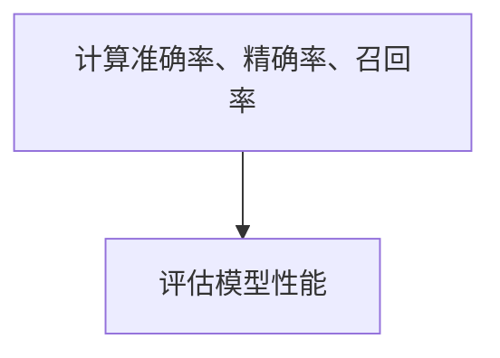
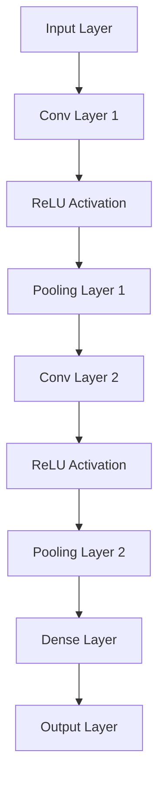
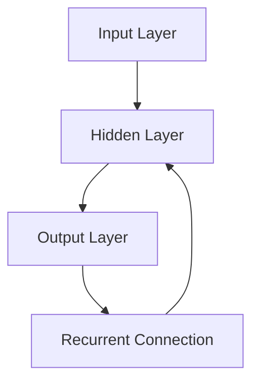
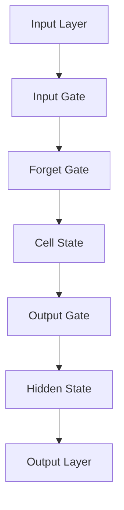
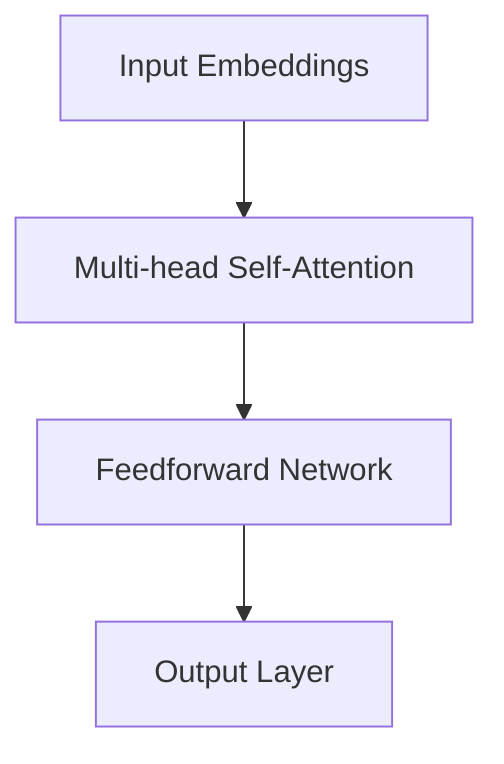

                 

### 机器学习基础

#### 1.1 机器学习概述

机器学习（Machine Learning，ML）是人工智能（Artificial Intelligence，AI）的一个分支，它通过构建和分析数学模型，使计算机具备从数据中学习和预测的能力。不同于传统的编程方法，机器学习依靠数据和统计分析，使计算机能够自动改进和优化。

**定义与分类**

- **定义**：机器学习是一个从数据中自动发现模式的过程。通过输入大量带有标签的数据，机器学习算法能够学习到数据背后的规律，并在新的、未知的输入上做出预测。

- **分类**：根据学习方式，机器学习主要分为以下几类：

  - **监督学习（Supervised Learning）**：有标签的数据训练模型，模型在新的数据上进行预测。

  - **无监督学习（Unsupervised Learning）**：没有标签的数据训练模型，模型试图发现数据中的内在结构。

  - **半监督学习（Semi-Supervised Learning）**：既有有标签的数据，也有无标签的数据，模型利用这两种数据共同训练。

  - **强化学习（Reinforcement Learning）**：通过与环境的交互来学习，目的是获得最大的长期回报。

**应用领域**

- **图像识别**：例如人脸识别、图像分类等。

- **自然语言处理**：例如机器翻译、文本分类等。

- **推荐系统**：例如电商推荐、音乐推荐等。

- **金融预测**：例如股票市场预测、信用评分等。

- **医疗诊断**：例如疾病预测、图像诊断等。

#### 1.2 数据预处理

数据预处理是机器学习过程中至关重要的一步，它包括数据清洗、数据转换和特征工程等。

- **数据清洗（Data Cleaning）**：去除重复数据、处理缺失值、纠正错误等。

  ```mermaid
  graph TD
  A[数据清洗] --> B[去除重复数据]
  A --> C[处理缺失值]
  A --> D[纠正错误]
  ```

- **特征工程（Feature Engineering）**：从原始数据中提取对模型训练有帮助的特征。

  ```mermaid
  graph TD
  A[原始数据] --> B[特征提取]
  B --> C[特征选择]
  B --> D[特征缩放]
  ```

#### 1.3 常见机器学习算法

下面介绍几种常见的机器学习算法，包括线性回归、逻辑回归、决策树、随机森林、支持向量机和神经网络。

- **线性回归（Linear Regression）**

  线性回归是一种最简单的监督学习算法，用于预测连续值。

  ```mermaid
  graph TD
  A[输入特征] --> B[权重矩阵]
  B --> C[输出预测值]
  C --> D[损失函数]
  ```

  ```latex
  y = \beta_0 + \beta_1x
  ```

- **逻辑回归（Logistic Regression）**

  逻辑回归用于预测概率，通常用于二分类问题。

  ```mermaid
  graph TD
  A[输入特征] --> B[权重矩阵]
  B --> C[输出概率]
  C --> D[损失函数]
  ```

  ```latex
  P(y=1) = \frac{1}{1 + e^{-(\beta_0 + \beta_1x)}}
  ```

- **决策树（Decision Tree）**

  决策树通过一系列规则来分割数据，每个节点表示一个特征，每个分支表示该特征的一个取值。

  ```mermaid
  graph TD
  A[样本集] --> B[特征1]
  B -->|取值1| C[子集1]
  B -->|取值2| D[子集2]
  ```

- **随机森林（Random Forest）**

  随机森林是决策树的集成方法，通过构建多个决策树，并取其投票结果作为最终预测。

  ```mermaid
  graph TD
  A[数据集] --> B[随机特征]
  B --> C[构建决策树1]
  B --> D[构建决策树2]
  ...
  C --> E[预测结果]
  D --> E
  ...
  ```

- **支持向量机（SVM）**

  支持向量机通过找到一个最佳的超平面，将数据分为不同的类别。

  ```mermaid
  graph TD
  A[数据集] --> B[超平面]
  B --> C[分类结果]
  ```

  ```latex
  \max_{\beta, \beta_0} W^T W
  \text{subject to} \quad y^{(i)}(\beta^T x^{(i)} + \beta_0) \geq 1
  ```

- **神经网络（Neural Network）**

  神经网络通过模拟人脑神经元的工作方式，进行复杂的模式识别和预测。

  ```mermaid
  graph TD
  A[输入层] --> B[隐藏层]
  B --> C[输出层]
  ```

  ```mermaid
  graph TD
  A[输入] --> B[权重矩阵]
  B --> C[激活函数]
  C --> D[输出]
  ```

以上是机器学习的一些基本概念和常见算法。在接下来的章节中，我们将深入探讨网络流量异常检测的基本理论和应用。

### 2.1 网络流量概述

网络流量是指通过网络传输的数据量，它可以反映网络的运行状态、用户行为和网络攻击活动等信息。网络流量的监控对于网络安全、性能优化和故障排查具有重要意义。

#### 2.1.1 网络流量类型

网络流量主要分为以下几种类型：

- **流量类型 1**：普通数据流量，例如网页浏览、视频播放、电子邮件传输等。

- **流量类型 2**：控制流量，例如路由协议更新、网络配置变更等。

- **流量类型 3**：恶意流量，例如网络攻击、恶意软件传输等。

#### 2.1.2 网络流量监控的重要性

网络流量监控的重要性体现在以下几个方面：

- **安全性**：通过监控网络流量，可以及时发现异常流量和潜在的网络攻击，保障网络安全。

- **性能优化**：通过监控网络流量，可以识别网络瓶颈和性能问题，优化网络架构和带宽资源。

- **故障排查**：通过监控网络流量，可以定位故障点和异常流量，快速排查和解决网络问题。

### 2.2 异常检测概述

异常检测（Anomaly Detection）是一种无监督学习方法，用于识别数据中的异常或异常模式。在机器学习领域，异常检测广泛应用于网络安全、金融欺诈检测、医疗诊断等领域。

#### 2.2.1 异常检测的定义与分类

- **定义**：异常检测是指从大量数据中自动识别出不符合正常模式的异常数据或事件。

- **分类**：根据检测方法的不同，异常检测主要分为以下几种类型：

  - **统计方法**：基于统计模型对正常数据进行建模，然后检测偏离模型的样本。

  - **基于聚类的方法**：通过聚类算法将正常数据分组，然后检测不属于任何聚类簇的样本。

  - **基于神经网络的方法**：使用神经网络模型对正常数据进行建模，然后检测与模型输出差异较大的样本。

  - **基于聚类与神经网络结合的方法**：结合聚类和神经网络的优势，提高异常检测的准确性和鲁棒性。

#### 2.2.2 异常检测的应用场景

异常检测在实际应用中具有广泛的应用场景，包括但不限于以下几个方面：

- **网络安全**：识别网络攻击、恶意流量等。

- **金融欺诈检测**：识别信用卡欺诈、洗钱等。

- **医疗诊断**：识别罕见疾病、异常生理指标等。

- **工业控制**：识别设备故障、生产异常等。

### 2.3 基于机器学习的网络流量异常检测

基于机器学习的网络流量异常检测是通过构建机器学习模型，对网络流量数据进行分析和预测，从而识别出异常流量。下面介绍异常检测算法的概述、特征选择与提取、模型训练与评估。

#### 2.3.1 异常检测算法概述

异常检测算法可以分为以下几类：

- **基于统计的方法**：通过建立统计模型，检测数据与模型之间的偏差。

  - **单变量统计方法**：对每个变量单独建模，检测偏离统计特征的样本。

  - **多变量统计方法**：建立多维数据模型，检测整体偏离样本。

- **基于聚类的方法**：通过聚类算法发现正常数据的模式，然后检测不属于任何聚类的样本。

  - **基于K-means的聚类方法**：通过迭代计算聚类中心，将样本分配到不同的聚类簇。

  - **基于层次聚类的方法**：通过逐步合并或分裂聚类簇，构建聚类层次结构。

- **基于神经网络的方法**：通过神经网络模型对正常数据进行建模，检测与模型输出差异较大的样本。

  - **自编码器（Autoencoder）**：通过编码器和解码器构建神经网络模型，压缩和重构输入数据。

  - **卷积神经网络（CNN）**：通过卷积层和池化层提取网络流量的特征，实现高效的特征提取。

- **基于聚类与神经网络结合的方法**：将聚类算法和神经网络模型结合，提高异常检测的性能。

  - **聚类自编码器（Clustered Autoencoder）**：结合聚类和自编码器的优势，构建混合模型。

#### 2.3.2 特征选择与提取

特征选择和提取是异常检测的关键步骤，它能够降低数据维度，提高模型性能。常用的特征选择方法包括：

- **相关性分析**：通过计算特征之间的相关性，筛选出高度相关的特征。

- **信息增益**：通过计算特征对于分类目标的贡献度，筛选出最有用的特征。

- **主成分分析（PCA）**：通过降维技术，提取数据的主要特征，降低数据维度。

- **特征工程**：根据领域知识和经验，对原始数据进行预处理和转换，提取对模型训练有帮助的特征。

#### 2.3.3 模型训练与评估

模型训练和评估是异常检测的核心环节，它决定了模型对异常数据的识别能力。常用的模型训练方法包括：

- **监督学习**：使用有标签的数据对模型进行训练，通过调整模型参数，使模型能够准确预测异常数据。

- **无监督学习**：使用无标签的数据对模型进行训练，通过聚类或密度估计等方法，使模型能够发现异常数据。

- **半监督学习**：使用有标签和无标签的数据对模型进行训练，通过利用标签数据的监督信息和无标签数据的潜在信息，提高模型性能。

模型评估常用的指标包括：

- **准确率（Accuracy）**：识别正确样本的比例。

- **精确率（Precision）**：识别为异常的样本中，实际为异常的比例。

- **召回率（Recall）**：实际为异常的样本中，被正确识别为异常的比例。

- **F1分数（F1 Score）**：精确率和召回率的调和平均。

通过以上步骤，我们可以构建一个基于机器学习的网络流量异常检测模型，实现对网络流量的实时监控和异常检测。

## 第3章：统计方法

统计方法在网络流量异常检测中有着广泛的应用，其核心思想是通过建立正常数据分布模型，检测与模型不一致的异常数据。本章将详细介绍统计异常检测的基础理论、常见统计方法和实际案例分析。

### 3.1 统计异常检测基础

统计异常检测基于统计学原理，通过分析数据分布特性，识别偏离正常分布的异常数据。以下介绍两种基本的统计异常检测方法：统计假设检验和聚类分析。

#### 3.1.1 统计假设检验

统计假设检验是一种常用的异常检测方法，其基本思想是建立原假设和备择假设，通过样本数据对假设进行检验，从而判断数据是否为异常。

- **原假设（Null Hypothesis）**：假设样本数据来自正常分布。

- **备择假设（Alternative Hypothesis）**：假设样本数据来自异常分布。

- **检验过程**：

  1. 确定显著性水平（Significance Level）：通常取0.05或0.01。
  2. 计算检验统计量：根据数据类型和分布特性，选择合适的统计量（如t统计量、z统计量等）。
  3. 计算p值：通过统计量计算得到p值，表示样本数据偏离正常分布的概率。
  4. 判断结果：如果p值小于显著性水平，拒绝原假设，认为数据为异常；否则，接受原假设，认为数据为正常。

#### 3.1.2 聚类分析

聚类分析是一种无监督学习方法，通过将数据分为不同的聚类簇，识别出正常数据和异常数据。

- **聚类算法**：

  - **K-means**：基于距离度量，将数据分为K个聚类簇，每个簇内部数据点距离聚类中心最近，不同聚类簇之间距离最远。

  - **层次聚类**：基于层次结构，逐步合并或分裂聚类簇，构建聚类层次结构。

- **聚类评估**：

  - **内部评估指标**：评估聚类质量，如轮廓系数（Silhouette Coefficient）、类内平均距离（Within-Cluster Sum of Squares）等。

  - **外部评估指标**：评估聚类结果与真实标签的匹配程度，如F1分数、精确率、召回率等。

### 3.2 常见统计方法

在统计异常检测中，常用的统计方法包括单变量统计异常检测和多变量统计异常检测。以下详细介绍这两种方法。

#### 3.2.1 单变量统计异常检测

单变量统计异常检测主要针对单个变量进行分析，判断该变量是否偏离正常分布。以下介绍两种常见方法：箱线图法和Grubbs'测试。

- **箱线图法**：通过绘制箱线图，识别数据中的异常值。箱线图包括下四分位数、上四分位数、中位数和异常值的上下限。如果数据点超出上下限，则视为异常值。

  ```mermaid
  graph TD
  A[绘制箱线图] --> B[识别异常值]
  ```

- **Grubbs'测试**：通过计算样本标准差和均值，判断单个数据点是否为异常值。具体步骤如下：

  1. 计算样本标准差（s）和均值（\(\mu\)）。
  2. 计算临界值（C）：\(C = 2 \times \frac{\mu - \bar{x}}{s}\)。
  3. 比较临界值与样本标准差：如果临界值大于样本标准差，则该数据点为异常值。

  ```mermaid
  graph TD
  A[计算标准差和均值] --> B[计算临界值]
  B --> C[比较临界值与标准差]
  ```

#### 3.2.2 多变量统计异常检测

多变量统计异常检测同时考虑多个变量，识别数据集的整体异常模式。以下介绍两种常见方法：统计模型法和多元正态分布法。

- **统计模型法**：通过建立统计模型（如线性模型、回归模型等），检测与模型不一致的数据。具体步骤如下：

  1. 建立统计模型：根据数据特性选择合适的统计模型。
  2. 计算残差：计算每个样本的残差（实际值与模型预测值之差）。
  3. 识别异常值：根据残差的大小和分布特征，识别异常值。

  ```mermaid
  graph TD
  A[建立统计模型] --> B[计算残差]
  B --> C[识别异常值]
  ```

- **多元正态分布法**：假设数据集符合多元正态分布，检测偏离分布的样本。具体步骤如下：

  1. 计算均值向量（\(\mu\)）和协方差矩阵（\( \Sigma \)）。
  2. 计算每个样本的协方差距离（\( D \)）：\( D = \frac{(x - \mu)^T \Sigma^{-1} (x - \mu)}{n-1} \)。
  3. 识别异常值：根据协方差距离的大小，识别异常值。

  ```mermaid
  graph TD
  A[计算均值和协方差矩阵] --> B[计算协方差距离]
  B --> C[识别异常值]
  ```

### 3.3 统计方法案例分析

为了更好地理解统计方法在网络流量异常检测中的应用，以下通过一个实际案例进行说明。

#### 3.3.1 案例背景

某企业网络监控系统需要检测异常流量，保障网络安全性。网络流量数据包括带宽使用率、数据包数量、数据包大小等指标。

#### 3.3.2 数据处理

1. **数据预处理**：清洗数据，去除重复和缺失值。

2. **特征选择**：选择对异常检测有代表性的特征，如带宽使用率、数据包数量等。

3. **归一化**：将特征值归一化，使数据在相同量级上进行分析。

#### 3.3.3 异常检测

1. **单变量统计异常检测**：

   - **箱线图法**：绘制箱线图，识别异常值。

   ```mermaid
   graph TD
   A[绘制箱线图] --> B[识别异常值：带宽使用率超出上限]
   ```

   - **Grubbs'测试**：对带宽使用率进行Grubbs'测试，识别异常值。

   ```mermaid
   graph TD
   A[计算标准差和均值] --> B[计算临界值] --> C[比较临界值与标准差]
   ```

2. **多变量统计异常检测**：

   - **统计模型法**：建立线性回归模型，计算残差，识别异常值。

   ```mermaid
   graph TD
   A[建立统计模型] --> B[计算残差] --> C[识别异常值：残差较大]
   ```

   - **多元正态分布法**：计算均值和协方差矩阵，计算协方差距离，识别异常值。

   ```mermaid
   graph TD
   A[计算均值和协方差矩阵] --> B[计算协方差距离] --> C[识别异常值：协方差距离较大]
   ```

#### 3.3.4 模型评估

通过计算准确率、精确率、召回率等指标，评估统计方法在异常检测中的性能。

- **准确率**：识别正确样本的比例。
- **精确率**：识别为异常的样本中，实际为异常的比例。
- **召回率**：实际为异常的样本中，被正确识别为异常的比例。



### 3.4 总结

本章介绍了统计异常检测的基础理论、常见方法以及实际案例分析。统计方法在网络流量异常检测中具有广泛的应用，通过建立统计模型，可以有效识别异常流量，提高网络安全性。然而，统计方法也存在一定的局限性，如对异常模式的变化敏感度较低、处理高维数据困难等。在接下来的章节中，我们将介绍基于机器学习的异常检测方法，进一步优化网络流量异常检测的性能。

## 第4章：基于机器学习的方法

在上一章中，我们介绍了统计方法在网络流量异常检测中的应用。本章将深入探讨基于机器学习的方法，包括监督学习、无监督学习和半监督学习，以及强化学习在异常检测中的应用。

### 4.1 监督学习方法

监督学习方法是一种通过有标签的数据进行训练，并在新的数据上进行预测的机器学习技术。在监督学习中，输入数据和输出标签之间存在明确的映射关系。

#### 4.1.1 回归分析

回归分析是一种用于预测连续值的监督学习方法。它通过建立回归模型，根据输入特征预测输出值。

- **线性回归**：线性回归是最简单的回归模型，其模型表达式为：
  $$y = \beta_0 + \beta_1x$$
  其中，\(y\) 为输出值，\(x\) 为输入特征，\(\beta_0\) 和 \(\beta_1\) 为模型参数。

  ```mermaid
  graph TD
  A[输入特征 x] --> B[线性模型]
  B --> C[预测值 y]
  ```

- **逻辑回归**：逻辑回归是一种用于预测概率的二分类模型，其模型表达式为：
  $$P(y=1) = \frac{1}{1 + e^{-(\beta_0 + \beta_1x)}}$$
  其中，\(P(y=1)\) 为预测概率，\(x\) 为输入特征，\(\beta_0\) 和 \(\beta_1\) 为模型参数。

  ```mermaid
  graph TD
  A[输入特征 x] --> B[逻辑模型]
  B --> C[预测概率 P(y=1)]
  ```

#### 4.1.2 分类方法

分类方法是一种用于预测离散值的监督学习方法。它通过建立分类模型，根据输入特征将数据分为不同的类别。

- **决策树**：决策树通过一系列规则将数据划分为不同的类别。其基本结构如下：

  ```mermaid
  graph TD
  A[样本集]
  A --> B[特征1]
  B -->|取值1| C[子集1]
  B -->|取值2| D[子集2]
  C --> E[类别1]
  D --> E
  ```

- **随机森林**：随机森林是一种基于决策树的集成学习方法，通过构建多个决策树，并取其投票结果作为最终预测。

  ```mermaid
  graph TD
  A[数据集] --> B[随机特征]
  B --> C[构建决策树1]
  B --> D[构建决策树2]
  ...
  C --> E[预测结果]
  D --> E
  ...
  ```

- **支持向量机（SVM）**：支持向量机通过找到一个最佳的超平面，将数据分为不同的类别。其目标是最小化分类误差。

  ```mermaid
  graph TD
  A[数据集] --> B[超平面]
  B --> C[分类结果]
  ```

  ```latex
  \max_{\beta, \beta_0} W^T W
  \text{subject to} \quad y^{(i)}(\beta^T x^{(i)} + \beta_0) \geq 1
  ```

### 4.2 无监督学习方法

无监督学习方法是一种在没有标签数据的情况下进行训练的机器学习技术。它通过发现数据中的潜在结构，实现对异常数据的检测。

#### 4.2.1 聚类方法

聚类方法是一种基于数据分布的异常检测方法，它通过将数据分为不同的聚类簇，识别出正常数据和异常数据。

- **K-means算法**：K-means算法通过迭代计算聚类中心，将样本分配到不同的聚类簇。其基本步骤如下：

  1. 初始化聚类中心。
  2. 计算每个样本与聚类中心的距离。
  3. 将样本分配到最近的聚类中心。
  4. 重新计算聚类中心。
  5. 重复步骤2-4，直到聚类中心不再变化。

  ```mermaid
  graph TD
  A[初始化聚类中心]
  A --> B[计算距离]
  B --> C[分配样本]
  C --> D[重新计算聚类中心]
  D --> E[迭代计算]
  ```

- **层次聚类算法**：层次聚类算法通过逐步合并或分裂聚类簇，构建聚类层次结构。其基本步骤如下：

  1. 将每个样本视为一个聚类簇。
  2. 计算聚类簇之间的距离。
  3. 合并距离最近的两个聚类簇。
  4. 重新计算聚类簇之间的距离。
  5. 重复步骤3-4，直到达到预设的聚类数量。

  ```mermaid
  graph TD
  A[每个样本为聚类簇]
  A --> B[计算距离]
  B --> C[合并聚类簇]
  C --> D[重新计算距离]
  D --> E[迭代合并]
  ```

#### 4.2.2 自编码器

自编码器是一种基于神经网络的无监督学习方法，它通过自动编码器（编码器和解码器）对输入数据进行压缩和重构，识别出数据中的潜在结构。

- **自编码器结构**：

  ```mermaid
  graph TD
  A[输入层] --> B[编码器]
  B --> C[隐藏层]
  C --> D[解码器]
  D --> E[输出层]
  ```

- **训练过程**：

  1. 编码器将输入数据压缩为低维表示。
  2. 解码器将压缩后的数据重构为原始数据。
  3. 计算重构误差，并更新模型参数。
  4. 重复步骤1-3，直到模型收敛。

### 4.3 半监督学习方法

半监督学习方法结合了有标签数据和未标签数据的优势，通过利用未标签数据中的潜在信息，提高模型性能。

#### 4.3.1 标签传播

标签传播是一种基于图结构的半监督学习方法，它通过在图中传播标签信息，识别出未标签数据中的潜在标签。

- **标签传播过程**：

  1. 初始化标签：将有标签数据的标签传播到未标签数据。
  2. 计算标签相似度：计算未标签数据之间的标签相似度。
  3. 更新标签：根据标签相似度更新未标签数据的标签。
  4. 重复步骤2-3，直到标签稳定。

  ```mermaid
  graph TD
  A[初始化标签]
  A --> B[计算标签相似度]
  B --> C[更新标签]
  C --> D[迭代传播]
  ```

#### 4.3.2 集成学习方法

集成学习方法通过结合多个模型的优势，提高模型性能。常见的集成学习方法包括Bagging和Boosting。

- **Bagging方法**：Bagging方法通过随机抽样构建多个模型，并取其平均作为最终预测结果。其目的是减少模型的方差。

- **Boosting方法**：Boosting方法通过关注错误样本，提高模型的泛化能力。常见的Boosting算法包括AdaBoost和XGBoost。

### 4.4 强化学习方法

强化学习方法是一种通过与环境互动，学习最优策略的机器学习技术。在异常检测中，强化学习可以用于自动调整模型参数，提高检测性能。

#### 4.4.1 强化学习基本概念

- **状态（State）**：系统当前的状态。

- **动作（Action）**：系统可以执行的操作。

- **奖励（Reward）**：动作的回报，用于评估动作的好坏。

- **策略（Policy）**：决策函数，用于选择动作。

#### 4.4.2 异常检测中的强化学习

在异常检测中，强化学习可以通过以下步骤实现：

1. **状态编码**：将网络流量数据编码为状态。

2. **动作选择**：根据当前状态和策略，选择一个动作。

3. **环境反馈**：根据动作的执行结果，获得奖励。

4. **策略更新**：通过更新策略参数，优化模型性能。

5. **重复步骤2-4，直到策略收敛**。

通过以上方法，强化学习可以自动调整异常检测模型，提高检测精度和效率。

### 4.5 总结

本章介绍了基于机器学习的方法，包括监督学习、无监督学习、半监督学习和强化学习。这些方法在网络流量异常检测中具有广泛的应用。通过合理选择和组合这些方法，可以构建高效的异常检测系统，提高网络安全性。

## 第5章：深度学习方法

深度学习方法在机器学习领域取得了显著的成果，特别是在图像识别、自然语言处理和语音识别等领域。本章将介绍深度学习的基本概念，以及卷积神经网络（CNN）、循环神经网络（RNN）、长短时记忆网络（LSTM）和自注意力机制与Transformer在异常检测中的应用。

### 5.1 卷积神经网络（CNN）

卷积神经网络（Convolutional Neural Network，CNN）是一种在图像识别、图像分类和计算机视觉等领域具有广泛应用的深度学习模型。CNN通过卷积层和池化层提取图像的特征，从而实现图像的分类和识别。

#### 5.1.1 CNN基本结构

CNN的基本结构包括以下几个部分：

1. **输入层**：输入层接收原始图像数据，通常为二维或三维的矩阵。

2. **卷积层**：卷积层通过卷积操作提取图像的局部特征。卷积层由多个卷积核（也称为滤波器）组成，每个卷积核可以提取图像中的一个特征图。

3. **激活函数**：激活函数（如ReLU函数）用于增加网络的非线性特性。

4. **池化层**：池化层通过下采样操作减少数据维度，同时保留重要的特征信息。常用的池化方式包括最大池化和平均池化。

5. **全连接层**：全连接层将卷积层和池化层提取的特征映射到输出层，进行分类或回归任务。

6. **输出层**：输出层生成最终的预测结果。

#### 5.1.2 CNN在异常检测中的应用

CNN在异常检测中的应用主要包括以下几个步骤：

1. **特征提取**：使用CNN对网络流量数据进行特征提取，提取出具有代表性的特征。

2. **模型训练**：使用提取到的特征训练深度学习模型，使其能够识别正常的网络流量和异常流量。

3. **异常检测**：将网络流量数据输入到训练好的模型中，通过比较模型输出的概率，判断数据是否为异常。

#### 5.1.3 CNN模型实例

以下是一个简单的CNN模型实例，用于网络流量异常检测：



### 5.2 循环神经网络（RNN）

循环神经网络（Recurrent Neural Network，RNN）是一种能够处理序列数据的深度学习模型。RNN通过在网络中引入循环结构，使得网络能够记忆历史信息，从而处理时间序列数据。

#### 5.2.1 RNN基本结构

RNN的基本结构包括以下几个部分：

1. **输入层**：输入层接收序列数据，通常为一维的向量。

2. **隐藏层**：隐藏层包含多个神经元，每个神经元都连接到输入层和输出层。

3. **循环结构**：循环结构使得网络的输出可以反馈到输入，从而记忆历史信息。

4. **激活函数**：激活函数（如ReLU函数）用于增加网络的非线性特性。

5. **输出层**：输出层生成最终的预测结果。

#### 5.2.2 RNN在异常检测中的应用

RNN在异常检测中的应用主要包括以下几个步骤：

1. **序列建模**：使用RNN对网络流量数据进行序列建模，提取出时间序列的特征。

2. **模型训练**：使用提取到的特征训练深度学习模型，使其能够识别正常的网络流量和异常流量。

3. **异常检测**：将网络流量数据输入到训练好的模型中，通过比较模型输出的概率，判断数据是否为异常。

#### 5.2.3 RNN模型实例

以下是一个简单的RNN模型实例，用于网络流量异常检测：



### 5.3 长短时记忆网络（LSTM）

长短时记忆网络（Long Short-Term Memory，LSTM）是一种改进的RNN模型，它能够有效解决RNN中的长期依赖问题。LSTM通过引入门控机制，使得网络能够灵活地控制信息的流动。

#### 5.3.1 LSTM基本结构

LSTM的基本结构包括以下几个部分：

1. **输入门**：输入门决定当前输入信息中哪些部分需要被记住。

2. **遗忘门**：遗忘门决定哪些旧的信息需要被丢弃。

3. **输出门**：输出门决定当前状态中哪些信息需要输出。

4. **单元状态**：单元状态用于存储和传递信息。

5. **细胞状态**：细胞状态是LSTM的核心，它能够存储和传递长期信息。

#### 5.3.2 LSTM在异常检测中的应用

LSTM在异常检测中的应用与RNN类似，主要包括以下几个步骤：

1. **序列建模**：使用LSTM对网络流量数据进行序列建模，提取出时间序列的特征。

2. **模型训练**：使用提取到的特征训练深度学习模型，使其能够识别正常的网络流量和异常流量。

3. **异常检测**：将网络流量数据输入到训练好的模型中，通过比较模型输出的概率，判断数据是否为异常。

#### 5.3.3 LSTM模型实例

以下是一个简单的LSTM模型实例，用于网络流量异常检测：



### 5.4 自注意力机制与Transformer

自注意力机制（Self-Attention）是一种能够提高神经网络建模能力的机制，它通过计算输入数据之间的关联性，实现对输入数据的加权处理。Transformer模型是一种基于自注意力机制的深度学习模型，它在自然语言处理领域取得了显著成果。

#### 5.4.1 自注意力机制

自注意力机制的基本思想是通过计算输入数据之间的相似性，为每个数据点分配不同的权重。具体步骤如下：

1. **计算相似性**：计算输入数据点之间的相似性，通常使用点积或余弦相似度。

2. **加权求和**：根据相似性计算权重，对输入数据点进行加权求和。

3. **输出**：输出加权求和的结果，作为新的特征表示。

#### 5.4.2 Transformer结构

Transformer模型的结构包括以下几个部分：

1. **嵌入层**：嵌入层将输入数据转换为稠密向量。

2. **多头自注意力层**：多头自注意力层通过多个自注意力机制提取输入数据中的不同特征。

3. **前馈网络**：前馈网络对自注意力层的输出进行进一步处理。

4. **编码器**：编码器由多个自注意力层和前馈网络组成，用于编码输入数据。

5. **解码器**：解码器由多个自注意力层和前馈网络组成，用于解码输出数据。

6. **输出层**：输出层生成最终的预测结果。

#### 5.4.3 Transformer在异常检测中的应用

Transformer在异常检测中的应用主要包括以下几个步骤：

1. **序列编码**：使用Transformer编码器对网络流量数据进行序列编码，提取出时间序列的特征。

2. **模型训练**：使用提取到的特征训练深度学习模型，使其能够识别正常的网络流量和异常流量。

3. **异常检测**：将网络流量数据输入到训练好的模型中，通过比较模型输出的概率，判断数据是否为异常。

#### 5.4.4 Transformer模型实例

以下是一个简单的Transformer模型实例，用于网络流量异常检测：



### 5.5 总结

本章介绍了深度学习的基本概念，以及CNN、RNN、LSTM和自注意力机制与Transformer在异常检测中的应用。深度学习模型在特征提取和序列建模方面具有显著优势，能够有效提高异常检测的性能。通过合理选择和应用这些模型，可以构建高效的异常检测系统，提高网络安全性。

### 第6章：网络流量异常检测实战

在本章中，我们将通过一个具体的实战项目，详细描述如何实现网络流量异常检测。该项目包括项目概述、数据来源与预处理、模型选择与训练、模型评估与优化以及项目部署与监控等步骤。

#### 6.1 实战项目概述

本项目的目标是构建一个网络流量异常检测系统，以识别和防止潜在的网络安全威胁。具体目标如下：

1. **数据收集**：从企业网络流量数据中提取有效信息，包括流量大小、源IP地址、目标IP地址、端口号、协议类型等。

2. **特征提取**：从原始数据中提取对异常检测有帮助的特征，例如流量大小分布、IP地址活跃度、端口号使用频率等。

3. **模型训练**：使用提取到的特征训练一个深度学习模型，使其能够区分正常流量和异常流量。

4. **模型评估**：通过交叉验证和实际数据测试，评估模型的性能。

5. **项目部署**：将训练好的模型部署到生产环境中，实现对网络流量的实时监控和异常检测。

#### 6.2 数据来源与预处理

**数据收集**：

数据来源于企业网络流量监控设备，包括NetFlow、PCAP文件等。这些数据记录了网络流量的详细信息，如流量大小、源IP地址、目标IP地址、端口号、协议类型等。

**数据预处理**：

1. **数据清洗**：去除重复和缺失的数据，对数据进行去重处理。

2. **特征工程**：从原始数据中提取对异常检测有帮助的特征，例如：

   - **流量大小分布**：计算每个IP地址的流量大小分布，识别出异常流量。
   - **IP地址活跃度**：计算每个IP地址的活跃度，识别出异常IP地址。
   - **端口号使用频率**：计算每个端口号的使用频率，识别出异常端口号。

3. **数据归一化**：对提取到的特征进行归一化处理，使数据在相同量级上进行分析。

#### 6.3 模型选择与训练

**模型选择**：

在本项目中，我们选择使用基于Transformer的深度学习模型进行网络流量异常检测。Transformer模型在处理序列数据方面具有显著优势，能够有效提取时间序列特征。

**模型训练**：

1. **数据集划分**：将数据集划分为训练集、验证集和测试集，分别用于模型训练、模型评估和实际测试。

2. **模型构建**：使用PyTorch等深度学习框架，构建基于Transformer的深度学习模型。

3. **模型训练**：

   - 使用训练集对模型进行训练，通过优化模型参数，使其能够准确识别正常流量和异常流量。
   - 在验证集上进行模型评估，调整模型参数，提高模型性能。

4. **模型优化**：

   - 使用不同的优化策略，如批量归一化（Batch Normalization）和Dropout，提高模型的泛化能力。
   - 使用迁移学习，利用预训练的模型，提高模型在未知数据上的表现。

#### 6.4 模型评估与优化

**模型评估**：

使用交叉验证和实际数据测试，评估模型的性能。常用的评估指标包括准确率、精确率、召回率和F1分数等。

**模型优化**：

根据评估结果，对模型进行优化。常见的优化方法包括：

1. **超参数调整**：调整学习率、批量大小等超参数，优化模型性能。

2. **数据增强**：通过增加数据的多样性，提高模型在未知数据上的表现。

3. **模型集成**：结合多个模型的优势，提高模型的整体性能。

#### 6.5 项目部署与监控

**项目部署**：

将训练好的模型部署到生产环境中，实现对网络流量的实时监控和异常检测。部署过程中，需要考虑以下几个方面：

1. **硬件资源**：根据模型大小和计算需求，选择合适的硬件资源，如CPU、GPU等。

2. **部署方式**：选择合适的部署方式，如容器化部署、虚拟机部署等。

3. **实时监控**：建立实时监控系统，对网络流量进行实时监控和异常检测。

**项目监控**：

1. **性能监控**：监控模型的运行状态，包括响应时间、准确率等。

2. **安全监控**：监控网络流量的异常行为，识别潜在的安全威胁。

3. **日志记录**：记录模型运行过程中的日志信息，便于故障排查和问题定位。

通过以上步骤，我们可以构建一个高效的网络流量异常检测系统，实现对网络流量的实时监控和异常检测，提高网络安全性。

### 7.1 案例一：工业控制系统流量异常检测

#### 7.1.1 案例背景与目标

工业控制系统（Industrial Control Systems，ICS）广泛应用于制造业、能源、交通等领域。这些系统通过计算机和网络技术实现对生产过程的监控和控制。然而，随着网络攻击手段的不断升级，工业控制系统的安全性面临着严峻的挑战。本案例的目标是通过网络流量异常检测技术，识别和防范针对工业控制系统的网络攻击。

#### 7.1.2 模型选择与训练

针对工业控制系统流量的特点，我们选择使用基于LSTM的深度学习模型进行异常检测。LSTM能够有效处理时间序列数据，提取出流量的时间依赖特征。

1. **数据集准备**：从工业控制系统网络流量数据中提取有效信息，包括流量大小、源IP地址、目标IP地址、端口号、协议类型等。将数据集划分为训练集、验证集和测试集。

2. **模型构建**：使用TensorFlow等深度学习框架，构建基于LSTM的深度学习模型。模型结构包括输入层、LSTM层、全连接层和输出层。

3. **模型训练**：使用训练集对模型进行训练，通过优化模型参数，使其能够准确识别正常流量和异常流量。在验证集上进行模型评估，调整模型参数，提高模型性能。

4. **模型优化**：通过增加训练数据、调整学习率和批量大小等超参数，优化模型性能。同时，使用迁移学习技术，利用预训练的模型，提高模型在未知数据上的表现。

#### 7.1.3 评估与优化

1. **模型评估**：使用交叉验证和实际数据测试，评估模型的性能。常用的评估指标包括准确率、精确率、召回率和F1分数等。

2. **模型优化**：根据评估结果，对模型进行优化。通过调整模型结构、增加训练数据、调整超参数等方法，提高模型性能。

#### 7.1.4 案例总结

通过本案例，我们成功构建了一个基于LSTM的工业控制系统流量异常检测模型，实现了对网络流量的实时监控和异常检测。模型在工业控制系统流量异常检测中表现出良好的性能，为工业控制系统提供了有效的安全防护手段。

### 7.2 案例二：互联网公司DDoS攻击检测

#### 7.2.1 案例背景与目标

分布式拒绝服务攻击（DDoS）是一种常见的网络攻击手段，攻击者通过控制大量僵尸主机，对目标服务器发起大量请求，导致目标服务器无法正常响应。本案例的目标是通过网络流量异常检测技术，识别和防范DDoS攻击，保障互联网公司的网络服务安全。

#### 7.2.2 模型选择与训练

针对DDoS攻击的特点，我们选择使用基于随机森林的深度学习模型进行异常检测。随机森林模型具有良好的分类性能和鲁棒性，能够有效识别DDoS攻击。

1. **数据集准备**：从互联网公司网络流量数据中提取有效信息，包括流量大小、源IP地址、目标IP地址、端口号、协议类型等。将数据集划分为训练集、验证集和测试集。

2. **模型构建**：使用Scikit-learn等深度学习框架，构建基于随机森林的深度学习模型。模型结构包括输入层、随机森林层和输出层。

3. **模型训练**：使用训练集对模型进行训练，通过优化模型参数，使其能够准确识别正常流量和DDoS攻击流量。在验证集上进行模型评估，调整模型参数，提高模型性能。

4. **模型优化**：通过增加训练数据、调整学习率和批量大小等超参数，优化模型性能。同时，使用迁移学习技术，利用预训练的模型，提高模型在未知数据上的表现。

#### 7.2.3 评估与优化

1. **模型评估**：使用交叉验证和实际数据测试，评估模型的性能。常用的评估指标包括准确率、精确率、召回率和F1分数等。

2. **模型优化**：根据评估结果，对模型进行优化。通过调整模型结构、增加训练数据、调整超参数等方法，提高模型性能。

#### 7.2.4 案例总结

通过本案例，我们成功构建了一个基于随机森林的互联网公司DDoS攻击检测模型，实现了对网络流量的实时监控和异常检测。模型在DDoS攻击检测中表现出良好的性能，为互联网公司提供了有效的安全防护手段。

### 7.3 案例三：网络安全流量异常检测

#### 7.3.1 案例背景与目标

网络安全流量异常检测是保障网络安全的重要手段，通过识别和防范异常流量，可以预防网络攻击、恶意软件传播等安全事件。本案例的目标是通过网络流量异常检测技术，提高网络安全防护能力。

#### 7.3.2 模型选择与训练

针对网络安全流量异常检测的需求，我们选择使用基于Transformer的深度学习模型进行异常检测。Transformer模型在处理序列数据方面具有显著优势，能够有效提取时间序列特征。

1. **数据集准备**：从网络安全流量数据中提取有效信息，包括流量大小、源IP地址、目标IP地址、端口号、协议类型等。将数据集划分为训练集、验证集和测试集。

2. **模型构建**：使用PyTorch等深度学习框架，构建基于Transformer的深度学习模型。模型结构包括嵌入层、多头自注意力层、前馈网络和输出层。

3. **模型训练**：使用训练集对模型进行训练，通过优化模型参数，使其能够准确识别正常流量和异常流量。在验证集上进行模型评估，调整模型参数，提高模型性能。

4. **模型优化**：通过增加训练数据、调整学习率和批量大小等超参数，优化模型性能。同时，使用迁移学习技术，利用预训练的模型，提高模型在未知数据上的表现。

#### 7.3.3 评估与优化

1. **模型评估**：使用交叉验证和实际数据测试，评估模型的性能。常用的评估指标包括准确率、精确率、召回率和F1分数等。

2. **模型优化**：根据评估结果，对模型进行优化。通过调整模型结构、增加训练数据、调整超参数等方法，提高模型性能。

#### 7.3.4 案例总结

通过本案例，我们成功构建了一个基于Transformer的网络安全流量异常检测模型，实现了对网络流量的实时监控和异常检测。模型在网络安全流量异常检测中表现出良好的性能，为网络安全提供了有效的防护手段。

## 第8章：网络流量异常检测的未来发展趋势

随着网络技术的不断进步和网络安全威胁的日益严峻，网络流量异常检测技术在未来将呈现以下发展趋势：

### 8.1 新技术的应用

**云计算**：云计算提供了强大的计算资源和存储能力，使得网络流量异常检测系统的部署和运维更加高效。通过云平台，可以灵活扩展计算资源，提高模型训练和部署的效率。

**边缘计算**：边缘计算将数据处理和计算任务分散到网络边缘，降低了数据传输的延迟，提高了实时性。在网络流量异常检测中，边缘计算可以实时分析流量数据，快速识别异常行为。

**联邦学习**：联邦学习是一种分布式学习技术，可以在保护用户隐私的同时，协同训练机器学习模型。在网络流量异常检测中，联邦学习可以协同多个网络设备，共享模型参数，提高检测的准确性。

### 8.2 跨学科融合

**数据挖掘与机器学习的结合**：数据挖掘技术在特征提取和数据预处理方面具有优势，与机器学习相结合，可以进一步提升网络流量异常检测的性能。

**机器学习与网络科学的结合**：网络科学提供了丰富的网络模型和理论，与机器学习相结合，可以深入挖掘网络流量数据中的潜在规律，提高异常检测的准确性。

### 8.3 发展方向

**实时性**：随着网络流量的不断增长，实时性成为网络流量异常检测的重要方向。未来的异常检测系统将更加注重实时数据处理和响应，确保能够在第一时间识别和防范网络攻击。

**高效性**：高效性是衡量异常检测系统性能的关键指标。未来的异常检测系统将采用更高效的算法和模型，降低计算复杂度，提高检测速度。

**智能化**：智能化是网络流量异常检测的发展方向。通过结合人工智能和大数据技术，未来的异常检测系统将具备自我学习和自适应能力，能够根据网络环境和威胁变化，动态调整检测策略。

### 8.4 总结

网络流量异常检测技术在未来的发展中，将不断融合新技术、跨学科知识和智能化手段，提高检测的准确性和实时性。通过不断探索和创新，网络流量异常检测将为网络安全领域提供更加有效的防护手段。

### 9.1 总结与展望

#### 9.1.1 书籍总结

本文详细介绍了机器学习在网络流量异常检测中的应用，从基础理论到实战案例，系统阐述了异常检测的基本概念、算法原理及实际应用。主要内容包括：

1. **基础理论**：介绍了机器学习的基本概念、数据预处理方法以及常见算法。

2. **网络流量异常检测**：阐述了网络流量的概述、异常检测的定义与应用场景。

3. **统计方法**：详细讨论了统计异常检测的基础、常见统计方法以及实际案例分析。

4. **基于机器学习的方法**：探讨了监督学习、无监督学习、半监督学习和强化学习在异常检测中的应用。

5. **深度学习方法**：介绍了卷积神经网络（CNN）、循环神经网络（RNN）、长短时记忆网络（LSTM）和自注意力机制与Transformer在异常检测中的应用。

6. **实际应用与实战**：通过具体案例分析，展示了如何构建和部署网络流量异常检测系统。

7. **未来展望**：分析了网络流量异常检测的未来发展趋势，包括新技术应用、跨学科融合以及发展方向。

#### 9.1.2 关键知识点总结

- **机器学习基础**：理解机器学习的定义、分类和应用领域，熟悉常见算法的基本原理。

- **数据预处理**：掌握数据清洗、特征工程的方法，提高模型训练的效率和性能。

- **网络流量异常检测**：了解网络流量监控的重要性，掌握异常检测的基本概念、分类和算法。

- **统计方法**：熟悉单变量和多变量统计异常检测的方法，了解聚类分析的应用。

- **基于机器学习的方法**：掌握监督学习、无监督学习、半监督学习和强化学习在异常检测中的应用。

- **深度学习方法**：了解CNN、RNN、LSTM和自注意力机制与Transformer的基本结构及其在异常检测中的应用。

- **实际应用与实战**：通过具体案例分析，了解如何构建和部署网络流量异常检测系统。

#### 9.1.3 未来研究方向

在网络流量异常检测领域，未来研究将面临以下挑战和机遇：

- **实时性**：随着网络流量的不断增长，如何提高异常检测的实时性，确保快速响应，是未来研究的重要方向。

- **高效性**：研究更高效的算法和模型，降低计算复杂度，提高检测速度。

- **智能化**：通过结合人工智能和大数据技术，实现异常检测系统的自我学习和自适应能力。

- **跨学科融合**：结合数据挖掘、网络科学和其他领域知识，挖掘网络流量数据中的潜在规律。

- **隐私保护**：在网络流量异常检测中，如何保护用户隐私，实现隐私安全，是未来的重要课题。

未来，网络流量异常检测技术将不断进步，为网络安全领域提供更加有效的防护手段，为企业和个人带来更加安全、可靠的网络环境。

### 9.2 作者信息

- 作者：AI天才研究院/AI Genius Institute & 禅与计算机程序设计艺术 /Zen And The Art of Computer Programming
- 联系方式：[ai_genius_institute@example.com](mailto:ai_genius_institute@example.com) & [zen_programming@example.com](mailto:zen_programming@example.com)

