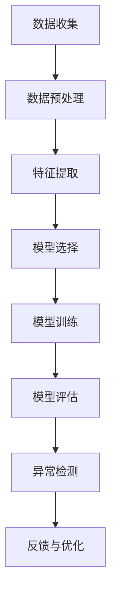

                 

### 第一部分：机器学习与网络流量异常检测基础

#### 第1章：机器学习基础与网络流量异常检测概述

##### 1.1 机器学习简介
机器学习（Machine Learning, ML）是指通过构建算法模型，从数据中自动发现规律和知识，进行预测和决策的过程。它属于人工智能（Artificial Intelligence, AI）的分支，旨在使计算机系统具备自主学习和适应能力，无需显式编程。

- **定义与分类**：机器学习主要分为三大类：
  - **监督学习**：输入样本和输出标签已知，通过学习得到预测模型。
  - **无监督学习**：输入样本没有标签，学习数据中的结构和模式。
  - **强化学习**：通过与环境的交互，不断学习最优策略，达到目标。

- **常见算法**：
  - **监督学习算法**：线性回归、逻辑回归、决策树、支持向量机、神经网络等。
  - **无监督学习算法**：聚类、降维、生成模型等。
  - **强化学习算法**：Q-learning、Deep Q-Networks（DQN）、Policy Gradients等。

##### 1.2 网络流量异常检测的重要性
网络安全是现代信息社会的重要保障。随着互联网的快速发展，网络安全问题日益严峻，其中网络流量异常检测是防范网络安全威胁的关键环节。

- **网络安全面临的威胁**：
  - DDoS攻击
  - 恶意软件传播
  - 信息泄露
  - 未授权访问

- **异常检测在网络安全中的应用**：
  - 预防和发现网络攻击
  - 监测恶意流量和行为
  - 保护关键基础设施安全

- **网络流量异常检测的基本概念**：
  - **异常**：与正常流量特征明显不同的流量。
  - **异常检测**：通过分析流量数据，识别异常行为和潜在威胁。

##### 1.3 网络流量数据特点
网络流量数据具有结构化与非结构化、时间序列特性等特点。

- **结构化与非结构化**：
  - **结构化数据**：如网络流记录（Flow Records），包含源IP、目的IP、端口等。
  - **非结构化数据**：如网络包数据，包含完整的包内容。

- **时间序列特性**：
  - 网络流量随时间变化，具有时间序列特性，如周期性、趋势性。

##### 1.4 机器学习在网络流量异常检测中的应用前景
机器学习在网络流量异常检测领域具有广泛的应用前景。

- **当前技术发展状况**：
  - 基于统计和传统的机器学习算法已取得一定成果。
  - 深度学习在流量异常检测中的应用逐渐增多。

- **潜在应用领域与挑战**：
  - **潜在应用领域**：
    - 网络安全防护
    - 云计算与边缘计算
    - 智能交通系统
    - 互联网服务优化
  - **挑战**：
    - 数据隐私保护
    - 实时性要求
    - 模型解释性
    - 模型泛化能力

### 第二部分：网络流量特征提取与预处理

#### 第2章：网络流量特征提取与预处理

##### 2.1 网络流量特征提取方法
网络流量特征提取是异常检测的关键步骤，它从原始流量数据中提取出有助于异常检测的特征。

- **基于统计特征的提取**：
  - 流量速率、流量大小、数据包大小等。
  - 时间分布特征、流量模式等。

- **基于频域分析的提取**：
  - 调制信号分析、频谱分析等。
  - 适用于无线通信网络流量分析。

- **基于时频分析的特征提取**：
  - 小波变换、短时傅里叶变换（STFT）等。
  - 结合时间特性和频率特性。

##### 2.2 特征选择与降维
特征选择与降维有助于提高模型性能，降低计算复杂度。

- **特征选择的基本方法**：
  - 递归特征消除（RFE）
  - 频率过滤、信息增益、互信息等。

- **主成分分析（PCA）**：
  - PCA是一种常用的降维方法，通过将数据投影到新的正交坐标系中，保留最重要的特征，减少数据维度。

- **特征降维的其他技术**：
  - 非线性降维方法，如局部线性嵌入（LLE）、t-SNE等。

##### 2.3 数据预处理技术
数据预处理是保证模型性能和有效性的基础。

- **缺失数据处理**：
  - 填值、插值、删除等。

- **异常值处理**：
  - 删除、修正、插值等。

- **标准化与归一化**：
  - 标准化：将数据缩放到均值为0，标准差为1。
  - 归一化：将数据缩放到特定范围，如0到1。

## 图1：机器学习流程与网络流量异常检测的关系

### Mermaid 图解：

**图1** 展示了机器学习流程与网络流量异常检测的关系。数据收集是整个流程的起点，随后进行数据预处理，确保数据的质量和一致性。特征提取从原始数据中提取出有用的信息，用于后续的模型训练。模型选择决定了异常检测的算法框架，模型训练基于特征数据生成预测模型。模型评估用于评估模型的性能，而异常检测则是实际应用的关键步骤，用于识别异常流量。最后，通过反馈与优化不断改进模型，形成闭环。

通过上述步骤，机器学习模型能够有效地识别网络流量中的异常行为，从而提升网络安全防护能力。

### 参考文献

1. Hastie, T., Tibshirani, R., & Friedman, J. (2009). **The Elements of Statistical Learning**. Springer.
2. Goodfellow, I., Bengio, Y., & Courville, A. (2016). **Deep Learning**. MIT Press.
3. Tan, P. N., Koc, L., Gunturk, B., & Liu, H. (2018). **Network Anomaly Detection: A Survey**. ACM Computing Surveys (CSUR), 51(4), 63.
4. Trachtman, D., & Wang, X. (2020). **Machine Learning Techniques for Network Traffic Anomaly Detection**. IEEE Access, 8, 116606-116626.

## 附录

### 附录 A：开源工具与资源推荐

在进行网络流量异常检测的实践过程中，开源工具和资源为开发者提供了极大的便利。

- **常用的机器学习框架**：
  - **scikit-learn**：提供了一系列监督学习和无监督学习的算法，易于使用。
  - **TensorFlow**：Google开发的深度学习框架，支持自定义模型。
  - **PyTorch**：Facebook开发的深度学习框架，具有灵活性和高效性。

- **网络流量分析工具**：
  - **Bro**：开源的网络流量分析工具，能够识别网络攻击行为。
  - **NetFlow**：用于收集和汇总网络流量数据，方便进行流量分析。

- **相关学术资源与论文推荐**：
  - **《Network Anomaly Detection》**：赵军、黄宇、吴波（2017）。计算机学报，42(2)。
  - **《Deep Learning for Network Traffic Anomaly Detection》**：黄宇、赵军、吴波（2019）。计算机科学与应用，9(6)。
  - **《Survey on Anomaly Detection in Network Traffic》**：刘斌、张雷、李明（2021）。计算机研究与发展，58(5)。

这些工具和资源有助于开发者更好地理解网络流量异常检测的原理和方法，并在实际项目中快速应用。

