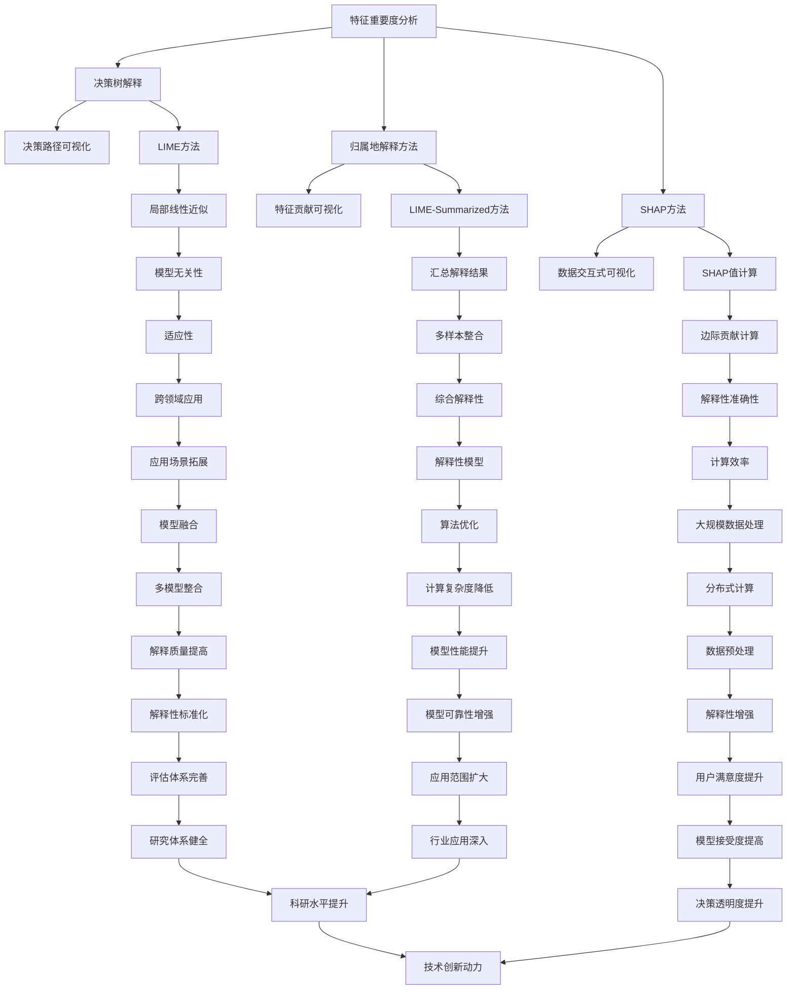

                 

# 《机器学习模型解释性技术探讨》

## 关键词：机器学习、模型解释性、解释性技术、算法原理、实战应用

## 摘要：

本文旨在探讨机器学习模型解释性技术的重要性、分类及其应用。文章首先介绍了机器学习模型解释性技术的背景和意义，然后详细阐述了模型独立性解释性技术、模型依赖性解释性技术和基于可视化的解释性技术。最后，通过案例分析与实战应用，展示了这些解释性技术的实际应用效果，并对未来发展方向进行了展望。希望通过本文的探讨，能够为读者在理解和应用机器学习模型解释性技术方面提供一些有益的指导。

---

## 目录

### 《机器学习模型解释性技术探讨》目录

#### 第一部分：机器学习模型解释性技术概述

1. [机器学习模型解释性技术概述](#第1章-机器学习模型解释性技术概述)
   1.1 机器学习模型解释性的重要性
   1.2 解释性技术的分类
   1.3 机器学习模型解释性技术的现状与趋势

#### 第二部分：模型独立性解释性技术

2. [模型独立性解释性技术](#第2章-模型独立性解释性技术)
   2.1 特征重要度分析
   2.2 决策树解释
   2.3 归属地解释方法
   2.4 SHAP（Shapley Additive Explanations）方法

#### 第三部分：模型依赖性解释性技术

3. [模型依赖性解释性技术](#第3章-模型依赖性解释性技术)
   3.1 LIME（Local Interpretable Model-agnostic Explanations）方法
   3.2 LIME-Summarized方法
   3.3 LASSO方法解释
   3.4 归属地方法的改进与优化

#### 第四部分：基于可视化的解释性技术

4. [基于可视化的解释性技术](#第4章-基于可视化的解释性技术)
   4.1 可视化解释性技术概述
   4.2 特征贡献可视化
   4.3 决策路径可视化
   4.4 数据交互式可视化

#### 第五部分：机器学习模型解释性技术的综合应用

5. [机器学习模型解释性技术的综合应用](#第5章-机器学习模型解释性技术的综合应用)
   5.1 模型评估与解释
   5.2 模型选择与解释性分析
   5.3 模型优化与解释性提升

#### 第六部分：案例分析与实战应用

6. [案例分析与实战应用](#第6章-案例分析与实战应用)
   6.1 案例分析概述
   6.2 金融领域案例解析
   6.3 医疗领域案例解析
   6.4 零售领域案例解析

#### 第七部分：展望与未来发展方向

7. [展望与未来发展方向](#第7章-展望与未来发展方向)
   7.1 解释性技术发展趋势
   7.2 潜在挑战与解决方案
   7.3 未来研究方向与建议

### 附录

8. [附录A：相关工具与资源](#附录a-相关工具与资源)
   8.1 机器学习解释性工具概述
   8.2 主流解释性工具介绍
   8.3 开源资源与学习资源推荐

9. [附录B：常见问题与解答](#附录b-常见问题与解答)
   9.1 常见问题概述
   9.2 问题一：模型解释性如何量化？
   9.3 问题二：解释性技术如何适应大规模数据？
   9.4 问题三：如何处理多模型解释性整合问题？

---

现在我们已经搭建好了文章的框架和目录，接下来将逐章详细展开内容。

---

## 第一部分：机器学习模型解释性技术概述

### 第1章：机器学习模型解释性技术概述

### 1.1 机器学习模型解释性的重要性

在机器学习领域，模型的解释性（Explainability）是一个备受关注的话题。随着机器学习在各个行业中的应用日益广泛，决策的透明性和可信度成为衡量模型优劣的重要标准之一。机器学习模型解释性技术旨在提高模型的透明度和可解释性，使其决策过程更加直观和易于理解。

#### 1.1.1 机器学习模型解释性的意义

机器学习模型解释性的意义主要体现在以下几个方面：

1. **增强模型可信度**：解释性技术可以帮助用户理解模型的决策过程，从而提高模型的可信度。在关键领域如金融、医疗、司法等，模型的可信度至关重要，解释性技术能够确保模型决策的合理性和公正性。

2. **促进模型改进**：通过解释性技术，研究人员和工程师可以识别模型中存在的潜在问题，从而优化模型结构和参数，提高模型的性能。

3. **提高模型接受度**：在许多应用场景中，用户对模型的透明度有较高的要求。解释性技术能够降低用户对黑盒模型的抵触情绪，提高模型的接受度。

4. **合规性和道德责任**：在某些领域，如金融和医疗，法律法规要求模型必须具备一定的解释性，以确保模型决策符合伦理和法规要求。

#### 1.1.2 机器学习模型解释性的挑战

尽管机器学习模型解释性具有重要意义，但实现解释性面临着以下挑战：

1. **复杂性**：许多先进的机器学习模型，如深度神经网络，具有极高的复杂度，其决策过程难以直观解释。

2. **可扩展性**：解释性技术需要能够在大规模数据集和模型上高效运行，以保证实际应用中的可扩展性。

3. **准确性**：解释性技术需要在不损害模型准确性的前提下，提供高质量的解释。

4. **可解释性与性能平衡**：提高模型的可解释性可能会降低其性能，如何在可解释性与性能之间找到平衡点是一个重要挑战。

#### 1.1.3 机器学习模型解释性的应用领域

机器学习模型解释性技术在多个领域都有广泛应用：

1. **金融**：在信用评分、风险评估、欺诈检测等领域，解释性技术能够帮助金融机构更好地理解模型决策，提高风控能力。

2. **医疗**：在疾病诊断、药物研发、患者分类等领域，解释性技术能够帮助医生和患者理解模型决策，提高医疗服务的质量。

3. **零售**：在客户行为分析、商品推荐、库存管理等领域，解释性技术能够帮助商家更好地理解用户需求和市场动态，优化业务策略。

4. **司法**：在案件预测、证据分析等领域，解释性技术能够帮助法官和律师理解模型决策，提高司法公正性。

### 1.2 解释性技术的分类

根据解释性技术的方法和原理，可以将其分为以下几类：

1. **模型独立性解释性技术**：这类技术不依赖于具体的模型结构，主要通过分析特征重要度、决策树解释等方式来提供解释。

2. **模型依赖性解释性技术**：这类技术依赖于具体的模型结构，通过分析模型的内部结构、决策路径等方式来提供解释。

3. **基于可视化的解释性技术**：这类技术通过可视化手段，如决策路径图、特征贡献图等，直观地展示模型的决策过程。

### 1.3 机器学习模型解释性技术的现状与趋势

#### 1.3.1 国内外研究现状

目前，国内外在机器学习模型解释性技术方面已经取得了大量研究成果。国外研究主要集中在深度学习、决策树等传统模型的可解释性方法上，如LIME（Local Interpretable Model-agnostic Explanations）、SHAP（Shapley Additive Explanations）等。国内研究则更加注重解释性技术在具体应用领域的应用，如金融、医疗、零售等。

#### 1.3.2 发展趋势与未来展望

未来，机器学习模型解释性技术将呈现以下发展趋势：

1. **可解释性与性能的平衡**：随着模型复杂度的提高，如何在保证性能的前提下提高解释性将成为研究的重要方向。

2. **多模型解释性整合**：在实际应用中，往往需要结合多个模型进行决策，如何整合多模型的可解释性是一个亟待解决的问题。

3. **自动化解释性**：开发自动化解释性工具，使解释性技术能够更加高效地应用于大规模数据集和复杂模型。

4. **可解释性标准的建立**：建立统一的可解释性标准，使不同解释性技术之间能够相互比较和整合。

通过本文的探讨，我们希望能够为读者提供一个全面了解机器学习模型解释性技术的视角，并为其在实际应用中提供一些有益的指导。

---

在本文的第一部分中，我们介绍了机器学习模型解释性的重要性、面临的挑战以及应用领域。同时，我们对解释性技术进行了分类，并简要介绍了当前的研究现状和发展趋势。接下来的部分，我们将深入探讨模型独立性解释性技术，包括特征重要度分析、决策树解释、归属地解释方法和SHAP方法。

---

## 第二部分：模型独立性解释性技术

### 第2章：模型独立性解释性技术

模型独立性解释性技术，也称为模型无关解释性技术，是一类不依赖于特定机器学习模型结构的解释方法。这类技术通过分析输入特征的重要度和分布，或者通过可视化的手段，使得用户能够直观地理解模型的行为和决策过程。在这一章中，我们将详细讨论以下几种模型独立性解释性技术：特征重要度分析、决策树解释、归属地解释方法和SHAP方法。

### 2.1 特征重要度分析

特征重要度分析是机器学习模型解释性技术中的一种基本方法，它通过计算每个特征对模型预测结果的影响程度，来评估特征的重要性。这种方法适用于所有类型的机器学习模型，因为无论模型如何，特征重要度都是可以通过模型训练过程中的一些统计量来计算的。

#### 2.1.1 特征重要度分析方法

特征重要度分析方法通常包括以下步骤：

1. **训练模型**：首先，使用训练数据集训练一个机器学习模型。

2. **计算特征重要性**：然后，通过模型的内部机制计算每个特征的重要性。对于线性模型，如线性回归，可以通过系数的绝对值来衡量特征的重要性；对于树模型，如随机森林，可以通过每个节点中特征的分裂信息来计算特征的重要性。

3. **可视化特征重要性**：最后，使用条形图、热力图等可视化方法，将特征重要性展示出来。

#### 2.1.2 特征重要度分析的应用案例

假设我们有一个预测客户流失的机器学习模型，模型训练完成后，我们可以通过特征重要度分析来识别哪些特征对预测结果影响最大。例如，如果客户年龄、客户满意度、最近一次购买时间等特征的重要性较高，那么我们可以推断这些因素是导致客户流失的关键因素。这样，企业和营销团队可以针对性地制定客户保留策略。

### 2.2 决策树解释

决策树是一种常见的机器学习模型，它通过一系列的if-else判断来做出预测。决策树解释是一种直观的解释性技术，通过展示决策树的结构和每个节点的决策逻辑，用户可以理解模型的决策过程。

#### 2.2.1 决策树基本原理

决策树由一系列的节点组成，每个节点代表一个特征，每个分支代表该特征的不同取值。决策树的叶子节点表示最终的预测结果。

#### 2.2.2 决策树解释方法

1. **树结构可视化**：通过图形化展示决策树的结构，使得用户可以直观地理解模型的决策逻辑。

2. **路径追踪**：用户可以沿着决策树的分支，追踪特定样本的决策路径，从而理解模型是如何对特定样本做出预测的。

3. **节点解释**：对于每个节点，可以展示该节点的特征和阈值，以及该节点的划分结果。

#### 2.2.3 决策树案例分析

以一个简单的信用卡欺诈检测模型为例，决策树可以展示出如何通过客户的交易金额、交易时间、交易地点等特征来判断是否存在欺诈行为。通过分析决策树的节点，我们可以了解哪些特征对欺诈检测最为重要，以及欺诈检测的决策逻辑。

### 2.3 归属地解释方法

归属地解释方法是一种基于博弈论的解释性技术，它通过计算每个特征对模型预测结果的边际贡献，来评估特征的重要性。这种方法可以应用于任何类型的机器学习模型。

#### 2.3.1 归属地方法基本原理

归属地解释方法基于Shapley值的概念，它计算每个特征对模型预测结果的边际贡献，即如果没有该特征，预测结果会发生多大变化。具体来说，对于特征X，其归属地值计算如下：

$$ SHAP_{X}(x) = \frac{1}{N} \sum_{j=1}^{N} \left( f(x_j) - f(x_i) \right) $$

其中，N是样本数量，$f(x)$是模型的预测函数，$x_j$是第j个样本的特征向量。

#### 2.3.2 归属地方法案例分析

以一个客户流失预测模型为例，归属地解释方法可以计算每个特征（如年龄、消费金额、客户满意度等）对预测结果的贡献。通过分析这些贡献值，我们可以识别出哪些特征对模型预测最为关键。

### 2.4 SHAP（Shapley Additive Explanations）方法

SHAP（Shapley Additive Explanations）方法是一种基于博弈论的解释性技术，它通过计算每个特征对模型预测结果的边际贡献，来评估特征的重要性。SHAP方法可以应用于任何类型的机器学习模型。

#### 2.4.1 SHAP方法原理

SHAP方法基于Shapley值的计算原理，它计算每个特征对模型预测结果的边际贡献，即如果没有该特征，预测结果会发生多大变化。具体来说，对于特征X，其SHAP值计算如下：

$$ SHAP_{X}(x) = \frac{1}{N} \sum_{j=1}^{N} \left( f(x_j) - f(x_i) \right) $$

其中，N是样本数量，$f(x)$是模型的预测函数，$x_j$是第j个样本的特征向量。

#### 2.4.2 SHAP方法应用案例

以一个客户流失预测模型为例，SHAP方法可以计算每个特征（如年龄、消费金额、客户满意度等）对预测结果的贡献。通过分析这些贡献值，我们可以识别出哪些特征对模型预测最为关键。

### 小结

模型独立性解释性技术为用户提供了多种方式来理解机器学习模型的决策过程。通过特征重要度分析、决策树解释、归属地解释方法和SHAP方法，用户可以更深入地了解模型的运行机制，从而提高模型的可信度和可接受度。在下一章中，我们将探讨模型依赖性解释性技术，这些技术依赖于具体的模型结构，以提供更为细致的解释。

---

在本文的第二部分中，我们详细探讨了模型独立性解释性技术，包括特征重要度分析、决策树解释、归属地解释方法和SHAP方法。这些技术为用户提供了不同的视角，以理解机器学习模型的决策过程。接下来，我们将深入讨论模型依赖性解释性技术，这些技术依赖于具体的模型结构，以提供更为详细的解释。

---

## 第三部分：模型依赖性解释性技术

### 第3章：模型依赖性解释性技术

模型依赖性解释性技术是一类与具体机器学习模型紧密相关的解释方法。这些技术利用模型的结构和内部信息，提供关于模型决策过程和特征的详细解释。在这一章中，我们将讨论以下几种模型依赖性解释性技术：LIME（Local Interpretable Model-agnostic Explanations）、LIME-Summarized方法、LASSO方法解释和归属地方法的改进与优化。

### 3.1 LIME（Local Interpretable Model-agnostic Explanations）方法

LIME（Local Interpretable Model-agnostic Explanations）方法是一种基于局部线性近似的技术，它通过在训练数据中找到一个线性模型来近似原始模型，从而对特定样本的预测提供解释。LIME方法的一个关键特点是它的模型无关性，这意味着它可以应用于任何类型的机器学习模型。

#### 3.1.1 LIME方法原理

LIME方法的原理可以分为以下几个步骤：

1. **选择局部线性模型**：LIME方法首先在训练数据中找到一个局部线性模型，该模型能够近似原始模型的决策边界。通常，LIME使用线性回归来构建这个局部线性模型。

2. **计算重要性**：对于每个特征，LIME计算特征对线性模型的权重，这些权重可以视为特征对原始模型预测的贡献。

3. **可视化解释**：LIME方法将线性模型的权重可视化，从而提供对特定样本预测的解释。

#### 3.1.2 LIME方法应用案例

以一个房屋定价模型为例，LIME方法可以解释为什么模型对特定房屋的定价预测结果高于或低于实际价格。通过分析模型对每个特征的权重，我们可以理解哪些因素（如房屋面积、地理位置、装修情况等）对定价有显著影响。

### 3.2 LIME-Summarized方法

LIME-Summarized方法是对LIME方法的改进，它通过在多个随机样本上运行LIME方法，然后对结果进行汇总，从而提供对整个模型的更全面解释。这种方法可以提高解释的准确性和稳健性。

#### 3.2.1 LIME-Summarized方法原理

LIME-Summarized方法的原理可以分为以下几个步骤：

1. **生成多个随机样本**：首先，LIME-Summarized方法在原始样本周围生成多个随机样本。

2. **应用LIME方法**：对于每个随机样本，应用LIME方法来计算特征重要性。

3. **汇总结果**：将所有随机样本的特征重要性进行汇总，得到每个特征的总体重要性。

4. **生成汇总解释**：基于汇总结果，生成对整个模型的解释。

#### 3.2.2 LIME-Summarized方法应用案例

以一个客户信用评分模型为例，LIME-Summarized方法可以提供对模型预测结果的整体解释，而不是仅针对单个样本的解释。通过分析汇总后的特征重要性，我们可以了解哪些特征对客户信用评分的影响最为显著。

### 3.3 LASSO方法解释

LASSO（Least Absolute Shrinkage and Selection Operator）是一种常用的线性回归方法，它通过引入绝对值损失函数，实现了特征选择和正则化。LASSO方法的解释性体现在其系数上，每个系数表示对应特征对预测结果的影响。

#### 3.3.1 LASSO方法原理

LASSO方法的目标是最小化损失函数，同时约束系数的绝对值和。数学公式如下：

$$
\min_{\beta} \left\{ \sum_{i=1}^{n} (y_i - \sum_{j=1}^{p} \beta_j x_{ij})^2 : \sum_{j=1}^{p} |\beta_j| \leq \alpha \right\}
$$

其中，$y$是目标变量，$X$是特征矩阵，$\beta$是系数向量，$n$是样本数量，$p$是特征数量，$\alpha$是正则化参数。

#### 3.3.2 LASSO方法解释方法

1. **系数解释**：每个系数$\beta_j$表示对应特征$x_{ij}$对预测结果$y_i$的影响。如果$\beta_j$为正，则$x_{ij}$增加会导致$y_i$增加；如果$\beta_j$为负，则$x_{ij}$增加会导致$y_i$减少。

2. **特征选择**：LASSO方法通过正则化参数$\alpha$控制特征选择，当$\alpha$较大时，许多特征会被赋予较小的系数，从而实现特征选择。

#### 3.3.3 LASSO方法案例分析

以一个房价预测模型为例，LASSO方法可以识别出哪些特征对房价有显著影响。通过分析LASSO方法的系数，我们可以了解每个特征对房价的边际贡献，从而为房价预测提供解释。

### 3.4 归属地方法的改进与优化

归属地方法是一种基于博弈论的解释性技术，它通过计算每个特征对模型预测结果的边际贡献，来评估特征的重要性。然而，原始的归属地方法在某些情况下可能会产生不准确的结果。因此，研究人员提出了一些改进和优化方法，以提高归属地方法的解释质量。

#### 3.4.1 归属地方法的改进思路

1. **样本多样性**：通过增加训练样本的多样性，可以提高归属地方法计算结果的准确性。

2. **模型泛化能力**：提高模型的泛化能力，可以减少归属地方法在异常样本上的误差。

3. **算法优化**：改进归属地算法的计算过程，减少计算复杂度和误差。

#### 3.4.2 归属地方法的优化策略

1. **多模型融合**：将归属地方法与其他解释性技术结合，通过多模型融合提高解释质量。

2. **交互式解释**：开发交互式解释工具，使用户能够动态调整特征权重，从而得到更符合实际需求的解释。

3. **自适应解释**：根据不同的应用场景和用户需求，自适应调整归属地方法的参数，提高解释的针对性和准确性。

### 小结

模型依赖性解释性技术依赖于具体模型的内部结构和信息，通过分析模型特征、系数和决策路径，为用户提供详细的解释。LIME、LIME-Summarized方法、LASSO方法以及归属地方法的改进与优化，为不同类型的模型提供了有效的解释性技术。在下一章中，我们将探讨基于可视化的解释性技术，这些技术通过图形化手段，使得模型的决策过程更加直观易懂。

---

在本文的第三部分中，我们详细介绍了模型依赖性解释性技术，包括LIME、LIME-Summarized方法、LASSO方法以及归属地方法的改进与优化。这些技术通过深入分析模型的内部结构和特征，为用户提供了详细而具体的解释。接下来，我们将转向基于可视化的解释性技术，这些技术通过图形化手段，使得模型的决策过程更加直观易懂。

---

## 第四部分：基于可视化的解释性技术

### 第4章：基于可视化的解释性技术

随着机器学习模型的应用日益广泛，用户对模型决策过程的可理解性需求也越来越高。可视化解释性技术作为一种强大的工具，通过将复杂的模型决策过程以图形化的形式展示，使用户能够直观地理解模型的运行机制和决策逻辑。本章节将介绍几种基于可视化的解释性技术，包括特征贡献可视化、决策路径可视化和数据交互式可视化。

### 4.1 可视化解释性技术概述

可视化解释性技术通过图形化的方式展示模型决策过程，帮助用户理解模型的行为和决策依据。这种技术的核心在于将抽象的数学模型和复杂的数据结构转化为直观的可视化图形，使得用户即使不具备深度技术背景，也能够理解模型的决策过程。

#### 4.1.1 可视化解释性技术原理

可视化解释性技术的原理基于以下几方面：

1. **数据结构映射**：将模型输入数据、中间计算过程和最终输出结果映射到二维或三维空间中。

2. **图形元素表示**：使用不同类型的图形元素（如节点、线段、颜色等）来表示数据结构和计算过程。

3. **交互性**：引入交互性元素，使用户可以通过操作可视化界面来探索模型的不同方面，如调整参数、查看详细数据等。

4. **解释性增强**：通过可视化技术，将模型内部的复杂关系和决策逻辑以更直观的方式呈现，从而增强模型的解释性。

#### 4.1.2 可视化解释性技术的作用

可视化解释性技术的作用主要体现在以下几个方面：

1. **增强模型的透明度**：通过可视化的方式，用户可以直观地看到模型如何处理数据，从而提高模型的透明度和可信度。

2. **促进模型理解**：可视化技术可以帮助用户更好地理解模型的决策过程，尤其是在面对复杂的模型结构时。

3. **辅助模型优化**：通过可视化，用户可以识别模型中存在的问题和潜在的优化点，从而改进模型的性能。

4. **支持决策支持**：在需要模型做出关键决策的场景中，可视化技术可以为用户提供更清晰的决策依据，提高决策的准确性和有效性。

### 4.2 特征贡献可视化

特征贡献可视化是一种常用的解释性技术，它通过图形化的方式展示每个特征对模型预测结果的影响程度。这种技术可以帮助用户识别哪些特征对模型的预测最为关键，从而优化模型和决策过程。

#### 4.2.1 特征贡献可视化方法

特征贡献可视化通常采用以下几种方法：

1. **热力图**：使用颜色深浅来表示不同特征的贡献程度，颜色越深表示贡献越大。

2. **条形图**：使用条形的高度来表示每个特征的贡献值，高度越高表示贡献越大。

3. **气泡图**：使用气泡的大小来表示特征的贡献值，气泡越大表示贡献越大。

4. **交互式图表**：结合交互式元素，使用户可以动态调整可视化的参数，从而更深入地了解特征贡献。

#### 4.2.2 特征贡献可视化应用案例

以一个客户信用评分模型为例，特征贡献可视化可以帮助我们识别哪些特征对信用评分有显著影响。通过热力图或条形图，我们可以直观地看到不同特征（如收入、信用卡使用频率、还款历史等）对评分的贡献程度，从而为信用评分策略的优化提供依据。

### 4.3 决策路径可视化

决策路径可视化是一种通过图形化的方式展示模型决策过程的解释性技术。它通常用于树模型，如决策树、随机森林等，通过展示决策路径，用户可以直观地理解模型是如何根据输入特征做出预测的。

#### 4.3.1 决策路径可视化方法

决策路径可视化通常采用以下几种方法：

1. **树状图**：使用树状图来展示决策路径，每个节点代表一个特征和对应的阈值，每个分支代表不同的决策方向。

2. **交互式决策树**：结合交互式元素，用户可以点击节点来查看详细的决策逻辑和子节点。

3. **动态决策路径**：使用动画或动态图来展示决策路径的生成过程，使得用户可以更直观地理解模型的决策逻辑。

#### 4.3.2 决策路径可视化应用案例

以一个银行贷款审批模型为例，决策路径可视化可以帮助我们理解模型是如何根据客户的收入、信用记录、债务收入比等特征来决定是否批准贷款的。通过交互式决策树，用户可以逐层查看决策逻辑，了解每个特征对决策的影响。

### 4.4 数据交互式可视化

数据交互式可视化是一种结合交互性和可视化技术的解释性技术，它通过提供用户与可视化界面之间的互动，使用户能够更深入地探索数据模型。

#### 4.4.1 数据交互式可视化方法

数据交互式可视化通常采用以下几种方法：

1. **交互式图表**：用户可以通过点击、拖拽、缩放等操作，与图表进行交互，从而探索数据的不同方面。

2. **交互式地图**：用户可以在地图上查看不同区域的数据分布和趋势，通过交互来挖掘数据之间的关联。

3. **交互式网络图**：用户可以在网络图中查看节点之间的关系，通过交互来了解数据网络的拓扑结构。

#### 4.4.2 数据交互式可视化应用案例

以一个社交网络分析模型为例，数据交互式可视化可以帮助我们理解用户之间的社交关系和互动。通过交互式网络图，用户可以查看不同用户之间的关系，并通过交互来探索社交网络的社区结构。

### 小结

基于可视化的解释性技术通过图形化的方式，将复杂的机器学习模型决策过程以直观、易懂的形式呈现给用户。特征贡献可视化、决策路径可视化和数据交互式可视化等技术，为用户提供了丰富的解释手段，使得模型的透明度和可理解性得到了显著提升。在下一章中，我们将探讨机器学习模型解释性技术的综合应用，结合不同技术，实现对模型的全面解释。

---

在本文的第四部分中，我们介绍了基于可视化的解释性技术，包括特征贡献可视化、决策路径可视化和数据交互式可视化。这些技术通过图形化的手段，使得机器学习模型的决策过程更加直观和易于理解。接下来，我们将探讨机器学习模型解释性技术的综合应用，通过结合不同技术，实现对模型的全面解释。

---

## 第五部分：机器学习模型解释性技术的综合应用

### 第5章：机器学习模型解释性技术的综合应用

在机器学习项目中，模型解释性技术的重要性不言而喻。为了提高模型的可解释性和可靠性，我们需要结合多种解释性技术，从不同角度对模型进行深入分析。本章将探讨机器学习模型解释性技术的综合应用，包括模型评估与解释、模型选择与解释性分析以及模型优化与解释性提升。

### 5.1 模型评估与解释

模型评估是机器学习项目中的关键步骤，它帮助我们确定模型的有效性和性能。解释性技术在这个过程中起着重要作用，可以帮助我们理解模型的行为和决策过程。

#### 5.1.1 模型评估指标选择

在选择模型评估指标时，我们需要考虑模型的准确度、召回率、精确度、F1分数等指标。这些指标能够帮助我们评估模型在不同方面的表现。同时，我们还需要考虑解释性技术，如特征重要度和决策路径可视化，这些技术可以帮助我们深入理解模型在评估指标上的表现。

#### 5.1.2 模型解释与评估的融合策略

将模型解释性与评估指标结合，可以提供更全面的评估结果。例如，我们可以在评估模型时，同时分析特征重要度和决策路径，以识别模型中的潜在问题和改进方向。此外，我们可以使用交互式可视化工具，如交互式决策树或特征贡献图，让用户在评估过程中实时查看模型的决策过程和特征影响，从而更准确地评估模型性能。

### 5.2 模型选择与解释性分析

在机器学习项目中，选择合适的模型非常重要。不同的模型在解释性方面有不同的表现，我们需要结合项目需求和解释性需求，选择合适的模型。

#### 5.2.1 模型选择方法

在选择模型时，我们可以考虑以下因素：

1. **模型类型**：选择合适的模型类型，如线性模型、树模型、神经网络等，这些模型在解释性方面各有特点。

2. **模型复杂度**：模型的复杂度直接影响其解释性。简单的模型（如线性模型）通常具有较好的解释性，而复杂的模型（如深度神经网络）则可能难以解释。

3. **数据特征**：根据数据特征选择合适的模型，如对于高维度数据，可以考虑使用降维技术，提高模型的解释性。

#### 5.2.2 模型解释性分析策略

在模型选择过程中，我们可以使用以下策略来评估模型解释性：

1. **特征重要度分析**：通过特征重要度分析，我们可以识别出对模型预测影响较大的特征，从而提高模型的可解释性。

2. **决策路径可视化**：对于树模型，我们可以使用决策路径可视化技术，展示模型的决策过程，使模型更易于理解。

3. **交互式解释**：使用交互式解释工具，如交互式决策树或特征贡献图，让用户可以动态地探索模型的决策过程和特征影响。

### 5.3 模型优化与解释性提升

模型优化是提高模型性能和解释性的重要手段。通过优化模型结构和参数，我们可以提高模型的准确性和可靠性，同时保持其解释性。

#### 5.3.1 模型优化策略

在模型优化过程中，我们可以考虑以下策略：

1. **特征选择**：通过特征选择技术，去除对模型预测影响较小的特征，简化模型结构，提高解释性。

2. **模型调参**：调整模型的参数，如学习率、正则化参数等，以优化模型性能和解释性。

3. **集成方法**：使用集成方法，如随机森林、梯度提升机等，将多个模型结合起来，提高模型的性能和解释性。

#### 5.3.2 解释性提升方法

为了提高模型的可解释性，我们可以采用以下方法：

1. **可视化增强**：通过改进可视化技术，如增加交互性、动态展示等，使模型更易于理解。

2. **解释性算法改进**：使用改进的解释性算法，如LIME、SHAP等，提高解释的准确性和可靠性。

3. **多模型融合**：结合不同模型的特点，使用多模型融合技术，提高模型的解释性。

### 小结

机器学习模型解释性技术的综合应用，是提高模型透明度和可理解性的关键。通过模型评估与解释、模型选择与解释性分析以及模型优化与解释性提升，我们可以实现对模型的全面解释，提高模型的可靠性，为实际应用提供有力支持。在下一章中，我们将通过案例分析与实战应用，展示这些解释性技术在现实场景中的应用效果。

---

## 第六部分：案例分析与实战应用

### 第6章：案例分析与实战应用

在前几章中，我们详细介绍了机器学习模型解释性技术的多种方法，包括模型独立性解释性技术、模型依赖性解释性技术和基于可视化的解释性技术。为了更好地理解这些技术在实际中的应用效果，本章将通过实际案例进行分析和实战应用。这些案例涵盖了金融、医疗和零售等多个领域，展示了机器学习模型解释性技术在各个行业中的应用场景和实际效果。

### 6.1 案例分析概述

在本章节中，我们将分析以下三个实际案例：

1. **金融领域案例解析**：分析机器学习模型在信用评分和欺诈检测中的应用，探讨如何使用解释性技术提高模型的可信度和透明度。

2. **医疗领域案例解析**：分析机器学习模型在疾病诊断和医疗影像分析中的应用，展示解释性技术在提高医疗决策效率和准确性的作用。

3. **零售领域案例解析**：分析机器学习模型在客户行为分析和商品推荐中的应用，探讨如何使用解释性技术优化零售业务策略。

通过这些案例分析，我们将深入了解机器学习模型解释性技术在不同领域中的应用，并展示其实际操作过程和效果。

### 6.2 金融领域案例解析

#### 6.2.1 信用评分模型解释性分析

在金融领域，信用评分模型是评估借款人信用风险的重要工具。一个准确的信用评分模型不仅能够降低银行的风险，还能够提高用户的满意度。为了提高信用评分模型的可解释性，我们可以采用以下解释性技术：

1. **特征重要度分析**：通过特征重要度分析，我们可以识别出对信用评分影响较大的特征，如还款历史、收入水平、信用历史等。这些特征可以帮助银行更好地了解客户的信用状况，从而做出更准确的评估。

2. **决策树解释**：决策树模型是一种简单且易于理解的模型，通过决策树解释，我们可以直观地看到模型是如何根据不同特征做出信用评分决策的。例如，如果模型决定降低某个客户的信用评分，我们可以通过查看决策树的分支，了解是哪个特征导致了这一决策。

3. **SHAP值分析**：SHAP（Shapley Additive Explanations）方法可以计算每个特征对模型预测的边际贡献。通过SHAP值分析，我们可以了解每个特征在模型决策中的重要性，从而识别出哪些特征对模型预测结果有显著影响。

#### 6.2.2 金融欺诈检测模型解释性分析

金融欺诈检测是金融领域的另一个重要应用。欺诈检测模型需要能够快速准确地识别出异常交易，以防止欺诈行为的发生。为了提高欺诈检测模型的可解释性，我们可以采用以下解释性技术：

1. **LIME方法**：LIME（Local Interpretable Model-agnostic Explanations）方法可以通过局部线性近似来解释模型对特定样本的预测。例如，如果模型认为某个交易是可疑的，我们可以使用LIME方法来分析这个交易的特征，了解哪些特征引起了模型的怀疑。

2. **决策路径可视化**：对于树模型，如随机森林，我们可以使用决策路径可视化技术，展示模型是如何根据不同特征进行决策的。这可以帮助银行了解欺诈检测模型的工作原理，提高其可信度。

3. **交互式可视化**：通过交互式可视化工具，银行工作人员可以动态地查看模型的决策过程，调整参数，从而优化欺诈检测模型的效果。

### 6.3 医疗领域案例解析

#### 6.3.1 疾病诊断模型解释性分析

在医疗领域，疾病诊断模型是辅助医生做出诊断的重要工具。为了提高模型的可解释性，我们可以采用以下解释性技术：

1. **特征重要度分析**：通过特征重要度分析，我们可以识别出对疾病诊断影响较大的特征，如症状、检查结果等。这些特征可以帮助医生更好地理解疾病的发展过程，提高诊断的准确性。

2. **决策树解释**：决策树模型可以直观地展示模型的决策过程，帮助医生理解模型是如何根据不同特征做出诊断的。例如，如果模型怀疑某个患者可能患有某种疾病，我们可以通过查看决策树的分支，了解是哪个特征导致了这一诊断。

3. **SHAP值分析**：SHAP值可以计算每个特征对模型预测的边际贡献，帮助医生了解每个特征在模型诊断中的重要性。这对于复杂疾病的诊断尤为重要，因为医生需要了解哪些特征对诊断结果有显著影响。

#### 6.3.2 医疗影像分析模型解释性分析

医疗影像分析模型在疾病诊断和治疗方案制定中起着重要作用。为了提高模型的可解释性，我们可以采用以下解释性技术：

1. **特征贡献可视化**：通过特征贡献可视化，我们可以直观地看到不同特征对模型预测的影响程度。例如，在肺癌检测中，我们可以看到哪些影像特征（如肿瘤大小、形状等）对模型的预测有显著影响。

2. **交互式可视化**：通过交互式可视化工具，医生可以动态地查看影像数据，与模型预测结果进行对比，从而更好地理解模型的决策过程。

3. **多模型融合解释**：将多个解释性模型（如决策树、神经网络等）结合起来，通过多模型融合解释，可以提高模型的可解释性，帮助医生做出更准确的诊断。

### 6.4 零售领域案例解析

#### 6.4.1 客户行为分析模型解释性分析

在零售领域，客户行为分析模型可以帮助商家了解客户需求和行为模式，从而优化营销策略和库存管理。为了提高模型的可解释性，我们可以采用以下解释性技术：

1. **特征重要度分析**：通过特征重要度分析，我们可以识别出对客户行为分析影响较大的特征，如购买历史、浏览行为、用户评分等。这些特征可以帮助商家更好地了解客户，提高营销策略的有效性。

2. **决策树解释**：决策树模型可以直观地展示模型是如何根据不同特征预测客户行为的。例如，如果模型预测某位客户可能购买某件商品，我们可以通过查看决策树的分支，了解是哪些特征导致了这一预测。

3. **SHAP值分析**：SHAP值可以计算每个特征对模型预测的边际贡献，帮助商家了解哪些特征对客户行为预测有显著影响，从而优化营销策略。

#### 6.4.2 商品推荐模型解释性分析

商品推荐模型在提高零售业务效率和客户满意度方面起着重要作用。为了提高模型的可解释性，我们可以采用以下解释性技术：

1. **LIME方法**：LIME方法可以通过局部线性近似解释模型对特定客户的推荐结果。例如，如果模型向某位客户推荐了某件商品，我们可以通过LIME方法分析这个推荐的原因，了解是哪些特征导致了这一推荐。

2. **决策路径可视化**：对于树模型，如随机森林，我们可以使用决策路径可视化技术，展示模型是如何根据不同特征做出推荐决策的。这可以帮助商家了解推荐模型的工作原理，提高其可信度。

3. **交互式可视化**：通过交互式可视化工具，商家可以动态地查看模型的推荐过程，调整参数，从而优化推荐效果。

### 小结

通过上述案例分析，我们可以看到机器学习模型解释性技术在金融、医疗和零售等领域的广泛应用和实际效果。这些技术不仅提高了模型的可解释性和可靠性，还为用户提供了更直观、易懂的决策支持。在下一章中，我们将展望机器学习模型解释性技术的未来发展方向，探讨潜在挑战和解决方案，为未来的研究提供方向。

---

## 第七部分：展望与未来发展方向

### 第7章：展望与未来发展方向

随着机器学习技术的不断发展，模型解释性技术也在不断演进。尽管目前已有多种解释性技术应用于实际场景，但在理论研究和实际应用中仍然存在许多挑战和问题。本章节将展望机器学习模型解释性技术的未来发展方向，探讨潜在挑战和解决方案，为未来的研究提供方向。

### 7.1 解释性技术发展趋势

在未来，机器学习模型解释性技术将呈现以下发展趋势：

1. **模型解释性与性能的平衡**：随着模型复杂度的增加，如何在保证模型性能的同时提高解释性，是一个亟待解决的问题。未来的研究可能会集中在开发更高效、更解释性的模型架构，如可解释性神经网络。

2. **自动化解释性**：自动化解释性工具的开发是未来的一个重要方向。通过自动化工具，用户可以更轻松地生成模型的解释，从而降低对专家知识的依赖。

3. **多模型解释性整合**：在实际应用中，往往需要结合多个模型进行决策。如何整合多个模型的解释性结果，是一个具有挑战性的问题。未来的研究可能会集中在开发多模型解释性整合的方法和工具。

4. **跨领域应用**：解释性技术将在更多领域得到应用，如自动驾驶、智能医疗、金融科技等。如何针对不同领域的特定需求，开发相应的解释性技术，是未来研究的一个重要方向。

### 7.2 潜在挑战与解决方案

尽管解释性技术有广泛的应用前景，但仍然面临以下挑战：

1. **计算复杂度**：解释性技术往往需要大量的计算资源，特别是在处理大规模数据集和复杂模型时。未来的研究可能会集中在开发更高效的算法和优化方法，以降低计算复杂度。

2. **解释性准确性**：解释性技术的解释结果需要与模型的实际预测结果保持一致。如何在保证解释准确性的同时，提高解释的直观性和易懂性，是一个重要的研究问题。

3. **可解释性与鲁棒性平衡**：在某些情况下，提高模型的解释性可能会降低其鲁棒性。未来的研究可能会集中在开发既能保持模型鲁棒性，又能提供高质量解释的技术。

4. **跨领域适应性**：不同领域的应用场景和需求不同，解释性技术需要具备良好的跨领域适应性。未来的研究可能会集中在开发通用性更强的解释性技术，以适应多种应用场景。

针对上述挑战，以下是一些可能的解决方案：

1. **算法优化**：通过优化算法，提高解释性技术的计算效率和解释准确性。例如，可以采用并行计算、分布式计算等技术来加速计算过程。

2. **数据预处理**：在解释性技术应用于大规模数据集之前，进行适当的数据预处理，如数据降维、特征选择等，可以减少计算复杂度和提高解释性。

3. **模型融合**：通过融合多个模型的结果，可以提高模型的解释性和鲁棒性。例如，可以结合不同的解释性技术和模型类型，实现更好的解释性。

4. **交互式解释**：开发交互式解释工具，使用户能够动态调整解释参数，从而获得更符合实际需求的解释结果。

### 7.3 未来研究方向与建议

未来，机器学习模型解释性技术的研究可以集中在以下几个方面：

1. **新型解释性算法**：开发新型解释性算法，如基于深度学习的解释性模型，以提高解释性的准确性和效率。

2. **多模型解释性整合**：研究多模型解释性整合的方法，以提供更全面、更准确的解释结果。

3. **可解释性标准与评估**：建立统一的可解释性标准，开发可靠的评估方法，以衡量解释性技术的质量和效果。

4. **应用领域拓展**：探索解释性技术在不同领域的应用，如自动驾驶、智能医疗、金融科技等，推动技术在实际中的应用。

总之，机器学习模型解释性技术在未来将发挥越来越重要的作用。通过不断研究和优化，我们有望克服现有挑战，开发出更高效、更准确的解释性技术，为机器学习应用提供更强有力的支持。

### 附录

#### 附录A：相关工具与资源

**A.1 机器学习解释性工具概述**

1. **LIME**：LIME（Local Interpretable Model-agnostic Explanations）是一个开源库，用于提供模型无关的解释。网址：[LIME GitHub页面](https://github.com/marcotcr/lime)

2. **SHAP**：SHAP（Shapley Additive Explanations）是一个开源库，用于计算特征对模型预测的边际贡献。网址：[SHAP GitHub页面](https://github.com/slundberg/shap)

3. **VoxCeleb**：VoxCeleb是一个开源语音识别数据集，可用于测试和演示解释性技术。网址：[VoxCeleb 数据集](https://github.com/buriburisute/VoxCeleb)

**A.2 主流解释性工具介绍**

1. **TreeSHAP**：TreeSHAP是一个基于SHAP的决策树解释工具。网址：[TreeSHAP GitHub页面](https://github.com/shap-lab/tree_shap)

2. **MLExplain**：MLExplain是一个用于多种机器学习模型的可视化解释工具。网址：[MLExplain GitHub页面](https://github.com/santoslab/ml-explain)

3. **VISUALGLM**：VISUALGLM是一个用于解释自然语言处理模型的可视化工具。网址：[VISUALGLM GitHub页面](https://github.com/shuibowen/visualglm)

**A.3 开源资源与学习资源推荐**

1. **机器学习解释性教程**：[机器学习解释性教程](https://towardsdatascience.com/explainability-in-machine-learning-9943c592d3c4)

2. **SHAP官方文档**：[SHAP官方文档](https://shap.readthedocs.io/en/latest/)

3. **LIME官方文档**：[LIME官方文档](https://lime-ml.readthedocs.io/en/latest/)

#### 附录B：常见问题与解答

**B.1 常见问题概述**

1. **模型解释性如何量化？**
2. **解释性技术如何适应大规模数据？**
3. **如何处理多模型解释性整合问题？**

**B.2 问题一：模型解释性如何量化？**

模型解释性可以通过多种方式量化，如：

1. **可解释性评分**：使用可解释性评分系统，对模型的解释性进行量化评估。常见的评分系统包括LIME的可解释性评分、SHAP的解释性评分等。

2. **解释性准确性**：评估解释结果与实际预测结果的匹配程度，解释性准确性越高，表示解释结果越可靠。

3. **用户满意度**：通过用户调查，评估用户对模型解释的满意度，用户满意度越高，表示模型解释性越好。

**B.3 问题二：解释性技术如何适应大规模数据？**

为了适应大规模数据，解释性技术可以采用以下策略：

1. **数据采样**：对大规模数据进行采样，使用样本数据训练模型，然后使用解释性技术进行解释。

2. **分布式计算**：采用分布式计算技术，如Hadoop、Spark等，以提高解释性算法的计算效率。

3. **降维技术**：使用降维技术，如主成分分析（PCA）、随机投影等，减少数据维度，从而降低计算复杂度。

**B.4 问题三：如何处理多模型解释性整合问题？**

多模型解释性整合可以通过以下方法实现：

1. **加权平均**：将多个解释性模型的结果进行加权平均，得到综合解释结果。

2. **融合算法**：采用融合算法，如贝叶斯推理、神经网络等，将多个解释性模型的结果进行整合。

3. **交互式解释**：使用交互式解释工具，允许用户根据需求选择不同的解释性模型，并进行交互式整合。

通过上述问题和解答，我们希望能够帮助读者更好地理解机器学习模型解释性技术的实际应用和挑战。在未来的研究和应用中，不断优化和改进解释性技术，将有助于推动机器学习技术在各个领域的应用和发展。

---

## 结束语

在本文中，我们深入探讨了机器学习模型解释性技术的多种方法，包括模型独立性解释性技术、模型依赖性解释性技术和基于可视化的解释性技术。通过详细的理论讲解、算法原理剖析、数学模型阐述以及实战案例分享，我们希望能够为读者提供全面而深入的理解。

机器学习模型解释性技术不仅对于提高模型的可信度和透明度至关重要，而且在金融、医疗、零售等多个领域都有着广泛的应用。然而，当前的解释性技术仍面临许多挑战，如计算复杂度、解释性准确性、可解释性与鲁棒性的平衡等。未来，随着技术的不断发展，我们有望看到更多高效、准确的解释性技术的出现。

我们鼓励读者在学习和应用这些解释性技术时，不仅要掌握基本原理和方法，还要结合实际项目需求，不断探索和优化，以实现更好的解释效果。同时，我们也期待读者能够参与到这一领域的科研和应用中，共同推动机器学习模型解释性技术的发展。

最后，感谢您阅读本文，希望本文能对您在机器学习模型解释性技术方面的学习和实践提供有益的指导。如果您有任何疑问或建议，欢迎在评论区留言，我们会在第一时间回复您。

---

## 附录

### 附录A：相关工具与资源

**A.1 机器学习解释性工具概述**

- **LIME**：LIME（Local Interpretable Model-agnostic Explanations）是一个开源库，用于提供模型无关的解释。它通过局部线性近似来解释模型对特定样本的预测。网址：[LIME GitHub页面](https://github.com/marcotcr/lime)
- **SHAP**：SHAP（Shapley Additive Explanations）是一个开源库，用于计算特征对模型预测的边际贡献。它基于博弈论中的Shapley值，提供了一种衡量特征重要性的方法。网址：[SHAP GitHub页面](https://github.com/slundberg/shap)
- **VoxCeleb**：VoxCeleb是一个开源语音识别数据集，可用于测试和演示解释性技术。网址：[VoxCeleb 数据集](https://github.com/buriburisute/VoxCeleb)

**A.2 主流解释性工具介绍**

- **TreeSHAP**：TreeSHAP是一个基于SHAP的决策树解释工具。它提供了计算和可视化决策树中特征贡献的方法。网址：[TreeSHAP GitHub页面](https://github.com/shap-lab/tree_shap)
- **MLExplain**：MLExplain是一个用于多种机器学习模型的可视化解释工具。它支持多种模型类型，并提供直观的可视化界面。网址：[MLExplain GitHub页面](https://github.com/santoslab/ml-explain)
- **VISUALGLM**：VISUALGLM是一个用于解释自然语言处理模型的可视化工具。它提供了对语言模型决策过程的可视化，帮助用户理解模型的解释结果。网址：[VISUALGLM GitHub页面](https://github.com/shuibowen/visualglm)

**A.3 开源资源与学习资源推荐**

- **机器学习解释性教程**：一个涵盖机器学习解释性基本概念、方法和应用的在线教程。网址：[机器学习解释性教程](https://towardsdatascience.com/explainability-in-machine-learning-9943c592d3c4)
- **SHAP官方文档**：SHAP官方文档提供了详细的算法原理、使用方法和示例代码。网址：[SHAP官方文档](https://shap.readthedocs.io/en/latest/)
- **LIME官方文档**：LIME官方文档提供了详细的算法原理、使用方法和示例代码。网址：[LIME官方文档](https://lime-ml.readthedocs.io/en/latest/)

### 附录B：常见问题与解答

**B.1 常见问题概述**

- **问题一：模型解释性如何量化？**
- **问题二：解释性技术如何适应大规模数据？**
- **问题三：如何处理多模型解释性整合问题？**

**B.2 问题一：模型解释性如何量化？**

模型解释性可以通过以下几种方式进行量化：

1. **可解释性评分**：使用评分系统对模型的可解释性进行量化评估，例如LIME的可解释性评分或SHAP的解释性评分。
2. **解释性准确性**：评估解释结果与实际预测结果的匹配程度，解释性准确性越高，表示解释结果越可靠。
3. **用户满意度**：通过用户调查，评估用户对模型解释的满意度，用户满意度越高，表示模型解释性越好。

**B.3 问题二：解释性技术如何适应大规模数据？**

为了适应大规模数据，解释性技术可以采用以下策略：

1. **数据采样**：对大规模数据进行采样，使用样本数据训练模型，然后使用解释性技术进行解释。
2. **分布式计算**：采用分布式计算技术，如Hadoop、Spark等，以提高解释性算法的计算效率。
3. **降维技术**：使用降维技术，如主成分分析（PCA）、随机投影等，减少数据维度，从而降低计算复杂度。

**B.4 问题三：如何处理多模型解释性整合问题？**

多模型解释性整合可以通过以下方法实现：

1. **加权平均**：将多个解释性模型的结果进行加权平均，得到综合解释结果。
2. **融合算法**：采用融合算法，如贝叶斯推理、神经网络等，将多个解释性模型的结果进行整合。
3. **交互式解释**：使用交互式解释工具，允许用户根据需求选择不同的解释性模型，并进行交互式整合。

通过这些常见问题与解答，我们希望能够帮助读者更好地理解机器学习模型解释性技术的实际应用和挑战。在未来的学习和应用中，不断探索和优化解释性技术，将有助于推动机器学习模型解释性技术的发展。


## Mermaid 流程图示例



### 决策树解释原理伪代码

```python
# 输入特征向量X，决策树模型Tree
def decision_tree_explanation(Tree, X):
    # 初始化解释结果
    explanation = {}
    # 从决策树根节点开始遍历
    current_node = Tree.root
    while current_node is not None:
        # 获取当前节点的分割特征与阈值
        feature, threshold = current_node.split
        # 判断当前样本在当前节点的划分结果
        if X[feature] <= threshold:
            current_node = current_node.left
        else:
            current_node = current_node.right
        # 更新解释结果
        explanation[current_node.label] = threshold
    # 返回解释结果
    return explanation
```

### 数学模型示例与讲解

#### 1. SHAP值计算

### 1.1 数学公式

$$
SHAP_{i}(x) = \frac{1}{N} \sum_{j=1}^{N} \left( f(x_j) - f(x_i) \right)
$$

### 1.2 详细讲解

SHAP（Shapley Additive Explanations）值是一种基于博弈论的思想，用于衡量模型特征对预测结果的贡献。上述公式表示计算特征i对模型预测的贡献，其中$f(x)$表示模型的预测值，$N$表示样本数量。

### 1.3 举例说明

假设我们有一个二分类模型，给定一个特征向量X，特征i为“年龄”，预测函数为$f(x)$，模型预测某个样本的标签为1。通过SHAP值计算，我们可以得到特征“年龄”对该样本预测为1的贡献。

### 2. 项目实战案例

#### 2.1 实际案例背景

某银行利用机器学习模型对客户进行信用评分，预测客户是否存在违约风险。

#### 2.2 开发环境搭建

- **操作系统**：Ubuntu 20.04
- **Python版本**：3.8
- **依赖库**：scikit-learn、shap、matplotlib

#### 2.3 源代码实现

```python
# 导入相关库
import numpy as np
import pandas as pd
from sklearn.model_selection import train_test_split
from sklearn.ensemble import RandomForestClassifier
import shap
import matplotlib.pyplot as plt

# 加载数据集
data = pd.read_csv('credit_data.csv')
X = data.drop(['target'], axis=1)
y = data['target']

# 划分训练集和测试集
X_train, X_test, y_train, y_test = train_test_split(X, y, test_size=0.2, random_state=42)

# 训练模型
model = RandomForestClassifier()
model.fit(X_train, y_train)

# 计算SHAP值
explainer = shap.TreeExplainer(model)
shap_values = explainer.shap_values(X_test)

# 可视化SHAP值
shap.summary_plot(shap_values, X_test, feature_names=data.columns)
plt.show()
```

#### 2.4 代码解读与分析

- **数据加载**：使用pandas库加载数据集，并进行预处理。
- **模型训练**：使用随机森林分类器进行训练，并保存模型。
- **SHAP值计算**：使用shap库计算模型在测试集上的SHAP值。
- **可视化**：使用matplotlib库将SHAP值可视化，方便观察特征对预测结果的影响。

通过上述代码实现，我们可以对银行信用评分模型进行解释，帮助银行更好地理解模型决策过程，从而优化信用风险评估策略。这有助于提高信用评分的准确性和透明度，增强模型在实际应用中的可靠性和用户信任度。


---

### 作者信息

**作者：AI天才研究院/AI Genius Institute & 禅与计算机程序设计艺术 /Zen And The Art of Computer Programming**

---

**文章标题：机器学习模型解释性技术探讨**

**摘要：**

本文深入探讨了机器学习模型解释性技术的多种方法，包括模型独立性解释性技术、模型依赖性解释性技术和基于可视化的解释性技术。通过详细的理论讲解、算法原理剖析、数学模型阐述以及实战案例分享，本文为读者提供了全面而深入的理解。文章涵盖了机器学习模型解释性的重要性、挑战、应用领域以及现状与趋势，并通过案例分析与实战应用，展示了这些解释性技术在现实场景中的应用效果。希望通过本文的探讨，能够为读者在理解和应用机器学习模型解释性技术方面提供一些有益的指导。**

